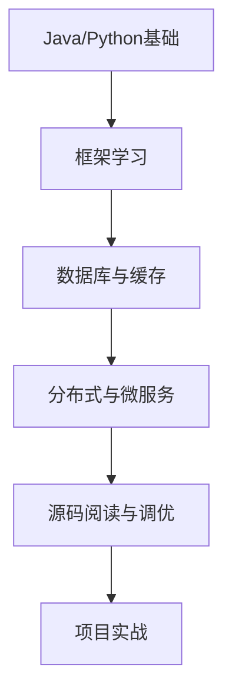

# 💻 wychmod 技术知识库

  

    
    
    
    
  

> 👨‍💻 **关于我**：24届计算机研究生，Java与Python双语言全栈开发者
> 
> 📚 **知识范围**：涵盖后端、前端、算法、系统设计、AI等全栈知识
> 
> 🎯 **学习目标**：源码剖析与实战结合，手写Spring、协程库，打造系统化技术体系

---

## 💻 交互式命令行导航

  

    

      

      

      

    

    
wychmod@knowledge-base:~

    

  

  

    
👋 欢迎使用命令行导航系统！

    
$ help

    

      
可用命令：

      

        ● ls - 列出文档目录 
        ● cd &lt;目录&gt; - 切换目录 
        ● cat &lt;文件&gt; - 查看文档内容 
        ● find &lt;关键词&gt; - 搜索文档 
        ● tree - 显示目录树 
      

    

    

      
⚡ 快速开始

      

        1. 点击右下角金色按钮 ►_ 打开终端 
        2. 或按 Ctrl+K 快捷键 
        3. 输入 ls 查看所有分类 
        4. 输入 fortune 获取技术名言
      

    

  

---

## 📖 快速导航

### 📚 后端开发

<b>🔥 Java 技术栈</b>

- **基础与框架**
  - [Java基本功](/md/java/Java学习路线/Java基本功.md) | [Java集合框架](/md/java/Java学习路线/Java集合框架.md)
  - [IOC和AOP](/md/java/IOC和AOP.md) | [MVC模式](/md/java/MVC模式.md) | [Servlet](/md/java/Servlet.md)

- **Spring 源码解析**
  - [300行手写简易Spring](/md/spring源码/1-300行手写简易Spring.md)
  - [手写完整功能Spring](/md/spring源码/2-手写完整功能Spring.md)
  - [Spring源码解析](/md/spring源码/3-Spring源码解析.md)
  - [Spring事务传播原理](/md/spring源码/4-Spring事务传播原理及数据库事务操作原理.md)

- **Spring 生态**
  - [SpringBoot实战和原理](/md/java/springboot/SpringBoot实战和原理.md)
  - [SpringCloud微服务](/md/java/springcloud/SpringCloud.md)
  - [SSM整合学习](/md/java/spring系列学习/ssm整合学习-Spring.md)

- **JVM 调优**
  - [JVM实战-加载链接初始化](/md/JVM/JVM实战-1-加载链接初始化.md)
  - [JVM实战-JMM](/md/JVM/JVM实战-2-JMM.md)
  - [JVM实战-GC](/md/JVM/JVM实战-3-GC.md)
  - [JVM实战-调优](/md/JVM/JVM实战-4-调优.md)

- **项目实战**
  - [手写RPC框架](/md/java/手写RPC/1-RPC架构设计.md)
  - [抽奖系统实战](/md/java/抽奖系统/Lottery%20抽奖系统-大厂规范.md)

<b>🐍 Python 技术栈</b>

- **Python 高级编程**
  - [一切皆对象](/md/Python/Python高级/1.一切皆对象.md) | [魔法函数](/md/Python/Python高级/2.魔法函数.md) | [类和对象](/md/Python/Python高级/3.类和对象.md)
  - [迭代器和生成器](/md/Python/Python高级/8.迭代器和生成器.md)
  - [多线程、多进程和线程池](/md/Python/Python高级/10.多线程、多进程和线程池编程.md)
  - [协程和异步io](/md/Python/Python高级/11.协程和异步io.md) | [asyncio并发编程](/md/Python/Python高级/12.asyncio并发编程.md)

- **Python 源码剖析**
  - [对象模型](/md/Python/Python源码剖析/Python源码剖析-1-对象模型.md) | [对象的生命周期](/md/Python/Python源码剖析/Python源码剖析-2-对象的生命周期.md)
  - [内建对象系列](/md/Python/Python源码剖析/Python源码剖析-7-内建对象list.md)
  - [虚拟机的字节码](/md/Python/Python源码剖析/Python源码剖析-12-虚拟机的字节码.md)
  - [GIL全局锁](/md/Python/Python源码剖析/Python源码剖析-15-GIL全局锁.md)
  - [设计协程库](/md/Python/Python源码剖析/Python源码剖析-30-造轮子：设计协程库.md)
  - [垃圾回收机制](/md/Python/Python源码剖析/Python源码剖析-34-垃圾回收机制.md)

- **Web 框架**
  - [Django全栈开发](/md/Django笔记/Djangoday1整体跑通.md) | [Django REST Framework](/md/Django笔记/django-rest-framework开发笔记.md)
  - [Flask快速开发](/md/flask笔记/flask模型.md) | [Flask上线部署](/md/flask笔记/flask上线部署.md)

<b>🐹 Go 语言</b>

- [Go语言上手-基础语言](/md/go/Go语言上手-基础语言.md)
- [Go语言上手-工程实践](/md/go/Go语言上手-工程实践.md)
- [Go语言上手-编码规范和性能调优](/md/go/Go语言上手-编码规范和性能调优.md)
- [GORM与database](/md/go/GORM与database.md)

### 💾 数据存储与中间件

<b>MySQL 数据库</b>

- [MySQL性能优化-架构](/md/mysql/MySQL性能优化-架构.md)
- [MySQL性能优化-索引](/md/mysql/MySQL性能优化-索引.md)
- [MySQL性能优化-事务](/md/mysql/MySQL性能优化-事务.md)
- [MySQL是怎样使用的](/md/mysql/MySQL是怎样使用的.md) | [MySQL是怎样运行的](/md/mysql/MySQL是怎样运行的.md)

<b>Redis 缓存</b>

- [Redis入门](/md/Redis/1-Redis入门.md) | [Redis实战](/md/Redis/2-Redis实战.md) | [原理篇](/md/Redis/3-原理篇.md)
- [Redis高级-多级缓存](/md/Redis/Redis高级-多级缓存.md)
- [Redis高级-分布式缓存](/md/Redis/Redis高级-分布式缓存.md)
- [Redis高级-最佳实践](/md/Redis/Redis高级-最佳实践.md)

<b>消息队列</b>

- [RabbitMQ](/md/消息队列/RabbitMQ.md)
- [RocketMQ设计与原理](/md/消息队列/RocketMQ设计与原理.md) | [RocketMQ源码分析](/md/消息队列/RocketMQ源码分析.md)

<b>Elasticsearch</b>

- [elasticsearch分布式搜索引擎](/md/elk/elasticsearch分布式搜索引擎.md)
- [安装elasticsearch](/md/elk/安装elasticsearch.md)

<b>Zookeeper</b>

- [Zookeeper基础](/md/zookeeper/Zookeeper基础.md)
- [Zookeeper源码](/md/zookeeper/Zookeeper源码.md)

### ⚛️ 前端开发

<b>React 生态</b>

- [React16基础](/md/React/React基础（技术胖）/React16基础.md)
- [Redux入门](/md/React/React基础（技术胖）/Redux入门.md) | [Redux2](/md/React/React基础（技术胖）/Redux2.md)
- [React-taro小程序开发](/md/React-taro/React-taro基本知识.md)

<b>Vue 框架</b>

- [Vue3+Vue-CLI项目搭建](/md/vue/Vue3+Vue-CLI项目搭建.md)

### ☁️ 运维与云原生

<b>Docker & Kubernetes</b>

- [Docker容器化](/md/docker/docker.md)
- [Kubernetes编排](/md/k8s/1-k8s的介绍.md)
- [CI/CD实践](/md/cicd/1.%20什么是CI和CD，为什么要学CI和CD.md)

<b>Linux 运维</b>

- [Linux常用命令](/md/linux/Linux常用命令.md)
- [Linux基础知识和命令](/md/linux/Linux核心技能与应用/Linux基础知识和命令.md)
- [Shell脚本编程](/md/linux/Linux核心技能与应用/Shell脚本编程.md)

### 💻 计算机基础

<b>算法与数据结构</b>

- [算法笔记](/md/算法/左神从0学算法/算法笔记.md)

<b>计算机系统</b>

- [操作系统](/md/计算机基础/操作系统.md) | [计算机网络](/md/计算机基础/计算机网络.md) | [计算机组成原理](/md/计算机基础/计算机组成原理.md)
- [深入理解tcp协议](/md/计算机基础/深入理解tcp协议.md) | [HTTP协议详解](/md/计算机基础/HTTP协议详解.md)
- [多线程与并发编程](/md/多线程与高并发/多线程与并发编程.md)

### 🧠 人工智能

<b>机器学习与深度学习</b>

- **机器学习基础**
  - [线性代数基础](/md/人工智能/人工智能-奈学/1-线性代数基础.md) | [概率论基础](/md/人工智能/人工智能-奈学/2-概率论基础.md)
  - [机器学习简介](/md/人工智能/人工智能-奈学/3-机器学习简介.md)
  - [线性模型](/md/人工智能/人工智能-奈学/5-线性模型.md) | [决策树](/md/人工智能/人工智能-奈学/6-决策树.md) | [支持向量机](/md/人工智能/人工智能-奈学/9-支持向量机.md)

- **深度学习**
  - [深度学习基本知识](/md/人工智能/人工智能-奈学/11-深度学习-基本知识.md)
  - [Tensorflow与Keras](/md/人工智能/人工智能-奈学/12-深度学习-开始使用Tensorflow.md)
  - [动手学深度学习系列](/md/人工智能/动手学深度学习/动深-1-前言.md)

- **AI Agent**
  - [agent五种设计模式](/md/agent/agent五种设计模式.md)
  - [A2A协议技术学习笔记](/md/agent/A2A协议技术学习笔记.md)

### 🛠️ 软件工程

<b>系统设计与测试</b>

- [设计模式](/md/系统设计/设计模式.md)
- [软件测试基础](/md/软件测试/测试基础/测试基础知识.md)

### 🔧 开发工具

<b>Git 版本控制</b>

- [git命令笔记](/md/git/git命令笔记.md)
- [learn-git-branching](/md/git/learn-git-branching.md)

### 💼 面试求职

<b>面试准备</b>

- [Java面试汇总](/md/面试/Java面试汇总.md)
- [Python面试](/md/面试/python面试.md) | [Python服务器端面试](/md/面试/python服务器端面试.md)
- [实习面试准备](/md/面试/实习面试准备.md)

---

## 🎯 学习路线

### 🚀 后端工程师成长路径

### 🎓 学习建议

1. **基础先行**：打牢语言基础，掌握数据结构与算法
2. **框架实践**：Spring、Django/Flask框架实战
3. **源码阅读**：深入理解框架原理，提升技术深度
4. **项目驱动**：通过实战项目巩固知识体系
5. **持续学习**：关注新技术、新趋势，保持技术敏锐度

---

## 💬 联系方式

- **GitHub**: [https://github.com/wychmod](https://github.com/wychmod)
- **项目仓库**: [https://github.com/wychmod/wychmod.github.io](https://github.com/wychmod/wychmod.github.io)

---

  
⭐ 如果这个项目对你有帮助，欢迎 Star 支持！

  
© 2024 wychmod. All rights reserved.

---
## Mysql调优
- [MySQL性能优化-架构](/md/mysql/MySQL性能优化-架构.md)
- [MySQL性能优化-索引](/md/mysql/MySQL性能优化-索引.md)
- [MySQL性能优化-事务](/md/mysql/MySQL性能优化-事务.md)
- [MySQL性能优化-总结](/md/mysql/MySQL性能优化-总结.md)
- [MySQL是怎样使用的](/md/mysql/MySQL是怎样使用的.md)

## Spring源码解析
- [1-300行手写简易Spring](/md/spring源码/1-300行手写简易Spring.md)
- [2-手写完整功能Spring](/md/spring源码/2-手写完整功能Spring.md)
- [3-Spring源码解析](/md/spring源码/3-Spring源码解析.md)
- [4-Spring事务传播原理及数据库事务操作原理](/md/spring源码/4-Spring事务传播原理及数据库事务操作原理.md)

## Redis
- [1-Redis入门](/md/Redis/1-Redis入门.md)
- [2-Redis实战](/md/Redis/2-Redis实战.md)
- [3-原理篇](/md/Redis/3-原理篇.md)
- [Redis高级-多级缓存](/md/Redis/Redis高级-多级缓存.md)
- [Redis高级-分布式缓存](/md/Redis/Redis高级-分布式缓存.md)
- [Redis高级-最佳实践](/md/Redis/Redis高级-最佳实践.md)

## Java多线程与并发编程
- [多线程与并发编程](/md/多线程与高并发/多线程与并发编程.md)

## 操作系统
- [操作系统](/md/计算机基础/操作系统.md)
- [计算机组成原理](/md/计算机基础/计算机组成原理.md)
- [计算机网络](/md/计算机基础/计算机网络.md)
- [深入理解tcp协议](/md/计算机基础/深入理解tcp协议.md)
- [HTTP协议详解](/md/计算机基础/HTTP协议详解.md)

## Django(Python后端开发框架)
- [Django(MRO)](/md/Django笔记/Django(MRO).md)
- [django-rest-framework开发笔记](/md/Django笔记/django-rest-framework开发笔记.md)
- [Djangoday1整体跑通](/md/Django笔记/Djangoday1整体跑通.md)
- [Django-2视图](/md/Django笔记/Django-2视图.md)
- [Djangoday3模板](/md/Django笔记/Djangoday3模板.md)
- [Djangoday4模型](/md/Django笔记/Djangoday4模型.md)
- [Djangoday5缓存发送邮件用户登录注册](/md/Django笔记/Djangoday5缓存发送邮件用户登录注册.md)
- [Djangoday6admin站点配置用户认证user](/md/Django笔记/Djangoday6admin站点配置用户认证user.md)
- [Djangoday7Advaced](/md/Django笔记/Djangoday7Advaced.md)
- [Djangoday8日志](/md/Django笔记/Djangoday8日志.md)
- [django上线部署](/md/Django笔记/django上线部署.md)
- [多种Python虚拟环境的安装](/md/Django笔记/多种Python虚拟环境的安装.md)

## electron
- [electron开发初步——开发一个音乐播放软件](/md/electron/electron开发初步——开发一个音乐播放软件.md)

## flask(Python后端开发框架)
- [flask模型](/md/flask笔记/flask模型.md)
- [flask模板](/md/flask笔记/flask模板.md)
- [flask表单](/md/flask笔记/flask表单.md)
- [flask视图函数](/md/flask笔记/flask视图函数.md)
- [flask_redirct_蓝图](/md/flask笔记/flask_redirct_蓝图.md)
- [flask文件上传邮件发送](/md/flask笔记/flask文件上传邮件发送.md)
- [在Flask应用中使用gevent-brifuture](/md/flask笔记/在Flask应用中使用gevent-brifuture.md)

## git
- [git命令笔记](/md/git/git命令笔记.md)

## linux
- [Linux常用命令](/md/linux/Linux常用命令.md)
- [快速创建linux虚拟机](/md/linux/快速创建linux虚拟机.md)
- [Linux基础知识和命令](/md/linux/Linux核心技能与应用/Linux基础知识和命令.md)
- [Linux进阶知识和命令](/md/linux/Linux核心技能与应用/Linux进阶知识和命令.md)
- [Shell脚本编程](/md/linux/Linux核心技能与应用/Shell脚本编程.md)
- [Vim文本编辑与版本控制](/md/linux/Linux核心技能与应用/Vim文本编辑与版本控制.md)
- [管理服务器和服务](/md/linux/Linux核心技能与应用/管理服务器和服务.md)
- [网络和安全](/md/linux/Linux核心技能与应用/网络和安全.md)
- [远程连接和SSH](/md/linux/Linux核心技能与应用/远程连接和SSH.md)

## Python
- [anaconda中使用虚拟环境](/md/Python/anaconda中使用虚拟环境.md)
- [python命名规范](/md/Python/python命名规范.md)

### Python源码剖析
- [Python源码剖析-1-对象模型](/md/Python/Python源码剖析/Python源码剖析-1-对象模型.md)
- [Python源码剖析-2-对象的生命周期](/md/Python/Python源码剖析/Python源码剖析-2-对象的生命周期.md)
- [Python源码剖析-3-内建对象float](/md/Python/Python源码剖析/Python源码剖析-3-内建对象float.md)
- [Python源码剖析-4-内建对象int](/md/Python/Python源码剖析/Python源码剖析-4-内建对象int.md)
- [Python源码剖析-5-内建对象bytes](/md/Python/Python源码剖析/Python源码剖析-5-内建对象bytes.md)
- [Python源码剖析-6-内建对象str](/md/Python/Python源码剖析/Python源码剖析-6-内建对象str.md)
- [Python源码剖析-7-内建对象list](/md/Python/Python源码剖析/Python源码剖析-7-内建对象list.md)
- [Python源码剖析-8-内建对象dict](/md/Python/Python源码剖析/Python源码剖析-8-内建对象dict.md)
- [Python源码剖析-9-内建对象背后的思想-面试](/md/Python/Python源码剖析/Python源码剖析-9-内建对象背后的思想-面试.md)
- [Python源码剖析-10-最佳实践：灵活运用内建容器](/md/Python/Python源码剖析/Python源码剖析-10-最佳实践：灵活运用内建容器.md)
- [Python源码剖析-11-开发实战：基于最小堆设计任务调度系统](/md/Python/Python源码剖析/Python源码剖析-11-开发实战：基于最小堆设计任务调度系统.md)
- [Python源码剖析-12-虚拟机的字节码](/md/Python/Python源码剖析/Python源码剖析-12-虚拟机的字节码.md)
- [Python源码剖析-13-作用域与名字空间](/md/Python/Python源码剖析/Python源码剖析-13-作用域与名字空间.md)
- [Python源码剖析-14-虚拟机和CPU](/md/Python/Python源码剖析/Python源码剖析-14-虚拟机和CPU.md)
- [Python源码剖析-15-GIL全局锁](/md/Python/Python源码剖析/Python源码剖析-15-GIL全局锁.md)
- [Python源码剖析-16-import 模块动态加载](Python/Python源码剖析/Python源码剖析-16-import%20模块动态加载.md)
- [Python源码剖析-17-虚拟机面试](/md/Python/Python源码剖析/Python源码剖析-17-虚拟机面试.md)
- [Python源码剖析-18-函数对象](/md/Python/Python源码剖析/Python源码剖析-18-函数对象.md)
- [Python源码剖析-19-面试：嵌套函数、闭包与装饰器](/md/Python/Python源码剖析/Python源码剖析-19-面试：嵌套函数、闭包与装饰器.md)
- [Python源码剖析-20-高阶函数和函数式编程](/md/Python/Python源码剖析/Python源码剖析-20-高阶函数和函数式编程.md)
- [Python源码剖析-21-装饰器核心解析](/md/Python/Python源码剖析/Python源码剖析-21-装饰器核心解析.md)
- [Python源码剖析-22-函数相关面试](/md/Python/Python源码剖析/Python源码剖析-22-函数相关面试.md)
- [Python源码剖析-23-类对象源码剖析](/md/Python/Python源码剖析/Python源码剖析-23-类对象源码剖析.md)
- [Python源码剖析-24-属性描述符如何影响属性行为](/md/Python/Python源码剖析/Python源码剖析-24-属性描述符如何影响属性行为.md)
- [Python源码剖析-25-魔术方法应用](/md/Python/Python源码剖析/Python源码剖析-25-魔术方法应用.md)
- [Python源码剖析-26-metaclass元类编程](/md/Python/Python源码剖析/Python源码剖析-26-metaclass元类编程.md)
- [Python源码剖析-27-如何实现代码热更新](/md/Python/Python源码剖析/Python源码剖析-27-如何实现代码热更新.md)
- [Python源码剖析-28-类和继承相关面试题](/md/Python/Python源码剖析/Python源码剖析-28-类和继承相关面试题.md)
- [Python源码剖析-29-生成器 generator](/md/Python/Python源码剖析/Python源码剖析-29-生成器%20generator.md)
- [Python源码剖析-30-造轮子：设计协程库](/md/Python/Python源码剖析/Python源码剖析-30-造轮子：设计协程库.md)
- [Python源码剖析-31-工程实践：用 asyncio 协程构建高并发应用](/md/Python/Python源码剖析/Python源码剖析-31-工程实践：用%20asyncio%20协程构建高并发应用.md)
- [Python源码剖析-32-内存池优化内存分配效率](/md/Python/Python源码剖析/Python源码剖析-32-内存池优化内存分配效率.md)
- [Python源码剖析-33-引用计数的缺陷与应对](/md/Python/Python源码剖析/Python源码剖析-33-引用计数的缺陷与应对.md)
- [Python源码剖析-34-垃圾回收机制](/md/Python/Python源码剖析/Python源码剖析-34-垃圾回收机制.md)
- [Python源码剖析-35-内存泄露诊断](/md/Python/Python源码剖析/Python源码剖析-35-内存泄露诊断.md)

### Python高级
- [1.一切皆对象](/md/Python/Python高级/1.一切皆对象.md)
- [2.魔法函数](/md/Python/Python高级/2.魔法函数.md)
- [3.类和对象](/md/Python/Python高级/3.类和对象.md)
- [4.自定义序列类](/md/Python/Python高级/4.自定义序列类.md)
- [5.深入Python的set和dict](/md/Python/Python高级/5.深入Python的set和dict.md)
- [6.对象引用、可变性和垃圾回收](/md/Python/Python高级/6.对象引用、可变性和垃圾回收.md)
- [7.元类编程](/md/Python/Python高级/7.元类编程.md)
- [8.迭代器和生成器](/md/Python/Python高级/8.迭代器和生成器.md)
- [9.socket编程](/md/Python/Python高级/9.socket编程.md)
- [10.多线程、多进程和线程池编程](/md/Python/Python高级/10.多线程、多进程和线程池编程.md)
- [11.协程和异步io](/md/Python/Python高级/11.协程和异步io.md)
- [12.asyncio并发编程](/md/Python/Python高级/12.asyncio并发编程.md)
- [python工具包](/md/Python/Python高级/python工具包.md)
- [Python精度问题](/md/Python/Python高级/Python精度问题.md)
- [理解Python装饰器(Decorator)](/md/Python/Python高级/理解Python装饰器(Decorator).md)

### Python高效
- [字典、列表、集合、元组](/md/Python/Python高效/字典、列表、集合、元组.md)
- [字符串处理相关问题](/md/Python/Python高效/字符串处理相关问题.md)
- [对象迭代与反迭代相关问题](/md/Python/Python高效/对象迭代与反迭代相关问题.md)
- [文件IO效率相关问题与解决技巧](/md/Python/Python高效/文件IO效率相关问题与解决技巧.md)
- [类与对象深度问题与解决技巧](/md/Python/Python高效/类与对象深度问题与解决技巧.md)

## 算法
- [算法笔记](/md/算法/左神从0学算法/算法笔记.md)

## React
- [React16基础](/md/React/React基础（技术胖）/React16基础.md)
- [Redux入门](/md/React/React基础（技术胖）/Redux入门.md)
- [Redux2](/md/React/React基础（技术胖）/Redux2.md)

## React taro
- [React-taro基本知识](/md/React-taro/React-taro基本知识.md)
- [React-taro环境搭建](/md/React-taro/React-taro环境搭建.md)
- [taro-技术选型](/md/React-taro/taro-技术选型.md)
- [taro-自带方法](/md/React-taro/taro-自带方法.md)
- [Taro-设计思想及架构](/md/React-taro/Taro-设计思想及架构.md)

## Vue
- [Vue3+Vue-CLI项目搭建](/md/vue/Vue3+Vue-CLI项目搭建.md)

## 人工智能
- [1-线性代数基础](/md/人工智能/人工智能-奈学/1-线性代数基础.md)
- [2-概率论基础](/md/人工智能/人工智能-奈学/2-概率论基础.md)
- [3-机器学习简介](/md/人工智能/人工智能-奈学/3-机器学习简介.md)
- [4-模型评估与选择](/md/人工智能/人工智能-奈学/4-模型评估与选择.md)
- [5-线性模型](/md/人工智能/人工智能-奈学/5-线性模型.md)
- [6-决策树](/md/人工智能/人工智能-奈学/6-决策树.md)
- [7-数据预处理](/md/人工智能/人工智能-奈学/7-数据预处理.md)
- [8-plot decision regions相关](/md/人工智能/人工智能-奈学/8-plot decision regions相关.md)
- [9-支持向量机](/md/人工智能/人工智能-奈学/9-支持向量机.md)
- [10-神经网络](/md/人工智能/人工智能-奈学/10-神经网络.md)
- [11-深度学习-基本知识](/md/人工智能/人工智能-奈学/11-深度学习-基本知识.md)
- [12-深度学习-开始使用Tensorflow](/md/人工智能/人工智能-奈学/12-深度学习-开始使用Tensorflow.md)
- [13-深度学习-keras知识](/md/人工智能/人工智能-奈学/13-深度学习-keras知识.md)
- [14-深度学习-Tensorflow例子](/md/人工智能/人工智能-奈学/14-深度学习-Tensorflow例子.md)
- [15-深度学习-循环神经网络](/md/人工智能/人工智能-奈学/15-深度学习-循环神经网络.md)
- [16-深度学习-自然语言处理nlp](/md/人工智能/人工智能-奈学/16-深度学习-自然语言处理nlp.md)

## 深度学习
- [动深-1-前言](/md/人工智能/动手学深度学习/动深-1-前言.md)
- [动深-2-预备工作](/md/人工智能/动手学深度学习/动深-2-预备工作.md)
- [动深-3-深度学习基础](/md/人工智能/动手学深度学习/动深-3-深度学习基础.md)
- [动深-4-深度学习计算](/md/人工智能/动手学深度学习/动深-4-深度学习计算.md)
- [动深-5-卷积神经网络](/md/人工智能/动手学深度学习/动深-5-卷积神经网络.md)
- [动深-6-循环神经网络](/md/人工智能/动手学深度学习/动深-6-循环神经网络.md)
- [动深-7-优化算法](/md/人工智能/动手学深度学习/动深-7-优化算法.md)
- [动深-8-计算性能](/md/人工智能/动手学深度学习/动深-8-计算性能.md)
- [动深-9-计算机视觉](/md/人工智能/动手学深度学习/动深-9-计算机视觉.md)

## 面试

- [python面试](/md/面试/python面试.md)
- [python服务器端面试](/md/面试/python服务器端面试.md)

## 系统设计
- [设计模式](/md/系统设计/设计模式.md)

## git
- [learn-git-branching](/md/git/learn-git-branching.md)

## Java基础
- [Java基本功](/md/java/Java学习路线/Java基本功.md)
- [Java集合框架](/md/java/Java学习路线/Java集合框架.md)

## Spring
- [ssm整合学习-Spring](/md/java/spring系列学习/ssm整合学习-Spring.md)
- [ssm整合学习-SpringMVC](/md/java/spring系列学习/ssm整合学习-SpringMVC.md)
- [ssm整合学习-Mybatis](/md/java/spring系列学习/ssm整合学习-Mybatis.md)
- [ssm整合学习-Maven](/md/java/spring系列学习/ssm整合学习-Maven.md)
- [ssm整合学习-MabtisPlus](/md/java/spring系列学习/ssm整合学习-MabtisPlus.md)
- [ssm整合学习-SpringBoot](/md/java/spring系列学习/ssm整合学习-SpringBoot.md)

## SpringBoot开发与实战
- [SpringBoot实战和原理](/md/java/springboot/SpringBoot实战和原理.md)
- [springboot项目开发流程](/md/java/springboot+vue项目开发/springboot项目开发流程.md)
- [java和vue服务器部署](/md/java/springboot+vue项目开发/java和vue服务器部署.md)

## Java项目开发相关
- [雪花算法](/md/java/雪花算法.md)
- [IOC和AOP](/md/java/IOC和AOP.md)
- [MVC模式](/md/java/MVC模式.md)
- [MVC模式](/md/java/Servlet.md)

## MySQL
- [MySQL是怎样使用的](/md/mysql/MySQL是怎样使用的.md)
- [MySQL是怎样运行的](/md/mysql/MySQL是怎样运行的.md)