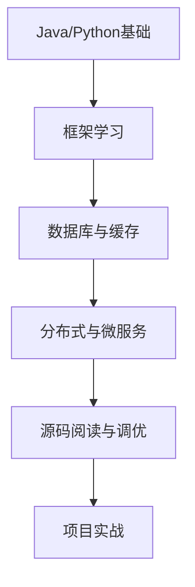

  <section class="home-band home-band-plain">
    

      <h1>让学习路线持续推进。</h1>
      
把后端、云原生、AI Agent、测试、工具链这些分散知识收敛到一个可检索、可导航、可执行的个人技术工作区。

    

    

      <a class="notion-card sky" href="#/md/java/Java学习路线/Java基本功">
        01
        <h3>后端路线</h3>
        
Java、Spring、JVM、MySQL、Redis 与分布式系统的主线知识。

      </a>
      <a class="notion-card mint" href="#/md/agent/agent五种设计模式">
        02
        <h3>AI Agent</h3>
        
Agent 设计模式、A2A、MCP、领域架构与智能系统实践。

      </a>
      <a class="notion-card lavender" href="/tools/index.html">
        03
        <h3>开发工具</h3>
        
JSON、Base64、Regex、Markdown、时间戳、项目结构分析等即用工具。

      </a>
    

  </section>

  <section class="assistant-banner">
    

      <h2>随时唤起技术助手。</h2>
      
终端式知识导航支持 <code>help</code>、<code>ls</code>、<code>find</code>、<code>cat</code>、<code>ai</code> 等命令。点击右下角 <code>&gt;_</code> 或按 <code>Ctrl + K</code>，在当前文档库里快速定位路径、主题和推荐内容。

    

    

      
<b>wychmod@knowledge-base:~</b>

      <pre>$ find Spring
Spring 源码解析
SpringBoot 实战和原理
SpringCloud 微服务

$ ai Redis 缓存一致性</pre>
    

  </section>

  <section class="home-band">
    

      <h2>把文档、工具和路线放在一起。</h2>
      
文档、工具、路线、代码片段和评论区使用统一的 Notion 风格组件系统。

    

    

      

        <h3>源码级笔记</h3>
        
围绕 Spring、JVM、CPython、Redis 内核与架构推演组织长文。

      

      

        <h3>云原生实践</h3>
        
Docker、Kubernetes、CI/CD、服务探针、配置与灰度发布。

      

      

        <h3>测试与质量</h3>
        
测试计划、用例设计、自动化、Chrome 插件与质量工程实践。

      

      

        <h3>全栈工具箱</h3>
        
高频开发转换、格式化、编辑与分析任务集中到独立工具页。

      

    

  </section>

## 快速导航

### 📚 后端开发

<b>🔥 Java 技术栈</b>

- **基础与框架**
  - [Java基本功](/md/java/Java学习路线/Java基本功.md) | [Java集合框架](/md/java/Java学习路线/Java集合框架.md)
  - [IOC和AOP](/md/java/spring系列学习/IOC和AOP.md) | [MVC模式](/md/java/Java学习路线/MVC模式.md) | [Servlet](/md/java/Java学习路线/Servlet.md)

- **Spring 源码解析**
  - [300行手写简易Spring](/md/spring源码/1-300行手写简易Spring.md)
  - [手写完整功能Spring](/md/spring源码/2-手写完整功能Spring.md)
  - [Spring源码解析](/md/spring源码/3-Spring源码解析.md)
  - [Spring事务传播原理](/md/spring源码/4-Spring事务传播原理及数据库事务操作原理.md)

- **Spring 生态**
  - [SpringBoot实战和原理](/md/java/springboot/SpringBoot实战和原理.md)
  - [SpringCloud微服务](/md/java/springcloud/SpringCloud.md)
  - [SSM整合学习](/md/java/spring系列学习/ssm整合学习-Spring.md)

- **JVM 调优**
  - [JVM实战-加载链接初始化](/md/JVM/JVM实战-1-加载链接初始化.md)
  - [JVM实战-JMM](/md/JVM/JVM实战-2-JMM.md)
  - [JVM实战-GC](/md/JVM/JVM实战-3-GC.md)
  - [JVM实战-调优](/md/JVM/JVM实战-4-调优.md)

- **项目实战**
  - [手写RPC框架](/md/java/手写RPC/1-RPC架构设计.md)
  - [抽奖系统实战](/md/java/抽奖系统/Lottery%20抽奖系统-大厂规范.md)

<b>🐍 Python 技术栈</b>

- **Python 高级编程**
  - [一切皆对象](/md/Python/Python高级/1.一切皆对象.md) | [魔法函数](/md/Python/Python高级/2.魔法函数.md) | [类和对象](/md/Python/Python高级/3.类和对象.md)
  - [迭代器和生成器](/md/Python/Python高级/8.迭代器和生成器.md)
  - [多线程、多进程和线程池](/md/Python/Python高级/10.多线程、多进程和线程池编程.md)
  - [协程和异步io](/md/Python/Python高级/11.协程和异步io.md) | [asyncio并发编程](/md/Python/Python高级/12.asyncio并发编程.md)

- **Python 源码剖析**
  - [对象模型](/md/Python/Python源码剖析/Python源码剖析-1-对象模型.md) | [对象的生命周期](/md/Python/Python源码剖析/Python源码剖析-2-对象的生命周期.md)
  - [内建对象系列](/md/Python/Python源码剖析/Python源码剖析-7-内建对象list.md)
  - [虚拟机的字节码](/md/Python/Python源码剖析/Python源码剖析-12-虚拟机的字节码.md)
  - [GIL全局锁](/md/Python/Python源码剖析/Python源码剖析-15-GIL全局锁.md)
  - [设计协程库](/md/Python/Python源码剖析/Python源码剖析-30-造轮子：设计协程库.md)
  - [垃圾回收机制](/md/Python/Python源码剖析/Python源码剖析-34-垃圾回收机制.md)

- **Web 框架**
  - [Django全栈开发](/md/Django笔记/Djangoday1整体跑通.md) | [Django REST Framework](/md/Django笔记/django-rest-framework开发笔记.md)
  - [Flask快速开发](/md/flask笔记/flask模型.md) | [Flask上线部署](/md/flask笔记/flask上线部署.md)

<b>🐹 Go 语言</b>

- [Go语言上手-基础语言](/md/go/Go语言上手-基础语言.md)
- [Go语言上手-工程实践](/md/go/Go语言上手-工程实践.md)
- [Go语言上手-编码规范和性能调优](/md/go/Go语言上手-编码规范和性能调优.md)
- [GORM与database](/md/go/GORM与database.md)

### 💾 数据存储与中间件

<b>MySQL 数据库</b>

- [MySQL性能优化-架构](/md/mysql/MySQL性能优化-架构.md)
- [MySQL性能优化-索引](/md/mysql/MySQL性能优化-索引.md)
- [MySQL性能优化-事务](/md/mysql/MySQL性能优化-事务.md)
- [MySQL是怎样使用的](/md/mysql/MySQL是怎样使用的.md) | [MySQL是怎样运行的](/md/mysql/MySQL是怎样运行的.md)

<b>Redis 缓存</b>

- [Redis入门](/md/Redis/1-Redis入门.md) | [Redis实战](/md/Redis/2-Redis实战.md) | [原理篇](/md/Redis/3-原理篇.md)
- [Redis高级-多级缓存](/md/Redis/Redis高级-多级缓存.md)
- [Redis高级-分布式缓存](/md/Redis/Redis高级-分布式缓存.md)
- [Redis高级-最佳实践](/md/Redis/Redis高级-最佳实践.md)

<b>消息队列</b>

- [RabbitMQ](/md/消息队列/RabbitMQ.md)
- [RocketMQ设计与原理](/md/消息队列/RocketMQ设计与原理.md) | [RocketMQ源码分析](/md/消息队列/RocketMQ源码分析.md)

<b>Elasticsearch</b>

- [elasticsearch分布式搜索引擎](/md/elk/elasticsearch分布式搜索引擎.md)
- [安装elasticsearch](/md/elk/安装elasticsearch.md)

<b>Zookeeper</b>

- [Zookeeper基础](/md/zookeeper/Zookeeper基础.md)
- [Zookeeper源码](/md/zookeeper/Zookeeper源码.md)

### ⚛️ 前端开发

<b>React 生态</b>

- [React16基础](/md/React/React基础（技术胖）/React16基础.md)
- [Redux入门](/md/React/React基础（技术胖）/Redux入门.md) | [Redux2](/md/React/React基础（技术胖）/Redux2.md)
- [React-taro小程序开发](/md/React-taro/React-taro基本知识.md)

<b>Vue 框架</b>

- [Vue3+Vue-CLI项目搭建](/md/vue/Vue3+Vue-CLI项目搭建.md)

### ☁️ 运维与云原生

<b>Docker & Kubernetes</b>

- [Docker容器化](/md/docker/docker.md)
- [Kubernetes编排](/md/k8s/1-k8s的介绍.md)
- [CI/CD实践](/md/cicd/1.什么是CI和CD，为什么要学CI和CD.md)

<b>Linux 运维</b>

- [Linux常用命令](/md/linux/Linux常用命令.md)
- [Linux基础知识和命令](/md/linux/Linux核心技能与应用/Linux基础知识和命令.md)
- [Shell脚本编程](/md/linux/Linux核心技能与应用/Shell脚本编程.md)

### 💻 计算机基础

<b>算法与数据结构</b>

- [算法笔记](/md/算法/lb算法小抄笔记/算法小抄笔记.md)

<b>计算机系统</b>

- [操作系统](/md/计算机基础/操作系统.md) | [计算机网络](/md/计算机基础/计算机网络.md) | [计算机组成原理](/md/计算机基础/计算机组成原理.md)
- [深入理解tcp协议](/md/计算机基础/深入理解tcp协议.md) | [HTTP协议详解](/md/计算机基础/HTTP协议详解.md)
- [多线程与并发编程](/md/多线程与高并发/多线程与并发编程.md)

### 🤖 AI AGENT

<b>Agent 方法论与协议实践</b>

- **Agent 核心**
  - [AI方法论](md/agent/agent开发知识/AI方法论.md) | [agent五种设计模式](md/agent/agent系统知识/agent五种设计模式.md)
  - [多Agent协作系统优劣势与性能](md/agent/agent系统知识/多Agent协作系统优劣势与性能.md)
  - [manus架构设计](md/agent/agent系统知识/manus架构设计.md)
  - [claude.md模板](md/agent/agent开发知识/claude.md模板.md)

- **协议与工程**
  - [MCP协议完整教程：从入门到实践](md/agent/agent系统知识/MCP协议完整教程：从入门到实践.md)
  - [A2A协议技术学习笔记](md/agent/agent系统知识/A2A协议技术学习笔记.md)
  - [领域驱动设计DDD架构初识与落地](md/agent/agent系统知识/领域驱动设计DDD架构初识与落地.md)
  - [Alembic数据库迁移完整教程](md/agent/agent系统知识/Alembic数据库迁移完整教程.md)

<b>大模型应用与基础</b>

- [大模型基础：理论与技术的演进](/md/人工智能/gpt大模型应用/1-大模型基础：理论与技术的演进.md)
- [大模型开发基础：OpenAI Embedding](/md/人工智能/gpt大模型应用/2-大模型开发基础：OpenAI%20Embedding.md)

<b>机器学习与深度学习基础</b>

- **机器学习基础**
  - [线性代数基础](/md/人工智能/人工智能-奈学/1-线性代数基础.md) | [概率论基础](/md/人工智能/人工智能-奈学/2-概率论基础.md)
  - [机器学习简介](/md/人工智能/人工智能-奈学/3-机器学习简介.md) | [模型评估与选择](/md/人工智能/人工智能-奈学/4-模型评估与选择.md)
  - [线性模型](/md/人工智能/人工智能-奈学/5-线性模型.md) | [决策树](/md/人工智能/人工智能-奈学/6-决策树.md) | [支持向量机](/md/人工智能/人工智能-奈学/9-支持向量机.md)
  - [数据预处理](/md/人工智能/人工智能-奈学/7-数据预处理.md) | [plot_decision_regions相关](/md/人工智能/人工智能-奈学/8-plot_decision_regions相关.md)

- **深度学习**
  - [神经网络](/md/人工智能/人工智能-奈学/10-神经网络.md) | [深度学习基本知识](/md/人工智能/人工智能-奈学/11-深度学习-基本知识.md)
  - [Tensorflow与Keras](/md/人工智能/人工智能-奈学/12-深度学习-开始使用Tensorflow.md) | [Keras知识](/md/人工智能/人工智能-奈学/13-深度学习-keras知识.md)
  - [Tensorflow例子](/md/人工智能/人工智能-奈学/14-深度学习-Tensorflow例子.md)
  - [循环神经网络](/md/人工智能/人工智能-奈学/15-深度学习-循环神经网络.md) | [自然语言处理NLP](/md/人工智能/人工智能-奈学/16-深度学习-自然语言处理nlp.md)

<b>动手学深度学习</b>

- [前言](/md/人工智能/动手学深度学习/动深-1-前言.md) | [预备工作](/md/人工智能/动手学深度学习/动深-2-预备工作.md)
- [深度学习基础](/md/人工智能/动手学深度学习/动深-3-深度学习基础.md) | [深度学习计算](/md/人工智能/动手学深度学习/动深-4-深度学习计算.md)
- [卷积神经网络](/md/人工智能/动手学深度学习/动深-5-卷积神经网络.md) | [循环神经网络](/md/人工智能/动手学深度学习/动深-6-循环神经网络.md)
- [优化算法](/md/人工智能/动手学深度学习/动深-7-优化算法.md) | [计算性能](/md/人工智能/动手学深度学习/动深-8-计算性能.md) | [计算机视觉](/md/人工智能/动手学深度学习/动深-9-计算机视觉.md)

<b>视觉模型与工程实践</b>

- [AI人工智能-目标检测模型一览](/md/人工智能/AI人工智能-目标检测模型一览.md)
- [Yolov5核心基础知识](/md/人工智能/Yolov5核心基础知识.md)
- [一维卷积神经网络Conv1D](/md/人工智能/一维卷积神经网络Conv1D.md)
- [批标准化 Batch Normalization](/md/人工智能/批标准化%20%28Batch%20Normalization%29.md)
- [深度学习报错解决方案](/md/人工智能/深度学习报错解决方案.md)
- [基于Python玩转人工智能框架](/md/人工智能/基于Python玩转人工智能框架/基于Python玩转人工智能框架-人工智能基础知识-1.md)
- [论文阅读笔记-吴恩达ecg论文](/md/人工智能/论文阅读笔记-吴恩达ecg论文.md)
- [LBP特征及其变体和python实现](/md/人工智能/LBP特征及其变体和python实现.pdf)

### 🛠️ 软件工程

<b>系统设计与测试</b>

- [设计模式](/md/系统设计/设计模式.md)
- [软件测试基础](/md/软件测试/测试基础/软件测试基础知识.md)

### 🔧 开发工具

<b>Git 版本控制</b>

- [git命令笔记](/md/git/git命令笔记.md)
- [learn-git-branching](/md/git/learn-git-branching.md)

### 💼 面试求职

<b>面试准备</b>

- [Java面试汇总](/md/面试/Java面试汇总.md)
- [Python面试](/md/面试/python面试.md) | [Python服务器端面试](/md/面试/python服务器端面试.md)
- [实习面试准备](/md/面试/实习面试准备.md)

---

## 🎯 学习路线

### 🚀 后端工程师成长路径

```mermaid
graph TB
    A[Java/Python基础] --> B[框架学习]
    B --> C[数据库与缓存]
    C --> D[分布式与微服务]
    D --> E[源码阅读与调优]
    E --> F[项目实战]
```

### 🎓 学习建议

1. **基础先行**：打牢语言基础，掌握数据结构与算法
2. **框架实践**：Spring、Django/Flask框架实战
3. **源码阅读**：深入理解框架原理，提升技术深度
4. **项目驱动**：通过实战项目巩固知识体系
5. **持续学习**：关注新技术、新趋势，保持技术敏锐度

---

## 💬 联系方式

- **GitHub**: [https://github.com/wychmod](https://github.com/wychmod)
- **项目仓库**: [https://github.com/wychmod/wychmod.github.io](https://github.com/wychmod/wychmod.github.io)

---

  
⭐ 如果这个项目对你有帮助，欢迎 Star 支持！

  
© 2024 wychmod. All rights reserved.

---
