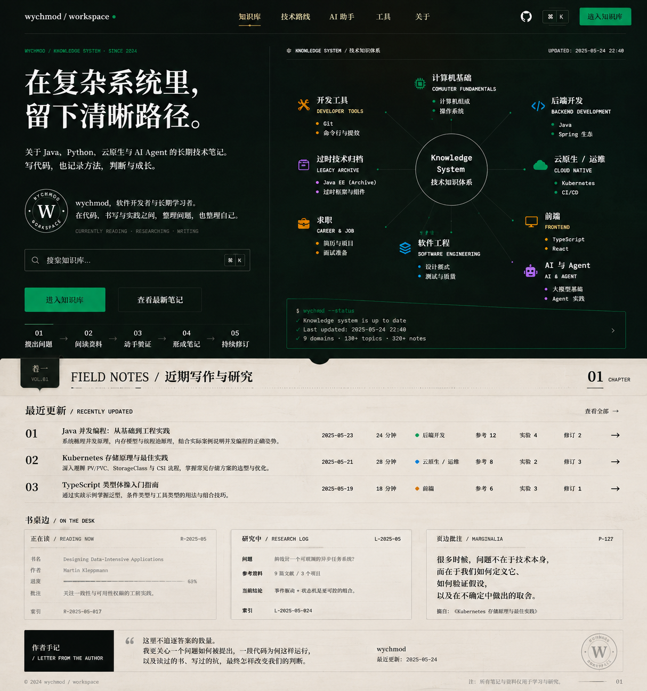

# 首页视觉系统与实现规范

> **文档状态**：V1.0，已冻结的实现基线  
> **最后更新**：2026-07-27  
> **适用范围**：Docsify 首页、全局顶部导航、首页搜索、知识图谱、首页终端入口、首页内容区，以及后续从首页视觉系统派生的页面  
> **权威级别**：本文件是首页设计与实现的单一事实来源。根目录 `DESIGN.md` 仅保留为历史 Notion 风格参考；两者冲突时，以本文件为准。



> 说明：`docs/_meta/assets/homepage-design-reference-v1.png` 才是当前首页的权威视觉参考图。本阶段仅把它作为首页冻结基线和后续页面的风格母体，首页本身先不改造；除非用户明确重新开启首页任务，否则不要修改首页实现文件。

---

## 1. 文档目的

本文件同时承担四项职责：

1. **设计文档**：解释首页为什么这样设计，明确审美方向、内容层级、色彩、字体、布局、动效和响应式规则。
2. **实现文档**：把设计稿映射到当前 Docsify 代码，明确文件边界、组件结构、数据来源、交互契约和分阶段实施方案。
3. **验收文档**：为桌面端、平板端和移动端提供可执行的检查清单，防止“看起来差不多”成为验收标准。
4. **AI Harness**：约束后续 AI 模型先读取规范、再声明设计规格、实施、截图验证和回写规范，避免风格随着多次修改逐渐漂移。

本文件不是图片生成提示词，也不是一次性的视觉说明。它必须能够独立指导另一个大模型在不依赖本次会话的情况下完成首页开发。

---

## 2. 决策摘要

### 2.1 一句话定位

首页是一个“研究者的数字书房”：上半部呈现技术知识结构与工程实践，下半部呈现阅读、研究、写作和持续修订。

### 2.2 核心叙事

```text
知识结构（深色）
    ↓
提出问题 → 阅读资料 → 动手验证 → 形成笔记 → 持续修订
    ↓
研究内页（纸白）
```

深色与浅色不是暗黑模式和亮色模式的简单拼接，而是两种内容语义：

| 区域 | 语义 | 主要内容 |
|---|---|---|
| 暖石墨封面 | 系统、代码、工具、关系 | 作者定位、搜索、知识图谱、终端入口 |
| 灰纸白内页 | 阅读、写作、批注、修订 | 最近更新、研究日志、阅读索引、作者手记 |
| 章节装订带 | 从结构进入内容 | `FIELD NOTES / 近期写作与研究` |

### 2.3 必须保留的现有能力

- Docsify hash 路由和 `_coverpage.md` 机制。
- 站内全文搜索及首页搜索桥接。
- 右下角终端触发器和完整终端弹窗。
- `Ctrl + K` / `Cmd + K` 打开终端，`Esc` 关闭终端。
- 终端已有的 `help`、`ls`、`cd`、`cat`、`find`、`tree`、`stats`、`recent`、`ai` 等命令。
- 9 大知识领域、主线文档、归档、工具箱和项目维护入口。
- 文章页的侧边栏、分页、代码高亮、Mermaid、评论、阅读进度与返回顶部。

### 2.4 明确不做的事情

- 不把项目改造成 React、Vue、Vite 或其他 SPA。
- 不在首页视觉改造中升级 Docsify 或其他插件版本。
- 不重写终端命令系统。
- 不修改 `docs/md/archive/` 下的任何归档文件。
- 不把图片设计稿中的概念数据直接写入生产页面。
- 不把所有文章页一次性重做成首页的深色风格。
- 不为了视觉效果引入 Canvas、Three.js、粒子系统或沉重动画库。

---

## 3. 当前工程基线

### 3.1 技术栈

当前项目是无构建流程的静态 Docsify 站点：

| 项目 | 当前状态 |
|---|---|
| 站点框架 | Docsify 4，hash 路由 |
| 托管 | GitHub Pages |
| 页面内容 | Markdown + 内嵌 HTML |
| 样式 | `vue.css` + `modern-theme.css` |
| 交互 | `docs/index.html` 内联 JavaScript + 本地 JS 文件 |
| 搜索 | Docsify Search 插件，`paths: 'auto'` |
| 图表 | Mermaid 10.9.3 + docsify-mermaid |
| 评论 | Gitalk |
| 构建工具 | 无 `package.json`，无打包步骤 |

注意：`docs/index.html` 引用的远程主题和搜索插件路径标注为 Docsify `4.13.1`，但仓库内 `docs/assets/js/docsify.min.js` 暴露的运行时版本为 `4.10.2`。首页改造期间禁止顺手升级或替换运行时；版本统一必须另开任务并做完整回归。

### 3.2 当前文件职责

| 文件 | 当前职责 | 首页 V2 中的职责 |
|---|---|---|
| `docs/index.html` | Docsify 配置、顶部导航、终端 DOM 与终端脚本、全局插件 | 保留全局职责；增加路由状态、Lucide 初始化和首页交互桥接 |
| `docs/_coverpage.md` | 标题、搜索、标签、按钮、Notion 风格知识看板 | 重写为深色封面：作者、搜索、CTA、研究方法、9 域知识图谱、终端预览 |
| `docs/README.md` | 首页卡片、终端介绍、快速导航、维护入口 | 重写首页视觉区为纸白内页；保留并重新组织完整快速导航和维护入口 |
| `docs/assets/css/modern-theme.css` | 全站主题，2445 行，包含多层重复覆盖 | 作为遗留主题保留；首页 V2 稳定后再清理已失效的首页规则 |
| `docs/assets/js/ai-assistant.js` | 终端 AI 助手 | 不在本任务中改动 |
| `docs/_sidebar.md` | 9 大分类的文章导航 | 不改变结构；仅检查链接一致性 |
| `scripts/check-links.js` | 扫描链接 | 验证首页没有新增死链 |
| `scripts/sidebar-check.js` | 检查主线文档入口 | 验证分类导航不回归 |

### 3.3 已知的现状问题

1. 现有视觉系统是 Notion 模仿设计，主色为紫色，首页采用居中 Hero 和卡片式看板，与新的个人研究者定位冲突。
2. `modern-theme.css` 中存在多次重复的 `.cover`、`.cover-main`、`.workspace-mockup`、`:root` 等选择器，且大量使用 `!important`。继续在文件末尾追加覆盖会加重维护成本。
3. CSS 已使用 `body[data-page="README.md"]` 选择器，但当前代码没有明确设置 `data-page` 的自定义逻辑，不能依赖它始终生效。
4. 首页搜索通过 `MutationObserver`、`hashchange` 和定时器重复尝试绑定。已有 `data-bound` 防重复机制，但新交互应优先收敛到 Docsify 生命周期。
5. 终端是一个自包含 IIFE，`openTerminal` 和 `toggleTerminal` 没有导出。首页终端预览不得复制终端实现，应复用现有 `#terminal-trigger`。
6. Gitalk、页脚和“编辑此页”插件默认对首页同样执行，可能破坏纸白内页的版式，需要为首页建立明确例外。
7. 当前检查基线不是全绿：`sidebar-check.js` 通过；`check-links.js` 当前报告 8 条历史死链，其中包含归档遗留和 1 条主线图片路径问题。首页任务的底线是不得增加新死链。

### 3.4 当前真实规模基线

以下数据来自 2026-07-27 的本地扫描，仅用于实现审计，不应永久硬编码到页面：

| 指标 | 当前值 | 统计口径 |
|---|---:|---|
| 主线主题文档 | 39 | 排除 `archive/` 和 `Index.md` |
| `sidebar-check` 扫描 Markdown | 40 | 包含 `Index.md`，检查时排除该文件 |
| 归档 Markdown | 319 | `docs/md/archive/**/*.md` |
| 独立工具页 | 12 | `docs/tools/*.html`，排除工具首页 |

生产页面若展示数字，必须在实现当日重新运行统计。若无法提供稳定自动来源，应使用“9 大知识领域”“持续更新”等稳定描述，或直接隐藏数字。

---

## 4. 设计系统

### 4.1 Purpose Statement

首页服务于两类访客：第一次到访、需要快速判断内容价值的人；已经了解站点、需要搜索文档或打开工具的人。页面必须在一个首屏内同时传达作者身份、知识范围、搜索入口和研究方法，并让下一章节露出，形成继续阅读的动力。

### 4.2 Aesthetic Direction

唯一审美方向：**Editorial / magazine，研究者的数字书房**。

允许使用的描述：

- 数字学者
- 技术研究刊物
- 黑色封面与纸张内页
- 工程图谱
- 编目、索引、脚注、修订
- 安静、精密、克制、有作者性

禁止作为设计方向的描述：

- 通用“现代、简洁、高级”
- 企业 SaaS 落地页
- 赛博朋克
- 黑客终端主题站
- Notion 克隆
- 复古书店或咖啡馆
- 档案馆表单模板

### 4.3 视觉原则

1. **结构产生科技感**：通过知识关系、编号、网格、终端状态和精确排版表达技术，而不是依赖霓虹和随机代码。
2. **内容产生人文感**：通过真实头像、作者介绍、阅读痕迹、研究问题和修订记录表达人的存在，而不是堆砌书本、咖啡和手写装饰。
3. **反差具有语义**：深色是封面，纸白是内页。两者必须共享网格、线条、字体和信号色。
4. **真实性高于丰富度**：没有真实书目、批注或统计时，减少模块，不允许自动编造。
5. **首页是入口，不是海报**：所有主要内容必须可点击、可键盘访问、可在移动端重排。
6. **文章页优先稳定**：首页样式不得通过宽泛选择器破坏文章、侧边栏、工具页、评论区或独立 HTML 页面。

### 4.4 色彩令牌

实现时建立统一 CSS 变量。建议以 `--studio-*` 命名，避免与遗留 `--notion-*` 混用。

```css
:root {
  --studio-ink-950: #0d100e;
  --studio-ink-900: #131713;
  --studio-ink-800: #1b201c;
  --studio-paper-100: #e9e5dc;
  --studio-paper-50: #f2eee5;
  --studio-paper-line: #c9c3b7;
  --studio-text: #20211d;
  --studio-text-muted: #66685f;
  --studio-on-dark: #f2efe7;
  --studio-on-dark-muted: #a9aea7;
  --studio-green: #24d18f;
  --studio-green-dark: #159867;
  --studio-gold: #c8a96b;
  --studio-vermilion: #e6663e;
  --studio-cyan: #58b7c7;
  --studio-rust: #a66b45;
  --studio-focus: #7ee8bc;

  /* 领域编码色（V1.2，仅小面积：图谱图标/主题列表点/连线端点/hover 描边） */
  --kg-0: #22c55e;  /* 计算机基础 绿 */
  --kg-1: #58b7c7;  /* 后端开发 青 */
  --kg-2: #34d399;  /* 云原生/运维 翠绿 */
  --kg-3: #f59e0b;  /* 前端 琥珀 */
  --kg-4: #a78bfa;  /* AI 与 Agent 紫 */
  --kg-5: #60a5fa;  /* 软件工程 蓝 */
  --kg-6: #e6663e;  /* 求职 朱砂 */
  --kg-7: #c084fc;  /* 过时技术归档 兰紫 */
  --kg-8: #c8a96b;  /* 开发工具 旧金 */
  --studio-terminal-bg: #0f1713;
}
```

色彩使用规则：

- 暖石墨承担封面大背景，禁止使用纯黑 `#000`。
- 灰纸白承担首页内页，禁止使用纯白 `#fff` 作为整段背景。
- 信号绿只用于主 CTA、在线状态、终端成功状态和焦点指示。
- 旧金用于导航选中态、章节编号和少量编辑标记。
- 朱砂、青色、锈色只做领域编码，任何单一辅色不得主导页面。
- 禁止紫色、靛蓝、蓝紫渐变和大面积荧光色**作为页面主视觉**。例外（V1.2）：权威参考图中 AI 与 Agent、过时技术归档节点为紫色调，允许 `--kg-4`/`--kg-7` 仅用于图谱节点的图标、主题列表点、连线端点和 hover 描边等小面积领域编码，不得扩大到大背景、按钮或大段文字。
- 禁止用渐变连接深色和纸白区域；章节装订带负责过渡。

### 4.5 字体令牌

字体层级必须体现“出版物 + 工程界面”的双重气质。

```css
:root {
  --studio-font-display: "Source Han Serif SC", "Noto Serif SC", "Songti SC", SimSun, serif;
  --studio-font-body: "Source Han Sans SC", "Noto Sans SC", "Microsoft YaHei", sans-serif;
  --studio-font-mono: "IBM Plex Mono", "JetBrains Mono", Consolas, monospace;
}
```

规则：

- Hero 主标题、章节标题、作者手记使用中文衬线字体。
- 导航、正文、按钮使用中文无衬线字体。
- 命令、状态、英文索引、日期和快捷键使用等宽字体。
- 字距统一为 `0`，不使用负字距压缩标题。
- 不将 Inter、Roboto、Arial、Helvetica 或 `system-ui` 作为首选字体。
- Phase 1 不增加阻塞渲染的远程中文字体依赖。若后续自托管字体，必须记录许可证、字体子集和性能预算。

### 4.6 字号系统

| Token | 桌面 | 平板 | 手机 | 用途 |
|---|---:|---:|---:|---|
| Display XL | 64px | 52px | 38px | Hero 主标题 |
| Display L | 42px | 36px | 30px | 章节标题 |
| Heading M | 26px | 24px | 22px | 模块标题 |
| Body L | 18px | 17px | 16px | Hero 描述、作者手记 |
| Body | 15px | 15px | 15px | 正文 |
| Small | 13px | 13px | 13px | 文章元数据 |
| Caption | 12px | 12px | 12px | 索引、终端状态 |

任何可读文字不得低于 `12px`。图片设计稿中的极小字只能作为密度参考，不作为实现尺寸。

### 4.7 空间与几何

```css
:root {
  --studio-space-1: 4px;
  --studio-space-2: 8px;
  --studio-space-3: 12px;
  --studio-space-4: 16px;
  --studio-space-5: 24px;
  --studio-space-6: 32px;
  --studio-space-7: 48px;
  --studio-space-8: 64px;
  --studio-radius-sm: 3px;
  --studio-radius-md: 6px;
  --studio-hairline: 1px;
  --studio-content-max: 1920px;  /* V1.4: 外层盒上限(含 gutter); <=1920 视口全出血, >1920 居中 */
  --studio-gutter: 40px;
}
```

- 按钮、输入框最大圆角 `6px`。
- 首页不使用胶囊按钮。
- 模块以分隔线和留白组织，避免每个区域都放进卡片。
- 允许框线的组件：搜索框、终端预览、知识图谱内部节点、真实数据记录。
- 不允许卡片套卡片。
- 阴影只用于终端弹窗或需要明显层级的浮层，首页正文不使用悬浮大阴影。

### 4.8 线条与纹理

- 深色区线条：`rgba(242, 239, 231, 0.14)`。
- 纸白区线条：`rgba(32, 33, 29, 0.18)`。
- 纸张纹理只允许非常轻的噪点，透明度建议 `0.02–0.035`。
- 全页最多保留一个 `W` 印章和一组页码，不叠加回形针、水印、污渍、邮戳等装饰。
- 图谱连接线必须传递领域关系，不能是随机射线。

---

## 5. 页面信息架构

### 5.1 页面总结构

```text
固定顶部导航
└── 深色封面（_coverpage.md）
    ├── 左栏：定位、主标题、介绍、GitHub 头像、搜索、CTA、研究方法
    └── 右栏：9 域知识图谱、可点击终端状态预览

章节装订带（README.md 起始）
└── FIELD NOTES / 近期写作与研究

纸白内页（README.md）
├── 最近更新
├── 书桌边
│   ├── 阅读索引 / 正在读（有真实数据时）
│   ├── 研究中（有真实数据时）
│   └── 页边批注（来自真实文档）
├── 作者手记
├── 知识索引与完整快速导航
├── 项目维护
└── 联系方式与页脚
```

### 5.2 首屏目标

在 `1440 × 900` 桌面视口中必须看到：

- 完整顶部导航。
- 主标题、作者信息、搜索和 CTA。
- 知识图谱核心与全部 9 个领域标签。
- 终端预览。
- 章节装订带顶部或“最近更新”标题的一部分。

首屏不得只剩一个巨大标题，也不得因图谱过高完全遮住下一章节。

### 5.3 深色封面高度

- 桌面建议内容高度 `680–760px`，由内容决定，不写死为 `100vh`。
- 使用 `min-height` 保证结构稳定，但不使用固定 `height` 裁切内容。
- 平板和移动端允许自然增长；移动端不强求露出下一章节。
- 删除现有 `.cover { min-height: 100dvh }` 对首页 V2 的强制要求，或在首页 V2 作用域内覆盖。

---

## 6. 组件规范

### 6.1 顶部导航

桌面结构：

```text
wychmod / workspace ·
          知识库  技术路线  AI 助手  工具  关于
                                      GitHub  >_ Ctrl K  进入知识库
```

要求：

- 品牌必须是实际 DOM 链接，不再依赖 `.app-nav::before` 伪元素生成文本。
- 首页使用深色导航；文章页可继续使用浅色导航，二者通过路由状态类切换。
- 当前项用旧金下划线和小圆点表达，不使用实心胶囊。
- GitHub 使用 Lucide `github` 图标，图标按钮必须有 `aria-label="打开 GitHub"`。
- `>_ Ctrl K` 打开现有终端，不承担搜索功能。
- 主 CTA 文案为“进入知识库”，指向 `#/README` 或首页完整索引锚点。
- 移动端显示品牌、菜单按钮、终端按钮；其余导航放入可访问的抽屉或依赖 Docsify 侧边栏。

### 6.2 Hero 左栏

内容顺序：

1. 等宽眉题：`WYCHMOD / KNOWLEDGE SYSTEM · SINCE 2024`。
2. 主标题：`在复杂系统里，留下清晰路径。`
3. 描述：`关于 Java、Python、云原生与 AI Agent 的长期技术笔记。写代码，也记录方法、判断与成长。`
4. 作者身份。
5. 搜索框。
6. CTA。
7. 研究方法五步。

标题最多两行；禁止加入渐变文字、描边字和发光效果。

### 6.3 GitHub 头像

头像直接使用用户 GitHub 头像：

```html

```

当前核对到的 GitHub 头像资源为 `https://avatars.githubusercontent.com/u/48835250?v=4`。实现优先使用 `github.com/wychmod.png?size=160`，这样头像变更后无需修改仓库。

头像规则：

- 桌面 `56–64px`，移动端 `48px`。
- 使用圆形或 6px 圆角方形，两者选一后保持一致。**当前实现（V1.2）选择圆形**，对齐权威参考图的印章式头像，并带一圈极浅外环。
- 不添加 AI 生成肖像，不对头像做插画化处理。
- 图片加载失败时显示 `W` 文本徽记；失败不能造成布局位移。

作者介绍不得自动编造履历。建议使用中性事实文案：

```text
wychmod，软件开发者与长期学习者。
在代码、书页与实践之间，整理问题，也整理知识。
```

如需加入公司、职位或个人经历，必须由作者明确确认。

### 6.4 首页搜索

- 保留 `form#cover-search`，保持原有提交后桥接 Docsify 搜索的行为。
- Placeholder：桌面“搜索文档、框架、源码与工具”，小屏“搜索技术笔记”。
- 搜索框不得显示 `Ctrl K` / `Cmd K`，避免与终端快捷键冲突。
- 若增加快捷键，使用 `/` 聚焦搜索；当焦点在输入框、文本域或可编辑区域时不得触发。
- 搜索提交后应跳到 `#/README`，聚焦侧边栏搜索框并注入查询，沿用现有逻辑。
- 必须提供可见 `label` 或 `aria-label`。

### 6.5 CTA

| CTA | 样式 | 行为 |
|---|---|---|
| 进入知识库 | 信号绿实心，深色文字 | 跳到完整知识索引 |
| 查看最新笔记 | 透明背景，浅色边框 | 滚动到 `#field-notes`（首条装订带，即近期写作与研究模块） |

- 主按钮使用纯色 `#24D18F`，禁止渐变和外发光。
- Hover 只允许颜色加深、箭头平移 `2–3px`。
- Focus 必须有 `2px` 高对比轮廓。

### 6.6 研究方法五步

桌面横排，移动端可换行或变为纵向：

```text
01 提出问题 → 02 阅读资料 → 03 动手验证 → 04 形成笔记 → 05 持续修订
```

它是作者工作方法，不是产品营销流程。使用细线、数字和普通文字，不使用五张卡片。

### 6.7 9 域知识图谱

#### 结构

中心：

```text
Knowledge System
技术知识体系
```

领域及真实入口：

| 领域 | 示例内容 | 推荐入口 |
|---|---|---|
| 计算机基础 | Java/JVM、Python、算法、系统、Go | `#/md/01-计算机基础/00-Java与JVM` |
| 后端开发 | MySQL、Redis、MQ、分布式 | `#/md/02-后端开发/00-MySQL数据库` |
| 云原生与运维 | Docker、Kubernetes、CI/CD、Linux | `#/md/03-云原生与运维/10-Kubernetes编排` |
| 前端 | React、Taro、Vue、小程序 | `#/md/04-前端/00-React基础与状态管理` |
| AI 与 Agent | Agent、MCP、A2A、LLM、ML | `#/md/05-AI与Agent/10-Agent设计模式与多Agent` |
| 软件工程 | 系统设计、设计模式、测试、软实力 | `#/md/06-软件工程/00-系统设计与设计模式` |
| 求职 | 面试方法、Java/Python 面试、校招 | `#/md/07-求职/00-面试方法论` |
| 过时技术归档 | 爬虫、Electron、大数据、传统 NLP | `#/md/08-过时技术/00-爬虫技术` |
| 开发工具 | Git、工具箱、资源 | `#/md/09-开发工具/00-Git版本控制` |

#### 实现方式

- 使用语义化 HTML 链接作为每个领域节点。
- 桌面端使用 CSS 绝对定位排布领域节点。
- 连接线使用一个纯装饰 SVG，设置 `aria-hidden="true"` 和 `pointer-events:none`。
- **连线端点不写死坐标**（V1.3）：`homepage-v2.js` 在 `doneEach` 与 `resize`（防抖）时按当前实际布局计算——起点贴在中心圆边缘外 5px，终点为“中心→节点盒中心”射线与节点盒边界的交点（slab 法）再回缩 6px；任何视口下连线都不进入节点盒。描边使用 `vector-effect: non-scaling-stroke` 保持 1px。坐标计算必须基于 `getBoundingClientRect`（`offsetLeft` 不含 `translateX(-50%)` 变换）。
- 右列同轴堆叠的节点需错开垂直间距，避免通往外侧节点的射线擦过内侧节点盒角（前端 54%、窄桌面云原生 32%）。
- 不使用 Canvas，避免不可访问、不可打印和难以响应式重排。
- Hover/Focus 时突出当前领域和对应连线；其他节点只轻微降至 `0.65`，不得完全消失。
- 移动端隐藏径向 SVG，将 9 个领域转换为两列或单列索引，不能按比例缩小整个图谱。

#### 图标

- 统一使用 Lucide 图标，建议：`cpu`、`database`、`cloud`、`monitor`、`bot`、`layers`、`briefcase-business`、`archive`、`wrench`。
- 静态站可使用固定版本的 Lucide 浏览器脚本和 `data-lucide` 属性。
- Docsify 每次渲染新 DOM 后，在 `doneEach` 中调用一次 `lucide.createIcons()`。
- 不使用 Emoji，不混用多套图标库。
- 图标仅做辅助，领域名称必须始终以文本呈现。

### 6.8 终端状态预览

首页终端区域只是已有命令行系统的预览与入口，不是第二个终端。

建议展示：

```text
$ wychmod --status
✓ knowledge system ready
✓ 9 domains available
> open terminal
```

规则：

- 整个区域是可点击按钮或链接式控件。
- 点击时触发已有 `#terminal-trigger` 的点击事件，复用同一终端窗口。
- 顶部 `>_ Ctrl K`、首页终端预览和移动端悬浮按钮必须打开同一个 `#terminal-window`。
- 不复制命令解释器、历史记录或 AI 助手逻辑。
- 不显示虚构提交哈希、虚构主题数或虚构更新时间。
- 若展示文档数，必须来自实时 DOM 统计或实现当日生成的数据文件。

### 6.9 章节装订带

文案：

```text
卷一 / VOL.01
FIELD NOTES / 近期写作与研究
01 CHAPTER
```

布局：

- 位于 `README.md` 顶部，向上覆盖深色封面 `24–32px`。
- 深色小标签从带面顶缘垂下（向上探出约 `10px`），底部 `6px` 圆角（V1.8）且盒底中央带下垂尖角形状（V1.10，"向下的"是形状而非图标，取代 V1.9 的箭头图标）；卷名两行文字居中（V1.9）；章节号位于右侧。
- 带面上下留白 `24px`，标题与上下边框保持明显距离（V1.8）。
- 中间使用一条短分隔线，不使用渐变过渡。
- 装订带必须与上下区域使用相同内容宽度和 12 栏网格。
- 首条装订带（`#field-notes`）顶缘中央垂一个黑色下滑提示按钮（平边贴接缝、扁椭圆弧垂入带面，`72×22`，V1.10 由正半圆改扁），点击平滑滚动到 `#field-notes`，hover/点击无位移动画（V1.9）；`≤767px` 隐藏。该控件不属于 §7.3 禁止的圆弧分割（V1.8）。
- 装订带设置 `scroll-margin-top`，滚动落点不被 60px 固定导航遮挡（V1.8）。

### 6.10 最近更新

- 使用横向文章行，不使用三张卡片。
- 桌面展示：序号、标题、真实摘要、真实更新日期、阅读时间（若有可靠计算）、分类、箭头。
- 移动端展示：标题、日期、分类；摘要和次要元数据可隐藏。
- 初始实现选择 3 篇真实主线文档，标题必须与文件一致，摘要来自文档正文，日期来自文末修改记录。
- “参考 12、实验 4、修订 2”等字段只有存在可靠数据源时才显示；默认不实现。
- 不把文件系统修改时间当作文章内容更新时间，除非明确声明口径。

### 6.11 书桌边

桌面使用不等宽三栏，不能做成三张同尺寸模板卡：

| 区域 | 数据要求 | 无数据时 |
|---|---|---|
| 正在读 / Reading Now | 作者确认的书名、作者、进度、批注 | 隐藏该栏，或改为“阅读索引”展示真实参考资料 |
| 研究中 / Research Log | 作者确认的研究问题、资料、实验和当前结论 | 隐藏，不生成示例研究问题 |
| 页边批注 / Marginalia | 来自主线文档的真实原文，附来源链接 | 选择真实文档摘录；找不到则隐藏 |

严禁默认写入设计稿中的 `Designing Data-Intensive Applications`、`63%`、`p.127`、虚构研究结论或虚构批注。它们仅用于展示版式，不代表作者事实。

### 6.12 作者手记

作者手记承担首页的人文收束，但不能替作者发言。

Phase 1 可使用的中性文案：

```text
这里整理技术笔记、代码实验与持续订正记录。
内容会随着新的阅读与实践继续修订。
```

以下设计稿文案必须经过作者确认后才能上线：

```text
这里不追逐答案的数量。
我更关心一个问题如何被提出，一段代码为何这样运行，
以及读过的书、写过的坑，最终怎样改变我们的判断。
```

不生成虚假手写签名。可以使用 `wychmod` 文字标识、GitHub 头像或 `W` 印章。

### 6.13 完整知识索引

参考图只展示首屏与研究区，但生产首页必须保留完整的 9 大分类导航。现有 `docs/README.md` 中的快速导航不得删除。

建议改造方式：

- 将快速导航放在作者手记之后，标题为“知识索引 / KNOWLEDGE INDEX”。
- 采用三列文字目录或原生 `<details>`，不使用 9 张大卡片。
- 所有链接继续使用 `/md/...` Docsify 路径。
- 项目维护、联系方式和版权区继续保留在页面底部。

---

## 7. 深色与纸白的衔接

### 7.1 问题定义

如果暖石墨区域和纸白区域直接水平切断，页面会像两个网站拼接。解决方案不是改成全黑、全白或增加渐变，而是让切换像一本技术刊物从封面翻到内页。

### 7.2 必须同时满足的条件

1. 上方使用暖石墨而非纯黑。
2. 下方使用灰纸白而非纯白。
3. 章节装订带跨越接缝。
4. 两部分共享相同的网格、线条粗细和等宽标签。
5. 信号绿从封面延续到文章分类点和链接焦点。
6. 纸白区只使用轻微纹理，不做泛黄仿旧。

### 7.3 禁止方案

- 黑到白的长渐变。
- 波浪、圆弧或 SVG 液体分割。
- 撕纸边缘。
- 阴影很重的悬浮白色面板。
- 大面积玻璃拟态。

---

## 8. 响应式规范

### 8.1 大屏桌面：`>= 1280px`

- 内容最大宽度建议 `1280px`，左右安全边距不低于 `32px`。
- Hero 使用 12 栏：左 5 栏、右 7 栏。
- 知识图谱完整显示 9 个领域。
- 最近更新使用完整元数据列。
- 书桌边为 `32% / 30% / 38%` 左右的不等宽布局。

### 8.2 小桌面与平板横屏：`1024–1279px`

- Hero 调整为左 5 / 右 7 或左 4.5 / 右 7.5。
- 主标题降低到 `48–52px`。
- 图谱领域说明每项最多保留两个主题。
- 顶部导航隐藏低优先级入口，保留知识库、路线、工具、GitHub、终端。

### 8.3 平板竖屏：`768–1023px`

- Hero 改为上下布局：作者区在上、知识图谱在下。
- 图谱仍可保留径向结构，但减少装饰线和主题描述。
- 章节装订带不与内容重叠过深。
- 最近更新隐藏阅读时间和次要统计。

### 8.4 手机：`<= 767px`

- 顶部导航高度约 `58px`。
- 主标题 `34–38px`，允许自然换为两行，禁止 `white-space: nowrap`。
- 搜索框宽度 `100%`。
- CTA 可以两列，在 `<= 420px` 时改为单列。
- 隐藏径向连接 SVG，9 域使用两列索引；`<= 360px` 改为单列。
- 研究方法改为纵向时间线或两行换行。
- 终端预览保留为一行启动条；右下角终端按钮继续存在。
- 书桌边改为纵向内容，不使用横向滚动的小卡片。

### 8.5 极窄屏：`<= 360px`

- 所有控件最小可点击尺寸 `44 × 44px`。
- 长英文单词允许换行或 `overflow-wrap:anywhere`。
- 不通过缩小到 10px 解决内容溢出。

---

## 9. 可访问性规范

### 9.1 语义

- 页面只有一个主要 `h1`。
- 使用 `header`、`nav`、`main`、`section`、`footer`。
- 知识领域节点使用 `<a>`，终端入口使用 `<button>`。
- 装饰 SVG、纹理和连接线设置 `aria-hidden="true"`。
- 图标按钮必须有中文 `aria-label` 和 Tooltip。

### 9.2 键盘

- Tab 顺序与视觉顺序一致。
- `Ctrl/Cmd + K` 只控制终端。
- `/` 若用于搜索，不能拦截输入框内的正常输入。
- `Esc` 关闭终端并把焦点返回触发按钮。
- 终端打开时应避免焦点落到遮罩后的页面；如果暂不实现完整 focus trap，至少记录为已知缺口。

### 9.3 对比度

- 普通文字目标对比度至少 `4.5:1`。
- 大号文字至少 `3:1`。
- 绿色主按钮使用深色文字，不能用低对比白字。
- 不单独依赖颜色表达领域；颜色必须配合名称、图标或形状。

### 9.4 动效偏好

```css
@media (prefers-reduced-motion: reduce) {
  *, *::before, *::after {
    animation-duration: 0.01ms !important;
    animation-iteration-count: 1 !important;
    scroll-behavior: auto !important;
  }
}
```

---

## 10. 动效与交互反馈

允许的动效：

- 首次进入时，Hero 左栏和图谱以 `160–320ms` 的轻微透明度和位移进入。
- 图谱节点 Hover/Focus 时，相关连线和节点提升亮度。
- CTA 箭头平移 `2–3px`。
- 终端预览光标以低频率闪烁。
- 章节装订带进入视口时不需要动画，避免过度设计。

禁止的动效：

- 粒子背景。
- 鼠标追踪光晕。
- 无限旋转的图谱。
- 大范围视差。
- 文字逐字打字作为 Hero 主动画。
- Hover 导致布局尺寸变化。

---

## 11. 实现架构

### 11.1 Docsify 页面边界

Docsify 官方行为允许 `_coverpage.md` 与首页 `README.md` 同时加载；`onlyCover` 默认不启用。首页 V2 使用这个自然边界：

- `_coverpage.md`：深色封面。
- `README.md`：纸白内页和完整导航。
- `window.$docsify.coverpage` 保持 `true`。
- 不设置 `onlyCover: true`。
- hash 路由保持不变。

### 11.2 建议新增文件

| 文件 | 作用 |
|---|---|
| `docs/assets/css/studio-tokens.css` | 新视觉系统的颜色、字体、间距、焦点、动效令牌 |
| `docs/assets/css/homepage-v2.css` | 只包含首页、首页导航状态和响应式规则 |
| `docs/assets/js/homepage-v2.js` | 首页搜索、终端预览桥接、路由类、Lucide 重渲染、轻量交互 |

加载顺序：

```html
<link rel="stylesheet" href="/assets/css/modern-theme.css">
<link rel="stylesheet" href="/assets/css/studio-tokens.css">
<link rel="stylesheet" href="/assets/css/homepage-v2.css">
```

实施期间允许新文件暂时覆盖遗留首页样式，但验收通过后必须执行一次清理：删除或收敛 `modern-theme.css` 中已被 V2 取代的 Cover/Home 规则，不能永久依赖层层 `!important`。

### 11.3 路由状态

新增一个 Docsify 插件，在 `doneEach` 后设置页面状态：

```javascript
function routeStatePlugin(hook, vm) {
  hook.doneEach(function () {
    var file = vm.route.file || 'README.md';
    var isHome = vm.route.path === '/' || vm.route.path === '/README';

    document.body.dataset.page = file;
    document.body.classList.toggle('is-home', isHome);
    document.body.classList.toggle('is-article', !isHome);
  });
}
```

所有首页样式优先以 `.is-home`、`.home-v2`、`.cover` 为作用域，禁止用无作用域的 `.card`、`.panel`、`section` 等通用类覆盖文章页。

### 11.4 Docsify 生命周期

根据 Docsify 插件生命周期：

- `mounted` 只执行一次，适合初始化固定外壳。
- `doneEach` 在每次页面 HTML 写入 DOM 后执行，适合重新初始化首页节点和 Lucide 图标。
- 每个可重复执行的初始化函数必须幂等。
- 使用 `data-bound="true"` 或可移除的事件处理器防止重复绑定。
- 不再用全局 `MutationObserver` 作为主要生命周期；保留它只能作为兼容兜底，并在 V2 稳定后删除。

建议结构：

```javascript
function homepagePlugin(hook, vm) {
  hook.doneEach(function () {
    setRouteState(vm);
    bindHomeSearch();
    bindHomeTerminalPreview();
    renderLucideIcons();
  });
}
```

### 11.5 Lucide

- 使用固定版本，不使用 `@latest`。
- 无构建环境可加载浏览器脚本，并在动态渲染后执行 `lucide.createIcons()`。
- 如果网络稳定性优先，下载固定版本到 `docs/assets/js/`。
- 只在需要的节点使用 `data-lucide`，不要让图标替代文本标签。

### 11.6 终端桥接

最小改动方案：

```javascript
function bindHomeTerminalPreview() {
  var preview = document.querySelector('[data-open-terminal]');
  if (!preview || preview.dataset.bound === 'true') return;

  preview.dataset.bound = 'true';
  preview.addEventListener('click', function () {
    document.getElementById('terminal-trigger')?.click();
  });
}
```

若项目未来需要多处调用终端，可以另行将 `openTerminal`、`closeTerminal`、`toggleTerminal` 导出为 `window.WychmodTerminal`。本次首页实现优先使用触发器桥接，避免重构终端核心。

### 11.7 首页插件例外

需要检查并处理：

- 首页不渲染 Gitalk 评论容器。
- 首页顶部不显示“编辑此页”，可将维护入口放在页尾。
- 全局页脚与 `README.md` 内页脚不能重复。
- 首页隐藏文章侧边栏并让内容全宽；进入文章页后恢复侧边栏和内容偏移。
- 进入/离开首页后，顶部导航的深浅主题必须正确切换。

### 11.8 CSS 迁移策略

不得一次性重写 2445 行 `modern-theme.css`。采用两阶段：

**阶段 A：隔离实现**

1. 新增 token 和首页 V2 样式。
2. 只覆盖 `.is-home` 和 `.cover`。
3. 完成视觉与交互验收。

**阶段 B：债务清理**

1. 使用 `rg` 查找旧 `.cover`、`.workspace-*`、`.home-dashboard`、`.notion-card` 规则。
2. 删除已不再被 DOM 使用的旧规则。
3. 合并重复媒体查询。
4. 降低 `!important` 数量。
5. 再次执行文章页回归。

阶段 B 不能与阶段 A 混成一个不可审查的大改动。

---

## 12. 数据真实性与内容治理

### 12.1 数据分类

| 数据类型 | 示例 | 策略 |
|---|---|---|
| 可自动计算 | 领域数、主线文档数、工具页数 | 脚本或 DOM 计算 |
| 可人工核验 | 最近更新、摘要、修改日期 | 从主线文档和修改记录摘取 |
| 必须作者确认 | 在读书目、阅读进度、研究问题、作者手记 | 无确认则隐藏 |
| 禁止生成 | 虚构参考数、实验数、页码、提交哈希、引语 | 永不从设计图抄入 |

### 12.2 最近更新维护协议

每次更新首页“最近更新”时：

1. 打开目标主线文档。
2. 使用文档真实标题或明确的章节标题。
3. 从正文提取一句摘要，不编造结论。
4. 使用文末修改记录中的日期。
5. 验证链接可访问。
6. 若展示阅读时长，必须记录统一算法；否则不显示。

### 12.3 数字更新协议

数字不得散落在 `_coverpage.md`、`README.md` 和终端脚本中形成三套口径。推荐后续新增只读生成脚本输出首页数据；在生成脚本完成前，首页优先使用稳定文案，终端继续使用 `getStats()` 的现有计算结果。

### 12.4 文案所有权

- AI 可以调整信息结构和语法，但不能新增作者经历、阅读书目或价值判断。
- AI 补充的文案必须标记为“候选文案”，经作者确认后才可成为首页署名内容。
- GitHub 资料可用于头像和链接；个人简介若从 GitHub 读取，必须考虑其可能变化，不复制不稳定职位信息。

---

## 13. 性能与资源预算

### 13.1 预算

| 项目 | 目标 |
|---|---|
| 首页新增 CSS | gzip 前建议 `< 35KB` |
| 首页新增 JS | gzip 前建议 `< 25KB`，Lucide 库另计 |
| 首屏图片 | 仅 GitHub 头像，显示尺寸不超过 `160 × 160` |
| 动画库 | 0 |
| Canvas/WebGL | 0 |
| 阻塞字体请求 | Phase 1 为 0 |

### 13.2 资源规则

- 头像固定 `width` 和 `height`，避免 CLS。
- SVG 连接线和图标不能包含冗余元数据。
- 不把参考设计图作为首页背景或生产图片。
- CSS 纹理优先使用轻量 CSS，不加载大位图。
- 外部脚本使用固定版本并记录来源，禁止 `latest`。

---

## 14. SEO 与元信息

首页实施时同步检查：

- `<title>` 不再包含 `Notion-style developer workspace`。
- 推荐标题：`wychmod Developer Workspace | 技术知识库与研究笔记`。
- Description 强调个人技术知识库、Java/Python、云原生、AI Agent、阅读与工程实践，不使用“赋能、领先、智能平台”等企业营销话术。
- 添加 Open Graph 基础信息时使用真实站点 URL 和真实头像/品牌资产。
- 页面 `lang="zh-CN"` 保持不变。
- 所有外部链接使用 `rel="noopener noreferrer"`。

---

## 15. 安全与稳定性

- 不在新增脚本中使用未转义的用户输入写入 `innerHTML`。
- 首页搜索继续依赖 Docsify 搜索结果，不自行实现 HTML 搜索结果拼接。
- 终端已有输出必须继续使用 `escapeHtml` 处理用户命令。
- 不在首页代码中新增 API Key、Gitalk 密钥或 AI 配置。
- 不改变 GitHub Pages hash 路由，避免直接访问子路径 404。
- 任何第三方 CDN 不可用时，核心导航、搜索输入和内容仍应可读。

---

## 16. Harness：后续 AI 必须遵循的工作流

### 16.1 触发范围

只要任务涉及以下任一项，必须先完整阅读本文件：

- `docs/_coverpage.md`
- `docs/README.md` 首页视觉区
- `docs/index.html` 顶部导航、首页插件、终端入口
- `docs/assets/css/modern-theme.css` 的 Cover/Home/Nav 部分
- `docs/assets/css/studio-tokens.css`
- `docs/assets/css/homepage-v2.css`
- `docs/assets/js/homepage-v2.js`
- 首页头像、图标、色彩、字体、布局、动效、响应式或文案

### 16.2 开始编码前

AI 必须输出：

```text
DESIGN SPECIFICATION
1. Purpose Statement
2. Aesthetic Direction
3. Color Palette
4. Typography
5. Layout Strategy
6. Files to change
7. Behaviors that must not regress
```

如果提议偏离本文件，必须先说明原因、影响面和迁移方案，不能静默改变风格。

### 16.3 改动门禁

1. 读取本文件、`AGENTS.md`/`CLAUDE.md` 和相关源文件。
2. 检查 `git status --short`，保护用户已有改动。
3. 保存改动前桌面与移动端基线截图。
4. 声明影响范围和不改范围。
5. 按组件边界实施，不在一个补丁中混入 Docsify 升级或无关重构。
6. 使用真实内容，无来源字段直接隐藏。
7. 完成静态检查和真实浏览器验证。
8. 若 token、组件或交互契约改变，同步更新本文件。

### 16.4 风格漂移审计

每次首页视觉修改后搜索：

```bash
rg -n "purple|violet|indigo|fuchsia|linear-gradient|radial-gradient" docs/assets/css docs/_coverpage.md docs/README.md
rg -n "Inter|Roboto|Arial|Helvetica|system-ui|-apple-system" docs/assets/css
rg -n "font-size:\s*(8|9|10|11)px" docs/assets/css
rg -n "border-radius:\s*(1[2-9]|[2-9][0-9])px" docs/assets/css
```

匹配结果不自动代表错误，但必须逐项解释是否属于遗留文章主题、允许的小面积效果或首页违规。

### 16.5 禁止行为

- 不读取规范就直接按截图写 CSS。
- 在 `modern-theme.css` 文件末尾不断追加覆盖。
- 用 `!important` 解决所有优先级问题。
- 复制一个新的终端系统。
- 在搜索框和终端上同时绑定 `Ctrl/Cmd + K`。
- 为了填满页面生成书目、引语、统计或研究记录。
- 把移动端桌面图谱整体缩小。
- 只运行链接脚本，不做浏览器截图和交互检查。

---

## 17. 分阶段实施计划

### Phase 0：基线与保护

- [ ] `git status --short`，记录现有改动。
- [ ] 启动本地 Docsify。
- [ ] 截图 `1440×900`、`1024×768`、`390×844`。
- [ ] 记录首页、文章页、工具页的控制台错误基线。
- [ ] 运行 `sidebar-check.js` 和 `check-links.js`，记录当前基线。

### Phase 1：设计令牌与路由状态

- [ ] 新增 `studio-tokens.css`。
- [ ] 新增 `homepage-v2.css`。
- [ ] 新增 `homepage-v2.js`。
- [ ] 在 Docsify `doneEach` 中设置 `.is-home` / `.is-article`。
- [ ] 首页隐藏侧边栏，文章页保持原布局。
- [ ] 首页导航深色，文章页导航保持可读。

### Phase 2：深色封面

- [ ] 重写 `_coverpage.md`。
- [ ] 接入 GitHub 头像。
- [ ] 实现搜索和 CTA。
- [ ] 实现研究方法五步。
- [ ] 实现 9 域知识图谱和移动端索引降级。
- [ ] 实现终端预览桥接。

### Phase 3：纸白内页

- [ ] 重写 `README.md` 顶部视觉区。
- [ ] 实现章节装订带。
- [ ] 使用真实文档实现最近更新。
- [ ] 按真实数据可用性实现书桌边。
- [ ] 添加中性作者手记。
- [ ] 保留并重新组织完整快速导航、维护入口、联系方式。

### Phase 4：插件例外与可访问性

- [ ] 首页不渲染 Gitalk。
- [ ] 首页不重复全局页脚和编辑链接。
- [ ] 完成焦点样式、键盘顺序、ARIA 标签。
- [ ] 增加 `prefers-reduced-motion`。
- [ ] 检查图片 alt、固定尺寸和加载失败回退。

### Phase 5：视觉回归与清理

- [ ] Playwright 多视口截图。
- [ ] 检查终端、搜索、9 域链接、CTA。
- [ ] 检查首页与文章页来回导航后没有重复监听器。
- [ ] 检查无新控制台错误。
- [ ] 删除 `modern-theme.css` 中已废弃的旧首页规则。
- [ ] 更新本文件中的最终 token 和实现差异。

---

## 18. 验收标准

### 18.1 视觉验收

- [ ] 首屏一眼可辨认是个人技术知识库，而不是 SaaS 落地页。
- [ ] 深色封面和纸白内页通过章节装订带自然连接。
- [ ] Hero 不是居中堆叠，左作者、右图谱的非对称结构成立。
- [ ] GitHub 头像清晰加载，失败回退不改变布局。
- [ ] 9 个领域全部可读、可点击。
- [ ] 首页没有紫色主视觉、蓝紫渐变、玻璃拟态、粒子或装饰光球。
- [ ] 纸白区没有过度仿旧和档案表单感。
- [ ] 字号和对比度足以在真实设备阅读。

### 18.2 交互验收

| 路径 | 操作 | 期望结果 |
|---|---|---|
| `#/` | 提交首页搜索 | 跳转/定位 Docsify 搜索并显示结果 |
| `#/` | 点击“进入知识库” | 到达完整知识索引 |
| `#/` | 点击“查看最新笔记” | 滚动到最近更新 |
| `#/` | 点击任一领域 | 打开对应真实文档，不 404 |
| `#/` | 点击终端预览 | 打开现有 `#terminal-window` |
| 任意页面 | `Ctrl/Cmd + K` | 打开/关闭同一个终端 |
| 终端打开 | `Esc` | 关闭终端并恢复焦点 |
| 首页→文章→首页 | 重复导航 | 无重复事件、无重复图标、无多次提交 |

### 18.3 响应式验收

必须截图并检查：

| 视口 | 重点 |
|---|---|
| `1440 × 900` | 完整 Hero，露出章节装订带 |
| `1280 × 800` | 导航不拥挤，图谱文字可读 |
| `1024 × 768` | 上下布局合理，没有横向溢出 |
| `768 × 1024` | 图谱简化，纸白区结构稳定 |
| `390 × 844` | 图谱转索引，CTA、搜索、导航不重叠 |
| `360 × 800` | 最长中文/英文不溢出，点击区域达标 |

### 18.4 静态检查

```bash
node scripts/sidebar-check.js
node scripts/check-links.js
```

- `sidebar-check.js` 必须继续通过。
- `check-links.js` 不得新增首页死链。当前 8 条历史基线需要单独治理，不得将它们误报为首页改造引入。
- 检查 `git diff --check`。
- 检查没有修改 `docs/md/archive/`。

### 18.5 浏览器检查

- 使用真实浏览器，不以静态阅读代码代替。
- 检查页面加载、点击、键盘、滚动和 hash 路由。
- 检查控制台无新增 error。
- 对知识图谱区域做 canvas/像素非空检查；本实现不使用 Canvas，但仍需确认 SVG 和图标正常显示。
- GitHub 头像网络失败时验证回退状态。

---

## 19. 交付给实现模型的完整执行指令

以下内容可以直接作为另一个大模型的任务入口，但实现模型仍必须完整阅读本文件：

```text
请在现有 wychmod.github.io 仓库中实现首页 V2。不要新建独立 Demo，不要迁移框架，不要只输出建议；直接在现有 Docsify 页面中完成开发。

第一步必须完整阅读：
1. AGENTS.md 或 CLAUDE.md
2. docs/_meta/HOMEPAGE_DESIGN_AND_IMPLEMENTATION.md
3. docs/_coverpage.md
4. docs/README.md
5. docs/index.html
6. docs/assets/css/modern-theme.css 中的 token、导航、Cover、Home、Terminal 和响应式部分

实现前输出 DESIGN SPECIFICATION，列出目的、审美方向、色板、字体、布局、改动文件和不可回归行为。

按照本规范的 Phase 0–5 执行。保留 Docsify hash 路由、全文搜索、9 大分类、完整快速导航和现有终端系统。首页终端预览必须打开现有弹窗，Ctrl/Cmd+K 只属于终端。搜索框不得复用该快捷键。

GitHub 头像使用 https://github.com/wychmod.png?size=160，并提供固定尺寸、alt 和失败回退。

所有文章、日期、统计、书目、批注和研究记录必须来自真实仓库内容或作者确认；无来源就隐藏，不得复制参考图中的概念数字。

新增样式先隔离在 studio-tokens.css 和 homepage-v2.css，新增首页交互放在 homepage-v2.js。通过 Docsify doneEach 设置路由状态、绑定幂等交互和重绘 Lucide 图标。不得不断在 modern-theme.css 末尾追加 !important。

桌面端实现左 5 栏作者/搜索、右 7 栏知识图谱；移动端把图谱转换为文本索引。深色封面使用 #0D100E，纸白内页使用 #E9E5DC，通过 FIELD NOTES 章节装订带连接，不使用渐变。

实现后启动本地 Docsify，在 1440×900、1280×800、1024×768、768×1024、390×844、360×800 截图检查。验证搜索、CTA、9 域链接、终端预览、Ctrl/Cmd+K、Esc、首页与文章页往返、移动端布局和控制台。运行 sidebar-check.js、check-links.js 和 git diff --check。报告真实结果和仍未验证的缺口。
```

---

## 20. 规范维护

### 20.1 何时更新本文件

以下改动必须同步更新本文件：

- 颜色、字体、字号、空间、圆角和内容宽度改变。
- 首页信息架构改变。
- 新增或删除首页核心组件。
- 搜索、终端、知识图谱或导航交互改变。
- 首页数据来源改变。
- 响应式断点和移动端降级策略改变。
- 引入新的图标、字体或动画依赖。

### 20.2 何时不更新

- 修复错别字但不改变文案含义。
- 更换一篇真实“最近更新”文章。
- 修复单个链接。
- 不影响组件契约的微小 CSS bug。

### 20.3 版本记录

| 版本 | 日期 | 类型 | 说明 |
|---|---|---|---|
| V1.16 | 2026-08-15 | 修复 | 回退作者手记过度样式：取消深石墨底与 `calc(100vh - 80px)` 全屏高度，恢复纸白透明底与深色文字；保留加大的上下内边距（`var(--studio-space-7)`）与底部 `margin-bottom`、W 印章装饰；缓存号 `?v=20260815j` |
| V1.15 | 2026-08-15 | 修复 | 按参考图优化纸白区排版：最近更新行高加大（min-height 64→88px、padding 10→22px）；书桌边卡片加高（min-height 124→180px、padding/gap 加大）；作者手记改为深石墨底（`--studio-ink-950`）、文字改纸白、最小高度 `calc(100vh - 80px)` 以占满一页、底部加 `margin-bottom` 与下一页区分、字号加大至 18px、新增右侧 W 圆形印章装饰；`.home-section` 上下内边距加大（12/14px→32px）；缓存号 `?v=20260815i` |
| V1.14 | 2026-08-15 | 修复 | 卷一/卷二标签中文字体由衬线体（`--studio-font-display`）改为无衬线黑体（`--studio-font-body`），与英文 VOL.01 的等宽字体形成更清晰的编辑感对比；字重保持 700；缓存号 `?v=20260815h` |
| V1.13 | 2026-08-15 | 修复 | 卷标再加高（桌面 padding→22/20px、移动→14px，字号不变）；装订带标题与 CHAPTER 文字加粗 600→700（01 章节号原已 700）；缓存号 `?v=20260815g` |
| V1.12 | 2026-08-15 | 修复 | 卷标再加高（仅 padding：桌面 14/12→18/16px、移动 10→12px，字号不变）；缓存号 `?v=20260815f` |
| V1.11 | 2026-08-15 | 修复 | 卷标尺寸放大：桌面 padding 12/22/10→14/28/12px、卷名字号 15→16px、VOL 字号 10→11px，移动端 padding 8/16/8→10/20/10px；缓存号 `?v=20260815e` |
| V1.10 | 2026-08-15 | 修复 | 装订带细节二：下滑提示弧度改扁（正半圆 64×30 → 半椭圆弧 72×22，`border-radius: 0 0 50% 50% / 0 0 100% 100%`）；卷一"向下的"改为盒底中央下垂尖角形状（恢复 V1.6 ::after 三角，保留 V1.8 圆角与 V1.9 居中/加宽），移除 V1.9 的 Lucide 箭头图标；缓存号 `?v=20260815d` |
| V1.9 | 2026-08-15 | 修复 | 装订带细节：半圆提示移除 hover/点击下移动画；卷一标签新增 Lucide `arrow-down` 向下箭头、文字两行居中、黑块横向加宽（桌面 padding 14→22px、移动 11→16px）；缓存号 `?v=20260815c` |
| V1.8 | 2026-08-15 | 修复 | 装订带对齐作者参考图：带面上下 padding 12→24px，标题与上下边框拉开距离；卷标改为从带面顶缘垂下（上探 10px）、底部 6px 圆角，移除 V1.6 书签尖角；首条装订带顶缘新增黑色半圆下滑提示（点击平滑滚动到 `#field-notes`，≤767px 隐藏），「查看最新笔记」CTA 滚动目标由 `#recently-updated` 改为 `#field-notes`；装订带加 `scroll-margin-top` 避免固定导航遮挡落点；移动端卷标恢复行内样式（flex-wrap 下不可悬挂） |
| V1.7 | 2026-08-15 | 修复 | 封面与纸白区过渡：增加 `.cover-main` 底部 padding（默认 34→54px、1024–1279 45→64px、768–1023 48→64px、≤767 40→56px），在深色封面底部与首条装订带「近期写作与研究」之间留出更宽的深色过渡带，避免视觉上直接衔接 |
| V1.6 | 2026-08-14 | 修复 | 宽屏接缝与卷标样式：首条装订带改全出血带面（`max-width: none` + 动态 padding 保持内容纵轴对齐），消除 >1920px 视口上叠区两侧露出封面的"暗翅"；卷标（卷一/卷二）对齐权威参考图改为书签飘带形（盒底中央 `::after` 下垂尖角，纯装饰无布局位移）；修复遗留 `.markdown-section strong` 的 charcoal `!important` 覆盖导致卷标/作者手记深底标签文字过暗的问题，标签文字与 LETTER FROM THE AUTHOR 改纸白；作者手记引文加粗 600 |
| V1.4 | 2026-08-02 | 修复 | 宽屏布局对齐：修复 modern-theme 宽屏外壳遗留的 `.content { right: --shell-gutter }` 导致纸白区整体左偏约 72px（装订带/最近更新"不居中"的根因）；`--studio-content-max` 1600→1920（≤1920 视口全出血 + 40px gutter，消除宽屏两侧大量空白，>1920 居中）；导航左右缘用 `max(gutter, (100vw−content-max)/2+gutter)` 与内容纵轴对齐，品牌链接清除 vue.css 遗留 margin/padding 使文字贴齐左缘；`.home-note` 宽度改 `min(100vw, content-max)−2×gutter` 与兄弟 section 内容缘对齐；装订带对齐参考图：标签改深石墨底纸白字（§6.9"深色小标签"）、章节号 01 改衬线大数字、FIELD NOTES 加旧金下划线；知识索引由 Notion 遗留 `<details>` 白卡片改为三列文字目录（§6.13），并补齐响应式（≤1024 两列、≤767 一列） |
| V1.3 | 2026-08-02 | 修复 | 图谱连线不再穿节点盒：连线端点改为运行时按实际布局计算（slab 法盒界交点 + 圆边起点），描边改 `non-scaling-stroke`；右列节点错开垂直间距（前端 54%、窄桌面云原生 32%）避免射线擦盒角；1024–1279 节点收窄至 160px、中心圆收窄至 120px 并隐藏圆内英文行；修复移动端索引模式残留 `translateX(-50%)` 导致节点偏移的问题 |
| V1.2 | 2026-07-31 | 对齐 | 封面像素级回归参考图：9 域节点按参考图加领域编码色（新增 `--kg-0..8` 令牌，紫色调仅限小面积编码）、英文等宽副标题与两个真实主题点、SVG 连线端点彩色圆点；网格改 stretch 使栏间分隔线贯通全高，图谱眉线/图谱/终端全宽对齐左右缘纵轴，搜索框与 CTA 行同宽对齐；头像改圆形；研究方法改数字在上堆叠式；终端预览改绿调石墨底加右侧 chevron；不改变路由、搜索、终端契约与统计数据口径 |
| V1.1 | 2026-07-27 | 对齐 | 首页实现回归效果图：内容宽度调整为 1440px、页边距调整为 40px，图谱改为开放式节点，纸白区改为紧凑编辑排版，并修复首页搜索结果面板；不改变路由、搜索插件和终端契约 |
| V1.0 | 2026-07-27 | 新增 | 冻结“研究者的数字书房”首页设计、实现、真实性、响应式、验收与 AI Harness 规范 |
