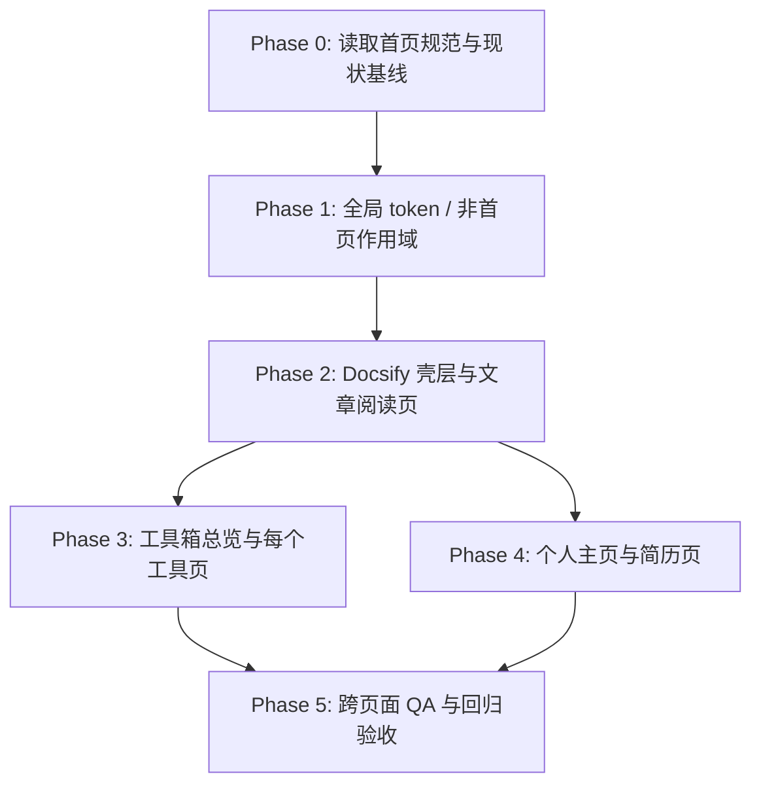

# 全站 UI 视觉统一项目开发总控文档

> 状态：实施前总控计划，V1.0  
> 适用范围：除首页既有 V2 代码外的全站页面 UI 统一、工具页 UI 重构、个人页与简历页设计实现  
> 首页权威规范：[`../HOMEPAGE_DESIGN_AND_IMPLEMENTATION.md`](../HOMEPAGE_DESIGN_AND_IMPLEMENTATION.md)  
> 逐页规格目录：[`pages/`](./pages/)  
> 二次审计报告：[`DESIGN_REVIEW_AUDIT.md`](./DESIGN_REVIEW_AUDIT.md)

---

## 0. 总控定位

这份文档是本次“全站 UI 视觉统一计划”的开发总文档，负责回答四件事：

1. 每个实现模型开始工作前，应该先读哪些资料。
2. 26 张参考图分别对应哪个页面、哪个任务、哪个风险点。
3. 页面应该按什么顺序实现，哪些页面不能抢先做。
4. 每个页面做到什么程度才算完成，而不是只做一张“看起来像”的静态图。

本项目的视觉母体已经由首页确立：深色封面像一间带终端感的数字书房，纸白内页像研究者长期写作、摘录和修订的手稿。后续所有页面都要继承这个气质，不允许变成通用后台、普通博客模板、纯科技炫光页或 Material 风格工具站。

---

## 1. 实现模型的总入口指令

把某一页交给其他大模型实现时，先粘贴这一段，再粘贴对应页面文档。

```text
你正在实现 wychmod.github.io 的全站 UI 统一计划。请先遵守以下总规则：

1. 先阅读 docs/_meta/HOMEPAGE_DESIGN_AND_IMPLEMENTATION.md，首页 V2 是全站视觉母体。
2. 再阅读 docs/_meta/ui-redesign/PROJECT_DEVELOPMENT_PLAN.md，理解项目分期、依赖和验收门禁。
3. 再阅读你要实现的对应页面规格文件。该文件里的参考图描述、布局、状态、文案、交互和验证清单是本页的直接规格。
4. 不要重做首页，不要破坏首页现有深色封面、纸白内页、终端、搜索桥接、移动端行为。
5. 不要改 docs/md/archive/ 下任何归档原文。
6. 不要编造真实数据。文章日期、标题、统计、GitHub 信息、个人履历、读书进度等必须来自真实文件或用户确认；没有真实来源就隐藏或降级为可配置占位。
7. 先做一个页面，截图验证后再进入下一页。每页完成后必须报告：改了哪些文件、保留了哪些旧功能、做了哪些视口验证、是否有新增控制台错误。
```

---

## 2. 全局视觉合同

### 2.1 不可变的视觉母体

- 深色区域：近黑绿色、微网格、终端感、低饱和霓虹强调，表达“知识系统、结构、工程实践”。
- 纸白区域：暖纸、细线、打字机/衬线标题、手稿感模块，表达“阅读、研究、写作、持续修订”。
- 交互语言：克制、有反馈、像研究工具而不是 SaaS 营销页。
- 版面气质：Editorial / magazine，现代但有人味，有手记、批注、索引、章节、卡片、状态条。

### 2.2 色彩令牌建议

实现时可以落为 CSS token，但命名和数值必须与首页视觉靠近。

| 语义 | 建议值 | 用途 |
|---|---:|---|
| `--studio-ink` | `#07110d` | 深色背景、终端底 |
| `--studio-ink-2` | `#0c1812` | 深色卡片、导航 |
| `--studio-paper` | `#f2eadb` | 纸白页面背景 |
| `--studio-paper-2` | `#e8ddc8` | 纸白卡片层级 |
| `--studio-line` | `rgba(30, 42, 35, .18)` | 纸面细线 |
| `--studio-line-dark` | `rgba(213, 225, 205, .15)` | 深色细线 |
| `--studio-green` | `#00b86b` | 主 CTA、在线状态、成功态 |
| `--studio-amber` | `#c89b3c` | 当前导航、章节编号、温暖强调 |
| `--studio-blue` | `#21a7d8` | 信息类工具状态 |
| `--studio-purple` | `#a965ff` | AI / Agent 与特殊工具 |
| `--studio-orange` | `#f59e0b` | 告警、求职、转换类工具 |

### 2.3 字体与排版

- 中文正文：优先系统宋/黑混排，保证阅读耐久。
- 英文与命令：`JetBrains Mono`、`ui-monospace` 或系统等宽。
- 大标题：桌面端可以厚重、有呼吸；移动端必须收敛，避免挤压。
- 文档页正文最大阅读宽度建议 `760–880px`；工具页主工作区可放宽到 `1040–1180px`。
- 标题层级必须服务阅读，不要为了装饰把文章页变成海报。

### 2.4 组件语言

全站重复组件应保持同源：

- 顶部导航：继承首页的深色、细线、当前态、GitHub/终端入口。
- 侧边栏：像知识目录，不像后台菜单；一级分类清晰，当前文档有书签感。
- 文章页：纸面阅读，右侧 TOC/批注，代码块终端化。
- 工具页：深色工具台 + 纸白结果单据/报告；每个工具都要有空态、错误态、复制态。
- 个人页：更人文，可以多时间线/手记/项目档案，但仍然克制。

---

## 3. 实施依赖图



关键依赖：

- 图 02 是首页冻结基线，不是重做任务；其他页面只能继承，不能覆盖。
- 图 11 是侧边栏重复参考，不单独实现；侧边栏以图 08 任务为准。
- 图 12 是工具页总壳，13–24 的每个工具都应复用它的导航、标题、状态、结果区和移动端规律。
- 图 25 与图 26 共用个人信息源，但输出目的不同：图 25 是人格化个人主页，图 26 是可打印/可投递简历。

---

## 4. 分期开发计划

### Phase 0：项目基线与门禁

目标：避免实现模型一上来就改坏首页或真实文档结构。

必须完成：

1. 阅读 `AGENTS.md`。
2. 阅读首页权威规范。
3. 阅读本总控文档。
4. 读取 `_sidebar.md`、`docs/README.md`、`docs/md/Index.md`，确认 9 大分类与当前主线文档。
5. 启动本地预览并保存首页当前截图，作为不回归基线。

建议命令：

```bash
npx docsify-cli serve docs --port 3000
node scripts/sidebar-check.js
node scripts/check-links.js
git diff --check
```

完成标准：

- 明确首页冻结文件清单。
- 明确本次只改目标页，不迁移 Docsify，不引入 React/Vite。
- 明确不能碰 `docs/md/archive/`。

### Phase 1：全局 token 与非首页作用域

目标：建立全站共享视觉语言，但不污染首页。

可能涉及文件：

- `docs/assets/css/studio-tokens.css`
- `docs/assets/css/modern-theme.css`
- 新增或扩展非首页作用域样式，如 `article-reading`、`tool-studio`、`profile-studio`
- 必要时新增幂等初始化脚本，但不能复制终端系统

设计重点：

- 所有新样式必须有明确作用域。
- 全局 token 可以共享，但宽泛选择器不能影响 `.home-v2`。
- 不要一次性重写 Docsify 默认结构；先用小而稳定的壳层适配。

完成标准：

- 首页桌面和移动截图无肉眼回归。
- 文章页、工具页、个人页可以开始复用相同 token。

### Phase 2：Docsify 壳层与阅读系统

目标：让文章页、索引页、搜索页、404、终端说明等基础页面统一成“纸白研究系统”。

页面顺序建议：

1. P001 主线文章模板。
2. P003 全站地图。
3. P008 侧边栏。
4. P004 AI 配套文档页。
5. P007 搜索结果页。
6. P005 终端说明页。
7. P006 归档索引页。
8. P009 终端弹窗视觉。
9. P010 404。

注意：

- P001 的文章模板会影响 39 篇主线文章，只能做一个通用模板，不要逐篇手写。
- P003/P004/P008 必须从真实导航结构生成或同步，不能复制参考图的假数。
- 搜索页可以美化，但不能接管 `Ctrl/Cmd + K`；快捷键仍属于终端。

完成标准：

- Docsify 路由往返正常。
- Markdown 标题、表格、代码块、引用、链接、图片不溢出。
- 桌面、平板、手机都有可读布局。

### Phase 3：工具箱总览与 12 个工具

目标：把工具箱从“独立 HTML 页面”统一成可持续扩展的现代工具台，同时保留每个工具的核心功能。

页面顺序建议：

1. P012 工具箱总览，先完成工具页壳层。
2. P017 JSON 工具，作为复杂输入/输出/错误态样板。
3. P014 Base64 工具，作为简单转换样板。
4. P023 时间戳工具，作为时间互转与时区样板。
5. P020 正则工具，作为测试结果样板。
6. P024 URL 工具，作为结构化解析样板。
7. P018 Markdown 编辑器，作为双栏编辑样板。
8. P015 代码格式化工具，作为多语言格式化样板。
9. P016 配色工具，作为视觉型工具样板。
10. P019 进制转换，作为精确输入样板。
11. P022 数据结构可视化，作为交互演示样板。
12. P013 AI 学习推荐与 P021 简历生成，最后接入外部/AI 能力或降级逻辑。

工具页必须覆盖的状态：

- 初始空态：告诉用户从哪里开始。
- 输入中状态：边输入边反馈或明确点击触发。
- 成功态：结果清楚、可复制、可下载或可继续编辑。
- 错误态：指出错误位置、原因、如何修正。
- 移动端状态：输入区和结果区上下堆叠，不横向滚动。

完成标准：

- 每个工具原有核心功能不回归。
- 复制、清空、导入/导出、示例按钮等交互有明确反馈。
- 工具页共享壳层，不产生 12 套互相打架的 CSS。

### Phase 4：个人主页与简历页

目标：把“作者是谁、为什么写、如何工作”表达得更有人味，同时保留简历页的效率和可信度。

页面顺序：

1. P025 个人主页。
2. P026 简历页。

注意：

- 不允许编造个人经历、公司、项目数据、联系方式。
- 没有真实来源的字段必须隐藏或标记为待作者补充。
- 个人主页可以更文学、更温暖；简历页必须更克制、可打印、可投递。

完成标准：

- 个人页有情绪和记忆点，不像模板站。
- 简历页在 A4/PDF 打印下仍然干净。
- 两页共享基础资料，不产生信息冲突。

### Phase 5：全站 QA 与交付

目标：把视觉统一变成可维护结果。

必须验证：

1. 首页不回归。
2. 9 大分类链接有效。
3. 39 篇主线文章模板统一。
4. 12 个工具核心功能可用。
5. 个人页和简历页信息一致。
6. 手机端无横向滚动。
7. 控制台无新增 error。
8. `node scripts/sidebar-check.js` 通过。
9. `node scripts/check-links.js` 没有新增死链。
10. `git diff --check` 通过。

---

## 5. 26 张图与 26 个任务的总映射

| 图 | 规格文档 | 实施属性 | 依赖 | 核心验收 |
|---:|---|---|---|---|
| 01 | `pages/01-mainline-article.md` | 通用模板 | 真实 Markdown 内容 | 39 篇主线文章共用同一阅读模板 |
| 02 | `pages/02-homepage-regression-reference.md` | 冻结基线 | 首页 V2 代码 | 首页不重做、不回归 |
| 03 | `pages/03-site-map.md` | 全站地图 | `_sidebar.md` / `md/Index.md` | 分类、链接、描述真实同步 |
| 04 | `pages/04-ai-docs.md` | AI 配套文档 | 真实 AI 文档内容 | 内容不合并，页面风格统一 |
| 05 | `pages/05-terminal-guide.md` | 说明页 | 现有终端系统 | 只解释现有终端，不复制一套 |
| 06 | `pages/06-archive-index.md` | 归档索引 | archive README | 归档可追溯，不改原文 |
| 07 | `pages/07-search-results.md` | 搜索体验 | Docsify search | 不占用 Ctrl/Cmd + K |
| 08 | `pages/08-mobile-sidebar.md` | 侧边栏系统 | Docsify sidebar | 当前态、折叠、移动端可用 |
| 09 | `pages/09-terminal-modal.md` | 终端弹窗 | 现有终端系统 | 只改视觉和可访问性 |
| 10 | `pages/10-not-found.md` | 错误页 | Docsify fallback | 有帮助、有路径可回去 |
| 11 | `pages/11-duplicate-sidebar-reference.md` | 重复参考 | P008 | 不单独实现，避免重复任务 |
| 12 | `pages/12-tools-index.md` | 工具总览 | `docs/tools/` | 工具入口统一、状态清楚 |
| 13 | `pages/13-ai-recommend.md` | AI 工具 | 工具壳层/API 降级 | 有温度的学习建议，不假装智能 |
| 14 | `pages/14-base64-tool.md` | 转换工具 | 工具壳层 | 输入/输出/错误态完整 |
| 15 | `pages/15-code-formatter.md` | 格式化工具 | 工具壳层 | 多语言格式化清楚 |
| 16 | `pages/16-color-tool.md` | 视觉工具 | 工具壳层 | 调色板、对比度、复制反馈 |
| 17 | `pages/17-json-tool.md` | 格式化工具 | 工具壳层 | 错误定位与路径提示可用 |
| 18 | `pages/18-markdown-editor.md` | 预览工具 | 工具壳层 | 编辑/预览同步、导出/复制 |
| 19 | `pages/19-radix-tool.md` | 转换工具 | 工具壳层 | 多进制互转和无效字符提示 |
| 20 | `pages/20-regex-tool.md` | 测试工具 | 工具壳层 | 匹配高亮、分组、错误态 |
| 21 | `pages/21-resume-builder.md` | 生成工具 | 工具壳层/用户数据 | 不编造履历，可导出 |
| 22 | `pages/22-structure-tool.md` | 可视化工具 | 工具壳层 | 状态变化可观察、可暂停 |
| 23 | `pages/23-timestamp-tool.md` | 时间工具 | 工具壳层 | 时区、本地时间、互转准确 |
| 24 | `pages/24-url-tool.md` | 解析工具 | 工具壳层 | URL 结构拆解、编码解码 |
| 25 | `pages/25-personal-card.md` | 个人主页 | 真实作者资料 | 更有人文气质，不模板化 |
| 26 | `pages/26-resume.md` | 简历页 | 真实履历资料 | 可打印、可信、信息一致 |

---

## 6. 单页实施门禁

每个页面开工前必须回答：

1. 这页的真实数据来源是什么？
2. 它继承首页的哪个视觉元素？
3. 它是否会影响首页、文章页、工具页或移动导航？
4. 它的桌面、平板、手机布局分别是什么？
5. 它的空态、加载态、错误态、成功态是否需要设计？
6. 它是否有键盘、复制、导出、搜索或跳转行为？
7. 它完成后用什么截图和命令证明没有回归？

如果无法回答，不进入编码。

---

## 7. 单页完成定义

一个页面只有同时满足以下条件，才算完成：

1. 视觉上与首页属于同一套系统。
2. 真实内容来源清楚，没有复制参考图里的假数据。
3. 桌面、平板、手机没有重叠、溢出、遮挡。
4. 链接、按钮、输入、复制、导出等行为可用。
5. 首页、导航、终端快捷键没有回归。
6. 页面规格文档中的验收清单已逐项验证。
7. 最终报告写清楚“改了什么、没改什么、怎么验证”。

---

## 8. 风险登记

| 风险 | 高发位置 | 处理方式 |
|---|---|---|
| 首页被新样式污染 | 全局 CSS、导航选择器 | 所有新样式加作用域，完成后截图对比首页 |
| 编造真实数据 | 最近更新、个人页、简历页、GitHub 统计 | 无来源就隐藏、降级或标记待补充 |
| 侧边栏重复实现 | 图 08 与图 11 | 图 11 只作参考，不单独做页面 |
| 工具功能回归 | 13–24 工具页 | 先记录旧功能，再重构 UI |
| 移动端横向滚动 | 表格、代码块、双栏工具 | 小屏改堆叠，代码/表格内部滚动 |
| Docsify 生命周期重复绑定 | 搜索、导航、工具初始化 | 在 `doneEach` 后幂等初始化，避免多次监听 |
| 打印效果不可用 | 简历页 | 单独写 print CSS，A4 验证 |
| AI 工具不可用 | AI 推荐、简历生成 | 提供无 API 的本地降级和清楚提示 |

---

## 9. 质量证据台账模板

每实现一个页面，在提交说明或实现报告里填这张表。

| 项 | 结论 |
|---|---|
| 页面编号 | P0XX |
| 目标文件 |  |
| 参考图 | P002 为 `docs/_meta/assets/homepage-design-reference-v1.png`；其余页面为 `references/image-xx.png` |
| 已读规格 | 对应页面规格文件 |
| 修改文件 |  |
| 真实数据来源 |  |
| 桌面截图 | 1440×900 / 1280×800 |
| 平板截图 | 768×1024 |
| 手机截图 | 390×844 / 360×800 |
| 功能验证 |  |
| 首页回归 | 通过 / 不适用 |
| 控制台错误 | 无新增 / 有说明 |
| 命令验证 | sidebar-check / check-links / diff-check |
| 未完成事项 |  |

---

## 10. 最终交付定义

本计划全部完成时，应具备：

1. 首页仍保持原 V2 视觉和交互。
2. 39 篇主线文章拥有统一阅读模板。
3. 9 大分类、全站地图、侧边栏、移动导航、搜索、404、归档页统一。
4. 12 个工具页不仅好看，而且原功能可用、状态完整。
5. 个人主页与简历页有真实资料支撑，且气质一致。
6. 所有新增 UI 的描述、规划、设计、实现、验证都能追溯到本目录文档。
7. 新加入的实现模型只要从本总控文档进入，就不会误解项目边界。
