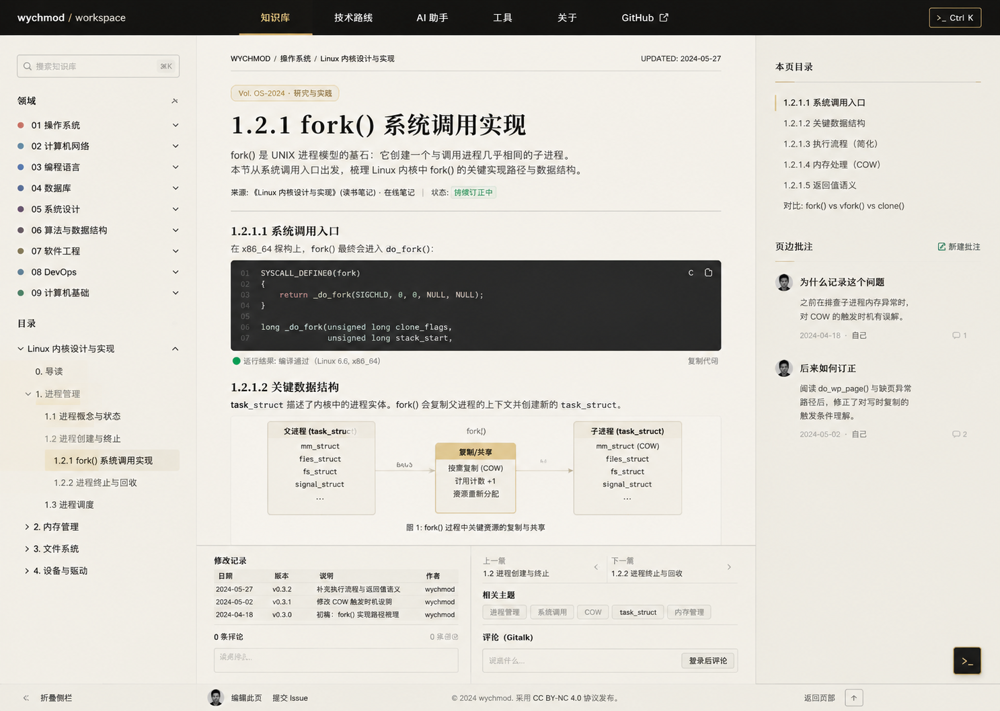

# Image 01：39 篇主线技术文章统一阅读页



> 状态：可实施
> 对应提示词：P001
> 目标范围：`docs/md/01-*` 至 `docs/md/09-*` 下 39 篇主线 Markdown 文章的统一阅读母版
> 核心原则：只建立统一阅读界面和插件外壳，不批量改写文章内容，不生成图中虚构批注、图解、日期或状态。

---

## 1. 给实现模型的任务入口

你要在现有 Docsify 项目中，把所有主线文章渲染成参考图里的“技术研究刊物阅读页”：顶部是暖石墨导航，左侧是知识库目录，中间是纸白正文，右侧是本页目录和少量真实页边信息，底部保留修改记录、分页、评论、编辑入口、版权、返回顶部和终端按钮。

这不是新建一个文章 HTML 模板，也不是把 39 篇 Markdown 改成自定义页面。正确做法是在 Docsify 渲染后的文章页作用域中补齐外壳、排版、插件样式与响应式行为，让任意真实 Markdown 都能自然落入同一阅读系统。

开始前必须完整阅读：

- `AGENTS.md`
- `docs/_meta/HOMEPAGE_DESIGN_AND_IMPLEMENTATION.md`
- `docs/index.html`
- `docs/_sidebar.md`
- 至少 6 篇代表性主线文章：短文、长文、含代码、含表格、含 Mermaid、含修改记录

禁止触碰：

- `docs/md/archive/` 下任何归档原文件
- Docsify 版本、路由模式、搜索插件、终端命令系统
- 首页 `_coverpage.md`、`README.md`、`homepage-v2.css`、`homepage-v2.js` 的现有行为

---

## 2. Design Specification

### 2.1 Purpose Statement

文章页服务于已经进入具体主题的读者。它要让读者能稳定完成四件事：确认当前位置、阅读正文、跳转章节、追踪修订与继续下一篇。页面的人文感来自“作者持续整理、订正和解释问题”的痕迹，而不是额外装饰。

### 2.2 Aesthetic Direction

唯一方向：**Editorial / magazine，研究者的数字书房内页**。
它应像一册中文技术研究刊物的内页：精确、安静、可长期维护，带有工程系统的边栏和刊物式的正文秩序。

### 2.3 Color Palette

继承首页 token，不另起主题：

| 语义 | 色值 | 用途 |
|---|---|---|
| 暖石墨 | `#0D100E` | 顶部导航、终端按钮、局部代码背景 |
| 深墨 | `#131713` | 代码块、终端化局部组件 |
| 灰纸白 | `#E9E5DC` | 文章页主体背景 |
| 浅纸白 | `#F2EEE5` | 正文阅读面、侧栏浅底、表格淡底 |
| 墨色正文 | `#20211D` | 标题、正文、导航文字 |
| 次级文字 | `#66685F` | 路径、摘要、日期、注释 |
| 信号绿 | `#24D18F` | 复制成功、当前焦点、在线/通过状态 |
| 旧金 | `#C8A96B` | 当前导航、卷号、目录选中线、章节标记 |
| 朱砂 | `#B64B45` 或现有相近 token | 错误、过时、警告 |

禁止：紫色主视觉、蓝紫渐变、纯黑大背景、纯白大纸面、霓虹描边、玻璃拟态。

### 2.4 Typography

- H1、章节标题、页边批注标题：`Source Han Serif SC`, `Noto Serif SC`, `Songti SC`, SimSun, serif。
- 正文、侧栏、按钮、说明：`Source Han Sans SC`, `Noto Sans SC`, `Microsoft YaHei`, sans-serif。
- 路径、日期、代码、命令、版本号：`IBM Plex Mono`, `JetBrains Mono`, Consolas, monospace。
- 字距统一 `0`，不使用负字距。
- 桌面正文：`16px / 1.8` 到 `1.88`。
- 代码：`13px / 1.65`，最多 `14px`。
- 移动正文：`15.5px / 1.78`，辅助文字不低于 `12px`。

### 2.5 Layout Strategy

桌面端文章页采用**嵌套 CSS Grid 实现原生三栏平铺**（不是 fixed/absolute 浮动卡片）：

- 外层 `body > main` 为 Grid 容器，两轨 `[侧栏 280px | 中栏弹性]`。
- 中栏 `.content` 自身再设 Grid，两轨 `[正文弹性 | 右栏 TOC auto]`；TOC 空态（`.nothing`）或 `md/Index.md` 时 `auto` 轨塌缩为 0，中栏右缘不留孤立竖线。
- 左栏 `.sidebar` 与右栏 `.toc-nav` 均使用 `position: sticky` 钉在视口内（`top: 60px` / `top: 84px`），随正文滚动保持可见。
- 中栏阅读面由 `.content` 整列承担 `--studio-paper-50 #F2EEE5` 背景，`.markdown-section` 透明无边框，消除卡片感。
- 三栏外壳最大宽度与首页一致，使用 `--shell-max-width`（`1584px`），宽屏居中，两侧为连续纸色。
- 栏间仅 1px 分隔线：左栏 `border-right` + 右栏 `border-left`，无阴影、无圆角、无浮层间隙。

```text
1440 x 900
┌──────────────────────────────────────────────────────────────┐
│ top nav 60px                                                  │
├───────────────┬────────────────────────────┬─────────────────┤
│ left sidebar  │ article reading column      │ right rail TOC  │
│ 280px         │ 760-820px (max 820)         │ 240px           │
│ sticky        │ paper-50 column             │ sticky          │
└───────────────┴────────────────────────────┴─────────────────┘
```

窄屏时不要缩小三栏，而是逐步降级：`<=1279px` 隐藏右栏并退为两栏、`<=1024px` 左栏抽屉化并退为单轨、`<=768px` 正文单列、`<=390px` 收紧边距。

### 2.6 Files to Change

优先级从低风险到高风险：

1. 新增或扩展文章页专用样式文件，例如 `docs/assets/css/article-reading.css`。
2. 在 `docs/index.html` 加载该样式文件。
3. 新增 `docs/assets/js/article-nav.js`：在 Docsify `doneEach` 中把 `.sidebar-nav` 里 9 个一级领域转为可折叠的领域模块（编号 01-09、彩色圆点、chevron、键盘可访问）。
4. 本地 vendor `docsify-plugin-toc.min.js`（`docs/assets/js/docsify-plugin-toc.min.js`），替换失效的 npmmirror CDN 引用；在 `docs/index.html` 正确配置 `toc: { target: 'h2, h3, h4', tocMaxLevel: 4 }`。
5. 如必须补充容器，使用 Docsify `doneEach` 幂等插件添加非内容型 wrapper。
6. 只有导航事实有误时，才同步 `docs/_sidebar.md`、`docs/README.md`、`docs/md/Index.md`。

不要为了这张图改 39 篇 Markdown。Markdown 只作为真实内容来源和回归样本。

### 2.7 Behaviors That Must Not Regress

必须保留：

- Docsify hash 路由
- `loadSidebar`
- Docsify Search
- Prism 代码高亮与 copy-code
- Mermaid
- pagination
- TOC
- Gitalk
- 编辑此页
- 阅读进度
- 返回顶部
- 图片缩放
- 右下角终端触发器
- `Ctrl/Cmd + K` 打开现有 `#terminal-window`
- 首页 `.is-home` 与文章 `.is-article` 的样式隔离

---

## 3. 参考图视觉复盘

### 3.1 桌面端可见结构

参考图桌面画布约 `1440×900`，整体是浅纸白阅读页，上方一条 `52–60px` 暖石墨导航。导航左侧是 `wychmod / workspace`，中间是“知识库、技术路线、AI 助手、工具、关于”，当前“知识库”用旧金短线标记，右侧有 GitHub 外链和 `>_ Ctrl K` 终端按钮。

导航下方分三栏：

- 左栏约 `280px`，从页面顶部到视口底部固定。顶部是搜索框，高约 `36px`，左侧搜索图标，右侧快捷键小标。下面是“领域”分组，9 个一级领域每行约 `34–38px`，带彩色小圆点、编号、名称和展开箭头。再下面是当前文章目录树，层级缩进清楚，当前章节有浅旧金底和左侧强调。
- 中栏宽约 `760–820px`。顶部有等宽路径条：左侧 `WYCHMOD / 操作系统 / Linux 内核设计与实现`，右侧 `UPDATED: 2024-05-27`。路径条下方是卷标 `Vol. OS-2024 · 研究与实践`，再往下是 44px 左右的衬线 H1、两行摘要、来源/状态元信息、水平分割线。
- 右栏约 `240px`，顶部是“本页目录”，用旧金短线作标题下划线，列出当前二级/三级章节。中段是“页边批注”，包含头像、批注标题、短正文、日期、作者和评论数。右栏底部在 900px 高度内不需要填满。

### 3.1.1 左侧「领域模块」折叠导航

左侧栏只保留 9 个一级领域模块，不再显示站点名、全站地图或顶部快捷链接。每个领域一行，结构为：

- 左侧 7px 彩色圆点（使用 `studio-tokens.css` 中 `--kg-0` 到 `--kg-8`）。
- 等宽编号 `01`–`09`。
- 领域名称（来自 `_sidebar.md` 的加粗文本）。
- 右侧 chevron：收起时向右 `›`，展开时向下旋转 `˅`。

交互规则：

- 点击整行展开/收起该领域下的文章与子分组；点击文章链接沿用 Docsify 原生路由跳转。
- 含当前文章的领域强制展开，其余领域默认收起。
- 用户手动展开/收起状态在会话内记忆（`sessionStorage` 或内存对象），刷新后失效，避免破坏默认导航。
- 键盘可访问：领域行 `tabindex="0"`，`Enter`/`Space` 切换展开。

该模块通过 `article-nav.js` 在 `doneEach` 中对 Docsify 已渲染的 `.sidebar-nav` DOM 做非破坏性转换，数据真相仍是 `_sidebar.md`。

中栏首屏正文包括二级标题、段落、深墨代码块、复制按钮、运行结果状态、工程图解、图注。底部可见修改记录、上一篇/下一篇、相关主题、Gitalk 评论入口、编辑此页、提交 Issue、版权、返回顶部、终端按钮。

### 3.2 移动端预期结构

这张图未单独展示手机画板，但必须按项目首页规则降级：

- 顶部导航高度 `56–60px`，显示品牌、菜单、终端入口和必要 CTA。
- 左侧 Docsify 侧栏以抽屉出现，宽 `86vw`，最大 `320px`，遮罩不超过 `rgba(13,16,14,.35)`。
- 右侧本页目录不常驻，放到正文 H1 后的 `<details>` 或一个“目录”按钮中。
- 文章正文单列，左右 `16px` 安全边距。
- H1 `30–34px`，自然换行，不居中堆叠。
- 代码块与宽表格只在自身内部横向滚动，页面整体不横向滚动。
- 底部分页和评论纵向排列，终端悬浮按钮不遮挡正文。

---

## 4. 页面结构蓝图

实现后，运行时 DOM 的语义结构应接近：

```text
body.is-article
├─ nav.app-nav.top-nav
├─ aside.sidebar
│  ├─ .search
│  └─ .sidebar-nav
├─ main.article-shell
│  ├─ article.markdown-section.article-page
│  │  ├─ .article-system-line
│  │  ├─ .article-volume-label
│  │  ├─ h1
│  │  ├─ .article-summary 或首段
│  │  ├─ .article-meta
│  │  ├─ 正文 Markdown
│  │  ├─ 修改记录表
│  │  ├─ pagination
│  │  └─ Gitalk
│  └─ aside.article-right-rail
│     ├─ 本页目录
│     └─ 真实页边信息（可选）
├─ .progress
├─ .back-to-top
└─ #terminal-trigger / #terminal-window
```

如果 Docsify 插件已经生成 `.page_toc` 或类似右侧目录，不要复制第二套目录数据，只重排和重绘现有节点。若没有右侧目录插件，则先用 Docsify 的 subSidebar 数据渲染一个只读目录，必须在 `doneEach` 中清理旧实例，避免重复。

---

## 5. 像素级布局规格

### 5.1 顶部导航

- 高度：`60px`，最小 `56px`。
- 背景：`#0D100E` 或 `#131713`，不可纯黑。
- 底部分割线：`1px rgba(242,239,231,.14)`。
- 品牌左边距：桌面 `40px`，移动 `16px`。
- 导航项间距：`40–56px`；当前项旧金色，底部 `2px` 线，线宽约 `48–64px`。
- 终端按钮：高度 `34–36px`，圆角 `3px`，边框旧金弱化，文字等宽，焦点 `2px #7EE8BC`。

### 5.2 左侧栏

- 宽度：`280px` 最合适，允许 `260–292px`。
- 背景：`#E9E5DC` 叠加极轻纸纹；右边框 `1px rgba(32,33,29,.14)`。
- 内边距：顶部 `28–32px`，左右 `24px`。
- 隐藏站点名 `.app-name` 与 `_sidebar.md` 顶部链接块、全站地图等快捷入口；只保留搜索和 9 大领域模块。
- 搜索框：高 `36px`，圆角 `4px`，边框 `rgba(32,33,29,.18)`，输入文字 `14px`。
- 一级领域行：高 `34–38px`；小圆点 `7px`；编号和标题 `14px`；箭头图标 `14px`。
- 领域内容区（子分组与文章）默认隐藏，展开时显示；含当前文章的领域强制展开。
- 当前二/三级章节：背景 `rgba(200,169,107,.12)`，左线 `2px #24D18F` 或旧金，圆角 `3px`。
- 底部“折叠侧栏”区域高约 `44px`，固定在侧栏底部时不能遮挡目录最后一项。

### 5.3 主阅读栏

- 主阅读栏最大宽度：`820px`；理想正文文字宽度 `760px`。
- 顶部路径条：高 `48–56px`，上下居中，底部 `1px` 分割。
- 卷标：高 `28px`，内边距 `6px 10px`，圆角 `6px`，旧金边框和浅旧金底。
- H1：`44–48px / 1.18`，衬线，顶部距卷标 `18–24px`，底部距摘要 `14–18px`。
- 摘要：`16px / 1.75`，最多 2 行，宽度不超过正文宽度。
- 元信息：`13px`，等宽/正文混排，标签之间用竖线或 `·`，状态徽标使用浅底小标签。
- H2：`24–28px / 1.35`，上边距 `36–44px`。
- H3：`19–22px / 1.4`，上边距 `28–34px`。
- 段落：`16px / 1.85`，段间距 `14–18px`。
- 表格：`15px`，边框 `1px rgba(32,33,29,.16)`，表头浅纸底。
- 引用：左线 `3px #C8A96B`，背景不超过 `rgba(200,169,107,.08)`。

### 5.4 代码块与工程图

- 代码块背景：`#131713`，圆角 `6px`，不要红黄绿窗口点。
- 内边距：顶部 `36–42px` 给语言和复制按钮，正文 `18–20px`。
- 行号列宽：`34–42px`，颜色 `rgba(242,239,231,.35)`。
- 代码色彩低饱和；字符串/成功结果可用信号绿，但不能满屏荧光。
- 复制按钮：右上角 `32px` 高，图标加文字或 `aria-label`。
- 运行结果状态：代码块下方一行，高 `24–28px`，左侧 `8px` 绿点，说明文字 `13px`。
- Mermaid/工程图：纸白底，宽度 `100%`，最小高 `180px`，边框 `1px`，图注 `13px` 居中。

### 5.5 右侧栏

- 真实 DOM 位置：`aside.toc-nav` 由 `docsify-plugin-toc` 插件插入 `.content` 内，作为 `.content` 嵌套 grid 的第 2 轨；不是 `main` 的直接子元素。
- 宽度：`240px`。
- 定位：`position: sticky; top: 84px; height: calc(100vh - 84px)`，左侧 `1px rgba(32,33,29,.14)` 分隔线贯通视口高。
- 背景：透明，透出页底 `--studio-paper-100`；无边框圆角、无阴影、无玻璃模糊。
- 空目录（无 h2/h3/h4）时通过 `.toc-nav.nothing` 或 `body.is-article[data-page="md/Index.md"]` 隐藏，`auto` 轨塌缩，中栏右侧不留空白。
- 目录标题：`13px` 加粗，下面旧金短线 `36px × 1px`。
- 目录项：`13px / 1.5`，当前项左侧 `2px` 旧金线，文字墨色；非当前弱文字。
- 页边批注：仅当项目已有真实批注数据源时显示；否则右栏只保留本页目录。

### 5.6 底部区域

- 修改记录和分页区域从正文结束后用 `1px` 线分隔。
- 修改记录表最多先展示 3–5 行，更多仍可滚动或自然增长。
- 上一篇/下一篇是两个并列区块，各占 `50%`，移动端纵向。
- 相关主题使用小标签，圆角 `3px`，不得做大胶囊。
- Gitalk 区域保持真实插件样式，只做纸白风格修饰；未登录按钮高度不小于 `36px`。
- 页脚高度约 `48px`，包含编辑此页、提交 Issue、版权、返回顶部。
- 终端按钮固定右下角：桌面 `48×40px` 左右，移动 `44×44px`。

---

## 6. 内容真实性规则

参考图中以下内容只代表视觉位置，不得照抄：

- “Linux 内核设计与实现”“fork() 系统调用实现”等文章标题
- `2024-05-27` 等更新时间
- COW 图解内容
- 页边批注的头像、日期、评论数
- `Vol. OS-2024`、版本号、作者备注
- 左侧“操作系统/计算机网络/数据库”等非本项目 IA

生产实现必须使用：

- 分类与链接：`docs/_sidebar.md`
- 文章正文：目标 Markdown
- 更新时间：文末“修改记录”或 Git 信息；没有可靠来源则隐藏
- 来源归档：Markdown 中已有“原文归档”链接；没有则隐藏
- 标签：可从当前分类、标题和真实章节生成，不能编不存在主题
- 页边批注：仅当项目已有真实批注来源时显示；否则右栏只保留本页目录和“相关主题/维护入口”

---

## 7. 实施计划

### Phase 0：基线

1. 运行 `git status --short`，确认没有覆盖用户改动。
2. 选取回归样本：
   - 每个一级分类至少 1 篇，共 9 篇。
   - 额外选 1 篇含 Mermaid、1 篇含宽表格、1 篇含长代码、1 篇长目录文章。
3. 启动本地 Docsify，保存 `1440×900`、`1024×768`、`390×844` 截图。
4. 记录控制台现有 error，不把历史问题误归为本任务。

### Phase 1：作用域和布局

1. 在 `doneEach` 后确保 `body.is-article` 正确设置。
2. 为文章页建立三栏布局，不影响 `.is-home`。
3. 让 `.markdown-section` 成为中间阅读栏，而不是继续全局居中。
4. 右侧目录使用现有 TOC 数据；若插入自定义容器，必须先删除旧容器。

### Phase 2：文章排版

1. 重绘 H1/H2/H3、段落、列表、表格、引用、提示、警告。
2. 重绘代码块、复制按钮、语言标签和运行结果状态。
3. 处理图片、Mermaid、图注和宽内容滚动。
4. 底部修改记录、分页、相关主题、Gitalk 与编辑入口风格统一。

### Phase 3：侧栏和右栏

1. 左侧栏保留真实 9 大分类；当前文档和当前章节必须有清晰状态。
2. 搜索框不绑定 `Ctrl/Cmd + K`，该快捷键只属于终端。
3. 右栏 sticky 目录随滚动高亮；没有真实批注时不显示虚构批注。

### Phase 4：响应式

1. `<= 1180px`：右栏可隐藏或移入正文折叠目录。
2. `<= 900px`：左栏抽屉化，正文单列。
3. `<= 420px`：边距 `16px`，H1 `30–34px`，按钮全宽或两列稳定排列。
4. `<= 360px`：长英文和路径 `overflow-wrap:anywhere`，控件不小于 `44px`。

---

## 8. 状态与交互

必须设计并验证这些状态：

- 侧栏：默认、展开、收起、当前分类、当前文章、键盘焦点。
- 搜索：默认、输入、有结果、无结果、清空、键盘选择。
- 右侧目录：默认、当前项、滚动同步、无目录时隐藏。
- 代码复制：默认、hover、focus、复制成功、复制失败。
- Mermaid：加载中、渲染成功、渲染失败且原始代码可读。
- 表格和代码：宽内容滚动，不撑破页面。
- Gitalk：加载、未登录、加载失败。
- 终端：右下角按钮、`Ctrl/Cmd + K`、`Esc`，全部指向同一终端。
- 首页往返：文章页样式不污染首页，首页样式不污染文章。

---

## 9. 可访问性要求

- 页面只有一个主要 `h1`。
- 侧栏和右栏使用 `nav` 或带 `aria-label` 的容器。
- 装饰线、纸纹、图谱辅助线设置 `aria-hidden="true"`。
- 所有图标按钮必须有中文 `aria-label` 或可见文本。
- 焦点样式使用 `2px #7EE8BC`，不能只靠颜色变化。
- 目录、分页、复制按钮、评论登录入口都可键盘访问。
- 移动抽屉打开后焦点应进入抽屉；关闭后返回触发按钮。
- `prefers-reduced-motion: reduce` 下关闭不必要动画。

---

## 10. 验证清单

静态检查：

```bash
node scripts/sidebar-check.js
node scripts/check-links.js
git diff --check
```

浏览器检查：

- `1440×900`：三栏完整，首屏能看到正文、右侧目录和终端按钮。
- `1280×800`：导航不拥挤，正文宽度仍可读。
- `1024×768`：右栏降级后无横向滚动。
- `768×1024`：侧栏抽屉化，目录可展开。
- `390×844`：正文单列，代码局部滚动，按钮不重叠。
- `360×800`：长路径、长英文和代码不撑破页面。

功能检查：

- 从侧栏打开 9 个一级分类下的样本文章。
- 点击 H2/H3 锚点，刷新后定位仍正确。
- 复制代码块。
- Mermaid 成功渲染，失败时不空白。
- 上一篇/下一篇可用。
- Gitalk 未登录状态不遮挡正文。
- 编辑此页打开真实 GitHub 地址。
- 首页 → 文章 → 首页循环两次，没有重复目录、重复图标或重复监听器。

---

## 11. 完成定义

- 39 篇主线文章共享同一阅读母版，无需逐篇特殊 HTML。
- 视觉与当前首页同源：暖石墨导航、灰纸白阅读面、旧金索引、信号绿状态、衬线标题、等宽路径。
- 文章页比首页更安静，不把整页改成深色，不复制首页图谱。
- 桌面三栏成立，移动端单列成立。
- 所有现有 Docsify 插件与终端行为不回归。
- 没有生成参考图中的虚构文章内容、日期、批注、图解或统计。

---

## 12. 可直接复制给实现模型的指令

```text
请在现有 wychmod.github.io Docsify 仓库中实现 39 篇主线文章的统一阅读母版，参考 docs/_meta/ui-redesign/references/image-01.png。不要新建独立 Demo，不要迁移框架，不要批量改写 Markdown，不要修改 docs/md/archive/。

先完整阅读 AGENTS.md、docs/_meta/HOMEPAGE_DESIGN_AND_IMPLEMENTATION.md、docs/index.html、docs/_sidebar.md，以及至少 6 篇代表性主线文章。实现前输出 DESIGN SPECIFICATION，声明 Purpose、Aesthetic、Color、Typography、Layout、Files to change、Behaviors that must not regress。

页面应成为“研究者的数字书房内页”：60px 暖石墨顶部导航，左侧 280px 知识侧栏，中间 760-820px 灰纸白正文，右侧 220-260px 本页目录。使用 Source Han Serif SC/Noto Serif SC 做标题，Source Han Sans SC/Noto Sans SC 做正文，IBM Plex Mono/JetBrains Mono 做路径、日期和代码。复用首页色彩：#0D100E、#131713、#E9E5DC、#F2EEE5、#20211D、#66685F、#24D18F、#C8A96B。

保留 Docsify hash 路由、loadSidebar、Search、Prism、copy-code、Mermaid、TOC、pagination、Gitalk、编辑此页、阅读进度、返回顶部、图片缩放和现有终端。Ctrl/Cmd+K 只打开现有 #terminal-window。所有新增样式必须作用域到 .is-article 或明确文章容器，不污染首页。

桌面按三栏实现；1024px 以下右侧目录降级；768px 以下左侧栏抽屉化；390px 手机单列，H1 30-34px，边距 16px，代码和宽表局部滚动，触点至少 44px。

不要照抄参考图里的 Linux fork 文章、日期、COW 图、页边批注、版本号和分类名。标题、链接、来源、修改记录和标签必须来自真实 Markdown 与 _sidebar.md；没有真实来源的页边批注直接隐藏。

完成后运行 node scripts/sidebar-check.js、node scripts/check-links.js、git diff --check，并用 1440x900、1280x800、1024x768、768x1024、390x844、360x800 截图检查。验证侧栏、搜索、目录锚点、代码复制、Mermaid、分页、Gitalk、编辑链接、返回顶部、终端快捷键和首页往返无回归。
```

---

## 13. 当前源码巡检与证据入口

实现模型不要只看参考图。必须先用当前源码确认文章页真实外壳，因为本任务不是“重新造一个阅读器”，而是在 Docsify 文章渲染结果上重绘。

当前关键入口：

| 文件 | 必看内容 | 设计影响 |
|---|---|---|
| `docs/index.html` | `$docsify` 配置、Search、pagination、Gitalk、TOC、copyCode、终端 DOM、阅读进度、编辑此页插件 | 文章页所有插件必须保留；新增容器不能破坏插件挂载 |
| `docs/assets/css/modern-theme.css` | `.sidebar`、`.search`、`.markdown-section`、`.page_toc`、`.pagination-item`、`#reading-progress`、Gitalk、footer、移动侧栏 | 现有文章样式很多，新增文章母版要用作用域覆盖，不能散落无作用域选择器 |
| `docs/assets/js/homepage-v2.js` | `.is-home` / `.is-article` 路由状态 | 文章页样式必须依赖 `.is-article` 或更窄页面类，不能污染首页 |
| `docs/_sidebar.md` | 9 大分类和真实文章路径 | 左侧栏内容必须来自真实 Docsify 侧栏，不得抄参考图分类 |
| `docs/md/**.md` | 标题、段落、代码、表格、Mermaid、修改记录、归档链接 | 排版必须能容纳不同 Markdown 复杂度 |

必须抽样至少这些形态：

- 一篇短文：检查空白、底部插件是否过早顶上来。
- 一篇长文：检查右侧目录 sticky 和滚动高亮。
- 一篇含长代码：检查代码块局部横向滚动和复制按钮。
- 一篇含表格：检查表格不撑破正文。
- 一篇含 Mermaid：检查图不被深色代码样式误伤。
- 一篇含修改记录：检查文末表格、分页、Gitalk 的顺序。

如果抽样文章没有覆盖某种形态，应继续扩展样本，不能用单篇文章截图宣称“39 篇母版完成”。

---

## 14. 实现模型最容易踩的坑

### 14.1 把 39 篇文章逐篇改 HTML

错误做法：

```text
打开每篇 Markdown，把标题、摘要、代码块都包成自定义 HTML。
```

正确做法：

```text
用 Docsify 渲染后的统一 DOM 和 CSS 作用域建立文章母版。
```

只有当某篇文章本身存在破损 Markdown、错误链接或缺失修改记录时，才按文档维护规则单独修文章；视觉任务不批量改正文。

### 14.2 复制参考图里的文章内容

参考图中的 `fork() 系统调用实现`、COW 图、页边批注、日期、版本号都只是视觉占位。生产页面不能出现这些内容，除非真实 Markdown 中本来就有。

### 14.3 重建第二套侧边栏或搜索

Docsify 已经有 `.sidebar` 和 Search 插件。不要新增一个独立 sidebar 数据源，也不要重新写全文搜索。视觉上可以重排和美化现有 DOM，但数据源必须仍来自 Docsify。

### 14.4 右侧页边批注造假

参考图右侧“页边批注”很有人文感，但项目当前没有稳定批注数据源。没有真实来源时：

- 右栏只显示本页目录。
- 可显示“维护入口 / 编辑此页 / 提交 Issue”。
- 不显示虚构头像、评论数、日期和作者语录。

### 14.5 文章页污染首页

如果新增选择器是：

```css
.markdown-section h1 { ... }
.sidebar { ... }
section { ... }
```

就有可能伤到首页、工具页或插件。应改为：

```css
body.is-article .markdown-section h1 { ... }
body.is-article .sidebar { ... }
body.is-article .page_toc { ... }
```

如果工具页是独立 HTML，不会使用 Docsify `.is-article`，不要把工具页样式写进文章母版。

### 14.6 移动端把三栏整体缩小

移动端必须重新组织：

- 左侧栏抽屉化。
- 右侧目录折叠到正文前。
- 正文单列。
- 代码/表格局部滚动。

不能通过 `transform: scale(.7)` 或把字号缩到 10px 解决。

### 14.7 TOC 插件失效或配置错误

`docsify-plugin-toc` 的 npmmirror CDN 会返回 403，必须使用本地 vendored 文件。配置键是 `target`（选择器）和 `tocMaxLevel`，不是 `toc` 数组。如果右侧目录不出现：

- 检查 `docs/index.html` 是否引用 `/assets/js/docsify-plugin-toc.min.js`。
- 检查 `$docsify.toc` 是否为 `{ target: 'h2, h3, h4', tocMaxLevel: 4 }`。
- 检查 `subMaxLevel` 是否设为 `0`，避免 Docsify 自身 subSidebar 与插件目录冲突。
- 检查 CSS 是否对 `.toc-nav .page_toc > div` 做了显示和 active 样式。

---

## 15. 文章母版完成审计表

实现完成后，必须用证据逐项证明，而不是只说“看起来一致”。

| 要求 | 证据 |
|---|---|
| 39 篇主线文章共享母版 | 打开至少 9 个一级分类样本截图；CSS 作用域为统一文章页而非逐篇 HTML |
| 首页未被污染 | `git diff` 确认首页运行文件无无关改动；`#/` 1440 和 390 截图一致 |
| 侧栏真实 | 侧栏内容来自 `_sidebar.md`，没有参考图虚构分类 |
| 右侧目录真实 | TOC 来自当前文章标题；无目录文章时右栏隐藏或降级 |
| 页边批注不造假 | 没有真实数据时不出现虚构批注 |
| 代码块可用 | 至少一篇长代码文章截图和复制成功反馈 |
| Mermaid 可用 | 至少一篇 Mermaid 文档渲染截图；失败时原文可读 |
| 宽表格不撑破 | 表格文章在 390px 截图无页面横向滚动 |
| Gitalk 可用 | 未登录/加载态不遮挡正文 |
| 终端不回归 | `Ctrl/Cmd + K` 打开同一个 `#terminal-window`，`Esc` 关闭 |
| 静态检查 | `node scripts/sidebar-check.js`、`node scripts/check-links.js`、`git diff --check` 输出记录 |

如果任意证据缺失，不能标记该子任务完成。

---

## 16. 补充给实现模型的像素与数据源指令

```text
补充要求：Image 01 是“文章母版”，不是某一篇文章页面。实现时必须把视觉能力放在 Docsify 文章渲染外壳上，而不是逐篇重写 Markdown。请先列出你选择的回归样本文章，覆盖 9 大分类、长文、短文、代码、表格、Mermaid、修改记录。每个样本都要在桌面和移动端验证。

请特别处理三种无数据降级：
1. 当前文章没有可靠更新时间：隐藏 UPDATED，不要编日期。
2. 当前文章没有真实页边批注：右栏只保留本页目录和维护入口。
3. 当前文章没有 TOC：右栏隐藏，不留空白大栏。

请把所有新增 CSS 限定在 body.is-article 或更窄作用域。禁止改首页 `_coverpage.md`、`README.md`、`homepage-v2.css`、`homepage-v2.js`。如果首页视觉被影响，修复新样式作用域，而不是调整首页。
```

---

## 17. 布局实现记述（三栏平铺改造后同步）

本次改造把文章页从“浮动卡片”改为**原生文档流三栏平铺**，实现文件为 `docs/assets/css/article-reading.css`，`index.html` 与 JS 未改动。

### 17.1 运行时 DOM 与 Grid 结构

```text
body.is-article
├─ nav.app-nav.top-nav
├─ aside.sidebar
│  ├─ .search
│  └─ .sidebar-nav
├─ main
│  └─ section.content
│     ├─ aside.toc-nav
│     ├─ article#main.markdown-section
│     ├─ .gitalk-container
│     └─ .docsify-pagination-container
├─ .progress
├─ .back-to-top
├─ #terminal-trigger / #terminal-window
└─ .sidebar-toggle
```

说明：

- `docsify-plugin-toc` 把 `aside.toc-nav` 插入 `.content` 内部，因此采用**嵌套 grid**：
  - `body > main`：`grid-template-columns: 280px minmax(0, 1fr)`。
  - `.content`：`grid-template-columns: minmax(0, 1fr) auto`。
- 右栏 `auto` 轨宽由 `.toc-nav` 的 `width: 240px` 决定；当 `.toc-nav.nothing` 或 `data-page="md/Index.md"` 时元素 `display:none`，该轨塌缩为 0。
- `.markdown-section` 及其兄弟节点（Gitalk、分页）通过 `body.is-article .content > * { grid-column: 1 }` 进入正文列。

### 17.2 关键 CSS 段落

| 段落 | 职责 |
|---|---|
| §4 | `main` / `.content` 嵌套 grid；sticky sidebar；paper-50 中栏。 |
| §5 | `.markdown-section` 透明 + 零边框，消除卡片感。 |
| §11 | `.toc-nav` sticky、透明、左分隔线、满视口高、空目录隐藏。 |
| §14 | 响应式降级：`≥1280px` 三栏；`≤1279px` 两栏；`≤1024px` 单轨抽屉；`≤768px/390px` 单列收紧。 |
| §17 | 桌面侧栏滚动条；移动端抽屉（JS 行为在 `docs/index.html` P008）。 |
| §20 | 桌面侧栏收回动画（grid-template-columns 280px→0 + 侧栏 transform 滑出）；横向溢出治本。 |

### 17.3 Sticky 与 overflow 约束

- `vue.css` 给 `main { height: 100%; overflow: hidden }`，会把 sticky 的 containing block 限制在视口高并截断溢出。
- 修复：`body.is-article > main:not(.sm-main) { height: auto !important; overflow: visible !important; overflow-x: clip !important; }`。
- `overflow-x: clip` 用于防止超长 URL / 残缺 HTML 产生横向滚动条，但 `clip` 不会建立滚动容器，不影响 fixed/sticky 元素。

### 17.4 侧栏收回交互（桌面 `≥1025px`）

- 复用 Docsify 原生 `.sidebar-toggle` 点击 → `body.close` 切换。
- `main` 加 `transition: grid-template-columns`，`body.close` 时首轨从 `280px` 变为 `0`。
- `.sidebar` 加 `transform` 过渡，关闭时 `translateX(calc(-100% - var(--shell-gutter)))` 滑出屏幕左侧。
- `.sidebar-toggle` 从侧栏右缘吸附，关闭时贴屏幕左缘，图标在 `‹` / `›` 之间切换。
- 移动端（`≤1024px`）同一按钮由 P008 抽屉 JS 接管，与桌面收回语义不冲突。

### 17.5 外壳宽度与对齐

- 使用 `--shell-max-width`（`304px + 1280px = 1584px`），与首页 `.app-nav` 的居中 gutter 对齐。
- `body.is-article > main:not(.sm-main) { max-width: var(--shell-max-width); margin: 0 auto; }`。
- `body.is-article main` 另有 `width: 100% !important; max-width: 100% !important; overflow-x: clip !important;` 作为兼治内嵌 `.sm-main` 的兜底。

### 17.6 回归验证证据

最近一次改造后执行：

```bash
node scripts/sidebar-check.js      # 41 篇主线，0 缺失
node scripts/check-links.js        # 7 个死链均在 docs/md/archive/，非本次新增
git diff --check                   # 无空白错误
```

多视口 Playwright 截图（`1440/1280/1279/1024/768/390/1920`）验证：三栏结构、sticky 不飘、close 动画、抽屉开合、无横向溢出、首页不受 grid 规则影响。截图保存在 `output/three-col-check/`。

### 17.7 禁止事项（与本次改造保持一致）

- 不要把 `.toc-nav` 移出 `.content` 去拼“真·三轨 grid”，否则要改插件源码。
- 不要在文章页使用 `position: fixed` 实现左/右栏，那会破坏文档流和短页背景色。
- 不要把 `.markdown-section` 背景改回白色卡片或加左右边框。
- 不要降低 `body.is-article` 作用域去改全局 `.sidebar` / `.content` / `main`。
- 不要在 `index.html` 中为本次布局新增 wrapper 或修改 TOC 插件配置。
