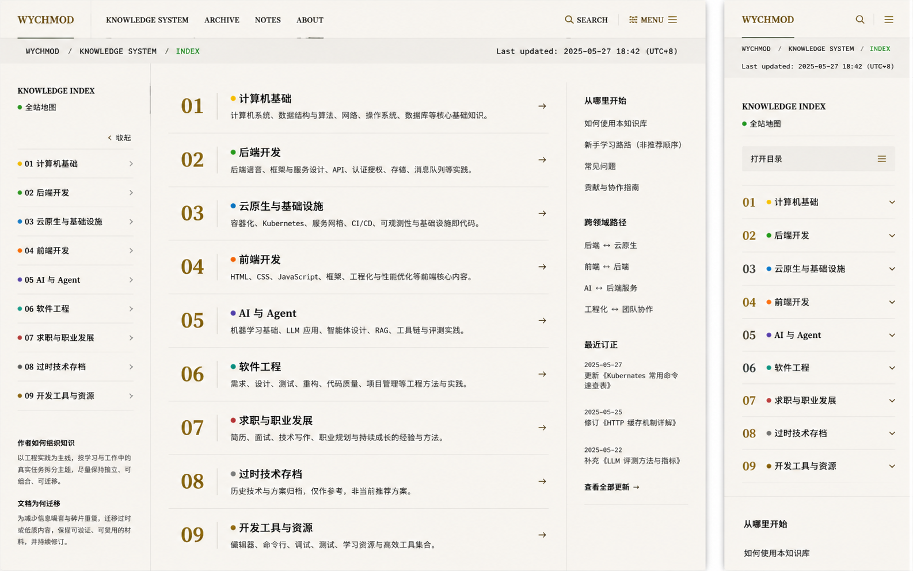

# Image 03：全站地图与知识索引



> 状态：可实施
> 对应提示词：P003
> 目标文件：`docs/md/Index.md`
> 内容真相来源：`docs/_sidebar.md`、`docs/README.md`、`docs/md/Index.md`
> 核心原则：做成“知识索引内页”，不是首页图谱、不是卡片宫格、不是营销导航。

---

## 1. 给实现模型的任务入口

你要把 `docs/md/Index.md` 做成参考图中的“全站地图 / Knowledge Index”：顶部继承首页导航与系统路径，中间用 01-09 的大编号列出 9 大领域，左侧提供 sticky 快速索引，右侧提供“从哪里开始、跨领域路径、最近订正/维护入口”等帮助信息，移动端改为可展开的知识目录。

这页的核心是帮助读者理解全站结构，而不是展示炫酷图形。不要复制首页的径向知识图谱，不要做 9 张大卡片，不要用虚构统计填满右栏。所有分类、链接和文案必须与真实项目导航一致。

开始前必须完整阅读：

- `AGENTS.md`
- `docs/_meta/HOMEPAGE_DESIGN_AND_IMPLEMENTATION.md`
- `docs/_sidebar.md`
- `docs/README.md`
- `docs/md/Index.md`

---

## 2. Design Specification

### 2.1 Purpose Statement

全站地图服务于两类读者：第一次进入知识库、需要快速理解内容边界的人；已经知道主题、想按领域跳转的人。它要把 9 大领域、主线文章和跨领域学习路径清楚地编目，让读者知道“从哪里开始”和“下一步去哪”。

### 2.2 Aesthetic Direction

唯一方向：**Editorial / magazine，研究者的数字书房索引页**。
它像一本技术研究刊物的目录页：纸白、编号、横线、分栏、路径、修订记录。科技感来自信息组织，人文感来自作者如何组织知识与迁移笔记的说明。

### 2.3 Color Palette

继承首页 token：

| 语义 | 色值 | 用途 |
|---|---|---|
| 暖石墨 | `#0D100E` | 顶部导航，移动抽屉顶部 |
| 灰纸白 | `#E9E5DC` | 页面主体 |
| 浅纸白 | `#F2EEE5` | 路径条、折叠区背景、辅助栏 |
| 墨色正文 | `#20211D` | 分类标题、链接、正文 |
| 次级文字 | `#66685F` | 描述、更新时间、辅助说明 |
| 旧金 | `#C8A96B` | `01–09` 大编号、当前导航、短下划线 |
| 信号绿 | `#24D18F` | 当前路径、全站地图状态、焦点 |
| 领域辅助色 | 项目现有色点 | 只做小圆点，不能主导页面 |

禁止：紫色、蓝紫渐变、彩虹分区、纯白后台、阴影卡片墙。

### 2.4 Typography

- 页面标题、分类标题：`Source Han Serif SC`, `Noto Serif SC`, `Songti SC`, SimSun, serif。
- 说明、链接、右侧帮助：`Source Han Sans SC`, `Noto Sans SC`, `Microsoft YaHei`, sans-serif。
- 路径、更新时间、编号辅助：`IBM Plex Mono`, `JetBrains Mono`, Consolas, monospace。
- 桌面主标题：`36–42px`。
- 分类编号：`38–48px`，旧金色，行高 `1`。
- 分类标题：`22–26px`。
- 正文说明：`15–16px / 1.7`。
- 右栏辅助：`13–14px / 1.7`。
- 移动标题：`26–30px`，分类编号 `28–34px`。

### 2.5 Layout Strategy

桌面采用“三栏索引页”：

```text
1440 x 900
┌──────────────────────────────────────────────┐
│ top nav 60px                                  │
├──────────────────────────────────────────────┤
│ system path bar 48-56px                       │
├──────────────┬──────────────────────┬────────┤
│ left index   │ 01-09 domain list     │ helper │
│ 260-280px    │ 640-760px             │ 220px  │
│ sticky       │ large numbered rows   │ sticky │
└──────────────┴──────────────────────┴────────┘
```

移动端不保留三栏：

```text
390 x 844
top nav 56px
system path
page title
open index button
01 domain <details>
02 domain <details>
...
helper sections
```

### 2.6 Files to Change

主要：

- `docs/md/Index.md`
- 文章页或 Index 页专用 CSS，例如 `docs/assets/css/article-reading.css` 或现有非首页样式文件

可能：

- `docs/_sidebar.md`
- `docs/README.md`

只有在核对发现三者导航事实不一致时，才同步修改 `_sidebar.md` 和 `README.md`，并按项目规则完整重写对应 section，不能追加重复条目。

### 2.7 Behaviors That Must Not Regress

必须保留：

- Docsify hash 路由
- 全站侧栏
- Docsify Search
- 终端入口与 `Ctrl/Cmd + K`
- 编辑此页
- Gitalk/页脚现有策略
- 返回顶部
- 首页视觉与首页路由状态

---

## 3. 参考图视觉复盘

### 3.1 桌面端可见结构

参考图桌面画布约 `1440×900`。顶部不是深色，而是纸白导航：左侧品牌 `WYCHMOD`，中间导航 `KNOWLEDGE SYSTEM / ARCHIVE / NOTES / ABOUT`，右侧搜索和菜单。当前项目可继续使用现有顶部导航，但必须保留首页同源的品牌、旧金选中线、终端入口和搜索入口。

导航下是系统路径横条，高约 `48px`：左侧 `WYCHMOD / KNOWLEDGE SYSTEM / INDEX`，`INDEX` 使用信号绿；右侧显示 `Last updated: 2025-05-27 18:42 (UTC+8)`。生产中更新时间必须来自真实修改记录或 Git 信息，不能照抄。

主体三栏：

- 左栏约 `260px`：标题 `KNOWLEDGE INDEX`，绿点“全站地图”，一个“收起”动作，下面是 9 大领域快速跳转列表。每行有领域色点、编号、名称和右箭头。左栏底部有两段作者说明：“作者如何组织知识”“文档为何迁移”。
- 中栏约 `680–760px`：9 个大行，每行高约 `86–100px`，左侧旧金大编号 `01–09`，右侧是领域色点、分类标题、1 句说明和最右箭头。行与行之间用 `1px` 水平线分隔，不做卡片。
- 右栏约 `220px`：分为“从哪里开始”“跨领域路径”“最近订正”三段，每段有标题、短线、链接列表或日期列表。右栏是帮助读者选择路径，不是广告位。

### 3.2 手机端可见结构

手机画布宽 `390px`。顶部简化为品牌、搜索、菜单。系统路径和更新时间保留为两行。主体先显示 `KNOWLEDGE INDEX` 和绿点“全站地图”，然后有一个“打开目录”按钮，高约 `44px`，右侧菜单图标。下面 9 个领域按折叠行排列：大编号、色点、名称、展开箭头；行高约 `58–64px`，分隔线清晰。右栏的“从哪里开始”移动到 9 个折叠区之后。

手机端不能把桌面三栏缩成细小内容；必须单列、可点击、可展开。

---

## 4. 内容结构

推荐 `Index.md` 结构：

```text
系统路径 / 更新时间
H1 Knowledge Index / 全站地图
导语：这页如何使用

左侧快速索引（桌面）
主内容
├─ 01 计算机基础
│  ├─ 一句话说明
│  ├─ 真实主线文档链接列表
│  └─ 推荐起点（可选，必须真实）
├─ 02 后端开发
├─ 03 云原生与运维
├─ 04 前端
├─ 05 AI 与 Agent
├─ 06 软件工程
├─ 07 求职
├─ 08 过时技术
└─ 09 开发工具

右侧帮助
├─ 从哪里开始
├─ 跨领域路径
├─ 最近订正（有真实来源才显示）
└─ 维护入口
```

真实 9 大领域以项目为准：

| 编号 | 领域 | 内容说明 |
|---|---|---|
| 01 | 计算机基础 | Java/JVM、Python、算法、系统、Go |
| 02 | 后端开发 | MySQL、Redis、消息队列、分布式协调与搜索 |
| 03 | 云原生与运维 | Docker、Kubernetes、CI/CD、Linux、云原生架构 |
| 04 | 前端 | React、Taro、Vue、小程序 |
| 05 | AI 与 Agent | AI 编程、Agent、MCP、A2A、DDD、LLM、ML |
| 06 | 软件工程 | 系统设计、设计模式、测试、软实力 |
| 07 | 求职 | 面试方法、Java/Python 面试、实习与校招 |
| 08 | 过时技术 | 爬虫、Electron、Hadoop/Spark、NLP 与聊天机器人 |
| 09 | 开发工具 | Git、工具箱与资源 |

---

## 5. 像素级布局规格

### 5.1 顶部导航与路径条

- 顶部导航高度：`60px` 桌面，`56px` 移动。
- 内容最大宽度：`1440px`。
- 桌面左右边距：`40px`。
- 移动左右边距：`16px`。
- 路径条高度：`48–56px`，底部边线 `1px rgba(32,33,29,.14)`。
- 路径文字：`12–13px` 等宽，大写英文间隔保持可读。
- `INDEX` 当前段用信号绿，但不可发光。
- 更新时间右对齐，移动端换到下一行。

### 5.2 左侧快速索引

- 宽度：`260–280px`。
- 左右内边距：`28–32px`。
- Sticky 偏移：导航 + 路径条后约 `96–116px`。
- 标题 `KNOWLEDGE INDEX`：`16px` 衬线或加粗无衬线。
- 状态绿点：`7px`，文字 `14px`。
- 快速索引行：高 `44–48px`，底部 `1px` 线。
- 编号：`13px` 等宽；领域名 `15px`；箭头 `14px`。
- 底部说明块：标题 `14px` 加粗，正文 `13px / 1.7`，上方留白 `32px`。

### 5.3 中央 9 域列表

- 主列宽度：`640–760px`。
- 顶部与路径条间距：`36–48px`。
- 每个领域行高度：`86–104px`；内容多时允许自然增长。
- 左侧编号列宽：`84–96px`。
- 编号字体：`42–48px`，旧金，衬线，行高 `1`。
- 标题：`22–26px`，衬线或半粗，标题左侧领域色点 `8px`。
- 描述：`15px / 1.6`，最多 2 行。
- 右箭头：`18px`，位于行右侧垂直居中。
- 行分隔线：`1px rgba(32,33,29,.14)`。
- Hover/focus：编号和箭头颜色加深，行背景最多 `rgba(200,169,107,.06)`，不能变成大卡片。

### 5.4 真实文档链接展开

参考图中央只展示领域摘要，但生产页应能进入全部主线文档。可采用两种实现：

1. 桌面默认只显示领域摘要，点击/展开后显示该领域真实文章链接。
2. 桌面直接在每个领域下显示 2–5 个主线入口，更多入口用折叠。

不论选择哪种，必须满足：

- 链接来自 `_sidebar.md` 或 `Index.md` 真实路径。
- 每个领域的全部主线入口最终可访问。
- 当前页面不生成不存在的“学习路线编号”。
- 展开区域仍用分隔线和缩进组织，不用卡片套卡片。

### 5.5 右侧帮助栏

- 宽度：`220–240px`。
- 左边框：`1px rgba(32,33,29,.14)`。
- 内边距：`32px 28px`。
- 每段标题：`15–16px` 加粗，下面旧金短线 `32px × 1px`。
- 链接行：`14px / 1.8`，间距 `10–14px`。
- “跨领域路径”使用 `后端 ↔ 云原生` 这样的真实组合，不能编造课程。
- “最近订正”只有能从文末修改记录聚合时才显示；否则改为“维护入口”或隐藏。

### 5.6 移动端

- 宽度基准：`390px`，极窄 `360px`。
- 顶部导航：`56px`。
- 路径条：`72–88px`，允许两行。
- 主内容边距：`16px`。
- H1：`26–30px`。
- “打开目录”按钮：高 `44–48px`，圆角 `3px`，右侧 Lucide menu。
- 折叠领域行：高 `58–64px`，编号 `28–34px`，领域名 `16px`。
- 展开后的文章链接：`15px / 1.65`，每项最小点击高 `40px`，最好 `44px`。
- 右栏内容移动到列表后，标题上方间距 `40px`。
- 不使用横向滚动展示 9 域，不把桌面左栏塞到顶部。

---

## 6. 内容真实性与同步规则

必须以 `_sidebar.md` 为基准核对：

- 9 大分类名称
- 每个分类下主线文档
- 子目录文章，如 `05-AI与Agent/20-协议与工程/*`
- 链接路径格式

当 `docs/md/Index.md`、`docs/README.md` 与 `_sidebar.md` 不一致时：

1. 先确认哪个文件是事实源。
2. 按项目规则完整重写对应 section。
3. 避免追加导致重复。
4. 使用 `/md/...` 绝对 Docsify 路由。
5. 修改后运行 `sidebar-check.js` 和 `check-links.js`。

不得静态伪造：

- 文档总数
- 最近订正日期
- 阅读量
- 推荐顺序
- 学习路径时长
- 作者未确认的“从这里开始”评价

可以使用的稳定文案：

- “9 大知识领域”
- “主线文档持续修订”
- “从基础、工程实践、工具和 AI 方法论进入”
- “归档内容只作为历史来源保留”

---

## 7. 实施计划

### Phase 0：导航事实核对

1. 读取 `_sidebar.md`、`README.md`、`Index.md`。
2. 提取 `/md/` 链接集合，排除 `archive/` 和 `Index.md`。
3. 确认 9 大分类、39 篇主线文章和子目录文章无遗漏。
4. 记录当前 `check-links.js` 历史死链基线。

### Phase 1：Markdown 结构重组

1. 在 `Index.md` 中建立系统路径、H1、导语。
2. 为每个领域建立稳定锚点，例如 `#domain-01-computer-basics` 或中文标题锚点。
3. 每个领域展示编号、标题、说明、真实链接列表。
4. 增加“从哪里开始”“跨领域路径”“维护入口”，只使用真实页面链接。
5. 如使用 `<details>`，确保 Docsify 不破坏 Markdown 渲染。

### Phase 2：视觉样式

1. 在非首页作用域添加 Index 页专用样式。
2. 建立桌面三栏：左索引、中领域列表、右帮助栏。
3. 使用 `position: sticky`，但不要遮挡 Docsify 顶部导航。
4. 移动端改为单列和原生折叠。
5. 给焦点、hover、当前锚点提供可见状态。

### Phase 3：交互与可访问性

1. 左侧快速索引点击后滚动到对应领域。
2. 移动折叠支持键盘展开/收起。
3. 搜索入口仍使用 Docsify Search，不新增冲突快捷键。
4. 若添加“更新时间”，必须自动或从真实修改记录读取；否则隐藏。
5. 终端入口保持全局能力，不在本页复制终端。

---

## 8. 状态与交互

必须设计并验证：

- 左侧快速索引：默认、hover、focus、当前锚点。
- 中央领域行：默认、hover、focus、展开、收起。
- 移动 `<details>`：关闭、打开、键盘焦点、长链接换行。
- 右侧帮助链接：正常、hover、focus。
- 搜索入口：打开、输入、返回。
- 空/异常：如果某领域链接为空，说明数据核对失败，不显示假内容。
- 首页往返：进入/离开 Index 页不污染首页 FIELD NOTES。

---

## 9. 可访问性要求

- 只保留一个页面主 `h1`。
- 9 域列表使用真实链接或 `<details><summary>`，不要用不可聚焦的 `div` 模拟。
- 颜色点必须配合文本名称，不只靠颜色区分。
- 所有折叠控件点击区域不小于 `44px`。
- 焦点样式至少 `2px`，颜色使用 `#7EE8BC` 或高对比墨色。
- 装饰线和纸纹 `aria-hidden="true"`。
- 移动端打开目录后，焦点不应迷失。

---

## 10. 验证清单

静态检查：

```bash
node scripts/sidebar-check.js
node scripts/check-links.js
git diff --check
```

建议额外比较链接集合：

```bash
rg -n "\(/md/" docs/_sidebar.md docs/README.md docs/md/Index.md
```

浏览器检查：

- `1440×900`：左索引、中列表、右帮助三栏成立，9 域在一屏内可快速扫描。
- `1280×800`：右栏不挤压主列，长分类名不换到奇怪位置。
- `1024×768`：右栏可下移或隐藏，页面无横向滚动。
- `768×1024`：平板单/双栏合理。
- `390×844`：9 个领域折叠行完整，点击区域足够。
- `360×800`：长路径和中英文混排不溢出。

功能检查：

- 点击左侧 01–09，锚点定位准确。
- 逐个点击每个领域第一篇和最后一篇文章。
- 使用浏览器后退回到 Index 页，滚动位置和折叠状态不造成混乱。
- 移动端键盘展开/收起 `<details>`。
- 搜索入口打开后可返回。
- 终端快捷键仍打开现有终端。
- 首页 → 全站地图 → 首页，无首页视觉回归。

---

## 11. 完成定义

- `docs/md/Index.md` 成为可实施、可维护的全站知识索引页。
- 9 大领域与真实导航完全一致。
- 桌面是三栏索引，不是卡片墙；移动是单列折叠，不是缩小桌面。
- 所有链接真实可达，没有虚构最近订正、统计或推荐顺序。
- 与当前首页共享视觉 DNA，但不复制首页 Hero 或图谱。
- Docsify 搜索、侧栏、终端、编辑链接、页脚和路由不回归。

---

## 12. 可直接复制给实现模型的指令

```text
请在现有 wychmod.github.io Docsify 仓库中实现 docs/md/Index.md 的“全站地图 / Knowledge Index”视觉升级，参考 docs/_meta/ui-redesign/references/image-03.png。不要新建独立 Demo，不要复制首页径向图谱，不要做 9 张卡片，不要编造统计、日期或推荐顺序。

先完整阅读 AGENTS.md、docs/_meta/HOMEPAGE_DESIGN_AND_IMPLEMENTATION.md、docs/_sidebar.md、docs/README.md、docs/md/Index.md。实现前输出 DESIGN SPECIFICATION，声明 Purpose、Aesthetic、Color、Typography、Layout、Files to change、Behaviors that must not regress。

页面应是“研究者的数字书房索引页”：60px 顶部导航，48-56px 系统路径条，主体灰纸白 #E9E5DC，最大宽度 1440px，桌面 40px 边距。桌面三栏：左侧 260-280px sticky 快速索引，中间 640-760px 以 01-09 大编号展示 9 大领域，右侧 220-240px 展示从哪里开始、跨领域路径和维护入口。旧金 #C8A96B 用于编号和当前项，信号绿 #24D18F 只用于当前路径、焦点和状态。

内容必须以 docs/_sidebar.md 为事实源，确保 9 大分类和全部主线文档链接与 README.md、Index.md 一致。若发现导航事实不一致，按项目规则同步对应 section，禁止追加重复条目。最近订正、更新时间、文档数量只有真实来源时才显示，否则隐藏或改为稳定文案。

移动端 390x844 使用 16px 边距，顶部保留品牌/搜索/菜单，路径条可两行；9 大领域变为原生 details 折叠行，每行高 58-64px，点击区域至少 44px。右侧帮助内容移动到列表之后。不要横向滚动，不要缩小桌面三栏。

保留 Docsify hash 路由、侧栏、Search、终端 Ctrl/Cmd+K、编辑此页、返回顶部和首页视觉。所有新增样式必须作用域隔离，不污染首页。

完成后运行 node scripts/sidebar-check.js、node scripts/check-links.js、git diff --check，并用 1440x900、1280x800、1024x768、768x1024、390x844、360x800 截图检查。验证 01-09 锚点、每个领域首尾链接、移动折叠、搜索入口、终端快捷键和首页往返无回归。
```

---

## 13. 当前真实 Index 与侧边栏核对结果

截至本规格编写时，`docs/md/Index.md` 和 `docs/_sidebar.md` 的 9 大分类基本一致，但名称表达存在视觉稿和真实项目之间的差异。实现模型必须以真实项目为准。

| 编号 | 参考图/概念可能写法 | 当前真实分类名 | 真实主线入口数量 | 备注 |
|---:|---|---|---:|---|
| 01 | 计算机基础 | 计算机基础 | 5 | Java、Python、算法、系统、Go |
| 02 | 后端开发 | 后端开发 | 4 | MySQL、Redis、MQ、分布式协调与搜索 |
| 03 | 云原生与基础设施 | 云原生与运维 | 5 | 不能照抄“基础设施”导致导航不一致 |
| 04 | 前端开发 | 前端开发 | 3 | Index 写“前端开发”，项目目录是 `04-前端` |
| 05 | AI 与 Agent | AI 与 Agent | 9 | 包含协议与工程、参考架构子目录 |
| 06 | 软件工程 | 软件工程 | 3 | 系统设计、测试、软实力 |
| 07 | 求职与职业发展 | 面试求职 / 求职 | 4 | 侧边栏标题“面试求职”，目录路径是 `07-求职` |
| 08 | 过时技术存档 | 过时技术（存档） | 4 | 必须明确是历史参考，不是推荐路线 |
| 09 | 开发工具与资源 | 开发工具 | 2 主线 + 3 AI 辅助页 | Index 中包含 AI 助手指南、故障排查、更新摘要 |

说明：

- “真实主线入口数量”用于实现时核对，不建议硬编码到生产 UI。
- 如果实现时统计结果变化，以 `_sidebar.md` 和实际文件为准。
- `AI-TROUBLESHOOTING` 与 `AI-UPDATE-SUMMARY` 当前在 Index 中没有 `.md` 后缀，Docsify 可能可解析，但链接检查应以脚本结果为准。

---

## 14. 具体内容重组建议

实现模型可按下面的内容结构重写 `docs/md/Index.md` 的视觉区。这里的链接必须在实施时再次从 `_sidebar.md` 读取确认。

```text
WYCHMOD / KNOWLEDGE SYSTEM / INDEX
Last updated: 仅真实来源可显示

# Knowledge Index / 全站地图
一句导语：按 9 大领域组织主线文档，归档内容保留为历史来源。

01 计算机基础
说明：编程语言、算法、操作系统、网络和并发等基础能力。
链接：Java 与 JVM / Python 基础与生态 / 算法与数据结构 / 计算机系统与并发 / Go 语言

02 后端开发
说明：数据库、缓存、消息队列、分布式协调与搜索。
链接：MySQL 数据库 / Redis 缓存 / 消息队列 / 分布式协调与搜索

03 云原生与运维
说明：容器、Kubernetes、CI/CD、Linux 和云原生架构。
链接：Docker 容器化 / Kubernetes 编排 / CI-CD 持续集成 / Linux 运维 / 云原生架构

04 前端开发
说明：React、Taro、Vue、小程序与多端工程实践。
链接：React 基础与状态管理 / Taro 多端开发 / Vue 与小程序

05 AI 与 Agent
说明：AI 编程方法论、Agent 模式、协议工程、大模型应用和 ML/DL。
链接：AI 编程三件套 / Agent 设计模式与多 Agent / MCP / A2A / DDD / manus / Alembic / 大模型应用 / ML 与 DL 基础

06 软件工程
说明：系统设计、设计模式、测试、代码质量和软实力。
链接：系统设计与设计模式 / 软件测试 / 软实力

07 求职
说明：简历、面试、技术写作、实习与校招。
链接：面试方法论 / Java 面试核心速查 / Python 面试核心速查 / 实习与校招

08 过时技术
说明：历史技术与方案归档，仅作参考，非当前推荐方案。
链接：爬虫技术 / Electron 桌面开发 / Hadoop-Spark 大数据 / NLP 与聊天机器人

09 开发工具
说明：Git、站内工具、AI 助手和项目维护资源。
链接：Git 版本控制 / 工具箱与资源 / AI 助手使用指南 / AI 故障排查 / 更新摘要
```

右侧帮助建议：

- 从哪里开始：
  - “第一次来”：从首页或全站地图开始。
  - “补基础”：计算机基础 → 后端开发。
  - “做工程”：软件工程 → 云原生与运维 → 开发工具。
  - “看 AI”：AI 与 Agent → 软件工程 → 工具箱。
- 跨领域路径：
  - 后端 ↔ 云原生。
  - AI ↔ 软件工程。
  - 前端 ↔ 后端。
  - 求职 ↔ 项目经历/技术写作。
- 维护入口：
  - 归档索引。
  - GitHub 仓库。
  - 提交 Issue。

这些是信息组织建议，不代表可以编造阅读时长、课程顺序或掌握难度。

---

## 15. 实现模型最容易踩的坑

### 15.1 把 Index 做成首页第二版

全站地图不是首页。不要复制首页 Hero、头像、搜索、知识图谱和 FIELD NOTES。Index 页应该更像目录页：编号、分隔线、真实链接、辅助路径。

### 15.2 做成 9 张营销卡片

参考图中央是大编号列表，不是卡片宫格。每个领域是一个“目录行”，不是产品卖点卡。阴影、胶囊、渐变背景都会把它带回通用 SaaS 风。

### 15.3 忽略真实侧边栏层级

`05-AI与Agent` 有子目录，`09-开发工具` 同时有主线文档和 AI 辅助页。实现时不能只取一级 Markdown 文件，必须保留子目录入口。

### 15.4 编造最近订正

参考图右侧有“最近订正”。如果没有写聚合脚本或没有从文末修改记录真实提取，宁可隐藏。不要手写几个日期凑版面。

### 15.5 移动端折叠不可访问

移动端建议用原生 `<details><summary>`，因为它天然可键盘操作。若用自定义 div，必须补 `button`、`aria-expanded`、键盘事件和焦点样式。

### 15.6 链接格式不一致

Docsify 路由里统一使用 `/md/...` 绝对路径。不要把链接改成相对路径导致从不同层级进入时 404。

---

## 16. 完成审计证据

| 要求 | 证据 |
|---|---|
| 9 大分类真实一致 | 从 `_sidebar.md` 提取的分类与 `Index.md` 页面显示一致 |
| 主线文档无遗漏 | 每个分类下链接集合与 `_sidebar.md` / `README.md` 对齐 |
| 子目录文章保留 | MCP、A2A、DDD、manus、Alembic 等子路径可点击 |
| 无虚构订正 | 最近订正仅在有真实来源时显示；否则隐藏或改为维护入口 |
| 桌面三栏成立 | `1440×900` 截图左索引、中列表、右帮助栏可见 |
| 移动单列成立 | `390×844` 截图显示折叠领域列表，无横向滚动 |
| 首页不污染 | 首页 `1440×900`、`390×844` 回归通过 |
| 静态检查 | `sidebar-check.js`、`check-links.js`、`git diff --check` 输出记录 |

如果只完成视觉样式但没有证明链接集合真实一致，不能标记该子任务完成。

---

## 17. 补充给实现模型的指令

```text
补充要求：Image 03 的核心不是漂亮目录，而是“真实导航事实的可视化”。实施前先用脚本或人工表格列出 _sidebar.md、README.md、docs/md/Index.md 的链接集合差异。只有核对后再改视觉。

请不要显示参考图里的 Last updated，除非你能从真实修改记录或 Git 信息得到它。不要显示文档数量、最近订正、推荐顺序，除非有自动或可核验来源。

移动端优先使用原生 details/summary 展示 9 大领域。每个 summary 至少 44px 高，编号和领域名都可读。展开区展示该领域真实文档链接，不要只放摘要。
```
