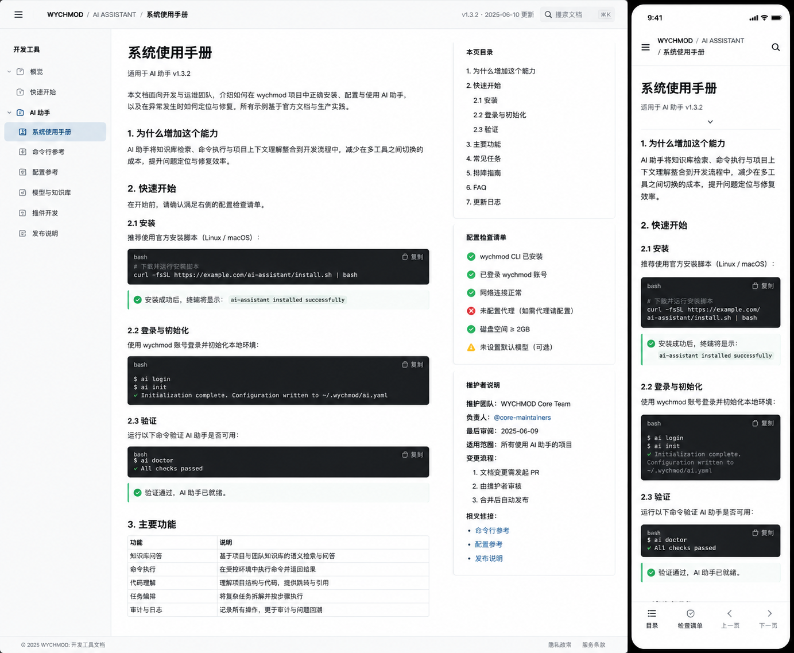

# Image 04：AI 助手配套文档统一页



> 状态：可实施
> 对应提示词：P004
> 目标文件：`docs/AI-ASSISTANT-GUIDE.md`、`docs/AI-TROUBLESHOOTING.md`、`docs/AI-UPDATE-SUMMARY.md`
> 内容真相来源：`docs/index.html` 里的终端命令对象、`docs/assets/js/ai-assistant.js` 的配置键和公开方法、三篇 AI 文档现有正文
> 核心原则：三篇文档视觉统一但内容独立；只解释和校正现有 AI 助手能力，不重写 `ai-assistant.js`，不生成图中虚构版本、团队、安装地址或检查清单。

---

## 1. 给实现模型的任务入口

你要把 AI 助手相关的三篇 Markdown 文档改造成参考图里的“系统使用手册”风格：左侧为 Docsify 文档导航，中间为手册正文，右侧为本页目录、配置检查清单和维护说明，手机端变成单列阅读，并在底部提供“目录 / 检查清单 / 上一页 / 下一页”的等价入口或原生折叠区。

这不是要新做一个 AI 产品页，也不是要新增聊天 UI。AI 助手真实能力仍然来自现有终端命令和 `docs/assets/js/ai-assistant.js`。实现模型必须先核对真实命令、配置键、错误信息，再调整文档结构和视觉。

开始前必须完整阅读：

- `AGENTS.md`
- `docs/_meta/HOMEPAGE_DESIGN_AND_IMPLEMENTATION.md`
- `docs/index.html` 中的终端 `Commands`
- `docs/assets/js/ai-assistant.js`
- `docs/AI-ASSISTANT-GUIDE.md`
- `docs/AI-TROUBLESHOOTING.md`
- `docs/AI-UPDATE-SUMMARY.md`
- `docs/_sidebar.md` 中 AI 文档入口

禁止：

- 为了匹配图而修改 `ai-assistant.js` 或终端命令系统
- 在页面里写入真实 API Key
- 承诺代码不存在的功能，例如多轮对话、向量数据库、后端代理
- 静态照抄图中的 `v1.3.2`、`WYCHMOD Core Team`、安装 URL、版本日期
- 保留旧文档里的不合时宜 Emoji 风格、科技蓝主视觉和虚构价格说明

---

## 2. Design Specification

### 2.1 Purpose Statement

AI 助手文档服务于两类读者：想快速启用终端 AI 能力的人，以及遇到配置、网络、API 返回错误时需要排查的人。页面要让读者清楚知道“现在支持什么、需要配置什么、哪里可能失败、失败后如何恢复”，并且把风险说明放在可见位置。

### 2.2 Aesthetic Direction

唯一方向：**Editorial / magazine，研究者的数字书房里的系统手册**。
它应该像一份可维护的开发者手册：白纸黑字、清楚编号、命令可复制、状态可核验、维护说明可信。不要做成 AI 营销页、聊天机器人官网或黑客终端秀。

### 2.3 Color Palette

继承首页与文章页 token：

| 语义 | 色值 | 用途 |
|---|---|---|
| 暖石墨 | `#0D100E` | 顶部导航、局部命令块 |
| 深墨 | `#131713` | 代码块和终端输出 |
| 灰纸白 | `#E9E5DC` | 页面主体背景 |
| 浅纸白 | `#F2EEE5` | 正文纸面、提示块、表格底 |
| 墨色正文 | `#20211D` | 标题、正文、表格内容 |
| 次级文字 | `#66685F` | 版本、路径、更新时间、说明 |
| 信号绿 | `#24D18F` | 配置已完成、命令成功、焦点 |
| 旧金 | `#C8A96B` | 步骤编号、警告、当前目录线 |
| 朱砂 | `#B64B45` | 错误、失败、密钥风险 |

状态不能只靠颜色表达，必须配文字和图标。禁止紫色、蓝紫渐变、亮蓝科技 SaaS 风、大面积纯黑。

### 2.4 Typography

- H1 与章节标题：`Source Han Serif SC`, `Noto Serif SC`, `Songti SC`, SimSun, serif。
- 正文、表格、提示：`Source Han Sans SC`, `Noto Sans SC`, `Microsoft YaHei`, sans-serif。
- 命令、路径、配置键、错误码：`IBM Plex Mono`, `JetBrains Mono`, Consolas, monospace。
- 桌面 H1：`34–40px / 1.2`。
- H2：`24–28px / 1.35`。
- H3：`18–21px / 1.45`。
- 正文：`15–16px / 1.75`。
- 代码：`13px / 1.65`。
- 右栏：`13–14px / 1.65`。

### 2.5 Layout Strategy

桌面是“开发手册三栏”：

```text
1440 x 900
┌──────────────────────────────────────────────────────┐
│ top nav / manual header 52-60px                      │
├─────────────┬────────────────────────┬───────────────┤
│ docs nav    │ manual article          │ utility rail  │
│ 220-260px   │ 720-820px               │ 260-300px     │
│ sticky      │ steps, commands, tables │ toc/checklist │
└─────────────┴────────────────────────┴───────────────┘
```

手机端是“单列手册 + 可折叠辅助面板”：

- 顶部 `56px`：菜单、路径、搜索。
- 正文 `16px` 边距。
- H1 左对齐，不能居中海报化。
- 代码块满宽，内部横向滚动。
- 右栏内容改到正文前后 `<details>`：本页目录、配置检查、维护说明。
- 底部导航如果实现，必须不遮挡正文和系统安全区；更推荐原生折叠。

### 2.6 Files to Change

主要：

- `docs/AI-ASSISTANT-GUIDE.md`
- `docs/AI-TROUBLESHOOTING.md`
- `docs/AI-UPDATE-SUMMARY.md`

样式：

- 文章页专用 CSS，例如 `docs/assets/css/article-reading.css`
- 或现有非首页文章作用域 CSS

只读依据：

- `docs/index.html`
- `docs/assets/js/ai-assistant.js`

可能：

- `docs/_sidebar.md`，仅在入口名称或顺序与真实文档不一致时改

### 2.7 Behaviors That Must Not Regress

必须保留：

- `ai <问题>`
- `ask <问题>` 作为 `ai` 别名
- `aiconfig`
- `aiconfig apikey YOUR_API_KEY`
- `aiconfig apiurl YOUR_API_URL`
- `aiconfig model MODEL_NAME`
- `aisearch <关键词>`
- `localStorage` 键：`AI_API_KEY`、`AI_API_URL`、`AI_MODEL`
- `window.AIAssistant.ask/search/setConfig/getConfigStatus`
- `Ctrl/Cmd + K` 只打开终端
- `Tab` 补全、上下历史、`Ctrl+L` 清屏、`Esc` 关闭终端
- Docsify 搜索、侧栏、分页、Gitalk、编辑此页

---

## 3. 参考图视觉复盘

### 3.1 桌面端

参考图桌面画布左侧是浅色文档导航，宽约 `210–230px`；导航以“开发工具”为标题，分组包括“概览、快速开始、AI 助手、命令行参考、配置参考、模型与知识库、组件开发、发布说明”等。生产中不要照抄这些分组，必须使用现有 Docsify 侧栏真实入口。

顶部栏高约 `44–52px`，左侧有菜单按钮和路径 `WYCHMOD / AI ASSISTANT / 系统使用手册`，右侧显示版本/更新日期、提交文档搜索和快捷键。当前项目可沿用全局顶部导航，但 AI 文档正文顶部必须出现等宽系统路径和真实更新时间。

中间正文栏约 `720px` 宽，顶部 H1 为“系统使用手册”，副标题说明“适用于 AI 助手 v1.3.2”。生产中这里应改成真实文档标题和真实版本/日期；没有来源就隐藏版本。正文包含：

- “为什么增加这个能力”
- “快速开始”
- `2.1 安装`
- `2.2 登录与初始化`
- `2.3 验证`
- 深色命令块，右上角复制按钮
- 成功提示块，左侧信号绿线和 check 图标
- “主要功能”表格

右侧工具栏宽约 `260–280px`，三块竖向区域：

- “本页目录”
- “配置检查清单”，含成功、错误、警告三种状态
- “维护者说明”，包含团队、负责人、最后审阅、适用范围、变更流程、相关链接

生产中“配置检查清单”要围绕真实 `AI_API_KEY`、`AI_API_URL`、`AI_MODEL`、网络、CORS、费用风险、本地搜索可用性；不显示虚构磁盘空间或登录账号。

### 3.2 手机端

手机宽约 `390px`，顶部有系统状态栏、菜单、路径、搜索。正文单列，H1 `28–32px` 左对齐。代码块宽度接近屏幕，内部横向滚动。成功提示块跟在代码块后。底部有 4 个导航项：目录、检查清单、上一页、下一页。生产中如果不实现固定底栏，应使用正文内 `<details>` 替代，但必须能快速进入目录和配置检查。

---

## 4. 三篇文档的信息架构

### 4.1 `AI-ASSISTANT-GUIDE.md`

定位：使用指南。
推荐结构：

```text
系统路径 / AI ASSISTANT / GUIDE
H1 AI 智能助手使用指南
适用范围：终端 AI 命令与本地文档搜索

1. 为什么增加这个能力
2. 使用前先知道
   - API Key 存储位置
   - 问题会发送到用户配置的 API 服务商
   - 未配置时仍可使用 aisearch/find
3. 快速开始
   3.1 打开终端
   3.2 配置 API Key
   3.3 配置 API URL
   3.4 配置模型
   3.5 验证配置
4. 命令参考
5. 使用示例
6. 推荐文档如何产生
7. 隐私与费用提醒
8. 常见问题
9. 更新记录
```

必须订正旧文档中的问题：

- 删除或替换 Emoji 标题风格。
- 删除“享受 AI 驱动的学习体验”这种营销尾句。
- 将“默认 GPT-4”改为当前代码默认模型或中性说明。当前 `ai-assistant.js` 中默认 `model` 为 `gpt-5.2`，但用户可通过 `AI_MODEL` 覆盖。
- 避免写死价格。若要谈费用，只说“以服务商当前定价为准”。
- OpenAI API 地址只作为示例，不保证唯一。

### 4.2 `AI-TROUBLESHOOTING.md`

定位：故障排查手册。
推荐结构：

```text
系统路径 / AI ASSISTANT / TROUBLESHOOTING
H1 AI 功能故障排查指南

1. 先做 3 个快速检查
2. 配置未完成
3. API URL 不是 JSON / 返回 HTML
4. 401 / 403
5. Failed to fetch / CORS
6. 429
7. 5xx
8. 本地搜索可用但 AI 不可用
9. 推荐文档打不开
10. 清除配置并重新设置
11. 提交 Issue 前要收集什么
```

视觉上每个故障块必须包含：

- 错误标题
- 可能原因
- 验证命令
- 恢复步骤
- 仍失败时的替代方案

状态色：

- 未配置/提示：旧金
- 失败/风险：朱砂
- 通过/可用：信号绿

### 4.3 `AI-UPDATE-SUMMARY.md`

定位：更新说明和维护记录。
推荐结构：

```text
系统路径 / AI ASSISTANT / CHANGELOG
H1 AI 智能问答功能更新说明

1. 本次更新解决了什么问题
2. 新增能力
3. 真实文件清单
4. 命令与配置契约
5. 技术实现关系图
6. 测试与已知缺口
7. 隐私与安全边界
8. 后续计划（只保留已确认计划或标记候选）
9. 版本记录
```

必须订正旧文档中的问题：

- `TEST-AI-ASSISTANT.md` 如果已移除，不要继续列为新增文件，或标记为历史文件。
- “已完成并测试通过”必须有验证证据；否则改成“更新说明 / 待复验”。
- 未来规划不能伪装成承诺，必须标为候选或 TODO。
- 统计行数可保留为历史说明，但不要当成页面视觉大数字。

---

## 5. 像素级布局规格

### 5.1 顶部与路径

- 顶部导航高 `56–60px`。
- 文档路径条高 `44–52px`。
- 路径文字 `12–13px` 等宽。
- 文档类型标签：
  - GUIDE：旧金细边
  - TROUBLESHOOTING：朱砂细边
  - CHANGELOG：信号绿细边
- 更新时间右对齐；移动端换行到路径下方。

### 5.2 左侧 Docsify 导航

- 桌面宽度 `220–260px`。
- 背景 `#F2EEE5` 或轻纸白。
- 当前 AI 文档项背景 `rgba(200,169,107,.12)`，左线 `2px #24D18F`。
- 分组标题 `13px` 加粗，正文项 `14px`。
- 图标使用 Lucide，例如 `book-open`、`terminal`、`settings`、`alert-circle`、`file-clock`；不得使用 Emoji。

### 5.3 主正文栏

- 宽度 `720–820px`。
- H1 `34–40px`，顶部距路径条 `36–48px`。
- 导语 `15–16px / 1.75`，最大宽度 `680px`。
- 章节 H2 上边距 `36px`，H3 上边距 `24px`。
- 手册步骤块不做卡片墙，用 `1px` 分割线和左侧编号组织。
- 表格宽度 `100%`，表头 `#F2EEE5`，边框 `rgba(32,33,29,.16)`。

### 5.4 命令块

- 背景 `#131713`。
- 圆角 `6px`。
- 顶部高度 `34–38px` 显示语言或命令用途。
- 右上角复制按钮 `32px` 高，使用 Lucide `copy`，有 `aria-label`。
- 代码内边距 `18–20px`。
- 命令提示符旧金，成功输出信号绿，错误输出朱砂。
- 长 URL 必须横向滚动，不撑破正文。

### 5.5 状态提示块

成功：

- 左侧 `3px #24D18F` 线。
- 浅绿背景不超过 `rgba(36,209,143,.08)`。
- 图标 + 标题 + 说明文字。

警告：

- 左侧 `3px #C8A96B` 线。
- 用于费用、密钥、CORS、候选计划。

错误：

- 左侧 `3px #B64B45` 线。
- 必须给出恢复动作。

### 5.6 右侧工具栏

- 宽 `260–300px`。
- Sticky 顶部偏移 `76–88px`。
- 每个模块间距 `24px`。
- 模块边框 `1px rgba(32,33,29,.14)`，圆角 `6px`，不使用阴影。
- “本页目录”最多显示到 H3。
- “配置检查清单”按真实能力：
  - `AI_API_KEY` 是否配置
  - `AI_API_URL` 是否配置
  - `AI_MODEL` 是否配置或使用默认
  - `aisearch` 本地搜索可用
  - 网络/API 调用需要用户自行验证
  - API Key 仅本地保存但仍有设备风险
- “维护说明”可以展示：
  - 真实文件名
  - 真实命令名
  - 最后更新时间来源
  - GitHub Issue 入口

### 5.7 手机端

- 边距 `16px`。
- H1 `28–32px`。
- 正文 `15px / 1.75`。
- 代码块全宽，内滚动。
- 右栏转为 `<details>`：
  - “本页目录”
  - “配置检查清单”
  - “相关文档”
- 如果实现底部栏：
  - 高 `56–64px`
  - 4 项等宽
  - 不遮挡最后段落，正文底部增加等高 padding
  - 每项有可见文本和 `aria-label`

---

## 6. 内容真实性规则

参考图中以下内容不得照抄：

- `v1.3.2`
- `WYCHMOD Core Team`
- `@core-maintainers`
- `curl -fsSL https://example.com/...`
- “未配置代理”“磁盘空间 > 2GB”等与当前实现无关的检查项
- 图中“安装、登录”流程，当前 AI 助手没有 CLI 安装流程

必须以真实代码为准：

| 项 | 当前依据 |
|---|---|
| 配置键 | `AI_API_KEY`、`AI_API_URL`、`AI_MODEL` |
| 默认模型 | `ai-assistant.js` 当前默认值 |
| 配置命令 | `aiconfig apikey`、`aiconfig apiurl`、`aiconfig model` |
| 问答命令 | `ai`、`ask` |
| 本地搜索 | `aisearch` |
| 历史命令 | `terminalHistory` |
| 阅读历史 | `readingHistory` |
| API 调用 | 用户配置的 OpenAI-compatible chat completions endpoint |

文档里涉及外部服务商价格、模型能力、API 地址时，必须使用“以服务商当前文档为准”的中性表述，不硬编码过期价格。

---

## 7. 实施计划

### Phase 0：事实核对

1. 从 `index.html` 提取 AI 相关 Commands。
2. 从 `ai-assistant.js` 提取配置键、默认模型、导出 API、错误处理。
3. 对照三篇 Markdown，列出已过时内容：
   - Emoji 标题
   - 科技蓝/营销文案
   - 已删除文件
   - 未验证价格
   - 不存在功能
4. 记录要改的文案，若涉及事实改正，在必要时同步 `docs/_meta/CORRECTIONS.md` 或文末修改记录。

### Phase 1：三篇文档结构统一

1. 三篇都加系统路径、文档类型、适用范围、真实更新时间。
2. 三篇都使用统一的命令块、状态块、表格和关联文档导航。
3. 三篇都保留自己的正文任务：
   - GUIDE 讲使用流程。
   - TROUBLESHOOTING 讲错误恢复。
   - UPDATE 讲变更记录。

### Phase 2：视觉样式

1. 在文章作用域添加 `.ai-manual`、`.manual-command`、`.manual-status`、`.manual-checklist` 等类。
2. 重绘右侧 TOC 和配置检查模块。
3. 移动端把右栏模块放入 `<details>`。
4. 保持代码块复制插件可用。

### Phase 3：验证

1. 打开三篇文档截图。
2. 复制每个关键命令示例。
3. 打开终端执行：
   - `aiconfig`
   - `aiconfig model test-model`
   - `aisearch Redis`
   - `ai 测试` 在未配置状态下检查提示
4. 验证 API Key 不出现在页面源码或截图中。

---

## 8. 状态与交互

必须设计并验证：

- 配置未完成。
- 配置已完成。
- `AI_API_URL` 为空。
- API 返回 HTML/非 JSON。
- `401/403`。
- `Failed to fetch` / CORS。
- `429`。
- `5xx`。
- `aisearch` 有结果。
- `aisearch` 无结果。
- 推荐文档路径不存在时的替代方案。
- 复制命令成功/失败。
- 移动端目录展开/收起。

错误提示必须包含“下一步”，例如：

```text
检查当前配置 → 重新设置 API URL → 使用 aisearch/find 替代 → 收集信息提交 Issue
```

---

## 9. 可访问性要求

- 每篇只有一个主 `h1`。
- 本页目录使用 `nav aria-label="本页目录"`。
- 配置检查使用列表，不用纯色圆点。
- 复制按钮有 `aria-label="复制命令"`。
- `<details>` 的 `summary` 高度不小于 `44px`。
- 错误信息不能只显示红色，必须有文本。
- 代码块横向滚动时键盘可访问。
- 底部栏若存在，必须避免遮挡正文和浏览器安全区。

---

## 10. 验证清单

静态检查：

```bash
git diff -- docs/AI-ASSISTANT-GUIDE.md docs/AI-TROUBLESHOOTING.md docs/AI-UPDATE-SUMMARY.md
git diff --check
```

必要命令：

```bash
node scripts/sidebar-check.js
node scripts/check-links.js
```

浏览器视口：

- `1440×900`：左导航、中正文、右工具栏成立。
- `1280×800`：右栏不挤压命令块。
- `1024×768`：右栏可降级。
- `768×1024`：单/双栏合理。
- `390×844`：代码不溢出，目录/检查清单可展开。
- `360×800`：长 URL 和配置键不撑破页面。

功能验证：

- 打开三篇文档。
- 点击三篇之间的关联链接。
- 复制 `aiconfig`、`aisearch`、`ai` 示例。
- 打开终端执行真实命令。
- 清空/恢复测试用 localStorage 前，确认不删除用户真实 Key；若需要测试，用测试前缀或提醒实现模型手动隔离。
- 首页 → AI 文档 → 首页，无首页视觉回归。

---

## 11. 完成定义

- 三篇 AI 文档视觉统一，但职责清晰。
- 所有命令、配置键、状态和错误说明与当前代码一致。
- 旧文档中的 Emoji 营销感、科技蓝描述、过期价格和虚构文件得到处理。
- 桌面右侧工具栏和手机折叠辅助内容可用。
- 没有修改 AI 助手核心逻辑。
- 没有泄露真实 API Key。
- 其他 Docsify、终端和首页行为不回归。

---

## 12. 可直接复制给实现模型的指令

```text
请在现有 wychmod.github.io Docsify 仓库中实现 AI 助手三篇配套文档的统一手册页视觉升级，参考 docs/_meta/ui-redesign/references/image-04.png。目标文件是 docs/AI-ASSISTANT-GUIDE.md、docs/AI-TROUBLESHOOTING.md、docs/AI-UPDATE-SUMMARY.md。不要新建独立 Demo，不要新增聊天 UI，不要修改 docs/assets/js/ai-assistant.js 或终端命令系统来迎合图片。

先完整阅读 AGENTS.md、docs/_meta/HOMEPAGE_DESIGN_AND_IMPLEMENTATION.md、docs/index.html 中的 Commands、docs/assets/js/ai-assistant.js，以及三篇 AI Markdown。实现前输出 DESIGN SPECIFICATION，声明 Purpose、Aesthetic、Color、Typography、Layout、Files to change、Behaviors that must not regress。

页面应是“研究者的数字书房里的系统手册”：60px 顶部导航，左侧 220-260px Docsify 文档导航，中间 720-820px 手册正文，右侧 260-300px 本页目录、配置检查清单和维护说明。主体使用灰纸白 #E9E5DC / 浅纸白 #F2EEE5，命令块使用深墨 #131713，标题用 Source Han Serif SC/Noto Serif SC，正文用 Source Han Sans SC/Noto Sans SC，命令和配置键用 IBM Plex Mono/JetBrains Mono。

三篇文档内容独立：GUIDE 讲快速开始和命令参考，TROUBLESHOOTING 讲错误原因和恢复步骤，UPDATE 讲真实变更和已知缺口。必须核对当前真实命令：ai、ask、aiconfig、aisearch；真实配置键：AI_API_KEY、AI_API_URL、AI_MODEL；当前导出对象：window.AIAssistant。不要照抄图里的 v1.3.2、Core Team、安装 URL、磁盘空间检查、登录流程。不要硬编码外部服务商价格，费用以服务商当前文档为准。

重绘命令块、成功/警告/错误提示、配置检查、故障排查表和交叉导航。成功用 #24D18F，警告用 #C8A96B，错误用朱砂色，并且必须配文字和恢复动作。移动端 390x844 使用 16px 边距，代码块局部滚动，右侧目录和配置检查改为 details 折叠或不遮挡正文的底部入口。

保留 Docsify hash 路由、侧栏、搜索、代码复制、Gitalk、编辑此页、终端 Ctrl/Cmd+K、Esc、Tab 补全、上下历史、Ctrl+L。新增样式必须作用域隔离，不污染首页。

完成后运行 node scripts/sidebar-check.js、node scripts/check-links.js、git diff --check，并用 1440x900、1280x800、1024x768、768x1024、390x844、360x800 截图检查。验证三篇链接、命令复制、aiconfig、aisearch、未配置 ai 的提示、移动折叠、首页往返和控制台无新增 error。不得在页面或截图中泄露真实 API Key。
```
