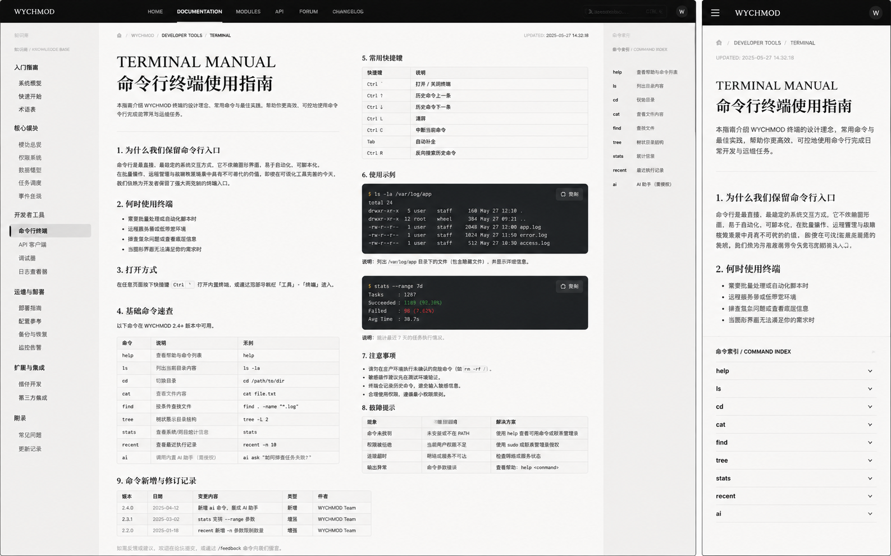

# Image 05：命令行终端使用指南



> 状态：可实施
> 对应提示词：P005
> 目标文件：`docs/README-Terminal.md`
> 只读事实来源：`docs/index.html` 内联终端系统、`docs/assets/js/ai-assistant.js`、`docs/_sidebar.md`、`docs/_meta/HOMEPAGE_DESIGN_AND_IMPLEMENTATION.md`
> 实现边界：只重写终端“使用指南”文档与必要的文章作用域样式；不得复制、重写或拆分现有 `#terminal-window` 终端实现。

---

## 1. 给实现模型的任务入口

你要把 `docs/README-Terminal.md` 改造成参考图所示的“命令行终端使用手册”。它不是产品宣传页，也不是新的终端 UI。页面的职责是解释当前站点已经存在的命令行导航系统：如何打开、有哪些真实命令、快捷键如何工作、命令历史如何保存、AI 相关命令如何配置、错误时如何恢复。

这份手册必须延续首页的视觉系统：深色暖石墨代表命令与系统状态，纸白内页代表阅读、说明、表格和修订记录。不要沿用旧文档里的“现代科技蓝”描述，也不要把页面做成黑客霓虹屏、SaaS 帮助中心、Notion 文档模板或复古终端玩具。

实现前必须完整阅读：

- `AGENTS.md`
- `docs/_meta/HOMEPAGE_DESIGN_AND_IMPLEMENTATION.md`
- `docs/index.html` 中 `#terminal-trigger`、`#terminal-window`、终端事件处理器、`Commands` 对象、`terminalHistory`、`readingHistory`
- `docs/assets/js/ai-assistant.js`
- `docs/README-Terminal.md`
- `docs/_sidebar.md`

必须先做事实校验，再做视觉实现。`README-Terminal.md` 当前存在明显过时描述：科技蓝主题、emoji 风格卖点、部分命令示例路径与当前 9 大分类不一致。你要把它整理成可信的工程手册，而不是只把旧内容套进新样式。

禁止：

- 修改 `docs/index.html` 的终端 DOM、命令执行逻辑或快捷键逻辑，除非另有明确任务。
- 创建第二套终端弹窗、第二套命令历史、第二套 AI 配置系统。
- 把 `Ctrl/Cmd + K` 改给搜索框或其他面板使用；该快捷键在本项目里属于终端。
- 编造不存在的命令、版本号、作者团队、安装地址、下载链接或统计数字。
- 复制图中的示例版本 `2.4.0`、伪造日期、伪造 `/var/log/app` 输出、伪造成功率。
- 在文档里展示真实 API Key，或暗示用户应该把密钥提交到仓库。
- 新增 emoji 作为页面图标。若源码现有终端输出里已有 emoji，只作为历史事实记录，不在新文档视觉系统里扩散。

---

## 2. 参考图视觉审计

### 2.1 桌面端画面结构

参考图桌面端宽屏约为 `1600 × 900`，整体是“黑色顶栏 + 左侧文档导航 + 中央纸白手册 + 右侧命令索引”的开发者文档布局。

从左到右：

1. 顶部黑色导航横贯全宽，高约 `48px`，左侧是 `WYCHMOD` 品牌，中央是 `HOME / DOCUMENTATION / MODULES / API / FORUM / CHANGELOG` 一类导航，右侧有搜索框、快捷键提示、头像。
2. 左侧浅灰导航宽约 `220px`，以分组标题组织文档：入门指南、核心模块、开发者工具、运维与部署、附录。当前项“命令行终端”以左侧竖线和浅灰底高亮。
3. 中央正文从 `x≈250` 开始，宽约 `900px`。顶部有面包屑、更新时间，然后是大标题 `TERMINAL MANUAL / 命令行终端使用指南`。
4. 正文不是单栏流水账，而是纸质技术手册：章节编号、横向分隔线、命令表、快捷键表、深色命令示例、注意事项、数据提示、修订记录。
5. 右侧命令索引宽约 `160–190px`，上方是 `命令索引 / COMMAND INDEX`，下面按命令列出 `help / ls / cd / cat / find / tree / stats / recent / ai` 等。生产文档中要包含所有真实命令与别名，不只照抄图里的 9 个。

### 2.2 移动端画面结构

参考图移动端约 `390 × 844`：

1. 顶部变成黑色移动导航，高约 `56px`。左侧汉堡按钮，中间 `WYCHMOD`，右侧圆形头像。
2. 左侧导航消失，正文单列，左右内边距约 `24px`。
3. 面包屑简化成一行：主页图标 / Developer Tools / Terminal。
4. 更新时间放在标题上方或面包屑下方，字号小，等宽风格。
5. H1 保持衬线大字，但桌面双行在移动端也要自然换行，不能溢出。
6. 右侧命令索引折叠到正文下方，以 accordion 展示，每个命令一行，右侧有展开箭头。

### 2.3 图中不能照搬的内容

参考图只是视觉方向，不是事实来源。以下内容不得直接复制：

- 图中的更新时间 `2025-05-27 14:32:18`。
- 图中的版本表 `2.4.0 / 2.3.1 / 2.2.0`。
- 图中的 `/var/log/app`、`stats --range 7d` 等命令输出。
- 图中只列出的 9 个命令。当前源码中真实命令更多。
- 图中的 `WYCHMOD Team`，除非仓库已有真实来源。

---

## 3. Design Specification

### 3.1 Purpose Statement

终端指南服务于已经进入知识库的读者：他们希望用键盘快速定位文档、搜索知识、查看最近访问，或通过 AI 命令获得辅助。页面要让用户一眼知道“终端不是玩具，而是站点的第二导航系统”，并把可用命令、快捷键、限制和错误恢复讲清楚。

这页还承担维护者视角：当终端命令增加或修改时，文档必须能被快速核对更新。它要像一份可信的工程手册，有温度但不夸张，有作者感但不造人设。

### 3.2 Aesthetic Direction

唯一方向：**Editorial / magazine，研究者数字书房里的命令手册**。

视觉关键词：

- 纸白手册
- 工程索引
- 命令旁注
- 终端摘录
- 可验证的维护记录
- 安静、克制、精密

禁止方向：

- 黑客霓虹终端
- 企业 SaaS 文档中心
- 通用“现代简洁”后台
- Notion 克隆
- 科技蓝渐变宣传页
- 游戏化 Shell 模拟器

### 3.3 Color Palette

继承首页 token，不新建冲突色系：

| 语义 | 色值 | 用法 |
|---|---|---|
| 暖石墨 | `#0D100E` | 顶部导航、终端示例背景、当前系统状态 |
| 深墨 | `#131713` | 命令输出块内层背景 |
| 石墨边线 | `rgba(242, 239, 231, 0.12)` | 深色块边框、顶栏分隔 |
| 灰纸白 | `#E9E5DC` | 页面主体背景 |
| 浅纸白 | `#F2EEE5` | 正文纸面、表格底、折叠索引 |
| 纸张线 | `#C9C3B7` | 表格线、章节分隔线、左侧导航线 |
| 墨色正文 | `#20211D` | 标题、正文、命令说明 |
| 次级文字 | `#66685F` | 面包屑、更新时间、备注 |
| 信号绿 | `#24D18F` | 成功状态、当前命令、焦点环 |
| 旧金 | `#C8A96B` | 当前导航项、章节编号、快捷键边框 |
| 朱砂 | `#B64B45` | 错误状态、安全提醒 |

使用规则：

- 主体不使用纯白 `#fff`，终端块不使用纯黑 `#000`。
- 命令成功、错误、警告必须配文字，不只靠颜色。
- 不使用紫色、靛蓝、蓝紫渐变。
- 信号绿只做少量状态提示，不能把整页染成终端绿。

### 3.4 Typography

字体继承首页规范：

- Display / H1：`Source Han Serif SC`, `Noto Serif SC`, `Songti SC`, SimSun, serif。
- Body：`Source Han Sans SC`, `Noto Sans SC`, `Microsoft YaHei`, sans-serif。
- Mono：`IBM Plex Mono`, `JetBrains Mono`, Consolas, monospace。

建议字号：

| 元素 | 桌面 | 移动 |
|---|---:|---:|
| 面包屑 | `12px / 1.6` | `11–12px / 1.6` |
| 英文 eyebrow `TERMINAL MANUAL` | `38–44px / 1.05` | `30–34px / 1.1` |
| 中文 H1 | `36–42px / 1.15` | `28–32px / 1.2` |
| H2 | `22–25px / 1.35` | `21–23px / 1.35` |
| H3 | `17–19px / 1.45` | `16–18px / 1.45` |
| 正文 | `15–16px / 1.75` | `15px / 1.75` |
| 表格 | `13–14px / 1.55` | 移动端转定义列表 |
| 命令代码 | `13px / 1.65` | `12.5–13px / 1.6` |
| 右侧命令索引 | `12–13px / 1.6` | accordion 行高 `48–52px` |

### 3.5 Layout Strategy

采用“固定导航壳 + 纸白技术手册 + 右侧命令索引”的非居中布局。

布局不是把所有内容装进居中卡片，而是形成明显的信息重心：

- 左侧导航提供站点上下文。
- 中央正文承担完整学习路径。
- 右侧命令索引承担快速跳转和记忆辅助。
- 深色命令块穿插在纸白正文中，形成“读文档 / 执行命令”的节奏。

---

## 4. 页面信息架构

### 4.1 页面骨架

生产页面建议结构：

```text
README-Terminal.md
├─ 顶部元信息
│  ├─ 面包屑：WYCHMOD / 开发工具 / 终端
│  ├─ 更新时间：来自文档修改记录或文件实际维护日期
│  └─ 读者提示：这是一份终端使用手册，不是新终端实现
├─ H1：TERMINAL MANUAL / 命令行终端使用指南
├─ 简介：为什么保留命令行入口
├─ 何时使用终端
├─ 打开与关闭方式
├─ 命令总览
│  ├─ 文件系统与文档导航
│  ├─ 搜索与阅读记录
│  ├─ AI 助手
│  ├─ 系统与别名
│  └─ 不支持/危险命令说明
├─ 快捷键
├─ 使用示例
│  ├─ 查找文档
│  ├─ 打开主线文章
│  ├─ 查看最近访问
│  └─ 配置 AI 助手
├─ 路径规则
├─ 错误与恢复
├─ 隐私与本地存储
├─ 命令更新与维护规则
└─ 修改记录
```

### 4.2 左侧导航内容

左侧导航不要写死成效果图里的 API 文档站结构。它应该复用当前 Docsify 侧边栏语义，或在页面内以“开发工具 / 终端 / AI 助手 / 工具箱 / 归档”组织与当前站点一致的入口。

视觉要求：

- 宽度：`216–240px`。
- 顶部与页面顶栏对齐。
- 背景：`rgba(233, 229, 220, 0.72)` 或略深纸色。
- 分组标题：等宽小写英文或中文小标题，`11–12px`，颜色 `#66685F`。
- 当前项：左侧 `3px` 旧金或信号绿细线，浅纸白底，文字加粗。
- 不使用 emoji 作为分组图标；如需要图标，使用现有 Lucide 图标并保持线性风格。

### 4.3 右侧命令索引

右侧索引不是装饰，要能辅助阅读。

桌面端：

- 宽度：`172–200px`。
- `position: sticky; top: 72px;`。
- 标题：`命令索引 / COMMAND INDEX`，中文 `13px`，英文 `10–11px` 等宽。
- 每个命令一行：左侧命令名，右侧极短用途或跳转箭头。
- 当前滚动章节可高亮，但不要引入复杂 JS；若只做 CSS/Markdown，可保持静态列表。

移动端：

- 放在 H1 和前两节说明之后，或正文第一屏下方。
- 使用 `<details>` / `<summary>` 或 Docsify 友好的折叠结构。
- 每行高度 `48–52px`，命令名等宽，说明在展开后显示。
- 不要让长命令表横向溢出。

---

## 5. 真实终端功能契约

以下内容来自 `docs/index.html` 当前终端实现。实现模型必须以当前源码为准重新核对；本节给出写文档时应该覆盖的范围。

### 5.1 打开与关闭

| 行为 | 当前事实 | 文档写法 |
|---|---|---|
| 顶部按钮 | `.nav-terminal-btn[data-open-terminal]` | 顶部导航终端按钮可打开终端 |
| 右下角按钮 | `#terminal-trigger` | 右下角 `►_` 悬浮按钮可打开终端 |
| 全局快捷键 | `Ctrl + K` 或 `Cmd + K` | 打开/关闭终端 |
| 关闭快捷键 | `Esc` | 终端激活时关闭 |
| 命令关闭 | `exit` / `quit` | 输出告别信息后关闭 |
| 首页终端预览 | 复用现有终端触发器 | 文档不得创建第二套终端 |

### 5.2 输入区快捷键

| 快捷键 | 当前行为 | 验收方式 |
|---|---|---|
| `Enter` | 执行当前输入 | 输入 `help` 后出现帮助 |
| `ArrowUp` | 浏览上一条历史命令 | 历史不为空时回填输入 |
| `ArrowDown` | 浏览下一条历史命令 | 可回到较新的历史 |
| `Tab` | 自动补全命令和路径 | 输入命令前缀后补全或提示候选 |
| `Ctrl + L` | 清空终端输出 | 终端输出恢复到空状态或欢迎状态 |
| `Esc` | 关闭终端 | 弹窗关闭，页面不跳转 |

文档中不要用 `Ctrl + C` 表示中断命令，除非当前代码真实实现。效果图里出现 `Ctrl C`，但当前源码未见明确中断逻辑，不能承诺。

### 5.3 真实命令清单

当前 `Commands` 对象包含下列命令。文档可以按用途分组，但不得漏掉关键命令，也不得把别名当成独立新能力夸大。

| 分组 | 命令 | 说明 |
|---|---|---|
| 帮助 | `help` | 显示可用命令列表 |
| 帮助 | `man <命令>` | 显示指定命令手册 |
| 文档导航 | `pwd` | 显示当前路径 |
| 文档导航 | `ls [path]` | 列出当前或指定目录内容 |
| 文档导航 | `cd [目录]` | 切换目录；无参数回到根目录 |
| 文档导航 | `cat <文件>` | 打开指定文档；支持带或不带 `.md` 后缀 |
| 文档导航 | `tree [path]` | 显示目录树 |
| 搜索 | `find <关键词>` | 在文档树中搜索标题或路径 |
| 搜索别名 | `grep <关键词>` | 调用 `find` |
| 搜索别名 | `search <关键词>` | 调用 `find` |
| 阅读 | `readme` | 打开知识库简介 |
| 阅读 | `recent` | 显示最近访问记录 |
| 统计 | `stats` | 显示知识库统计信息 |
| 历史 | `history` | 显示命令历史 |
| 系统 | `clear` | 清空终端 |
| 系统 | `whoami` | 显示用户信息 |
| 系统 | `about` | 显示关于信息 |
| 系统 | `fortune` | 随机技术名言 |
| 系统 | `neofetch` | 系统信息面板 |
| 系统 | `echo <文本>` | 回显文本 |
| 系统 | `exit` | 输出告别信息并关闭终端 |
| 系统别名 | `quit` | 调用 `exit` |
| 别名 | `open <文件>` | 调用 `cat` |
| 别名 | `view <文件>` | 调用 `cat` |
| 别名 | `ll [path]` | 调用 `ls` |
| 别名 | `dir [path]` | 调用 `ls` |
| AI | `ai <问题>` | 调用 AI 助手回答问题或推荐文档 |
| AI 别名 | `ask <问题>` | 调用 `ai` |
| AI 配置 | `aiconfig [key] [value]` | 查看或设置 AI 配置 |
| AI 搜索 | `aisearch <关键词>` | 本地智能文档搜索 |

如果实现时源码已经变化，以源码为准，并同步更新本手册。不要因为参考图只显示 9 个命令就删掉源码里存在的命令。

### 5.4 本地存储与隐私

文档必须明确：

- 命令历史使用 `localStorage` 键 `terminalHistory`。
- 当前实现最多保存最近 `100` 条命令历史。
- 最近阅读记录使用 `localStorage` 键 `readingHistory`。
- AI 配置由 `ai-assistant.js` 管理，涉及 `AI_API_KEY`、`AI_API_URL`、`AI_MODEL` 等键。
- 文档中只能展示占位符，例如 `YOUR_KEY`，禁止展示真实密钥。
- 需要提醒用户：浏览器本地存储不是团队密钥管理工具，不应在公共设备或共享浏览器中长期保存敏感 Key。

### 5.5 错误状态

文档至少覆盖这些真实或必然出现的错误：

| 场景 | 典型信息 | 文档中的解释 |
|---|---|---|
| 未知命令 | `Command not found` | 命令不存在；输入 `help` 查看列表 |
| 找不到目录 | `No such directory` | 路径拼写或当前位置错误 |
| 文件不存在 | `File not found` | 文件名不匹配，可先 `find` 搜索 |
| 对目录使用 `cat` | `is a directory` | 先 `cd` 进入或 `ls` 查看 |
| 对文件使用 `cd` | `Not a directory` | 使用 `cat` 打开文件 |
| `find` 无关键词 | `Usage: find <keyword>` | 需要传入关键词 |
| `aisearch` 无关键词 | `Usage: aisearch <关键词>` | 需要传入关键词 |
| AI 模块未加载 | AI 助手模块未加载 | 检查 `ai-assistant.js` 是否加载 |
| AI 未配置 | 配置缺失或 API 错误 | 先查看 `aiconfig`，再配置必要字段 |

错误说明要像“排查手册”，不要像责备用户。每个错误最好给出一条恢复命令。

---

## 6. 桌面端像素级布局

以 `1440 × 900` 到 `1600 × 900` 为主要验收尺寸。

### 6.1 页面外壳

```text
┌──────────────────────────────────────────────────────────┐
│ 48-56px 顶部暖石墨导航                                   │
├──────────────┬──────────────────────────────┬────────────┤
│ 216-240px    │ 760-900px 主手册正文          │ 172-200px  │
│ 左侧导航     │ 命令表 / 说明 / 示例           │ 命令索引   │
└──────────────┴──────────────────────────────┴────────────┘
```

建议尺寸：

- 顶栏高度：`52px`。
- 页面最大宽度：`1440px`，超过时居中但内部三栏保持比例。
- 左侧导航：`220px`。
- 左侧导航与正文间距：`36px`。
- 正文宽度：`760–860px`，在更宽屏可允许到 `900px`。
- 右侧索引：`180px`。
- 正文与右侧索引间距：`36px`。
- 主区域上边距：`48–56px`。
- 主区域下边距：`80px`。

### 6.2 顶部区域

顶部正文区结构：

```text
面包屑 / 更新时间
TERMINAL MANUAL
命令行终端使用指南
一句说明：常用命令、快捷键、AI 配置、错误恢复
细分隔线
```

具体要求：

- 面包屑使用等宽小字，字号 `11–12px`，颜色 `#66685F`。
- 当前路径 `TERMINAL` 可加粗或用旧金下划线。
- 更新时间若没有真实维护记录，不显示具体时间；可显示“以当前仓库文档为准”。
- 英文标题与中文标题之间间距 `4–8px`，整体不要居中，必须左对齐。
- 标题下描述宽度不超过 `620px`，行高 `1.8`。
- 分隔线距描述底部 `28–32px`。

### 6.3 章节排版

每个一级章节采用：

```text
左侧章节编号  章节标题
              正文 / 表格 / 命令块
```

可用 CSS 实现：

- H2 上边距：`44–56px`。
- H2 下边距：`14–18px`。
- 章节编号使用衬线或等宽，`20–24px`，颜色 `#20211D`。
- 正文每段最大宽度 `680px`。
- 列表项间距 `6–8px`。
- 不使用厚重阴影；以纸张线、分隔线和小面积底色组织层级。

### 6.4 命令表

命令总览表建议桌面端保留表格：

- 表格宽度 `100%`。
- 表头背景 `rgba(201, 195, 183, 0.22)`。
- 单元格 padding：`10px 12px`。
- 表格线：`1px solid rgba(201, 195, 183, 0.75)`。
- 命令列使用等宽字体，背景可轻微纸灰。
- 示例列命令必须可复制但不做假按钮泛滥。
- 复杂命令如 `aiconfig [key] [value]` 允许换行，不能压缩到不可读。

### 6.5 快捷键表

快捷键表可以做成紧凑表格或 definition list。

视觉：

- 快捷键用 `<kbd>` 包住。
- `<kbd>` 背景：`#F2EEE5`，边框 `#C9C3B7`。
- 字体：等宽 `12px`。
- 圆角：`3px`。
- 不能使用胶囊形大圆角。

内容必须包含：

- `Ctrl + K` / `Cmd + K`
- `Esc`
- `Enter`
- `ArrowUp` / `ArrowDown`
- `Tab`
- `Ctrl + L`

不要包含当前源码没有的 `Ctrl + C` 中断。

### 6.6 深色命令示例

命令块是视觉重点，参考图中约 `520 × 160px`。

实现要求：

- 背景：`linear-gradient` 可以在暖石墨内部做极轻微明暗变化，但不得使用紫/蓝紫渐变。
- 外层：`background: #0D100E; border: 1px solid rgba(242,239,231,.12); border-radius: 6px;`
- 内边距：`18–22px`。
- 命令提示符 `$` 使用旧金或信号绿。
- 输出文字使用 `#E9E5DC`，次级输出 `#A9AEA7`。
- 示例必须来自当前站点命令，不出现危险命令，不出现服务器真实路径。

推荐示例：

```bash
$ find Redis
$ cat /md/02-后端开发/10-Redis缓存.md
```

```bash
$ recent
$ stats
```

```bash
$ aiconfig
$ aiconfig apikey YOUR_KEY
$ ai 如何复习 JVM 内存模型？
```

注意：第三组示例必须提示不要在公共设备保存真实 Key。文档中不要写真实 Key。

### 6.7 错误恢复表

错误恢复区像图中第 8 节，但生产内容应更贴近当前终端：

- 三列：现象 / 可能原因 / 恢复命令。
- 朱砂色只标记错误标题或小状态点。
- 每行给一个可执行下一步，例如 `help`、`find <关键词>`、`pwd`、`ls`、`aiconfig`。
- 移动端转为一组错误卡片或定义列表。

### 6.8 修订记录

旧文档末尾的“享受探索”式结尾应改为维护记录。

建议表头：

| 日期 | 类型 | 说明 |
|---|---|---|
| YYYY-MM-DD | 重构 | 按首页 V2 视觉系统重写终端使用指南，并按源码校准命令清单 |

日期使用实施当天真实日期。若项目规范要求文末修改记录，保持一致。

---

## 7. 移动端布局规则

以 `390 × 844` 和 `360 × 800` 为验收尺寸。

### 7.1 布局转化

- 顶部导航高度：`52–56px`。
- 左侧导航隐藏或变成 Docsify 原有侧边栏抽屉，不另做复杂二级导航。
- 主体宽度：`100%`。
- 主体 padding：`24px`，在 `360px` 下可降至 `20px`。
- H1 左对齐，不居中。
- 英文 `TERMINAL MANUAL` 可保留，但字号降到 `30–34px`。
- 中文标题字号 `28–32px`，最多两行自然换行。
- 表格转为定义列表或纵向命令块，避免横向滚动。
- 命令示例块可横向滚动，但正文不能整体溢出。

### 7.2 命令索引 accordion

移动端命令索引应出现在标题和简介之后，标题类似：

```text
命令索引 / COMMAND INDEX
```

每个 `<details>`：

- 高度闭合时 `48–52px`。
- `summary` 左侧为命令名，右侧为简短用途或箭头。
- 展开后显示用法、示例、注意事项。
- 不要默认全部展开，避免首屏被索引吞掉。

### 7.3 移动端内容顺序

推荐顺序：

1. 面包屑
2. 更新时间或维护说明
3. H1
4. 简介
5. 为什么保留命令入口
6. 何时使用终端
7. 命令索引 accordion
8. 打开方式与快捷键
9. 使用示例
10. 错误恢复
11. 隐私与存储

---

## 8. 内容重写要求

### 8.1 必须删除或改写的旧内容

当前 `docs/README-Terminal.md` 中这些内容不符合首页 V2：

- “现代科技蓝主题”。
- “深蓝渐变 / 蓝色边框 / 发光效果”。
- 以 emoji 作为功能图标的列表。
- 旧分类路径示例，例如与当前 9 大分类不一致的 `Java技术栈`。
- “彩蛋命令”如果保留，必须改成“系统辅助命令”，并说明其真实范围。
- 过度营销口吻，例如“强大的”“完美的”“享受探索之旅”。

### 8.2 推荐文案基调

文案要像作者给未来的自己和读者写的维护手册：

- 稳定、具体、可验证。
- 有人味，但不过度煽情。
- 解释“为什么”，不仅列“是什么”。
- 错误恢复要温和，避免责备。

可用的开头方向：

```text
这个终端不是为了模拟一台真实服务器，而是为知识库保留一条更快的键盘路径。
当你已经知道自己要找什么，命令比鼠标层层展开更直接；当你还不确定关键词，
find、tree、recent 和 AI 命令可以把阅读路径重新拉出来。
```

### 8.3 示例必须贴合当前知识库

示例路径应来自当前 9 大分类，例如：

- `/md/01-计算机基础/00-Java与JVM.md`
- `/md/02-后端开发/10-Redis缓存.md`
- `/md/03-云原生与运维/10-Kubernetes编排.md`
- `/md/05-AI与Agent/10-Agent设计模式与多Agent.md`
- `/md/09-开发工具/00-Git版本控制.md`

但最终实现要以 `_sidebar.md` 和实际文件为准。不要写不存在的路径。

### 8.4 AI 命令说明

AI 部分必须讲清楚：

- `ai <问题>` 用于 AI 技术问答和文档推荐。
- `ask <问题>` 是 `ai` 的别名。
- `aiconfig` 可查看配置。
- `aiconfig apikey YOUR_KEY` 设置 API Key。
- `aiconfig apiurl YOUR_URL` 设置 API URL。
- 如果 `ai-assistant.js` 支持模型配置，也按真实键名说明。
- `aisearch <关键词>` 是本地智能文档搜索，不等同于远程 LLM 问答。

安全提醒要放在 AI 命令附近，而不是埋到最后：

```text
不要把真实 API Key 写进 Markdown、截图、Issue 或提交记录。
浏览器 localStorage 只适合个人设备上的本地配置。
```

---

## 9. 实施步骤

### 9.1 事实核对

1. 从 `docs/index.html` 抽取 `Commands` 对象。
2. 记录每个命令的参数、行为、错误信息和别名。
3. 从事件处理器核对快捷键：`Ctrl/Cmd + K`、`Esc`、`Enter`、`ArrowUp`、`ArrowDown`、`Tab`、`Ctrl + L`。
4. 从 `ai-assistant.js` 核对 AI 配置键和公开方法。
5. 从 `_sidebar.md` 核对真实分类和示例路径。

### 9.2 文档重构

1. 重写 `docs/README-Terminal.md` 的标题、简介和章节。
2. 删除过时科技蓝主题说明。
3. 建立命令总览、快捷键、示例、错误恢复、隐私说明、修订记录。
4. 对长表格增加移动端替代结构；必要时使用 Markdown 表格 + HTML definition list 组合。
5. 保留 Docsify 可渲染的 Markdown，不引入构建步骤。

### 9.3 样式实现

如需要新增 CSS，必须满足：

- 使用文章页或终端指南专属作用域，例如 `.terminal-manual`，不得使用宽泛选择器污染全站文章。
- token 继承 `studio-tokens.css` / 首页规范。
- 不覆盖 `#terminal-window` 的交互样式，除非只是文档内静态示例块。
- 静态命令示例块类名建议为 `.terminal-manual__sample`，避免与真实终端 `.terminal-*` 冲突。
- 如果放入 `modern-theme.css`，要集中在文章/文档作用域段落，不要在文件末尾散乱堆叠。

### 9.4 交互增强

本任务不是实现新终端交互。允许的增强仅限文档阅读：

- 右侧目录锚点。
- 移动端 `<details>` 命令索引。
- 静态复制按钮，如项目已有统一复制机制可复用；没有则不要为一个文档引入复杂 JS。

不得实现：

- 新命令解释器。
- 新命令历史。
- 新快捷键占用。
- 新 AI 聊天面板。

---

## 10. 验证清单

### 10.1 静态检查

运行：

```bash
node scripts/sidebar-check.js
node scripts/check-links.js
git diff --check
```

如果 `check-links.js` 存在历史死链，必须确认本任务没有新增 `README-Terminal.md` 相关死链。

### 10.2 内容事实检查

逐项确认：

- 文档列出的每个命令都存在于当前 `Commands` 对象，或被明确标注为别名。
- 文档没有列出源码不存在的中断快捷键、危险命令或虚构命令。
- `Ctrl/Cmd + K` 仍属于终端。
- `terminalHistory` 与 `readingHistory` 说明正确。
- AI 配置只出现占位符，不出现真实 Key。
- 示例路径全部存在。
- 图中的伪版本、伪日期、伪团队没有进入生产文档。

### 10.3 浏览器功能检查

本地启动 Docsify 后检查：

```bash
npx docsify-cli serve docs --port 3000
```

在浏览器中验证：

- `Ctrl/Cmd + K` 打开终端。
- `Esc` 关闭终端。
- `help` 显示命令列表。
- `man help` 或任一真实命令手册可用。
- `ls`、`pwd`、`cd`、`cat`、`find`、`tree`、`recent`、`stats` 至少各试一次。
- `ll`、`dir`、`open`、`view`、`grep`、`search`、`ask` 等别名行为与文档一致。
- `Ctrl + L` 清空终端。
- `ArrowUp` / `ArrowDown` 可浏览历史。
- 刷新后最近命令历史仍可读取，不报错。

### 10.4 视觉检查

截图尺寸：

- `1440 × 900`
- `1280 × 800`
- `1024 × 768`
- `768 × 1024`
- `390 × 844`
- `360 × 800`

验收标准：

- 桌面端左侧导航、中央正文、右侧命令索引三栏清楚。
- H1 左对齐，不能居中。
- 表格无横向溢出。
- 深色命令块和真实终端弹窗视觉相近但不混淆。
- 移动端命令索引折叠可读，表格转纵向，不挤压。
- 页面没有蓝紫渐变、科技蓝旧主题、emoji 图标堆砌。
- 文章页其他 Markdown 不被终端指南样式污染。

---

## 11. 可直接复制给实现模型的指令

请按以下要求实现 Image 05 对应页面。

你需要重写 `docs/README-Terminal.md`，把它从旧的“科技蓝主题 + 简略命令介绍”改造成“研究者数字书房里的命令行终端使用手册”。视觉参考 `docs/_meta/ui-redesign/references/image-05.png`，但事实来源必须以当前仓库源码为准。

开始前必须阅读：

1. `AGENTS.md`
2. `docs/_meta/HOMEPAGE_DESIGN_AND_IMPLEMENTATION.md`
3. `docs/index.html` 中终端 DOM、快捷键处理、`Commands` 对象、`terminalHistory`、`readingHistory`
4. `docs/assets/js/ai-assistant.js`
5. `docs/README-Terminal.md`
6. `docs/_sidebar.md`

设计规格：

- Purpose：让读者知道如何用终端快速导航、搜索、查看最近访问、调用 AI 辅助，并知道错误时如何恢复。
- Aesthetic Direction：Editorial / magazine，研究者数字书房里的命令手册。
- Color：继承首页暖石墨 `#0D100E`、深墨 `#131713`、灰纸白 `#E9E5DC`、浅纸白 `#F2EEE5`、纸张线 `#C9C3B7`、墨色正文 `#20211D`、信号绿 `#24D18F`、旧金 `#C8A96B`、朱砂 `#B64B45`。
- Typography：标题用中文衬线，正文用中文无衬线，命令/路径/快捷键用等宽字体。不要使用 Inter、Roboto、Arial、Helvetica 作为首选字体。
- Layout：桌面端为黑色顶栏 + 左侧导航 + 中央纸白手册 + 右侧 sticky 命令索引；移动端为单列正文 + accordion 命令索引。

内容结构必须包含：

1. 面包屑和维护说明。
2. `TERMINAL MANUAL / 命令行终端使用指南` 标题。
3. 为什么保留命令行入口。
4. 何时使用终端。
5. 打开方式：右下角按钮、顶部按钮、`Ctrl/Cmd + K`，关闭方式：`Esc`、`exit/quit`。
6. 快捷键：`Enter`、`ArrowUp/ArrowDown`、`Tab`、`Ctrl + L`、`Esc`、`Ctrl/Cmd + K`。
7. 命令总览，必须覆盖当前 `Commands` 对象中的真实命令：`help`、`man`、`pwd`、`ls`、`cd`、`cat`、`tree`、`find`、`grep`、`search`、`readme`、`recent`、`stats`、`history`、`clear`、`whoami`、`about`、`fortune`、`neofetch`、`echo`、`exit`、`quit`、`open`、`view`、`ll`、`dir`、`ai`、`ask`、`aiconfig`、`aisearch`。如源码已变化，以源码为准。
8. 真实使用示例，路径必须来自当前 `_sidebar.md` 和实际文件。
9. AI 命令配置说明，只使用 `YOUR_KEY`、`YOUR_URL` 等占位符。
10. 错误恢复表：未知命令、找不到目录、找不到文件、目录/文件类型错误、AI 未配置、搜索无结果。
11. 隐私说明：`terminalHistory`、`readingHistory`、AI 配置存在浏览器本地存储中。
12. 修改记录。

视觉实现要求：

- 删除旧文档中的“现代科技蓝”“深蓝渐变”“蓝色发光”“享受探索之旅”等过时营销描述。
- 不新增 emoji 作为图标。
- 静态命令示例块使用暖石墨背景，但不要复用真实终端弹窗 ID。
- 表格在桌面可读，移动端转纵向或可读的折叠区。
- 样式必须有页面作用域，例如 `.terminal-manual`，不得污染全站文章。
- 不修改 `docs/index.html` 里的终端逻辑，不创建第二套终端。

完成后验证：

```bash
node scripts/sidebar-check.js
node scripts/check-links.js
git diff --check
```

再在 `1440×900`、`1280×800`、`1024×768`、`768×1024`、`390×844`、`360×800` 检查页面。逐项执行文档里的命令和快捷键，确保文档与当前终端行为一致；确认没有新增死链、没有真实 API Key、没有破坏首页和文章页。
