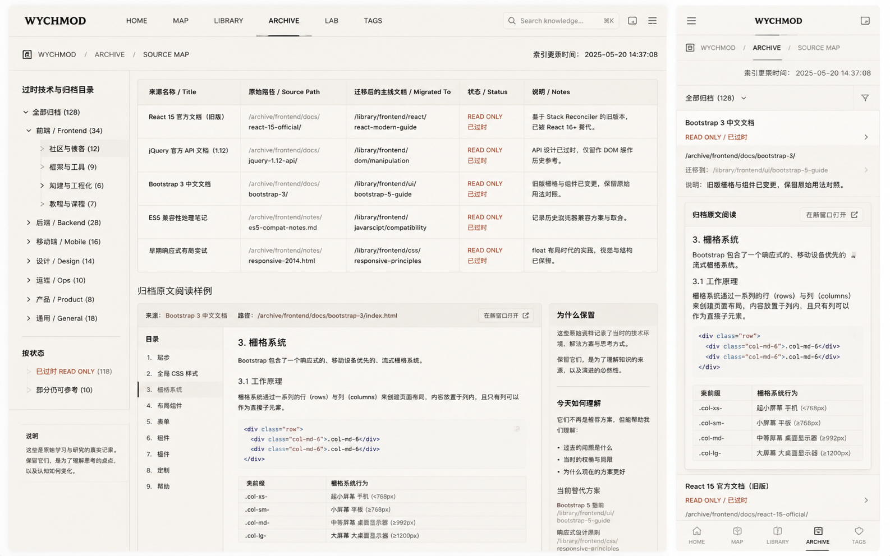

# Image 06：归档索引与只读阅读入口



> 状态：可实施
> 对应提示词：P006
> 目标文件：`docs/md/archive/README.md`
> 内容真相来源：`docs/md/archive/README.md` 现有来源映射表、`docs/md/archive/` 真实目录结构、`docs/_meta/REFACTOR_GUIDELINES.md`、`docs/_meta/CORRECTIONS.md`、`scripts/count-archive.js`
> 最高边界：除 `docs/md/archive/README.md` 这个索引文件外，禁止修改 `docs/md/archive/` 下任何归档原文件、图片、PDF、doc/docx、txt 或目录。

---

## 1. 给实现模型的任务入口

你要把 `docs/md/archive/README.md` 改造成参考图所示的“归档来源地图 / Source Map”页面。它不是新的内容阅读器，也不是把归档文档重新整理一遍。页面的职责是让读者和维护者快速理解：哪些原始资料被保留在哪里、它们迁移到了哪篇主线文档、为什么保留、如何只读查看、哪些信息已经过时。

归档页是整个知识库最容易被误伤的页面之一。它保存的是作者学习过程中的原始痕迹：错别字、过时技术、风格不统一、早期截图、课程笔记、PDF、docx、txt 都是“证据”。实现模型只能重排索引说明，不能为了视觉统一去清洗原文。

实现前必须完整阅读：

- `AGENTS.md`
- `docs/_meta/HOMEPAGE_DESIGN_AND_IMPLEMENTATION.md`
- `docs/md/archive/README.md`
- `docs/_meta/REFACTOR_GUIDELINES.md`
- `docs/_meta/CORRECTIONS.md`
- `scripts/count-archive.js`
- `docs/_sidebar.md`
- `docs/md/Index.md`

禁止：

- 修改除 `docs/md/archive/README.md` 以外的任何 `docs/md/archive/**` 文件。
- 自动格式化、重命名、移动、删除归档原文。
- 为了匹配图而新建虚构归档分类、虚构来源、虚构迁移目标。
- 复制参考图中的 `128`、`Frontend 34`、`Bootstrap 3 中文文档`、`React 15 官方文档` 等示例数据。
- 把归档页做成“复古档案馆”“咖啡馆旧纸箱”或纯表格后台。
- 自动内联大量归档正文，导致页面臃肿或误导读者以为原文已被改写。
- 在移动端隐藏字段名，只保留值。归档索引必须可追溯。

---

## 2. 参考图视觉审计

### 2.1 桌面端画面结构

参考图桌面端约 `1600 × 900`，页面是“纸白编目系统”：

1. 顶部是浅纸白导航栏，高约 `56px`，左侧品牌 `WYCHMOD`，中央有 `HOME / MAP / LIBRARY / ARCHIVE / LAB / TAGS`，当前 `ARCHIVE` 下方有墨色短线。
2. 右上角搜索框、快捷键、图标按钮与首页气质一致，但生产实现应沿用当前 Docsify 导航，不为归档页另写一套站点导航。
3. 顶栏下方是路径行：`WYCHMOD / ARCHIVE / SOURCE MAP`，左侧有小型线性图标，右侧有“索引更新时间”。
4. 页面主体分三栏：
   - 左栏宽约 `260px`：归档分类树、状态筛选、说明。
   - 中栏宽约 `920px`：来源映射表和归档原文阅读样例。
   - 右侧或中下局部宽约 `240px`：为什么保留、今天如何理解、当前替代方案。
5. 中央表格是视觉主轴：列为来源名称、原始路径、迁移后的主线文档、状态、说明。每行有明显横线，长路径自动换行。
6. 下半部分出现“归档原文阅读样例”：左侧目录，右侧原文片段，中间像旧技术文档；旁边是“为什么保留”的解释。

### 2.2 移动端画面结构

参考图移动端约 `390 × 844`：

1. 顶部浅色移动导航，高约 `56px`，左侧汉堡按钮，中间 `WYCHMOD`，右侧小图标。
2. 面包屑分成短行：`WYCHMOD / ARCHIVE / SOURCE MAP`。
3. 更新时间放在面包屑下方，居中或靠左都可，但必须很轻。
4. 顶部有“全部归档”下拉和筛选图标。
5. 每个归档项变成纵向卡片：标题、状态、原始路径、迁移到、说明、右箭头。
6. “归档原文阅读”变成单张可读卡片，包含原文标题、章节、代码块/表格样例。
7. 底部有移动 tab 导航，生产项目如果没有统一底部导航，不要为归档页单独创造新的全站导航。

### 2.3 图中不能照搬的内容

参考图中的内容是视觉占位，不是仓库事实：

- `全部归档 (128)`、`Frontend (34)`、`Backend (28)` 等统计。
- `Bootstrap 3 中文文档`、`React 15 官方文档`、`jQuery API 文档` 等来源。
- `/archive/frontend/docs/bootstrap-3/` 等路径。
- `/library/frontend/ui/bootstrap-5-guide` 等迁移目标。
- `READ ONLY / 已过时` 的具体数量。
- “栅格系统”原文片段。
- 底部 `HOME / MAP / LIBRARY / ARCHIVE / TAGS` tab。

生产页面必须从当前 `archive/README.md` 和真实目录结构取值。没有来源的数据宁可不显示。

---

## 3. Design Specification

### 3.1 Purpose Statement

归档索引页服务于两类人：读者想知道“这篇主线文档从哪些旧笔记合并而来”，维护者想确认“原始资料在哪里、是否仍需保留、后续改动应该写到哪里”。页面要把归档从“杂物堆”变成“可追溯的研究底稿”，清楚表达只读边界和知识演化。

这页的人文感来自真实痕迹：旧笔记、课程资料、图片、PDF、过时技术、迁移记录。不要用虚构怀旧元素制造情绪；真正的情绪是“我能看见知识怎样一步步长成现在的样子”。

### 3.2 Aesthetic Direction

唯一方向：**Editorial / magazine，研究者数字书房里的来源地图**。

视觉关键词：

- 来源地图
- 迁移台账
- 只读底稿
- 纸白编目
- 边注解释
- 可追溯、可信、克制

禁止方向：

- 复古档案馆布景
- 后台管理表格
- Notion 数据库克隆
- 法务合同清单
- 咖啡馆旧纸箱
- 黑客文件浏览器

### 3.3 Color Palette

继承首页纸白系统：

| 语义 | 色值 | 用法 |
|---|---|---|
| 灰纸白 | `#E9E5DC` | 页面主体背景 |
| 浅纸白 | `#F2EEE5` | 表格底、索引项、说明块 |
| 纸张线 | `#C9C3B7` | 表格线、树线、卡片边框 |
| 墨色正文 | `#20211D` | 标题、正文、路径标题 |
| 次级文字 | `#66685F` | 路径、备注、更新时间 |
| 暖石墨 | `#0D100E` | 顶栏、重要索引文字、小型代码块 |
| 旧金 | `#C8A96B` | 当前导航、索引号、路径分隔 |
| 信号绿 | `#24D18F` | 有效主线链接、可阅读入口 |
| 锈色 | `#A66B45` | 只读/过时状态 |
| 朱砂 | `#B64B45` | 禁改警告、危险提示 |

使用规则：

- `READ ONLY / 只读` 不只靠锈色，必须显示文字。
- 主线迁移链接可以用信号绿或墨色下划线，但不要像按钮一样抢眼。
- 禁改说明可用朱砂小条，但不能把整页做成错误警报。
- 不使用纯白大背景、纯黑文件树、紫色或蓝紫渐变。

### 3.4 Typography

字体继承首页：

- 页面标题、重要说明：`Source Han Serif SC`, `Noto Serif SC`, `Songti SC`, SimSun, serif。
- 正文、表格、导航树：`Source Han Sans SC`, `Noto Sans SC`, `Microsoft YaHei`, sans-serif。
- 路径、文件名、计数、日期：`IBM Plex Mono`, `JetBrains Mono`, Consolas, monospace。

字号建议：

| 元素 | 桌面 | 移动 |
|---|---:|---:|
| 面包屑 | `12px / 1.6` | `11–12px / 1.6` |
| 页面 H1 | `36–42px / 1.15` | `29–34px / 1.18` |
| H2 | `24–28px / 1.35` | `22–24px / 1.35` |
| 表格正文 | `13–14px / 1.55` | 转卡片 `14px / 1.6` |
| 路径 | `12–13px / 1.65` | `12px / 1.6` |
| 左栏树 | `13–14px / 1.7` | 隐藏或折叠 |
| 边注 | `13–14px / 1.7` | `14px / 1.7` |

### 3.5 Layout Strategy

采用“编目树 + 映射表 + 边注解释”的非居中布局。它不是普通内容文章，也不是简单全宽表格。

桌面端：

```text
┌────────────────────────────────────────────────────────────┐
│ 顶部导航 / 面包屑 / 更新时间                                │
├───────────────┬──────────────────────────────┬─────────────┤
│ 240-280px     │ 760-920px                    │ 220-260px   │
│ 归档分类树     │ 来源映射表 + 原文阅读样例      │ 为什么保留    │
└───────────────┴──────────────────────────────┴─────────────┘
```

移动端：

```text
顶部导航
面包屑 + 更新时间
H1 + 只读说明
筛选/分类折叠
来源映射卡片列表
目录结构折叠
归档原则
返回主线入口
```

---

## 4. 页面信息架构

生产页面建议结构：

```text
归档目录索引
├─ 页面导语
│  ├─ 这是什么：来源映射与只读底稿
│  ├─ 这不是什么：不是主线文档、不是推荐阅读入口
│  └─ 最重要规则：原文件保持原貌，改正在主线文档
├─ 快速入口
│  ├─ 回到全站地图
│  ├─ 查看重构规范
│  ├─ 查看订正台账
│  └─ 搜索主线文档
├─ 归档来源映射
│  ├─ 主线新文档
│  ├─ 归档目录
│  ├─ 来源文件数
│  ├─ 归档时间
│  └─ 备注
├─ 归档目录结构
│  └─ 真实目录树
├─ 归档原则
│  ├─ 原文件改动规则
│  ├─ 何时归档
│  └─ 不归档的情况
├─ 如何阅读归档
│  ├─ 先看主线
│  ├─ 再看归档
│  └─ 发现错误时写入主线订正
└─ 修改记录
```

当前 `archive/README.md` 已有“作用、配套文档、目录规则、来源映射、目录结构、归档原则”。实现模型应在保留事实的基础上重组视觉层级，不要丢字段。

---

## 5. 桌面端像素级布局

以 `1440 × 900` 和 `1600 × 900` 为主要验收尺寸。

### 5.1 页面外壳

建议：

- 页面背景：`#E9E5DC`。
- 主容器最大宽度：`1440px`。
- 左右外边距：`32–40px`。
- 顶部导航高度：沿用当前项目，不单独新建全局导航。
- 页面首行面包屑高度：`56–64px`。
- 主体网格：`grid-template-columns: 260px minmax(0, 1fr) 240px; gap: 28px;`
- 当宽度小于 `1180px`：右侧边注下移到中栏下方，保持两栏。

### 5.2 顶部说明区

顶部应包含：

1. 面包屑：`WYCHMOD / ARCHIVE / SOURCE MAP`。
2. 维护说明：例如“索引更新时间来自本文件修改记录或 Git 变更，不使用设计图伪时间”。
3. H1：`ARCHIVE / 归档目录索引` 或 `SOURCE MAP / 归档来源地图`。
4. 一段导语：说明归档保存学习底稿，主线文档才是当前推荐阅读入口。
5. 禁改提示条：明确“除本索引外，不修改归档原文”。

具体尺寸：

- 面包屑字号 `12px`，等宽，行高 `1.6`。
- H1 英文部分 `38–44px`，中文部分 `34–40px`。
- 导语宽度不超过 `720px`，行高 `1.8`。
- 禁改提示条宽度可跟正文一致，高度 `48–64px`，左侧 `3px` 朱砂边线。

### 5.3 左侧归档分类树

左栏视觉像参考图，但内容必须来自真实目录或来源映射表。

模块：

```text
过时技术与归档目录
├─ 全部归档
├─ 计算机基础
├─ 后端开发
├─ 云原生与运维
├─ 前端
├─ AI 与 Agent
├─ 软件工程
├─ 求职
├─ 过时技术
└─ 开发工具

按状态
├─ 已迁移到主线
├─ 仅作历史参考
└─ 原文件只读

说明
```

注意：

- 不得根据参考图伪造 `Frontend 34` 等数量。
- 如果要显示数量，必须由脚本或实际表格统计产生，并说明统计口径。
- 如果暂时没有自动统计，就只显示分类名称。
- 当前项可用旧金左线高亮。
- 树线用 `#C9C3B7`，缩进 `16px`。

### 5.4 中央来源映射表

当前 `archive/README.md` 的来源映射表字段是：

| 主线新文档 | 归档目录 | 来源文件数 | 归档时间 | 备注 |
|---|---|---|---|---|

生产页面不要强行改成参考图字段而丢失现有信息。可以在视觉标签上解释为：

- 主线新文档：迁移后的当前阅读入口。
- 归档目录：原始资料所在目录。
- 来源文件数：迁移来源规模。
- 归档时间：进入归档的日期。
- 备注：迁移说明、特殊文件、不可读文件、图片数量。

桌面表格规格：

- 宽度：`100%`。
- 外框：`1px solid #C9C3B7`。
- 表头背景：`rgba(201, 195, 183, 0.20)`。
- 表头文字：`12px`，加粗，中文 + 英文小标签可换行。
- 单元格 padding：`12px 14px`。
- 行高：`1.55–1.65`。
- 第一列宽：`28–32%`。
- 第二列宽：`24–28%`，路径必须 `overflow-wrap: anywhere`。
- 第三列宽：`12–14%`。
- 第四列宽：`12%`。
- 第五列自适应。
- 链接下划线必须清楚，焦点态有 `outline`。

状态表达：

当前表格没有独立状态列，不要凭空批量标“已过时”。可在备注或新增解释层里使用：

- `主线入口`：链接到当前整理后的文档。
- `只读底稿`：归档原文保留不改。
- `历史参考`：内容可能过时，读主线时再回看。

如果新增“状态”列，必须从规则推导并说明口径，不能把所有内容一刀切成过时。

### 5.5 目录结构区

当前目录结构是一大段代码块。可以保留代码块，但要提升可读性：

- 外层标题：`归档目录结构 / DIRECTORY TREE`。
- 代码块背景：浅纸白或极淡灰，不用深黑。
- 路径和文件名等宽。
- 长行允许横向滚动，但页面整体不能横滚。
- 关键注释如“不可读，保留原文件”“原文件 11MB 完整保留”可用正文旁注解释，不要改动原目录文字含义。

移动端建议把目录结构放进 `<details>`，默认折叠，避免巨大目录树挤占页面。

### 5.6 归档原文阅读样例

参考图下半部展示“归档原文阅读样例”，生产实现要慎用。

允许：

- 展示“如何阅读归档”的说明。
- 选取当前 `archive/README.md` 中已经公开列出的一个归档目录作为示例，例如 `old-react-notes/` 或 `old-hadoop-spark-notes/`，但不要内联其原文内容。
- 展示一个抽象示例卡片：来源目录、主线入口、建议阅读顺序。

不允许：

- 自动读取归档正文并插入页面。
- 复制参考图里的 Bootstrap 原文。
- 修改原文件标题、代码块或表格。
- 做“在线预览器”并承诺所有格式都可正确渲染。

推荐结构：

```text
如何阅读一条归档记录
1. 先打开“主线新文档”，看当前整理后的知识。
2. 再回到“归档目录”，理解原始来源。
3. 如果发现原文错误，不改原文；在主线文档或 CORRECTIONS.md 记录订正。
```

### 5.7 右侧边注

右栏用于解释“为什么保留”，不是广告位。

模块：

1. 为什么保留
   - 留住学习轨迹。
   - 保留迁移依据。
   - 避免主线文档失去来源。
2. 今天如何理解
   - 归档不是推荐路线。
   - 先读主线，再查原始来源。
   - 过时信息只作为历史背景。
3. 维护边界
   - 原文不改。
   - 改正写主线。
   - 重大改动进 `CORRECTIONS.md`。

视觉：

- 宽度 `220–260px`。
- 背景浅纸白。
- 顶部小标题等宽英文 `WHY KEEP IT`。
- 段落 `13–14px / 1.7`。
- 每个模块之间用细线，不用卡片阴影。

---

## 6. 移动端布局规则

以 `390 × 844` 和 `360 × 800` 为验收尺寸。

### 6.1 顶部

- 顶栏沿用现有 Docsify 移动导航，不单独实现底部 tab。
- 面包屑可换成两行：

```text
WYCHMOD / ARCHIVE
SOURCE MAP
```

- 更新时间如果没有真实来源，显示“按仓库索引维护”，不要显示假时间。
- H1 左对齐，不居中。
- 导语控制在 `3–5` 行。
- 禁改提示条放在首屏内或首屏后紧跟，确保用户先看到边界。

### 6.2 来源映射移动卡片

桌面表格在移动端必须转换为卡片或定义列表。

每条记录结构：

```text
主线新文档
md/04-前端/00-React基础与状态管理.md

归档目录
old-react-notes/

来源文件数
7 文件（4 md + 3 PDF）

归档时间
2026-07-14

备注
React16 + Redux + js 函数式
```

要求：

- 字段名不能丢。
- 链接可点击，焦点明显。
- 路径使用等宽字体，允许换行。
- 卡片边框 `1px solid #C9C3B7`，圆角 `4–6px`。
- 每张卡片间距 `12–16px`。
- 不使用横向滚动表格作为唯一移动方案。

### 6.3 分类与筛选

移动端可提供 `<details>`：

- `全部归档`
- `按主线分类`
- `按来源目录`
- `归档规则`

如果没有 JS，不影响阅读完整表格。筛选不是必须功能；可读性比交互炫技更重要。

### 6.4 目录结构

目录树在移动端默认折叠：

```html
<details class="archive-tree">
  <summary>查看归档目录结构</summary>
  ...
</details>
```

展开后：

- 代码块横向滚动。
- 不压缩字体到 `12px` 以下。
- 不让整个页面横向溢出。

---

## 7. 内容真实性与数据规则

### 7.1 来源映射

来源映射表必须保留现有字段与真实值。可以调整表头文案和视觉，但不能：

- 删除某条映射。
- 合并多条映射导致来源不清。
- 改写来源文件数。
- 改写归档时间。
- 把备注改成更“好看”的营销文案。

如果发现当前表格与真实目录不一致，应按项目文档规范记录问题，并谨慎修正索引；修正索引不等于修改原文。

### 7.2 统计数字

若页面显示归档数量，必须满足：

1. 写明统计口径，例如“Markdown 文件数”或“来源映射条数”。
2. 通过脚本或 DOM 计算获得。
3. 不能把设计图里的数字复制到生产页面。
4. 不能把一次扫描结果当成永远不变的设计装饰。

可用脚本：

```bash
node scripts/count-archive.js docs/md/archive/<具体归档目录>
```

如果要统计全部归档，需要另写只读统计脚本或使用 PowerShell/Node 临时扫描，但不要把临时结果硬编码进文案。

### 7.3 “只读”状态

归档页必须明确：

- 原文件保持原貌。
- 错别字、过时信息、个人风格、英文拼写错误、重复内容都保留。
- 改正写入主线新文档。
- 重大订正登记到 `docs/_meta/CORRECTIONS.md`。
- 归档不是侧边栏主导航入口。

### 7.4 主线入口

每条映射中的主线新文档链接必须可点击，并相对路径正确。Docsify 中应能跳转到对应主线 Markdown。

链接文本可显示为更友好的标题，但 href 必须真实。

---

## 8. 实施步骤

### 8.1 事实冻结

1. 备份或记录当前 `docs/md/archive/README.md` 内容。
2. 列出所有 `docs/md/archive/README.md` 中的映射行。
3. 验证映射中的归档目录是否存在。
4. 验证映射中的主线链接是否存在。
5. 明确本任务只修改 `README.md`。

### 8.2 文档重构

1. 重写页面导语和顶部说明。
2. 保留配套文档链接：`REFACTOR_PLAN.md`、`REFACTOR_GUIDELINES.md`、`CORRECTIONS.md`。
3. 将来源映射表视觉化为“来源地图”，不丢任何列。
4. 将归档目录结构放入更可读的折叠或代码块区域。
5. 将归档原则改成更清晰的三段：原文件改动规则、何时归档、不归档情况。
6. 增加“如何阅读归档”说明，强调先读主线，再看底稿。
7. 增加文末修改记录。

### 8.3 样式实现

如果需要 CSS：

- 使用页面作用域，例如 `.archive-source-map`。
- 不使用宽泛 `table`、`code`、`blockquote` 选择器影响全站。
- 表格样式只作用于归档索引。
- 移动端卡片样式只作用于归档索引。
- 不修改归档原文页面的样式语义。
- 不引入新构建工具。

建议类名：

```text
.archive-source-map
.archive-source-map__intro
.archive-source-map__grid
.archive-source-map__sidebar
.archive-source-map__table
.archive-source-map__mobile-card
.archive-source-map__note
.archive-source-map__readonly
.archive-source-map__tree
```

### 8.4 可选筛选

筛选不是必须。若实现：

- 只能过滤当前索引 DOM。
- 无 JS 时完整索引仍然可读。
- 不写回文件，不写 localStorage 作为数据源。
- 不改变表格真实顺序，除非用户主动选择排序。
- 筛选项来自真实主线分类或表格内容。

---

## 9. 验证清单

### 9.1 禁改验证

这是最重要的验收项。

运行：

```bash
git diff -- docs/md/archive
```

验收：

- 差异中只能出现 `docs/md/archive/README.md`。
- 如果出现任何其他归档文件，必须停止并回滚该文件改动。

### 9.2 静态检查

运行：

```bash
node scripts/sidebar-check.js
node scripts/check-links.js
git diff --check
```

如果 `check-links.js` 已有历史死链，需要确认本任务没有新增归档索引相关死链。

### 9.3 链接与路径检查

逐项检查：

- 来源映射表中的每个主线新文档链接存在。
- 来源映射表中的每个归档目录存在。
- 配套文档链接存在。
- 目录结构没有因为视觉调整被删减到失真。
- 移动端卡片里所有字段名都保留。

### 9.4 视觉检查

截图尺寸：

- `1440 × 900`
- `1280 × 800`
- `1024 × 768`
- `768 × 1024`
- `390 × 844`
- `360 × 800`

验收标准：

- 桌面端能清楚看到左侧分类/说明、中部来源映射、右侧边注。
- 表格长路径换行，不撑破页面。
- 移动端每条映射可读，字段名不丢。
- “只读”边界在首屏或接近首屏处可见。
- 页面继承首页纸白研究内页风格，不像后台管理表。
- 没有使用图中的虚构归档数据。
- 没有新增底部 tab 导航破坏当前站点结构。

### 9.5 内容检查

确认：

- 原文件保持原貌的规则仍在。
- 何时归档、不归档情况仍在。
- 所有配套文档入口仍在。
- 没有把归档描述成推荐主线阅读路径。
- 没有把过时技术包装成当前最佳实践。

---

## 10. 可直接复制给实现模型的指令

请按以下要求实现 Image 06 对应页面。

目标文件只有一个：`docs/md/archive/README.md`。你可以为它增加必要的页面作用域 CSS，但除 `docs/md/archive/README.md` 外，禁止修改 `docs/md/archive/` 下任何归档原文件、图片、PDF、doc/docx、txt 或目录。完成后必须用 `git diff -- docs/md/archive` 验证这一点。

开始前阅读：

1. `AGENTS.md`
2. `docs/_meta/HOMEPAGE_DESIGN_AND_IMPLEMENTATION.md`
3. `docs/md/archive/README.md`
4. `docs/_meta/REFACTOR_GUIDELINES.md`
5. `docs/_meta/CORRECTIONS.md`
6. `scripts/count-archive.js`
7. `docs/_sidebar.md`
8. `docs/md/Index.md`

设计规格：

- Purpose：让读者和维护者理解归档来源、迁移关系、只读边界和阅读顺序。
- Aesthetic Direction：Editorial / magazine，研究者数字书房里的来源地图。
- Color：继承首页灰纸白 `#E9E5DC`、浅纸白 `#F2EEE5`、纸张线 `#C9C3B7`、墨色正文 `#20211D`、次级文字 `#66685F`、暖石墨 `#0D100E`、旧金 `#C8A96B`、信号绿 `#24D18F`、锈色 `#A66B45`、朱砂 `#B64B45`。
- Typography：标题用中文衬线，正文用中文无衬线，路径/日期/文件名用等宽字体。
- Layout：桌面端是左侧归档分类与规则、中部来源映射表和目录结构、右侧“为什么保留/今天如何理解/维护边界”边注；移动端转为单列卡片与折叠区。

页面必须包含：

1. 顶部面包屑：`WYCHMOD / ARCHIVE / SOURCE MAP` 或等价文案。
2. H1：`SOURCE MAP / 归档来源地图` 或 `ARCHIVE / 归档目录索引`。
3. 导语：归档是学习底稿和迁移依据，当前推荐阅读入口是主线文档。
4. 首屏可见的只读提示：原文件保持原貌，所有改正在主线文档和订正台账中完成。
5. 配套文档入口：`REFACTOR_PLAN.md`、`REFACTOR_GUIDELINES.md`、`CORRECTIONS.md`。
6. 归档来源映射表，保留现有真实列：主线新文档、归档目录、来源文件数、归档时间、备注。
7. 归档目录结构，保留真实目录信息，移动端可折叠。
8. 归档原则：原文件改动规则、何时归档、不归档的情况。
9. 如何阅读归档：先读主线，再看底稿；发现错误不改原文，按规范订正。
10. 修改记录。

内容规则：

- 不复制参考图里的 `128`、`Frontend 34`、Bootstrap、React 15、jQuery 等虚构数据。
- 不新增虚构迁移目标。
- 如果展示统计数字，必须注明统计口径并来自实际脚本或真实表格。
- 映射表里的链接和归档目录必须真实存在。
- 不自动内联归档正文，不做全文预览器。

视觉规则：

- 桌面表格必须能处理长路径，使用换行和局部滚动，不能让页面整体横向溢出。
- 移动端不能直接压缩宽表格；要转为定义列表或卡片，每个字段名都保留。
- “只读 / 过时 / 历史参考”不能只靠颜色表达，要有文字。
- 样式必须有 `.archive-source-map` 等页面作用域，不污染其他文章。
- 不创建新的全站底部 tab 或新的导航系统。

完成后验证：

```bash
git diff -- docs/md/archive
node scripts/sidebar-check.js
node scripts/check-links.js
git diff --check
```

验收必须满足：

- `git diff -- docs/md/archive` 只出现 `docs/md/archive/README.md`。
- 所有主线链接和归档目录真实存在。
- 没有新增死链。
- `1440×900`、`1280×800`、`1024×768`、`768×1024`、`390×844`、`360×800` 下无溢出、无重叠。
- 页面继承首页“研究者数字书房”的纸白内页气质，可信、克制、可追溯。
