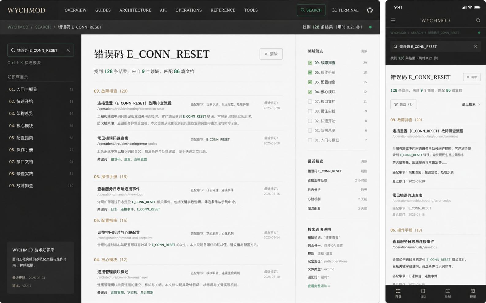

# Image 07：站内搜索结果体验



> 状态：有条件实施
> 对应提示词：P007
> 目标范围：Docsify Search 插件结果面板、首页搜索桥接、移动端搜索结果展示；如要做独立搜索页，必须另行实现真实数据来源
> 内容真相来源：`docs/index.html` 中 `$docsify.search` 配置、`bridgeCoverSearch()`、Docsify Search 插件生成的真实 DOM、`docs/_coverpage.md` 首页搜索表单、终端 `find/aisearch` 命令
> 实现边界：优先做现有搜索体验的视觉和可用性升级，不得伪造搜索结果数量、耗时、领域筛选、最近搜索或高级语法。

---

## 1. 给实现模型的任务入口

你要基于参考图，为当前知识库设计并实现一个与首页视觉一致的“站内搜索结果体验”。这不是默认要求你新增一个 `/search` 路由，也不是要替换 Docsify Search 插件。当前项目的真实搜索能力来自三处：

1. Docsify Search 插件：`docs/index.html` 中 `$docsify.search` 配置，生成侧边栏搜索框和 `.results-panel` 结果面板。
2. 首页搜索桥接：`docs/_coverpage.md` 的 `form#cover-search` 提交后，由 `docs/index.html` 中 `bridgeCoverSearch()` 把查询词注入 `.search input`。
3. 终端命令搜索：`find <关键词>` 基于终端文档树搜索；`aisearch <关键词>` 调用 `window.AIAssistant.search(keyword)` 做本地智能搜索。

参考图展示的是一个理想搜索页面：左侧查询和知识目录，中间结果列表，右侧领域筛选和最近搜索，移动端有筛选按钮和结果列表。当前项目并没有这些完整的数据结构和交互。因此本任务的第一原则是：**只有真实实现了数据来源和交互，才能展示相应 UI；否则只借鉴视觉层级，不复制功能假象。**

实现前必须完整阅读：

- `AGENTS.md`
- `docs/_meta/HOMEPAGE_DESIGN_AND_IMPLEMENTATION.md`
- `docs/index.html`
- `docs/_coverpage.md`
- `docs/assets/css/modern-theme.css`
- `docs/assets/css/studio-tokens.css`
- `docs/_sidebar.md`
- `docs/md/Index.md`
- `docs/assets/js/ai-assistant.js`

禁止：

- 把图中的 `128` 条结果、`0.21 秒`、`9 个领域`、`86 篇文档`写进生产页面，除非由真实搜索索引计算。
- 静态伪造“领域筛选”“最近搜索”“语法说明”“排序”等功能。
- 把 `Ctrl/Cmd + K` 改成搜索快捷键。该快捷键在当前项目中属于终端。
- 重写 Docsify 路由或引入 React/Vue/Vite 搜索页。
- 为搜索体验复制第二套全文索引，而不解释与 Docsify Search 插件的关系。
- 破坏首页搜索桥接、文章页侧栏搜索、终端 `find/aisearch`。
- 只为了视觉把搜索结果做成不可点击的假列表。

---

## 2. 参考图视觉审计

### 2.1 桌面端画面结构

参考图桌面端约 `1440 × 900`，整体是“暖石墨搜索壳 + 纸白结果页”。

从上到下：

1. 顶部暖石墨导航，高约 `64px`，左侧品牌 `WYCHMOD`，中间是分区导航，右侧是搜索按钮、终端按钮和 GitHub。
2. 第二行是深色路径栏，高约 `48px`：`WYCHMOD / SEARCH / 错误码 E_CONN_RESET`，右侧显示找到结果数量、耗时和在线状态点。
3. 主体三栏：
   - 左栏暖石墨背景，宽约 `300px`。顶部是搜索输入，下面是 `Ctrl + K 快速搜索` 提示，再往下是知识库目录列表和底部知识库信息卡。
   - 中栏纸白结果区，宽约 `760–820px`。H1 是查询词，下面有结果摘要，再按领域分组展示结果。
   - 右栏纸白筛选区，宽约 `260–300px`。包含领域筛选、最近搜索、搜索语法说明。
4. 结果项以横向分隔线组织，不是卡片堆叠。每条结果有标题、路径、摘要、关键词高亮、匹配章节、最近修订日期。

### 2.2 移动端画面结构

移动端约 `390 × 844`：

1. 顶部暖石墨导航，高约 `56px`：左侧菜单，中间 `WYCHMOD`，右侧搜索图标。
2. 路径栏和搜索输入都在深色区域内。
3. 结果区切换为纸白单列。
4. 顶部保留查询标题、结果摘要。
5. 筛选作为按钮或抽屉出现，不占用固定右栏。
6. 结果项单列，路径、摘要、匹配章节和日期纵向排列。

### 2.3 可借鉴与不可照搬

可借鉴：

- 查询词成为结果页面的主标题。
- 命中词用低饱和高亮而不是刺眼底色。
- 结果按知识域或来源分组。
- 结果项显示标题、路径、摘要、命中片段。
- 移动端优先展示结果，筛选折叠。

不可照搬：

- 具体查询词 `错误码 E_CONN_RESET`，除非用户实际输入。
- 结果数量、搜索耗时、领域数量、文档数量。
- 领域筛选复选框，除非有真实筛选逻辑。
- 最近搜索列表，除非真实保存搜索历史并有隐私说明。
- 搜索语法说明，除非当前搜索支持这些语法。
- 底部移动 tab，当前项目没有统一底部导航。

---

## 3. Design Specification

### 3.1 Purpose Statement

搜索体验服务于两种读者：知道关键词、希望快速进入文档的人；不确定主题归属、需要在知识库里试探路径的人。页面或面板必须让读者清楚知道“我搜了什么、搜到了什么、为什么这条结果相关、下一步能打开哪里”。

搜索的人文感不来自炫技，而来自降低迷路感。一个好的搜索结果页应该像图书馆里的熟人：它不急着卖功能，而是把相关笔记、路径和上下文安静地摆出来。

### 3.2 Aesthetic Direction

唯一方向：**Editorial / magazine，研究者数字书房里的检索台**。

视觉关键词：

- 检索台
- 纸白结果单
- 深色查询壳
- 领域索引
- 命中旁注
- 克制、可信、可追踪

禁止方向：

- 搜索引擎首页克隆
- 企业 SaaS 全屏筛选后台
- 霓虹黑客扫描器
- 卡片瀑布流
- App Store 式推荐列表
- Notion 数据库视图

### 3.3 Color Palette

继承首页：

| 语义 | 色值 | 用法 |
|---|---|---|
| 暖石墨 | `#0D100E` | 顶部导航、搜索壳、移动端搜索头部 |
| 深墨 | `#131713` | 左侧搜索栏背景、深色路径栏 |
| 石墨边线 | `rgba(242,239,231,0.12)` | 深色栏分隔 |
| 灰纸白 | `#E9E5DC` | 主结果背景 |
| 浅纸白 | `#F2EEE5` | 结果项底、筛选面板 |
| 纸张线 | `#C9C3B7` | 结果分隔线、筛选线 |
| 墨色正文 | `#20211D` | 查询标题、结果标题 |
| 次级文字 | `#66685F` | 路径、摘要、计数说明 |
| 信号绿 | `#24D18F` | 搜索输入焦点、真实命中数、当前状态点 |
| 旧金 | `#C8A96B` | 高亮命中底、当前分组标题 |
| 朱砂 | `#B64B45` | 无结果/错误说明 |

命中高亮建议：

- 背景：`rgba(200, 169, 107, 0.22)`。
- 下划线：`1px solid rgba(36, 209, 143, 0.45)`。
- 文本仍用墨色，保证可读。

### 3.4 Typography

- 查询 H1：`Source Han Serif SC`, `Noto Serif SC`, `Songti SC`, SimSun, serif。
- 正文、摘要、筛选：`Source Han Sans SC`, `Noto Sans SC`, `Microsoft YaHei`, sans-serif。
- 路径、计数、耗时、快捷键：`IBM Plex Mono`, `JetBrains Mono`, Consolas, monospace。

字号建议：

| 元素 | 桌面 | 移动 |
|---|---:|---:|
| 顶栏品牌 | `18–22px` | `17–19px` |
| 路径栏 | `12px / 1.6` | `11–12px / 1.6` |
| 搜索输入 | `14–15px` | `15–16px` |
| 查询 H1 | `38–46px / 1.15` | `27–32px / 1.2` |
| 结果摘要 | `15–16px / 1.7` | `14–15px / 1.7` |
| 分组标题 | `16–18px` | `15–16px` |
| 结果标题 | `16–18px / 1.4` | `16px / 1.45` |
| 路径 | `12–13px / 1.5` | `12px / 1.5` |
| 摘要 | `14–15px / 1.75` | `14px / 1.7` |

### 3.5 Layout Strategy

分两级实施：

**Phase 1：现有 Docsify 搜索体验升级**

- 不新增路由。
- 以 `.search`、`.results-panel`、`.matching-post`、`.search-keyword` 等插件真实 DOM 为基础。
- 首页搜索继续桥接到侧栏搜索。
- 移动端把结果面板做得清楚、可滚动、可关闭。

**Phase 2：独立搜索结果页**

- 只有在真实实现搜索索引读取、结果统计、分组、筛选、最近搜索和无障碍交互后才可做。
- URL 可设计为 `#/search?q=关键词` 或其他 Docsify 兼容方式，但必须保留 hash 路由。
- 所有数量、耗时、领域分布都必须由真实搜索结果计算。

如果只执行当前视觉任务，默认做 Phase 1；不要凭图直接做 Phase 2 的假页面。

---

## 4. 当前真实搜索契约

### 4.1 Docsify Search 配置

当前 `docs/index.html` 中配置：

```text
search.paths = 'auto'
search.placeholder = '搜索文档、框架、工具...'
search.noData = '没有找到相关内容，换个关键词试试。'
search.depth = 6
search.maxAge = 86400000
search.hideOtherSidebarContent = false
```

含义：

- 搜索路径由 Docsify 自动索引。
- 搜索深度为标题层级 `6`。
- 搜索缓存生命周期 `86400000ms`。
- 无结果文案已有真实配置。
- 侧栏其他内容不隐藏。

实现模型要核对插件实际生成 DOM，再写 CSS。不要假设图中三栏搜索页已经存在。

### 4.2 首页搜索桥接

当前流程：

```text
用户在首页封面输入 query
→ submit form#cover-search
→ bridgeCoverSearch() 阻止默认提交
→ window.location.hash = '#/README'
→ 延迟查找 .search input
→ focus()
→ value = query
→ dispatch input event
→ Docsify Search 插件渲染结果
```

实现要求：

- 首页搜索视觉可以优化，但不能改掉这个桥接契约。
- 输入为空时不触发搜索。
- 首页移动端 placeholder 由 `syncCoverPlaceholder()` 控制，不能写死。
- `/` 快捷键若现有逻辑只聚焦首页搜索，不能与 `Ctrl/Cmd + K` 冲突。

### 4.3 终端搜索不是同一个 UI

终端命令：

- `find <关键词>`：搜索终端解析出来的文档树。
- `grep <关键词>` 和 `search <关键词>`：调用 `find`。
- `aisearch <关键词>`：调用 `window.AIAssistant.search(keyword)`。

这些命令可以在搜索说明里被提到，但不要把终端输出和 Docsify 搜索结果混为一套 UI。

---

## 5. Phase 1：现有搜索结果面板规格

### 5.1 桌面端

当前 Docsify 搜索主要在侧栏中出现。要把它改造成与首页一致的“检索侧栏”。

建议规格：

- `.search` 容器宽度跟侧栏一致，通常 `260–300px`。
- 输入框高度 `44–48px`。
- 输入框背景在深色侧栏中使用 `rgba(242,239,231,0.06)`，在浅色侧栏中使用 `#F2EEE5`。
- 边框 `1px solid rgba(201,195,183,0.45)`，焦点为 `#24D18F`。
- 输入文字 `14–15px`，等宽或正文无衬线均可；查询关键字不要被字距拉开。
- `.results-panel` 最大高度 `calc(100vh - 140px)`，内部滚动。
- 结果项之间用细线，不用大阴影卡片。
- `.matching-post` padding `14–16px 0`。
- 标题 `16px` 加粗，路径/摘要 `13–14px`。
- `.search-keyword` 使用旧金浅底和信号绿下划线。

如果搜索结果面板在当前 CSS 中已经被隐藏或位置不稳定，要先修复可见性和层级，而不是新增独立浮层。

### 5.2 移动端

移动端重点：

- 搜索输入可触达，不被顶部导航遮挡。
- 结果面板出现在导航下方，顶部距 `56–64px`。
- 宽度 `100%`，左右 padding `20–24px`。
- 结果列表最大高度不超过可视区，内部滚动。
- 软键盘弹出时，结果仍可滚动。
- 点击结果后关闭或收起侧栏，打开 hash 路由。
- 无结果文案居左或轻微居中均可，但不能占整屏。

不要：

- 在移动端展示固定三栏。
- 让 `.results-panel` 超出屏幕右侧。
- 让结果项字号小于 `12px`。
- 因搜索面板滚动锁导致正文无法恢复滚动。

### 5.3 状态矩阵

| 状态 | 视觉与行为要求 |
|---|---|
| 空查询 | 不显示空白大面板，保留 placeholder |
| 输入中 | 结果实时更新，无明显布局跳动 |
| 有结果 | 标题、摘要、路径、命中词可读 |
| 无结果 | 显示 `$docsify.search.noData` 配置文案，不显示虚构推荐 |
| 超长查询 | 输入框和结果项不溢出，`overflow-wrap: anywhere` |
| 中文查询 | 命中高亮不割裂中文可读性 |
| 英文/符号查询 | 如 `E_CONN_RESET`、`Ctrl+K`、`MySQL` 不撑破布局 |
| 点击结果 | 打开真实 hash 路由 |
| 终端打开时 Esc | 优先遵守终端关闭逻辑，不能被搜索面板抢走 |

---

## 6. Phase 2：独立搜索结果页规格（只有真实实现后才做）

如果后续明确要把参考图落成独立搜索页，必须同时实现数据层、路由层和 UI 层。下面是规格，不是当前默认任务。

### 6.1 数据要求

必须真实提供：

- 查询词。
- 结果列表。
- 每条结果的标题、路径、摘要或命中片段。
- 命中关键词。
- 来源领域或文档分类。
- 结果数量。
- 可选：搜索耗时，但必须由实际搜索计时得到。
- 可选：最近搜索，但必须有本地存储键、清除按钮和隐私说明。
- 可选：领域筛选，但必须能真实过滤结果。

不能出现：

- 静态占位结果。
- 与真实文档不匹配的路径。
- 图中的伪数量和伪耗时。

### 6.2 桌面端三栏布局

以 `1440 × 900` 为基准：

```text
┌──────────────────────────────────────────────────────────┐
│ 64px 暖石墨全局导航                                      │
├──────────────────────────────────────────────────────────┤
│ 48px 深色查询路径栏                                      │
├───────────────┬──────────────────────────────┬───────────┤
│ 300px 深色栏   │ 700-820px 纸白结果列表        │ 260px 筛选 │
└───────────────┴──────────────────────────────┴───────────┘
```

尺寸：

- 左栏宽 `288–320px`。
- 中栏 padding `48px 48px 80px`。
- 右栏宽 `260–300px`。
- 主体最小高度 `calc(100vh - 112px)`。
- 中栏与右栏之间 `1px` 纸张线。

### 6.3 左侧搜索栏

内容：

1. 搜索输入。
2. 快捷说明。注意当前不能写 `Ctrl + K 快速搜索`，因为 `Ctrl/Cmd + K` 是终端。可以写“首页搜索框或侧栏搜索框均可检索”。
3. 知识库目录摘要，来自真实 9 大领域。
4. 底部知识库说明，数据来自真实统计或稳定描述。

左栏视觉：

- 背景 `#0D100E`。
- 输入框边框信号绿焦点。
- 目录项文字 `#A9AEA7`，当前或有结果领域用 `#F2EFE7`。
- 数字若展示，必须真实。

### 6.4 中央结果区

结构：

```text
H1：搜索词
摘要：找到 n 条结果，来自 m 个领域，匹配 k 篇文档
清除按钮
分组标题
结果项
```

结果项：

- 标题：真实文档标题。
- 路径：Docsify hash 路由或 Markdown 路径。
- 摘要：命中片段，最多 `2–3` 行。
- 命中词：低饱和高亮。
- 元数据：来源分类、更新时间（只有真实来源时显示）。

如果没有真实“最近修订”来源，不显示日期。

### 6.5 右侧筛选栏

只有真实筛选能力时显示。

模块：

- 领域筛选：来自 9 大知识域。
- 最近搜索：来自 localStorage，并有“清除”。
- 搜索说明：只写当前支持的能力，例如普通关键词，不写布尔语法、路径过滤、文件类型过滤，除非已实现。

如果这些能力没实现，右栏可以变成静态“搜索提示”：

- 试试文档标题关键词。
- 使用中英文技术名。
- 搜索不到时可用终端 `find` 或 `aisearch` 作为补充。

### 6.6 移动端独立页

- 顶部深色区域包含搜索框。
- 筛选按钮显示真实筛选数量。
- 结果摘要置于搜索框下方。
- 结果项单列。
- 筛选抽屉从底部或右侧出现，焦点锁定，Esc/关闭按钮可退出。
- 最近搜索要有清除按钮。

---

## 7. 交互与可访问性

### 7.1 键盘

- 输入框可 Tab 聚焦。
- 结果链接可 Tab 访问。
- 焦点态使用 `#7EE8BC` 或信号绿 outline。
- `Esc` 行为不能破坏终端。若终端打开，Esc 先关闭终端。
- 如果实现搜索浮层，关闭后焦点回到触发搜索的输入或按钮。

### 7.2 屏幕阅读器

- 搜索 form 使用 `role="search"`。
- 输入框有 `aria-label`。
- 结果数量用可读文本表达。
- 无结果状态不是只用图标。
- 高亮词不能导致文本重复难读。

### 7.3 隐私

如果实现最近搜索：

- 使用明确 localStorage 键名。
- 提供清除按钮。
- 说明最近搜索只保存在当前浏览器。
- 不记录敏感关键词到仓库或远程服务。

若不实现最近搜索，不显示该模块。

---

## 8. 实施步骤

### 8.1 默认 Phase 1 实施

1. 在浏览器中观察 Docsify Search 插件生成 DOM：`.search`、输入框、`.results-panel`、`.matching-post`、`.search-keyword` 等。
2. 基于真实 DOM 写作用域 CSS。
3. 调整首页搜索桥接后的结果可见性与焦点，不改 `Ctrl/Cmd + K`。
4. 优化移动端结果面板位置、滚动和点击结果后的状态。
5. 保持 `search.noData` 文案来自 `$docsify.search` 配置。

### 8.2 如实施 Phase 2

必须先补充技术设计：

1. 搜索结果路由如何表示。
2. 搜索索引从哪里来。
3. 结果分组如何计算。
4. 筛选如何真实过滤。
5. 最近搜索如何存储和清除。
6. 如何与 Docsify Search 插件共存。

没有这份技术设计，不允许直接写三栏假页面。

---

## 9. 验证清单

### 9.1 静态检查

运行：

```bash
node scripts/sidebar-check.js
node scripts/check-links.js
git diff --check
```

### 9.2 搜索功能检查

至少测试：

- 首页搜索输入 `Redis`，提交后聚焦 Docsify 搜索并出现结果。
- 首页搜索输入 `E_CONN_RESET` 这类英文符号组合，不溢出。
- 文章页侧栏直接搜索 `Kubernetes`。
- 中文搜索：`面试`、`算法`、`缓存`。
- 无结果：输入随机长字符串，显示真实 noData 文案。
- 点击一条结果，进入真实 hash 路由。
- 浏览器后退后页面状态可恢复。
- 终端打开时 `Esc` 关闭终端，不被搜索结果面板抢占。
- `Ctrl/Cmd + K` 仍打开终端，不聚焦搜索。

### 9.3 视觉检查

截图尺寸：

- `1440 × 900`
- `1280 × 800`
- `1024 × 768`
- `768 × 1024`
- `390 × 844`
- `360 × 800`

验收标准：

- 搜索输入、结果标题、摘要、命中词可读。
- 移动端没有横向溢出。
- 结果面板不遮住不可恢复的页面区域。
- 结果项之间层级清楚，不是厚重卡片堆叠。
- 没有虚构结果数、耗时、领域筛选或最近搜索。
- 首页搜索、文章页搜索、终端搜索互不破坏。

---

## 10. 可直接复制给实现模型的指令

请按以下要求实现 Image 07 对应的站内搜索结果体验。

当前项目真实搜索能力来自 Docsify Search 插件、首页搜索桥接和终端搜索命令。你优先需要优化现有 Docsify Search 插件结果面板，而不是直接新增一个假 `/search` 页面。视觉参考 `docs/_meta/ui-redesign/references/image-07.png`，但图中的结果数量、耗时、领域筛选、最近搜索和搜索语法都是占位，不能写进生产页面，除非你先实现真实数据来源。

开始前阅读：

1. `AGENTS.md`
2. `docs/_meta/HOMEPAGE_DESIGN_AND_IMPLEMENTATION.md`
3. `docs/index.html`
4. `docs/_coverpage.md`
5. `docs/assets/css/modern-theme.css`
6. `docs/assets/css/studio-tokens.css`
7. `docs/_sidebar.md`
8. `docs/md/Index.md`
9. `docs/assets/js/ai-assistant.js`

真实契约：

- `$docsify.search.paths = 'auto'`
- `$docsify.search.placeholder = '搜索文档、框架、工具...'`
- `$docsify.search.noData = '没有找到相关内容，换个关键词试试。'`
- `$docsify.search.depth = 6`
- `$docsify.search.maxAge = 86400000`
- `$docsify.search.hideOtherSidebarContent = false`
- 首页 `form#cover-search` 通过 `bridgeCoverSearch()` 注入 `.search input` 并派发 `input` 事件。
- `Ctrl/Cmd + K` 属于终端，不属于搜索。
- 终端 `find/grep/search/aisearch` 是补充搜索能力，不是 Docsify Search UI。

设计规格：

- Purpose：让读者知道搜了什么、搜到了什么、每条结果为什么相关、点击后去哪里。
- Aesthetic Direction：Editorial / magazine，研究者数字书房里的检索台。
- Color：继承暖石墨 `#0D100E`、深墨 `#131713`、灰纸白 `#E9E5DC`、浅纸白 `#F2EEE5`、纸张线 `#C9C3B7`、墨色正文 `#20211D`、次级文字 `#66685F`、信号绿 `#24D18F`、旧金 `#C8A96B`。
- Typography：查询标题用中文衬线；正文、摘要、筛选用中文无衬线；路径、计数、快捷键用等宽字体。
- Layout：Phase 1 优化现有侧栏/面板搜索；如果另做 Phase 2 独立搜索页，必须先实现真实索引、真实结果统计、真实分组与真实筛选。

Phase 1 实现要求：

1. 基于真实 Docsify Search DOM 写 CSS：`.search`、搜索输入、`.results-panel`、`.matching-post`、`.search-keyword`。
2. 搜索输入高度 `44–48px`，焦点使用信号绿。
3. 结果面板内部滚动，结果项之间用细线分隔。
4. 结果标题、路径、摘要都要可读；长中文、英文、路径使用 `overflow-wrap: anywhere`。
5. 命中词使用低饱和旧金底或信号绿下划线，不能刺眼。
6. 移动端结果面板在顶部导航下方可滚动，不横向溢出。
7. 无结果使用 `$docsify.search.noData` 文案。
8. 首页搜索桥接后的结果必须可见，焦点正确。
9. 不能改 `Ctrl/Cmd + K` 的终端行为。

如果你选择实现 Phase 2 独立搜索页，必须先写清并实现：

- 搜索路由。
- 搜索索引来源。
- 结果数量计算。
- 领域分组计算。
- 筛选逻辑。
- 最近搜索存储和清除。
- 与 Docsify Search 插件的共存关系。

否则不要展示右侧领域筛选、最近搜索、搜索耗时、结果数量等假功能。

完成后验证：

```bash
node scripts/sidebar-check.js
node scripts/check-links.js
git diff --check
```

浏览器验证：

- 首页搜索 `Redis`、`Kubernetes`、`算法` 能桥接到 Docsify 结果。
- 文章页侧栏搜索可用。
- 无结果显示真实 noData 文案。
- 点击结果进入真实 hash 路由。
- `Ctrl/Cmd + K` 仍打开终端。
- 终端打开时 `Esc` 先关闭终端。
- `1440×900`、`1280×800`、`1024×768`、`768×1024`、`390×844`、`360×800` 下无横向溢出、无遮挡、命中词可读。
