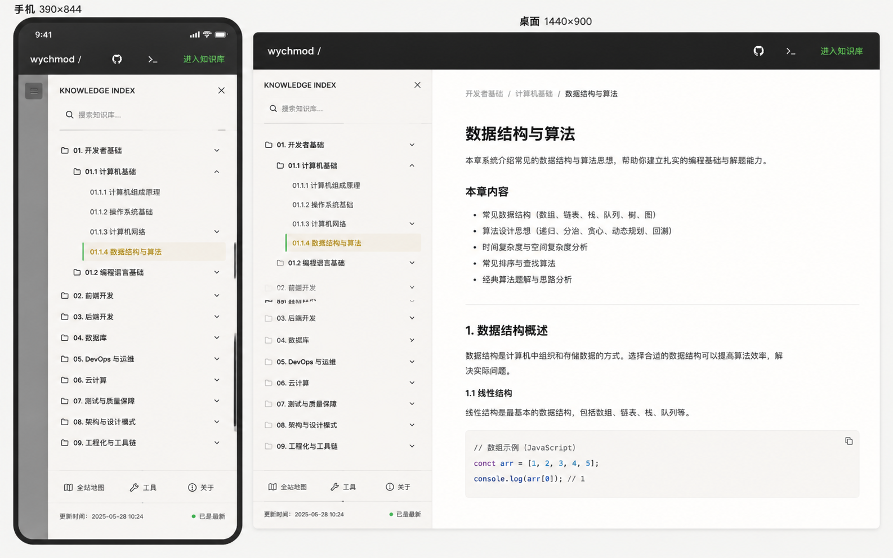

# Image 08：移动侧边栏与知识目录抽屉



> 状态：可实施
> 对应提示词：P008
> 目标范围：Docsify 全局顶部导航、`.sidebar`、`.sidebar-toggle`、`.sidebar-nav`、正文 `.content` 偏移、移动端遮罩与焦点行为
> 内容真相来源：`docs/_sidebar.md`、`docs/index.html`、`docs/assets/css/modern-theme.css`、`docs/assets/css/studio-tokens.css`、`docs/_meta/HOMEPAGE_DESIGN_AND_IMPLEMENTATION.md`
> 实现边界：只改善真实 Docsify 侧边栏和移动抽屉；不得新建第二套 JSON 菜单，不得改变 `_sidebar.md` 链接路径，不得破坏终端和搜索浮层。

---

## 1. 给实现模型的任务入口

你要把当前 Docsify 的全局导航和侧边栏整理成参考图所示的“桌面固定知识目录 + 手机抽屉式知识索引”。这不是一个单独页面，而是全站基础交互：任何主线文章、工具说明、AI 文档、归档索引都可能依赖它。

参考图里左侧是手机 `390 × 844`，右侧是桌面 `1440 × 900`。它表达的是同一套侧边栏在两个断点下的形态：

- 桌面端：左侧常驻纸白知识目录，右侧为文章正文。
- 手机端：顶部暖石墨导航，点击菜单后从左侧打开纸白抽屉，抽屉中展示完整知识目录。

当前项目真实目录来自 `docs/_sidebar.md`，包含首页、AI 助手使用指南、9 大知识领域、39 篇主线文档和少量管理文档入口。实现模型必须复用这一单一来源，不能照搬参考图里的 `开发者基础 / 数据库 / DevOps` 旧分类，也不能自己编一份菜单数据。

实现前必须完整阅读：

- `AGENTS.md`
- `docs/_meta/HOMEPAGE_DESIGN_AND_IMPLEMENTATION.md`
- `docs/_sidebar.md`
- `docs/index.html`
- `docs/assets/css/modern-theme.css`
- `docs/assets/css/studio-tokens.css`
- `docs/_navbar.md`
- `docs/md/Index.md`

禁止：

- 新建第二份导航 JSON、硬编码菜单数组或复制 `_sidebar.md` 内容到 JS。
- 为了视觉统一删除 `_sidebar.md` 中真实入口。
- 修改 `_sidebar.md` 链接路径，除非发现真实错误并按项目规则同步 `README.md`、`md/Index.md`。
- 在移动端增加图中没有事实基础的底部 tab，或新建与 Docsify 冲突的全局导航系统。
- 把侧边栏抽屉做成覆盖全屏不可关闭的面板。
- 让 `Ctrl/Cmd + K`、终端、搜索结果面板和侧边栏遮罩互相抢焦点。
- 继续扩大紫色、科技蓝或 Notion 风格；必须回到首页 V2 的暖石墨 + 纸白系统。

---

## 2. 参考图视觉审计

### 2.1 手机端

参考图手机端为 `390 × 844`：

1. 顶部暖石墨导航高约 `58–64px`。左侧品牌 `wychmod /`，中间或右侧有 GitHub、终端图标，最右是信号绿“进入知识库”。
2. 主体不是文章，而是打开后的 `KNOWLEDGE INDEX` 抽屉。
3. 抽屉宽度几乎占满屏幕，但左侧仍有一条深灰遮罩/边栏，暗示这是覆盖层。
4. 抽屉顶部：标题 `KNOWLEDGE INDEX`、关闭按钮。
5. 标题下方：搜索输入，placeholder `搜索知识库...`。
6. 目录项以文件夹层级展示：一级分类、二级分组、文章项。
7. 当前文章 `01.1.4 数据结构与算法` 左侧有信号绿竖线，背景浅旧金，文字旧金/墨色。
8. 底部有辅助入口：全站地图、工具、关于；最底部有更新时间和“已是最新”状态。

### 2.2 桌面端

参考图桌面端为 `1440 × 900`：

1. 顶部暖石墨导航高约 `60px`，品牌左对齐，右侧有 GitHub、终端和“进入知识库”。
2. 左侧侧边栏宽约 `292px`，从导航下方开始，纸白背景。
3. 右侧正文从 `x≈760` 开始，展示文章面包屑、H1、摘要、章节内容和代码块。
4. 侧边栏中当前文章同样用信号绿竖线 + 浅旧金底高亮。
5. 侧边栏底部有全站地图/工具/关于和更新时间。

### 2.3 图中不能照搬的内容

图中的分类和文章层级不是本项目当前真实结构：

- `01. 开发者基础`
- `01.1 计算机基础`
- `01.1.4 数据结构与算法`
- `02. 前端开发`
- `04. 数据库`
- `05. DevOps 与运维`
- `06. 云计算`
- `07. 测试与质量保障`
- `08. 架构与设计模式`
- `09. 工程化与工具链`

当前项目真实 9 大领域是：

1. 计算机基础
2. 后端开发
3. 云原生与运维
4. 前端开发
5. AI 与 Agent
6. 软件工程
7. 面试求职
8. 过时技术
9. 开发工具

生产实现必须以 `docs/_sidebar.md` 为准。参考图只用于布局、密度、状态、高亮和响应式策略。

---

## 3. Design Specification

### 3.1 Purpose Statement

侧边栏是知识库的“目录页脊”。桌面端，它要让读者始终知道自己位于哪一类知识、上下还有哪些可读路径；移动端，它要在有限屏幕里快速打开、定位、关闭，不打断阅读。

这套导航的人文感来自“不会把人困住”：读者在深层文章里迷路时，能一键看到整体结构；读完一页后，能顺手去全站地图、工具或关于，而不是回到浏览器地址栏里猜。

### 3.2 Aesthetic Direction

唯一方向：**Editorial / magazine，研究者数字书房里的知识页脊**。

视觉关键词：

- 纸白目录
- 书脊索引
- 细线层级
- 当前阅读坐标
- 温和抽屉
- 可触摸、可键盘、可恢复

禁止方向：

- 移动 App 五栏 tab
- 企业后台树形菜单
- Notion 侧栏克隆
- 纯黑终端目录
- 彩色 emoji 分类墙
- 多层无限抽屉

### 3.3 Color Palette

继承首页：

| 语义 | 色值 | 用法 |
|---|---|---|
| 暖石墨 | `#0D100E` | 顶部导航、移动遮罩深层 |
| 深墨 | `#131713` | 顶栏 hover、遮罩叠层 |
| 灰纸白 | `#E9E5DC` | 侧边栏背景 |
| 浅纸白 | `#F2EEE5` | 当前项背景、搜索输入 |
| 纸张线 | `#C9C3B7` | 分隔线、树线、底部栏 |
| 墨色正文 | `#20211D` | 菜单正文 |
| 次级文字 | `#66685F` | 分组、更新时间、说明 |
| 信号绿 | `#24D18F` | 当前项左线、在线状态、焦点 |
| 旧金 | `#C8A96B` | 当前编号、导航选中态 |
| 朱砂 | `#B64B45` | 极少数错误状态，不用于普通导航 |

使用规则：

- 一级分类不要用彩虹色；最多使用极小的领域点或旧金编号。
- 当前项不能只靠颜色，要有左线、背景和 `aria-current`。
- Emoji 可存在于 `_sidebar.md` 原文，但视觉层不应依赖 emoji 作为图标；当前 CSS 已有隐藏 emoji 图片的倾向，后续实现要保持克制。

### 3.4 Typography

- 顶栏品牌：`Source Han Serif SC`, `Noto Serif SC`, `Songti SC`, SimSun, serif 或项目现有品牌字体。
- 菜单正文：`Source Han Sans SC`, `Noto Sans SC`, `Microsoft YaHei`, sans-serif。
- 编号、更新时间、状态：`IBM Plex Mono`, `JetBrains Mono`, Consolas, monospace。

字号建议：

| 元素 | 桌面 | 手机 |
|---|---:|---:|
| 顶栏品牌 | `20–22px` | `16–18px` |
| 抽屉标题 | `14–16px` | `14–16px` |
| 搜索输入 | `14px` | `14–15px` |
| 一级分类 | `14–15px` | `14–15px` |
| 二级分组 | `13–14px` | `13–14px` |
| 文章项 | `13–14px` | `13–14px` |
| 底部入口 | `12–13px` | `12–13px` |
| 更新时间 | `11–12px` | `11–12px` |

### 3.5 Layout Strategy

同一套结构在三种断点下变形：

| 断点 | 侧边栏策略 | 正文策略 |
|---|---|---|
| `>= 1280px` | 固定侧栏，宽 `304px` 左右，与顶部导航同一 shell | 正文左偏移，最大宽度与首页内页统一 |
| `1024–1279px` | 可收起侧栏，宽 `280–304px` | 正文避免被挤压，右侧 TOC 可隐藏 |
| `< 768px` | 抽屉覆盖，宽 `min(86vw, 340px)` | 正文不永久偏移，抽屉关闭后恢复 |

当前项目已有 `--shell-sidebar-width: 304px`、`body.close`、`.sidebar-toggle`、移动断点等逻辑。实现模型应先梳理和收敛这些规则，不要在 CSS 末尾继续堆互相打架的覆盖。

---

## 4. 真实信息结构

### 4.1 `_sidebar.md` 单一来源

当前侧边栏应渲染：

```text
首页
AI 智能助手使用指南
---
计算机基础
  编程语言
    Java 与 JVM
    Python 基础与生态
    Go 语言
  算法与数据结构
    算法与数据结构
  计算机系统
    计算机系统与并发
---
后端开发
  数据存储
  消息队列
  分布式协调
---
云原生与运维
---
前端开发
---
AI 与 Agent
---
软件工程
---
面试求职
---
过时技术
---
开发工具
```

完整实现以 `docs/_sidebar.md` 文件为准。不要手写这份结构。

### 4.2 底部辅助入口

参考图中侧边栏底部有：

- 全站地图
- 工具
- 关于
- 更新时间
- 已是最新

生产项目可以实现等价辅助入口，但必须真实：

- 全站地图：`/md/Index.md`
- 工具：工具箱入口，如 `/tools/` 或当前工具导航真实路径
- 关于：`/README` 或 `me.html` / `resume.html`，以项目现有入口为准
- 更新时间：如果没有自动来源，不显示具体假时间
- 状态：如果没有真实检查来源，不显示“已是最新”；可显示“链接以当前仓库为准”

### 4.3 搜索

抽屉内搜索应复用 Docsify Search 插件，或明确桥接到同一 `.search input`。不要新增一个只过滤菜单文本的假搜索框，除非它被标注为“仅筛选目录”并且不替代全文搜索。

---

## 5. 桌面端像素级规格

以 `1440 × 900` 为主验收尺寸。

### 5.1 顶部导航

- 高度：`60–64px`。
- 背景：`#0D100E`。
- 左侧品牌：距左侧 shell 边距 `32–40px`，文本 `wychmod / workspace` 或当前真实品牌。
- 桌面端品牌必须左对齐，不居中。
- 右侧图标区：GitHub、终端、主 CTA，间距 `20–28px`。
- 终端按钮必须继续触发现有 `#terminal-trigger` / `data-open-terminal`。
- 顶部导航 z-index 要低于终端弹窗，但高于正文。

### 5.2 固定侧边栏

- 宽度：优先沿用 `--shell-sidebar-width: 304px`，视觉可在 `292–304px`。
- 顶部：从导航下方开始，`top: 64px`。
- 高度：`calc(100vh - 64px)`。
- 背景：`#E9E5DC` 或 `#F2EEE5` 微差。
- 边右线：`1px solid rgba(201,195,183,0.65)`。
- 内边距：顶部 `20–24px`，左右 `22–28px`。
- 滚动：侧边栏内部滚动，正文不受影响。

### 5.3 层级缩进

建议：

| 层级 | 内容 | 左缩进 | 行高/点击区 |
|---|---|---:|---:|
| L0 | 首页、AI 指南等根入口 | `0` | `40–44px` |
| L1 | 9 大领域 | `0–4px` | `42–46px` |
| L2 | 分组标题 | `18–22px` | `34–38px` |
| L3 | 文档链接 | `32–42px` | `34–40px` |
| L4 | 深层 AI 子目录 | `46–56px` | `34–40px` |

缩进靠 padding 和细线，不靠放大图标。

### 5.4 当前项

当前文章或当前页面：

- 左侧 `3px` 信号绿竖线。
- 背景 `rgba(200,169,107,0.14)`。
- 文字墨色或旧金，不要荧光绿大面积。
- `border-radius: 4px`。
- `aria-current="page"` 若可补充，应补充。
- 当前项进入页面后尽量自动滚入侧边栏可见区域。

### 5.5 正文偏移

桌面正文：

- `.content` 左侧应从侧边栏右侧开始，不能被侧边栏遮挡。
- 最大阅读宽度保留首页内页策略，不要无限拉宽。
- 当侧边栏收起时，正文应平滑回到合适宽度。
- Gitalk、分页、代码块宽度要跟正文同步。

---

## 6. 手机端像素级规格

以 `390 × 844`、`360 × 800` 为验收尺寸。

### 6.1 顶部导航

- 高度：`56–58px`。
- 背景：`#0D100E`。
- 左侧显示品牌 `wychmod /`，不要居中变成 App 标题，除非首页移动规范另有明确要求。
- 右侧保留必要操作：GitHub、终端、进入知识库或菜单入口。
- 点击区域最小 `44 × 44px`。
- 如果顶部空间不足，优先保留菜单、品牌、终端；隐藏次要文字链接。

### 6.2 抽屉尺寸

- 宽度：`min(86vw, 340px)`。
- `360px` 屏幕下宽度约 `310px`。
- 高度：`100dvh` 或 `100vh` 兼容。
- 左侧贴边打开。
- 背景：纸白。
- 右侧遮罩：`rgba(13,16,14,0.42–0.56)`。
- 进入动画：`transform: translateX(0)`，时长 `180–240ms`。
- 关闭动画：`translateX(-100%)`。
- 尊重 `prefers-reduced-motion`。

### 6.3 抽屉顶部

结构：

```text
KNOWLEDGE INDEX                         关闭按钮
搜索知识库...
细线
```

规格：

- 标题区高度 `48–56px`。
- 标题 `14–16px`，字重 `600`。
- 关闭按钮 `44 × 44px`，右上角。
- 搜索输入高度 `42–46px`。
- 搜索输入左侧使用 Lucide `search`，不用 emoji。
- 输入和标题之间间距 `10–14px`。

### 6.4 目录滚动区

- 高度：`calc(100dvh - 顶部区 - 底部区)`。
- 内部滚动，滚动条细而克制。
- 列表底部留 `16–24px` 安全空间。
- 当前项打开后自动滚入可见范围。
- 深层目录不要因缩进导致文字只剩几个字；移动端最大缩进应控制在 `48px` 内。

### 6.5 底部辅助区

参考图底部可实现为抽屉内固定区：

```text
全站地图    工具    关于
更新时间：真实来源或不显示
状态：真实检查来源或不显示
```

规格：

- 高度：`88–120px`。
- 顶部边线 `1px solid #C9C3B7`。
- 三个入口平均分布，点击区 `44px`。
- 图标用 Lucide，文字 `12px`。
- 更新时间等宽 `11–12px`。
- 若无真实更新时间，不显示参考图中的 `2025-05-28 10:24`。

---

## 7. 交互契约

### 7.1 打开与关闭

打开：

- 点击 `.sidebar-toggle`。
- 键盘聚焦 `.sidebar-toggle` 后按 `Enter` 或 `Space`。

关闭：

- 点击关闭按钮。
- 点击遮罩。
- 按 `Esc`。
- 点击侧边栏链接并导航后，在移动端自动关闭。

焦点：

- 打开后焦点进入抽屉标题或第一个可交互元素。
- 关闭后焦点返回触发按钮。
- Tab 不应进入遮罩后的正文。

### 7.2 滚动锁

抽屉打开时：

- body 背景滚动锁定。
- 抽屉内部可滚动。
- iOS Safari 下避免地址栏变化导致高度错乱，可考虑 `100dvh`。
- 关闭后恢复原滚动位置。

### 7.3 与搜索和终端的层级关系

建议 z-index：

| 层 | 说明 |
|---|---|
| 顶部导航 | `100` |
| 移动侧边栏遮罩 | `800` |
| 移动侧边栏抽屉 | `900` |
| 搜索结果面板 | 与侧边栏内部一致或 `950` |
| 终端遮罩/窗口 | 高于侧边栏，如 `1200+` |

行为规则：

- 终端打开时，侧边栏不应遮住终端。
- `Ctrl/Cmd + K` 仍打开终端。
- 侧边栏内搜索不抢占终端快捷键。
- 如果搜索结果面板打开，关闭侧边栏时也应收起或保持一致状态。

### 7.4 路由变化

当 hash 路由变化：

- 当前项 active 状态更新。
- 移动端抽屉自动关闭。
- 侧边栏当前项滚入可见。
- 不重复绑定事件监听器。

Docsify `doneEach` 后若初始化侧边栏辅助逻辑，必须幂等。

---

## 8. 实施步骤

### 8.1 现状审计

1. 在 `1440×900`、`390×844` 观察当前顶部导航和侧边栏。
2. 记录 `.app-nav`、`.sidebar`、`.sidebar-toggle`、`.content`、`body.close` 当前样式。
3. 确认当前 `_sidebar.md` 渲染的 9 大领域和文章数量。
4. 确认终端按钮和搜索框当前 z-index。

### 8.2 CSS 收敛

1. 清理或收敛互相冲突的侧边栏断点规则。
2. 保留 `--shell-sidebar-width` 等已有 shell 变量，必要时重命名到 `--studio-*` 但不得破坏首页。
3. 桌面端先固定侧边栏和正文偏移。
4. 平板端处理可收起状态。
5. 手机端实现抽屉尺寸、遮罩、滚动区和底部区。

### 8.3 JS 辅助

只有 CSS 无法完成时才最小补 JS：

- 给 `.sidebar-toggle` 补充 `aria-expanded`。
- 打开/关闭时管理焦点。
- 移动端链接点击后关闭抽屉。
- hash 变化后滚动当前项进入可见区域。

不得写复杂状态管理，不得创建第二套菜单数据。

### 8.4 `_sidebar.md` 处理

默认不改 `_sidebar.md`。

只有发现这些问题时才改：

- 链接死链。
- 分类缺失。
- 文档新增但未同步。
- 重复入口导致侧边栏渲染错误。

一旦改 `_sidebar.md`，必须按项目规则同步 `docs/README.md` 和 `docs/md/Index.md` 的对应 section，并运行检查脚本。

---

## 9. 验证清单

### 9.1 静态检查

运行：

```bash
node scripts/sidebar-check.js
node scripts/check-links.js
git diff --check
```

### 9.2 桌面检查

尺寸：

- `1440 × 900`
- `1280 × 800`
- `1024 × 768`

检查：

- 顶部品牌左对齐。
- 侧边栏宽度稳定，不遮正文。
- 当前文章高亮清楚。
- 侧边栏可滚动到最底部。
- 正文、代码块、Gitalk 不被侧边栏压住。
- 终端按钮可用。
- 搜索结果不被侧边栏裁掉。

### 9.3 移动检查

尺寸：

- `390 × 844`
- `360 × 800`
- `768 × 1024`

检查：

- 菜单按钮点击、Enter、Space 都能打开抽屉。
- 抽屉宽度约 `86vw`，不超过 `340px`。
- 遮罩点击关闭。
- 关闭按钮可见且点击区至少 `44px`。
- `Esc` 关闭抽屉；终端打开时 `Esc` 优先关闭终端。
- 背景滚动锁定，抽屉内部可滚动。
- 点击深层文章后路由变化，抽屉关闭。
- 当前项滚入可见范围。
- 旋转屏幕后没有横向溢出。

### 9.4 信息一致性检查

确认：

- 9 大领域与 `_sidebar.md` 一致。
- 39 篇主线文章入口没有丢失。
- 首页、AI 指南、AI 故障排查、更新摘要等真实入口保留。
- 没有照搬参考图里的假分类和假更新时间。
- 没有创建第二套菜单数据。

---

## 10. 可直接复制给实现模型的指令

请按以下要求实现 Image 08 对应的移动侧边栏与知识目录抽屉。

这是全站基础交互，不是单页。目标是让 Docsify 的真实侧边栏在桌面端成为固定纸白知识目录，在移动端成为可打开、可搜索、可关闭、可键盘访问的 `KNOWLEDGE INDEX` 抽屉。视觉参考 `docs/_meta/ui-redesign/references/image-08.png`，但所有目录内容必须来自 `docs/_sidebar.md`。

开始前阅读：

1. `AGENTS.md`
2. `docs/_meta/HOMEPAGE_DESIGN_AND_IMPLEMENTATION.md`
3. `docs/_sidebar.md`
4. `docs/index.html`
5. `docs/assets/css/modern-theme.css`
6. `docs/assets/css/studio-tokens.css`
7. `docs/_navbar.md`
8. `docs/md/Index.md`

真实目录必须保持为当前项目 9 大领域：计算机基础、后端开发、云原生与运维、前端开发、AI 与 Agent、软件工程、面试求职、过时技术、开发工具。不要照搬参考图里的“开发者基础、数据库、云计算、工程化与工具链”等分类。

设计规格：

- Purpose：让读者在桌面和手机上都能清楚知道当前位置，并能快速跳转到其他知识域。
- Aesthetic Direction：Editorial / magazine，研究者数字书房里的知识页脊。
- Color：顶部暖石墨 `#0D100E`，侧栏灰纸白 `#E9E5DC`，当前项浅纸白/旧金底 `#F2EEE5` + `#C8A96B`，当前左线信号绿 `#24D18F`，文字墨色 `#20211D`。
- Typography：品牌可用中文衬线；菜单正文用中文无衬线；编号、日期、状态用等宽字体。
- Layout：桌面固定侧边栏约 `292–304px`；移动抽屉宽 `min(86vw, 340px)`，左侧滑入，右侧遮罩。

桌面要求：

1. 顶部导航高度 `60–64px`，品牌左对齐。
2. 侧边栏从顶部导航下方开始，内部滚动。
3. 正文不被侧边栏遮挡。
4. 当前项有信号绿左线、浅旧金背景和 `aria-current` 或等价语义。
5. 侧边栏层级缩进清楚，点击区域足够大。

移动要求：

1. 顶部导航高度 `56–58px`。
2. 菜单按钮点击、Enter、Space 都能打开抽屉。
3. 抽屉顶部显示 `KNOWLEDGE INDEX`、关闭按钮和搜索入口。
4. 抽屉内部展示完整 `_sidebar.md` 目录。
5. 底部可放全站地图、工具、关于等真实入口；无真实更新时间时不要显示假时间。
6. 抽屉打开后锁定背景滚动，抽屉内部可滚动。
7. 点击遮罩、关闭按钮、Esc、移动端链接导航都能关闭抽屉。
8. 关闭后焦点返回触发按钮。
9. 当前项自动滚入可见范围。

实现边界：

- 不新建第二份菜单数据。
- 不修改 `_sidebar.md`，除非发现真实链接错误；若修改，必须同步 `README.md` 和 `md/Index.md`。
- 不破坏 Docsify Search 插件。
- 不破坏终端按钮和 `Ctrl/Cmd + K`。
- 不新增全站底部 tab。
- 不用 emoji 作为新视觉图标；如需图标使用 Lucide。

完成后验证：

```bash
node scripts/sidebar-check.js
node scripts/check-links.js
git diff --check
```

浏览器验证 `1440×900`、`1280×800`、`1024×768`、`768×1024`、`390×844`、`360×800`。确认桌面侧边栏不遮正文，移动抽屉无横向溢出，9 大领域和 39 篇主线入口完整，搜索、终端、侧边栏三者层级和快捷键互不冲突。
