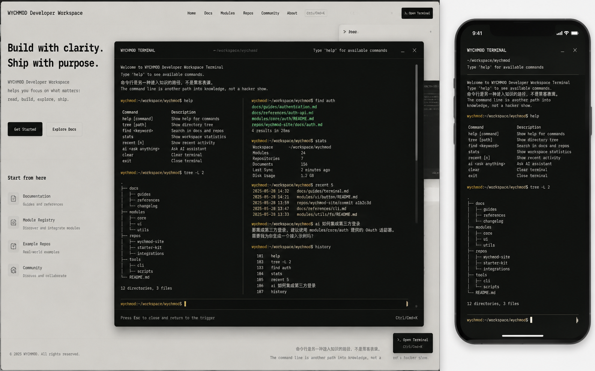

# Image 09：现有终端弹窗视觉与交互改造



> 状态：可实施
> 对应提示词：P009
> 目标范围：现有 `#terminal-trigger`、`#terminal-overlay`、`#terminal-window`、`#terminal-header`、`#terminal-body`、`#terminal-output`、`#terminal-input-line`、`#terminal-input`
> 内容真相来源：`docs/index.html` 终端 IIFE、`docs/assets/css/modern-theme.css` Terminal 段、`docs/assets/js/ai-assistant.js`、`docs/_meta/HOMEPAGE_DESIGN_AND_IMPLEMENTATION.md`
> 实现边界：只能改造现有终端弹窗的视觉、可访问性和焦点细节；不得新建第二套终端，不得重写 `Commands` 对象，不得改变命令历史和文档树解析逻辑。

---

## 1. 给实现模型的任务入口

你要把当前项目已经存在的命令行终端弹窗改造成参考图所示的“研究者工作台终端”。这不是新增终端，也不是替换终端。当前 DOM 已在 `docs/index.html` 中存在：

```html
<div id="terminal-trigger" title="打开命令行 (Ctrl+K)">►_</div>
<div id="terminal-overlay"></div>
<div id="terminal-window">
  <div id="terminal-header">...</div>
  <div id="terminal-body">
    <div id="terminal-output"></div>
    <div id="terminal-input-line">...</div>
  </div>
</div>
```

当前终端逻辑也已经存在：打开/关闭、欢迎信息、命令解析、历史、补全、文档树、搜索、AI 命令都在 `docs/index.html` 的 IIFE 中。你只能做以下事情：

- 优化 `#terminal-window` 和相关 class 的视觉。
- 替换遗留紫色/科技蓝终端色为首页 V2 的暖石墨、旧金、信号绿。
- 补充最小可访问性语义，例如 `role="dialog"`、`aria-modal`、标题关联、关闭按钮名称。
- 补充焦点恢复和 focus trap（如果当前缺失）。
- 优化移动端 `100dvh`、safe-area、软键盘遮挡、长输出滚动。

实现前必须完整阅读：

- `AGENTS.md`
- `docs/_meta/HOMEPAGE_DESIGN_AND_IMPLEMENTATION.md`
- `docs/index.html` 中终端 DOM、事件绑定、`Commands` 对象、`TerminalState`
- `docs/assets/css/modern-theme.css` 中 Terminal 段
- `docs/assets/js/ai-assistant.js`
- `docs/_sidebar.md`

禁止：

- 新增第二个 `#terminal-window` 或新建一套命令行系统。
- 移动、拆分、重写 `Commands` 对象。
- 改掉 `Ctrl/Cmd + K` 打开终端的行为。
- 改掉 `Esc` 关闭终端的行为。
- 改掉 `Enter`、上下键、`Tab`、`Ctrl + L` 的输入行为。
- 删除 `escapeHtml` 或绕过现有输出转义。
- 把参考图中的示例路径、模块数量、仓库数量、历史输出作为真实欢迎内容。
- 用红黄绿三颗圆点作为唯一关闭方式；关闭控件必须可被读屏和键盘理解。
- 为了“黑客感”加霓虹、扫描线、粒子、Canvas 或沉重动画库。

---

## 2. 参考图视觉审计

### 2.1 桌面端画面结构

参考图桌面端约 `1440 × 900`：

1. 背景是纸白工作台页面，中央浮出一个大号暖石墨终端窗口。
2. 终端窗口宽约 `900–980px`，高约 `640–720px`，居中偏右，覆盖在页面内容之上。
3. 窗口顶部约 `48px`：
   - 左侧 `WYCHMOD TERMINAL`
   - 中间路径 `~/workspace/wychmod`
   - 右侧提示 `Type 'help' for available commands` 和关闭控件
4. 主输出区为深色等宽排版，不刺眼。命令提示符为旧金，成功/链接为信号绿。
5. 输出区有纵向滚动条，长输出不会撑破窗口。
6. 图中有左右分栏输出效果，但当前终端是线性输出流。生产实现不应为了视觉强行拆输出为两栏，除非命令系统真实支持。
7. 底部输入线固定在窗口底部，右侧有 `Ctrl/Cmd+K` 提示，底部说明 `Press Esc to close...`。
8. 右下角仍有 `Open Terminal` 悬浮触发器，说明弹窗复用同一入口。

### 2.2 手机端画面结构

手机端约 `390 × 844`：

1. 终端几乎全屏，保留设备安全边距和圆角。
2. 顶部显示 `WYCHMOD TERMINAL`，右侧有最小化/关闭。
3. 路径和帮助提示在标题下方。
4. 输出区单列，字体略小但仍可读。
5. 底部输入线贴近安全区，不被软键盘完全遮挡。
6. 长输出可滚动，输入线保持可操作。

### 2.3 图中不能照搬的内容

不能直接写入生产终端：

- `~/workspace/wychmod`，除非当前终端状态真实支持该路径。
- `docs / modules / repos / tools` 目录树，当前文档树来自 `_sidebar.md`。
- `Modules 24`、`Repositories 7`、`Documents 156`、`Disk Usage 1.2 GB`。
- `recent 5` 中的伪文件。
- `ai 如何集成第三方登录` 的伪回答。
- 图中手写的命令列表（当前真实命令更多且不同）。

终端欢迎内容和命令输出必须来自当前代码或真实修改后的逻辑。

---

## 3. Design Specification

### 3.1 Purpose Statement

终端弹窗是知识库的第二入口：当读者知道自己要找什么时，它提供比侧边栏更快的键盘路径；当读者想查看最近访问、统计、AI 辅助或目录树时，它提供一个低干扰的工作台。

它的人文感不是“酷炫黑客秀”，而是“作者给自己留下的一条安静捷径”：命令行是进入知识的另一条路，不是表演层。弹窗要可信、清楚、可恢复，尤其不能让用户因为打开它而迷失焦点或丢失阅读位置。

### 3.2 Aesthetic Direction

唯一方向：**Editorial / magazine，研究者数字书房里的暖石墨终端**。

视觉关键词：

- 暖石墨窗口
- 纸白工作台上的系统抽屉
- 旧金 prompt
- 信号绿状态
- 等宽命令手稿
- 克制、可读、可恢复

禁止方向：

- 黑客电影终端
- 霓虹赛博朋克
- macOS 红黄绿窗口装饰为主视觉
- 游戏控制台
- VS Code 面板克隆
- 聊天机器人弹窗

### 3.3 Color Palette

继承首页 token：

| 语义 | 色值 | 用法 |
|---|---|---|
| 遮罩 | `rgba(13, 16, 14, 0.48)` | 终端打开时覆盖页面 |
| 终端外层 | `#0D100E` | 窗口主体 |
| 终端内层 | `#131713` | 输出区或 header 局部 |
| 深色边线 | `rgba(242, 239, 231, 0.12)` | 窗口边框、header 分隔 |
| 终端主文字 | `#E9E5DC` | 输出主文本 |
| 终端次级文字 | `#A9AEA7` | 帮助、说明、历史 |
| prompt 旧金 | `#C8A96B` | `$`、路径、当前命令提示 |
| 成功信号绿 | `#24D18F` | 成功、文件链接、在线状态 |
| 错误朱砂 | `#E6663E` | 错误输出 |
| 警告金 | `#D7B76D` | 警告输出 |
| 焦点 | `#7EE8BC` | 输入框 focus ring |

需要移除或收敛当前 CSS 中的紫色系，例如 `#a58bff`、`#b8a8ff` 在终端 prompt、command、directory 上的使用。紫色不符合首页 V2 规范。

### 3.4 Typography

- 终端全部主要文字使用等宽字体：`IBM Plex Mono`, `JetBrains Mono`, Consolas, monospace。
- 中文 fallback 可跟随正文无衬线，但不要破坏等宽命令对齐。
- 标题 `WYCHMOD TERMINAL` 使用等宽 `12–13px`，字母间距可 `0.02em`。
- 桌面输出：`13–14px / 1.6`。
- 手机输出：`12.5–13px / 1.55`。
- 输入行：`14px` 桌面，`13px` 手机。
- 任何可读输出不得低于 `12px`。

### 3.5 Layout Strategy

保持一套 DOM，多端视觉变形：

| 断点 | 终端策略 |
|---|---|
| 桌面 `>= 1024px` | 居中大弹窗，宽 `min(940px, calc(100vw - 64px))`，高 `min(720px, 80vh)` |
| 平板 `768–1023px` | 宽 `calc(100vw - 40px)`，高 `calc(100dvh - 80px)` |
| 手机 `< 768px` | 近全屏，宽 `calc(100vw - 20px)` 或 `100vw`，高 `calc(100dvh - safe-area)`，圆角减小 |

输出区和输入区必须分离：输出区滚动，输入行固定在终端底部。

---

## 4. 真实 DOM 与语义规格

### 4.1 当前 DOM

当前结构：

```text
#terminal-trigger
#terminal-overlay
#terminal-window
  #terminal-header
    #terminal-controls
      .terminal-control-btn.close
      .terminal-control-btn.minimize
      .terminal-control-btn.maximize
    #terminal-title
  #terminal-body
    #terminal-output
    #terminal-input-line
      #terminal-prompt
      #terminal-input
      #terminal-cursor
```

### 4.2 可访问性补充

建议补充：

```html
<div id="terminal-window"
     role="dialog"
     aria-modal="true"
     aria-labelledby="terminal-title"
     aria-describedby="terminal-help">
```

输出区：

```html
<div id="terminal-output" aria-live="polite" aria-label="终端输出"></div>
```

输入框：

```html
<input id="terminal-input"
       aria-label="输入终端命令"
       autocomplete="off"
       spellcheck="false">
```

关闭按钮：

- 当前 `.terminal-control-btn.close` 是空 div。应改为 `<button>` 或补充 `role="button"`、`tabindex="0"`、`aria-label="关闭终端"`。
- 更推荐改为 button，但要保持 CSS 和事件绑定兼容。
- `minimize`、`maximize` 如果没有真实功能，不应作为可点击控件暴露给读屏；可设为装饰或删除视觉依赖。不要显示无功能按钮误导用户。

### 4.3 触发器语义

`#terminal-trigger` 当前是 div，应补充：

- `role="button"` 或改为 `<button>`。
- `tabindex="0"`。
- `aria-label="打开命令行终端，快捷键 Ctrl K"`。
- `aria-expanded` 跟随打开状态。
- 键盘 `Enter` / `Space` 打开。

如果改标签风险较高，可保持 div 但补属性和键盘事件。

---

## 5. 桌面端像素级规格

以 `1440 × 900` 为主验收尺寸。

### 5.1 遮罩

- `#terminal-overlay` 覆盖全屏。
- 背景 `rgba(13,16,14,0.48)`，可加极轻微 blur `backdrop-filter: blur(2px)`，但不要依赖它。
- z-index 高于侧边栏和搜索，低于终端窗口。
- 点击遮罩关闭终端。

### 5.2 终端窗口

建议：

```css
width: min(940px, calc(100vw - 64px));
height: min(720px, 80vh);
border-radius: 8px;
background: #0D100E;
border: 1px solid rgba(242,239,231,.14);
box-shadow:
  0 30px 80px rgba(0,0,0,.38),
  0 0 0 1px rgba(201,195,183,.06) inset;
```

位置：

- 居中：`left: 50%; top: 50%; transform: translate(-50%, -50%)`。
- 如果首页/文章内容在左侧较重，可以轻微右移不超过 `24px`，但不要遮住右下触发器导致误触。

### 5.3 Header

- 高度：`44–50px`。
- 左右 padding：`16–20px`。
- 背景：`rgba(19,23,19,0.96)`。
- 底部边线：`1px solid rgba(242,239,231,.10)`。
- 左侧标题：`WYCHMOD TERMINAL`。
- 中间路径：当前可显示 `wychmod@knowledge-base:~` 或现有 `#terminal-title`，不要写假工作目录。
- 右侧帮助：如果空间足够显示 `Type 'help' for available commands`；小屏隐藏。
- 关闭按钮：`32–36px` 点击区。

### 5.4 输出区

- `#terminal-body` 使用 flex column。
- `#terminal-output` flex: 1，overflow-y: auto。
- padding：`20–24px`。
- 行距：`1.55–1.65`。
- 每行 margin：`4–6px`。
- 长路径、URL、中文英文混排：`overflow-wrap: anywhere`。
- 滚动条宽 `8px`，thumb `rgba(233,229,220,.25)`。

状态色：

- `.terminal-prompt`：旧金。
- `.terminal-command`：纸白或信号绿，不用紫。
- `.terminal-directory`：旧金或信号绿。
- `.terminal-file`：信号绿。
- `.terminal-error`：朱砂。
- `.terminal-success`：信号绿。
- `.terminal-warning`：警告金。
- `.terminal-info`：次级文字。

### 5.5 输入行

- 高度：`52–60px`。
- 顶部边线 `1px solid rgba(242,239,231,.12)`。
- padding：`0 20–24px`。
- prompt 与输入同行。
- 输入框背景透明。
- 输入框文字 `#E9E5DC`。
- focus 不显示浏览器默认蓝色描边，使用终端内 focus ring 或 caret。
- 光标可继续使用 `#terminal-cursor`，但要确保不会与原生 caret 冲突。

底部帮助可放在输入行下或 header 右侧：

- `Press Esc to close and return to the trigger`
- `Ctrl/Cmd+K`

如果当前 DOM 没有底部帮助，不必为了视觉大量改 DOM；可用 CSS pseudo-element 或极小 DOM 增补，但要可读。

---

## 6. 手机端像素级规格

以 `390 × 844` 和 `360 × 800` 为验收尺寸。

### 6.1 窗口尺寸

- 宽度：`calc(100vw - 20px)`，`360px` 下可 `calc(100vw - 12px)`。
- 高度：`calc(100dvh - 32px)`，考虑 `env(safe-area-inset-top/bottom)`。
- top：`max(10px, env(safe-area-inset-top))`。
- border-radius：`18–22px` 可贴合设备，但不要过度像手机壳。
- 输出区高度随软键盘收缩。

### 6.2 Header

- 高度 `52–58px`。
- 标题两行时仍可读：
  - 第一行 `WYCHMOD TERMINAL`
  - 第二行当前路径或帮助提示
- 右侧关闭按钮 `44px` 点击区。
- 隐藏无功能 minimize/maximize。

### 6.3 输出区

- padding：`18–20px`。
- 字号 `12.5–13px`。
- 行距 `1.55`。
- 横向不要溢出；树状输出可以横向滚动，但不能撑大整个窗口。
- 长输出滚动到底部时输入行仍可见。

### 6.4 输入与软键盘

- 输入行必须在可视区内。
- iOS/Android 键盘弹出后不应被完全遮挡。
- 可使用 `100dvh`，并在低兼容时回退到 `100vh`。
- `scrollToBottom()` 后应让最新输出和输入都可见。

---

## 7. 不可回归行为

这些行为必须保持：

| 行为 | 当前来源 |
|---|---|
| 右下角 `#terminal-trigger` 点击打开/关闭 | `Elements.trigger.addEventListener('click', toggleTerminal)` |
| 遮罩点击关闭 | `Elements.overlay.addEventListener('click', closeTerminal)` |
| 关闭按钮关闭 | `.terminal-control-btn.close` click |
| `Ctrl/Cmd + K` 切换终端 | `handleGlobalKeyDown` |
| `Esc` 关闭终端 | `handleGlobalKeyDown` |
| `Enter` 执行命令 | `handleKeyDown` |
| `ArrowUp/ArrowDown` 浏览历史 | `navigateHistory` |
| `Tab` 自动补全 | `autoComplete` |
| `Ctrl + L` 清屏 | `clearTerminal` |
| 命令解析支持引号 | `parseCommand` |
| 历史保存 | `terminalHistory` localStorage |
| 文档树解析 | `parseDocumentTree` |
| 最近阅读 | `readingHistory` |
| AI 命令 | `ai`、`aiconfig`、`aisearch` |
| 输出转义 | `escapeHtml` |

视觉改造不得影响这些逻辑。

---

## 8. 状态设计

终端至少要覆盖这些状态：

| 状态 | 视觉要求 |
|---|---|
| 关闭 | 遮罩和窗口不可见，不占焦点 |
| 首次打开 | 展示欢迎信息，输入框聚焦 |
| 普通输出 | 等宽、行距足够、自动滚动到底 |
| 长输出 | 输出区内部滚动，输入行固定 |
| 成功 | 信号绿文字，配上下文 |
| 警告 | 警告金文字，配上下文 |
| 错误 | 朱砂文字，说明下一步 |
| AI 等待 | 不伪造加载动画；可显示文本等待状态 |
| AI 失败 | 显示配置或网络问题，不泄露密钥 |
| 未知命令 | 保持现有错误文案 |
| 移动软键盘 | 输入可见，窗口不溢出 |

---

## 9. 实施步骤

### 9.1 DOM 语义增强

1. 给 `#terminal-window` 增加 dialog 语义。
2. 给 `#terminal-output` 增加 `aria-live`。
3. 给 `#terminal-input` 增加明确 `aria-label`。
4. 给触发器和关闭按钮补充键盘可操作性。
5. 记录打开前焦点元素，关闭后恢复焦点。

### 9.2 CSS 重构

1. 在 `modern-theme.css` Terminal 段集中改造，不在文件末尾随意追加碎片覆盖。
2. 替换终端紫色 prompt/command/directory。
3. 统一 header、body、input-line 尺寸。
4. 设置桌面、平板、手机断点。
5. 添加 reduced-motion。
6. 检查 z-index 与侧边栏、搜索、Gitalk、回到顶部按钮关系。

### 9.3 JS 最小增强

只允许：

- 焦点恢复。
- focus trap。
- button 键盘事件。
- `aria-expanded` 同步。
- 移动端关闭时恢复滚动。

不允许：

- 重写 `executeCommand`。
- 重写 `Commands`。
- 修改 AI 助手逻辑。
- 新建命令输出模型。

---

## 10. 验证清单

### 10.1 静态检查

运行：

```bash
node scripts/sidebar-check.js
node scripts/check-links.js
git diff --check
```

### 10.2 命令回归

逐项执行：

```text
help
man help
pwd
ls
cd /
tree
find Redis
cat /md/02-后端开发/10-Redis缓存.md
stats
recent
history
clear
unknown-command
echo <script>alert(1)</script>
aisearch Spring
aiconfig
```

验收：

- 命令行为与改造前一致。
- 恶意 HTML 被转义。
- 长输出滚动正常。
- 历史保存和读取正常。
- AI 未配置时提示清楚，不泄露 Key。

### 10.3 打开入口

测试：

- 右下角 `#terminal-trigger`。
- 顶部导航 `data-open-terminal` 按钮。
- 首页终端预览或 CTA（若存在）。
- `Ctrl/Cmd + K`。

确认全部打开同一套 `#terminal-window`。

### 10.4 可访问性

检查：

- 触发器可键盘聚焦并打开。
- 终端打开后焦点进入输入框。
- Tab 不会跑到遮罩后页面。
- 关闭按钮可读屏识别。
- Esc 关闭后焦点返回触发器。
- `aria-expanded` 状态正确。

### 10.5 视觉与响应式

截图尺寸：

- `1440 × 900`
- `1280 × 800`
- `1024 × 768`
- `768 × 1024`
- `390 × 844`
- `360 × 800`

验收：

- 桌面终端宽高接近参考图但不遮挡不可恢复。
- 手机终端近全屏且输入可见。
- 输出文字不小于 `12px`。
- 紫色 prompt/command 被替换为首页色系。
- 无霓虹、无蓝紫渐变、无沉重动画。
- 控制台无新增 error。

---

## 11. 可直接复制给实现模型的指令

请按以下要求实现 Image 09 对应的现有终端弹窗改造。

目标是改造当前已经存在的 `#terminal-window`，不是创建新终端。视觉参考 `docs/_meta/ui-redesign/references/image-09.png`，但图中的路径、模块数、仓库数、文档数、历史输出和命令示例都是概念数据，不能写入生产欢迎内容。

开始前阅读：

1. `AGENTS.md`
2. `docs/_meta/HOMEPAGE_DESIGN_AND_IMPLEMENTATION.md`
3. `docs/index.html` 中终端 DOM、`TerminalState`、事件绑定、`Commands`、`parseCommand`、`escapeHtml`
4. `docs/assets/css/modern-theme.css` 中 Terminal 段
5. `docs/assets/js/ai-assistant.js`
6. `docs/_sidebar.md`

设计规格：

- Purpose：终端是知识库的第二导航入口，提供键盘搜索、目录、最近访问、统计和 AI 辅助。
- Aesthetic Direction：Editorial / magazine，研究者数字书房里的暖石墨终端。
- Color：窗口暖石墨 `#0D100E`，内层深墨 `#131713`，文字纸白 `#E9E5DC`，次级文字 `#A9AEA7`，prompt 旧金 `#C8A96B`，成功/文件信号绿 `#24D18F`，错误朱砂 `#E6663E`。移除当前终端里的紫色 prompt/command/directory。
- Typography：终端主要文字使用 `IBM Plex Mono`, `JetBrains Mono`, Consolas, monospace；桌面输出 `13–14px / 1.6`，手机不小于 `12px`。
- Layout：桌面居中大弹窗，宽 `min(940px, calc(100vw - 64px))`，高 `min(720px, 80vh)`；手机近全屏，考虑 `100dvh` 和 safe-area；输出区滚动，输入行固定底部。

允许改动：

- Terminal 相关 CSS。
- `#terminal-window` 的 ARIA 语义。
- `#terminal-output` 的 `aria-live`。
- `#terminal-input` 的 label。
- 触发器和关闭按钮的键盘可访问性。
- 焦点恢复和最小 focus trap。

禁止改动：

- 不新建第二个终端。
- 不重写 `Commands`。
- 不改变 `Ctrl/Cmd + K`、`Esc`、`Enter`、上下键、`Tab`、`Ctrl + L` 行为。
- 不删除 `escapeHtml`。
- 不修改 AI 助手业务逻辑。
- 不复制参考图伪数据。

完成后验证：

```bash
node scripts/sidebar-check.js
node scripts/check-links.js
git diff --check
```

浏览器回归：

- 从右下角、顶部终端按钮、`Ctrl/Cmd + K` 打开，确认都是同一 `#terminal-window`。
- 执行 `help`、`man help`、`ls`、`cd /`、`tree`、`find Redis`、`cat /md/02-后端开发/10-Redis缓存.md`、`stats`、`recent`、`history`、`clear`、未知命令、`echo <script>alert(1)</script>`、`aisearch Spring`、`aiconfig`。
- 刷新后检查 `terminalHistory`。
- `1440×900`、`1280×800`、`1024×768`、`768×1024`、`390×844`、`360×800` 下检查可读性、滚动、软键盘、焦点恢复和控制台错误。
