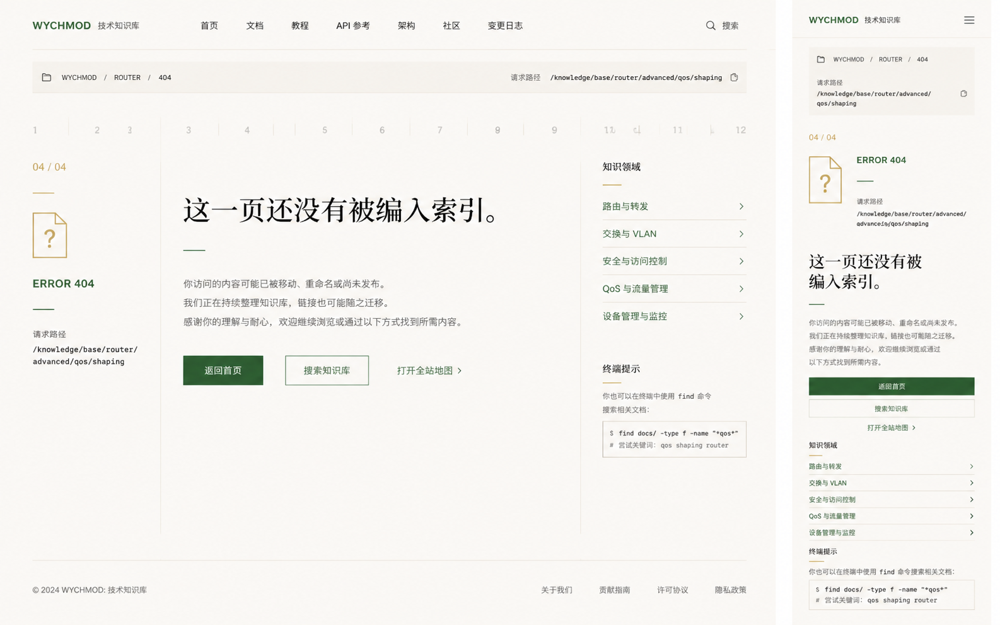

# Image 10：Docsify 404 / 未编入索引页面



> 状态：可实施
> 对应提示词：P010
> 目标范围：Docsify 未知 hash 路由的自定义 404 内容、恢复入口、请求路径展示、安全转义与响应式视觉
> 内容真相来源：`docs/index.html` Docsify 配置、当前 hash 路由机制、`docs/_sidebar.md`、`docs/md/Index.md`、`docs/_meta/HOMEPAGE_DESIGN_AND_IMPLEMENTATION.md`
> 实现边界：建议新增 `docs/_404.md` 并配置 Docsify `notFoundPage`；不得为了本任务改造 GitHub Pages 服务端路由或创建破坏 hash 路由的根目录 `404.html`。

---

## 1. 给实现模型的任务入口

你要为当前 Docsify 知识库设计并实现一个自定义 404 页面。它应该像参考图一样，是纸白研究内页中的“缺页说明”：温和地告诉读者这条路径没有被编入索引，并给出返回首页、搜索知识库、打开全站地图、查看真实知识领域、使用终端搜索的恢复路径。

这页不是搞笑报错页，不是独立品牌海报，也不是服务器端错误页。当前项目是 GitHub Pages + Docsify hash 路由，未知 hash 应由 Docsify 接管。推荐方式是新增 `docs/_404.md`，并在 `docs/index.html` 的 `$docsify` 配置中加入官方 `notFoundPage` 配置。除非另开部署任务，不要创建根目录 `404.html` 去改 GitHub Pages 路由行为。

实现前必须完整阅读：

- `AGENTS.md`
- `docs/_meta/HOMEPAGE_DESIGN_AND_IMPLEMENTATION.md`
- `docs/index.html`
- `docs/_sidebar.md`
- `docs/md/Index.md`
- `docs/README.md`
- `docs/_coverpage.md`
- `docs/assets/css/modern-theme.css`
- `docs/assets/css/studio-tokens.css`

禁止：

- 复制参考图里的 `/knowledge/base/router/advanced/qos/shaping` 作为固定请求路径。
- 复制参考图里的 `路由与转发`、`交换与 VLAN`、`QoS 与流量管理` 等领域入口，除非当前项目真实有这些文档。
- 静态伪造“相关领域推荐”。如果没有真实推荐算法，只提供稳定的 9 大领域入口。
- 用巨大 404 数字、恐龙、宇航员、动物、表情包、彩色插画把错误娱乐化。
- 使用紫色、蓝紫渐变、科技蓝错误页。
- 把 URL hash 直接拼进 `innerHTML`。
- 让搜索按钮占用 `Ctrl/Cmd + K`；该快捷键属于终端。
- 破坏 Docsify 正常文章路由。

---

## 2. 参考图视觉审计

### 2.1 桌面端画面结构

参考图桌面端约 `1440 × 900`：

1. 顶部浅纸白导航，高约 `72px`，左侧 `WYCHMOD 技术知识库`，中间有首页、文档、教程、API 参考、架构、社区、变更日志，右侧搜索。
2. 导航下方有路径横条，高约 `58px`，左侧为 `WYCHMOD / ROUTER / 404`，右侧显示请求路径和复制按钮。
3. 主体是 12 栏非对称布局：
   - 左栏：`04 / 04`、小型文件问号图标、`ERROR 404`、请求路径。
   - 中栏：大标题“这一页还没有被编入索引。”、说明文字、三个恢复动作。
   - 右栏：知识领域入口和终端提示。
4. 页面底部是很轻的页脚链接。
5. 整体非常克制：没有巨大数字，没有卡通图，只有纸白、旧金、信号绿和细线。

### 2.2 移动端画面结构

参考图移动端约 `390 × 844`：

1. 顶部浅纸白导航，高约 `56px`，左侧品牌，右侧菜单。
2. 路径卡片在顶部，显示 `WYCHMOD / ROUTER / 404` 和请求路径。
3. 状态 `04 / 04`、文件图标、`ERROR 404` 纵向排列。
4. H1 左对齐，约 `30px`，两行自然换行。
5. 说明文字紧跟 H1。
6. 三个恢复动作竖向全宽：返回首页、搜索知识库、打开全站地图。
7. 知识领域入口和终端提示继续在下方。

### 2.3 图中不能照搬的内容

不能照搬：

- 请求路径 `/knowledge/base/router/advanced/qos/shaping`。
- `ROUTER` 领域。
- `QoS / VLAN / 路由与转发` 相关推荐。
- 图中的页脚链接名，除非项目已有。
- 静态“复制路径成功”状态，除非实现真实复制。

可借鉴：

- “这一页还没有被编入索引。”这个语气很适合本项目，可以保留或微调。
- “链接可能迁移，欢迎继续浏览或搜索”这种温和文案。
- 左侧状态、中央恢复动作、右侧稳定入口的非对称布局。

---

## 3. Design Specification

### 3.1 Purpose Statement

404 页面服务于迷路的读者：他们可能点到了旧链接、手输了路径、从搜索引擎来到不存在的 hash，或访问了迁移后的旧地址。页面的任务不是宣告失败，而是给出几条安静可靠的回路：回首页、搜知识库、看全站地图、打开相关领域、用终端找。

这页的人文感来自承认“知识库在持续整理，链接也会迁移”。它要表达作者还在维护这间数字书房，而不是把错误推给读者。

### 3.2 Aesthetic Direction

唯一方向：**Editorial / magazine，研究者数字书房里的缺页说明**。

视觉关键词：

- 缺页说明
- 纸白索引
- 温和恢复
- 请求路径
- 领域入口
- 安静、克制、有人味

禁止方向：

- 搞笑 404
- 巨型错误数字海报
- 科技 SaaS 空状态
- 游戏失败页
- 复古报纸讣告
- 系统崩溃蓝屏

### 3.3 Color Palette

继承首页纸白系统：

| 语义 | 色值 | 用法 |
|---|---|---|
| 灰纸白 | `#E9E5DC` | 页面背景 |
| 浅纸白 | `#F2EEE5` | 路径卡片、按钮底 |
| 纸张线 | `#C9C3B7` | 分隔线、路径卡片边框 |
| 墨色正文 | `#20211D` | H1、正文、路径标题 |
| 次级文字 | `#66685F` | 说明、路径标签 |
| 暖石墨 | `#0D100E` | 顶部重要文字、深色小元素 |
| 旧金 | `#C8A96B` | `04 / 04`、文件图标、细线 |
| 信号绿 | `#24D18F` | 主恢复按钮、可用入口、焦点 |
| 朱砂 | `#B64B45` | 极少错误提示，不主导页面 |

使用规则：

- 主 CTA 可用深绿/信号绿，但文字对比必须足够。
- `ERROR 404` 用深绿或墨色，不用红色大警告。
- 页面不使用纯白大背景。
- 不使用紫色、蓝紫渐变。

### 3.4 Typography

- H1：`Source Han Serif SC`, `Noto Serif SC`, `Songti SC`, SimSun, serif。
- 正文/按钮/导航：`Source Han Sans SC`, `Noto Sans SC`, `Microsoft YaHei`, sans-serif。
- 路径/状态/编号：`IBM Plex Mono`, `JetBrains Mono`, Consolas, monospace。

字号建议：

| 元素 | 桌面 | 移动 |
|---|---:|---:|
| 顶部导航 | `14–15px` | `14px` |
| 路径条 | `12–13px` | `11–12px` |
| `04 / 04` | `15–16px` | `14–15px` |
| `ERROR 404` | `17–20px` | `15–17px` |
| H1 | `44–52px / 1.2` | `30–34px / 1.25` |
| 正文 | `15–16px / 1.85` | `14–15px / 1.8` |
| 按钮 | `14–15px` | `14–15px` |
| 右栏入口 | `14–15px` | `14px` |

### 3.5 Layout Strategy

桌面采用“左状态 / 中恢复 / 右索引”的非对称布局，不要居中堆叠。

移动采用单列左对齐，按钮纵向排列，路径可换行。

---

## 4. 技术实现策略

### 4.1 推荐文件

建议新增：

```text
docs/_404.md
```

建议最小修改：

```js
window.$docsify = {
  ...
  notFoundPage: true
}
```

或按 Docsify 支持的方式配置到 `_404.md`。实现模型需要以当前 Docsify 版本实际行为为准做本地验证。

### 4.2 不建议

不建议在本任务中：

- 新建根目录 `404.html`。
- 写服务器重定向规则。
- 改 GitHub Pages 部署策略。
- 迁移 Docsify hash 路由到 history 路由。

这些都超出了 404 页面视觉与内容任务。

### 4.3 动态请求路径

静态 `_404.md` 无法天然知道请求 hash 的每个细节。若需要显示真实请求路径，可最小新增一个幂等增强脚本：

- 在 Docsify `doneEach` 后判断当前页面是否为 `_404.md`。
- 读取 `window.location.hash`。
- 使用 `textContent` 写入 `.not-found__request-path`。
- 复制按钮使用 Clipboard API，并提供失败 fallback。
- 不使用 `innerHTML` 注入用户输入。

如果不实现动态路径，就显示稳定文案，例如“当前访问的 hash 路由没有匹配到文档”，不要显示假路径。

---

## 5. 页面信息架构

建议 `_404.md` 内容：

```text
404 / PATH NOT FOUND
├─ 路径条
│  ├─ WYCHMOD / ROUTER / 404
│  └─ 请求路径：动态 textContent 或稳定说明
├─ 状态侧栏
│  ├─ 04 / 04
│  ├─ file-question 图标
│  ├─ ERROR 404
│  └─ 请求路径
├─ 主说明
│  ├─ H1：这一页还没有被编入索引。
│  ├─ 原因说明
│  └─ 恢复动作
├─ 知识领域
│  ├─ 9 大真实领域入口
│  └─ 全站地图
├─ 终端提示
│  └─ 可用 find 命令搜索相关文档
└─ 页脚
```

### 5.1 文案建议

主标题：

```text
这一页还没有被编入索引。
```

说明：

```text
你访问的内容可能已经被移动、重命名，或者还没有发布。
这个知识库仍在持续整理，旧链接偶尔会留下迁移的痕迹。
可以从首页、搜索或全站地图重新进入，也可以打开终端用 find 命令寻找相近主题。
```

注意语气：

- 不说“你输错了”。
- 不说“页面不存在哈哈”。
- 不夸张承诺“我们会立即修复”。
- 不把 404 当营销广告。

### 5.2 恢复动作

主动作：

- 返回首页：`/#/README` 或 `/README`，按当前 Docsify 路由习惯。

次动作：

- 搜索知识库：聚焦现有 Docsify Search 输入，或跳回首页搜索。
- 打开全站地图：`/md/Index.md`。

第三动作：

- 打开终端：触发现有 `#terminal-trigger`，或提示 `Ctrl/Cmd + K`。

按钮视觉：

- 主按钮信号绿或深绿填充。
- 次按钮纸白边框。
- 文本链接旧金/墨色，带箭头。
- 移动端按钮全宽，高 `44–48px`。

### 5.3 真实知识领域入口

右栏/移动下方应列出真实 9 大领域。建议展示 5 个高频入口，并提供全站地图，不必一次堆满 9 个。

稳定入口可以是：

- 计算机基础
- 后端开发
- 云原生与运维
- 前端开发
- AI 与 Agent
- 软件工程
- 面试求职
- 过时技术
- 开发工具

链接必须来自 `_sidebar.md` 或 `md/Index.md`。不要写不存在的路由网络分类。

### 5.4 终端提示

终端提示文案：

```text
也可以打开终端，用 find 命令搜索相近主题：
$ find Redis
$ find Kubernetes
$ find Agent
```

注意：

- 不自动执行命令。
- 不使用图中的 `find docs/ -type f -name "*qos*"`，当前终端不是真实 Unix shell。
- 终端打开仍使用现有 `Ctrl/Cmd + K` 或按钮。

---

## 6. 桌面端像素级规格

以 `1440 × 900` 为主验收尺寸。

### 6.1 顶部与路径条

- 顶部导航沿用现有全局导航，高 `60–64px`。
- 404 内容顶部与正文 shell 对齐，最大宽 `1440px`。
- 路径条高度 `56–64px`。
- 路径条背景 `rgba(242,238,229,0.72)`。
- 路径条边框 `1px solid rgba(201,195,183,0.65)`。
- 左侧路径：等宽 `12px`。
- 右侧请求路径：等宽，`overflow-wrap: anywhere`。
- 复制按钮 `32–36px` 点击区，使用 Lucide `copy`，有 `aria-label`。

### 6.2 主体网格

建议：

```css
display: grid;
grid-template-columns: 210px minmax(0, 1fr) 280px;
gap: 44px;
padding: 72px 0 96px;
```

左栏：

- 顶部有淡淡的纵向线。
- `04 / 04` 旧金。
- 文件图标 `56–64px`。
- `ERROR 404` 深绿/墨色。
- 请求路径最大宽度 `180px`，等宽换行。

中栏：

- 最大宽 `640–720px`。
- H1 `44–52px`，左对齐。
- H1 下方有短信号绿线 `36–48px`。
- 说明文字三段以内。
- 按钮组水平排列，间距 `20–24px`。

右栏：

- 左边线 `1px solid rgba(201,195,183,0.65)`。
- padding-left `36px`。
- 模块间距 `48px`。
- 领域入口每行高度 `42–48px`，右侧箭头。
- 终端提示代码块浅纸白背景，等宽。

### 6.3 页脚

页脚可沿用当前站点页脚。404 页不应出现过多营销链接。

---

## 7. 移动端像素级规格

以 `390 × 844` 和 `360 × 800` 为验收尺寸。

### 7.1 总体

- 页面左右 padding `20–24px`。
- 顶栏高度 `56–58px`。
- 路径卡片上边距 `18–24px`。
- 主体单列，左对齐。
- 不居中大 404。

### 7.2 路径卡片

- 背景浅纸白。
- padding `14–16px`。
- 路径可换行。
- 请求路径等宽 `12px`。
- 复制按钮在右上或路径后。

### 7.3 状态与标题

- `04 / 04` 在路径卡片下方 `28–36px`。
- 文件图标 `52–60px`。
- `ERROR 404` `16px`。
- H1 `30–34px`，两行自然换行。
- 说明文字 `14–15px / 1.8`。

### 7.4 操作按钮

- 三个动作纵向排列。
- 主按钮高度 `46–50px`。
- 次按钮高度 `44–48px`。
- 间距 `10–12px`。
- 不使用大圆角胶囊，圆角 `4–6px`。

### 7.5 领域与终端提示

- 领域入口放在按钮之后。
- 每个入口高度 `42–46px`。
- 终端提示代码块可横向滚动，但不撑开页面。

---

## 8. 安全与可访问性

### 8.1 URL 安全

如果显示请求路径：

- 使用 `textContent`。
- 不使用 `innerHTML`。
- 对 `<script>`、引号、中文、空格、超长 hash 测试。
- 路径复制只复制纯文本。

### 8.2 可访问性

- H1 唯一。
- 路径复制按钮有 `aria-label`。
- 搜索按钮有明确 label。
- 主按钮和链接可键盘访问。
- 焦点态使用信号绿 outline。
- 错误状态不是只靠图标。

### 8.3 搜索动作

“搜索知识库”可以：

1. 聚焦侧栏 `.search input`。
2. 打开首页并聚焦 `#cover-search-input`。
3. 或显示搜索说明，引导用户使用现有搜索。

不能创建一个没有结果逻辑的假搜索框。

---

## 9. 实施步骤

### 9.1 文件与配置

1. 新增 `docs/_404.md`。
2. 在 `docs/index.html` 的 `$docsify` 配置中加入 `notFoundPage`。
3. 如果新增动态路径脚本，放在现有 Docsify 生命周期逻辑附近，保持幂等。
4. 如果新增 CSS，使用 `.not-found-page` 作用域，不污染普通文章。

### 9.2 内容实现

1. 写入温和 404 文案。
2. 提供返回首页、搜索知识库、全站地图。
3. 提供真实 9 大领域入口或高频领域入口。
4. 提供终端 `find` 提示。
5. 不展示假推荐和假路径。

### 9.3 验证

1. 访问不存在 hash。
2. 访问含中文、空格、特殊字符、超长字符串的不存在 hash。
3. 点击所有恢复入口。
4. 验证搜索和终端。
5. 验证手机和桌面布局。

---

## 10. 验证清单

### 10.1 静态检查

运行：

```bash
node scripts/sidebar-check.js
node scripts/check-links.js
git diff --check
```

### 10.2 路由检查

访问：

```text
#/not-exist
#/md/does-not-exist
#/中文 空格
#/<script>alert(1)</script>
#/aaaaaaaaaaaaaaaaaaaaaaaaaaaaaaaaaaaaaaaaaaaaaaaaaaaaaaaaaaaaaaaaaaaaaaaa
```

确认：

- 进入自定义 404。
- 请求路径安全展示或稳定说明。
- 页面不执行脚本。
- 不产生控制台 error。

### 10.3 恢复动作检查

- 返回首页可用。
- 搜索知识库可用或聚焦现有搜索。
- 全站地图可用。
- 领域入口可用。
- 终端 `Ctrl/Cmd + K` 可用。
- 浏览器后退/前进正常。

### 10.4 视觉检查

尺寸：

- `1440 × 900`
- `1280 × 800`
- `1024 × 768`
- `768 × 1024`
- `390 × 844`
- `360 × 800`

验收：

- 桌面左状态、中说明、右入口三栏清楚。
- 移动单列无横向溢出。
- 请求路径长文本自动换行。
- 按钮触达区域足够。
- 没有恐龙/宇航员/巨大数字/紫色渐变/虚构推荐。

---

## 11. 可直接复制给实现模型的指令

请按以下要求实现 Image 10 对应的 Docsify 404 页面。

当前项目是 GitHub Pages + Docsify hash 路由。你要新增或配置 Docsify 未知 hash 的自定义 404 页面，推荐新增 `docs/_404.md` 并在 `docs/index.html` 的 `$docsify` 配置中启用 `notFoundPage`。不要为本任务创建根目录 `404.html` 或改造服务器端路由。

开始前阅读：

1. `AGENTS.md`
2. `docs/_meta/HOMEPAGE_DESIGN_AND_IMPLEMENTATION.md`
3. `docs/index.html`
4. `docs/_sidebar.md`
5. `docs/md/Index.md`
6. `docs/README.md`
7. `docs/_coverpage.md`
8. `docs/assets/css/modern-theme.css`
9. `docs/assets/css/studio-tokens.css`

设计规格：

- Purpose：帮助访问旧链接或不存在路径的读者温和恢复，回到首页、搜索、全站地图、领域入口或终端搜索。
- Aesthetic Direction：Editorial / magazine，研究者数字书房里的缺页说明。
- Color：灰纸白 `#E9E5DC`、浅纸白 `#F2EEE5`、纸张线 `#C9C3B7`、墨色正文 `#20211D`、次级文字 `#66685F`、旧金 `#C8A96B`、信号绿 `#24D18F`。
- Typography：H1 用中文衬线；正文和按钮用中文无衬线；请求路径和编号用等宽字体。
- Layout：桌面左侧状态、中间说明与恢复动作、右侧真实知识领域和终端提示；移动端单列左对齐，按钮纵向全宽。

页面必须包含：

1. 路径条：`WYCHMOD / ROUTER / 404` 或等价文案。
2. 请求路径：若动态显示，必须用 `textContent` 安全写入；否则显示稳定说明，不写假路径。
3. 状态：`04 / 04`、`ERROR 404`、小型文件问号图标。
4. H1：建议“这一页还没有被编入索引。”
5. 温和说明：内容可能移动、重命名或尚未发布，知识库仍在整理。
6. 恢复动作：返回首页、搜索知识库、打开全站地图。
7. 真实知识领域入口：来自 `_sidebar.md` 或 `md/Index.md`。
8. 终端提示：说明可用 `find` 搜索，例如 `$ find Redis`；不要写真实 Unix `find docs/ -type f`。

禁止：

- 不复制参考图里的 QoS/VLAN/Router 分类和路径。
- 不展示虚构相关领域。
- 不使用巨大 404 数字、卡通插画、emoji、紫色、渐变。
- 不把 hash 注入 `innerHTML`。
- 不占用 `Ctrl/Cmd + K` 搜索；该快捷键仍属于终端。

完成后验证：

```bash
node scripts/sidebar-check.js
node scripts/check-links.js
git diff --check
```

浏览器验证：

- 访问 `#/not-exist`、`#/md/does-not-exist`、`#/中文 空格`、`#/<script>alert(1)</script>`、超长 hash。
- 页面进入自定义 404，不执行脚本。
- 返回首页、搜索、全站地图、领域入口、终端快捷键均可用。
- `1440×900`、`1280×800`、`1024×768`、`768×1024`、`390×844`、`360×800` 下无溢出、无重叠。
