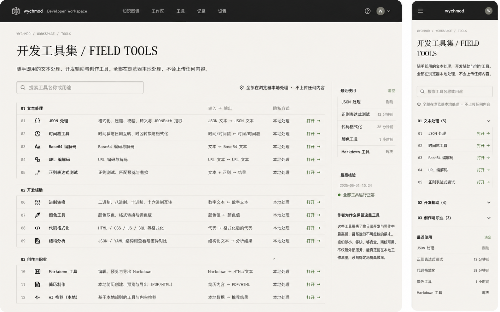

# Image 12：开发工具集首页 / Field Tools



> 状态：可实施
> 对应提示词：P012
> 目标文件：`docs/tools/index.html`
> 内容真相来源：`docs/tools/*.html` 真实工具文件、`docs/tools/index.html` 现有入口、`docs/assets/css/tools-notion.css`、`docs/_meta/HOMEPAGE_DESIGN_AND_IMPLEMENTATION.md`
> 实现边界：这是 12 个独立工具的入口页，不是新的工具 Dashboard，不嵌入工具 iframe，不迁移成 SPA，不伪造最近使用记录。

---

## 1. 给实现模型的任务入口

你要把 `docs/tools/index.html` 从旧的紫色/科技蓝卡片网格，改造成参考图所示的“开发工具集 / Field Tools”纸白编目页。它应该像研究者数字书房里随手可取的一排工具：本地处理、轻量、可信、可快速扫描。

当前真实工具目录包含 12 个独立 HTML 工具页：

```text
docs/tools/ai-recommend.html
docs/tools/base64-tool.html
docs/tools/code-formatter.html
docs/tools/color-tool.html
docs/tools/json-tool.html
docs/tools/markdown-editor.html
docs/tools/radix-tool.html
docs/tools/regex-tool.html
docs/tools/resume-builder.html
docs/tools/structure-tool.html
docs/tools/timestamp-tool.html
docs/tools/url-tool.html
```

实现模型必须从当前目录和现有 index 链接核对工具数量、名称和路径。不能因为参考图或旧页面写法而漏掉工具，也不能新增不存在的工具。

实现前必须完整阅读：

- `AGENTS.md`
- `docs/_meta/HOMEPAGE_DESIGN_AND_IMPLEMENTATION.md`
- `docs/tools/index.html`
- `docs/assets/css/tools-notion.css`
- `docs/tools/*.html`
- `docs/_sidebar.md`
- `docs/md/09-开发工具/10-工具箱与资源.md`

禁止：

- 继续使用旧页面里的紫色边框、蓝色发光、渐变卡片、emoji 图标。
- 把 12 个入口做成厚重卡片瀑布流。
- 伪造“最近使用：12 分钟前 / 1 小时前”等时间。
- 承诺“完全免费、无任何限制”这类无法长期保证的营销文案。
- 夸大“所有工具都不会上传任何内容”，除非逐个工具核对确实没有网络上传。更稳妥写法是“核心处理在浏览器本地完成；外链和第三方资源另行标注”。
- 把独立工具页嵌入 iframe。
- 改变工具页真实路径或把工具迁移成 Docsify hash 路由。

---

## 2. 参考图视觉审计

### 2.1 桌面端画面结构

参考图桌面端约 `1440 × 900`：

1. 顶部暖石墨导航，高约 `72px`。左侧是几何 logo、`wychmod`、`Developer Workspace`，中间有 `知识图谱 / 工作区 / 工具 / 记录 / 设置`，当前 `工具` 有短下划线，右侧为帮助图标和头像。
2. 主体为纸白背景，左侧主内容宽约 `1080px`，右侧边栏宽约 `230px`。
3. 顶部路径 `WYCHMOD / WORKSPACE / TOOLS`，等宽小字。
4. H1：`开发工具集 / FIELD TOOLS`，中文衬线 + 英文衬线，左对齐。
5. H1 下方说明强调：随手即用的文本处理、开发辅助与创作工具，浏览器本地处理，不上传内容。
6. 搜索框宽约 `450px`，位于主内容左侧。
7. 主体工具不是卡片，而是编目表：
   - 分组 `01 文本处理`
   - 行项 `JSON 处理 / 时间戳工具 / Base64 编解码 / URL 编解码 / 正则表达式测试`
   - 分组 `02 开发辅助`
   - 行项 `进制转换 / 颜色工具 / 代码格式化 / 结构分析`
   - 分组 `03 创作与职业`
   - 行项 `Markdown 工具 / 简历制作 / AI 推荐（本地）`
8. 每行包含编号、图标、名称、用途、输入输出、隐私方式、打开动作。
9. 右侧边栏包含最近使用、最后校验、作者为什么保留这些工具。

### 2.2 移动端画面结构

移动端约 `390 × 844`：

1. 顶部暖石墨导航，高约 `56px`，左侧汉堡，居中/左侧品牌，右侧头像。
2. 路径 `WYCHMOD / WORKSPACE / TOOLS`。
3. H1 分两行：`开发工具集 / FIELD TOOLS`。
4. 说明文字保留，但更短。
5. 搜索框全宽。
6. 本地处理承诺单独一行。
7. 工具分组变成 accordion：
   - `01 文本处理 (5)` 默认展开。
   - `02 开发辅助 (4)` 折叠。
   - `03 创作与职业 (3)` 折叠。
8. 工具行只保留编号、名称、打开动作；用途可在展开或小字中显示。
9. 最近使用在工具列表下方，若没有真实数据则改为“常用场景 / 隐私说明”。

### 2.3 图中不能照搬的内容

不能直接复制：

- 最近使用时间：`刚刚`、`12 分钟前`、`38 分钟前`、`昨天`。
- `最后校验 2025-06-01 10:24`。
- `全部工具运行正常`，除非有真实自动检测结果。
- 右上角头像/账号状态，如果当前工具页没有真实登录系统。

可以采用：

- 分组与 12 个工具的大致分类。
- 行式工具目录。
- 本地处理承诺。
- 搜索/筛选工具名。
- 右侧说明栏。

---

## 3. Design Specification

### 3.1 Purpose Statement

工具首页服务于“手边问题”：格式化 JSON、转换时间戳、编码 URL、测试正则、写 Markdown、整理简历。它要让用户在 3 秒内找到工具，并知道这些工具是轻量、本地、不会打断工作流的。

这页的人文感来自“替自己省下细碎摩擦”：不是炫技工具市场，而是一排作者日常写代码、排障、写文章、准备材料时反复会用到的小工具。

### 3.2 Aesthetic Direction

唯一方向：**Editorial / magazine，研究者数字书房里的工具抽屉**。

视觉关键词：

- 工具抽屉
- 纸白编目
- 本地处理
- 输入输出路径
- 轻量、可信、随手
- 工作中安静的一排器具

禁止方向：

- SaaS 应用市场
- 卡片商城
- 彩色图标墙
- Notion 模板库
- 科技蓝 Dashboard
- AI 工具导航站

### 3.3 Color Palette

继承首页：

| 语义 | 色值 | 用法 |
|---|---|---|
| 暖石墨 | `#0D100E` | 顶部导航、深色状态 |
| 深墨 | `#131713` | 顶栏 hover、深色小提示 |
| 灰纸白 | `#E9E5DC` | 页面主体 |
| 浅纸白 | `#F2EEE5` | 表格行、搜索框、右栏 |
| 纸张线 | `#C9C3B7` | 表格边线、分组线 |
| 墨色正文 | `#20211D` | 标题、工具名、正文 |
| 次级文字 | `#66685F` | 用途、输入输出、说明 |
| 信号绿 | `#24D18F` | 打开动作、可用状态、焦点 |
| 旧金 | `#C8A96B` | 分组编号、当前导航下划线 |
| 锈色 | `#A66B45` | 隐私/本地提示辅助 |

禁止使用：

- 紫色边框 `#6d4aff`。
- 科技蓝 `#0b6bcb` / `#3b82f6` 作为主视觉。
- 大面积渐变背景。
- 蓝紫发光阴影。

### 3.4 Typography

- H1：`Source Han Serif SC`, `Noto Serif SC`, `Songti SC`, SimSun, serif。
- 正文和表格：`Source Han Sans SC`, `Noto Sans SC`, `Microsoft YaHei`, sans-serif。
- 路径、编号、输入输出：`IBM Plex Mono`, `JetBrains Mono`, Consolas, monospace。

字号：

| 元素 | 桌面 | 移动 |
|---|---:|---:|
| 顶栏品牌 | `15–17px` | `15–16px` |
| 路径 | `11–12px` | `11px` |
| H1 | `42–50px / 1.15` | `30–34px / 1.18` |
| 描述 | `16px / 1.8` | `14–15px / 1.75` |
| 搜索输入 | `14–15px` | `15px` |
| 分组标题 | `14–15px` | `14–15px` |
| 工具行 | `14–15px` | `14px` |
| 右栏 | `13–14px` | `14px` |

### 3.5 Layout Strategy

桌面：`主编目表 + 右侧说明栏`。

移动：`单列搜索 + 分组折叠列表`。

不要使用标准居中卡片网格。工具首页的扫描效率来自“行式目录”，而不是每个工具一张大卡片。

---

## 4. 真实工具清单与分组

### 4.1 文本处理（5）

| 编号 | 工具 | 路径 | 用途 | 输入 → 输出 |
|---|---|---|---|---|
| 01 | JSON 处理 | `/tools/json-tool.html` | 格式化、压缩、校验、转义与 JSONPath 提取 | JSON 文本 → JSON 文本 |
| 02 | 时间戳工具 | `/tools/timestamp-tool.html` | 时间戳与日期互转、时区转换与格式化 | 时间/时间戳 ↔ 时间/时间戳 |
| 03 | Base64 编解码 | `/tools/base64-tool.html` | Base64 编码与解码 | 文本 ↔ Base64 文本 |
| 04 | URL 编解码 | `/tools/url-tool.html` | URL 编码与解码、参数处理 | URL 文本 ↔ URL 文本 |
| 05 | 正则表达式测试 | `/tools/regex-tool.html` | 正则测试、匹配预览与替换 | 文本 + 正则 → 结果 |

### 4.2 开发辅助（4）

| 编号 | 工具 | 路径 | 用途 | 输入 → 输出 |
|---|---|---|---|---|
| 06 | 进制转换 | `/tools/radix-tool.html` | 二进制、八进制、十进制、十六进制互转 | 数字文本 ↔ 数字文本 |
| 07 | 颜色工具 | `/tools/color-tool.html` | 颜色取色、格式转换与调色板 | 颜色值 ↔ 颜色值 |
| 08 | 代码格式化 | `/tools/code-formatter.html` | HTML / CSS / JS / SQL 等格式化 | 代码 → 格式化后的代码 |
| 09 | 结构分析 | `/tools/structure-tool.html` | JSON / YAML / Tree 结构查看与差异对比 | 结构化文本 → 分析结果 |

### 4.3 创作与职业（3）

| 编号 | 工具 | 路径 | 用途 | 输入 → 输出 |
|---|---|---|---|---|
| 10 | Markdown 工具 | `/tools/markdown-editor.html` | 编辑、预览与导出 Markdown | Markdown ↔ HTML/文本 |
| 11 | 简历制作 | `/tools/resume-builder.html` | 本地简历创建、预览与导出 | 简历内容 → PDF/HTML |
| 12 | AI 推荐（本地） | `/tools/ai-recommend.html` | 基于本地规则的工具与内容推荐 | 本地数据 → 推荐结果 |

实现模型必须核对每个路径真实存在。若实际页面名称不同，以文件和现有页面标题为准，但不得擅自改路由。

---

## 5. 桌面端像素级规格

以 `1440 × 900` 为主验收尺寸。

### 5.1 页面外壳

- 顶部导航高度：`68–72px`。
- 主体最大宽度：`1320–1400px`。
- 主体左右 padding：`56–64px`。
- 主体顶部 padding：`42–52px`。
- 布局：`grid-template-columns: minmax(0, 1fr) 240px; gap: 48px;`
- 页面背景：`#E9E5DC`。

### 5.2 顶部导航

工具页是独立 HTML，不是 Docsify 页面，但视觉要和首页统一：

- 背景 `#0D100E`。
- 左侧品牌 `wychmod Developer Workspace`。
- 中间导航可包含：知识图谱、工作区、工具、记录、设置。
- 当前 `工具` 使用旧金或纸白下划线。
- 右侧可放帮助图标和头像，但如果没有真实账号系统，头像只是品牌占位，不能暗示登录。
- 移动端汉堡按钮要能打开真实导航或隐藏次要链接，不做假菜单。

### 5.3 标题区

结构：

```text
WYCHMOD / WORKSPACE / TOOLS
开发工具集 / FIELD TOOLS
随手即用的文本处理、开发辅助与创作工具。
全部在浏览器本地处理，不会主动上传输入内容。
```

要求：

- H1 左对齐。
- 英文 `FIELD TOOLS` 可与中文同一行，桌面字号 `42–50px`。
- 描述最大宽 `760px`。
- 本地处理承诺要谨慎：如果某些工具加载第三方 CDN，说明“核心输入处理在浏览器本地完成”。

### 5.4 搜索框

如果实现搜索：

- 宽度 `440–480px`。
- 高度 `44–48px`。
- 只过滤当前工具目录 DOM，不做远程搜索。
- placeholder：`搜索工具名称或用途`。
- 输入后实时过滤工具行。
- 无匹配时显示“没有匹配工具”，不推荐不存在工具。
- 移动端全宽。

如果暂时不实现真实过滤，不要放可输入但无行为的假搜索框。

### 5.5 工具表

每个分组为一个 table-like section：

- 分组标题行高度 `42–48px`。
- 工具行高度桌面 `56–64px`。
- 外框：`1px solid #C9C3B7`。
- 行分隔：`1px solid rgba(201,195,183,0.65)`。
- 列建议：
  - 编号：`48px`
  - 图标：`44px`
  - 名称：`180–220px`
  - 用途：`1fr`
  - 输入输出：`180–220px`
  - 隐私方式：`100–120px`
  - 打开：`72–88px`
- 图标用 Lucide 或简洁文本符号；不要用 emoji。
- 打开动作文字：`打开 →`，信号绿。
- 行 hover：浅纸白加深，不要浮起阴影。

### 5.6 右侧边栏

图中右侧有“最近使用 / 最后校验 / 作者为什么保留这些工具”。生产规则：

#### 最近使用

仅在真实实现 localStorage 后显示。要求：

- 明确 localStorage key。
- 工具打开时真实记录时间。
- 提供“清空”按钮。
- 只保存在当前浏览器。

如果不实现，替换为“常用场景”或“隐私说明”。

#### 最后校验

仅在有真实校验脚本或人工记录时显示。否则不显示 `全部工具运行正常`。

#### 作者为什么保留这些工具

可以保留，因为这是稳定内容：

```text
这些工具覆盖日常开发与写作中最常见、最琐碎但不可或缺的需求。
它们小、够快、够安全，离线可用，不依赖外部服务，能真正留在本地工作流里。
```

---

## 6. 移动端规格

以 `390 × 844`、`360 × 800` 为验收尺寸。

### 6.1 总体

- 顶栏高度 `56–60px`。
- 主体 padding `20–24px`。
- H1 `30–34px`，可换行。
- 描述 `14–15px / 1.75`。
- 搜索框全宽。
- 本地处理承诺单独一行。

### 6.2 分组 accordion

分组：

- `01 文本处理 (5)` 默认展开。
- `02 开发辅助 (4)` 默认折叠。
- `03 创作与职业 (3)` 默认折叠。

每组 `<details>`：

- summary 高度 `48–52px`。
- 左侧分组编号，右侧展开箭头。
- 工具行高度 `48–56px`。
- 行内容：编号、工具名、打开动作。
- 用途可作为第二行小字或展开详情。
- 点击工具名和打开动作都可访问链接。

### 6.3 移动右栏内容

右栏内容移到列表后：

1. 隐私说明。
2. 常用场景。
3. 最近使用（如果真实实现）。

不要在手机端固定右栏或底部 tab。

---

## 7. 功能契约

### 7.1 工具入口

每个工具必须是可点击链接：

```html
<a href="/tools/json-tool.html">打开</a>
```

不要：

- iframe 嵌入。
- hash 路由伪装。
- disabled 卡片。
- 点击行但没有键盘可访问。

### 7.2 Tooltip

当前页面已有 tooltip 逻辑：

- `mouseenter`
- `mouseleave`
- `scroll/resize` 隐藏
- `data-full-text`

如果继续保留：

- Tooltip 不应遮住键盘焦点。
- 移动端不依赖 hover。
- 长说明在移动端直接显示或折叠，不靠 tooltip。

如果删除 tooltip，必须确保工具用途完整可读，不被两行截断后无替代。

### 7.3 本地处理承诺

逐个工具核对：

- 工具是否只在浏览器处理输入。
- 是否引用外部 CDN。
- 是否有下载/导出行为。
- 是否使用浏览器 localStorage。

文案建议：

```text
这些工具以浏览器本地处理为主，输入内容不会被主动上传到服务器。
如果某个工具涉及导出、外链或第三方资源，请在工具页内单独标注。
```

---

## 8. 实施步骤

### 8.1 数据核对

1. 列出 `docs/tools/*.html`，排除 `index.html`。
2. 与 `docs/tools/index.html` 中链接比对。
3. 确认 12 个工具全部存在。
4. 确认每个工具名称、描述和路径。

### 8.2 视觉重构

1. 移除旧的居中 header、紫色边框、蓝色标题、渐变卡片、emoji 图标。
2. 建立暖石墨工具顶栏。
3. 建立纸白标题区和搜索区。
4. 建立三组行式工具表。
5. 建立右侧说明栏。
6. 建立移动端 accordion。

### 8.3 样式组织

工具页是独立 HTML，可以：

- 保留页面内 style，但建议减少重复。
- 或把共享工具外壳放入 `docs/assets/css/tools-notion.css`。

无论哪种：

- 不污染 Docsify 首页和文章页。
- 不引入构建流程。
- 不使用宽泛全局重置破坏工具内部组件。

### 8.4 可选功能

可选实现真实搜索：

- 搜索工具名、用途、输入输出。
- 使用 DOM filter。
- 无结果状态。
- Esc 清空搜索。

可选实现最近使用：

- localStorage key 例如 `wychmodToolsRecent`。
- 打开工具时记录工具 ID 和时间。
- 显示最近 5 条。
- 提供清空。
- 没实现就不显示。

---

## 9. 验证清单

### 9.1 文件与链接检查

运行或人工检查：

```powershell
Get-ChildItem docs/tools -Filter *.html
```

确认：

- 排除 `index.html` 后共 12 个工具。
- index 页上 12 个链接全部存在。
- 没有死链。

### 9.2 静态检查

运行：

```bash
node scripts/check-links.js
git diff --check
```

如果工具页链接不在 `sidebar-check` 范围内，也要人工逐个打开。

### 9.3 浏览器检查

逐个点击：

- JSON 处理
- 时间戳工具
- Base64 编解码
- URL 编解码
- 正则表达式测试
- 进制转换
- 颜色工具
- 代码格式化
- 结构分析
- Markdown 工具
- 简历制作
- AI 推荐

检查返回工具首页后状态正常。

### 9.4 响应式检查

尺寸：

- `1440 × 900`
- `1280 × 800`
- `1024 × 768`
- `768 × 1024`
- `390 × 844`
- `360 × 800`

验收：

- 桌面工具表清楚，不横向溢出。
- 右侧说明栏不挤压主表。
- 移动端分组 accordion 可操作。
- 搜索框可用或不存在；不能是无功能假输入。
- 工具行点击区至少 `44px`。
- 没有紫色/蓝色旧主题残留。

### 9.5 降级检查

- 图标库加载失败时，工具名称和链接仍可用。
- JS 失败时，工具列表仍完整可见。
- Tooltip 失败不影响点击。
- 没有网络时，index 页面仍能打开本地工具入口。

---

## 10. 可直接复制给实现模型的指令

请按以下要求实现 Image 12 对应的工具首页。

目标文件是 `docs/tools/index.html`。这是 12 个独立 HTML 工具的入口页，不要把工具嵌入 iframe，不要迁移成 SPA，不要改工具真实路径。视觉参考 `docs/_meta/ui-redesign/references/image-12.png`，但必须以当前 `docs/tools/*.html` 文件为事实来源。

开始前阅读：

1. `AGENTS.md`
2. `docs/_meta/HOMEPAGE_DESIGN_AND_IMPLEMENTATION.md`
3. `docs/tools/index.html`
4. `docs/assets/css/tools-notion.css`
5. `docs/tools/*.html`
6. `docs/_sidebar.md`
7. `docs/md/09-开发工具/10-工具箱与资源.md`

真实工具清单：

- `/tools/json-tool.html`：JSON 处理
- `/tools/timestamp-tool.html`：时间戳工具
- `/tools/base64-tool.html`：Base64 编解码
- `/tools/url-tool.html`：URL 编解码
- `/tools/regex-tool.html`：正则表达式测试
- `/tools/radix-tool.html`：进制转换
- `/tools/color-tool.html`：颜色工具
- `/tools/code-formatter.html`：代码格式化
- `/tools/structure-tool.html`：结构分析
- `/tools/markdown-editor.html`：Markdown 工具
- `/tools/resume-builder.html`：简历制作
- `/tools/ai-recommend.html`：AI 推荐

设计规格：

- Purpose：让用户快速找到日常文本处理、开发辅助、写作与职业工具，并理解它们主要在浏览器本地处理。
- Aesthetic Direction：Editorial / magazine，研究者数字书房里的工具抽屉。
- Color：暖石墨 `#0D100E`、灰纸白 `#E9E5DC`、浅纸白 `#F2EEE5`、纸张线 `#C9C3B7`、墨色正文 `#20211D`、次级文字 `#66685F`、信号绿 `#24D18F`、旧金 `#C8A96B`。
- Typography：H1 用中文衬线；正文和表格用中文无衬线；路径、编号、输入输出用等宽字体。
- Layout：桌面为主工具表 + 右侧说明栏；移动为搜索 + 三个分组 accordion。

页面必须包含：

1. 暖石墨顶部导航，当前项为“工具”。
2. 路径：`WYCHMOD / WORKSPACE / TOOLS`。
3. H1：`开发工具集 / FIELD TOOLS`。
4. 简短说明：文本处理、开发辅助与创作工具，核心输入处理以浏览器本地为主。
5. 搜索工具框；如果不实现真实过滤，就不要放假输入框。
6. 三个分组：
   - `01 文本处理 (5)`：JSON、时间戳、Base64、URL、正则
   - `02 开发辅助 (4)`：进制、颜色、代码格式化、结构分析
   - `03 创作与职业 (3)`：Markdown、简历、AI 推荐
7. 每行显示编号、图标、工具名、用途、输入输出、隐私方式、打开动作。
8. 右侧说明栏：隐私说明、常用场景、作者为什么保留这些工具。最近使用只有在真实 localStorage 记录后才能显示。

禁止：

- 不使用旧紫色边框、科技蓝标题、渐变卡片、emoji 图标墙。
- 不伪造最近使用时间和最后校验状态。
- 不显示不存在的工具。
- 不承诺“无任何限制”。
- 不破坏 tooltip 或工具入口点击。

完成后验证：

```bash
node scripts/check-links.js
git diff --check
```

并人工逐个打开 12 个工具。检查 `1440×900`、`1280×800`、`1024×768`、`768×1024`、`390×844`、`360×800`，确保工具表不溢出，移动 accordion 可操作，图标失败时文本链接仍可用，没有旧紫色/科技蓝风格残留。
