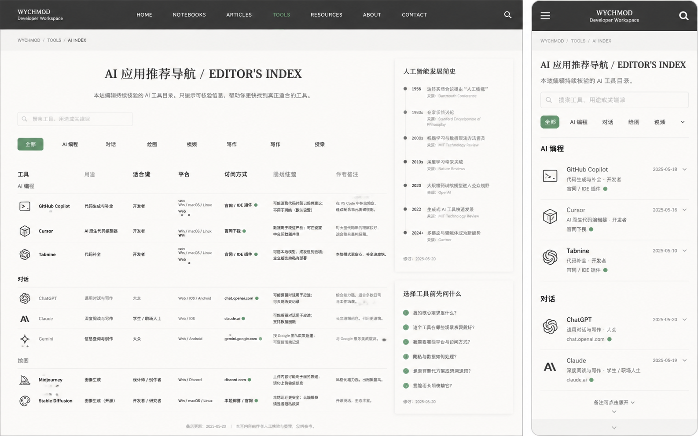

# Image 13：AI 应用推荐导航 / Editor's Index



> 状态：可实施，但事实更新需单独核验
> 对应提示词：P013
> 目标文件：`docs/tools/ai-recommend.html`
> 内容真相来源：当前 `docs/tools/ai-recommend.html` 中的应用卡片、分类、搜索/筛选脚本、AI 发展简史内容；如要更新产品事实，必须查官方来源
> 实现边界：本任务默认做视觉、结构、交互可用性重构；不得在未核验的情况下新增或改写 AI 产品排名、发布时间、模型能力、价格、可用地区、在线状态。

---

## 1. 给实现模型的任务入口

你要把 `docs/tools/ai-recommend.html` 改造成参考图所示的“AI 应用推荐导航 / Editor's Index”。它不是 AI 聊天工具，不调用大模型，也不是实时排行榜。它是一份由作者维护的 AI 工具目录：让读者按用途快速浏览 AI 编程、对话、绘图、视频、写作、音频、搜索等工具，并理解访问方式、适合人群、风险提示和作者备注。

当前页面已有能力：

- 分类 Tab：`data-category="all/coding/chat/image/video/writing/audio/search"`。
- 输入搜索：`#searchInput`。
- 应用卡片：`.ai-card`。
- 应用计数：`updateAppCount(category)`。
- 锚点平滑滚动。
- 返回顶部按钮。
- AI 发展简史时间线。

本次设计要把旧的紫色/科技蓝卡片网格，改成首页 V2 风格的纸白编辑目录：桌面端以表格式清单为主，右侧放“人工智能发展简史”和“选择工具前先问什么”；移动端按分类分组，条目可以展开备注。

实现前必须完整阅读：

- `AGENTS.md`
- `docs/_meta/HOMEPAGE_DESIGN_AND_IMPLEMENTATION.md`
- `docs/tools/ai-recommend.html`
- `docs/tools/index.html`
- `docs/assets/css/tools-notion.css`
- `docs/md/05-AI与Agent/40-大模型应用.md`
- `docs/md/05-AI与Agent/10-Agent设计模式与多Agent.md`

禁止：

- 把参考图里的 GitHub Copilot、Cursor、Tabnine、ChatGPT、Claude 等条目的日期、在线状态、作者备注直接覆盖当前数据。
- 未核验就新增“最新”“最强”“全球第一”“首推”等判断。
- 继续使用紫色渐变、蓝色发光、emoji 图标、厚重卡片网格。
- 用产品 Logo 的近似图标冒充官方授权 Logo。没有授权资产时用文字标识或统一线性图标。
- 做在线状态探测、价格抓取或用户跟踪来满足参考图右侧状态点。
- 把搜索和分类做成互相打架：搜索后计数必须反映真实可见项。
- 外链缺少 `target="_blank"`、`rel="noopener noreferrer"`。

---

## 2. 参考图视觉审计

### 2.1 桌面端画面结构

参考图桌面端约 `1440 × 900`：

1. 顶部暖石墨导航，高约 `64px`，左侧 `WYCHMOD Developer Workspace`，中间导航 `HOME / NOTEBOOKS / ARTICLES / TOOLS / RESOURCES / ABOUT / CONTACT`，当前 `TOOLS` 用信号绿标记，右侧搜索图标。
2. 顶栏下方是纸白主体，路径 `WYCHMOD / TOOLS / AI INDEX`。
3. 主体左右布局：
   - 左侧主清单约 `980px`。
   - 右侧信息栏约 `300px`。
4. H1 居中略偏左：`AI 应用推荐导航 / EDITOR'S INDEX`。
5. 副标题说明：本站编辑持续校验的 AI 工具目录，只展示可核验信息。
6. 搜索框宽约 `320px`，在分类 tab 上方。
7. 分类 tab 横向排列：全部、AI 编程、对话、绘图、视频、写作、写作或搜索等。
8. 主清单像编辑表格，不是卡片：
   - 列：工具、用途、适合谁、平台、访问方式、隐私提醒、作者备注。
   - 分组：AI 编程、对话、绘图等。
   - 每项有简洁图标、工具名、官网或访问入口。
9. 右侧栏：
   - 人工智能发展简史时间线。
   - 选择工具前先问什么。
   - 修订日期。

### 2.2 移动端画面结构

移动端约 `390 × 844`：

1. 顶部暖石墨导航，高约 `56px`，左侧汉堡，中间 `WYCHMOD Developer Workspace`，右侧搜索图标。
2. 路径行 `WYCHMOD / TOOLS / AI INDEX`。
3. H1 左对齐：`AI 应用推荐导航 / EDITOR'S INDEX`。
4. 搜索框全宽。
5. 分类 tabs 横向滚动，当前 `全部` 为绿色填充。
6. 工具条目按分类分组：
   - `AI 编程`
   - GitHub Copilot、Cursor、Tabnine
   - `对话`
   - ChatGPT、Claude
7. 每个条目显示图标、名称、用途、访问方式、日期或备注展开按钮。
8. 右侧时间线在移动端下移，不能挤在首屏。

### 2.3 图中不能照搬的内容

不能照搬：

- 图中的具体更新时间 `2025-05-18` 等。
- 图中的绿色在线状态点。
- 图中的发展史来源和节点，除非与当前页面事实一致或已核验。
- 图中的工具列表数量，当前页面工具可能更多。
- 图中的“备注可点展开”行为，除非真实实现。

可以借鉴：

- “编辑目录”而非“排行榜”的语气。
- 工具清单表格化。
- 右侧时间线和选择问题。
- 移动端分类 + 分组列表。

---

## 3. Design Specification

### 3.1 Purpose Statement

AI 推荐导航服务于想快速选择工具的人：开发者想找代码助手，写作者想找对话和润色工具，创作者想找图像/视频/音频工具，学习者想了解 AI 发展脉络。页面要帮读者少一点“工具焦虑”，多一点判断依据：用途、适合谁、平台、访问方式、隐私提醒和备注。

这页的人文感来自编辑责任：不煽动追新，不制造排行榜幻觉，只把可核验、可比较、可提醒的内容放在读者面前。

### 3.2 Aesthetic Direction

唯一方向：**Editorial / magazine，研究者数字书房里的 AI 工具编辑索引**。

视觉关键词：

- 编辑索引
- 工具目录
- 时间线旁注
- 选择前问题
- 可核验信息
- 克制、可信、少一点焦虑

禁止方向：

- AI 工具导航站信息流
- 排行榜/广告联盟页面
- 科技蓝宣传页
- 彩色 Logo 墙
- 卡片商城
- 模型竞技榜

### 3.3 Color Palette

继承首页：

| 语义 | 色值 | 用法 |
|---|---|---|
| 暖石墨 | `#0D100E` | 顶部导航 |
| 深墨 | `#131713` | 顶栏 hover、深色小提示 |
| 灰纸白 | `#E9E5DC` | 主体背景 |
| 浅纸白 | `#F2EEE5` | 表格行、搜索框、右栏 |
| 纸张线 | `#C9C3B7` | 表格线、时间线 |
| 墨色正文 | `#20211D` | 标题、工具名 |
| 次级文字 | `#66685F` | 用途、备注、来源 |
| 信号绿 | `#24D18F` | 当前 tab、访问入口、焦点 |
| 旧金 | `#C8A96B` | 分组编号、时间线节点 |
| 锈色 | `#A66B45` | 风险/隐私提示 |

禁止旧变量：

- `--accent-main: #6d4aff`
- `--accent-light: #0b6bcb`
- 紫色渐变滚动条
- 蓝色发光标题

### 3.4 Typography

- H1：`Source Han Serif SC`, `Noto Serif SC`, `Songti SC`, SimSun, serif。
- 正文、表格、tab：`Source Han Sans SC`, `Noto Sans SC`, `Microsoft YaHei`, sans-serif。
- 路径、年份、平台、访问方式：`IBM Plex Mono`, `JetBrains Mono`, Consolas, monospace。

字号：

| 元素 | 桌面 | 移动 |
|---|---:|---:|
| 顶栏品牌 | `15–17px` | `14–16px` |
| 路径 | `11–12px` | `11px` |
| H1 | `36–44px / 1.2` | `25–30px / 1.25` |
| 副标题 | `15–16px / 1.8` | `14–15px / 1.75` |
| 搜索输入 | `14–15px` | `15px` |
| Tab | `13–14px` | `13–14px` |
| 表格行 | `13–14px / 1.55` | 卡片 `14px / 1.6` |
| 右栏 | `13–14px / 1.7` | `14px / 1.7` |

### 3.5 Layout Strategy

桌面采用“主编辑表 + 右侧注释栏”的出版物布局。移动端采用“搜索 + 横向分类 + 分组列表 + 折叠备注”。

不要继续使用 `.ai-grid` 多列卡片作为主要布局。可以保留 class 但视觉表现应转为列表/表格。

---

## 4. 信息架构

建议结构：

```text
AI 应用推荐导航 / EDITOR'S INDEX
├─ 顶部工具导航
├─ 路径 WYCHMOD / TOOLS / AI INDEX
├─ 标题与编辑原则
├─ 搜索框 #searchInput
├─ 分类 tabs[data-category]
├─ AI 工具目录
│  ├─ AI 编程
│  ├─ AI 对话
│  ├─ AI 绘图
│  ├─ AI 视频
│  ├─ AI 写作
│  ├─ AI 音频
│  └─ AI 搜索
├─ 右栏/下方
│  ├─ 人工智能发展简史
│  ├─ 选择工具前先问什么
│  └─ 维护说明
└─ 返回顶部 #backToTop
```

### 4.1 工具条目字段

每个工具建议字段：

| 字段 | 说明 |
|---|---|
| 工具 | 名称与公司/组织 |
| 用途 | 一句话，避免营销 |
| 适合谁 | 开发者/大众/学生/设计师/写作者等 |
| 平台 | Web / iOS / Android / IDE / 本地部署等，以当前页面事实为准 |
| 访问方式 | 官网、下载、IDE 插件、开源仓库等 |
| 隐私提醒 | 是否可能上传输入、是否本地部署、是否需要账号 |
| 作者备注 | 选择建议、限制和使用场景 |

如果当前数据缺字段，不要编；可以显示为空或“待补充”。

### 4.2 分类

保留当前 `data-category`：

- `all`
- `coding`
- `chat`
- `image`
- `video`
- `writing`
- `audio`
- `search`

tab 文案：

- 全部
- AI 编程
- 对话
- 绘图
- 视频
- 写作
- 音频
- 搜索

移动端 tab 可横向滚动，边缘有渐隐提示。

### 4.3 发展简史

当前页面已有时间线，且涉及很多现代 AI 产品和模型。处理规则：

- 如果只做视觉重构，保持现有时间线内容，不新增事实。
- 如果要更新或纠错，必须使用官方来源或可靠一手来源。
- 每个新增节点应保留日期、事件、简短说明和来源。
- 不写“最新”“已经发布”等时间敏感断言，除非实施当天核验。
- 时间线在桌面可放右栏；如果内容很长，建议保留为下方完整章节，右栏只放最近 5 个关键节点。

### 4.4 选择前问题

这是可稳定保留的人文模块：

```text
1. 我的核心需求是什么？
2. 这个工具在哪些场景表现最好？
3. 我需要哪些平台与访问方式？
4. 隐私与数据如何处理？
5. 是否有替代方案或开源选项？
6. 我能否长期负担它？
```

这比“排行榜”更符合当前博客气质。

---

## 5. 桌面端像素级规格

以 `1440 × 900` 为主验收尺寸。

### 5.1 页面外壳

- 顶栏高度：`64–68px`。
- 主体最大宽：`1360–1400px`。
- 主体左右 padding：`48–56px`。
- 主体顶部 padding：`28–36px`。
- 两栏布局：`grid-template-columns: minmax(0, 1fr) 300px; gap: 48px;`
- 右栏 sticky 可选：`top: 88px`，但长时间线不要全部 sticky。

### 5.2 标题区

- 路径：`WYCHMOD / TOOLS / AI INDEX`，等宽 `11–12px`。
- H1：桌面 `36–44px`，左对齐或在主内容区域居中，但不要全页居中。
- 副标题宽度 `700–780px`。
- H1 下方留白 `24–32px`。

### 5.3 搜索与分类

- 搜索框宽 `320–360px`，高 `42–46px`。
- 搜索框左侧 search 图标，Lucide 或纯 CSS。
- 分类 tab 与搜索之间间距 `24–32px`。
- 当前 tab 背景信号绿或深绿，文字纸白。
- 非当前 tab 透明或浅纸白，hover 有纸张线。
- 搜索和 tab 同时生效：计数、可见项、空状态都要正确。

### 5.4 工具目录表

桌面表格：

- 外框不必完整包住整个表，可用行分隔。
- 分组标题行：`AI 编程` 等，字号 `18px`，上边距 `34–42px`。
- 表头：工具、用途、适合谁、平台、访问方式、隐私提醒、作者备注。
- 每行高度 `64–76px`。
- 工具名加粗，下面可显示公司。
- 图标 `28–36px`，使用统一线性图标或文字标识，不用 emoji。
- 外链状态点仅表示“访问方式为官网/下载”，不做实时在线探测。
- 访问方式链接有 `rel="noopener noreferrer"`。
- 作者备注最多 `2–3` 行，超出可折叠。

### 5.5 右侧栏

模块：

1. 人工智能发展简史
   - 标题 `人工智能发展简史`
   - 线性时间线，节点间距 `28–36px`
   - 年份等宽
   - 来源小字
2. 选择工具前先问什么
   - 列表，信号绿小编号
3. 维护说明
   - 最后修订日期（只有真实来源时显示）
   - “本站仅作学习与参考，不代表商业推荐”

如果时间线太长，右栏只展示摘要并链接到下方完整时间线。

---

## 6. 移动端规格

以 `390 × 844` 和 `360 × 800` 为验收尺寸。

### 6.1 顶部

- 顶栏高度 `56–60px`。
- 左侧汉堡，品牌中间或左侧，右侧搜索图标。
- 不显示完整桌面导航。
- 路径行 `11px`，可换行。
- H1 `25–30px`，左对齐。
- 副标题不超过 `3–4` 行。

### 6.2 搜索与 tabs

- 搜索框全宽，高 `44px`。
- tabs 横向滚动。
- 当前 tab 高度 `36–40px`。
- 滚动边缘用淡遮罩提示，不能隐藏最后一个 tab。

### 6.3 工具条目

移动端不要用横向表格。建议每条：

```text
图标  工具名                         日期/状态（若真实）
      用途 · 适合谁
      访问方式 / 平台
      备注可点展开
```

规格：

- 条目 padding `18–20px 0`。
- 分隔线 `1px solid rgba(201,195,183,.65)`。
- 工具名 `16px`。
- 用途 `13–14px`。
- 长域名换行。
- 备注默认折叠，summary 高度 `36–40px`。

### 6.4 右栏模块下移

移动端顺序：

1. 工具列表。
2. 备注/选择问题。
3. AI 发展简史。
4. 页脚。

不要让时间线占据首屏。

---

## 7. 功能契约

### 7.1 分类筛选

保留：

- `.category-tab`
- `data-category`
- `.ai-card`
- `updateAppCount(category)`

优化要求：

- 选中 tab 更新 `aria-selected`。
- tab 列表可以 `role="tablist"`。
- 计数只统计当前分类和搜索共同过滤后的可见项。
- 清空搜索后恢复当前 tab 状态，不一定强制回到全部；如果改变当前行为，要说明。

### 7.2 搜索

搜索范围：

- 工具名。
- 公司/组织。
- 描述。
- 标签。
- 分类。

要求：

- 大小写不敏感。
- 前后空格 trim。
- 无结果显示明确空状态。
- 搜索结果和分类计数同步。

### 7.3 锚点和返回顶部

保留：

- `#ai-apps`
- `#ai-history`
- `#backToTop`
- 平滑滚动。

要求：

- 尊重 `prefers-reduced-motion`。
- 返回顶部按钮不遮挡移动端内容。

### 7.4 外链

每个外链：

```html
target="_blank"
rel="noopener noreferrer"
```

如果链接到外部商业产品，应可见地表明这是外部链接。

---

## 8. 事实与维护门禁

AI 产品信息很容易过期。实现模型必须区分两种任务：

### 8.1 仅视觉重构

- 保持当前应用列表。
- 保持当前描述。
- 不新增工具。
- 不更改“首推”等判断，除非用户明确要求审查。
- 可以把夸张文案改得更克制，但不要改变事实含义。

### 8.2 内容更新

如果要更新：

- 查官方页面或一手发布来源。
- 记录更新日期。
- 不使用二手营销文章作为唯一依据。
- 对价格、可用地区、模型名称、发布时间尤其谨慎。
- 更新后把修改记录写清楚。

当前页面 meta 描述和时间线里有大量现代 AI 产品事实；如果后续模型不具备实时核验能力，应该只做视觉重构。

---

## 9. 实施步骤

### 9.1 数据审计

1. 提取当前所有 `.ai-card`。
2. 记录工具名、公司、链接、分类、描述、标签。
3. 记录当前 tab 分类。
4. 记录时间线节点。
5. 标记哪些字段没有来源。

### 9.2 结构重排

1. 保留现有数据和事件绑定所需 class/id。
2. 把 `.ai-grid` 视觉从卡片网格改成编辑目录。
3. 增加表头或移动端字段标签。
4. 右栏增加选择问题和维护说明。
5. 时间线视觉改成纸白边注或下方章节。

### 9.3 样式重构

1. 替换紫色/蓝色 token。
2. 移除大面积渐变、发光、pulse 动画。
3. 使用首页纸白、暖石墨、旧金、信号绿。
4. 移动端 tabs 横向滚动。
5. reduced-motion 处理。

### 9.4 JS 回归

1. tab click 后可见项正确。
2. 搜索 input 后可见项正确。
3. 搜索和 tab 同时使用时计数正确。
4. 锚点滚动和返回顶部正常。

---

## 10. 验证清单

### 10.1 静态检查

运行：

```bash
node scripts/check-links.js
git diff --check
```

### 10.2 功能检查

测试：

- 点击每个分类 tab。
- 搜索现有工具名，例如 `ChatGPT`、`Cursor`、`Codex`、`Gemini`。
- 搜索大小写混合。
- 搜索前后空格。
- 搜索不存在内容。
- 分类后再搜索。
- 搜索后清空。
- 点击 `AI 应用`、`发展简史` 锚点。
- 滚动后返回顶部。

### 10.3 外链检查

抽样检查：

- 外链可点击。
- 新窗口打开。
- 有 `rel="noopener noreferrer"`。
- 长域名在移动端不溢出。

### 10.4 视觉检查

尺寸：

- `1440 × 900`
- `1280 × 800`
- `1024 × 768`
- `768 × 1024`
- `390 × 844`
- `360 × 800`

验收：

- 桌面像编辑目录，不像卡片商城。
- 移动端 tab 和条目可读可操作。
- 右栏不挤压主列表。
- 没有旧紫色、蓝色发光和 emoji 主视觉。
- 时间线不编造新事实。
- 控制台无新增错误。

---

## 11. 可直接复制给实现模型的指令

请按以下要求实现 Image 13 对应的 AI 应用推荐导航。

目标文件是 `docs/tools/ai-recommend.html`。这是一个本地维护的 AI 工具目录，不是 AI 聊天工具，不调用模型，不做实时排行榜。视觉参考 `docs/_meta/ui-redesign/references/image-13.png`，但所有工具、链接、分类和时间线事实必须来自当前页面；如果你要新增或更新 AI 产品事实，必须先查官方来源。

开始前阅读：

1. `AGENTS.md`
2. `docs/_meta/HOMEPAGE_DESIGN_AND_IMPLEMENTATION.md`
3. `docs/tools/ai-recommend.html`
4. `docs/tools/index.html`
5. `docs/assets/css/tools-notion.css`
6. `docs/md/05-AI与Agent/40-大模型应用.md`
7. `docs/md/05-AI与Agent/10-Agent设计模式与多Agent.md`

设计规格：

- Purpose：帮助读者按用途选择 AI 工具，看到用途、适合人群、平台、访问方式、隐私提醒和作者备注。
- Aesthetic Direction：Editorial / magazine，研究者数字书房里的 AI 工具编辑索引。
- Color：暖石墨 `#0D100E`、灰纸白 `#E9E5DC`、浅纸白 `#F2EEE5`、纸张线 `#C9C3B7`、墨色正文 `#20211D`、次级文字 `#66685F`、信号绿 `#24D18F`、旧金 `#C8A96B`。
- Typography：H1 用中文衬线；正文、tab、表格用中文无衬线；年份、路径、平台用等宽字体。
- Layout：桌面主内容为编辑目录表，右侧为 AI 发展简史和选择问题；移动端为搜索框、横向分类 tabs、分组条目列表、下方时间线。

必须保留和修正：

1. 保留 `#searchInput`。
2. 保留 `.category-tab[data-category]`。
3. 保留 `#aiGrid` 或等价容器。
4. 保留 `.ai-card` 数据结构或提供兼容 JS。
5. 保留 `updateAppCount()` 功能，并让搜索 + 分类同时生效时计数准确。
6. 保留 `#ai-history`。
7. 保留 `#backToTop`。
8. 外链必须有 `target="_blank"` 和 `rel="noopener noreferrer"`。

视觉改造：

- 移除紫色/科技蓝变量、渐变滚动条、pulse 动画、发光卡片。
- 不用 emoji 作为图标；无官方授权 Logo 时用文字标识或统一线性图标。
- 桌面不再主打卡片网格，而是表格式编辑目录。
- 移动端条目可折叠显示备注。
- 右栏时间线如果过长，只展示摘要并链接到完整时间线。

事实门禁：

- 不新增“最新”“首推”“最强”等判断。
- 不更新模型发布时间、产品能力、价格、可用地区，除非查官方来源。
- 不复制参考图中的日期和在线状态。
- 如果只是视觉重构，保持当前页面数据。

完成后验证：

```bash
node scripts/check-links.js
git diff --check
```

浏览器验证 `1440×900`、`1280×800`、`1024×768`、`768×1024`、`390×844`、`360×800`。测试所有分类、搜索现有/无结果/大小写/空格、分类后搜索、清空搜索、锚点滚动、返回顶部和外链。确认没有旧紫色/科技蓝风格残留，没有虚构新事实。
