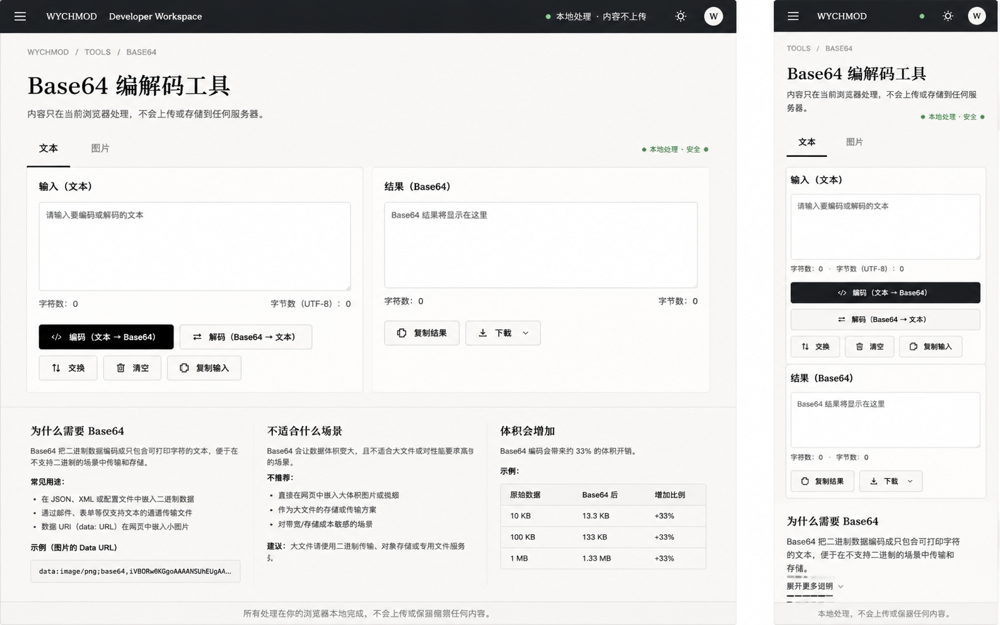

# Image 14：Base64 编解码工具



> 状态：可实施
> 对应提示词：P014
> 目标文件：`docs/tools/base64-tool.html`
> 内容真相来源：当前 `base64-tool.html` 的文本模式、图片模式、拖放上传、FileReader、复制/下载/清空、多语言示例和 Base64 说明
> 实现边界：保留全部现有能力；只做视觉、可访问性、状态反馈与安全细节修正，不把 Base64 描述成加密，不上传任何输入或文件。

---

## 1. 给实现模型的任务入口

你要把 `docs/tools/base64-tool.html` 改造成参考图所示的“Base64 编解码工具”。它是一个本地浏览器工具：文本可以编码/解码，图片可以转 Data URL / Base64，也可以从 Base64 解回预览并下载。

参考图主要展示文本模式：顶部工具导航、标题、本地处理说明、文本/图片 tabs、左右输入输出面板、操作按钮和教育说明。当前真实页面还包含图片模式、拖放、文件选择、5MB 限制、多语言示例复制等功能，不能因为参考图弱化而删除。

实现前必须完整阅读：

- `AGENTS.md`
- `docs/_meta/HOMEPAGE_DESIGN_AND_IMPLEMENTATION.md`
- `docs/tools/base64-tool.html`
- `docs/tools/index.html`
- `docs/assets/css/tools-notion.css`

禁止：

- 删除图片模式。
- 删除拖放/文件选择。
- 删除多语言示例。
- 把 Base64 说成“加密”“安全保护”“隐私保护”。
- 上传文本、图片或 Base64 到任何服务器。
- 继续使用紫色渐变、科技蓝边框、emoji 图标按钮。
- 把双栏在手机端硬挤成两列。
- 为了美观改变 `encodeText/decodeText/encodeImage/decodeImageFromBase64` 的真实行为。

---

## 2. 参考图视觉审计

### 2.1 桌面端画面结构

参考图桌面端约 `1440 × 900`：

1. 顶部暖石墨工具导航，高约 `60px`。左侧汉堡、`WYCHMOD Developer Workspace`，右侧本地处理状态、主题按钮、头像。
2. 主体纸白背景，左上路径 `WYCHMOD / TOOLS / BASE64`。
3. H1：`Base64 编解码工具`，大号衬线，左对齐。
4. H1 下方说明：内容只在当前浏览器处理，不上传或存储到服务器。
5. 模式 tab：`文本`、`图片`。当前 `文本` 下方墨色短线。
6. 右侧有小状态：`本地处理 · 安全`，绿色点。
7. 中部两栏：
   - 左：输入（文本）
   - 右：结果（Base64）
8. 左栏底部：字符数、UTF-8 字节数、编码、解码、交换、清空、复制输入。
9. 右栏底部：字符数、字节数、复制结果、下载。
10. 下方三栏教育说明：
    - 为什么需要 Base64
    - 不适合什么场景
    - 体积会增加
11. 底部说明：所有处理在浏览器本地完成。

### 2.2 移动端画面结构

移动端约 `390 × 844`：

1. 顶栏高约 `56px`。
2. 路径 `TOOLS / BASE64`。
3. H1 左对齐，`Base64 编解码工具`。
4. 本地处理说明在首屏内。
5. tabs 横向两项，`文本` 激活。
6. 输入面板在上，结果面板在下。
7. 编码/解码按钮纵向全宽，辅助按钮三列或换行。
8. 下方说明默认只展开第一节，其他可折叠。

### 2.3 图中不能照搬的内容

- `本地处理 · 安全` 中的“安全”不能暗示 Base64 是加密。推荐写成 `本地处理 · 不上传` 或 `本地处理 · 非加密`。
- 图中只展示文本模式，但生产不能删除图片模式。
- 图中下载按钮的格式下拉若未实现真实格式选择，不要做假下拉。

---

## 3. Design Specification

### 3.1 Purpose Statement

Base64 工具服务于非常具体的工作流：把文本转成可传输字符串，把 Base64 解回文本，把小图片转成 Data URL，或检查一段 Base64 是否有效。页面要让用户放心地把临时内容贴进去，同时明确提醒：Base64 只是编码，不是加密。

这页的人文感来自“把危险误解挡在门口”：它不只给按钮，还告诉你什么时候该用、什么时候不该用，以及为什么体积会变大。

### 3.2 Aesthetic Direction

唯一方向：**Editorial / magazine，研究者数字书房里的本地转换台**。

视觉关键词：

- 本地转换
- 输入到输出
- 透明边界
- 非加密提醒
- 双栏工作台
- 安静、精确、可恢复

禁止方向：

- 加密保险箱
- 黑客工具
- 彩色编码玩具
- SaaS 转换器广告页
- 科技蓝工具站

### 3.3 Color Palette

继承工具页系统：

| 语义 | 色值 | 用法 |
|---|---|---|
| 暖石墨 | `#0D100E` | 顶部导航、主按钮 |
| 深墨 | `#131713` | 深色按钮 hover |
| 灰纸白 | `#E9E5DC` | 页面背景 |
| 浅纸白 | `#F2EEE5` | 面板、textarea、说明块 |
| 纸张线 | `#C9C3B7` | 面板边框、分隔线 |
| 墨色正文 | `#20211D` | 标题、标签、正文 |
| 次级文字 | `#66685F` | placeholder、计数、说明 |
| 信号绿 | `#24D18F` | 本地处理状态、成功复制、焦点 |
| 旧金 | `#C8A96B` | tab 激活线、教育说明编号 |
| 朱砂 | `#B64B45` | 解码错误、非加密警示 |

禁止旧色：

- 紫色 `#6d4aff`
- 科技蓝 `#0b6bcb`
- 紫蓝渐变按钮
- 黑色 textarea 结果区（结果区仍应是纸白）

### 3.4 Typography

- H1：`Source Han Serif SC`, `Noto Serif SC`, `Songti SC`, SimSun, serif。
- 正文、按钮、标签：`Source Han Sans SC`, `Noto Sans SC`, `Microsoft YaHei`, sans-serif。
- textarea、计数、Data URL、代码示例：`IBM Plex Mono`, `JetBrains Mono`, Consolas, monospace。

字号：

| 元素 | 桌面 | 移动 |
|---|---:|---:|
| H1 | `40–48px / 1.2` | `28–32px / 1.25` |
| 描述 | `15–16px / 1.75` | `14–15px / 1.75` |
| Tab | `15–16px` | `15px` |
| 面板标题 | `16–18px` | `15–16px` |
| textarea | `13–14px / 1.6` | `13px / 1.55` |
| 计数 | `12–13px` | `12px` |
| 按钮 | `14–15px` | `14px` |
| 说明 | `14–15px / 1.75` | `14px / 1.75` |

### 3.5 Layout Strategy

桌面：`输入面板 ↔ 结果面板` 双栏，下面是说明三栏。

移动：`输入 → 操作 → 结果 → 说明` 单列，不压缩双栏。

---

## 4. 真实功能结构

当前页面应保留：

```text
currentMode = 'text' | 'image'
文本模式
├─ #textInput
├─ #textOutput
├─ #inputCharCount
├─ #outputCharCount
├─ encodeText()
├─ decodeText()
├─ copyOutput()
└─ clearText()

图片模式
├─ #fileUploadArea
├─ #fileInput accept="image/*"
├─ #fileInfo
├─ #imagePreview
├─ #base64Input
├─ currentImageData
├─ isDecodeMode
├─ handleFileSelect()
├─ handleFile()
├─ encodeImage()
├─ switchToDecodeMode()
├─ updateImageModeUI()
├─ decodeImageFromBase64()
├─ copyImageBase64()
├─ downloadImage()
└─ clearImage()

示例
├─ JavaScript
├─ Python
├─ Java
├─ Go
└─ PHP
```

视觉改造不得删除这些函数和 ID，除非同步更新所有事件绑定并完整回归。

---

## 5. 文本模式规格

### 5.1 面板

桌面双栏：

- `grid-template-columns: 1fr 1fr; gap: 18–20px;`
- 面板边框 `1px solid #C9C3B7`。
- 面板圆角 `4–6px`。
- 面板 padding `20–22px`。
- textarea 高 `170–220px`。
- 结果 textarea 只读但不要变成黑底，使用浅纸白加轻微只读底色。

移动单列：

- 输入面板、动作按钮、结果面板依次排列。
- textarea 高度 `120–150px`。
- 按钮全宽或两列，不能横向溢出。

### 5.2 计数

参考图显示：

- 字符数
- 字节数（UTF-8）

当前代码只统计字符数。若新增 UTF-8 字节数：

- 使用 `new TextEncoder().encode(text).length`。
- 中文、emoji、换行要准确。
- 输入和输出都显示。

如果不新增字节统计，就不要显示假 `UTF-8: 0`。

### 5.3 操作按钮

主操作：

- `编码（文本 → Base64）`
- `解码（Base64 → 文本）`

辅助：

- `交换`
- `清空`
- `复制输入`
- `复制结果`
- `下载`

当前真实代码有 `copyOutput()`、`clearText()`，未必有交换/复制输入/下载文本。实现模型必须核对：

- 如果实现交换，要清楚定义：交换 `textInput` 与 `textOutput`。
- 如果实现复制输入，要新增真实函数。
- 如果实现下载文本，要新增真实函数和文件名规则。
- 如果不实现，就不要放按钮。

### 5.4 错误状态

错误示例：

- 空输入编码。
- 空输入解码。
- 非法 Base64。
- 解码后不是合法 UTF-8。

错误显示：

- 不弹 alert。
- 在工具面板内显示文本状态。
- 颜色朱砂 + 文本。
- 不清空用户输入。
- 结果面板尺寸不跳动。

---

## 6. 图片模式规格

### 6.1 上传区

保留：

- 点击选择。
- 拖放。
- `accept="image/*"`。
- 5MB 限制。
- PNG/JPEG/GIF/WEBP 等浏览器可处理类型。

视觉：

- 虚线边框 `1px dashed #C9C3B7`。
- hover/focus 使用信号绿边框。
- 拖放 `drag-over` 使用浅绿色背景，不使用蓝紫。
- 上传区要有键盘等价按钮；不能只靠 drag/drop。

### 6.2 文件信息安全

当前代码用 `fileInfo.innerHTML` 拼接文件名、大小、类型。重构时应改为安全写入：

- 使用 `textContent`。
- 或创建 DOM 节点逐项填充。
- 不把本地文件名直接注入 HTML。

### 6.3 预览与 Base64 输入

两种模式：

- 上传图片 → 预览 → 转 Base64。
- 粘贴 Base64 → 解码图片 → 预览/下载。

要求：

- Data URL 可以显示。
- 非 Data URL 的纯 Base64 当前默认按 `image/png` 尝试；文案应说明这一点。
- 无效图片 Base64 给出错误状态。
- 下载文件名有明确规则，例如 `decoded-image.png`，除非当前代码已有规则。

### 6.4 性能边界

文案必须提醒：

- Base64 会让体积增加约 33%。
- 大图片不适合直接内嵌。
- 5MB 限制是当前工具约束。
- Base64 不是压缩，也不是加密。

---

## 7. 教育说明区

参考图下方三栏建议保留，但要和当前页面内容合并：

### 7.1 为什么需要 Base64

内容：

- 把二进制数据编码成可打印字符。
- 用于只支持文本的传输/存储场景。
- Data URI 可在 HTML/CSS 中内嵌小图片。

### 7.2 不适合什么场景

内容：

- 大文件。
- 需要保密的数据。
- 需要长期缓存和 CDN 优化的大图片。
- 高频大量转换。

### 7.3 体积会增加

表格：

| 原始数据 | Base64 后 | 增加比例 |
|---|---|---|
| 10 KB | 约 13.3 KB | +33% |
| 100 KB | 约 133 KB | +33% |
| 1 MB | 约 1.33 MB | +33% |

移动端说明区可用 `<details>` 默认只展开第一项。

### 7.4 多语言示例

当前页面有 JavaScript、Python、Java、Go、PHP 示例。保留：

- 代码块。
- 复制按钮。
- `copyCode()`。

视觉：

- 代码块纸白或暖石墨均可，但要可读。
- 不让代码块撑破移动端。
- 复制成功有文本反馈。

---

## 8. 本地处理与隐私文案

建议首屏文案：

```text
内容只在当前浏览器中处理，不会主动上传或存储到服务器。
Base64 是编码方式，不是加密方式；不要把它当作保密手段。
```

状态标签建议：

```text
本地处理 · 不上传 · 非加密
```

不要写：

- `安全加密`
- `绝对安全`
- `保护隐私`
- `无法被破解`

---

## 9. 实施步骤

### 9.1 结构保留

1. 保留 `textMode`、`imageMode` 两大区。
2. 保留所有现有 ID 和函数名。
3. 替换视觉 class 时检查 onclick 和事件监听。
4. 不拆走内联业务脚本，除非另开重构任务。

### 9.2 视觉重构

1. 替换旧紫色/蓝色变量。
2. 建立工具顶栏和路径。
3. 重做 tab。
4. 重做文本双栏。
5. 重做图片模式上传/预览。
6. 重做说明区。
7. 移动端改为单列。

### 9.3 安全与可访问性

1. 文件信息改为安全文本写入。
2. 上传区补键盘入口。
3. textarea 增加 label。
4. 状态消息使用 `aria-live="polite"`。
5. 按钮图标配文字。
6. 错误状态不只靠颜色。

---

## 10. 验证清单

### 10.1 文本测试

输入：

```text
Hello, Base64!
你好，Base64！
🙂 emoji
多行
文本
```

测试：

- 编码。
- 解码。
- 空输入。
- 非法 Base64。
- 无 padding Base64。
- 大文本，例如 `1MB`。
- 复制成功。
- 剪贴板拒绝时 fallback 或提示。
- 清空。

### 10.2 图片测试

测试：

- PNG。
- JPEG。
- GIF。
- WEBP。
- 非图片文件。
- 超过 5MB 文件。
- 拖放上传。
- 文件选择。
- 转 Base64。
- 复制 Base64。
- 粘贴 Data URL 解码。
- 粘贴纯 Base64 解码。
- 下载图片后重新打开。

### 10.3 示例测试

- JavaScript 示例复制。
- Python 示例复制。
- Java 示例复制。
- Go 示例复制。
- PHP 示例复制。

### 10.4 静态与视觉检查

运行：

```bash
node scripts/check-links.js
git diff --check
```

尺寸：

- `1440 × 900`
- `1280 × 800`
- `1024 × 768`
- `768 × 1024`
- `390 × 844`
- `360 × 800`

验收：

- 桌面左右面板清楚。
- 移动端输入、动作、结果纵向排列。
- 按钮不溢出。
- 说明区可读。
- 没有旧紫色/科技蓝风格。
- 没有网络上传请求。

---

## 11. 可直接复制给实现模型的指令

请按以下要求实现 Image 14 对应的 Base64 编解码工具。

目标文件是 `docs/tools/base64-tool.html`。视觉参考 `docs/_meta/ui-redesign/references/image-14.png`，但当前页面真实功能包括文本模式和图片模式，不能删除图片模式、拖放、文件选择、多语言示例或复制/下载能力。

开始前阅读：

1. `AGENTS.md`
2. `docs/_meta/HOMEPAGE_DESIGN_AND_IMPLEMENTATION.md`
3. `docs/tools/base64-tool.html`
4. `docs/tools/index.html`
5. `docs/assets/css/tools-notion.css`

设计规格：

- Purpose：提供本地 Base64 文本和图片编解码，并明确 Base64 不是加密。
- Aesthetic Direction：Editorial / magazine，研究者数字书房里的本地转换台。
- Color：暖石墨 `#0D100E`、灰纸白 `#E9E5DC`、浅纸白 `#F2EEE5`、纸张线 `#C9C3B7`、墨色正文 `#20211D`、次级文字 `#66685F`、信号绿 `#24D18F`、旧金 `#C8A96B`、朱砂 `#B64B45`。
- Typography：H1 用中文衬线；正文和按钮用中文无衬线；textarea、计数、Data URL、代码示例用等宽字体。
- Layout：桌面文本模式为输入/结果双栏；移动端为输入、动作、结果单列；说明区桌面三栏、移动折叠。

必须保留：

- `switchMode`
- `encodeText`
- `decodeText`
- `updateCharCount`
- `copyOutput`
- `clearText`
- `fileUploadArea`
- `fileInput`
- `handleFileSelect`
- `handleFile`
- `encodeImage`
- `switchToDecodeMode`
- `updateImageModeUI`
- `decodeImageFromBase64`
- `copyImageBase64`
- `downloadImage`
- `clearImage`
- `copyCode`

实现要求：

1. 顶部使用暖石墨工具导航。
2. 首屏显示路径 `WYCHMOD / TOOLS / BASE64`。
3. H1 为 `Base64 编解码工具`。
4. 首屏明确写：内容只在当前浏览器处理，不会主动上传；Base64 是编码，不是加密。
5. 模式 tab：文本 / 图片。
6. 文本模式输入输出面板稳定，错误状态不改变尺寸。
7. 图片模式保留拖放和文件选择，上传区有键盘等价入口。
8. 文件信息不要用本地文件名拼 `innerHTML`，改用 `textContent` 或安全 DOM。
9. 如果新增 UTF-8 字节数，用 `TextEncoder` 真实计算；否则不要显示假字节数。
10. 按钮图标必须配文字，不使用 emoji 图标。
11. 多语言示例保留并可复制。
12. 移动端不要双栏压缩。

禁止：

- 不把 Base64 叫加密。
- 不上传输入或图片。
- 不删除图片模式。
- 不显示未实现的下载格式下拉。
- 不保留旧紫色/科技蓝风格。

完成后验证：

```bash
node scripts/check-links.js
git diff --check
```

浏览器测试文本：ASCII、中文、emoji、换行、空输入、非法 Base64、无 padding、1MB 文本、复制和清空。测试图片：PNG/JPEG/GIF/WEBP、非图片、超 5MB、拖放、文件选择、Data URL 解码、纯 Base64 解码、下载后重开。测试 `1440×900`、`1280×800`、`1024×768`、`768×1024`、`390×844`、`360×800`，确认无按钮溢出、无横向滚动、无网络上传请求。
