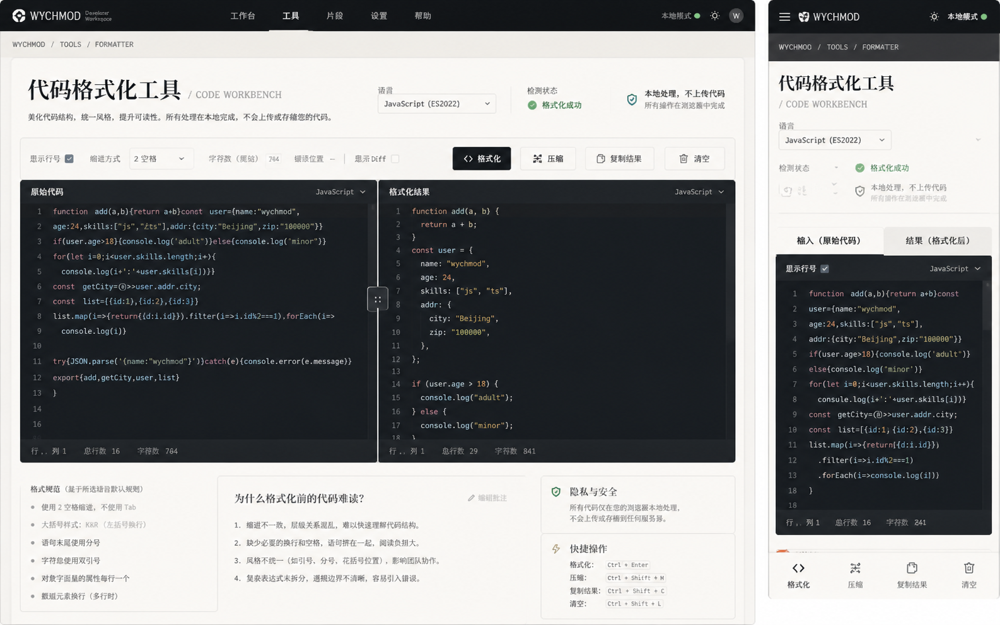

# Image 15：代码格式化工具 / Code Workbench



> 状态：可实施
> 对应提示词：P015
> 目标文件：`docs/tools/code-formatter.html`
> 内容真相来源：当前 `code-formatter.html` 的语言选择、默认示例、手写格式化器、压缩、语法高亮、快捷键、计数、toast 和复制逻辑
> 实现边界：这是本地轻量代码格式化工作台，不是完整 AST 编译器，不引入新格式化库，不执行用户代码，不上传代码。

---

## 1. 给实现模型的任务入口

你要把 `docs/tools/code-formatter.html` 改造成参考图所示的“代码格式化工具 / Code Workbench”。页面应该像一个安静的本地代码工作台：左侧输入原始代码，右侧显示格式化或压缩结果，顶部选择语言和操作，底部说明格式化规范、隐私安全和快捷键。

当前真实功能包括：

- 语言选择：JavaScript、Python、Java、C / C++、C#、HTML、CSS、JSON、SQL、Go、Rust、PHP。
- 默认示例：`defaultExamples`。
- `loadExample()` 切换语言并自动格式化。
- `handleTab()` 在 textarea 中插入两个空格。
- `handleShortcuts()` 支持 `Ctrl + Shift + F` 格式化、`Ctrl + Shift + C` 复制结果。
- `formatCode()`。
- `formatByLanguage()`。
- `formatJSON()`、`formatHTML()`、`formatCSS()`、`formatSQL()`、`formatCStyle()`、`formatPython()`。
- `highlightSyntax()`。
- `minifyCode()`。
- `copyOutput()`。
- `clearAll()`。
- `showToast()`。
- 输入/输出字符计数与耗时/语言信息。

参考图中出现的“显示 Diff”“拖拽分隔条”“行号同步”“ES2022 状态”等，不一定是当前真实能力。除非你真实实现并完整回归，否则不要把它们做成静态假 UI。

实现前必须完整阅读：

- `AGENTS.md`
- `docs/_meta/HOMEPAGE_DESIGN_AND_IMPLEMENTATION.md`
- `docs/tools/code-formatter.html`
- `docs/tools/index.html`
- `docs/assets/css/tools-notion.css`

禁止：

- 引入 Prettier、Monaco、CodeMirror 等新库作为视觉任务的隐性改造。
- 宣称支持 AST 级保真、语义分析、代码执行、Diff 对比，除非真实实现。
- 执行用户输入代码。
- 上传代码或调用远程服务。
- 删除当前语言选项。
- 删除快捷键。
- 删除 toast、复制 fallback 或 Tab 输入。
- 继续使用紫色/科技蓝渐变、emoji 按钮、发光卡片。
- 让移动端底部操作栏遮住代码最后一行。

---

## 2. 参考图视觉审计

### 2.1 桌面端画面结构

参考图桌面端约 `1440 × 900`：

1. 顶部暖石墨导航，高约 `58–64px`，当前 `工具` 选中，右侧显示 `本地模式`、主题按钮和头像。
2. 路径 `WYCHMOD / TOOLS / FORMATTER`。
3. 标题区：`代码格式化工具 / CODE WORKBENCH`，左对齐，中文衬线大字。
4. 标题下方说明：美化代码结构、统一风格、提升可读性；所有处理本地完成，不上传代码。
5. 标题区右侧有：
   - 语言选择 `JavaScript (ES2022)`。
   - 检测状态：格式化成功。
   - 本地处理、不上传代码。
6. 控制条：
   - 显示行号 checkbox。
   - 缩进方式 select。
   - 字符数。
   - 错误位置。
   - 显示 Diff checkbox。
   - 格式化、压缩、复制结果、清空。
7. 主体为深色双编辑器：
   - 左：原始代码。
   - 右：格式化结果。
   - 中间有分隔线/拖拽柄。
   - 每个编辑器顶部有标题和语言。
   - 底部状态栏显示行/列、总行数、字符数。
8. 下方说明区：
   - 格式规范。
   - 为什么格式化前的代码难读？
   - 隐私与安全。
   - 快捷操作。

### 2.2 移动端画面结构

移动端约 `390 × 844`：

1. 顶部暖石墨导航，高约 `56px`。
2. 路径 `WYCHMOD / TOOLS / FORMATTER`。
3. H1 左对齐，`代码格式化工具 / CODE WORKBENCH` 分两行。
4. 语言选择、检测状态、本地处理纵向堆叠。
5. 输入/结果不再双栏，而是 tab：`输入（原始代码）`、`结果（格式化后）`。
6. 编辑器深色，保持可读。
7. 底部固定操作栏：格式化、压缩、复制结果、清空。

### 2.3 图中不能照搬的内容

不能直接照搬：

- `JavaScript (ES2022)`，除非当前语言 label 真实这么写。
- `显示 Diff`，当前未实现真实 Diff。
- 错误位置 `--`，除非真实解析并定位。
- 拖拽分隔条，除非实现鼠标和键盘可访问调整。
- 行号层，如果当前只是 textarea + preview，没有同步行号，不要伪造不可同步的行号。

可以借鉴：

- 深色代码工作台。
- 顶部状态与本地处理说明。
- 桌面双栏、移动 tab。
- 底部快捷键说明。
- 格式化边界说明。

---

## 3. Design Specification

### 3.1 Purpose Statement

代码格式化工具服务于临时整理代码的人：复制一段难读的 JSON、SQL、HTML、JS 或 Python，希望快速缩进、换行、压缩、复制，不想把代码发到线上服务。页面要清楚表达“这是本地轻量格式化，不是语言编译器”，让用户知道它能做什么，也知道不要把它当成代码正确性保证。

这页的人文感来自降低维护痛感：当代码乱成一团时，工具不是责备你，而是帮你把结构摊开，让问题重新可读。

### 3.2 Aesthetic Direction

唯一方向：**Editorial / magazine，研究者数字书房里的代码工作台**。

视觉关键词：

- 深色代码台
- 纸白控制区
- 输入输出对照
- 本地处理
- 可读性修复
- 克制、工程化、可恢复

禁止方向：

- 在线 IDE 克隆
- VS Code 整站仿制
- 黑客终端
- SaaS 代码质量平台
- 彩色代码玩具
- AI 自动修复工具

### 3.3 Color Palette

继承首页和工具页：

| 语义 | 色值 | 用法 |
|---|---|---|
| 暖石墨 | `#0D100E` | 顶栏、主按钮、编辑器背景 |
| 深墨 | `#131713` | 编辑器内层、header |
| 灰纸白 | `#E9E5DC` | 页面背景 |
| 浅纸白 | `#F2EEE5` | 控制条、说明卡片 |
| 纸张线 | `#C9C3B7` | 控制区边框、分隔线 |
| 深色边线 | `rgba(242,239,231,0.12)` | 编辑器边框 |
| 代码主文字 | `#E9E5DC` | 代码正文 |
| 代码次级 | `#A9AEA7` | 行号、状态栏 |
| 墨色正文 | `#20211D` | 标题、说明 |
| 次级文字 | `#66685F` | 描述、辅助 |
| 信号绿 | `#24D18F` | 成功状态、焦点 |
| 旧金 | `#C8A96B` | 关键字、状态编号 |
| 朱砂 | `#E6663E` | 错误状态 |

可以保留有限语法高亮色，但要低饱和，并与暖石墨背景协调。不要让紫色成为主色。

### 3.4 Typography

- H1：`Source Han Serif SC`, `Noto Serif SC`, `Songti SC`, SimSun, serif。
- 控制和说明：`Source Han Sans SC`, `Noto Sans SC`, `Microsoft YaHei`, sans-serif。
- 编辑器和代码：`IBM Plex Mono`, `JetBrains Mono`, Consolas, monospace。

字号：

| 元素 | 桌面 | 移动 |
|---|---:|---:|
| H1 | `38–46px / 1.2` | `28–32px / 1.25` |
| 描述 | `15–16px / 1.75` | `14–15px / 1.75` |
| 控制标签 | `13–14px` | `13px` |
| 编辑器代码 | `13–14px / 1.6` | `12.5–13px / 1.55` |
| 状态栏 | `12px` | `11–12px` |
| 说明 | `14–15px / 1.75` | `14px / 1.75` |

### 3.5 Layout Strategy

桌面：标题控制区 + 双编辑器工作台 + 说明区。

移动：标题控制区 + 输入/结果 tab + 底部操作栏 + 说明折叠。

---

## 4. 真实功能契约

### 4.1 支持语言

当前 `#language` 选项：

| value | 文案 |
|---|---|
| `javascript` | JavaScript |
| `python` | Python |
| `java` | Java |
| `cpp` | C / C++ |
| `csharp` | C# |
| `html` | HTML |
| `css` | CSS |
| `json` | JSON |
| `sql` | SQL |
| `go` | Go |
| `rust` | Rust |
| `php` | PHP |

不要删除任何现有语言。若新增语言，必须增加示例、格式化器或明确使用默认 C-style 格式化，并回归测试。

### 4.2 当前格式化边界

当前格式化器是手写规则：

- JSON：`JSON.parse` + `JSON.stringify(obj, null, 2)`。
- HTML：按标签分行并基于标签粗略缩进。
- CSS：规则分行。
- SQL：关键词前换行并大写。
- C-style：基于 `{}`、`;`、`,` 等字符粗略格式化。
- Python：基于冒号和行的粗略缩进。

它不是：

- AST 格式化器。
- 语义检查器。
- Linter。
- 编译器。
- 安全扫描器。
- Diff 工具。

页面必须如实说明。

### 4.3 输出安全

当前 `highlightSyntax()` 有 HTML 转义逻辑，然后写入 `highlightedCode.innerHTML`。重构时必须保留转义，测试：

```html
<script>alert(1)</script>
```

不能让用户代码执行。

### 4.4 快捷键

当前快捷键：

- `Ctrl + Shift + F`：格式化。
- `Ctrl + Shift + C`：复制结果。
- `Tab`：在输入 textarea 插入两个空格。

不要使用 `Ctrl/Cmd + K`，它是全站终端快捷键。

---

## 5. 桌面端像素级规格

以 `1440 × 900` 为主验收尺寸。

### 5.1 页面外壳

- 顶栏高度：`58–64px`。
- 主体最大宽：`1360–1400px`。
- 主体 padding：`32–40px`。
- 页面背景：`#E9E5DC`。

### 5.2 标题与状态区

标题区可用 grid：

```text
左：路径 + H1 + 描述
右：语言选择 + 检测状态 + 本地处理
```

规格：

- H1 左对齐。
- 语言 select 宽 `220–260px`。
- 状态用文字 + 图标，不只靠颜色。
- 本地处理说明：`本地处理，不上传代码；所有操作在浏览器中完成`。

如果没有实时检测，状态应写“等待格式化”或“格式化成功/失败”，不要显示假“检测通过”。

### 5.3 控制条

真实可显示：

- 语言选择。
- 输入字符数。
- 格式化按钮。
- 压缩按钮。
- 复制结果按钮。
- 清空按钮。
- 快捷键提示。

谨慎显示：

- 显示行号：只有真实实现同步行号后才显示。
- 缩进方式：当前 `handleTab` 固定两个空格，格式化器多处硬编码 2/4 空格；除非真实实现全局缩进参数，否则不要放可选 select。
- 显示 Diff：未实现则不显示。
- 错误位置：未实现定位则不显示。

### 5.4 编辑器双栏

桌面：

- `grid-template-columns: 1fr 1fr; gap: 0 or 1px;`
- 外层深色容器。
- 左右编辑器高度 `500–560px`。
- header 高 `42–48px`。
- 输入 textarea 与结果 preview 等高。
- 代码 padding `18–20px`。
- 输出区 `overflow: auto`。
- 长行可横向滚动，不撑破页面。
- 状态栏高 `34–38px`。

左栏：

- 标题 `原始代码`。
- 语言显示当前 select。
- 输入 textarea。

右栏：

- 标题 `格式化结果`。
- `#highlightedCode`。
- 空态提示：`格式化结果会显示在这里`。

### 5.5 说明区

桌面下方三列：

1. 格式规范
   - 使用两个空格或当前真实规则。
   - 大括号、分号、逗号换行规则。
   - JSON 严格语法。
2. 为什么难读
   - 缩进缺失。
   - 语句粘连。
   - 结构层级不清。
   - 复杂表达式。
3. 隐私与快捷操作
   - 本地处理。
   - 不上传代码。
   - `Ctrl + Shift + F`。
   - `Ctrl + Shift + C`。

---

## 6. 移动端规格

以 `390 × 844` 和 `360 × 800` 为验收尺寸。

### 6.1 顶部与控制

- 顶栏高度 `56–60px`。
- 主体 padding `20–24px`。
- H1 `28–32px`。
- 语言 select 全宽或接近全宽。
- 状态信息纵向堆叠。

### 6.2 输入/结果 Tabs

移动端不要双栏。使用：

- `输入（原始代码）`
- `结果（格式化后）`

要求：

- 切换 tab 不丢内容。
- 格式化后自动切到结果 tab 可以，但必须可返回输入。
- tab 高度 `44–48px`。
- 当前 tab 有墨色下划线或旧金背景。

### 6.3 编辑器

- 高度 `360–460px`。
- 字号不低于 `12px`。
- 横向滚动只在代码区域内。
- 状态栏不遮代码。

### 6.4 底部操作栏

参考图有底部固定操作：

- 格式化
- 压缩
- 复制结果
- 清空

要求：

- 高度 `64–72px`。
- 不遮住最后一行代码；代码区底部增加 padding。
- 按钮点击区至少 `44px`。
- 如果键盘打开，底栏不应遮挡输入。

---

## 7. 状态与错误设计

### 7.1 状态

| 状态 | 文案 |
|---|---|
| 空输入 | 请输入要格式化的代码 |
| 等待 | 等待格式化 |
| 成功 | 格式化成功 |
| 压缩成功 | 压缩完成 |
| JSON 错误 | 无效的 JSON 格式 |
| 复制成功 | 已复制到剪贴板 |
| 复制失败 | 无法访问剪贴板，请手动复制 |

状态不只靠颜色。

### 7.2 Toast

保留 `showToast()`：

- 位置不遮挡编辑器关键内容。
- 移动端在底部操作栏上方或顶部。
- `aria-live="polite"`。

---

## 8. 实施步骤

### 8.1 保留函数

必须保留或兼容：

- `loadExample`
- `updateInputCount`
- `handleTab`
- `handleShortcuts`
- `formatCode`
- `formatByLanguage`
- `formatJSON`
- `formatHTML`
- `formatCSS`
- `formatSQL`
- `formatCStyle`
- `formatPython`
- `highlightSyntax`
- `minifyCode`
- `copyOutput`
- `clearAll`
- `getLanguageName`
- `showToast`

### 8.2 视觉重构

1. 替换紫色/蓝色 token。
2. 移除居中大 header 和发光按钮。
3. 建立暖石墨顶栏。
4. 建立纸白控制区。
5. 建立深色双编辑器。
6. 建立移动 tab。
7. 建立说明区。

### 8.3 可访问性

1. textarea 有 label。
2. 输出区有 `aria-live` 或状态提示。
3. select 有明确 label。
4. button 有文字，不只图标。
5. 快捷键说明不代替按钮。
6. reduced-motion。

---

## 9. 验证清单

### 9.1 语言回归

每种语言：

- 切换语言。
- 默认示例加载。
- 格式化。
- 压缩。
- 复制结果。
- 清空。

语言：

- JavaScript
- Python
- Java
- C / C++
- C#
- HTML
- CSS
- JSON
- SQL
- Go
- Rust
- PHP

### 9.2 特殊输入

测试：

```html
<script>alert(1)</script>
```

```json
{"a":1}
```

```json
{bad json}
```

以及：

- 超长单行。
- 中文注释。
- 多行字符串。
- SQL 注释。
- CSS 渐变。
- 空输入。

### 9.3 快捷键

- Tab 插入两个空格。
- `Ctrl + Shift + F` 格式化。
- `Ctrl + Shift + C` 复制结果。
- `Ctrl/Cmd + K` 不被本工具占用。

### 9.4 静态与视觉

运行：

```bash
node scripts/check-links.js
git diff --check
```

尺寸：

- `1440 × 900`
- `1280 × 800`
- `1024 × 768`
- `768 × 1024`
- `390 × 844`
- `360 × 800`

验收：

- 桌面双栏清楚。
- 移动 tab 可切换。
- 底部操作不遮挡代码。
- 错误状态可恢复。
- 代码不执行。
- 无网络上传。
- 无旧紫色/科技蓝风格。

---

## 10. 可直接复制给实现模型的指令

请按以下要求实现 Image 15 对应的代码格式化工具。

目标文件是 `docs/tools/code-formatter.html`。视觉参考 `docs/_meta/ui-redesign/references/image-15.png`，但必须以当前页面真实功能为准。不要引入新格式化库，不要执行用户代码，不要上传代码，不要伪造 Diff、行号同步、AST 分析或错误定位。

开始前阅读：

1. `AGENTS.md`
2. `docs/_meta/HOMEPAGE_DESIGN_AND_IMPLEMENTATION.md`
3. `docs/tools/code-formatter.html`
4. `docs/tools/index.html`
5. `docs/assets/css/tools-notion.css`

设计规格：

- Purpose：提供本地轻量代码格式化、压缩、复制，让临时代码重新可读。
- Aesthetic Direction：Editorial / magazine，研究者数字书房里的代码工作台。
- Color：页面纸白，顶栏暖石墨，编辑器深墨；使用旧金和信号绿表达状态，错误用朱砂。移除紫色/科技蓝渐变。
- Typography：H1 用中文衬线；控制和说明用中文无衬线；代码区用等宽字体。
- Layout：桌面是深色双编辑器，左原始代码、右格式化结果；移动端是输入/结果 tab + 底部操作栏。

必须保留：

- 12 个语言选项：JavaScript、Python、Java、C/C++、C#、HTML、CSS、JSON、SQL、Go、Rust、PHP。
- `loadExample`
- `handleTab`
- `handleShortcuts`
- `formatCode`
- `formatByLanguage`
- `formatJSON`
- `formatHTML`
- `formatCSS`
- `formatSQL`
- `formatCStyle`
- `formatPython`
- `highlightSyntax`
- `minifyCode`
- `copyOutput`
- `clearAll`
- `showToast`

实现要求：

1. 顶部使用暖石墨工具导航。
2. 标题为 `代码格式化工具 / CODE WORKBENCH`。
3. 首屏明确写：本地处理，不上传代码；这是轻量格式化器，不是 AST 编译器。
4. 控制区只显示真实功能。不要显示未实现的 Diff、错误位置、行号同步或缩进 select。
5. 编辑器区域桌面双栏，移动端 tab。
6. 输出高亮必须继续转义 HTML，测试 `<script>alert(1)</script>` 不执行。
7. 快捷键说明保留：`Ctrl + Shift + F`、`Ctrl + Shift + C`、Tab 插入两个空格。
8. Toast 和错误状态有文字，不只靠颜色。
9. 按钮有文字，不用 emoji 图标。
10. 移动底部操作栏不遮挡代码。

完成后验证：

```bash
node scripts/check-links.js
git diff --check
```

浏览器中逐个语言切换、加载示例、格式化、压缩、复制、清空。测试合法/非法 JSON、HTML script 字符串、超长单行、中文注释、空输入、Tab、`Ctrl + Shift + F`、`Ctrl + Shift + C`。检查 `1440×900`、`1280×800`、`1024×768`、`768×1024`、`390×844`、`360×800`，确认无横向页面溢出、无代码执行、无网络上传、无旧紫色/科技蓝风格残留。
