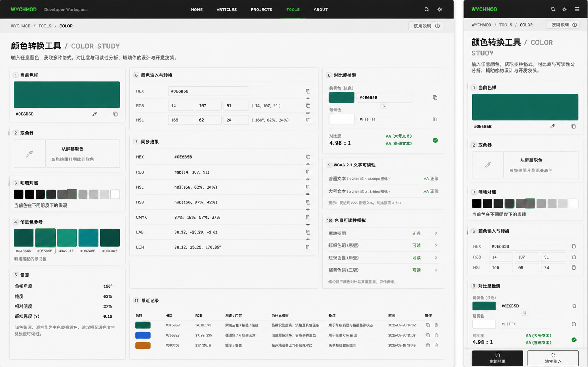

# Image 16：颜色转换工具 / Color Study



> 状态：可实施
> 对应提示词：P016
> 目标文件：`docs/tools/color-tool.html`
> 内容真相来源：当前 `color-tool.html` 的 HEX 输入、原生 `input[type=color]`、RGB/HSL 滑杆、颜色预览、文本预览、格式复制、配色方案和颜色转换函数
> 实现边界：这是本地颜色转换与可读性辅助工具，不是在线设计系统，不上传图片或色值，不伪造 WCAG、色觉模拟、LAB/LCH 或历史记录。

---

## 1. 给实现模型的任务入口

你要把 `docs/tools/color-tool.html` 改造成参考图所示的“颜色转换工具 / Color Study”。页面应该像研究者书桌上的一张颜色实验单：左侧观察当前色样与明暗、邻近关系，中间做格式转换，右侧做对比度和可读性判断。整体必须继承首页“Editorial / magazine：研究者的数字书房”的气质，不能继续使用当前文件里的紫色边框、科技蓝标题、emoji 图标和泛 SaaS 卡片。

当前真实功能包括：

- `hexInput`：HEX 输入，支持自动补 `#`，当前只接受 6 位 HEX。
- `colorPicker`：浏览器原生颜色选择器。
- `rSlider`、`gSlider`、`bSlider`：RGB 滑杆，范围 `0–255`。
- `hSlider`、`sSlider`、`lSlider`：HSL 滑杆，范围分别为 `0–360`、`0–100`、`0–100`。
- `colorPreview`：当前颜色大色样。
- `textPreviewBg`、`textPreviewWhite`、`textPreviewBlack`：白字/黑字可读性预览。
- `formatsGrid`：当前输出 HEX、RGB、RGBA、HSL、HSLA、RGB Decimal。
- `paletteGrid`：原色、互补色、类似色、三角色、浅色、深色。
- `applyColor(hex)`：点击配色方案应用颜色。
- `copyFormat(text)`：复制格式结果。
- `showMessage(message, type)`：右上角 toast。
- 转换函数：`hexToRgb()`、`rgbToHex()`、`rgbToHsl()`、`hslToRgb()`。

参考图里出现但当前未完整实现的能力：

- 屏幕取色：需要 `EyeDropper` API 特性检测；不支持时提供原生颜色选择器和手动输入兜底。
- 拖拽图片取色：只有在真实实现本地 `FileReader + canvas` 采样时才能展示；不得上传图片。
- HSB/HSV、CMYK、LAB、LCH：需要真实转换函数；不能只写固定示例。
- WCAG 2.1 对比度：必须按 sRGB 相对亮度和 `(L1 + 0.05) / (L2 + 0.05)` 计算。
- 色觉可读性模拟：如果不实现红绿色盲/蓝黄色盲/全色盲矩阵算法，就不要显示“可读”结论。
- 最近记录：必须来自用户真实操作或 `localStorage`；没有记录时显示空状态，不要写静态假历史。

实现前必须完整阅读：

- `AGENTS.md`
- `docs/_meta/HOMEPAGE_DESIGN_AND_IMPLEMENTATION.md`
- `docs/tools/color-tool.html`
- `docs/tools/index.html`
- `docs/assets/css/tools-notion.css`

禁止：

- 继续使用 `#6d4aff`、`#0b6bcb` 作为主视觉色。
- 继续使用 emoji 作为标题、标签或按钮图标。
- 让用户当前选择的颜色污染全站导航、背景和主按钮；用户色只能用于色样、色板、输入预览和局部结果。
- 做静态“AA 通过”“可读”“最近记录”。
- 上传图片、调用远程取色服务或把用户色值发送到网络。
- 删除现有 HEX/RGB/HSL 互转、滑杆、复制、配色方案。
- 改变当前转换函数的舍入方式却不补回归测试。
- 在移动端让底部固定按钮遮住最后一个输入或表格行。

---

## 2. 参考图视觉审计

### 2.1 桌面端画面结构

参考图桌面端约 `1440 × 900`，页面由一个深色顶部导航和一张纸白色“颜色研究单”组成。

1. 顶部导航：
   - 高度约 `58–64px`。
   - 背景为暖石墨黑，不是纯黑。
   - 左侧是 `WYCHMOD` 绿色字标与 `Developer Workspace`。
   - 中间导航 `HOME / ARTICLES / PROJECTS / TOOLS / ABOUT`，`TOOLS` 为当前选中，文字为品牌绿。
   - 右侧是搜索、主题切换、菜单图标，使用线性 SVG 或统一图标库，不使用 emoji。
2. 面包屑：
   - 位于导航下方纸白区域，距左约 `36px`。
   - 内容：`WYCHMOD / TOOLS / COLOR`。
   - 字号约 `12px`，全大写，字间距略宽。
   - 右侧有 `使用说明` 按钮，高约 `28px`，轻边框。
3. 标题区：
   - H1：`颜色转换工具 / COLOR STUDY`。
   - 中文标题为主体，英文副标题浅灰、同一行跟随。
   - 桌面 H1 左对齐，约 `28–32px`，重量重但不过度商业化。
   - 描述文案：`输入任意颜色，获取多种格式、对比度与可读性分析，辅助你的设计与开发决策。`
4. 主体为三列实验台：
   - 左列宽约 `30%`，承载观察类模块。
   - 中列宽约 `43%`，承载输入与格式转换。
   - 右列宽约 `27%`，承载可读性判断。
   - 列间距约 `16px`，模块之间垂直间距约 `16px`。
5. 底部横跨中右区域出现“最近记录”表格；如果没有真实历史，应该是空状态。

### 2.2 左列模块

左列是“看见颜色”的区域，顺序必须稳定：

#### 2.2.1 当前色样

- 标题前有圆形编号 `1`，文字 `当前色样`。
- 卡片高度约 `155px`。
- 大色块高度约 `86px`，圆角 `3–4px`，颜色为当前色 `#0E6B5B`。
- 色块可以有非常细的内阴影，表达颜料铺在纸上，而不是玻璃发光。
- 色值 `#0E6B5B` 放在左下，等宽字体，字号约 `13px`。
- 右下有两个小图标按钮：
  - 编辑/取色。
  - 复制。
- 点击复制后只改变按钮微状态或 toast，不要弹 alert。

#### 2.2.2 取色器

- 标题编号 `2`，文字 `取色器`。
- 内容是一个虚线边框投放区，高约 `86px`。
- 左侧窄格放取色器线性图标。
- 右侧主文案：`从屏幕取色`。
- 辅助文案：`或拖拽图片到此处取色`。
- 如果浏览器不支持 `EyeDropper`：
  - 按钮文案改为 `使用系统取色器` 或 `选择颜色`。
  - 不显示不可用的屏幕取色承诺。
- 如果未实现图片采样：
  - 不显示拖拽文案。

#### 2.2.3 明暗对照

- 标题编号 `3`，文字 `明暗对照`。
- 一排 `10` 个方形色块，从近黑到近白。
- 色块尺寸约 `30 × 30px`，间距 `6px`。
- 当前色所在亮度档用品牌绿描边或细内框标记。
- 下方说明：`当前色在不同明度下的表现`。
- 明暗色阶必须由当前 HSL/LCH 或 RGB 混合真实生成；不要写固定色。

#### 2.2.4 邻近色参考

- 标题编号 `4`，文字 `邻近色参考`。
- `5` 个横向色块，卡片高度约 `76px`。
- 每个色块下方显示对应 HEX。
- 视觉以和谐近邻为主，不要把互补色红绿强对比作为第一选择。
- 图中示例：`#0A5648 / #0E6B5B / #14937E / #0B7A6B / #0B4D42`。
- 真实实现时应由当前颜色计算，默认色为 `#0E6B5B` 时可以接近图中效果。

#### 2.2.5 信息

- 标题编号 `5`，文字 `信息`。
- 四行键值：
  - `色相角度`：如 `166°`
  - `纯度`：如 `62%`
  - `相对明度`：如 `27%`
  - `感知亮度 (Y)`：如 `0.16`
- 下方说明一段：`该色偏深，适合作为主色或强调色，建议搭配浅色文字以保证可读性。`
- 这些数值必须来自当前颜色实时计算；`Y` 建议用 WCAG 相对亮度，不要用肉眼估计。

### 2.3 中列模块

中列是“输入与转换”的核心。

#### 2.3.1 颜色输入与转换

- 标题编号 `6`，文字 `颜色输入与转换`。
- 卡片内三行输入：
  - HEX：单个输入框，默认 `#0E6B5B`。
  - RGB：三个数字输入框，默认 `14 / 107 / 91`，右侧显示 `( 14, 107, 91 )`。
  - HSL：三个数字输入框，默认 `166 / 62 / 24`，右侧显示 `( 166°, 62%, 24% )`。
- 每行右侧有复制图标按钮。
- 行高约 `48–54px`，上下分隔线为浅纸灰。
- 输入框为纸白内嵌，不是深色代码框。
- 数值输入必须保留范围限制：
  - RGB：`0–255`
  - H：`0–360`
  - S/L：`0–100`
- 当前源码是滑杆；若改成图中数字输入，必须保留键盘可调能力，可以把滑杆移入展开区或改成 number 输入加可访问 label。

#### 2.3.2 同步结果

- 标题编号 `7`，文字 `同步结果`。
- 表格/列表行：
  - `HEX`
  - `RGB`
  - `HSL`
  - `HSB` 或 `HSV`
  - `CMYK`
  - `LAB`
  - `LCH`
- 每行左侧是格式名，中间是值，右侧复制按钮。
- 行高约 `46px`，分隔线细。
- 如果暂时不实现 LAB/LCH 转换：
  - 不要显示 LAB/LCH 行。
  - 或显示为后续计划区，不可复制，不可作为计算结果。
- 建议真实实现：
  - RGB → HSV/HSB。
  - RGB → CMYK。
  - RGB → XYZ → LAB。
  - LAB → LCH。
  - D65 白点，注明精度与四舍五入策略。

### 2.4 右列模块

右列是“颜色是否可用”的区域。这里特别容易做成假 UI，必须严谨。

#### 2.4.1 对比度检测

- 标题编号 `8`，文字 `对比度检测`。
- 两组颜色输入：
  - 前景色（该色）：小色块 + HEX 输入 + 复制按钮。
  - 背景色：小色块 + HEX 输入 + 复制按钮，默认 `#FFFFFF`。
- 中间可放一个交换按钮，图中是小方形上下切换图标。
- 对比度大字显示如 `4.98 : 1`。
- 右侧/下方显示：
  - `AA (大号文本)`
  - `AA (普通文本)`
  - 通过状态用品牌绿和小圆点，不用刺眼成功绿。
- 必须按 WCAG 计算：
  - sRGB 通道先归一到 `0–1`。
  - 小于等于 `0.03928` 用 `c / 12.92`。
  - 否则用 `((c + 0.055) / 1.055) ** 2.4`。
  - 相对亮度 `0.2126R + 0.7152G + 0.0722B`。
  - 对比度 `(lighter + 0.05) / (darker + 0.05)`。
- AA/AAA 阈值：
  - 普通文本 AA：`4.5:1`
  - 大号文本 AA：`3:1`
  - 普通文本 AAA：`7:1`
  - 大号文本 AAA：`4.5:1`

#### 2.4.2 WCAG 2.1 文字可读性

- 标题编号 `9`，文字 `WCAG 2.1 文字可读性`。
- 两行：
  - `普通文本 (< 24px 或 < 18.66px 粗体)`。
  - `大号文本 (≥ 24px 或 ≥ 18.66px 粗体)`。
- 右侧显示级别和状态，例如 `AA 正常`。
- 下方提示：`提示：要达到 AAA 普通文本，对比度需 ≥ 7:1`。
- 状态必须随前景/背景变化实时更新。

#### 2.4.3 色盲可读性模拟

- 标题编号 `10`，文字 `色盲可读性模拟`。
- 行项目：
  - `原始视图`
  - `红绿色弱（原型）`
  - `红绿色盲（原型）`
  - `蓝黄色弱（三型）`
- 右侧是状态与进入箭头。
- 如果实现真实模拟：
  - 每行点击后显示小型预览色样/文字样张。
  - 使用明确的颜色矩阵或色觉模拟算法，并在代码注释注明来源。
- 如果不实现：
  - 把此模块改成“后续能力说明”，不要展示 `正常/可读` 结论。

### 2.5 最近记录

参考图桌面底部有编号 `11` 的“最近记录”表格。

列结构：

| 列 | 说明 |
|---|---|
| 色样 | 小色块 |
| HEX | 色值 |
| RGB | `14, 107, 91` |
| 用途 / 内容 | 用户可编辑备注 |
| 为什么保留 | 用户可编辑原因 |
| 备注 | 可选 |
| 时间 | 本地时间 |
| 操作 | 复制 / 删除 |

实现要求：

- 初始无记录时显示空状态：`还没有保存过颜色。复制或保存一个颜色后，它会出现在这里。`
- 不允许用图中的 `2025-05-20 14:32` 等静态假数据。
- 保存到 `localStorage`，key 建议：`wychmod.colorTool.history.v1`。
- 最多保留 `20` 条，新增在前。
- 删除单条记录必须只删除当前 key，不清空其他工具数据。
- 时间用本地格式化，避免依赖远程服务。

### 2.6 移动端画面结构

移动端约 `390 × 844`：

1. 顶部导航高约 `56px`。
2. 面包屑与使用说明按钮同一行。
3. H1 左对齐，`颜色转换工具 / COLOR STUDY` 分两行。
4. 描述文案两行以内，字号约 `14px`。
5. 模块单列排列，顺序建议：
   - 当前色样。
   - 取色器。
   - 明暗对照。
   - 颜色输入与转换。
   - 对比度检测。
   - 同步结果。
   - 邻近色参考。
   - 信息。
   - WCAG。
   - 色觉模拟或后续说明。
   - 最近记录。
6. 底部固定操作栏：
   - 左按钮：`复制结果`。
   - 右按钮：`清空输入`。
   - 高度约 `64px`，背景为纸白半透明加上边框。
   - 页面底部必须加 `padding-bottom: 88px`，避免遮挡。

---

## 3. Design Specification

### 3.1 Purpose Statement

颜色转换工具服务于写代码、做页面、整理设计稿的人：他们拿到一个颜色，希望快速知道它在不同格式中的表达、在明暗背景上是否可读、与相邻色如何搭配。它不是炫技色盘，而是一张让颜色变得可判断、可复制、可复用的实验记录。

这页的人文感来自“帮用户做决定”：颜色不是孤立的十六进制字符串，而是会影响阅读、情绪和可访问性的材料。页面要像一个耐心的设计同伴，告诉用户这个颜色能在哪里用、哪里要小心。

### 3.2 Aesthetic Direction

唯一方向：**Editorial / magazine，研究者数字书房里的颜色实验单**。

视觉关键词：

- 纸白底稿
- 墨色导航
- 色样标本
- 可读性批注
- 工程化计算
- 轻微档案感
- 克制而温暖

禁止方向：

- Dribbble 彩虹色盘
- 霓虹取色器
- Photoshop 克隆
- Figma 插件仿制
- SaaS 数据面板
- 纯工具箱表单

### 3.3 Color Palette

继承首页和工具页全局视觉，用户色作为样本出现，不承担品牌系统职责。

| 语义 | 色值 | 用法 |
|---|---|---|
| 暖石墨 | `#0D100E` | 顶部导航、主按钮、重要文字 |
| 深墨 | `#151915` | 次级深色区域、底部固定栏文字 |
| 品牌绿 | `#00C776` | 当前工具选中、通过状态、焦点描边 |
| 纸白 | `#F4EFE5` | 页面背景 |
| 卡片纸 | `#FBF7EF` | 模块卡片 |
| 纸灰线 | `#DDD4C5` | 分隔线、表格线 |
| 辅助灰 | `#77746C` | 英文副标题、说明文字 |
| 警示橙 | `#B97219` | 对比度不足、需要注意 |
| 失败红 | `#B6473B` | 输入错误、不可读状态 |
| 当前样本色 | `#0E6B5B` | 默认色样、预览、局部色板 |

规则：

- 页面外壳不随用户选色改变。
- 卡片描边使用纸灰线；只有当前选中的色块、焦点和通过状态使用品牌绿。
- 不使用紫色、蓝紫渐变和大面积蓝色。

### 3.4 Typography

继承首页字体系统：

- 中文标题：使用首页既有衬线/宋体系 fallback，形成“书房标题”气质。
- 英文标签与数据：使用项目现有等宽字体 token 或 `ui-monospace` fallback；如果首页规范已定义 `JetBrains Mono` / `SFMono-Regular` 等，按规范执行。
- 正文：沿用首页/工具页正文 token，不单独引入外部字体。

尺寸建议：

| 区域 | 桌面端 | 移动端 |
|---|---:|---:|
| H1 中文 | `30–34px` | `26–30px` |
| H1 英文 | `24–28px` | `24–26px` |
| 描述 | `14–15px` | `14px` |
| 模块标题 | `14px` | `14px` |
| 表格文字 | `13px` | `12–13px` |
| 色值等宽 | `13–15px` | `13px` |
| 对比度大数字 | `24–28px` | `24px` |

### 3.5 Layout Strategy

桌面端采用“左观察 / 中计算 / 右判断”的不完全对称布局：

```text
top nav
└─ breadcrumb + usage button
   └─ title / description
      └─ color study grid
         ├─ left column 30%
         │  ├─ current swatch
         │  ├─ picker
         │  ├─ lightness scale
         │  ├─ harmony palette
         │  └─ info
         ├─ center column 43%
         │  ├─ input conversion
         │  └─ synchronized formats
         └─ right column 27%
            ├─ contrast checker
            ├─ WCAG text readability
            └─ color vision simulation / note
```

移动端改为单列，保留研究单编号；底部固定主要操作按钮。

### 3.6 质感与细节

- 背景不是纯白，使用很淡的纸纹、网格或噪点；不能影响可读性。
- 卡片阴影极轻，像纸张叠放，不像玻璃拟态。
- 卡片圆角 `2–4px`，比首页卡片更克制。
- 编号圆点直径约 `18px`，背景纸灰，数字深墨。
- 输入框高度 `34–38px`，边框 `1px`，聚焦时品牌绿描边。
- 色块描边要足够细，避免把颜色样本变脏。
- 复制图标按钮尺寸 `28–32px`，hover 只改变背景，不剧烈位移。

---

## 4. 页面内容蓝图

### 4.1 顶部与路径

页面顶部必须使用与工具索引一致的导航框架，不要做一个孤立工具页。

文案：

```text
WYCHMOD  Developer Workspace
HOME  ARTICLES  PROJECTS  TOOLS  ABOUT

WYCHMOD / TOOLS / COLOR
使用说明

颜色转换工具 / COLOR STUDY
输入任意颜色，获取多种格式、对比度与可读性分析，辅助你的设计与开发决策。
```

交互：

- `使用说明` 可以打开一个轻量说明面板或跳到页面下方说明区。
- 若不实现说明弹层，按钮文字改为锚点链接，不要做无响应按钮。

### 4.2 当前色样模块

结构建议：

```html
<section class="tool-panel color-swatch-panel" aria-labelledby="current-color-title">
  <h2 id="current-color-title"><span>1</span> 当前色样</h2>
  <div class="current-swatch" id="colorPreview"></div>
  <div class="swatch-footer">
    <code id="currentHexLabel">#0E6B5B</code>
    <button type="button" aria-label="编辑当前颜色"></button>
    <button type="button" aria-label="复制当前 HEX"></button>
  </div>
</section>
```

实现注意：

- 可以复用现有 `colorPreview`，但不要把预览区变成两个分散卡片。
- `currentHexLabel` 必须跟 `hexInput` 同步。
- 复制使用 `navigator.clipboard.writeText`，失败时再 fallback 到 textarea。

### 4.3 输入与转换模块

建议从当前滑杆 UI 升级为更适合图中效果的“字段 + 可选滑杆”：

```text
HEX  [ #0E6B5B                         ] [copy]
RGB  [ 14 ] [ 107 ] [ 91 ]  ( 14, 107, 91 ) [copy]
HSL  [166 ] [  62 ] [ 24 ]  ( 166°, 62%, 24% ) [copy]
```

如果保留滑杆：

- 滑杆放在每行下方的展开区域。
- 数值输入仍为主视图。
- 每个滑杆必须有真实 `<label for="">`。

输入校验：

- HEX 支持 `#RRGGBB` 和 `RRGGBB`。
- 可选支持 `#RGB`，但必须在说明里写清楚并补转换。
- 非法输入时：
  - 不立即清空用户输入。
  - 输入框显示错误边框。
  - 在行下方显示 `请输入 6 位 HEX，例如 #0E6B5B`。
  - 不更新其他格式。
- RGB/HSL 数字输入超界时 clamp 或提示，策略必须一致。

### 4.4 同步结果模块

默认应显示：

```text
HEX   #0E6B5B
RGB   rgb(14, 107, 91)
HSL   hsl(166, 62%, 24%)
HSB   hsb(166, 87%, 42%)
CMYK  87%, 0%, 15%, 58%
LAB   39.40, -31.20, 2.80
LCH   39.40, 31.33, 174.87°
```

说明：

- 上面数值只是格式示意，最终以代码计算为准。
- 当前旧源码只有 HEX/RGB/RGBA/HSL/HSLA/RGB Decimal；如果本次不添加高级转换，则保留旧行，不要假装有 HSB/CMYK/LAB/LCH。
- 复制按钮每行单独复制。
- 行点击也可以复制，但必须保留明确按钮，方便键盘和屏幕阅读器用户。

### 4.5 明暗对照和邻近色

明暗对照：

- 使用当前 HSL 的 `h` 和 `s`，生成固定 `l` 序列，例如 `6, 12, 18, 24, 32, 42, 56, 70, 84, 96`。
- 当前明度最接近的色块加 `aria-current="true"`。
- 色块必须有 `aria-label`，例如 `明度 24%，#0E6B5B`。

邻近色：

- 优先生成同一色相附近的和谐色：
  - `h - 12`
  - `h`
  - `h + 10`
  - `h + 18`
  - `h - 24`
- 适度调整饱和度和明度，使它们接近图中“深绿、墨绿、青绿”的序列。
- 点击任一邻近色应用到当前色，并进入历史记录。

### 4.6 对比度与可读性

建议新增独立状态：

```js
let foregroundColor = currentColor;
let backgroundColor = '#FFFFFF';
```

模块需要支持：

- 前景色输入。
- 背景色输入。
- 交换前景/背景。
- 复制前景/背景 HEX。
- 实时计算对比度。
- 同步 WCAG 判断。

显示规则：

```text
4.98 : 1
AA (大号文本) 通过
AA (普通文本) 通过
AAA (普通文本) 未通过
```

颜色语言：

- 通过：品牌绿。
- 临界：警示橙。
- 未通过：失败红。

文案要具体：

- 不要只写“正常”。
- 写清楚 `普通文本 AA 通过`、`AAA 普通文本未通过`。

### 4.7 色觉模拟

如果实现真实模拟，请用“预览”而不是单纯状态：

```text
原始视图          [色样] [文字示例]
红绿色弱（原型）  [色样] [文字示例]
红绿色盲（原型）  [色样] [文字示例]
蓝黄色弱（三型）  [色样] [文字示例]
```

如果不实现真实算法，替换为：

```text
色觉可读性提示
颜色可读性不仅取决于色相，还取决于对比度。当前版本优先提供 WCAG 对比度判断；色觉模拟将在实现真实算法后开放。
```

这种处理比假装“可读”更符合本项目的真实性门禁。

### 4.8 最近记录与本地保存

用户触发以下动作时可以新增历史：

- 点击“保存颜色”。
- 点击“复制结果”时可选保存。
- 点击邻近色应用后，如果用户确认保存。

不要在每次滑杆拖动时都写历史，否则会污染记录。

数据结构建议：

```js
{
  id: "local timestamp + random suffix",
  hex: "#0E6B5B",
  rgb: { "r": 14, "g": 107, "b": 91 },
  purpose: "",
  reason: "",
  note: "",
  createdAt: "2026-07-28T10:30:00.000+08:00"
}
```

表格移动端处理：

- 不要横向挤压成不可读小字。
- 移动端改为记录卡片：
  - 顶部色块 + HEX。
  - 中间 RGB、用途、原因。
  - 底部复制/删除。

---

## 5. 视觉实现细节

### 5.1 建议 CSS 结构

不要把所有样式继续塞进通用选择器。建议在 body 或主容器加作用域：

```html
<body class="tool-page color-study-page">
```

核心类名：

```text
.color-study-page
.tool-shell
.tool-topbar
.tool-breadcrumb
.tool-hero
.color-study-grid
.tool-panel
.panel-title
.panel-index
.current-swatch
.swatch-footer
.picker-dropzone
.lightness-scale
.harmony-row
.conversion-table
.format-list
.contrast-panel
.wcag-list
.vision-list
.color-history
.mobile-action-bar
```

### 5.2 间距

| 元素 | 桌面端 | 移动端 |
|---|---:|---:|
| 页面左右 padding | `32–36px` | `16px` |
| 标题区上边距 | `34–40px` | `26px` |
| 标题区下边距 | `22–28px` | `20px` |
| 主 grid gap | `16px` | `14px` |
| panel padding | `16px` | `14px` |
| panel 标题到底部 | `12px` | `12px` |
| 表格行高 | `46–52px` | `42–48px` |
| 色块圆角 | `3–4px` | `3–4px` |

### 5.3 响应式断点

```text
>= 1180px：三列布局
900–1179px：两列布局，右侧可读性模块换到下一行
< 768px：单列布局，隐藏桌面导航中间菜单或使用工具页现有移动导航
< 480px：底部固定操作栏，表格转卡片
```

### 5.4 动效

动效必须轻：

- 色样更新：`background-color 160ms ease`。
- 复制成功：按钮文字/图标切换 `800–1200ms` 后恢复。
- 面板进入：只允许初始轻微 `opacity + translateY(6px)`；遵守 `prefers-reduced-motion`。
- 不要做色块飞入、彩虹扫光、鼠标跟随光斑。

### 5.5 可访问性

- 所有 icon button 必须有 `aria-label`。
- 色块不能只靠颜色传达意义，必须有 HEX 或状态文字。
- 对比度状态必须用文字表达，不只用绿点。
- 错误信息与输入通过 `aria-describedby` 关联。
- toast 使用 `role="status"` 或 `aria-live="polite"`。
- 移动端底部固定按钮不能抢焦点。

---

## 6. 功能实现契约

### 6.1 必须保留的现有函数或等价能力

可以重构函数名，但必须保留等价能力：

- `updateFromHex()`
- `updateFromPicker()`
- `updateFromRGB()`
- `updateFromHSL()`
- `updateAll(rgb)`
- `updateFormats(rgb, hex, hsl)`
- `updatePalette(rgb)`
- `applyColor(hex)`
- `copyFormat(text)`
- `hexToRgb(hex)`
- `rgbToHex(r, g, b)`
- `rgbToHsl(r, g, b)`
- `hslToRgb(h, s, l)`
- `showMessage(message, type)`

如果重命名，需要在同文件内清晰维护调用关系，不能留下死函数。

### 6.2 建议新增函数

```js
normalizeHex(input)
isValidHex(input)
rgbToHsv(r, g, b)
rgbToCmyk(r, g, b)
rgbToXyz(r, g, b)
xyzToLab(x, y, z)
labToLch(l, a, b)
relativeLuminance(rgb)
contrastRatio(foregroundRgb, backgroundRgb)
getWcagResult(ratio)
generateLightnessScale(rgb)
generateHarmonyPalette(rgb)
copyText(text)
saveColorHistory(record)
loadColorHistory()
renderColorHistory()
deleteColorHistoryItem(id)
```

图片取色若实现：

```js
openEyeDropper()
handleImageDrop(file)
sampleCanvasColor(x, y)
```

### 6.3 安全与隐私

- 所有颜色计算本地完成。
- 图片拖拽只用本地 `FileReader`，不上传。
- 不在控制台打印用户文件名或内容。
- 历史记录只存必要色值和用户填写备注。
- 渲染用户备注时用 `textContent`，不要把备注拼进 `innerHTML`。

### 6.4 当前旧问题要顺手修复

当前 `color-tool.html` 中存在这些视觉与可维护性问题：

- `body` 使用系统字体和紫蓝渐变，不符合首页。
- 标题、label 使用 emoji，不符合工具页专业图标规范。
- 卡片边框全部为紫色，和首页品牌冲突。
- 预览区、输入区、格式区割裂，缺少参考图的信息架构。
- `copyFormat()` 使用 `document.execCommand('copy')`，可保留 fallback，但应优先使用 Clipboard API。
- `showMessage()` 设置了 `slideOut` 动画但 CSS 中没有定义 `@keyframes slideOut`。
- `<label>` 没有完整绑定 `for`，滑杆可访问性不足。

---

## 7. 可直接复制给实现模型的指令

```text
请改造 `docs/tools/color-tool.html`，目标是复现 `docs/_meta/ui-redesign/references/image-16.png` 的“颜色转换工具 / Color Study”，并与首页 V2 的 Editorial / magazine「研究者的数字书房」风格一致。

你必须先阅读：
1. `AGENTS.md`
2. `docs/_meta/HOMEPAGE_DESIGN_AND_IMPLEMENTATION.md`
3. `docs/tools/color-tool.html`
4. `docs/tools/index.html`
5. `docs/assets/css/tools-notion.css`

页面目标：
- 顶部使用工具页统一的深色导航：WYCHMOD、Developer Workspace、HOME/ARTICLES/PROJECTS/TOOLS/ABOUT，TOOLS 选中。
- 页面主体是纸白色研究单，不是紫色 SaaS 卡片。
- 标题为：`颜色转换工具 / COLOR STUDY`。
- 副标题为：`输入任意颜色，获取多种格式、对比度与可读性分析，辅助你的设计与开发决策。`
- 默认当前色改为首页气质匹配的深绿 `#0E6B5B`。

视觉结构：
1. 桌面端 1180px 以上使用三列：
   - 左列：当前色样、取色器、明暗对照、邻近色参考、信息。
   - 中列：颜色输入与转换、同步结果。
   - 右列：对比度检测、WCAG 2.1 文字可读性、色觉模拟或真实算法未实现提示。
   - 底部可横跨显示最近记录；无真实记录时显示空状态。
2. 移动端 768px 以下使用单列：
   - 当前色样 → 取色器 → 明暗对照 → 颜色输入与转换 → 对比度检测 → 同步结果 → 邻近色参考 → 信息 → WCAG → 最近记录。
   - 底部固定操作栏：`复制结果`、`清空输入`，并给页面加足够 padding-bottom。

必须保留或等价保留当前功能：
- HEX 输入和原生颜色选择器。
- RGB/HSL 实时输入或滑杆。
- 颜色预览。
- HEX/RGB/RGBA/HSL/HSLA 等格式复制。
- 配色方案点击应用颜色。
- `hexToRgb`、`rgbToHex`、`rgbToHsl`、`hslToRgb` 等转换能力。
- toast 反馈。

新增能力必须真实实现，不能画假 UI：
- HSB/HSV、CMYK、LAB、LCH：如果显示，就实现真实转换函数并注明 D65/四舍五入策略。
- WCAG 对比度：按 sRGB 相对亮度公式和 `(L1 + 0.05) / (L2 + 0.05)` 计算。
- AA/AAA 判断：普通 AA 4.5，大号 AA 3，普通 AAA 7，大号 AAA 4.5。
- 色觉模拟：只有实现真实模拟算法时才能显示“可读/正常”结论；否则显示为后续能力说明。
- 屏幕取色：使用 `EyeDropper` API 特性检测；不支持时回退到原生颜色选择器。
- 拖拽图片取色：只有使用本地 FileReader + canvas 实现时才能展示，不得上传图片。
- 最近记录：只从 localStorage 的真实用户操作生成，无记录时显示空状态。

视觉约束：
- 删除紫色/蓝色主视觉，使用首页品牌色：暖石墨 `#0D100E`、品牌绿 `#00C776`、纸白 `#F4EFE5`、卡片纸 `#FBF7EF`、纸灰线 `#DDD4C5`。
- 用户当前色只用于色样、色板、预览、局部状态，不要污染导航和页面背景。
- 不使用 emoji，改用 SVG 或统一线性图标。
- 卡片圆角 2–4px，轻纸张阴影，避免玻璃拟态和霓虹发光。
- 输入框和表格行要像纸面表格，分隔线细，字号克制。

交互与可访问性：
- 所有图标按钮添加 aria-label。
- 所有输入有 label 或 aria-label。
- 错误信息通过 aria-describedby 关联。
- toast 用 aria-live="polite"。
- 复制优先 Clipboard API，失败时 fallback 到 textarea。
- 色块必须有可读文本或 aria-label，不只靠颜色表达。
- 遵守 prefers-reduced-motion。

验收：
- `#0E6B5B` 应得到 RGB `14,107,91`，HSL 应接近 `166,77%,24%` 或按现有算法输出一致值；不要手写固定值。
- 白底对比度应由公式实时计算，而不是静态 `4.98:1`。
- 非法 HEX 不应清空输入或污染其他结果。
- RGB/HSL 边界值可正常转换：黑、白、纯红、纯绿、纯蓝、品牌绿。
- 390px 移动端无横向滚动，底部按钮不遮挡内容。
- 无新增控制台 error。
- 不修改 `docs/md/archive/`。
```

---

## 8. 验证清单

### 8.1 视觉验证

- 桌面 `1440 × 900`：三列比例接近参考图，标题左对齐，顶部导航与工具索引一致。
- 桌面 `1280 × 800`：三列仍可读，右列不被压扁。
- 平板 `768 × 1024`：变为单列或合理两列，无水平滚动。
- 手机 `390 × 844`：单列顺序正确，底部操作栏不遮挡内容。
- 手机 `360 × 800`：HEX/RGB/HSL 输入不溢出，表格转卡片或可读列表。

### 8.2 功能验证

- 输入 `#0E6B5B` 后所有色样、输入、格式、对比度同步。
- 输入 `0E6B5B` 可自动规范化为 `#0E6B5B`。
- 输入非法 HEX，如 `#12ZZZZ`，显示错误，不更新其他结果。
- RGB 输入 `0,0,0` 输出 `#000000`。
- RGB 输入 `255,255,255` 输出 `#FFFFFF`。
- HSL 输入 `0,100,50` 输出接近红色。
- 点击邻近色能应用并刷新所有面板。
- 每个复制按钮复制对应值。
- `复制结果` 复制主结果摘要。
- `清空输入` 恢复默认色或清空策略明确。

### 8.3 对比度验证

- 前景 `#000000`、背景 `#FFFFFF`，对比度约 `21:1`。
- 前景 `#777777`、背景 `#FFFFFF`，普通文本 AA 应接近边界判断。
- 交换前景/背景后，对比度数值不变。
- 对比度不足时不能显示通过。
- WCAG 文案随 ratio 变化。

### 8.4 历史记录验证

- 初始无记录时显示空状态。
- 保存颜色后进入 localStorage。
- 刷新页面后记录仍存在。
- 删除单条记录只删除该记录。
- 移动端记录卡片可复制和删除。

### 8.5 可访问性与工程验证

- 所有 input 可通过键盘访问。
- 所有按钮有可读名称。
- toast 被屏幕阅读器读出。
- `prefers-reduced-motion: reduce` 下无多余动效。
- 控制台无 error。
- `git diff --check` 通过。
- 不修改首页运行文件，除非明确是共享工具壳样式必要改动。
- 不修改 `docs/md/archive/`。

---

## 9. 实施风险提示

- 当前源码的默认色是 `#6d4aff`，这是旧紫色体系；改为 `#0E6B5B` 时必须同步初始 RGB/HSL 值，避免加载瞬间跳动。
- 参考图里的 HSL 数值可能与当前算法舍入不完全一致，最终以真实算法为准，不要为了截图硬编码。
- LAB/LCH 容易因白点和舍入不同产生差异；需要在说明或注释中固定 D65。
- 取色器 API 浏览器支持不一致，必须 feature detect。
- 色觉模拟如果没有把握，宁可做诚实说明，不做假通过状态。
- 历史记录涉及用户输入备注，渲染时必须避免 `innerHTML` 注入。
