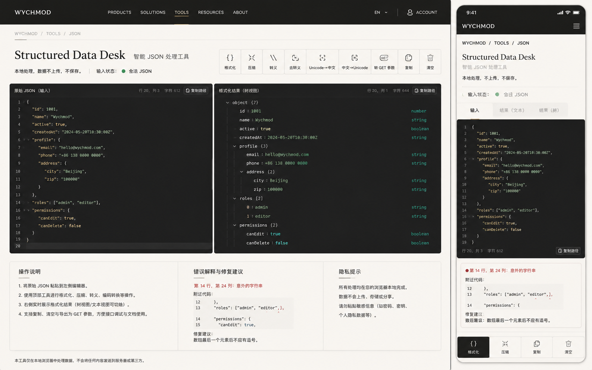

# Image 17：JSON 处理工具 / Structured Data Desk



> 状态：可实施
> 对应提示词：P017
> 目标文件：`docs/tools/json-tool.html`
> 内容真相来源：当前 `json-tool.html` 的示例 JSON、实时校验、格式化、压缩、转义、去转义、Unicode/中文互转、JSON 转 GET 参数、统计、复制、清空和 toast 逻辑
> 实现边界：这是本地 JSON 处理工作台，不上传、不保存用户数据；树视图、行列错误定位和修复建议必须来自真实解析，不允许静态伪造。

---

## 1. 给实现模型的任务入口

你要把 `docs/tools/json-tool.html` 改造成参考图所示的 “Structured Data Desk / 智能 JSON 处理工具”。它不是一个彩色按钮堆叠工具，而是一张结构化数据的编辑桌：左侧粘贴原始 JSON，右侧查看格式化文本或树视图，上方是一排清楚克制的处理动作，下方给出错误解释、操作说明和隐私提醒。

当前真实功能包括：

- 初始化示例：`exampleJSON`。
- 输入区域：`textarea#input`。
- 输出区域：`textarea#output`，只读。
- 实时校验：`validateJSON()` 使用 `JSON.parse()`。
- 统计：`showStats(startTime)`，显示字符数、行数、处理时间。
- 格式化：`formatJSON()`。
- 压缩：`compressJSON()`。
- 转义：`escapeJSON()`。
- 去转义：`unescapeJSON()`。
- Unicode 转中文：`unicodeToChinese()`。
- 中文转 Unicode：`chineseToUnicode()`。
- JSON 转 GET 参数：`jsonToGetParams()`，内含 `flattenObject()`。
- 清空：`clearInput()`。
- 复制：`copyResult()`。
- 消息：`showMessage(message, type)`。

参考图里出现但当前未完整实现的能力：

- 深色双编辑器与行号 gutter。
- 结果树视图，可折叠展示 object/array/value 类型。
- 输入状态展示“合法 JSON / 非法 JSON”。
- 当前光标行、列、字符数统计。
- 错误片段定位与修复建议。
- 移动端输入/结果文本/结果树 tab。
- 底部固定移动操作栏。

这些能力可以新增，但必须真实实现。尤其是树视图必须由 `JSON.parse()` 后的对象递归渲染，所有用户内容必须使用 `textContent`，不能用拼接 `innerHTML` 渲染用户 JSON。

实现前必须完整阅读：

- `AGENTS.md`
- `docs/_meta/HOMEPAGE_DESIGN_AND_IMPLEMENTATION.md`
- `docs/tools/json-tool.html`
- `docs/tools/index.html`
- `docs/assets/css/tools-notion.css`

禁止：

- 继续使用紫色/蓝色渐变、emoji 按钮、发光 SaaS 卡片。
- 引入 Monaco、CodeMirror、Ace 等重型编辑器作为视觉任务的隐性改造。
- 上传 JSON、保存 JSON 到远程或自动写入 localStorage。
- 把用户 JSON 拼进 `innerHTML`。
- 静态显示“第 14 行第 24 列”或“修复建议”，必须由当前输入计算。
- 树视图没有真实展开/折叠能力却显示“树视图”。
- 删除现有七个处理动作。
- 删除复制、清空、统计和实时校验。

---

## 2. 参考图视觉审计

### 2.1 桌面端画面结构

参考图桌面端约 `1440 × 900`。

1. 顶部导航：
   - 高约 `64px`。
   - 背景暖石墨黑。
   - 左侧字标 `WYCHMOD`。
   - 中间导航：`PRODUCTS / SOLUTIONS / TOOLS / RESOURCES / ABOUT`，`TOOLS` 选中并有细金线/品牌强调。
   - 右侧：语言 `EN`、分隔线、account 图标和 `ACCOUNT`。
   - 实现时可沿用项目工具页统一导航，不必复制 `PRODUCTS` 文案；必须保证当前工具入口选中。
2. 面包屑：
   - `WYCHMOD / TOOLS / JSON`。
   - 位于纸白内容区顶部。
   - 字号约 `12px`，大写，浅灰。
3. 标题区：
   - 大标题：`Structured Data Desk`。
   - 右侧/后方小标题：`智能 JSON 处理工具`。
   - 标题左对齐，衬线英文主标题，克制、有工具书气质。
4. 状态行：
   - `本地处理，数据不上，不保存。`
   - 分隔竖线。
   - `输入状态：` + 绿色圆点 + `合法 JSON`。
   - 如果非法，绿色圆点变红/橙，文案变成 `JSON 格式错误`。
5. 工具条：
   - 位于标题区右侧或下方，横向 9 个按钮。
   - 每个按钮上方线性图标，下方短标签。
   - 按钮从左到右：
     `格式化 / 压缩 / 转义 / 去转义 / Unicode→中文 / 中文→Unicode / 转 GET 参数 / 复制 / 清空`。
   - 按钮为纸白底、细边框；当前/主要按钮可以用深墨底。
6. 主编辑区：
   - 两栏布局，左右各约 `50%`。
   - 左：`原始 JSON（输入）`。
   - 右：`格式化结果（树视图）` 或 `格式化结果（文本）`。
   - 两栏高度约 `540px`。
   - 编辑器背景为深墨黑，文字为温暖浅色。
   - 每个编辑器顶部右侧显示：行、列、字符数、复制按钮。
7. 下方信息区：
   - 三列纸白面板：
     - `操作说明`
     - `错误解释与修复建议`
     - `隐私提示`
   - 高度约 `220–260px`。
   - 错误面板在合法时可以显示“未发现错误”；非法时显示具体行列、附近代码和建议。

### 2.2 桌面编辑器细节

左侧输入编辑器：

- 顶部标签：`原始 JSON（输入）`。
- 右上状态：`行 20，列 3  字符 612`。
- 深色背景接近 `#151715`，不是纯黑。
- 行号宽约 `42px`，颜色为灰。
- JSON 文本有基础高亮：
  - key：暖金或浅米。
  - string：柔和绿。
  - number：浅青绿。
  - boolean/null：蓝绿或橙，但不能刺眼。
- 如果继续使用 `<textarea>`，无法对内部文字高亮；可以保留纯文本。不要做不稳定 overlay 高亮，除非实现滚动同步。

右侧结果编辑器：

- 顶部标签：`格式化结果（树视图）`。
- 树视图示例：

```text
object {7}
  id : 1001                  number
  name : wychmod             string
  active : true              boolean
  createdAt : 2024-05-20T10:30:00Z string
  profile {3}
    email : hello@wychmod.com string
    phone : +86 138 0000 0000 string
    address {2}
      city : Beijing          string
      zip : 100000            string
```

实现要求：

- 树视图必须由真实 parsed JSON 渲染。
- object/array 使用 `<details open>` + `<summary>` 或等价可访问折叠结构。
- key、value、type 分列排版。
- 字符串值过长时截断，但 `title` 或详情里能看到完整值。
- 用户内容用 `textContent`。

### 2.3 下方三张信息面板

#### 2.3.1 操作说明

参考图文案：

```text
1. 将原始 JSON 粘贴到左侧编辑器。
2. 使用顶部工具进行格式化、压缩、转义、编码转换等操作。
3. 右侧实时展示格式化结果（树视图/文本视图可切换）。
4. 支持复制、清空与导出为 GET 参数，方便接口调试与文档使用。
```

注意：

- 如果没有实现导出文件，不要写“导出文件”。
- `转 GET 参数` 可以称为“导出为 GET 参数”。

#### 2.3.2 错误解释与修复建议

参考图显示：

```text
第 14 行，第 24 列：意外的字符串
附近代码：
12  },
13  "roles": ["admin", "editor",],
14  "permissions": {
修复建议：
数组最后一个元素后不应有逗号。
```

实现要求：

- 不能固定写第 14 行。
- 若 `JSON.parse()` 的错误信息包含 `position N`，将 `N` 转换为行列：
  - 行：从输入起始到 position 的 `\n` 数量 + 1。
  - 列：最后一个 `\n` 后的字符数 + 1。
- 如果浏览器错误信息不含 position：
  - 显示原始错误信息。
  - 行列显示为 `无法确定`。
- 可做常见建议匹配：
  - `Unexpected token }` / `Unexpected token ]`：可能有尾逗号或缺少值。
  - `Unexpected string`：可能缺少逗号或冒号。
  - `Unexpected end of JSON input`：可能缺少闭合括号。
  - `Expected property name`：对象 key 必须使用双引号。
- 附近代码最多展示错误行前后各 `2` 行。
- 用 `<pre><code>` 渲染，并用 `textContent` 填充。

合法状态下：

```text
当前 JSON 可以被解析。若你仍然怀疑结构问题，可以切换到树视图检查嵌套层级。
```

#### 2.3.3 隐私提示

参考图文案方向：

```text
所有处理均在您的浏览器本地完成，数据不会上传、存储或分享。
请勿粘贴敏感信息（如密码、密钥、个人隐私数据等）。
```

语气要像温和提醒，不像法律免责声明。

### 2.4 移动端画面结构

参考图移动端约 `390 × 844`。

1. 顶部黑色导航：
   - 左侧 `WYCHMOD`。
   - 右侧菜单图标。
   - 高约 `56px`。
2. 面包屑：
   - `WYCHMOD / TOOLS / JSON`。
   - 单行，字号 `12px`。
3. 标题：
   - `Structured Data Desk`
   - 下一行 `智能 JSON 处理工具`，浅灰。
4. 说明：
   - `本地处理，不上传，不保存。`
5. 状态条：
   - `输入状态：` + 绿色点 + `合法 JSON`。
6. Tab：
   - `输入`
   - `结果（文本）`
   - `结果（树）`
   - 活跃 tab 背景纸白，非活跃浅灰。
7. 编辑器：
   - 移动端只展示一个编辑器面板。
   - 输入 tab 中显示左侧输入 textarea。
   - 结果文本 tab 显示 output textarea。
   - 结果树 tab 显示可折叠树。
8. 错误面板：
   - 在编辑器下方，合法时可折叠或简短显示。
   - 非法时突出显示错误行列与建议。
9. 底部固定操作栏：
   - `格式化 / 压缩 / 复制 / 清空`。
   - 图中四等分按钮。
   - `格式化` 是深墨主按钮。
   - 页面底部必须加 `padding-bottom: 92px`。

---

## 3. Design Specification

### 3.1 Purpose Statement

JSON 处理工具服务于调接口、读配置、整理日志的人：他们常常拿到一整坨结构化数据，需要迅速看清层级、发现语法错误、复制成另一种格式。页面要让人感觉“数据被摊平在桌上了”，从混乱字符串变成可以阅读、可以修复、可以复用的结构。

这页的人文感来自降低焦虑：错误不是冰冷的 `Unexpected token`，而是被翻译成“哪一行、可能为什么、下一步怎么改”。工具要像一个耐心的同事，帮你把结构理顺，而不是只给一个红色报错。

### 3.2 Aesthetic Direction

唯一方向：**Editorial / magazine，研究者数字书房里的结构化数据桌**。

视觉关键词：

- 纸白说明
- 深墨编辑器
- 数据层级
- 行号和批注
- 本地处理
- 修复建议
- 克制、可信、安静

禁止方向：

- 霓虹黑客控制台
- VS Code 整站仿制
- SaaS 仪表盘
- AI 自动修 JSON
- 彩色按钮集合
- 过度游戏化

### 3.3 Color Palette

继承首页和工具页，不延续当前旧紫蓝。

| 语义 | 色值 | 用法 |
|---|---|---|
| 暖石墨 | `#0D100E` | 顶栏、主按钮、编辑器外层 |
| 编辑器黑 | `#171917` | textarea / tree panel 背景 |
| 编辑器行号 | `#6F756E` | 行号、辅助状态 |
| 编辑器正文 | `#E9E0D0` | JSON 文本 |
| key 暖金 | `#D8B46A` | JSON key 或结构名 |
| string 绿 | `#8BCFA5` | 字符串值 |
| number 青绿 | `#00C776` | 数字与状态点 |
| boolean 蓝绿 | `#58C7B2` | boolean/null 类型 |
| 纸白 | `#F4EFE5` | 页面背景 |
| 卡片纸 | `#FBF7EF` | 信息面板、工具按钮 |
| 纸灰线 | `#DDD4C5` | 分隔线、边框 |
| 说明灰 | `#77746C` | 副标题、辅助文案 |
| 错误红 | `#B6473B` | JSON 错误、危险动作 |
| 警示橙 | `#B97219` | 可修复提示、警告 |

### 3.4 Typography

继承首页字体系统：

- 英文大标题 `Structured Data Desk` 使用首页衬线标题体系。
- 中文副标题使用首页中文标题/正文体系。
- JSON 编辑器、行号、统计、错误代码使用项目既有等宽字体 token 或 `ui-monospace` fallback。
- 不单独引入外部字体。

尺寸建议：

| 区域 | 桌面端 | 移动端 |
|---|---:|---:|
| 英文 H1 | `36–42px` | `24–28px` |
| 中文副标题 | `18–20px` | `15–16px` |
| 状态行 | `13–14px` | `13px` |
| 工具按钮 | `12–13px` | `12px` |
| 编辑器正文 | `13–14px` | `12px` |
| 行号 | `12px` | `11px` |
| 信息面板正文 | `14px` | `13px` |

### 3.5 Layout Strategy

桌面端是“顶部动作 / 双编辑器 / 底部解释”的结构：

```text
top nav
└─ breadcrumb
   └─ hero
      ├─ title + status
      └─ action toolbar
         └─ editor split
            ├─ raw JSON editor
            └─ result text/tree viewer
         └─ explanation panels
            ├─ operation guide
            ├─ error diagnosis
            └─ privacy note
```

移动端是“状态先行 + tab 编辑 + 底部动作”的结构：

```text
mobile nav
└─ breadcrumb
   └─ title
      └─ status
         └─ tabs
            └─ active editor/viewer
         └─ error diagnosis
         └─ fixed action bar
```

---

## 4. 页面内容蓝图

### 4.1 顶部内容

建议文案：

```text
WYCHMOD / TOOLS / JSON

Structured Data Desk
智能 JSON 处理工具

本地处理，数据不上，不保存。 | 输入状态： ● 合法 JSON
```

状态规则：

- 空输入：`等待输入`，灰点。
- 合法：`合法 JSON`，绿点。
- 非法：`JSON 格式错误`，红点。

不要在状态行显示“安全加密”等不真实承诺。

### 4.2 工具条

按钮顺序必须与参考图一致，保留当前真实函数：

| 按钮 | 函数 | 说明 |
|---|---|---|
| 格式化 | `formatJSON()` | 解析后 `JSON.stringify(json, null, 2)` |
| 压缩 | `compressJSON()` | 解析后 `JSON.stringify(json)` |
| 转义 | `escapeJSON()` | 将 JSON 字符串化为可嵌入字符串 |
| 去转义 | `unescapeJSON()` | 还原转义 JSON 字符串 |
| Unicode→中文 | `unicodeToChinese()` | 替换 `\uXXXX` 后解析 |
| 中文→Unicode | `chineseToUnicode()` | 当前仅转换中文字符范围 |
| 转 GET 参数 | `jsonToGetParams()` | 扁平化对象和数组 |
| 复制 | `copyResult()` | 复制当前输出或当前 active view |
| 清空 | `clearInput()` | 清空输入、输出、统计 |

视觉：

- 桌面按钮宽约 `72–88px`，高约 `72px`。
- 图标为线性 SVG，尺寸 `18–20px`。
- 标签短，不换行；长标签如 `Unicode→中文` 可略宽。
- `清空` 是危险次级按钮，不要大面积红底；用红色文字或细边框即可。

### 4.3 双编辑器

#### 4.3.1 输入编辑器

结构建议：

```html
<section class="json-editor-panel json-input-panel">
  <header>
    <h2>原始 JSON（输入）</h2>
    <div class="editor-meta">
      <span id="cursorMeta">行 1，列 1</span>
      <span id="inputCharMeta">字符 0</span>
      <button type="button" aria-label="复制输入内容">复制</button>
    </div>
  </header>
  <div class="editor-frame">
    <pre class="line-gutter" aria-hidden="true"></pre>
    <textarea id="input"></textarea>
  </div>
</section>
```

实现要求：

- `textarea#input` 的 ID 保持不变。
- 行号 gutter 随输入行数更新。
- 行号 gutter 与 textarea 垂直滚动同步。
- 光标移动、点击、输入时更新行列。
- 如果不实现行号同步，就不要显示行号 gutter；可只显示顶部行列。

#### 4.3.2 结果视图

需要同时支持文本结果和树结果。

文本结果：

- 复用 `textarea#output`，`readonly` 保持。
- 显示格式化、压缩、转义、Unicode、GET 参数输出。

树结果：

- 新增容器，例如 `div#treeOutput`。
- 只在当前 output 可解析为 JSON 时展示。
- 若输出是 GET 参数或转义字符串，不强行展示树；显示说明：`当前结果不是 JSON 树结构，可切换到文本视图。`

树渲染伪代码：

```js
function renderTree(value, container) {
  container.textContent = '';
  container.appendChild(createTreeNode(value, 'root'));
}

function createTreeNode(value, key) {
  // object / array 用 details
  // primitive 用一行 div
  // 所有 key/value/type 用 textContent
}
```

树节点显示：

- object：`object {7}`。
- array：`array [2]`。
- 字符串：显示值，类型 `string`。
- 数字：显示值，类型 `number`。
- boolean：显示值，类型 `boolean`。
- null：显示 `null`，类型 `null`。

### 4.4 统计与状态

当前 `showStats()` 统计 output 字符数、行数和耗时。参考图还显示输入 cursor meta。

建议拆分：

- 输入统计：
  - 当前行。
  - 当前列。
  - 输入字符数。
  - 输入行数。
- 输出统计：
  - 输出行数。
  - 输出字符数。
  - 最近处理耗时。

注意：

- 耗时只表示本地处理函数耗时，不要宣称性能优化。
- 空输出时统计置零。
- 大输入时避免每次 keypress 都做昂贵树渲染；可以 debounce。

### 4.5 错误解释与修复建议

新增容器：

```html
<section class="json-diagnosis" aria-live="polite">
  <h2>错误解释与修复建议</h2>
  <div id="errorSummary"></div>
  <pre id="errorSnippet"></pre>
  <p id="repairSuggestion"></p>
</section>
```

解析规则：

```js
function getJsonParseErrorInfo(error, source) {
  const message = error.message || String(error);
  const positionMatch = message.match(/position\s+(\d+)/i);
  if (!positionMatch) {
    return { message, line: null, column: null, snippet: '', suggestion: suggestFix(message) };
  }
  const position = Number(positionMatch[1]);
  return {
    message,
    line: computeLine(source, position),
    column: computeColumn(source, position),
    snippet: getSnippet(source, line, 2),
    suggestion: suggestFix(message)
  };
}
```

建议映射：

```text
Unexpected token ] / }：检查上一项后是否多了逗号，或缺少值。
Unexpected string：检查上一行是否缺少逗号，或对象 key 是否缺少冒号。
Unexpected number：检查数字前后是否缺少逗号或冒号。
Unexpected end：检查大括号、方括号或引号是否闭合。
Expected property name：JSON 对象的 key 必须使用双引号。
```

不要承诺“自动修复”。本页只给建议。

### 4.6 操作说明与隐私提示

操作说明需要短、有用：

```text
1. 将原始 JSON 粘贴到左侧编辑器。
2. 使用顶部工具进行格式化、压缩、转义、编码转换等操作。
3. 右侧展示处理结果；JSON 结果可以在文本视图和树视图间切换。
4. 转 GET 参数适合接口调试，但复杂对象会使用 bracket path 展开。
```

隐私提示：

```text
所有处理均在浏览器本地完成，不会上传、存储或分享。
请不要粘贴敏感信息，如密码、密钥、身份证号或生产环境 token。
```

### 4.7 移动端 tabs

新增 tab 状态：

```text
input | resultText | resultTree
```

行为：

- 默认 active：`input`。
- 点击 `格式化` 后可以自动切到 `resultText` 或保持输入并给出 toast；建议自动切到结果文本。
- 如果树视图可用，结果树 tab 可用。
- 如果当前结果不是 JSON，树 tab disabled 或显示解释。

底部按钮：

- `格式化` 调 `formatJSON()`。
- `压缩` 调 `compressJSON()`。
- `复制` 调 `copyResult()`。
- `清空` 调 `clearInput()`。

---

## 5. 视觉实现细节

### 5.1 CSS 作用域

建议给 body 增加：

```html
<body class="tool-page json-desk-page">
```

核心类：

```text
.json-desk-page
.tool-shell
.tool-topbar
.tool-breadcrumb
.json-hero
.json-status-line
.json-action-bar
.json-action-button
.json-workbench
.json-editor-panel
.editor-frame
.line-gutter
.json-textarea
.json-tree
.tree-node
.tree-key
.tree-value
.tree-type
.json-info-grid
.json-diagnosis
.mobile-json-tabs
.mobile-action-bar
```

### 5.2 尺寸与间距

| 元素 | 桌面端 | 移动端 |
|---|---:|---:|
| 页面左右 padding | `30–38px` | `16px` |
| hero 上边距 | `32px` | `22px` |
| hero 下边距 | `24px` | `18px` |
| 工具按钮高 | `72px` | 底栏 `58–64px` |
| 编辑器高度 | `520–560px` | `500–560px` 可视区内滚动 |
| 编辑器 header | `40px` | `38px` |
| gutter 宽度 | `42px` | `34px` |
| 编辑器 padding | `14–16px` | `12px` |
| 信息面板 padding | `26–30px` | `16px` |

### 5.3 编辑器质感

- 深色编辑器边框不要发光。
- header 与编辑区有细线分隔。
- 行号颜色比正文低两级。
- 当前错误行可以用非常浅的红色背景，不要全行大红。
- 代码选区使用浏览器默认或品牌绿低透明。

### 5.4 动效

- 工具按钮 hover：背景轻微变深，不上浮超过 `1px`。
- tab 切换：无大动画，只切内容。
- 树节点展开使用浏览器 `<details>` 默认即可，最多加轻微箭头旋转。
- toast 进入退出 `160–220ms`。
- 遵守 `prefers-reduced-motion`。

### 5.5 可访问性

- 工具按钮有文字和 `aria-label`。
- tab 使用 `role="tablist"`、`role="tab"`、`aria-selected`。
- 树视图使用 `<details>` 或 `role="tree"`；若用 `role="tree"` 需要键盘支持，建议优先 `<details>`。
- 错误面板 `aria-live="polite"`。
- 输出 textarea 保持 `readonly`。
- 清空按钮在视觉上危险，但不需要二次确认；若用户点击后可通过示例按钮恢复，则更友好。

---

## 6. 功能实现契约

### 6.1 必须保留的函数

可以重构内部实现，但这些用户可见能力不能丢：

- `validateJSON()`
- `showStats(startTime)`
- `formatJSON()`
- `compressJSON()`
- `escapeJSON()`
- `unescapeJSON()`
- `unicodeToChinese()`
- `chineseToUnicode()`
- `jsonToGetParams()`
- `clearInput()`
- `copyResult()`
- `showMessage(message, type)`

### 6.2 建议新增函数

```js
updateInputMeta()
updateOutputMeta(startTime)
setJsonStatus(type, message)
setActiveJsonTab(tabName)
renderTreeFromOutput()
renderJsonTree(value, key)
createPrimitiveTreeRow(key, value)
extractParsePosition(errorMessage)
positionToLineColumn(source, position)
getSourceSnippet(source, line, radius)
suggestJsonFix(errorMessage)
renderDiagnosis(info)
copyText(text)
syncLineGutter(textarea, gutter)
```

### 6.3 安全要求

- 用户输入只进入 `textarea.value`、`textContent` 或安全属性。
- 树视图的 key/value/type 全部用 `textContent`。
- 错误片段用 `textContent`。
- 不把 JSON 内容放进 HTML 字符串模板。
- GET 参数输出用 `encodeURIComponent()`，保持当前行为。
- Clipboard API 失败时 fallback 到 textarea 选择复制。

### 6.4 当前旧问题要顺手修复

当前 `json-tool.html` 中的问题：

- 页面主视觉是旧紫蓝，不符合首页。
- 标题和按钮使用 emoji。
- 头部居中且泛工具站风，不符合参考图左对齐工作台。
- 所有按钮堆在中间，缺少信息层级。
- 输入和输出上下排列，桌面没有双栏。
- `copyResult()` 只用 `document.execCommand('copy')`。
- 示例 JSON 里含 emoji，若保留要确认不是作为 UI 图标；最好换成纯文本示例。
- `validateJSON()` 只改 inline style，建议改为状态类。
- 错误信息只在 toast/状态里，不够可操作。

---

## 7. 可直接复制给实现模型的指令

```text
请改造 `docs/tools/json-tool.html`，目标是复现 `docs/_meta/ui-redesign/references/image-17.png` 的 “Structured Data Desk / 智能 JSON 处理工具”，并与首页 V2 的 Editorial / magazine「研究者的数字书房」风格一致。

你必须先阅读：
1. `AGENTS.md`
2. `docs/_meta/HOMEPAGE_DESIGN_AND_IMPLEMENTATION.md`
3. `docs/tools/json-tool.html`
4. `docs/tools/index.html`
5. `docs/assets/css/tools-notion.css`

页面目标：
- 将 JSON 工具从旧紫蓝按钮堆叠改成结构化数据工作台。
- 顶部有统一工具导航和面包屑：`WYCHMOD / TOOLS / JSON`。
- 主标题为 `Structured Data Desk`，副标题为 `智能 JSON 处理工具`。
- 状态行显示：`本地处理，数据不上，不保存。 | 输入状态：合法 JSON / JSON 格式错误 / 等待输入`。

视觉结构：
1. 桌面端：
   - 顶部左侧标题与状态，右侧或下方横向工具条。
   - 工具条保留：格式化、压缩、转义、去转义、Unicode→中文、中文→Unicode、转 GET 参数、复制、清空。
   - 主体为左右双编辑器：
     - 左：`原始 JSON（输入）`，深色 textarea，显示行、列、字符数。
     - 右：结果区域，支持文本结果和树视图；树视图必须由真实 JSON parse 后递归渲染。
   - 下方三栏：操作说明、错误解释与修复建议、隐私提示。
2. 移动端：
   - 单列布局。
   - 使用 tab：输入、结果（文本）、结果（树）。
   - 底部固定操作栏：格式化、压缩、复制、清空。
   - 页面底部加 padding，避免底栏遮挡编辑器和错误面板。

必须保留当前功能：
- 示例 JSON 初始化。
- 实时 JSON.parse 校验。
- formatJSON、compressJSON、escapeJSON、unescapeJSON、unicodeToChinese、chineseToUnicode、jsonToGetParams、copyResult、clearInput、showMessage。
- 字符数、行数、处理时间统计。

新增能力必须真实实现：
- 行号 gutter：如果显示，必须随 textarea 行数和滚动同步；否则不要显示行号。
- 树视图：必须由 parsed JSON 递归渲染，object/array 可折叠，primitive 显示 key/value/type。所有用户内容用 textContent。
- 错误定位：如果 JSON.parse 的错误信息含 position，计算行列并显示附近代码；如果不含 position，明确显示无法确定行列。
- 修复建议：只能基于错误 message 做常见建议匹配，不要宣称自动修复。
- 移动 tabs：必须可点击、aria-selected 正确。

视觉约束：
- 使用暖石墨 `#0D100E`、编辑器黑 `#171917`、纸白 `#F4EFE5`、卡片纸 `#FBF7EF`、品牌绿 `#00C776`、纸灰线 `#DDD4C5`。
- 删除紫色/蓝色渐变与 emoji 图标，改成 SVG/线性图标。
- 编辑器像深色数据桌，不要霓虹发光，不要仿 VS Code 到失去本站风格。
- 错误红克制使用，只用于错误状态和错误行。

隐私与安全：
- 不上传 JSON。
- 不保存用户 JSON。
- 不把用户 JSON 拼入 innerHTML。
- 复制优先 Clipboard API，失败 fallback。
- toast 使用 aria-live。

验收：
- 合法 JSON 显示合法状态，格式化输出正确。
- 非法尾逗号能显示错误信息；若能提取 position，则显示行列和附近代码。
- 转义/去转义、Unicode 互转、GET 参数转换无回归。
- 树视图与文本视图内容来自同一次 JSON parse。
- 390px 手机无横向滚动，底部操作栏不遮挡。
- 控制台无新增 error。
- 不修改 `docs/md/archive/`。
```

---

## 8. 验证清单

### 8.1 视觉验证

- 桌面 `1440 × 900`：双编辑器高度和宽度接近参考图，标题左对齐，工具条清楚。
- 桌面 `1280 × 800`：工具按钮不换成混乱多行；必要时可压缩按钮宽度。
- 平板 `768 × 1024`：可切换到单列或双栏压缩布局，无横向滚动。
- 手机 `390 × 844`：tab、深色编辑器、错误面板和底栏符合参考图。
- 手机 `360 × 800`：底部固定栏不遮挡内容。

### 8.2 功能验证

- 初始示例 JSON 合法。
- 点击格式化后 output 是 2 空格缩进。
- 点击压缩后 output 无多余空白。
- 点击转义后 output 是 JSON 字符串。
- 点击去转义能还原合法转义 JSON。
- Unicode→中文 能转换 `\u4f60\u597d`。
- 中文→Unicode 能转换中文字符。
- 转 GET 参数能处理嵌套对象和数组。
- 清空后 input/output/status/stats 全部恢复空状态。
- 复制在有输出时成功，无输出时给出错误 toast。

### 8.3 树视图验证

- object 显示 `object {n}`。
- array 显示 `array [n]`。
- string/number/boolean/null 类型正确。
- 深层嵌套可以展开折叠。
- 用户输入 `<script>alert(1)</script>` 作为字符串时，不会执行，只作为文本显示。
- 输出不是 JSON 时，树视图显示不可用说明。

### 8.4 错误诊断验证

- 尾逗号 JSON 能显示错误 message。
- 如果 message 含 position，行列计算正确。
- 附近代码只显示错误行前后，不渲染 HTML。
- 缺少闭合括号给出“检查括号/引号闭合”建议。
- key 未加双引号给出“JSON key 必须使用双引号”建议。
- 合法 JSON 时错误面板不显示假错误。

### 8.5 可访问性与工程验证

- 所有按钮可键盘 Tab 访问。
- tab 有正确 ARIA。
- textarea 有 label。
- 状态和错误更新可被屏幕阅读器感知。
- `prefers-reduced-motion` 下动效关闭或减弱。
- `git diff --check` 通过。
- 不修改首页运行文件，除非明确是共享工具壳必要改动。
- 不修改 `docs/md/archive/`。

---

## 9. 实施风险提示

- 浏览器对 `JSON.parse()` 错误 message 不完全一致；行列定位只能在可提取 `position` 时保证。
- textarea 内部不能真正高亮不同 token；若要高亮，需要 overlay 或只在树视图高亮。不要半成品高亮导致输入错位。
- 行号 gutter 同步滚动容易出 bug；做不到稳定就只显示顶部行列。
- 树视图处理超大 JSON 会有性能风险，建议对节点数量设置软上限，例如超过 `5000` 节点提示切换文本视图。
- 当前 `chineseToUnicode()` 只转换 `\u4e00-\u9fa5` 范围，不覆盖全部 CJK 扩展；如果不扩展算法，说明保持当前行为。
- GET 参数转换对 null/undefined/对象数组要明确策略，避免输出 `undefined`。
