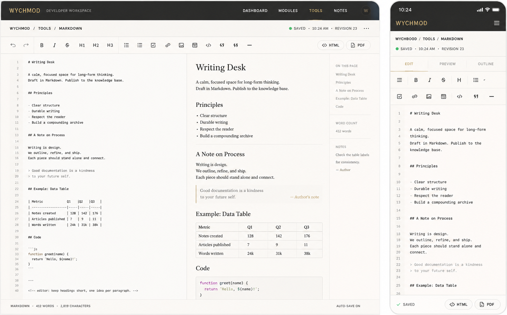

# Image 18：Markdown 编辑器 / Writing Desk



> 状态：可实施
> 对应提示词：P018
> 目标文件：`docs/tools/markdown-editor.html`
> 内容真相来源：当前 `markdown-editor.html` 的默认 Markdown、实时预览、自写 `parseMarkdown()`、字数统计、工具栏插入、快捷键、HTML/PDF 导出、下载、清空和 toast
> 实现边界：这是本地 Markdown 写作台，不是云端笔记系统；Saved、Revision、Outline、Notes 等参考图元素必须有真实本地状态或真实计算来源，不能静态伪造。

---

## 1. 给实现模型的任务入口

你要把 `docs/tools/markdown-editor.html` 改造成参考图所示的 “Writing Desk / Markdown 编辑器”。页面要像一张安静的长文写作桌：左边写 Markdown，右边看排版后的文章纸面，最右侧是本文大纲、字数和写作备注。它应继承首页“Editorial / magazine：研究者的数字书房”的审美，而不是当前紫蓝渐变、emoji、圆角工具卡片的样子。

当前真实功能包括：

- `defaultMarkdown`：默认 Markdown 示例。
- `textarea#markdownInput`：编辑输入。
- `div#previewContent`：实时预览。
- `updatePreview()`。
- `updateCounts()`。
- `markdownToPlainText()`。
- `parseMarkdown(md)`：页面内手写 Markdown 解析器。
- `escapeHtml(text)`：局部 HTML 转义。
- `insertAtCursor(text)`。
- `insertText(before, after)`：粗体、斜体、删除线、行内代码等。
- `insertHeading(level)`。
- `insertList(type)`：无序、有序、任务列表。
- `insertLink()`。
- `insertImage()`。
- `insertTable()`。
- `insertCodeBlock()`。
- `insertQuote()`。
- `insertHr()`。
- `handleKeyboard(e)`：`Ctrl/Cmd + B`、`Ctrl/Cmd + I`、`Ctrl/Cmd + K`。
- Tab 插入两个空格。
- `exportHTML()`。
- `exportPDF()`：打开打印窗口，引导保存为 PDF。
- `downloadFile(content, filename, type)`。
- `clearEditor()`。
- `showToast(message, type)`。

参考图里出现但当前未完整实现的能力：

- 本地保存状态：`SAVED · 10:24 AM · REVISION 23`。
- Undo/Redo 工具按钮。
- 桌面端右侧 `ON THIS PAGE` 大纲。
- 右侧 `WORD COUNT` 和 `NOTES`。
- 移动端 `EDIT / PREVIEW / OUTLINE` tab。
- 移动端底部固定导出栏。
- 行号 gutter。
- 导出按钮与格式工具更清晰地分组。

这些都可以新增，但必须真实实现：

- 如果显示 `SAVED`，必须实现本地草稿保存，例如 `localStorage`，并只代表本地保存，不代表云端。
- 如果显示 `REVISION`，必须由本地内容变化产生版本号，不能固定写 `23`。
- 如果显示大纲，必须从当前 Markdown 标题实时提取。
- 如果显示 Notes，必须是用户可编辑的本地备注或真实说明，不写静态“Author note”。
- 如果显示行号，必须跟 textarea 输入和滚动同步。

实现前必须完整阅读：

- `AGENTS.md`
- `docs/_meta/HOMEPAGE_DESIGN_AND_IMPLEMENTATION.md`
- `docs/tools/markdown-editor.html`
- `docs/tools/index.html`
- `docs/assets/css/tools-notion.css`

禁止：

- 继续使用紫色/蓝色主视觉和 emoji 图标。
- 宣称云端保存、发布到知识库、多人协作、Revision 云同步。
- 引入复杂编辑器框架或迁移到 React/Vue。
- 删除现有 HTML/PDF 导出。
- 删除现有快捷键和 toolbar 插入能力。
- 让 Markdown 预览执行 `<script>` 或危险链接。
- 把当前手写解析器包装成“完整 CommonMark/GFM 支持”。

---

## 2. 参考图视觉审计

### 2.1 桌面端画面结构

参考图桌面端约 `1440 × 900`。

1. 顶部导航：
   - 高约 `62px`。
   - 背景为暖石墨黑。
   - 左侧 `WYCHMOD` 为暖金/品牌色，旁边 `DEVELOPER WORKSPACE`。
   - 中间/右侧导航：`DASHBOARD / MODULES / TOOLS / NOTES`，`TOOLS` 选中。
   - 右侧圆形 `W` 头像。
   - 实现时应沿用项目工具页统一导航，不必复制 `DASHBOARD` 文案；必须保持当前工具入口被识别。
2. 状态/面包屑行：
   - 左侧：`WYCHMOD / TOOLS / MARKDOWN`。
   - 右侧：绿色点 + `SAVED` + 时间 + `REVISION 23` + 更多按钮。
   - 若未实现真实本地保存，则不显示 `SAVED/REVISION`，改为 `LOCAL DRAFT` 或隐藏。
3. 工具栏：
   - 高约 `64px`。
   - 第一组：撤销、重做。
   - 第二组：`B / I / S / H1 / H2 / H3`。
   - 第三组：列表、有序列表、任务、链接、图片、表格、代码、引用、分隔线。
   - 右侧：`HTML`、`PDF` 导出按钮。
   - 按钮为纸白底、细边框、黑色线性图标；不要使用 emoji。
4. 主工作区：
   - 三栏布局：
     - 左：Markdown 编辑区，约 `49%`。
     - 中：预览区，约 `38%`。
     - 右：侧栏，约 `13%`。
   - 高度占满剩余视口，底部有状态栏。
5. 编辑区：
   - 左侧行号。
   - 等宽字体。
   - 纸白背景。
   - 文本不是深色代码编辑器，而像草稿纸。
6. 预览区：
   - 文章排版，衬线标题。
   - `Writing Desk` 大标题。
   - 段落、列表、引用、表格、代码都像首页纸白内页。
7. 右侧栏：
   - `ON THIS PAGE`：从标题生成。
   - `WORD COUNT`：真实字数。
   - `NOTES`：若实现本地备注，可编辑；否则改为“写作提示”静态说明，但不要假装作者备注。
8. 底部状态栏：
   - 左：`MARKDOWN · 412 WORDS · 2,819 CHARACTERS`。
   - 右：`AUTO-SAVE ON`。
   - 如果未实现自动保存，右侧不可写 `AUTO-SAVE ON`。

### 2.2 移动端画面结构

参考图移动端约 `390 × 844`。

1. 顶部黑色导航：
   - 左侧 `WYCHMOD`。
   - 右侧菜单图标。
2. 面包屑：
   - `WYCHMOOD / TOOLS / MARKDOWN`，图中拼写似有误；实现时必须写 `WYCHMOD`。
3. 状态行：
   - 绿色点 + `SAVED` + `10:24 AM` + `REVISION 23`。
   - 同样必须由真实本地保存状态驱动，否则不显示。
4. Tab：
   - `EDIT`
   - `PREVIEW`
   - `OUTLINE`
   - 当前 tab 底部暖金细线。
5. 移动工具栏：
   - 分两行横向按钮。
   - 图中包含菜单、B、I、S、H、列表、任务、链接、图片、表格、代码、引用、分隔线。
   - 每个按钮最小触控区域 `44px`。
6. 编辑区：
   - 行号在左。
   - 文本可编辑。
   - 不在手机上同时挤出预览栏。
7. 底部固定导出栏：
   - 左侧保存状态。
   - 右侧 `HTML`、`PDF` 按钮。
   - 若未实现保存状态，左侧显示 `LOCAL` 或当前字数。

### 2.3 图中不能直接照搬的内容

不能直接照搬：

- `SAVED`，除非实现真实本地自动保存。
- `10:24 AM`，必须为当前本地保存时间。
- `REVISION 23`，必须为真实本地版本号。
- `AUTO-SAVE ON`，除非自动保存真实开启。
- `NOTES` 中的作者备注，除非它是用户可编辑的本地备注或来自真实文档。
- 移动端面包屑里的 `WYCHMOOD` 拼写。

可以借鉴：

- 写作桌气质。
- 编辑/预览/大纲的信息架构。
- 纸白编辑器和衬线预览。
- 克制的工具条。
- 移动端 tab 与底部导出栏。

---

## 3. Design Specification

### 3.1 Purpose Statement

Markdown 编辑器服务于写笔记、整理技术文档、起草博客的人：他们希望一边写 Markdown，一边看到最终阅读效果，并能把内容导出为 HTML 或通过打印保存 PDF。页面要把“写”和“读”放在同一张桌上，让用户觉得自己不是在填一个工具表单，而是在整理一篇可以被未来自己读懂的文章。

这页的人文感来自写作秩序：大纲像书桌边的索引卡，字数像安静的进度条，预览像一页已经排好的稿纸。工具栏不炫耀功能，而是让写作者在不中断思路的情况下插入结构。

### 3.2 Aesthetic Direction

唯一方向：**Editorial / magazine，研究者数字书房里的长文写作台**。

视觉关键词：

- 草稿纸
- 文章预览
- 页边索引
- 写作秩序
- 本地草稿
- 温和工具
- 长文耐心

禁止方向：

- Notion 克隆
- Typora 克隆
- 富文本 SaaS 编辑器
- 蓝紫效率工具
- AI 写作生成器
- 云端协作产品

### 3.3 Color Palette

继承首页和工具页：

| 语义 | 色值 | 用法 |
|---|---|---|
| 暖石墨 | `#0D100E` | 顶部导航、主要文字 |
| 深墨 | `#151915` | 低调按钮、底栏文字 |
| 暖金 | `#B88A3B` | Markdown 当前 tab、导出按钮边框、细强调 |
| 品牌绿 | `#00C776` | 本地保存成功状态、可用状态点 |
| 纸白 | `#F4EFE5` | 页面背景 |
| 卡片纸 | `#FBF7EF` | 编辑区、预览区、工具栏 |
| 纸灰线 | `#DDD4C5` | 分隔线、栏线 |
| 辅助灰 | `#77746C` | 面包屑、状态、侧栏说明 |
| 草稿灰 | `#B7AEA0` | 行号、placeholder |
| 错误红 | `#B6473B` | 导出失败、危险清空 |
| 代码紫红 | `#A64D79` | 预览代码 token 少量使用 |

规则：

- 暖金只做细强调，不大面积铺满。
- 保存状态绿只用于真实本地保存成功。
- 不使用旧紫色 `#6d4aff` 和科技蓝 `#0b6bcb`。

### 3.4 Typography

继承首页字体系统：

- 预览区标题：使用首页衬线标题体系，体现文章纸面。
- 编辑区：使用项目等宽字体 token 或 `ui-monospace` fallback。
- 工具栏和状态：使用正文 sans/serif token，字距略宽。
- 不单独引入外部字体。

尺寸建议：

| 区域 | 桌面端 | 移动端 |
|---|---:|---:|
| 顶部 nav | `13–14px` | `13px` |
| 面包屑 | `12px` | `11–12px` |
| 工具按钮 | `13px` | `13px` |
| 编辑器正文 | `14px` | `13px` |
| 行号 | `12px` | `11px` |
| 预览 H1 | `36–42px` | `30–34px` |
| 预览正文 | `16px` | `15px` |
| 侧栏标题 | `11px` 大写 | `12px` |
| 底栏 | `12px` | `12px` |

### 3.5 Layout Strategy

桌面端采用“写作、阅读、索引”三栏：

```text
top nav
└─ breadcrumb + local save state
   └─ toolbar
      └─ writing desk
         ├─ markdown editor 49%
         ├─ article preview 38%
         └─ outline/sidebar 13%
      └─ bottom status bar
```

移动端采用“单任务 tab”：

```text
mobile nav
└─ breadcrumb
   └─ local state
      └─ tabs: edit / preview / outline
         └─ active panel
      └─ fixed export/status bar
```

---

## 4. 页面内容蓝图

### 4.1 顶部与状态

建议文案：

```text
WYCHMOD / TOOLS / MARKDOWN

SAVED · 10:24 AM · REVISION 23
```

但只有在实现本地保存后才显示以上格式。

本地保存实现建议：

- key：`wychmod.markdownEditor.draft.v1`
- 内容：

```js
{
  markdown: "...",
  savedAt: "2026-07-28T10:24:00+08:00",
  revision: 23,
  notes: "..."
}
```

- 自动保存触发：
  - 输入 debounce `800–1200ms` 后保存。
  - 保存成功后更新 `SAVED · 当前时间 · REVISION n`。
  - revision 只在内容变化后递增，不在每次渲染预览时递增。
- 如果本地存储不可用：
  - 状态显示 `LOCAL DRAFT` 或 `未开启本地保存`。
  - 不显示 saved。

### 4.2 默认 Markdown 示例

参考图默认内容建议替换为更贴合博客气质的样例：

```markdown
# Writing Desk

A calm, focused space for long-form thinking.
Draft in Markdown. Publish to the knowledge base.

## Principles

- Clear structure
- Durable writing
- Respect the reader
- Build a compounding archive

## A Note on Process

Writing is design.
We outline, refine, and ship.
Each piece should stand alone and connect.

> Good documentation is a kindness
> to your future self.

## Example: Data Table

| Metric | Q1 | Q2 | Q3 |
|---|---:|---:|---:|
| Notes created | 128 | 142 | 176 |
| Articles published | 7 | 9 | 11 |
| Words written | 24k | 31k | 38k |

## Code

```js
function greet(name) {
  return `Hello, ${name}!`;
}
```

---

<!-- editor: keep headings short, one idea per paragraph. -->
```

注意：

- 默认示例可以改，因为它只是工具样例，不是用户真实笔记。
- 示例中不要出现云端发布承诺，除非只是“导出/复制后可发布”。

### 4.3 工具栏

桌面按钮顺序建议：

| 组 | 按钮 | 当前函数 |
|---|---|---|
| 历史 | 撤销、重做 | 当前无；如显示需实现本地历史或调用可靠方案 |
| 字体 | B、I、S、inline code | `insertText()` |
| 标题 | H1、H2、H3 | `insertHeading()` |
| 列表 | 无序、有序、任务 | `insertList()` |
| 插入 | 链接、图片、表格、代码块 | `insertLink()`、`insertImage()`、`insertTable()`、`insertCodeBlock()` |
| 结构 | 引用、分隔线 | `insertQuote()`、`insertHr()` |
| 导出 | HTML、PDF | `exportHTML()`、`exportPDF()` |
| 危险 | 清空 | `clearEditor()` |

如果实现 Undo/Redo：

- 推荐维护简单历史栈：
  - 只记录用户输入后的 textarea value。
  - debounce 入栈，避免每个字符一个 revision。
  - Undo/Redo 后更新预览与计数。
- 如果不实现，就不要显示撤销/重做按钮。

按钮要求：

- 所有按钮使用文字或 SVG 图标，不使用 emoji。
- 每个按钮 `title` 与 `aria-label` 都要明确。
- 移动端按钮不写长文案，只显示图标/短文本。

### 4.4 编辑区

结构建议：

```html
<section class="markdown-editor-panel">
  <div class="editor-frame">
    <pre class="line-gutter" aria-hidden="true"></pre>
    <textarea id="markdownInput" class="markdown-input"></textarea>
  </div>
</section>
```

实现要求：

- `markdownInput` ID 保持。
- Tab 键继续插入两个空格。
- `Ctrl/Cmd + B`、`Ctrl/Cmd + I`、`Ctrl/Cmd + K` 保持。
- 选中文本后点按钮，仍按当前选择范围包裹。
- 行号随输入行数更新。
- 行号与 textarea 滚动同步；做不到则不显示行号。
- 编辑区不自动上传、不自动调用网络。

### 4.5 预览区

预览应像文章内页：

- H1 大而安静。
- H2 有细分隔线。
- 段落行距 `1.7–1.85`。
- 引用块左侧暖金细线，背景极浅。
- 表格有细纸灰边框。
- 代码块使用浅纸灰背景或极淡墨色，不刺眼。
- 图片最大宽度 `100%`，不要撑破预览栏。
- 链接颜色使用深绿/暖金，不使用紫色。

当前 `parseMarkdown()` 是手写解析器，不是完整 Markdown 引擎。页面说明中应写：

```text
支持常用 Markdown：标题、粗斜体、删除线、代码、列表、任务列表、引用、表格、链接、图片和分隔线。
```

不要写“完整支持 CommonMark / GFM”。

### 4.6 安全解析要求

当前 `parseMarkdown()` 存在风险：它只在代码块和行内代码里调用 `escapeHtml()`，普通标题、列表、链接文本、表格单元格等仍可能把用户输入拼入 HTML。

本次改造必须修复：

- 用户输入的普通文本必须转义后再进入 HTML。
- 链接文本、图片 alt、表格单元格必须转义。
- URL 必须校验协议：
  - 允许 `http:`
  - 允许 `https:`
  - 允许相对路径
  - 禁止 `javascript:`
  - 禁止 `data:`，除非明确只允许安全图片类型并做严格处理；默认禁止。
- 预览链接加 `rel="noopener noreferrer"`。
- 导出 HTML 和 PDF 使用同一份安全 HTML。

如果实现成本较高，至少要在现有解析器里补足 `escapeHtml` 与 `sanitizeUrl`，不能继续直接 `innerHTML` 拼用户原文。

### 4.7 右侧大纲

大纲必须从当前 Markdown 标题提取：

```js
function extractOutline(markdown) {
  // 匹配 # 到 ######，忽略代码块内标题
  // 返回 [{ level, text, id }]
}
```

显示规则：

- 标题：`ON THIS PAGE`。
- 最多显示到 H3，H4-H6 可以缩小或隐藏。
- 点击大纲项滚动预览到对应标题。
- 如果无标题，显示：`当前文档还没有标题。`
- 不能写静态 `Writing Desk / Principles / A Note on Process`，除非当前 Markdown 正好有这些标题。

### 4.8 字数与备注

字数：

- 继续基于 `markdownToPlainText()`。
- 桌面右栏显示 `WORD COUNT`。
- 底栏显示：

```text
MARKDOWN · 412 WORDS · 2,819 CHARACTERS
```

对于中文：

- `WORDS` 可以改为 `CHARS` 或区分中英文。
- 建议显示：
  - Markdown 字符数。
  - 纯文本字符数。
  - 英文单词数。

备注：

- 如果实现本地备注：
  - 右栏 `NOTES` 下提供一个小 textarea。
  - 保存到与草稿同一个 localStorage 记录。
- 如果不实现本地备注：
  - 改为 `WRITING TIPS`，显示真实工具说明，例如：

```text
保持标题短。
一段只表达一个观点。
导出前检查表格在预览中是否横向溢出。
```

不要写假作者备注。

### 4.9 导出

HTML 导出：

- 保留 `exportHTML()` + `downloadFile()`。
- 导出样式改成本站纸白文章样式。
- 导出内容使用安全 HTML。
- 文件名建议：`markdown-export.html`，可保持现状。

PDF 导出：

- 保留 `exportPDF()` 打开打印窗口。
- Toast 文案明确：

```text
已打开打印窗口，请选择“保存为 PDF”。
```

- 不能让用户误以为浏览器直接生成了 PDF 文件。
- 打印窗口如果被拦截，要提示用户允许弹窗。

### 4.10 清空

当前 `clearEditor()` 有 `confirm()`。可以保留，也可以改成更柔和的确认条。

要求：

- 清空后更新预览、字数、大纲、保存状态。
- 若启用本地保存，清空也应作为一个 revision 保存，或者提供“恢复默认示例”按钮。
- 不删除其他工具 localStorage。

---

## 5. 视觉实现细节

### 5.1 CSS 作用域

建议：

```html
<body class="tool-page markdown-writing-page">
```

核心类：

```text
.markdown-writing-page
.tool-topbar
.writing-meta-bar
.markdown-toolbar
.toolbar-group
.toolbar-button
.writing-desk-grid
.markdown-editor-panel
.editor-frame
.line-gutter
.markdown-input
.markdown-preview-panel
.preview-content
.writing-sidebar
.outline-list
.note-box
.writing-status-bar
.mobile-writing-tabs
.mobile-export-bar
```

### 5.2 尺寸与间距

| 元素 | 桌面端 | 移动端 |
|---|---:|---:|
| top nav | `62px` | `56px` |
| meta bar | `56px` | `54px` |
| toolbar | `64px` | 两行，每行 `52px` |
| editor/preview height | `calc(100vh - 220px)` | `calc(100vh - 300px)` |
| line gutter width | `56px` | `40px` |
| editor padding | `18–22px` | `14px` |
| preview padding | `32–36px` | `20px` |
| sidebar width | `180–220px` | tab 内全宽 |
| bottom status | `36px` | fixed `64px` |

### 5.3 断点

```text
>= 1180px：三栏 writing desk
900–1179px：编辑/预览双栏，sidebar 下移或可折叠
< 768px：EDIT/PREVIEW/OUTLINE tabs
< 480px：工具栏横向滚动或两行网格，底部导出栏固定
```

### 5.4 动效

- Tab 切换无复杂动画。
- 保存状态从 `SAVING...` 到 `SAVED` 可有轻微淡入。
- toolbar hover 只改变背景和边框。
- 不做打字机效果、纸张翻页、光斑扫过。
- 遵守 `prefers-reduced-motion`。

### 5.5 可访问性

- toolbar 使用 `<button>`，不要 `<div onclick>`。
- 所有按钮有 `aria-label`。
- tab 使用 `role="tablist"`、`role="tab"`、`aria-selected`。
- textarea 有明确 label。
- 预览区域可聚焦，方便键盘滚动。
- toast 使用 `aria-live="polite"`。
- 导出按钮和清空按钮不要只靠图标表达。

---

## 6. 功能实现契约

### 6.1 必须保留的函数或等价能力

- `updatePreview()`
- `updateCounts()`
- `markdownToPlainText()`
- `parseMarkdown(md)`
- `escapeHtml(text)`
- `insertAtCursor(text)`
- `insertText(before, after)`
- `insertHeading(level)`
- `insertList(type)`
- `insertLink()`
- `insertImage()`
- `insertTable()`
- `insertCodeBlock()`
- `insertQuote()`
- `insertHr()`
- `handleKeyboard(e)`
- `exportHTML()`
- `exportPDF()`
- `downloadFile(content, filename, type)`
- `clearEditor()`
- `showToast(message, type)`

### 6.2 建议新增函数

```js
sanitizeUrl(url)
safeMarkdownToHtml(markdown)
extractCodeBlocks(markdown)
restoreCodeBlocks(html, blocks)
extractOutline(markdown)
renderOutline(outline)
slugifyHeading(text, index)
setActiveWritingTab(tabName)
updateLineNumbers()
syncEditorScroll()
updateCursorMeta()
loadLocalDraft()
saveLocalDraftDebounced()
saveLocalDraftNow()
updateSaveStatus(status)
incrementRevisionIfChanged()
loadLocalNotes()
saveLocalNotes()
copyMarkdown()
restoreDefaultExample()
```

如果实现 undo/redo：

```js
pushEditorHistory()
undoEditorHistory()
redoEditorHistory()
```

### 6.3 当前旧问题要顺手修复

当前 `markdown-editor.html` 中的问题：

- 旧紫蓝 token 与首页冲突。
- 标题、工具按钮、帮助区使用 emoji。
- 顶部只有“返回工具集”，缺少工具页统一导航/面包屑。
- 编辑/预览桌面双栏已有，但没有右侧大纲和底部状态。
- 移动端在 `1024px` 后上下双栏，不符合参考图 tab。
- `parseMarkdown()` 普通文本存在 HTML 注入风险。
- 链接没有 `rel="noopener noreferrer"`。
- 图片 URL 不校验协议。
- 导出 HTML/PDF 样式仍使用旧紫色和系统字体。
- 默认示例包含远程 placeholder 图片；如果保留，会让预览依赖外部网络。建议改成无远程图片的本地文本样例或说明。

---

## 7. 可直接复制给实现模型的指令

```text
请改造 `docs/tools/markdown-editor.html`，目标是复现 `docs/_meta/ui-redesign/references/image-18.png` 的 “Writing Desk / Markdown 编辑器”，并与首页 V2 的 Editorial / magazine「研究者的数字书房」风格一致。

你必须先阅读：
1. `AGENTS.md`
2. `docs/_meta/HOMEPAGE_DESIGN_AND_IMPLEMENTATION.md`
3. `docs/tools/markdown-editor.html`
4. `docs/tools/index.html`
5. `docs/assets/css/tools-notion.css`

页面目标：
- 把 Markdown 编辑器从旧紫蓝工具页改成纸白写作台。
- 顶部有统一工具导航和面包屑：`WYCHMOD / TOOLS / MARKDOWN`。
- 桌面端三栏：Markdown 编辑、实时预览、右侧大纲/字数/备注。
- 移动端使用 `EDIT / PREVIEW / OUTLINE` tab，不要把编辑和预览挤成窄双栏。
- 保留实时预览、工具栏插入、快捷键、HTML 导出、PDF 打印导出、清空和 toast。

必须真实实现或隐藏：
- `SAVED · 时间 · REVISION n`：只有实现 localStorage 本地草稿保存后才能显示。revision 必须随内容变化递增，时间必须是真实保存时间。
- `AUTO-SAVE ON`：只有自动保存真实开启时才能显示。
- `ON THIS PAGE`：必须从当前 Markdown 标题实时提取，点击可滚动预览。
- `NOTES`：必须是本地可编辑备注，或改名为真实写作提示；不得写假作者备注。
- 行号：如果显示，必须和 textarea 行数/滚动同步。
- Undo/Redo：如果显示，必须实现真实历史栈或可靠调用；否则隐藏。

视觉约束：
- 使用首页气质：暖石墨 `#0D100E`、纸白 `#F4EFE5`、卡片纸 `#FBF7EF`、纸灰线 `#DDD4C5`、暖金 `#B88A3B`、品牌绿 `#00C776`。
- 删除旧紫色、科技蓝、emoji 图标和发光效果。
- 工具栏按钮是线性 SVG 或短文字，触控面积至少 40–44px。
- 编辑区像草稿纸，预览区像文章纸面，右侧像页边索引。

功能保留：
- `updatePreview()`、`updateCounts()`、`parseMarkdown()`、`escapeHtml()`。
- `insertText()`、`insertHeading()`、`insertList()`、`insertLink()`、`insertImage()`、`insertTable()`、`insertCodeBlock()`、`insertQuote()`、`insertHr()`。
- `handleKeyboard()` 中 Ctrl/Cmd+B、Ctrl/Cmd+I、Ctrl/Cmd+K。
- Tab 插入两个空格。
- `exportHTML()`、`exportPDF()`、`downloadFile()`、`clearEditor()`、`showToast()`。

安全要求：
- 修复当前 parseMarkdown 的普通文本 HTML 注入风险。
- 用户输入的标题、段落、列表、表格、链接文本、图片 alt 都必须转义。
- URL 必须经过 sanitizeUrl，禁止 javascript: 和危险 data:。
- 预览链接加 `rel="noopener noreferrer"`。
- 导出 HTML/PDF 使用同一份安全 HTML。
- 不上传内容，不调用远程服务。

默认示例：
- 可以把 defaultMarkdown 改成参考图里的 Writing Desk 示例。
- 不要依赖远程 placeholder 图片。
- 不要把示例说成用户真实笔记。

验收：
- 桌面 1440×900 近似参考图：顶部导航、meta bar、toolbar、编辑/预览/大纲三栏、底部状态栏。
- 手机 390×844：EDIT/PREVIEW/OUTLINE tab、两行工具栏、底部 HTML/PDF 导出栏。
- 粗体、斜体、删除线、标题、列表、任务、链接、图片、表格、代码块、引用、分隔线都能插入和预览。
- `<script>alert(1)</script>` 在预览和导出中不会执行。
- HTML/PDF 导出可用；PDF 文案说明是打印保存。
- 本地保存状态如显示，刷新后草稿恢复，revision 和时间真实变化。
- 控制台无新增 error。
- 不修改 `docs/md/archive/`。
```

---

## 8. 验证清单

### 8.1 视觉验证

- 桌面 `1440 × 900`：三栏布局与参考图接近，预览区排版有文章感。
- 桌面 `1280 × 800`：右侧栏不压垮预览，可折叠或缩窄。
- 平板 `768 × 1024`：布局切到 tab 或双栏+折叠侧栏，无横向滚动。
- 手机 `390 × 844`：EDIT/PREVIEW/OUTLINE tab 可用，底栏不遮挡文本。
- 手机 `360 × 800`：工具按钮触控面积足够。

### 8.2 Markdown 功能验证

- `#` 到 `###` 标题插入和预览。
- 粗体、斜体、删除线、行内代码。
- 无序、有序、任务列表。
- 链接和图片语法插入。
- 表格预览正确，移动端表格可横向滚动。
- 代码块可展示语言名，不执行代码。
- 引用块和分隔线正常。
- Tab 插入两个空格。
- Ctrl/Cmd+B、I、K 正常。

### 8.3 安全验证

- 输入 `<script>alert(1)</script>` 不执行。
- 输入 `[x](javascript:alert(1))` 不生成可点击危险链接。
- 输入 `)` 不生成危险图片。
- 表格单元格中的 HTML 被转义。
- 导出的 HTML 打开后同样不执行恶意脚本。

### 8.4 本地保存验证

- 启用自动保存时，输入后 debounce 保存。
- 刷新页面草稿恢复。
- revision 随内容变化递增，不因预览刷新递增。
- saved 时间为真实本地时间。
- localStorage 禁用时有降级提示。
- 清空后保存状态合理更新。

### 8.5 大纲与统计验证

- 大纲从 H1/H2/H3 提取。
- 修改标题后大纲实时更新。
- 点击大纲滚动到预览对应位置。
- 无标题时显示空状态。
- 字符数、纯文本字数/英文单词数随输入更新。
- 默认 Writing Desk 示例显示的统计来自真实计算，不硬编码。

### 8.6 导出验证

- HTML 导出文件可打开。
- HTML 导出样式与预览接近。
- PDF 按钮打开打印窗口。
- 弹窗被浏览器拦截时给出提示。
- 中文、代码块、表格在打印样式下可读。

### 8.7 工程验证

- `git diff --check` 通过。
- 控制台无新增 error。
- 不引入未声明第三方库。
- 不修改首页运行文件，除非共享工具壳样式确实需要。
- 不修改 `docs/md/archive/`。

---

## 9. 实施风险提示

- 手写 Markdown 解析器越补越复杂；本轮只需支持当前已有语法，不要承诺完整 CommonMark。
- 安全优先级高于视觉：宁可少支持部分复杂 Markdown，也不能执行用户脚本。
- localStorage 自动保存会改变用户数据生命周期，UI 必须明确“本地保存”，不能写云端 saved。
- 行号 gutter 与 textarea 滚动同步容易错位；实现后必须测长文和软换行。
- PDF 导出依赖浏览器打印，不能保证不同浏览器分页一致。
- 移动端软键盘会挤压视口，底部固定栏必须避免遮挡输入末尾。
