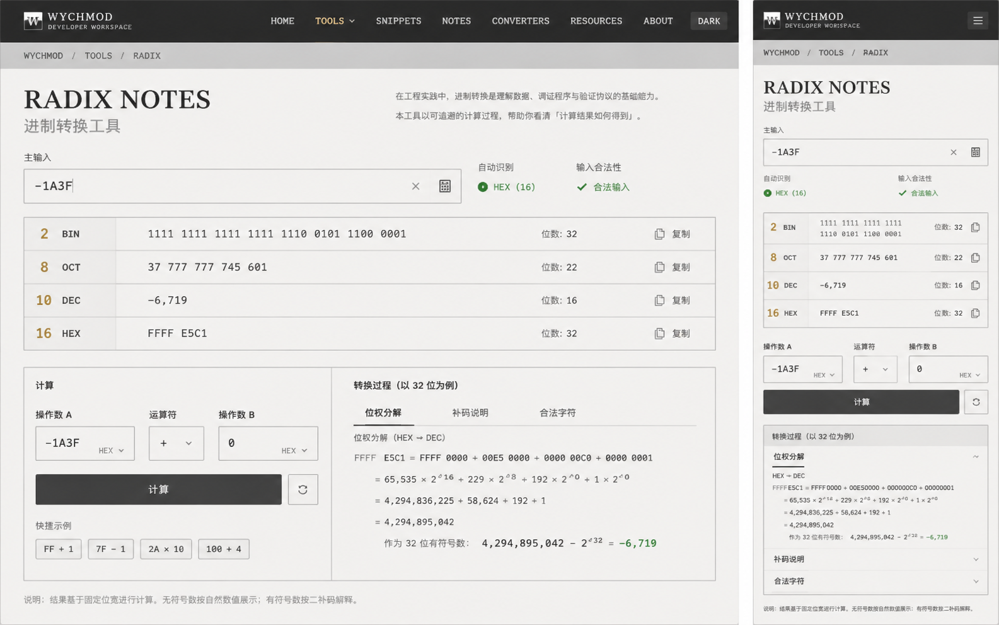

# Image 19：进制转换工具 / Radix Notes



> 状态：可实施
> 对应提示词：P019
> 目标文件：`docs/tools/radix-tool.html`
> 内容真相来源：当前 `radix-tool.html` 的 BIN/OCT/DEC/HEX 四进制转换、输入合法性校验、复制、位运算计算、NOT 操作数显隐和 toast
> 实现边界：这是本地进制转换与计算过程解释工具；自动识别、负数补码、32 位语义、位数统计、计算过程必须真实计算，不能把参考图示例硬编码。

---

## 1. 给实现模型的任务入口

你要把 `docs/tools/radix-tool.html` 改造成参考图所示的 “RADIX NOTES / 进制转换工具”。页面要像一本工程笔记：输入一个值，立刻看到 BIN/OCT/DEC/HEX 四种表达，同时知道它为什么会这样转换，特别是负数在 32 位补码下如何表示。它不是当前那种四张紫蓝卡片，而是一张纸白色的数制记录表。

当前真实功能包括：

- `binInput`、`octInput`、`decInput`、`hexInput` 四个输入框。
- 任意输入框输入后，通过 `convertFrom(sourceType, sourceBase)` 更新其他进制。
- `isValidInput(value, base)` 验证字符合法性。
- `clearAllExcept(exceptType)` 在当前输入为空时清空其他字段。
- `copyValue(inputId)` 复制某个输入框内容。
- `operandA`、`operandB`、`operator` 位运算区。
- `calculateBitwise()` 支持：
  - `and`
  - `or`
  - `xor`
  - `not`
  - `lshift`
  - `rshift`
- `not` 运算时隐藏 `operandBContainer`。
- `showMessage(message, type)`。

参考图里出现但当前未完整实现的能力：

- 单一主输入框。
- 自动识别输入进制。
- 输入合法性状态。
- 负数十六进制输入，例如 `-1A3F`。
- 32 位补码下的 BIN/OCT/HEX 表达。
- 四行结果表：BIN/OCT/DEC/HEX、位数、复制。
- 计算区支持 `+ / - / × / ÷` 之类算术计算，并带操作数进制选择。
- “转换过程（以 32 位为例）”的位权分解、补码说明、合法字符。
- 移动端折叠说明。

这些能力可以新增，但必须真实实现：

- 若显示 `自动识别 HEX (16)`，必须由输入解析逻辑得出。
- 若显示 `合法输入`，必须通过校验。
- 若显示 `FFFF E5C1`，必须由 `-0x1A3F` 在 32 位二补码下计算得出。
- 若显示计算过程，必须基于当前输入生成，而不是静态说明。

实现前必须完整阅读：

- `AGENTS.md`
- `docs/_meta/HOMEPAGE_DESIGN_AND_IMPLEMENTATION.md`
- `docs/tools/radix-tool.html`
- `docs/tools/index.html`
- `docs/assets/css/tools-notion.css`

禁止：

- 继续使用旧紫蓝渐变、emoji 图标、发光卡片。
- 把参考图的 `-1A3F`、`FFFF E5C1`、`−6,719` 硬编码。
- 声称支持任意精度，却仍使用 `Number.parseInt()` 处理超大整数。
- 声称所有负数都支持，却没有固定补码位宽和溢出策略。
- 删除旧的 BIN/OCT/DEC/HEX 转换能力。
- 删除旧位运算能力；如果主界面改成算术计算，旧位运算应作为高级运算符或折叠区保留等价能力。
- 非法输入时悄悄清空结果。

---

## 2. 参考图视觉审计

### 2.1 桌面端画面结构

参考图桌面端约 `1440 × 900`。

1. 顶部导航：
   - 高约 `58–64px`。
   - 背景暖石墨黑。
   - 左侧是方形 W 标识、`WYCHMOD`、`DEVELOPER WORKSPACE`。
   - 中间导航：`HOME / TOOLS / SNIPPETS / NOTES / CONVERTERS / RESOURCES / ABOUT`，`TOOLS` 选中。
   - 右侧 `DARK` 按钮。
   - 实现时沿用项目工具页统一导航即可，但必须是深色顶部。
2. 面包屑：
   - `WYCHMOD / TOOLS / RADIX`。
   - 在浅灰横条内，约 `48px` 高。
3. 标题区：
   - 左侧大标题：`RADIX NOTES`。
   - 中文副标题：`进制转换工具`。
   - 右侧两行说明：
     - `在工程实践中，进制转换是理解数据、调试程序与验证协议的基础能力。`
     - `本工具以可追溯的计算过程，帮助你看清「计算结果如何得到」。`
4. 主输入区：
   - label：`主输入`。
   - 大输入框，值为 `-1A3F`。
   - 右侧有清空按钮和辅助图标按钮。
   - 输入框高度约 `64px`。
   - 字体等宽，字号约 `22px`。
5. 状态区：
   - `自动识别`：绿色点 + `HEX (16)`。
   - `输入合法性`：绿色勾 + `合法输入`。
6. 结果表：
   - 四行：`2 BIN`、`8 OCT`、`10 DEC`、`16 HEX`。
   - 每行左侧基数数字大且暖金。
   - 中间是转换结果。
   - 右侧显示位数与复制按钮。
   - 行高约 `64px`。
7. 下方两栏：
   - 左：`计算`，包含操作数 A、运算符、操作数 B、计算按钮、重置按钮、快速示例。
   - 右：`转换过程（以 32 位为例）`，包含 `位权分解 / 补码说明 / 合法字符`。
8. 底部说明：
   - `说明：结果基于固定位宽进行计算。无符号数按自然数值展示；有符号数按二补码解释。`

### 2.2 移动端画面结构

参考图移动端约 `390 × 844`。

1. 顶部导航：
   - 左侧 W 标识与 `WYCHMOD DEVELOPER WORKSPACE`。
   - 右侧菜单按钮。
2. 面包屑：
   - `WYCHMOD / TOOLS / RADIX`。
3. 标题：
   - `RADIX NOTES`
   - `进制转换工具`
4. 主输入：
   - 单列，输入框宽满。
5. 状态：
   - 自动识别与合法性并排，两列。
6. 结果表：
   - 四行紧凑展示，仍保留基数、缩写、值、位数、复制。
7. 计算区：
   - 操作数 A、运算符、操作数 B 三列压缩或单行。
   - 计算按钮满宽。
   - 重置按钮在右侧小方格。
8. 转换过程：
   - 用 accordion：
     - `位权分解` 默认展开。
     - `补码说明` 折叠。
     - `合法字符` 折叠。
9. 底部说明：
   - 字号小，边距克制。

### 2.3 图中不能直接照搬的内容

不能直接照搬：

- `-1A3F` 的结果值，除非由计算得出。
- `位数：32 / 22 / 16 / 32`，除非由当前位宽规则计算得出。
- “合法输入”，除非校验通过。
- `自动识别 HEX (16)`，除非解析逻辑识别为 HEX。

可以借鉴：

- 工程笔记标题 `RADIX NOTES`。
- 结果表的排版。
- 32 位补码解释方式。
- 移动端折叠说明。
- 基数数字作为视觉锚点。

---

## 3. Design Specification

### 3.1 Purpose Statement

进制转换工具服务于调试底层数据、协议字段、位运算和日志值的人：他们经常在二进制、八进制、十进制和十六进制之间来回切换，也会被负数补码困住。页面要帮助用户不仅看到结果，还看到结果从哪里来。

这页的人文感来自“把机器数讲成人能理解的笔记”：当一个负数变成一串 `FFFF E5C1`，工具要耐心解释它是 32 位补码，不是魔法。它应该像一本可靠的工程手册，严谨但不冷漠。

### 3.2 Aesthetic Direction

唯一方向：**Editorial / magazine，研究者数字书房里的数制笔记**。

视觉关键词：

- 工程笔记
- 位权分解
- 补码注释
- 表格式结果
- 纸面计算
- 克制、精确、可追溯

禁止方向：

- 赛博黑客工具
- 计算器玩具
- 科技蓝仪表盘
- 霓虹数字雨
- 只堆输入框的表单

### 3.3 Color Palette

继承首页与工具页：

| 语义 | 色值 | 用法 |
|---|---|---|
| 暖石墨 | `#0D100E` | 顶栏、主按钮、标题深色 |
| 深墨 | `#1B1D1A` | 输入文字、计算按钮 |
| 暖金 | `#B88A3B` | 基数数字、当前工具选中、细强调 |
| 品牌绿 | `#00C776` | 合法状态、识别状态 |
| 纸白 | `#F4EFE5` | 页面背景 |
| 卡片纸 | `#FBF7EF` | 表格和计算面板 |
| 纸灰线 | `#D8D0C3` | 表格线、输入边框 |
| 辅助灰 | `#77746C` | 说明、label |
| 错误红 | `#B6473B` | 非法输入 |
| 警示橙 | `#B97219` | 溢出、位宽提示 |

规则：

- 结果数字使用深墨和等宽字体，不用彩色高亮每个进制。
- 暖金只突出 `2/8/10/16` 和少量当前状态。
- 不使用旧紫色和蓝色。

### 3.4 Typography

继承首页字体系统：

- `RADIX NOTES` 使用首页衬线标题体系，大写，字距略紧。
- 数值、公式、位权分解使用等宽字体。
- 说明文字使用正文体系，行高舒展。

尺寸建议：

| 区域 | 桌面端 | 移动端 |
|---|---:|---:|
| H1 | `44–52px` | `32–38px` |
| 中文副标题 | `24–28px` | `20–22px` |
| 主输入 | `22–24px` | `18–20px` |
| 基数数字 | `24–28px` | `18–22px` |
| 结果值 | `17–20px` | `13–15px` |
| 表格 label | `14px` | `12–13px` |
| 过程公式 | `15–16px` | `11–12px` |

### 3.5 Layout Strategy

桌面端采用“输入 → 结果表 → 计算/过程”的工程笔记流：

```text
top nav
└─ breadcrumb
   └─ hero
      ├─ title
      └─ explanation
   └─ master input + status
   └─ conversion table
   └─ lower grid
      ├─ calculator
      └─ conversion process
```

移动端采用“单列 + 折叠解释”：

```text
mobile nav
└─ breadcrumb
   └─ title
      └─ master input
         └─ status
            └─ conversion table
               └─ calculator
                  └─ process accordions
```

---

## 4. 功能语义与算法要求

### 4.1 主输入与自动识别

新增主输入：

```html
<input id="radixMasterInput" value="-1A3F">
```

自动识别规则建议：

1. 允许前导符号：`+` 或 `-`。
2. 前缀优先：
   - `0b` / `0B`：BIN。
   - `0o` / `0O`：OCT。
   - `0x` / `0X`：HEX。
3. 无前缀：
   - 含 `A–F`：HEX。
   - 含 `8/9` 且无 `A–F`：DEC。
   - 仅 `0/1`：默认 DEC 或给出“可能是 BIN”的提示；不要擅自让 `100` 永远变成二进制。
   - 仅 `0–7`：默认 DEC，除非用户手动选择 OCT。
4. 建议提供一个小型基数下拉：
   - `自动`
   - `BIN`
   - `OCT`
   - `DEC`
   - `HEX`
   参考图只显示自动识别；实现中可以把下拉放在输入右侧辅助按钮里，避免歧义。

状态文案：

- 合法：`HEX (16)`、`合法输入`。
- 非法：`无法识别`、`包含非法字符`。
- 空输入：`等待输入`。

### 4.2 数值模型

为匹配参考图，建议引入 `BigInt`，避免超出 `Number.MAX_SAFE_INTEGER` 后结果错误。

核心语义：

- 主数值以数学整数 `signedValue` 表示。
- 正数：
  - BIN/OCT/HEX 显示自然数。
  - DEC 显示自然数。
- 负数：
  - DEC 显示负的十进制值。
  - BIN/OCT/HEX 默认显示 `32 位二补码` 表达。
  - 若值超出 32 位有符号范围 `[-2^31, 2^31 - 1]`，显示溢出提示，并可切换到 64 位或禁用补码展示。

默认位宽：

```text
32 bit
```

建议提供隐藏或小型设置：

- `16 bit`
- `32 bit`
- `64 bit`

但参考图只展示 `以 32 位为例`，所以默认 32 位即可。

### 4.3 负数补码算法

对于负数 `n` 和位宽 `w`：

```js
const modulus = 1n << BigInt(w);
const unsignedValue = (modulus + n) % modulus;
```

例如：

```text
n = -0x1A3F = -6719
w = 32
unsignedValue = 2^32 - 6719 = 4294960577
HEX = FFFFE5C1
```

显示时分组：

- BIN：每 4 位分组，`1111 1111 ...`。
- OCT：每 3 位或按自然八进制分组，`377 777 745 601`。
- DEC：负数显示 `−6,719`，使用真正的负号 `−` 或普通 `-` 均可，但全站一致。
- HEX：每 4 位分组，`FFFF E5C1`。

### 4.4 位数统计

表格右侧 `位数` 不能硬编码。

建议规则：

- BIN：当前二进制展示字符串去掉空格后的长度。负数补码模式下为固定 `32`。
- OCT：当前八进制展示字符串去掉空格后的长度。
- DEC：十进制绝对值的二进制位长，或十进制字符数；参考图写 `位数` 容易歧义，建议文案改为：
  - 对 BIN/HEX：`位宽: 32`
  - 对 DEC：`二进制位: 16`
  - 或统一写 `长度`。
- HEX：当前十六进制展示对应位宽。负数补码模式下为固定 `32 bit`。

如果保留参考图的 `位数：32`，旁边说明必须解释它指 bit width，而不是字符数量。

### 4.5 四进制结果表

结果表结构：

```text
2   BIN   1111 1111 1111 1111 1110 0101 1100 0001   位数: 32   复制
8   OCT   377 777 745 601                            位数: 22   复制
10  DEC   −6,719                                     位数: 16   复制
16  HEX   FFFF E5C1                                  位数: 32   复制
```

要求：

- 每行可复制当前结果。
- 复制内容可选择“去空格原始值”或“带分组显示值”，按钮 tooltip 说明清楚。
- 非法输入时表格显示空状态，不保留旧结果假装有效。
- 输入为空时表格显示 `等待输入`。

### 4.6 计算区

参考图计算区是进制感知计算，不只是旧位运算。

建议设计：

```text
操作数 A       运算符       操作数 B
[-1A3F] HEX    [+]          [0] HEX

[计算] [重置]

快速示例：FF + 1 / 7F - 1 / 2A × 10 / 100 + 4
```

计算运算符建议：

- 算术：
  - `+`
  - `-`
  - `×`
  - `÷`（整数除法需说明）
- 保留旧位运算等价能力：
  - `&`
  - `|`
  - `^`
  - `~`
  - `<<`
  - `>>`

如果界面不想复杂：

- 默认显示算术运算符。
- `高级位运算` 放入折叠下拉或运算符列表后半部分。

输入解析：

- 每个操作数都有基数选择：`BIN/OCT/DEC/HEX/AUTO`。
- 计算结果更新主输入或显示在计算结果区；参考图看起来计算结果会驱动上方结果表，建议点击“计算”后将结果写入主输入。

位运算语义：

- JavaScript 位运算是 32 位 signed int。
- 如果改用 BigInt 实现，需要自己定义 32 位截断。
- UI 文案必须写清：

```text
位运算按 32 位有符号整数执行。
```

### 4.7 转换过程

右侧面板标题：

```text
转换过程（以 32 位为例）
```

内容分为三段，桌面端可并排 tab 或纵向章节，移动端 accordion。

#### 4.7.1 位权分解

对当前输入生成：

```text
HEX → DEC
1A3F = 1 × 16^3 + 10 × 16^2 + 3 × 16^1 + 15 × 16^0
     = 4096 + 2560 + 48 + 15
     = 6719
```

如果输入为负数：

```text
原始幅值：1A3F = 6719
符号：负
```

#### 4.7.2 补码说明

对负数生成：

```text
作为 32 位有符号数：
2^32 = 4,294,967,296
4,294,967,296 − 6,719 = 4,294,960,577
对应 HEX：FFFF E5C1
```

注意最终数值必须由代码计算。上面的示例只说明结构，不能直接硬编码。

对正数生成：

```text
当前为非负数，BIN/OCT/HEX 按自然数值展示，不需要二补码解释。
```

#### 4.7.3 合法字符

根据识别进制显示：

```text
BIN：0 1
OCT：0–7
DEC：0–9，可带 + 或 -
HEX：0–9 A–F，可带 + 或 -
```

非法时指出具体非法字符：

```text
字符 G 不能出现在 HEX 中。
```

### 4.8 旧四输入能力的保留

当前页面的四个输入框可以不再作为主视觉，但能力不能消失。

可选方案：

1. 把四输入改造成结果表 + “复制”按钮。
2. 在高级区提供“手动输入某进制”的小表单。
3. 主输入旁提供基数选择，等价覆盖旧“从任意进制输入”。

验收重点是：用户仍然可以明确输入 BIN/OCT/DEC/HEX，而不是只能靠自动识别。

---

## 5. 视觉实现细节

### 5.1 CSS 作用域

建议：

```html
<body class="tool-page radix-notes-page">
```

核心类：

```text
.radix-notes-page
.tool-topbar
.tool-breadcrumb
.radix-hero
.radix-master-row
.radix-master-input
.radix-status-grid
.radix-results-table
.radix-row
.radix-base-number
.radix-base-name
.radix-value
.radix-copy-button
.radix-lower-grid
.radix-calculator
.radix-process
.process-section
.process-accordion
.quick-examples
.mobile-radix-actions
```

### 5.2 尺寸与间距

| 元素 | 桌面端 | 移动端 |
|---|---:|---:|
| 顶部导航 | `58–64px` | `56px` |
| 面包屑条 | `48px` | `42px` |
| 页面 padding | `44px 46px` | `18px 16px` |
| H1 | `48px` | `34px` |
| 主输入高 | `64px` | `44px` |
| 结果行高 | `64px` | `54px` |
| 下方双栏高度 | `360–410px` | auto |
| 计算面板 padding | `24px` | `16px` |
| 过程公式字号 | `15px` | `11–12px` |

### 5.3 表格质感

- 表格外框细纸灰线。
- 每行只有底部分隔线，不做卡片阴影。
- 左侧基数列宽桌面约 `170px`，移动端约 `88px`。
- 值列等宽字体。
- 复制按钮为线性图标 + `复制`，移动端可只显示图标但需 `aria-label`。
- 长二进制值允许换行，但分组保持清楚。

### 5.4 计算过程质感

- 像手写公式排版，但不要真的使用手写字体。
- 公式行用等宽字体。
- 关键结果如 `−6,719` 可用品牌绿。
- “补码说明”不要用大片红色；负数不是错误。

### 5.5 动效

- 输入合法/非法状态变化使用轻微淡入。
- 复制按钮成功时图标/文字短暂变为 `已复制`。
- Accordion 展开使用高度/透明度轻微过渡，遵守 `prefers-reduced-motion`。
- 不做数字老虎机滚动效果。

### 5.6 可访问性

- 主输入有 label。
- 自动识别和合法状态用文字表达，不只靠绿点。
- 复制按钮有 `aria-label`。
- Accordion 使用 `<details><summary>` 或完整 ARIA。
- 快速示例是按钮，不是不可点击文本。
- 非法字符提示关联到输入框 `aria-describedby`。

---

## 6. 功能实现契约

### 6.1 必须保留或等价保留

旧函数可重构，但能力不能丢：

- `convertFrom(sourceType, sourceBase)` 或等价“从指定进制转换”能力。
- `isValidInput(value, base)` 或更强的验证函数。
- `copyValue(inputId)` 或等价复制结果。
- `calculateBitwise()` 或等价位运算能力。
- `showMessage(message, type)`。

旧 DOM ID 如完全移除，要同步更新所有调用，不留下死事件。

### 6.2 建议新增函数

```js
parseRadixInput(raw, forcedBase)
detectBase(raw)
normalizeRadixText(raw)
validateRadixDigits(digits, base)
parseDigitsToBigInt(digits, base)
formatBigIntByBase(value, base)
toTwosComplement(value, bitWidth)
formatGroupedBinary(value, bitWidth)
formatGroupedOctal(value, bitWidth)
formatGroupedHex(value, bitWidth)
formatSignedDecimal(value)
getBitLength(value)
renderRadixResults(model)
renderRadixStatus(model)
renderConversionProcess(model)
renderValidCharacters(model)
copyText(text)
calculateRadixExpression()
applyQuickExample(example)
```

位运算若改为 BigInt/固定 32 位：

```js
toInt32BigInt(value)
fromInt32BigInt(value)
applyBitwiseOperator(a, op, b)
```

### 6.3 数据模型建议

```js
{
  raw: "-1A3F",
  sign: -1n,
  base: 16,
  digits: "1A3F",
  signedValue: -6719n,
  bitWidth: 32,
  isValid: true,
  error: null,
  twosComplementValue: 4294960577n
}
```

### 6.4 当前旧问题要顺手修复

当前 `radix-tool.html` 中的问题：

- 页面旧紫蓝视觉与首页冲突。
- 标题、卡片、按钮使用 emoji。
- 四张卡片让用户看不到“过程”，不符合参考图。
- 当前 `convertFrom()` 禁止负数转换，参考图需要负数补码语义。
- 当前 `parseInt()` 使用 Number，超大数可能丢精度。
- 当前位运算输入只按十进制 `parseInt()`，不能选择进制。
- 当前复制只用 `document.execCommand('copy')`。
- `showMessage()` 使用 `slideOut` 动画但 CSS 中没有定义 `slideOut`。

---

## 7. 可直接复制给实现模型的指令

```text
请改造 `docs/tools/radix-tool.html`，目标是复现 `docs/_meta/ui-redesign/references/image-19.png` 的 “RADIX NOTES / 进制转换工具”，并与首页 V2 的 Editorial / magazine「研究者的数字书房」风格一致。

你必须先阅读：
1. `AGENTS.md`
2. `docs/_meta/HOMEPAGE_DESIGN_AND_IMPLEMENTATION.md`
3. `docs/tools/radix-tool.html`
4. `docs/tools/index.html`
5. `docs/assets/css/tools-notion.css`

页面目标：
- 把当前四张旧卡片改成单主输入 + 四进制结果表 + 计算区 + 转换过程说明。
- 顶部有统一深色工具导航和面包屑：`WYCHMOD / TOOLS / RADIX`。
- 标题为 `RADIX NOTES`，副标题为 `进制转换工具`。
- 说明文案：
  `在工程实践中，进制转换是理解数据、调试程序与验证协议的基础能力。`
  `本工具以可追溯的计算过程，帮助你看清「计算结果如何得到」。`

功能要求：
- 主输入支持 + / - 符号。
- 支持 BIN/OCT/DEC/HEX 自动识别；前缀 0b/0o/0x 优先，含 A-F 默认 HEX。
- 提供基数手动覆盖入口，避免 `100` 这类歧义。
- 使用 BigInt 或等价安全方式处理整数，不要用 Number 冒充任意精度。
- 默认位宽为 32 bit。
- 负数在 BIN/OCT/HEX 中按 32 位二补码展示，DEC 显示有符号十进制。
- 表格四行显示 BIN、OCT、DEC、HEX、位数/位宽、复制按钮。
- 非法输入时显示具体错误，不保留旧结果假装有效。
- 计算区支持 +、-、×、÷，并保留旧位运算能力（&、|、^、~、<<、>>）作为高级运算符或折叠区。
- 计算区每个操作数可选择 BIN/OCT/DEC/HEX/AUTO。
- 转换过程必须根据当前输入生成：位权分解、补码说明、合法字符。

视觉要求：
- 使用暖石墨 `#0D100E`、纸白 `#F4EFE5`、卡片纸 `#FBF7EF`、纸灰线 `#D8D0C3`、暖金 `#B88A3B`、品牌绿 `#00C776`。
- 删除旧紫色、蓝色渐变、emoji 图标和发光卡片。
- 结果表像工程笔记表格，基数数字 2/8/10/16 用暖金，数值用等宽字体。
- 桌面端下方双栏：左计算，右转换过程。
- 移动端单列，转换过程用 accordion，计算按钮满宽。

算法要求：
- 不得硬编码 `-1A3F` 的结果。
- 对负数 n 和位宽 w，二补码值为 `(2^w + n) mod 2^w`。
- `-1A3F` 默认应解析为 HEX，十进制为 `-6719`，32 位 HEX 补码应由算法得到 `FFFFE5C1`，显示可分组为 `FFFF E5C1`。
- 二进制每 4 位分组。
- 十进制显示千分位。
- 位数/位宽文案必须准确说明含义。

交互要求：
- 输入时实时更新识别状态、合法状态、结果表和过程说明。
- 清空按钮清空主输入与结果。
- 复制优先 Clipboard API，失败 fallback。
- 快速示例按钮包括：`FF + 1`、`7F - 1`、`2A × 10`、`100 + 4`。
- 非法字符提示通过 aria-describedby 关联主输入。

验收：
- `-1A3F` 自动识别为 HEX，合法，DEC 为 `-6,719` 或 `-6719`，HEX 补码为 `FFFF E5C1`。
- `0b1010`、`0o12`、`10`、`0xA` 都能正确转换。
- `G` 在 HEX 中报错，`2` 在 BIN 中报错。
- 正数不显示负数补码说明。
- 位运算 NOT 时隐藏或禁用操作数 B，且结果按 32 位语义说明。
- 手机 390px 无横向滚动。
- 控制台无新增 error。
- 不修改 `docs/md/archive/`。
```

---

## 8. 验证清单

### 8.1 视觉验证

- 桌面 `1440 × 900`：标题、输入、结果表、计算/过程双栏接近参考图。
- 桌面 `1280 × 800`：结果表不溢出，长二进制可以换行。
- 平板 `768 × 1024`：下方双栏转单列或折叠。
- 手机 `390 × 844`：状态两列、结果表紧凑、过程 accordion。
- 手机 `360 × 800`：无横向滚动，复制按钮仍可点击。

### 8.2 转换验证

- `0`。
- `1`。
- `10` 默认 DEC。
- `0b1010`。
- `0o12`。
- `0xA`。
- `A` 或 `a` 自动 HEX。
- `-1A3F` 自动 HEX。
- `-0x1A3F` 与 `-1A3F` 一致。
- `FFFFFFFF` 在 32 位模式下语义明确。
- 大于 `Number.MAX_SAFE_INTEGER` 的值不丢精度，或明确报出超范围。

### 8.3 非法输入验证

- BIN 输入 `102` 报错。
- OCT 输入 `8` 报错。
- HEX 输入 `G` 报错。
- 单独 `-` 显示等待继续输入，不崩溃。
- 空输入显示空状态。
- 非法输入不保留旧结果。

### 8.4 补码验证

- 负数按 32 位补码展示。
- 超出 32 位有符号范围时显示溢出提示。
- 切换位宽后 BIN/OCT/HEX 更新。
- 过程说明中的 `2^32` 和结果来自真实计算。

### 8.5 计算区验证

- `FF + 1` 得到 `100` HEX 或对应结果。
- `7F - 1`。
- `2A × 10`。
- `100 + 4` 在不同基数规则下结果明确。
- 除法除以 0 给出错误。
- `& | ^ ~ << >>` 旧位运算能力仍可用。
- NOT 隐藏/禁用 B。

### 8.6 可访问性与工程验证

- 所有输入有 label。
- 状态不只靠颜色。
- 复制按钮有 aria-label。
- Accordion 可键盘打开。
- toast 使用 aria-live。
- `git diff --check` 通过。
- 不修改首页运行文件，除非共享工具壳样式必要。
- 不修改 `docs/md/archive/`。

---

## 9. 实施风险提示

- 自动识别存在歧义，尤其是 `10`、`100`、`077`；必须提供手动覆盖或明确默认规则。
- JavaScript `Number` 无法安全表示大整数；若不使用 BigInt，就必须限制范围并提示。
- JavaScript 原生位运算是 32 位 signed int，和 BigInt 算术模型不同；需要统一语义。
- 负数 OCT/HEX/BIN 展示必须依赖固定位宽，否则没有唯一结果。
- 位数/位宽文案容易误导，建议把 `位数` 改为更准确的 `位宽` 或在说明中解释。
- 移动端二进制很长，必须允许换行或横向局部滚动。
