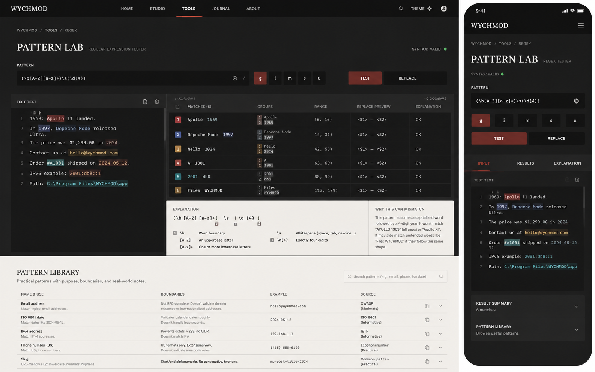

# Image 20：正则表达式测试工具 / Pattern Lab



> 状态：可实施
> 对应提示词：P020
> 目标文件：`docs/tools/regex-tool.html`
> 内容真相来源：当前 `regex-tool.html` 的正则输入、g/i/m/s/u flags、实时测试、匹配结果、捕获组统计、常用正则库、示例加载、清空、HTML 转义与零宽匹配保护
> 实现边界：这是本地 JavaScript RegExp 实验室，不是完整正则教学引擎；替换预览、语法解释、匹配高亮和模式库说明必须由真实输入计算或明确标注为有限解释，不能静态伪造。

---

## 1. 给实现模型的任务入口

你要把 `docs/tools/regex-tool.html` 改造成参考图所示的 “PATTERN LAB / Regular Expression Tester”。页面上半部分是深色实验区：输入正则、切换 flags、在测试文本里高亮匹配、查看每个匹配的分组和范围；下半部分回到纸白“Pattern Library”，提供带边界说明的常用模式。它要继承首页“Editorial / magazine：研究者的数字书房”的审美，比当前紫蓝工具卡更成熟、更像工程实验记录。

当前真实功能包括：

- `regexInput`：正则输入。
- flags：
  - `flagG`
  - `flagI`
  - `flagM`
  - `flagS`
  - `flagU`
- `testText`：测试文本。
- `matchResults`：匹配结果区域。
- `matchCount`：匹配数。
- `statsSection`、`statTotal`、`statTime`、`statGroups`、`statTextLen`。
- `regexLibrary`：12 个常用正则。
- `initLibrary()`。
- `toggleLibrary()`。
- `updateCharCount()`。
- `testRegex()`。
- `getFlags()`。
- `loadExample()`。
- `clearAll()`。
- `escapeHtml(text)`。
- `showMessage(message, type)`。
- 当前 `testRegex()` 已处理全局零宽匹配：`if (match.index === regex.lastIndex) regex.lastIndex++`。

参考图里出现但当前未完整实现的能力：

- 深色 Pattern Lab 工作区。
- syntax 状态：`SYNTAX: VALID`。
- flag segmented buttons。
- `TEST / REPLACE` 双模式。
- 测试文本内多色高亮。
- 匹配结果表：match、groups、range、replace preview、explanation。
- 正则语法解释面板。
- “为什么会误匹配”说明。
- 下方纸白 Pattern Library 表格。
- 移动端 `INPUT / RESULTS / EXPLANATION` tabs。

这些能力可以新增，但必须真实实现：

- 高亮必须来自当前 `RegExp.exec()` 匹配位置。
- 分组必须来自 `match.slice(1)` 和可选 `match.groups`。
- range 必须来自 `match.index` 和 `match[0].length`。
- replace preview 必须来自真实 replacement 模板和当前匹配。
- explanation 必须是有限正则 tokenizer，不支持的 token 明确标注“未解析”，不要冒充完整解释器。

实现前必须完整阅读：

- `AGENTS.md`
- `docs/_meta/HOMEPAGE_DESIGN_AND_IMPLEMENTATION.md`
- `docs/tools/regex-tool.html`
- `docs/tools/index.html`
- `docs/assets/css/tools-notion.css`

禁止：

- 继续使用旧紫蓝渐变、emoji 图标、玻璃发光按钮。
- 把参考图的 6 条匹配结果硬编码。
- 宣称支持 PCRE、Python regex、Lookbehind 全兼容等；本工具使用浏览器 JavaScript RegExp。
- 对用户测试文本使用不安全 `innerHTML`。
- 让灾难性回溯在超大文本上无限卡住主线程。
- 删除现有 flags、正则库、示例、清空、统计。

---

## 2. 参考图视觉审计

### 2.1 桌面端画面结构

参考图桌面端约 `1440 × 900`。

1. 顶部导航：
   - 高约 `54–60px`。
   - 暖石墨黑背景。
   - 左侧 `WYCHMOD`。
   - 中间导航：`HOME / STUDIO / TOOLS / JOURNAL / ABOUT`，`TOOLS` 选中，下方红铜色弧线。
   - 右侧搜索、`THEME`、头像。
   - 实现时沿用项目工具页统一深色导航即可。
2. 深色实验区：
   - 背景为深墨渐变/微纹理。
   - 左上面包屑：`WYCHMOD / TOOLS / REGEX`。
   - 标题：`PATTERN LAB`。
   - 副标题：`REGULAR EXPRESSION TESTER`。
   - 右侧状态：`SYNTAX: VALID` + 绿色点。
3. Pattern 输入行：
   - label：`PATTERN`。
   - 输入框值：`(\b[A-Z][a-z]+)\s(\d{4})`。
   - 输入框右侧显示类似 `/` 的正则边界符号与清空/辅助按钮。
   - flags：`g / i / m / s / u` segmented toggle，`g` 选中为红铜色。
   - 右侧模式切换：`TEST`、`REPLACE`。
4. 主测试区域：
   - 左：`TEST TEXT` 深色文本区，高约 `500px`。
   - 右：结果表 + 解释区域，高度与左侧对齐。
   - 左侧文本按行号显示，匹配内容带颜色高亮。
5. 结果表：
   - 列：
     - `MATCHES (6)`
     - `GROUPS`
     - `RANGE`
     - `REPLACE PREVIEW`
     - `EXPLANATION`
   - 行使用彩色编号块，颜色有红/蓝/金/青等，但克制。
6. 解释区：
   - 左：正则拆解，例：
     - `\b` Word boundary
     - `[A-Z]` An uppercase letter
     - `[a-z]+` One or more lowercase letters
     - `\s` Whitespace
     - `\d{4}` Exactly four digits
   - 右：`WHY THIS CAN MISMATCH`，说明边界与误匹配场景。
7. Pattern Library：
   - 深色实验区下方切到纸白背景。
   - 标题：`PATTERN LIBRARY`。
   - 描述：`Practical patterns with purpose, boundaries, and real-world notes.`
   - 右侧搜索框。
   - 表格列：
     - `NAME & USE`
     - `BOUNDARIES`
     - `EXAMPLE`
     - `SOURCE`
   - 每行右侧有复制/展开。

### 2.2 移动端画面结构

参考图移动端约 `390 × 844`。

1. 顶部黑色导航：
   - 左侧 `WYCHMOD`。
   - 右侧菜单。
2. 面包屑：`WYCHMOD / TOOLS / REGEX`。
3. 标题：
   - `PATTERN LAB`
   - `REGEX TESTER`
4. 状态：
   - `SYNTAX: VALID` + 绿色点。
5. Pattern 输入。
6. flags 五个按钮一行。
7. `TEST / REPLACE` 两个大按钮。
8. Tab：
   - `INPUT`
   - `RESULTS`
   - `EXPLANATION`
9. 输入 tab：
   - 显示 test text 深色区域和行号。
10. 底部折叠卡：
   - `RESULT SUMMARY`，显示 `6 matches`。
   - `PATTERN LIBRARY`，显示 `Browse useful patterns`。

### 2.3 图中不能直接照搬的内容

不能直接照搬：

- `MATCHES (6)`，除非当前输入确实匹配 6 条。
- 每条 match 的内容、range、groups。
- `replace preview <$1> — <$2>`，除非有真实 replacement 模板并计算。
- explanation 中每个 token 的解释，除非 tokenizer 解析出来。
- Pattern Library 的 `OWASP/IETF` source 说法，除非项目明确维护来源；否则用“说明/常见模式/实践参考”。

可以借鉴：

- 深色实验区 + 纸白模式库。
- Pattern Lab 标题。
- flags segmented toggle。
- 多列结果表。
- 移动 tabs。

---

## 3. Design Specification

### 3.1 Purpose Statement

正则工具服务于写校验、抽取日志、筛选文本和调试匹配边界的人：他们需要迅速知道 pattern 是否合法、匹配到了哪里、捕获组是什么、替换后会变成什么。页面要让正则不再像一串黑盒符号，而像一个可以观察、拆解、修正的实验。

这页的人文感来自降低“正则恐惧”：不是只给结果，而是告诉用户为什么匹配、哪里可能误匹配、这个模板适合什么边界。它应该像一个认真做实验记录的同事，冷静但愿意解释。

### 3.2 Aesthetic Direction

唯一方向：**Editorial / magazine，研究者数字书房里的模式实验室**。

视觉关键词：

- 深色实验台
- 匹配标注
- 捕获组表格
- 语法拆解
- 纸白模式库
- 边界意识
- 严谨、克制、可解释

禁止方向：

- 黑客终端
- 彩虹高亮玩具
- SaaS 表单
- AI 正则生成器
- 测试结果静态海报

### 3.3 Color Palette

| 语义 | 色值 | 用法 |
|---|---|---|
| 顶部暖石墨 | `#0D100E` | 导航、主按钮 |
| 实验区深墨 | `#191A18` | Pattern Lab 背景 |
| 编辑器黑 | `#111311` | pattern input、test text |
| 红铜强调 | `#A84A3F` | active flag、TEST 按钮、tab 下划线 |
| 品牌绿 | `#00C776` | syntax valid |
| 警示红 | `#B6473B` | syntax invalid |
| 纸白 | `#F4EFE5` | Pattern Library 背景 |
| 卡片纸 | `#FBF7EF` | 解释区、表格区 |
| 纸灰线 | `#DDD4C5` | library 表格线 |
| 深色线 | `#2E312E` | 实验区分隔线 |
| 文字浅米 | `#E9E0D0` | 深色区正文 |
| 辅助灰 | `#8A8880` | label、说明 |
| 匹配色 1 | `#A84A3F` | match highlight |
| 匹配色 2 | `#496A9B` | match highlight |
| 匹配色 3 | `#B88A3B` | match highlight |
| 匹配色 4 | `#2D8C8C` | match highlight |

规则：

- 深色区可以使用红铜强调，但不使用蓝紫。
- 高亮颜色要有透明度，保证文本可读。
- Pattern Library 回到纸白，和首页内页一致。

### 3.4 Typography

继承首页字体系统：

- `PATTERN LAB` 使用首页衬线标题体系。
- Pattern、测试文本、结果表、token 使用等宽字体。
- Library 标题和说明使用杂志式排版。

尺寸建议：

| 区域 | 桌面端 | 移动端 |
|---|---:|---:|
| H1 | `28–34px` | `26–30px` |
| 副标题 | `11–12px` | `11px` |
| pattern input | `15–16px` | `14px` |
| test text | `14px` | `13px` |
| result table | `12–13px` | `12px` |
| explanation | `12–14px` | `13px` |
| library table | `13px` | 卡片 `13px` |

### 3.5 Layout Strategy

桌面端：

```text
top nav
└─ dark pattern lab
   ├─ breadcrumb + title + syntax status
   ├─ pattern row + flags + mode buttons
   └─ workbench
      ├─ test text panel 36%
      └─ results/explanation panel 64%
└─ paper pattern library
```

移动端：

```text
mobile nav
└─ pattern lab
   ├─ title + status
   ├─ pattern input
   ├─ flags
   ├─ test/replace buttons
   ├─ tabs: input / results / explanation
   └─ summary accordions
```

---

## 4. 页面内容蓝图

### 4.1 默认 Pattern 与测试文本

为了贴近参考图，可将默认 pattern 改为：

```text
(\b[A-Z][a-z]+)\s(\d{4})
```

默认 flags：

- `g` 开启。
- `i/m/s/u` 关闭。

默认测试文本：

```text
1969: Apollo 11 landed.
In 1997, Depeche Mode released Ultra.
The price was $1,299.00 in 2024.
Contact us at hello@wychmod.com.
Order #A1001 shipped on 2024-05-12.
IPv6 example: 2001:db8::1
Path: C:\Program Files\WYCHMOD\app
```

说明：

- 默认样例可以更换，它是工具演示数据。
- 结果数要由当前 pattern 真实匹配。

### 4.2 Pattern 输入与 flags

结构建议：

```html
<label for="regexInput">PATTERN</label>
<div class="pattern-input-shell">
  <input id="regexInput" value="(\\b[A-Z][a-z]+)\\s(\\d{4})">
  <span aria-hidden="true">/</span>
  <button type="button" aria-label="清空正则表达式"></button>
</div>
```

flags：

- 继续使用 `flagG/flagI/flagM/flagS/flagU`。
- 视觉改成 segmented toggle：

```text
g  i  m  s  u
```

- 每个按钮需要：
  - 显示短 flag。
  - tooltip 或 aria-label 解释含义。
  - `aria-pressed` 表示状态。

### 4.3 Test / Replace 模式

当前没有 replace。要显示 `REPLACE` 必须真实实现：

- 新增 replacement 输入，例如：

```html
<input id="replaceInput" value="<$1> — <$2>">
```

- Test 模式显示匹配表。
- Replace 模式显示：
  - 替换输入。
  - 替换后全文预览。
  - 每条 match 的 replacement preview。

如果不实现 replace：

- 不显示 `REPLACE` 按钮。
- 不显示 `REPLACE PREVIEW` 列。

### 4.4 测试文本高亮

当前 `textarea#testText` 不能在文本内部做富高亮。可选实现：

1. 保留 textarea 作为真实输入，下面/上层增加高亮预览层。
2. 使用 `pre` 渲染只读高亮，输入仍在 textarea。
3. 移动端 input tab 使用高亮 `pre` + 编辑 textarea 切换。

推荐更稳妥：

- 桌面左侧顶部是 textarea 编辑。
- 下方或覆盖层是安全高亮预览。
- 或保持 textarea，结果表承担高亮，不强行在 textarea 内高亮。

如果实现高亮：

- 不能把测试文本拼入 `innerHTML`。
- 用 DOM 分段：
  - 普通文本节点：`document.createTextNode(...)`。
  - 匹配片段：`span.textContent = matchedText`。
- 对重叠匹配按 JavaScript RegExp 实际结果，不尝试复杂重叠高亮。
- 最多渲染前 `500` 个 match，超过提示。

### 4.5 匹配结果表

桌面结果表列：

| 列 | 来源 |
|---|---|
| Matches | `match[0]` |
| Groups | `match.slice(1)` 和 `match.groups` |
| Range | `[match.index, match.index + match[0].length)` |
| Replace Preview | `computeReplacement(match, replacement)` |
| Explanation | 简短状态，如 `OK` / `zero-width` / `no groups` |

要求：

- 每条 match 有编号色块。
- 捕获组按 `1/2/3` 展示。
- `undefined` 组显示为 `—`。
- 命名捕获组如果存在，显示 `name: value`。
- 非全局模式下只显示第一条，这要在 UI 说明。

### 4.6 Replacement 预览

如果新增 replace：

- replacement 默认可为 `<$1> — <$2>`。
- 预览每条 match 替换值。
- 全文替换预览使用：

```js
testText.replace(regex, replacement)
```

注意：

- 若没有 `g`，全文替换只替换第一条；UI 说明这一点。
- replacement 中 `$1`、`$2` 等按 JS replace 语义。
- 对 named groups `$<name>` 如浏览器支持则自然生效。

### 4.7 正则解释面板

不要写完整正则解释器。实现有限 tokenizer：

可解释 token：

| token | 解释 |
|---|---|
| `\b` | Word boundary |
| `\d` | Digit |
| `\w` | Word character |
| `\s` | Whitespace |
| `.` | Any character except newline，除非 s flag |
| `[A-Z]` | Uppercase letter range |
| `[a-z]` | Lowercase letter range |
| `[0-9]` | Digit range |
| `+` | One or more |
| `*` | Zero or more |
| `?` | Optional / lazy modifier by context |
| `{n}` | Exactly n times |
| `{m,n}` | Between m and n times |
| `(...)` | Capturing group |
| `(?:...)` | Non-capturing group |
| `^` | Start anchor |
| `$` | End anchor |
| `|` | Alternation |

对无法解析的片段：

```text
未解析片段：...
```

解释面板文案必须写：

```text
解释为常见 JavaScript RegExp token 的辅助说明，并非完整语法解析器。
```

### 4.8 Why this can mismatch

参考图右侧说明应由当前 pattern 生成有限建议：

示例规则：

- Pattern 有 `[A-Z]` 且 `i` 未开启：
  - `This pattern assumes capitalization. It may miss lowercase words.`
- Pattern 没有 `\b`：
  - `Without word boundaries, it may match inside longer words.`
- Pattern 使用 `.*`：
  - `Greedy dot-star can overmatch. Consider a narrower character class.`
- Pattern 使用日期模板：
  - `This validates shape, not real calendar dates.`

不要写成权威诊断，只写“可能”。

### 4.9 Pattern Library

当前库 12 条可以保留，但视觉改成参考图表格。

建议每条增加字段：

```js
{
  name: 'Email address',
  use: 'Match typical email addresses.',
  pattern: '...',
  boundaries: 'Not RFC-complete. Does not validate domain existence.',
  example: 'hello@wychmod.com',
  source: 'Practical pattern'
}
```

注意：

- 不要写“OWASP”或“IETF”作为真实来源，除非项目真的维护引用链接。
- 可以写：
  - `Practical`
  - `Informative`
  - `Common pattern`
- 每行按钮：
  - 复制 pattern。
  - 应用到输入框。
  - 展开查看边界说明。

移动端：

- 表格转卡片。
- 搜索框可过滤 name/use/pattern。

### 4.10 性能与安全

正则可能灾难性回溯。浏览器主线程无法中断同步 `RegExp.exec()`。

最低要求：

- 对实时测试做 debounce，例如 `250–400ms`。
- 对测试文本长度设置软限制，例如 `100,000` 字符以上提示手动点击 Test。
- 对 match 数设置上限，例如 `500` 条，超过停止显示并提示。
- 对零宽匹配保持当前 lastIndex++ 保护。
- 对错误 pattern 捕获异常并恢复。

更好方案：

- 使用 Web Worker 执行匹配，并设置 timeout。
- 若超时，终止 worker 并提示 `匹配耗时过长，可能存在灾难性回溯`。

如果不实现 Worker，必须避免声称“有超时保护”。

---

## 5. 视觉实现细节

### 5.1 CSS 作用域

建议：

```html
<body class="tool-page pattern-lab-page">
```

核心类：

```text
.pattern-lab-page
.tool-topbar
.pattern-lab
.pattern-breadcrumb
.pattern-hero
.syntax-status
.pattern-control-row
.pattern-input-shell
.flag-toggle-group
.mode-toggle
.pattern-workbench
.test-text-panel
.highlighted-text
.match-table
.regex-explanation
.mismatch-note
.pattern-library-section
.library-search
.library-table
.mobile-pattern-tabs
.mobile-summary-accordion
```

### 5.2 尺寸与间距

| 元素 | 桌面端 | 移动端 |
|---|---:|---:|
| 顶部 nav | `54–60px` | `56px` |
| 实验区 padding | `36px 52px` | `24px 18px` |
| H1 | `30px` | `28px` |
| pattern input | `48px` | `44px` |
| flags button | `44px` | `42px` |
| workbench height | `500–540px` | active tab `430–520px` |
| library padding | `42px 52px` | `24px 18px` |
| table row | `48–56px` | card auto |

### 5.3 深色区细节

- 使用微妙噪点或 vignette，不要纯黑。
- 输入框和文本区是深墨，不发光。
- 线条使用 `#2E312E`。
- 匹配高亮透明度控制在 `0.35–0.55`。
- 状态绿点小而明确。

### 5.4 纸白库细节

- Pattern Library 与首页纸白内页一致。
- 表格行高舒展。
- `Boundaries` 一列用短句，避免技术堆砌。
- `Source` 不冒充官方来源。

### 5.5 可访问性

- flags 用 button 或 checkbox + label，视觉 toggle 也要能键盘操作。
- `SYNTAX: VALID/INVALID` 使用文字。
- match 表格可以用 `<table>`，移动端转卡片。
- 高亮文本不能只靠颜色，结果表要列出每个 match。
- 错误区域 `aria-live="polite"`。
- tabs 使用标准 ARIA。

---

## 6. 功能实现契约

### 6.1 必须保留的函数或等价能力

- `initLibrary()`
- `toggleLibrary()`
- `updateCharCount()`
- `testRegex()`
- `getFlags()`
- `loadExample()`
- `clearAll()`
- `escapeHtml(text)`
- `showMessage(message, type)`

可以重构 DOM 渲染，但这些能力不能丢。

### 6.2 建议新增函数

```js
debouncedTestRegex()
compileRegex()
collectMatches(regex, text, maxMatches)
renderSyntaxStatus(status, message)
renderMatchTable(matches)
renderHighlightedText(text, matches)
computeReplacementPreview(match, replacement)
renderReplacePreview(regex, text, replacement)
tokenizeRegex(pattern, flags)
renderRegexExplanation(tokens)
buildMismatchNotes(pattern, flags)
renderLibraryTable(items)
filterPatternLibrary(query)
applyLibraryPattern(item)
copyText(text)
setPatternMode(mode)
setMobileTab(tab)
```

Worker 方案可新增：

```js
runRegexInWorker(pattern, flags, text)
terminateRegexWorker()
```

### 6.3 安全要求

- 用户测试文本只通过 text nodes 或 `textContent` 渲染。
- 匹配内容、分组、pattern、replacement 都要转义。
- `initLibrary()` 不要用 innerHTML 拼 pattern；使用 `textContent`。
- 如果必须模板字符串，所有用户/库内容先 `escapeHtml()`。
- 正则错误必须 catch。
- 全局零宽匹配必须推进 `lastIndex`，避免死循环。

### 6.4 当前旧问题要顺手修复

当前 `regex-tool.html` 中的问题：

- 旧紫蓝视觉与首页冲突。
- 标题、按钮、label 使用 emoji。
- `initLibrary()` 用 `innerHTML` 拼库内容，虽然当前库是常量，也建议改为安全 DOM。
- 当前没有 syntax 状态。
- 当前没有 replace 真实能力，不应显示 replace preview。
- 当前没有解释器，不应静态写 explanation。
- `showMessage()` 使用了 `slideOut` 但 CSS 未定义。
- 当前 `testText` input 只更新字符数，不自动重新测试；如果追求实时，应同时触发测试或明确需点击 Test。

---

## 7. 可直接复制给实现模型的指令

```text
请改造 `docs/tools/regex-tool.html`，目标是复现 `docs/_meta/ui-redesign/references/image-20.png` 的 “PATTERN LAB / Regular Expression Tester”，并与首页 V2 的 Editorial / magazine「研究者的数字书房」风格一致。

你必须先阅读：
1. `AGENTS.md`
2. `docs/_meta/HOMEPAGE_DESIGN_AND_IMPLEMENTATION.md`
3. `docs/tools/regex-tool.html`
4. `docs/tools/index.html`
5. `docs/assets/css/tools-notion.css`

页面目标：
- 上半部分是深色 Pattern Lab，下半部分是纸白 Pattern Library。
- 顶部有统一深色工具导航和面包屑：`WYCHMOD / TOOLS / REGEX`。
- 标题为 `PATTERN LAB`，副标题为 `REGULAR EXPRESSION TESTER`。
- 右上显示真实语法状态：`SYNTAX: VALID` 或 `SYNTAX: INVALID`。

必须保留当前功能：
- 正则输入 `regexInput`。
- flags：g/i/m/s/u。
- 测试文本 `testText`。
- 实时/点击测试。
- 匹配结果、捕获组、统计、示例加载、清空、常用正则库。
- 捕获 RegExp 异常。
- 全局零宽匹配 lastIndex++ 保护。

新增能力必须真实实现或隐藏：
- 匹配高亮：必须根据当前 match index 生成，使用安全 DOM/textContent，不拼用户 HTML。
- 结果表：match、groups、range 都必须来自 RegExp.exec。
- Replace 模式：只有实现 replacement 输入和真实 JS replace 预览后才能显示。否则不要显示 REPLACE 或 REPLACE PREVIEW。
- Explanation：实现有限 tokenizer，只解释常见 JS RegExp token；无法解析的片段标注“未解析”，不要冒充完整解释器。
- Why this can mismatch：基于当前 pattern/flags 的启发式建议，语气使用“可能”。
- Pattern Library：保留/扩展当前库，但 source 不能冒充官方来源；每条需有边界说明和示例。

视觉要求：
- 深色实验区使用 `#191A18`、`#111311`，纸白库使用 `#F4EFE5` / `#FBF7EF`。
- 强调用红铜 `#A84A3F`，合法状态用品牌绿 `#00C776`，错误用 `#B6473B`。
- 删除旧紫色、科技蓝、emoji 图标和发光按钮。
- flags 是 segmented toggle，选中状态不只靠颜色，要有 aria-pressed。
- 桌面结果区右侧做表格 + 解释，下方解释面板。
- 移动端使用 INPUT / RESULTS / EXPLANATION tabs，并把 Result Summary 和 Pattern Library 做成折叠卡。

安全与性能：
- 用户文本、pattern、replacement、分组全部安全渲染。
- 实时测试 debounce 250–400ms。
- 对长文本和大量匹配做软限制，例如最多渲染 500 条匹配。
- 如果不使用 Web Worker，不要声称有硬超时保护。
- 正则编译失败时展示错误并恢复 UI。

验收：
- 默认 pattern `(\b[A-Z][a-z]+)\s(\d{4})` 和默认文本能生成真实匹配，不硬编码 6 条。
- g flag 关闭时只显示第一条匹配。
- i/m/s/u flag 切换影响结果。
- 非法 pattern 如 `(` 显示 invalid，不抛控制台 error。
- 零宽 pattern 如 `^|$` 不死循环。
- 输入 `` 不执行。
- Replace 模式如显示，`<$1> — <$2>` 预览正确。
- 手机 390px tabs 可用，无横向滚动。
- 不修改 `docs/md/archive/`。
```

---

## 8. 验证清单

### 8.1 视觉验证

- 桌面 `1440 × 900`：深色实验区、结果表、解释区、纸白模式库接近参考图。
- 桌面 `1280 × 800`：结果表不挤压到不可读。
- 平板 `768 × 1024`：布局转为单列或 tabs。
- 手机 `390 × 844`：pattern、flags、test/replace、tabs 与参考图一致。
- 手机 `360 × 800`：长 pattern 可横向滚动或换行，不造成页面横滚。

### 8.2 RegExp 功能验证

- 默认 pattern 匹配真实结果。
- `g` 开启显示多条，关闭显示第一条。
- `i` 改变大小写匹配。
- `m` 改变 `^/$` 多行行为。
- `s` 改变 `.` 是否匹配换行。
- `u` 对 Unicode pattern 生效或错误可捕获。
- 捕获组数量正确。
- 命名捕获组如支持可展示。

### 8.3 Replace 验证

- replacement `$1`、`$2` 正常。
- g 开启/关闭影响全文替换数量。
- 无捕获组时 replacement 说明清楚。
- replacement 中 HTML 字符不执行。

### 8.4 安全与性能验证

- `<script>alert(1)</script>` 不执行。
- `` 不执行。
- 零宽匹配不死循环。
- 大文本不会让 UI 无响应太久；至少有软限制。
- 非法正则不会打断后续输入。

### 8.5 Pattern Library 验证

- 搜索可过滤库项。
- 点击应用库项后 pattern 更新并重新测试。
- 复制库项 pattern 成功。
- 边界说明不宣称过度保证，例如邮箱不是 RFC 完整校验。
- 移动端库项转卡片。

### 8.6 工程验证

- 所有按钮有 label 或 aria-label。
- syntax status 有文字。
- tabs ARIA 正确。
- `git diff --check` 通过。
- 控制台无新增 error。
- 不引入未声明第三方库。
- 不修改首页运行文件，除非共享工具壳样式必要。
- 不修改 `docs/md/archive/`。

---

## 9. 实施风险提示

- JavaScript 正则无法在主线程中被安全中断；灾难性回溯的硬超时需要 Worker。
- textarea 本身不能局部高亮；不要做错位 overlay。做不到稳定时，用只读高亮预览 + textarea 编辑。
- 正则解释器很容易过度承诺，本项目应标注“有限解释”。
- Pattern Library 的“source”不要冒充官方来源；除非添加真实链接和验证。
- 用户文本高亮必须是安全 DOM，否则这个工具会变成 XSS 演示台。这里，小心一点是美德。
