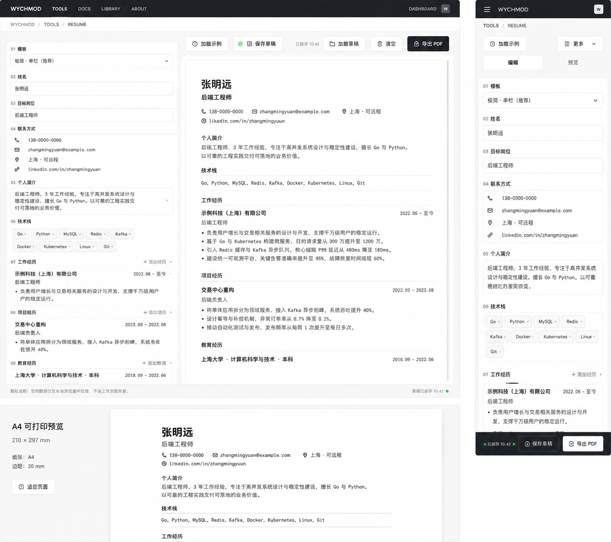

# Image 21：程序员简历制作工具 / Resume Builder



> 状态：可实施
> 对应提示词：P021
> 目标文件：`docs/tools/resume-builder.html`
> 内容真相来源：当前 `resume-builder.html` 的三模板选择、结构化表单、技能标签、动态工作/项目/教育条目、实时预览、示例数据、本地草稿 `resumeDraft`、加载/保存/清空和打印导出 PDF
> 实现边界：这是本地简历编辑与 A4 打印预览工具，不是云端求职平台；简历内容只应保存在当前浏览器，保存状态、示例数据、PDF 导出和隐私提示必须真实表达。

---

## 1. 给实现模型的任务入口

你要把 `docs/tools/resume-builder.html` 改造成参考图所示的程序员简历制作工具。页面核心是“左侧结构化填写，右侧 A4 简历实时预览”：表单像一份有编号的写作清单，预览像一张真正可打印的纸。整体要继承首页“Editorial / magazine：研究者的数字书房”的克制纸感，而不是当前旧紫蓝渐变、emoji 按钮和厚重卡片。

当前真实功能包括：

- 模板选择：`templateSelect`，值为：
  - `classic`
  - `modern`
  - `minimal`
- 基本信息字段：
  - `name`
  - `title`
  - `phone`
  - `email`
  - `location`
  - `website`
  - `github`
  - `summary`
- 技能分类：
  - `languages`
  - `frameworks`
  - `databases`
  - `tools`
- 动态列表：
  - `experienceList`
  - `projectList`
  - `educationList`
- 数据对象：`resumeData`。
- 当前模板：`currentTemplate`。
- 动态计数：
  - `experienceCounter`
  - `projectCounter`
  - `educationCounter`
- 预览：
  - `updatePreview()`
  - `collectListData(type)`
  - `renderPreview()`
  - `formatDescription(text)`
- 技能：
  - `handleSkillInput(event, category)`
  - `renderSkillTags(category)`
  - `removeSkill(category, index)`
- 条目：
  - `addExperience()`
  - `addProject()`
  - `addEducation()`
  - `removeItem(button)`
- 模板切换：`changeTemplate()`。
- 示例：`loadSampleData()`。
- 草稿：
  - `saveDraft()` 使用 key `resumeDraft`
  - `loadDraft()`
  - DOMContentLoaded 自动尝试读取 `resumeDraft`
  - `loadDataToForm()`
- 清空：`clearAll()`。
- 导出：`exportPDF()` 通过打印窗口 `window.print()`。
- toast：`showToast(message, type)`。

参考图里出现但当前视觉/交互未完整实现的能力：

- 顶部统一深色工具导航。
- 面包屑：`WYCHMOD / TOOLS / RESUME`。
- 桌面顶栏动作：加载示例、保存草稿、保存状态、加载草稿、清空、导出 PDF。
- 左侧编号表单 `01–09`。
- 中间 A4 页面预览，边距、纸张尺寸明确。
- 底部 A4 可打印预览说明。
- 移动端 `编辑 / 预览` tab。
- 移动端底部固定保存/导出栏。
- 真实保存状态：`已保存 10:42`。

这些能力可以新增或重排，但必须真实：

- `已保存 10:42` 只能在 `localStorage.setItem('resumeDraft', ...)` 成功后显示。
- `加载草稿` 只能读取 `resumeDraft`。
- `导出 PDF` 仍然是浏览器打印保存，不能假装服务端生成文件。
- `A4 可打印预览 210 × 297 mm` 必须对应实际 CSS 打印尺寸。

实现前必须完整阅读：

- `AGENTS.md`
- `docs/_meta/HOMEPAGE_DESIGN_AND_IMPLEMENTATION.md`
- `docs/tools/resume-builder.html`
- `docs/tools/index.html`
- `docs/assets/css/tools-notion.css`

禁止：

- 继续使用紫蓝渐变、emoji 图标、发光按钮。
- 发送简历内容到任何网络服务。
- 把用户个人信息写入 URL。
- 显示 AI 评分、ATS 通过率、岗位匹配度等未实现/未验证能力。
- 把示例姓名、电话、公司、业绩当成用户真实数据。
- 删除 `resumeDraft` key 或破坏现有草稿结构，除非写迁移。
- 在预览和打印中不转义用户输入。

---

## 2. 参考图视觉审计

### 2.1 桌面端画面结构

参考图桌面端约 `1440 × 900`。

1. 顶部导航：
   - 高约 `50–56px`。
   - 暖石墨黑背景。
   - 左侧 `WYCHMOD`。
   - 导航：`TOOLS / DOCS / LIBRARY / ABOUT`。
   - 右侧：`DASHBOARD` 与方形 `W`。
   - 实现时沿用项目工具页统一导航，保持深色和当前工具选中即可。
2. 面包屑：
   - `WYCHMOD / TOOLS / RESUME`。
   - 在浅纸灰条内，约 `46px` 高。
3. 顶部动作栏：
   - 位于主工作区上方。
   - 左/中：
     - `加载示例`
     - `保存草稿`
     - `已保存 10:42` 状态
     - `加载草稿`
     - `清空`
   - 右：
     - `导出 PDF` 深色主按钮。
4. 主工作区：
   - 左侧表单约 `39–40%` 宽。
   - 右侧预览约 `60–61%` 宽。
   - 高度接近一屏，左右各自滚动。
5. 左侧表单：
   - 白色/纸白背景。
   - 分段编号：
     - `01 模板`
     - `02 姓名`
     - `03 目标岗位`
     - `04 联系方式`
     - `05 个人简介`
     - `06 技术栈`
     - `07 工作经历`
     - `08 项目经历`
     - `09 教育经历`
   - 输入框为细线矩形，不是厚边框。
   - 技术栈为 chip，可添加/删除。
   - 动态列表条目右侧有 `+ 添加经历 / 项目 / 教育`。
6. 右侧预览：
   - 中间是一张白色 A4 纸。
   - 纸张有轻阴影和内边距。
   - 预览内容采用单栏极简模板：
     - 姓名大字。
     - 岗位。
     - 联系方式一行/两行。
     - 个人简介。
     - 技术栈。
     - 工作经历。
     - 项目经历。
     - 教育经历。
   - 右侧可有滚动条。
7. 主工作区底部：
   - 左下隐私提示：
     `隐私说明：您的数据仅在本地浏览器中处理，不会上传到服务器。`
   - 右下保存状态绿点：
     `草稿已保存 10:42`。
8. 下方 A4 打印预览：
   - 左侧说明卡：
     - `A4 可打印预览`
     - `210 × 297 mm`
     - `纸张：A4`
     - `边距：20 mm`
     - `适应页面`
   - 右侧较大的 A4 缩略预览。

### 2.2 移动端画面结构

参考图移动端约 `390 × 844`。

1. 顶部深色导航：
   - 左侧菜单。
   - 中间/左侧 `WYCHMOD`。
   - 右侧 `W`。
2. 面包屑：
   - `TOOLS / RESUME`。
3. 顶部动作：
   - `加载示例`。
   - `更多` 下拉，包含加载草稿、清空、模板说明等。
4. Tab：
   - `编辑`
   - `预览`
   - 编辑 tab 默认激活。
5. 编辑表单：
   - 单列。
   - 分段编号仍保留。
   - 联系方式在卡片内显示图标/字段。
   - 技能 chip 自动换行。
6. 底部固定栏：
   - 左：`已保存 10:42` + 绿点。
   - 中：`保存草稿`。
   - 右：`导出 PDF`。
   - 需要 safe-area padding，不能遮挡最后一个字段。

### 2.3 图中不能直接照搬的内容

不能直接照搬：

- `张明远`、`138-0000-0000`、`zhangmingyuan@example.com`、公司、项目和业绩数字作为真实内容。
- `已保存 10:42`，除非真实保存。
- `极简 · 单栏（推荐）`，除非和当前模板值映射清楚。

可以借鉴：

- 简历示例作为 `加载示例` 的数据。
- 编号表单结构。
- A4 纸张预览。
- 移动固定保存栏。

---

## 3. Design Specification

### 3.1 Purpose Statement

简历制作工具服务于正在整理职业经历的开发者：他们需要把项目、技能和经历快速组织成一份能打印、能投递、能继续修改的简历。页面要降低“从空白页开始”的压力，让用户一项一项填，不被模板和排版拖住。

这页的人文感来自尊重用户的职业叙事：简历不是炫技页面，而是把人的经历整理成清楚、诚实、有分量的文本。工具应像一位耐心的编辑，帮用户把内容装进纸面，而不是替用户编造价值。

### 3.2 Aesthetic Direction

唯一方向：**Editorial / magazine，研究者数字书房里的职业档案纸**。

视觉关键词：

- A4 纸
- 编号表单
- 本地草稿
- 职业档案
- 清楚、可信、可打印
- 少装饰、高可读

禁止方向：

- 花哨招聘平台
- AI 简历评分工具
- 蓝紫 SaaS 表单
- 卡通模板库
- 过度图表化技能雷达

### 3.3 Color Palette

继承首页和工具页：

| 语义 | 色值 | 用法 |
|---|---|---|
| 暖石墨 | `#0D100E` | 顶部导航、导出 PDF 主按钮 |
| 深墨 | `#151915` | 简历正文标题、表单 label |
| 品牌绿 | `#00C776` | 保存成功状态 |
| 纸白 | `#F4EFE5` | 页面背景 |
| 卡片纸 | `#FBF7EF` | 表单面板、工具栏 |
| A4 白 | `#FFFFFF` | 简历纸张 |
| 纸灰线 | `#DDD4C5` | 输入边框、分隔线 |
| 辅助灰 | `#77746C` | 帮助文案、时间 |
| 危险红 | `#B6473B` | 清空/删除 |
| 暖金 | `#B88A3B` | 少量编号/选中强调 |

规则：

- 简历预览内部保持黑白为主，少用品牌色。
- 表单状态可用绿/红，但不要像后台系统。
- 旧紫色/蓝色模板主色要收敛；特别是 `modern` 模板的蓝渐变需改成本站风格或保留但不作为默认。

### 3.4 Typography

继承首页字体系统：

- 工具外壳：项目正文/标题 token。
- 表单编号和 label：正文小字，大写/数字清楚。
- 简历预览：优先使用安全可打印字体栈，中文可读优先。
- A4 正文字号建议 `10.5–12px`，标题 `20–28px`。

尺寸建议：

| 区域 | 桌面端 | 移动端 |
|---|---:|---:|
| 顶部 nav | `13px` | `13px` |
| 表单 section label | `13–14px` | `13px` |
| 输入文字 | `14px` | `14px` |
| A4 姓名 | `28–32px` | 预览缩放 |
| A4 正文 | `12–13px` | 预览缩放 |
| 底部栏 | `12–13px` | `12px` |

### 3.5 Layout Strategy

桌面端：

```text
top nav
└─ breadcrumb
   └─ action bar
      └─ editor/preview split
         ├─ structured form 40%
         └─ A4 preview 60%
      └─ A4 print preview section
```

移动端：

```text
mobile nav
└─ breadcrumb
   └─ compact actions
      └─ tabs: edit / preview
         └─ active panel
      └─ fixed save/export bar
```

---

## 4. 页面内容蓝图

### 4.1 顶部动作栏

桌面动作顺序：

```text
加载示例 | 保存草稿 | 已保存 10:42 | 加载草稿 | 清空 | 导出 PDF
```

状态规则：

- 初始：`未保存`。
- 保存中：`保存中...`。
- 成功：`已保存 HH:mm`。
- 失败：`保存失败`。
- 读取草稿成功：`已加载草稿`。

实现：

- `saveDraft()` 成功后更新状态。
- `localStorage.setItem()` 放入 try/catch。
- 存储不可用或 quota 报错时显示失败。
- 状态文字不只靠绿点。

### 4.2 表单结构

把当前字段重排为编号表单，但保留 ID。

#### 01 模板

- 保留 `templateSelect`。
- 当前值不变：
  - `classic`
  - `modern`
  - `minimal`
- 可将显示文案调整为：
  - `经典 · 单栏`
  - `现代 · 强调栏`
  - `极简 · 单栏（推荐）`
- 不改变 value，避免草稿兼容问题。

#### 02 姓名

- `input#name`。
- label：`姓名`。

#### 03 目标岗位

- `input#title`。
- label：`目标岗位`。

#### 04 联系方式

字段：

- `phone`
- `email`
- `location`
- `website`
- `github`

参考图移动端将这些显示为带小图标的纵向列表。图标必须是 SVG/线性图标，不使用 emoji。

#### 05 个人简介

- `textarea#summary`。
- 高度桌面约 `88–120px`。
- 提示文案强调可量化和工程价值，但不要替用户编造。

#### 06 技术栈

当前四类技能可以在 UI 中合并为一组 chip，也可以保留四类。

若贴近参考图：

- 显示为一组技术栈 chips。
- 内部仍保存到当前四类结构，或明确迁移。

推荐不破坏数据结构：

- 外观上紧凑显示四类输入。
- 每个 chip 有删除按钮和可访问 label。

#### 07 工作经历

保留 `experienceList` 与 `addExperience()`。

每条经历字段：

- 公司。
- 职位。
- 开始时间。
- 结束时间。
- 描述。

参考图中描述是 bullet。当前 `formatDescription()` 支持 `-`、`*`、`•` 列表，需保留。

#### 08 项目经历

保留 `projectList` 与 `addProject()`。

每条项目字段：

- 项目名称。
- 角色。
- 开始/结束时间。
- 描述。
- 技术栈。
- GitHub。
- Demo。

#### 09 教育经历

保留 `educationList` 与 `addEducation()`。

字段：

- 学校。
- 学历。
- 专业。
- 开始/结束时间。

### 4.3 A4 预览

预览容器：

```html
<div class="a4-preview-shell">
  <div class="resume-template minimal" id="resumePreview"></div>
</div>
```

尺寸：

- 屏幕预览可按比例缩放。
- 打印 CSS 中使用：

```css
@page {
  size: A4;
  margin: 20mm;
}
```

纸张说明：

```text
A4 可打印预览
210 × 297 mm
纸张：A4
边距：20 mm
```

预览要求：

- 空字段不显示占位文本到正式导出中；编辑预览可显示浅色空态。
- 链接使用安全 URL。
- 技能过多时自动换行，不撑破 A4。
- 长 URL 截断显示但 href 保留安全原值。
- 多页内容打印时自然分页，不让标题单独落在页底。

### 4.4 示例数据

`loadSampleData()` 可以使用参考图风格数据，但必须明确为示例。

建议示例：

```text
张明远
后端工程师
138-0000-0000
zhangmingyuan@example.com
上海 · 可远程
linkedin.com/in/zhangmingyuan
```

注意：

- 当前源码用 `张三`、阿里/字节/清华等示例。可以保留，也可以替换。
- 示例公司与经历只作为模板演示，不得写“真实案例”。
- 示例不要自动加载，必须用户点击 `加载示例`。

### 4.5 本地草稿

保留 key：

```text
resumeDraft
```

建议扩展但兼容：

```js
{
  data: resumeData,
  template: currentTemplate,
  savedAt: "2026-07-28T10:42:00+08:00",
  version: 2
}
```

如果要扩展结构：

- `loadDraft()` 必须兼容旧结构，即直接就是 `resumeData` 的旧 JSON。
- 不要让老草稿丢失。

自动加载：

- 当前 DOMContentLoaded 自动尝试读取草稿。
- 可以保留，但 UI 要告诉用户：`已自动加载上次保存的本地草稿`。
- 如果解析失败，显示可操作错误，不只 `console.error`。

清空：

- 参考图 `清空` 应清空：
  - 表单。
  - `resumeData`。
  - 预览。
  - 动态计数。
  - 技能标签。
  - 本地草稿 `resumeDraft`。
- 必须 confirm。
- 如果用户取消，不改任何数据。

### 4.6 PDF 导出

当前 `exportPDF()` 是打印窗口，不是真正直接生成 PDF 文件。UI 文案应明确：

```text
导出 PDF
```

点击后 toast：

```text
已打开打印窗口，请选择“保存为 PDF”。
```

如果弹窗被拦截：

```text
打印窗口被浏览器拦截，请允许弹窗后重试。
```

打印窗口要求：

- 不包含编辑器和按钮。
- 只包含 `resumePreview`。
- 使用安全 HTML。
- `title` 中的姓名要转义。
- 打印样式不能把姓名/标题设置成 `#fbfaf8` 导致白底不可读。

### 4.7 安全渲染要求

当前 `renderPreview()` 和 `formatDescription()` 直接拼接用户输入到 `innerHTML`，存在 XSS 风险。

必须修复：

- 对所有用户输入调用 `escapeHtml()`。
- 链接 URL 使用 `sanitizeUrl()`。
- 预览链接加 `rel="noopener noreferrer"`。
- 技能标签渲染不能把 skill 直接拼进 HTML。
- 动态条目名称、描述、技术栈都必须转义。
- 打印窗口使用同一份安全 HTML。

最低实现：

```js
function escapeHtml(text) {}
function sanitizeUrl(url) {}
```

更好实现：

- 使用 DOM API 创建节点并设置 `textContent`。
- 只有安全换行和列表由程序生成 HTML。

---

## 5. 视觉实现细节

### 5.1 CSS 作用域

建议：

```html
<body class="tool-page resume-builder-page">
```

核心类：

```text
.resume-builder-page
.tool-topbar
.resume-breadcrumb
.resume-action-bar
.resume-save-status
.resume-workspace
.resume-form-panel
.resume-form-section
.section-index
.resume-preview-panel
.a4-preview-shell
.resume-template
.print-preview-section
.mobile-resume-tabs
.mobile-save-bar
```

### 5.2 尺寸与间距

| 元素 | 桌面端 | 移动端 |
|---|---:|---:|
| top nav | `50–56px` | `52–56px` |
| breadcrumb | `42–48px` | `40px` |
| action bar | `58–66px` | compact |
| workspace height | `calc(100vh - 150px)` | auto |
| form panel width | `39–40%` | `100%` |
| preview panel width | `60–61%` | `100%` |
| form padding | `22–28px` | `16px` |
| input height | `40–44px` | `42–46px` |
| A4 preview | ratio `210:297` | scale-to-width |
| mobile fixed bar | `64–72px` | safe-area aware |

### 5.3 表单质感

- 表单 section 之间用细线，不用厚卡片嵌套。
- 编号 `01/02/03` 小而清晰。
- label 位置固定在输入上方。
- 必填字段用文字或小星号，不只靠颜色。
- chip 使用浅灰边框和可点击删除。

### 5.4 预览质感

- A4 纸背景纯白。
- 外层背景为淡纸灰。
- 阴影极轻，模拟纸张悬浮。
- 预览文字不要继承工具页花色。
- 打印样式和屏幕预览尽量一致。

### 5.5 移动端

- 编辑/预览 tab 顶部 sticky。
- 底部固定栏必须加：

```css
padding-bottom: calc(72px + env(safe-area-inset-bottom));
```

- 表单最后一项不能被遮挡。
- 预览 tab 中 A4 可以缩放，不要求用户横向拖动。

### 5.6 可访问性

- 所有输入有 `<label for="">`。
- 动态删除按钮有 `aria-label="删除工作经历"` 等。
- 保存状态 `aria-live="polite"`。
- toast `aria-live="polite"`。
- tabs 使用标准 ARIA。
- 导出/清空按钮有明确文字。

---

## 6. 功能实现契约

### 6.1 必须保留或等价保留

- `resumeData` 结构。
- `currentTemplate`。
- `experienceCounter`、`projectCounter`、`educationCounter`。
- `updatePreview()`
- `collectListData(type)`
- `renderPreview()`
- `formatDescription(text)`
- `handleSkillInput(event, category)`
- `renderSkillTags(category)`
- `removeSkill(category, index)`
- `addExperience()`
- `addProject()`
- `addEducation()`
- `removeItem(button)`
- `changeTemplate()`
- `loadSampleData()`
- `saveDraft()`
- `loadDraft()`
- `loadDataToForm()`
- `clearAll()`
- `exportPDF()`
- `showToast(message, type)`

### 6.2 建议新增函数

```js
escapeHtml(text)
sanitizeUrl(url)
safeText(text)
renderSafeLink(url, label)
setSaveStatus(status, detail)
getCurrentTimeLabel()
safeSetDraft(payload)
safeGetDraft()
removeDraft()
setMobileResumeTab(tabName)
updatePrintPreviewMeta()
serializeDraft()
deserializeDraft(raw)
migrateDraftIfNeeded(draft)
```

### 6.3 当前旧问题要顺手修复

当前 `resume-builder.html` 中的问题：

- 旧紫蓝视觉与首页冲突。
- 标题和按钮使用 emoji。
- `renderPreview()` 拼接用户输入到 `innerHTML`。
- `renderSkillTags()` 拼接 skill 到 `innerHTML`。
- `formatDescription()` 直接拼列表项。
- 打印窗口把 `resumePreview.outerHTML` 写入新文档，若预览不安全，打印也不安全。
- `saveDraft()` 没有 try/catch。
- `loadDraft()` 对损坏 JSON 只有 toast，自动加载时只 `console.error`。
- `clearAll()` 当前没有删除 `localStorage.resumeDraft`。
- 打印样式中部分模板把姓名/标题设为 `#fbfaf8`，在白底上可能不可读。
- 旧 `modern` 模板蓝渐变不符合首页风格。

---

## 7. 可直接复制给实现模型的指令

```text
请改造 `docs/tools/resume-builder.html`，目标是复现 `docs/_meta/ui-redesign/references/image-21.png` 的程序员简历制作工具，并与首页 V2 的 Editorial / magazine「研究者的数字书房」风格一致。

你必须先阅读：
1. `AGENTS.md`
2. `docs/_meta/HOMEPAGE_DESIGN_AND_IMPLEMENTATION.md`
3. `docs/tools/resume-builder.html`
4. `docs/tools/index.html`
5. `docs/assets/css/tools-notion.css`

页面目标：
- 顶部使用统一深色工具导航。
- 面包屑：`WYCHMOD / TOOLS / RESUME`。
- 桌面端：左侧编号表单，右侧 A4 实时预览，下方 A4 可打印预览说明。
- 移动端：编辑/预览 tab，底部固定保存/导出栏。

必须保留当前功能和数据：
- 模板值：classic、modern、minimal。
- 字段 ID：name、title、phone、email、location、website、github、summary。
- 技能结构：languages、frameworks、databases、tools。
- 动态列表：experienceList、projectList、educationList。
- 草稿 key：resumeDraft。
- updatePreview、collectListData、renderPreview、技能增删、动态条目增删、loadSampleData、saveDraft、loadDraft、clearAll、exportPDF。

视觉要求：
- 删除紫蓝渐变和 emoji 图标。
- 使用暖石墨 `#0D100E`、纸白 `#F4EFE5`、卡片纸 `#FBF7EF`、A4 白 `#FFFFFF`、纸灰线 `#DDD4C5`、品牌绿 `#00C776`。
- 表单 section 使用编号：01 模板、02 姓名、03 目标岗位、04 联系方式、05 个人简介、06 技术栈、07 工作经历、08 项目经历、09 教育经历。
- A4 预览使用 210:297 比例，打印 CSS 使用 A4 和 20mm 边距。
- 导出 PDF 为深色主按钮。

保存与隐私：
- 保存状态必须真实：只有 localStorage 写入成功后显示 `已保存 HH:mm`。
- saveDraft 用 try/catch，存储失败显示失败状态。
- loadDraft 兼容旧 resumeDraft 结构；损坏 JSON 给出错误。
- clearAll 确认后清空表单、resumeData、动态计数、预览、技能标签，并删除 localStorage.resumeDraft。
- 明确显示隐私说明：所有数据仅在当前浏览器本地处理，不上传服务器。

安全要求：
- 修复当前 renderPreview / renderSkillTags / formatDescription 的 innerHTML 注入风险。
- 所有用户输入必须 escapeHtml 或用 textContent。
- URL 字段必须 sanitizeUrl，只允许 http/https 或安全相对 URL。
- 预览链接加 rel="noopener noreferrer"。
- 打印窗口使用同一份安全 HTML。

导出要求：
- exportPDF 仍使用浏览器打印窗口。
- 如果弹窗被拦截，提示用户允许弹窗。
- Toast 文案写：`已打开打印窗口，请选择“保存为 PDF”。`
- 打印页不能包含工具栏、表单、按钮。
- 中文、长 URL、多页经历、技能换行都要可读。

移动端：
- 编辑/预览 tab 切换不丢输入。
- 底部固定栏显示保存状态、保存草稿、导出 PDF。
- 使用 safe-area padding，不能遮住最后一个字段。

验收：
- 加载示例后预览更新。
- 保存草稿后刷新可加载。
- 清空确认后草稿也被删除。
- 三个模板都能预览和打印。
- 输入 `<script>alert(1)</script>` 不会在预览或打印中执行。
- 导出前至少填写姓名；未填写时给出错误。
- 手机 390px 无横向滚动。
- 控制台无新增 error。
- 不修改 `docs/md/archive/`。
```

---

## 8. 验证清单

### 8.1 视觉验证

- 桌面 `1440 × 900`：左表单右 A4 预览，动作栏与参考图接近。
- 桌面 `1280 × 800`：表单和预览各自可滚，A4 不挤压变形。
- 平板 `768 × 1024`：可切换为上下或 tab，无横向滚动。
- 手机 `390 × 844`：编辑/预览 tab 和底部栏可用。
- 手机 `360 × 800`：底部栏不遮挡最后一个输入。

### 8.2 表单与预览验证

- 基本信息实时更新。
- 联系方式空字段不显示。
- 技能添加、去重、删除。
- 工作经历添加/删除多条。
- 项目经历添加/删除多条，链接安全。
- 教育经历添加/删除多条。
- 描述支持 bullet 列表。
- 长中文和长 URL 不撑破预览。

### 8.3 草稿验证

- 无草稿时加载提示。
- 保存成功显示真实时间。
- 刷新后自动加载或手动加载成功。
- 损坏 JSON 显示错误，不崩溃。
- localStorage 禁用/配额不足时保存失败提示。
- 清空确认后删除草稿。
- 清空取消后内容不变。

### 8.4 安全验证

- 姓名输入 `<script>alert(1)</script>` 不执行。
- 描述输入 `` 不执行。
- skill 输入 HTML 不执行。
- GitHub/website 输入 `javascript:alert(1)` 不生成危险链接。
- 打印窗口也不执行恶意内容。

### 8.5 PDF/打印验证

- 未填写姓名时阻止导出。
- 弹窗正常打开后触发打印。
- 弹窗被拦截时有提示。
- A4 边距为 20mm。
- 多页经历分页自然。
- 打印页无工具栏和按钮。
- 三个模板打印都可读，不出现浅色文字在白底不可读。

### 8.6 工程验证

- 所有输入有 label。
- 保存状态 aria-live。
- 动态删除按钮有 aria-label。
- `git diff --check` 通过。
- 控制台无新增 error。
- 不引入远程依赖。
- 不修改首页运行文件，除非共享工具壳样式必要。
- 不修改 `docs/md/archive/`。

---

## 9. 实施风险提示

- 简历页面处理大量个人信息，隐私提示必须显眼且准确。
- 当前预览渲染方式有 XSS 风险，安全修复应优先于视觉。
- 如果扩展 `resumeDraft` 结构，必须兼容旧草稿。
- 浏览器打印和 PDF 保存行为不可完全控制，UI 文案不要承诺“一键生成文件”。
- A4 预览屏幕缩放与打印尺寸不是同一件事，需要分别处理。
- 移动端固定栏和软键盘容易遮挡输入，必须实机/浏览器尺寸检查。
