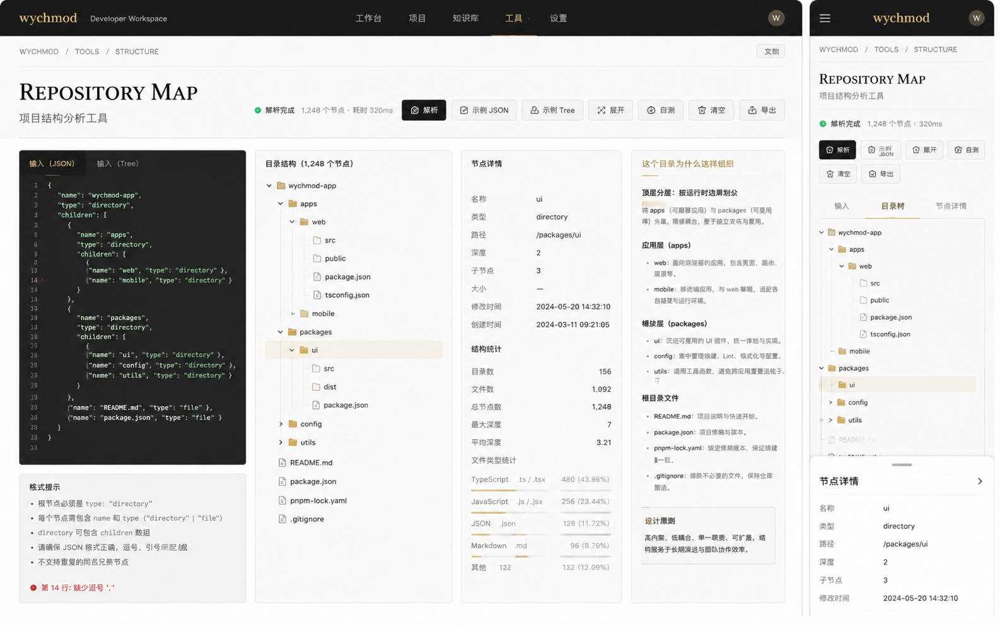

# Image 22：项目结构分析工具 / Repository Map



> 状态：可实施
> 对应提示词：P022
> 目标文件：`docs/tools/structure-tool.html`
> 内容真相来源：当前 `structure-tool.html` 的 JSON/Tree 输入、示例加载、解析、树渲染、展开/收起、统计、导出 JSON、自测和 toast
> 实现边界：这是粘贴文本后的项目结构可视化工具，不读取本地磁盘、不扫描仓库、不上传文件；节点数、语言统计、节点详情和结构解释必须来自当前解析结果。

---

## 1. 给实现模型的任务入口

你要把 `docs/tools/structure-tool.html` 改造成参考图所示的 “REPOSITORY MAP / 项目结构分析工具”。页面应像一张仓库地图：左侧输入 JSON 或 tree 文本，中间展开目录结构，右侧查看节点详情和结构统计，再用一栏解释“这种结构为什么合理”。它要继承首页“Editorial / magazine：研究者的数字书房”的气质，避免当前旧紫蓝、emoji、双栏简单树的工具页外观。

当前真实功能包括：

- 输入：`textarea#input`。
- 状态：`span#status`。
- 输出：`div#treeView`。
- 统计：
  - `dirCount`
  - `fileCount`
  - `maxDepth`
  - `parseTime`
- 示例：
  - `examples.json`
  - `examples.tree`
- 当前数据：`currentData`。
- `loadExample(type)`。
- `clearAll()`。
- `parseInput()`。
- `parseTreeString(str)`。
- `renderTree(data)`。
- `createTreeNode(node, name, isRoot)`。
- `updateStats(data, startTime)`。
- `expandAll()`。
- `collapseAll()`。
- `exportJSON()`。
- `showMessage(message, type)`。
- `runSelfTest()`。

参考图里出现但当前未完整实现的能力：

- 四栏布局：输入、目录树、节点详情、结构解释。
- 支持 `{ name, type, children }` 的节点 JSON。
- 节点详情：名称、类型、路径、深度、子节点、修改时间、创建时间。
- 结构统计：目录数、文件数、总节点数、最大深度、平均深度、文件类型统计。
- 状态：`解析完成 1,248 个节点 · 耗时 320ms`。
- 移动端 `输入 / 目录树 / 节点详情` tab 和底部详情 sheet。
- `文档` 按钮。

这些能力可以新增，但必须真实：

- 节点数必须由解析结果计算。
- 文件类型统计必须由文件扩展名计算。
- 节点详情必须来自点击节点的真实数据。
- 结构解释只能是基于目录名的启发式说明，不要写成作者确认的架构设计结论。

实现前必须完整阅读：

- `AGENTS.md`
- `docs/_meta/HOMEPAGE_DESIGN_AND_IMPLEMENTATION.md`
- `docs/tools/structure-tool.html`
- `docs/tools/index.html`
- `docs/assets/css/tools-notion.css`

禁止：

- 继续使用旧紫蓝渐变、emoji 图标和发光按钮。
- 添加“选择本地文件夹 / 扫描仓库 / 读取磁盘”入口。
- 把参考图中的 `1,248 个节点`、语言比例、时间戳硬编码。
- 把启发式结构解释当成项目事实。
- 删除 JSON/Tree 两种输入。
- 删除自测和导出 JSON。
- 在节点名称中执行 HTML。

---

## 2. 参考图视觉审计

### 2.1 桌面端画面结构

参考图桌面端约 `1440 × 900`。

1. 顶部导航：
   - 高约 `62px`。
   - 暖石墨黑背景。
   - 左侧 `wychmod` 金色字标 + `Developer Workspace`。
   - 导航：`工作台 / 项目 / 知识库 / 工具 / 设置`，`工具` 选中。
   - 右侧圆形 `W`。
   - 实现时沿用工具页统一导航即可，但要保持深色和当前工具选中。
2. 面包屑：
   - `WYCHMOD / TOOLS / STRUCTURE`。
   - 右侧 `文档` 按钮。
3. 标题区：
   - H1：`REPOSITORY MAP`。
   - 副标题：`项目结构分析工具`。
   - 右侧状态：绿色点 + `解析完成 1,248 个节点 · 耗时 320ms`。
   - 状态必须由解析真实结果更新。
4. 操作按钮：
   - `解析` 深色主按钮。
   - `示例 JSON`。
   - `示例 Tree`。
   - `展开`。
   - `自测`。
   - `清空`。
   - `导出`。
5. 四栏主体：
   - 左栏：深色输入编辑器。
   - 中栏：目录结构树。
   - 右中栏：节点详情 + 统计。
   - 右栏：结构解释。
6. 左栏输入：
   - Tab：`输入（JSON）`、`输入（Tree）`。
   - 深色代码区，有行号。
   - 下方 `格式提示` 面板。
   - 错误时底部显示具体错误，例如 `第 14 行：缺少逗号`。
7. 目录结构：
   - 标题：`目录结构（1,248 个节点）`。
   - 树形节点，有文件夹/文件线性图标。
   - 选中节点背景浅米色。
8. 节点详情：
   - 标题：`节点详情`。
   - 字段：
     - 名称。
     - 类型。
     - 路径。
     - 深度。
     - 子节点。
     - 大小。
     - 修改时间。
     - 创建时间。
   - 下方 `结构统计` 与文件类型统计条。
9. 结构解释：
   - 标题：`这个目录为什么会这样组织`。
   - 内容围绕 `apps`、`packages`、根目录文件等目录名做启发式说明。
   - 底部 `设计原则` 小卡。

### 2.2 移动端画面结构

参考图移动端约 `390 × 844`。

1. 顶部导航：
   - 左侧菜单。
   - 中间 `wychmod`。
   - 右侧 `W`。
2. 面包屑：`WYCHMOD / TOOLS / STRUCTURE`。
3. 标题：
   - `REPOSITORY MAP`
   - `项目结构分析工具`
4. 状态：
   - 绿色点 + `解析完成 1,248 个节点 · 320ms`。
5. 操作按钮：
   - 两行网格。
   - `解析`、`示例 JSON`、`展开`、`自测`、`清空`、`导出`。
6. Tab：
   - `输入`
   - `目录树`
   - `节点详情`
7. 目录树 tab：
   - 树可纵向滚动。
   - 点击节点后底部出现 `节点详情` sheet。
8. 底部详情 sheet：
   - 有拖拽柄。
   - 标题 `节点详情`。
   - 右侧箭头或关闭。
   - 显示名称、类型、路径、深度、子节点、修改时间。

### 2.3 图中不能直接照搬的内容

不能直接照搬：

- `1,248 个节点`。
- `耗时 320ms`。
- `TypeScript 480 (43.96%)` 等语言统计。
- `2024-05-20 14:32:10` 时间戳。
- 对 `apps/packages` 的解释，除非当前解析结构中真的存在这些目录。

可以借鉴：

- `wychmod-app` 示例。
- 单栏输入 + 目录树 + 详情 + 解释四栏。
- 移动底部详情 sheet。
- 节点高亮与统计条。

---

## 3. Design Specification

### 3.1 Purpose Statement

项目结构分析工具服务于阅读陌生仓库、整理项目结构、写架构说明的人：他们常常只有一段 tree 输出或 JSON 描述，需要快速看清目录层级、文件分布和关键节点。页面要把“散落的路径文本”变成可点击、可解释、可导出的仓库地图。

这页的人文感来自“帮用户进入一个项目”：目录结构不是冷冰冰的树，而是项目如何被组织、职责如何被划分的痕迹。工具要给出清晰视图，同时诚实标注哪些解释只是启发式猜测。

### 3.2 Aesthetic Direction

唯一方向：**Editorial / magazine，研究者数字书房里的仓库地图**。

视觉关键词：

- 仓库地图
- 节点档案
- 结构解释
- 深色输入
- 纸白目录
- 可追溯统计
- 克制、工程化、耐读

禁止方向：

- 文件管理器克隆
- IDE 项目树克隆
- 云端仓库扫描器
- 彩色图谱玩具
- 只展示 JSON 的调试页

### 3.3 Color Palette

| 语义 | 色值 | 用法 |
|---|---|---|
| 暖石墨 | `#0D100E` | 顶部导航、主按钮 |
| 输入深墨 | `#171917` | 输入编辑器背景 |
| 输入文字 | `#DDE8DD` | JSON/Tree 文本 |
| 暖金 | `#B88A3B` | 工具选中、目录说明强调 |
| 品牌绿 | `#00C776` | 解析成功、状态点 |
| 纸白 | `#F4EFE5` | 页面背景 |
| 卡片纸 | `#FBF7EF` | 目录树、详情、解释栏 |
| 选中米色 | `#EFE4CF` | 选中节点背景 |
| 纸灰线 | `#DDD4C5` | 边框、分隔线 |
| 辅助灰 | `#77746C` | label、说明 |
| 错误红 | `#B6473B` | 解析错误 |

规则：

- 输入区可以深色，结果区回到纸白。
- 树选中用浅米色，不用蓝色。
- 状态绿仅用于成功，不泛滥。

### 3.4 Typography

继承首页字体系统：

- `REPOSITORY MAP` 使用首页衬线标题体系。
- 输入区、路径、统计数字使用等宽字体。
- 说明面板使用正文排版，像项目评审笔记。

尺寸建议：

| 区域 | 桌面端 | 移动端 |
|---|---:|---:|
| H1 | `40–46px` | `26–30px` |
| 副标题 | `20–22px` | `16px` |
| 输入代码 | `13–14px` | `12px` |
| 树节点 | `14px` | `13px` |
| 详情字段 | `13–14px` | `13px` |
| 解释正文 | `14px` | `13px` |

### 3.5 Layout Strategy

桌面端：

```text
top nav
└─ breadcrumb + docs button
   └─ hero + status + actions
      └─ repository grid
         ├─ input/code column 30%
         ├─ tree column 26%
         ├─ node detail/stats 21%
         └─ explanation 23%
```

中等宽度：

```text
input + tree
detail + explanation
```

移动端：

```text
mobile nav
└─ hero + status
   └─ action grid
      └─ tabs input/tree/detail
         └─ bottom detail sheet on node click
```

---

## 4. 数据模型与解析要求

### 4.1 统一节点模型

当前代码直接把对象 key 当节点。参考图需要节点详情，所以必须先归一化为统一模型：

```js
{
  id: "stable path or generated id",
  name: "ui",
  type: "directory" | "file",
  path: "/packages/ui",
  depth: 2,
  children: [],
  size: null,
  modifiedAt: "2024-05-20 14:32:10",
  createdAt: "2024-03-11 09:21:05",
  extension: ".ts"
}
```

`currentData` 可以保留原始解析数据，但渲染建议使用：

```js
let currentTree = null;
let selectedNode = null;
let currentStats = null;
```

### 4.2 支持的 JSON 输入格式

必须同时支持两类：

#### 4.2.1 参考图节点格式

```json
{
  "name": "wychmod-app",
  "type": "directory",
  "children": [
    {
      "name": "apps",
      "type": "directory",
      "children": []
    }
  ]
}
```

字段：

- `name` 必须。
- `type` 可选，缺省按 `children` 判断。
- `children` 可选，缺省空数组。
- `size/modifiedAt/createdAt` 可选。

#### 4.2.2 当前旧嵌套对象格式

```json
{
  "project": {
    "src": {
      "App.js": {}
    },
    "README.md": {}
  }
}
```

规则：

- 有子 key 的对象视为 directory。
- 空对象默认视为 file。
- 如果需要表达空目录，可支持 `{ "type": "directory", "children": [] }`。

### 4.3 Tree 文本解析

继续支持：

```text
project
├── src
│   ├── components
│   │   └── Button.js
└── README.md
```

要求：

- 支持 `├──`、`└──`、`│`。
- 支持空格缩进。
- 根据后续更深层级判断目录；没有子节点且名称有扩展名时视为 file。
- 不确定时可视为 directory，但说明规则。
- 混合缩进出现问题时显示解析提示。

### 4.4 统计模型

计算：

- `directoryCount`
- `fileCount`
- `totalNodes`
- `maxDepth`
- `averageDepth`
- `parseTime`
- `extensionStats`

文件类型统计：

- `.ts` / `.tsx` → `TypeScript`
- `.js` / `.jsx` → `JavaScript`
- `.json` → `JSON`
- `.md` / `.mdx` → `Markdown`
- 其他 → `其他`

百分比：

```js
count / fileCount * 100
```

如果没有文件或无法识别扩展名，显示空状态，不写假比例。

### 4.5 节点详情

点击树节点后更新：

```text
名称      ui
类型      directory
路径      /packages/ui
深度      2
子节点    3
大小      —
修改时间  2024-05-20 14:32:10
创建时间  2024-03-11 09:21:05
```

字段缺失显示 `—`。

移动端点击节点后打开 bottom sheet，显示同样内容。

### 4.6 结构解释

结构解释是启发式，不是事实确认。

可基于目录名生成：

- 有 `apps`：
  - 可能是应用层，放不同应用入口。
- 有 `packages`：
  - 可能是共享包层，放 UI、config、utils 等可复用模块。
- 有 `src`：
  - 源码目录。
- 有 `public`：
  - 静态资源目录。
- 有 `README.md`：
  - 项目说明入口。
- 有 `package.json`：
  - Node 项目元数据与脚本。
- 有 `pnpm-lock.yaml`：
  - 依赖锁定文件。

必须使用措辞：

```text
根据目录命名推测
通常表示
可能用于
```

不要写：

```text
这个项目就是...
作者这样设计是为了...
```

---

## 5. 视觉实现细节

### 5.1 CSS 作用域

建议：

```html
<body class="tool-page repository-map-page">
```

核心类：

```text
.repository-map-page
.tool-topbar
.structure-breadcrumb
.repository-hero
.structure-status
.structure-actions
.repository-grid
.structure-input-panel
.input-tabs
.code-editor-shell
.format-hints
.tree-panel
.repository-tree
.tree-row
.tree-row.is-selected
.node-detail-panel
.structure-stats
.extension-bars
.structure-explanation
.mobile-structure-tabs
.node-detail-sheet
```

### 5.2 尺寸与间距

| 元素 | 桌面端 | 移动端 |
|---|---:|---:|
| top nav | `62px` | `56px` |
| 页面 padding | `34–38px` | `16px` |
| H1 | `42px` | `28px` |
| action button | `40px` 高 | `38px` |
| grid gap | `16px` | `12px` |
| 输入/树高度 | `650–720px` | `520px` |
| 树行高 | `30–34px` | `32px` |
| detail sheet | - | `40–65vh` |

### 5.3 树节点细节

- 展开箭头独立于节点图标。
- 文件夹/文件图标使用 SVG 或 CSS 图标，不使用 emoji。
- 节点可点击区域至少 `32px` 高。
- 选中态为浅米色背景。
- 路径过长时中间省略，但 tooltip/title 可看完整路径。

### 5.4 输入区细节

- 深色背景。
- 行号列可选；如果显示，需同步行数。
- 错误行可在底部提示，不强行做编辑器内标红。
- JSON/Tree tab 切换只改变示例和提示，不丢输入。

### 5.5 移动详情 sheet

要求：

- 点击节点打开。
- 有关闭按钮。
- 背景不必遮罩全屏，但 sheet 内部可滚动。
- 焦点进入 sheet；关闭后返回点击节点。
- `Esc` 关闭（如果键盘可用）。

### 5.6 可访问性

- 树可用 `<button>` 节点或 `role="tree"`；若使用 `role="tree"`，需基本键盘支持。
- 更简单：每个节点用 button，children 用嵌套列表。
- 状态 `aria-live="polite"`。
- 解析错误和输入框关联。
- 导出/清空/自测按钮有明确文字。

---

## 6. 功能实现契约

### 6.1 必须保留或等价保留

- `examples`。
- `currentData`。
- `loadExample(type)`。
- `clearAll()`。
- `parseInput()`。
- `parseTreeString(str)`。
- `renderTree(data)`。
- `createTreeNode(...)` 或等价树节点渲染。
- `updateStats(data, startTime)`。
- `expandAll()`。
- `collapseAll()`。
- `exportJSON()`。
- `showMessage(message, type)`。
- `runSelfTest()`。

### 6.2 建议新增函数

```js
normalizeJsonStructure(data)
normalizeNamedNode(node, parentPath, depth)
normalizeLegacyObject(obj, name, parentPath, depth)
normalizeTreeText(treeText)
inferNodeType(name, children)
buildNodePath(parentPath, name)
flattenNodes(root)
computeStructureStats(root, parseTime)
computeExtensionStats(nodes)
selectNode(nodeId)
renderNodeDetail(node)
renderStructureExplanation(root, stats)
renderFormatHints(mode, error)
setInputMode(mode)
setMobileStructureTab(tabName)
openNodeDetailSheet(node)
closeNodeDetailSheet()
downloadJson(data)
```

### 6.3 示例数据建议

示例 JSON 可改成参考图风格：

```json
{
  "name": "wychmod-app",
  "type": "directory",
  "children": [
    {
      "name": "apps",
      "type": "directory",
      "children": [
        {
          "name": "web",
          "type": "directory",
          "children": [
            { "name": "src", "type": "directory", "children": [] },
            { "name": "public", "type": "directory", "children": [] },
            { "name": "package.json", "type": "file" },
            { "name": "tsconfig.json", "type": "file" }
          ]
        },
        { "name": "mobile", "type": "directory", "children": [] }
      ]
    },
    {
      "name": "packages",
      "type": "directory",
      "children": [
        { "name": "ui", "type": "directory", "children": [
          { "name": "src", "type": "directory", "children": [] },
          { "name": "dist", "type": "directory", "children": [] },
          { "name": "package.json", "type": "file" }
        ]},
        { "name": "config", "type": "directory", "children": [] },
        { "name": "utils", "type": "directory", "children": [] }
      ]
    },
    { "name": "README.md", "type": "file" },
    { "name": "package.json", "type": "file" },
    { "name": "pnpm-lock.yaml", "type": "file" },
    { "name": ".gitignore", "type": "file" }
  ]
}
```

注意：

- 这个示例只用于演示，不是当前项目真实文件树。
- UI 文案要写“示例 JSON”。

### 6.4 当前旧问题要顺手修复

当前 `structure-tool.html` 中的问题：

- 旧紫蓝视觉与首页冲突。
- 标题、按钮、树图标使用 emoji。
- 只支持两栏，信息层级不足。
- JSON 解析只看 `input.startsWith('{')`，不支持数组或前置空白后的其他合法 JSON。
- 当前 JSON 对 `{ name, type, children }` 节点格式支持不足。
- 文件/目录判断用 `Object.keys(node).length > 0`，空目录无法表达。
- `parseTreeString()` 层级推断较粗，需要明确限制。
- 当前没有节点详情。
- 当前没有总节点、平均深度、文件类型统计。
- `expandAll/collapseAll` 只改 class，图标状态可能不同步。
- `exportJSON()` 未 `appendChild(a)`，部分浏览器可能下载不稳定；下载后应 cleanup。

---

## 7. 可直接复制给实现模型的指令

```text
请改造 `docs/tools/structure-tool.html`，目标是复现 `docs/_meta/ui-redesign/references/image-22.png` 的 “REPOSITORY MAP / 项目结构分析工具”，并与首页 V2 的 Editorial / magazine「研究者的数字书房」风格一致。

你必须先阅读：
1. `AGENTS.md`
2. `docs/_meta/HOMEPAGE_DESIGN_AND_IMPLEMENTATION.md`
3. `docs/tools/structure-tool.html`
4. `docs/tools/index.html`
5. `docs/assets/css/tools-notion.css`

页面目标：
- 顶部有统一深色导航和面包屑：`WYCHMOD / TOOLS / STRUCTURE`。
- 标题为 `REPOSITORY MAP`，副标题为 `项目结构分析工具`。
- 桌面端四栏：深色输入、目录树、节点详情/统计、结构解释。
- 移动端 tabs：输入、目录树、节点详情；点击节点出现底部详情 sheet。

必须保留当前功能：
- JSON 输入和 Tree 文本输入。
- parseInput、parseTreeString、renderTree、updateStats、expandAll、collapseAll、exportJSON、runSelfTest、clearAll、showMessage。
- 示例 JSON、示例 Tree、自测、导出 JSON。

新增能力必须真实实现：
- 统一节点模型：name/type/path/depth/children/size/modifiedAt/createdAt/extension。
- 同时支持 `{ name, type, children }` 节点 JSON 和当前旧嵌套对象 JSON。
- 节点详情来自当前选中节点。
- 统计来自当前解析树：目录数、文件数、总节点数、最大深度、平均深度、文件类型统计。
- 状态文案真实显示节点数和解析耗时。
- 结构解释是启发式，使用“根据目录命名推测/通常/可能”，不要写成项目事实。

视觉要求：
- 使用暖石墨 `#0D100E`、输入深墨 `#171917`、纸白 `#F4EFE5`、卡片纸 `#FBF7EF`、选中米色 `#EFE4CF`、品牌绿 `#00C776`、暖金 `#B88A3B`。
- 删除紫色、蓝色渐变、emoji 图标。
- 树节点用 SVG/线性文件夹图标，选中节点浅米色背景。
- 深色输入区像代码编辑器，结果区像纸白项目地图。

安全与边界：
- 不添加本地文件夹选择、磁盘扫描、上传或远程仓库读取。
- 节点名称用 textContent 渲染，不能执行 HTML。
- 导出 JSON 导出当前规范化树或原始数据，选择一种并在按钮说明中写清楚。
- 解析错误要显示可恢复提示。

验收：
- 示例 JSON 解析后显示目录树、节点详情、统计。
- 示例 Tree 解析后显示等价树。
- 点击 `packages/ui` 之类节点，详情更新路径、深度、子节点。
- 展开/收起全部后图标和内容同步。
- 文件类型统计随文件扩展名变化。
- 恶意节点名 `` 不执行。
- 移动端 390px tab 和 bottom sheet 可用。
- 导出 JSON 后重新导入可得到可渲染结构。
- 不修改 `docs/md/archive/`。
```

---

## 8. 验证清单

### 8.1 视觉验证

- 桌面 `1440 × 900`：四栏接近参考图，输入深色，结果纸白。
- 桌面 `1280 × 800`：四栏不压成不可读；必要时转两行。
- 平板 `768 × 1024`：tabs 或两列布局可用。
- 手机 `390 × 844`：操作按钮两行、tabs、节点详情 sheet 正常。
- 手机 `360 × 800`：树可滚动，无横向页面滚动。

### 8.2 解析验证

- 参考节点 JSON。
- 当前旧嵌套对象 JSON。
- Tree 命令输出。
- 缩进文本。
- 空输入。
- 非法 JSON。
- 混合缩进 tree。
- 空目录 `{ "type": "directory", "children": [] }`。
- 空文件 `{}` 在旧格式下的规则明确。

### 8.3 统计验证

- 目录数正确。
- 文件数正确。
- 总节点数正确。
- 最大深度正确。
- 平均深度合理。
- extensionStats 百分比合计合理。
- 解析耗时随解析更新，不硬编码。

### 8.4 节点交互验证

- 点击节点选中。
- 详情更新。
- 展开/收起单节点。
- 展开全部/收起全部同步图标。
- 路径生成正确。
- 长路径不撑破布局。

### 8.5 安全与导出验证

- 恶意节点名不执行。
- 导出 JSON 文件可下载。
- 导出后重新导入可显示。
- Blob URL revoke。
- 无本地文件系统访问。
- 自测通过/失败有 UI 提示。

### 8.6 工程验证

- 所有按钮有可读 label。
- 状态 aria-live。
- bottom sheet 可关闭，焦点返回。
- `git diff --check` 通过。
- 控制台无新增 error。
- 不引入远程依赖。
- 不修改首页运行文件，除非共享工具壳样式必要。
- 不修改 `docs/md/archive/`。

---

## 9. 实施风险提示

- `{}` 既可能表示空目录，也可能表示文件；必须用 `type` 字段或明确旧格式规则消除歧义。
- Tree 文本解析没有统一标准，缩进推断要保守，错误要可解释。
- 结构解释很容易变成编造项目事实，务必用“推测/通常/可能”。
- 大树渲染可能卡顿，建议对 1000+ 节点做增量渲染或至少限制默认展开深度。
- 移动端 bottom sheet 需要处理内部滚动和焦点，不然会很难用。
