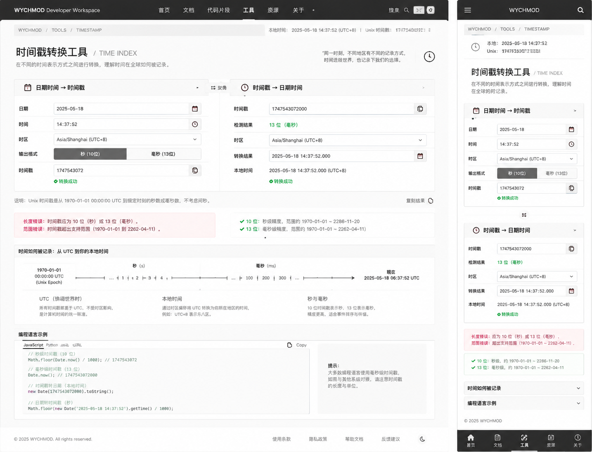

# Image 23：时间戳转换工具 / Time Index



> 状态：可实施
> 对应提示词：P023
> 目标文件：`docs/tools/timestamp-tool.html`
> 内容真相来源：当前 `timestamp-tool.html` 的实时当前时间、秒/毫秒时间戳、日期时间转时间戳、时间戳转日期、五种语言代码示例、复制与 toast
> 实现边界：这是基于浏览器 JavaScript `Date` 的本地时间转换工具；不伪造时区数据库、不伪造纳秒精度、不硬编码参考图时间。

---

## 1. 给实现模型的任务入口

你要把 `docs/tools/timestamp-tool.html` 改造成参考图所示的“时间戳转换工具 / TIME INDEX”。页面应该像一页时间索引卡：顶部显示当前本地时间和 Unix 时间，主体左右两张卡完成“日期时间 → 时间戳”和“时间戳 → 日期时间”的双向转换，中间和下方解释 Unix epoch、秒/毫秒精度、时区语义和常用语言写法。

当前真实功能包括：

- `updateCurrentTime()`：
  - 每秒更新 `currentDateTime`。
  - 每秒更新 `currentTimestamp`。
  - 每秒更新 `currentTimestampMs`。
- 初始化后执行：
  - `updateCurrentTime()`
  - `setInterval(updateCurrentTime, 1000)`
  - `datetimeInput` 默认当前本地日期时间。
- `convertToTimestamp()`：
  - 使用 `new Date(datetimeInput.value)`。
  - 输出秒级和毫秒级结果到 `timestampResult`。
- `convertToDatetime()`：
  - 读取 `timestampInput`。
  - 当前会 `replace(/[^\d]/g, '')` 去掉非数字。
  - 只接受 10 位秒级或 13 位毫秒级。
  - 使用本地时区格式化结果到 `datetimeResult`。
- `copyCode(button, codeId)`。
- `showMessage(message, type)`。
- 代码示例：
  - JavaScript / Node.js
  - Python
  - Java
  - Go
  - PHP

参考图里出现但当前未完整实现的能力：

- 顶部紧凑状态栏：本地时间、Unix 时间。
- 标题：`时间戳转换工具 / TIME INDEX`。
- 左卡：日期、时间、时区、输出格式、时间戳结果和复制。
- 右卡：时间戳、检测结果、时区、转换结果、本地时间和复制。
- 秒/毫秒格式切换。
- 中间交换图标。
- 长度/范围错误说明。
- 时间知识记录时间线。
- 编程语言示例 tab。
- 移动端各区块折叠。

这些能力可以新增，但必须真实：

- `本地时间` 必须来自浏览器当前时间。
- `Unix` 必须来自当前 `Date.now()`。
- `时区` 如果可选，必须真正影响转换结果；否则只显示“浏览器本地时区”。
- `纳秒` 不要显示为真实精度，因为 JavaScript `Date` 只有毫秒精度。
- `2025-05-18 14:37:52` 只能作为“加载示例”或设计示例，不是默认当前时间。

实现前必须完整阅读：

- `AGENTS.md`
- `docs/_meta/HOMEPAGE_DESIGN_AND_IMPLEMENTATION.md`
- `docs/tools/timestamp-tool.html`
- `docs/tools/index.html`
- `docs/assets/css/tools-notion.css`

禁止：

- 继续使用紫蓝渐变、emoji 图标、发光卡片。
- 硬编码参考图中的日期、时间戳或成功状态。
- 显示 `Asia/Shanghai` 下拉却不真正按该时区转换。
- 显示 Unix 纳秒精度却只用 `Date.now()`。
- 把负时间戳显示为支持状态，除非修复当前去掉 `-` 的逻辑。
- 复制结果按钮无实际复制。
- 代码示例注释里的日期与时间戳不一致。

---

## 2. 参考图视觉审计

### 2.1 桌面端画面结构

参考图桌面端约 `1440 × 900`。

1. 顶部导航：
   - 高约 `58px`。
   - 背景暖石墨黑。
   - 左侧 `WYCHMOD Developer Workspace`。
   - 导航：`首页 / 文档 / 代码片段 / 工具 / 资源 / 关于`，`工具` 选中。
   - 右侧搜索和小图标。
   - 实现时沿用项目工具页统一深色导航即可。
2. 顶部状态条：
   - 面包屑：`WYCHMOD / TOOLS / TIMESTAMP`。
   - 右侧：`本地时间：2025-05-18 14:37:52 (UTC+8)`。
   - 右侧：`Unix 时间戳：...`。
   - 状态每秒更新，数字变化不应造成布局跳动。
3. 标题区：
   - H1：`时间戳转换工具 / TIME INDEX`。
   - 描述：`在不同的时间表示方式之间进行转换，理解时间在全球时间线上的记录。`
   - 右侧一段小文案 + 时钟图标。
4. 双向转换区：
   - 左：`日期时间 → 时间戳`。
   - 右：`时间戳 → 日期时间`。
   - 中间有小交换图标；如果没有真实交换功能，只作为方向符号。
5. 左卡字段：
   - 日期：`2025-05-18`。
   - 时间：`14:37:52`。
   - 时区：`Asia/Shanghai (UTC+8)`。
   - 输出格式：`秒（10位）` / `毫秒（13位）` segmented。
   - 时间戳结果。
   - `转换成功` 状态。
6. 右卡字段：
   - 时间戳：`1747543072000`。
   - 检测结果：`13 位（毫秒）`。
   - 时区：同上。
   - 转换结果：`2025-05-18 14:37:52.000`。
   - 本地时间：`2025-05-18 14:37:52.000 (UTC+8)`。
   - `转换成功` 状态。
7. 错误/范围说明：
   - 红色提示：长度错误、范围错误。
   - 绿色提示：10 位和 13 位规则。
8. 时间知识记录：
   - 横向时间线：Unix Epoch → 秒 → 毫秒 → 现在。
   - 三个解释块：UTC、本地时间、秒与毫秒。
9. 编程语言示例：
   - 代码 tab：JavaScript、Python、Java、Go、PHP。
   - 右上 Copy。
   - 右侧提示说明。
10. 页脚：
   - 版权与链接。

### 2.2 移动端画面结构

参考图移动端约 `390 × 844`。

1. 顶部导航：
   - 左侧菜单。
   - 中间 `WYCHMOD`。
   - 右侧搜索。
2. 面包屑：`WYCHMOD / TOOLS / TIMESTAMP`。
3. 当前时间紧凑块：
   - 本地：`2025-05-18 14:37:52`。
   - Unix：`174754...`。
4. 标题：
   - `时间戳转换工具 / TIME INDEX`。
5. 两张转换卡纵向排列。
6. 红色/绿色说明卡纵向排列。
7. 时间知识记录与编程语言示例为折叠项。
8. 底部移动导航可以沿用工具站统一移动导航；若本项目没有，不要新造会冲突的导航系统。

### 2.3 图中不能直接照搬的内容

不能直接照搬：

- `2025-05-18 14:37:52` 作为当前时间。
- `Asia/Shanghai (UTC+8)` 作为可选时区，除非真实实现。
- `Unix 纳秒` 精度，除非文案明确是 `毫秒 × 1,000,000` 的估算显示，不是真实纳秒。
- 固定“转换成功”。

可以借鉴：

- 纸白时间索引视觉。
- 左右双向转换。
- 秒/毫秒检测。
- 时间线解释。
- 语言示例 tab。

---

## 3. Design Specification

### 3.1 Purpose Statement

时间戳工具服务于写接口、查日志、调缓存和排查跨时区问题的人：他们需要在可读日期与 Unix 数字之间快速转换，并知道这个数字到底是秒还是毫秒。页面要把抽象时间轴变成清楚的索引，让用户知道“这个时间在本地是什么，在 Unix 线上是什么”。

这页的人文感来自对时间的温柔解释：时间戳看似只是数字，但它记录的是事件发生的坐标。工具应帮助用户少犯单位和时区错误，像一个安静的时间翻译员。

### 3.2 Aesthetic Direction

唯一方向：**Editorial / magazine，研究者数字书房里的时间索引卡**。

视觉关键词：

- 时间索引
- 纸白刻度
- Unix epoch
- 本地时间
- 秒/毫秒
- 日志与记录
- 清楚、稳定、可信

禁止方向：

- 闹钟 App 风格
- 科技蓝计时器
- 霓虹数字面板
- 复杂日历系统
- 不真实时区控制台

### 3.3 Color Palette

继承首页：

| 语义 | 色值 | 用法 |
|---|---|---|
| 暖石墨 | `#0D100E` | 顶部导航、主按钮、标题深色 |
| 深墨 | `#151915` | 主要文字 |
| 品牌绿 | `#00C776` | 转换成功、有效规则 |
| 暖金 | `#B88A3B` | 时间刻度、tab 选中 |
| 纸白 | `#F4EFE5` | 页面背景 |
| 卡片纸 | `#FBF7EF` | 转换卡片、说明卡 |
| 纸灰线 | `#DDD4C5` | 输入边框、分隔线 |
| 辅助灰 | `#77746C` | label、说明 |
| 错误红 | `#B6473B` | 长度/范围错误 |

规则：

- 成功绿只用于状态，不用于大面积按钮。
- 时间线用深墨和暖金，不用蓝。
- 不使用旧紫色和科技蓝。

### 3.4 Typography

继承首页字体系统：

- 中文标题使用首页标题体系。
- `TIME INDEX` 使用浅灰英文副标题。
- 时间戳、日期、代码使用等宽字体。
- 当前时间每秒变化，容器宽度固定，避免跳动。

尺寸建议：

| 区域 | 桌面端 | 移动端 |
|---|---:|---:|
| H1 中文 | `30–34px` | `26–28px` |
| H1 英文 | `22–26px` | `18–20px` |
| 顶部状态 | `12–13px` | `12px` |
| 输入文字 | `15px` | `14px` |
| 结果数字 | `15–17px` | `14px` |
| 说明正文 | `13–14px` | `13px` |
| 代码 | `12–13px` | `12px` |

### 3.5 Layout Strategy

桌面端：

```text
top nav
└─ breadcrumb + live time status
   └─ hero
      └─ two-way converter grid
         ├─ datetime -> timestamp
         └─ timestamp -> datetime
      └─ rule cards
      └─ time knowledge timeline
      └─ code examples
```

移动端：

```text
mobile nav
└─ breadcrumb
   └─ current time compact
      └─ title
         └─ conversion cards stacked
         └─ rule cards
         └─ accordions: timeline / code examples
```

---

## 4. 功能语义与实现要求

### 4.1 当前时间

保留：

```js
updateCurrentTime()
setInterval(updateCurrentTime, 1000)
```

建议新增：

```js
let currentTimeIntervalId = null;
```

如果页面未来通过 SPA 生命周期挂载/卸载，必须清理 interval。当前独立 HTML 可保持简单，但不要重复创建多个 interval。

显示：

- 本地时间：`YYYY-MM-DD HH:mm:ss`。
- UTC offset：例如 `UTC+8`，通过 `new Date().getTimezoneOffset()` 计算。
- Unix 秒：`Math.floor(Date.now() / 1000)`。
- Unix 毫秒：`Date.now()`。

不显示真实纳秒。

### 4.2 日期时间 → 时间戳

参考图拆分日期和时间；当前源码使用 `datetime-local`。

可选方案：

1. 保留 `datetimeInput`，视觉上拆成日期/时间两个输入但内部同步。
2. 改成 `dateInput` + `timeInput`，再生成 Date；但要保持 `datetimeInput` 等价能力或更新函数。

输出格式：

- Segmented：
  - 秒（10位）
  - 毫秒（13位）
- 如果选秒，主结果显示秒。
- 如果选毫秒，主结果显示毫秒。
- 仍可同时显示另一个值作为辅助。

时区：

- 当前真实能力是浏览器本地时区。
- 如果不实现 IANA 时区转换，文案写：

```text
时区：浏览器本地时区（UTC+8）
```

- 不显示可切换下拉。

转换：

```js
const date = new Date(datetimeLocalValue);
const timestampMs = date.getTime();
const timestampSec = Math.floor(timestampMs / 1000);
```

### 4.3 时间戳 → 日期时间

当前逻辑只支持 10 位和 13 位正整数。参考图也强调 10/13 位。

建议保留语义：

- 10 位 → 秒。
- 13 位 → 毫秒。

但修复两个点：

- 不要静默删除所有非数字字符。非法字符应报错。
- 如果决定支持负时间戳，必须保留 `-` 并更新范围说明；否则明确“不支持负时间戳”。

推荐本轮：

- 支持正整数 10/13 位。
- 非法字符报错。
- 空输入报错。
- 长度非 10/13 位报错。

输出：

- 检测结果：`10 位（秒）` 或 `13 位（毫秒）`。
- 转换结果：本地时间 `YYYY-MM-DD HH:mm:ss.SSS`。
- UTC 时间可选显示，但必须使用 `date.toISOString()`。

### 4.4 时区说明

当前无真实时区选择器，所以参考图里的 `Asia/Shanghai (UTC+8)` 应改为：

```text
浏览器本地时区（UTC+8）
```

如果实现时区选择：

- 使用 IANA time zone 名称。
- 用 `Intl.DateTimeFormat` 计算目标时区显示。
- 注意：将“某时区的本地日期时间”转换为 UTC timestamp 非常容易出错，需要单独测试 DST。
- 没有完整实现前不要显示下拉。

### 4.5 错误与规则卡

红色错误卡：

```text
长度错误：时间戳应为 10 位（秒）或 13 位（毫秒）。
范围错误：时间戳超出 JavaScript Date 可表示范围。
```

注意：

- 不要常驻红色错误。如果当前没有错误，可显示“常见错误”说明；出错时才高亮。

绿色规则卡：

```text
10 位：秒级精度，常见于 Unix 时间戳。
13 位：毫秒级精度，常见于 JavaScript Date.now()。
```

### 4.6 时间知识记录

桌面横向时间线：

```text
1970-01-01 00:00:00 UTC
Unix Epoch
秒（s）
毫秒（ms）
现在
```

解释块：

- UTC：
  - 时间戳基于 UTC，不随时区变化。
- 本地时间：
  - 同一个时间戳在不同时区显示为不同墙上时间。
- 秒与毫秒：
  - 10 位通常是秒，13 位通常是毫秒。

移动端折叠为 `时间知识记录`。

### 4.7 编程语言示例

当前有 JS/Python/Java/Go/PHP。保留。

改造为 tab：

- JavaScript 默认。
- Python。
- Java。
- Go。
- PHP。

要求：

- 代码注释里的示例时间戳和日期必须一致。
- 如果使用 `2025-05-18 14:37:52 Asia/Shanghai` 示例，对应秒/毫秒要由代码或人工校验一致。
- 不要在代码里写过期或不准确注释。
- Copy 按钮保留。
- 复制优先 Clipboard API，失败 fallback。

### 4.8 复制结果

参考图有复制结果。

建议新增：

- 日期转时间戳结果旁复制按钮。
- 时间戳转日期结果旁复制按钮。

复制内容：

- 当前主结果，不含 label。
- 成功后按钮显示 `已复制`。

---

## 5. 视觉实现细节

### 5.1 CSS 作用域

建议：

```html
<body class="tool-page time-index-page">
```

核心类：

```text
.time-index-page
.tool-topbar
.timestamp-status-bar
.time-hero
.time-current-compact
.time-converter-grid
.time-card
.time-field-row
.time-format-toggle
.time-result-row
.time-rule-grid
.time-timeline
.code-example-section
.code-tabs
.mobile-time-accordion
```

### 5.2 尺寸与间距

| 元素 | 桌面端 | 移动端 |
|---|---:|---:|
| top nav | `58px` | `56px` |
| status bar | `40px` | compact block |
| 页面 padding | `42px` | `16px` |
| H1 | `32px` | `26px` |
| converter card | `320–360px` 高 | auto |
| input row | `42px` | `40px` |
| result row | `44px` | `42px` |
| timeline | `150–190px` | accordion |
| code block | `260–320px` | `220px` |

### 5.3 交互细节

- 当前时间每秒变化时不要触发页面 reflow。
- 成功状态用绿点 + 文字。
- 错误状态用红边 + 文字。
- 交换图标如果不可点击，设置 `aria-hidden="true"`；如果可点击，必须真实交换输入方向。
- 移动端折叠项用 `<details>`，默认只展开转换卡。

### 5.4 可访问性

- 所有输入有 label。
- segmented toggle 用 button + `aria-pressed`。
- 状态区域 `aria-live="polite"`，但当前时间每秒更新不宜被屏幕阅读器持续打扰；实时钟可 `aria-hidden`，转换结果用 live。
- 复制按钮有 `aria-label`。
- 错误信息关联输入。

---

## 6. 功能实现契约

### 6.1 必须保留或等价保留

- `updateCurrentTime()`
- `convertToTimestamp()`
- `convertToDatetime()`
- `copyCode(button, codeId)`
- `showMessage(message, type)`
- 当前时间 1 秒更新。
- JS/Python/Java/Go/PHP 示例复制。

### 6.2 建议新增函数

```js
formatLocalDateTime(date, withMilliseconds)
formatUtcOffset(date)
detectTimestampUnit(value)
validateTimestampInput(value)
setTimestampOutputMode(mode)
renderTimestampResult(sec, ms)
renderDatetimeResult(date, unit)
copyText(text)
copyTimestampResult()
copyDatetimeResult()
setConversionStatus(target, status, message)
renderCurrentTimeStatus()
setCodeTab(language)
```

如果实现时区选择：

```js
formatInTimeZone(date, timeZone)
getTimeZoneOffsetLabel(date, timeZone)
```

### 6.3 当前旧问题要顺手修复

当前 `timestamp-tool.html` 中的问题：

- 旧紫蓝视觉与首页冲突。
- 标题和按钮使用 emoji。
- 当前没有统一顶部导航。
- `convertToDatetime()` 静默删除非数字，可能把错误输入变成另一个数字。
- 不支持负时间戳却没有说明。
- `convertToTimestamp()` 用 `innerHTML` 输出，虽然内容来自数字，仍建议改为 DOM/textContent。
- 代码示例注释里的时间戳与日期需要重新核对，避免错例。
- `copyCode()` 只用 `document.execCommand('copy')`。
- `setInterval` 没有保存 id；独立 HTML 可接受，但未来若重复初始化会产生多个 timer。

---

## 7. 可直接复制给实现模型的指令

```text
请改造 `docs/tools/timestamp-tool.html`，目标是复现 `docs/_meta/ui-redesign/references/image-23.png` 的“时间戳转换工具 / TIME INDEX”，并与首页 V2 的 Editorial / magazine「研究者的数字书房」风格一致。

你必须先阅读：
1. `AGENTS.md`
2. `docs/_meta/HOMEPAGE_DESIGN_AND_IMPLEMENTATION.md`
3. `docs/tools/timestamp-tool.html`
4. `docs/tools/index.html`
5. `docs/assets/css/tools-notion.css`

页面目标：
- 顶部有统一深色工具导航和面包屑：`WYCHMOD / TOOLS / TIMESTAMP`。
- 标题为 `时间戳转换工具 / TIME INDEX`。
- 顶部状态显示真实本地时间和 Unix 时间戳，每秒更新。
- 主体两张卡：`日期时间 → 时间戳` 和 `时间戳 → 日期时间`。
- 下方显示秒/毫秒规则、时间知识记录、编程语言示例。

必须保留当前功能：
- updateCurrentTime 每秒更新。
- convertToTimestamp。
- convertToDatetime。
- JS/Python/Java/Go/PHP 代码示例和复制。
- showMessage。

重要边界：
- 不要显示可切换时区下拉，除非真实实现时区转换。
- 当前默认使用浏览器本地时区，文案写“浏览器本地时区（UTC±x）”。
- 不要显示真实 Unix 纳秒；JavaScript Date 只有毫秒精度。
- 参考图里的 `2025-05-18 14:37:52` 只能作为示例，不要硬编码为当前时间。

功能要求：
- 日期时间转时间戳：显示秒级和毫秒级，支持选择主输出格式。
- 时间戳转日期：只接受 10 位秒或 13 位毫秒正整数，非法字符直接报错，不要静默删除。
- 检测结果显示 `10 位（秒）` 或 `13 位（毫秒）`。
- 转换结果显示本地时间，必要时显示 UTC ISO 字符串作为辅助。
- 成功和错误都有清楚文字，不只靠颜色。
- 结果旁提供复制按钮。
- 移动端将时间知识记录和代码示例做成折叠项。

视觉要求：
- 使用暖石墨 `#0D100E`、纸白 `#F4EFE5`、卡片纸 `#FBF7EF`、纸灰线 `#DDD4C5`、品牌绿 `#00C776`、暖金 `#B88A3B`。
- 删除旧紫色、蓝色渐变、emoji 图标。
- 当前时间数字使用等宽字体，容器宽度固定，避免每秒跳动。
- 桌面两列转换卡，移动端纵向堆叠。

代码示例要求：
- 重新核对示例时间戳与日期注释，必须一致。
- 不要写过期或错误年份。
- Copy 优先 Clipboard API，失败 fallback。

验收：
- 当前时间等待 3 秒，秒和毫秒同步更新。
- 日期时间转时间戳结果与浏览器 Date 一致。
- 输入 10 位时间戳按秒转换。
- 输入 13 位时间戳按毫秒转换。
- 输入 11/12 位报长度错误。
- 输入 `abc123` 报非法字符，不变成 `123`。
- 不显示不可用的时区下拉或纳秒精度。
- 手机 390px 无横向滚动。
- 控制台无新增 error。
- 不修改 `docs/md/archive/`。
```

---

## 8. 验证清单

### 8.1 视觉验证

- 桌面 `1440 × 900`：顶部状态、标题、双卡、时间线、代码示例接近参考图。
- 桌面 `1280 × 800`：双卡不拥挤，代码区可滚。
- 平板 `768 × 1024`：双卡变单列或合理两列。
- 手机 `390 × 844`：转换卡纵向排列，折叠项可用。
- 手机 `360 × 800`：长时间戳不横向撑破页面。

### 8.2 当前时间验证

- `currentDateTime` 每秒更新。
- `currentTimestamp` 与 `Math.floor(Date.now()/1000)` 一致。
- `currentTimestampMs` 与 `Date.now()` 接近。
- UTC offset 文案正确。
- 页面不因数字变化跳动。

### 8.3 转换验证

- 当前 `datetimeInput` 转秒/毫秒。
- `0` 如果不支持，给出明确错误；如果支持，转换到 epoch。
- 10 位时间戳。
- 13 位时间戳。
- 11 位、12 位长度错误。
- 空输入错误。
- 字母/符号错误。
- 超出 JavaScript Date 范围错误。

### 8.4 规则与示例验证

- 10 位说明准确。
- 13 位说明准确。
- UTC/本地时间说明不暗示时区可切换。
- JS/Python/Java/Go/PHP 示例能复制。
- 示例注释中的 timestamp/date 一致。

### 8.5 工程验证

- 所有输入有 label。
- 复制按钮有 aria-label。
- 转换结果区域 aria-live。
- `git diff --check` 通过。
- 控制台无新增 error。
- 不引入时区库或远程依赖，除非另行明确。
- 不修改首页运行文件，除非共享工具壳样式必要。
- 不修改 `docs/md/archive/`。

---

## 9. 实施风险提示

- 时区选择不是一个 UI 下拉那么简单，尤其日期时间转 timestamp 会遇到 DST 和不存在/重复本地时间。
- JavaScript `Date` 只有毫秒精度；纳秒展示容易误导。
- 静默清洗输入会制造隐性错误，时间戳工具应宁可报错。
- 代码示例中的时间戳注释必须核对，否则工具会失去可信度。
- 屏幕阅读器不应每秒播报当前时间，实时钟要谨慎设置 aria。
