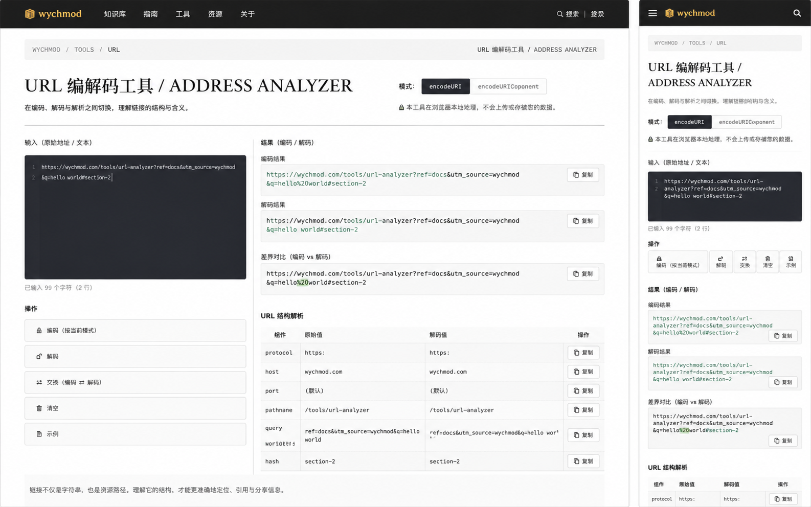

# Image 24：URL 编解码工具 / Address Analyzer



> 状态：可实施
> 对应提示词：P024
> 目标文件：`docs/tools/url-tool.html`
> 内容真相来源：当前 `url-tool.html` 的 `encodeURI` / `encodeURIComponent` 编码模式、URL 解码、`new URL()` 结构解析、`URLSearchParams` 参数解析、复制与 toast 提示。
> 实现边界：这是浏览器本地 URL 编解码与结构解析工具；不能请求、打开、检测或安全扫描用户输入的 URL；不能宣称链接安全；不能把参考图中的示例结果硬编码为真实输出。

---

## 1. 给实现模型的任务入口

你要把 `docs/tools/url-tool.html` 改造成参考图所示的“URL 编解码工具 / ADDRESS ANALYZER”。页面应该像一页“地址手稿解析台”：用户把一段链接或 URL 片段放进左侧，页面在右侧同时给出编码结果、解码结果、差异对比和 URL 结构拆解。它不是网络检测器，也不是短链工具，而是帮助开发者理解“一个链接如何被编码、传输、解析”的本地工具。

当前真实功能包括：

- `encodeURL()`：
  - 从 `#encodeInput` 读取输入。
  - 读取 `input[name="encodeType"]:checked`。
  - 当值为 `uri` 时使用 `encodeURI(input)`。
  - 当值为 `component` 时使用 `encodeURIComponent(input)`。
  - 当前会把编码结果写入 `#decodeInput`。
  - 当前通过 `showMessage()` 提示成功或错误。
- `decodeURL()`：
  - 从 `#decodeInput` 读取输入。
  - 优先使用 `decodeURIComponent(input)`。
  - 出错后尝试 `decodeURI(input)`。
  - 当前会把解码结果写入 `#encodeInput`。
  - 当前通过 `showMessage()` 提示成功或错误。
- `parseURL()`：
  - 从 `#parseInput` 读取输入。
  - 使用浏览器原生 `new URL(input)` 解析。
  - 展示 `href`、`protocol`、`hostname`、`port`、`pathname`、`search`、`hash`。
  - 使用 `new URLSearchParams(url.search)` 展示查询参数。
  - 当前需要完整 URL；相对路径会被视为无效。
- `copyText(elementId)`：
  - 复制指定 input 或 textarea 的值。
- `escapeHtml(text)`：
  - 用 DOM 文本节点方式转义内容。
- `showMessage(message, type)`：
  - 创建临时消息提示。

参考图里出现但当前未完整实现的能力：

- 页面标题：`URL 编解码工具 / ADDRESS ANALYZER`。
- 顶部说明：本地处理，不上传、不存储用户数据。
- 统一输入区：`输入（原始地址 / 文本）`。
- 行号感或代码编辑器感的深色输入面板。
- 字符数与行数统计。
- 模式切换：`encodeURI` 与 `encodeURIComponent` 的 segmented control。
- 一组纵向操作按钮：
  - 编码（按当前模式）
  - 解码
  - 交换（编码 ⇄ 解码）
  - 清空
  - 示例
- 右侧结果区：
  - 编码结果
  - 解码结果
  - 差异对比（编码 vs 解码）
  - URL 结构解析表
- 每个结果块的复制按钮。
- URL 结构表中的逐字段复制按钮。
- 移动端把操作按钮变成紧凑图标网格，结果区纵向排列。

这些能力可以新增，但必须真实：

- 编码结果必须来自当前输入和当前模式。
- 解码结果必须来自当前输入的真实解码尝试，不能为了“好看”强行输出参考图内容。
- 差异对比必须基于真实字符串比较或真实百分号编码片段高亮。
- URL 结构解析必须基于浏览器 URL 语义；如果仍使用 `new URL(input)`，就必须明确要求完整 URL。
- 查询参数的 key/value 必须来自 `URLSearchParams`，不能手写拆分导致 `+`、重复参数、空值参数处理错误。
- 本地处理说明必须成立：不得 `fetch()`、不得创建 ``、不得预加载、不得 ping 用户输入。

实现前必须完整阅读：

- `AGENTS.md`
- `docs/_meta/HOMEPAGE_DESIGN_AND_IMPLEMENTATION.md`
- `docs/tools/url-tool.html`
- `docs/tools/index.html`
- `docs/assets/css/tools-notion.css`

禁止：

- 继续使用紫蓝渐变、emoji 图标、发光玻璃卡片。
- 把 URL 工具做成“安全检测”“可访问性检测”“SEO 检测”。
- 点击或自动打开用户输入的 URL。
- 请求用户输入的 URL。
- 把 `javascript:`、`data:` 等协议标为“危险/安全”，除非只是显示协议文本。
- 把相对 URL 静默补成某个真实域名，除非 UI 明确展示“以当前站点为 base 解析”的模式。
- 直接用未转义的用户输入拼接 `innerHTML`。
- 只保留旧的三个孤立输入框，导致参考图中的“输入 → 多结果”关系无法成立。
- 把 `Ctrl/Cmd + K` 分配给 URL 输入搜索；该快捷键在站点中属于终端。

---

## 2. 参考图视觉审计

### 2.1 桌面端整体观感

参考图是一个桌面 Web 工具页，比例接近 `1440 × 900`。页面背景不是纯白，而是接近首页纸白区的暖灰纸张色，带轻微纹理和细线。顶部是一条深色导航，主体像一张被放在数字书桌上的“链接剖析记录”。

视觉气质必须延续首页：

- 深色区域表达系统、代码和工具。
- 纸白区域表达阅读、注释和记录。
- 旧金色用于品牌、标题辅助线、当前状态。
- 信号绿用于可执行的主动作和成功状态。
- 等宽字体用于 URL、编码片段、字段名和结果。
- 中文衬线用于大标题，让工具不只是“开发者表单”，而是“研究笔记的一页”。

页面不应该像通用在线工具站，也不应该像 SaaS 控制台。它应该有作者性：克制、安静、可信，像一个长期技术知识库附带的精密工具。

### 2.2 顶部导航

参考图顶部导航高度约 `64px`。

布局：

```text
左侧：wychmod
中间：知识库 / 指南 / 工具 / 资源 / 关于
右侧：搜索 / 登录 或轻量入口
```

实现时要服从项目现有工具页外壳，不强行引入登录功能。如果当前站点没有登录系统，右侧不要出现“登录”按钮；可以保留“返回主站”“工具集”或“进入知识库”的真实链接。

导航视觉规则：

- 背景：`#0D100E` 或与首页深色封面一致的暖石墨。
- 底部分隔线：`rgba(242,239,231,0.14)`。
- 品牌文字：旧金或纸白，字号 `18–22px`，不使用发光。
- 当前项“工具”：旧金小下划线或细线标记。
- 链接 hover：文字变亮或下划线延展，不改变导航高度。
- 图标必须来自同一套专业 SVG 或直接不用图标；不要用 emoji。

如果工具页当前只有“返回主站 / 返回工具集”两条返回链接，可将它们改造成正文上方的 breadcrumb，而不是塞进顶部导航造成拥挤。

### 2.3 Breadcrumb 与页面识别

参考图主体顶部左侧有小型路径：

```text
WYCHMOD / TOOLS / URL
```

右侧有小型页面标签：

```text
URL 编解码工具 / ADDRESS ANALYZER
```

实现细节：

- 位置：主体容器顶部，距离导航下边约 `28–36px`。
- 字体：等宽，`11–12px`。
- 颜色：旧金或暗绿，透明度约 `0.8`。
- 字母全部大写。
- 两端对齐：桌面左右分布；移动端上下排列。
- breadcrumb 应该是文本或真实链接，不作为图片。

### 2.4 Hero 标题

参考图标题：

```text
URL 编解码工具 / ADDRESS ANALYZER
```

标题特点：

- 中文在前，英文在后，用 `/` 分隔。
- 主标题位于主体左上，和工具功能区同一容器宽度。
- 桌面字号约 `44–56px`，行高 `1.05–1.12`。
- 手机端字号约 `32–38px`。
- 字体使用首页 display 字体：
  - `"Source Han Serif SC"`
  - `"Noto Serif SC"`
  - `"Songti SC"`
  - `SimSun`
- 颜色：深墨 `#20211D`。
- 不使用渐变文字。
- 不加描边。
- 不居中堆叠成海报。

副标题建议：

```text
在编码、解码与解析之间切换，理解链接的结构与含义。
```

副标题宽度控制在 `580–680px`，桌面左对齐，手机端可居中或左对齐，但必须跟同页整体一致。工具页多为工作台语义，建议手机端标题居中、控件左对齐。

### 2.5 模式切换

参考图在标题下方有两个模式按钮：

```text
[ encodeURI ] [ encodeURIComponent ]
```

视觉规则：

- 是 segmented control，不是普通 radio 列表。
- 宽度随内容，整体高度 `40–44px`。
- 外框：纸白区细线 `rgba(32,33,29,0.18)`。
- 当前选中：深墨背景 `#0D100E`，纸白文字。
- 未选中：透明或浅纸背景，暗墨文字。
- 字体：等宽，`13px`。
- 圆角：`6px` 以内。
- radio input 可以保留但视觉隐藏，label 作为可点击段。
- `Tab` 聚焦时必须有可见 outline。

模式旁边可以放一句极短解释：

```text
encodeURI 保留 URL 分隔符；encodeURIComponent 更适合参数值。
```

不要放成长篇教程，长解释放到页面底部“方法注记”。

### 2.6 本地隐私提示

参考图标题区下方有一条隐私提示：

```text
本工具在浏览器本地处理，不会上传或存储你的数据。
```

视觉规则：

- 高度约 `40–48px`。
- 背景可用淡绿透明：`rgba(36,209,143,0.08)`。
- 边框：`rgba(36,209,143,0.24)`。
- 左侧使用 lock/shield 类专业图标，尺寸 `16px`。
- 文案 `13–14px`。
- 不要使用“绝对安全”“隐私加密”等夸张措辞。

### 2.7 主工作区桌面布局

参考图主工作区是两栏：

```text
左栏：输入区 + 操作按钮
右栏：编码结果 + 解码结果 + 差异对比 + URL 结构解析
```

推荐容器：

- 最大宽度：`1180–1240px`。
- 左右内边距：桌面 `40px`，平板 `28px`，手机 `18px`。
- 栅格：`grid-template-columns: minmax(360px, 0.92fr) minmax(520px, 1.08fr)`。
- 栅格间距：`24–32px`。
- 垂直间距：`20–24px`。
- 顶部距标题区：`32–40px`。

左栏不能过窄，因为 URL 长文本需要读。右栏也不能过窄，因为结构表有三列文本和复制按钮。`1024px` 以下建议改成单列。

### 2.8 左侧输入面板

参考图左侧输入区是深色代码面板，标签：

```text
输入（原始地址 / 文本）
```

示例内容：

```text
https://wychmod.com/tools/url-analyzer?ref=docs&utm_source=wychmod
&q=hello world#section-2
```

输入面板视觉：

- 背景：`#0D100E` 或 `#151915`。
- 边框：`rgba(242,239,231,0.12)`。
- 内阴影或轻微 inset 线，不使用蓝色 glow。
- 圆角：`6px`。
- textarea 高度：桌面 `260–320px`；手机 `220–260px`。
- 字体：`"IBM Plex Mono"`, `"JetBrains Mono"`, `Consolas`, `monospace`。
- 字号：`13–14px`。
- 行高：`1.65`。
- 文字颜色：`#F2EFE7`。
- placeholder：低对比纸白 `rgba(242,239,231,0.45)`。
- 允许换行：`white-space: pre-wrap`。
- 长 URL：`overflow-wrap: anywhere`。

行号感可以有两种实现：

1. 轻量方案：textarea 左侧加一个固定宽度的 gutter，显示 `01 / 02 / 03`，输入变化后更新行号。
2. 简化方案：不做真实行号，只在面板左侧用细线和顶部 metadata 表达代码感。

如果做行号：

- 行号区宽度 `42–48px`。
- 行号颜色 `rgba(242,239,231,0.35)`。
- 行号与 textarea 滚动要同步，不能错位到明显影响使用。
- 如果同步成本过高，优先放弃真实行号，不要做错。

底部计数：

```text
已输入 99 个字符（2 行）
```

规则：

- 数字根据真实输入计算。
- 空输入显示 `已输入 0 个字符（0 行）`。
- 换行统计用 `input ? input.split(/\r\n|\r|\n/).length : 0`。
- 字符数可用 `Array.from(input).length`，这样 emoji 不会被算作两个 UTF-16 码元；如果不用，也要在规格注释中承认是 JS length。

### 2.9 操作按钮

参考图左侧输入下面或输入右侧有一列操作按钮：

```text
编码（按当前模式）
解码
交换（编码 ⇄ 解码）
清空
示例
```

桌面视觉：

- 按钮高度 `42–46px`。
- 主按钮“编码”使用信号绿背景 `#24D18F`，深墨文字。
- 次按钮使用深墨或纸白描边，根据所在区域选择。
- 文案左对齐或居中均可，但整组保持一致。
- 图标可以使用 Lucide：
  - encode：`lock-keyhole` 或 `brackets`
  - decode：`unlock-keyhole` 或 `scan-text`
  - swap：`arrow-left-right`
  - clear：`eraser`
  - example：`file-code`
- 不使用 emoji。

移动端：

- 五个操作按钮变成两行或五宫格。
- 每个按钮最小点击区域 `44 × 44px`。
- 文案可以缩短为：
  - 编码
  - 解码
  - 交换
  - 清空
  - 示例
- 不要只保留图标，必须有文字或 `aria-label`。

功能语义：

- `编码`：读取统一输入，按当前模式生成编码结果。
- `解码`：读取统一输入，尝试生成解码结果。
- `交换`：把当前主输入与上一次主要输出互换。
- `清空`：清空输入和所有结果。
- `示例`：填入真实示例 URL 并立即刷新结果。

### 2.10 右侧结果区

右侧结果区由四个模块组成。整体像研究记录，不像普通卡片堆叠。

推荐结构：

```text
结果（编码 / 解码）
├─ 编码结果
├─ 解码结果
├─ 差异对比（编码 vs 解码）
└─ URL 结构解析
```

共同视觉：

- 背景：`#FBF7EF` 或略暖的纸白。
- 边框：`rgba(32,33,29,0.16)`。
- 标题使用等宽小字或无衬线小标题。
- 结果文本使用等宽。
- 每个结果块右上有 `复制` 按钮。
- 结果块间距 `14–18px`。
- 空态不能空白，应显示：

```text
等待输入后生成结果。
```

### 2.11 编码结果块

标题：

```text
编码结果
```

内容规则：

- 默认根据当前输入和当前模式生成。
- 如果输入为空，显示空态。
- 如果输入已经编码，继续按 JavaScript 原生函数处理，不要自行去重 `%25`。
- 结果允许多行换行。
- 长 URL 必须 `overflow-wrap:anywhere`，不让页面横向滚动。

复制：

- 按钮文案：`复制编码结果` 或短文案 `复制` 加 `aria-label="复制编码结果"`。
- 复制成功后 toast：`已复制编码结果`。
- 复制失败要提示用户手动复制，不要静默。

### 2.12 解码结果块

标题：

```text
解码结果
```

内容规则：

- 默认对当前输入尝试解码。
- 优先 `decodeURIComponent`，失败后尝试 `decodeURI`。
- 如果两者都失败，显示错误状态：

```text
无法解码：输入中包含不完整或非法的百分号编码。
```

- 不要因为解码失败而清空编码结果。
- 错误状态使用朱砂色边线或文本，不用大面积红背景。

对 `+` 的处理：

- JavaScript 的 `decodeURIComponent('+')` 不会把 `+` 变为空格。
- 如果实现“查询参数值解码”，可以在参数表中按 URLSearchParams 语义处理。
- 主解码区不要擅自把所有 `+` 替换为空格，除非 UI 明确提供“按表单编码解码”的模式。

### 2.13 差异对比块

标题：

```text
差异对比（编码 vs 解码）
```

参考图在差异中高亮 `%20` 一类片段。实现时不要硬编码 `%20`，而要基于真实字符串。

推荐实现方案：

1. 如果编码结果与解码结果都存在：
   - 在编码结果中查找 `%[0-9A-Fa-f]{2}` 片段。
   - 给这些片段包裹 `<mark>` 或 `<span class="url-token-encoded">`。
   - 同时可高亮空格、中文等会发生编码变化的字符。
2. 如果输入为空：
   - 显示空态。
3. 如果解码失败：
   - 显示“差异对比需要有效的编码或解码结果”。

视觉规则：

- 背景：略深纸白或深色代码小块均可。
- 高亮：旧金透明底 `rgba(200,169,107,0.18)`，文字深墨。
- 不要使用荧光紫或蓝色。
- 文本换行必须稳定。

注意：

- 这不是 Git diff，不需要逐字符复杂算法。
- 只要真实高亮 URL 编码片段，就足以帮助用户理解。
- 所有用户内容渲染前必须转义，再安全地插入高亮片段。

### 2.14 URL 结构解析表

参考图右下是结构表：

```text
URL 结构解析
组件        原始值        解码值        操作
protocol    https:       https:       复制
host        wychmod.com   wychmod.com  复制
port        default       default      复制
pathname    /tools/...    /tools/...   复制
query       ?ref=...      ?ref=...     复制
hash        #section-2    #section-2   复制
```

表格视觉：

- 桌面：四列表格。
- 移动端：可以变成字段卡片，不强制横向滚动。
- 表头字号 `11–12px`，等宽，大写或中英混排。
- 行高 `44–52px`。
- 行分隔线：`rgba(32,33,29,0.12)`。
- 字段名用等宽，颜色可偏旧金或暗绿。
- 原始值与解码值都使用等宽并允许换行。
- 操作按钮尺寸至少 `32px` 高；手机 `44px` 高。

组件建议：

- `href`：完整 URL，可选；如果表格过宽，可放在表格上方摘要行。
- `protocol`：`url.protocol`。
- `host`：`url.host`，包含端口。
- `hostname`：`url.hostname`，如果已有 host，可不单列。
- `port`：`url.port || 'default'`。
- `pathname`：`url.pathname`。
- `query`：`url.search || 'none'`。
- `hash`：`url.hash || 'none'`。

解码值规则：

- 对每个字段尝试安全解码。
- 使用 `safeDecode(value)`：
  - `try decodeURIComponent(value)`
  - 失败则返回原值并标注 `未解码`
- 不要让单个字段解码失败导致整表消失。

解析失败空态：

```text
需要完整 URL 才能解析结构，例如 https://example.com/path?q=hello#section。
```

如果输入是普通文本或相对路径，结构表显示该空态即可。

### 2.15 查询参数区

当前页面已有查询参数展示能力。参考图表格强调 URL 结构，但实现时应保留参数解析，因为这是现有真实能力。

推荐放置方式：

- 放在 URL 结构表下方，标题为：

```text
查询参数 / QUERY PARAMETERS
```

- 当没有查询参数时显示：

```text
当前 URL 没有查询参数。
```

- 当有参数时展示：

```text
key        raw value       decoded value       copy
ref        docs            docs                复制
utm_source wychmod         wychmod             复制
q          hello world     hello world         复制
```

处理规则：

- 使用 `URLSearchParams(url.search)`。
- 重复参数必须逐行展示，不要只保留最后一个。
- 空值参数显示 `empty` 或 `空值`，不要显示成不存在。
- key 和 value 都必须可复制。
- 如果值很长，允许折行。

### 2.16 方法注记

页面底部可以增加一块轻量说明，避免模式含义不清。

建议文案：

```text
方法注记
encodeURI 适合处理完整 URL，会保留 : / ? # & = 等结构字符。
encodeURIComponent 适合处理查询参数值，会把结构字符一并编码。
URL 结构解析基于浏览器 URL API，只检查语法结构，不请求目标地址。
```

视觉：

- 像首页纸白内页的脚注。
- 小字号 `13px`。
- 上边框细线。
- 不要做成营销 FAQ。

---

## 3. Design Specification

### 3.1 Purpose Statement

URL 工具面向写接口、调试跳转、处理查询参数和排查编码问题的开发者。用户需要快速知道一段地址在不同编码模式下会如何变化，也需要看到协议、主机、路径、query、hash 等结构是否符合预期。页面要把“机器读的链接”翻译成“人能读的结构记录”，同时坚持所有处理都在浏览器本地完成。

### 3.2 Aesthetic Direction

唯一审美方向：`Editorial / magazine`，研究者的数字书房。

这张页面的具体隐喻是“地址剖析手稿”：深色输入像工程师的终端草稿，纸白输出像编辑过的字段索引，旧金和信号绿只用于标记状态和可执行操作。它要比普通在线工具更有安静的作者气质，但不能牺牲工具效率。

### 3.3 Color Palette

使用首页规范令牌，并允许在本工具页局部派生。

```css
:root {
  --studio-ink-950: #0D100E;
  --studio-ink-900: #131713;
  --studio-ink-800: #1B201C;
  --studio-paper-50: #F2EEE5;
  --studio-paper-25: #FBF7EF;
  --studio-paper-line: #C9C3B7;
  --studio-text: #20211D;
  --studio-text-muted: #66685F;
  --studio-on-dark: #F2EFE7;
  --studio-on-dark-muted: #A9AEA7;
  --studio-green: #24D18F;
  --studio-green-dark: #159867;
  --studio-gold: #C8A96B;
  --studio-vermilion: #E6663E;
  --studio-focus: #7EE8BC;
}
```

颜色使用：

- 页面背景：`#F2EEE5`。
- 顶部导航和输入面板：`#0D100E`。
- 输出结果块：`#FBF7EF`。
- 主按钮：`#24D18F`。
- 模式选中态：`#0D100E`。
- 当前字段、breadcrumb、小标题点缀：`#C8A96B`。
- 错误：`#E6663E`。
- 焦点：`#7EE8BC`。

禁止：

- 紫色、靛蓝、蓝紫渐变。
- 大面积纯白。
- 玻璃拟态透明蓝。
- 发光霓虹绿。

### 3.4 Typography

字体遵循首页规范。

```css
:root {
  --studio-font-display: "Source Han Serif SC", "Noto Serif SC", "Songti SC", SimSun, serif;
  --studio-font-body: "Source Han Sans SC", "Noto Sans SC", "Microsoft YaHei", sans-serif;
  --studio-font-mono: "IBM Plex Mono", "JetBrains Mono", Consolas, monospace;
}
```

使用规则：

- H1：display 字体，桌面 `48–56px`，手机 `32–38px`。
- 副标题：body 字体，桌面 `16–18px`。
- 控件标签：body 字体，`13–14px`。
- URL、结果、字段名：mono 字体，`12.5–14px`。
- breadcrumb、表头、状态说明：mono 字体，`11–12px`。

不要把 `Inter`、`Roboto`、`Arial`、`Helvetica` 或 `system-ui` 作为首选字体。

### 3.5 Layout Strategy

桌面采用“左输入、右剖析”的非对称工作台布局。左栏偏深，承载原始文本和动作；右栏偏纸白，承载结果、差异和结构表。标题与 breadcrumb 横向铺开，形成杂志版面的页眉感；主体栅格在结果区打破简单卡片堆叠，通过表格、脚注和细线组织密度。

响应式策略：

- `>= 1120px`：两栏工作台。
- `900–1119px`：两栏可以保留，但左栏最小 `340px`，右栏允许更宽；如果拥挤则切单列。
- `<= 899px`：单列，顺序为标题、模式、隐私提示、输入、操作、结果、结构表、方法注记。
- `<= 480px`：标题居中或轻微居中，操作按钮变五宫格，表格改字段卡片。
- `<= 360px`：长 URL 必须任意断行，不允许横向滚动页面。

### 3.6 Files to Change

主要修改：

- `docs/tools/url-tool.html`

可选修改：

- `docs/assets/css/tools-notion.css`，仅当工具页共享外壳已经集中在这里，并且改动不会破坏其他工具页。

不应修改：

- `docs/_coverpage.md`
- `docs/README.md`
- `docs/index.html`
- `docs/assets/css/homepage-v2.css`
- `docs/assets/css/studio-tokens.css`
- `docs/assets/js/homepage-v2.js`
- `docs/md/archive/**`

### 3.7 Behaviors That Must Not Regress

- 编码模式必须继续支持 `encodeURI` 和 `encodeURIComponent`。
- 解码必须继续能处理中文百分号编码。
- URL 解析必须继续使用浏览器 URL API 或等价语义。
- 查询参数必须继续可展示。
- 复制功能必须继续可用。
- toast 或反馈必须继续可见。
- 工具页必须仍可从 `docs/tools/index.html` 返回或进入。
- 所有处理必须在本地，不请求用户输入的 URL。
- 移动端不能出现横向页面溢出。

---

## 4. 信息架构与 DOM 建议

### 4.1 页面结构

建议结构：

```html
<body class="tool-page tool-url-analyzer">
  <header class="tool-shell-nav">...</header>
  <main class="url-analyzer">
    <div class="url-page-meta">...</div>
    <section class="url-hero">...</section>
    <section class="url-workbench">
      <div class="url-input-column">...</div>
      <div class="url-output-column">...</div>
    </section>
    <section class="url-method-note">...</section>
  </main>
</body>
```

如果当前文件不方便大改，也至少保证语义顺序：

```text
导航
breadcrumb
h1
说明
模式切换
隐私提示
输入
操作
结果
结构解析
查询参数
方法注记
```

### 4.2 ID 与函数兼容

当前代码已有这些 ID 和函数：

```text
#encodeInput
#decodeInput
#parseInput
#parseResult
#urlParts
#urlParams
encodeURL()
decodeURL()
parseURL()
copyText(elementId)
escapeHtml(text)
showMessage(message, type)
```

参考图更像单一输入。为了兼顾视觉与兼容，推荐方案：

```text
#encodeInput 作为主输入 textarea
#decodeInput 可以保留为隐藏兼容字段，或改成结果 textarea
#parseInput 可以保留为隐藏兼容字段，值同步为主输入
```

更稳妥的做法：

- 主输入仍使用 `id="encodeInput"`，避免 `encodeURL()` 断裂。
- 新增结果元素：
  - `#encodedResult`
  - `#decodedResult`
  - `#diffResult`
  - `#structureResult`
  - `#paramsResult`
- 保留 `#decodeInput`，但不再作为主要视觉输入；它可以是隐藏 textarea，承接旧函数兼容。
- 保留 `#parseInput`，但同步主输入值后调用 `parseURL()`。

如果选择彻底重构函数：

- 仍要保留全局函数名 `encodeURL`、`decodeURL`、`parseURL`、`copyText`，因为 HTML onclick 或外部测试可能依赖。
- 这些函数可以变成调用新内部函数的 wrapper。

### 4.3 状态对象

建议维护一个轻量状态对象：

```javascript
const urlState = {
  input: '',
  mode: 'uri',
  encoded: '',
  decoded: '',
  decodeError: '',
  parsed: null,
  parseError: '',
  lastPrimaryOutput: ''
};
```

不要把状态写入 localStorage，除非用户明确要求记住历史。参考图没有历史记录，当前任务也不需要保存用户输入。

### 4.4 初始化

页面加载时：

1. 绑定输入事件，更新字符数和行数。
2. 绑定模式切换，重新生成编码结果。
3. 绑定操作按钮。
4. 填入参考图风格的示例 URL。
5. 执行一次 `refreshAll()`。

示例 URL 可以是：

```text
https://wychmod.com/tools/url-analyzer?ref=docs&utm_source=wychmod&q=hello world#section-2
```

注意：这只是示例，不代表真实页面存在。

---

## 5. 交互逻辑规格

### 5.1 refreshAll

推荐核心流程：

```text
refreshAll()
├─ read input
├─ update counts
├─ update encoded result
├─ update decoded result
├─ update diff
├─ update parsed URL structure
└─ update query params
```

输入变化时可以实时刷新，也可以只更新计数并等待按钮。参考图更像实时工作台，推荐实时刷新，但按钮仍然要有明确反馈。

如果担心实时解析干扰：

- 编码和解码实时。
- 结构解析在输入停顿 `150–250ms` 后执行。
- 不要使用超过 `300ms` 的复杂 debounce。

### 5.2 编码

逻辑：

```javascript
function getEncoded(input, mode) {
  if (!input) return '';
  return mode === 'component'
    ? encodeURIComponent(input)
    : encodeURI(input);
}
```

按钮点击：

- 生成编码结果。
- `lastPrimaryOutput = encoded`。
- 可以将焦点保持在按钮或结果复制按钮，不要跳到页面顶部。
- toast：`已按 encodeURI 编码` 或 `已按 encodeURIComponent 编码`。

注意：

- `encodeURI` 不编码 `: / ? # & =` 等 URL 结构字符。
- `encodeURIComponent` 会编码这些结构字符，更适合参数值。
- UI 要让这个差异可见。

### 5.3 解码

推荐函数：

```javascript
function safeDecodeText(input) {
  if (!input) return { value: '', error: '' };
  try {
    return { value: decodeURIComponent(input), error: '' };
  } catch (err1) {
    try {
      return { value: decodeURI(input), error: '' };
    } catch (err2) {
      return {
        value: '',
        error: '输入中包含不完整或非法的百分号编码'
      };
    }
  }
}
```

按钮点击：

- 生成解码结果。
- 如果成功，`lastPrimaryOutput = decoded`。
- 如果失败，显示错误但不覆盖输入。
- toast：成功或失败。

### 5.4 交换

交换按钮行为必须明确。推荐：

```text
如果 lastPrimaryOutput 有值：
  主输入 = lastPrimaryOutput
  刷新所有结果
否则如果编码结果有值：
  主输入 = 编码结果
  刷新所有结果
否则不做改变并提示“暂无可交换结果”
```

不要在编码结果和解码结果之间做不可预测的循环。用户应该能理解“交换”就是把最近一次主要输出放回输入框。

### 5.5 清空

清空按钮：

- 清空主输入。
- 清空编码结果、解码结果、差异、解析表和参数表。
- 字符统计回到 `0`。
- toast：`已清空`。

不要清空模式选择，模式保持用户当前选择。

### 5.6 示例

示例按钮：

- 填入示例 URL。
- 模式可保持当前选项，不强制切回 `encodeURI`。
- 刷新所有结果。
- toast：`已载入示例 URL`。

示例文本：

```text
https://wychmod.com/tools/url-analyzer?ref=docs&utm_source=wychmod&q=hello world#section-2
```

如果希望展示换行视觉，可在 textarea 中插入换行：

```text
https://wychmod.com/tools/url-analyzer?ref=docs&utm_source=wychmod
&q=hello world#section-2
```

但解析时要注意：换行会让 `new URL()` 报错或产生非预期结果。更安全的实现是：

- textarea 展示不换行的完整 URL；
- 通过 CSS 自动换行；
- 不在真实 value 里插入换行。

如果一定要允许多行输入：

- 解析 URL 时使用 `input.replace(/\s*\n\s*/g, '')` 的“解析用副本”。
- UI 必须标注“解析会忽略换行”。

### 5.7 URL 解析

推荐：

```javascript
function parseUrlInput(input) {
  const trimmed = input.trim();
  if (!trimmed) return { url: null, error: '' };
  try {
    return { url: new URL(trimmed), error: '' };
  } catch (error) {
    return {
      url: null,
      error: '需要完整 URL，例如 https://example.com/path?q=hello#section'
    };
  }
}
```

如果你决定支持相对路径：

- 必须在 UI 上明确说明“以当前站点为 base 解析”。
- 代码要使用 `new URL(input, window.location.origin)`。
- 结构表要显示 base 来源。

否则不要静默支持相对路径。

### 5.8 安全渲染

所有结果必须经过安全渲染：

- 普通文本：使用 `textContent`。
- 需要高亮的差异：先拆分安全 token，再创建 DOM 节点。
- 如果使用 `innerHTML`，所有用户输入必须经过 `escapeHtml()`，且只拼接受控标签。

不要这样做：

```javascript
result.innerHTML = userInput;
```

可以这样做：

```javascript
result.textContent = userInput;
```

或：

```javascript
const mark = document.createElement('mark');
mark.textContent = token;
```

### 5.9 复制

复制函数需要支持：

- 复制 textarea/input 的 value。
- 复制结果块的 textContent。
- 复制结构表某个字段值。
- 复制查询参数 key/value。

推荐新函数：

```javascript
async function copyValue(value, label) {
  if (!value) {
    showMessage('没有可复制的内容', 'error');
    return;
  }
  try {
    await navigator.clipboard.writeText(value);
    showMessage(`已复制${label}`, 'success');
  } catch (error) {
    fallbackCopy(value);
  }
}
```

保留旧函数：

```javascript
function copyText(elementId) {
  const element = document.getElementById(elementId);
  if (!element) return;
  const value = 'value' in element ? element.value : element.textContent;
  copyValue(value, '内容');
}
```

复制按钮必须是 `<button type="button">`，不要用 `<a href="#">`。

---

## 6. 响应式规格

### 6.1 1440 × 900

目标：

- 顶部导航完整可见。
- breadcrumb、标题、副标题、模式切换在首屏上半部。
- 主工作区两栏完整展示。
- 左侧输入高度约 `280–320px`。
- 右侧至少能看到编码结果、解码结果、差异对比和结构表标题。
- 页面无需强行在首屏放完所有查询参数。

### 6.2 1280 × 800

目标：

- 两栏仍成立。
- 标题可以略小，`44–48px`。
- 操作按钮可以在左栏下方横向或纵向排列。
- 表格列宽要压缩，但文字不重叠。

### 6.3 1024 × 768

目标：

- 如果两栏导致表格拥挤，切换单列。
- 标题与模式切换不遮挡。
- 输入、结果、表格之间保持 `18–24px` 间距。
- 不出现横向滚动条。

### 6.4 768 × 1024

目标：

- 单列布局。
- 标题区上方留白不超过 `32px`。
- 模式切换可横向滚动或两段等分，但不溢出屏幕。
- 操作按钮两列排列。
- URL 结构表建议转字段卡片。

### 6.5 390 × 844

目标：

- 顶部导航只显示品牌与必要入口。
- H1 约 `32–36px`，最多两到三行。
- 副标题 `15px`。
- 输入框宽度 `100%`。
- 操作按钮五宫格或两列加一整行。
- 结果块纵向堆叠。
- 表格不能横向撑出；字段卡片每个字段一块。

### 6.6 360 × 800

目标：

- 所有按钮点击区域不小于 `44px`。
- 长英文 URL 使用 `overflow-wrap:anywhere`。
- 表头可隐藏，字段卡片使用标签显示：

```text
组件：protocol
原始值：https:
解码值：https:
```

- 不通过把文字缩到 `10px` 解决溢出。

---

## 7. 可访问性与键盘

- 页面只能有一个主要 `h1`。
- segmented radio 必须可以键盘切换。
- 所有按钮都有明确中文 `aria-label`。
- 结果块使用 `aria-live="polite"`，让屏幕阅读器知道结果更新。
- 错误信息使用 `role="status"` 或与输入关联。
- `Tab` 顺序：
  1. 导航
  2. 模式切换
  3. 主输入
  4. 操作按钮
  5. 结果复制按钮
  6. 表格复制按钮
- textarea 聚焦时不要拦截常规快捷键。
- 复制成功 toast 不要抢焦点。
- 色彩不是唯一提示；错误要有文字，选中模式要有 `aria-checked`。

---

## 8. 内容与文案

### 8.1 推荐页面文案

H1：

```text
URL 编解码工具 / ADDRESS ANALYZER
```

副标题：

```text
在编码、解码与解析之间切换，理解链接的结构与含义。
```

隐私提示：

```text
本工具在浏览器本地处理，不会上传或存储你的数据。
```

输入标签：

```text
输入（原始地址 / 文本）
```

结果标题：

```text
结果（编码 / 解码）
```

结构标题：

```text
URL 结构解析
```

参数标题：

```text
查询参数 / QUERY PARAMETERS
```

方法注记标题：

```text
方法注记
```

### 8.2 空态文案

编码结果空态：

```text
等待输入后生成编码结果。
```

解码结果空态：

```text
等待输入后生成解码结果。
```

差异空态：

```text
输入 URL 或文本后，这里会标出编码变化片段。
```

结构空态：

```text
输入完整 URL 后解析 protocol、host、path、query 与 hash。
```

解析失败：

```text
需要完整 URL，例如 https://example.com/path?q=hello#section。
```

解码失败：

```text
无法解码：输入中包含不完整或非法的百分号编码。
```

### 8.3 方法注记文案

```text
encodeURI 适合处理完整 URL，会保留 : / ? # & = 等结构字符。
encodeURIComponent 适合处理查询参数值，会把结构字符一并编码。
URL 结构解析基于浏览器 URL API，只检查语法结构，不请求目标地址。
```

---

## 9. 视觉细节清单

### 9.1 间距

- 主容器最大宽度：`1180–1240px`。
- 桌面左右边距：`40px`。
- 平板左右边距：`28px`。
- 手机左右边距：`18px`。
- 导航到底部 breadcrumb：`28–36px`。
- 标题到副标题：`12–16px`。
- 副标题到模式切换：`22–28px`。
- 模式切换到隐私提示：`14–18px`。
- 隐私提示到工作区：`28–36px`。
- 工作区列间距：`24–32px`。
- 结果块间距：`14–18px`。

### 9.2 圆角

- 主输入面板：`6px`。
- 结果块：`6px`。
- segmented control：`6px`。
- 按钮：`4–6px`。
- 不使用 `16px` 以上大圆角。

### 9.3 线条

- 深色输入边框：`rgba(242,239,231,0.14)`。
- 纸白输出边框：`rgba(32,33,29,0.16)`。
- 表格横线：`rgba(32,33,29,0.12)`。
- 焦点线：`2px solid #7EE8BC`。

### 9.4 动效

允许：

- 按钮 hover 时轻微上移 `1px` 或颜色加深。
- 复制成功按钮短暂显示 `已复制`。
- 页面加载时工作区 `160–240ms` 淡入。

禁止：

- 粒子背景。
- 大范围视差。
- 按钮发光闪烁。
- 输入时布局跳动。
- 结果块高度变化造成页面剧烈抖动；可以设置最小高度。

---

## 10. 与当前源码的差异处理

### 10.1 旧三输入模型

当前页面视觉上有：

```text
URL 编码输入
URL 解码输入
URL 解析输入
```

参考图是：

```text
一个输入
多个结果
结构解析
```

实现模型不要机械保留三个大输入框。推荐合并为一个主输入，并保留旧 ID 做兼容。这样页面更符合参考图，也更符合用户“输入一次，看全部结果”的心智。

### 10.2 旧 tip-box

当前 `tip-box` 使用 emoji 图标和偏通用说明。需要改为参考图的本地处理提示和方法注记。

处理：

- 移除 emoji 图标。
- 使用专业 SVG 图标或纯文本标签。
- 长解释下移到方法注记。

### 10.3 旧按钮

当前按钮文案：

```text
开始编码
复制输入
开始解码
复制输入
解析URL
```

新按钮：

```text
编码（按当前模式）
解码
交换
清空
示例
```

复制行为从“复制输入”扩展为“复制结果”和“复制字段”。不要删掉复制输入能力；可以把它放在输入面板右上角。

### 10.4 旧配色

当前工具页可能仍有蓝色标题、紫色渐变、emoji。必须替换为首页风格：

- 暖石墨。
- 纸白。
- 旧金。
- 信号绿。
- 朱砂错误。

### 10.5 旧 `innerHTML`

当前 `parseURL()` 使用模板字符串构造 `partsHtml`，但通过 `escapeHtml()` 转义值。新实现如果继续用 `innerHTML`，必须保持所有用户值被转义。更好的做法是用 DOM API 创建行和单元格。

---

## 11. 可直接复制给实现模型的指令

```text
请在现有仓库中实现 Image 24：URL 编解码工具 / Address Analyzer。不要新建 Demo，不要迁移框架，直接修改 docs/tools/url-tool.html，并在必要时极小范围调整 docs/assets/css/tools-notion.css。不要修改首页运行代码。

实现前必须阅读：
1. AGENTS.md
2. docs/_meta/HOMEPAGE_DESIGN_AND_IMPLEMENTATION.md
3. docs/tools/url-tool.html
4. docs/tools/index.html
5. docs/assets/css/tools-notion.css

DESIGN SPECIFICATION
1. Purpose Statement:
   这个工具帮助开发者在 URL 编码、解码和结构解析之间快速切换，理解链接中的协议、主机、路径、查询参数和 hash。它只在浏览器本地处理输入，不请求目标 URL，不判断链接安全性。
2. Aesthetic Direction:
   Editorial / magazine，研究者的数字书房。具体表达为“地址剖析手稿”：深色输入像工程草稿，纸白结果像字段索引。
3. Color Palette:
   #0D100E 暖石墨；#F2EEE5 纸白背景；#FBF7EF 结果纸面；#20211D 正文墨色；#24D18F 主动作；#C8A96B 标记旧金；#E6663E 错误朱砂。
4. Typography:
   标题使用 "Source Han Serif SC", "Noto Serif SC", "Songti SC", SimSun, serif；正文使用 "Source Han Sans SC", "Noto Sans SC", "Microsoft YaHei", sans-serif；URL 和结果使用 "IBM Plex Mono", "JetBrains Mono", Consolas, monospace。
5. Layout Strategy:
   桌面为左输入右结果的非对称两栏工作台；左侧深色代码输入，右侧纸白结果索引。900px 以下单列，480px 以下操作按钮改为紧凑网格，结构表改字段卡片。
6. Files to change:
   docs/tools/url-tool.html；可选 docs/assets/css/tools-notion.css。不得改 docs/_coverpage.md、docs/README.md、docs/index.html、homepage-v2.css、studio-tokens.css、homepage-v2.js。
7. Behaviors that must not regress:
   encodeURI/encodeURIComponent 模式、解码、new URL 结构解析、URLSearchParams 参数解析、复制和 toast 都必须继续可用；不得请求用户输入的 URL；移动端不得横向溢出。

请把页面改造成参考图结构：
顶部深色工具页导航或真实返回入口；主体顶部 breadcrumb：WYCHMOD / TOOLS / URL；右侧小标签：URL 编解码工具 / ADDRESS ANALYZER；H1：URL 编解码工具 / ADDRESS ANALYZER；副标题：在编码、解码与解析之间切换，理解链接的结构与含义。

标题下方实现 encodeURI / encodeURIComponent 的 segmented control，保留 radio 语义和键盘可访问性。旁边或下方提供一句短说明：encodeURI 保留 URL 分隔符；encodeURIComponent 更适合参数值。

加入本地隐私提示：本工具在浏览器本地处理，不会上传或存储你的数据。使用专业 SVG 图标或无图标，不要使用 emoji。

主工作区桌面两栏：左栏为深色输入面板，标题为“输入（原始地址 / 文本）”，使用等宽字体，支持长 URL 任意换行，底部实时显示字符数和行数。默认示例使用 https://wychmod.com/tools/url-analyzer?ref=docs&utm_source=wychmod&q=hello world#section-2，不要把示例结果硬编码。

左栏提供五个操作按钮：编码（按当前模式）、解码、交换、清空、示例。编码按钮用 #24D18F，其他按钮用描边或深墨次级样式。按钮必须是 button type="button"，有中文 aria-label。移动端按钮变成两列或五宫格，最小点击区域 44px。

右栏标题为“结果（编码 / 解码）”，包含四个区块：
1. 编码结果：根据当前输入和当前模式真实生成；可复制。
2. 解码结果：优先 decodeURIComponent，失败后尝试 decodeURI；如果仍失败，显示“无法解码：输入中包含不完整或非法的百分号编码。”；可复制。
3. 差异对比（编码 vs 解码）：基于真实结果高亮 %[0-9A-Fa-f]{2} 片段或发生编码变化的字符，不得硬编码 %20；可复制纯文本。
4. URL 结构解析：用浏览器 new URL(input) 解析完整 URL，展示 protocol、host、port、pathname、query、hash 的原始值、解码值和逐字段复制按钮。输入不是完整 URL 时显示“需要完整 URL，例如 https://example.com/path?q=hello#section。”

保留并优化当前查询参数能力：使用 URLSearchParams(url.search) 逐行展示 key、raw value、decoded value、复制按钮。重复参数必须逐行展示，空值参数显示为空值，不要吞掉。

保留全局函数名 encodeURL、decodeURL、parseURL、copyText、escapeHtml、showMessage。可以新增 refreshAll、safeDecodeText、copyValue、renderStructure、renderParams 等内部函数。推荐把 #encodeInput 作为主输入，#decodeInput 和 #parseInput 可作为隐藏兼容字段或改为 wrapper 同步，避免旧 onclick 断裂。

安全要求：所有用户输入渲染用 textContent 或 escapeHtml 后再插入；不得 fetch、不得打开、不得预加载用户输入 URL；不得宣称 URL 安全；javascript: 或 data: 只作为协议文本显示。

视觉要求：页面背景 #F2EEE5，输入面板 #0D100E，结果块 #FBF7EF，线条细，圆角不超过 6px。禁用紫色、蓝紫渐变、emoji 图标、玻璃拟态、霓虹发光。H1 桌面 48–56px，手机 32–38px。URL 文本全部使用等宽字体并允许 overflow-wrap:anywhere。

响应式要求：1440×900 和 1280×800 两栏；1024×768 若拥挤可切单列；768×1024 单列；390×844 操作按钮网格、结构表字段卡片；360×800 不横向溢出，按钮不小于 44px。

完成后验证：中文、空格、&=?#、已有百分号、emoji、完整 URL、相对 URL、IPv6、端口、重复参数、空值参数、hash、非法百分号编码、javascript: 文本。验证两种编码模式差异、解码失败提示、结构解析、参数解析、所有复制按钮、移动端布局和控制台错误。运行 git diff --check，并确认没有修改 docs/md/archive/** 和首页运行文件。
```

---

## 12. 验证清单

### 12.1 编码验证

输入：

```text
https://example.com/search?q=hello world&name=中文#part 1
```

检查：

- `encodeURI` 保留 `https://`、`?`、`&`、`#` 等结构字符。
- 空格被编码。
- 中文被编码。
- `encodeURIComponent` 会编码 `:`、`/`、`?`、`&`、`#` 等结构字符。
- 切换模式后结果立即更新或点击编码后更新。

### 12.2 解码验证

输入：

```text
https://example.com/search?q=%E4%B8%AD%E6%96%87%20text
```

检查：

- 解码结果显示中文和空格。
- 不把 `+` 擅自变空格，除非在参数区由 URLSearchParams 处理。

非法输入：

```text
https://example.com/%E0%A4%A
```

检查：

- 显示解码错误。
- 页面不崩溃。
- 编码结果仍可显示。

### 12.3 URL 结构验证

输入：

```text
https://example.com:8080/path/to/page?param1=value1&param2=&name=%E6%B5%8B%E8%AF%95#section
```

检查：

- protocol：`https:`
- host：`example.com:8080`
- port：`8080`
- pathname：`/path/to/page`
- query：包含 `param1`、`param2`、`name`
- hash：`#section`
- `name` 解码值为 `测试`
- `param2` 显示为空值，不消失。

### 12.4 重复参数验证

输入：

```text
https://example.com/search?tag=java&tag=python&tag=agent
```

检查：

- 查询参数表有三行 `tag`。
- 不只显示最后一个。
- 每一行都可以复制。

### 12.5 相对 URL 验证

输入：

```text
/docs/tools/url-tool.html?q=hello
```

检查：

- 如果未实现 base 模式，应显示“需要完整 URL”。
- 不要静默拼接到当前域名。
- 页面仍可编码和解码这段文本。

### 12.6 IPv6 验证

输入：

```text
https://[2001:db8::1]:8443/path?q=test#ipv6
```

检查：

- host 和 port 解析正确。
- 表格不被冒号撑乱。
- 长字段允许换行。

### 12.7 协议文本验证

输入：

```text
javascript:alert(1)
```

检查：

- 页面只显示文本。
- 不执行。
- 不创建可点击跳转。
- 不宣称安全或危险，除非只是说明“协议为 javascript:”。

### 12.8 复制验证

检查按钮：

- 复制输入。
- 复制编码结果。
- 复制解码结果。
- 复制差异纯文本。
- 复制 protocol。
- 复制 host。
- 复制 pathname。
- 复制 query。
- 复制 hash。
- 复制查询参数 key/value。

预期：

- 成功 toast 文案明确。
- 空内容提示“没有可复制的内容”。
- 复制失败有降级方案或提示。

### 12.9 移动端验证

视口：

- `390 × 844`
- `360 × 800`

检查：

- 无横向滚动。
- H1 不溢出。
- segmented control 不溢出。
- textarea 可正常输入。
- 操作按钮点击区域不小于 `44px`。
- URL 结构表变字段卡片或可读布局。
- 长 URL 在结果块内换行。

### 12.10 静态检查

执行：

```bash
git diff --check
```

并人工确认：

- 没有修改 `docs/md/archive/**`。
- 没有修改首页运行文件。
- 没有新增网络请求用户输入 URL 的代码。
- 没有新增紫色、蓝紫渐变、emoji 图标。

---

## 13. 最终验收标准

- 页面一眼能看出属于 wychmod 首页派生的工具系统，而不是普通在线工具模板。
- 输入、编码、解码、差异、结构解析形成清晰的因果关系。
- `encodeURI` 与 `encodeURIComponent` 的差异易懂且真实。
- URL 结构表可读、可复制、移动端不崩。
- 查询参数能力保留并增强。
- 所有处理在浏览器本地完成，不请求用户输入 URL。
- 错误状态温和、明确，不造成页面空白。
- 桌面端具备“研究者的地址解析台”气质，手机端具备真实可用性。
