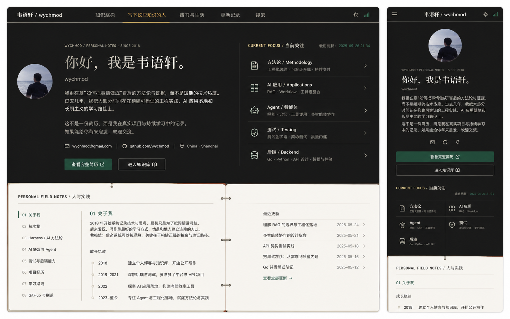

# Image 25：个人主页 / 写下这些知识的人



> 状态：可实施，但实施前需要作者确认公开信息
> 对应提示词：P025
> 目标文件：`docs/me.html`
> 关联文件：`docs/assets/css/me-page.css`、`docs/assets/js/me-page.js`
> 内容真相来源：当前 `me.html` 的真实姓名、wychmod 身份、`/_media/totsand.jpg` 头像/照片、邮箱、GitHub、教育经历、工作经历、技术栈、项目经历、GitHub 动态区、联系方式和 mailto 表单。
> 实现边界：这是“作者页 / 个人主页”，不是完整简历页。完整求职履历放在 `resume.html`；本页重点是“这个知识库背后的人、方法、关注点和长期实践”。

---

## 1. 给实现模型的任务入口

你要把 `docs/me.html` 改造成参考图所示的“写下这些知识的人”页面。它应该延续首页“研究者的数字书房”气质：上半部是深色作者封面，表达一个真实的人如何学习、工作、写作和沉淀；下半部是纸白 field notes，像摊开的个人现场笔记，继续承载关于我、成长轨迹、当前关注、技术栈、项目经历、GitHub 与联系入口。

这页不是简单名片，也不是把完整简历复制一遍。它的核心任务是回答：

```text
谁在写这些知识？
他为什么写？
他现在关注什么？
我应该从哪里继续了解他？
```

当前真实页面结构包括：

- 顶部导航：
  - brand：`wychmod / 云端名片`
  - 锚点：关于我、项目经历、技术栈、GitHub、联系方式
  - 完整简历入口：`/resume.html`
  - GitHub 外链
  - 移动端导航开关
- Hero：
  - 姓名：`韦语轩`
  - 别名：`wychmod`
  - 角色动态文案：AI 应用开发工程师、Harness / 上下文工程沉淀者等
  - 求职方向状态
  - 北京石油化工学院人工智能研究院硕士、京东在职经历、AI 应用/测试开发等事实
  - CTA：查看完整简历、邮件联系、GitHub
  - 右侧终端风格信息卡
- 统计区：
  - 京东在职经验
  - 持续交付覆盖应用
  - 覆盖率提升
  - GMV 项目等指标
- 关于我：
  - AI 应用开发 / 测试开发
  - AI 化测试、dongTDD、BAGENT、精准测试、Harness、MCP/A2A、Agent 等叙述
  - 个人照片：`/_media/totsand.jpg`
  - 价值列表
- 技术栈：
  - Harness / AI 方法论
  - AI 协议 / Agent / 大模型
  - MBT 用例生成 / AI 评测
  - Python / 后端开发
  - Java / 微服务生态
  - 数据库 / 数据治理
  - 测试 / DevOps / 压测
  - AI 开发工具栈
  - 技术条动画
- 项目经历：
  - AI Agent 平台 Harness 沉淀 / AI 工程化方法论
  - test-generator
  - openai-gateway
  - agent-v
  - 精准测试平台
  - db-router-springboot-starter
  - 知识站点 wychmod.github.io
- GitHub：
  - 静态贡献图 `docs/assets/img/github-contrib.svg`
  - 动态热力图候选源
  - GitHub API 统计
  - 语言统计
  - 网络失败降级
- 联系方式：
  - 邮箱：`wychmod@foxmail.com`
  - GitHub：`github.com/wychmod`
  - 个人博客：`wychmod.github.io`
  - 电话
  - mailto 表单
- 脚本：
  - 导航滚动阴影
  - 移动端导航开关
  - IntersectionObserver 渐进显示
  - 技术条动画
  - GitHub 多源加载与降级
  - marked 动态加载
  - mailto 表单校验
  - 锚点平滑滚动和 active nav

参考图中出现但当前页面未按该形式实现的能力：

- 顶部深色出版物导航：
  - 左：`书语轩 / wychmod` 或真实品牌名
  - 中：知识结构、写下这些知识的人、读书与生活、更新记录、其他入口
  - 右：主题/状态类图标
- 深色作者封面：
  - 左侧真实圆形照片
  - eyebrow：`WYCHMOD / PERSONAL NOTES · SINCE 2018`
  - 大标题：`你好，我是韦语轩。`
  - 作者名：`wychmod`
  - 两段克制自述
  - 联系方式行：邮箱、GitHub、位置
  - CTA：查看完整简历、进入知识库
- 右侧 Current Focus：
  - 标题：`CURRENT FOCUS / 当前关注`
  - 最后更新
  - 五个关注条目：方法论、AI 应用、Agent、测试、后端
  - 每行有专业图标、标题、短说明和箭头
- 纸白 field notes：
  - 标题：`PERSONAL FIELD NOTES / 人与实践`
  - 左侧目录：关于我、技术栈、Harness / AI 方法论、AI 协议与 Agent、测试与后端能力、项目经历、学习路线、GitHub 与联系
  - 中间正文：关于我、成长轨迹时间线
  - 右侧：最近更新列表
  - 中间有书页装订/摊开纸张的视觉暗示
- 移动端：
  - 顶部品牌居中，左 hamburger，右主题/状态图标
  - 照片居中
  - 大标题居中
  - 联系方式变小图标行
  - CTA 全宽
  - Current Focus 变两列卡片
  - 纸白 field notes 单列阅读

这些能力可以新增，但必须真实：

- `SINCE 2018` 只有在作者确认或源码中有明确依据时才能展示；否则用 `SINCE 2024`、`PERSONAL NOTES` 或直接隐藏年份。
- `最后更新：2025-05-26 21:34` 不能照抄参考图；必须来自真实提交、真实文档修改记录，或隐藏时间。
- `China · Shanghai` 不能照抄参考图；当前简历/个人页更多指向北京，如作者未确认位置，只显示 `China` 或不显示位置。
- `wychmod@gmail.com` 不能照抄参考图；当前真实邮箱是 `wychmod@foxmail.com`，除非作者确认变更。
- `Current Focus` 条目必须来自当前页面真实内容和知识库真实分类，不得为了填满而虚构。
- 最近更新列表必须来自真实主线文档或当前页面真实项目更新，不得照抄参考图标题日期。
- 个人照片必须使用已有真实资产 `/_media/totsand.jpg` 或 GitHub 头像，不得生成陌生人照片。

实现前必须完整阅读：

- `AGENTS.md`
- `docs/_meta/HOMEPAGE_DESIGN_AND_IMPLEMENTATION.md`
- `docs/me.html`
- `docs/resume.html`
- `docs/assets/css/me-page.css`
- `docs/assets/js/me-page.js`
- `docs/README.md`
- `docs/_sidebar.md`

禁止：

- 从参考图复制未核实的年份、邮箱、位置、更新时间或履历。
- 删掉当前页面的大量真实经历，只留下几句空洞文案。
- 把本页做成完整简历长页；完整简历应该继续由 `resume.html` 承担。
- 继续使用当前蓝紫渐变、紫色高亮、霓虹发光、过度终端风。
- 使用 emoji 作为图标。
- 用 AI 生成头像替代真实照片。
- 在未确认的情况下继续公开电话、单位、指标、绩效、内部项目细节。
- 让 GitHub API 失败时伪造统计数据。
- 让共享 `me-page.css` 改动破坏 `resume.html`。

---

## 2. 参考图视觉审计

### 2.1 整体叙事

第 25 张是“个人主页”，不是“求职简历”。它的视觉叙事是：

```text
深色封面：人、关注点、可信联系方式
    ↓
纸白笔记：实践、成长、最近更新、进一步入口
```

它和首页的关系：

- 首页回答“这个知识库有什么”。
- 个人页回答“谁在持续写这些内容”。
- 简历页回答“这个人的完整工作履历与技能证据”。

因此个人页要更有人味：自述、学习路径、关注主题、照片、最近在做什么；但它不能变成生活博客，也不能编造“读书与生活”的材料。

### 2.2 桌面端画面结构

参考图桌面端宽度约 `1440px`，高度约 `900px`。

布局：

```text
顶部固定深色导航，高约 64px
└─ 深色作者封面，高约 600px
   ├─ 左栏：照片、eyebrow、H1、自述、联系、CTA
   └─ 右栏：Current Focus 列表

纸白 field notes，高度自然增长
└─ 左页：目录 + 关于我 + 成长轨迹
└─ 右页：最近更新
```

深色封面底部与纸白区不是渐变过渡，而是硬切换，像一本书从黑色封面翻到纸白内页。中间有轻微装订感，但不要过度仿古。

### 2.3 移动端画面结构

参考图右侧移动端宽度约 `390px`。

移动端顺序：

```text
移动导航
圆形照片
eyebrow
H1
作者名
自述
联系图标行
CTA：查看完整简历
CTA：进入知识库
Current Focus 两列
纸白 field notes 单列
```

移动端标题居中，这是参考图的核心差异之一；桌面端标题必须左对齐，移动端可以居中，且不要把桌面端也改成居中海报。

### 2.4 顶部导航

桌面参考：

```text
书语轩 / wychmod       知识结构   写下这些知识的人   读书与生活   更新记录   摸桌
```

右侧有两个小图标：一个类似日照/主题，一个类似状态柱。

项目真实导航建议：

```text
wychmod / personal
知识结构
写下这些知识的人
完整简历
工具
联系
```

或：

```text
书语轩 / wychmod
知识结构
写下这些知识的人
完整简历
GitHub
联系
```

注意：

- 如果“书语轩”不是作者确认的展示名，不要写入生产。
- 当前真实姓名为 `韦语轩`，站点品牌为 `wychmod`。
- “读书与生活”“更新记录”如果没有真实页面，可以作为 disabled 文本或不展示；不能做成死链。
- 当前项“写下这些知识的人”用旧金下划线标记。
- 移动端左侧 hamburger 必须有 `aria-label` 和 `aria-expanded`。
- 不使用 `☰` 裸字符作为唯一可访问名称；可以用 SVG 或按钮内视觉符号加 aria。

导航尺寸：

- 高度：`58–66px`。
- 左右 padding：桌面 `40px`，移动 `18px`。
- 背景：`#0D100E`。
- 文字：纸白 `#F2EFE7`。
- 非当前项透明度：`0.68–0.78`。
- 当前项：旧金 `#C8A96B`，底部 1px 线。

### 2.5 深色作者封面

封面背景：

- 主色：`#0D100E`。
- 局部可叠加极轻纹理或径向暗部。
- 不用蓝紫光球。
- 不用大面积网格背景。
- 可以保留首页那种细线和杂志页边距。

桌面封面推荐高度：

- 内容 min-height：`560–640px`。
- 不固定 `100vh`。
- 首屏应露出纸白 field notes 顶部，和首页逻辑一致。

桌面封面内布局：

```text
max-width: 1240–1320px
grid-template-columns: minmax(0, 1.1fr) minmax(380px, 0.9fr)
gap: 64–80px
```

左栏内再做非对称：

```text
照片在左侧偏上
文字主体在照片右侧或下方偏右
```

参考图桌面照片在左侧，文字主体从照片右侧开始；也可以采用：

```text
grid-template-columns: 128px 1fr
```

手机端照片在标题上方居中。

### 2.6 照片

参考图照片是圆形背影海边照。当前项目已有：

```text
docs/_media/totsand.jpg
```

实现要求：

- 优先使用 `/_media/totsand.jpg`。
- 如果这张图加载失败，使用 `W` 字母徽记或 GitHub 头像。
- 桌面尺寸：`104–128px`。
- 移动尺寸：`92–112px`。
- 圆形裁切：`border-radius: 50%`。
- 不加发光环。
- 可加 1px 纸白透明边框。
- `alt` 必须有真实含义，如 `韦语轩的个人照片`。
- 不要生成新照片。

### 2.7 eyebrow

参考图 eyebrow：

```text
WYCHMOD / PERSONAL NOTES · SINCE 2018
```

实现规则：

- 字体：等宽。
- 字号：`11–12px`。
- 字母大写。
- 颜色：`rgba(242,239,231,0.55)`。
- 位置：H1 上方 `18–28px`。

年份处理：

- 如果作者确认从 2018 开始记录技术与思考，可显示 `SINCE 2018`。
- 如果无法确认，使用：

```text
WYCHMOD / PERSONAL NOTES
```

或：

```text
WYCHMOD / KNOWLEDGE NOTES · SINCE 2024
```

不要照抄参考图年份。

### 2.8 H1 与自述

参考图 H1：

```text
你好，我是韦语轩。
```

桌面 H1：

- 左对齐。
- 字号：`54–64px`。
- 行高：`1.08`。
- 字体：中文衬线。
- 颜色：`#F2EFE7`。
- 不使用渐变文字。
- 不使用打字机动态替换 H1。

移动 H1：

- 居中。
- 字号：`32–38px`。
- 行高：`1.15`。

当前 `me.html` 的动态角色可以保留，但不要放在 H1 主视觉中造成跳动。推荐改成 H1 下方小型角色行：

```text
wychmod
AI 应用开发 / 测试开发 · Harness 与上下文工程实践者
```

如果保留动态打字：

- 放在次级位置。
- `prefers-reduced-motion: reduce` 下必须静止。
- 不要导致布局宽度反复变化。

自述文案应更像作者页，而不是简历摘要。推荐候选：

```text
我更在意“如何把事情做成”背后的方法论与证据，而不是短期的技术热度。过去几年，我把大部分时间花在构建可验证的工程实践、AI 应用落地和长期主义的学习路径上。

这不是一份简历，而是我在真实项目与持续学习中的记录。如果能给你带来启发，欢迎交流。
```

如果要保留当前京东、AI 应用开发、测试开发、Harness 等求职信息，建议放进 field notes 或完整简历 CTA 周边，不要让首屏变成密集招聘广告。

### 2.9 联系信息行

参考图桌面联系行：

```text
邮箱 | GitHub | China · Shanghai
```

真实项目建议：

```text
wychmod@foxmail.com
github.com/wychmod
China 或 Beijing
```

规则：

- 邮箱用当前源码 `wychmod@foxmail.com`。
- GitHub 用 `https://github.com/wychmod`。
- 位置必须作者确认；不确认则隐藏位置。
- 电话不要放在首屏，除非作者明确确认公开。
- 图标使用 Lucide 或 inline SVG：
  - mail
  - github
  - map-pin
- 不使用 emoji。
- 桌面行内排列，移动端变成图标行，可仅显示图标但必须有 `aria-label`。

### 2.10 CTA

参考图 CTA：

```text
查看完整简历
进入知识库
```

规则：

- 主 CTA：`查看完整简历`，链接 `/resume.html`。
- 次 CTA：`进入知识库`，链接 `/#/README` 或 `/`。
- 主按钮：绿色 `#24D18F` 或深绿填充，文字纸白/深墨需保证对比。
- 次按钮：透明，纸白边框。
- 桌面宽度 `180–220px`，高度 `44–48px`。
- 移动端全宽。
- 如果加外链图标，使用 SVG，非 emoji。

### 2.11 Current Focus

参考图右栏：

```text
CURRENT FOCUS / 当前关注                 最后更新：2025-05-26 21:34
方法论 / Methodology
AI 应用 / Applications
Agent / 智能体
测试 / Testing
后端 / Backend
```

它在视觉上是一个可点击列表，像索引，不像卡片墙。

真实条目建议从当前页面和知识库内容派生：

1. 方法论 / Methodology
   - 工程化思维、可验证系统、持续交付
   - 可链接到 AI 方法论文档或个人页对应章节。
2. AI 应用 / Applications
   - RAG、Workflow、工具链整合
   - 可链接到 `docs/md/05-AI与Agent/40-大模型应用.md` 或项目区。
3. Agent / 智能体
   - 规划、记忆、工具使用、多智能体协作
   - 可链接到 `docs/md/05-AI与Agent/10-Agent设计模式与多Agent.md`。
4. 测试 / Testing
   - 测试金字塔、契约测试、质量内建
   - 可链接到 `docs/md/06-软件工程/10-软件测试.md`。
5. 后端 / Backend
   - Java、Python、API 设计、数据与存储
   - 可链接到后端或计算机基础分类。

右侧最后更新时间：

- 如果有真实来源，显示。
- 如果没有，改为：

```text
持续更新
```

或隐藏。

视觉：

- 右栏左侧有竖线与左栏分隔。
- 标题等宽旧金。
- 列表行高 `72–86px`。
- 每行左侧 28px 图标。
- 中间标题 `16px`，中英混排。
- 小说明 `12–13px`。
- 右侧箭头。
- 行与行之间 1px 深色分隔线。
- hover/focus 时旧金线条或绿色小点增强。
- 不使用蓝紫图标。

移动端：

- 标题与更新时间同列。
- 五个条目变为两列网格；最后一个可以跨两列或单列。
- 每项高度 `84–96px`。
- 图标在上或左均可，但文本必须可读。

### 2.12 纸白 Field Notes

参考图下半部像摊开的书页：

```text
PERSONAL FIELD NOTES / 人与实践
```

桌面：

- 背景：`#E9E5DC` 或 `#F2EEE5`。
- 内容容器最大宽度：`1240–1320px`。
- 上方有类似纸张边线。
- 两页布局：

```text
左页 58%：目录 + 当前章节正文
右页 42%：最近更新 / 进一步入口
```

中心装订线：

- 可以用 1px 竖线和 2–3 个小金属环表达。
- 不要使用复杂图片装饰。
- 移动端隐藏装订线。

### 2.13 Field Notes 左侧目录

参考图目录：

```text
01 关于我
02 技术栈
03 Harness / AI 方法论
04 AI 协议与 Agent
05 测试与后端能力
06 项目经历
07 学习路线
08 GitHub 与联系
```

它应该映射到当前真实页面，而不是新增死链接。

推荐锚点：

```text
#about
#stack
#methodology 或 #projects 中的 Harness 项目
#agent 或 #stack 中的 AI 协议卡
#testing-backend 或 #stack 中的测试/后端卡
#projects
#learning-path
#github-contact 或 #github / #contact
```

如果不新增独立 section，就让目录跳到现有真实 section：

- 关于我：`#about`
- 技术栈：`#stack`
- Harness / AI 方法论：`#projects` 中 featured Harness 项目
- AI 协议与 Agent：`#stack`
- 测试与后端能力：`#stack`
- 项目经历：`#projects`
- 学习路线：可以是新增小节，必须基于真实学习路径；无来源则改为“成长轨迹”
- GitHub 与联系：`#github` / `#contact`

视觉：

- 左目录宽 `190–230px`。
- 小字号 `13–14px`。
- 当前项旧金或深绿竖线。
- 非当前项灰色。
- 桌面 sticky 可选，field notes 内不一定全页 sticky。
- 移动端变横向 chapter chips 或只展示当前章节。

### 2.14 Field Notes 主正文

参考图首个章节：

```text
01 关于我
2018 年开始系统记录技术与思考...
```

真实内容应使用当前页面的“关于我”事实，但口吻更克制。推荐结构：

```text
01 关于我
我把这座知识库当作长期工程实践的外部记忆。它记录 Java、Python、云原生、AI Agent，也记录判断、方法和反复修正。

工作中，我更关注从模糊问题到可验证系统的过程：如何拆解需求，如何建立反馈，如何让 AI 工具真正进入团队工程流。
```

注意：

- 不要把所有京东项目成绩塞进第一段。
- 具体工作经历和项目证据放到后续 section 或完整简历页。
- 保留当前页面核心能力，但重新组织层级。

### 2.15 成长轨迹

参考图时间线：

```text
2018       建立个人博客与知识库，开始公开写作
2019–2021  深耕后端与测试，参与多个中台与 API 项目
2022       探索 AI 应用落地，构建内部效率工具
2023–至今  专注 Agent 与工程化落地，沉淀方法论与实践
```

实现规则：

- 年份和事件必须来自真实履历或作者确认。
- 当前 `resume.html` 有工作和实习年份：
  - 2019.05 — 2020.02 九章算法实习
  - 2023.03 — 2023.06 上海数字大脑研究院实习
  - 2024.07 — 至今 京东
- 如果要写 `2018`，必须确认。
- 如果不能确认个人博客起始年份，不要写。
- 可以改成：

```text
2019–2020  技术开发实习，开始把工程问题写成可复盘笔记。
2023       后端实习与大模型网关实践，进入 AI 应用工程化。
2024–至今  在真实业务中推进 AI 化测试、质量平台与 Harness 沉淀。
持续中     把项目经验整理成知识库、工具和方法论。
```

视觉：

- 竖向时间线。
- 圆点 `8px`。
- 线条 `rgba(32,33,29,0.18)`。
- 年份等宽旧金。
- 描述正文 `14–15px`。

### 2.16 最近更新

参考图右页：

```text
最近更新
理解 RAG 的边界与工程化落地       2025-05-24
多智能体协作的设计取舍             2025-05-21
API 契约测试实践                   2025-05-18
把测试左移：从需求到质量内建       2025-05-16
Go 并发模式笔记                    2025-05-12
查看全部更新
```

实现规则：

- 不能照抄标题和日期。
- 来源优先：
  1. `docs/README.md` 首页最近更新真实数据。
  2. 主线文档文末修改记录。
  3. `docs/md/Index.md` 或 `_sidebar.md` 的真实文档列表。
- 如果没有可靠最近更新数据，显示“近期关注”而不是“最近更新”，并链接到真实分类。
- 每条必须有真实链接。
- 日期没有来源就不显示。
- 桌面右页最多 5 条。
- 移动端可以折叠为 3 条 + 查看全部。

### 2.17 后续内容：完整个人页而非首屏截图

参考图只展示了首屏和 field notes 开头，但当前个人页还有大量真实内容。实现不能删掉。

建议后续结构：

```text
深色封面
纸白 field notes 开场
├─ 关于我与成长轨迹
├─ 当前关注
├─ 技术栈
├─ 重点项目
├─ GitHub 与开源
└─ 联系方式
```

视觉上可以继续沿用纸白 field notes，不必回到旧的蓝紫卡片。

---

## 3. Design Specification

### 3.1 Purpose Statement

个人页服务于第一次认识作者的人：招聘方、协作者、读者、未来朋友。页面需要先建立真实的人与长期写作动机，再给出可信的技术关注、项目证据和继续联系的路径。它必须比简历更有人文温度，比普通名片更有工程证据。

### 3.2 Aesthetic Direction

唯一审美方向：`Editorial / magazine`，研究者的数字书房。

本页的具体表达是“作者手记 + 个人现场笔记”：深色部分像一本技术书的作者页，纸白部分像摊开的 field notes。人文感来自真实照片、克制自述、成长轨迹和持续更新，而不是咖啡、手写签名或虚构书桌道具。

### 3.3 Color Palette

使用首页规范令牌，替换当前 `me-page.css` 中的蓝紫霓虹令牌。

```css
:root {
  --studio-ink-950: #0D100E;
  --studio-ink-900: #131713;
  --studio-ink-800: #1B201C;
  --studio-paper-100: #E9E5DC;
  --studio-paper-50: #F2EEE5;
  --studio-paper-25: #FBF7EF;
  --studio-paper-line: #C9C3B7;
  --studio-text: #20211D;
  --studio-text-muted: #66685F;
  --studio-on-dark: #F2EFE7;
  --studio-on-dark-muted: #A9AEA7;
  --studio-green: #24D18F;
  --studio-green-dark: #159867;
  --studio-gold: #C8A96B;
  --studio-vermilion: #E6663E;
  --studio-cyan: #58B7C7;
  --studio-focus: #7EE8BC;
}
```

颜色使用：

- 深色封面：`#0D100E`。
- 纸白 field notes：`#E9E5DC` / `#F2EEE5`。
- 正文墨色：`#20211D`。
- 深色区正文：`#F2EFE7`。
- 深色区弱文本：`#A9AEA7`。
- 当前导航、章节编号、focus 标签：`#C8A96B`。
- 主 CTA、在线状态、小型确认：`#24D18F`。
- 错误/警示：`#E6663E`。

禁止：

- 当前 CSS 中的 `--me-blue: #4dabff` 作为主色。
- 当前 CSS 中的 `--me-purple: #a78bff`。
- 蓝紫渐变文字。
- 蓝色 glow shadow。
- 霓虹背景。

### 3.4 Typography

字体遵循首页规范。

```css
:root {
  --studio-font-display: "Source Han Serif SC", "Noto Serif SC", "Songti SC", SimSun, serif;
  --studio-font-body: "Source Han Sans SC", "Noto Sans SC", "Microsoft YaHei", sans-serif;
  --studio-font-mono: "IBM Plex Mono", "JetBrains Mono", Consolas, monospace;
}
```

使用规则：

- H1：display 字体，桌面 `56–64px`，移动 `32–38px`。
- Field notes 标题：display 或 body 加粗，`24–30px`。
- 正文：body，`15–16px`，行高 `1.75–1.9`。
- 注释、日期、eyebrow、技术标签：mono，`11–13px`。
- CTA：body，`14–15px`。

不要把 `Inter`、`Roboto`、`Arial`、`Helvetica`、`system-ui` 或 `-apple-system` 作为首选字体。当前 `me-page.css` 中的 `Inter` 和 Apple system fallback 应替换或后置。

### 3.5 Layout Strategy

桌面采用“深色作者封面 + 纸白双页笔记”的纵向叙事。封面内左侧是人和自述，右侧是当前关注索引，中间用细线隔开。纸白区使用类似书页的双栏布局：左页承载目录与成长轨迹，右页承载最近更新与进一步入口。整体不是卡片栅格，而是出版物版面，靠留白、线条、编号和真实内容建立秩序。

响应式：

- `>= 1200px`：封面左右双栏，field notes 双页。
- `960–1199px`：封面仍双栏但收窄；field notes 可双栏或单页+侧栏。
- `<= 900px`：封面单列，照片与 H1 居中，Current Focus 下移。
- `<= 720px`：移动导航抽屉，CTA 全宽，field notes 单列。
- `<= 420px`：H1 最多三行，focus 卡片两列，正文不小于 `14px`。

### 3.6 Files to Change

主要修改：

- `docs/me.html`
- `docs/assets/css/me-page.css`

谨慎修改：

- `docs/assets/js/me-page.js`

仅当需要满足可访问性、降级和重排行为时修改 JS。

必须联合回归：

- `docs/resume.html`，因为它共用 `me-page.css` 和 `me-page.js`。

不应修改：

- `docs/_coverpage.md`
- `docs/README.md`
- `docs/index.html`
- `docs/assets/css/homepage-v2.css`
- `docs/assets/css/studio-tokens.css`
- `docs/assets/js/homepage-v2.js`
- `docs/md/archive/**`

### 3.7 Behaviors That Must Not Regress

- 移动端导航开关仍能打开/关闭。
- 锚点滚动仍能定位到真实 section。
- active nav 高亮仍可工作。
- IntersectionObserver 渐进显示不导致内容不可见。
- 技术条动画不破坏 reduced-motion。
- GitHub 动态区失败时必须诚实降级。
- `marked` 渲染的项目描述不能执行脚本。
- 联系表单仍校验姓名、邮箱和消息。
- mailto 链接必须正确编码 subject/body。
- `/resume.html`、`/`、GitHub、邮箱链接必须可达。
- 个人页与简历页共用 CSS 后互不污染。

---

## 4. 信息架构重排

### 4.1 推荐整体结构

```html
<body class="me-page personal-notes-page">
  <header class="personal-nav">...</header>
  <main>
    <section class="personal-cover" id="top">...</section>
    <section class="personal-field-notes" id="notes">...</section>
    <section class="personal-stack" id="stack">...</section>
    <section class="personal-projects" id="projects">...</section>
    <section class="personal-github" id="github">...</section>
    <section class="personal-contact" id="contact">...</section>
  </main>
  <footer>...</footer>
</body>
```

可以继续复用现有类名前缀 `me-`，但语义要从“霓虹云端名片”转为“个人笔记页”。为了降低风险，推荐：

- 保留现有 section ID：
  - `#top`
  - `#about`
  - `#stack`
  - `#projects`
  - `#github`
  - `#contact`
- 新增局部 class：
  - `.personal-cover`
  - `.personal-focus`
  - `.personal-field-notes`
  - `.personal-note-index`
  - `.personal-timeline`
- 不一次性重命名所有 JS 依赖类。

### 4.2 首屏内容取舍

当前首屏有大量简历事实和终端 JSON。参考图首屏更克制。

建议首屏保留：

- 真实照片。
- H1：`你好，我是韦语轩。`
- `wychmod`。
- 两段人文自述。
- 邮箱、GitHub、位置。
- CTA：完整简历、进入知识库。
- Current Focus。

建议从首屏下移：

- 详细单位、P5、绩效、GMV、覆盖率等求职型指标。
- 大段 AI 工具清单。
- 终端 JSON 卡。
- 统计卡片。

这些内容不要删除，可以下移到：

- field notes 的“成长轨迹”
- 技术栈
- 项目经历
- 完整简历 CTA 附近

### 4.3 Current Focus 数据模型

建议在 HTML 中直接维护静态数组式结构，避免 JS 生成不可控内容：

```html
<a class="personal-focus-item" href="/#/md/05-AI与Agent/00-AI编程三件套方法论">
  <span class="personal-focus-icon" aria-hidden="true">...</span>
  <span>
    <strong>方法论 / Methodology</strong>
    <small>工程化思维 · 可验证系统 · 持续交付</small>
  </span>
  <span class="personal-focus-arrow" aria-hidden="true">...</span>
</a>
```

可链接候选：

- 方法论：`/#/md/05-AI与Agent/00-AI编程三件套方法论`
- AI 应用：`/#/md/05-AI与Agent/40-大模型应用`
- Agent：`/#/md/05-AI与Agent/10-Agent设计模式与多Agent`
- 测试：`/#/md/06-软件工程/10-软件测试`
- 后端：`/#/md/02-后端开发/00-MySQL数据库`

实现时必须核实这些路径真实存在；如果不存在，要改成 `_sidebar.md` 中真实路径。

### 4.4 Field Notes 与现有 section 的关系

Field Notes 可以作为个人页的新开场，而不是替代所有内容。

推荐：

```text
personal-field-notes
├─ note-index：目录
├─ note-main：关于我 + 成长轨迹
└─ note-aside：最近更新
```

后面继续：

```text
stack
projects
github
contact
```

这样既贴合参考图，也不会丢失当前页面完整内容。

### 4.5 统计信息处理

当前统计：

```text
2+ 京东在职经验
200+ 持续交付覆盖应用
50→80% 业务覆盖率提升
亿级 GMV 主测大项目
```

这些属于高价值事实，必须作者确认。处理策略：

- 如果确认：放在项目经历或简历入口附近，不放首屏。
- 如果未确认：隐藏或改为中性描述，如“AI 应用落地”“质量工程实践”“长期技术写作”。
- 不得新增参考图没有的“参考数”“实践数”等假指标。

---

## 5. 视觉实现细节

### 5.1 背景与纹理

深色区：

```css
background:
  radial-gradient(circle at 15% 0%, rgba(36, 209, 143, 0.06), transparent 28%),
  linear-gradient(180deg, #0D100E 0%, #131713 100%);
```

注意：

- 绿色透明度要低。
- 不使用紫色、蓝色和霓虹光晕。
- 可以加纸纹/噪点，但透明度不超过 `0.035`。

纸白区：

```css
background: #E9E5DC;
```

可加：

- 非图像 CSS 噪点。
- 细线。
- 轻微 inset 阴影表现纸张边界。

不要：

- 大投影卡片。
- 复古污渍。
- 咖啡杯、邮戳、回形针堆叠。

### 5.2 导航细节

CSS 建议：

```css
.personal-nav {
  position: sticky;
  top: 0;
  z-index: 50;
  height: 64px;
  background: rgba(13, 16, 14, 0.94);
  border-bottom: 1px solid rgba(242, 239, 231, 0.14);
  backdrop-filter: blur(14px);
}
```

如果担心浏览器兼容，可不用 blur。

当前项：

```css
.personal-nav-link.is-active::after {
  height: 1px;
  background: #C8A96B;
}
```

移动端：

- 导航高度 `58px`。
- brand 居中。
- 左侧菜单按钮。
- 右侧放一个 GitHub 或主题状态按钮。
- 抽屉背景仍深色。
- 打开抽屉时不要遮住主要内容的焦点顺序。

### 5.3 Hero 排版

桌面左栏推荐：

```text
photo column: 128px
copy column: flexible
```

布局：

```css
.personal-identity {
  display: grid;
  grid-template-columns: 128px minmax(0, 1fr);
  column-gap: 44px;
  align-items: center;
}
```

移动端：

```css
@media (max-width: 720px) {
  .personal-identity {
    display: flex;
    flex-direction: column;
    text-align: center;
  }
}
```

桌面 H1 左对齐；移动 H1 居中。这一点必须满足。

### 5.4 CTA 视觉

主 CTA：

- 背景：`#159867` 或 `#24D18F`。
- 如果背景较深，文字用纸白。
- 如果背景用亮绿，文字用深墨。
- 边框：1px 透明或深绿。

次 CTA：

- 透明。
- 边框：`rgba(242,239,231,0.32)`。
- hover：边框变旧金，文字变纸白。

按钮圆角：`4–6px`。

### 5.5 Current Focus 视觉

桌面：

```css
.personal-focus {
  border-left: 1px solid rgba(242, 239, 231, 0.14);
  padding-left: 48px;
}
```

每行：

```css
.personal-focus-item {
  display: grid;
  grid-template-columns: 34px 1fr 18px;
  gap: 18px;
  min-height: 76px;
  border-bottom: 1px solid rgba(242, 239, 231, 0.12);
}
```

图标：

- 使用 Lucide 或 inline SVG。
- 线宽 `1.5px`。
- 尺寸 `24px`。
- 颜色：纸白弱色，hover 旧金或信号绿。

移动：

```css
.personal-focus-list {
  display: grid;
  grid-template-columns: repeat(2, minmax(0, 1fr));
}
```

`<= 360px` 可改为单列。

### 5.6 Field Notes 双页

桌面容器：

```css
.personal-field-notes {
  background: #E9E5DC;
  color: #20211D;
  padding: 48px 40px 64px;
}

.personal-notebook {
  max-width: 1240px;
  margin: 0 auto;
  display: grid;
  grid-template-columns: minmax(0, 1.1fr) minmax(360px, 0.9fr);
  border: 1px solid rgba(32,33,29,0.2);
  background: #F2EEE5;
}
```

中线：

```css
.personal-notebook::before {
  content: "";
  position: absolute;
  left: 58%;
  top: 0;
  bottom: 0;
  width: 1px;
  background: rgba(32,33,29,0.18);
}
```

如果使用伪元素，要保证移动端隐藏。

装订环：

- 最多 3 个。
- `width: 12px; height: 2px;`
- 旧金或暗线。
- `aria-hidden="true"`。

### 5.7 目录与正文排版

左页内部：

```text
目录宽 180–220px
正文 flex 1
```

CSS：

```css
.personal-note-left {
  display: grid;
  grid-template-columns: 210px minmax(0, 1fr);
  gap: 32px;
}
```

移动：

- 目录变横向滚动 chips。
- 或只保留当前章节摘要。
- 不要让 8 个目录项挤成 8px 字。

正文：

- H3：`24–28px`，旧金编号 + 中文标题。
- 段落行高：`1.8`。
- 每段最大宽度：`620px`。
- 时间线和列表使用细线，不用卡片阴影。

### 5.8 后续 section 统一风格

当前 `stack`、`projects`、`github`、`contact` 是深色蓝紫卡片。新风格建议：

- 如果继续在纸白区：
  - 技术栈为“技能索引表”。
  - 项目为“项目条目 + 证据栏”。
  - GitHub 为“开源记录”。
  - 联系为“信笺式联系方式”。
- 如果局部回到深色区：
  - 只在项目精选处使用深色嵌入，不要整页回到蓝紫霓虹。

不要每个 section 都用圆角大卡片。优先使用：

- 编号。
- 分隔线。
- 列表。
- 小标签。
- 项目摘要 + 证据。

---

## 6. 功能与脚本调整

### 6.1 导航开关

保留当前：

- `.me-nav-toggle`
- `.me-nav-links`
- `aria-expanded`
- `.open`

改进：

- 点击菜单项后关闭移动菜单。
- 按 `Esc` 关闭菜单。
- 菜单打开时按钮 `aria-expanded="true"`。
- 菜单按钮有可见 focus。

### 6.2 滚动阴影与 active nav

保留当前滚动阴影，但颜色改为首页深色体系。

active nav：

- 当前项用旧金线。
- 进入 `#about`、`#stack`、`#projects`、`#github`、`#contact` 时对应高亮。
- “写下这些知识的人”作为页面级 active 项始终高亮也可以；section 级 active 可体现在二级目录。

### 6.3 渐进显示

当前 `IntersectionObserver` 给 `.me-reveal` 做淡入。可保留，但：

- 动画位移不超过 `16px`。
- 动画时长 `240–420ms`。
- `prefers-reduced-motion: reduce` 下立即显示。
- 不要让首屏 H1 延迟太久出现。

### 6.4 技术条动画

当前技术条依赖 `.me-tech-bar i[data-level]`。可保留到技术栈 section。

要求：

- 技术熟练度百分比必须作者确认；否则改成无百分比等级标签。
- 如果保留百分比，视觉要低调，不要发光渐变。
- `reduced-motion` 下直接显示最终宽度或改成静态标签。

### 6.5 GitHub 动态区

当前 JS 会：

- 尝试 ghchart。
- 尝试 GitHub contributions SVG。
- 尝试 streak-stats。
- fetch GitHub API。
- 使用静态 fallback。
- 使用 `renderStatsFallback()` 显示 `200+`、`1.2k+`、`300+` 等数字。

新实现要求：

- 动态失败时不要显示未经核实的夸张数字。
- fallback 改为诚实文本：

```text
GitHub 实时数据暂时不可用。你仍可以访问 github.com/wychmod 查看最新公开记录。
```

- 如果保留静态 `github-contrib.svg`，必须标注数据快照日期；无日期则只说“静态快照”。
- 不要让 GitHub 外部请求失败造成控制台大量 error。

### 6.6 marked 动态渲染

当前 `data-md` 会引入 `marked` CDN 并 `innerHTML = marked.parse(src)`。

风险：

- 如果 `data-md` 全部是作者本地静态内容，风险较低。
- 但仍应开启安全策略或改用可控渲染。

要求：

- 不渲染用户输入。
- 不把联系表单内容交给 marked。
- 如果 marked 加载失败，显示纯文本，不空白。
- 外链 `target="_blank"` 时加 `rel="noopener noreferrer"`。

### 6.7 联系表单

当前是 mailto 兜底。保留。

改进：

- 表单标题不要使用 emoji。
- `subject` 默认中文要 encode。
- `body` 里保留姓名和邮箱。
- 提交前校验：
  - 姓名非空。
  - 邮箱格式。
  - 消息非空。
- 提交后提示：

```text
将打开你的邮件客户端；如果没有弹出，请直接发送到 wychmod@foxmail.com。
```

电话：

- 电话属于敏感信息。
- 作者确认前从页面隐藏，或只保留在完整简历中。
- 如果保留 `tel:`，要确保移动端可点击且文本格式合理。

---

## 7. 内容治理

### 7.1 必须作者确认的信息

实施前列给作者确认：

- 中文展示名：`韦语轩`、是否使用 `书语轩`、是否使用其他笔名。
- 个人照片是否继续使用 `/_media/totsand.jpg`。
- 是否公开电话。
- 是否公开当前公司、职级、绩效、GMV、覆盖率、内部项目名称。
- 位置显示北京、上海、China，还是隐藏。
- 是否显示 `SINCE 2018`。
- 当前关注的最后更新时间来源。
- 技术熟练度百分比是否保留。
- GitHub fallback 数字是否有来源。

如果作者暂未确认：

- 不要阻塞视觉重排，但敏感项先隐藏或改成中性描述。
- 在实现报告里列出“待作者确认后可恢复”的内容。

### 7.2 推荐保留的真实内容

- `韦语轩 (wychmod)`。
- `wychmod@foxmail.com`。
- `github.com/wychmod`。
- `wychmod.github.io`。
- AI 应用开发 / 测试开发。
- Harness / 上下文工程。
- MCP / A2A。
- Agent 设计模式。
- MBT 用例生成。
- 精准测试、JaCoCo、测试/DevOps。
- Java、Python、Spring、FastAPI、数据库、云原生。
- 当前项目列表和开源链接。

### 7.3 需要降噪的内容

当前页面首屏太像“把所有亮点一次性塞给招聘方”。参考图的人文感更强，因此：

- 首屏减少强绩效叙述。
- 项目指标放到项目区。
- AI 工具清单放到技术栈或简历。
- “Open to work” 不要成为唯一焦点。
- “云端名片”可以保留在 meta，但页面视觉主标题改为作者页。

### 7.4 推荐文案

页面级标题：

```text
你好，我是韦语轩。
```

作者名：

```text
wychmod
```

自述第一段：

```text
我更在意“如何把事情做成”背后的方法论与证据，而不是短期的技术热度。过去几年，我把大部分时间花在构建可验证的工程实践、AI 应用落地和长期主义的学习路径上。
```

自述第二段：

```text
这不是一份简历，而是我在真实项目与持续学习中的记录。如果能给你带来启发，欢迎交流。
```

如果需要更贴近当前履历：

```text
我在 AI 应用开发、测试工程、Harness 与上下文工程之间工作，尝试把模糊需求变成可验证、可交付、可复盘的系统。
```

Field Notes 标题：

```text
PERSONAL FIELD NOTES / 人与实践
```

Current Focus：

```text
CURRENT FOCUS / 当前关注
```

CTA：

```text
查看完整简历
进入知识库
```

---

## 8. 可直接复制给实现模型的指令

```text
请在现有仓库中实现 Image 25：个人主页 / 写下这些知识的人。不要新建 Demo，不要迁移框架，直接修改 docs/me.html 和 docs/assets/css/me-page.css；只有在导航、GitHub 降级、动效或表单行为需要时，才最小修改 docs/assets/js/me-page.js。由于 resume.html 共用 me-page.css 和 me-page.js，完成后必须联合回归 resume.html。

实现前必须阅读：
1. AGENTS.md
2. docs/_meta/HOMEPAGE_DESIGN_AND_IMPLEMENTATION.md
3. docs/me.html
4. docs/resume.html
5. docs/assets/css/me-page.css
6. docs/assets/js/me-page.js
7. docs/README.md
8. docs/_sidebar.md

DESIGN SPECIFICATION
1. Purpose Statement:
   个人页要让第一次认识作者的人理解：谁在写这个知识库、为什么写、现在关注什么、如何继续了解或联系。它不是完整简历页，而是作者手记和个人现场笔记；完整履历由 resume.html 承担。
2. Aesthetic Direction:
   Editorial / magazine，研究者的数字书房。具体表达为“作者手记 + 个人 field notes”：深色封面呈现人和当前关注，纸白内页呈现实践、成长轨迹、技术栈、项目和联系。
3. Color Palette:
   #0D100E 暖石墨深色封面；#E9E5DC 和 #F2EEE5 纸白笔记；#20211D 正文墨色；#F2EFE7 深色区文字；#A9AEA7 深色区弱文本；#C8A96B 旧金编号和当前项；#24D18F 主 CTA 和状态；#E6663E 错误/警示。替换当前蓝紫渐变和霓虹发光。
4. Typography:
   H1 和关键标题使用 "Source Han Serif SC", "Noto Serif SC", "Songti SC", SimSun, serif；正文使用 "Source Han Sans SC", "Noto Sans SC", "Microsoft YaHei", sans-serif；eyebrow、日期、标签、技术字段使用 "IBM Plex Mono", "JetBrains Mono", Consolas, monospace。不要把 Inter、Roboto、Arial、Helvetica、system-ui 或 -apple-system 作为首选字体。
5. Layout Strategy:
   桌面为深色封面双栏：左侧真实照片、H1、自述、联系和 CTA；右侧 Current Focus 列表。下方纸白 field notes 为双页布局：左页目录 + 关于我 + 成长轨迹，右页最近更新/进一步入口。移动端封面单列，照片与 H1 居中，CTA 全宽，Current Focus 两列，field notes 单列。
6. Files to change:
   docs/me.html、docs/assets/css/me-page.css；必要时 docs/assets/js/me-page.js。不得修改 docs/_coverpage.md、docs/README.md、docs/index.html、homepage-v2.css、studio-tokens.css、homepage-v2.js 和 docs/md/archive/**。
7. Behaviors that must not regress:
   移动导航、锚点跳转、active nav、IntersectionObserver 显示、技术条、GitHub 降级、marked 渲染、联系表单校验、mailto 编码、完整简历/知识库/GitHub/邮箱链接都必须可用；resume.html 不得被共享 CSS/JS 破坏。

请把当前首屏从“蓝紫云端名片 + 终端 JSON + 密集求职亮点”改成参考图的“写下这些知识的人”：
顶部深色导航，高约 64px。左侧品牌用 wychmod / personal 或作者确认后的书语轩 / wychmod。中间导航包含知识结构、写下这些知识的人、完整简历、工具、联系等真实入口；当前项用旧金下划线。没有真实页面的“读书与生活”“更新记录”不要做死链。移动端左侧菜单按钮、品牌居中、右侧保留真实 GitHub/状态入口。

深色封面背景使用 #0D100E，不要蓝紫光球。桌面 max-width 1240–1320px，左右双栏。左栏使用现有真实照片 /_media/totsand.jpg，圆形裁切，桌面 104–128px，移动 92–112px，加载失败显示 W 徽记。H1 为“你好，我是韦语轩。”，桌面左对齐 56–64px，移动居中 32–38px。H1 不使用渐变，不使用打字机动态。wychmod 作为 H1 下方作者名或副标题。

eyebrow 可写 WYCHMOD / PERSONAL NOTES；只有作者确认时才加 SINCE 2018。不要照抄参考图年份。自述使用克制的人文口吻，推荐两段：第一段讲“如何把事情做成”的方法论与证据，第二段讲这不是简历而是真实项目与持续学习记录。详细公司、职级、绩效、GMV、覆盖率等求职型信息下移到项目区或完整简历。

联系信息行使用真实邮箱 wychmod@foxmail.com、GitHub github.com/wychmod，以及作者确认后的位置。不要照抄参考图的 Gmail 或 Shanghai。图标使用专业 SVG/Lucide，不使用 emoji。电话属于敏感信息，作者确认前从个人页隐藏或只放完整简历。

CTA 两个：查看完整简历链接 /resume.html，进入知识库链接 /#/README 或 /。桌面按钮 44–48px 高，移动端全宽。主按钮用信号绿，次按钮透明描边。

右侧实现 Current Focus / 当前关注。标题为 CURRENT FOCUS / 当前关注，更新时间只有真实来源时显示，否则写“持续更新”或隐藏。五个条目来自真实内容：方法论 / Methodology、AI 应用 / Applications、Agent / 智能体、测试 / Testing、后端 / Backend。每项有 SVG 图标、中文/英文标题、短说明、箭头和真实链接。推荐链接到知识库真实文档：AI 编程方法论、大模型应用、Agent 设计模式、软件测试、后端开发。实施时必须核实路径存在。

深色封面下方实现纸白 PERSONAL FIELD NOTES / 人与实践。背景 #E9E5DC，内页 #F2EEE5。桌面像摊开的两页笔记：左页为目录 + 关于我 + 成长轨迹，右页为最近更新/继续阅读。中间可以用 1px 装订线和最多 3 个小装订环表达书页感，移动端隐藏装订线。

Field Notes 左侧目录包含：01 关于我、02 技术栈、03 Harness / AI 方法论、04 AI 协议与 Agent、05 测试与后端能力、06 项目经历、07 成长轨迹、08 GitHub 与联系。目录必须跳到真实 section 或新增真实 section，不要死链。当前项用旧金竖线。

Field Notes 主正文使用当前页面真实事实重新组织，不要删掉内容。关于我段落更克制：把知识库当作长期工程实践的外部记忆，记录 Java、Python、云原生、AI Agent，也记录判断、方法与反复修正。成长轨迹年份必须来自真实履历或作者确认；如果不能确认 2018，不要写 2018。可用真实简历年份：2019–2020 九章算法实习，2023 上海数字大脑研究院实习，2024 至今京东，持续中整理知识库与方法论。

右页最近更新不能照抄参考图标题和日期。优先从 docs/README.md 首页最近更新或主线文档修改记录提取 3–5 条真实更新；没有可靠来源则改名为“近期关注”，链接到真实分类。每条必须有真实 href。

后续 section 保留当前真实内容：技术栈、项目经历、GitHub、联系方式。把它们从蓝紫霓虹卡片改成纸白 field notes 风格：编号、细线、标签、项目证据、克制留白。项目经历不能丢：Harness、test-generator、openai-gateway、agent-v、精准测试平台、db-router、知识站点都要保留。GitHub 动态失败时不要显示未经核验的 200+、1.2k+ 等 fallback 数字，改为诚实降级文案并保留 GitHub 外链。

替换 CSS 令牌：把当前 me-page.css 中的蓝紫主色、紫色渐变文字、蓝色 glow shadow、霓虹背景替换为首页 studio palette。圆角不超过 6px 为主，少数图片或大容器可 8px；不要使用 pill 作为主要语言。移除 emoji 作为视觉图标，改用 SVG、文本缩写或 Lucide。

保留 JS 功能：移动导航开关、滚动阴影、锚点平滑、active nav、IntersectionObserver、技术条、GitHub 降级、marked、联系表单。新增 Esc 关闭移动菜单；reduced-motion 下停止 H1 打字或所有显著动画；toast/提示不抢焦点。若 H1 不再使用动态打字，相关 JS 应安全无操作。

响应式要求：1440×900 桌面首屏看到完整深色封面和纸白 field notes 顶部；1280×800 导航不挤；1024×768 双栏若拥挤则切单列；768×1024 照片和标题居中、focus 下移；390×844 按参考图移动端，照片居中、H1 居中、CTA 全宽、focus 两列、field notes 单列；360×800 不横向溢出，按钮点击区域不小于 44px。

完成后验证：
1. 桌面和移动导航开关、Esc、锚点跳转、active nav。
2. /resume.html、/#/README、GitHub、邮箱、项目链接、知识库文档链接。
3. GitHub 在线、慢网、断网或 API 限流时的降级。
4. 联系表单空值、非法邮箱、合法输入、mailto subject/body 编码。
5. marked 加载失败时项目描述不空白。
6. prefers-reduced-motion 下无明显动画。
7. 1440、1280、1024、768、390、360 视口无重叠和横向溢出。
8. resume.html 共享样式/脚本无破坏。
9. git diff --check 通过。
10. 未修改 docs/md/archive/** 和首页运行文件。
```

---

## 9. 验证清单

### 9.1 内容真实性

检查：

- 页面没有照抄 `wychmod@gmail.com`。
- 页面没有未经确认显示 `China · Shanghai`。
- 页面没有未经确认显示 `SINCE 2018`。
- 页面没有未经确认显示参考图的更新时间。
- 页面没有新增虚构项目、职位、学历、奖项、书目。
- 当前真实项目没有被删除。
- 电话公开状态已经作者确认；未确认则隐藏。

### 9.2 桌面视觉

视口：

- `1440 × 900`
- `1280 × 800`

检查：

- 顶部深色导航高度稳定。
- 当前项“写下这些知识的人”或等价项旧金高亮。
- 深色封面桌面 H1 左对齐。
- 照片、H1、自述、联系、CTA 形成清楚层级。
- Current Focus 在右侧，与左栏有细线分隔。
- 纸白 field notes 顶部在首屏底部可见。
- 不再出现蓝紫渐变主视觉。
- 不再出现终端 JSON 抢占个人页首屏。

### 9.3 移动视觉

视口：

- `390 × 844`
- `360 × 800`

检查：

- 顶部 hamburger、品牌、右侧入口不重叠。
- 照片居中。
- H1 居中。
- 自述可读，行高舒适。
- 联系方式图标行可点击且有 aria-label。
- CTA 全宽。
- Current Focus 两列或小屏单列。
- Field Notes 单列，不出现双页装订线挤压。
- 没有横向滚动。

### 9.4 导航与链接

检查：

- `知识结构` 指向真实知识库入口。
- `写下这些知识的人` 指向当前页或 `#top`。
- `完整简历` 指向 `/resume.html`。
- `工具` 指向 `/tools/` 或真实工具首页。
- `联系` 指向 `#contact`。
- Current Focus 每个链接真实存在。
- Field Notes 目录每项都能跳转。
- 点击移动菜单内链接后菜单关闭。
- `Esc` 可关闭移动菜单。

### 9.5 JS 行为

检查：

- 首屏无 JS error。
- 页面不存在 `#me-typed` 时脚本安全返回。
- 保留动态角色时 reduced-motion 下静止。
- IntersectionObserver 不会让内容永久透明。
- 技术条进入视口后显示；reduced-motion 下可读。
- active nav 与当前 section 匹配。

### 9.6 GitHub 降级

模拟：

- 正常网络。
- 禁用网络。
- GitHub API 403 或失败。

检查：

- 正常时显示可用热力图/统计。
- 失败时显示诚实降级文案。
- 不显示未经核实的 `200+`、`1.2k+`、`300+`。
- GitHub 外链仍可见。
- 控制台最多警告，不出现阻塞 error。

### 9.7 联系表单

测试：

- 空姓名。
- 空消息。
- 非法邮箱。
- 合法姓名、邮箱、主题和消息。

预期：

- 表单提示清晰。
- 合法提交生成 `mailto:wychmod@foxmail.com?...`。
- subject 和 body 经过 `encodeURIComponent`。
- 表单不发送到未知后端。
- 提示不抢焦点。

### 9.8 与简历页联合回归

打开：

- `/me.html`
- `/resume.html`

检查：

- 两页导航样式都正确。
- `resume.html` 的简历内容没有被个人页 field notes 样式挤坏。
- 打印按钮如果在简历页存在，仍可调用 `window.print()`。
- 简历页的 section 锚点仍可跳转。
- 共享按钮、标签、字体和颜色一致但页面语义不同。

### 9.9 静态检查

执行：

```bash
git diff --check
```

人工检查：

- 没有修改 `docs/md/archive/**`。
- 没有修改首页运行文件。
- 没有新增紫色、蓝紫渐变、emoji 图标。
- 没有新增死链。
- 没有新增对用户隐私无关的外部追踪脚本。

---

## 10. 最终验收标准

- 个人页首屏像首页体系中自然生长出来的“作者页”，而不是旧的蓝紫求职落地页。
- 桌面端大标题左对齐，移动端大标题居中。
- 真实照片、真实联系方式和真实关注点建立人的存在感。
- Current Focus 可点击、可信、与知识库内容相连。
- Field Notes 纸白区有人文感，但不伪造书目、时间、经历和更新。
- 当前页面已有的重要真实内容没有丢失，只是层级更清楚。
- 敏感个人信息有确认机制，未确认不强行公开。
- GitHub、联系表单、导航、锚点、动画和移动布局无回归。
- `resume.html` 没有被共享样式破坏。
