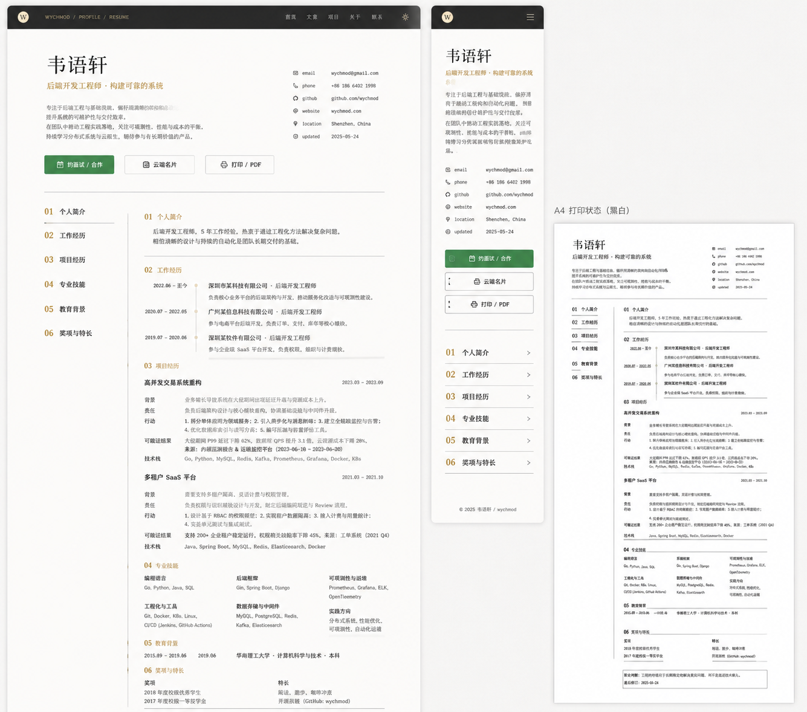

# Image 26：完整简历 / Resume + A4 Print



> 状态：可实施，但实施前需要作者确认隐私与公开范围
> 对应提示词：P026
> 目标文件：`docs/resume.html`
> 关联文件：`docs/assets/css/me-page.css`、`docs/assets/js/me-page.js`
> 内容真相来源：当前 `resume.html` 的个人简介、工作经历、项目经历、专业技能、教育背景、奖惩情况、特长及突出业绩、联系方式、打印按钮和共用个人页脚本。
> 实现边界：这是“完整简历页 + A4 打印样式”，不是个人作者页。它必须屏幕可读、锚点可达、打印专业；不能从参考图复制任何未核实身份信息，也不能为了塞进一页 A4 缩到不可读。

---

## 1. 给实现模型的任务入口

你要把 `docs/resume.html` 改造成参考图所示的“完整简历 / RESUME”页面。它要和第 25 张个人页共享同一套首页派生视觉系统，但页面职责不同：个人页讲“写下这些知识的人”，简历页讲“这个人的完整履历、项目证据和联系方式”。

这页需要同时满足两种状态：

```text
屏幕阅读状态：顶部导航 + 简历头部 + 左侧目录 + 右侧正文 + 可点击 CTA
打印 / PDF 状态：A4 纸张 + 黑白可读 + 隐藏导航和按钮 + 合理分页
```

当前真实页面结构包括：

- 顶部导航：
  - brand：`wychmod / 完整简历`
  - 锚点：个人简介、工作经历、项目经历、专业技能、教育背景、奖惩情况、特长业绩
  - 返回名片入口：`/me.html`
  - 移动端导航开关
- 简历 Header：
  - 姓名：`韦语轩`
  - 定位：AI 应用开发工程师 / 测试开发、京东政企供应链质量负责人(P5)、寻求 AI 应用开发/大模型落地方向机会
  - 联系方式：
    - 电话：`17376512950`
    - 邮箱：`wychmod@foxmail.com`
    - GitHub：`github.com/wychmod`
    - 个人站：`wychmod.github.io`
    - 位置：北京
  - CTA：
    - 约面试 / 合作
    - 查看云端名片
    - 打印 / 导出 PDF
- `#summary` 个人简介：
  - 京东政企事业部在职 2 年
  - AI 应用开发 / 测试开发工程师
  - 北石化人工智能研究院硕士
  - dongTDD、BAGENT、精准测试、全链路压测
  - Harness / CLAUDE.md、SDD/TDD、MCP/A2A、Agent 设计模式
- `#work` 工作经历：
  - 京东 · 政企事业部，2024.07 — 至今
  - 上海数字大脑研究院实习，2023.03 — 2023.06
  - 九章算法实习，2019.05 — 2020.02
- `#projects` 项目经历：
  - Hify / Harness / AI 工程化方法论
  - test-generator
  - openai-gateway
  - agent-v
  - 精准测试平台
  - db-router-springboot-starter
  - 知识站点 wychmod.github.io + youdaonote-pull
  - mini-spring
- `#skills` 专业技能：
  - AI 战略 / Harness / 方法论
  - AI 协议 / Agent / 大模型应用工程化
  - MBT 用例生成 / AI 评测体系
  - AI 开发工具栈
  - Python / 后端开发
  - Java / 微服务
  - 数据库 / 数据治理 / 缓存
  - 测试 / DevOps / 压测
- `#education` 教育背景：
  - 北京石油化工学院 · 人工智能研究院，2021.09 — 2024.06
  - 浙江传媒学院，2016.09 — 2020.06
- `#awards` 奖惩情况：
  - 工作期间荣誉
  - 在校期间奖项
- `#strengths` 特长及突出业绩：
  - Harness 沉淀
  - AI 协议与 Agent 生态理解
  - 传统业务 AI 化转型
  - 业务理解与产品用户视角
  - 跨部门协作与影响力
  - 前沿敏感与持续学习
  - 核心量化成果
- 页脚：
  - 返回云端名片
  - 返回知识站
  - 邮箱
- 脚本：
  - 共用 `me-page.js`
  - 移动导航
  - 锚点滚动和 active nav
  - 其他个人页功能在本页缺少 DOM 时应安全无操作
- 当前内联 print style：
  - 只隐藏了导航、背景、按钮、页脚
  - 没有完整 A4、分页、字体、链接、断页和黑白规则

参考图中出现但当前页面未按该形式实现的能力：

- 顶部深色导航与左侧圆形 W 标识。
- breadcrumb：`WYCHMOD / PROFILE / RESUME`。
- 白纸简历头部：
  - 左侧姓名与定位。
  - 右侧紧凑联系表。
  - CTA 三枚按钮。
- 屏幕正文：
  - 左侧 sticky 简历目录。
  - 右侧正文。
  - 章节编号 `01–06` 用旧金。
  - 细线分隔，内容像专业履历，不是卡片流。
- 移动端：
  - 顶部深色短导航。
  - 姓名、定位、摘要、联系方式纵向堆叠。
  - CTA 三个全宽按钮。
  - 章节目录变成列表，每项右侧箭头。
- A4 打印状态：
  - 黑白纸张预览。
  - 顶部姓名和联系信息紧凑。
  - 左侧目录/编号。
  - 正文密度更高但仍可读。
  - 隐藏导航、按钮、背景和屏幕装饰。

这些能力可以新增，但必须真实：

- 参考图中的姓名、邮箱、电话、地区、更新时间、公司、日期都是视觉占位，不能复制。
- 当前真实邮箱是 `wychmod@foxmail.com`，不是参考图的 Gmail。
- 当前真实电话是源码里的 `17376512950`，但电话是敏感信息，公开前必须作者确认。
- 当前位置为北京；参考图的 Shenzhen 不能照抄。
- `updated 2025-05-24` 不能照抄；若没有真实更新时间来源，应隐藏或改成“内容更新以仓库为准”。
- 当前完整简历内容很长，默认打印可以多页；不要强行压成一页导致 8px 字体不可读。
- 如果作者需要“一页精简版”，必须另建独立 print summary 或简历摘要模式，不要删改完整简历。

实现前必须完整阅读：

- `AGENTS.md`
- `docs/_meta/HOMEPAGE_DESIGN_AND_IMPLEMENTATION.md`
- `docs/resume.html`
- `docs/me.html`
- `docs/assets/css/me-page.css`
- `docs/assets/js/me-page.js`

禁止：

- 从参考图复制虚构身份、邮箱、电话、位置、更新时间、公司和项目。
- 为了匹配 A4 截图删除当前真实履历。
- 强行把完整简历压成一页。
- 继续使用蓝紫渐变、紫色变量、霓虹 glow。
- 使用 emoji 作为图标或按钮图标。
- 打印时保留顶部导航、按钮、背景纹理、阴影和屏幕 CTA。
- 在 print CSS 中使用深色背景导致黑白打印费墨或不可读。
- 改动共享 CSS 后不回归 `me.html`。

---

## 2. 参考图视觉审计

### 2.1 页面整体

参考图左侧是桌面网页，右侧上方是移动端，右侧下方是 A4 打印状态。三种状态是一套简历系统，不是三套独立设计。

核心视觉：

```text
深色导航
白纸简历头部
细线分隔
旧金编号
左目录 / 右正文
移动端纵向目录
A4 黑白打印
```

它要比个人页更专业、更克制、更密集。个人页可以有人文叙事；简历页要让招聘方快速扫描事实、时间、职责、结果和证据。

### 2.2 顶部导航

参考图桌面：

```text
W   WYCHMOD / PROFILE / RESUME                         首页  文章  项目  关于  联系  主题
```

实现建议：

- 左侧 W 圆形标识，尺寸 `28–32px`。
- breadcrumb 用等宽小字：

```text
WYCHMOD / PROFILE / RESUME
```

- 右侧链接：
  - 首页：`/`
  - 文章：`/#/README` 或知识库入口
  - 项目：`#projects`
  - 关于：`/me.html`
  - 联系：`#contact` 或 header 联系区
- 如果没有独立联系 section，可链接到 `mailto:wychmod@foxmail.com` 或 header。
- 当前 `resume.html` 的 section 锚点导航可以下沉为左侧目录，不必全部放顶部。

导航视觉：

- 高度：`56–64px`。
- 背景：`#0D100E`。
- 底线：`rgba(242,239,231,0.14)`。
- 文字：纸白和弱纸白。
- 当前页标记：旧金。
- 不使用蓝紫按钮。

移动导航：

- 高度：`52–58px`。
- 左侧 W，右侧 hamburger。
- 不把所有章节链接挤进顶部。

### 2.3 简历 Header

参考图桌面 Header 是白纸区域上方，左右分栏：

```text
左：姓名、职位、副标题、简介、CTA
右：email / phone / github / website / location / updated
```

当前真实内容建议：

左侧：

```text
韦语轩
AI 应用开发工程师 / 测试开发
```

定位副标题可沿用当前：

```text
京东政企供应链质量负责人(P5) · Harness 与大模型落地实践者
```

但 `P5`、当前单位等公开范围需要作者确认。

简介：

- 2–4 行。
- 不要把当前个人简介三段全部放在 Header。
- Header 摘要应像电梯陈述：

```text
专注于 AI 应用工程化、测试开发与质量平台建设。擅长把模糊需求沉淀为可验证的工程系统，并将 Harness / SDD / TDD 等方法落到真实业务交付中。
```

右侧联系表：

```text
email      wychmod@foxmail.com
phone      作者确认后显示
github     github.com/wychmod
website    wychmod.github.io
location   Beijing, China 或作者确认位置
updated    真实来源，否则隐藏
```

视觉：

- Header 最大宽度 `1180–1240px`。
- 左右 padding `40–48px`。
- 顶部距导航 `48–64px`。
- H1 字号桌面 `48–58px`。
- H1 字体中文衬线。
- 联系表使用等宽或紧凑无衬线，字号 `12–13px`。
- 每行 label 与 value 对齐。
- 联系图标使用 SVG 或文字 label，不使用 emoji。

移动：

- 姓名置顶，字号 `36–42px`。
- 联系方式纵向 list，间距紧凑。
- CTA 三个全宽按钮。

### 2.4 CTA 按钮

参考图按钮：

```text
约面试 / 合作
云端名片
打印 / PDF
```

真实实现：

- 主 CTA：
  - `约面试 / 合作`
  - `mailto:wychmod@foxmail.com?subject=约面试 / 合作`
- 次 CTA：
  - `云端名片`
  - `/me.html`
- 打印按钮：
  - `type="button"`
  - 调用 `window.print()`

视觉：

- 主按钮：深绿或信号绿。
- 次按钮：白纸按钮，墨色边框。
- 打印按钮：白纸按钮，墨色边框。
- 高度 `44–48px`。
- 圆角 `4–6px`。
- 图标使用 SVG，不使用 emoji。
- 打印时所有按钮隐藏。

### 2.5 桌面正文布局

参考图正文：

```text
左侧目录 160–190px
右侧正文 720–860px
```

推荐：

```css
.resume-document {
  max-width: 1180px;
  margin: 0 auto;
  display: grid;
  grid-template-columns: 190px minmax(0, 1fr);
  gap: 42px;
}
```

左目录：

- sticky：`top: 88px`。
- 只在屏幕端 sticky。
- 章节编号旧金。
- 文本墨色。
- 当前项可旧金或左线。
- 目录不使用卡片背景。

右正文：

- 章节按 `01–06` 编号。
- 每个 section 顶部边线。
- 每个 entry 用细线分隔。
- 不用大阴影卡片。
- 技术标签像履历中的关键词，不像产品标签墙。

### 2.6 章节数量与目录映射

参考图目录有 6 项：

```text
01 个人简介
02 工作经历
03 项目经历
04 专业技能
05 教育背景
06 奖项与特长
```

当前页面有 7 个 section：

```text
summary
work
projects
skills
education
awards
strengths
```

推荐视觉上合并 `awards` 和 `strengths` 为第 06 项：

```text
06 奖项与特长
```

但不要丢失锚点和内容。可以：

- 保留两个内部子锚点：
  - `id="awards"`
  - `id="strengths"`
- 左目录第 06 项跳到 `#awards`。
- 在 `#awards` 章节内包含“奖惩情况”和“特长及突出业绩”两个二级标题。

如果不合并，也可保留 7 项目录，但会偏离参考图。推荐合并，视觉更简洁。

### 2.7 Entry 排版

每段经历建议使用四层结构：

```text
标题：公司 / 项目名
副标题：角色 / 类型 / 时间 / 地点
正文：职责与行动
证据：结果、指标、链接、技术栈
```

工作经历 entry：

```text
京东 · 政企事业部
测试开发工程师 / 政企供应链业务线质量负责人(P5)    2024.07 — 至今
北京·亦庄
```

正文中当前 `一、二、三、四、五、六` 很长。屏幕端可以保留，但要改善扫描：

- 每个小标题用旧金或墨色加粗。
- 小标题左侧可用小编号。
- 列表控制行距 `1.65–1.75`。
- 重点指标用 `<strong>`，不要全部高亮。
- 不再使用紫色 `var(--me-purple)`。

项目 entry：

- 标题在左。
- 开源/内部/个人方法论作为 meta。
- 链接放在 entry 底部。
- 技术栈 tags 放在底部，打印时可以变成纯文本逗号分隔。

### 2.8 移动端布局

参考图移动端：

```text
深色导航
姓名
定位
摘要
联系 list
CTA 全宽
章节目录 list
```

规则：

- 不把桌面 A4 缩小到手机屏幕。
- 不保留 sticky 左目录。
- 章节目录变成普通 list：

```text
01 个人简介        >
02 工作经历        >
03 项目经历        >
04 专业技能        >
05 教育背景        >
06 奖项与特长      >
```

- 每行高度 `52–60px`。
- 点击跳转真实锚点。
- 正文自然向下阅读。
- 联系方式可以折行，但不溢出。
- 长链接使用 `overflow-wrap:anywhere`。

### 2.9 A4 打印状态

参考图右下为 A4 打印状态，黑白，纸张居中。

打印必须独立设计，不是直接打印屏幕样式。

基础：

```css
@page {
  size: A4;
  margin: 12mm 12mm 14mm;
}

@media print {
  .me-nav,
  .me-bg,
  .resume-actions,
  .me-footer,
  .screen-only {
    display: none !important;
  }
}
```

打印规则：

- body 背景白色。
- 文字黑色或深灰。
- 去掉阴影、背景纹理、动画、sticky、hover。
- 链接可识别：保留下划线或在括号中显示 URL。
- H1 不使用渐变或背景裁剪。
- section 之间使用细线。
- 避免 entry 被切成离谱断页：

```css
.resume-entry,
.resume-skill,
.resume-section h2 {
  break-inside: avoid;
  page-break-inside: avoid;
}
```

- 对很长的京东工作经历，不要强制整个 entry 不分页，否则可能造成大空白；可让子块避免断裂。
- 设置 `orphans` 和 `widows`：

```css
p,
li {
  orphans: 2;
  widows: 2;
}
```

打印字号建议：

- H1：`22–26pt`。
- Header tagline：`9–10pt`。
- 正文：`9.5–10.5pt`。
- 列表：`9–10pt`。
- 技术标签：`8.5–9pt`。

完整简历很长，默认可能为多页 A4。接受多页，优先专业可读。不要把正文缩成 `7px` 去追求一页。

### 2.10 打印摘要模式

如果作者明确需要参考图那样的“一页 A4 摘要”，推荐另做一个模式：

```text
完整简历：默认屏幕 + 多页打印
一页摘要：可选 #print-summary 或 data-print-mode="summary"
```

当前任务不要默认为一页摘要，因为会丢失大量真实履历。

---

## 3. Design Specification

### 3.1 Purpose Statement

完整简历页面服务于招聘方、合作方和需要快速判断专业匹配度的人。它需要在屏幕上快速导航，在打印时变成严肃、清晰、可信的 A4 履历。页面必须把职责、行动、结果和证据组织清楚，同时保护个人隐私和内容真实性。

### 3.2 Aesthetic Direction

唯一审美方向：`Editorial / magazine`，研究者的数字书房。

本页的具体表达是“专业履历纸张”：屏幕端像一份带目录的在线履历，打印端像一份经过排版的 A4 文档。人文感来自克制的中文排版和真实证据，不来自装饰；现代感来自清晰信息架构、响应式和可靠打印。

### 3.3 Color Palette

屏幕端使用首页派生色：

```css
:root {
  --studio-ink-950: #0D100E;
  --studio-ink-900: #131713;
  --studio-paper-100: #E9E5DC;
  --studio-paper-50: #F2EEE5;
  --studio-paper-25: #FBF7EF;
  --studio-paper-line: #C9C3B7;
  --studio-text: #20211D;
  --studio-text-muted: #66685F;
  --studio-on-dark: #F2EFE7;
  --studio-on-dark-muted: #A9AEA7;
  --studio-green: #24D18F;
  --studio-green-dark: #159867;
  --studio-gold: #C8A96B;
  --studio-vermilion: #E6663E;
}
```

打印端覆盖为：

```css
@media print {
  :root {
    --resume-print-text: #111;
    --resume-print-muted: #555;
    --resume-print-line: #BBB;
  }
}
```

禁止：

- 蓝紫渐变。
- 紫色主色。
- 发光阴影。
- 打印深色背景。
- 打印彩色大面积底色。

### 3.4 Typography

屏幕端：

```css
:root {
  --studio-font-display: "Source Han Serif SC", "Noto Serif SC", "Songti SC", SimSun, serif;
  --studio-font-body: "Source Han Sans SC", "Noto Sans SC", "Microsoft YaHei", sans-serif;
  --studio-font-mono: "IBM Plex Mono", "JetBrains Mono", Consolas, monospace;
}
```

打印端：

- 中文正文仍优先使用可打印中文字体。
- 避免依赖远程字体。
- 字号以可读为先。

屏幕字号：

- H1：`48–58px`。
- tagline：`17–20px`。
- section heading：`22–28px`。
- 正文：`14.5–16px`。
- meta：`12–13px`。

打印字号：

- H1：`22–26pt`。
- 正文：`9.5–10.5pt`。
- meta：`8.5–9.5pt`。

不要把 `Inter`、`Roboto`、`Arial`、`Helvetica`、`system-ui` 或 `-apple-system` 作为首选字体。

### 3.5 Layout Strategy

桌面屏幕采用“简历纸张 + 左目录”的非对称布局。Header 先完成身份判断，正文通过左目录让招聘方快速跳到工作、项目和技能。移动端取消左目录，变成纵向章节导航。打印端使用 A4 纸张语义，隐藏交互元素，采用紧凑但可读的黑白排版，并通过断页规则保护信息完整性。

### 3.6 Files to Change

主要修改：

- `docs/resume.html`
- `docs/assets/css/me-page.css`

谨慎修改：

- `docs/assets/js/me-page.js`

只有在以下情况修改 JS：

- 移动导航需要 Esc 关闭。
- active nav 需要适配新的左目录。
- 打印按钮需要从 inline onclick 改为事件绑定。
- 共用个人页逻辑在缺 DOM 时需要更安全。

必须联合回归：

- `docs/me.html`

不应修改：

- `docs/_coverpage.md`
- `docs/README.md`
- `docs/index.html`
- `docs/assets/css/homepage-v2.css`
- `docs/assets/css/studio-tokens.css`
- `docs/assets/js/homepage-v2.js`
- `docs/md/archive/**`

### 3.7 Behaviors That Must Not Regress

- 所有章节锚点可跳转。
- 移动导航可打开关闭。
- 返回云端名片 `/me.html` 可用。
- `mailto:` 可用。
- `tel:` 如保留则可用。
- GitHub、个人站和项目链接可点击。
- 打印按钮调用 `window.print()`。
- 共享 JS 在本页缺少 GitHub/表单 DOM 时安全无操作。
- `me.html` 不被共享样式破坏。
- 打印预览不显示导航、按钮和深色背景。

---

## 4. 信息架构重排

### 4.1 推荐 DOM 框架

```html
<body class="resume-page">
  <header class="resume-topbar">...</header>
  <main class="resume-shell">
    <header class="resume-hero">...</header>
    <div class="resume-document">
      <aside class="resume-toc screen-only">...</aside>
      <article class="resume-content">
        <section id="summary">...</section>
        <section id="work">...</section>
        <section id="projects">...</section>
        <section id="skills">...</section>
        <section id="education">...</section>
        <section id="awards">...</section>
      </article>
    </div>
  </main>
  <footer class="resume-footer screen-only">...</footer>
</body>
```

可以继续使用当前 `.me-nav`、`.resume-header`、`.resume-wrap` 等类，但建议新增语义 class，降低和 `me.html` 的冲突。

### 4.2 Header 内容

推荐结构：

```html
<header class="resume-hero">
  <div class="resume-hero-copy">
    <p class="resume-kicker">WYCHMOD / PROFILE / RESUME</p>
    <h1>韦语轩</h1>
    <p class="resume-role">AI 应用开发工程师 / 测试开发</p>
    <p class="resume-summary">...</p>
    <div class="resume-actions screen-only">...</div>
  </div>
  <dl class="resume-contact-list">
    <div><dt>email</dt><dd><a href="mailto:wychmod@foxmail.com">wychmod@foxmail.com</a></dd></div>
    ...
  </dl>
</header>
```

联系表必须用语义结构。`dl` 很适合 label/value。

### 4.3 目录

推荐目录：

```html
<aside class="resume-toc screen-only" aria-label="简历目录">
  <a href="#summary"><span>01</span>个人简介</a>
  <a href="#work"><span>02</span>工作经历</a>
  <a href="#projects"><span>03</span>项目经历</a>
  <a href="#skills"><span>04</span>专业技能</a>
  <a href="#education"><span>05</span>教育背景</a>
  <a href="#awards"><span>06</span>奖项与特长</a>
</aside>
```

移动端可以复用目录，但样式变成列表。

如果保留 `#strengths`：

- 在 `#awards` section 内放一个 `<div id="strengths">`，这样旧链接仍可跳。
- 或在 `#strengths` 处添加隐藏锚点。

### 4.4 Section 标题

每个 section 标题：

```html
<h2><span class="resume-section-no">01</span>个人简介</h2>
```

视觉：

- 编号旧金。
- 标题墨色。
- 左侧或上方细线。
- 不用 emoji。

### 4.5 工作经历的压缩策略

当前京东段落非常长。不要删内容，但可以重排为更可扫描：

```text
京东 · 政企事业部
测试开发工程师 / 政企供应链业务线质量负责人(P5)    2024.07 — 至今

AI 化转型一号位
- ...

BAGENT AI 平台测试负责人
- ...

持续交付与质量平台
- ...

供应链质量与全链路压测
- ...
```

打印端可以减少小标题颜色，只保留粗体。

### 4.6 技能区

当前技能区是大卡片式。参考图技能区更像简历表格。

推荐桌面：

```text
领域                    关键词
AI 工程化 / Harness      CLAUDE.md, SDD, TDD, MoSCoW...
AI 协议 / Agent          MCP, A2A, Tool Use, Multi-Agent...
后端语言                 Python, Java, Spring Boot...
数据与中间件             MySQL, Redis, Kafka...
工程化工具               Docker, K8s, Jenkins...
```

屏幕端可以保留少量说明；打印端优先表格/标签。

### 4.7 奖项与特长合并

推荐：

```html
<section class="resume-section" id="awards">
  <h2><span>06</span>奖项与特长</h2>
  <h3>奖惩情况</h3>
  ...
  <h3 id="strengths">特长及突出业绩</h3>
  ...
</section>
```

这样视觉符合 6 项目录，同时保留完整内容。

---

## 5. 屏幕端视觉规格

### 5.1 页面背景

- body：`#F2EEE5`。
- 顶部导航：`#0D100E`。
- 简历纸张：`#FBF7EF` 或透明纸白，不要纯白刺眼。
- 正文文字：`#20211D`。
- 弱文本：`#66685F`。

### 5.2 容器尺寸

桌面：

- Header max-width：`1180–1240px`。
- Document max-width：`1180–1240px`。
- 页面左右 padding：`40px`。
- Header 到正文间距：`36–48px`。

平板：

- 左右 padding：`28px`。
- 目录宽度可降到 `160px`。

移动：

- 左右 padding：`18px`。
- 单列。

### 5.3 线条与分隔

- Header 底线：`rgba(32,33,29,0.20)`。
- Section 顶线：`rgba(32,33,29,0.16)`。
- Entry 分隔虚线或实线：`rgba(32,33,29,0.14)`。
- 目录当前项左线：旧金。

### 5.4 链接

- 屏幕端链接用深绿或墨色下划线。
- GitHub 和项目链接可带小箭头 SVG，但不使用 emoji。
- 打印端链接下划线，必要时显示 URL。

### 5.5 标签

标签样式：

- 背景淡纸色。
- 边框细线。
- 字号 `11–12px`。
- 圆角 `3–4px`。
- 不使用 pill 作为主语言。
- 不使用蓝紫渐变。

### 5.6 状态和重点

重点词用 `<strong>`，颜色仍为墨色或旧金，不要全部变绿或变紫。简历必须可扫描，过多彩色会降低可信度。

---

## 6. 打印端详细规格

### 6.1 Print CSS 放置

当前 `resume.html` 底部有内联 `@media print`。建议把完整 print CSS 移到 `docs/assets/css/me-page.css`，并用 `body.resume-page` 作用域隔离。

如果暂时保留内联，也必须完整覆盖：

- `@page`
- body
- header
- links
- section
- entry
- break rules
- hidden screen elements

### 6.2 必须隐藏

打印隐藏：

```text
.me-nav
.resume-topbar
.resume-actions
.me-bg
.me-footer
.resume-footer
.screen-only
button
```

如果某个链接按钮在打印中包含重要 URL，应另用文本链接保留在联系表或正文中，不打印按钮外观。

### 6.3 必须保留

打印保留：

- 姓名。
- 定位。
- 邮箱。
- 电话，前提是作者确认公开。
- GitHub。
- 个人站。
- 个人简介。
- 工作经历。
- 项目经历。
- 专业技能。
- 教育背景。
- 奖项与特长。

### 6.4 A4 排版

基础：

```css
@page {
  size: A4;
  margin: 12mm 12mm 14mm;
}

@media print {
  html,
  body {
    width: auto;
    min-height: auto;
    background: #fff !important;
  }

  body.resume-page {
    color: #111 !important;
    font-size: 10pt;
    line-height: 1.45;
  }
}
```

打印 Header：

```css
@media print {
  .resume-header,
  .resume-hero {
    display: grid;
    grid-template-columns: 1fr 58mm;
    gap: 10mm;
    padding: 0 0 6mm;
    border-bottom: 0.4pt solid #999;
  }
}
```

打印正文：

```css
@media print {
  .resume-document {
    display: grid;
    grid-template-columns: 28mm 1fr;
    gap: 8mm;
    max-width: none;
    margin: 0;
  }

  .resume-toc {
    position: static;
    display: block;
  }
}
```

如果目录在多页打印中造成布局问题，可以只在第一页保留或打印为顶部简短目录。

### 6.5 断页规则

建议：

```css
@media print {
  .resume-section {
    break-after: auto;
  }

  .resume-entry,
  .resume-skill {
    break-inside: avoid;
    page-break-inside: avoid;
  }

  .resume-entry.long,
  .resume-entry.is-long {
    break-inside: auto;
    page-break-inside: auto;
  }

  h1,
  h2,
  h3 {
    break-after: avoid;
    page-break-after: avoid;
  }

  p,
  li {
    orphans: 2;
    widows: 2;
  }
}
```

京东工作经历很长，应标记为可分页长 entry，不要让它整体避免分页造成空白。

### 6.6 打印颜色与背景

```css
@media print {
  * {
    box-shadow: none !important;
    text-shadow: none !important;
  }

  .resume-section-no,
  .resume-toc-number {
    color: #555 !important;
  }

  a {
    color: #111 !important;
    text-decoration: underline;
  }
}
```

不要打印旧金/绿色大面积色块。黑白也要可读。

### 6.7 打印链接策略

外链在打印中如果只显示“GitHub”，读者看不到 URL。建议：

```css
@media print {
  .resume-content a[href^="http"]::after {
    content: " (" attr(href) ")";
    font-size: 8pt;
    color: #555;
  }
}
```

但不要对 header 联系表重复显示太长 URL，防止撑宽。可以用类控制：

```css
.resume-contact-list a::after {
  content: "";
}
```

### 6.8 打印测试标准

必须在浏览器打印预览检查：

- Chrome。
- Edge。
- A4。
- 缩放 100%。
- 默认边距或指定边距。
- 彩色关闭/黑白可读。
- 另存为 PDF。

检查：

- 第一页 Header 不被截断。
- 没有导航、按钮、背景。
- 中文不乱码。
- 链接可识别。
- 列表没有孤行。
- section 标题不落在页底。
- 没有大块空白。

---

## 7. 隐私与真实性

### 7.1 必须作者确认

- 电话是否公开。
- 当前公司、职级、绩效、项目指标是否公开。
- 北京位置是否公开。
- 奖惩和“前 15%”“晋升 3 次”等表述是否公开。
- 内部项目名称如 BAGENT、dongTDD、政企等是否可公开。
- “updated” 时间是否有真实来源。

未确认策略：

- 电话隐藏或只显示邮箱。
- 内部项目名称用泛化描述。
- 指标保留到作者确认后再显示。
- `updated` 隐藏。

### 7.2 不能使用参考图数据

参考图中的以下内容不能直接采用：

- 姓名“书语轩”如果不是作者确认展示名。
- `wychmod@gmail.com`。
- `+86 186 6402 1998`。
- `wychmod.com`。
- `Shenzhen, China`。
- `2025-05-24`。
- 公司名和日期示例。

### 7.3 内容不丢失

实施时必须保留当前简历所有主线内容：

- 个人简介三层能力。
- 三段工作/实习经历。
- 所有项目。
- 全部技能大类。
- 两段教育。
- 工作和在校奖项。
- 特长及突出业绩。

可以重排、合并标题、降低冗余，但不能删除事实。

---

## 8. 可直接复制给实现模型的指令

```text
请在现有仓库中实现 Image 26：完整简历 / Resume + A4 Print。不要新建 Demo，不要迁移框架，直接修改 docs/resume.html 和 docs/assets/css/me-page.css；只有在导航、active toc、打印按钮或共享脚本安全性需要时，才最小修改 docs/assets/js/me-page.js。完成后必须联合回归 docs/me.html。

实现前必须阅读：
1. AGENTS.md
2. docs/_meta/HOMEPAGE_DESIGN_AND_IMPLEMENTATION.md
3. docs/resume.html
4. docs/me.html
5. docs/assets/css/me-page.css
6. docs/assets/js/me-page.js

DESIGN SPECIFICATION
1. Purpose Statement:
   完整简历页面向招聘方和合作方，需要在屏幕端快速导航，在打印端成为专业可读的 A4 履历。它必须清晰组织职责、行动、结果和证据，同时保护隐私，不使用任何参考图里的虚构身份信息。
2. Aesthetic Direction:
   Editorial / magazine，研究者的数字书房。具体表达为“专业履历纸张”：屏幕端是带目录的在线履历，打印端是黑白可读的 A4 文档。
3. Color Palette:
   屏幕端使用 #0D100E 深色导航，#F2EEE5 页面纸白，#FBF7EF 简历纸面，#20211D 正文，#66685F 弱文本，#C8A96B 章节编号，#24D18F 主 CTA。打印端强制白底黑字和灰色细线。禁止蓝紫渐变、紫色主色、发光阴影和打印深色背景。
4. Typography:
   标题使用 "Source Han Serif SC", "Noto Serif SC", "Songti SC", SimSun, serif；正文使用 "Source Han Sans SC", "Noto Sans SC", "Microsoft YaHei", sans-serif；编号、日期、标签、联系方式使用 "IBM Plex Mono", "JetBrains Mono", Consolas, monospace。不要把 Inter、Roboto、Arial、Helvetica、system-ui 或 -apple-system 作为首选字体。
5. Layout Strategy:
   桌面屏幕为白纸 Header + 左侧 sticky 目录 + 右侧正文。移动端取消左目录，变成纵向章节列表。打印端使用 @page A4，隐藏交互控件，保留黑白可读内容和合理分页。完整简历可以打印为多页，不强行压成一页。
6. Files to change:
   docs/resume.html、docs/assets/css/me-page.css；必要时 docs/assets/js/me-page.js。不得修改 docs/_coverpage.md、docs/README.md、docs/index.html、homepage-v2.css、studio-tokens.css、homepage-v2.js 和 docs/md/archive/**。
7. Behaviors that must not regress:
   所有章节锚点、移动导航、返回名片、mailto、tel、GitHub、个人站、项目链接和 window.print() 都必须可用；共享 JS 在本页缺少个人页 DOM 时安全无操作；me.html 不得被共享 CSS/JS 破坏。

请将顶部导航改成参考图的深色简历导航：左侧 W 圆形标识 + WYCHMOD / PROFILE / RESUME，右侧放真实入口：首页、知识库、项目、关于、联系。section 级导航不要塞满顶部，改成正文左侧目录。移动端顶部只保留 W、标题/短 breadcrumb、菜单按钮。

请重排简历 Header：左侧姓名“韦语轩”，定位“AI 应用开发工程师 / 测试开发”，副标题可保留“京东政企供应链质量负责人(P5) · Harness 与大模型落地实践者”，但公司/职级需作者确认公开。摘要控制为 2–4 行，讲清 AI 应用工程化、测试开发、质量平台、Harness/SDD/TDD。不要把全部个人简介堆在 Header。

右侧联系信息用 dl 表格展示：email = wychmod@foxmail.com，phone = 作者确认后显示 17376512950，github = github.com/wychmod，website = wychmod.github.io，location = Beijing, China 或隐藏，updated 只有真实来源才显示。不要照抄参考图中的 Gmail、Shenzhen、电话和日期。联系图标使用 SVG 或文本 label，不使用 emoji。

Header CTA 三个：约面试 / 合作(mailto)、云端名片(/me.html)、打印 / PDF(button type=button，调用 window.print())。按钮圆角 4–6px，主按钮用深绿/信号绿，次按钮用纸白描边。打印时隐藏所有 CTA。

正文桌面布局：max-width 1180–1240px，grid-template-columns: 180–210px 1fr，gap 36–48px。左侧目录 sticky top 88px，包含 6 项：01 个人简介、02 工作经历、03 项目经历、04 专业技能、05 教育背景、06 奖项与特长。当前 resume.html 的 awards 和 strengths 视觉上合并为第 06 项，但必须保留 #awards 和 #strengths 锚点或等价跳转。

每个 section 标题使用编号 + 中文标题，例如 01 个人简介。编号旧金，标题墨色，section 顶部有细线。正文不使用卡片阴影，不使用霓虹边框。Entry 使用标题、角色/组织、时间、地点、正文、证据/技术栈的层级。当前京东工作经历很长，请保留全部事实，但把“一、二、三、四、五、六”改成更可扫描的小标题块；不要使用 var(--me-purple)，改用墨色/旧金。

项目经历必须保留 Hify、test-generator、openai-gateway、agent-v、精准测试平台、db-router、知识站点、mini-spring。项目链接必须保留并可点击。专业技能可以从大卡片改为简历表格/索引形式，但不能删掉技能类别。教育、奖项、特长全部保留。

替换所有屏幕视觉中的蓝紫主色、紫色渐变文字、蓝色 glow、emoji 图标。当前电话、位置、打印按钮、项目标题等位置有 emoji 或符号图标，应改为 SVG、文本缩写或纯文本。圆角以 4–6px 为主。页面背景纸白，简历纸面略浅，线条细。

移动端要求：390×844 和 360×800 下不要把 A4 缩小展示。Header 纵向排列，姓名 36–42px，联系方式逐行，CTA 全宽。章节目录变成列表，每项高度 52–60px，右侧箭头，点击跳转真实 section。正文自然向下阅读，长链接 overflow-wrap:anywhere，无横向滚动。

打印端必须重写：在 me-page.css 中用 body.resume-page 或等价作用域写 @media print。添加 @page { size: A4; margin: 12mm 12mm 14mm; }。打印时隐藏导航、背景、按钮、页脚、screen-only。body 白底黑字，去掉阴影、纹理、渐变、sticky、hover。H1 22–26pt，正文 9.5–10.5pt，meta 8.5–9.5pt。section 用细线，链接下划线，外链可按需显示 URL。设置 break-inside/page-break-inside，避免标题落在页底、短 entry 被断开；京东长经历允许合理分页，不要造成大空白。完整简历可打印成多页，不要缩成不可读的一页。

请移除或替换 resume.html 底部过弱的内联 print style，优先把完整 print 规则放进 me-page.css 并用 resume-page 作用域隔离。如果保留内联，也必须覆盖完整 A4、断页、颜色、链接和隐藏规则。

完成后验证：
1. 桌面 1440×900、1280×800、1024×768：Header、右侧联系表、左目录、正文无重叠。
2. 移动 390×844、360×800：导航、CTA、目录、长链接不溢出。
3. 所有锚点：summary/work/projects/skills/education/awards/strengths。
4. 所有链接：mailto、tel、GitHub、个人站、项目链接、返回名片。
5. 打印按钮打开浏览器打印。
6. Chrome 和 Edge 打印预览：A4、100% 缩放、黑白可读、无导航按钮、无深色背景、分页合理。
7. 保存 PDF 后检查中文字体、链接、页边距和断页。
8. me.html 联合回归，确认个人页未被共享 CSS/JS 破坏。
9. git diff --check 通过。
10. 未修改 docs/md/archive/** 和首页运行文件。
```

---

## 9. 验证清单

### 9.1 内容真实性

检查：

- 没有使用参考图邮箱。
- 没有使用参考图电话。
- 没有使用参考图位置。
- 没有使用参考图更新时间。
- 没有新增虚构公司、职位、日期、奖项。
- 当前所有真实 section 内容仍存在。
- 电话、职级、内部项目、指标和奖项公开范围已经作者确认；未确认时隐藏或泛化。

### 9.2 桌面屏幕

视口：

- `1440 × 900`
- `1280 × 800`
- `1024 × 768`

检查：

- 顶部导航深色、紧凑、可读。
- Header 左姓名右联系表布局稳定。
- CTA 不拥挤。
- 左目录 sticky 可用。
- 右正文不被目录覆盖。
- 章节编号旧金。
- 长标题和长链接换行正常。
- 没有蓝紫渐变、霓虹 glow 和 emoji 图标。

### 9.3 移动屏幕

视口：

- `390 × 844`
- `360 × 800`

检查：

- 顶部导航不重叠。
- 姓名和定位可读。
- 联系方式逐行或紧凑 list。
- CTA 全宽。
- 章节目录是列表，不是缩小的左侧栏。
- 正文不横向溢出。
- 长项目链接可换行。
- 打印按钮在移动端仍可点击或可隐藏但不影响主流程。

### 9.4 锚点与链接

逐一点击：

- `#summary`
- `#work`
- `#projects`
- `#skills`
- `#education`
- `#awards`
- `#strengths`
- `/me.html`
- `/`
- `mailto:wychmod@foxmail.com`
- `tel:`，如果保留电话
- `https://github.com/wychmod`
- `https://wychmod.github.io`
- 项目链接：test-generator、openai-gateway、agent-v、db-router、mini-spring 等

预期：

- 不 404。
- 外链有 `target="_blank"` 和 `rel="noopener noreferrer"`。
- 内链 hash 滚动位置不被 sticky nav 遮挡。

### 9.5 打印预览

浏览器：

- Chrome。
- Edge。

设置：

- A4。
- 缩放 100%。
- 默认或指定边距。
- 背景图形关闭和开启都检查。

检查：

- 不显示导航。
- 不显示按钮。
- 不显示深色背景。
- 不显示页脚互动链接栏。
- Header 在第一页完整。
- 中文可读。
- 链接可识别。
- section 标题不在页底孤立。
- entry 不被奇怪切断。
- 没有大块空白。
- 多页页边距一致。

### 9.6 保存 PDF

保存 PDF 后检查：

- 文件不是空白。
- 页数合理。
- 字体没有乱码。
- 线条清晰。
- 链接文本可读。
- 纸张边距适中。
- 黑白打印下仍有层级。

### 9.7 共享 CSS/JS 回归

打开：

- `/resume.html`
- `/me.html`

检查：

- `me.html` 个人页的深色封面、Current Focus、field notes 未被 resume print/table 样式污染。
- `resume.html` 没有个人页 GitHub/表单 DOM 缺失导致 JS error。
- 移动导航在两页都可用。
- active nav 在两页都不乱跳。

### 9.8 静态检查

执行：

```bash
git diff --check
```

人工确认：

- 没有修改 `docs/md/archive/**`。
- 没有修改首页运行文件。
- 没有新增紫色、蓝紫渐变、emoji 图标。
- 没有把完整简历强行缩成不可读一页。

---

## 10. 最终验收标准

- 屏幕端看起来是一份专业、现代、有作者气质的中文在线简历。
- 打印端是一份黑白可读、分页合理的 A4 履历。
- 所有真实内容保留，未引入参考图虚构身份信息。
- 左目录、章节编号、细线和纸白基调与首页体系一致。
- 移动端不是缩小 A4，而是真正的移动简历阅读体验。
- 打印按钮、锚点、外链、邮件、电话和返回名片入口可用。
- `me.html` 没有被共享样式/脚本破坏。
