# MySQL 数据库

> **原文归档**：[archive/old-mysql-notes/](../archive/old-mysql-notes/)
> 包含：7 个文件（MySQL性能优化 4 篇 + 使用/运行 + 手写数据库）

## 一、核心主题概述

本页整合了过去积累的 7 份 MySQL 笔记，覆盖从「怎么用」到「怎么运行」再到「怎么优化」的完整知识链：

1. **MySQL是怎样使用的**：面向初学者的 SQL、数据类型、表/库操作、查询、连接、视图、存储过程/函数/触发器/事件等入门内容。
2. **MySQL是怎样运行的**：从源码/实现角度讲解 MySQL 启动选项、系统变量、字符集、InnoDB 行格式与页结构、B+ 树索引、表空间、数据字典、查询优化器成本计算、连接原理等。
3. **MySQL性能优化-架构**：SQL 执行流程、Server 层与存储引擎层、InnoDB Buffer Pool / Redo / Undo / Binlog、后台线程、两阶段提交、崩溃恢复。
4. **MySQL性能优化-索引**：索引数据结构推演（有序数组、BST、AVL、BTree、B+Tree）、InnoDB 聚簇/二级/联合索引、最左匹配、覆盖索引、ICP、索引创建原则、失效场景。
5. **MySQL性能优化-事务**：事务 ACID、隔离级别与并发问题、MVCC 与 Read View、InnoDB 锁（共享/排他/意向、记录/间隙/临键锁）、死锁检测与避免。
6. **MySQL性能优化-总结**：连接配置优化、缓存与主从复制、分库分表、慢查询日志、mysqldumpslow、EXPLAIN 字段解读、SQL 与索引优化、字段设计规范、业务层优化案例。
7. **手写数据库**：数据库基本架构图与 SQL 引擎职责（解析、逻辑计划、物理计划）的端到端概述。

> 💡 补充：这份归档的写作时间较早（2023 年左右），因此大量示例基于 MySQL 5.7/8.0 早期版本；涉及到查询缓存、utf8 别名、`tx_isolation` 等变量时，请结合你当前使用的版本做二次确认。

## 二、MySQL 架构与执行流程

### 2.1 客户端与服务端通信

MySQL 客户端与服务端通信默认采用**同步长连接**，支持 TCP/IP、Unix Socket 以及 Windows 命名管道/共享内存。服务端每收到一个连接都会创建一个线程处理，断开后线程会被缓存到线程池供新连接复用，以降低频繁创建线程的开销。

常用状态查看：

```sql
-- 当前连接/线程状态
show global status like 'Thread%';

-- 非交互式与交互式超时时间（默认 8 小时）
show global variables like 'wait_timeout';
show global variables like 'interactive_timeout';

-- 最大连接数（默认 151，最大可配到 100000）
show variables like 'max_connections';
```

### 2.2 一条查询 SQL 的执行流程

1. **连接**：认证、分配/复用线程。
2. **查询缓存**：5.7 起默认关闭，8.0 已移除；缓存命中条件苛刻（空格、注释、大小写、系统函数均会导致不命中）。建议把缓存交给 ORM 一级缓存或 Redis。
3. **语法解析与预处理**：词法解析 → 语法解析生成解析树 → 预处理器检查表名/列名。
4. **查询优化**：基于成本（cost）的优化器生成执行计划；可用 `EXPLAIN` 查看。
5. **存储引擎**：通过存储引擎 API 读取/写入真实数据。
6. **执行引擎**：调用存储引擎接口，返回结果给客户端。

### 2.3 存储引擎对比

| 引擎 | 文件数 | 特点 | 适用场景 |
| --- | --- | --- | --- |
| InnoDB | 2（.ibd + .frm，8.0 后 .frm 并入数据字典） | 事务、行级锁、崩溃恢复 | 默认引擎，常规 OLTP |
| MyISAM | 3（.frm、.MYD、.MYI） | 表级锁、读写互斥、插入/查询快 | 只读或以读为主 |
| Memory | 1 | 数据存内存 | 临时表 |
| CSV | 3 | 文本 CSV | 数据交换 |
| Archive | 2 | 高压缩、无索引 | 日志/审计归档 |

### 2.4 InnoDB 内存结构：Buffer Pool

InnoDB 以**页（默认 16KB）**为单位与磁盘交互。读取的数据先进入 Buffer Pool；修改时先改内存中的页，形成**脏页**，再由后台线程批量**刷脏**。

```sql
-- Buffer Pool 相关变量与状态
SHOW VARIABLES LIKE '%innodb_buffer_pool%';
SHOW STATUS LIKE '%innodb_buffer_pool%';
```

Buffer Pool 子区域：

- **LRU 链表**：分 young（热数据）和 old（冷数据）区；新页先进入 old 区，经过 `innodb_old_blocks_time` 冷却后才可能升到 young 区，避免全表扫描污染缓存。
- **Change Buffer（写缓冲）**：对非唯一二级索引的插入/删除/更新，可先缓存到内存，减少随机 I/O。
- **Adaptive Hash Index（AHI）**：InnoDB 自动为 Buffer Pool 中的热点页构建哈希索引。
- **Redo Log Buffer**：保存即将写入 Redo log 的数据，默认 16MB。

### 2.5 Redo Log、Undo Log 与 Binlog

- **Redo Log**：InnoDB 物理日志，记录「在某个数据页上做了什么修改」，用于崩溃恢复（crash-safe），保证持久性。默认 2 个文件，每个 48MB，循环覆盖。
- **Undo Log**：逻辑日志，记录事务发生前的数据状态，用于回滚（原子性）和 MVCC 旧版本链。
- **Binlog**：Server 层逻辑日志，记录所有 DDL/DML，用于主从复制和数据恢复。

**两阶段提交**：事务提交时先写 Redo log（prepare 状态），再写 Binlog，最后 Redo log commit。崩溃恢复依据 Binlog 是否存在决定提交或回滚。

```sql
-- Redo log 刷盘策略
SHOW VARIABLES LIKE 'innodb_flush_log_at_trx_commit';
-- 0：每秒刷盘；1：每次事务提交刷盘（默认，最安全）；2：每次提交写到 OS buffer
```

### 2.6 InnoDB 磁盘结构与后台线程

- **系统表空间**：ibdata1，包含数据字典、双写缓冲（Double Write Buffer）、Change Buffer、Undo Logs。
- **独占表空间**：`innodb_file_per_table=1` 时，每张表一个 `.ibd` 文件。
- **通用/临时/Undo 表空间**：可自定义路径与用途。
- **双写缓冲**：16KB InnoDB 页写入 4KB OS 页时可能部分写失败，Double Write 用页副本还原损坏页。

后台线程：

- **master thread**：协调调度、刷新缓存数据。
- **IO thread**：处理 insert buffer、log、read、write 的 IO 回调。
- **page cleaner thread**：刷新脏页。
- **purge thread**：回收 Undo 页。

> 💡 补充：Redo log 顺序写、刷脏随机写的差异，是「先写日志再刷盘」设计的核心原因；顺序 I/O 能显著提升写入吞吐。

## 三、索引原理与优化

### 3.1 索引数据结构推演

- **有序数组**：查询快，更新需移动大量数据，只读场景可用。
- **二叉查找树 BST**：最坏退化为链表，O(n)。
- **AVL 树**：自平衡，但每个节点只存一个键，磁盘 I/O 次数多。
- **BTree**：多路平衡查找树，枝/叶节点都存数据，分叉多、深度小；但节点分裂/合并成本高，应避免在频繁更新的列上建索引。
- **B+Tree**：InnoDB 实际使用的结构。非叶子节点只存键值和页号，叶子节点存完整数据并通过双向链表连接；扫库、范围查询、排序能力更强，IO 次数更稳定。
- **红黑树**：仅两路、不够平衡，一般用于内存结构（如 Java TreeMap）。
- **Hash 索引**：InnoDB 不能显式创建，只能通过 AHI 自适应使用；Memory 引擎支持显式 Hash 索引。

### 3.2 InnoDB 中的索引类型

- **聚簇索引**：索引键值顺序与数据行物理存储顺序一致；InnoDB 按聚簇索引组织表。无显式主键时，选第一个非空唯一索引，否则用隐藏 6 字节 ROWID。
- **二级索引（非聚簇索引）**：叶子节点存「索引列 + 主键值」，命中后需**回表**到聚簇索引取完整数据。
- **联合索引**：按列顺序排序；B+Tree 先按第一列排序，第一列相同再按第二列排序，依此类推。
- **覆盖索引**：查询列全部在索引中，无需回表。

```sql
-- 创建联合索引示例
CREATE TABLE index_demo(
    c1 INT,
    c2 INT,
    c3 CHAR(1),
    PRIMARY KEY(c1),
    INDEX idx_c2_c3 (c2, c3)
);
```

### 3.3 索引使用原则

- 在 `WHERE`、`ORDER BY`、`JOIN ON`、`GROUP BY` 字段建索引。
- 索引个数不宜过多：浪费空间、拖慢写入。
- 长字段建**前缀索引**。
- 区分度低（如性别）、频繁更新、随机无序（UUID、身份证）的字段不适合做主键/索引。
- 联合索引把散列性高的列放左边；创建复合索引而不是修改单列索引。
- 索引列在比较表达式中应单独出现，避免函数、隐式转换、前导 `%` like、负向查询等导致失效。

### 3.4 最左匹配与索引下推（ICP）

建立 `index(a,b,c)` 等价于同时建立 `index(a)`、`index(a,b)`、`index(a,b,c)`。查询条件必须从最左列开始连续匹配，才能使用联合索引。

**索引条件下推（Index Condition Pushdown）**：5.6 起默认开启，适用于二级索引；把能在存储引擎层过滤的条件尽量下推，减少回表和 Server 层过滤。

```sql
-- 索引 idx_name_phone(name, phone)
-- ICP 会在存储引擎层先用 phone 过滤，再回表
SELECT * FROM user WHERE name = 'Tom' AND phone LIKE '138%';
```

### 3.5 索引失效的典型场景

1. 索引列使用函数：`WHERE YEAR(create_time) = 2023`。
2. 字符串不加引号导致隐式转换。
3. `LIKE '%xxx'` 前导通配符。
4. 某些负向查询（`NOT IN`、`!=` 等）优化器可能选择全表扫描。
5. `OR` 条件一侧未使用索引，导致整体无法使用索引。

> 💡 补充：最终是否走索引由**基于成本的优化器（CBO）**决定，不是死规则。当优化器认为全表扫描成本更低时（如回表记录过多），即使存在索引也不会使用。

## 四、事务与锁

### 4.1 事务基础

事务是 DBMS 执行的最小逻辑工作单元，包含一条或多条 DML。MySQL 中除 NDB 集群外，仅 InnoDB 支持事务。

ACID 实现：

- **原子性 A**：Undo log 记录修改前值，异常时回滚。
- **隔离性 I**：普通 SELECT 用 MVCC 快照读；加锁 SELECT / DML 用锁。
- **持久性 D**：Redo log + Double Write Buffer。
- **一致性 C**：完整性约束不被破坏，是 A/I/D 的综合结果。

### 4.2 隔离级别与并发问题

| 隔离级别 | 脏读 | 不可重复读 | 幻读 |
| --- | --- | --- | --- |
| Read Uncommitted | 可能 | 可能 | 可能 |
| Read Committed | 解决 | 可能 | 可能 |
| Repeatable Read（默认） | 解决 | 解决 | InnoDB 基本解决 |
| Serializable | 解决 | 解决 | 解决 |

脏读、不可重复读、幻读本质都是**读一致性问题**，通过锁或 MVCC 解决。

### 4.3 MVCC 与 Read View

InnoDB 每行记录有两个隐藏字段：

- `DB_TRX_ID`（6 字节）：最后修改该记录的事务 ID。
- `DB_ROLL_PTR`（7 字节）：回滚指针，指向 Undo log 链。

**Read View** 记录生成时刻的：

- `m_ids`：活跃事务 ID 列表。
- `min_trx_id`：活跃事务最小 ID。
- `max_trx_id`：下一个将分配的事务 ID。
- `creator_trx_id`：生成该 Read View 的事务 ID。

可见性规则：从 Undo 链最新版本向前遍历，若 `trx_id` 属于本事务或已提交事务则可见；若属于活跃事务或未来事务则不可见，继续往前找旧版本。

> 💡 补充：**RR 的 Read View 在第一次查询时建立；RC 每次查询都新建 Read View**。因此 RC 下同一事务内多次读取可能看到不同结果，RR 下则保持可重复读。

### 4.4 锁的基本类型

**按粒度**：表锁 vs 行锁。表锁加锁效率高、冲突概率大、并发性能低；行锁相反。

**基本模式**：

- **共享锁 S**：`SELECT ... LOCK IN SHARE MODE`，多个事务可同时读，阻塞写。
- **排他锁 X**：增删改自动加；`SELECT ... FOR UPDATE` 手动加，阻塞其他 S/X 锁。
- **意向锁 IS/IX**：表级锁，用于快速判断表中是否有行锁，避免加表锁时全表扫描。

**锁算法**：

- **记录锁 Record Lock**：等值查询精准匹配唯一索引/主键时锁定一条记录。
- **间隙锁 Gap Lock**：查询未命中任何记录时锁定某段范围，阻塞插入；相同间隙锁不冲突。
- **临键锁 Next-Key Lock**：记录锁 + 间隙锁，是 RR 默认行锁算法，用于解决幻读。

> 💡 补充：InnoDB 行锁是通过**锁住索引**实现的。没有索引时，全表扫描会锁住所有隐藏聚簇索引，表现为「锁表」；通过唯一索引加锁时，主键索引也会被同时锁定。

### 4.5 隔离级别的实现

- **RU**：不加锁。
- **Serializable**：所有 SELECT 隐式转为 `SELECT ... LOCK IN SHARE MODE`。
- **RR**：普通 SELECT 快照读（MVCC）；当前读/加锁读/DML 使用记录锁、间隙锁或临键锁。
- **RC**：普通 SELECT 快照读；加锁读只用记录锁（无 Gap Lock），因此可能出现幻读。

### 4.6 死锁

死锁四条件：互斥、不可剥夺、请求保持、环路等待。InnoDB 通过 **wait-for graph** 自动检测死锁，并选择代价较小的事务回滚。

查看锁信息：

```sql
show status like 'innodb_row_lock_%';
select * from information_schema.INNODB_TRX;       -- 当前事务
select * from information_schema.INNODB_LOCKS;     -- 当前锁
select * from information_schema.INNODB_LOCK_WAITS;-- 锁等待关系
```

避免死锁：

1. 按相同顺序访问多张表。
2. 批量操作先排序。
3. 申请足够级别的锁，减少锁升级。
4. 避免无 WHERE 条件操作，尽量使用索引，避免锁表。
5. 大事务拆小事务。
6. 尽量使用等值查询而非范围查询。

## 五、主从复制与高可用

### 5.1 主从复制原理

MySQL 所有更新语句都会记录到 Server 层的 **Binlog**。从库通过三个线程保持与主库一致：

1. **I/O 线程**：连接主库，获取 Binlog，写入从库 Relay Log。
2. **主库 log dump 线程**：发送 Binlog 给从库。
3. **从库 SQL 线程**：读取 Relay Log，在从库重放。

```sql
-- 查看主库/从库状态
SHOW MASTER STATUS;
SHOW SLAVE STATUS\G
```

### 5.2 复制模式

- **异步复制**：主库不等待从库确认，性能最好但可能丢数据。
- **半同步复制**：主库等待至少一个从库收到并写入 Relay Log，平衡性能与数据安全。
- **组复制 MGR**：基于 Paxos 的分布式一致性复制，自动故障转移。

### 5.3 高可用架构

- **主从 + Keepalived/VIP**：手动或脚本切换。
- **MHA / Orchestrator**：第三方高可用工具，自动故障检测与切换。
- **InnoDB Cluster**：MySQL 官方方案，集成 MGR、Router、Shell。
- **ProxySQL / MaxScale**：读写分离与流量路由。

> 💡 补充：主从延迟是常见问题，可通过并行复制、减小大事务、合理拆分写压力、使用 GTID 定位延迟点等方式缓解。

## 六、分库分表

### 6.1 垂直分库

按业务将不同表拆到不同数据库，减少单库并发压力。例如用户库、订单库、商品库分离。

### 6.2 水平分表/分库

将同一张表的数据按某种规则分布到多个库/表中，解决单表数据量过大和存储瓶颈。常见分片键：用户 ID、订单 ID、时间。

常用分片策略：

- **Hash 取模**：数据分布均匀，但扩容需迁移。
- **范围分片**：按 ID 或时间范围，易于扩容，但可能热点集中。
- **一致性 Hash**：减少扩容时数据迁移量。

### 6.3 分库分表带来的问题

- 跨分片 JOIN、聚合、排序困难。
- 全局唯一 ID 需单独设计（Snowflake、号段模式、数据库自增等）。
- 分布式事务复杂度上升。
- 数据迁移、扩容、回滚需精心规划。

> 💡 补充：分库分表是「最后手段」。通常先通过索引优化、读写分离、缓存、归档历史数据等手段扛住压力，再考虑拆分。

## 七、性能优化实战

### 7.1 连接层优化

服务端：

```ini
[mysqld]
max_connections = 1000
wait_timeout = 600
interactive_timeout = 600
```

客户端：使用连接池（Druid、HikariCP），大小并非越大越好，建议参考 `CPU 核数 * 2 + 1`，并结合实际压测调整。

### 7.2 架构层优化

- **缓存**：热点数据放 Redis，减轻数据库读压力。
- **主从复制**：读写分离，主库写、从库读。
- **分库分表**：垂直/水平拆分。

### 7.3 慢查询日志

```sql
-- 查看慢日志相关变量
show variables like 'slow_query%';
show variables like '%long_query%';
```

在 `my.cnf` 中开启：

```ini
slow_query_log = 1
slow_query_log_file = /var/lib/mysql/slow.log
long_query_time = 1
```

分析工具：

```bash
# 查看慢日志
less /var/lib/mysql/localhost-slow.log

# 使用 mysqldumpslow 汇总
mysqldumpslow -s t -t 10 -g 'select' /var/lib/mysql/localhost-slow.log
```

### 7.4 EXPLAIN 执行计划解读

关键字段：

| 字段 | 含义 |
| --- | --- |
| `id` | 查询序列号；id 相同从上往下执行，id 越大越先执行。 |
| `select_type` | SIMPLE / PRIMARY / SUBQUERY / DERIVED / UNION 等。 |
| `type` | 访问类型，从优到差：`system > const > eq_ref > ref > range > index > all`。 |
| `possible_keys` | 可能用到的索引。 |
| `key` | 实际用到的索引。 |
| `key_len` | 使用索引的字节数。 |
| `rows` | 预估扫描行数。 |
| `filtered` | 存储引擎返回后 Server 层过滤比例。 |
| `ref` | 与索引比较的列或常量。 |
| `Extra` | 额外信息，重点关注 `Using index`、`Using where`、`Using index condition`、`Using filesort`、`Using temporary`。 |

```sql
EXPLAIN SELECT name FROM user WHERE id = 1;
EXPLAIN FORMAT=JSON SELECT ...;
```

常见 Extra 含义：

- `Using index`：覆盖索引，无需回表。
- `Using where`：Server 层仍需过滤。
- `Using index condition`：索引条件下推。
- `Using filesort`：需要额外排序，需优化。
- `Using temporary`：使用了临时表。

### 7.5 SQL 与索引优化示例

大偏移量 LIMIT 优化：

```sql
-- 低效
SELECT * FROM user_innodb LIMIT 900000, 10;

-- 先过滤主键再 LIMIT
SELECT * FROM user_innodb WHERE id > 900000 LIMIT 10;
```

### 7.6 字段与表设计规范

- 使用能正确存储数据的最小类型。
- 字段尽量 `NOT NULL`，提供默认值或空串替代 NULL。
- 避免外键、触发器、视图带来的性能和可维护性问题；完整性校验放在应用层。
- 大文件/图片存 NAS/OSS，数据库只存 URI。
- 按时间/业务对历史表做分区或分表。

### 7.7 业务层优化案例

- 大促提前开始，分散流量峰值。
- 限制查询时间范围（如禁止查询当天之外的订单）。
- 引导使用内部快捷支付通道，减少外部接口耗时。

## 八、手写数据库原理

手写数据库笔记从宏观层面给出了数据库的基本架构与 SQL 引擎职责：

1. **数据库基本架构**：通常包含存储层、执行层、优化层、解析层、连接层。
2. **SQL 引擎职责**：
   - **SQL 语句解析**：词法解析、语法解析。
   - **逻辑计划生成**：语义解析，拆解 SQL 语义。
   - **物理计划生成**：基于代价选择最优执行计划。
3. **端到端案例**：从 SQL 输入到结果输出，经历解析 → 优化 → 执行 → 存储访问的完整链路。

> 💡 补充：这部分内容偏「科普/架构」性质，适合作为理解真实数据库（如 MySQL、PostgreSQL）整体设计的引子；若要动手实现，可参考 SimpleDB、MiniDB 等教学项目。

## 九、2026 年 MySQL 生态

### 9.1 版本演进

- **MySQL 8.0**：窗口函数、CTE、JSON 增强、降序索引、不可见索引、角色管理、持久化自增、性能字典等已成熟。
- **MySQL 8.4 LTS**：作为新的长期支持版，进一步稳定 InnoDB、复制、组复制、JSON/向量等能力。
- **MySQL 9.x（创新版）**：持续引入新特性，如增强的向量检索、AI 场景集成等。

### 9.2 云原生与托管服务

- **Amazon RDS/Aurora**、**阿里云 RDS/PolarDB**、**腾讯云 TDSQL-C**、**华为云 GaussDB(for MySQL)** 等托管/云原生数据库成为主流。
- Serverless 形态数据库按实际使用计费，适合波动型负载。

### 9.3 可观测性与生态工具

- **Performance Schema / sys schema**：内置性能诊断。
- **pt-query-digest**、**Percona Toolkit**：慢 SQL 分析。
- **ProxySQL**、**MySQL Router**：读写分离与流量治理。
- **Canal**、**Debezium**：CDC 数据同步到 Kafka/ES/数据仓库。

### 9.4 AI 时代的 MySQL

- 向量检索能力逐步增强，可用于 RAG 场景的元数据/向量混合查询。
- 与 LLM 结合：通过自然语言生成 SQL、自动索引推荐、异常检测等智能运维（AIOps）方向持续发展。

> 💡 补充：无论生态如何演进，索引、事务、锁、日志、复制、执行计划等核心机制仍是理解和优化 MySQL 的根基；新技术更多是降低使用门槛，而不是替代底层原理。

## 十、常见坑与补充

1. **隐式类型转换导致索引失效**：字符串列与数字比较时，可能全表扫描。
2. **`SELECT *` 增加回表与网络开销**：尽量只查需要的列。
3. **大事务长时间持有锁**：容易触发死锁和主从延迟，应尽量拆小。
4. **RR 下间隙锁扩大锁定范围**：高并发场景需注意范围查询带来的锁等待。
5. **`COUNT(*)` 与 `COUNT(列名)` 的区别**：后者会忽略 NULL 行。
6. **`LIMIT` 大偏移量性能差**：应改为基于主键/索引的范围查询。
7. **utf8 与 utf8mb4**：MySQL 中 `utf8` 是 `utf8mb3` 别名，存储 emoji 需用 `utf8mb4`。
8. **自增锁模式**：`innodb_autoinc_lock_mode` 默认 1（连续），高并发插入可设为 2（交错，自增值可能不连续）。
9. **Binlog 格式**：`STATEMENT`、`ROW`、`MIXED` 各有适用场景，ROW 格式最稳妥但日志量大。
10. **持久化配置**：生产环境务必把核心参数写入 `my.cnf`，避免重启丢失。

> 💡 补充：调优是持续过程。建议遵循「先定位瓶颈（慢日志 + EXPLAIN + 状态指标），再小范围验证（基准测试/灰度），最后全量上线并监控」的闭环。

---

# 以下为原内容存档
> 以下内容为原始归档文件的完整保留，仅修正图片相对路径，文字原貌不变。

## MySQL性能优化-架构.md


## 1、MySQL语句的执行流程
### 1. 客户端与服务端链接
通信类型：同步/异步 通常是同步
连接方式：长连接/短连接 通常是长连接
协议：TCP/Unix Socket 客户端是TCP 本机是Unix Socket

### 2. 一条查询SQL语句是如何执行的?
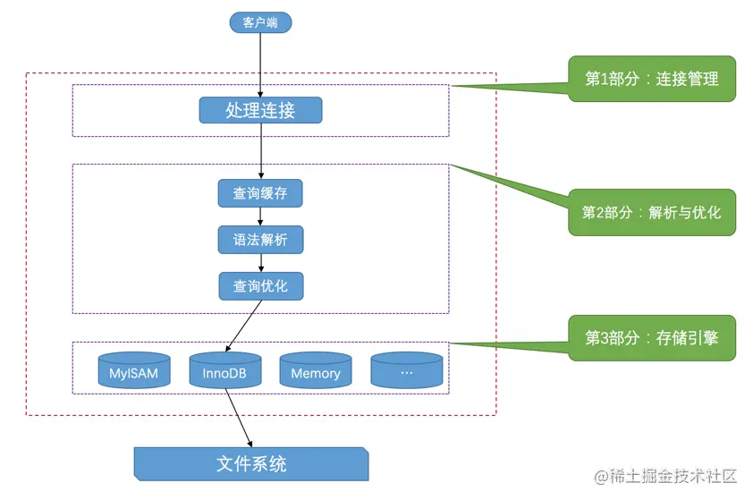

#### 2.1 连接
查看 MySQL 当前有多少个连接:
```sql
show global status like 'Thread%';
```
客户端每产生 一个连接或者一个会话，在服务端就会创建一个线程来处理。反过来如果要杀死会话，就是Kill 线程。服务器并不会立即线程销毁掉，而是把它缓存起来，在另一个新的客户端再进行连接时，把这个缓存的线程分配给该新客户端。

分配线程的话，保持连接肯定会消耗服务端的资源。MySQL 会把那些长时间不活动的 (SLEEP)连接自动断开。

```sql
show global variables like 'wait_timeout'; --非交互式超时时间， 如JDBC 程序 

show global variables like 'interactive_timeout' ; -- 交互式超时时间，如数据库工具
```

默认都为8小时。默认最大连接数是151个，最大可以为100000个。

> MySQL中的参数 (变量)分为session 和global级别，分别是在当前会话中生效和全局生效。当没有带参数的时候，默认是session 级别，包括查询和修改。

#### 2.2 查询缓存
如果两个查询请求在任何字符上的不同（例如：空格、注释、大小写），都会导致缓存不会命中。另外，如果查询请求中包含某些系统函数、用户自定义变量和函数、一些系统表,那这个请求就不会被缓存。

缓存这一块，我们还是交给ORM框架 (比如MyBatis 默 认 开 启 了一 级 缓 存 ) ， 或独立的缓存服务，比如Redis来处理更台适。

 > 检索，查询请求处理完需要更新查询缓存，维护该查询缓存对应的内存区域。5.5之后开始默认关闭，并在MySQL 8.0中删除。

#### 2.3 语法解析和预处理

1. 词法解析：把一个完整的SQL语句打碎成一个个的单词
2. 语法解析：语法分析会对SQL做一些语法检查，比如单弓1号有没有闭合， 然后根据 MySQL定义的语法规则，生成解析树
3. 预处理器：检查生成的解析树，比如检查表名是否存在


#### 2.4 查询优化

查询优化器的目的就是根据解析树生成不同的执行计划(ExecutionPlan) ，然后选 择一种最优的执行计划，Mys QL 里面使用的是基于开销 (cost )的优化器，那种执行计
划开销最小，就用哪种。

优化器最终会把解析树变成 一个查询执行计划， 查询执行计划是 一个数据结构。

```sql
# 查看开销
show status like 'Last _query_cost';

# 查看执行计划
EXPLAIN select name from user where id=1;
```

> 我们写的==MySQL==语句执行起来效率可能并不是很高，==MySQL==的优化程序会对我们的语句做一些优化，如外连接转换为内连接

#### 2.5 存储引擎
MySQL服务器把数据的存储和提取操作都封装到了一个叫存储引擎的模块里。

人们把**连接管理、查询缓存、语法解析、查询优化**这些并不涉及真实数据存储的功能划分为MySQL server的功能，把真实存取数据的功能划分为存储引擎的功能。各种不同的存储引擎向上边的==MySQL server==层提供统一的调用接口（也就是存储引擎API）。

#### 2.6 执行引擎

利用存储引擎提供的相应的API 来完成操作,最后把数据返回给客户端。

### 3. 存储引擎
#### 3.1 存储引擎比较

- MyISAM (3 个文件): 应用范围比较小。 表级锁定限制 了读/ 写的性能 ，因此在 Web 和数据仓库配置中，它通常用于只读或以读为主的工作。拥有较高的插入和查询速度。

> 怎么快速向数据库插入100万条数据?我们有一种先用MyISAM插入数据 ，然后修改存储引擎为InnoDB的操作。

- InnoDB (2 个文件): mysql5.7中的默认存储引擎。事务安全、具有提交、回滚和崩溃恢复功能、行级锁提高了多用户并发性和性能。
- Memory (1个文件): 将所有数据存储在RAM中，以便在需要快速查找非关键数据的环境中快速访问。
- CSV (3 个文件): 它的表实际上是带有逗号分隔值的文本文件。
- Archive(2个文件): 这些紧湊的未索引l的表用于存储和检索大量很少引用的历史、存档或安全車计信息。

#### 3.2 如何选择存储引擎

- 如果对数据一致性要求比较高，需要事务支持，可以选择InnoDB。
- 如果数据查询多更新少，对查询性能要求比较高，可以选择MyISAM。
- 如果需要一个用于查询的临时表，可以选择Memory。
- 如果所有的存储引擎都不能满足你的需求，并且技术能力足够，可以根据官网内部手册用C语言开发一个存储引擎


## 2、MySQL体系架构与内部模块

### 2.1 架构分层

可以把MySQL分成三层，跟客户端对接的连接层，真正执行操作的服务层，和跟硬件打交道的存储引擎层


## 3、InnoDB存储引擎的磁盘与内存结构

### 3.1  一条 更 新 S Q L 是 如 何 执 行 的

在数据库里面，我们说的update操作其实包括了更新、插入和删除。MyBatis的源码，应该知道Executor里面也只有doQuery()和doUpdate()的方法没有doDelete()和dolnsert()。

基本流程一致，区别是拿到符合的数据之后的操作。

### 3.2 缓冲池Buffer Pool

对于Inno DB 存储引擎来说，数据都是放在磁盘上的，存储引擎要操作数据，必须先把磁盘里面的数据加载到内存里面才可以操作。

当磁盘上的一块数据被读取的时候，很有可能它附近的位置也会马上被读取到，这个就叫做局部性原理。

InnoDB设定了一个存储引擎从磁盘读取数据到内存的最小的单位，叫做页。操作系统也有页的概念。操作系统的页大小一般是4K,而在InnoDB里面，这个最小的单位默认是16KB 大小。


修改数据的时候，也是先写入到buffer pool，而不是直接写到磁盘。内存的数据页 和磁盘数据不一致的时候，我们把它叫做脏页。有专门的后台线程把buffer pool的数据刷入磁盘，每隔一段时间批量写入磁盘，叫刷脏。

> 缓存的作用， Buffer Pool 的作用是为了提高读写的效率。

### 3.3 Redo log

刷脏不是实时的，如果Buffer Pool 里面的脏页还没有刷入磁盘
时，数据库宕机或者重启，这些数据就会丢失。

为了避免这个问题，InnoDB把所有对页面的修改操作专门写入一个日志文件。

如果有未同步到磁盘的数据，数据库在启动的时候，会从这个日志文件进行恢复操作（实现crash-safe)。我们说的事务的ACID里面D(持久性），就是用它来实现的。


写日志文件和和写到数据文件有什么区别?为什么不直接写到数据文件。


刷密是随机IO，而记录日志是顺序IO (连续写的)，顺序IO效率更高，本质上是数据集中存储和分散存储的区别。因此先把修改写入日志文件，在保证了内存数据的 安全性的情况下，可以延迟刷盘时机，进而提升系统吞吐。

默认2个文件， 每个48M。

```sql
show variables like 'innodb _log%';
```

1. redo log 是Inn oDB存储引擎实现的，并不是所有存储引擎都有。支持崩溃恢复是InnoDB的一个特性。
2. redolog不是记录数据页更新之后的状态，而是记录的是 "在某个数据页上做了什么修改” 。属于物理日志。
3. redolog的大小是固定的，前面的内容会被覆盖，一旦写满，就会触发buffer pool到磁密的同步，以便腾出空间记录后面的修改。

### 3.4 undo log

undo log(撤销日志或回滚日志)记录了事务发生之前的数据状态，分为insert undo log 和update undo log。如果修改数据时出现异常，可以回滚操作(保持原子性)。

ndolog记录的是反向的操作，比如insert会记录delete，跟redolog 记录做了什么操作不同，所以叫做逻辑格式的日志。

```sql
show global variables like %und0%;
```

> redo log和undo 1og 与事务密切相关，统称为事务日志。


### 3.5 更新过程

1. 事务开始，从内存 (buffer pool)或磁盘(datafile) 取到包含这条数据的数据页，返回给执行器;
2. 执行器修改数据页的数据
3. 记录原来的到undolog， 记录现在到redolog
4. 调用存储引擎的接口，记录数据页到Buffer Pool
5. 事务提交

### 3.6 InnoDB总体架构


#### 3.6.1 内存结构

Buffer Pool主要分为3个部分：Buffer Pool、Change Buffer、Adaptive Hash Index、(redo)log bufer。

##### 1、 Buffer Pool

BufferPool 缓存的是页面信息，包括数据页、索引页。
Buffer Pool默认大小是128M，可以调整。

```sql
# 查看系统变量
SHOW VARIABLES like '%innodb_buffer_pool%';
# 查看服务器状态
SHOW STATUS LIKE '%innodb_buffer_pool%';
```

##### 2、 LRU

InnoDB用LRU算法来管理缓冲池（链表实现，不是传统的LRU,分成了young和old),经过淘汰的数据就是热点数据。


InnoDB 有一个预读机制 (read ahead) 。也就是说，设计者认为访问某个page的数据的时候，相邻的一些page 可能会很快被访问到，所以先把这些page 放到buf fer pool 中缓存起来。


把LRU list分成两部分，靠近head的叫做new sublist,用来放热数据。靠近tail的叫做old sublist,用来放冷数据。中间的分割线叫做midpoint。也就是对buffer pool做一个冷热分离。所有新数据加入到buffer pool的时候，一律先放到冷数据区的head。


可以设置冷却时间，避免刚进来的数据太大，直接提到热区，导致数据被污染。

##### 3、  Change Buffer 写缓冲

Insert Buffer的升级版。

如果这个数据页不是唯一索引，不存在数据重复的情况，也就不需要从磁盘加载索引页判断数据是不是重复（唯一性检查）。这种情况下可以先把修改记录在内存的缓冲池中，从而提升更新语句(Insert、Delete、Update)的执行速度。

##### 4、 Adaptive Hash Index

由于 InnoDB 不⽀持hash 索引，但在某些情况下 hash 索引的效率很⾼，于是出现了adaptive hash index 功能， InnoDB 存储引擎会监控对表上索引的查找，如果观察到建⽴ hash 索引可以提⾼性能的时候，则⾃动建⽴ hash 索引。

##### 5、 Redo Log Buffer

Redo 1og 也不是每一次都直接写入磁盘，在Buffer Pool 里面有一块内存区域(Log Buffer )专门用来保存即将要写入日志文件的数据，默认16M，它一样可以节省磁盘IO 。

刷盘时机
```sql
SHOW VARIABLES LIKE 'innodb_flush_log_at _trx_commit';
```


刷盈越快，越安全，但是也会越消耗性能。

#### 3.6.2 磁盘结构

##### 1、系统表空间system tab|espace

Inn ODB 系统表空间包含InnODB 数据字典和双写缓冲区, Change Buffer和Und o Logs，如果没有指定file-per-table，也包含用户创建的表和素引数据。

1. undo也可以设置独立的表空间
2. 数据字典：由内部系统表组成，存储表和索引的元数据（定义信息）。
3. 双写缓冲(InnoDB的一大特性)：InnoDB的页和操作系统的页大小不一致，InnoDB页大小一般为16K，操作系统页 大小为 4K，InnoDB的页写入到磁盘时，一个页需要分 4 次写。
	如果存储引擎正在写入页的数据到磁盘时发生了宕机，可能出现页只写了一部分的。可能导致数据丢失，如果这个页本身已经损坏了，用redo log来做崩溃恢复是没有意义的，就用页的副本来还原这个页，然后再应用redolog。页的副本就是double write, InnoDB的双写技术。通过它实现了数据页的可靠性。


> double write 由两部分组成，一部分是内存的double write, 一个部分是磁盘上的double write。因为double write是顺序写入的，不会带来很大的开销。


##### 2、独占表空间fiIe-per-table tablespaces

我们可以让每张表独占一个表空间。这个开关通过innodb_file_per_table 设置，默认开启。这个文件就是数据目录下的ibd 文件。存放数据和索引。


##### 3、通用表空间general tablespaces

通用表空间也是一种共享的表空间，可以创建一个通用的表空间，用来存储不同数据库的表，数据路径和文件可以自定义。

> 不同表空间的数据是可以移动的。

##### 4、临时表空间temporary tablespaces

存储临时表的数据，包括用户创建的临时表，和磁盘的内部临时表。数据库关闭删除，开启创建。

##### 5、Redo log

前面有

##### 6、Undo表空间

前面有


#### 3.6.3 后台线程

后台线程的主要作用是负责刷新内存池中的数据和把修改的数据页刷新到磁盘。后 台线程分为:master thread, Io thread, purge thread, page cleaner thread.

1. master thread负责刷新缓存数据到磁盘并协调调度其它后台进程。
2. lO thread分为insert buffer、.log、read、write进程。分别用来处理insert buffer、重做日志、读写请求的IO回调。
3. page cleaner thread用来刷新脏页
4. purge thread用来回收undo页。

### 3.7 Binlog

Server 层也有一个日志文件，叫做binlog，它可以被所有的存储引擎使用。

binlog以事件的形式记录了所有的DDL和DML语句（因为它记录的是操作而不是数据值，属于逻辑日志)，可以用来做主从复制和数据恢复。


1. 先记录到内存，再写日志文件。
2. 记录redo log分为两个阶段。
3. 存储引擎和Server记录不同的日志。
4.  先记录redo,再记录binlog。

binlog控制着主从复制，如果binlog没有就不该提交。

在崩溃恢复时，判断事务是否需要提交：
1、binlog无记录，redolog无记录：
	在redo log写之前crash,恢复操作：回滚事务
2、binlog:无记录，redolog状态prepare:
	在binlog写完之前的crash,恢复操作：回滚事务
3、binlog有记录，redolog状态prepare:
	在binlog写完提交事务之前的crash,恢复操作：提交事务
4、binlog有记录，redolog状态commit:
	正常完成的事务，不需要恢复

## binlog 没开启怎么办？
redolog 就不用两阶段提交了，因为不会影响主从复制了。

## buffer pool 读大内容的问题
buffer pool 有默认大小，如果你全表扫描大数据，可以调大buffer pool的大小。

## redo log为什么是两个
可以设置成多个文件，固定的大小，从头到尾去写，写完就会覆盖之前的内容。
## MySQL性能优化-索引.md
# 1. 索引是什么
## 1.1 索引是什么
数据库索引，是数据库管理系统(DBMS) 中一个排序的数据结构，以协助快速查询、更新数据库表中数据。

### 1.1.1 索引类型

在InnoDB里面，索引类型有三种，普通索引、唯 一索引(主键索引是特殊的唯—索引) 、全文索引。

全文(Ful text):针对比较大的数据，比如我们存放的是消息内容、一篇文章，有几KB的数据的这种情况，如果要解决like 查询在全文匹配的时候效率低的问题，可以创建全文索引。只有文本类型的字段才可以创建全文索引，比如char、varchar、text。

```sql
CREATE TABLE 'fulltext test (
"content' varchar(50) DEFAULT NULL, FULLTEXT KEY content' (content')
);

# 语法:
select *from fulltext test where match(content) against('三体'INNATURALLANGUAGEMODE);
```

# 2. 索引存储模型推演
## 2.1 二分查找

可以考虑用有序数组作为索引的数据结构。有序数组的等值查询和比较查询效率非常高，但是更新数据的时候会出现 一个问题，可能要挪动大量的数据 (改变index)，所以只适合存储静态的数据。

为了支持频繁的修改，比如插入数据，我们需要采用链表。链表的话，如果是单链表，它的查找效率还是不够高。

## 2.2 二叉查找树(BSTBinarySearch Tree)

**高效查找的链表**

在子树所有的节点都小于父节点，右子树所有的节点都大于父节点。投脱到平圃以后，就是一个有序的线性表。二叉查找树既能够实现快速查找，又能够实现快速插入。

最坏情况是查找效率变成On，变成斜树。


## 2.3 平衡二叉树 (AVL Tree)(左旋、右旋)

平衡二叉树的定义:左右子树;深度差绝对值不能超过1。通过左旋右旋保持平衡。


### 2.3.1 AVL树用于存储索引数据
**可能会出现如下问题**：
当我们用树的结构来存储索引的时候，访问一个节点就要跟磁盘之间发生一次IO操作。InnoDB操作磁盘的最小的单位是一页（或者叫一个磁盘块），大小是16K。一个树的节点必须设计成16K的大小，不然就会出现读不够的情况。

如果只是键值+数据+引用是非常小的，如果一个单元只存一个信息，就需要很多次IO操作。

**为了解决这个问题**：

1. 让每个节点存储更多的数据
2. 节点上的关键字的数量越多，我们的指针数也越多，也就是意味着可以有更多的分叉。
分叉越多，树的深度越少，io次数越少。

## 2.4 多路平衡査找村(BTree)(分裂、合井)

跟AVL树一样，B树在枝节点和叶子节点存储键值、数据地址、节点引用。

特点:分叉数 (路数)永远比关键字数多1。

节点的分裂和合并，其实就是lnnoDB页的分裂和合并。所以不在频繁更新的列上建立索引。

如果索引键值有序，写满一页接着开辟一个新的页。如果索引键值无序，存储过程造成大量磁盘碎片，带来频繁的page 分裂和合并。


## 2.5 B+树(加强版多路平衡查找树)


特点：

1. 它的关键字的数量是跟路数相等的；
2. B+Tree的根节点和枝节点中都不会存储数据，只有叶子节点才存储数据。
3. B+Tee的每个叶子节点增加了一个指向相邻叶子节点的指针，它的最后一个
数据会指向下一个叶子节点的第一个数据，形成了一个有序链表的结构。

优势：

1. B Tree的变种:每个节点存储更多关键字；路数更多
2. 扫库、扫表能力更强（如果我们要对表进行全表扫描，只需要遍历叶子节点就可以了，不需要遍历整棵B+Tree拿到所有的数据)
3. B+Tree的磁盘读写能力相对于B Tree来说更强（根节点和枝节点不保存数据区，所以一个节点可以保存更多的关键字，一次磁盘加载的关键字更多)
4. 排序能力更强（因为叶子节点上有下一个数据区的指针，数据形成了链表)
5. 效率更加稳定(B+Tee永远是在叶子节点拿到数据，所以IO次数是稳定的)

## 2.6 为什么不用红黑树

1、只有两路; 2、不够平衡。
红黑树一般只放在内存里面用。例如Java的Tree/Map,它可以用来实现一致性哈希。

## 2.7 Hash索引

在InnoDB中，不能显式地创建一个哈希索引 (所谓的支持哈希索引指的是AHl，自适应哈希，它是InnoDB自动为buffer pool 中的热点页创建的索引) 。

memory 存储引擎可以使用Hash 索引。

# 3. B+Tree 落地形式
## 3.1 MySQL数据存储文件

MySQL 的数据都是文件的形式存放在磁盘中的，在MySQL中有这么一个参数:
```sql
show VARIABLES LIKE 'datadir';
```

每张InnoDB的表有两个文件(.frm和.ibd),MylSAM的表有三个文件(.frm、.MYD、.MYI) 
.frm是MySQL里面表结构定义的文件（8.0以前）8.0以后都存在数据字典中了，不管你建表的时候选用任何一个存储引擎都会生成

### 3.1.1 MyISAM

一个是.MYD文件，D代表Data,是MyISAM的数据文件，存放数据记录，比如我
们的user_myisam表的所有的表数据。
一个是.MYI文件，I代表Index,是MyISAM的索引文件，存放索引，比如我们在id字段上面创建了一个主键索引，那么主键索引就是在这个索引文件里面。一个索引就会有一棵B+Tree,所有的B+Tree都在这个myi文件里面。

MyISAM 的B+Tree 里面，叶子节点存储的是数据文件对应的磁盘地址。所以从索 引文件. MY1 中找到键值后，会到数据文件. MYD 中获取相应的数据记录。


> MyISAM非主键索引跟主键索引存储和检索数据的方式是没有任何区别的

### 3.1.2 InnoDB

在lnnoDB的某个索引的叶子节点上，它直接存储了我们的数据。
**所以，在InnoDB中索引即数据，数据即索引，就是这个原因。**

聚簇索引:就是索引键值的逻辑顺序跟表数据行的物理存储顺序是一致的。

InnoDB组织数据的方式就是（聚集）索引组织表(clustered index organize table)。如果说一张表创建了主键索引，那么这个主键索引就是聚集索引，决定数据行的物理存储顺序。

二级索引储存的不是地址，因为地址会变，储存的是主键的值。二级索引会回表。

**没有主键：**

1. 如果我们定义了主键(PRIMARY KEY),那么InnoDB会选择主键作为聚集索引.
2. 如果没有显式定义主键，则InnoDB会选择第一个不包含有NULL值的唯一索引作为主键索引。
3. 如果也没有这样的唯一索引，则InnoDB会选择内置6字节长的ROWID作为隐藏的聚集索引，它会随着行记录的写入而主键递增。

# 4. 索引使用原则

## 4.1 列的离散度

第一个叫做列的离散度，我们先来看一下列的离散度的公式：
count(distinct(column_name):count(\*),列的全部不同值和所有数据行的比例。数据行数相同的情况下，分子越大，列的离散度就越高。 性别的离散度就非常低。如果列的重复值越多，离散度就越低，重复值越少，离散度就越高

## 4.2 联合索引的最左匹配


联合索引在B+Tree 中是复合的数据结构，它是按照从左到右的顺序来建立搜索树的 (name在左边，phone 在右边)当name 相等的时候，phone 才是有序的。

如果查询条件没有name，就不知道第一步应该查哪个节点，因为建立搜索树的时候nam e 是第一个比较因子，所以用不到索引。


### 4. 2. 1. 什么时候用到联合素引

在建立联合索引的时候，一定要把最常用的列放在最左边。

### 4. 2. 2. 如何创建联合索引

我们创建三个字段的索引indlex(a, b, c)，相当于创建三个素引: index(a)、index(a,b)、index(a,b,c)

## 4. 3. 覆盖索引

如果sel ect 的数据列只用从索引中就能够取得，不必从数据区中读取，这时候使用的索引就叫做覆盖索引，这样就避免了回表。

## 4 . 4 . 素 引 条 件 下推 ( I C P )

索引条件下推 (IndexConditionPushdown)，5.6以后完善的功能。只适用于二级索引。ICP 的目标是减少访问表的完整行的读数量从而减少I/0 操作。

这里说的下推，其实是意思是把过滤的动作在存储引擎做完，而不需要到Server 层过滤。

ICP 是默认开启的，也就是说针对于二级索引，只要能够把条件下推给存储引擎，它就会下推，不需要我们干预。

# 5. 索引的创建与使用

## 5. 1. 索引的创建

1. 在用于where判断order排序和join的(on)、group by的字段上创建索引
2. 索引的个数不要过多。浪费空间，更新变慢。
3. 过长的字段，建立前缀索引。
4. 区分度低的字段，例如性别，不要建索引。
5. 频繁更新的值，不要作为主键或者索引。页分裂
6. 随机无序的值，不建议作为索引，例如身份证、UUD。无序，分裂
7. 组合索引把散列性高（区分度高）的值放在前面
8. 创建复合索引，而不是修改单列索引

## 5.2 什么时候用不到素引?

1. 索引列用函数
2. 字符串不加引号，出现隐式转换
3. like 条件中前面带%
4. 负向查询某些情况下不能

其实，用不用索引，最终都是优化器说了算。
优化器是基于什么的优化器？
基于cost开销(Cost Base Optimizer),它不是基于规侧(Rule-Based Optimizer),
也不是基于语义。怎么样开销小就怎么来。
使用索引有基本原则，但是没有具体细则，没有什么情况一定用索引，什么情况一定不用索引的规则。
## MySQL性能优化-事务.md

# 1.什么是数据库的事务

```sql
select version();
show variables like '%engine%';
show global variables like "tx_isolation";
```

## 1.1 事务的定义

事务是数据库管理系统(DBMS) 执行过程中的一个逻辑单位，由一个有限的数据库操作序列构成。

1. 所谓的逻辑单位，意味着它是数据库最小的工作单元，是不可以再分的。
2. 它可能包含了一个或者一系列的DML语句，包括 insert delete update.

## 1.2 哪些存储引擎支持事务

除了做集群的NDB 之外，只有Inn oDB支持事务，这个也是它成为默认的存储引擎
的 一个重要原因。

## 1.3 事务的四大特性

- 原子性: 要么都成功要么都失败
	实现： 通过undo log 来实现的，它记录了数据修改之前的值(逻 辑日志)，一旦发生异常，就可以用undo 10g 来实现回滚操作。
- 隔离性：很多个的事务，对表或者行的并发操作，应该是透明的，互相不干扰的。
	实现：
	1. 对于普通的select使用快照(snapshot read),底层使用Multi version currency control(mvcc)来实现.
	2. 加锁的select,底层使用记录锁，或者间隙锁，临键锁。
- 持久性: 
	实现：redolog和doublewritebuffer (双写缓冲)来实现的，先写到内存的buffer pool 里面，同时记录redo log，如果在刷盘之前 出现要特，在理高后說阿以续现redo1oo12各，一入到裝理，(保近数据的父性。
- 一致性： 数据库的完整性约束没有被破坏 ，事务执行的前后都是合法的数据状态。

## 1.4 数据库什么时候会出现事务

增删改的语句会自动开启事务，当然是一条SQL一个事务。注意每个事务都是有编号的，这个编号是一个整数，有递增的特性。

如果要把多条SQL 放在一个事务里面，就要手动开启事务。手动开启事务有两种方式:一种是用begin; 一种是用start transaction。

结束也有两种方式:第一种是回滚事务roll back，事务结束。第二种就是提交一个事务，commit ，事务结束。

如果我们把autocommit 设置成false/off，那么数据库的事务就需要我们手动地结束，用rolback 或者commit。如果客户端断开连接，事务也会结束。

## 1.5 事务并发会带來什么问题?

- 脏读


- 不可重复读


- 幻读


> 事务并发的三大问题其实都是数据库读一致性问题，必须由数据库提供一定的事务隔离机制来解决。

## 1.6 SQL92标准

- Read Uncommitted(RU未提交读) - 未解决任何并发问题 - 事务未提交的数据对其他事务也是可见的，会出现脏读
- Read Committed(RC已提交读) - 解决脏读问题 - 一个事务开始之后，只能看到已提交的事务所做的修改，会出现不可重复读
- Repeatable Read(RR可重复读) - 解决不可重复读问题 - 在同一个事务中多次读取同样的数据结果是一样的，这种隔离级别未解决幻读的问题
- Serializable(串行化) - 解决所有问题 - 最高的隔离级别，通过强制事务的串行执行


## 1.7 MySQL InnoDB对隔离级别的支持


## 1.8 两大实现方案

解決读一致性的问题，保证—个事务中前后两次读取数据结果一致，实现事务隔离，应该怎么做?

### 1.8.1 LBCC

既然要保证前后两次读取数据一致，那么锁定我要操作的数据，不允许其他的事务修改就行了。这种方案我们叫做基于锁的并发控制Lock Based Concurrency Control (LBCC)

如果仅仅是基于锁来实现事务隔离，一个事务读取的时候不允许其他时候修改，那就意味着不支持并发的读写操作，而我们的大多数应用都是读多写少的，这样会极大地影响操作数据的效率。

### 1.8.2 MVCC

要让一个事务前后两次读取的数据保持一致，那么我们可以在修改数据的之前给它建立一个备份或者叫快照，后面再来读取这个快照就行了。这种方案我们叫做多版本的并发控制Multi Version Concurrency Control(MVCC)

- MVCC的原则：
	- 一个事务能看到的数据版本：
		1. 第一次查询之前已经提交的事务的修改
		2. 本事务的修改
	- 一个事务不能看见的数据版本：
		1. 在本事务第一次查询之后创建的事务（事务ID比我的事务ID大）
		2. 活跃的（未提交的）事务的修改

不管别的事务做任何增删改查的操作，它只能看到第一次查询时看到的数据版本。

### 1.8.3 MVCC的实现原理

InnoDB的事务都下是有编号的，会不断递增。InnoDB 为每行记录都实现了两个隐藏字段:
- DB_TRX_ID，6 字节:事务ID ，数据是在哪个事务插入或者修改为新数据的，就记录为当前事务ID。
- DB_ROLL_PTR,7字节：回滚指针（我们把它理解为删除版本号，数据被删除或记录为旧数据的时候，记录当前事务D,没有修改或者删除的时候是空)。


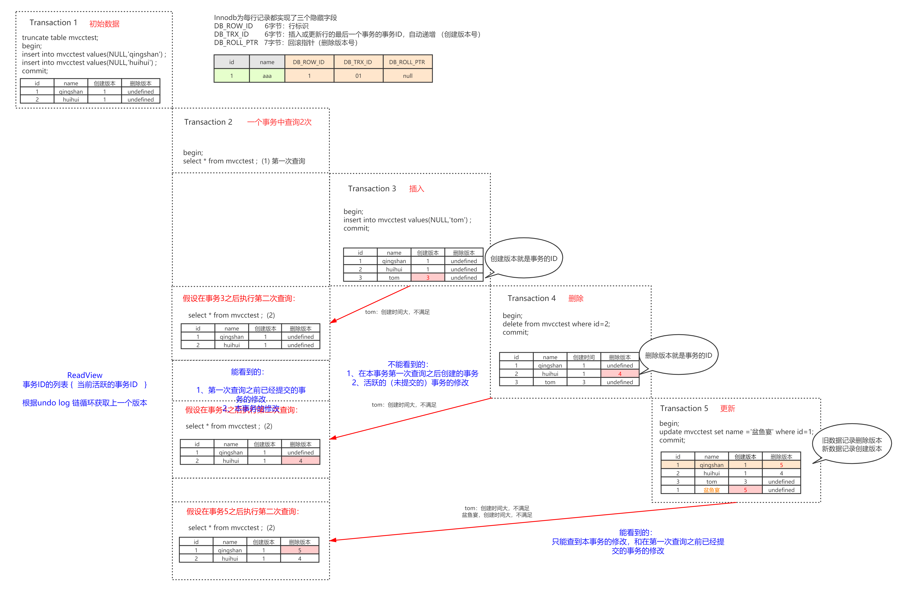

InnoDB中，一条数据的旧版本，是存放在哪里的呢？undo log。因为修改了多次，这些undo log会形成一个链条，叫做undo log链。

DB_ROLL_PTR，它其实就是指向undo log链的指针。

我们必须要有一个数据结构，把本事务1D、活跃事务1D、当前系统最大事务ID 存起来，这样才能实现判断。这个数据结构就叫Read View (可见性视图)，每个事务都维护一个自己的Read View。


- m_ids:表示在生成ReadView时当前系统中活跃的读写事务的事务id列表。
- min_trx_id:表示在生成ReadView时当前系统中活跃的读写事务中最小的事务id,也就是mids中的最小值。
- max_trx_id:表示生成ReadView时系统中应该分配给下一个事务的id值。
- creator_trx_id:表示生成该ReadView的事务的事务id。

根据这个数据结构，事务判断可见性的规则：
1. 从数据的最早版本开始判断 （undo log）
2. 数据版本的trx_id=creator_trx_id,本事务修改，可以访问
3. 数据版本的trx_id<min_trx_id(未提交事务的最小ID),说明这个版本在生成ReadView已经提交，可以访问
4. 数据版本的trx_id>max_trx_id(下一个事务ID),这个版本是生成ReadView之后才开启的事务建立的，不能访问
5.  数据版本的trx_id在min_trxid和max_trx_id之间 ，看看是否在mids中。 如果在，不可以。如果不在，可以。
6. 如果当前版本不可见，就找undo 1og链中的下一个版本。

> RR中ReadView是事务第一次查询的时候建立的。RC的Read View是事务每次查询的时候建立的。
> 锁和MVCC是协同使用的，并不互斥。

# 2.MySQL InnoDB锁的基本类型

## 2.1锁的粒度

锁定粒度:表锁 >行锁
加锁效率:表锁 >行锁 
冲突概率:表锁 >行锁
并发性能:表锁 <行锁

## 2.2 锁的类型

官网把锁分成了8类。我们把前面的两个行级别的锁 (Shared and ExclusiveLocks) ，和两个表级别的锁(Intention Locks)称为锁的基本模式。

Record Locks、Gap Locks、Next-Key Locks，我们把它们叫做锁的算法， 也就是分别在什么情况下锁定什么范围。

- 插入意向锁：是一个特殊的间隙锁。间隙锁不允许插入数据，但是插入意向锁允许多个事务同时插入数据到同一个范围。比如(4,7)，一个事务插入5，一个事务插入6，不会发生锁等待。

- 自增锁：是一种特殊的表锁，用来防止自增字段重复，数据插入以后就会释放，不需要等到事务提交才释放。如果需要选择更快的自增值生成速度或者更加连续的自增值，就要通过修改自增锁的模式改变。

```sql
show variables like 'innodb_autoinc_lock_mode';
```

- 0:traditonal(每次都会产生表锁)
- 1:consecutive（会产生一个轻量锁，simple insert会获得批量的锁，保证连续插入，默认值)
- 2: interleaved (不会锁表，来一个处理一个，并发最高)

## 2.3 共享锁

第一个行锁是：Shared Lock 共享锁，多个事务可以共享一把读锁。
- 共享锁的作用:因为共享锁会阻塞其他事务的修改，所以可以用在不允许其他事务修改数据的情况。
- 可以用select ..... lock in share mode;的方式手工加上一把读锁。

## 2.4 排它锁

第二个行锁是：Exclusive Locks 排它锁。只要一个事务获取了一行数据的排它锁，其他的事务就不能再获取这一行数据的共享锁和排它锁。

- 排它锁的加锁方式有两种，第一种是自动加排他锁，增删改，都会默认加上一个排它锁。
- 还有一种是手工加锁，我们用一个FOR UPDATE给一行数据加上一个排它锁，这个无论是在我们的代码里面还是操作数据的工具里面，都比较常用。

## 2.5 意向锁

由数据库自己维护的。
- 当我们给一行数据加上共享锁之前，数据库会自动在这张表上面加一个意向共享锁。
- 当我们给一行数据加上排他锁之前，数据库会自动在这张表上面加一个意向排他锁。
- 如果一张表上面至少有一个意向共享锁，说明有其他的事务给其中的某些数据行加上了共享锁。
- 如果一张表上面至少有一个意向排他锁，说明有其他的事务给其中的某些数据行加上了排他锁。
- 意向锁跟意向锁是不冲突的，意向锁跟行锁也不冲突。

两个表级锁存在的意义是：
1. 当我们给一张表加上表锁，我们要判断其他的事务有没有锁定某些行，有就不能加表锁。那么加表锁要扫描整个表，效率太低。
2. 引入意向锁，只需要判断表上有没有意向锁，如果有就返回失败，没有就加锁成功。InnoDB的表锁就是一个标志，用来提高加锁效率的。

> 锁是用来解决事务对数据的并发访问的问题的。

# 3. 行锁的原理

## 3.1 没有索引的表(假设锁住记录)

首先我们有三张表， 一张没有索引的t1，一张有主键索引l的t2，一张有唯一索引的t3。

**我们会发现在没有索引的表上锁住一条记录就是锁住整张表。**

## 3.2 有主键索引的表

可以锁住id相同的，不能锁住id相同的。

## 3.3 唯一索引（假设锁住字段）

**InnoDB的行锁，就是通过锁住索引来实现的。**


1. 为什么表里面没有索引的时候，锁住一行数据会导致锁表?
	- 因为查询没有使用索引，会进行全表扫描，然后把每一个隐藏的聚集索引都锁佳了。
2. 为什么通过唯一索引给数据行加锁，主键索引也会被锁住?
	- 在辅助索引里面，索引存储的是二级索引和主键的值。比如name=4,存储的是name的索引和主键id的值4。
	- 主键索引里面除了索引之外，还存储了完整的数据。所以我们通过辅助索锁定一行数据的时候，它跟我们检索数据的步骤是一样的，会通过主键值找到主键索引，然后也锁定。
	- 本质上是因为锁定的是同一行数据，是相互冲突的。

# 4. 锁的算法


## 4.1 记录锁

第一种情况，当我们对于唯一性的索引（包括唯一索引和主键索引)使用等值查询精准匹配到一条记录的时候，这个时候使用的就是记录锁。


## 4.2 间隙锁

第二种情况，当我们查询的记录不存在，没有命中任何一个record,无论是用等值查询还是范国查询的时候，它使用的都是间隙锁。


> 当查询的记录不存在的时候，使用间隙锁。问隙锁 主要是阻塞插入in ser t。相同的问隙锁之间不冲突。

## 4.3 临键锁

第三种情况，当我们使用了范围查询，不仅仅命中了Record记录，还包含了Gap间隙，在这种情况下我们使用的就是临键锁，它是MySQL里面默认的行锁算法，相当于记录锁加上间隙锁。

> 唯一性索引，等值查询匹配到一条记录的时候，退化成记录锁。

> 没有匹配到任何记录的时候，退化成间隙锁。


## 4.4 小结：隔离级别的实现

再回过头来看下这张图片，为什么InnoDB的RR级别能够解决幻读的问题，就是用引临键锁实现的。


### 4.4.1 未提交读

RU 不加锁

### 4.4.2 串行化

所有的select语句都会被隐式的转化为select .... in share mode,会和update、delete互斥。

### 4.4.3 可重复读

RR: 普通的select使用快照读(snapshot read),底层使用MVCC来实现。

加锁的select(select…in share mode/select…for update)以及更新操作update,delete等语句使用当前读(current read),底层使用记录锁、或者间隙锁临键锁。

### 4.4.3 已提交读

RC：普通的select都是快照读，MVCC来实现。

加锁的select 都使用**记录锁**，因为没有Gap Lock.

> 除了两种特殊情況- —外键约束检查(foreign-keyconstraint checking)以及重复键检查(duplicate-key checking)时会使用问隙锁封锁区问。 所以RC会出现幻读的问题。

# 5 事务隔离级别怎么选?

Ru ser 不能用

RC和 RR主要有几个区别:

1. RR的间隙锁会导致锁定范围的扩大。
2. 条件列未使用到索引，RR锁表，RC锁行。
3. RC的"半一致性”(semi-consistent)读可以增加update操作的并发性。
	- 在RC中，一个update语句，如果读到一行已经加锁的记录，此时InnoDB返回记录最近提交的版本，由MySQL上层判断此版本是否满足update的where条件。若满足（需要更新），则MySQL会重新发起一次读操作，此时会读取行的最新版本（并加锁）。

实际上，如果能够正确地使用锁（避免不使用索引去伽锁），只锁定需要的数据，用默认的RR级别就可以了。

# 6 死锁

## 6.1 锁的释放与阻塞

锁的释放: 事务结束或客户端连接断开。

MySQL 有一个参数来控制获取锁的等待时间，默认是50 秒。

## 6.2 死锁的发生和检测

1. 互斥
2. 不可剥夺
3. 形成环路等待

为什么可以直接检测到呢？是因为死锁的发生需要满足一定的条件，所以在发生死锁时，InnoDB一般都能通过算法(wait-for graph)自动检测到。

> 如果锁一直没有释放，就有可能造成大量阻塞或者发生死锁，造成系统吞吐量下降这时候就要查看是哪些事务持有了锁。

## 6.3查看锁信息（日志）

SHOW STATUS命令中，包括了一些行锁的信息：
```sql
show status like 'innodb_row_lock_%'
select * from informationschema.INNODBTRX; - - 当前运行的所有事务，还有具体的语句

select *frominformation_schema.INNODB LOCKS; -- 当前出现的锁

select *frominformation_schema.INNODB LOCK_WAITS; -- 锁等待的对应关系
```


如果一个事务长时间持有锁不释放，可以k事务对应的线程D,也就是INNODB_TRX表中的trx_mysql_thread_id,例如执行kill4,kil7,kill8。

当然，死锁的问题不能每次都靠k线程来解决，这是治标不治本的行为。我们应该
尽量在应用端，也就是在编码的过程中避免。

## 6.4 死锁的避免

1. 相同顺序访问多张表
2. 数据排序
3. 申请足够级别的锁
4. 避免没有where条件的操作，尽量使用索引，避免锁表
5. 大事务分解成小事务
6. 使用等值查询而不是范围查询
## MySQL性能优化-总结.md
# 1. 优化思路


# 2. 连接——配置优化

客户端连接到服务端，有可能是服务端连接数不够导致应用程序获取不到连接。

可以从两个方面来解决连接数不够的问题:
1. 从服务端来说，我们可以增加服务端的可用连接数
	1. 增加可用连接数，修改max_connections的大小
	2. 及时释放不活动连接，交互武和非交豆式的客广蹦的默以超的时 间都是28800 秒，8 小时，我们可以把这个值调小。
2. 从客户端来说，可以减少从服务端获取的连接数。如果我们想要不是每一次执行SQL都创建一个新的连接。**引入连接池，实现连接的重用**。阿里的Druid、Hikari。
	连接池并不是越大越好，只要维护一定数量大小的连接池，其他的客户端排队等待获取连接就可以了。有的时候连接池越大，效率反而越低。

每一个连接，服务端都需要创建一个线程去处理它。连接数越多，服务端创建的线程数就会越多。CPU的核数是有限的，频繁的上下文切换会造成比较大的性能开销。

> 建议是机器核数乘以2加1

# 3. 缓存——架构优化

## 3.1 缓存

可以把数据放到内存缓存起来，比如使用 Redis 。

## 3.2 集群，主从复制

集群的话必然会面临一个问题，就是不同的节点之问数据一致性的问题。如果同时 读写多台数据库节点，怎么让所有的节点数据保持一致?

这个时候我们需要用到复制技术 (repli cation )，被复制的节点称为ma st er ，复制 的节点称为slave。slave 本身也可以作为其他节点的数据来源，这个叫做级联复制。

MySQL的主从复制是怎么实现的呢？

MySQL所有更新语句都会记录到Server层的binlog。有了这个binlog,从服务器会不断获取主服务器的binlog文件，然后解析里面的SQL语句，在从服务器上面执丸行一遍，保持主从的数据一致。


这里面涉及到三个线程，连接到master 获取binlog，并且解析binlog写入中继日志，这个线程叫做I/O线程。
Master节点上有一个log dump线程，是用来发送binlog给slave的。
从库的SQL线程，是用来读取relay log,把数据写入到数据库的。


## 3.3 分库分表

分库分表总体上可以分为两类:
1. 垂直分库，减少并发压力。
2. 水平分表，解决存储瓶颈。

垂直分库的做法，把一个数据库按照业务拆分成不同的数据库:


水平分库分表的做法，把单张表的数据按照一定的规则分布到多个数据库。


# 4优化器一一SQL语句分析与优化

把SQL执行情况记录下来，用到服务端的慢查询日志。

## 4.1 慢查询日志slomquery 1og
### 4. 1. 1 打开慢日志开关

因为开启慢查询日志是有代价的（跟binlog、optimizer--trace一样），所以它默认是关闭的

还有一个参数，控制执行超过多长时间的SQL才记录到慢日志，默认是10秒。如果改成0秒的话就是记录所有的SQL。

```sql
show variables like 'slow query%'

show variables like '%long_query%';
```

修改配置文件my.cnf

### 4. 1. 2 慢日志分析

1、日志内容

```linux
less /var/lib/mysql/localhost-slow.log
```

2 . mysqldumpslow

MySQL提供了mysqldumpslow的工具，在MySQL的bin目录下。
```sql
mysqldumpslow --help

# 查询用时最多的10条慢SQL:
mysqldumpslow -s t -t 10 -g 'select'/var/lib/mysql/localhost-slow.log
```

> 有的时候查询慢，不一定是SQL语句的问题，也有可能是服务器状态的问题。

### 4. 1. 3 其他系统命令

show processlist 运行线程
```sql
show full processlist;
# 效果一样
select * from information schema.processlist;
```
显示用户运行线程。可以根据id 号kill线程。

show status 服多器运行状态

```sql
SHOW GLOBAL STATUS;

SHOW GLOBAL STATUS LIKE'com_select'; - 査看select 次数
```

showengine 存储引擎运行信息,包括事务持有的表锁、行锁信息;事务的锁等待情况; 线程信号量等待;文件IO请求;bufferpool统计信息

```sql
show engine innodb status;

-- 开启标准监控和锁监控
set GLOBAL innodb_status_output=ON;
set GLOBAL innodb_status_output_locks=ON:
```

## 4.2 EXPLAIN 执行计划

### 4.2.1 id

- id是查询序列编号，每张表都是单独访问的，一个SELECT就会有一个序号。
- id值不同的时候，先查询id值大的（先大后小）。
- id值相同时，表的查询顺序是从上往下顺序执行。
- 把小表放在前面查询，因为它的中间结果最少。(小表驱动大表的思想)

### 4.2.2 select type 查询类型

- SIMPLE: 简单查询，不包含子查询，不包含关联查询union。
- PRIMARY: 子查询SQL 语句中的 主查询，也就是最外面的那层查询。
- SUBQUERY: 子查询中所有的内层查询都是SUBQUERY类型的。
- DERIVED: 衍生查询，表示在得到最终查询结果之前会用到临时表。
- UNION: 用到了UNION 查询。

### 4.2.3 type 连接类型

所有的连接类型中，上面的最好，越往下越差。

在常用的链接类型中:system >const > eq_ref > ref > range > index > all

除了 all 都能用到索引。

- const： 主键索引或者唯一索引，只能查到一条数据的 SQL。
- system: system是const 的一种特例，只有一行满足条件，对于MyISAM、Memory的表，
只查询到一条记录，也是system 。比如系统库的这张表 (8. 0 的版本中系统表全部变成InnoDB存储引擎了)
- eg_ref: 通常出现在多表的 join 查询，被驱动表通过唯一性素引(UNIQUE或PRIMARY KEY) 进行访问，此时被驱动表的访问方式就是eq_ref.eq_ref是除const 之外最好的访问类型。
- ref: 查询用到了非唯一性索引，或者关联操作只使用了索引的最左前缀。
- range: 索引范围扫描。
- index:Full Index Scan ，查询全部素引中的数据 (比不走索引要快)
- all: 没有索引國者没有用到索引，type就是ALL。代表全表扫描。
- NULL:不用访问表或者素引就能得到结果

> 不 走 素 引 一 定 是 全 表 扫 描 (A L L )

### 4.2.4 possible_key、key 

可能用到的索引和实际用到的索引。如果是NULL就代表没有用到索引。

### 4.2.5 key_len

索引的长度 (使用的 字节数)。跟索引字段的类型、长度有关。

### 4.2.6 rows

MySQL认为扫描多少行才能返回请求的数据，是一个预估值。一般来说行数越少越好。

### 4.2.7 filtered

这个字段表示存储引(擎返回的数据在server 层过滤后，剩下多少满足查询的记录数
量的比例，它是一个百分比。
如果比例很低，说明存储引擎层返回的数据需要经过大量过滤，这个是会消耗性能的，需要关注。

### 4.2.8 ref

使用哪个列或者常数和索引一起从表中筛选数据。

### 4.2.9  Extra

执行计划给出的额外的信息说明。

- using index: 用到了覆盖索引 ，不需要回表。
- using where:使用了where过滤，表示存储引擎返回的记录并不是所有的都满足查询条件，需要在server层进行过滤（跟是否使用索引没有关系)
- Using index condition (索引条件下推)
- using filesort:不能使用素引来排序，用到了额外的排序 。**需要优化**。
- using temporary: 用到了临时表。

> EXPLAIN FORMAT=JSON。可以获得更详细信息。


## 4. 3 SQL 与索引优化

```sql
-大偏移量的limit
select from user innodb limit 900000,10:
-改成先过滤D,再limit
SELECT FROM user innodb WHERE id 900000 LIMIT 10;
```

# 5 存储引擎

## 5.1 存储引擎的选择

不同的业务表选择不同的存储引擎，例如:查询插入操作多的业务表，用MyISAM. 临时数据用Memeroy。常规的并发大更新多的表用InnoDB。

## 5.2 分表或者分区

交易历史表：在年底为下一年度建立12个分区，每个月一个分区
渠道交易表：分成：当日表、当月表、历史表，历史表再做分区。

## 5.3 字段定义

原则:使用可以正确存储数据的最小数据类型。

### 5.3.1 非空

非空字段尽量定义成NOT NULL,提供默认值，或者使用特殊值、空串代替null。
NULL类型的存储、优化、使用都会存在问题。

### 5.3.2 不要使用外键值、触发器、视图

降低了可读性;影响数据库性能，应该把把计算的事情交给程序，数据库专心做存储; 数据的完整性应该在程序中检查。

### 5.3.3 大文件存储

把文件放在NAS上，数据库只需要存储URI (相对路径)，在应用中配置NAS服务器地址。

# 6 业务层面的优化

1. 双十一提前开始
2. 双十一禁止查询今天之外的订单
3. 更推荐余额宝付款，比银行接口快
## 手写数据库.md
# 数据库基本架构

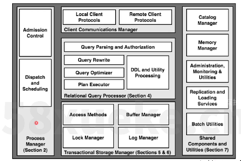

# sql引擎的职责
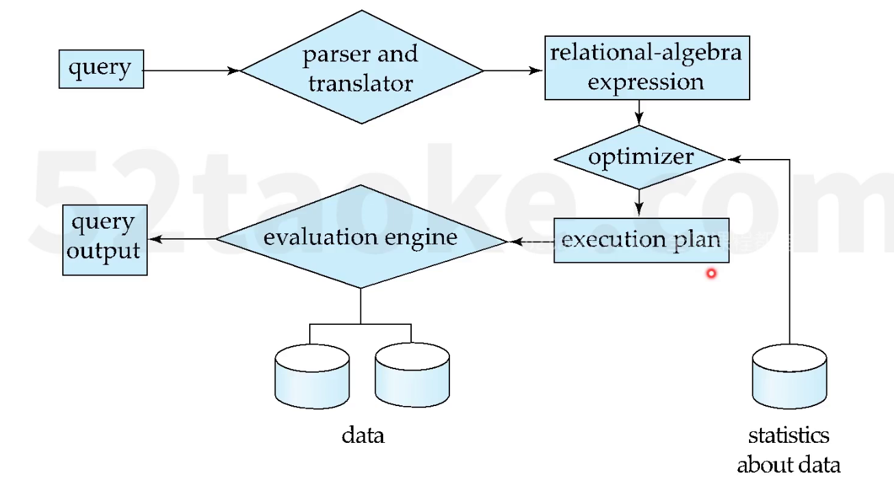
- SQL语句解析：应用编译原理中的词法解析、语法解析技术
- 逻辑计划生成：语义解析，拆解SQL语句语义
- 物理计划生成：涉及数据库优化器理论，如何找到最优计划

**端到端案例**
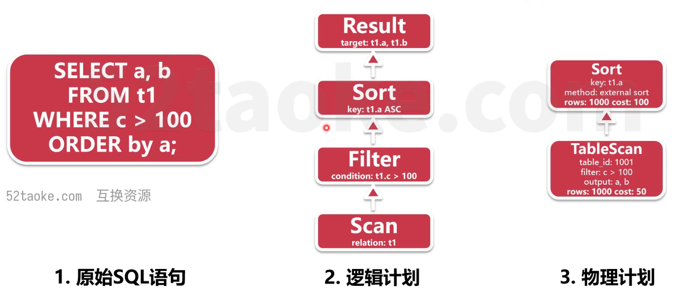
## MySQL是怎样运行的.md


# MySQL的基础设置

## bin目录下MySQL服务器程序

*   ==mysqld== 这个可执行文件就代表着MySQL服务器程序，运行这个可执行文件就可以直接启动一个服务器进程。但这个命令不常用。
*   ==mysqld\_safe== 是一个启动脚本，它会间接的调用mysqld，而且还顺便启动了另外一个监控进程，这个监控进程在服务器进程挂了的时候，可以帮助重启它。另外，使用mysqld\_safe启动服务器程序时，它会将服务器程序的出错信息和其他诊断信息重定向到某个文件中，产生出错日志，这样可以方便我们找出发生错误的原因。
*   mysql.server 也是一个启动脚本，它会间接的调用mysqld\_safe，在调用mysql.server时在后边指定start参数就可以启动服务器程序了。
    ```sql
    mysql.server start
    mysql.server stop
    ```
*   mysqld\_multi 我们一台计算机上也可以运行多个服务器实例，也就是运行多个MySQL服务器进程。mysql\_multi可执行文件可以对每一个服务器进程的启动或停止进行监控。

## 客户端与服务器连接的过程

### 通信方式

#### TCP/IP

真实环境中，数据库服务器进程和客户端进程可能运行在不同的主机中，它们之间必须通过网络来进行通讯。MySQL采用TCP作为服务器和客户端之间的网络通信协议。在网络环境下，每台计算机都有一个唯一的IP地址，如果某个进程有需要采用TCP协议进行网络通信方面的需求，可以向操作系统申请一个端口号，这是一个整数值，它的取值范围是0\~65535。这样在网络中的其他进程就可以通过IP地址 + 端口号的方式来与这个进程连接，这样进程之间就可以通过网络进行通信了。

如果3306端口号已经被别的进程占用了或者我们单纯的想自定义该数据库实例监听的端口号，那我们可以在启动服务器程序的命令行里添加-P参数来明确指定一下端口号，比如这样：

```sql
mysqld -P3307

# 大写P
mysql -h127.0.0.1 -uroot -P3307 -p

```

#### 命名管道和共享内存

如果你是一个Windows用户，那么客户端进程和服务器进程之间可以考虑使用命名管道或共享内存进行通信。不过启用这些通信方式的时候需要在启动服务器程序和客户端程序时添加一些参数：

*   使用命名管道来进行进程间通信
    需要在启动服务器程序的命令中加上--enable-named-pipe参数，然后在启动客户端程序的命令中加入--pipe或者--protocol=pipe参数。
*   使用共享内存来进行进程间通信
    需要在启动服务器程序的命令中加上--shared-memory参数，在成功启动服务器后，共享内存便成为本地客户端程序的默认连接方式，不过我们也可以在启动客户端程序的命令中加入--protocol=memory参数来显式的指定使用共享内存进行通信。

> 使用共享内存的方式进行通信的服务器进程和客户端进程必须在同一台Windows主机中。

#### Unix域套接字文件

如果我们的服务器进程和客户端进程都运行在同一台操作系统为类Unix的机器上的话，我们可以使用Unix域套接字文件来进行进程间通信。如果我们在启动客户端程序的时候指定的主机名为localhost，或者指定了--protocol=socket的启动参数，那服务器程序和客户端程序之间就可以通过Unix域套接字文件来进行通信了。MySQL服务器程序默认监听的Unix域套接字文件路径为/tmp/mysql.sock，客户端程序也默认连接到这个Unix域套接字文件。如果我们想改变这个默认路径，可以在启动服务器程序时指定socket参数，就像这样：

```sql
mysqld --socket=/tmp/a.txt

mysql -hlocalhost -uroot --socket=/tmp/a.txt -p
```

### 服务器处理客户端请求


从图中我们可以看出，服务器程序处理来自客户端的查询请求大致需要经过三个部分，分别是连接管理、解析与优化、存储引擎。

#### 连接管理

每当有一个客户端进程连接到服务器进程时，服务器进程都会创建一个线程来专门处理与这个客户端的交互，当该客户端退出时会与服务器断开连接，服务器并不会立即把与该客户端交互的线程销毁掉，而是把它缓存起来，在另一个新的客户端再进行连接时，把这个缓存的线程分配给该新客户端。这样就起到了不频繁创建和销毁线程的效果，从而节省开销。

在客户端程序发起连接的时候，需要携带主机信息、用户名、密码，服务器程序会对客户端程序提供的这些信息进行认证，如果认证失败，服务器程序会拒绝连接。如果客户端程序和服务器程序不运行在一台计算机上，我们还可以采用使用了==SSL==（安全套接字）的网络连接进行通信，来保证数据传输的安全性。

#### 解析与优化

*   查询缓存
*   语法解析
*   查询优化

##### 查询缓存

查询缓存可以在不同客户端之间共享，也就是说如果客户端A刚刚查询了一个语句，而客户端B之后发送了同样的查询请求，那么客户端B的这次查询就可以直接使用查询缓存中的数据。

如果两个查询请求在任何字符上的不同（例如：空格、注释、大小写），都会导致缓存不会命中。另外，如果查询请求中包含某些系统函数、用户自定义变量和函数、一些系统表，如 mysql 、information\_schema、 performance\_schema 数据库中的表，那这个请求就不会被缓存。比如Now函数，储存了，再拿出来反而不符合要求。

不过既然是缓存，那就有它缓存失效的时候。MySQL的缓存系统会监测涉及到的每张表，只要该表的结构或者数据被修改，如对该表使用了INSERT、 UPDATE、DELETE、TRUNCATE TABLE、ALTER TABLE、DROP TABLE或 DROP DATABASE语句，那使用该表的所有高速缓存查询都将变为无效并从高速缓存中删除！

> 检索，查询请求处理完需要更新查询缓存，维护该查询缓存对应的内存区域。从MySQL 5.7.20开始，不推荐使用查询缓存，并在MySQL 8.0中删除。

##### 语法解析

如果查询缓存没有命中，接下来就需要进入正式的查询阶段了。==MySQL==服务器程序首先要对这段文本做分析，判断请求的语法是否正确，然后从文本中将要查询的表、各种查询条件都提取出来放到MySQL服务器内部使用的一些数据结构上来。

> 这个从指定的文本中提取出我们需要的信息本质上算是一个编译过程，涉及词法解析、语法分析、语义分析等阶段

##### 查询优化

语法解析之后，服务器程序获得到了需要的信息，比如要查询的列是哪些，表是哪个，搜索条件是什么等等。因为我们写的==MySQL==语句执行起来效率可能并不是很高，==MySQL==的优化程序会对我们的语句做一些优化，如外连接转换为内连接、表达式简化、子查询转为连接。优化的结果就是生成一个执行计划，这个执行计划表明了应该使用哪些索引进行查询，表之间的连接顺序是啥样的。我们可以使用EXPLAIN语句来查看某个语句的执行计划。

##### 存储引擎

MySQL服务器把数据的存储和提取操作都封装到了一个叫存储引擎的模块里。我们知道表是由一行一行的记录组成的，但这只是一个逻辑上的概念，物理上如何表示记录，怎么从表中读取数据，怎么把数据写入具体的物理存储器上，这都是存储引擎负责的事情。为了实现不同的功能，MySQL提供了各式各样的存储引擎，不同存储引擎管理的表具体的存储结构可能不同，采用的存取算法也可能不同。

人们把**连接管理、查询缓存、语法解析、查询优化**这些并不涉及真实数据存储的功能划分为MySQL server的功能，把真实存取数据的功能划分为存储引擎的功能。各种不同的存储引擎向上边的==MySQL server==层提供统一的调用接口（也就是存储引擎API），包含了几十个底层函数，像"读取索引第一条内容"、"读取索引下一条内容"、"插入记录"等等。

### 常用存储引擎

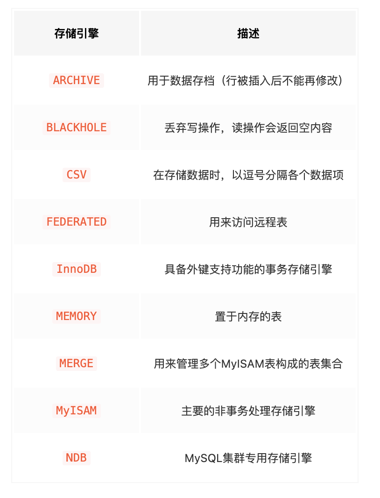

> 最常用的就是InnoDB和MyISAM，有时会提一下Memory。其中InnoDB是MySQL默认的存储引擎

### 关于存储引擎的一些操作

**查看当前服务器程序支持的存储引擎**

```sql
查看当前服务器程序支持的存储引擎

SHOW ENGINES;

+--------------------+---------+----------------------------------------------------------------+--------------+------+------------+
| Engine             | Support | Comment                                                        | Transactions | XA   | Savepoints |
+--------------------+---------+----------------------------------------------------------------+--------------+------+------------+
| ARCHIVE            | YES     | Archive storage engine                                         | NO           | NO   | NO         |
| BLACKHOLE          | YES     | /dev/null storage engine (anything you write to it disappears) | NO           | NO   | NO         |
| MRG_MYISAM         | YES     | Collection of identical MyISAM tables                          | NO           | NO   | NO         |
| FEDERATED          | NO      | Federated MySQL storage engine                                 | NULL         | NULL | NULL       |
| MyISAM             | YES     | MyISAM storage engine                                          | NO           | NO   | NO         |
| PERFORMANCE_SCHEMA | YES     | Performance Schema                                             | NO           | NO   | NO         |
| InnoDB             | DEFAULT | Supports transactions, row-level locking, and foreign keys     | YES          | YES  | YES        |
| MEMORY             | YES     | Hash based, stored in memory, useful for temporary tables      | NO           | NO   | NO         |
| CSV                | YES     | CSV storage engine                                             | NO           | NO   | NO         |
+--------------------+---------+----------------------------------------------------------------+--------------+------+------------+
9 rows in set (4.27 sec)
```

> Transactions列代表该存储引擎是否支持事务处理。XA列代表着该存储引擎是否支持分布式事务。Savepoints代表着该存储引擎是否支持部分事务回滚。

### 设置表的存储引擎

**不同的表可以有不同的物理存储结构，不同的提取和写入方式**。

#### 创建表时指定存储引擎

之前创建表的语句都没有指定表的存储引擎，那就会使用默认的存储引擎==InnoDB==

```sql
CREATE TABLE 表名(
    建表语句;
) ENGINE = 存储引擎名称;

CREATE TABLE 表名(
    建表语句;
) ENGINE = 存储引擎名称;

```

#### 修改表的存储引擎

```sql
ALTER TABLE 表名 ENGINE = 存储引擎名称;

mysql> ALTER TABLE engine_demo_table ENGINE = InnoDB;
Query OK, 0 rows affected (0.05 sec)
Records: 0  Duplicates: 0  Warnings: 0

mysql> SHOW CREATE TABLE engine_demo_table\G
*************************** 1. row ***************************
       Table: engine_demo_table
Create Table: CREATE TABLE `engine_demo_table` (
  `i` int(11) DEFAULT NULL
) ENGINE=InnoDB DEFAULT CHARSET=utf8
1 row in set (0.01 sec)
```

## MySQL启动选项和系统变量

### 在命令行上使用选项

如果我们在启动客户端程序时在-h参数后边紧跟服务器的IP地址，这就意味着客户端和服务器之间需要通过TCP/IP网络进行通信。如果我们在启动服务器程序的时候就禁止各客户端使用TCP/IP网络进行通信，可以在启动服务器程序的命令行里添加==skip-networking==启动选项，就像这样：

```sql
mysqld --skip-networking
# 两个单词之间-和_都可以
mysqld --skip_networking
```

如果在创建表的语句中没有显式指定表的存储引擎的话，那就会默认使用InnoDB作为表的存储引擎。如果我们想改变表的默认存储引擎的话，可以这样写启动服务器的命令行：

```sql
mysqld --default-storage-engine=MyISAM
```

启动服务器程序的命令行后边指定启动选项的通用格式就是这样的：

```sql
--启动选项1[=值1] --启动选项2[=值2] ... --启动选项n[=值n]
```

> 使用mysql --help可以看到mysql程序支持的启动选项，mysqld\_safe --help可以看到mysqld\_safe程序支持的启动选项。查看mysqld支持的启动选项有些特别，需要使用mysqld --verbose --help。

### 选项的长形式和短形式

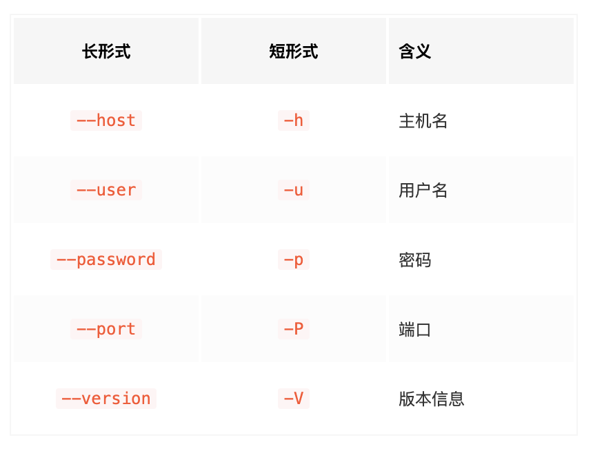

### 配置文件中使用选项

我们把需要设置的启动选项都写在这个配置文件中，每次启动服务器的时候都从这个文件里加载相应的启动选项。

#### 配置文件的路径

##### Windows操作系统的配置文件

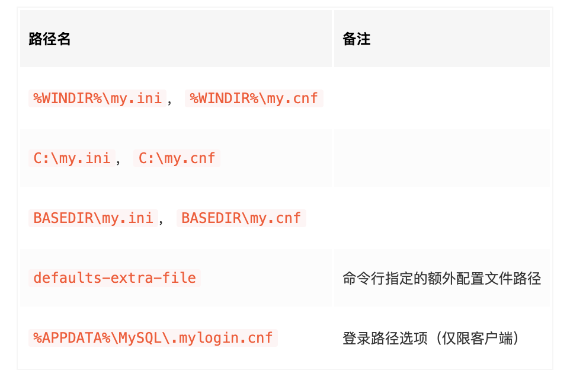

*   配置文件可以使用.ini的扩展名，也可以使用.cnf的扩展名。
*   %WINDIR%指的是你机器上Windows目录的位置，通常是C:\WINDOWS
*   BASEDIR指的是MySQL安装目录的路径
*   第四个路径指的是我们在启动程序时可以通过指定defaults-extra-file参数的值来添加额外的配置文件路径
*   %APPDATA%表示Windows应用程序数据目录的值，可以使用下列命令查看：
*   列表中最后一个名为.mylogin.cnf配置文件有点儿特殊，它不是一个纯文本文件（其他的都是纯文本文件），而是使用mysql\_config\_editor实用程序创建的加密文件。文件中只能包含一些用于启动客户端软件时连接服务器的一些选项，包括 host、user、password、port和 socket。而且它只能被客户端程序所使用。

> mysql\_config\_editor实用程序其实是MySQL安装目录下的bin目录下的一个可执行文件，这个实用程序有专用的语法来生成或修改 .mylogin.cnf 文件中的内容

##### 类Unix操作系统中的配置文件

在类UNIX操作系统中，MySQL会按照下列路径来寻找配置文件：
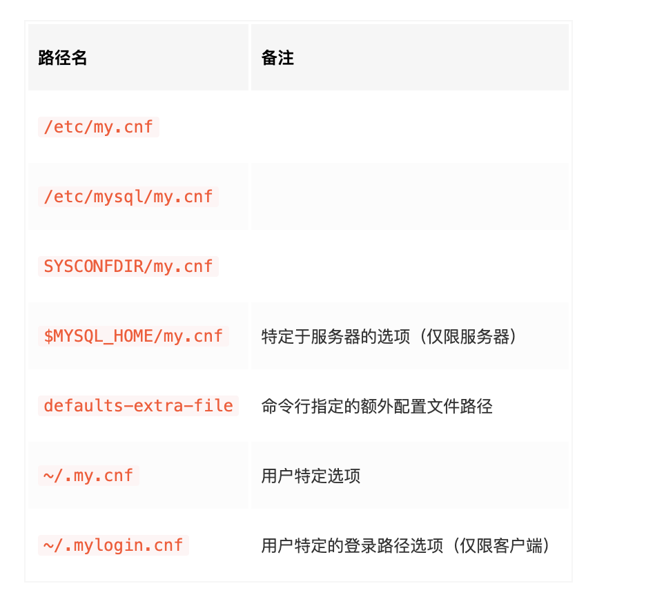

> mysqld\_safe程序处理不了的启动项，会传递给mysqld程序处理。

#### 配置文件的内容

配置文件中的启动选项被划分为若干个组，每个组有一个组名，用中括号\[]扩起来。

```scss
[server]
(具体的启动选项...)

[mysqld]
(具体的启动选项...)

[mysqld_safe]
(具体的启动选项...)

[client]
(具体的启动选项...)

[mysql]
(具体的启动选项...)

[mysqladmin]
(具体的启动选项...)


[server]
option1     #这是option1，该选项不需要选项值
option2 = value2      #这是option2，该选项需要选项值
# 上面等同于下面
--option1 --option2=value2
```

*   \[server]组下边的启动选项将作用于所有的服务器程序。

*   \[client]组下边的启动选项将作用于所有的客户端程序。

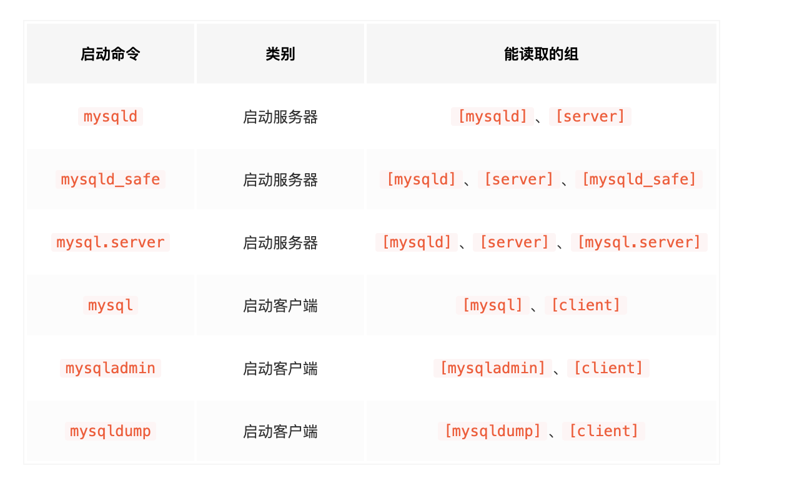

> 如果我们想指定mysql.server程序的启动参数，则必须将它们放在配置文件中，而不是放在命令行中。mysql.server仅支持start和stop作为命令行参数。

### 特定MySQL版本的专用选项组

可以定义一个\[mysqld-5.7]的选项组

### 配置文件的优先级

多个配置文件中设置了相同的启动选项，那以最后一个配置文件中的为准。

### 同一个配置文件中多个组的优先级

同一个配置文件中多个组的优先级。

### defaults-file的使用

不让默认有效，可以输入如下命令：

```ini
mysqld --defaults-file=/tmp/myconfig.txt
```

> 注意`defaults-extra-file`和`defaults-file`的区别，使用`defaults-extra-file`可以指定额外的配置文件搜索路径.

### 命令行和配置文件中启动选项的区别

命令行起作用。

### 系统变量

#### 系统变量简介

MySQL服务器程序运行过程中会用到许多影响程序行为的变量，它们被称为MySQL系统变量，比如允许同时连入的客户端数量用系统变量max\_connections表示，表的默认存储引擎用系统变量default\_storage\_engine表示。

大多数的系统变量的值也可以在程序运行过程中修改，而无需停止并重新启动它。

#### 查看系统变量

**因为系统变量太多，需要用匹配模式。**
SHOW VARIABLES \[LIKE 匹配的模式];

```sql
mysql> SHOW VARIABLES like 'max_connections';
+-----------------+-------+
| Variable_name   | Value |
+-----------------+-------+
| max_connections | 151   |
+-----------------+-------+
1 row in set (0.03 sec)
```

#### 设置系统变量

*   通过启动选项设置
    *   通过命令行添加启动选项
    *   通过配置文件添加启动选项
*   服务器程序运行过程中设置

#### 设置不同作用范围的系统变量

==作用范围==分为这两种：

*   ==GLOBAL==：全局变量，影响服务器的整体操作。
*   ==SESSION==：会话变量，影响某个客户端连接的操作。（注：SESSION有个别名叫LOCAL）

**服务器启动时，会初始化全局变量，同时为每个连接维护一个会话变量（默认用全局变量初始化）。**

```ini
# 默认语法
SET [GLOBAL|SESSION] 系统变量名 = 值;
SET [@@(GLOBAL|SESSION).]var_name = XXX;

# 设置全局变量
语句一：SET GLOBAL default_storage_engine = MyISAM;
语句二：SET @@GLOBAL.default_storage_engine = MyISAM;

# 设置局部变量
语句一：SET SESSION default_storage_engine = MyISAM;
语句二：SET @@SESSION.default_storage_engine = MyISAM;
语句三：SET default_storage_engine = MyISAM;
```

#### 查看不同作用范围的系统变量

```ini
# 不写默认查看 session变量
SHOW [GLOBAL|SESSION] VARIABLES [LIKE 匹配的模式];
```

> 如果某个客户端改变了某个系统变量在`GLOBAL`作用范围的值，并不会影响该系统变量在当前已经连接的客户端作用范围为`SESSION`的值，只会影响后续连入的客户端在作用范围为`SESSION`的值。

*   并不是所有系统变量都具有GLOBAL和SESSION的作用范围。
*   有些系统变量是只读的，并不能设置值。

#### 启动选项和系统变量的区别

*   大部分的系统变量都可以被当作启动选项
*   有些系统变量是系统生成不能设置
*   有些启动选项也不是系统变量，比如defaults-file

### 状态变量

==状态变量==是用来显示服务器程序运行状况的，例如已经连接了多少客户端。

```ini
SHOW [GLOBAL|SESSION] STATUS [LIKE 匹配的模式];

mysql> SHOW STATUS LIKE 'thread%';
+-------------------+-------+
| Variable_name     | Value |
+-------------------+-------+
| Threads_cached    | 0     |
| Threads_connected | 1     |
| Threads_created   | 1     |
| Threads_running   | 2     |
+-------------------+-------+
4 rows in set (0.01 sec)
```

## 字符集和比较规则

### 字符集简介

人们抽象出一个==字符集==的概念来描述某个字符范围的编码规则。将字符映射成二进制。

### 比较规则简介

字符集表示字符的范围以及编码规则后，比较两个字符的大小。直接比较这两个字符对应的二进制编码的大小，这种比较规则被称为二进制比较规则。

### 一些重要的字符集

*   ASCII字符集
    共收录128个字符，包括空格、标点符号、数字、大小写字母和一些不可见字符。由于总共才128个字符，所以可以使用1个字节来进行编码，我们看一些字符的编码方式：'L' ->  01001100（十六进制：0x4C，十进制：76）
*   ISO 8859-1字符集
    共收录256个字符，是在ASCII字符集的基础上又扩充了128个西欧常用字符(包括德法两国的字母)，也可以使用1个字节来进行编码。这个字符集也有一个别名latin1。
*   GB2312字符集
    收录了汉字以及拉丁字母、希腊字母、日文平假名及片假名字母、俄语西里尔字母。其中收录汉字6763个，其他文字符号682个。同时这种字符集又兼容ASCII字符集，所以在编码方式上显得有些奇怪：
    *   如果该字符在ASCII字符集中，则采用1字节编码。
    *   否则采用2字节编码。
*   GBK字符集
    GBK字符集只是在收录字符范围上对GB2312字符集作了扩充，编码方式上兼容GB2312。
*   utf8字符集
    这种字符集兼容ASCII字符集，采用变长编码方式，编码一个字符需要使用1～4个字节。

> 这种表示一个字符需要的字节数可能不同的编码方式称为变长编码方式。

### MySQL中支持的字符集和排序规则

*   MySQL中的utf8和utf8mb4
    *   utf8mb3：阉割过的utf8字符集，只使用1～3个字节表示字符。
    *   utf8mb4：正宗的utf8字符集，使用1～4个字节表示字符。

> 在MySQL中utf8是utf8mb3的别名，如果有emoji，要用mb4。

#### 字符集的查看

```sql
SHOW (CHARACTER SET|CHARSET) [LIKE 匹配的模式];

mysql> SHOW CHARSET;
+----------+---------------------------------+---------------------+--------+
| Charset  | Description                     | Default collation   | Maxlen |
+----------+---------------------------------+---------------------+--------+
| armscii8 | ARMSCII-8 Armenian              | armscii8_general_ci |      1 |
| ascii    | US ASCII                        | ascii_general_ci    |      1 |
| big5     | Big5 Traditional Chinese        | big5_chinese_ci     |      2 |
| binary   | Binary pseudo charset           | binary              |      1 |
| cp1250   | Windows Central European        | cp1250_general_ci   |      1 |
| cp1251   | Windows Cyrillic                | cp1251_general_ci   |      1 |
| cp1256   | Windows Arabic                  | cp1256_general_ci   |      1 |
| cp1257   | Windows Baltic                  | cp1257_general_ci   |      1 |
| cp850    | DOS West European               | cp850_general_ci    |      1 |
| cp852    | DOS Central European            | cp852_general_ci    |      1 |
| cp866    | DOS Russian                     | cp866_general_ci    |      1 |
| cp932    | SJIS for Windows Japanese       | cp932_japanese_ci   |      2 |
| dec8     | DEC West European               | dec8_swedish_ci     |      1 |
| eucjpms  | UJIS for Windows Japanese       | eucjpms_japanese_ci |      3 |
| euckr    | EUC-KR Korean                   | euckr_korean_ci     |      2 |
| gb18030  | China National Standard GB18030 | gb18030_chinese_ci  |      4 |
| gb2312   | GB2312 Simplified Chinese       | gb2312_chinese_ci   |      2 |
| gbk      | GBK Simplified Chinese          | gbk_chinese_ci      |      2 |
| geostd8  | GEOSTD8 Georgian                | geostd8_general_ci  |      1 |
| greek    | ISO 8859-7 Greek                | greek_general_ci    |      1 |
| hebrew   | ISO 8859-8 Hebrew               | hebrew_general_ci   |      1 |
| hp8      | HP West European                | hp8_english_ci      |      1 |
| keybcs2  | DOS Kamenicky Czech-Slovak      | keybcs2_general_ci  |      1 |
| koi8r    | KOI8-R Relcom Russian           | koi8r_general_ci    |      1 |
| koi8u    | KOI8-U Ukrainian                | koi8u_general_ci    |      1 |
| latin1   | cp1252 West European            | latin1_swedish_ci   |      1 |
| latin2   | ISO 8859-2 Central European     | latin2_general_ci   |      1 |
| latin5   | ISO 8859-9 Turkish              | latin5_turkish_ci   |      1 |
| latin7   | ISO 8859-13 Baltic              | latin7_general_ci   |      1 |
| macce    | Mac Central European            | macce_general_ci    |      1 |
| macroman | Mac West European               | macroman_general_ci |      1 |
| sjis     | Shift-JIS Japanese              | sjis_japanese_ci    |      2 |
| swe7     | 7bit Swedish                    | swe7_swedish_ci     |      1 |
| tis620   | TIS620 Thai                     | tis620_thai_ci      |      1 |
| ucs2     | UCS-2 Unicode                   | ucs2_general_ci     |      2 |
| ujis     | EUC-JP Japanese                 | ujis_japanese_ci    |      3 |
| utf16    | UTF-16 Unicode                  | utf16_general_ci    |      4 |
| utf16le  | UTF-16LE Unicode                | utf16le_general_ci  |      4 |
| utf32    | UTF-32 Unicode                  | utf32_general_ci    |      4 |
| utf8     | UTF-8 Unicode                   | utf8_general_ci     |      3 |
| utf8mb4  | UTF-8 Unicode                   | utf8mb4_0900_ai_ci  |      4 |
+----------+---------------------------------+---------------------+--------+
41 rows in set (0.01 sec)
```

> Default collation列表示这种字符集中一种默认的比较规则, Maxlen 表示一个字符最多需要几个字节。

#### 比较规则的查看

```sql
SHOW COLLATION [LIKE 匹配的模式];

mysql> SHOW COLLATION LIKE 'utf8\_%';
+--------------------------+---------+-----+---------+----------+---------+
| Collation                | Charset | Id  | Default | Compiled | Sortlen |
+--------------------------+---------+-----+---------+----------+---------+
| utf8_general_ci          | utf8    |  33 | Yes     | Yes      |       1 |
| utf8_bin                 | utf8    |  83 |         | Yes      |       1 |
| utf8_unicode_ci          | utf8    | 192 |         | Yes      |       8 |
| utf8_icelandic_ci        | utf8    | 193 |         | Yes      |       8 |
```

*   比较规则名称以与其关联的字符集的名称开头
*   后边紧跟着该比较规则主要作用于哪种语言，比如utf8\_polish\_ci表示以波兰语的规则比较，utf8\_general\_ci是一种通用的比较规则。
*   名称后缀意味着该比较规则是否区分语言中的重音、大小写啥的
    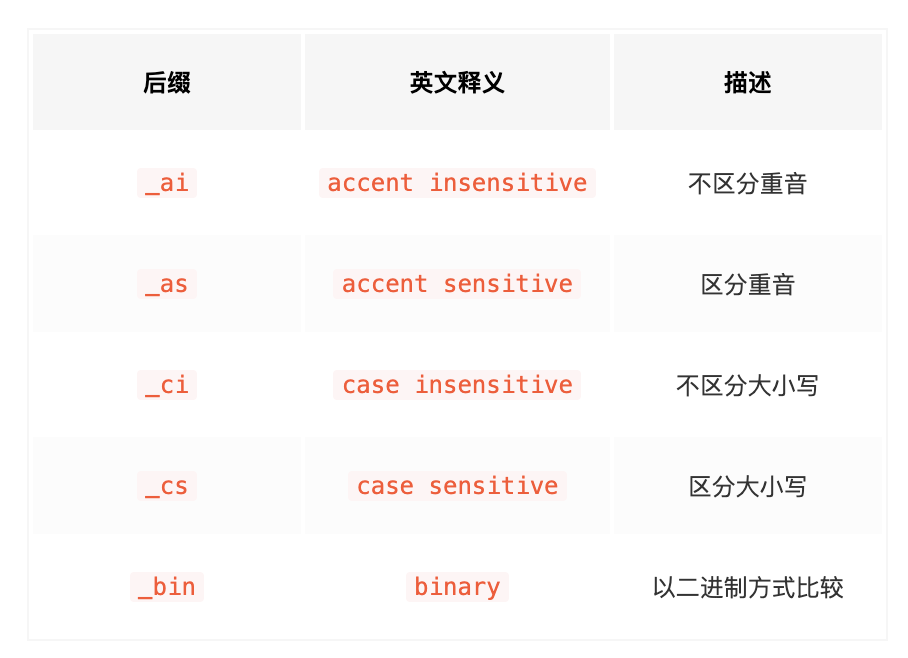

#### 字符集和比较规则的应用

*   各级别的字符集和比较规则：
    *   服务器级别
    *   数据库级别
    *   表级别
    *   列级别

##### 服务器级别

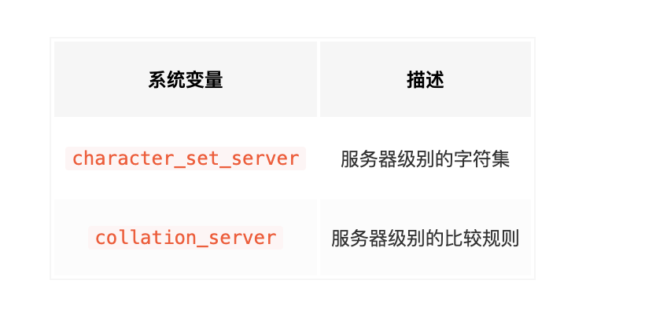

```sql
mysql> SHOW VARIABLES LIKE 'character_set_server';
+----------------------+---------+
| Variable_name        | Value   |
+----------------------+---------+
| character_set_server | utf8mb4 |
+----------------------+---------+
1 row in set (0.01 sec)

mysql> SHOW VARIABLES LIKE 'collation_server';
+------------------+--------------------+
| Variable_name    | Value              |
+------------------+--------------------+
| collation_server | utf8mb4_0900_ai_ci |
+------------------+--------------------+
1 row in set (0.00 sec)
```

##### 数据库级别

```sql
CREATE DATABASE 数据库名
    [[DEFAULT] CHARACTER SET 字符集名称]
    [[DEFAULT] COLLATE 比较规则名称];

ALTER DATABASE 数据库名
    [[DEFAULT] CHARACTER SET 字符集名称]
    [[DEFAULT] COLLATE 比较规则名称];
```

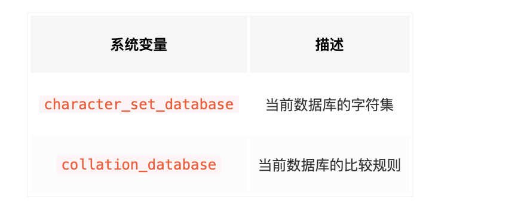

> character\_set\_database 和 collation\_database 这两个系统变量是只读的

##### 表级别

```sql
CREATE TABLE 表名 (列的信息)
    [[DEFAULT] CHARACTER SET 字符集名称]
    [COLLATE 比较规则名称]]

ALTER TABLE 表名
    [[DEFAULT] CHARACTER SET 字符集名称]
    [COLLATE 比较规则名称]
```

##### 列级别

同一个表中的不同的列也可以有不同的字符集和比较规则。

```sql
CREATE TABLE 表名(
    列名 字符串类型 [CHARACTER SET 字符集名称] [COLLATE 比较规则名称],
    其他列...
);

ALTER TABLE 表名 MODIFY 列名 字符串类型 [CHARACTER SET 字符集名称] [COLLATE 比较规则名称];
```

#### 仅修改字符集或仅修改比较规则

*   只修改字符集，则比较规则将变为修改后的字符集默认的比较规则。
*   只修改比较规则，则字符集将变为修改后的比较规则对应的字符集。

> 列默认->表默认->数据库默认->服务器默认

### 客户端和服务器通信中的字符集

*   编码和解码使用的字符集不一致会出现乱码，解析不一致。
*   MySQL中从客户端发往服务器的请求伴随着多次的字符串转换（默认utf8）
    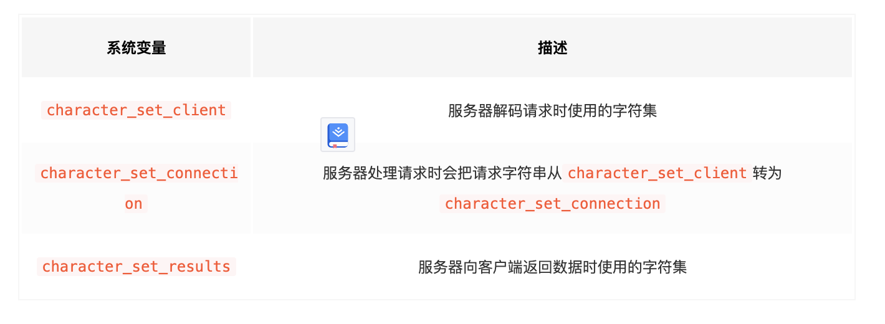
    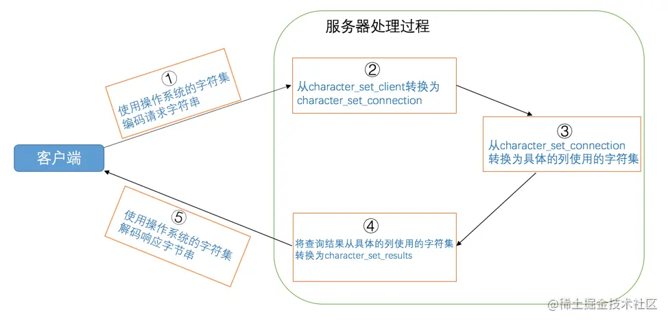
*   要保证character\_set\_results和character\_set\_client与客户端的字符集一样。

```sql
SET NAMES 字符集名;
# 上面一条等于下面三条
SET character_set_client = 字符集名;
SET character_set_connection = 字符集名;
SET character_set_results = 字符集名;

# 启动文件可以设置
[client]
default-character-set=utf8
```

#### 比较规则的应用

==比较规则==的作用通常体现比较字符串大小的表达式以及对某个字符串列进行排序中。

# 存储引擎InnoDB

## InnoDB记录结构

### InnoDB页简介

*   处理数据过程发生在内存，存储在硬盘
*   InnoDB将数据划分为若干个页，以页作为磁盘和内存之间交互的基本单位
*   InnoDB中页的大小一般为 16 KB。每次读取和写入最少也是16KB。

### InnoDB行格式

**InnoDB存储引擎设计了四种行格式**，分别是Compact、Redundant、Dynamic和Compressed行格式

#### 指定行格式的语法

```sql
CREATE TABLE 表名 (列的信息) ROW_FORMAT=行格式名称
    
ALTER TABLE 表名 ROW_FORMAT=行格式名称
```

#### COMPACT行格式

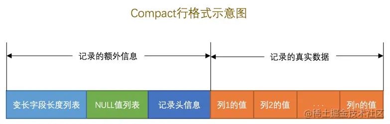

一条完整的记录其实可以被分为==记录的额外信息==和==记录的真实数据==两大部分

##### 记录的额外信息

*   ==变长字段长度列表==：如VARCHAR(M)、VARBINARY(M)等存储字节不固定的数据，需要把占用字节也存起来。
    *   真正的数据内容
    *   占用的字节数
        存放在记录的开头部位，按照列的顺序**逆序存放**。M是varchar(M),最多存储的字符数。W是Maxlen列，字符集一个字符最多需要字节数。L是实际存储的字符数，应该小于等于M。
        *   如果M×W <= 255，那么使用1个字节来表示真正字符串占用的字节数。
        *   如果M×W > 255，则分为两种情况：如果L <= 127，则用1个字节来表示真正字符串占用的字节数。如果L > 127，则用2个字节来表示真正字符串占用的字节数。
        *   如果该可变字段允许存储的最大字节数（M×W）超过255字节并且真实存储的字节数（L）超过127字节，则使用2个字节，否则使用1个字节。
        *   值为 NULL 的列的长度是不储存的 。

> InnoDB在读记录的变长字段长度列表时先查看表结构，如果某个变长字段允许存储的最大字节数大于255时，该字节的第一个二进制位作为标志位：如果该字节的第一个位为0，那该字节就是一个单独的字段长度（使用一个字节表示不大于127的二进制的第一个位都为0），如果该字节的第一个位为1，那该字节就是半个字段长度。

> 并不是所有记录都有变长字段长度列表 部分，比方说表中所有的列都不是变长的数据类型的话，这一部分就没有。

*   ==NULL值列表==
    *   统计表中允许存储NULL的列
    *   每个允许存储NULL的列对应一个二进制位，逆序排列，1为NULL
    *   NULL值列表必须用整数个字节的位表示，高位补零
*   ==记录头信息==
    *   由固定的5个字节40位组成。
        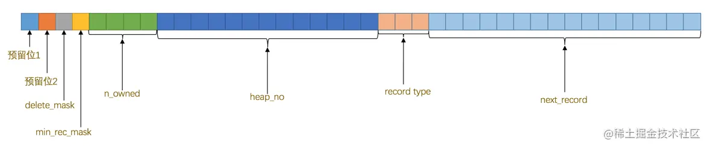
        

##### 记录的真实数据

MySQL会为每个记录默认的添加一些列（也称为隐藏列）
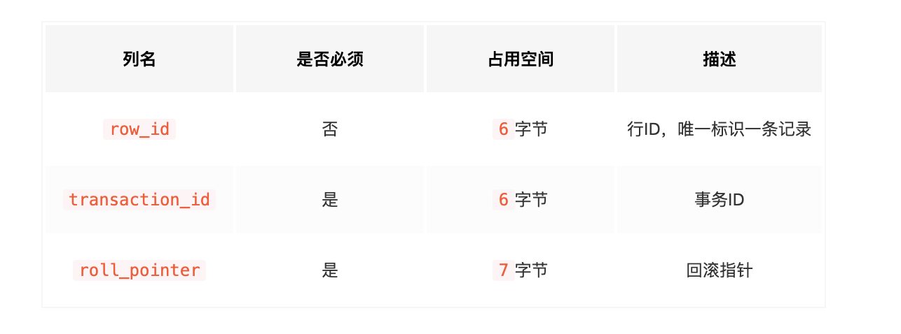

> row\_id在没有自定义主键以及Unique键的情况下才会添加该列

##### CHAR(M)列的存储格式

使用变长字符集时至少占M个字节（utf84 4M个），包括空字符，有效预防内存碎片。

#### Redundant行格式

**`MySQL5.0`之前用的一种行格式**


*   字段长度偏移列表

    *   会把记录中所有列（隐藏列）的长度信息逆序存储
    *   两个相邻数值的差值是各个列值的长度
*   记录头信息

    *   `Redundant`行格式的记录头信息占用`6`字节，`48`个二进制位
    *   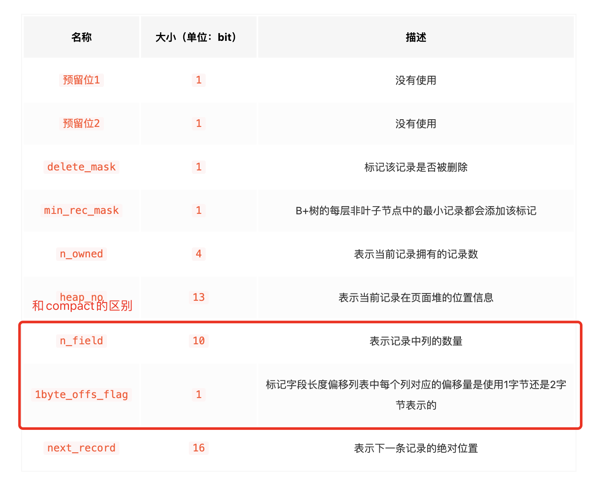
    *   多了`n_field`和`1byte_offs_flag`，没有`record_type`
    *   `1byte_offs_flag`的值是怎么选择的

        *   真实数据占用的字节数不大于127（十六进制`0x7F`，二进制`01111111`），1字节。
        *   真实数据占用的字节数大于127，但不大于32767（十六进制`0x7FFF`，二进制`0111111111111111`），2字节
        *   更大时，会只保留前`768`个字节和20个字节的溢出页面地址
    *   `Redundant`行格式中`NULL`值的处理

        *   将列对应的偏移量值的第一个比特位作为是否为`NULL`的依据，该比特位也可以被称之为`NULL比特位`
        *   解释了为什么只要记录的真实数据大于127（十六进制`0x7F`，二进制`01111111`）时，就采用2个字节来表示一个列对应的偏移量
        *   定长占用空间，变长不占用空间
*   CHAR(M)列的存储格式

    *   不管该列使用的字符集是啥，Mx字符集最多需要字节数

#### 行溢出数据

##### VARCHAR(M)最多能存储的数据

VARCHAR(M)类型的列最多可以占用65535个字节，只是理论上，实际上不行，实际为以下3部分存储空间：

*   真实数据
*   真实数据占用字节的长度
*   NULL值标识，如果该列有NOT NULL属性则可以没有这部分存储空间

> 上述所言在列的值允许为NULL的情况下，ascii最大65532，gbk字符集下M的最大取值就是32766，utf8字符集下M的最大取值就是21844，这都是在表中只有一个字段的情况下说的，一定要记住一个行中的所有列（不包括隐藏列和记录头信息）占用的字节长度加起来不能超过65535个字节！

##### 溢出页

在`Compact`和`Redundant`行格式中，对于占用存储空间非常大的列，在`记录的真实数据`处只会存储该列的一部分数据，把剩余的数据分散存储在几个其他的页中，然后`记录的真实数据`处用20个字节存储指向这些页的地址（当然这20个字节中还包括这些分散在其他页面中的数据的占用的字节数），从而可以找到剩余数据所在的页，如图所示：


> 不只是 ***VARCHAR(M)*** 类型的列，其他的 ***TEXT***、***BLOB*** 类型的列在存储数据非常多的时候也会发生`行溢出`。

#### &#x20;Dynamic和Compressed行格式

这两种行格式类似于`COMPACT行格式`，只不过在处理行溢出数据时有点儿分歧，它们不会在记录的真实数据处存储字符串的前768个字节，而是把所有的字节都存储到其他页面中，只在记录的真实数据处存储其他页面的地址。

另外，`Compressed`行格式会采用压缩算法对页面进行压缩。

## 不同类型的页介绍

**索引页也是数据页**

### 数据页结构的快速浏览

16KB的数据页被分为多个部分，如下：


InnoDB数据页被分为七个部分，占用的字节数，有的确定有的不确定。

| 名称                   | 中文名       | 占用空间大小 | 简单描述         |
| :------------------- | :-------- | :----- | :----------- |
| `File Header`        | 文件头部      | `38`字节 | 页的一些通用信息     |
| `Page Header`        | 页面头部      | `56`字节 | 数据页专有的一些信息   |
| `Infimum + Supremum` | 最小记录和最大记录 | `26`字节 | 两个虚拟的行记录     |
| `User Records`       | 用户记录      | 不确定    | 实际存储的行记录内容   |
| `Free Space`         | 空闲空间      | 不确定    | 页中尚未使用的空间    |
| `Page Directory`     | 页面目录      | 不确定    | 页中的某些记录的相对位置 |
| `File Trailer`       | 文件尾部      | `8`字节  | 校验页是否完整      |

### 记录在页中的存储

存储的记录会将指定的`行格式`存储到`User Records`部分。一开始没有`User Records`这个部分，会从`Free Space`部分申请一个记录大小的空间，当空间被全部申请完后，这个页就使用完了，需要申请新的页。


### 记录头信息的介绍

**占用五个字节的空间。**

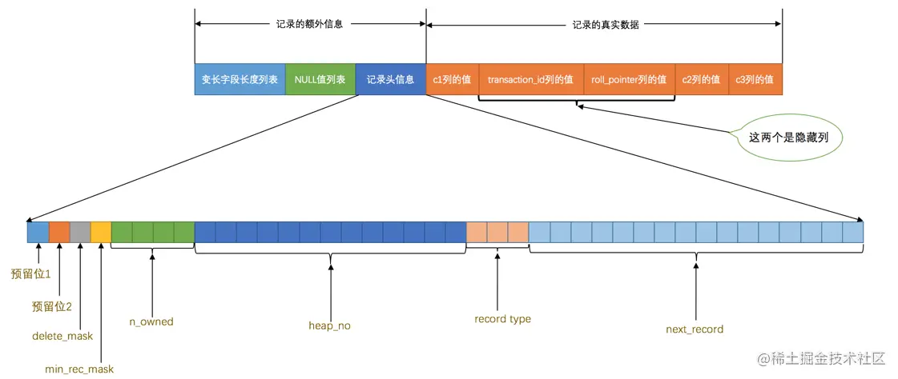

| 名称             | 大小（单位：bit） | 描述                                                     |
| :------------- | :--------- | :----------------------------------------------------- |
| `预留位1`         | `1`        | 没有使用                                                   |
| `预留位2`         | `1`        | 没有使用                                                   |
| `delete_mask`  | `1`        | 标记该记录是否被删除                                             |
| `min_rec_mask` | `1`        | B+树的每层非叶子节点中的最小记录都会添加该标记                               |
| `n_owned`      | `4`        | 表示当前记录拥有的记录数                                           |
| `heap_no`      | `13`       | 表示当前记录在记录堆的位置信息                                        |
| `record_type`  | `3`        | 表示当前记录的类型，`0`表示普通记录，`1`表示B+树非叶节点记录，`2`表示最小记录，`3`表示最大记录 |
| `next_record`  | `16`       | 表示下一条记录的相对位置                                           |

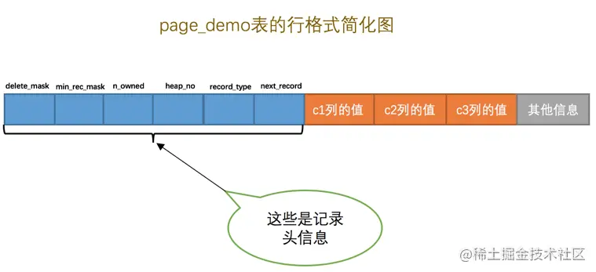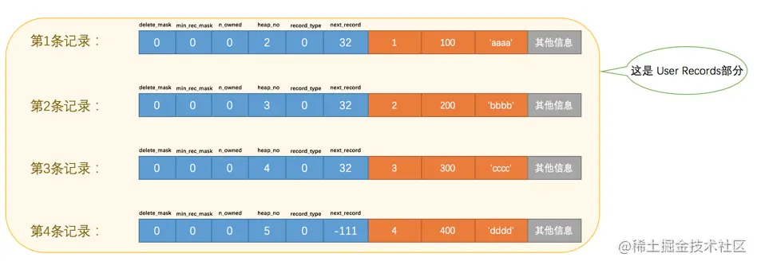

*   delete\_mask

&#x9;当前记录是否被删掉。被删除记录不会被立即删除，而是打一个删除标记，组成一个`垃圾链表`，这个链表占用的空间是`可重用空间`，新插入的数据可以覆盖这部分空间。

*   min\_rec\_mask

&#x9;B+树的每层非叶子节点中的最小记录都会添加该标记

*   `heap_no`

&#x9;记录在本页中的位置，从记录2开始，0和1是两条\*\*\*虚拟记录，\*\*\*一个代表最小记录，一个代表最大记录。记录比较的是`主键`的大小。这两条记录由5字节的`记录头信息`和8字节的固定部分组成。	不存放在User Records，存放在`Infimum + Supremum。`

&#x9;


*   record\_type

&#x9;表示当前记录的类型。

*   next\_record

&#x9;记录当前真实记录下一条真实记录的地址偏移量。（指的是主键从小到大的下一条）

&#x9;***Infimum记录（也就是最小记录）*** 的下一条记录就是本页中主键值最小的记录，本页中主键值最大的记录的下一条就是 ***Supremum记录（也就是最大记录）*** 

&#x9;不论我们怎么对页中的记录做增删改操作，InnoDB始终会维护一条记录的单链表，链表中的各个节点是按照主键值由小到大的顺序连接起来的。

&#x9;


> **小贴士：**
>
> 你会不会觉得next\_record这个指针有点儿怪，为啥要指向记录头信息和真实数据之间的位置呢？
>
> 为啥不干脆指向整条记录的开头位置，也就是记录的额外信息开头的位置呢？ 因为这个位置刚刚好，向左读取就是记录头信息，向右读取就是真实数据。我们前边还说过变长字段长度列表、NULL值列表中的信息都是逆序存放，这样可以使记录中位置靠前的字段和它们对应的字段长度信息在内存中的距离更近

### Page Directory（页目录）

类似于字典的目录，制作过程为下面这样：

1.  将正常记录划分为几个组，虚拟记录和未删除的记录。
2.  每个组的最后一条记录（也就是组内最大的那条记录）的头信息中的`n_owned`属性表示该记录拥有多少条记录，也就是该组内共有几条记录。
3.  将每个组的最后一条记录的地址偏移量单独提取出来按顺序存储到靠近`页`的尾部的地方，这个地方就是所谓的`Page Directory`，也就是`页目录。`

    页面目录中的这些地址偏移量被称为`槽`（英文名：`Slot`），所以这个页面目录就是由`槽`组成的。

    比方说现在的`page_demo`表中正常的记录共有6条，`InnoDB`会把它们分成两组，第一组中只有一个最小记录，第二组中是剩余的5条记录，看下边的示意图：

    

    

`InnoDB`的对每个分组中的记录条数是有规定的：最小记录分组只能有 ***1*** 条记录，最大记录分组只能在 ***1\~8*** 条，剩下的分组中记录的条数只能在是 ***4\~8*** 条。所以分组是按照下边的步骤进行的：

*   初始情况下一个数据页里只有最小记录和最大记录两条记录，它们分属于两个分组。
*   之后每插入一条记录，都会从`页目录`中找到主键值比本记录的主键值大并且差值最小的槽，然后把该槽对应的记录的`n_owned`值加1，表示本组内又添加了一条记录，直到该组中的记录数等于8个。
*   在一个组中的记录数等于8个后再插入一条记录时，会将组中的记录拆分成两个组，一个组中4条记录，另一个5条记录。这个过程会在`页目录`中新增一个`槽`来记录这个新增分组中最大的那条记录的偏移量。

在一个数据页中查找指定主键值的记录的过程分为两步：

1.  通过二分法确定该记录所在的槽，并找到该槽所在分组中主键值最小的那条记录。
2.  通过记录的`next_record`属性遍历该槽所在的组中的各个记录。

```


```

### Page Header（页面头部）

一个数据页中存储的记录的状态信息，比如本页中已经存储了多少条记录，第一条记录的地址是什么。56个字节。

| 名称                  | 占用空间大小 | 描述                                                                 |
| :------------------ | :----- | :----------------------------------------------------------------- |
| `PAGE_N_DIR_SLOTS`  | `2`字节  | 在页目录中的槽数量                                                          |
| `PAGE_HEAP_TOP`     | `2`字节  | 还未使用的空间最小地址，也就是说从该地址之后就是`Free Space`                               |
| `PAGE_N_HEAP`       | `2`字节  | 本页中的记录的数量（包括最小和最大记录以及标记为删除的记录）                                     |
| `PAGE_FREE`         | `2`字节  | 第一个已经标记为删除的记录地址（各个已删除的记录通过`next_record`也会组成一个单链表，这个单链表中的记录可以被重新利用） |
| `PAGE_GARBAGE`      | `2`字节  | 已删除记录占用的字节数                                                        |
| `PAGE_LAST_INSERT`  | `2`字节  | 最后插入记录的位置                                                          |
| `PAGE_DIRECTION`    | `2`字节  | 记录插入的方向                                                            |
| `PAGE_N_DIRECTION`  | `2`字节  | 一个方向连续插入的记录数量                                                      |
| `PAGE_N_RECS`       | `2`字节  | 该页中记录的数量（不包括最小和最大记录以及被标记为删除的记录）                                    |
| `PAGE_MAX_TRX_ID`   | `8`字节  | 修改当前页的最大事务ID，该值仅在二级索引中定义                                           |
| `PAGE_LEVEL`        | `2`字节  | 当前页在B+树中所处的层级                                                      |
| `PAGE_INDEX_ID`     | `8`字节  | 索引ID，表示当前页属于哪个索引                                                   |
| `PAGE_BTR_SEG_LEAF` | `10`字节 | B+树叶子段的头部信息，仅在B+树的Root页定义                                          |
| `PAGE_BTR_SEG_TOP`  | `10`字节 | B+树非叶子段的头部信息，仅在B+树的Root页定义                                         |

*   PAGE\_DIRECTION

&#x9;假如新插入的一条记录的主键值比上一条大，这条记录的插入方向是右边，反之则是左边。

*   PAGE\_N\_DIRECTION

&#x9;连续几次插入新记录的方向都是一致的，`InnoDB`会把沿着同一个方向插入记录的条数记下来。

### File Header（文件头部）

`File Header`针对各种类型的页都通用，描述了一些各种页的通用信息。38个字节。

| 名称                                 | 占用空间大小 | 描述                                          |
| :--------------------------------- | :----- | :------------------------------------------ |
| `FIL_PAGE_SPACE_OR_CHKSUM`         | `4`字节  | 页的校验和（checksum值）                            |
| `FIL_PAGE_OFFSET`                  | `4`字节  | 页号                                          |
| `FIL_PAGE_PREV`                    | `4`字节  | 上一个页的页号                                     |
| `FIL_PAGE_NEXT`                    | `4`字节  | 下一个页的页号                                     |
| `FIL_PAGE_LSN`                     | `8`字节  | 页面被最后修改时对应的日志序列位置（英文名是：Log Sequence Number） |
| `FIL_PAGE_TYPE`                    | `2`字节  | 该页的类型                                       |
| `FIL_PAGE_FILE_FLUSH_LSN`          | `8`字节  | 仅在系统表空间的一个页中定义，代表文件至少被刷新到了对应的LSN值           |
| `FIL_PAGE_ARCH_LOG_NO_OR_SPACE_ID` | `4`字节  | 页属于哪个表空间                                    |

*   FIL\_PAGE\_SPACE\_OR\_CHKSUM

&#x9;通过某种算法来计算一个比较短的值来代表这个很长的字节串，这个比较短的值就称为`校验和`。校验和不同肯定字符串不同，省去了直接比较两个比较长的字节串的时间损耗。

*   FIL\_PAGE\_OFFSET

&#x9;唯一确定一个页。

*   FIL\_PAGE\_TYPE

| 类型名称                      | 十六进制   | 描述                |
| :------------------------ | :----- | :---------------- |
| `FIL_PAGE_TYPE_ALLOCATED` | 0x0000 | 最新分配，还没使用         |
| `FIL_PAGE_UNDO_LOG`       | 0x0002 | Undo日志页           |
| `FIL_PAGE_INODE`          | 0x0003 | 段信息节点             |
| `FIL_PAGE_IBUF_FREE_LIST` | 0x0004 | Insert Buffer空闲列表 |
| `FIL_PAGE_IBUF_BITMAP`    | 0x0005 | Insert Buffer位图   |
| `FIL_PAGE_TYPE_SYS`       | 0x0006 | 系统页               |
| `FIL_PAGE_TYPE_TRX_SYS`   | 0x0007 | 事务系统数据            |
| `FIL_PAGE_TYPE_FSP_HDR`   | 0x0008 | 表空间头部信息           |
| `FIL_PAGE_TYPE_XDES`      | 0x0009 | 扩展描述页             |
| `FIL_PAGE_TYPE_BLOB`      | 0x000A | 溢出页               |
| `FIL_PAGE_INDEX`          | 0x45BF | 索引页，也就是我们所说的`数据页` |

*   `FIL_PAGE_PREV`和`FIL_PAGE_NEXT`


### File Trailer

`8`个字节，检测当前页的完整性。

*   前4个字节代表页的校验和

    和`File Header`中的校验和相对应的，修改页从file header开始写，写到后面如果会写入页尾，如果写了一半儿断电了，那么在`File Header`中的校验和就代表着已经修改过的页，而在`File Trailer`中的校验和代表着原先的页，二者不同则意味着同步中间出了错。
*   后4个字节代表页面被最后修改时对应的日志序列位置（LSN）

## B+树索引

### 没有索引的查找

#### 在一个页中查找

假设目前表中的记录比较少，所有的记录都可以被存放到一个页中：

*   以主键为搜索条件 - 在页目录中使用二分法快速定位槽进行查找。
*   以其他列作为搜索条件 - 从最小记录开始一次往上遍历。

#### 在很多页中查找

在很多页中查找记录的话可以分为两个步骤：

1.  定位到记录所在的页。
2.  从所在的页内中查找相应的记录。

> 在没有索引的情况下，只能从第一个页沿着双向链表一直往下找。

### 索引

#### 一个简单的索引方案

为快速定位记录所在的数据页而建立一个别的目录，建这个目录必须完成下边这些事儿：

*   **下一个数据页中用户记录的主键值必须大于上一个页中用户记录的主键值**。通过记录移动的操作来始终保持这个状态，叫做页分裂。
*   **给所有的页建立一个目录项**。

    如果想从这么多页中根据主键值快速定位某些记录所在的页，需要给它们做个目录，每个页对应一个目录项，每个目录项包括下边两个部分：

    *   页的用户记录中最小的主键值，我们用`key`来表示。
    *   页号，我们用`page_no`表示。
*   查找过程分为两步：

    *   二分找到记录所在页
    *   在页中定位具体的记录

    


#### InnoDB中的索引方案

上边之所以称为一个简易的索引方案，是因为我们为了在根据主键值进行查找时使用二分法快速定位具体的目录项而假设所有目录项都可以在物理存储器上连续存储，但是这样做有几个问题：

*   `InnoDB`是使用页来作为管理存储空间的基本单位，也就是最多能保证`16KB`的连续存储空间，而随着表中记录数量的增多，需要非常大的连续的存储空间才能把所有的目录项都放下，这对记录数量非常多的表是不现实的。
*   我们时常会对记录进行增删，假设我们把`页28`中的记录都删除了，`页28`也就没有存在的必要了，那意味着`目录项2`也就没有存在的必要了，这就需要把`目录项2`后的目录项都向前移动一下，非常耗费时间。

`目录项`和用户记录差不多，`目录项`中的两个列是`主键`和`页号`，复用了之前存储用户记录的数据页来存储目录项，同时使用`record_type`来进行区分用户记录和目录项记录。

*   0：普通的用户记录
*   1：目录项记录
*   2：最小记录
*   3：最大记录

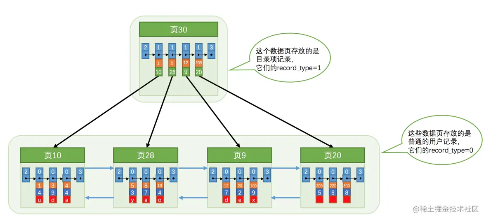

> 只有在存储目录项记录的页中的主键值最小的目录项记录的min\_rec\_mask值为1，其他别的记录的min\_rec\_mask值都是0。

根据某个主键值去查找记录的步骤就可以大致拆分成下边两步：&#x20;

1.  先到存储`目录项记录`的页，二分查找快速定位对应目录项。
2.  再到存储用户记录的页中二分查找主键值的用户记录。

当目录项记录超过1个页时，会重新分配一个新的页。

根据某个主键值去查找记录的步骤就变为三步：

1.  确定`目录项记录`页-根据min\_rec\_mask定位页
2.  通过`目录项记录`页确定用户记录真实所在的页。
3.  在真实存储用户记录的页中定位到具体的记录。

**假如目录项记录的页非常多怎么办？同时他们是不连续的，那么我们就再生成一个目录。**


> 这就是B+树，既存放用户记录的数据页，还存放目录项记录的数据页。
>
> 一般情况下，我们用到的`B+`树都不会超过4层，那我们通过主键值去查找某条记录最多只需要做4个页面内的查找（查找3个目录项页和一个用户记录页），又因为在每个页面内有所谓的`Page Directory`（页目录），所以在页面内也可以通过二分法实现快速定位记录。

#### 聚簇索引

`B+`树有两个特点：

1.  使用记录主键值的大小进行记录和页的排序，这包括三个方面的含义：

    *   页内的记录是按照主键的大小顺序排成一个单向链表。
    *   各个存放用户记录的页也是根据页中用户记录的主键大小顺序排成一个双向链表。
    *   存放目录项记录的页分为不同的层次，在同一层次中的页也是根据页中目录项记录的主键大小顺序排成一个双向链表。
2.  `B+`树的叶子节点存储的是完整的用户记录。

具有这两种特性的`B+`树称为`聚簇索引`，所有完整的用户记录都存放在这个`聚簇索引`的叶子节点处。

> `聚簇索引`并不需要我们在`MySQL`语句中显式的使用`INDEX`语句去创建。`InnoDB`存储引擎会自动的为我们创建聚簇索引。数据即索引，索引即数据。

#### 二级索引

`聚簇索引`只能在搜索条件是主键值时才能发挥作用，因为`B+`树中的数据都是按照主键进行排序的。可以多建几棵`B+`树，不同的`B+`树中的数据采用不同的排序规则。

*   `B+`树的叶子节点存储的并不是完整的用户记录，而只是`c2列+主键`这两个列的值。
*   目录项记录中不再是`主键+页号`的搭配，而变成了`c2列+页号`的搭配。

用二级索引查找过程：

1.  确定`目录项记录`页
2.  通过`目录项记录`页确定用户记录真实所在的页。
3.  在真实存储用户记录的页中定位到具体的记录。
4.  这个`B+`树的叶子节点中的记录只存储了`c2`和`c1`（也就是`主键`）两个列，所以我们必须再根据主键值去聚簇索引中再查找一遍完整的用户记录。

#### 联合索引

同时以多个列的大小作为排序规则。先根据A排序，A相等根据B排序。联合索引也是二级索引，也是B+树。

### InnoDB的B+树索引的注意事项

*   一个B+树索引的根节点自诞生之日起，便不会再移动。会被记录在某个地方，每次用再取出来。当数据加多时会复制给新页，进行页分裂。
*   内节点中目录项记录的唯一性。—需要保证在B+树的同一层内节点的目录项记录除`页号`这个字段以外是唯一的。二级索引的目录项实际是：索引列+主键值+页号
*   `InnoDB`的一个数据页至少可以存放两条记录

### MyISAM中的索引方案简单介绍

`MyISAM`的索引方案也是B+树，将索引和数据***分开存储。***

*   将表中的记录按照记录的插入顺序单独存储在一个文件中，称之为`数据文件`。我们可以通过行号而快速访问到一条记录。
*   使用`MyISAM`存储引擎的表会把索引信息另外存储到一个称为`索引文件`的另一个文件中。`MyISAM`会单独为表的主键创建一个索引，`主键值 + 行号`的组合。

> `MyISAM`中建立的索引相当于全部都是`二级索引`！

### MySQL创建和删除索引的语句

```sql
CREATE TALBE 表名 (
    各种列的信息 ··· , 
    [KEY|INDEX] 索引名 (需要被索引的单个列或多个列)
)

ALTER TABLE 表名 ADD [INDEX|KEY] 索引名 (需要被索引的单个列或多个列);

ALTER TABLE 表名 DROP [INDEX|KEY] 索引名;

CREATE TABLE index_demo(
    c1 INT,
    c2 INT,
    c3 CHAR(1),
    PRIMARY KEY(c1),
    INDEX idx_c2_c3 (c2, c3)
);
```

> key和index是同义词

## B+树索引的使用

### 索引的代价

*   空间上的代价 - B树的每一个节点都是一个数据页16KB
*   时间上的代价 - 进行增、删、改操作时，都需要去修改各个`B+`树索引。

> 一个表上索引建的越多，就会占用越多的存储空间，在增删改记录的时候性能就越差。

### B+树索引适用的条件

#### 全值匹配

**搜索条件中的列和索引列一致的话，这种情况就称为全值匹配。**

> 搜索条件中的列的顺序是没影响的，因为有查询优化器。

#### 匹配最左边的列

**搜索语句中可以不用包含全部联合索引中的列，只包含左边的一个或多个列。**

> 如果搜索条件中有左边的有右边的没有中间的，那么只会调用左边的索引。

#### 匹配列前缀

以`'As'`开头的记录，可以匹配左边的字符串索引。

```sql
SELECT * FROM person_info WHERE name LIKE 'As%';
```

> '%As%' 和 '%com' 后缀匹配是无法调用索引的，所以如果想要后缀匹配调用索引，需要将其转变为前缀索引，数据倒着存入数据库。

#### 匹配范围值

对于索引进行范围的匹配。如果对多个列同时进行范围查找的话，只有对索引最左边的那个列进行范围查找的时候才能用到`B+`树索引

#### 精确匹配某一列并范围匹配另外一列

精确匹配左边的，然后左边的右边一列可以范围匹配。

#### 用于排序和分组

如果排序和分组是索引就不用在内容进行快速排序了。

#### 使用联合索引进行排序注意事项

*   `ORDER BY`的子句后边的列的顺序也必须按照索引列的顺序
*   `ORDER BY`索引左边的列的形式可以使用部分的`B+`树索引

### 不可以使用索引进行排序的几种情况

*   ASC、DESC混用
*   排序列包含非同一个索引的列
*   排序列使用了复杂的表达式——用函数修饰过

### 回表的代价

如果二级索引有90%多的`id`值需要回表，还不如直接去扫描聚簇索引（也就是全表扫描）。

> 查询优化器会事先对表中的记录计算一些统计数据，然后再利用这些统计数据根据查询的条件来计算一下需要回表的记录数，需要回表的记录数越多，就越倾向于使用全表扫描，反之倾向于使用`二级索引 + 回表`的方式。

### 覆盖索引

为了彻底告别`回表`操作带来的性能损耗，我们建议：最好在查询列表里只包含索引列，这样可以不用回表。

### 建立索引的建议

*   最好为那些列的基数大（数据不重复）的列建立索引
*   索引列的类型尽量小，主键也是
*   索引字符串值的前缀—只索引字符串前几个字符
*   让索引列在比较表达式中单独出现
*   主键按顺序插入
*   减少冗余和重复索引

## MySQL的数据目录

MySQL服务器程序在启动时会到文件系统的某个目录下加载一些文件，之后在运行过程中产生的数据也都会存储到这个目录下的某些文件中，这个目录就称为`数据目录。`

```sql
mysql>  SHOW VARIABLES LIKE 'datadir';
+---------------+------------------------+
| Variable_name | Value                  |
+---------------+------------------------+
| datadir       | /usr/local/mysql/data/ |
+---------------+------------------------+
1 row in set (0.01 sec)
```

### 数据库在文件系统中的表示

新建一个数据库时，`MySQL`会帮我们做这两件事儿：

1.  在`数据目录`下创建一个和数据库名同名的子目录（或者说是文件夹）。
2.  在该与数据库名同名的子目录下创建一个名为`db.opt`的文件，这个文件中包含了该数据库的各种属性，比方说该数据库的字符集和比较规则。

### 表在文件系统中的表示

每个表的信息其实可以分为两种：

1.  表结构的定义 - 表名.frm 二进制文件
2.  表中的数据 - `表空间`或者`文件空间`（英文名：`table space`或者`file space`）

#### 系统表空间（system tablespace）

默认情况下，`InnoDB`会在`数据目录`下创建一个名为`ibdata1，`大小为`12M`的**自扩展文件。**

这个文件就是对应的`系统表空间`在文件系统上的表示。可以对应多个文件。

```sql
[server]
innodb_data_file_path=data1:512M;data2:512M:autoextend
```

#### 独立表空间(file-per-table tablespace)

在MySQL5.6.6以及之后的版本中，`InnoDB`并不会默认的把各个表的数据存储到系统表空间中，而是为每一个表建立一个独立表空间，在所属子目录下创建了一个如下的文件：

```sql
表名.ibd

# 可以自己指定使用系统表空间还是独立表空间来存储数据 0是系统表空间，1是独立表空间，只对新建表起作用。
[server]
innodb_file_per_table=0

# 系统表空间中的表转移到独立表空间
ALTER TABLE 表名 TABLESPACE [=] innodb_file_per_table;
# 独立表空间中的表转移到系统表空间
ALTER TABLE 表名 TABLESPACE [=] innodb_system;
```

#### 其他类型的表空间

通用表空间（general tablespace）、undo表空间（undo tablespace）、临时表空间（temporary tablespace）

### MyISAM是如何存储表数据的

`MyISAM`并没有什么所谓的`表空间`一说，表数据都存放到对应的数据库子目录下。（数据和索引是分开的）

    test.frm
    test.MYD # 数据文件
    test.MYI # 索引文件

### 视图在文件系统中的表示

视图是虚拟的表，就是某个查询语句的一个别名。不需要存储真实的数据和表一样，在目录下存储一个`视图名.frm`的文件。

### 其他的文件

*   服务器进程文件。

    `MySQL`服务器会把自己的进程ID写入到一个文件中。
*   服务器日志文件。
*   默认/自动生成的SSL和RSA证书和密钥文件。

### &#x20;文件系统对数据库的影响

*   数据库名称和表名称不得超过文件系统所允许的最大长度。
*   特殊字符的问题
*   文件长度受文件系统最大长度限制

### MySQL系统数据库简介

这几个数据库包含了MySQL服务器运行过程中所需的一些信息以及一些运行状态信息

*   mysql

    存储了MySQL的用户账户和权限信息，一些存储过程、事件的定义信息，一些运行过程中产生的日志信息，一些帮助信息以及时区信息等。
*   information\_schema

    MySQL服务器维护的所有其他数据库的信息，比如有哪些表、哪些视图、哪些触发器、哪些列。不是真实的用户数据，是描述性信息，元数据。
*   performance\_schema

    对MySQL服务器的一个性能监控。包括统计最近执行了哪些语句，在执行过程的每个阶段都花费了多长时间，内存的使用情况等等信息。
*   sys

    通过视图的形式把`information_schema `和`performance_schema`结合起来

## InnoDB表空间

对于系统表空间来说，对应着文件系统中一个或多个实际文件；对于每个独立表空间来说，对应着文件系统中一个名为`表名.ibd`的实际文件。

可以把表空间想象成被切分为许许多多个`页`的池子，当我们想为某个表插入一条记录的时候，就从池子中捞出一个对应的页来把数据写进去。

### 页面通用部分


*   `File Header`：记录页面的一些通用信息

*   `File Trailer`：校验页是否完整，保证从内存到磁盘刷新时内容的一致性。

*   表空间中的每一个页都对应着一个页号，也就是`FIL_PAGE_OFFSET`，这个页号由4个字节组成，也就是32个比特位，所以一个表空间最多可以拥有2³²个页，如果按照页的默认大小16KB来算，一个表空间最多支持64TB的数据。表空间的第一个页的页号为0，之后的页号分别是1，2，3...依此类推

### 独立表空间结构

#### 区（extent）的概念

对于16KB的页来说，连续的64个页就是一个`区`，也就是说一个区默认占用1MB空间大小。不论是系统表空间还是独立表空间，都可以看成是由若干个区组成的，每256个区被划分成一组。画个图表示就是这样：


这些组的头几个页面的类型都是类似的，就像这样：


*   第一个组最开始的3个页面的类型是固定的，也就是说`extent 0`这个区最开始的3个页面的类型是固定的，分别是：

    *   `FSP_HDR`类型：这个类型的页面是用来登记整个表空间的一些整体属性以及本组所有的`区`，也就是`extent 0` \~ `extent 255`这256个区的属性，一个表空间只有一个FSP\_HDR.
    *   `IBUF_BITMAP`类型：这个类型的页面是存储本组所有的区的所有页面关于`INSERT BUFFER`的信息。
    *   `INODE`类型：这个类型的页面存储了许多称为`INODE`的数据结构。
*   其余各组最开始的2个页面的类型是固定的，也就是说`extent 256`、`extent 512`这些区。

    *   `XDES`类型：全称是`extent descriptor`，用来登记本组256个区的属性，和`FSP_HDR`类型的页面的作用类似，只不过`FSP_HDR`类型的页面还会额外存储一些表空间的属性。
    *   `IBUF_BITMAP`类型

### 段（segment）的概念

如果链表中相邻的两个页物理位置离得非常远，就是所谓的`随机I/O`。`随机I/O`是非常慢的，所以我们应该尽量让链表中相邻的页的物理位置也相邻，这样进行范围查询的时候才可以使用所谓的`顺序I/O`。

所以才引入了`区`（`extent`）的概念，一个区就是在物理位置上连续的64个页。在表中数据量大的时候，为某个索引分配空间的时候就不再按照页为单位分配了，而是按照`区`为单位分配，甚至在表中的数据十分非常特别多的时候，可以一次性分配多个连续的区。**从性能角度看，可以消除很多的随机`I/O。`**

存放叶子节点的区的集合就算是一个`段`（`segment`），存放非叶子节点的区的集合也算是一个`段`。也就是说一个索引会生成2个段，一个叶子节点段，一个非叶子节点段。

默认情况下一个使用`InnoDB`存储引擎的表只有一个聚簇索引，一个索引会生成2个段，而段是以区为单位申请存储空间的，一个区默认占用1M存储空间，所以默认情况下一个只存了几条记录的小表也需要2M的存储空间么？这样比较浪费空间。

`InnoDB`提出了一个碎片（fragment）区的概念，也就是在一个碎片区中，并不是所有的页都是为了存储同一个段的数据而存在的，而是碎片区中的页可以用于不同的目的，比如有些页用于段A，有些页用于段B，有些页甚至哪个段都不属于。碎片区直属于表空间，并不属于任何一个段。所以此后为某个段分配存储空间的策略是这样的：

*   在刚开始向表中插入数据的时候，段是从某个碎片区以单个页面为单位来分配存储空间的。
*   当某个段已经占用了32个碎片区页面之后，就会以完整的区为单位来分配存储空间。

### 区的分类

| 状态名         | 含义         |
| :---------- | :--------- |
| `FREE`      | 空闲的区       |
| `FREE_FRAG` | 有剩余空间的碎片区  |
| `FULL_FRAG` | 没有剩余空间的碎片区 |
| `FSEG`      | 附属于某个段的区   |

> *   附属于某个段的区。每一个索引都可以分为叶子节点段和非叶子节点段，除此之外InnoDB还会另外定义一些特殊作用的段，在这些段中的数据量很大时将使用区来作为基本的分配单位。
> *   如果把表空间比作是一个集团军，段就相当于师，区就相当于团。一般的团都是隶属于某个师的，就像是处于\`FSEG\`的区全都隶属于某个段，而处于\`FREE\`、\`FREE\_FRAG\`以及\`FULL\_FRAG\`这三种状态的区却直接隶属于表空间，就像独立团直接听命于军部一样。

为了方便管理这些区，设计了一个称为`XDES Entry`的结构（全称就是Extent Descriptor Entry），每一个区都对应着一个`XDES Entry`结构，这个结构记录了对应的区的一些属性。


`XDES Entry`是一个40个字节的结构，大致分为4个部分，各个部分的释义如下：

*   `Segment ID`（8字节）

    每一个段都有一个唯一的编号，用ID表示，此处的`Segment ID`字段表示就是该区所在的段。当然前提是该区已经被分配给某个段了，不然的话该字段的值没啥意义。
*   `List Node`（12字节）

    这个部分可以将若干个`XDES Entry`结构串联成一个链表。

    
*   `State`（4字节）

    这个字段表明区的状态。可选的值就是我们前边说过的那4个，分别是：`FREE`、`FREE_FRAG`、`FULL_FRAG`和`FSEG`。
*   `Page State Bitmap`（16字节）

    这个部分共占用16个字节，也就是128个比特位。我们说一个区默认有64个页，这128个比特位被划分为64个部分，每个部分2个比特位，对应区中的一个页。这两个比特位的第一个位表示对应的页是否是空闲的，第二个比特位还没有用。

#### XDES Entry链表

上面这么多概念的初心仅仅是想提高向表插入数据的效率又不至于数据量少的表浪费空间。

回到最初的起点，捋一捋向某个段中插入数据的过程：

*   当段中数据较少的时候，首先会查看表空间中是否有状态为`FREE_FRAG`的区，也就是找还有空闲空间的碎片区，如果找到了，那么从该区中取一些零散的页把数据插进去；否则到表空间下申请一个状态为`FREE`的区，也就是空闲的区，把该区的状态变为`FREE_FRAG`，然后从该新申请的区中取一些零散的页把数据插进去。之后不同的段使用零散页的时候都会从该区中取，直到该区中没有空闲空间，然后该区的状态就变成了`FULL_FRAG`。
*   现在的问题是你怎么知道表空间里的哪些区是`FREE`的，哪些区的状态是`FREE_FRAG`的，哪些区是`FULL_FRAG`的？

    *   把状态为`FREE`的区对应的`XDES Entry`结构通过`List Node`来连接成一个链表，这个链表我们就称之为`FREE`链表。
    *   把状态为`FREE_FRAG`的区对应的`XDES Entry`结构通过`List Node`来连接成一个链表，这个链表我们就称之为`FREE_FRAG`链表。
    *   把状态为`FULL_FRAG`的区对应的`XDES Entry`结构通过`List Node`来连接成一个链表，这个链表我们就称之为`FULL_FRAG`链表。
*   当段中数据已经占满了32个零散的页后，就直接申请完整的区来插入数据了。

    设计`InnoDB`的大叔们为每个段中的区对应的`XDES Entry`结构建立了三个链表：

    *   `FREE`链表：同一个段中，所有页面都是空闲的区对应的`XDES Entry`结构会被加入到这个链表。注意和直属于表空间的`FREE`链表区别开了，此处的`FREE`链表是附属于某个段的。
    *   `NOT_FULL`链表：同一个段中，仍有空闲空间的区对应的`XDES Entry`结构会被加入到这个链表。
    *   `FULL`链表：同一个段中，已经没有空闲空间的区对应的`XDES Entry`结构会被加入到这个链表。

```sql
CREATE TABLE t (
    c1 INT NOT NULL AUTO_INCREMENT,
    c2 VARCHAR(100),
    c3 VARCHAR(100),
    PRIMARY KEY (c1),
    KEY idx_c2 (c2)
)ENGINE=InnoDB;
```

这个表`t`共有两个索引，一个聚簇索引，一个二级索引`idx_c2`，所以这个表共有4个段，每个段都会维护上述3个链表，总共是12个链表，加上我们上边说过的直属于表空间的3个链表，整个独立表空间共需要维护15个链表。所以段在数据量比较大时插入数据的话，会先获取`NOT_FULL`链表的头节点，直接把数据插入这个头节点对应的区中即可，如果该区的空间已经被用完，就把该节点移到`FULL`链表中。

#### 链表基节点

怎么找到某个链表的头节点或者尾节点在表空间中的位置呢？设计`InnoDB`的大叔当然考虑了这个问题，他们设计了一个叫`List Base Node`的结构，翻译成中文就是链表的基节点。


*   `List Length`表明该链表一共有多少节点
*   `First Node Page Number`和`First Node Offset`表明该链表的头节点在表空间中的位置。
*   `Last Node Page Number`和`Last Node Offset`表明该链表的尾节点在表空间中的位置。

> 一般我们把某个链表对应的`List Base Node`结构放置在表空间中固定的位置

#### 链表小结

综上所述，表空间是由若干个区组成的，每个区都对应一个`XDES Entry`的结构，直属于表空间的区对应的`XDES Entry`结构可以分成`FREE`、`FREE_FRAG`和`FULL_FRAG`这3个链表；每个段可以附属若干个区，每个段中的区对应的`XDES Entry`结构可以分成`FREE`、`NOT_FULL`和`FULL`这3个链表。每个链表都对应一个`List Base Node`的结构，这个结构里记录了链表的头、尾节点的位置以及该链表中包含的节点数。

### 段的结构

段其实不对应表空间中某一个连续的物理区域，而是一个逻辑上的概念，由若干个零散的页面以及一些完整的区组成。像每个区都有对应的`XDES Entry`来记录这个区中的属性一样，设计`InnoDB`的大叔为每个段都定义了一个`INODE Entry`结构来记录一下段中的属性。


*   Segment ID - 指这个`INODE Entry`结构对应的段的编号（ID）。
*   NOT\_FULL\_N\_USED - 指的是在`NOT_FULL`链表中已经使用了多少个页面。
*   3个`List Base Node - `分别为段的`FREE`链表、`NOT_FULL`链表、`FULL`链表定义了`List Base Node`
*   `Magic Number `- 用来标记这个`INODE Entry`是否已经被初始化（97937874表示已经初始化）
*   `Fragment Array Entry - `每个`Fragment Array Entry`结构都对应着一个零散的页面，这个结构一共4个字节，表示一个零散页面的页号。

### 各类型页面详细情况

#### `FSP_HDR`类型

第一个组的第一个页面，页号为0，存储了表空间的一些整体属性以及第一个组内256个区的对应的`XDES Entry`结构，直接看这个类型的页面的示意图：


| 名称                  | 中文名    | 占用空间大小    | 简单描述             |
| :------------------ | :----- | :-------- | :--------------- |
| `File Header`       | 文件头部   | `38`字节    | 页的一些通用信息         |
| `File Space Header` | 表空间头部  | `112`字节   | 表空间的一些整体属性信息     |
| `XDES Entry`        | 区描述信息  | `10240`字节 | 存储本组256个区对应的属性信息 |
| `Empty Space`       | 尚未使用空间 | `5986`字节  | 用于页结构的填充，没啥实际意义  |
| `File Trailer`      | 文件尾部   | `8`字节     | 校验页是否完整          |

##### File Space Header部分


| 名称                                        | 占用空间大小 | 描述                                                 |
| :---------------------------------------- | :----- | :------------------------------------------------- |
| `Space ID`                                | `4`字节  | 表空间的ID                                             |
| `Not Used`                                | `4`字节  | 这4个字节未被使用，可以忽略                                     |
| `Size`                                    | `4`字节  | 当前表空间占有的页面数                                        |
| `FREE Limit`                              | `4`字节  | 尚未被初始化的最小页号，大于或等于这个页号的区对应的XDES Entry结构都没有被加入FREE链表 |
| `Space Flags`                             | `4`字节  | 表空间的一些占用存储空间比较小的属性                                 |
| `FRAG_N_USED`                             | `4`字节  | FREE\_FRAG链表中已使用的页面数量                              |
| `List Base Node for FREE List`            | `16`字节 | FREE链表的基节点                                         |
| `List Base Node for FREE_FRAG List`       | `16`字节 | FREE\_FRAG链表的基节点                                   |
| `List Base Node for FULL_FRAG List`       | `16`字节 | FULL\_FRAG链表的基节点                                   |
| `Next Unused Segment ID`                  | `8`字节  | 当前表空间中下一个未使用的 Segment ID                           |
| `List Base Node for SEG_INODES_FULL List` | `16`字节 | SEG\_INODES\_FULL链表的基节点                            |
| `List Base Node for SEG_INODES_FREE List` | `16`字节 | SEG\_INODES\_FREE链表的基节点                            |

*   `List Base Node for FREE List`、`List Base Node for FREE_FRAG List`、`List Base Node for FULL_FRAG List`。

    分别是直属于表空间的`FREE`链表的基节点、`FREE_FRAG`链表的基节点、`FULL_FRAG`链表的基节点，这三个链表的基节点在表空间的位置是固定的，就是在表空间的第一个页面（也就是`FSP_HDR`类型的页面）的`File Space Header`部分。
*   FREE Limit

    啥时候用到啥时候初始化，在该字段表示的页号之前的区都被初始化了，之后的区尚未被初始化。
*   Space Flags

    表空间对于一些布尔类型的属性，或者只需要寥寥几个比特位搞定的属性都放在了这个`Space Flags`中存储，虽然它只有4个字节，32个比特位大小，却存储了好多表空间的属性，详细情况如下表：

    | 标志名称            | 占用的空间（单位：bit） | 描述                     |
    | :-------------- | :------------ | :--------------------- |
    | `POST_ANTELOPE` | 1             | 表示文件格式是否大于`ANTELOPE`   |
    | `ZIP_SSIZE`     | 4             | 表示压缩页面的大小              |
    | `ATOMIC_BLOBS`  | 1             | 表示是否自动把值非常长的字段放到BLOB页里 |
    | `PAGE_SSIZE`    | 4             | 页面大小                   |
    | `DATA_DIR`      | 1             | 表示表空间是否是从默认的数据目录中获取的   |
    | `SHARED`        | 1             | 是否为共享表空间               |
    | `TEMPORARY`     | 1             | 是否为临时表空间               |
    | `ENCRYPTION`    | 1             | 表空间是否加密                |
    | `UNUSED`        | 18            | 没有使用到的比特位              |
*   `List Base Node for SEG_INODES_FULL List`和`List Base Node for SEG_INODES_FREE List`

    每个段对应的`INODE Entry`结构会集中存放到一个类型为`INODE`的页中，如果表空间中的段特别多，则会有多个`INODE Entry`结构，可能一个页放不下，这些`INODE`类型的页会组成两种列表：

    *   `SEG_INODES_FULL`链表，该链表中的`INODE`类型的页面都已经被`INODE Entry`结构填充满了，没空闲空间存放额外的`INODE Entry`了。
    *   `SEG_INODES_FREE`链表，该链表中的`INODE`类型的页面仍有空闲空间来存放`INODE Entry`结构。&#x9;

##### XDES Entry部分

把256个区划分成一组，在每组的第一个页面中存放256个`XDES Entry`结构。

在区的数量非常多时，一个单独的页可能就不够存放足够多的`XDES Entry`结构，所以我们把表空间的区分为了若干个组，每组开头的一个页面记录着本组内所有的区对应的`XDES Entry`结构。


> 与`FSP_HDR`类型的页面对比，除了少了`File Space Header`部分之外，其余的部分是一样一样的。

#### `IBUF_BITMAP`类型

这种类型的页里边记录了一些有关`Change Buffer`的东西。

#### `INODE`类型

每个段拥有一个`INODE Entry`结构


| 名称                              | 中文名    | 占用空间大小    | 简单描述                       |
| :------------------------------ | :----- | :-------- | :------------------------- |
| `File Header`                   | 文件头部   | `38`字节    | 页的一些通用信息                   |
| `List Node for INODE Page List` | 通用链表节点 | `12`字节    | 存储上一个INODE页面和下一个INODE页面的指针 |
| `INODE Entry`                   | 段描述信息  | `16320`字节 |                            |
| `Empty Space`                   | 尚未使用空间 | `6`字节     | 用于页结构的填充，没啥实际意义            |
| `File Trailer`                  | 文件尾部   | `8`字节     | 校验页是否完整                    |

`List Node for INODE Page List`这个玩意儿，因为一个表空间中可能存在超过85个段，所以可能一个`INODE`类型的页面不足以存储所有的段对应的`INODE Entry`结构，所以就需要额外的`INODE`类型的页面来存储这些结构。还是为了方便管理这些`INODE`类型的页面，设计`InnoDB`的大叔们将这些`INODE`类型的页面串联成两个不同的链表：

*   `SEG_INODES_FULL`链表：该链表中的`INODE`类型的页面中已经没有空闲空间来存储额外的`INODE Entry`结构了。
*   `SEG_INODES_FREE`链表：该链表中的`INODE`类型的页面中还有空闲空间来存储额外的`INODE Entry`结构了。

这两个链表的基节点就存储在`File Space Header`里边，也就是说这两个链表的基节点的位置是固定的，所以我们可以很轻松的访问到这两个链表。以后每当我们新创建一个段（创建索引时就会创建段）时，都会创建一个`INODE Entry`结构与之对应，存储`INODE Entry`的大致过程就是这样的：

*   先看看`SEG_INODES_FREE`链表是否为空，如果不为空，直接从该链表中获取一个节点，也就相当于获取到一个仍有空闲空间的`INODE`类型的页面，然后把该`INODE Entry`结构放到该页面中。当该页面中无剩余空间时，就把该页放到`SEG_INODES_FULL`链表中。
*   如果`SEG_INODES_FREE`链表为空，则需要从表空间的`FREE_FRAG`链表中申请一个页面，修改该页面的类型为`INODE`，把该页面放到`SEG_INODES_FREE`链表中，与此同时把该`INODE Entry`结构放入该页面。

### Segment Header 结构的运用

我们知道一个索引会产生两个段，分别是叶子节点段和非叶子节点段，而每个段都会对应一个`INODE Entry`结构，那我们怎么知道某个段对应哪个`INODE Entry`结构呢？所以得找个地方记下来这个对应关系。希望你还记得我们在唠叨数据页，也就是`INDEX`类型的页时有一个`Page Header`部分，当然我不能指望你记住，所以把`Page Header`部分再抄一遍给你看：

| 名称                  | 占用空间大小 | 描述                      |
| :------------------ | :----- | :---------------------- |
| ...                 | ...    | ...                     |
| `PAGE_BTR_SEG_LEAF` | `10`字节 | B+树叶子段的头部信息，仅在B+树的根页定义  |
| `PAGE_BTR_SEG_TOP`  | `10`字节 | B+树非叶子段的头部信息，仅在B+树的根页定义 |

其中的`PAGE_BTR_SEG_LEAF`和`PAGE_BTR_SEG_TOP`都占用10个字节，它们其实对应一个叫`Segment Header`的结构，该结构图示如下：


| 名称                               | 占用字节数 | 描述                     |
| :------------------------------- | :---- | :--------------------- |
| `Space ID of the INODE Entry`    | `4`   | INODE Entry结构所在的表空间ID  |
| `Page Number of the INODE Entry` | `4`   | INODE Entry结构所在的页面页号   |
| `Byte Offset of the INODE Ent`   | `2`   | INODE Entry结构在该页面中的偏移量 |

`PAGE_BTR_SEG_LEAF`记录着叶子节点段对应的`INODE Entry`结构的地址是哪个表空间的哪个页面的哪个偏移量，`PAGE_BTR_SEG_TOP`记录着非叶子节点段对应的`INODE Entry`结构的地址是哪个表空间的哪个页面的哪个偏移量。这样子索引和其对应的段的关系就建立起来了。不过需要注意的一点是，因为一个索引只对应两个段，所以只需要在索引的根页面中记录这两个结构即可。

### 系统表空间

由于整个MySQL进程只有一个系统表空间，在系统表空间中会额外记录一些有关整个系统信息的页面，所以会比独立表空间多出一些记录这些信息的页面。因为这个系统表空间最牛逼，相当于是表空间之首，所以它的`表空间 ID`（Space ID）是`0`。

#### 系统表空间的整体结构

系统表空间与独立表空间的一个非常明显的不同之处就是在表空间开头有许多记录整个系统属性的页面，如图：


| 页号  | 页面类型      | 英文描述                   | 描述                   |
| :-- | :-------- | :--------------------- | :------------------- |
| `3` | `SYS`     | Insert Buffer Header   | 存储Insert Buffer的头部信息 |
| `4` | `INDEX`   | Insert Buffer Root     | 存储Insert Buffer的根页面  |
| `5` | `TRX_SYS` | Transction System      | 事务系统的相关信息            |
| `6` | `SYS`     | First Rollback Segment | 第一个回滚段的页面            |
| `7` | `SYS`     | Data Dictionary Header | 数据字典头部信息             |

除了这几个记录系统属性的页面之外，系统表空间的`extent 1`和`extent 2`这两个区，也就是页号从`64`\~`191`这128个页面被称为`Doublewrite buffer`，也就是双写缓冲区。

#### InnoDB数据字典

MySQL除了保存着我们插入的用户数据之外，还需要保存许多额外的信息，比方说：

*   某个表属于哪个表空间，表里边有多少列
*   表对应的每一个列的类型是什么
*   该表有多少索引，每个索引对应哪几个字段，该索引对应的根页面在哪个表空间的哪个页面
*   该表有哪些外键，外键对应哪个表的哪些列
*   某个表空间对应文件系统上文件路径是什么

这些数据被称为***元数据***。InnoDB存储引擎特意定义了一些列的内部系统表（internal system table）来记录这些这些`元数据`：

| 表名                 | 描述                               |
| :----------------- | :------------------------------- |
| `SYS_TABLES`       | 整个InnoDB存储引擎中所有的表的信息             |
| `SYS_COLUMNS`      | 整个InnoDB存储引擎中所有的列的信息             |
| `SYS_INDEXES`      | 整个InnoDB存储引擎中所有的索引的信息            |
| `SYS_FIELDS`       | 整个InnoDB存储引擎中所有的索引对应的列的信息        |
| `SYS_FOREIGN`      | 整个InnoDB存储引擎中所有的外键的信息            |
| `SYS_FOREIGN_COLS` | 整个InnoDB存储引擎中所有的外键对应列的信息         |
| `SYS_TABLESPACES`  | 整个InnoDB存储引擎中所有的表空间信息            |
| `SYS_DATAFILES`    | 整个InnoDB存储引擎中所有的表空间对应文件系统的文件路径信息 |
| `SYS_VIRTUAL`      | 整个InnoDB存储引擎中所有的虚拟生成列的信息         |

其中`SYS_TABLES`、`SYS_COLUMNS`、`SYS_INDEXES`、`SYS_FIELDS`这四个表尤其重要，称之为基本系统表（basic system tables）。

##### SYS\_TABLES表

| 列名           | 描述                       |
| :----------- | :----------------------- |
| `NAME`       | 表的名称                     |
| `ID`         | InnoDB存储引擎中每个表都有一个唯一的ID  |
| `N_COLS`     | 该表拥有列的个数                 |
| `TYPE`       | 表的类型，记录了一些文件格式、行格式、压缩等信息 |
| `MIX_ID`     | 已过时，忽略                   |
| `MIX_LEN`    | 表的一些额外的属性                |
| `CLUSTER_ID` | 未使用，忽略                   |
| `SPACE`      | 该表所属表空间的ID               |

`SYS_TABLES`表有两个索引：

*   以`NAME`列为主键的聚簇索引
*   以`ID`列建立的二级索引

##### SYS\_COLUMNS表

| 列名         | 描述                                                          |
| :--------- | :---------------------------------------------------------- |
| `TABLE_ID` | 该列所属表对应的ID                                                  |
| `POS`      | 该列在表中是第几列                                                   |
| `NAME`     | 该列的名称                                                       |
| `MTYPE`    | main data type，主数据类型，就是那堆INT、CHAR、VARCHAR、FLOAT、DOUBLE之类的东东 |
| `PRTYPE`   | precise type，精确数据类型，就是修饰主数据类型的那堆东东，比如是否允许NULL值，是否允许负数啥的     |
| `LEN`      | 该列最多占用存储空间的字节数                                              |
| `PREC`     | 该列的精度，不过这列貌似都没有使用，默认值都是0                                    |

##### SYS\_COLUMNS表

| 列名         | 描述                                                          |
| :--------- | :---------------------------------------------------------- |
| `TABLE_ID` | 该列所属表对应的ID                                                  |
| `POS`      | 该列在表中是第几列                                                   |
| `NAME`     | 该列的名称                                                       |
| `MTYPE`    | main data type，主数据类型，就是那堆INT、CHAR、VARCHAR、FLOAT、DOUBLE之类的东东 |
| `PRTYPE`   | precise type，精确数据类型，就是修饰主数据类型的那堆东东，比如是否允许NULL值，是否允许负数啥的     |
| `LEN`      | 该列最多占用存储空间的字节数                                              |
| `PREC`     | 该列的精度，不过这列貌似都没有使用，默认值都是0                                    |

SYS\_COLUMNS表只有一个聚集索引：

*   以(TABLE\_ID, POS)列为主键的聚簇索引

##### SYS\_INDEXES表

| 列名                | 描述                                             |
| :---------------- | :--------------------------------------------- |
| `TABLE_ID`        | 该索引所属表对应的ID                                    |
| `ID`              | InnoDB存储引擎中每个索引都有一个唯一的ID                       |
| `NAME`            | 该索引的名称                                         |
| `N_FIELDS`        | 该索引包含列的个数                                      |
| `TYPE`            | 该索引的类型，比如聚簇索引、唯一索引、更改缓冲区的索引、全文索引、普通的二级索引等等各种类型 |
| `SPACE`           | 该索引根页面所在的表空间ID                                 |
| `PAGE_NO`         | 该索引根页面所在的页面号                                   |
| `MERGE_THRESHOLD` | 如果页面中的记录被删除到某个比例，就把该页面和相邻页面合并，这个值就是这个比例        |

`SYS_INDEXES`表只有一个聚集索引：

*   以`(TABLE_ID, ID)`列为主键的聚簇索引

##### SYS\_FIELDS表

| 列名         | 描述             |
| :--------- | :------------- |
| `INDEX_ID` | 该索引列所属的索引的ID   |
| `POS`      | 该索引列在某个索引中是第几列 |
| `COL_NAME` | 该索引列的名称        |

这个`SYS_FIELDS`表只有一个聚集索引：

*   以`(INDEX_ID, POS)`列为主键的聚簇索引

#### Data Dictionary Header页面

只要有了上述4个基本系统表，也就意味着可以获取其他系统表以及用户定义的表的所有元数据。

*   到`SYS_TABLES`表中根据表名定位到具体的记录，就可以获取到`SYS_TABLESPACES`表的`TABLE_ID`
*   使用这个`TABLE_ID`到`SYS_COLUMNS`表中就可以获取到属于该表的所有列的信息。
*   使用这个`TABLE_ID`还可以到`SYS_INDEXES`表中获取所有的索引的信息，索引的信息中包括对应的`INDEX_ID`，还记录着该索引对应的`B+`数根页面是哪个表空间的哪个页面。
*   使用`INDEX_ID`就可以到`SYS_FIELDS`表中获取所有索引列的信息。

也就是说这4个表是表中之表，只能把这4个表的元数据，就是它们有哪些列、哪些索引等信息硬编码到代码中，然后设计`InnoDB`的大叔又拿出一个固定的页面来记录这4个表的聚簇索引和二级索引对应的`B+树`位置，这个页面就是页号为`7`的页面，类型为`SYS`，记录了`Data Dictionary Header`，也就是数据字典的头部信息。除了这4个表的5个索引的根页面信息外，这个页号为`7`的页面还记录了整个InnoDB存储引擎的一些全局属性。


| 名称                       | 中文名      | 占用空间大小    | 简单描述                               |
| :----------------------- | :------- | :-------- | :--------------------------------- |
| `File Header`            | 文件头部     | `38`字节    | 页的一些通用信息                           |
| `Data Dictionary Header` | 数据字典头部信息 | `56`字节    | 记录一些基本系统表的根页面位置以及InnoDB存储引擎的一些全局信息 |
| `Segment Header`         | 段头部信息    | `10`字节    | 记录本页面所在段对应的INODE Entry位置信息         |
| `Empty Space`            | 尚未使用空间   | `16272`字节 | 用于页结构的填充，没啥实际意义                    |
| `File Trailer`           | 文件尾部     | `8`字节     | 校验页是否完整                            |

可以看到这个页面里竟然有`Segment Header`部分，意味着设计InnoDB的大叔把这些有关数据字典的信息当成一个段来分配存储空间，我们就姑且称之为`数据字典段`吧。由于目前我们需要记录的数据字典信息非常少（可以看到`Data Dictionary Header`部分仅占用了56字节），所以该段只有一个碎片页，也就是页号为`7`的这个页。

*   `Max Row ID`：我们说过如果我们不显式的为表定义主键，而且表中也没有`UNIQUE`索引，那么`InnoDB`存储引擎会默认为我们生成一个名为`row_id`的列作为主键。因为它是主键，所以每条记录的`row_id`列的值不能重复。原则上只要一个表中的`row_id`列不重复就可以了，也就是说表a和表b拥有一样的`row_id`列也没啥关系，不过设计InnoDB的大叔只提供了这个`Max Row ID`字段，不论哪个拥有`row_id`列的表插入一条记录时，该记录的`row_id`列的值就是`Max Row ID`对应的值，然后再把`Max Row ID`对应的值加1，也就是说这个`Max Row ID`是全局共享的。
*   `Max Table ID`：InnoDB存储引擎中的所有的表都对应一个唯一的ID，每次新建一个表时，就会把本字段的值作为该表的ID，然后自增本字段的值。
*   `Max Index ID`：InnoDB存储引擎中的所有的索引都对应一个唯一的ID，每次新建一个索引时，就会把本字段的值作为该索引的ID，然后自增本字段的值。
*   `Max Space ID`：InnoDB存储引擎中的所有的表空间都对应一个唯一的ID，每次新建一个表空间时，就会把本字段的值作为该表空间的ID，然后自增本字段的值。
*   `Mix ID Low(Unused)`：这个字段没啥用，跳过。

##### information\_schema系统数据库

用户是不能直接访问`InnoDB`的这些内部系统表的，除非你直接去解析系统表空间对应文件系统上的文件。不过设计InnoDB的大叔考虑到查看这些表的内容可能有助于大家分析问题，所以在系统数据库`information_schema`中提供了一些以`innodb_sys`开头的表：

```sql
mysql> USE information_schema;
Database changed

mysql> SHOW TABLES LIKE 'innodb_sys%';
+--------------------------------------------+
| Tables_in_information_schema (innodb_sys%) |
+--------------------------------------------+
| INNODB_SYS_DATAFILES                       |
| INNODB_SYS_VIRTUAL                         |
| INNODB_SYS_INDEXES                         |
| INNODB_SYS_TABLES                          |
| INNODB_SYS_FIELDS                          |
| INNODB_SYS_TABLESPACES                     |
| INNODB_SYS_FOREIGN_COLS                    |
| INNODB_SYS_COLUMNS                         |
| INNODB_SYS_FOREIGN                         |
| INNODB_SYS_TABLESTATS                      |
+--------------------------------------------+
10 rows in set (0.00 sec)
```

在`information_schema`数据库中的这些以`INNODB_SYS`开头的表并不是真正的内部系统表，而是在存储引擎启动时读取这些以`SYS`开头的系统表，然后填充到这些以`INNODB_SYS`开头的表中。


# 查询优化

`MySQL Server`有一个称为`查询优化器`的模块，一条查询语句进行语法解析之后就会被交给查询优化器来进行优化，优化的结果就是生成一个所谓的`执行计划`，这个执行计划表明了应该使用哪些索引进行查询，表之间的连接顺序是啥样的，最后会按照执行计划中的步骤调用存储引擎提供的方法来真正的执行查询，并将查询结果返回给用户。

## 单表访问方法

### 访问方法（access method）的概念

对于单个表的查询，查询的执行方式分为下面两种：

*   使用全表扫描进行查询

    把表的每一行记录都扫一遍嘛，把符合搜索条件的记录加入到结果集就完了。
*   使用索引进行查询

    查询语句中的搜索条件可以使用到某个索引，那直接使用索引来执行查询可能会加快查询执行的时间。索引查询分为一下几类：

    *   针对主键或唯一二级索引的等值查询
    *   针对普通二级索引的等值查询
    *   针对索引列的范围查询
    *   直接扫描整个索引

> `MySQL`执行查询语句的方式称之为`访问方法`或者`访问类型`。

### const

```sql
SELECT * FROM single_table WHERE id = 1438;
```

`MySQL`会直接利用主键值在聚簇索引中定位对应的用户记录，就像这样：


唯一二级索引列来定位一条记录的速度也很快：


> 把这种通过主键或者唯一二级索引列来定位一条记录的访问方法定义为：`const`，意思是常数级别的，代价是可以忽略不计的。
>
> 二级索引是可以为NULL的，所以如果二级唯一索引匹配NULL值，查询记录不唯一，不是const的访问方式。

### ref

使用二级索引来执行查询的代价取决于等值匹配到的二级索引记录条数。如果匹配的记录较少，则回表的代价还是比较低的。

这种搜索条件为二级索引列与常数等值比较，采用二级索引来执行查询的访问方法称为：`ref`。


需要注意下边两种情况：

*   二级索引列值为`NULL`的情况

    不论是普通的二级索引，还是唯一二级索引，它们的索引列对包含`NULL`值的数量并不限制，所以我们采用`key IS NULL`这种形式的搜索条件最多只能使用`ref`的访问方法，而不是`const`的访问方法。
*   对于多个索引列的二级索，只要是最左边的连续索引列是与常数的等值比较就可能采用`ref`的访问方法，比方说下边这几个查询：

    ```sql
    SELECT * FROM single_table WHERE key_part1 = 'god like';

    SELECT * FROM single_table WHERE key_part1 = 'god like' AND key_part2 = 'legendary';

    SELECT * FROM single_table WHERE key_part1 = 'god like' AND key_part2 = 'legendary' AND key_part3 = 'penta kill';
    ```
*   如果最左边的连续索引列并不全部是等值比较的话，它的访问方法就不能称为`ref`

### ref\_or\_null

```sql
SELECT * FROM single_table WHERE key1 = 'abc' OR key1 IS NULL;
```

当使用二级索引而不是全表扫描的方式执行该查询时，这种类型的查询使用的访问方法就称为`ref_or_null`，这个`ref_or_null`访问方法的执行过程如下：


### range

这种利用索引进行范围匹配的访问方法称之为：`range`。

### index

```sql
SELECT key_part1, key_part2, key_part3 FROM single_table WHERE key_part2 = 'abc';
```

`key_part2`并不是联合索引`idx_key_part`最左索引列，所以我们无法使用`ref`或者`range`访问方法来执行这个语句。但是这个查询符合下边这两个条件：

*   它的查询列表只有3个列：`key_part1`, `key_part2`, `key_part3`，而索引`idx_key_part`又包含这三个列。
*   搜索条件中只有`key_part2`列。这个列也包含在索引`idx_key_part`中。

我们可以直接通过遍历`idx_key_part`索引的叶子节点的记录来比较`key_part2 = 'abc'`这个条件是否成立，把匹配成功的二级索引记录的`key_part1`, `key_part2`, `key_part3`列的值直接加到结果集中就行了。由于二级索引记录比聚簇索记录小的多（聚簇索引记录要存储所有用户定义的列以及所谓的隐藏列，而二级索引记录只需要存放索引列和主键），而且这个过程也不用进行回表操作，所以直接遍历二级索引比直接遍历聚簇索引的成本要小很多。

> 把这种采用遍历二级索引记录的执行方式称之为：`index`。

### all

把这种使用全表扫描执行查询的方式称之为：`all`。

### 注意事项

#### 重温 二级索引 + 回表

*   步骤1：使用二级索引定位记录的阶段，也就是根据条件`1`从索引1代表的`B+`树中找到对应的二级索引记录。
*   步骤2：回表阶段，也就是根据上一步骤中找到的记录的主键值进行`回表`操作，也就是到聚簇索引中找到对应的完整的用户记录，再根据条件`2`用户记录继续过滤。将最终符合过滤条件的记录返回给用户。

> 一个使用到索引的搜索条件和没有使用该索引的搜索条件使用`OR`连接起来后是无法使用该索引的。会导致搜索条件无限大，导致回表的成本比全表搜索都大。

#### 复杂搜索条件下找出范围匹配的区间

首先找到可以使用索引的列，然后把这个列的条件提取出来，其他无关条件替换为True然后进行合并。

```bash
(key1 > 'xyz' AND TRUE ) OR
(key1 < 'abc' AND key1 > 'lmn') OR
(TRUE AND key1 > 'zzz' AND (TRUE OR TRUE))

# 替换为下面的
(key1 > 'xyz') OR (key1 > 'zzz')
```

### 索引合并

一般情况下执行一个查询时最多只会用到单个二级索引， 特殊情况下在一个查询中使用到多个二级索引，使用到多个索引来完成一次查询的执行方法称之为：`index merge。`

#### Intersection合并

`Intersection`翻译过来的意思是`交集`。这里是说某个查询可以使用多个二级索引，将从多个二级索引中查询到的结果取交集，比方说下边这个查询：

```sql
SELECT * FROM single_table WHERE key1 = 'a' AND key3 = 'b';
```

假设这个查询使用`Intersection`合并的方式执行的话，那这个过程就是这样的：

*   从`idx_key1`二级索引对应的`B+`树中取出`key1 = 'a'`的相关记录。
*   从`idx_key3`二级索引对应的`B+`树中取出`key3 = 'b'`的相关记录。
*   二级索引的记录都是由`索引列 + 主键`构成的，所以我们可以计算出这两个结果集中`id`值的交集。
*   按照上一步生成的`id`值列表进行回表操作，也就是从聚簇索引中把指定`id`值的完整用户记录取出来，返回给用户。

> 如果只读取一个二级索引时需要回表的记录数特别多，而读取多个二级索引之后取交集的记录数非常少，当节省的因为`回表`而造成的性能损耗比访问多个二级索引带来的性能损耗更高时，读取多个二级索引后取交集比只读取一个二级索引的成本更低。

`MySQL`在某些特定的情况下才可能会使用到`Intersection`索引合并：

*   情况一：二级索引列是等值匹配的情况，对于联合索引来说，在联合索引中的每个列都必须等值匹配，不能出现只匹配部分列的情况。
*   情况二：主键列可以是范围匹配

#### Union合并

`Intersection`是交集的意思，这适用于使用不同索引的搜索条件之间使用`AND`连接起来的情况；`Union`是并集的意思，适用于使用不同索引的搜索条件之间使用`OR`连接起来的情况。与`Intersection`索引合并类似，`MySQL`在某些特定的情况下才可能会使用到`Union`索引合并：

*   情况一：二级索引列是等值匹配的情况，对于联合索引来说，在联合索引中的每个列都必须等值匹配，不能出现只出现匹配部分列的情况。
*   情况二：主键列可以是范围匹配
*   情况三：使用`Intersection`索引合并的搜索条件

#### Sort-Union合并

先按照二级索引记录的主键值进行排序，之后按照`Union`索引合并方式执行的方式称之为`Sort-Union`索引合并，很显然，这种`Sort-Union`索引合并比单纯的`Union`索引合并多了一步对二级索引记录的主键值排序的过程。

## 连接的原理

### 连接过程简介

```sql
SELECT * FROM t1, t2 WHERE t1.m1 > 1 AND t1.m1 = t2.m2 AND t2.n2 < 'd';
```


### 连接的原理

#### 嵌套循环连接（Nested-Loop Join）

对于两表连接来说，驱动表只会被访问一遍，但被驱动表却要被访问到好多遍，具体访问几遍取决于对驱动表执行单表查询后的结果集中的记录条数。对于内连接来说，选取哪个表为驱动表都没关系，而外连接的驱动表是固定的，也就是说左（外）连接的驱动表就是左边的那个表，右（外）连接的驱动表就是右边的那个表。

如果有3个表进行连接的话，那么`步骤2`中得到的结果集就像是新的驱动表，然后第三个表就成为了被驱动表，重复上边过程。

> 这个过程就像是一个嵌套的循环，所以这种驱动表只访问一次，但被驱动表却可能被多次访问，访问次数取决于对驱动表执行单表查询后的结果集中的记录条数的连接执行方式称之为`嵌套循环连接`（`Nested-Loop Join`）。

#### 使用索引加快连接速度

可以对被驱动表查询的条件进行索引的优化。

#### 基于块的嵌套循环连接（Block Nested-Loop Join）

扫描一个表的过程其实是先把这个表从磁盘上加载到内存中，然后从内存中比较匹配条件是否满足。内存里可能并不能完全存放的下表中所有的记录，所以在扫描表前边记录的时候后边的记录可能还在磁盘上，等扫描到后边记录的时候可能内存不足，所以需要把前边的记录从内存中释放掉。

采用`嵌套循环连接`算法的两表连接过程中，被驱动表可是要被访问好多次的，如果这个被驱动表中的数据特别多而且不能使用索引进行访问，那就相当于要从磁盘上读好几次这个表，这个`I/O`代价就非常大了，所以我们得想办法：尽量减少访问被驱动表的次数。

`join buffer`就是执行连接查询前申请的一块固定大小的内存，先把若干条驱动表结果集中的记录装在这个`join buffer`中，然后开始扫描被驱动表，每一条被驱动表的记录一次性和`join buffer`中的多条驱动表记录做匹配，因为匹配的过程都是在内存中完成的，所以这样可以显著减少被驱动表的`I/O`代价。使用`join buffer`的过程如下图所示：


这种加入了`join buffer`的嵌套循环连接算法称之为`基于块的嵌套连接`（Block Nested-Loop Join）算法。

这个`join buffer`的大小是可以通过启动参数或者系统变量`join_buffer_size`进行配置，默认大小为`262144字节`（也就是`256KB`），最小可以设置为`128字节`。当然，对于优化被驱动表的查询来说，最好是为被驱动表加上效率高的索引，如果实在不能使用索引，并且自己的机器的内存也比较大可以尝试调大`join_buffer_size`的值来对连接查询进行优化。

> 另外需要注意的是，驱动表的记录并不是所有列都会被放到`join buffer`中，只有查询列表中的列和过滤条件中的列才会被放到`join buffer`中，所以再次提醒我们，最好不要把`*`作为查询列表，只需要把我们关心的列放到查询列表就好了，这样还可以在`join buffer`中放置更多的记录呢哈。

## 基于成本的优化

`MySQL`执行一个查询可以有不同的执行方案，它会选择其中成本最低，或者说代价最低的那种方案去真正的执行查询。

*   `I/O`成本

    从磁盘到内存这个加载的过程损耗的时间称之为`I/O`成本。
*   `CPU`成本

    读取以及检测记录是否满足对应的搜索条件、对结果集进行排序等这些操作损耗的时间称之为`CPU`成本。

### 单表查询的成本

#### 基于成本的优化步骤

在一条单表查询语句真正执行之前，`MySQL`的查询优化器会找出执行该语句所有可能使用的方案，对比之后找出成本最低的方案，这个成本最低的方案就是所谓的`执行计划`，之后才会调用存储引擎提供的接口真正的执行查询，这个过程总结一下就是这样：

1.  根据搜索条件，找出所有可能使用的索引
2.  计算全表扫描的代价
3.  计算使用不同索引执行查询的代价
4.  对比各种执行方案的代价，找出成本最低的那一个

#### 1. 根据搜索条件，找出所有可能使用的索引

对于`B+`树索引来说，只要索引列和常数使用`=`、`<=>`、`IN`、`NOT IN`、`IS NULL`、`IS NOT NULL`、`>`、`<`、`>=`、`<=`、`BETWEEN`、`!=`（不等于也可以写成`<>`）或者`LIKE`操作符连接起来，就可以产生一个所谓的`范围区间`（`LIKE`匹配字符串前缀也行），也就是说这些搜索条件都可能使用到索引，设计`MySQL`的大叔把一个查询中可能使用到的索引称之为`possible keys`。

#### 2. 计算全表扫描的代价

对于`InnoDB`存储引擎来说，全表扫描的意思就是把聚簇索引中的记录都依次和给定的搜索条件做一下比较，把符合搜索条件的记录加入到结果集，所以需要将聚簇索引对应的页面加载到内存中，然后再检测记录是否符合搜索条件。由于查询成本=`I/O`成本+`CPU`成本，所以计算全表扫描的代价需要两个信息：

*   聚簇索引占用的页面数
*   该表中的记录数

`SHOW TABLE STATUS`语句来查看表的统计信息，如果要看指定的某个表的统计信息，在该语句后加对应的`LIKE`语句就好了，比方说我们要查看`single_table`这个表的统计信息可以这么写：

```sql
mysql> USE xiaohaizi;
Database changed

mysql> SHOW TABLE STATUS LIKE 'single_table'\G
*************************** 1. row ***************************
           Name: single_table
         Engine: InnoDB
        Version: 10
     Row_format: Dynamic
           Rows: 9693 # 表中记录数
 Avg_row_length: 163
    Data_length: 1589248 # 占用的存储空间字节数， Data_length = 聚簇索引的页面数量 x 每个页面的大小 Data_length ÷ 16 ÷ 1024 = 聚簇索引的页面数量
Max_data_length: 0
   Index_length: 2752512
      Data_free: 4194304
 Auto_increment: 10001
    Create_time: 2018-12-10 13:37:23
    Update_time: 2018-12-10 13:38:03
     Check_time: NULL
      Collation: utf8_general_ci
       Checksum: NULL
 Create_options:
        Comment:
1 row in set (0.01 sec)
```

`MySQL`在真实计算成本时会进行一些`微调`，这些微调的值是直接硬编码到代码里的，由于没有注释，也不知道这些微调值是个啥子意思，但是由于这些微调的值十分的小，并不影响我们分析，所以我们也没有必要在这些微调值上纠结了。现在可以看一下全表扫描成本的计算过程：

*   `I/O`成本

```sql
97 x 1.0 + 1.1 = 98.1
# 97指的是聚簇索引占用的页面数，1.0指的是加载一个页面的成本常数，后边的1.1是一个微调值，我们不用在意。
```

*   `CPU`成本：

```sql
9693 x 0.2 + 1.0 = 1939.6
# 9693指的是统计数据中表的记录数，对于InnoDB存储引擎来说是一个估计值，0.2指的是访问一条记录所需的成本常数，后边的1.0是一个微调值，我们不用在意。
```

*   总成本：

```sql
98.1 + 1939.6 = 2037.7
```

综上所述，对于`single_table`的全表扫描所需的总成本就是`2037.7`。

#### 3. 计算使用不同索引执行查询的代价

从第1步分析我们得到，上述查询可能使用到`idx_key1`和`idx_key2`这两个索引，我们需要分别分析单独使用这些索引执行查询的成本，最后还要分析是否可能使用到索引合并。这里需要提一点的是，`MySQL`查询优化器先分析使用唯一二级索引的成本，再分析使用普通索引的成本，所以我们也先分析`idx_key2`的成本，然后再看使用`idx_key1`的成本。

##### 使用idx\_key2执行查询的成本分析

`idx_key2`对应的搜索条件是：`key2 > 10 AND key2 < 1000`，也就是说对应的范围区间就是：`(10, 1000)`，使用`idx_key2`搜索的示意图就是这样子：


对于使用`二级索引 + 回表`方式的查询，设计`MySQL`的大叔计算这种查询的成本依赖两个方面的数据：

*   范围区间数量

```sql
# 不论某个范围区间的二级索引到底占用了多少页面，查询优化器粗暴的认为读取索引的一个范围区间的I/O成本和读取一个页面是相同的。
# 本例中使用idx_key2的范围区间只有一个：(10, 1000)，所以相当于访问这个范围区间的二级索引付出的I/O成本就是：
1 x 1.0 = 1.0
```

*   需要回表的记录数

    优化器需要计算二级索引的某个范围区间到底包含多少条记录，对于本例来说就是要计算`idx_key2`在`(10, 1000)`这个范围区间中包含多少二级索引记录，计算过程是这样的：

    *   步骤1：先根据`key2 > 10`这个条件访问一下`idx_key2`对应的`B+`树索引，找到满足`key2 > 10`这个条件的第一条记录，我们把这条记录称之为`区间最左记录`。我们前头说过在`B+`数树中定位一条记录的过程是贼快的，是常数级别的，所以这个过程的性能消耗是可以忽略不计的。
    *   步骤2：然后再根据`key2 < 1000`这个条件继续从`idx_key2`对应的`B+`树索引中找出最后一条满足这个条件的记录，我们把这条记录称之为`区间最右记录`，这个过程的性能消耗也可以忽略不计的。
    *   步骤3：如果`区间最左记录`和`区间最右记录`相隔不太远（在`MySQL 5.7.21`这个版本里，只要相隔不大于10个页面即可），那就可以精确统计出满足`key2 > 10 AND key2 < 1000`条件的二级索引记录条数。否则只沿着`区间最左记录`向右读10个页面，计算平均每个页面中包含多少记录，然后用这个平均值乘以`区间最左记录`和`区间最右记录`之间的页面数量就可以了。那么问题又来了，怎么估计`区间最左记录`和`区间最右记录`之间有多少个页面呢？解决这个问题还得回到`B+`树索引的结构中来：

        

        不过还有问题，如果`页b`和`页c`之间的页面实在太多，以至于`页b`和`页c`对应的目录项记录都不在一个页面中该咋办？继续递归啊，也就是再统计`页b`和`页c`对应的目录项记录所在页之间有多少个页面。之前我们说过一个`B+`树有4层高已经很了不得了，所以这个统计过程也不是很耗费性能。

    根据上述算法测得`idx_key2`在区间`(10, 1000)`之间大约有`95`条记录。读取这`95`条二级索引记录需要付出的`CPU`成本就是：

    ```sql
    95 x 0.2 + 0.01 = 19.01
    # 其中95是需要读取的二级索引记录条数，0.2是读取一条记录成本常数，0.01是微调。
    ```

    在通过二级索引获取到记录之后，还需要干两件事儿：

    *   根据这些记录里的主键值到聚簇索引中做回表操作

        ```sql
        # 每次回表操作都相当于访问一个页面，也就是说二级索引范围区间有多少记录，就需要进行多少次回表操作，也就是需要进行多少次页面I/O。
        95 x 1.0 = 95.0
        # 其中95是预计的二级索引记录数，1.0是一个页面的I/O成本常数。
        ```
    *   回表操作后得到的完整用户记录，然后再检测其他搜索条件是否成立

        设计`MySQL`的大叔只计算这个查找过程所需的`I/O`成本，也就是我们上一步骤中得到的`95.0`，在内存中的定位完整用户记录的过程的成本是忽略不计的。在定位到这些完整的用户记录后，需要检测除`key2 > 10 AND key2 < 1000`这个搜索条件以外的搜索条件是否成立，这个比较过程花费的`CPU`成本就是：

        ```sql
        95 x 0.2 = 19.0
        ```

所以本例中使用`idx_key2`执行查询的成本就如下所示：

*   `I/O`成本：

    ```sql
    1.0 + 95 x 1.0 = 96.0 (范围区间的数量 + 预估的二级索引记录条数)
    ```
*   `CPU`成本：

    ```sql
    95 x 0.2 + 0.01 + 95 x 0.2 = 38.01 （读取二级索引记录的成本 + 读取并检测回表后聚簇索引记录的成本）
    ```

综上所述，使用`idx_key2`执行查询的总成本就是：

```sql
96.0 + 38.01 = 134.01
```

##### 使用idx\_key1执行查询的成本分析

`idx_key1`对应的搜索条件是：`key1 IN ('a', 'b', 'c')`，也就是说相当于3个单点区间，使用`idx_key1`搜索的示意图就是这样子：


*   范围区间数量

    使用`idx_key1`执行查询时很显然有3个单点区间，所以访问这3个范围区间的二级索引付出的I/O成本就是：

    ```
    3 x 1.0 = 3.0

    ```
*   需要回表的记录数

    由于使用`idx_key1`时有3个单点区间，所以每个单点区间都需要查找一遍对应的二级索引记录数：

    *   查找单点区间`['a', 'a']`对应的二级索引记录数

        计算单点区间对应的二级索引记录数和计算连续范围区间对应的二级索引记录数是一样的，都是先计算`区间最左记录`和`区间最右记录`，然后再计算它们之间的记录数，具体算法上边都唠叨过了，就不赘述了。最后计算得到单点区间`['a', 'a']`对应的二级索引记录数是：`35`。
    *   查找单点区间`['b', 'b']`对应的二级索引记录数

        与上同理，计算得到本单点区间对应的记录数是：`44`。
    *   查找单点区间`['c', 'c']`对应的二级索引记录数

        与上同理，计算得到本单点区间对应的记录数是：`39`。

    所以，这三个单点区间总共需要回表的记录数就是：

    ```sql
    35 + 44 + 39 = 118

    ```

    读取这些二级索引记录的`CPU`成本就是：

    ```sql
    118 x 0.2 + 0.01 = 23.61

    ```

    得到总共需要回表的记录数之后，就要考虑：

    *   根据这些记录里的主键值到聚簇索引中做回表操作

        所需的`I/O`成本就是：

        ```sql
        118 x 1.0 = 118.0

        ```
    *   回表操作后得到的完整用户记录，然后再比较其他搜索条件是否成立

        此步骤对应的`CPU`成本就是：

        ```sql
        118 x 0.2 = 23.6

        ```

所以本例中使用`idx_key1`执行查询的成本就如下所示：

*   `I/O`成本：

    ```sql
    3.0 + 118 x 1.0 = 121.0 (范围区间的数量 + 预估的二级索引记录条数)

    ```
*   `CPU`成本：

    ```sql
    118 x 0.2 + 0.01 + 118 x 0.2 = 47.21 （读取二级索引记录的成本 + 读取并检测回表后聚簇索引记录的成本）

    ```

综上所述，使用`idx_key1`执行查询的总成本就是：

```sql
121.0 + 47.21 = 168.21
```

#### 4. 对比各种执行方案的代价，找出成本最低的那一个

下边把执行本例中的查询的各种可执行方案以及它们对应的成本列出来：

*   全表扫描的成本：`2037.7`
*   使用`idx_key2`的成本：`134.01`
*   使用`idx_key1`的成本：`168.21`

很显然，使用`idx_key2`的成本最低，所以当然选择`idx_key2`来执行查询喽。

### 基于索引统计数据的成本计算

有时候使用索引执行查询时会有许多单点区间，比如使用`IN`语句就很容易产生非常多的单点区间，可以通过`index dive获取单点区间里的记录数。`

这种通过直接访问索引对应的`B+`树来计算某个范围区间对应的索引记录条数的方式称之为`index dive`。如果in后面太多了，会影响性能，甚至比全表扫描都费时间。

## MySQL是怎样使用的.md
# MySQL是怎样使用的

## MySQL概述
### 关系型数据库管理系统
表格也简称为表，它是由行和列组成的。有一种类型的数据库管理系统就是通过表来存放数据的，而且不同的表可以通过某种关系联系起来(例子中学生成绩表通过学号和学生基本信息表联系起来)，我们把这种数据库管理系统称为 ==关系型数据库管理系统== ，本书的主角儿 ==MySQL== 就是一种关系型数据库管理系统。
### MySQL的优势
使用由行和列组成的表来存放数据的关系型数据库管理系统有好多种，比方说甲骨文的Oracle，IBM的DB2，微软的SQL Server，开源的PostgreSQL和MySQL等等等等。
- 免费
- 开源
- 跨平台
- 高性能

### MySQL命令行操作
#### 使用\c放弃本次操作
如果你想放弃本次编写的命令，可以在输入的命令后边加上\c，比如这样：
```sql
mysql> SELECT NOW()\c
mysql>
```
如果不使用\c，那客户端会以为这是一个多行命令，还在一直傻傻的等你输入命令～

#### 字符串的表示
在命令里有时会使用到字符串，我们可以使用单引号''或者双引号""把字符串内容引起来，比如这样：
```sql
mysql> SELECT 'aaa';
+-----+
| aaa |
+-----+
| aaa |
+-----+
1 row in set (0.00 sec)

mysql>
```
建议最好使用单引号来表示字符串～

## MySQL数据类型
### MySQL整数类型
使用的字节数越多，意味着能表示的数值范围就越大，但是也就越耗费存储空间。根据表示一个数占用字节数的不同，MySQL把整数划分成如下所示的类型：


| 类型 | 占用的存储空间（单位：字节） | 无符号数取值范围 | 有符号数取值范围 | 含义 |
| --- | --- | --- | --- | --- |
|==TINYINT==| 1 | 0 ~ 2⁸-1 | -2⁷ ~ 2⁷-1 | 非常小的整数 |
| ==SMALLINT== | 2 | 0 ~ 2¹⁶-1 | -2¹⁵ ~ 2¹⁵-1 | 小的整数 |
| ==MEDIUMINT== | 3 | 0 ~ 2²⁴-1 | 	-2²³ ~ 2²³-1 | 中等大小的整数 |
| ==INT== | 4 | 0 ~ 2³²-1 | -2³¹ ~ 2³¹-1 | 标准的整数 |
| ==BIGINT== | 8 | 0 ~ 2⁶⁴-1 | -2⁶³ ~ 2⁶³-1 | 大整数 |

### MySQL浮点数类型
我们表示一个浮点数使用的字节数越多，表示尾数和指数的范围就越大，也就是说可以表示的小数范围就越大，设计MySQL的大叔根据表示一个小数需要的不同字节数定义了如下的两种浮点数类型：

| 类型 | 占用的存储空间（单位：字节） | 绝对值最小非0值 | 绝对值最大非0值 | 含义 |
| --- | --- | --- | --- | --- |
| ==FLOAT== | 4 | ±1.175494351E-38 | ±3.402823466E+38 | 单精度浮点数 |
| ==DOUBLE== | 8 | ±2.2250738585072014E-308 | ±1.7976931348623157E+308 | 双精度浮点数 |

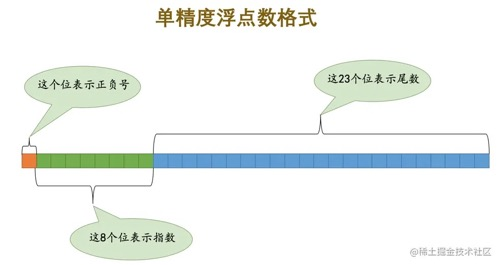

#### 设置最大位数和小数位数
在定义浮点数类型时，还可以在FLOAT或者DOUBLE后边跟上两个参数，就像这样：
```sql
FLOAT(M, D)
DOUBLE(M, D)
```
对于我们用户而言，使用的都是十进制小数。如果我们事先知道表中的某个列要存储的小数在一定范围内，我们可以使用FLOAT(M, D)或者DOUBLE(M, D)来限制可以存储到本列中的小数范围。其中：
- M表示该小数最多需要的十进制有效数字个数。
- D表示该小数的小数点后的十进制数字个数。
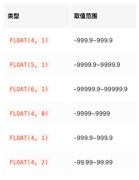

可以看到，在D相同的情况下，M越大，该类型的取值范围越大；在M相同的情况下，D越大，该类型的取值范围越小。当然，M和D的取值也不是无限大的，M的取值范围是1~255，D的取值范围是0~30，而且D的值必须不大于M。M和D都是可选的，如果我们省略了它们，那它们的值按照机器支持的最大值来存储。

### 定点数类型
正因为用浮点数表示小数可能会有不精确的情况，在一些情况下我们必须保证小数是精确的，所以设计MySQL的大叔们提出一种称之为定点数的数据类型，它也是存储小数的一种方式：

| 类型 | 占用的存储空间（单位：字节） | 取值范围 |
| --- | --- | --- |
| ==DECIMAL(M, D)== | 取决于M和D | 取决于M和D |

定点数是一种精确的小数，为了达到精确的目的我们就不能把它转换成二进制小数之后再存储(因为有很多十进制小数转为二进制小数后需要进行舍入操作，导致二进制小数表示的数值是不精确的)。我们只要把小数点左右的两个十进制整数给存储起来，那不就是精确的了么。比方说对于十进制小数2.38来说，我们可以把这个小数的小数点左右的两个整数，也就是2和38分别保存起来。

对于给定M、D值的DECIMAL(M, D)类型，比如DEMCIMAL(16, 4)来说：
- 首先确定小数点左边的整数最多需要存储的十进制位数是12位，小数点右边的整数需要存储的十进制位数是4位，如图所示：
- 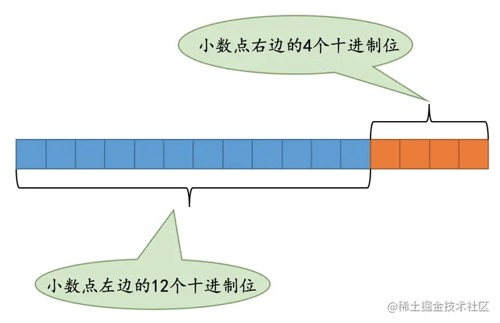
- 从小数点位置出发，每个整数每隔9个十进制位划分为1组，效果就是这样：
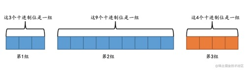
- 针对每个组中的十进制数字，将其转换为二进制数字进行存储，根据组中包含的十进制数字位数不同，所需的存储空间大小也不同，具体见下表：


存储一个负数,需要每一个比特位都执行一个取反操作

> 与浮点数相比，定点数需要更多的空间来存储数据，所以如果不是在某些需要存储精确小数的场景下，一般的小数用浮点数表示就足够了。    

**另外M的范围是1-65，D的范围是0-30，且D的值不能超过M**。

### 无符号数值类型的表示
MySQL给我们提供了一个表示无符号数值类型的方式，就是在原数值类型后加一个单词UNSIGNED：
```sql
数值类型 UNSIGNED
```
大家可以把它当成一种新类型对待，比如==INT UNSIGNED==就表示无符号整数，==FLOAT UNSIGNED==表示无符号浮点数，==DECIMAL UNSIGNED==表示无符号定点数。

> 小贴士： 在使用的存储空间大小相同的情况下，无符号整数可以表示的正整数范围比有符号整数能表示的正整数范围大一倍。不过受浮点数和定点数具体的存储格式影响，无符号浮点数和定点数并不能提升正数的表示范围。

### 日期和时间类型
MySQL为我们提供了多种关于时间和日期的类型，各种类型能表示的范围如下：


在MySQL5.6.4这个版本之后，TIME、DATETIME、TIMESTAMP这几种类型添加了对毫秒、微秒的支持。由于毫秒、微秒都不到1秒，所以也被称为小数秒，MySQL最多支持6位小数秒的精度，各个位代表的意思如下：

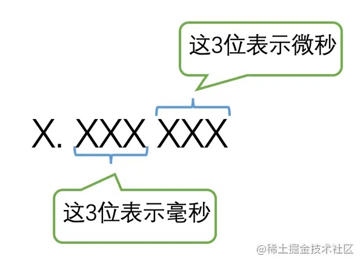

比如DATETIME(0)表示精确到秒，DATETIME(3)表示精确到毫秒，DATETIME(5)表示精确到10微秒。如果你在选择TIME、DATETIME、TIMESTAMP这几种类型的时候添加了对小数秒的支持，那么所需的存储空间需要相应的扩大，保留不同的小数秒位数，那么增加的存储空间大小也不同，如下表：

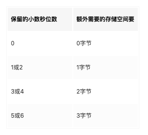

MySQL5.6.4这个版本之后的各个类型需要的存储空间和取值范围就如下：


> DATETIME类型占用的存储空间从原来的8字节变成了5字节

#### YEAR
YEAR类型也可以写成YEAR(4)，它单纯表示一个年份值，取值范围为1901 ～ 2155，仅仅占用1个字节大小而已。因为可以存储的年份值有限，如果我们想存储更大范围的年份值，可以不使用MySQL自带的YEAR类型，换成SMALLINT（2字节）或者字符串类型啥的都可以。

#### DATE、TIME和DATETIME
顾名思义，DATE表示日期，格式是YYYY-MM-DD；TIME表示时间，格式是hh:mm:ss[.uuuuuu]或者hhh:mm:ss[.uuuuuu]（有时候要存储的小时值是三位数），DATETIME表示日期+时间，格式是YYYY-MM-DD hh:mm:ss[.uuuuuu]。其中的YYYY、MM、DD、hh、mm、ss、uuuuuu分别表示年、月、日、时、分、秒、小数秒。
> 需要注意的是，DATETIME中的时间部分表示的是一天内的时间(00:00:00 ~ 23:59:59)，而 TIME表示的是一段时间，而且可以表示负值。

#### TIMESTAMP
1970-01-01 00:00:00注定是一个特殊的时刻，我们把某个时刻距离1970-01-01 00:00:00的秒数称为时间戳。比方说当前时间是2018-01-24 11:39:21，距离1970-01-01 00:00:00的秒数为1516765161，那么2018-01-24 11:39:21这个时刻的时间戳就是1516765161。不过在MySQL5.6.4之后，时间戳的值也可以加入小数秒。

**用时间戳存储时间的好处就是，它展示的值可以随着时区的变化而变化**。比方说我们把2018-01-24 11:39:21这个时刻存储到一个TIMESTAMP的列中，那么在中国你看到的时间就是2018-01-24 11:39:21，如果你去了日本，他们哪里的使用的是东京时间，比北京时间早一个小时，所以他们那显示的就是2018-01-24 12:39:21。而如果你用DATETIME存储2018-01-24 11:39:21的话，那不同时区看到的时间值都是一样的。

### 字符串类型
字符可以大致分为两种，一种叫==可见字符==，一种叫==不可见字符==。
#### 字符编码简介
字符是面向人的概念，字节是面向计算机的概念。如果你想在计算机中表示字符，那就需要将该字符与一个特定的字节序列对应起来，这个映射过程称之为编码。
根据表示一个字符使用的字节数量是不是固定的，编码方案可以分为下边两种：
- 固定长度的编码方案
    表示不同的字符所需要的字节数量是相同的。比方说ASCII编码方案采用1个字节来编码一个字符，ucs2采用2个字节来编码一个字符。
- 变长的编码方案
    表示不同的字符所需要的字节数量是不同的。比方说utf8编码方案采用1~3个字节来编码一个字符，gb2312采用1~2个字节来编码一个字符。

> 小贴士： 正宗的utf8字符集是使用1~4个字节来编码一个字符的，不过MySQL中对utf8字符集做了阉割，编码一个字符最多使用3个字节。如果我们之后有存储使用4个字节来编码的字符的情景，可以使用一种称之为utf8mb4的字符集，它才是正宗的utf8字符集。

### MySQL的字符串类型
其中==M==代表该数据类型最多能存储的字符数量，==L==代表我们实际向该类型的属性中存储的字符串在特定字符集下所占的字节数，==W==代表在该特定字符集下，编码一个字符最多需要的字节数


#### CHAR(M)
CHAR(M)中的M代表该类型最多可以存储的字符数量，注意，是字符数量，不是字节数量。
如果省略掉M的值，那它的默认值就是1，也就是说CHAR和CHAR(1)是一个意思。CHAR(0)是一种特别的类型，它只能存储空字符串''或者NULL值。
**CHAR(M)在不同的字符集下需要的存储空间也是不一样的。**

#### VARCHAR(M)
VARCHAR(M)中的M也是代表该类型最多可以存储的字符数量，理论上的取值范围是1~65535。但是MySQL中还有一个规定，表中某一行包含的所有列中存储的数据大小总共不得超过65535个字节（注意是字节），也就是说VARCHAR(M)类型实际能够容纳的字符数量是小于65535的。

一个VARCHAR(M)类型表示的数据其实是由这么两部分组成：
1. 真正的字符串内容。
    假设真正的字符串在特定字符集编码后占用的字节数为L。
2. 占用字节数。
    假设VARCHAR(M)类型采用的字符集编码一个字符最多需要W个字节，那么：
    - 当M×W < 256时，只需要一个字节来表示占用的字节数。

    - 当M×W >= 256且M×W < 65536时，需要两个字节来表示占用的字节数。

VARCHAR(5) M × W= 5×3 = 15，而15 < 256

VARCHAR(100) M × W= 100×3 = 300，而300 > 256


#### 各种TEXT类型
它们也都是变长类型，也就是说这些类型占用的存储空间由实际内容和内容占用的字节长度两部分构成。
- 因为TINYTEXT最多可以存储2⁸-1个字节，所以内容占用的字节长度用1个字节就可以表示

- TEXT最多可以存储2¹⁶-1个字节，所以内容占用的字节长度用2个字节就可以表示。

- MEDIUMTEXT最多可以存储2²⁴-1个字节，所以内容占用的字节长度用3个字节就可以表示。

- LONGTEXT最多可以存储2³²-1个字节，所以内容占用的字节长度用4个字节就可以表示。

### ENUM类型和SET类型
```sql
ENUM('str1', 'str2', 'str3' ⋯)

SET('str1', 'str2', 'str3' ⋯)
```
它表示在给定的字符串列表里选择一个。比如我们的性别一列可以定义成ENUM('男', '女')类型。这个的意思就是性别一列只能在'男'或者'女'这两个字符串之间选择一个，相当于一个单选框～

它表示可以在给定的字符串列表里选择多个。我们的兴趣一列就可以定义成SET('打球', '画画', '扯犊子', '玩游戏')类型。这个的意思就是兴趣一列可以在给定的这几个字符串中选择一个或多个，相当于一个多选框～

### 二进制类型
#### BIT类型

MySQL是以字节为单位存储数据的，一个字节拥有8个比特位。BIT(9)类型仅仅需要存储9个比特位的数据，但是MySQL会为其申请(9+7)/8 = 2个字节。

#### BINARY(M)与VARBINARY(M)
BINARY(M)和VARBINARY(M)对应于我们前边提到的CHAR(M)和VARCHAR(M)，都是前者是固定长度的类型，后者是可变长度的类型，只不过**BINARY(M)和VARBINARY(M)是用来存放字节的**，其中的M代表该类型最多能存放的字节数量，而CHAR(M)和VARCHAR(M)是用来存储字符的，其中的M代表该类型最多能存放的字符数量。

## 数据库的基本操作
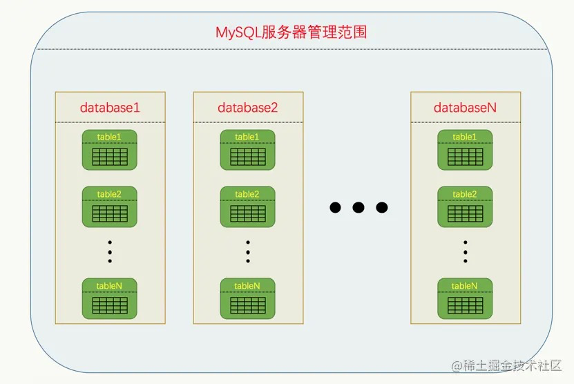
### 创建数据库
```sql
CREATE DATABASE 数据库名;
```
### 查有哪些数据库
```sql
SHOW DATABASES;
```

### IF NOT EXISTS
一个数据库已经存在的情况下再使用CREATE DATABASE去创建这个数据库会产生错误,如果我们并不清楚数据库是否存在，可以使用下边的语句来创建数据库：
```sql
CREATE DATABASE IF NOT EXISTS 数据库名;
```

### 切换当前数据库
对于每一个连接到MySQL服务器的客户端，都有一个当前数据库的概念（也可以称之为默认数据库），我们创建的表默认都会被放到当前数据库中。
```sql
USE 数据库名称;
```

### 删除数据库
```sql
DROP DATABASE 数据库名;
```

### IF EXISTS
如果某个数据库并不存在，我们仍旧调用DROP DATABASE语句去删除它，会报错,如果想避免这种报错，可以使用这种形式的语句来删除数据库：
```sql
DROP DATABASE IF EXISTS 数据库名;
```

## 表的基本操作
### 展示当前数据库中的表
```sql
SHOW TABLES;
```
### 创建表
#### 基本语法
1. 给表起个名。
2. 给表定义一些列，并且给这些列都起个名。
3. 每一个列都需要定义一种数据类型。
4. 如果有需要的话，可以给这些列定义一些列的属性，比如不许存储NULL，设置默认值等等，具体列可以设置哪些属性我们稍后详细唠叨。
MySQL中创建表的基本语法就是这样的：
```sql
CREATE TABLE 表名 (
    列名1    数据类型    [列的属性],
    列名2    数据类型    [列的属性],
    ...
    列名n    数据类型    [列的属性]
);
```
- 列名、数据类型、列的属性之间用空白字符分开就好，然后各个列的信息之间用逗号,分隔开。

#### 为建表语句添加注释
我们可以在创建表时将该表的用处以注释的形式添加到语句中，只要在建表语句最后加上COMMENT语句就好，如下：
```sql
CREATE TABLE 表名 (
    各个列的信息 ...
) COMMENT '表的注释信息';
```
#### IF NOT EXISTS
逻辑与创建数据库一致
```sql
CREATE TABLE IF NOT EXISTS 表名(
    各个列的信息 ...
);
```

### 删除表
```sql
DROP TABLE 表1, 表2, ..., 表n;
```
#### IF EXISTS
```sql
DROP TABLE IF EXISTS 表名;
```

#### 查看表结构
```sql
DESCRIBE 表名;
DESC 表名;
EXPLAIN 表名;
SHOW COLUMNS FROM 表名;
SHOW FIELDS FROM 表名;
// 会显示出建表语句
SHOW CREATE TABLE 表名;
```

#### 没有选择当前数据库时对表的操作
```sql
SHOW TABLES FROM xiaohaizi;

数据库名.表名

SHOW CREATE TABLE xiaohaizi.first_table\G
```

### 修改表
在表创建好之后如果对表的结构不满意，比如想增加或者删除一列，想修改某一列的数据类型或者属性，想对表名或者列名进行重命名，这些操作统统都算是修改表结构。MySQL给我们提供了一系列修改表结构的语句。

#### 修改表名
```sql
ALTER TABLE 旧表名 RENAME TO 新表名;

RENAME TABLE 旧表名1 TO 新表名1, 旧表名2 TO 新表名2, ... 旧表名n TO 新表名n;
```
如果在修改表名的时候指定了数据库名，还可以将该表转移到对应的数据库。
```sql
mysql> ALTER TABLE first_table RENAME TO first_table1
    -> ;
Query OK, 0 rows affected (0.01 sec)

mysql> show tables;
+---------------------+
| Tables_in_xiaohaizi |
+---------------------+
| first_table1        |
| student_info        |
| student_score       |
+---------------------+
3 rows in set (0.00 sec)

mysql> CREATE DATABASE dahaizi;
Query OK, 1 row affected (0.00 sec)

mysql> ALTER TABLE first_table1 RENAME TO dahaizi.first_table1;
Query OK, 0 rows affected (0.01 sec)

mysql> SHOW TABLES;
+---------------------+
| Tables_in_xiaohaizi |
+---------------------+
| student_info        |
| student_score       |
+---------------------+
2 rows in set (0.00 sec)

mysql> SHOW TABLES FROM dahaizi;
+-------------------+
| Tables_in_dahaizi |
+-------------------+
| first_table1      |
+-------------------+
1 row in set (0.00 sec)

mysql> RENAME TABLE dahaizi.first_table1 TO xiaohaizi.first_table;
Query OK, 0 rows affected (0.01 sec)
```
#### 增加列
```sql
ALTER TABLE 表名 ADD COLUMN 列名 数据类型 [列的属性];
```
#### 增加列到特定位置
```sql
// 添加到第一列：
ALTER TABLE 表名 ADD COLUMN 列名 列的类型 [列的属性] FIRST;

// 添加到指定列的后边
ALTER TABLE 表名 ADD COLUMN 列名 列的类型 [列的属性] AFTER 指定列名;
```
#### 删除列
```sql
ALTER TABLE 表名 DROP COLUMN 列名;
```

#### 修改列信息
```sql
// 方式一：
ALTER TABLE 表名 MODIFY 列名 新数据类型 [新属性];

// 方式二：
ALTER TABLE 表名 CHANGE 旧列名 新列名 新数据类型 [新属性];
// 可以看到这种修改方式需要我们填两个列名，也就是说在修改数据类型和属性的同时也可以修改列名
```

#### 修改列排列位置
```sql
// 将列设为表的第一列：
ALTER TABLE 表名 MODIFY 列名 列的类型 列的属性 FIRST;

// 将列放到指定列的后边：
ALTER TABLE 表名 MODIFY 列名 列的类型 列的属性 AFTER 指定列名;
```
#### 一条语句中包含多个修改操作
```sql
ALTER TABLE 表名 操作1, 操作2, ..., 操作n;

ALTER TABLE first_table DROP COLUMN third_column, DROP COLUMN fourth_column, DROP COLUMN fifth_column;
```

## 列的属性
### 默认值
```sql
列名 列的类型 DEFAULT 默认值

CREATE TABLE first_table (
    first_column INT,
    second_column VARCHAR(100) DEFAULT 'abc'
);
```

### NOT NULL属性
有时候我们需要要求表中的某些列中必须有值，不能存放NULL，那么可以用这样的语法来定义这个列：
```sql
列名 列的类型 NOT NULL
```

### 主键
有时候在我们的表里可以通过**某个列或者某些列**确定唯一的一条记录，我们就可以把这个列或者这些列称为候选键。

一个表可能有多个候选键，我们可以选择一个候选键作为表的**主键**。一个表最多只能有一个主键，主键的值不能重复，通过主键可以找到唯一的一条记录。如果我们的表中有定义主键的需求可以选用下边这两种方式之一来指定主键：
1. 如果主键只是单个列的话，可以直接在该列后声明PRIMARY KEY，比如我们把学生信息表student_info的学号列声明为主键可以这么写：
```sql
CREATE TABLE student_info (
    number INT PRIMARY KEY,
    name VARCHAR(5),
    sex ENUM('男', '女'),
    id_number CHAR(18),
    department VARCHAR(30),
    major VARCHAR(30),
    enrollment_time DATE
);
```
2. 我们也可以把主键的声明单独提取出来，用这样的形式声明：
```sql
PRIMARY KEY (列名1, 列名2, ...)

CREATE TABLE student_info (
    number INT,
    name VARCHAR(5),
    sex ENUM('男', '女'),
    id_number CHAR(18),
    department VARCHAR(30),
    major VARCHAR(30),
    enrollment_time DATE,
    PRIMARY KEY (number)
);
// 值得注意的是，对于多个列的组合作为主键的情况，必须使用这种单独声明的形式
CREATE TABLE student_score (
    number INT,
    subject VARCHAR(30),
    score TINYINT,
    PRIMARY KEY (number, subject)
);
```
> 主键列默认是有NOT NULL属性，也就是必填的，如果填入NULL值会报错。

### UNIQUE属性
对于不是主键的其他候选键，如果也想让MySQL在我们向表中插入新记录的时候帮助我们校验一下某个列或者列组合的值是否重复，那么我们可以把这个列或列组合添加一个UNIQUE属性，表明该列或者列组合的值是不允许重复的。与我们在建表语句中声明主键的方式类似，为某个列声明UNIQUE属性的方式也有两种：
1. 如果我们想为单个列声明UNIQUE属性，可以直接在该列后填写UNIQUE或者UNIQUE KEY
```sql
CREATE TABLE student_info (
    number INT PRIMARY KEY,
    name VARCHAR(5),
    sex ENUM('男', '女'),
    id_number CHAR(18) UNIQUE,
    department VARCHAR(30),
    major VARCHAR(30),
    enrollment_time DATE
);

```
2. 我们也可以把UNIQUE属性的声明单独提取出来，用这样的形式声明：
```sql
UNIQUE [约束名称] (列名1, 列名2, ...)

UNIQUE KEY [约束名称] (列名1, 列名2, ...)

// 不过值得注意的是，对于多个列的组合具有UNIQUE属性的情况，必须使用这种单独声明的形式。

CREATE TABLE student_info (
    number INT PRIMARY KEY,
    name VARCHAR(5),
    sex ENUM('男', '女'),
    id_number CHAR(18),
    department VARCHAR(30),
    major VARCHAR(30),
    enrollment_time DATE,
    UNIQUE KEY uk_id_number (id_number)
);
```
> 为某个列添加一个UNIQUE属性也可以认为是为这个表添加了一个约束，我们就称之为UNIQUE约束。每个约束都可以有一个名字，像主键也算是一个约束，它的名字就是默认的PRIMARY。不过约束名称是被中括号[]扩起来的，意味着我们写不写都可以。

### 主键和UNIQUE约束的区别
1. 一张表中只能定义一个主键，却可以定义多个UNIQUE约束！
2. 规定：主键列不允许存放NULL，而声明了UNIQUE属性的列可以存放NULL，而且NULL可以重复地出现在多条记录中！
> 小贴士： 一个表的某个列声明了UNIQUE属性，那这个列的值不就不可以重复了么, NULL其实并不是一个值，它代表不确定，我们平常说某个列的值为NULL，意味着这一列的值尚未被填入。

### 外键
插入到学生成绩表student_score中的number(学号)列中的值必须能在学生基本信息表student_info中的number列中找到，否则如果一个学号只在成绩表里出现，而在基本信息表里找不到相应的记录的话，就相当于插入了不知道是哪个学生的成绩，这显然是荒谬的。为了防止这样荒谬的情况出现，MySQL给我们提供了外键约束机制。定义外键的语法是这样的：
```sql
CONSTRAINT [外键名称] FOREIGN KEY(列1, 列2, ...) REFERENCES 父表名(父列1, 父列2, ...);

CREATE TABLE student_score (
    number INT,
    subject VARCHAR(30),
    score TINYINT,
    PRIMARY KEY (number, subject),
    CONSTRAINT FOREIGN KEY(number) REFERENCES student_info(number)
);
```
- 如果A表中的某个列或者某些列依赖与B表中的某个列或者某些列，那么就称A表为子表，B表为父表。
- 这样，在对student_score表插入数据的时候，MySQL都会为我们检查一下插入的学号是否能在student_info表中找到，如果找不到则会报错。
> 小贴士：父表中被子表依赖的列或者列组合必须建立索引，如果该列或者列组合已经是主键或者有UNIQUE属性，那么它们也就被默认建立了索引。

### AUTO_INCREMENT属性
AUTO_INCREMENT翻译成中文可以理解为自动增长，简称自增。如果一个表中的某个列的数据类型是整数类型或者浮点数类型，那么这个列可以设置AUTO_INCREMENT属性。当我们把某个列设置了AUTO_INCREMENT属性之后，如果我们在插入新记录的时候不指定该列的值，或者将该列的值显式地指定为NULL或者0，那么新插入的记录在该列上的值就是当前该列的最大值加1后的值。
```sql
列名 列的类型 AUTO_INCREMENT

DROP TABLE first_table;

mysql> CREATE TABLE first_table (
    ->     id INT UNSIGNED AUTO_INCREMENT PRIMARY KEY,
    ->     first_column INT,
    ->     second_column VARCHAR(100) DEFAULT 'abc'
    -> );
```
1. 一个表中最多有一个具有AUTO_INCREMENT属性的列。
2. 具有AUTO_INCREMENT属性的列必须建立索引。主键和具有UNIQUE属性的列会自动建立索引。
3. 拥有AUTO_INCREMENT属性的列就不能再通过指定DEFAULT属性来指定默认值。
4. 一般拥有AUTO_INCREMENT属性的列都是作为主键的属性，来自动生成唯一标识一条记录的主键值。

### 列的注释
```sql
CREATE TABLE first_table (
    id int UNSIGNED AUTO_INCREMENT PRIMARY KEY COMMENT '自增主键',
    first_column INT COMMENT '第一列',
    second_column VARCHAR(100) DEFAULT 'abc' COMMENT '第二列'
) COMMENT '第一个表';
```
### 影响展示外观的ZEROFILL属性
对于无符号整数类型的列，我们可以在查询数据的时候让数字左边补0，如果想实现这个效果需要给该列加一个ZEROFILL属性（也可以理解为这是一个属于数据类型的属性），就像这样：
```sql
mysql> CREATE TABLE zerofill_table (
    ->     i1 INT UNSIGNED ZEROFILL,
    ->     i2 INT UNSIGNED
    -> );
Query OK, 0 rows affected (0.03 sec)

/// INT(5) 括号里面代表显示宽度
mysql> CREATE TABLE zerofill_table (
    ->     i1 INT(5) UNSIGNED ZEROFILL,
    ->     i2 INT UNSIGNED
    -> );
Query OK, 0 rows affected (0.02 sec)

mysql> INSERT INTO zerofill_table(i1, i2) VALUES(1, 1);
Query OK, 1 row affected (0.01 sec)

mysql> SELECT * FROM zerofill_table;
+-------+------+
| i1    | i2   |
+-------+------+
| 00001 |    1 |
+-------+------+
1 row in set (0.00 sec)
```
- 该列必须是整数类型的
- 该列必须有UNSIGNED ZEROFILL的属性
- 该列的实际值的位数必须小于显示宽度
- 每个整数类型都会有默认的显示宽度。
- 显示宽度并不会影响实际类型的实际存储空间。
- **只有列的实际值的位数小于显示宽度时才会补0，实际值的位数大于显示宽度时照原样输出**。

> MySQL现在只支持对无符号整数进行自动补0的操作

### 一个列同时具有多个属性
每个列可以同时具有多个属性，属性声明的顺序无所谓。
### 标识符的命名
不欢迎下边的这几种命名：
1. 名称中全都是数字。
2. 名称中有空白字符
3. 名称使用了MySQL中的保留字
虽然某些名称可能会导致歧义，但是如果你坚持要使用的话，也不是不行，你可以使用反引号``来将你定义的名称扩起来。
```sql
// 使用反引号会让语意更清楚
CREATE TABLE `first_table` (
    `id` int UNSIGNED AUTO_INCREMENT PRIMARY KEY,
    `first_column` INT,
    `second_column` VARCHAR(100) DEFAULT 'abc'
);
```

## 简单查询
### 简单的查询和插入的语句
```sql
SELECT * FROM 表名;

INSERT INTO 表名(列1, 列2, ...) VALUES(列1的值，列2的值, ...);

INSERT INTO 表名(列1,列2, ...) VAULES(列1的值，列2的值, ...), (列1的值，列2的值, ...), (列1的值，列2的值, ...), ...;
```

### 查询单个列
```sql
SELECT 列名 FROM 表名;
```
### 查询多个列
```sql
SELECT 列名1, 列名2, ... 列名n FROM 表名;
```
### 列的别名
```sql
SELECT 列名 [AS] 列的别名 FROM 表名;

SELECT number AS 学号, name AS 姓名, id_number AS 身份证号, major AS 专业 FROM student_info;
```
> 别名只是在本次查询的到的结果集中展示，而不会改变真实表中的列名。

### 查询结果去重
```sql
// 去除单列的重复结果
SELECT DISTINCT 列名 FROM 表名;

SELECT DISTINCT department FROM student_info;

// 去除多列的重复结果
// 对于查询多列的情况，两条结果重复的意思是：两条结果的每一个列中的值都相同。
SELECT DISTINCT 列名1, 列名2, ... 列名n  FROM 表名;


```

### 限制查询结果条数
有时候查询结果的条数会很多，都显示出来可能会撑爆屏幕～ 所以MySQL给我们提供了一种限制结果集中的记录条数的方式，就是在查询语句的末尾使用这样的语法：
```sql
LIMIT 开始行, 限制条数;
// 开始行指的是我们想从第几行数据开始查询，限制条数是结果集中最多包含多少条记录。
// 如果指定的开始行大于结果中的行数，那查询结果就什么都没有：

// LIMIT后边也可以只有一个参数，那这个参数就代表着限制行数。默认的开始行就是第0行。
SELECT number, name, id_number, major FROM student_info LIMIT 3;
```

### 对查询结果排序
#### 按照单个列的值进行排序
```sql
ORDER BY 列名 ASC|DESC
```

#### 按照多个列的值进行排序
```sql
ORDER BY 列1 ASC|DESC, 列2 ASC|DESC ...
```
>  ORDER BY 语句必须放在 LIMIT 语句前边

#### if在查询中
```sql
MySQL IF 根据表达式的某个条件或值结果来执行一组 SQL 语句。

语法结构如下：

IF(expr,v1,v2)

其中：表达式 expr 得到不同的结果，当 expr 为真是返回 v1 的值，否则返回 v2.

```
## 带搜索条件的查询
### 简单搜索条件
```sql
SELECT number, name, id_number, major FROM student_info WHERE name = '范剑';

```
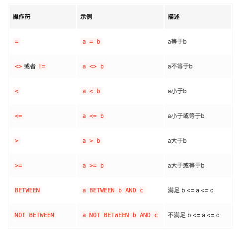

### 匹配列表中的元素
有时候搜索条件中指定的匹配值并不是单个值，而是一个列表，只要匹配到列表中的某一项就算匹配成功，这种情况可以使用IN操作符：
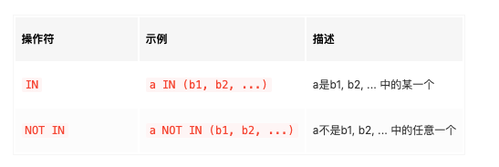
```sql
SELECT number, name, id_number, major FROM student_info WHERE major IN ('软件工程', '飞行器设计');

+----------+-----------+--------------------+-----------------+
| number   | name      | id_number          | major           |
+----------+-----------+--------------------+-----------------+
| 20180103 | 范统      | 17156319980116959X | 软件工程        |
| 20180104 | 史珍香    | 141992199701078600 | 软件工程        |
| 20180105 | 范剑      | 181048199308156368 | 飞行器设计      |
+----------+-----------+--------------------+-----------------+
```

### 匹配NULL值
需要专业判断值是否是NULL的操作符：


### 多个搜索条件的查询
#### AND操作符
在给定多个搜索条件的时候，我们有时需要某条记录只在符合所有搜索条件的时候才将其加入结果集，这种情况我们可以使用AND操作符来连接多个搜索条件。

#### OR操作符
在给定多个搜索条件的时候，我们有时需要某条记录在符合某一个搜索条件的时候就将其加入结果集中，这种情况我们可以使用OR操作符来连接多个搜索条件。

#### 更复杂的搜索条件的组合
AND操作符的优先级高于OR操作符，也就是说在判断某条记录是否符合条件时会先检测AND操作符两边的搜索条件。
**在一个查询中有多个搜索条件时最好使用小括号()来显式的指定各个搜索条件的检测顺序**。

### 通配符
MySQL中使用下边这两个操作符来支持模糊查询：

既然我们不能完整描述要查询的信息，那就用某个符号来替代这些模糊的信息，这个符号就被称为通配符。MySQL中支持下边这两个通配符：
1. %：代表任意一个字符串。
```sql
SELECT number, name, id_number, major FROM student_info WHERE name LIKE '杜%';

SELECT number, name, id_number, major FROM student_info WHERE name LIKE '%香%';
```
2. _：代表任意一个字符。
```sql
SELECT number, name, id_number, major FROM student_info WHERE name LIKE '范_';
```
> 小贴士： LIKE或者NOT LIKE操作符只用于字符串匹配。另外，通配符不能代表NULL，如果需要匹配NULL的话，需要使用IS NULL或者IS NOT NULL。

### 转义通配符
如果匹配字符串中需要普通字符'%'或者'_'的话，需要在它们前边加一个反斜杠\来和通配符区分开来，也就是说：
- '\%'代表普通字符'%'
- '\_'代表普通字符'_' 比方说这样：
```sql
mysql> SELECT number, name, id_number, major FROM student_info WHERE name LIKE '范\_';
Empty set (0.00 sec)
```

## 表达式和函数
### 操作符
1. 算术操作符
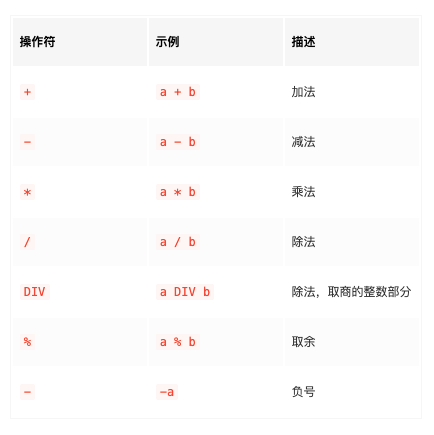
2. 比较操作符
就是在搜索条件中有比较操作符的描述。
3. 逻辑操作符
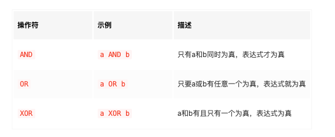

### 表达式的使用
只要把这些操作数和操作符相互组合起来就可以组成一个表达式。表达式主要以下边这两种方式使用：
1. 放在查询列表中
```sql
mysql> SELECT  number, subject, score + 100 FROM student_score;
+----------+-----------------------------+-------------+
| number   | subject                     | score + 100 |
+----------+-----------------------------+-------------+
| 20180101 | 母猪的产后护理              |         178 |
| 20180101 | 论萨达姆的战争准备          |         188 |
| 20180102 | 母猪的产后护理              |         200 |
| 20180102 | 论萨达姆的战争准备          |         198 |
| 20180103 | 母猪的产后护理              |         159 |
| 20180103 | 论萨达姆的战争准备          |         161 |
| 20180104 | 母猪的产后护理              |         155 |
| 20180104 | 论萨达姆的战争准备          |         146 |
+----------+-----------------------------+-------------+
8 rows in set (0.00 sec)

mysql> SELECT  number, subject, score + 100 AS score FROM student_score;
+----------+-----------------------------+-------+
| number   | subject                     | score |
+----------+-----------------------------+-------+
| 20180101 | 母猪的产后护理              |   178 |
| 20180101 | 论萨达姆的战争准备          |   188 |
| 20180102 | 母猪的产后护理              |   200 |
| 20180102 | 论萨达姆的战争准备          |   198 |
| 20180103 | 母猪的产后护理              |   159 |
| 20180103 | 论萨达姆的战争准备          |   161 |
| 20180104 | 母猪的产后护理              |   155 |
| 20180104 | 论萨达姆的战争准备          |   146 |
+----------+-----------------------------+-------+
8 rows in set (0.00 sec)

mysql> SELECT 1 FROM student_info;
+---+
| 1 |
+---+
| 1 |
| 1 |
| 1 |
| 1 |
| 1 |
| 1 |
+---+
// 因为student_info中有6条记录，所以结果集中也就展示了6条结果，不过我们的查询列表处只有一个常数1，所以所有的结果的值也都是常数1。

情况下，我们甚至可以省略掉FROM子句后边的表名，就像这样：

mysql> SELECT 1;
+---+
| 1 |
+---+
| 1 |
+---+
1 row in set (0.00 sec)
```
2. 作为搜索条件
```sql
mysql> SELECT number, name, id_number, major FROM student_info WHERE 2 > 1;
+----------+-----------+--------------------+--------------------------+
| number   | name      | id_number          | major                    |
+----------+-----------+--------------------+--------------------------+
| 20180101 | 杜子腾    | 158177199901044792 | 计算机科学与工程         |
| 20180102 | 杜琦燕    | 151008199801178529 | 计算机科学与工程         |
| 20180103 | 范统      | 17156319980116959X | 软件工程                 |
| 20180104 | 史珍香    | 141992199701078600 | 软件工程                 |
| 20180105 | 范剑      | 181048199308156368 | 飞行器设计               |
| 20180106 | 朱逸群    | 197995199501078445 | 电子信息                 |
+----------+-----------+--------------------+--------------------------+
6 rows in set (0.00 sec)

```

### 函数
我们在使用MySQL过程中经常会有一些需求，比方说将给定文本中的小写字母转换成大写字母，把某个日期数据中的月份值提取出来等等。
- UPPER函数是用来把给定的文本中的小写字母转换成大写字母。
- MONTH函数是用来把某个日期数据中的月份值提取出来。
- NOW函数用来获取当前的日期和时间。
如果我们想使用这些函数，可以在函数名后加一个小括号()就好，表示调用一下这个函数，简称函数调用。

#### 文本处理函数
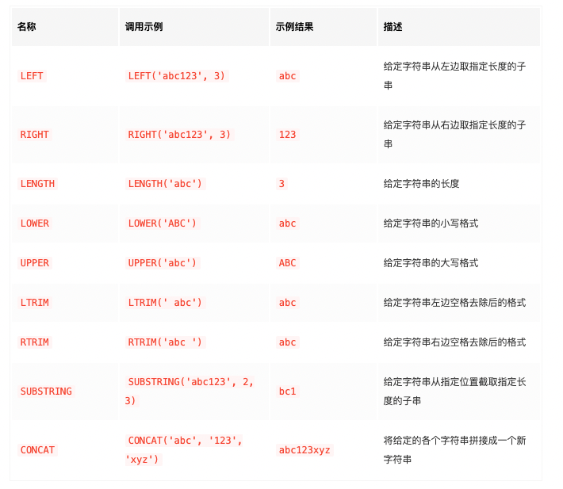
```sql
mysql> SELECT SUBSTRING('abc123', 2, 3);
+---------------------------+
| SUBSTRING('abc123', 2, 3) |
+---------------------------+
| bc1                       |
+---------------------------+
1 row in set (0.00 sec)
```
我们前边在唠叨表达式的说过，函数调用也算是一种表达式的操作数，它可以和其他操作数用操作符连接起来组成一个表达式来作为查询列表的一部分或者放到搜索条件中。
```sql
mysql> SELECT CONCAT('学号为', number, '的学生在《', subject, '》课程的成绩是：', score) AS 成绩描述 FROM student_score;
+---------------------------------------------------------------------------------------+
| 成绩描述                                                                              |
+---------------------------------------------------------------------------------------+
| 学号为20180101的学生在《母猪的产后护理》课程的成绩是：78                              |
| 学号为20180101的学生在《论萨达姆的战争准备》课程的成绩是：88                          |
| 学号为20180102的学生在《母猪的产后护理》课程的成绩是：100                             |
| 学号为20180102的学生在《论萨达姆的战争准备》课程的成绩是：98                          |
| 学号为20180103的学生在《母猪的产后护理》课程的成绩是：59                              |
| 学号为20180103的学生在《论萨达姆的战争准备》课程的成绩是：61                          |
| 学号为20180104的学生在《母猪的产后护理》课程的成绩是：55                              |
| 学号为20180104的学生在《论萨达姆的战争准备》课程的成绩是：46                          |
+---------------------------------------------------------------------------------------+
8 rows in set (0.00 sec)
```
##### concat函数的衍生：group_concat函数
group_concat用法：
```sql
group_concat([去重：distinct] '字符串' [排序：order by 该字符串 asc/desc] 分隔符：separator ',')
```
理解：group_concat()函数，顾名思义与group by 有关，功能：将group by产生的同一个分组中的值连接起来，返回一个字符串结果。
#### 日期和时间处理函数
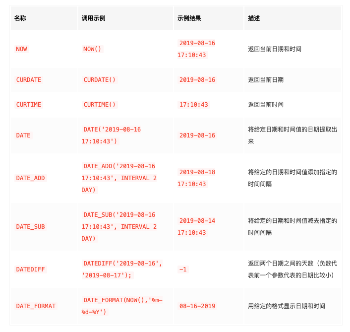

- 在使用DATE_ADD和DATE_SUB这两个函数时需要注意，增加或减去的时间间隔单位可以自己定义，下边是MySQL支持的一些时间单位：

```sql
mysql> SELECT DATE_ADD('2019-08-16 17:10:43', INTERVAL 2 MINUTE);
+----------------------------------------------------+
| DATE_ADD('2019-08-16 17:10:43', INTERVAL 2 MINUTE) |
+----------------------------------------------------+
| 2019-08-16 17:12:43                                |
+----------------------------------------------------+
1 row in set (0.00 sec)

```
- 在使用DATE_FORMAT函数时需要注意，我们可以通过一些所谓的格式符来自定义日期和时间的显示格式，下边是MySQL中常用的一些日期和时间的格式符以及它们对应的含义：


```sql
mysql> SELECT DATE_FORMAT(NOW(),'%b %d %Y %h:%i %p');
+----------------------------------------+
| DATE_FORMAT(NOW(),'%b %d %Y %h:%i %p') |
+----------------------------------------+
| Aug 16 2019 05:10 PM                   |
+----------------------------------------+
1 row in set (0.00 sec)

```

#### 数值处理函数
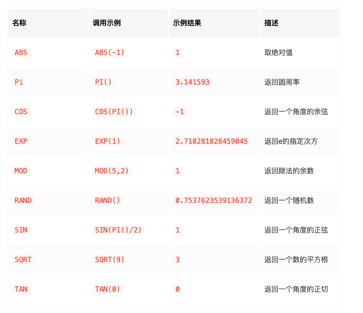

#### 聚集函数
有些函数是用来统计数据的，比方说统计一下表中的行数，某一列数据的最大值是什么，我们把这种函数称之为**聚集函数**。
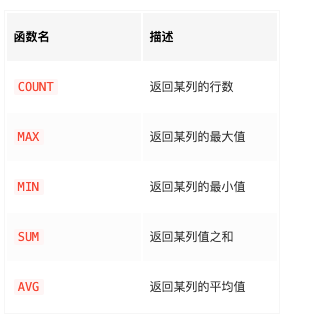
> 小贴士： 聚集函数这个名儿不太直观，把它理解为统计函数可能更符合中国人的理解习惯。

##### COUNT函数
COUNT函数使用来统计行数的，它有下边两种使用方式：
1. COUNT函数使用来统计行数的，它有下边两种使用方式：
2. COUNT(列名)：对特定的列进行计数，会忽略掉该列为NULL的行。
> 两者的区别是会不会忽略统计列的值为NULL的行！两者的区别是会不会忽略统计列的值为NULL的行

##### MAX函数
MAX函数是用来查询某列中数据的最大值
```sql
mysql> SELECT MAX(score) FROM student_score;
+------------+
| MAX(score) |
+------------+
|        100 |
+------------+
1 row in set (0.00 sec)

```

##### MIN函数
MIN函数是用来查询某列中数据的最小值
```
mysql> SELECT MIN(score) FROM student_score;
```

##### SUM函数
SUM函数是用来计算某列数据的和
```sql
SELECT SUM(score) FROM student_score;
```

##### AVG函数
AVG函数是用来计算某列数据的平均数

#### 给定搜索条件下聚集函数的使用
聚集函数并不是一定要统计一个表中的所有记录，我们也可以指定搜索条件来限定这些聚集函数作用的范围。
```sql
SELECT AVG(score) FROM student_score WHERE subject = '母猪的产后护理';
```

#### 聚集函数中DISTINCT的使用
默认情况下，上边介绍的聚集函数将计算指定列的所有非NULL数据，如果我们指定的列中有重复数据的话，可以选择使用DISTINCT来过滤掉这些重复数据。比方说我们想查看一下student_info表中存储了多少个专业的学生信息，就可以这么写：
```sql
mysql> SELECT COUNT(DISTINCT major) FROM student_info;
+-----------------------+
| COUNT(DISTINCT major) |
+-----------------------+
|                     4 |
+-----------------------+
1 row in set (0.01 sec)
```

#### 组合聚集函数
这些聚集函数也可以集中在一个查询中使用，比如这样：
```sql
SELECT COUNT(*) AS 成绩记录总数, MAX(score) AS 最高成绩, MIN(score) AS 最低成绩, AVG(score) AS 平均成绩 FROM student_score;
```

### 隐式类型转换
#### 隐式类型转换的场景
只要某个值的类型与上下文要求的类型不符，MySQL就会根据上下文环境中需要的类型对该值进行类型转换，由于这些类型转换都是MySQL自动完成的，所以也可以被称为隐式类型转换。我们列举几种常见的==隐式类型转换==的场景：
1. 把操作数类型转换为适合操作符计算的相应类型。
比方说对于加法操作符+来说，它要求两个操作数都必须是数字才能进行计算，所以如果某个操作数不是数字的话，会将其隐式转换为数字，比方说下边这几个例子：
```sql
1 + 2       →   3
'1' + 2     →   3
'1' + '2'   →   3

mysql> SELECT 1 + 2, '1' + 2, '1' + '2';
+-------+---------+-----------+
| 1 + 2 | '1' + 2 | '1' + '2' |
+-------+---------+-----------+
|     3 |       3 |         3 |
+-------+---------+-----------+
1 row in set (0.00 sec)
```
2. 将函数参数转换为该函数期望的类型。
```sql
mysql> SELECT CONCAT('1', '2'), CONCAT('1', 2), CONCAT(1, 2);
+------------------+----------------+--------------+
| CONCAT('1', '2') | CONCAT('1', 2) | CONCAT(1, 2) |
+------------------+----------------+--------------+
| 12               | 12             | 12           |
+------------------+----------------+--------------+
1 row in set (0.00 sec)
```
3. 存储数据时，把某个值转换为某个列需要的类型。
```sql
CREATE TABLE t (
    i1 TINYINT,
    i2 TINYINT,
    s VARCHAR(100)
);

INSERT INTO t(i1, i2, s) VALUES('100', '100', 200);

mysql> SELECT * FROM t;
+------+------+------+
| i1   | i2   | s    |
+------+------+------+
|  100 |  100 | 200  |
+------+------+------+
```

#### 类型转换的注意事项
1. MySQL会尽量把值转换为表达式中需要的类型，而不是产生错误。
按理说'23sfd'这个字符串无法转换为数字，但是MySQL规定只要字符串的开头部分包含数字，那么就把这个字符串转换为开头的数字，如果开头并没有包含数字，那么将被转换成0，比方说这样：
```sql
'23sfd'         →   23
'2019-08-28'    →   2019
'11:30:32'      →   11
'sfd'           →   0

mysql> SELECT '23sfd' + 0, 'sfd' + 0;
+-------------+-----------+
| '23sfd' + 0 | 'sfd' + 0 |
+-------------+-----------+
|          23 |         0 |
+-------------+-----------+
1 row in set, 2 warnings (0.00 sec)
```
不过需要注意的是，这种强制转换不能用于**存储数据**中，比方说这样：
```sql
mysql> INSERT INTO t(i1, i2, s) VALUES('sfd', 'sfd', 'aaa');
ERROR 1366 (HY000): Incorrect integer value: 'sfd' for column 'i1' at row 1
mysql>
```

2. 在运算时会自动提升操作数的类型。
我们知道不同数据类型能表示的数值范围是不一样的，在小的数据类型经过算数计算后得出的结果可能大于该可以表示的范围。

其实在运算的过程中，MySQL自动将整数类型的操作数提升到了BIGINT，这样就不会产生运算结果太大超过TINYINT能表示的数值范围的尴尬情况了。类似的，有浮点数的运算过程会把操作数自动转型为DOUBLE类型。

## 分组查询
### 分组数据
#### 创建分组
subject列中有多少不重复的课程，那就会有多少个分组。幸运的是，只要我们在GROUP BY子句中添加上分组列就好了，MySQL会帮助我们自动建立分组来方便我们统计信息，具体语句如下：
```sql
mysql> SELECT subject, AVG(score) FROM student_score GROUP BY subject;
+-----------------------------+------------+
| subject                     | AVG(score) |
+-----------------------------+------------+
| 母猪的产后护理              |    73.0000 |
| 论萨达姆的战争准备          |    73.2500 |
+-----------------------------+------------+
2 rows in set (0.01 sec)
```
在使用分组的时候必须要意识到，分组的存在仅仅是为了方便我们分别统计各个分组中的信息，所以**我们只需要把分组列和聚集函数放到查询列表处就好**！当然，如果非分组列出现在查询列表中会出现什么情况呢？比如下边这个查询：
```sql
mysql> SELECT number, subject, AVG(score) FROM student_score GROUP BY subject;
ERROR 1055 (42000): Expression #1 of SELECT list is not in GROUP BY clause and contains nonaggregated column 'xiaohaizi.student_score.number' which is not functionally dependent on columns in GROUP BY clause; this is incompatible with sql_mode=only_full_group_by
mysql>
```

#### 带有WHERE子句的分组查询
```sql
mysql> SELECT subject, AVG(score) FROM student_score WHERE score >= 60 GROUP BY subject;
+-----------------------------+------------+
| subject                     | AVG(score) |
+-----------------------------+------------+
| 母猪的产后护理              |    89.0000 |
| 论萨达姆的战争准备          |    82.3333 |
+-----------------------------+------------+
2 rows in set (0.00 sec)
```
1. 将记录进行过滤后分组。
2. 分别对各个分组进行数据统计。

#### 作用于分组的过滤条件
有时候某个带有GROUP BY子句的查询中可能会产生非常多的分组，假设student_score表中存储了100门学科的成绩，也就是subject列中有100个不重复的值，那就会产生100个分组，也就意味着这个查询的结果集中会产生100条记录。如果我们不想在结果集中得到这么多记录，只想把那些符合某些条件的分组加入到结果集，从而减少结果集中记录的条数，那就需要把针对分组的条件放到HAVING子句了。比方说老师想要查询平均分大于73分的课程，就可以这么写：
```sql
mysql> SELECT subject, AVG(score) FROM student_score GROUP BY subject HAVING AVG(score) > 73;
+-----------------------------+------------+
| subject                     | AVG(score) |
+-----------------------------+------------+
| 论萨达姆的战争准备          |    73.2500 |
+-----------------------------+------------+
1 row in set (0.00 sec)

```
并不是HAVING子句中只能放置在查询列表出现的那些聚集函数，只要是针对这个分组进行统计的聚集函数都可以
```sql
SELECT subject, AVG(score) FROM student_score GROUP BY subject having subject = '母猪的产后护理';

SELECT subject, AVG(score) FROM student_score GROUP BY subject HAVING MAX(score) > 98;
+-----------------------+------------+
| subject               | AVG(score) |
+-----------------------+------------+
| 母猪的产后护理        |    73.0000 |
+-----------------------+------------+
1 row in set (0.00 sec)
```

### 分组和排序
如果我们想对各个分组查询出来的统计数据进行排序，需要为查询列表中有聚集函数的表达式添加别名，比如想按照各个学科的平均分从大到小降序排序，可以这么写：
```sql
mysql> SELECT subject, AVG(score) AS avg_score FROM student_score GROUP BY subject ORDER BY avg_score DESC;
+-----------------------------+-----------+
| subject                     | avg_score |
+-----------------------------+-----------+
| 论萨达姆的战争准备          |   73.2500 |
| 母猪的产后护理              |   73.0000 |
+-----------------------------+-----------+
2 rows in set (0.01 sec)

```

### 嵌套分组
有时候按照某个列进行分组太笼统，一个分组内可以被继续划分成更小的分组。比方说对于student_info表来说，我们可以先按照department来进行分组，所以可以被划分为2个分组：

我们觉得这样按照department分组后，各个分组可以再按照major来继续分组，从而划分成更小的分组，所以再次分组之后的样子就是这样：


我们把这种对大的分组下继续分组的的情形叫做嵌套分组，如果你乐意，你可以继续把小分组划分成更小的分组。我们只需要在GROUP BY子句中把各个分组列依次写上，用逗号,分隔开就好了。比如这样：
```sql
mysql> SELECT department, major, COUNT(*) FROM student_info GROUP BY department, major;
+-----------------+--------------------------+----------+
| department      | major                    | COUNT(*) |
+-----------------+--------------------------+----------+
| 航天学院        | 电子信息                 |        1 |
| 航天学院        | 飞行器设计               |        1 |
| 计算机学院      | 计算机科学与工程         |        2 |
| 计算机学院      | 软件工程                 |        2 |
+-----------------+--------------------------+----------+
4 rows in set (0.00 sec)

```
### 使用分组注意事项
1. 如果分组列中含有NULL值，那么NULL也会作为一个独立的分组存在。

2.** 如果存在多个分组列，也就是嵌套分组，聚集函数将作用在最后的那个分组列上**。

3. 如果查询语句中存在WHERE子句和ORDER BY子句，那么GROUP BY子句必须出现在WHERE子句之后，ORDER BY子句之前。

4. 非分组列不能单独出现在检索列表中(可以被放到聚集函数中)。

5. GROUP BY子句后也可以跟随表达式(但不能是聚集函数)。
上边介绍的GROUP BY后跟随的都是表中的某个列或者某些列，其实一个表达式也可以，比如这样：
```sql
mysql> SELECT concat('专业：', major), COUNT(*) FROM student_info GROUP BY concat('专业：', major);
+-----------------------------------+----------+
| concat('专业：', major)           | COUNT(*) |
+-----------------------------------+----------+
| 专业：电子信息                    |        1 |
| 专业：计算机科学与工程            |        2 |
| 专业：软件工程                    |        2 |
| 专业：飞行器设计                  |        1 |
+-----------------------------------+----------+
4 rows in set (0.00 sec)
```
MySQL会根据这个表达式的值来对记录进行分组，使用表达式进行分组的时候需要特别注意，查询列表中的表达式和GROUP BY子句中的表达式必须完全一样。

6. WHERE子句和HAVING子句的区别。
**WHERE子句在分组前进行过滤，作用于每一条记录，WHERE子句过滤掉的记录将不包括在分组中。而HAVING子句在数据分组后进行过滤，作用于整个分组。**

### 简单查询语句中各子句的顺序
我们上边介绍了查询语句的各个子句，但是除了SELECT之外，其他的子句全都是可以省略的。如果在一个查询语句中出现了多个子句，那么它们之间的顺序是不能乱放的，顺序如下所示：
```sql
SELECT [DISTINCT] 查询列表
[FROM 表名]
[WHERE 布尔表达式]
[GROUP BY 分组列表 ]
[HAVING 分组过滤条件]
[ORDER BY 排序列表]
[LIMIT 开始行, 限制条数]
```
其中中括号[]中的内容表示可以省略，我们在书写查询语句的时候各个子句必须严格遵守这个顺序，不然会报错的！

## 子查询
### 多表查询的需求
```sql
// 不用子查询
mysql> SELECT number FROM student_info WHERE name = '杜琦燕';
+----------+
| number   |
+----------+
| 20180102 |
+----------+
1 row in set (0.00 sec)

mysql> SELECT * FROM student_score WHERE number = 20180102;
+----------+-----------------------------+-------+
| number   | subject                     | score |
+----------+-----------------------------+-------+
| 20180102 | 母猪的产后护理              |   100 |
| 20180102 | 论萨达姆的战争准备          |    98 |
+----------+-----------------------------+-------+
2 rows in set (0.00 sec)


```
### 标量子查询
为了书写简便，我们可以把这两条语句合并到一条语句中，从而减少了把第一条查询语句的结果复制粘贴到第二条查询语句中的步骤，就像这样：
```sql
mysql> SELECT * FROM student_score WHERE number = (SELECT number FROM student_info WHERE name = '杜琦燕');
+----------+-----------------------------+-------+
| number   | subject                     | score |
+----------+-----------------------------+-------+
| 20180102 | 母猪的产后护理              |   100 |
| 20180102 | 论萨达姆的战争准备          |    98 |
+----------+-----------------------------+-------+
2 rows in set (0.01 sec)
```
我们把第二条查询语句用小括号()扩起来作为一个操作数放到了第一条的搜索条件处，这样就起到了合并两条查询语句的作用。小括号中的查询语句也被称为子查询或者内层查询，使用内层查询的结果作为搜索条件的操作数的查询称为外层查询。如果你在一个查询语句中需要用到更多的表的话，那么在一个子查询中可以继续嵌套另一个子查询，在执行查询语句时，将按照从内到外的顺序依次执行这些查询。

在这个例子中的子查询的结果只有一个值(也就是'杜琦燕'的学号)，这种子查询称之为标量子查询。正因为标量子查询单纯的代表一个值，所以它可以作为表达式的操作数来参与运算，它除了用在外层查询的搜索条件中以外，也可以被放到查询列表处，比如这样：
```sql
mysql> SELECT (SELECT number FROM student_info WHERE name = '杜琦燕') AS 学号;
+----------+
| 学号     |
+----------+
| 20180102 |
+----------+
1 row in set (0.00 sec)

```
标量子查询单纯的代表一个值，由标量子查询作为的操作数组成的搜索条件只要符合表达语法就可以。比方说我们来查询学号大于'杜琦燕'的学号的学生成绩，可以这么写：
```sql
mysql> SELECT * FROM student_score WHERE number > (SELECT number FROM student_info WHERE name = '杜琦燕');
+----------+-----------------------------+-------+
| number   | subject                     | score |
+----------+-----------------------------+-------+
| 20180103 | 母猪的产后护理              |    59 |
| 20180103 | 论萨达姆的战争准备          |    61 |
| 20180104 | 母猪的产后护理              |    55 |
| 20180104 | 论萨达姆的战争准备          |    46 |
+----------+-----------------------------+-------+
4 rows in set (0.00 sec)

```

### 列子查询
```sql
mysql> SELECT number FROM student_info WHERE major = '计算机科学与工程';
+----------+
| number   |
+----------+
| 20180101 |
| 20180102 |
+----------+
2 rows in set (0.00 sec)

mysql> SELECT * FROM student_score WHERE number IN (20180101, 20180102);
+----------+-----------------------------+-------+
| number   | subject                     | score |
+----------+-----------------------------+-------+
| 20180101 | 母猪的产后护理              |    78 |
| 20180101 | 论萨达姆的战争准备          |    88 |
| 20180102 | 母猪的产后护理              |   100 |
| 20180102 | 论萨达姆的战争准备          |    98 |
+----------+-----------------------------+-------+
4 rows in set (0.00 sec)
```
第二条查询语句的搜索条件也是用到了第一条查询语句的查询结果，我们自然可以想到把第一条查询语句作为内层查询，把第二条查询语句作为外层查询来将这两个查询语句合并为一个查询语句，就像这样：
```sql
mysql> SELECT * FROM student_score WHERE number IN (SELECT number FROM student_info WHERE major = '计算机科学与工程');
+----------+-----------------------------+-------+
| number   | subject                     | score |
+----------+-----------------------------+-------+
| 20180101 | 母猪的产后护理              |    78 |
| 20180101 | 论萨达姆的战争准备          |    88 |
| 20180102 | 母猪的产后护理              |   100 |
| 20180102 | 论萨达姆的战争准备          |    98 |
+----------+-----------------------------+-------+
4 rows in set (0.00 sec)
```
因为列子查询得到的结果是多个值，相当于一个列表。我们前边的章节中说过，IN和NOT IN操作符正好是用来匹配列表的，上边使用的例子是使用IN操作符和子查询的结果组成表达式来作为外层查询的搜索条件的。

### 行子查询
只要子查询的结果集中最多只包含一条记录，而且这条记录中有超过一个列的数据（如果该条记录只包含一个列的话，该子查询就成了标量子查询），那么这个子查询就可以被称之为行子查询，比如这样：
```sql
SELECT * FROM student_score WHERE (number, subject) = (SELECT number, '母猪的产后护理' FROM student_info LIMIT 1);
```
> 小贴士： 在想要得到标量子查询或者行子查询，但又不能保证子查询的结果集只有一条记录时，应该使用LIMIT 1子句来限制记录数量。

### 表子查询
如果子查询结果集中包含多行多列，那么这个子查询也可以被称之为表子查询，比如这样：
```sql
mysql> SELECT * FROM student_score WHERE (number, subject) IN (SELECT number, '母猪的产后护理' FROM student_info WHERE major = '计算机科学与工程');
+----------+-----------------------+-------+
| number   | subject               | score |
+----------+-----------------------+-------+
| 20180101 | 母猪的产后护理        |    78 |
| 20180102 | 母猪的产后护理        |   100 |
+----------+-----------------------+-------+
2 rows in set (0.00 sec)
```

### EXISTS和NOT EXISTS子查询
有时候外层查询并不关心子查询中的结果是什么，而只关心子查询的结果集是不是为空集，这时可以用到下边这两个操作符：

```sql
mysql> SELECT * FROM student_score WHERE EXISTS (SELECT * FROM student_info WHERE number = 20180108);
Empty set (0.00 sec)

```
其中子查询的意思是在student_info表中查找学号为20180108的学生信息，很显然并没有学号为20180108的学生，所以子查询的结果集是一个空集，于是EXISTS表达式的结果为FALSE，所以外层查询也就不查了，直接返回了一个Empty set，表示没有结果。

### 不相关子查询和相关子查询
前边介绍的子查询和外层查询都没有依赖关系，也就是说子查询可以独立运行并产生结果之后，再拿结果作为外层查询的条件去执行外层查询，这种子查询称为不相关子查询，比如下边这个查询：
```sql
mysql> SELECT * FROM student_score WHERE number = (SELECT number FROM student_info WHERE name = '杜琦燕');
+----------+-----------------------------+-------+
| number   | subject                     | score |
+----------+-----------------------------+-------+
| 20180102 | 母猪的产后护理              |   100 |
| 20180102 | 论萨达姆的战争准备          |    98 |
+----------+-----------------------------+-------+
2 rows in set (0.00 sec)

```
有时候我们需要在子查询的语句中引用到外层查询的值，这样的话子查询就不能当作一个独立的语句去执行，这种子查询被称为相关子查询。比方说我们想查看一些学生的基本信息，但是前提是这些学生在student_score表中有成绩记录，那可以这么写：
```sql
mysql> SELECT number, name, id_number, major FROM student_info WHERE EXISTS (SELECT * FROM student_score WHERE student_score.number = student_info.number);
+----------+-----------+--------------------+--------------------------+
| number   | name      | id_number          | major                    |
+----------+-----------+--------------------+--------------------------+
| 20180101 | 杜子腾    | 158177199901044792 | 计算机科学与工程         |
| 20180102 | 杜琦燕    | 151008199801178529 | 计算机科学与工程         |
| 20180103 | 范统      | 17156319980116959X | 软件工程                 |
| 20180104 | 史珍香    | 141992199701078600 | 软件工程                 |
+----------+-----------+--------------------+--------------------------+
4 rows in set (0.00 sec)
```
> 小贴士： student_info和student_score表里都有number列，所以在子查询的WHERE语句中书写number = number会造成二义性，也就是让服务器懵逼，不知道这个number列到底是哪个表的，所以为了区分，在列名前边加上了表名，并用点.连接起来，这种显式的将列所属的表名书写出来的名称称为该列的全限定名。

这个例子中的相关子查询的查询过程是这样的：
- 先执行外层查询获得到student_info表的第一条记录，发现它的number值是20180101。把20180101当作参数传入到子查询，此时子查询的意思是判断student_score表的number字段是否有20180101这个值存在，子查询的结果是该值存在，所以整个EXISTS表达式的值为TRUE，那么student_info表的第一条记录可以被加入到结果集。
- 再执行外层查询获得到student_info表的第二条记录，发现它的number值是20180102，与上边的步骤相同，student_info表的第二条记录也可以被加入到结果集。

### 对同一个表的子查询

其实不只是在涉及多个表查询的时候会用到子查询，在只涉及单个表的查询中有时也会用到子查询。
```sql
mysql> SELECT * FROM student_score WHERE subject = '母猪的产后护理' AND score > AVG(score);
ERROR 1111 (HY000): Invalid use of group function
// 错误的 聚集函数不能放到WHERE子句中！！！

mysql>  SELECT * FROM student_score WHERE subject = '母猪的产后护理' AND score > (SELECT AVG(score) FROM student_score WHERE subject = '母猪的产后护理');
+----------+-----------------------+-------+
| number   | subject               | score |
+----------+-----------------------+-------+
| 20180101 | 母猪的产后护理        |    78 |
| 20180102 | 母猪的产后护理        |   100 |
+----------+-----------------------+-------+
2 rows in set (0.01 sec)
```
如果我们想实现上边的需求，就需要搞一个student_score表的副本，就相当于有了两个student_score表，在一个表上使用聚集函数统计，统计完了之后拿着统计结果再到另一个表中进行过滤。

## 连接查询
### 多个表合在一起的问题
1. 问题一：浪费存储空间。
2. 问题二：当修改某个学生的基本信息时必须修改多处，很容易造成信息的不一致，增大维护的困难。

### 连接的概念
一个查询语句结果集中展示多个表的信息的方式，连接查询承担了这个艰巨的历史使命。

**连接**的本质就是把各个表中的记录都取出来依次匹配的组合加入结果集并返回给用户。我们把t1和t2两个表连接起来的过程如下图所示：
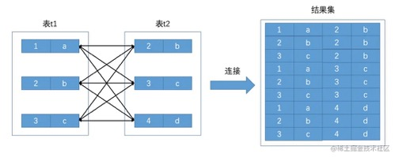

这个过程看起来就是把t1表的记录和t2表的记录连起来组成新的更大的记录，所以这个查询过程称之为连接查询。连接查询的结果集中包含一个表中的每一条记录与另一个表中的每一条记录相互匹配的组合，像这样的结果集就可以称之为**笛卡尔积**。

在MySQL中，连接查询的语法也很随意，只要在FROM语句后边跟多个用逗号,隔开的表名就好了，比如我们把t1表和t2表连接起来的查询语句可以写成这样：
```sql
SELECT * FROM t1, t2;
SELECT t1.m1, t1.n1, t2.m2, t2.n2 FROM t1, t2;
SELECT m1, n1, m2, n2 FROM t1, t2;
SELECT t1.*, t2.* FROM t1, t2;
```

### 连接过程简介
如果我们乐意，我们可以连接任意数量张表，但是如果没有任何限制条件的话，这些表连接起来产生的笛卡尔积可能是非常巨大的。比方说3个100行记录的表连接起来产生的笛卡尔积就有100×100×100=1000000行数据！所以在连接的时候过滤掉特定记录组合是有必要的，在连接查询中的过滤条件可以分成两种：
- 涉及单表的条件
这种只涉及单表的过滤条件我们之前都提到过一万遍了，我们之前也一直称为搜索条件，比如t1.m1 > 1是只针对t1表的过滤条件，t2.n2 < 'd'是只针对t2表的过滤条件。

- 涉及两表的条件
这种过滤条件我们之前没见过，比如t1.m1 = t2.m2、t1.n1 > t2.n2等，这些条件中涉及到了两个表。

首先确定第一个需要查询的表，这个表称之为驱动表。从驱动表每获取到一条记录，都需要到被驱动表中查找匹配的记录，所谓匹配的记录，指的是符合过滤条件的记录。

### 内连接和外连接
那如果老师想查看所有同学的考试成绩，即使是缺考的同学也应该展示出来，但是到目前为止我们介绍的连接查询是无法完成这样的需求的。
其本质是想：驱动表中的记录即使在被驱动表中没有匹配的记录，也仍然需要加入到结果集。为了解决这个问题，就有了**内连接和外连接**的概念：

- 对于内连接的两个表，驱动表中的记录在被驱动表中找不到匹配的记录，该记录不会加入到最后的结果集，我们上边提到的连接都是所谓的内连接。
- 对于外连接的两个表，驱动表中的记录即使在被驱动表中没有匹配的记录，也仍然需要加入到结果集。
    在MySQL中，根据选取驱动表的不同，外连接仍然可以细分为2种：
    - 左外连接
        选取左侧的表为驱动表。
    - 右外连接
        选取右侧的表为驱动表。

可是这样仍然存在问题，即使对于外连接来说，有时候我们也并不想把驱动表的全部记录都加入到最后的结果集。这就犯难了，有时候匹配失败要加入结果集，有时候又不要加入结果集，把过滤条件分为两种不就解决了这个问题了么，所以放在不同地方的过滤条件是有不同语义的：
- **WHERE**子句中的过滤条件
WHERE子句中的过滤条件就是我们平时见的那种，不论是内连接还是外连接，凡是不符合WHERE子句中的过滤条件的记录都不会被加入最后的结果集。
- **ON**子句中的过滤条件
对于外连接的驱动表的记录来说，如果无法在被驱动表中找到匹配ON子句中的过滤条件的记录，那么该记录仍然会被加入到结果集中，对应的被驱动表记录的各个字段使用NULL值填充。
需要注意的是，这个ON子句是专门为外连接驱动表中的记录在被驱动表找不到匹配记录时应不应该把该记录加入结果集这个场景下提出的，所以如果把ON子句放到内连接中，MySQL会把它和WHERE子句一样对待，也就是说：内连接中的WHERE子句和ON子句是等价的。

一般情况下，我们都把只涉及单表的过滤条件放到WHERE子句中，把涉及两表的过滤条件都放到ON子句中，我们也一般把放到ON子句中的过滤条件也称之为连接条件。

### 左（外）连接的语法
```sql
SELECT * FROM t1 LEFT [OUTER] JOIN t2 ON 连接条件 [WHERE 普通过滤条件];

mysql> SELECT student_info.number, name, major, subject, score FROM student_info LEFT JOIN student_score ON student_info.number = student_score.number;
+----------+-----------+--------------------------+-----------------------------+-------+
| number   | name      | major                    | subject                     | score |
+----------+-----------+--------------------------+-----------------------------+-------+
| 20180101 | 杜子腾    | 计算机科学与工程         | 母猪的产后护理              |    78 |
| 20180101 | 杜子腾    | 计算机科学与工程         | 论萨达姆的战争准备          |    88 |
| 20180102 | 杜琦燕    | 计算机科学与工程         | 母猪的产后护理              |   100 |
| 20180102 | 杜琦燕    | 计算机科学与工程         | 论萨达姆的战争准备          |    98 |
| 20180103 | 范统      | 软件工程                 | 母猪的产后护理              |    59 |
| 20180103 | 范统      | 软件工程                 | 论萨达姆的战争准备          |    61 |
| 20180104 | 史珍香    | 软件工程                 | 母猪的产后护理              |    55 |
| 20180104 | 史珍香    | 软件工程                 | 论萨达姆的战争准备          |    46 |
| 20180105 | 范剑      | 飞行器设计               | NULL                        |  NULL |
| 20180106 | 朱逸群    | 电子信息                 | NULL                        |  NULL |
+----------+-----------+--------------------------+-----------------------------+-------+
10 rows in set (0.00 sec)
```
其中中括号里的OUTER单词是可以省略的。对于LEFT JOIN类型的连接来说，我们把放在左边的表称之为外表或者驱动表，右边的表称之为内表或者被驱动表。所以上述例子中t1就是外表或者驱动表，t2就是内表或者被驱动表。需要注意的是，对于左（外）连接和右（外）连接来说，必须使用ON子句来指出连接条件。

### 右（外）连接的语法
```sql
SELECT * FROM t1 RIGHT [OUTER] JOIN t2 ON 连接条件 [WHERE 普通过滤条件];
```

### 内连接的语法
内连接和外连接的根本区别就是在驱动表中的记录不符合ON子句中的连接条件时不会把该记录加入到最后的结果集，我们最开始唠叨的那些连接查询的类型都是内连接。不过之前仅仅提到了一种最简单的内连接语法，就是直接把需要连接的多个表都放到FROM子句后边。其实针对内连接，MySQL提供了好多不同的语法，我们以t1和t2表为例瞅瞅：
```sql
SELECT * FROM t1 [INNER | CROSS] JOIN t2 [ON 连接条件] [WHERE 普通过滤条件];
// 下面三种写法等价
SELECT * FROM t1 JOIN t2;

SELECT * FROM t1 INNER JOIN t2;

SELECT * FROM t1 CROSS JOIN t2;

SELECT * FROM t1, t2;
```

### 自连接
我们上边说的都是多个不同的表之间的连接，其实同一个表也可以进行连接。比方说我们可以对两个t1表来生成笛卡尔积，就像这样：
```sql
mysql> SELECT * FROM t1, t1;
ERROR 1066 (42000): Not unique table/alias: 't1'
// 允许FROM子句中出现相同的表名。
// 我们这里需要的是两张一模一样的t1表进行连接，为了把两个一样的表区分一下，需要为表定义别名。
mysql> SELECT * FROM t1 AS table1, t1 AS table2;
+------+------+------+------+
| m1   | n1   | m1   | n1   |
+------+------+------+------+
|    1 | a    |    1 | a    |
|    2 | b    |    1 | a    |
|    3 | c    |    1 | a    |
|    1 | a    |    2 | b    |
|    2 | b    |    2 | b    |
|    3 | c    |    2 | b    |
|    1 | a    |    3 | c    |
|    2 | b    |    3 | c    |
|    3 | c    |    3 | c    |
+------+------+------+------+
9 rows in set (0.00 sec)

mysql> SELECT s2.number, s2.name, s2.major FROM student_info AS s1 INNER JOIN student_info AS s2 WHERE s1.major = s2.major AND s1.name = '史珍香' ;
+----------+-----------+--------------+
| number   | name      | major        |
+----------+-----------+--------------+
| 20180103 | 范统      | 软件工程     |
| 20180104 | 史珍香    | 软件工程     |
+----------+-----------+--------------+
```
### 连接查询与子查询的转换
有的查询需求既可以使用连接查询解决，也可以使用子查询解决，比如
```sql
SELECT * FROM student_score WHERE number IN (SELECT number FROM student_info WHERE major = '计算机科学与工程');

SELECT s2.* FROM student_info AS s1 INNER JOIN student_score AS s2 WHERE s1.number = s2.number AND s1.major = '计算机科学与工程';
```

## 组合查询
其实多条查询语句产生的结果集查也可以被合并成一个大的结果集，这种将多条查询语句产生的结果集合并起来的查询方式称为**合并查询，或者组合查询**。

### 涉及单表的组合查询
```sql
mysql> SELECT m1 FROM t1 WHERE m1 < 2 OR m1 > 2;
+------+
| m1   |
+------+
|    1 |
|    3 |
+------+
2 rows in set (0.00 sec)

// 使用UNION来将两个查询语句连在一起
mysql> SELECT m1 FROM t1 WHERE m1 < 2 UNION SELECT m1 FROM t1 WHERE m1 > 2;
+------+
| m1   |
+------+
|    1 |
|    3 |
+------+
2 rows in set (0.01 sec)

// 多个查询语句也直接用UNION来连起来
mysql> SELECT m1 FROM t1 WHERE m1 < 2 UNION SELECT m1 FROM t1 WHERE m1 > 2 UNION SELECT m1 FROM t1 WHERE m1 = 2;
+------+
| m1   |
+------+
|    1 |
|    3 |
|    2 |
+------+
3 rows in set (0.00 sec)

// 有多个表达式也是可以的，只要数量相同就可以了
mysql> SELECT m1, n1 FROM t1 WHERE m1 < 2 UNION SELECT m1, n1 FROM t1 WHERE m1 > 2;
+------+------+
| m1   | n1   |
+------+------+
|    1 | a    |
|    3 | c    |
+------+------+
2 rows in set (0.00 sec)

// 如果不匹配的话，MySQL将会自动的进行类型转换，比方说下边这个组合查询语句：
mysql> SELECT m1, n1 FROM t1 WHERE m1 < 2 UNION SELECT n1, m1 FROM t1 WHERE m1 > 2;
+------+------+
| m1   | n1   |
+------+------+
| 1    | a    |
| c    | 3    |
+------+------+
2 rows in set (0.01 sec)
```

### 涉及不同表的组合查询
```sql
mysql> SELECT m1, n1 FROM t1 WHERE m1 < 2 UNION SELECT m2, n2 FROM t2 WHERE m2 > 2;
+------+------+
| m1   | n1   |
+------+------+
|    1 | a    |
|    3 | c    |
|    4 | d    |
+------+------+
3 rows in set (0.01 sec)
```

### 包含或去除重复的行
```sql
mysql> SELECT m1, n1 FROM t1;
+------+------+
| m1   | n1   |
+------+------+
|    1 | a    |
|    2 | b    |
|    3 | c    |
+------+------+
3 rows in set (0.00 sec)

mysql> SELECT m2, n2 FROM t2;
+------+------+
| m2   | n2   |
+------+------+
|    2 | b    |
|    3 | c    |
|    4 | d    |
+------+------+
3 rows in set (0.00 sec)

mysql> SELECT m1, n1 FROM t1 UNION SELECT m2, n2 FROM t2;
+------+------+
| m1   | n1   |
+------+------+
|    1 | a    |
|    2 | b    |
|    3 | c    |
|    4 | d    |
+------+------+
4 rows in set (0.00 sec)

```
为什么合并后的结果只剩下了4条记录呢？因为使用UNION来合并多个查询的记录会默认过滤掉重复的记录。由于t1表和t2表都有(2, b)、(3, c)这两条记录，所以合并后的结果集就把他俩去重了。如果我们想要保留重复记录，可以使用**UNION ALL**来连接多个查询：
```sql
mysql> SELECT m1, n1 FROM t1 UNION ALL SELECT m2, n2 FROM t2;
+------+------+
| m1   | n1   |
+------+------+
|    1 | a    |
|    2 | b    |
|    3 | c    |
|    2 | b    |
|    3 | c    |
|    4 | d    |
+------+------+
6 rows in set (0.00 sec)
```
### 组合查询中的ORDER BY和LIMIT子句
组合查询会把各个查询的结果汇总到一块，如果我们相对最终的结果集进行排序或者只保留几行的话，可以在组合查询的语句末尾加上ORDER BY和LIMIT子句
```sql
mysql> (SELECT m1, n1 FROM t1) UNION (SELECT m2, n2 FROM t2) ORDER BY m1 DESC LIMIT 2;
+------+------+
| m1   | n1   |
+------+------+
|    4 | d    |
|    3 | c    |
+------+------+
2 rows in set (0.01 sec)

```
> 这里需要注意的一点是，由于最后的结果集展示的列名是第一个查询中给定的列名，所以ORDER BY子句中指定的排序列也必须是第一个查询中给定的列名（别名也可以）。

## 数据的插入、删除和更新
### 插入数据
在关系型数据库中，数据一般都是以记录(或者说行)为单位被插入到表中的。
#### 插入完整的记录
在插入完整的一条记录时，需要我们指定要插入表的名称和该条记录中全部列的具体数据，完整的语法是这样：
```sql
INSERT INTO 表名 VALUES(列1的值，列2的值, ..., 列n的值);

INSERT INTO first_table VALUES(1, 'aaa');

mysql> INSERT INTO first_table(first_column, second_column) VALUES (3, 'ccc');
Query OK, 1 row affected (0.00 sec)

mysql> INSERT INTO first_table(second_column, first_column) VALUES ('ddd', 4);
Query OK, 1 row affected (0.01 sec)

```
如果我们不知道向某个列填什么值，可以使用填入NULL（前提是该列没有声明NOT NULL属性）。

#### 插入记录的一部分
我们在插入记录的时候，某些列的值可以被省略，但是这个列必须满足下边列出的某个条件之一：
- 该列允许存储NULL值
- 该列有DEFAULT属性，给出了默认值

#### 批量插入记录
```sql
mysql> INSERT INTO first_table(first_column, second_column) VALUES(7, 'ggg'), (8, 'hhh');
Query OK, 2 rows affected (0.00 sec)
Records: 2  Duplicates: 0  Warnings: 0
```

#### 将某个查询的结果集插入表中
```sql
mysql> INSERT INTO second_table(s, i) SELECT second_column, first_column FROM first_table WHERE first_column < 5;
Query OK, 4 rows affected (0.00 sec)
Records: 4  Duplicates: 0  Warnings: 0
```

#### INSERT IGNORE
对于那些是主键或者具有UNIQUE约束的列或者列组合来说，如果表中已存在的记录中没有与待插入记录在这些列或者列组合上重复的值，那么就把待插入记录插到表中，否则忽略此次插入操作。
```sql
mysql> INSERT IGNORE INTO first_table(first_column, second_column) VALUES(1, '哇哈哈') ;
Query OK, 0 rows affected, 1 warning (0.00 sec)
```

#### INSERT ON DUPLICATE KEY UPDATE
对于主键或者有唯一性约束的列或列组合来说，新插入的记录如果和表中已存在的记录重复的话，我们可以选择的策略不仅仅是忽略该条记录的插入，也可以选择更新这条重复的旧记录。比如我们想在first_table表中插入一条记录，内容是(1, '哇哈哈')，我们想要的效果是：对于那些是主键或者具有UNIQUE约束的列或者列组合来说，如果表中已存在的记录中没有与待插入记录在这些列或者列组合上重复的值，那么就把待插入记录插到表中，否则按照规定去更新那条重复的记录中某些列的值。
```sql
mysql> INSERT INTO first_table (first_column, second_column) VALUES(1, '哇哈哈') ON DUPLICATE KEY UPDATE second_column = '雪碧';
Query OK, 2 rows affected (0.00 sec)
```
对于那些是主键或者具有UNIQUE约束的列或者列组合来说，如果表中已存在的记录中有与待插入记录在这些列或者列组合上重复的值，我们可以使用 **VALUES(列名)** 的形式来引用待插入记录中对应列的值，比方说下边这个INSERT语句：
```sql
mysql> INSERT INTO first_table (first_column, second_column) VALUES(1, '哇哈哈') ON DUPLICATE KEY UPDATE second_column = VALUES(second_column);
Query OK, 2 rows affected (0.00 sec)
```
其中的 **VALUES(second_column)** 就代表着待插入记录中second_column的值，本例中就是'哇哈哈'。
```sql
mysql> INSERT INTO first_table (first_column, second_column) VALUES(2, '红牛'), (3, '橙汁儿') ON DUPLICATE KEY UPDATE second_column = VALUES(second_column);
Query OK, 4 rows affected (0.00 sec)
Records: 2  Duplicates: 2  Warnings: 0
```

### 删除数据
如果某些记录我们不想要了，那可以使用下边的语句把它们给删除掉：
```sql
DELETE FROM 表名 [WHERE 表达式];

mysql> DELETE FROM first_table WHERE first_column > 4;
Query OK, 4 rows affected (0.00 sec)

// 如果不加WHERE子句的话，意味着删除表中所有数据
mysql> DELETE FROM second_table;
Query OK, 4 rows affected (0.01 sec)

mysql> DELETE FROM first_table ORDER BY first_column DESC LIMIT 1;
Query OK, 1 row affected (0.00 sec)
```

### 更新数据
```sql
UPDATE 表名 SET 列1=值1, 列2=值2, ...,  列n=值n [WHERE 布尔表达式];

// 我们也可以使用LIMIT子句来限制想要更新的记录数量，使用ORDER BY子句来指定符合条件的记录的更新顺序
mysql> UPDATE first_table SET second_column='爽歪歪' ORDER BY first_column DESC LIMIT 1;
Query OK, 1 row affected (0.00 sec)
```
> 如果我们不指定WHERE子句，那么表中所有的记录都会被更新，否则的话只有符合WHERE子句中的条件的记录才可以被更新。

## 视图
### 创建视图
我们查询出了一些男学生的基本信息和成绩信息，如果下次还想得到这些信息，我们就不得不把这个又臭又长的查询语句再敲一遍，不过设计MySQL的大叔们很贴心的为我们提供了一个称之为视图(英文名VIEW)的东东来帮助我们以很容易的方式来复用这些查询语句。
```sql
CREATE VIEW 视图名 AS 查询语句

mysql> CREATE VIEW male_student_view AS SELECT s1.number, s1.name, s1.major, s2.subject, s2.score FROM student_info AS s1 INNER JOIN student_score AS s2 WHERE s1.number = s2.number AND s1.sex = '男';
Query OK, 0 rows affected (0.02 sec)
```

### 使用视图
视图也可以被称为虚拟表，因为我们可以对视图进行一些类似表的增删改查操作，只不过我们对视图的相关操作都会被映射到那个又臭又长的查询语句对应的底层的表上。

我们平时怎么从真实表中查询信息，就可以怎么从视图中查询信息，比如这么写：
```sql
mysql> SELECT * FROM male_student_view;
+----------+-----------+--------------------------+-----------------------------+-------+
| number   | name      | major                    | subject                     | score |
+----------+-----------+--------------------------+-----------------------------+-------+
| 20180101 | 杜子腾    | 计算机科学与工程         | 母猪的产后护理              |    78 |
| 20180101 | 杜子腾    | 计算机科学与工程         | 论萨达姆的战争准备          |    88 |
| 20180103 | 范统      | 软件工程                 | 母猪的产后护理              |    59 |
| 20180103 | 范统      | 软件工程                 | 论萨达姆的战争准备          |    61 |
+----------+-----------+--------------------------+-----------------------------+-------+
4 rows in set (0.00 sec)
```
> 视图其实就相当于是某个查询语句的别名！创建视图的时候并不会把那个又臭又长的查询语句的结果集维护在硬盘或者内存里！在对视图进行查询时，MySQL服务器将会帮助我们把对视图的查询语句转换为对底层表的查询语句然后再执行。

**视图还可以和真实表一起使用。**

### 利用视图来创建新视图
我们前边说视图是某个查询语句的别名，其实这个查询语句不仅可以从真实表中查询数据，也可以从另一个视图中查询数据，只要是个合法的查询语句就好了。比方说我们利用male_student_view视图来创建另一个新视图可以这么写：
```sql
mysql> CREATE VIEW by_view AS SELECT number, name, score FROM male_student_view;
Query OK, 0 rows affected (0.02 sec)
```

### 创建视图时指定自定义列名
我们前边说过视图的虚拟列其实是这个视图对应的查询语句的查询列表，我们也可以在创建视图的时候为它的虚拟列自定义列名，这些自定义列名写到视图名后边，用逗号,分隔就好了，不过需要注意的是，自定义列名一定要和查询列表中的表达式一一对应。比如我们新创建一个自定义列名的视图：
```sql
mysql> CREATE VIEW student_info_view(no, n, m) AS SELECT number, name, major FROM student_info;
Query OK, 0 rows affected (0.02 sec)

// 我们的自定义列名列表是no, n, m，分别对应查询列表中的number, name, major。

mysql> SELECT no, n, m FROM student_info_view;
+----------+-----------+--------------------------+
| no       | n         | m                        |
+----------+-----------+--------------------------+
| 20180101 | 杜子腾    | 计算机科学与工程         |
| 20180102 | 杜琦燕    | 计算机科学与工程         |
| 20180103 | 范统      | 软件工程                 |
| 20180104 | 史珍香    | 软件工程                 |
| 20180105 | 范剑      | 飞行器设计               |
| 20180106 | 朱逸群    | 电子信息                 |
+----------+-----------+--------------------------+
6 rows in set (0.00 sec)
```
> 如果仍旧使用与视图对应的查询语句的查询列表中的列名就会报错。

### 查看和删除视图
我们创建视图时默认是将其放在当前数据库下的，如果我们想查看当前数据库中有哪些视图的话，其实和查看有哪些表的命令是一样的：
```sql
mysql> SHOW TABLES;
```
#### 查看视图的定义
图是一张虚拟表，用来查看视图结构的语句和用来查看表结构的语句比较类似，是这样的：
```sql
SHOW CREATE VIEW 视图名;

mysql> SHOW CREATE VIEW student_info_view\G
*************************** 1. row ***************************
                View: student_info_view
         Create View: CREATE ALGORITHM=UNDEFINED DEFINER=`root`@`localhost` SQL SECURITY DEFINER VIEW `student_info_view` AS select `student_info`.`number` AS `no`,`student_info`.`name` AS `n`,`student_info`.`major` AS `m` from `student_info`
character_set_client: utf8
collation_connection: utf8_general_ci
1 row in set (0.00 sec)
```

### 可更新的视图
其实有些视图是可更新的，也就是在视图上执行INSERT、DELETE、UPDATE语句。对视图执行INSERT、DELETE、UPDATE语句的本质上是对该视图对应的底层表中的数据进行增、删、改操作。

不过并不是可以在所有的视图上执行更新语句的，在生成视图的时候使用了下边这些语句的都不能进行更新：
- 聚集函数（比如SUM(), MIN(), MAX(), COUNT()等等）
- DISTINCT
- GROUP BY
- HAVING
- UNION 或者 UNION ALL
- 某些子查询
- 某些连接查询

### 删除视图
```sql
DROP VIEW 视图名
```

## 自定义变量和语句结束分隔符
### 存储程序
有时候为了完成一个常用的功能需要执行许多条语句，每次都在客户端里一条一条的去输入这么多语句是很烦的。设计MySQL的大叔非常贴心的给我们提供了一种称之为存储程序的东东，这个所谓的存储程序可以封装一些语句，然后给用户提供一种简单的方式来调用这个存储程序，从而间接地执行这些语句。根据调用方式的不同，我们可以把存储程序分为存储例程、触发器和事件这几种类型。其中，存储例程又可以被细分为存储函数和存储过程。我们画个图表示一下：
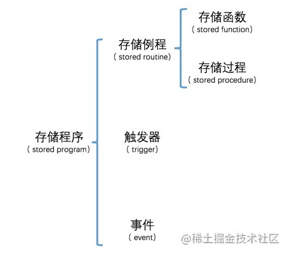

### 自定义变量简介
在MySQL中，我们可以通过SET语句来自定义一些我们自己的变量，比方说这样：
设计MySQL的大叔规定，在我们的自定义变量前边必须加一个@符号
```sql
mysql> SET @a = 1;
Query OK, 0 rows affected (0.00 sec)

mysql> SELECT @a;
+------+
| @a   |
+------+
|    1 |
+------+
1 row in set (0.00 sec)

mysql> SET @a = '哈哈哈';
Query OK, 0 rows affected (0.01 sec)

mysql> SELECT @a;
+-----------+
| @a        |
+-----------+
| 哈哈哈    |
+-----------+
1 row in set (0.00 sec)

mysql> SET @b = @a;
Query OK, 0 rows affected (0.00 sec)

mysql> select @b;
+-----------+
| @b        |
+-----------+
| 哈哈哈    |
+-----------+
1 row in set (0.00 sec)

// 我们还可以将某个查询的结果赋值给一个变量，前提是这个查询的结果只有一个值：

mysql> SET @a = (SELECT m1 FROM t1 LIMIT 1);
Query OK, 0 rows affected (0.00 sec)

// 另一种形式
mysql> SELECT n1 FROM t1 LIMIT 1 INTO @b;
Query OK, 1 row affected (0.00 sec)

```
如果我们的查询结果是一条记录，该记录中有多个列的值的话，我们想把这几个值分别赋值到不同的变量中，只能使用INTO语句了：
```sql
mysql> SELECT m1, n1 FROM t1 LIMIT 1 INTO @a, @b;
Query OK, 1 row affected (0.00 sec)
```

### 语句结束分隔符
在MySQL客户端的交互界面处，当我们完成键盘输入并按下回车键时，MySQL客户端会检测我们输入的内容中是否包含;、\g或者\G这三个符号之一，如果有的话，会把我们输入的内容发送到服务器。这样一来，如果我们想一次性给服务器发送多条的话，就需要把这些语句写到一行中，比如这样：
```sql
mysql> SELECT * FROM t1 LIMIT 1;SELECT * FROM t2 LIMIT 1;SELECT * FROM t3 LIMIT 1;

```
造成这一不便的原因在于，MySQL客户端检测输入结束用的符号和分隔各个语句的符号是一样的！其实我们也可以用==delimiter==命令来自定义MySQL的检测语句输入结束的符号，也就是所谓的语句结束分隔符，比如这样：
```sql
mysql> delimiter $
mysql> SELECT * FROM t1 LIMIT 1;
    -> SELECT * FROM t2 LIMIT 1;
    -> SELECT * FROM t3 LIMIT 1;
    -> $
    
mysql> delimiter EOF
mysql> SELECT * FROM t1 LIMIT 1;
    -> SELECT * FROM t2 LIMIT 1;
    -> SELECT * FROM t3 LIMIT 1;
    -> EOF
```
delimiter $命令意味着修改语句结束分隔符为$，也就是说之后MySQL客户端检测用户语句输入结束的符号为$。

> 小贴士： 我们应该避免使用反斜杠（\）字符作为语句结束分隔符，因为这是MySQL的转义字符。

## 存储函数和存储过程
我们前边说可以将某个常用功能对应的的一些语句封装成一个所谓的==存储程序==，之后只要调用这个==存储程序==就可以完成这个常用功能，省去了我们每次都要写好多语句的麻烦。存储程序可以被分为==存储例程==、==触发器==、==事件==这几种类型，其中==存储例程==需要我们去手动调用，而触发器和事件都是MySQL服务器在特定条件下自己调用的。

### 存储函数
#### 创建存储函数
存储函数其实就是一种函数，只不过在这个函数里可以执行MySQL的语句而已。
```sql
CREATE FUNCTION 存储函数名称([参数列表])
RETURNS 返回值类型
BEGIN
    函数体内容
END

mysql> delimiter $
mysql> CREATE FUNCTION avg_score(s VARCHAR(100))
    -> RETURNS DOUBLE
    -> BEGIN
    ->     RETURN (SELECT AVG(score) FROM student_score WHERE subject = s);
    -> END $
Query OK, 0 rows affected (0.00 sec)
```
我们定义了一个名叫avg_score的函数，它接收一个VARCHAR(100)类型的参数，声明的返回值类型是DOUBLE，需要注意的是，我们在RETURN语句后边写了一个SELECT语句，表明这个函数的返回结果就是根据这个查询语句产生的，也就是返回了指定科目的平均成绩。

#### 存储函数的调用
我们自定义的函数和系统内置函数的使用方式是一样的，都是在函数名后加小括号()表示函数调用，调用有参数的函数时可以把参数写到小括号里边。函数调用可以放到查询列表或者作为搜索条件，或者和别的操作数一起组成更复杂的表达式，我们现在来调用一下刚刚写好的这个名为avg_score的函数吧：
```sql
mysql> SELECT avg_score('母猪的产后护理');
+------------------------------------+
| avg_score('母猪的产后护理')        |
+------------------------------------+
|                                 73 |
+------------------------------------+
1 row in set (0.00 sec)

mysql> SELECT avg_score('论萨达姆的战争准备');
+------------------------------------------+
| avg_score('论萨达姆的战争准备')          |
+------------------------------------------+
|                                    73.25 |
+------------------------------------------+
1 row in set (0.00 sec)
```

#### 查看和删除存储函数
```sql
SHOW FUNCTION STATUS [LIKE 需要匹配的函数名]

// 想查看某个函数的具体是怎么定义的
SHOW CREATE FUNCTION 函数名
```

如果想删除某个存储函数，使用这个语句：
```sql
DROP FUNCTION 函数名

mysql> DROP FUNCTION avg_score;
Query OK, 0 rows affected (0.00 sec)
```

### 函数体的定义
#### 在函数体中定义局部变量
在存储函数的函数体中使用变量前必须先声明这个变量，声明方式如下：
```sql
DECLARE 变量名1, 变量名2, ... 数据类型 [DEFAULT 默认值];

mysql> delimiter $;
mysql> CREATE FUNCTION var_demo()
-> RETURNS INT
-> BEGIN
->     DECLARE c INT;
->     SET c = 5;
->     RETURN c;
-> END $
Query OK, 0 rows affected (0.00 sec)

mysql> delimiter ;
```
这些在函数体内声明的变量只在该函数体内有用，当存储函数执行完成后，就不能访问到这些变量了，所以这些变量也被称为局部变量。

函数体中的局部变量名不允许加@前缀。

我们可以将某个查询语句的结果赋值给局部变量的情况，比如我们改写一下前边的avg_score函数：
```sql
CREATE FUNCTION avg_score(s VARCHAR(100))
RETURNS DOUBLE
BEGIN
    DECLARE a DOUBLE;
    SET a = (SELECT AVG(score) FROM student_score WHERE subject = s);
    return a;
END
```
> 小贴士： 在存储函数的函数体中，DECLARE语句必须放到其他语句的前边。

#### 在函数体中使用自定义变量
除了局部变量外，也可以在函数体中使用我们之前用过的自定义变量，比方说这样：
```sql
mysql> delimiter $
mysql>
mysql> CREATE FUNCTION user_defined_var_demo()
    -> RETURNS INT
    -> BEGIN
    ->     SET @abc = 10;
    ->     return @abc;
    -> END $
Query OK, 0 rows affected (0.00 sec)

mysql>
mysql> delimiter ;

mysql> SELECT user_defined_var_demo();
+-------------------------+
| user_defined_var_demo() |
+-------------------------+
|                      10 |
+-------------------------+
1 row in set (0.01 sec)

```

#### 存储函数的参数
在定义存储函数的时候，可以指定多个参数，每个参数都要指定对应的数据类型，就像这样：
```sql
参数名 数据类型
```
> 函数参数不可以指定默认值，我们在调用函数的时候，必须显式的指定所有的参数，并且参数类型也一定要匹配。

#### 判断语句的编写
像其他的编程语言一样，在存储函数的函数体里也可以使用判断的语句，语法格式如下：
```sql
IF 表达式 THEN
    处理语句列表
[ELSEIF 表达式 THEN
    处理语句列表]
... # 这里可以有多个ELSEIF语句
[ELSE
    处理语句列表]
END IF;

mysql> delimiter $
mysql> CREATE FUNCTION condition_demo(i INT)
-> RETURNS VARCHAR(10)
-> BEGIN
->     DECLARE result VARCHAR(10);
->     IF i = 1 THEN
->         SET result = '结果是1';
->     ELSEIF i = 2 THEN
->         SET result = '结果是2';
->     ELSEIF i = 3 THEN
->         SET result = '结果是3';
->     ELSE
->         SET result = '非法参数';
->     END IF;
->     RETURN result;
-> END $
Query OK, 0 rows affected (0.00 sec)

mysql> delimiter ;
mysql>
```

#### 循环语句的编写
除了判断语句，MySQL还支持循环语句的编写，不过提供了3种形式的循环语句，我们一一道来：
- WHILE循环语句：
```sql
WHILE 表达式 DO
    处理语句列表
END WHILE;

mysql> delimiter $
mysql> CREATE FUNCTION sum_all(n INT UNSIGNED)
-> RETURNS INT
-> BEGIN
->     DECLARE result INT DEFAULT 0;
->     DECLARE i INT DEFAULT 1;
->     WHILE i <= n DO
->         SET result = result + i;
->         SET i = i + 1;
->     END WHILE;
->     RETURN result;
-> END $
Query OK, 0 rows affected (0.00 sec)

mysql> delimiter ;
```
- REPEAT循环语句
```sql
REPEAT
    处理语句列表
UNTIL 表达式 END REPEAT;

CREATE FUNCTION sum_all(n INT UNSIGNED)
RETURNS INT
BEGIN
    DECLARE result INT DEFAULT 0;
    DECLARE i INT DEFAULT 1;
    REPEAT
        SET result = result + i;
        SET i = i + 1;
    UNTIL i > n END REPEAT;
    RETURN result;
END
```
- LOOP循环语句
不过这种循环语句有一点比较奇特，它没有判断循环终止的条件？那这个循环语句怎么停止下来呢？其实可以把循环终止的条件写到处理语句列表中然后使用RETURN语句直接让函数结束就可以达到停止循环的效果。
```sql
LOOP
    处理语句列表
END LOOP;

CREATE FUNCTION sum_all(n INT UNSIGNED)
RETURNS INT
BEGIN
    DECLARE result INT DEFAULT 0;
    DECLARE i INT DEFAULT 1;
    LOOP
        IF i > n THEN
            RETURN result;
        END IF;
        SET result = result + i;
        SET i = i + 1;
    END LOOP;
END
```
如果我们仅仅想结束循环，而不是使用RETURN语句直接将函数返回，那么可以使用LEAVE语句。不过使用LEAVE时，需要先在LOOP语句前边放置一个所谓的标记，比方说我们使用LEAVE语句再改写sum_all函数：
```sql
CREATE FUNCTION sum_all(n INT UNSIGNED)
RETURNS INT
BEGIN
    DECLARE result INT DEFAULT 0;
    DECLARE i INT DEFAULT 1;
    flag:LOOP
        IF i > n THEN
            LEAVE flag;
        END IF;
        SET result = result + i;
        SET i = i + 1;
    END LOOP flag;
    RETURN result;
END
```
> 小贴士： 其实也可以在BEGIN ... END、REPEAT和WHILE这些语句上打标记，标记主要是为了在这些语句发生嵌套时可以跳到指定的语句中使用的。

## 存储过程
### 创建存储过程
==存储函数==和==存储过程==都属于==存储例程==，都是对某些语句的一个封装。存储函数侧重于执行这些语句并返回一个值，而存储过程更侧重于单纯的去执行这些语句。先看一下存储过程的定义语句：
```sql
CREATE PROCEDURE 存储过程名称([参数列表])
BEGIN
    需要执行的语句
END

mysql> delimiter $
mysql> CREATE PROCEDURE t1_operation(
    ->     m1_value INT,
    ->     n1_value CHAR(1)
    -> )
    -> BEGIN
    ->     SELECT * FROM t1;
    ->     INSERT INTO t1(m1, n1) VALUES(m1_value, n1_value);
    ->     SELECT * FROM t1;
    -> END $
Query OK, 0 rows affected (0.00 sec)

mysql> delimiter ;
```
**与存储函数最直观的不同点就是，存储过程的定义不需要声明返回值类型。**

### 存储过程的调用
==存储函数==执行语句并返回一个值，所以常用在表达式中。==存储过程==偏向于执行某些语句，并不能用在表达式中，我们需要显式的使用CALL语句来调用一个存储过程：
```sql
CALL 存储过程([参数列表]);

mysql> CALL t1_operation(4, 'd');
+------+------+
| m1   | n1   |
+------+------+
|    1 | a    |
|    2 | b    |
|    3 | c    |
+------+------+
3 rows in set (0.00 sec)

+------+------+
| m1   | n1   |
+------+------+
|    1 | a    |
|    2 | b    |
|    3 | c    |
|    4 | d    |
+------+------+
4 rows in set (0.00 sec)

Query OK, 0 rows affected (0.00 sec)
```
### 查看和删除存储过程
```sql
// 查看当前数据库中创建的存储过程都有哪些的语句：
SHOW PROCEDURE STATUS [LIKE 需要匹配的存储过程名称]

// 查看某个存储过程具体是怎么定义的语句：
SHOW CREATE PROCEDURE 存储过程名称

// 删除存储过程的语句：
DROP PROCEDURE 存储过程名称
```

### 存储过程的参数前缀
比==存储函数==强大的一点是，==存储过程==在定义参数的时候可以选择添加一些前缀，就像是这个样子：
```sql
参数类型 [IN | OUT | INOUT] 参数名 数据类型
```

```sql
// IN参数只能被用于读取，对它赋值是不会被调用者看到的。
mysql> delimiter $
mysql> CREATE PROCEDURE p_in (
->     IN arg INT
-> )
-> BEGIN
->     SELECT arg;
->     SET arg = 123;
-> END $
Query OK, 0 rows affected (0.00 sec)

mysql> delimiter ;


// OUT参数只能用于赋值(不能被读取)，对它赋值是可以被调用者看到的。
mysql> delimiter $
mysql> CREATE PROCEDURE p_out (
->     OUT arg INT
-> )
-> BEGIN
->     SELECT arg;
->     SET arg = 123;
-> END $
Query OK, 0 rows affected (0.00 sec)

mysql> delimiter ;
mysql>
```
> 如果我们不写明参数前缀的话，默认的前缀是IN！

```sql
mysql> delimiter $
mysql> CREATE PROCEDURE get_score_data(
    ->     OUT max_score DOUBLE,
    ->     OUT min_score DOUBLE,
    ->     OUT avg_score DOUBLE,
    ->     s VARCHAR(100)
    -> )
    -> BEGIN
    ->     SELECT MAX(score), MIN(score), AVG(score) FROM student_score WHERE subject = s INTO max_score, min_score, avg_score;
    -> END $
Query OK, 0 rows affected (0.02 sec)

mysql> delimiter ;

mysql> CALL get_score_data(@a, @b, @c, '母猪的产后护理');
Query OK, 1 row affected (0.01 sec)

mysql> SELECT @a, @b, @c;
+------+------+------+
| @a   | @b   | @c   |
+------+------+------+
|  100 |   55 |   73 |
+------+------+------+
1 row in set (0.00 sec)

```
### 存储过程和存储函数的不同点
- 存储函数在定义时需要显式用RETURNS语句标明返回的数据类型，而且在函数体中必须使用RETURN语句来显式指定返回的值，存储过程不需要。
- 存储函数只支持IN参数，而存储过程支持IN参数、OUT参数、和INOUT参数。
- 存储函数只能返回一个值，而存储过程可以通过设置多个OUT参数或者INOUT参数来返回多个结果。
- 存储函数执行过程中产生的结果集并不会被显示到客户端，而存储过程执行过程中产生的结果集会被显示到客户端。
- 存储函数直接在表达式中调用，而存储过程只能通过CALL语句来显式调用。

## 游标的使用
### 游标简介
截止到现在为止，我们只能使用SELECT ... INTO ...语句将一条记录的各个列值赋值到多个变量里，比如在前边的get_score_data存储过程里有这样的语句：
```sql
SELECT MAX(score), MIN(score), AVG(score) FROM student_score WHERE subject = s INTO max_score, min_score, avg_score;
```
但是如果某个查询语句的结果集中有多条记录的话，我们就无法把它们赋值给某些变量了～ 所以为了方便我们去访问这些有多条记录的结果集，MySQL中引入了游标的概念。
```sql
mysql> SELECT m1, n1 FROM t1;
+------+------+
| m1   | n1   |
+------+------+
|    1 | a    |
|    2 | b    |
|    3 | c    |
|    4 | d    |
+------+------+
4 rows in set (0.00 sec)
```
这个SELECT m1, n1 FROM t1查询语句对应的结果集有4条记录，游标其实就是用来标记结果集中我们正在访问的某一条记录。初始状态下它标记结果集中的第一条记录，就像这样：
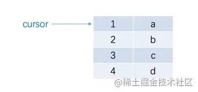

我们可以根据这个游标取出它对应记录的信息，随后再移动游标，让它执向下一条记录。游标既可以用在存储函数中，也可以用在存储过程中，我们下边以存储过程为例来说明游标的使用方式，它的使用大致分成这么四个步骤：
1. 创建游标
2. 打开游标
3. 通过游标访问记录
4. 关闭游标

### 创建游标
在创建游标的时候，需要指定一下与游标关联的查询语句，语法如下：
```sql
DECLARE 游标名称 CURSOR FOR 查询语句;

CREATE PROCEDURE cursor_demo()
BEGIN
    DECLARE t1_record_cursor CURSOR FOR SELECT m1, n1 FROM t1;
END
```
> 小贴士： 如果存储程序中也有声明局部变量的语句，创建游标的语句一定要放在局部变量声明后头。

### 打开和关闭游标
在创建完游标之后，我们需要手动打开和关闭游标，语法也简单：
```sql
OPEN 游标名称;

CLOSE 游标名称;

CREATE PROCEDURE cursor_demo()
BEGIN
    DECLARE t1_record_cursor CURSOR FOR SELECT m1, n1 FROM t1;

    OPEN t1_record_cursor;

    CLOSE t1_record_cursor;
END
```
打开游标意味着执行查询语句，创建一个该查询语句得到的结果集关联起来的游标，关闭游标意味着会释放该游标相关的资源，所以一旦我们使用完了游标，就要把它关闭掉。当然如果我们不显式的使用CLOSE语句关闭游标的话，在该存储过程的END语句执行完之后会自动关闭的。

### 使用游标获取记录
在知道怎么打开和关闭游标之后，我们正式来唠叨一下如何使用游标来获取结果集中的记录，获取记录的语句长这样：
```sql
FETCH 游标名 INTO 变量1, 变量2, ... 变量n

CREATE PROCEDURE cursor_demo()
BEGIN
    DECLARE m_value INT;
    DECLARE n_value CHAR(1);

    DECLARE t1_record_cursor CURSOR FOR SELECT m1, n1 FROM t1;

    OPEN t1_record_cursor;

    FETCH t1_record_cursor INTO m_value, n_value;
    SELECT m_value, n_value;

    CLOSE t1_record_cursor;
END $

mysql> CALL cursor_demo();
+---------+---------+
| m_value | n_value |
+---------+---------+
|       1 | a       |
+---------+---------+
1 row in set (0.00 sec)

Query OK, 0 rows affected (0.00 sec)


CREATE PROCEDURE cursor_demo()
BEGIN
    DECLARE m_value INT;
    DECLARE n_value CHAR(1);
    DECLARE record_count INT;
    DECLARE i INT DEFAULT 0;

    DECLARE t1_record_cursor CURSOR FOR SELECT m1, n1 FROM t1;

    SELECT COUNT(*) FROM t1 INTO record_count;

    OPEN t1_record_cursor;

    WHILE i < record_count DO
        FETCH t1_record_cursor INTO m_value, n_value;
        SELECT m_value, n_value;
        SET i = i + 1;
    END WHILE;

    CLOSE t1_record_cursor;
END

```

### 遍历结束时的执行策略
也可以不用事先获得记录数。其实在FETCH语句获取不到记录的时候会触发一个事件，从而我们可以得知所有的记录都被获取过了，然后我们就可以去主动的停止循环。MySQL中响应这个事件的语句如下：
```sql
DECLARE CONTINUE HANDLER FOR NOT FOUND 处理语句;

CREATE PROCEDURE cursor_demo()
BEGIN
    DECLARE m_value INT;
    DECLARE n_value CHAR(1);
    DECLARE not_done INT DEFAULT 1;

    DECLARE t1_record_cursor CURSOR FOR SELECT m1, n1 FROM t1;

    DECLARE CONTINUE HANDLER FOR NOT FOUND SET not_done = 0;

    OPEN t1_record_cursor;

    flag: LOOP
        FETCH t1_record_cursor INTO m_value, n_value;
        IF not_done = 0 THEN
            LEAVE flag;
        END IF;
        SELECT m_value, n_value, not_done;
    END LOOP flag;

    CLOSE t1_record_cursor;
END
```
not_done变量的值为1时表明遍历结果集的过程还没有结束，当FETCH语句无法获取更多记录时，就会触发一个事件，从而导致MySQL服务器主动调用上边的这个语句将not_done变量的值改为0。

## 触发器和事件
我们前边说过存储程序包括存储例程（存储函数与存储过程）、触发器和事件，其中存储例程是需要我们手动调用的，而触发器和事件是MySQL服务器在特定情况下自动调用的。
### 触发器
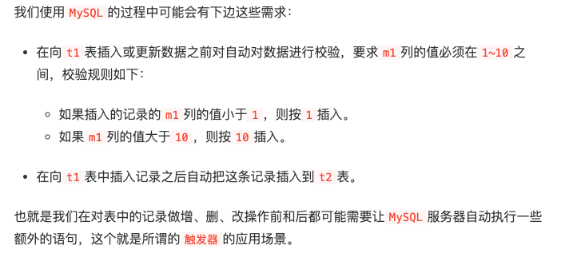
### 创建触发器
```sql
CREATE TRIGGER 触发器名
{BEFORE|AFTER}
{INSERT|DELETE|UPDATE}
ON 表名
FOR EACH ROW
BEGIN
    触发器内容
END
```
> 小贴士：由大括号`{}`包裹并且内部用竖线`|`分隔的语句表示必须在给定的选项中选取一个值，比如`{BEFORE|AFTER}`表示必须在`BEFORE`、`AFTER`这两个之间选取一个。

其中 =={BEFORE|AFTER}== 表示触发器内容执行的时机，它们的含义如下：

=={INSERT|DELETE|UPDATE}== 表示具体的语句，MySQL中目前只支持对==INSERT==、==DELETE==、==UPDATE==这三种类型的语句设置触发器。

FOR EACH ROW BEGIN ... END表示对具体语句影响的每一条记录都执行我们自定义的触发器内容：
- 对于INSERT语句来说，FOR EACH ROW影响的记录就是我们准备插入的那些新记录。
- 对于DELETE语句和UPDATE语句来说，FOR EACH ROW影响的记录就是符合WHERE条件的那些记录（如果语句中没有WHERE条件，那就是代表全部的记录）。
> 小贴士： 如果触发器内容只包含一条语句，那也可以省略BEGN、END这两个词儿。

因为MySQL服务器会对某条语句影响的所有记录依次调用我们自定义的触发器内容，所以针对每一条受影响的记录，我们需要一种访问该记录中的内容的方式，MySQL提供了NEW和OLD两个单词来分别代表新记录和旧记录，它们在不同语句中的含义不同：
- 对于INSERT语句设置的触发器来说，NEW代表准备插入的记录，OLD无效。
- 对于DELETE语句设置的触发器来说，OLD代表删除前的记录，NEW无效。
- 对于UPDATE语句设置的触发器来说，NEW代表修改后的记录，OLD代表修改前的记录。

```sql
mysql> delimiter $
mysql> CREATE TRIGGER bi_t1
    -> BEFORE INSERT ON t1
    -> FOR EACH ROW
    -> BEGIN
    ->     IF NEW.m1 < 1 THEN
    ->         SET NEW.m1 = 1;
    ->     ELSEIF NEW.m1 > 10 THEN
    ->         SET NEW.m1 = 10;
    ->     END IF;
    -> END $
Query OK, 0 rows affected (0.02 sec)

mysql> delimiter ;

mysql> INSERT INTO t1(m1, n1) VALUES(5, 'e'), (100, 'z');
Query OK, 2 rows affected (0.00 sec)
Records: 2  Duplicates: 0  Warnings: 0

mysql> SELECT * FROM t1;
+------+------+
| m1   | n1   |
+------+------+
|    1 | a    |
|    2 | b    |
|    3 | c    |
|    4 | d    |
|    5 | e    |
|   10 | z    |
+------+------+
6 rows in set (0.00 sec)
```
### 查看和删除触发器
```sql
// 查看当前数据库中定义的所有触发器的语句：
SHOW TRIGGERS;

// 查看某个具体的触发器的定义：
SHOW CREATE TRIGGER 触发器名;

// 删除触发器：
DROP TRIGGER 触发器名;

```
### 触发器使用注意事项
- 触发器内容中不能有输出结果集的语句。
- 触发器内容中NEW代表记录的列的值可以被更改，OLD代表记录的列的值无法更改。
- 在BEFORE触发器中，我们可以使用SET NEW.列名 = 某个值的形式来更改待插入记录或者待更新记录的某个列的值，但是这种操作不能在AFTER触发器中使用，因为在执行AFTER触发器的内容时记录已经被插入完成或者更新完成了。
- 如果我们的BEFORE触发器内容执行过程中遇到了错误，那这个触发器对应的具体语句将无法执行；如果具体的操作语句执行过程中遇到了错误，那与它对应的AFTER触发器的内容将无法执行。

### 事件
有时候我们想让MySQL服务器在某个时间点或者每隔一段时间自动地执行一些语句，这时候就需要去创建一个事件。
### 创建事件
```sql
CREATE EVENT 事件名
ON SCHEDULE
{
    AT 某个确定的时间点| 
    EVERY 期望的时间间隔 [STARTS datetime][END datetime]
}
DO
BEGIN
    具体的语句
END
```
事件支持两种类型的自动执行方式：
1. 在某个确定的时间点执行。
```sql
CREATE EVENT insert_t1_event
ON SCHEDULE
AT '2019-09-04 15:48:54'
DO
BEGIN
    INSERT INTO t1(m1, n1) VALUES(6, 'f');
END


CREATE EVENT insert_t1
ON SCHEDULE
AT DATE_ADD(NOW(), INTERVAL 2 DAY)
DO
BEGIN
    INSERT INTO t1(m1, n1) VALUES(6, 'f');
END
```
2. 每隔一段时间执行一次。
```sql
CREATE EVENT insert_t1
ON SCHEDULE
EVERY 1 HOUR
DO
BEGIN
    INSERT INTO t1(m1, n1) VALUES(6, 'f');
END

CREATE EVENT insert_t1
ON SCHEDULE
EVERY 1 HOUR STARTS '2019-09-04 15:48:54' ENDS '2019-09-16 15:48:54'
DO
BEGIN
    INSERT INTO t1(m1, n1) VALUES(6, 'f');
END
```

### 查看和删除事件
```sql
// 查看当前数据库中定义的所有事件的语句：
SHOW EVENTS;

// 查看某个具体的事件的定义：
SHOW CREATE EVENT 事件名;

// 删除事件：
DROP EVENT 事件名;
```

### 事件使用注意事项
默认情况下，MySQL服务器并不会帮助我们执行事件，除非我们使用下边的语句手动开启该功能：
```sql
mysql> SET GLOBAL event_scheduler = ON;
Query OK, 0 rows affected (0.00 sec)
```
小贴士： event_scheduler其实是一个系统变量，它的值也可以在MySQL服务器启动的时候通过启动参数或者通过配置文件来设置event_scheduler的值。