# 消息队列

> **原文归档**：[archive/old-mq-notes/](../archive/old-mq-notes/)
> 包含：RabbitMQ / RocketMQ / Kafka / 部署指南 + 3 个参考 PDF

## 一、核心主题概述

消息队列（Message Queue，MQ）是事件驱动架构中的 **Broker** 角色，用于在服务之间异步传递消息。与同步调用（如 Feign）相比，MQ 将调用方与被调用方解耦：发布者只负责把消息发到 Broker，订阅者只负责从 Broker 取消息处理。

### 1.1 同步 vs 异步通信

| 维度 | 同步调用 | 异步 MQ |
| --- | --- | --- |
| 时效性 | 立即得到响应 | 存在毫秒/秒级延迟 |
| 耦合度 | 高，调用链清晰 | 低，服务可灵活插拔 |
| 吞吐量 | 受限于最慢下游 | 生产者无需等待消费端 |
| 故障传播 | 存在级联失败风险 | 故障隔离，不会级联 |
| 资源占用 | 调用期间线程阻塞 | 按需消费，削峰填谷 |
| 治理难度 | 流程线清晰 | 需要追踪消息链路 |

### 1.2 MQ 通用价值

- **解耦**：发布者与消费者互不相识，可独立扩展。
- **削峰**：突发流量由 Broker 缓冲，消费端按自身能力处理。
- **异步化**：把非核心流程（如发短信、更新缓存）从主链路中剥离。
- **容错**：某个消费端短暂不可用，消息可在队列中保留，恢复后继续消费。

### 1.3 核心概念对照

| 概念 | RabbitMQ | RocketMQ | Kafka |
| --- | --- | --- | --- |
| 消息路由单元 | Exchange + Queue | Topic + MessageQueue | Topic + Partition |
| 消息存储 | Queue 内存/磁盘 | CommitLog + ConsumeQueue | Segment Log |
| 消费组 | — | Consumer Group | Consumer Group |
| 元数据服务 | — | NameServer | ZooKeeper / KRaft |
| 协议 | AMQP | 自定义协议 | 自定义协议 |

## 二、MQ 选型对比

### 2.1 主流 MQ 横向对比

| 特性 | RabbitMQ | RocketMQ | Kafka |
| --- | --- | --- | --- |
| 开发公司/社区 | Rabbit Technologies / Broadcom（VMware Tanzu） | 阿里巴巴 / Apache | Apache |
| 开发语言 | Erlang | Java | Scala / Java |
| 协议支持 | AMQP、XMPP、STOMP、MQTT | 自定义协议 | 自定义协议 |
| 单机吞吐量 | 万级 ~ 十万级 | 十万级 ~ 百万级 | 百万级 |
| 消息延迟 | 微秒级 | 毫秒级 | 毫秒级 |
| 消息可靠性 | 高（持久化 + 确认） | 高（同步/异步刷盘、主从、Raft） | 一般（依赖副本 ISR） |
| 顺序消息 | 队列内有序 | Topic/队列级别有序 | Partition 内有序 |
| 事务消息 | 支持（但较弱） | 原生事务消息 | 支持事务 Producer |
| **延迟消息** | 需插件/死信 | 原生 18 级延迟（5.x 支持任意时间延迟） | 时间轮/外部组件 |
| 适用场景 | 企业集成、任务队列、实时性高 | 电商交易、金融核心、顺序/事务消息 | 日志采集、流处理、大数据 |

### 2.2 选型建议

| 诉求 | 推荐 |
| --- | --- |
| 追求高可靠 + 事务/顺序消息 | RocketMQ |
| 追求极高吞吐 + 流处理 | Kafka |
| 追求低延迟 + 协议生态丰富 | RabbitMQ |
| 中小规模、快速集成 | RabbitMQ / RocketMQ |
| 海量日志、实时数仓 | Kafka |

> 💡 补充：RabbitMQ 的 Erlang 实现使其在路由灵活性和低延迟上表现出色，但集群扩展性不如 Java 系的 RocketMQ/Kafka；Kafka 的强项是高吞吐顺序写磁盘，但在延迟和事务消息上弱于 RocketMQ。

## 三、RabbitMQ

### 3.1 核心角色

- **Publisher**：生产者，发送消息到 Exchange。
- **Consumer**：消费者，从 Queue 订阅消息。
- **Exchange**：交换机，负责按规则把消息路由到 Queue；本身不存储消息。
- **Queue**：消息队列，负责缓存消息。
- **Virtual Host**：虚拟主机，隔离不同租户的 Exchange、Queue 和消息。

### 3.2 交换机类型

| 类型 | 路由规则 | 典型场景 |
| --- | --- | --- |
| **Fanout** | 广播给所有绑定队列 | 消息通知、全量推送 |
| **Direct** | 精确匹配 Routing Key | 按级别/类型分发 |
| **Topic** | 通配符匹配 `*`（1 个词）和 `#`（0 或多个词） | 日志分级、事件总线 |
| Headers | 匹配消息 Header | 较少使用 |

### 3.3 SpringAMQP 快速使用

RabbitMQ 的 Java 客户端较底层，生产环境通常使用 **SpringAMQP**（`spring-boot-starter-amqp`），它会自动：

1. 声明队列、交换机及其绑定关系；
2. 通过 `@RabbitListener` 以注解方式异步接收消息；
3. 封装 `RabbitTemplate` 用于发送消息。

```java
// 发送
rabbitTemplate.convertAndSend("itcast.direct", "red", message);

// 接收
@RabbitListener(bindings = @QueueBinding(
    value = @Queue(name = "direct.queue1"),
    exchange = @Exchange(name = "itcast.direct", type = ExchangeTypes.DIRECT),
    key = {"red", "blue"}
))
public void listenDirectQueue1(String msg) { ... }
```

### 3.4 Work Queue 与 prefetch

多个消费者绑定到同一个队列时，RabbitMQ 默认会把消息**均分**给每个消费者。若消费者处理能力不同，可设置 `prefetch: 1` 实现“能者多劳”：

```yaml
spring:
  rabbitmq:
    listener:
      simple:
        prefetch: 1
```

### 3.5 消息转换器

SpringAMQP 默认使用 JDK 序列化，存在体积大、可读性差、安全漏洞等问题。建议配置 JSON 转换器：

```java
@Bean
public MessageConverter jsonMessageConverter() {
    return new Jackson2JsonMessageConverter();
}
```

> 💡 补充：RabbitMQ 的镜像队列（Quorum Queue / Classic Mirror）和 Publisher Confirm + Consumer ACK 机制，是实现高可用与消息不丢失的关键配置。

## 四、RocketMQ

### 4.1 架构组成

| 组件 | 职责 |
| --- | --- |
| **NameServer** | 轻量级路由注册中心，Broker 注册、心跳、Topic 元数据查询 |
| **Broker** | 真正存储和转发消息的服务节点，分 Master / Slave |
| **Producer** | 消息生产者，从 NameServer 拉取路由后发送消息 |
| **Consumer** | 消息消费者，支持 Push / Pull 两种模式 |
| **MessageQueue** | Topic 的数据分片单元，一个 Topic 可分布在多个 Broker 上 |

### 4.2 NameServer 设计要点

- NameServer 集群间**不互相通信**，每个 Broker 启动时向所有 NameServer 注册。
- Broker 每 **30 秒**发送一次心跳；NameServer 每 **10 秒**扫描 BrokerLiveTable，超过 **120 秒**未心跳则剔除。
- Producer / Consumer 通过长连接主动向 NameServer **拉取**路由信息。

### 4.3 消息存储：CommitLog + ConsumeQueue

- **CommitLog**：所有 Topic 的消息顺序追加写入同一个日志文件，默认 1 GB 一个文件，写满新建。
- **ConsumeQueue**：每个 MessageQueue 对应一组索引文件，每条记录 20 字节（offset + size + tagHash），用于快速定位 CommitLog 中的消息。
- **IndexFile**：根据消息 key 建立索引，支持按 key 查询。
- **刷盘策略**：同步刷盘（SYNC_FLUSH，数据零丢失）/ 异步刷盘（ASYNC_FLUSH，高吞吐）。
- **主从同步**：传统 Master-Slave 采用 Slave 主动 Pull；4.5 以后可用 **DLedger + Raft** 实现自动故障转移。

### 4.4 高可用：DLedger / Raft

DLedger 替换原生 CommitLog 后，一组 Broker 构成多副本：

1. Leader 接收写入，标记为 uncommitted；
2. 同步到多数 Follower 并返回 ack 后，标记为 committed；
3. Leader 宕机时，剩余节点通过 Raft 选举产生新 Leader。

> 💡 补充：DLedger 模式下需要 **(N / 2) + 1** 个节点确认才能提交消息，因此 3 副本可容忍 1 台宕机，5 副本可容忍 2 台宕机。

### 4.5 消费者负载均衡

- 一个 **Consumer Group** 共同消费一个 Topic；每条消息在组内只会被一台机器消费。
- 一个 **MessageQueue 只能被一个 Consumer 消费**，但一个 Consumer 可负责多个 MessageQueue。
- Consumer 扩缩容或宕机会触发 **Rebalance**，重新分配 MessageQueue。

### 4.6 高级特性

| 特性 | 说明 |
| --- | --- |
| **事务消息** | Half 消息 → 本地事务 → commit/rollback；失败时 MQ 回调反查接口，最多 15 次 |
| **延迟消息** | 18 级固定延迟：1s、5s、10s、30s、1m、2m、3m、4m、5m、6m、7m、8m、9m、10m、20m、30m、1h、2h |
| **顺序消息** | 同一业务标识 Hash 到同一个 MessageQueue，Consumer 单线程顺序处理 |
| **消息过滤** | 支持 Tag 过滤和 SQL92 属性过滤 |
| **消息轨迹** | 开启 `traceTopicEnable=true` 记录消息全生命周期 |
| **权限控制** | 通过 `plain_acl.yml` 配置 accessKey/secretKey 与 Topic/Group 权限 |

### 4.7 消息零丢失方案

| 环节 | 方案 |
| --- | --- |
| 生产者发送 | 事务消息 或 同步发送 + 失败重试 |
| Broker 存储 | 同步刷盘 + DLedger/Raft 多副本 |
| 消费者消费 | 业务处理完成后再返回消费成功 / 手动提交 offset |
| 极端故障 | 本地磁盘/数据库兜底，待 MQ 恢复后补偿投递 |

> 💡 补充：零丢失会显著降低吞吐并增加延迟，建议只在资金、交易等核心链路使用；非核心链路可采用异步刷盘 + 失败重试，换取更高性能。

## 五、Kafka

### 5.1 定位演进

Kafka 已从“分布式消息队列”发展为**事件流平台（Event Streaming Platform）**，广泛应用于实时数据管道、流分析、数据集成等场景。

### 5.2 基础架构

| 概念 | 说明 |
| --- | --- |
| **Producer** | 消息生产者 |
| **Consumer** | 消息消费者 |
| **Consumer Group** | 逻辑订阅者，组内消费者并行消费不同 Partition |
| **Broker** | 一台 Kafka 服务器，多个 Broker 组成集群 |
| **Topic** | 消息主题 |
| **Partition** | Topic 的分区，每个分区是一个有序队列 |
| **Replica** | 分区副本，含 1 个 Leader 和若干 Follower |
| **ZooKeeper / KRaft** | 2.8 引入 KRaft（早期访问）；3.3+ 生产可用；4.0 移除 ZK 模式 |

### 5.3 关键设计

- **一个分区只能由 Consumer Group 内的一个消费者消费**，因此分区数决定组内最大并行度。
- 生产者与消费者只与 **Leader** 交互；Follower 异步同步数据。
- 通过 **offset** 记录消费进度，消费者可控制从最早/最新/指定 offset 开始消费。

### 5.4 Kafka 与 RocketMQ 的差异

| 维度 | Kafka | RocketMQ |
| --- | --- | --- |
| 存储模型 | Partition 独立日志 | 全量 CommitLog + 索引 |
| 消费模型 | 拉取为主 | Push（长轮询）/ Pull |
| 事务 | 事务 Producer（跨分区能力有限） | 原生事务消息 |
| 延迟消息 | 不支持原生 | 原生支持 |
| 运维复杂度 | 依赖 ZK/KRaft，Topic/Partition 扩展需 rebalance | NameServer 更轻量 |
| 最佳场景 | 日志、流处理、大数据 | 电商交易、金融核心 |

> 💡 补充：Kafka 3.3+ KRaft 模式已生产可用，4.0 正式移除 ZooKeeper 依赖，降低了部署复杂度并提升了元数据管理性能。

## 六、MQ 高级主题

### 6.1 消息乱序与顺序消息

- **乱序原因**：同一业务的多条消息进入不同队列，被不同机器并行处理。
- **解决思路**：
  1. 按业务键取模，将相关消息路由到同一队列/分区；
  2. 生产端有序投递；
  3. 消费端单线程顺序处理，失败时返回 `SUSPEND_CURRENT_QUEUE_A_MOMENT`，不进入重试队列。

### 6.2 消息积压处理

| 场景 | 处理方案 |
| --- | --- |
| 消费能力不足 | 扩容 Consumer，确保 queue/partition 数 ≥ consumer 数 |
| queue 数固定 | 将消息转发到拥有更多队列的新 Topic，再扩容消费 |
| 消息可丢弃 | 直接丢弃或采样处理，优先恢复链路 |
| 依赖故障 | 先修复依赖，必要时启用死信队列 + 定时补偿 |

### 6.3 延迟消息与定时任务

RocketMQ 原生延迟消息适合“30 分钟后检查订单状态”等场景，避免大量定时扫描数据库。RabbitMQ 可通过死信队列 + TTL 实现，Kafka 通常依赖外部调度或 Kafka Streams 时间窗口。

### 6.4 消息轨迹与可观测

- RocketMQ：开启 traceTopic；
- RabbitMQ： management 插件 + 日志/ tracing 插件；
- Kafka：JMX + Kafka Streams / Confluent Control Center。

### 6.5 性能调优核心

| 层面 | 关键参数/动作 |
| --- | --- |
| OS | `vm.overcommit_memory=1`、`vm.max_map_count` 调大、`vm.swappiness=10`、`ulimit -n` 提高 |
| JVM | G1GC、合理堆内存、GC 日志、大页关闭 |
| Broker | 刷盘策略、线程池数、CommitLog/ConsumeQueue 文件大小、fileReservedTime |
| 客户端 | 批量发送、批量消费、连接池、失败重试与熔断 |

> 💡 补充：压测时应关注 TPS、消息延迟、CPU、内存、GC、磁盘 IO（wa）、网卡流量，找到资源使用与吞吐的平衡点，而非单纯追求极限 TPS。

## 七、2026 年 MQ 生态

### 7.1 技术趋势

| 趋势 | 说明 |
| --- | --- |
| **云原生托管** | 阿里云 RocketMQ、AWS MSK、Confluent Cloud、Google Pub/Sub 等降低自运维成本 |
| **Serverless 事件总线** | EventBridge、SQS、Azure Event Grid 与函数计算深度集成 |
| **KRaft 普及** | Kafka 4.0 已移除 ZooKeeper 依赖，生产环境统一使用 KRaft |
| **Pulsar 兴起** | 存算分离、多租户、统一队列与流，适合超大规模场景 |
| **MQTT over MQ** | IoT 场景下 RabbitMQ/Kafka 的 MQTT 桥接愈发常见 |
| **Exactly-Once 语义完善** | Kafka 事务、RocketMQ 事务、Pulsar Idempotent Producer 成为核心能力 |

### 7.2 选型再思考

- **传统单体/微服务内部通信**：RabbitMQ / RocketMQ 仍是主流。
- **大数据/实时计算/事件溯源**：Kafka 不可替代。
- **金融级高可靠**：RocketMQ 的半消息 + DLedger 方案成熟。
- **多云/超大规模/统一消息平台**：可评估 Pulsar。

> 💡 补充：2026 年国内云厂商的 RocketMQ 5.x 已支持 Proxy 无状态接入、Grpc 协议和多活架构，进一步模糊了消息队列与事件流平台的边界。

## 八、常见坑与补充

### 8.1 设计层面

| 坑点 | 说明 |
| --- | --- |
| 把 MQ 当数据库 | MQ 不适合长期存储海量历史消息，需配合归档/数仓 |
| 过度依赖异步 | 所有链路异步化会提高排查难度，核心同步、非核心异步 |
| 忽略幂等 | 网络超时、重试、Rebalance 都会导致重复消费，Consumer 必须幂等 |
| 错误使用顺序消息 | 顺序消息会牺牲并行度，只在真正需要时使用 |

### 8.2 运维层面

| 坑点 | 说明 |
| --- | --- |
| 磁盘满 | 默认保留时间/空间阈值不足会导致写入失败，需监控 |
| 网络分区 | 脑裂会导致消息重复或短暂不可达，需配置合理的超时与重试 |
| 消费者阻塞 | 单条消息处理耗时过长会拖慢整个消费组，需异步化或拆分 |
| 版本兼容性 | 客户端与 Broker 大版本不一致可能引发协议问题 |

### 8.3 开发层面

| 坑点 | 说明 |
| --- | --- |
| 自动创建 Topic | 线上应关闭 autoCreateTopic，避免路由抖动 |
| 消费异常直接抛错 | 未处理异常会导致无限重试或进入死信队列 |
| 未设置 keys | 缺少 key 会加大消息排查和定位难度 |
| 滥用事务消息 | 事务消息性能较低，仅在需要保证“业务 + 发消息”原子性时使用 |

> 💡 补充：RocketMQ 与 Kafka 的默认文件保留时间分别是 72 小时/48 小时左右，生产环境需根据合规要求与磁盘容量调整；RabbitMQ 的队列长度和 TTL 也应在上线前评估。

---

## 修改记录

| 日期 | 类型 | 说明 |
|---|---|---|
| 2026-07-22 | 订正 | RabbitMQ 归属更新为 Broadcom（VMware Tanzu），原“VMware”已过时 |
| 2026-07-22 | 订正 | RocketMQ 延迟消息补充 5.x 支持任意时间延迟 |
| 2026-07-22 | 订正 | Kafka KRaft 时间线修正：2.8 引入早期访问，3.3+ 生产可用，4.0 移除 ZK |
| 2026-07-22 | 审查 | 全面审查，核心内容完备 |

# 以下为原内容存档

## RabbitMQ.md

# [RabbitMQ](../archive/old-mq-notes/RabbitMQ.md)

# 1.初识MQ

## 1.1.同步和异步通讯

微服务间通讯有同步和异步两种方式：

同步通讯：就像打电话，需要实时响应。

异步通讯：就像发邮件，不需要马上回复。

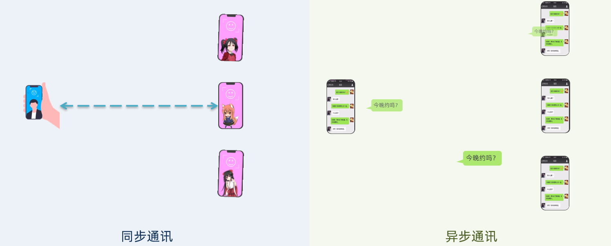

两种方式各有优劣，打电话可以立即得到响应，但是你却不能跟多个人同时通话。发送邮件可以同时与多个人收发邮件，但是往往响应会有延迟。


### 1.1.1.同步通讯

我们之前学习的Feign调用就属于同步方式，虽然调用可以实时得到结果，但存在下面的问题：


总结：

同步调用的优点：

- 时效性较强，可以立即得到结果

同步调用的问题：

- 耦合度高
- 性能和吞吐能力下降
- 有额外的资源消耗
- 有级联失败问题

### 1.1.2.异步通讯

异步调用则可以避免上述问题：

我们以购买商品为例，用户支付后需要调用订单服务完成订单状态修改，调用物流服务，从仓库分配响应的库存并准备发货。

在事件模式中，支付服务是事件发布者（publisher），在支付完成后只需要发布一个支付成功的事件（event），事件中带上订单id。

订单服务和物流服务是事件订阅者（Consumer），订阅支付成功的事件，监听到事件后完成自己业务即可。

为了解除事件发布者与订阅者之间的耦合，两者并不是直接通信，而是有一个中间人（Broker）。发布者发布事件到Broker，不关心谁来订阅事件。订阅者从Broker订阅事件，不关心谁发来的消息。


Broker 是一个像数据总线一样的东西，所有的服务要接收数据和发送数据都发到这个总线上，这个总线就像协议一样，让服务间的通讯变得标准和可控。


好处：

- 吞吐量提升：无需等待订阅者处理完成，响应更快速

- 故障隔离：服务没有直接调用，不存在级联失败问题
- 调用间没有阻塞，不会造成无效的资源占用
- 耦合度极低，每个服务都可以灵活插拔，可替换
- 流量削峰：不管发布事件的流量波动多大，都由Broker接收，订阅者可以按照自己的速度去处理事件


缺点：

- 架构复杂了，业务没有明显的流程线，不好管理
- 需要依赖于Broker的可靠、安全、性能

好在现在开源软件或云平台上 Broker 的软件是非常成熟的，比较常见的一种就是我们今天要学习的MQ技术。

## 1.2.技术对比：

MQ，中文是消息队列（MessageQueue），字面来看就是存放消息的队列。也就是事件驱动架构中的Broker。

比较常见的MQ实现：

- ActiveMQ
- RabbitMQ
- RocketMQ
- Kafka

几种常见MQ的对比：

|            | **RabbitMQ**            | **ActiveMQ**                   | **RocketMQ** | **Kafka**  |
| ---------- | ----------------------- | ------------------------------ | ------------ | ---------- |
| 公司/社区  | Rabbit                  | Apache                         | 阿里         | Apache     |
| 开发语言   | Erlang                  | Java                           | Java         | Scala&Java |
| 协议支持   | AMQP，XMPP，SMTP，STOMP | OpenWire,STOMP，REST,XMPP,AMQP | 自定义协议   | 自定义协议 |
| 可用性     | 高                      | 一般                           | 高           | 高         |
| 单机吞吐量 | 一般                    | 差                             | 高           | 非常高     |
| 消息延迟   | 微秒级                  | 毫秒级                         | 毫秒级       | 毫秒以内   |
| 消息可靠性 | 高                      | 一般                           | 高           | 一般       |

追求可用性：Kafka、 RocketMQ 、RabbitMQ

追求可靠性：RabbitMQ、RocketMQ

追求吞吐能力：RocketMQ、Kafka

追求消息低延迟：RabbitMQ、Kafka


# 2.快速入门

## 2.1.安装RabbitMQ

安装RabbitMQ，参考资料：

[RabbitMQ部署指南](../archive/old-mq-notes/RabbitMQ部署指南.md)

MQ的基本结构：

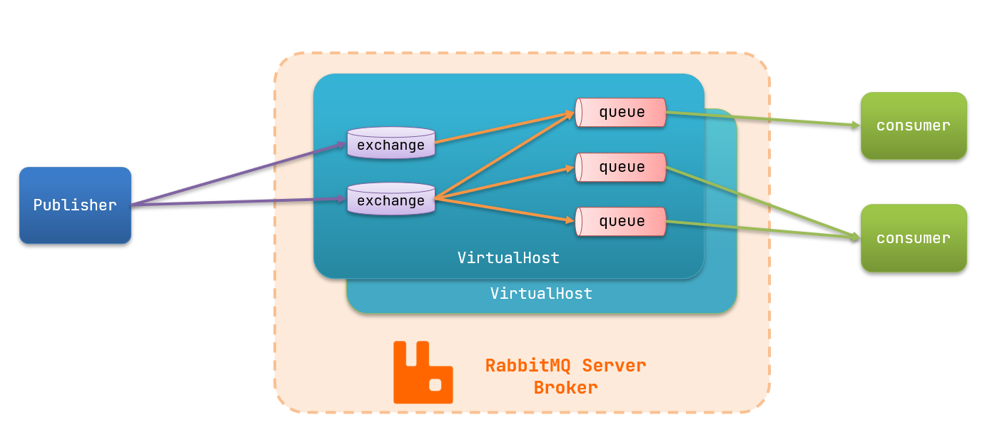

RabbitMQ中的一些角色：

- publisher：生产者
- consumer：消费者
- exchange：交换机，负责消息路由
- queue：队列，存储消息
- virtualHost：虚拟主机，隔离不同租户的exchange、queue、消息的隔离（可以给不同的租户设置不同的虚拟主机，会产生隔离效果）


## 2.2.RabbitMQ消息模型

RabbitMQ官方提供了5个不同的Demo示例，对应了不同的消息模型：

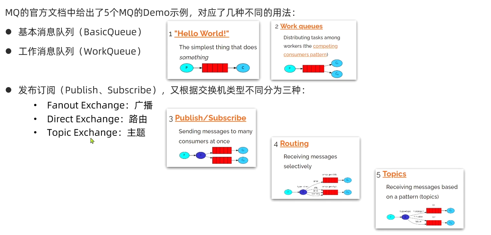


## 2.3.导入Demo工程

可以看到结构如下：

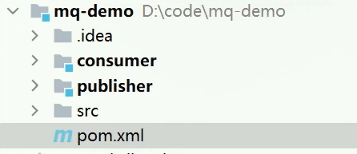

包括三部分：

- mq-demo：父工程，管理项目依赖
- publisher：消息的发送者
- consumer：消息的消费者

## 2.4.入门案例

简单队列模式的模型图：

 

官方的HelloWorld是基于最基础的消息队列模型来实现的，只包括三个角色：

- publisher：消息发布者，将消息发送到队列queue
- queue：消息队列，负责接受并缓存消息
- consumer：订阅队列，处理队列中的消息

### 2.4.1.publisher实现

思路：

- 建立连接
- 创建Channel
- 声明队列
- 发送消息
- 关闭连接和channel

代码实现：

```java
package cn.itcast.mq.helloworld;

import com.rabbitmq.client.Channel;
import com.rabbitmq.client.Connection;
import com.rabbitmq.client.ConnectionFactory;
import org.junit.Test;

import java.io.IOException;
import java.util.concurrent.TimeoutException;

public class PublisherTest {
    @Test
    public void testSendMessage() throws IOException, TimeoutException {
        // 1.建立连接
        ConnectionFactory factory = new ConnectionFactory();
        // 1.1.设置连接参数，分别是：主机名、端口号、vhost、用户名、密码
        factory.setHost("192.168.150.101");
        factory.setPort(5672);
        factory.setVirtualHost("/");
        factory.setUsername("itcast");
        factory.setPassword("123321");
        // 1.2.建立连接
        Connection connection = factory.newConnection();

        // 2.创建通道Channel
        Channel channel = connection.createChannel();

        // 3.创建队列
        String queueName = "simple.queue";
        channel.queueDeclare(queueName, false, false, false, null);

        // 4.发送消息
        String message = "hello, rabbitmq!";
        channel.basicPublish("", queueName, null, message.getBytes());
        System.out.println("发送消息成功：【" + message + "】");

        // 5.关闭通道和连接
        channel.close();
        connection.close();

    }
}
```

### 2.4.2.consumer实现

代码思路：

- 建立连接
- 创建Channel
- 声明队列
- 订阅消息


代码实现：

```java
package cn.itcast.mq.helloworld;

import com.rabbitmq.client.*;

import java.io.IOException;
import java.util.concurrent.TimeoutException;

public class ConsumerTest {

    public static void main(String[] args) throws IOException, TimeoutException {
        // 1.建立连接
        ConnectionFactory factory = new ConnectionFactory();
        // 1.1.设置连接参数，分别是：主机名、端口号、vhost、用户名、密码
        factory.setHost("192.168.150.101");
        factory.setPort(5672);
        factory.setVirtualHost("/");
        factory.setUsername("itcast");
        factory.setPassword("123321");
        // 1.2.建立连接
        Connection connection = factory.newConnection();

        // 2.创建通道Channel
        Channel channel = connection.createChannel();

        // 3.创建队列
        String queueName = "simple.queue";
        channel.queueDeclare(queueName, false, false, false, null);

        // 4.订阅消息
        channel.basicConsume(queueName, true, new DefaultConsumer(channel){
            @Override
            public void handleDelivery(String consumerTag, Envelope envelope,
                                       AMQP.BasicProperties properties, byte[] body) throws IOException {
                // 5.处理消息
                String message = new String(body);
                System.out.println("接收到消息：【" + message + "】");
            }
        });
        System.out.println("等待接收消息。。。。");
    }
}
```


## 2.5.总结

基本消息队列的消息发送流程：

1. 建立connection

2. 创建channel

3. 利用channel声明队列

4. 利用channel向队列发送消息

基本消息队列的消息接收流程：

1. 建立connection

2. 创建channel

3. 利用channel声明队列

4. 定义consumer的消费行为handleDelivery()

5. 利用channel将消费者与队列绑定


# 3.SpringAMQP

SpringAMQP是基于RabbitMQ封装的一套模板，并且还利用SpringBoot对其实现了自动装配，使用起来非常方便。

SpringAmqp的官方地址：https://spring.io/projects/spring-amqp

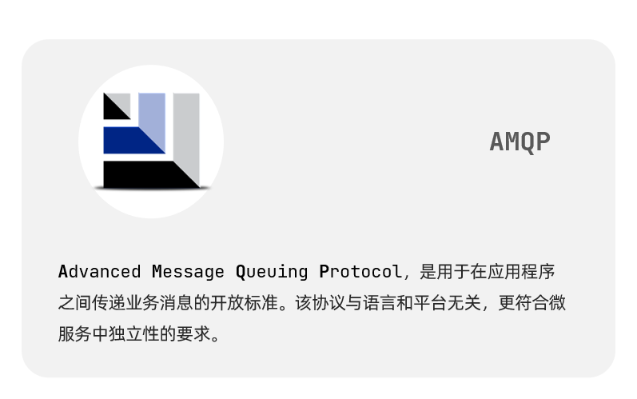

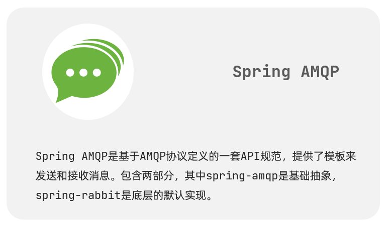

SpringAMQP提供了三个功能：

- 自动声明队列、交换机及其绑定关系
- 基于注解的监听器模式，异步接收消息
- 封装了RabbitTemplate工具，用于发送消息

## 3.1.Basic Queue 简单队列模型

在父工程mq-demo中引入依赖

```xml
<!--AMQP依赖，包含RabbitMQ-->
<dependency>
    <groupId>org.springframework.boot</groupId>
    <artifactId>spring-boot-starter-amqp</artifactId>
</dependency>
```


### 3.1.1.消息发送

首先配置MQ地址，在publisher服务的application.yml中添加配置：

```yaml
spring:
  rabbitmq:
    host: 192.168.150.101 # 主机名
    port: 5672 # 端口
    virtual-host: / # 虚拟主机
    username: itcast # 用户名
    password: 123321 # 密码
```


然后在publisher服务中编写测试类SpringAmqpTest，并利用RabbitTemplate实现消息发送：

```java
package cn.itcast.mq.spring;

import org.junit.Test;
import org.junit.runner.RunWith;
import org.springframework.amqp.rabbit.core.RabbitTemplate;
import org.springframework.beans.factory.annotation.Autowired;
import org.springframework.boot.test.context.SpringBootTest;
import org.springframework.test.context.junit4.SpringRunner;

@RunWith(SpringRunner.class)
@SpringBootTest
public class SpringAmqpTest {

    @Autowired
    private RabbitTemplate rabbitTemplate;

    @Test
    public void testSimpleQueue() {
        // 队列名称
        String queueName = "simple.queue";
        // 消息
        String message = "hello, spring amqp!";
        // 发送消息
        rabbitTemplate.convertAndSend(queueName, message);
    }
}
```

### 3.1.2.消息接收

首先配置MQ地址，在consumer服务的application.yml中添加配置：

```yaml
spring:
  rabbitmq:
    host: 192.168.150.101 # 主机名
    port: 5672 # 端口
    virtual-host: / # 虚拟主机
    username: itcast # 用户名
    password: 123321 # 密码
```

然后在consumer服务的`cn.itcast.mq.listener`包中新建一个类SpringRabbitListener，代码如下：

```java
package cn.itcast.mq.listener;

import org.springframework.amqp.rabbit.annotation.RabbitListener;
import org.springframework.stereotype.Component;

@Component
public class SpringRabbitListener {

    @RabbitListener(queues = "simple.queue")
    public void listenSimpleQueueMessage(String msg) throws InterruptedException {
        System.out.println("spring 消费者接收到消息：【" + msg + "】");
    }
}
```

### 3.1.3.测试

启动consumer服务，然后在publisher服务中运行测试代码，发送MQ消息

## 3.2.WorkQueue

Work queues，也被称为（Task queues），任务模型。简单来说就是**让多个消费者绑定到一个队列，共同消费队列中的消息**。


当消息处理比较耗时的时候，可能生产消息的速度会远远大于消息的消费速度。长此以往，消息就会堆积越来越多，无法及时处理。

此时就可以使用work 模型，多个消费者共同处理消息处理，速度就能大大提高了。


### 3.2.1.消息发送

这次我们循环发送，模拟大量消息堆积现象。

在publisher服务中的SpringAmqpTest类中添加一个测试方法：

```java
/**
     * workQueue
     * 向队列中不停发送消息，模拟消息堆积。
     */
@Test
public void testWorkQueue() throws InterruptedException {
    // 队列名称
    String queueName = "simple.queue";
    // 消息
    String message = "hello, message_";
    for (int i = 0; i < 50; i++) {
        // 发送消息
        rabbitTemplate.convertAndSend(queueName, message + i);
        Thread.sleep(20);
    }
}
```

### 3.2.2.消息接收

要模拟多个消费者绑定同一个队列，我们在consumer服务的SpringRabbitListener中添加2个新的方法：

```java
@RabbitListener(queues = "simple.queue")
public void listenWorkQueue1(String msg) throws InterruptedException {
    System.out.println("消费者1接收到消息：【" + msg + "】" + LocalTime.now());
    Thread.sleep(20);
}

@RabbitListener(queues = "simple.queue")
public void listenWorkQueue2(String msg) throws InterruptedException {
    System.err.println("消费者2........接收到消息：【" + msg + "】" + LocalTime.now());
    Thread.sleep(200);
}
```

注意到这个消费者sleep了1000秒，模拟任务耗时。

### 3.2.3.测试

启动ConsumerApplication后，在执行publisher服务中刚刚编写的发送测试方法testWorkQueue。

可以看到消费者1很快完成了自己的25条消息。消费者2却在缓慢的处理自己的25条消息。

也就是说消息是平均分配给每个消费者，并没有考虑到消费者的处理能力。这样显然是有问题的。这个就是**预取，预先取走了一半，可以配置设置预取的个数。**

### 3.2.4.能者多劳

在spring中有一个简单的配置，可以解决这个问题。我们修改consumer服务的application.yml文件，添加配置：

```yaml
spring:
  rabbitmq:
    listener:
      simple:
        prefetch: 1 # 每次只能获取一条消息，处理完成才能获取下一个消息
```


### 3.2.5.总结

Work模型的使用：

- 多个消费者绑定到一个队列，同一条消息只会被一个消费者处理
- 通过设置prefetch来控制消费者预取的消息数量


## 3.3.发布/订阅

发布订阅的模型如图：


可以看到，在订阅模型中，多了一个exchange角色，而且过程略有变化：

- Publisher：生产者，也就是要发送消息的程序，但是不再发送到队列中，而是发给X（交换机）
- Exchange：交换机，图中的X。一方面，接收生产者发送的消息。另一方面，知道如何处理消息，例如递交给某个特别队列、递交给所有队列、或是将消息丢弃。到底如何操作，取决于Exchange的类型。Exchange有以下3种类型：
  - Fanout：广播，将消息交给所有绑定到交换机的队列
  - Direct：定向，把消息交给符合指定routing key 的队列
  - Topic：通配符，把消息交给符合routing pattern（路由模式） 的队列
- Consumer：消费者，与以前一样，订阅队列，没有变化
- Queue：消息队列也与以前一样，接收消息、缓存消息。


**Exchange（交换机）只负责转发消息，不具备存储消息的能力**，因此如果没有任何队列与Exchange绑定，或者没有符合路由规则的队列，那么消息会丢失！


## 3.4.Fanout

Fanout，英文翻译是扇出，我觉得在MQ中叫广播更合适。

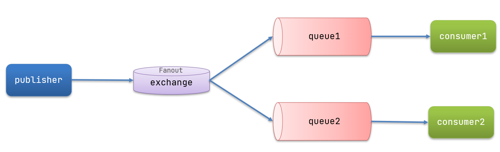

在广播模式下，消息发送流程是这样的：

- 1）  可以有多个队列
- 2）  每个队列都要绑定到Exchange（交换机）
- 3）  生产者发送的消息，只能发送到交换机，交换机来决定要发给哪个队列，生产者无法决定
- 4）  交换机把消息发送给绑定过的所有队列
- 5）  订阅队列的消费者都能拿到消息


我们的计划是这样的：

- 创建一个交换机 itcast.fanout，类型是Fanout
- 创建两个队列fanout.queue1和fanout.queue2，绑定到交换机itcast.fanout

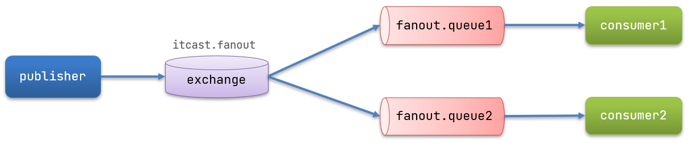


### 3.4.1.声明队列和交换机

Spring提供了一个接口Exchange，来表示所有不同类型的交换机：

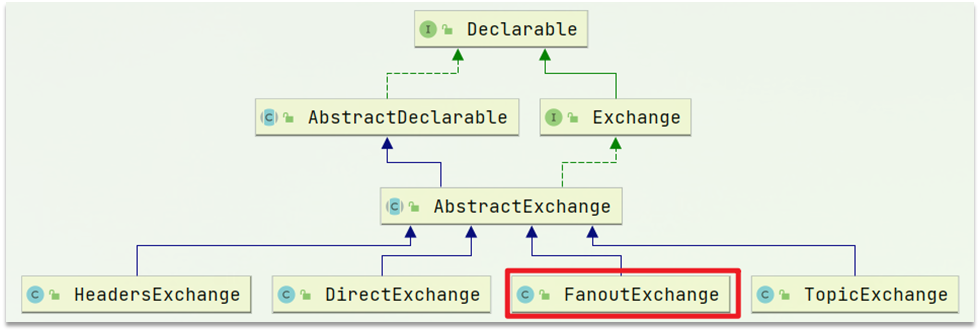


在consumer中创建一个类，声明队列和交换机：

```java
package cn.itcast.mq.config;

import org.springframework.amqp.core.Binding;
import org.springframework.amqp.core.BindingBuilder;
import org.springframework.amqp.core.FanoutExchange;
import org.springframework.amqp.core.Queue;
import org.springframework.context.annotation.Bean;
import org.springframework.context.annotation.Configuration;

@Configuration
public class FanoutConfig {
    /**
     * 声明交换机
     * @return Fanout类型交换机
     */
    @Bean
    public FanoutExchange fanoutExchange(){
        return new FanoutExchange("itcast.fanout");
    }

    /**
     * 第1个队列
     */
    @Bean
    public Queue fanoutQueue1(){
        return new Queue("fanout.queue1");
    }

    /**
     * 绑定队列和交换机
     */
    @Bean
    public Binding bindingQueue1(Queue fanoutQueue1, FanoutExchange fanoutExchange){
        return BindingBuilder.bind(fanoutQueue1).to(fanoutExchange);
    }

    /**
     * 第2个队列
     */
    @Bean
    public Queue fanoutQueue2(){
        return new Queue("fanout.queue2");
    }

    /**
     * 绑定队列和交换机
     */
    @Bean
    public Binding bindingQueue2(Queue fanoutQueue2, FanoutExchange fanoutExchange){
        return BindingBuilder.bind(fanoutQueue2).to(fanoutExchange);
    }
}
```

### 3.4.2.消息发送

在publisher服务的SpringAmqpTest类中添加测试方法：

```java
@Test
public void testFanoutExchange() {
    // 队列名称
    String exchangeName = "itcast.fanout";
    // 消息
    String message = "hello, everyone!";
    rabbitTemplate.convertAndSend(exchangeName, "", message);
}
```

### 3.4.3.消息接收

在consumer服务的SpringRabbitListener中添加两个方法，作为消费者：

```java
@RabbitListener(queues = "fanout.queue1")
public void listenFanoutQueue1(String msg) {
    System.out.println("消费者1接收到Fanout消息：【" + msg + "】");
}

@RabbitListener(queues = "fanout.queue2")
public void listenFanoutQueue2(String msg) {
    System.out.println("消费者2接收到Fanout消息：【" + msg + "】");
}
```

### 3.4.4.总结

交换机的作用是什么？

- 接收publisher发送的消息
- 将消息按照规则路由到与之绑定的队列
- 不能缓存消息，路由失败，消息丢失
- FanoutExchange的会将消息路由到每个绑定的队列

声明队列、交换机、绑定关系的Bean是什么？

- Queue
- FanoutExchange
- Binding


## 3.5.Direct

在Fanout模式中，一条消息，会被所有订阅的队列都消费。但是，在某些场景下，我们希望不同的消息被不同的队列消费。这时就要用到Direct类型的Exchange。


 在Direct模型下：

- 队列与交换机的绑定，不能是任意绑定了，而是要指定一个`RoutingKey`（路由key）
- 消息的发送方在 向 Exchange发送消息时，也必须指定消息的 `RoutingKey`。
- Exchange不再把消息交给每一个绑定的队列，而是根据消息的`Routing Key`进行判断，只有队列的`Routingkey`与消息的 `Routing key`完全一致，才会接收到消息


**案例需求如下**：

1. 利用@RabbitListener声明Exchange、Queue、RoutingKey

2. 在consumer服务中，编写两个消费者方法，分别监听direct.queue1和direct.queue2

3. 在publisher中编写测试方法，向itcast. direct发送消息

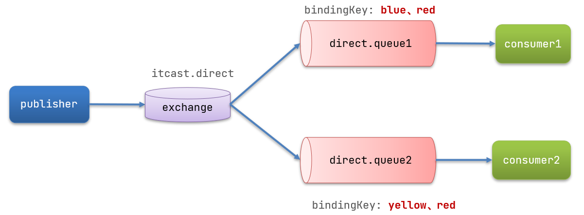


### 3.5.1.基于注解声明队列和交换机

基于@Bean的方式声明队列和交换机比较麻烦，Spring还提供了基于注解方式来声明。

在consumer的SpringRabbitListener中添加两个消费者，同时基于注解来声明队列和交换机：

```java
@RabbitListener(bindings = @QueueBinding(
    value = @Queue(name = "direct.queue1"),
    exchange = @Exchange(name = "itcast.direct", type = ExchangeTypes.DIRECT),
    key = {"red", "blue"}
))
public void listenDirectQueue1(String msg){
    System.out.println("消费者接收到direct.queue1的消息：【" + msg + "】");
}

@RabbitListener(bindings = @QueueBinding(
    value = @Queue(name = "direct.queue2"),
    exchange = @Exchange(name = "itcast.direct", type = ExchangeTypes.DIRECT),
    key = {"red", "yellow"}
))
public void listenDirectQueue2(String msg){
    System.out.println("消费者接收到direct.queue2的消息：【" + msg + "】");
}
```

### 3.5.2.消息发送

在publisher服务的SpringAmqpTest类中添加测试方法：

```java
@Test
public void testSendDirectExchange() {
    // 交换机名称
    String exchangeName = "itcast.direct";
    // 消息
    String message = "红色警报！日本乱排核废水，导致海洋生物变异，惊现哥斯拉！";
    // 发送消息
    rabbitTemplate.convertAndSend(exchangeName, "red", message);
}
```

### 3.5.3.总结

描述下Direct交换机与Fanout交换机的差异？

- Fanout交换机将消息路由给每一个与之绑定的队列
- Direct交换机根据RoutingKey判断路由给哪个队列
- 如果多个队列具有相同的RoutingKey，则与Fanout功能类似

基于@RabbitListener注解声明队列和交换机有哪些常见注解？

- @Queue
- @Exchange

## 3.6.Topic
### 3.6.1.说明

`Topic`类型的`Exchange`与`Direct`相比，都是可以根据`RoutingKey`把消息路由到不同的队列。只不过`Topic`类型`Exchange`可以让队列在绑定`Routing key` 的时候使用通配符！

`Routingkey` 一般都是有一个或多个单词组成，多个单词之间以”.”分割，例如： `item.insert`

 通配符规则：

`#`：匹配一个或多个词

`*`：匹配不多不少恰好1个词

举例：

`item.#`：能够匹配`item.spu.insert` 或者 `item.spu`

`item.*`：只能匹配`item.spu`

图示：

 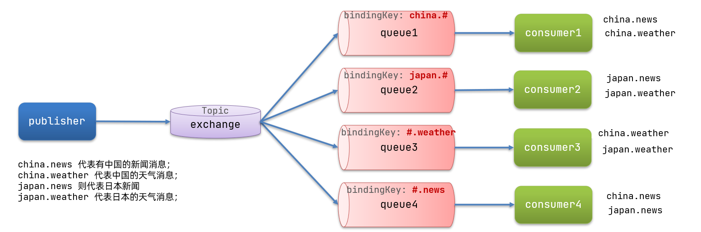

解释：

- Queue1：绑定的是`china.#` ，因此凡是以 `china.`开头的`routing key` 都会被匹配到。包括china.news和china.weather
- Queue2：绑定的是`#.news` ，因此凡是以 `.news`结尾的 `routing key` 都会被匹配。包括china.news和japan.news

案例需求：

实现思路如下：

1. 并利用@RabbitListener声明Exchange、Queue、RoutingKey

2. 在consumer服务中，编写两个消费者方法，分别监听topic.queue1和topic.queue2

3. 在publisher中编写测试方法，向itcast. topic发送消息


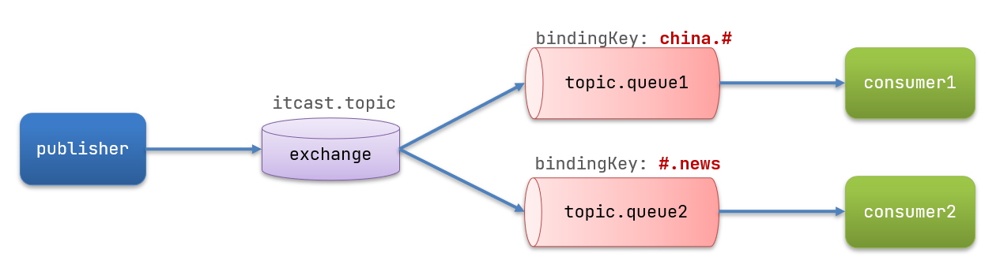


### 3.6.2.消息发送

在publisher服务的SpringAmqpTest类中添加测试方法：

```java
/**
 * topicExchange
 */
@Test
public void testSendTopicExchange() {
    // 交换机名称
    String exchangeName = "itcast.topic";
    // 消息
    String message = "喜报！孙悟空大战哥斯拉，胜!";
    // 发送消息
    rabbitTemplate.convertAndSend(exchangeName, "china.news", message);
}
```


### 3.6.3.消息接收

在consumer服务的SpringRabbitListener中添加方法：

```java
@RabbitListener(bindings = @QueueBinding(
    value = @Queue(name = "topic.queue1"),
    exchange = @Exchange(name = "itcast.topic", type = ExchangeTypes.TOPIC),
    key = "china.#"
))
public void listenTopicQueue1(String msg){
    System.out.println("消费者接收到topic.queue1的消息：【" + msg + "】");
}

@RabbitListener(bindings = @QueueBinding(
    value = @Queue(name = "topic.queue2"),
    exchange = @Exchange(name = "itcast.topic", type = ExchangeTypes.TOPIC),
    key = "#.news"
))
public void listenTopicQueue2(String msg){
    System.out.println("消费者接收到topic.queue2的消息：【" + msg + "】");
}
```

### 3.6.4.总结

描述下Direct交换机与Topic交换机的差异？

- Topic交换机接收的消息RoutingKey必须是多个单词，以 `**.**` 分割
- Topic交换机与队列绑定时的bindingKey可以指定通配符
- `#`：代表0个或多个词
- `*`：代表1个词


## 3.7.消息转换器

之前说过，Spring会把你发送的消息序列化为字节发送给MQ，接收消息的时候，还会把字节反序列化为Java对象。

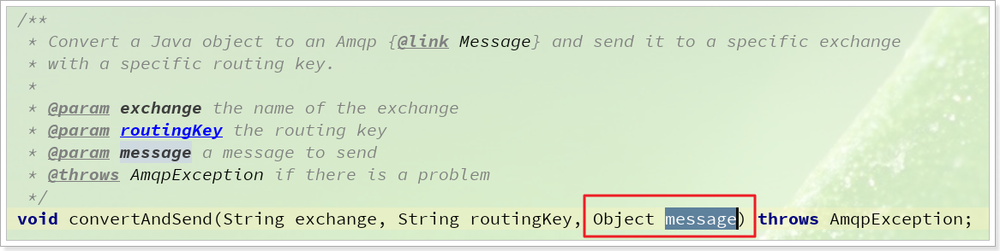

只不过，默认情况下Spring采用的序列化方式是JDK序列化。众所周知，JDK序列化存在下列问题：

- 数据体积过大
- 有安全漏洞
- 可读性差


### 3.7.1.测试默认转换器

我们修改消息发送的代码，发送一个Map对象：

```java
@Test
public void testSendMap() throws InterruptedException {
    // 准备消息
    Map<String,Object> msg = new HashMap<>();
    msg.put("name", "Jack");
    msg.put("age", 21);
    // 发送消息
    rabbitTemplate.convertAndSend("simple.queue","", msg);
}
```

停止consumer服务

发送消息后查看控制台：

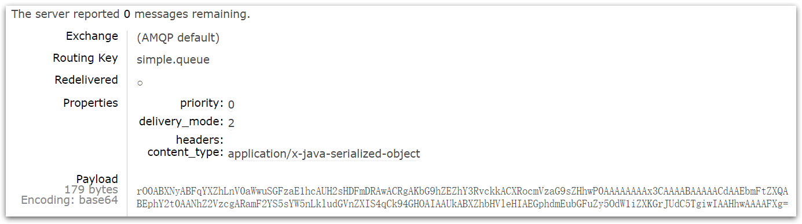


### 3.7.2.配置JSON转换器

显然，JDK序列化方式并不合适。我们希望消息体的体积更小、可读性更高，因此可以使用JSON方式来做序列化和反序列化。

在publisher和consumer两个服务中都引入依赖：

```xml
<dependency>
    <groupId>com.fasterxml.jackson.dataformat</groupId>
    <artifactId>jackson-dataformat-xml</artifactId>
    <version>2.9.10</version>
</dependency>
```

配置消息转换器。

在启动类中添加一个Bean即可：

```java
@Bean
public MessageConverter jsonMessageConverter(){
    return new Jackson2JsonMessageConverter();
}
```


## RabbitMQ部署指南.md

# RabbitMQ部署指南

# 1.单机部署

我们在Centos7虚拟机中使用Docker来安装。

## 1.1.下载镜像

方式一：在线拉取

``` sh
docker pull rabbitmq:3.8-management
```


## 1.2.安装MQ

执行下面的命令来运行MQ容器：

```sh
docker run \
 -e RABBITMQ_DEFAULT_USER=itcast \
 -e RABBITMQ_DEFAULT_PASS=123321 \
 -v mq-plugins:/plugins \
 --name mq \
 --hostname mq \
 -p 15672:15672 \
 -p 5672:5672 \
 -d \
 rabbitmq:3.8-management
```


## RocketMQ源码分析.md

# 1. RocketMQ源码

## 1.1 源码目录介绍
- **broker**：顾名思义，这个里面存放的就是RocketMQ的Broker相关的代码，这里的代码可以用来启动Broker进程
- **client**：顾名思义，这个里面就是RocketMQ的Producer、Consumer这些客户端的代码，生产消息、消费消息的代码都在里面
- **common**：这里放的是一些公共的代码
- **dev**：这里放的是开发相关的一些信息
- **distribution**：这里放的就是用来部署RocketMQ的一些东西，比如bin目录 ，conf目录，等等
- **example**：这里放的是RocketMQ的一些例子
- **filter**：这里放的是RocketMQ的一些过滤器的东西
- **logappender和logging**：这里放的是RocketMQ的日志打印相关的东西
- **namesvr**：这里放的就是NameServer的源码
- **openmessaging**：这是开放消息标准，这个可以先忽略
- **remoting**：这个很重要，这里放的是RocketMQ的远程网络通信模块的代码，基于netty实现的
- **srvutil**：这里放的是一些工具类
- **store**：这个也很重要，这里放的是消息在Broker上进行存储相关的一些源码
- **style、test、tools**：这里放的是checkstyle代码检查的东西，一些测试相关的类，还有就是tools里放的一些命令行监控工具类

## 1.2 Intellij IDEA中启动NameServer


[在Intellij IDEA中启动NameServer.pdf](../archive/old-mq-notes/笔记引用/在Intellij%20IDEA中启动NameServer.pdf)

## 1.3 在Intellij IDEA中启动Broker

[在Intellij IDEA中启动Broker.pdf](../archive/old-mq-notes/笔记引用/在Intellij%20IDEA中启动Broker.pdf)

## 1.4 可视化rocketmq-dashboard

https://github.com/apache/rocketmq-dashboard

## 1.5 源码分析-NameServer的启动

### 1.5.1 NameServer脚本的启动

首先看启动脚本 mqnamesrv
```shell
# 在最后调用
sh ${ROCKETMQ_HOME}/bin/runserver.sh org.apache.rocketmq.namesrv.NamesrvStartup $@
```

然后看最后命令行中调用runserver.sh
```shell
JAVA_OPT="${JAVA_OPT} -server -Xms4g -Xmx4g -Xmn2g -XX:MetaspaceSize=128m -XX:MaxMetaspaceSize=320m"JAVA_OPT="${JAVA_OPT} -XX:+UseConcMarkSweepGC -XX:+UseCMSCompactAtFullCollection -XX:CMSInitiatingOccupancyFraction=70 -XX:+CMSParallelRemarkEnabled -XX:SoftRefLRUPolicyMSPerMB=0 -XX:+CMSClassUnloadingEnabled -XX:SurvivorRatio=8  -XX:-UseParNewGC"JAVA_OPT="${JAVA_OPT} -verbose:gc -Xloggc:${GC_LOG_DIR}/rmq_srv_gc_%p_%t.log -XX:+PrintGCDetails"
JAVA_OPT="${JAVA_OPT} -XX:+UseGCLogFileRotation -XX:NumberOfGCLogFiles=5 -XX:GCLogFileSize=30m"JAVA_OPT="${JAVA_OPT} -XX:-OmitStackTraceInFastThrow"JAVA_OPT="${JAVA_OPT} -XX:-UseLargePages"JAVA_OPT="${JAVA_OPT} -Djava.ext.dirs=${JAVA_HOME}/jre/lib/ext:${BASE_DIR}/lib"
#JAVA_OPT="${JAVA_OPT} -Xdebug -Xrunjdwp:transport=dt_socket,address=9555,server=y,suspend=n"
JAVA_OPT="${JAVA_OPT} ${JAVA_OPT_EXT}"
JAVA_OPT="${JAVA_OPT} -cp ${CLASSPATH}"

$JAVA ${JAVA_OPT} $@
```

大致可以简化成：

java -server -Xms4g -Xmx4g -Xmn2g org.apache.rocketmq.namesrv.NamesrvStartup

本质就是基于java命令启动了一个JVM进程，执行NamesrvStartup类中的main()方法，完成NameServer启动的全部流程和逻辑，同时启动NameServer这个JVM进程的时候，有一大堆的默认JVM参数，你当然可以在这里修改这些JVM参数，甚至进行优化。


### 1.5.2 NameServer启动时解析配置信息和Netty服务器启动

#### 1.5.2.1 NamesrvController组件
- NameServer中的核心组件 用来接受网络请求
```java
public static void main(String[] args) {
    main0(args);
}

public static NamesrvController main0(String[] args) {

    try {
        // NameServer中的核心组件 用来接受网络请求
        NamesrvController controller = createNamesrvController(args);
        start(controller);
        String tip = "The Name Server boot success. serializeType=" + RemotingCommand.getSerializeTypeConfigInThisServer();
        log.info(tip);
        System.out.printf("%s%n", tip);
        return controller;
    } catch (Throwable e) {
        e.printStackTrace();
        System.exit(-1);
    }

    return null;
}
```


- 创建 NamesrvController 的源码

```java
public static NamesrvController createNamesrvController(String[] args) throws IOException, JoranException {
    // 解析Commandline命令行参数，不重要

	// 初始化nameserver配置和netty配置，以及设置端口
    final NamesrvConfig namesrvConfig = new NamesrvConfig();
    final NettyServerConfig nettyServerConfig = new NettyServerConfig();
    nettyServerConfig.setListenPort(9876);
    ...
}
```


- NamesrvConfig和NettyServerConfig两个核心类的内容
```java
public class NamesrvConfig {
    private static final InternalLogger log = InternalLoggerFactory.getLogger(LoggerName.NAMESRV_LOGGER_NAME);

    // 获取RocketMQ的home目录，获取环境变量中的ROCKETMQ_HOME_ENV
    private String rocketmqHome = System.getProperty(MixAll.ROCKETMQ_HOME_PROPERTY, System.getenv(MixAll.ROCKETMQ_HOME_ENV));
    // NameServer存放kv配置属性的路径
    private String kvConfigPath = System.getProperty("user.home") + File.separator + "namesrv" + File.separator + "kvConfig.json";
    // NameServer自己的配置存储路径
    private String configStorePath = System.getProperty("user.home") + File.separator + "namesrv" + File.separator + "namesrv.properties";
    // 生产环境的名称，他是默认的center
    private String productEnvName = "center";
    // 是否启动了clusterTest测试集群，默认是false
    private boolean clusterTest = false;
    // 是否支持有序消息，默认就是false,不支持的
    private boolean orderMessageEnable = false;
}

public class NettyServerConfig implements Cloneable {
    // NettyServer默认的监听端口号，是8888，在代码里设置成9876了
    private int listenPort = 8888;
    // Netty工作线程的数量，默认是8
    private int serverWorkerThreads = 8;
    // Netty的public线程池的线程数量，默认是0
    private int serverCallbackExecutorThreads = 0;
    // 这是Netty的IO线程池的线程数量，默认是3，这里的线程是负责解析网路请求的
    // 他这里的线程解析完网铬请求之后，就会把请求转发给wok线程来处理
    private int serverSelectorThreads = 3;
    // brokeri端的参数
    // broker端在基于netty构建网络服务器的时候，会使用下面两个参数
    private int serverOnewaySemaphoreValue = 256;
    private int serverAsyncSemaphoreValue = 64;
    // 如果一个网路连接空闲超过120s,就会被关闭
    private int serverChannelMaxIdleTimeSeconds = 120;

    // socket send buffer缓冲区以及receive buffer缓冲区的大小
    private int serverSocketSndBufSize = NettySystemConfig.socketSndbufSize;
    private int serverSocketRcvBufSize = NettySystemConfig.socketRcvbufSize;
    // ByteBuffer是否开启缓存，默认是开启的
    private boolean serverPooledByteBufAllocatorEnable = true;

    // 是否启动epoll I0模型，默认是不开启的
    private boolean useEpollNativeSelector = false;
    }
```

- NameServer的核心配置如何进行解析
```java
// 这段代码意思就是说，如果你用mgnamesrv启动的时候，带上了“-c这个选项
// 那么“-c”这个选型意思就是带上一个配置文件的地址
// 接着他就可以读取那个配置文件里的内容了
if (commandLine.hasOption('c')) {
    String file = commandLine.getOptionValue('c');
    if (file != null) {
        // 基于输入流从配置文件里读取了配置
        // 读取的配置会放入一个Properties里去
        InputStream in = new BufferedInputStream(new FileInputStream(file));
        properties = new Properties();
        properties.load(in);
        // 基于工具类，把读取到的配置都放入到两个核心配置类里去了
        MixAll.properties2Object(properties, namesrvConfig);
        MixAll.properties2Object(properties, nettyServerConfig);

        namesrvConfig.setConfigStorePath(file);

        System.out.printf("load config properties file OK, %s%n", file);
        in.close();
    }
}
```

```java
// 下面这段代码，其实就是说，你的mgnamesrv如果带了"-p"的选项
// 那么他的意思就是print,让你打印出来你的NameServer的所有的配置信息
if (commandLine.hasOption('p')) {
    InternalLogger console = InternalLoggerFactory.getLogger(LoggerName.NAMESRV_CONSOLE_NAME);
    MixAll.printObjectProperties(console, namesrvConfig);
    MixAll.printObjectProperties(console, nettyServerConfig);
    System.exit(0);
}

// 把在mqnamesrve命令行中带上的配置选项，都读取出来，然后覆盖到NamesrvConfig里去
MixAll.properties2Object(ServerUtil.commandLine2Properties(commandLine), namesrvConfig);

// 如果你的ROCKETMQ_HOME发现是空的
// 那么就会输出一个异常日志，说让你设置一下ROCKETMQ HOME这个环境变量
if (null == namesrvConfig.getRocketmqHome()) {
    System.out.printf("Please set the %s variable in your environment to match the location of the RocketMQ installation%n", MixAll.ROCKETMQ_HOME_ENV);
    System.exit(-2);
}

// 日志配置文件
LoggerContext lc = (LoggerContext) LoggerFactory.getILoggerFactory();
JoranConfigurator configurator = new JoranConfigurator();
configurator.setContext(lc);
lc.reset();
configurator.doConfigure(namesrvConfig.getRocketmqHome() + "/conf/logback_namesrv.xml");

// 日志里打印一下配置信息
log = InternalLoggerFactory.getLogger(LoggerName.NAMESRV_LOGGER_NAME);

MixAll.printObjectProperties(log, namesrvConfig);
MixAll.printObjectProperties(log, nettyServerConfig);
```


- NamesrvController组件的创建

```java
final NamesrvController controller = new NamesrvController(namesrvConfig, nettyServerConfig);

// remember all configs to prevent discard
controller.getConfiguration().registerConfig(properties);
```


- NamesrvController构造函数（基本只有赋值功能）

```java
public NamesrvController(NamesrvConfig namesrvConfig, NettyServerConfig nettyServerConfig) {
    this.namesrvConfig = namesrvConfig;
    this.nettyServerConfig = nettyServerConfig;
    this.kvConfigManager = new KVConfigManager(this);
    this.routeInfoManager = new RouteInfoManager();
    this.brokerHousekeepingService = new BrokerHousekeepingService(this);
    this.configuration = new Configuration(
        log,
        this.namesrvConfig, this.nettyServerConfig
    );
    this.configuration.setStorePathFromConfig(this.namesrvConfig, "configStorePath");
}
```

- NamesrvController组件的启动，在main函数里start被调用
```java
public static NamesrvController start(final NamesrvController controller) throws Exception {

    if (null == controller) {
        throw new IllegalArgumentException("NamesrvController is null");
    }

	// controller初始化 会初始化netty
    boolean initResult = controller.initialize();
    if (!initResult) {
        controller.shutdown();
        System.exit(-3);
    }
}
```

- initialize方法初始化Netty
```java
public boolean initialize() {

    this.kvConfigManager.load();

	// 构造Netty远程服务器
    this.remotingServer = new NettyRemotingServer(this.nettyServerConfig, this.brokerHousekeepingService);
}
```


- NettyRemotingServer构造函数
```java
public NettyRemotingServer(final NettyServerConfig nettyServerConfig,
    final ChannelEventListener channelEventListener) {
    super(nettyServerConfig.getServerOnewaySemaphoreValue(), nettyServerConfig.getServerAsyncSemaphoreValue());
    // Netty核心类代表启动了一个Netty
    this.serverBootstrap = new ServerBootstrap();
}
```
> NettyRemotingServer是一个RocketMQ自己开发的网络服务器组件，但是其实底层就是基于Netty的原始API实现的一个ServerBootstrap。


- NamesrvController初始化完整分析
```java
public boolean initialize() {
    // 加载kv配置
    this.kvConfigManager.load();

    // 初始化Netty服务器
    this.remotingServer = new NettyRemotingServer(this.nettyServerConfig, this.brokerHousekeepingService);

    // Netty服务器工作线程池
    this.remotingExecutor =
        Executors.newFixedThreadPool(nettyServerConfig.getServerWorkerThreads(), new ThreadFactoryImpl("RemotingExecutorThread_"));

    // 把工作线程池给Netty服务器
    this.registerProcessor();

    // 启动后台线程，执行定时任务
    // scanNotActiveBroker 定时扫描那些Broke没发送心跳，判断是否挂了
    this.scheduledExecutorService.scheduleAtFixedRate(new Runnable() {

        @Override
        public void run() {
            NamesrvController.this.routeInfoManager.scanNotActiveBroker();
        }
    }, 5, 10, TimeUnit.SECONDS);

    // 启动后台线程，执行定时任务
    // 定时打印kv配置信息，不重要
    this.scheduledExecutorService.scheduleAtFixedRate(new Runnable() {

        @Override
        public void run() {
            NamesrvController.this.kvConfigManager.printAllPeriodically();
        }
    }, 1, 10, TimeUnit.MINUTES);

    // filewatch相关，不重要的。
    if (TlsSystemConfig.tlsMode != TlsMode.DISABLED) {
        // Register a listener to reload SslContext
        try {
            fileWatchService = new FileWatchService(
                new String[] {
                    TlsSystemConfig.tlsServerCertPath,
                    TlsSystemConfig.tlsServerKeyPath,
                    TlsSystemConfig.tlsServerTrustCertPath
                },
                new FileWatchService.Listener() {
                    boolean certChanged, keyChanged = false;
                    @Override
                    public void onChanged(String path) {
                        if (path.equals(TlsSystemConfig.tlsServerTrustCertPath)) {
                            log.info("The trust certificate changed, reload the ssl context");
                            reloadServerSslContext();
                        }
                        if (path.equals(TlsSystemConfig.tlsServerCertPath)) {
                            certChanged = true;
                        }
                        if (path.equals(TlsSystemConfig.tlsServerKeyPath)) {
                            keyChanged = true;
                        }
                        if (certChanged && keyChanged) {
                            log.info("The certificate and private key changed, reload the ssl context");
                            certChanged = keyChanged = false;
                            reloadServerSslContext();
                        }
                    }                    private void reloadServerSslContext() {
                        ((NettyRemotingServer) remotingServer).loadSslContext();
                    }
                });
        } catch (Exception e) {
            log.warn("FileWatchService created error, can't load the certificate dynamically");
        }
    }
    return true;
}
```

- NamesrvController组件的启动全流程分析
	- 先initialize
	- 然后注册关闭钩子函数，在关闭时释放网络资源线程资源
	- 然后启动Netty服务器

```java
public static NamesrvController start(final NamesrvController controller) throws Exception {

    if (null == controller) {
        throw new IllegalArgumentException("NamesrvController is null");
    }

    boolean initResult = controller.initialize();
    if (!initResult) {
        controller.shutdown();
        System.exit(-3);
    }

    Runtime.getRuntime().addShutdownHook(new ShutdownHookThread(log, new Callable<Void>() {
        @Override
        public Void call() throws Exception {
            controller.shutdown();
            return null;
        }
    }));

    controller.start();

    return controller;
}
```

- NamesrvController的start和remotingServer的start
```java
public void start() throws Exception {
    this.remotingServer.start();

    if (this.fileWatchService != null) {
        this.fileWatchService.start();
    }
}
```

```java
// 核心就是基于Netty的API去配置和启动一个Netty网络服务器
ServerBootstrap childHandler =
	// 基于Server Bootstrap的group方法对各种网络进行配置
	// 比如看是不是epoll 不是就用nio
    this.serverBootstrap.group(this.eventLoopGroupBoss, this.eventLoopGroupSelector)
        .channel(useEpoll() ? EpollServerSocketChannel.class : NioServerSocketChannel.class)
        .option(ChannelOption.SO_BACKLOG, 1024)
        .option(ChannelOption.SO_REUSEADDR, true)
        .option(ChannelOption.SO_KEEPALIVE, false)
        .childOption(ChannelOption.TCP_NODELAY, true)
        .childOption(ChannelOption.SO_SNDBUF, nettyServerConfig.getServerSocketSndBufSize())
        .childOption(ChannelOption.SO_RCVBUF, nettyServerConfig.getServerSocketRcvBufSize())
        // 设置了Netty服务器要监听的端口号，默认就是9876
        .localAddress(new InetSocketAddress(this.nettyServerConfig.getListenPort()))
        // 下面设置了一大堆网络请求处理器
        // 只要Ntty服务器收到一个请求，那么就会依次使用下面的处理器来处理请求
        // 比如说handShakeHandler可能就是负责连接握手
        // NettyDecoder是负责编码解码的，IdleStateHandler是负责连接空闲管理的
        // connectionManageHandler是负责网路连接管理的
        // serverHandler是负责最关键的网络请求的处理的
        .childHandler(new ChannelInitializer<SocketChannel>() {
            @Override
            public void initChannel(SocketChannel ch) throws Exception {
                ch.pipeline()
                    .addLast(defaultEventExecutorGroup, HANDSHAKE_HANDLER_NAME, handshakeHandler)
                    .addLast(defaultEventExecutorGroup,
                        encoder,
                        new NettyDecoder(),
                        new IdleStateHandler(0, 0, nettyServerConfig.getServerChannelMaxIdleTimeSeconds()),
                        connectionManageHandler,
                        serverHandler
                    );
            }
        });


try {
	// 启动Netty服务器
    ChannelFuture sync = this.serverBootstrap.bind().sync();
    InetSocketAddress addr = (InetSocketAddress) sync.channel().localAddress();
    this.port = addr.getPort();
} catch (InterruptedException e1) {
    ...
}

```

## 1.6 源码分析-Broker的启动流程

### 1.6.1 BrokerController的创建
- main方法调用start Controller
```java
public static void main(String[] args) {
    start(createBrokerController(args));
}
```

- BrokerController的创建createBrokerController方法

```java
public static BrokerController createBrokerController(String[] args) {
    // 设置配置参数
    // ...

    try {
        // 读取命令行参数 并配置
        // ...

        // broker的配置、netty服务器的配置、netty客户端的配置
        final BrokerConfig brokerConfig = new BrokerConfig();
        final NettyServerConfig nettyServerConfig = new NettyServerConfig();
        final NettyClientConfig nettyClientConfig = new NettyClientConfig();

        // Netty是否设置TLS机制，类似于HTTPs的加密机制
        nettyClientConfig.setUseTLS(Boolean.parseBoolean(System.getProperty(TLS_ENABLE,
            String.valueOf(TlsSystemConfig.tlsMode == TlsMode.ENFORCING))));
        // 设置Netty服务器监听端口号
        nettyServerConfig.setListenPort(10911);
        // broker用来存储消息的一些配置信息
        final MessageStoreConfig messageStoreConfig = new MessageStoreConfig();

        // 如果当前这个broker是slavel的话，那么这里就要设置一个特殊的参数
        if (BrokerRole.SLAVE == messageStoreConfig.getBrokerRole()) {
            int ratio = messageStoreConfig.getAccessMessageInMemoryMaxRatio() - 10;
            messageStoreConfig.setAccessMessageInMemoryMaxRatio(ratio);
        }

        // 读取 -c 配置文件
        if (commandLine.hasOption('c')) {
            String file = commandLine.getOptionValue('c');
            if (file != null) {
                configFile = file;
                InputStream in = new BufferedInputStream(new FileInputStream(file));
                properties = new Properties();
                properties.load(in);

                properties2SystemEnv(properties);
                MixAll.properties2Object(properties, brokerConfig);
                MixAll.properties2Object(properties, nettyServerConfig);
                MixAll.properties2Object(properties, nettyClientConfig);
                MixAll.properties2Object(properties, messageStoreConfig);

                BrokerPathConfigHelper.setBrokerConfigPath(file);
                in.close();
            }
        }
        // 把命令行中的配置信息填充到brokerConfig
        MixAll.properties2Object(ServerUtil.commandLine2Properties(commandLine), brokerConfig);

        // 检查有没有ROCKETMQ_HOME
        if (null == brokerConfig.getRocketmqHome()) {
            System.out.printf("Please set the %s variable in your environment to match the location of the RocketMQ installation", MixAll.ROCKETMQ_HOME_ENV);
            System.exit(-2);
        }

        // 读取namesrvAddr的地址，分号是因为有可能有多个。
        String namesrvAddr = brokerConfig.getNamesrvAddr();
        if (null != namesrvAddr) {
            try {
                String[] addrArray = namesrvAddr.split(";");
                for (String addr : addrArray) {
                    RemotingUtil.string2SocketAddress(addr);
                }
            } catch (Exception e) {
                System.out.printf(
                    "The Name Server Address[%s] illegal, please set it as follows, \"127.0.0.1:9876;192.168.0.1:9876\"%n",
                    namesrvAddr);
                System.exit(-3);
            }
        }
        // 判断一下broker的角色
        switch (messageStoreConfig.getBrokerRole()) {
            case ASYNC_MASTER:
            case SYNC_MASTER:
                brokerConfig.setBrokerId(MixAll.MASTER_ID);
                break;
            case SLAVE:
                if (brokerConfig.getBrokerId() <= 0) {
                    System.out.printf("Slave's brokerId must be > 0");
                    System.exit(-3);
                }

                break;
            default:
                break;
        }

        // 判断是否基于DLeger技术来管理主从同步和commitlog 如果是的话，就把brokerid设置为-1
        if (messageStoreConfig.isEnableDLegerCommitLog()) {
            brokerConfig.setBrokerId(-1);
        }

        // 设置HA监听端口号
        messageStoreConfig.setHaListenPort(nettyServerConfig.getListenPort() + 1);
        // 打印log日志
        LoggerContext lc = (LoggerContext) LoggerFactory.getILoggerFactory();
        JoranConfigurator configurator = new JoranConfigurator();
        configurator.setContext(lc);
        lc.reset();
        configurator.doConfigure(brokerConfig.getRocketmqHome() + "/conf/logback_broker.xml");

        // 如果有 -p 那就打印所有配置类
        if (commandLine.hasOption('p')) {
            InternalLogger console = InternalLoggerFactory.getLogger(LoggerName.BROKER_CONSOLE_NAME);
            MixAll.printObjectProperties(console, brokerConfig);
            MixAll.printObjectProperties(console, nettyServerConfig);
            MixAll.printObjectProperties(console, nettyClientConfig);
            MixAll.printObjectProperties(console, messageStoreConfig);
            System.exit(0);
            // 如果有 -m 那就打印所有配置类
        } else if (commandLine.hasOption('m')) {
            InternalLogger console = InternalLoggerFactory.getLogger(LoggerName.BROKER_CONSOLE_NAME);
            MixAll.printObjectProperties(console, brokerConfig, true);
            MixAll.printObjectProperties(console, nettyServerConfig, true);
            MixAll.printObjectProperties(console, nettyClientConfig, true);
            MixAll.printObjectProperties(console, messageStoreConfig, true);
            System.exit(0);
        }

        log = InternalLoggerFactory.getLogger(LoggerName.BROKER_LOGGER_NAME);
        MixAll.printObjectProperties(log, brokerConfig);
        MixAll.printObjectProperties(log, nettyServerConfig);
        MixAll.printObjectProperties(log, nettyClientConfig);
        MixAll.printObjectProperties(log, messageStoreConfig);

        // 创建了一个核心的BrokerController组件
        final BrokerController controller = new BrokerController(
            brokerConfig,
            nettyServerConfig,
            nettyClientConfig,
            messageStoreConfig);
        // remember all configs to prevent discard
        controller.getConfiguration().registerConfig(properties);

        // BrokerController初始化
        boolean initResult = controller.initialize();
        if (!initResult) {
            controller.shutdown();
            System.exit(-3);
        }

        // 注册了一个JVM的关闭钩子
        // 退出的时候，其实就会执行里面的回调函数，
        // 本质也是释放一堆资源
        Runtime.getRuntime().addShutdownHook(new Thread(new Runnable() {
            private volatile boolean hasShutdown = false;
            private AtomicInteger shutdownTimes = new AtomicInteger(0);

            @Override
            public void run() {
                synchronized (this) {
                    log.info("Shutdown hook was invoked, {}", this.shutdownTimes.incrementAndGet());
                    if (!this.hasShutdown) {
                        this.hasShutdown = true;
                        long beginTime = System.currentTimeMillis();
                        controller.shutdown();
                        long consumingTimeTotal = System.currentTimeMillis() - beginTime;
                        log.info("Shutdown hook over, consuming total time(ms): {}", consumingTimeTotal);
                    }
                }            }        }, "ShutdownHook"));
        // 返回创建和初始化好的BrokerController
        return controller;
    } catch (Throwable e) {
        e.printStackTrace();
        System.exit(-1);
    }

    return null;
}
```

> Broker既是服务端也是客户端，服务端是接收消息，客户端是给NameServer发送消息。


- BrokerController的构造函数
```java
this.brokerConfig = brokerConfig;
this.nettyServerConfig = nettyServerConfig;
this.nettyClientConfig = nettyClientConfig;
this.messageStoreConfig = messageStoreConfig;
// 管理consumer消费offset
this.consumerOffsetManager = new ConsumerOffsetManager(this);
// topic配置管理
this.topicConfigManager = new TopicConfigManager(this);
// 处理consumer发送拉取消息的请求
this.pullMessageProcessor = new PullMessageProcessor(this);
this.pullRequestHoldService = new PullRequestHoldService(this);

// 用来实现某些功能的后台线程池的队列
// 不同的后台线程和处理请求的线程放在不同的线程池里去执行
// 有些Broker接收请求，会用到上面的一些组件来处理，实际上是自己的后台线程去执行的
this.sendThreadPoolQueue = new LinkedBlockingQueue<Runnable>(this.brokerConfig.getSendThreadPoolQueueCapacity());
this.pullThreadPoolQueue = new LinkedBlockingQueue<Runnable>(this.brokerConfig.getPullThreadPoolQueueCapacity());
this.replyThreadPoolQueue = new LinkedBlockingQueue<Runnable>(this.brokerConfig.getReplyThreadPoolQueueCapacity());
this.queryThreadPoolQueue = new LinkedBlockingQueue<Runnable>(this.brokerConfig.getQueryThreadPoolQueueCapacity());
this.clientManagerThreadPoolQueue = new LinkedBlockingQueue<Runnable>(this.brokerConfig.getClientManagerThreadPoolQueueCapacity());
this.consumerManagerThreadPoolQueue = new LinkedBlockingQueue<Runnable>(this.brokerConfig.getConsumerManagerThreadPoolQueueCapacity());
this.heartbeatThreadPoolQueue = new LinkedBlockingQueue<Runnable>(this.brokerConfig.getHeartbeatThreadPoolQueueCapacity());
this.endTransactionThreadPoolQueue = new LinkedBlockingQueue<Runnable>(this.brokerConfig.getEndTransactionPoolQueueCapacity());

// 下面这些同样也是Broker的一些功能性组件
// 比如StatsManager就是metric统计组件，就是对Broker内进行统计的
// 还有比如BrokerFastFailure-一看就是用于处理Broker故障的组件
this.brokerStatsManager = new BrokerStatsManager(this.brokerConfig.getBrokerClusterName());
this.setStoreHost(new InetSocketAddress(this.getBrokerConfig().getBrokerIP1(), this.getNettyServerConfig().getListenPort()));

this.brokerFastFailure = new BrokerFastFailure(this);
this.configuration = new Configuration(
    log,
    BrokerPathConfigHelper.getBrokerConfigPath(),
    this.brokerConfig, this.nettyServerConfig, this.nettyClientConfig, this.messageStoreConfig
);
```

> Broker在初始化的时候，内部会有一大堆的组件需要初始化，就是构造函数中显示的那些


### 1.6.2 BrokerController的初始化

**Broker作为一个JVM进程启动之后，是BrokerStartup这个启动组件，负责初始化核心配置组件，然后启动了BrokerController这个管控组件。然后在BrokerController管控组件中，包含了一大堆的核心功能组件和后台线程池组件。**

```java
public boolean initialize() throws CloneNotSupportedException {
    // 加载Topic的配置、Consumer的消费offset、Consumeri订阅组、过滤器
    // 如果都加载成功,那么result必然是True
    boolean result = this.topicConfigManager.load();
    result = result && this.consumerOffsetManager.load();
    result = result && this.subscriptionGroupManager.load();
    result = result && this.consumerFilterManager.load();

    // 加载成功触发
    if (result) {
        try {
            // 创建了消息存储的管理组件，管理磁盘上的
            this.messageStore =
                new DefaultMessageStore(this.messageStoreConfig, this.brokerStatsManager, this.messageArrivingListener,
                    this.brokerConfig);
            // 如果启用了dleger技术进行主从同步以及管理commitlog
            // 初始化一些dleger相关组件
            if (messageStoreConfig.isEnableDLegerCommitLog()) {
                DLedgerRoleChangeHandler roleChangeHandler = new DLedgerRoleChangeHandler(this, (DefaultMessageStore) messageStore);
                ((DLedgerCommitLog)((DefaultMessageStore) messageStore).getCommitLog()).getdLedgerServer().getdLedgerLeaderElector().addRoleChangeHandler(roleChangeHandler);
            }
            // Broker的统计组件
            this.brokerStats = new BrokerStats((DefaultMessageStore) this.messageStore);
            //load plugin
            MessageStorePluginContext context = new MessageStorePluginContext(messageStoreConfig, brokerStatsManager, messageArrivingListener, brokerConfig);
            this.messageStore = MessageStoreFactory.build(context, this.messageStore);
            this.messageStore.getDispatcherList().addFirst(new CommitLogDispatcherCalcBitMap(this.brokerConfig, this.consumerFilterManager));
        } catch (IOException e) {
            result = false;
            log.error("Failed to initialize", e);
        }
    }
    result = result && this.messageStore.load();

    if (result) {
        // Broker的Netty服务器初始化，Broker也要接受请求。
        this.remotingServer = new NettyRemotingServer(this.nettyServerConfig, this.clientHousekeepingService);
        NettyServerConfig fastConfig = (NettyServerConfig) this.nettyServerConfig.clone();
        fastConfig.setListenPort(nettyServerConfig.getListenPort() - 2);
        this.fastRemotingServer = new NettyRemotingServer(fastConfig, this.clientHousekeepingService);

        // 初始化一些线程池、有的是处理请求的、有的是后台运行的线程池
        // sendMessageExecutor 处理发送消息的线程池
        this.sendMessageExecutor = new BrokerFixedThreadPoolExecutor(
            this.brokerConfig.getSendMessageThreadPoolNums(),
            this.brokerConfig.getSendMessageThreadPoolNums(),
            1000 * 60,
            TimeUnit.MILLISECONDS,
            this.sendThreadPoolQueue,
            new ThreadFactoryImpl("SendMessageThread_"));

        // 处理consumer拉取消息的线程池
        this.pullMessageExecutor = new BrokerFixedThreadPoolExecutor(
            this.brokerConfig.getPullMessageThreadPoolNums(),
            this.brokerConfig.getPullMessageThreadPoolNums(),
            1000 * 60,
            TimeUnit.MILLISECONDS,
            this.pullThreadPoolQueue,
            new ThreadFactoryImpl("PullMessageThread_"));

        // 回复消息的线程池
        this.replyMessageExecutor = new BrokerFixedThreadPoolExecutor(
            this.brokerConfig.getProcessReplyMessageThreadPoolNums(),
            this.brokerConfig.getProcessReplyMessageThreadPoolNums(),
            1000 * 60,
            TimeUnit.MILLISECONDS,
            this.replyThreadPoolQueue,
            new ThreadFactoryImpl("ProcessReplyMessage_"));

        // 查询消息的线程池
        this.queryMessageExecutor = new BrokerFixedThreadPoolExecutor(
            this.brokerConfig.getQueryMessageThreadPoolNums(),
            this.brokerConfig.getQueryMessageThreadPoolNums(),
            1000 * 60,
            TimeUnit.MILLISECONDS,
            this.queryThreadPoolQueue,
            new ThreadFactoryImpl("QueryMessageThread_"));

        // 管理Broker一些命令的线程池
        this.adminBrokerExecutor =
            Executors.newFixedThreadPool(this.brokerConfig.getAdminBrokerThreadPoolNums(), new ThreadFactoryImpl(
                "AdminBrokerThread_"));

        // 管理客户端的线程池
        this.clientManageExecutor = new ThreadPoolExecutor(
            this.brokerConfig.getClientManageThreadPoolNums(),
            this.brokerConfig.getClientManageThreadPoolNums(),
            1000 * 60,
            TimeUnit.MILLISECONDS,
            this.clientManagerThreadPoolQueue,
            new ThreadFactoryImpl("ClientManageThread_"));

        // 后台线程池、负责给nameserver发送心跳的
        this.heartbeatExecutor = new BrokerFixedThreadPoolExecutor(
            this.brokerConfig.getHeartbeatThreadPoolNums(),
            this.brokerConfig.getHeartbeatThreadPoolNums(),
            1000 * 60,
            TimeUnit.MILLISECONDS,
            this.heartbeatThreadPoolQueue,
            new ThreadFactoryImpl("HeartbeatThread_", true));

        // 结束事务的线程池，跟事务消息有关
        this.endTransactionExecutor = new BrokerFixedThreadPoolExecutor(
            this.brokerConfig.getEndTransactionThreadPoolNums(),
            this.brokerConfig.getEndTransactionThreadPoolNums(),
            1000 * 60,
            TimeUnit.MILLISECONDS,
            this.endTransactionThreadPoolQueue,
            new ThreadFactoryImpl("EndTransactionThread_"));

        // 管理consumer的线程池
        this.consumerManageExecutor =
            Executors.newFixedThreadPool(this.brokerConfig.getConsumerManageThreadPoolNums(), new ThreadFactoryImpl(
                "ConsumerManageThread_"));

        this.registerProcessor();

        // 定时调度一些后台线程
        final long initialDelay = UtilAll.computeNextMorningTimeMillis() - System.currentTimeMillis();
        final long period = 1000 * 60 * 60 * 24;

        // 定时进行broker统计的任务
        this.scheduledExecutorService.scheduleAtFixedRate(new Runnable() {
            @Override
            public void run() {
                try {
                    BrokerController.this.getBrokerStats().record();
                } catch (Throwable e) {
                    log.error("schedule record error.", e);
                }
            }        }, initialDelay, period, TimeUnit.MILLISECONDS);

        // 定时进行consumer消费的offset持久化到磁盘的任务
        this.scheduledExecutorService.scheduleAtFixedRate(new Runnable() {
            @Override
            public void run() {
                try {
                    BrokerController.this.consumerOffsetManager.persist();
                } catch (Throwable e) {
                    log.error("schedule persist consumerOffset error.", e);
                }
            }        }, 1000 * 10, this.brokerConfig.getFlushConsumerOffsetInterval(), TimeUnit.MILLISECONDS);

        // 定时对consumer filter过滤器进行持久化的任务
        this.scheduledExecutorService.scheduleAtFixedRate(new Runnable() {
            @Override
            public void run() {
                try {
                    BrokerController.this.consumerFilterManager.persist();
                } catch (Throwable e) {
                    log.error("schedule persist consumer filter error.", e);
                }
            }        }, 1000 * 10, 1000 * 10, TimeUnit.MILLISECONDS);

        // 定时进行broker保护任务
        this.scheduledExecutorService.scheduleAtFixedRate(new Runnable() {
            @Override
            public void run() {
                try {
                    BrokerController.this.protectBroker();
                } catch (Throwable e) {
                    log.error("protectBroker error.", e);
                }
            }        }, 3, 3, TimeUnit.MINUTES);

        // 定时打印watermark 水位的任务
        this.scheduledExecutorService.scheduleAtFixedRate(new Runnable() {
            @Override
            public void run() {
                try {
                    BrokerController.this.printWaterMark();
                } catch (Throwable e) {
                    log.error("printWaterMark error.", e);
                }
            }        }, 10, 1, TimeUnit.SECONDS);

        // 定时进行落后commitlog分发的任务
        this.scheduledExecutorService.scheduleAtFixedRate(new Runnable() {

            @Override
            public void run() {
                try {
                    log.info("dispatch behind commit log {} bytes", BrokerController.this.getMessageStore().dispatchBehindBytes());
                } catch (Throwable e) {
                    log.error("schedule dispatchBehindBytes error.", e);
                }
            }        }, 1000 * 10, 1000 * 60, TimeUnit.MILLISECONDS);

        // 设置nameserver地址列表，可以支持不通过配置的方式来写入地址，可以发送请求获取
        if (this.brokerConfig.getNamesrvAddr() != null) {
            this.brokerOuterAPI.updateNameServerAddressList(this.brokerConfig.getNamesrvAddr());
            log.info("Set user specified name server address: {}", this.brokerConfig.getNamesrvAddr());
        } else if (this.brokerConfig.isFetchNamesrvAddrByAddressServer()) {
            this.scheduledExecutorService.scheduleAtFixedRate(new Runnable() {

                @Override
                public void run() {
                    try {
                        BrokerController.this.brokerOuterAPI.fetchNameServerAddr();
                    } catch (Throwable e) {
                        log.error("ScheduledTask fetchNameServerAddr exception", e);
                    }
                }            }, 1000 * 10, 1000 * 60 * 2, TimeUnit.MILLISECONDS);
        }

        // 如果你开启了d1eger技术，那么其实在下面你会发现会有一些操作
        if (!messageStoreConfig.isEnableDLegerCommitLog()) {
            if (BrokerRole.SLAVE == this.messageStoreConfig.getBrokerRole()) {
                if (this.messageStoreConfig.getHaMasterAddress() != null && this.messageStoreConfig.getHaMasterAddress().length() >= 6) {
                    this.messageStore.updateHaMasterAddress(this.messageStoreConfig.getHaMasterAddress());
                    this.updateMasterHAServerAddrPeriodically = false;
                } else {
                    this.updateMasterHAServerAddrPeriodically = true;
                }
            } else {
                this.scheduledExecutorService.scheduleAtFixedRate(new Runnable() {
                    @Override
                    public void run() {
                        try {
                            BrokerController.this.printMasterAndSlaveDiff();
                        } catch (Throwable e) {
                            log.error("schedule printMasterAndSlaveDiff error.", e);
                        }
                    }                }, 1000 * 10, 1000 * 60, TimeUnit.MILLISECONDS);
            }
        }
        // 与文件有关的处理
        if (TlsSystemConfig.tlsMode != TlsMode.DISABLED) {
            // Register a listener to reload SslContext
            try {
                fileWatchService = new FileWatchService(
                    new String[] {
                        TlsSystemConfig.tlsServerCertPath,
                        TlsSystemConfig.tlsServerKeyPath,
                        TlsSystemConfig.tlsServerTrustCertPath
                    },
                    new FileWatchService.Listener() {
                        boolean certChanged, keyChanged = false;

                        @Override
                        public void onChanged(String path) {
                            if (path.equals(TlsSystemConfig.tlsServerTrustCertPath)) {
                                log.info("The trust certificate changed, reload the ssl context");
                                reloadServerSslContext();
                            }
                            if (path.equals(TlsSystemConfig.tlsServerCertPath)) {
                                certChanged = true;
                            }
                            if (path.equals(TlsSystemConfig.tlsServerKeyPath)) {
                                keyChanged = true;
                            }
                            if (certChanged && keyChanged) {
                                log.info("The certificate and private key changed, reload the ssl context");
                                certChanged = keyChanged = false;
                                reloadServerSslContext();
                            }
                        }
                        private void reloadServerSslContext() {
                            ((NettyRemotingServer) remotingServer).loadSslContext();
                            ((NettyRemotingServer) fastRemotingServer).loadSslContext();
                        }
                    });
            } catch (Exception e) {
                log.warn("FileWatchService created error, can't load the certificate dynamically");
            }
        }        // 初始化事务相关内容、初始化ACL权限控制和RPC钩子
        initialTransaction();
        initialAcl();
        initialRpcHooks();
    }
    return result;
}
```


### 1.6.3 BrokerController的启动

- 执行main里的start()方法（基本没干什么）

```java
public static BrokerController start(BrokerController controller) {
    try {

        controller.start();

        String tip = "The broker[" + controller.getBrokerConfig().getBrokerName() + ", "
            + controller.getBrokerAddr() + "] boot success. serializeType=" + RemotingCommand.getSerializeTypeConfigInThisServer();

        if (null != controller.getBrokerConfig().getNamesrvAddr()) {
            tip += " and name server is " + controller.getBrokerConfig().getNamesrvAddr();
        }

        log.info(tip);
        System.out.printf("%s%n", tip);
        return controller;
    } catch (Throwable e) {
        e.printStackTrace();
        System.exit(-1);
    }

    return null;
}
```

- BrokerContorller.start()方法
```java

public void start() throws Exception {
    // 启动消息存储组件
    if (this.messageStore != null) {
        this.messageStore.start();
    }

    // 启动Netty服务器
    if (this.remotingServer != null) {
        this.remotingServer.start();
    }

    if (this.fastRemotingServer != null) {
        this.fastRemotingServer.start();
    }

    // 启动文件相关的服务组件
    if (this.fileWatchService != null) {
        this.fileWatchService.start();
    }

    // BrokerOuterAPI是核心组件，让Broker通过Netty客户端去
    // 发送请求给别人，比如说Broker发送请求到NS去注册和发心跳
    if (this.brokerOuterAPI != null) {
        this.brokerOuterAPI.start();
    }

    // 下面都是实现功能的核心组件
    if (this.pullRequestHoldService != null) {
        this.pullRequestHoldService.start();
    }

    if (this.clientHousekeepingService != null) {
        this.clientHousekeepingService.start();
    }

    if (this.filterServerManager != null) {
        this.filterServerManager.start();
    }

    if (!messageStoreConfig.isEnableDLegerCommitLog()) {
        startProcessorByHa(messageStoreConfig.getBrokerRole());
        handleSlaveSynchronize(messageStoreConfig.getBrokerRole());
        this.registerBrokerAll(true, false, true);
    }

    // 线程池提交了定时任务，让Broker去给ns注册
    this.scheduledExecutorService.scheduleAtFixedRate(new Runnable() {

        @Override
        public void run() {
            try {
                BrokerController.this.registerBrokerAll(true, false, brokerConfig.isForceRegister());
            } catch (Throwable e) {
                log.error("registerBrokerAll Exception", e);
            }
        }    }, 1000 * 10, Math.max(10000, Math.min(brokerConfig.getRegisterNameServerPeriod(), 60000)), TimeUnit.MILLISECONDS);

    // 一些功能组件启动
    if (this.brokerStatsManager != null) {
        this.brokerStatsManager.start();
    }

    if (this.brokerFastFailure != null) {
        this.brokerFastFailure.start();
    }


}
```


**图片大致流程如下**：
1. Broker启动，注册自己到NameServer，所以BrokerOuterAPI这个组件就是做这个功能的。
2. Broker启动之后，网络服务器要接收别人的请求，此时NettyServer这个组件是完成这个功能的。
3. 当Broker接收到网络请求之后，需要有线程池来处理，需要处理各种请求的线程池
4. 处理请求的线程池在处理每个请求的时候，需要各种核心功能组件的协调。比如写入消息到commitlog，写入索引到indexfile和consumer queue文件里去，需要MessageStore之类的组件来配合。
5. 后台定时调度运行的线程。比如定时发送心跳到NameServer。

### 1.6.4 Broker的注册
- start()方法中的registerBrokerAll()
```java
public synchronized void registerBrokerAll(
        final boolean checkOrderConfig, boolean oneway, boolean forceRegister) {

    // 进行topic配置
    TopicConfigSerializeWrapper topicConfigWrapper = this.getTopicConfigManager().buildTopicConfigSerializeWrapper();

    // 处理topic config的一些东西
    if (!PermName.isWriteable(this.getBrokerConfig().getBrokerPermission())
        || !PermName.isReadable(this.getBrokerConfig().getBrokerPermission())) {
        ConcurrentHashMap<String, TopicConfig> topicConfigTable = new ConcurrentHashMap<String, TopicConfig>();
        for (TopicConfig topicConfig : topicConfigWrapper.getTopicConfigTable().values()) {
            TopicConfig tmp =
                new TopicConfig(topicConfig.getTopicName(), topicConfig.getReadQueueNums(), topicConfig.getWriteQueueNums(),
                    this.brokerConfig.getBrokerPermission());
            topicConfigTable.put(topicConfig.getTopicName(), tmp);
        }
        topicConfigWrapper.setTopicConfigTable(topicConfigTable);
    }

    // 判断注册的前置条件满足吗，如果满足就调用doRegisterBrokerAll进行注册
    if (forceRegister || needRegister(this.brokerConfig.getBrokerClusterName(),
        this.getBrokerAddr(),
        this.brokerConfig.getBrokerName(),
        this.brokerConfig.getBrokerId(),
        this.brokerConfig.getRegisterBrokerTimeoutMills())) {
        doRegisterBrokerAll(checkOrderConfig, oneway, topicConfigWrapper);
    }
}
```
- 真正进行Broker注册的方法doRegisterBrokerAll()
```java
private void doRegisterBrokerAll(
        boolean checkOrderConfig, boolean oneway,
    TopicConfigSerializeWrapper topicConfigWrapper) {
    // 调用了BrokerOuterAPI去发送请求给NameServer
    // 这里就完成了Broker的注册，然后获取到了注册的结果
    // 为什么注册结果是个List呢？因为Broker会把自己注册给所有的NameServer!
    List<RegisterBrokerResult> registerBrokerResultList = this.brokerOuterAPI.registerBrokerAll(
        this.brokerConfig.getBrokerClusterName(),
        this.getBrokerAddr(),
        this.brokerConfig.getBrokerName(),
        this.brokerConfig.getBrokerId(),
        this.getHAServerAddr(),
        topicConfigWrapper,
        this.filterServerManager.buildNewFilterServerList(),
        oneway,
        this.brokerConfig.getRegisterBrokerTimeoutMills(),
        this.brokerConfig.isCompressedRegister());

    // 如果说注册结果的数量大于0，那么就在这里对注册结果进行处理
    if (registerBrokerResultList.size() > 0) {
        RegisterBrokerResult registerBrokerResult = registerBrokerResultList.get(0);
        if (registerBrokerResult != null) {
            if (this.updateMasterHAServerAddrPeriodically && registerBrokerResult.getHaServerAddr() != null) {
                this.messageStore.updateHaMasterAddress(registerBrokerResult.getHaServerAddr());
            }

            this.slaveSynchronize.setMasterAddr(registerBrokerResult.getMasterAddr());

            if (checkOrderConfig) {
                this.getTopicConfigManager().updateOrderTopicConfig(registerBrokerResult.getKvTable());
            }
        }    }}
```

- brokerOuterAPI.registerBrokerAll()详细解析
```java
public List<RegisterBrokerResult> registerBrokerAll(
    final String clusterName,
    final String brokerAddr,
    final String brokerName,
    final long brokerId,
    final String haServerAddr,
    final TopicConfigSerializeWrapper topicConfigWrapper,
    final List<String> filterServerList,
    final boolean oneway,
    final int timeoutMills,
    final boolean compressed) {

    // 初始化一个list，用来存放向每个NameServer注册的结果
    final List<RegisterBrokerResult> registerBrokerResultList = Lists.newArrayList();
    // 这个list是NameServer的地址列表
    List<String> nameServerAddressList = this.remotingClient.getNameServerAddressList();
    if (nameServerAddressList != null && nameServerAddressList.size() > 0) {

        // 下面这个很关键，是在构建注册的网铬请求
        // 首先他有一个请求头，在请求头里加入了很多的信息，比如broker的id和名称
        final RegisterBrokerRequestHeader requestHeader = new RegisterBrokerRequestHeader();
        requestHeader.setBrokerAddr(brokerAddr);
        requestHeader.setBrokerId(brokerId);
        requestHeader.setBrokerName(brokerName);
        requestHeader.setClusterName(clusterName);
        requestHeader.setHaServerAddr(haServerAddr);
        requestHeader.setCompressed(compressed);

        // 请求体，请求体包含配置信息。
        RegisterBrokerBody requestBody = new RegisterBrokerBody();
        requestBody.setTopicConfigSerializeWrapper(topicConfigWrapper);
        requestBody.setFilterServerList(filterServerList);
        final byte[] body = requestBody.encode(compressed);
        final int bodyCrc32 = UtilAll.crc32(body);
        requestHeader.setBodyCrc32(bodyCrc32);
        // CountDownLatch 要求注册完全部的NS才能往下走
        final CountDownLatch countDownLatch = new CountDownLatch(nameServerAddressList.size());
        // 遍历nameserver地址列表，每个地址都要发送请求注册
        for (final String namesrvAddr : nameServerAddressList) {
            brokerOuterExecutor.execute(new Runnable() {
                @Override
                public void run() {
                    try {
                        // 真正执行注册
                        RegisterBrokerResult result = registerBroker(namesrvAddr,oneway, timeoutMills,requestHeader,body);
                        // 注册结果放到一个list里去
                        if (result != null) {
                            registerBrokerResultList.add(result);
                        }

                        log.info("register broker[{}]to name server {} OK", brokerId, namesrvAddr);
                    } catch (Exception e) {
                        log.warn("registerBroker Exception, {}", namesrvAddr, e);
                    } finally {
                        // 都注册完了会执行countdown
                        countDownLatch.countDown();
                    }
                }            });
        }

        // 等待所有的走完
        try {
            countDownLatch.await(timeoutMills, TimeUnit.MILLISECONDS);
        } catch (InterruptedException e) {
        }    }
    return registerBrokerResultList;
}
```


- BrokerOuter API是如何发送注册请求
```java
private RegisterBrokerResult registerBroker(
    final String namesrvAddr,
    final boolean oneway,
    final int timeoutMills,
    final RegisterBrokerRequestHeader requestHeader,
    final byte[] body
) throws RemotingCommandException, MQBrokerException, RemotingConnectException, RemotingSendRequestException, RemotingTimeoutException,
    InterruptedException {
    // 搞了一个RemotingCommand
    // 然后把请求头和请求体封装成一个完整请求
    RemotingCommand request = RemotingCommand.createRequestCommand(RequestCode.REGISTER_BROKER, requestHeader);
    request.setBody(body);

    // oneway是特殊情况，不用等待注册结果，属于特殊情况
    if (oneway) {
        try {
            this.remotingClient.invokeOneway(namesrvAddr, request, timeoutMills);
        } catch (RemotingTooMuchRequestException e) {
            // Ignore
        }
        return null;
    }

    // 真正发送网络请求的逻辑,remotingClient就是NettyClient
    RemotingCommand response = this.remotingClient.invokeSync(namesrvAddr, request, timeoutMills);

    // 处理网络请求的返回结果，把处理结果封装成了Result
    assert response != null;
    switch (response.getCode()) {
        case ResponseCode.SUCCESS: {
            RegisterBrokerResponseHeader responseHeader =
                (RegisterBrokerResponseHeader) response.decodeCommandCustomHeader(RegisterBrokerResponseHeader.class);
            RegisterBrokerResult result = new RegisterBrokerResult();
            result.setMasterAddr(responseHeader.getMasterAddr());
            result.setHaServerAddr(responseHeader.getHaServerAddr());
            if (response.getBody() != null) {
                result.setKvTable(KVTable.decode(response.getBody(), KVTable.class));
            }
            return result;
        }
        default:
            break;
    }

    throw new MQBrokerException(response.getCode(), response.getRemark());
}
```

- NettyClient的网络请求方法

```java
@Override
public RemotingCommand invokeSync(String addr, final RemotingCommand request, long timeoutMillis)
    throws InterruptedException, RemotingConnectException, RemotingSendRequestException, RemotingTimeoutException {

    // 下面代码就是获取一个当前时间
    long beginStartTime = System.currentTimeMillis();

    // 获取了一个channel，就是Broker机器跟NameServert机器之间的一个连接
    // 连接建立之后，就是用一个Channel来代表这个网络连接
    final Channel channel = this.getAndCreateChannel(addr);
    // 如果连接channel没问题，就可以发送消息了
    if (channel != null && channel.isActive()) {
        try {
            doBeforeRpcHooks(addr, request);
            long costTime = System.currentTimeMillis() - beginStartTime;
            if (timeoutMillis < costTime) {
                throw new RemotingTimeoutException("invokeSync call timeout");
            }

            // 真正发送网络请求出去的地方
            RemotingCommand response = this.invokeSyncImpl(channel, request, timeoutMillis - costTime);
            // 发送完请求的处理，不重要
            doAfterRpcHooks(RemotingHelper.parseChannelRemoteAddr(channel), request, response);
            return response;
        }
}
```

Channel这个概念，表示出了Broker和NameServer之间的一个网络连接的概念，然后通过这个Channel就可以发送实际的网络请求出去。


- 如何跟NameServer建立网络连接？
	- this.getAndCreateChannel(addr)实现的（如果没有缓存的话，就创建一个连接）
	- createChannel()

```java
private Channel getAndCreateChannel(final String addr) throws RemotingConnectException, InterruptedException {
    if (null == addr) {
        return getAndCreateNameserverChannel();
    }

    // 如果没有缓存的话，就创建一个连接
    ChannelWrapper cw = this.channelTables.get(addr);
    if (cw != null && cw.isOK()) {
        return cw.getChannel();
    }

    return this.createChannel(addr);
}
```

```java
private Channel createChannel(final String addr) throws InterruptedException {
    // 如果没有缓存的话，就创建一个连接
    ChannelWrapper cw = this.channelTables.get(addr);
    if (cw != null && cw.isOK()) {
        return cw.getChannel();
    }

    if (this.lockChannelTables.tryLock(LOCK_TIMEOUT_MILLIS, TimeUnit.MILLISECONDS)) {
        try {
            // 下面也是关于获取缓存的
            boolean createNewConnection;
            cw = this.channelTables.get(addr);
            if (cw != null) {

                if (cw.isOK()) {
                    return cw.getChannel();
                } else if (!cw.getChannelFuture().isDone()) {
                    createNewConnection = false;
                } else {
                    this.channelTables.remove(addr);
                    createNewConnection = true;
                }
            } else {
                createNewConnection = true;
            }

            if (createNewConnection) {
                // 这里是真正创建连接的地方
                // 基于Netty的BootStrapi这个类的connect()方法
                // 就构建出来了一个真正的Channel网铬连接
                ChannelFuture channelFuture = this.bootstrap.connect(RemotingHelper.string2SocketAddress(addr));
                log.info("createChannel: begin to connect remote host[{}] asynchronously", addr);
                cw = new ChannelWrapper(channelFuture);
                this.channelTables.put(addr, cw);
            }
        } catch (Exception e) {
            log.error("createChannel: create channel exception", e);
        } finally {
            this.lockChannelTables.unlock();
        }
    } else {
        log.warn("createChannel: try to lock channel table, but timeout, {}ms", LOCK_TIMEOUT_MILLIS);
    }
    // 返回channel
    if (cw != null) {
        ChannelFuture channelFuture = cw.getChannelFuture();
        if (channelFuture.awaitUninterruptibly(this.nettyClientConfig.getConnectTimeoutMillis())) {
            if (cw.isOK()) {
                log.info("createChannel: connect remote host[{}] success, {}", addr, channelFuture.toString());
                return cw.getChannel();
            } else {
                log.warn("createChannel: connect remote host[" + addr + "] failed, " + channelFuture.toString(), channelFuture.cause());
            }
        } else {
            log.warn("createChannel: connect remote host[{}] timeout {}ms, {}", addr, this.nettyClientConfig.getConnectTimeoutMillis(),
                channelFuture.toString());
        }
    }
    return null;
}
```

- 如何通过Channel网络连接发送请求？
	- this.invokeSyncImpl(channel, request, timeoutMillis - costTime);
```java
public RemotingCommand invokeSyncImpl(final Channel channel, final RemotingCommand request,
    final long timeoutMillis)
    throws InterruptedException, RemotingSendRequestException, RemotingTimeoutException {
    final int opaque = request.getOpaque();

    try {
        final ResponseFuture responseFuture = new ResponseFuture(channel, opaque, timeoutMillis, null, null);
        this.responseTable.put(opaque, responseFuture);
        final SocketAddress addr = channel.remoteAddress();
        // 基于Netty来开发，核心就是基于Channel把你的请求写出去
        channel.writeAndFlush(request).addListener(new ChannelFutureListener() {
            @Override
            public void operationComplete(ChannelFuture f) throws Exception {
                if (f.isSuccess()) {
                    responseFuture.setSendRequestOK(true);
                    return;
                } else {
                    responseFuture.setSendRequestOK(false);
                }

                responseTable.remove(opaque);
                responseFuture.setCause(f.cause());
                responseFuture.putResponse(null);
                log.warn("send a request command to channel <" + addr + "> failed.");
            }
        });

        // 等待响应回来
        RemotingCommand responseCommand = responseFuture.waitResponse(timeoutMillis);
        if (null == responseCommand) {
            if (responseFuture.isSendRequestOK()) {
                throw new RemotingTimeoutException(RemotingHelper.parseSocketAddressAddr(addr), timeoutMillis,
                    responseFuture.getCause());
            } else {
                throw new RemotingSendRequestException(RemotingHelper.parseSocketAddressAddr(addr), responseFuture.getCause());
            }
        }
        return responseCommand;
    } finally {
        this.responseTable.remove(opaque);
    }
}
```

### 1.6.5 NameServer处理Broker的注册请求
- 回到NamesrvController的初始化方法中NamesrvController.initialize()

```java
public boolean initialize() {
    // 加载kv配置
    this.kvConfigManager.load();

    // 初始化Netty服务器
    this.remotingServer = new NettyRemotingServer(this.nettyServerConfig, this.brokerHousekeepingService);

    // Netty服务器工作线程池
    this.remotingExecutor =
        Executors.newFixedThreadPool(nettyServerConfig.getServerWorkerThreads(), new ThreadFactoryImpl("RemotingExecutorThread_"));

    // 非常核心的是下面这行代码，他有一个注册ProcessorE的过程
    // 这个Processor.其实就是请求处理器，是NameServer用来处理网络请求的组件
    this.registerProcessor();
	// ....
}
```

- registerProcessor()方法的源码
```java
private void registerProcessor() {
    if (namesrvConfig.isClusterTest()) {
        // 用于处理测试集群
        this.remotingServer.registerDefaultProcessor(new ClusterTestRequestProcessor(this, namesrvConfig.getProductEnvName()),
            this.remotingExecutor);
    } else {
        // 把NameServer的里默认请求处理组件注册了进去
        // NettyServer接收到的网路请求，都会由这个组件来处理
        this.remotingServer.registerDefaultProcessor(new DefaultRequestProcessor(this), this.remotingExecutor);
    }
}
```


- DefaultRequestProcessor处理Broker注册请求
```java
@Override
public RemotingCommand processRequest(ChannelHandlerContext ctx,
    RemotingCommand request) throws RemotingCommandException {

    // 打印调试日志
    if (ctx != null) {
        log.debug("receive request, {} {} {}",
            request.getCode(),
            RemotingHelper.parseChannelRemoteAddr(ctx.channel()),
            request);
    }


    // 根据请求类型，有不同的处理过程
    switch (request.getCode()) {
        case RequestCode.PUT_KV_CONFIG:
            return this.putKVConfig(ctx, request);
        case RequestCode.GET_KV_CONFIG:
            return this.getKVConfig(ctx, request);
        case RequestCode.DELETE_KV_CONFIG:
            return this.deleteKVConfig(ctx, request);
        case RequestCode.QUERY_DATA_VERSION:
            return queryBrokerTopicConfig(ctx, request);
        // 注册Broker的请求
        case RequestCode.REGISTER_BROKER:
            Version brokerVersion = MQVersion.value2Version(request.getVersion());
            if (brokerVersion.ordinal() >= MQVersion.Version.V3_0_11.ordinal()) {
                return this.registerBrokerWithFilterServer(ctx, request);
            } else {
                // 核心注册请求处理的逻辑
                return this.registerBroker(ctx, request);
            }
```

- this.registerBroker()
```java
public RemotingCommand registerBroker(ChannelHandlerContext ctx,
    RemotingCommand request) throws RemotingCommandException {
    final RemotingCommand response = RemotingCommand.createResponseCommand(RegisterBrokerResponseHeader.class);
    // 解析注册请求
    final RegisterBrokerResponseHeader responseHeader = (RegisterBrokerResponseHeader) response.readCustomHeader();
    final RegisterBrokerRequestHeader requestHeader =
        (RegisterBrokerRequestHeader) request.decodeCommandCustomHeader(RegisterBrokerRequestHeader.class);

    if (!checksum(ctx, request, requestHeader)) {
        response.setCode(ResponseCode.SYSTEM_ERROR);
        response.setRemark("crc32 not match");
        return response;
    }

    TopicConfigSerializeWrapper topicConfigWrapper;
    if (request.getBody() != null) {
        topicConfigWrapper = TopicConfigSerializeWrapper.decode(request.getBody(), TopicConfigSerializeWrapper.class);
    } else {
        topicConfigWrapper = new TopicConfigSerializeWrapper();
        topicConfigWrapper.getDataVersion().setCounter(new AtomicLong(0));
        topicConfigWrapper.getDataVersion().setTimestamp(0);
    }

    // 核心其实在这里，就是调用了RouteInfoManageri这个核心功能组件
    // RouteInfoManager,顾名思义，就是路由信息管理组件，他是一个功能组件
    // 调用了这个功能组件的注册Broker的方法
    RegisterBrokerResult result = this.namesrvController.getRouteInfoManager().registerBroker(
        requestHeader.getClusterName(),
        requestHeader.getBrokerAddr(),
        requestHeader.getBrokerName(),
        requestHeader.getBrokerId(),
        requestHeader.getHaServerAddr(),
        topicConfigWrapper,
        null,
        ctx.channel()
    );

    // 构造返回响应
    responseHeader.setHaServerAddr(result.getHaServerAddr());
    responseHeader.setMasterAddr(result.getMasterAddr());

    byte[] jsonValue = this.namesrvController.getKvConfigManager().getKVListByNamespace(NamesrvUtil.NAMESPACE_ORDER_TOPIC_CONFIG);
    response.setBody(jsonValue);
    response.setCode(ResponseCode.SUCCESS);
    response.setRemark(null);
    return response;
}
```


## 1.7 源码分析-Broker发送定时心跳与故障感知

- Broker中的发送注册请求给NameServer的一个源码入口，其实就是在BrokerController.start()方法
- 在BrokerController启动的时候，他其实并不是仅仅发送一次注册请求，而是启动了一个定时任务，会每隔一段时间就发送一次注册请求。
```java
this.scheduledExecutorService.scheduleAtFixedRate(new Runnable() {

    @Override
    public void run() {
        try {
            BrokerController.this.registerBrokerAll(true, false, brokerConfig.isForceRegister());
        } catch (Throwable e) {
            log.error("registerBrokerAll Exception", e);
        }
    }}, 1000 * 10, Math.max(10000, Math.min(brokerConfig.getRegisterNameServerPeriod(), 60000)), TimeUnit.MILLISECONDS);
```

启动了一个定时调度的任务，他默认是每隔30s就会执行一次Broker注册的过程，上面的registerNameServerPeriod是一个配置，他默认的值就是30s一次。

默认情况下，第一次发送注册请求就是在进行注册，后续每隔30s他都会发送一次注册请求，这个注册请求就是心跳了。


- NameServer对后续重复发送过来的注册请求（也就是心跳）通过RouteInfoManager()来处理
```java
public RegisterBrokerResult registerBroker(
    final String clusterName,
    final String brokerAddr,
    final String brokerName,
    final long brokerId,
    final String haServerAddr,
    final TopicConfigSerializeWrapper topicConfigWrapper,
    final List<String> filterServerList,
    final Channel channel) {
    RegisterBrokerResult result = new RegisterBrokerResult();
    try {
        try {
            // 这里加写锁，同一时间，只能一个线程执行
            this.lock.writeLock().lockInterruptibly();

            // 下面这里是根据clusterName获取了一个set集合
            Set<String> brokerNames = this.clusterAddrTable.get(clusterName);
            if (null == brokerNames) {
                brokerNames = new HashSet<String>();
                this.clusterAddrTable.put(clusterName, brokerNames);
            }
            // 直接就把brokerName扔到了这个set集合里去
            // 这就是在维护一个集群里有哪些broker存在的一个set数据结构
            // 假如你后续每隔30s发送注册请求作为心跳，这里是没影响的
            // 因为同样一个brokerName反复发送，这里set集合是自动去重的
            brokerNames.add(brokerName);

            boolean registerFirst = false;

            // 这里是根据brokerName获取到BrokerData
            // 他用一个brokerAdderTable作为核心路由数据表
            // 这里存放了所有的Broker的详细的路由数据
            BrokerData brokerData = this.brokerAddrTable.get(brokerName);

            // 如果第一次发送注册请求，这里就是null
            // 那么就会封装一个BrokerData,放入到这个路由数据表里去
            // 这个就是核心的Broker注册过程,如果后续每隔30s发送注册请求作为心跳，这里是没影响的
            // 因为明显你重复发送注册请求的时候，这个BrokerData已经存在了
            if (null == brokerData) {
                registerFirst = true;
                brokerData = new BrokerData(clusterName, brokerName, new HashMap<Long, String>());
                this.brokerAddrTable.put(brokerName, brokerData);
            }
            // 下面这里对路由数据做一些处理
            Map<Long, String> brokerAddrsMap = brokerData.getBrokerAddrs();
            //Switch slave to master: first remove <1, IP:PORT> in namesrv, then add <0, IP:PORT>
            //The same IP:PORT must only have one record in brokerAddrTable            Iterator<Entry<Long, String>> it = brokerAddrsMap.entrySet().iterator();
            while (it.hasNext()) {
                Entry<Long, String> item = it.next();
                if (null != brokerAddr && brokerAddr.equals(item.getValue()) && brokerId != item.getKey()) {
                    it.remove();
                }
            }
            String oldAddr = brokerData.getBrokerAddrs().put(brokerId, brokerAddr);
            registerFirst = registerFirst || (null == oldAddr);

            if (null != topicConfigWrapper
                && MixAll.MASTER_ID == brokerId) {
                if (this.isBrokerTopicConfigChanged(brokerAddr, topicConfigWrapper.getDataVersion())
                    || registerFirst) {
                    ConcurrentMap<String, TopicConfig> tcTable =
                        topicConfigWrapper.getTopicConfigTable();
                    if (tcTable != null) {
                        for (Map.Entry<String, TopicConfig> entry : tcTable.entrySet()) {
                            this.createAndUpdateQueueData(brokerName, entry.getValue());
                        }
                    }                }            }
            // 核心的在这里，这就是每隔30s发送注册请求作为心跳的时候
            // 每隔3os都会封装一个新的BrokerLiveInfo放入Map
            // 每隔3Os,最新的BrokerLiveInfo都会覆盖之前上一次的BrokerLiveInfo
            // BrokerLiveInfo里，就有一个当前时间戳，代表你最近一次心跳的时间
            BrokerLiveInfo prevBrokerLiveInfo = this.brokerLiveTable.put(brokerAddr,
                new BrokerLiveInfo(
                    System.currentTimeMillis(),
                    topicConfigWrapper.getDataVersion(),
                    channel,
                    haServerAddr));
            if (null == prevBrokerLiveInfo) {
                log.info("new broker registered, {} HAServer: {}", brokerAddr, haServerAddr);
            }

            // 暂时不用管
```


- 假如故障了，没法处理注册请求作为心跳，那么该如何感知呢。
	- NamesrvController的initialize()方法里有一个RouteInfoManager的定时任务扫描不活跃的线程。
```java
// 启动后台线程，执行定时任务
// scanNotActiveBroker 定时扫描那些Broke没发送心跳，判断是否挂了
this.scheduledExecutorService.scheduleAtFixedRate(new Runnable() {

    @Override
    public void run() {
        NamesrvController.this.routeInfoManager.scanNotActiveBroker();
    }
}, 5, 10, TimeUnit.SECONDS);


public void scanNotActiveBroker() {
    // 遍历brokerLiveTable可以拿到BrokerLiveInfo中的最后一次发送心跳的时间。
    Iterator<Entry<String, BrokerLiveInfo>> it = this.brokerLiveTable.entrySet().iterator();
    while (it.hasNext()) {
        Entry<String, BrokerLiveInfo> next = it.next();
        long last = next.getValue().getLastUpdateTimestamp();
        // 如果最后一次时间加上120s发现小于当前时间，说明已经过期了，就要移除了
        if ((last + BROKER_CHANNEL_EXPIRED_TIME) < System.currentTimeMillis()) {
            RemotingUtil.closeChannel(next.getValue().getChannel());
            it.remove();
            log.warn("The broker channel expired, {} {}ms", next.getKey(), BROKER_CHANNEL_EXPIRED_TIME);
            // 在这里就会把这个Broker从路由数据表里都别除出去
            this.onChannelDestroy(next.getKey(), next.getValue().getChannel());
        }
    }}
```

## 1.8 源码分析-Producer相关结构
### 1.8.1 如何创建Producer
**创建一个DefaultMQProducer对象实例，在其中传入你所属的Producer分组，然后设置一下NameServer的地址，最后调用他的start()方法，启动这个Producer就可以了。**
```java
DefaultMQProducer producer = new DefaultMQProducer("order_producer_group");

producer.setNamesrvAddr("localhost:9876");

producer.start();
```

>最核心的是调用了这个DefaultMQProducer的start()方法去启动了这个消息生产组件。

### 1.8.2 Producer启动准备好的相关资源
构造Producer的时候，他内部构造了一个真正用于执行消息发送逻辑的组件，就是DefaultMQProducerImpl这个类的实例对象。

Producer发送消息，必然是知道Topic的一些路由数据的，比如Topic有哪些MessageQueue，每个MessageQueue在哪些Broker上。


**并不是刚启动就回去拉取Topic消息，因为不知道要往哪个topic发送。所以是第一次发送消息的时候，才会拉取相关topic信息。**
### 1.8.3 Producer如何从NameServer拉取Topic元数据
1. 当你调用Producer的send()方法发送消息的时候，最终会调用到DefaultMQProducerImpl类的sendDefaultImpl()方法里去
2. 关键代码为：TopicPublishInfo topicPublishInfo = this.tryToFindTopicPublishInfo(msg.getTopic())
3. 每次发送消息都会检查一下，看要发送的topic路由数据是否在客户端本地，如果不在就会发送请求到ns哪里拉取一下。

4. 拉取数据使用这行代码：this.mQClientFactory.updateTopicRouteInfoFromNameServer(topic);

### 1.8.4 Producer如何选择MessageQueue去发送
- 核心源码是在DefaultMQProducerImpl.sendDefaultImpl()方法中
- MessageQueue mqSelected = this.selectOneMessageQueue(topicPublishInfo, lastBrokerName);


1. 先获取到了一个自增长的index，然后取模
2. 遇到故障会使用规避机制。


### 1.8.5 Producer与RocketMQBroker之间进行网络通信

1. 在DefaultMQProducerImpl.sendDefaultImpl()方法中，先获取了MessageQueue所在的Broker名称。
2. 通过brokerName去本地缓存找他的实际的地址，如果找不到，就找ns拉取新的数据缓存。
3. 给消息分配全局唯一ID、对超过4KB的消息体进行压缩，在消息Request中包含了生产者组、Topic名称、Topic的MessageQueue数量、MessageQueue的ID、消息发送时间、消息的flag、消息扩展属性、消息重试次数、是否是批量发送的消息、如果是事务消息则带上prepared标记，等等。
4. 底层还是通过Netty把这个请求发送出去。


## 1.9 源码分析-Broker收到消息流程
### 1.9.1 Broker收到消息如何储存

Broker通过Netty网络服务器获取到一条消息，接着就会把这条消息写入到一个CommitLog文件里去，一个Broker机器上就只有一个CommitLog文件，所有Topic的消息都会写入到一个文件里去。


同时还会以异步的方式把消息写入到ConsumeQueue文件里去，因为一个Topic有多个MessageQueue，任何一条消息都是写入一个MessageQueue的，那个MessageQueue其实就是对应了一个ConsumeQueue文件。


还会异步把消息写入一个IndexFile里，在里面主要就是把每条消息的key和消息在CommitLog中的offset偏移量做一个索引，这样后续如果要根据消息key从CommitLog文件里查询消息，就可以根据IndexFile的索引来了。


CommitLog文件的存储目录是在${ROCKETMQ_HOME}/store/commitlog下的，里面会有很多的CommitLog文件，每个文件默认是1GB大小，一个文件写满了就创建一个新的文件，文件名的话，就是文件中的第一个偏移量，如下面所示。文件名如果不足20位的话，就用0来补齐就可以了。

00000000000000000000

000000000003052631924

**在把消息写入CommitLog文件的时候，会申请一个putMessageLock锁，都是串行，不会造成数据错乱。**

接着会对消息做出一通处理，包括设置消息的存储时间、创建全局唯一的消息ID、计算消息的总长度，然后是关键源码，把消息写入到MappedFile里去，这个是之前说过的内存映射的技术。


**cb.doAppend()这行代码，这行代码其实是把消息追加到MappedFile映射的一块内存里去，并没有直接刷入磁盘中。后续根据刷盘策略刷盘。**


不管是同步刷盘还是异步刷盘，假设你配置了主从同步，**一旦你写入完消息到CommitLog之后，接下来都会进行主从同步复制的。**

### 1.9.2 消息写入CommitLog文件之后，如何实时更新索引文件

Broker启动的时候会开启一个线程，ReputMessageService，他会把CommitLog更新事件转发出去，然后让任务处理器去更新ConsumeQueue和IndexFile，如下图。


1. 在DefaultMessageStore的start()方法里，在里面就是启动了这个ReputMessageService线程。
2. DefaultMessageStore的start()方法就是在Broker启动的时候调用的，所以相当于是Broker启动就会启动这个线程。

3. 在这个线程里，每隔1毫秒，就会把最近写入CommitLog的消息进行一次转发，转发到ConsumeQueue和IndexFile里去，通过的是doReput()方法来实现的，再看doReput()方法里的实现逻辑。


4. 从commitLog中去获取到一个DispatchRequest，拿到了一份需要进行转发的消息，也就是从CommitLog中读取的


5. 调用doDispatch()方法去把消息进行转发，一个是转发到ConsumeQueue里去，一个是转发到IndexFile里去

6. 说这个CommitLogDispatcher的实现类有两个，分别是CommitLogDispatcherBuildConsumeQueue和CommitLogDispatcherBuildIndex，他们俩分别会负责把消息转发到ConsumeQueue和IndexFile


7. ConsumeQueueDispatche的源码实现逻辑，其实非常的简单，就是找到当前Topic的messageQueueId对应的一个ConsumeQueue文件

8. **一个MessageQueue会对应多个ConsumeQueue文件，找到一个即可，然后消息写入其中**。


### 1.9.3 如何实现同步刷盘以及异步刷盘两种策略
1. 往CommitLog里写数据的时候，是调用的CommitLog类的putMessage()
2. 在末尾有两个方法调用，一个是handleDishFlush()，一个是handleHA()
3. 一个就是用于决定如何进行刷盘的，一个是用于决定如何把消息同步给Slave Broker的
4. 进入到handleDiskFlush()方法里去，看看他是如何处理刷盘


5. 根据你配置的两种不同的刷盘策略分别处理的，我们先看第一种，就是同步刷盘的策略是如何处理的。


6. 上面就是构建了一个GroupCommitRequest，然后提交给了GroupCommitService去进行处理，然后调用request.waitForFlush()方法等待同步刷盘成功
7. 刷盘失败了，就打印日志。具体刷盘是由GroupCommitService执行的，他的doCommit()方法最终会执行同步刷盘的逻辑。


8. 最终刷盘其实是靠的MappedByteBuffer的force()方法。这个MappedByteBuffer就是JDK NIO包下的API，他的force()方法就是强迫把你写入内存的数据刷入到磁盘文件里
9. 如果是异步刷盘呢？我们先看CommitLog.handleDiskFlush()里的的代码片段。


10. FlushCommitLogService其实是一个线程，他是个抽象父类，他的子类是CommitRealTimeService，所以真正唤醒的是他的子类代表的线程。


11. 具体在子类线程的run()方法里就有定时刷新的逻辑，就是每隔一定时间执行一次刷盘，最大间隔是10s
### 1.9.4 Broker上数据存储超时之后，磁盘数据如何清理
- 默认broker会启动后台线程，这个后台线程会自动去检查CommitLog、ConsumeQueue文件，因为这些文件都是多个的，比如CommitLog会有多个，ConsumeQueue也会有多个。
- **超过72小时的文件，就会被删除掉，也就是说，默认来说，broker只会给你把数据保留3天**
- 通过fileReservedTime来配置这个时间
- 定时检查过期数据文件的线程代码，在DefaultMessageStore这个类里，他的start()方法中会调用一个addScheduleTask()方法，**里面会每隔10s定时调度执行一个后台检查任务**


DefaultMessageStore.this.cleanFilesPeriodically()方法，其实就是会去周期性的清理掉磁盘上的数据文件，也就是超过72小时的CommitLog、ConsumeQueue文件


- 在清理文件时，会具体进行判断：
	1. 如果当前时间是预先设置的凌晨4点，就会触发删除文件的逻辑。
	2. 如果磁盘空间不足了，就是超过了85%的使用率了，立马会触发删除文件逻辑。
		1. 如果磁盘使用率超过85%了，那么此时可以允许继续写入数据
		2. 如果磁盘使用率超过90%了，那么此时不允许在磁盘里写入新数据，立马删除文件

## 1.10 源码分析-Consumer相关结构

### 1.10.1 Consumer如何创建出来
**平时创建的一般都是DefaultMQPushConsumerImpl，然后会调用他的start()方法来启动他**


- 这个MQClientFactory底层直觉上就应该封装了Netty网络通信的东西


RebalanceImpl是专门负责Consumer重平衡的。

**假设你的ConsumerGroup里加入了一个新的Consumer，那么就会重新分配每个Consumer消费的MessageQueue，如果ConsumerGroup里某个Consumer宕机了，也会重新分配MessageQueue，这就是所谓的重平衡。**


PullAPIWrapper专门用来拉取消息的API组件


OffsetStore用来存储和管理Consumer消费进度offset的一个组件


### 1.10.2 多个Consumer是如何均匀分配消息队列
**RebalancerImpl重平衡组件是如何将多个MessageQueue均匀的分配给一个消费组内的多个Consumer**


**实际上，每个Consumer在启动之后，都会干一件事情，就是向所有的Broker进行注册，并且持续保持自己的心跳，让每个Broker都能感知到一个消费组内有哪些Consumer**


每个Consumer在启动之后，其实重平衡组件都会随机挑选一个Broker，从里面获取到这个消费组里有哪些Consumer存在，如下图。


此时重平衡组件一旦知道了消费组内有哪些Consumer之后，就可以根据算法对Consumer平均分配给MessageQueue。

比如现在一共有3个MessageQueue，然后有2个Consumer，那么此时就会给1个Consumer分配2个MessageQueue，同时给另外1个Consumer分配剩余的1个MessageQueue。

假设有4个MessageQueue的话，那么就可以2个Consumer每个人分配2个MessageQueue了。

一旦MessageQueue负载确定了之后，下一步其实Consumer就知道自己要消费哪几个MessageQueue的消息了，就可以连接到那个Broker上去，从里面不停的拉取消息过来进行消费了。


## RocketMQ设计与原理.md

# 1. RocketMQ NameServer设计原理
## 1. 数据路由：怎么知道访问哪个Broker？

有一个NameServer的概念，他也是独立部署在几台机器上的，然后所有的Broker都会把自己注册到NameServer上去。


- 如果他要发送消息到Broker，会找NameServer去获取路由信息，就是集群里有哪些Broker等信息。
- 如果系统要从Broker获取消息，也会找NameServer获取路由信息，去找到对应的Broker获取消息。


## 2. NameServer到底可以部署几台机器？

- NameServer是可以集群化部署的,为了**保证高可用性**

NameServer一定会多机器部署，实现一个集群，起到高可用的效果，保证任何一台机器宕机，其他机器上的NameServer可以继续对外提供服务！

## 3. Broker是把自己的信息注册到哪个NameServer上去？

- 每个Broker启动都得向所有的NameServer进行注册

## 4. 系统如何从NameServer获取Broker信息？
- 系统主动去NameServer拉取Broker信息的。

## 5. 如果Broker挂了，NameServer是怎么感知到的？

- 靠的是Broker跟NameServer之间的心跳机制，Broker会每隔30s给所有的NameServer发送心跳，告诉每个NameServer自己目前还活着。
- 每次NameServer收到一个Broker的心跳，就可以更新一下他的最近一次心跳的时间
- NameServer会每隔10s运行一个任务，去检查一下各个Broker的最近一次心跳时间，如果某个Broker超过120s都没发送心跳了，那么就认为这个Broker已经挂掉了。


## 6. Broker是如何跟NameServer进行通信的？

- 在RocketMQ的实现中，采用的是**TCP长连接**进行通信。
- **Broker会跟每个NameServer都建立一个TCP长连接，然后定时通过TCP长连接发送心跳请求过去**


# 2. Broker的主从架构原理是什么？

## 1. MQ如果要存储海量消息应该怎么做?

发送消息到MQ的系统会把消息分散发送给多台不同的机器，假设一共有1万条消息，分散发送给10台机器，可能每台机器就是接收到1000条消息，如下图：


每台机器上部署的RocketMQ进程一般称之为Broker，每个Broker都会收到不同的消息，然后就会把这批消息存储在自己本地的磁盘文件里。

## 2. 高可用保障：万一Broker宕机了怎么办？

RocketMQ的解决思路是**Broker主从架构以及多副本策略**。

Master Broker收到消息之后会同步给Slave Broker，这样Slave Broker上就能有一模一样的一份副本数据。

## 3. Master Broker是如何将消息同步给Slave Broker的？

- RocketMQ的Master-Slave模式采取的是Slave Broker不停的发送请求到Master Broker去拉取消息。
- 是RocketMQ自身的Master-Slave模式采取的是**Pull模式**拉取消息。

## 4. RocketMQ 实现读写分离了吗？

**有可能从Master Broker获取消息，也有可能从Slave Broker获取消息**
- Master Broker在返回消息给消费者系统的时候，会根据当时Master Broker的负载情况和Slave Broker的同步情况，向消费者系统建议下一次拉取消息的时候是从Master Broker拉取还是从Slave Broker拉取。

> 在写入消息的时候，通常来说肯定是选择Master Broker去写入的， **有可能从Master Broker获取消息，也有可能从Slave Broker获取消息**

## 5. 如果Slave Broke挂掉了有什么影响？

**有一点影响，但是影响不太大**

因为消息写入全部是发送到Master Broker的，然后消息获取也可以走Master Broker。

只不过少了Slave Broker，会导致所有读写压力都集中在Master Broker上。

## 6. 如果Master Broker挂掉了该怎么办？
Slave Broker也是跟Master Broker一样有一份数据在的，只不过Slave Broker上的数据可能有部分没来得及从Master Broker同步。

此时RocketMQ不可以实现直接自动将Slave Broker切换为Master Broker

在RocketMQ 4.5版本之前，都是用Slave Broker同步数据，尽量保证数据不丢失，但是一旦Master故障了，Slave是没法自动切换成Master的。

所以在这种情况下，如果Master Broker宕机了，这时就得手动做一些运维操作，把Slave Broker重新修改一些配置，重启机器给调整为Master Broker，这是有点麻烦的，而且会导致中间一段时间不可用。

> 这种Master-Slave模式**不是彻底的高可用模式，他没法实现自动把Slave切换为Master**

## 7. 基于Dledger实现RocketMQ高可用自动切换

- 在RocketMQ 4.5之后，这种情况得到了改变，因为RocketMQ支持了一种新的机制，叫做Dledger
- 把Dledger融入RocketMQ之后，就可以让一个Master Broker对应多个Slave Broker，也就是说一份数据可以有多份副本，比如一个Master Broker对应两个Slave Broker。
- 此时一旦Master Broker宕机了，就可以在多个副本，也就是多个Slave中，通过Dledger技术和Raft协议算法进行leader选举，直接将一个Slave Broker选举为新的Master Broker，然后这个新的Master Broker就可以对外提供服务了。


# 3. MQ的核心数据模型：Topic到底是什么？

**MQ中的核心数据模型，Topic**。

Topic就是主题，**数据集合**的意思。

Topic其实就是一个数据集合的意思，不同类型的数据你得放不同的Topic里去。

## 1. Topic作为一个数据集合是怎么在Broker集群里存储的？

我们可以在创建Topic的时候指定让他里面的数据分散存储在多台Broker机器上，比如一个Topic里有1000万条数据，此时有2台Broker，那么就可以让每台Broker上都放500万条数据。

- 每个Broke在进行定时的心跳汇报给NameServer的时候，都会告诉NameServer自己当前的数据情况，比如有哪些Topic的哪些数据在自己这里，这些信息都是属于路由信息的一部分。


## 2. 生产者系统是如何将消息发送给Broker的？

1. 可以跟NameServer建立一个TCP长连接，然后定时从他那里拉取到最新的路由信息，包括集群里有哪些Broker，集群里有哪些Topic，每个Topic都存储在哪些Broker上。

2. 然后生产者系统自然就可以通过路由信息找到自己要投递消息的Topic分布在哪几台Broker上，此时可以根据负载均衡算法，从里面选择一台Broke机器出来，比如round robine轮询算法，或者是hash算法，都可以。

3. 选择一台Broker之后，就可以跟那个Broker也建立一个TCP长连接，然后通过长连接向Broker发送消息即可。

4. Broker收到消息之后就会存储在自己本地磁盘里去。


## 3. 消费者是如何从Broker上拉取消息的？

消费者系统其实跟生产者系统原理是类似的，他们也会跟NameServer建立长连接，然后拉取路由信息，接着找到自己要获取消息的Topic在哪几台Broker上，就可以跟Broker建立长连接，从里面拉取消息了。


# 4. 部署一个小规模 RocketMQ 集群
- Broker是最负载最高的，未来要承载高并发写入和海量数据存储，所以把最高配置的机器都会留给他
- NameServer是核心的路由服务，一般就是承载Broker注册和心跳、系统的路由表拉取等请求，负载其实很低，因此不需要特别高的机器配置，部署三台也可以实现高可用的效果了。

## 快速部署RocketMQ

[部署一个小规模的 RocketMQ 集群.pdf](../archive/old-mq-notes/笔记引用/部署一个小规模的%20RocketMQ%20集群.pdf)

# 5. 如何对RocketMQ集群进行可视化的监控和管理？

## 1. RocketMQ的大优势：可视化的管理界面

```shell
git clone https://github.com/apache/rocketmq-externals.git

cd rocketmq-externals/rocketmq-console

mvn package -DskipTests

# 在启动的时候设置好NameServer的地址，如果有多个地址可以用分号隔开，接着就会看到工作台启动了
java -jar rocketmq-console-ng-1.0.1.jar --server.port=8080 --rocketmq.config.namesrvAddr=127.0.0.1:9876
```


可以看见每台机器的生产消息TPS和消费消息TPS，还有消息总数。
这是非常重要的，通过这个TPS统计，就是每秒写入或者被消费的消息数量，就可以看出RocketMQ集群的TPS和并发访问量。

# 6. 进行OS内核参数和JVM参数的调整

## 1. 压测前的准备工作

1. 对他部署的机器的OS内核参数进行一定的调整（也就是linux操作系统的一些内核参数）
	- 因为OS内核参数很多默认值未必适合生产环境的系统运行，有些参数的值需要调整大一些，才能让中间件发挥出来性能


2. JVM的各种参数，比如内存区域的大小分配，垃圾回收器以及对应的行为参数，GC日志存放地址，OOM自动导出内存快照的配置


3. 中间件系统自己本身的一些核心参数的设置。比如你的机器配置很高，是24核CPU，结果你的中间件系统默认就开启了4个工作线程去处理请求。相当于24核CPU里很多都是空闲状态，是没有任何事情可以干的。

## 2. 对RocketMQ集群进行OS内核参数的调整

1. “vm.overcommit_memory”这个参数有三个值可以选择，0、1、2。
	1. 如果值是0的话，在你的中间件系统申请内存的时候，os内核会检查可用内存是否足够，如果足够的话就分配内存给你，如果感觉剩余内存不是太够了，干脆就拒绝你的申请，导致你申请内存失败，进而导致中间件系统异常出错。
	2. 一般需要将这个参数的值调整为1，意思是把所有可用的物理内存都允许分配给你，只要有内存就给你来用，这样可以避免申请内存失败的问题。
	3. echo 'vm.overcommit_memory=1' >> /etc/sysctl.conf。
2. vm.max_map_count 这个参数的值会影响中间件系统可以开启的线程的数量
	1. 他的默认值是65536，但是这个值有时候是不够的，建议可以把这个参数调大10倍，比如655360这样的值，保证中间件可以开启足够多的线程。
	2. echo 'vm.max_map_count=655360' >> /etc/sysctl.conf。
3. vm.swappiness 这个参数是用来控制进程的swap行为的，这个简单来说就是os会把一部分磁盘空间作为swap区域，然后如果有的进程现在可能不是太活跃，就会被操作系统把进程调整为睡眠状态，把进程中的数据放入磁盘上的swap区域，然后让这个进程把原来占用的内存空间腾出来，交给其他活跃运行的进程来使用。
	1. 如果这个参数的值设置为0，意思就是尽量别把任何一个进程放到磁盘swap区域去，尽量大家都用物理内存。
	2. 如果这个参数的值是100，那么意思就是尽量把一些进程给放到磁盘swap区域去，内存腾出来给活跃的进程使用。
	3. 默认这个参数的值是60，有点偏高了，可能会导致我们的中间件运行不活跃的时候被迫腾出内存空间然后放磁盘swap区域去。
	4. 因此通常在生产环境建议把这个参数调整小一些，比如设置为10，尽量用物理内存，别放磁盘swap区域去。
	5. echo 'vm.swappiness=10' >> /etc/sysctl.conf。
4. ulimit 这个是用来控制linux上的最大文件链接数的，默认值可能是1024，一般肯定是不够的，因为你在大量频繁的读写磁盘文件的时候，或者是进行网络通信的时候，都会跟这个参数有关系
	1. 对于一个中间件系统而言肯定是不能使用默认值的，如果你采用默认值，很可能在线上会出现如下错误：error: too many openfiles。
	2. echo 'ulimit -n 1000000' >> /etc/profile。

## 3. 对JVM参数进行调整

“-server -Xms8g -Xmx8g -Xmn4g -XX:+UseG1GC -XX:G1HeapRegionSize=16m -XX:G1ReservePercent=25 -XX:InitiatingHeapOccupancyPercent=30 -XX:SoftRefLRUPolicyMSPerMB=0 -verbose:gc -Xloggc:/dev/shm/mq_gc_%p.log -XX:+PrintGCDetails -XX:+PrintGCDateStamps -XX:+PrintGCApplicationStoppedTime -XX:+PrintAdaptiveSizePolicy -XX:+UseGCLogFileRotation -XX:NumberOfGCLogFiles=5 -XX:GCLogFileSize=30m -XX:-OmitStackTraceInFastThrow -XX:+AlwaysPreTouch -XX:MaxDirectMemorySize=15g -XX:-UseLargePages -XX:-UseBiasedLocking”

- -Xms8g -Xmx8g -Xmn4g：这个就是很关键的一块参数了，也是重点需要调整的，就是默认的堆大小是8g内存，新生代是4g内存，但是我们的高配物理机是48g内存的
- -XX:+UseG1GC -XX:G1HeapRegionSize=16m：这几个参数也是至关重要的，这是选用了G1垃圾回收器来做分代回收，对新生代和老年代都是用G1来回收
	这里把G1的region大小设置为了16m，这个因为机器内存比较多，所以region大小可以调大一些给到16m，不然用2m的region，会导致region数量过多的
- -XX:G1ReservePercent=25：这个参数是说，在G1管理的老年代里预留25%的空闲内存，保证新生代对象晋升到老年代的时候有足够空间，避免老年代内存都满了，新生代有对象要进入老年代没有充足内存了
	默认值是10%，略微偏少，这里RocketMQ给调大了一些
- -XX:InitiatingHeapOccupancyPercent=30：这个参数是说，当堆内存的使用率达到30%之后就会自动启动G1的并发垃圾回收，开始尝试回收一些垃圾对象
	默认值是45%，这里调低了一些，也就是提高了GC的频率，但是避免了垃圾对象过多，一次垃圾回收耗时过长的问题
- -XX:SoftRefLRUPolicyMSPerMB=0：这个参数默认设置为0了，在JVM优化专栏中，救火队队长讲过这个参数引发的案例，其实建议这个参数不要设置为0，避免频繁回收一些软引用的Class对象，这里可以调整为比如1000

## 4. 对RocketMQ核心参数进行调整

- 在下面的目录里有dledger的示例配置文件：rocketmq/distribution/target/apacherocketmq/conf/dledger
- sendMessageThreadPoolNums=16 内部用来发送消息的线程池的线程数量，默认是16
- 数可以根据你的机器的CPU核数进行适当增加，比如机器CPU是24核的，可以增加这个线程数量到24或者30

# 7. 压测为生产集群进行规划

**在RocketMQ的TPS和机器的资源使用率和负载之间取得一个平衡**。

比如RocketMQ集群在机器资源使用率极高的极端情况下可以扛到10万TPS，但是当他仅仅抗下8万TPS的时候，你会发现cpu负载、内存使用率、IO负载和网卡流量，都负载较高，但是可以接受，机器比较安全，不至于宕机。

## 压测情况

1. RocketMQ的TPS和消息延时
2. cpu负载情况 (top、uptime)
3. 内存使用率 (free)
4. JVM GC频率 (jstat)
5. 磁盘IO负载 (top 可以看cpu 里的wa，如果过高说明cpu大部分时间在等待io，io负载过高。)
6. 网卡流量 (sar -n DEV 1 2 通过这个命令就可以看到每秒钟网卡读写数据量。很多时候性能可以，但是网卡不可以。)


# 8. RocketMQ Java具体优化流程

## 1. 消息发送方式
1. 使用同步发送消息方式。
2. 使用异步发送更加优化时间。
3. 也可以发送单向消息，不需要回调。

## 2. 消费模式
1. push消费模式(Broker会主动把消息发送给你的消费者，你的消费者是被动的接收Broker推送给过来的消息，然后进行处理。)
2. pull消费模式(消费者主动拉取过来)

## 3. 通过mysql binlog发送到rocketmq里面来进行数据统计


# 9. RocketMQ底层原理和思路

## 1. 生产者往Broker集群发送消息的底层原理

### 1.1 Topic、MessageQueue以及Broker之间的关系
1. 在创建Topic的时候需要指定一个很关键的参数，就是MessageQueue。
2. 以在RocketMQ引入了MessageQueue的概念，本质上就是一个数据分片的机制。
3. 假设Topic有1万条数据，Topic有4个MessageQueue，那么每个MessageQueue中2500条数据
4. 很有可能就是在2个Broker上，每个Broker放两个MessageQueue


### 1.2 生产者发送消息的时候写入哪个MessageQueue？


1. 暂时先认为生产者会均匀的把消息写入各个MessageQueue

### 1.3 如果某个Broker出现故障该怎么办？

1. master 挂了，这时正在等待slave切换，按照之前策略就会访问失败。
2. 在Producer中开启一个开关，就是sendLatencyFaultEnable
3. 打开了会有自动容错机制，在某一次访问中发现有500ms延迟，以及访问不到，就会自动回避这个Broker一段时间。

## 2. Broker是如何持久化存储消息的
**Broker数据存储是一个MQ最核心的环节**，他决定了生产者消息写入的吞吐量，决定了消息不能丢失，决定了消费者获取消息的吞吐量

1. CommitLog消息顺序写入机制
	1. 接收到了一条消息，会把这个消息直接写入磁盘上的一个日志文件，叫做CommitLog
	2. 这个CommitLog是很多磁盘文件，每个文件限定最多1GB，写满就会新建

2. Topic下的每个MessageQueue都会有一系列的ConsumeQueue文件
	1. 是在Broker的磁盘上，会有这种格式的一系列文件：$HOME/store/consumequeue/{topic}/{queueId}/{fileName}
	2. {topic}指代的就是某个Topic，{queueId}指代的就是某个MessageQueue。
	3. **这个ConsumeQueue文件里，存储的是一条消息对应在CommitLog文件中的offset偏移量。**
	4. **在ConsumeQueue中存储的每条数据不只是消息在CommitLog中的offset偏移量，还包含了消息的长度，以及taghashcode，一条数据是20个字节，每个ConsumeQueue文件保存30万条数据，大概每个文件是5.72MB。**


3. Broker是基于OS操作系统的**PageCache和顺序写**两个机制，来提升写入CommitLog文件的性能
	1. 每次写入就是在文件末尾追加一条数据，顺序写的性能要比对文件随机写的性能提升很多
	2. 写入CommitLog文件的时候，其实不是直接写入底层的物理磁盘文件的，而是先进入OS的PageCache内存缓存中，然后后续由OS的后台线程选一个时间，异步化的将OS PageCache内存缓冲中的数据刷入底层的磁盘文件。
	3. **采用磁盘文件顺序写+OS PageCache写入+OS异步刷盘的策略，基本上可以让消息写入CommitLog的性能**跟你直接写入内存里是差不多的


4. 同步刷盘和异步刷盘各自的优缺点：高吞吐写入+丢失数据风险(在缓存中，突然宕机)，写入吞吐量下降+数据不丢失


## 3. 基于DLedger技术部署的Broker高可用集群，如何进行数据同步

### 3.1 Broker高可用架构原理
如果要让Broker实现高可用，那么必须有一个Broker组，里面有一个是Leader Broker可以写入数据，然后让Leader Broker接收到数据之后，直接把数据同步给其他的Follower Broker


## 3.2 基于DLedger技术替换Broker的CommitLog

1. DLedger技术实际上首先他自己就有一个CommitLog机制，你把数据交给他，他会写入CommitLog磁盘文件里去。
2. 如果基于DLedger技术来实现Broker高可用架构，实际上就是用DLedger先替换掉原来Broker自己管理的CommitLog，由DLedger来管理CommitLog


### 3.3 DLedger是如何基于Raft协议选举Leader Broker的
**基于Raft协议来进行Leader Broker选举的**
1. 三台Broker机器启动的时候，他们都会投票自己作为Leader，然后把这个投票发送给其他Broker。
2. 所以第一轮选举失败，然后大家会进入随机时间休眠，假如1号3s 2号4s 3号5s
3. 这个时候先苏醒的会投自己，然后把自己的选票发给其他人。
4. 当其他人苏醒时看见自己有收到的选票，就会尊重这个人意见，投这个人。
> **其实只要有（3台机器 / 2） + 1个人投票给某个人，就会选举他当Leader，这个（机器数量 / 2） + 1就是大多数的意思。**

### 3.4 DLedger是如何基于Raft协议进行多副本同步的

**数据同步会分为两个阶段，一个是uncommitted阶段，一个是commited阶段**

1. Leader Broker上的DLedger收到一条数据之后，会标记为uncommitted状态，然后他会通过自己的DLedgerServer组件把这个uncommitted数据发送给Follower Broker的DLedgerServer
2. 接着Follower Broker的DLedgerServer收到uncommitted消息之后，必须返回一个ack给Leader Broker的DLedgerServer，然后如果Leader Broker收到超过半数的Follower Broker返回ack之后，就会将消息标记为committed状态。
3. 然后Leader Broker上的DLedgerServer就会发送commited消息给Follower Broker机器的DLedgerServer，让他们也把消息标记为comitted状态。


### 3.5 如果Leader Broker崩溃了怎么办？
如果Leader Broker挂了，此时剩下的两个Follower Broker就会重新发起选举，他们会基于DLedger还是采用Raft协议的算法，去选举出来一个新的Leader Broker继续对外提供服务，而且会对没有完成的数据同步进行一些恢复性的操作，保证数据不会丢失。

如果Leader Broker刚同步到一半挂了，收到一半以上的ack的时候挂了，超过半数的Follower Broker上也是有这个消息的，只不过是uncommitted状态，新选举的Leader Broker可以根据剩余Follower Broker上这个消息的状态去进行数据恢复，比如把消息状态调整为committed。


## 4. 消费者是如何从Broker拉取消息回来，进行处理以及ACK的

### 4.1 消费者组

消费者组就是一堆具有相同功能的机器组成的一个群组，例如营销系统有四台机器，他们就可以属于营销消费者组。

不同的系统应该设置不同的消费组，如果不同的消费组订阅了同一个Topic，对Topic里的一条消息，每个消费组都会获取到这条消息。


### 4.2 集群模式消费 vs 广播模式消费

- 集群模式(默认): 一个消费组获取到一条消息，只会交给组内的一台机器去处理，不是每台机器都可以获取到这条消息的。
- 广播模式: 对于消费组获取到的一条消息，组内每台机器都可以获取到这条消息。

### 4.3 MessageQueue与消费者的关系
- 会均匀的将MessageQueue分配给消费组的多台机器来消费
- 假设我们的“TopicOrderPaySuccess”有4个MessageQueue，这4个MessageQueue分布在两个Master Broker上，每个Master Broker上有2个MessageQueue。
- 一个Topic的多个MessageQueue会均匀分摊给消费组内的多个机器去消费，这里的一个原则就是，**一个MessageQueue只能被一个消费机器去处理，但是一台消费者机器可以负责多个MessageQueue的消息处理。**


### 4.4 Push模式 vs Pull模式

- Push消费模式: 基于这种消费者主动拉取的模式来实现的
	- 在Push模式下会处理完一批消息，立马发起请求拉取下一批消息，消息处理的时效性非常好，看起来就跟Broker一直不停的推送消息到消费机器一样。
	- 请求挂起和长轮询的机制: 没有新的消息，就会让请求线程挂起，默认是挂起15秒，这个过程中每隔一会儿会去检查一下，如果有新消息到达也会主动唤醒挂起的线程，然后把消息给你。

> 一般我们使用RocketMQ的时候，消费模式通常都是基于他的Push模式来做的，因为Pull模式的代码写起来更加的复杂和繁琐，而且Push模式底层本身就是基于消息拉取的方式来做的，只不过时效性更好而已。

### 4.5 Broker是如何将消息读取出来返回给消费机器的？
**本质就是根据你要消费的MessageQueue以及开始消费的位置，去找到对应的ConsumeQueue读取里面对应位置的消息在CommitLog中的物理offset偏移量，然后到CommitLog中根据offset读取消息数据，返回给消费者机器。**

### 4.6 消费者机器如何处理消息、进行ACK以及提交消费进度？

当我们处理完这批消息之后，消费者机器就会提交我们目前的一个消费进度到Broker上去，然后Broker就会存储我们的消费进度

比如我们现在对ConsumeQueue0的消费进度假设就是在offset=1的位置，那么他会记录下来一个ConsumeOffset的东西去标记我们的消费进度，如下图


下次消费可以从Broker记录的消费位置开始继续拉取，不用重头开始拉取了。

### 4.7 如果消费组中出现机器宕机或者扩容加机器，会怎么处理

会进行rebalance， 重新给各个消费机器分配他们要处理的MessageQueue。

## 5. 消费者基于什么策略选择Master或Slave拉取数据
### 5.1 ConsumeQueue文件也是基于os cache的读和写的
1. ConsumeQueue会被大量的消费者发送的请求给高并发的读取，会极大的影响到消费者进行消息拉取的性能和消费吞吐量。
2. os自己有一个优化机制，就是读取一个磁盘文件的时候，他会自动把磁盘文件的一些数据缓存到os cache中。
3. **ConsumeQueue文件主要是存放消息的offset，所以每个文件很小，30万条消息的offset就只有5.72MB。**


### 5.2 CommitLog是基于os cache+磁盘一起读取的
1. 读取刚刚写入CommitLog的内容，可能还在os cache里，相当于从内存读，性能高。
2. 不在os cache里，只能从磁盘上读。


> 如果读取速度很快，和生产速度同步，那么大概率可以一直从os cache里读。

### 5.3 Master Broker什么时候会让你从Slave Broker拉取数据？
**broker自己是知道机器上当前的整体物理内存有多大的，而且他也知道自己可用的最大空间占里面的比例，他是知道自己的消息最多可以在内存里放多少的！**

他会认为出现这种情况，很可能是因为自己作为master broker负载太高了，导致没法及时的把消息给你，所以你落后的进度比较多。所以你下次去Slave Broker读吧。

**本质是对比你当前没有拉取消息的数量和大小，以及最多可以存放在os cache内存里的消息的大小，如果你没拉取的消息超过了最大能使用的内存的量，那么说明你后续会频繁从磁盘加载数据，此时就让你从slave broker去加载数据了！**

# 10. RocketMQ黑科技

## 1. 如何基于Netty扩展出高性能网络通信架构
1. 专门分配一个Reactor主线程，专门负责跟各种Producer、Consumer之类的建立长连接。
2. 连接建立好之后，大量的长连接均匀的分配给Reactor线程池里的多个线程。每个Reactor线程负责监听一部分连接的请求，，通过多线程并发的监听不同连接的请求，可以有效的提升大量并发请求过来时候的处理能力，可以提升网络框架的并发能力。
3. 对大量并发过来的请求都是基于Worker线程池进行预处理的，当Worker线程池预处理多个请求的时候，Reactor线程还是可以有条不紊的继续监听和接收大量连接的请求是否到达。
4. 最终的读写磁盘文件之类的操作都是交给业务线程池来处理的，当他并发执行多个请求的磁盘读写操作的时候，不影响其他线程池同时接收请求、预处理请求，没任何的影响。

> **使用不同阶段的多线程处理，把粒度缩小，使得每个部分都能处理大量的内容。**


## 2. 基于mmap内存映射实现CommitLog磁盘文件的高性能读写

**传统文件IO操作会经过多次数据拷贝。**


1. 建立虚拟地址的映射。
	1. **刚开始你建立映射的时候，并没有任何的数据拷贝操作，其实磁盘文件还是停留在那里**，只不过他把物理上的磁盘文件的一些地址和用户进程私有空间的一些虚拟内存地址进行了一个映射
	2. JDK NIO包下的MappedByteBuffer.map()函数干的事情，底层就是基于mmap技术实现的。
	3. mmap技术在进行文件映射的时候，一般有大小限制，在1.5GB~2GB之间，所以单个CommitLog文件的大小在1GB。

2. 基于mmap技术+pagecache技术实现高性能的文件读写
	1. 只有一次数据拷贝的过程，他就是从PageCache里拷贝到磁盘文件里而已！这个就是你使用mmap技术之后，相比于传统磁盘IO的一个性能优化。
	2. PageCache技术在加载数据的时候，还会将你**加载的数据块的临近的其他数据块也一起加载到PageCache里去**。
	3. 读取数据的时候，其实也仅仅发生了一次拷贝，而不是两次拷贝

3. **预映射机制 + 文件预热机制**
	1. **内存预映射机制**：Broker会针对磁盘上的各种CommitLog、ConsumeQueue文件预先分配好MappedFile，也就是提前对一些可能接下来要读写的磁盘文件，提前使用MappedByteBuffer执行map()函数完成映射，这样后续读写文件的时候，就可以直接执行了。
	2. **文件预热**：在提前对一些文件完成映射之后，因为映射不会直接将数据加载到内存里来，那么后续在读取尤其是CommitLog、ConsumeQueue的时候，其实有可能会频繁的从磁盘里加载数据到内存中去。**其实在执行完map()函数之后，会进行madvise系统调用，就是提前尽可能多的把磁盘文件加载到内存里去。**


# 11. 消息零丢失方案


## 1. 解决消息丢失的第一个问题：订单系统推送消息丢失


在RocketMQ中，有一个非常强悍有力的功能，就是**事务消息的功能**，凭借这个事务级的消息机制，就可以让我们确保订单系统推送给出去的消息一定会成功写入MQ里，绝对不会半路就搞丢了。

## 2. 发送消息零丢失方案:事务消息的功能
1. 发送half消息(实际消息，状态是half)到MQ去，试探一下MQ是否正常
	1. half消息写入失败了， 就要将业务回滚，比如订单关闭进行退款。
	2. half消息成功之后，订单系统完成自己的任务
2. 如果订单系统的本地事务执行失败了，会给MQ发送一个回滚rollback请求，让他删除half请求。
3. 如果订单系统完成了本地事务，发送请求让MQ对之前的half消息进行commit操作，消息被commit之后，红包系统才可以看到和获取这条消息进行后续处理。
4. 如果发送half消息成功了，但是没收到响应，就会过一段时间，去回调接口看这个消息是要提交还是回滚。比如这时查询订单，发现订单关闭，就需要回滚了。

> 如果没收到half消息，那肯定是失败。如果收到了half消息，任何的失败都会回调接口。然后进行判断是回滚还是提交。


## 3. 事务消息机制的底层实现原理

1. RocketMQ一旦发现你发送的是一个half消息，他不会把这个half消息的offset写入目标topic的ConsumeQueue里去。他会把这条half消息写入到自己内部的“RMQ_SYS_TRANS_HALF_TOPIC”这个Topic对应的一个ConsumeQueue里去。


2. half消息进入到RocketMQ内部的RMQ_SYS_TRANS_HALF_TOPIC的ConsumeQueue文件了，此时就会认为half消息写入成功了，然后就会返回响应给订单系统。
3. 定时任务会去扫描RMQ_SYS_TRANS_HALF_TOPIC中的half消息，如果你超过一定时间还是half消息，他会回调订单系统的接口，让你判断这个half消息是要rollback还是commit。
4. 因为RocketMQ都是顺序把消息写入磁盘文件的，所以在这里如果你执行rollback，他的本质就是用一个OP操作来标记half消息的状态RocketMQ内部有一个OP_TOPIC，此时可以写一条rollback OP记录到这个Topic里，标记某个half消息是rollback了，如下图。


> 假设你一直没有执行commit/rollback，RocketMQ会回调订单系统的接口去判断half消息的状态，但是他**最多就是回调15次**，如果15次之后你都没法告知他half消息的状态，就自动把消息标记为rollback。

5. 执行commit操作之后，RocketMQ就会在OP_TOPIC里写入一条记录，标记half消息已经是commit状态了。接着需要把放在RMQ_SYS_TRANS_HALF_TOPIC中的half消息给写入到OrderPaySuccessTopic的ConsumeQueue里去，然后我们的红包系统可以就可以看到这条消息进行消费了，如下图。


## 4. 发送消息零丢失方案:同步发送消息 + 反复多次重试

**kafka是采用同步发送消息 + 反复多次重试方式**。
使用这种方式的弊端有：
1. 订单事务执行成功，结果消息没发送出去，redis es没法回退。
2. 多次重试耗费时间。
3. 有可能网络超时，发了两条数据

> 业内最佳的方案还是用基于RocketMQ的事务消息机制。


## 5. Broker消息零丢失方案：同步刷盘 + Raft协议主从同步

如果一定要确保数据零丢失的话，可以调整MQ的刷盘策略，我们需要调整broker的配置文件，将其中的flushDiskType配置设置为：SYNC_FLUSH，默认他的值是ASYNC_FLUSH，即默认是异步刷盘的。

- Broker的刷盘策略调整为同步刷盘，那么绝对不会因为机器宕机而丢失数据
- 采用了主从架构的Broker集群，那么一条消息写入成功，就意味着多个Broker机器都写入了，此时任何一台机器的磁盘故障，数据也是不会丢失的。
## 6. Consumer消息零丢失方案：手动提交offset + 自动故障转移

1. 在回调函数中处理完所有流程再返回处理完成。
2. 当你某个机器正在处理宕机，会让该集群中的其他机器继续处理没处理过的。


## 7. 消息零丢失方案到底适合什么场景

上消息零丢失方案，那么必然导致从头到尾的性能下降以及MQ的吞吐量下降。

- 对于跟金钱、交易以及核心数据相关的系统和核心链路，可以上这套消息零丢失方案。
- 对于非核心的链路，非金钱交易的链路，大家可以适当简化这套方案，用一些方法避免数据轻易丢失，但是同时性能整体很高，即使有极个别的数据丢失，对非核心的场景，也不会有太大的影响。

## 8. 消息处理失败场景下的方案总结

**消费者底层的一些依赖可能有故障了，比如数据库宕机，缓存宕机之类的，此时你就没办法完成消息的处理了，那么可以通过一些返回状态去让消息进入RocketMQ自带的重试队列，同时如果反复重试还是不行，可以让消息进入RocketMQ自带的死信队列，后续针对死信队列中的消息进行单独的处理就可以了。**


# 12. 消息乱序的问题

## 1. 产生原因
- 进入了不同的queue，然后被不同的机器订阅，然后时间上后者的先执行了。


## 2. 解决方法

1. 让属于同一个订单的binlog进入一个MessageQueue(通过取模的方法)
2. 获取binlog的时候也得有序（从mysql到canal 到 rocketmq）
3. Consumer有序处理一个订单的binlog
4. 对于有序消息的方案中，如果你遇到消息处理失败的场景，就必须返回SUSPEND_CURRENT_QUEUE_A_MOMENT这个状态，意思是先等一会儿，一会儿再继续处理这批消息，而不能把这批消息放入重试队列去，然后直接处理下一批消息。


1. 进入一个MessageQueue

2. 消费者按照顺序来获取一个MessageQueue中的消息


> MessageListenerOrderly这个东西，他里面有Orderly这个名称也就是说，Consumer会对每一个ConsumeQueue，都仅仅用一个线程来处理其中的消息。比如对ConsumeQueue01中的订单id=1100的多个binlog，会交给一个线程来按照binlog顺序来依次处理。否则如果多个binlog交给Consumer中的多个线程来处理的话，那还是会有消息乱序的问题。

# 13. 生产环境解决方案
## 1. RocketMQ的数据过滤机制

1. 在发送消息的时候，给消息设置tag和属性


2. 在消费数据的时候根据tag和属性进行过滤


RocketMQ还是支持比较丰富的数据过滤语法的，如下所示：

（1）数值比较，比如：>，>=，<，<=，BETWEEN，=；

（2）字符比较，比如：=，<>，IN；

（3）IS NULL 或者 IS NOT NULL；

（4）逻辑符号 AND，OR，NOT；

（5）数值，比如：123，3.1415；

（6）字符，比如：'abc'，必须用单引号包裹起来；

（7）NULL，特殊的常量

（8）布尔值，TRUE 或 FALSE

## 2. 延迟消息机制

1. 延迟消息机制可以优化订单退款问题
	1. 大量的定时扫描任务在分布式的数据库上面会非常不适用。
	2. 使用延时消息，让订单扫描服务在30分钟后专门针对一条订单去查询即可。


2. 代码实现


发送延迟消息的核心，就是设置消息的delayTimeLevel，也就是延迟级别。
**16级就是30m RocketMQ默认支持一些延迟级别如下：1s 5s 10s 30s 1m 2m 3m 4m 5m 6m 7m 8m 9m 10m 20m 30m 1h 2h**


## 3. 生产实践中积累的各种一手经验总结

1. 灵活的运用 tags来过滤数据
2. 基于消息key来定位消息是否丢失
	1. message.setKeys(orderId), 这样这个消息就具备一个key了
	2. 通过MQ提供的命令去根据key查询这个消息 mqadmin queryMsgByKey -n 127.0.0.1:9876 -t SCANRECORD -k orderId
3. 消息零丢失方案的补充: 当MQ集群崩溃的时候，把消息写入到本地磁盘文件里去进行持久化，或者是写入数据库里去暂存起来，等待MQ恢复之后，然后再把持久化的消息继续投递到MQ里去。
4. 提高消费者的吞吐量
	1. 提高消费者的并行度，常见的就是部署更多的consumer机器
	2. **一个queue只能被一个consumer订阅，queue数量要大于等于consumer。**如果你的consumer机器有5台，然后MessageQueue只有4个，那么意味着有一个consumer机器是获取不到消息的。
	3. 开启消费者的批量消费功能，就是设置consumeMessageBatchMaxSize参数，他默认是1。取到多条数据，可以对数据库进行批量数据处理。
5. 消费历史消息
	1. CONSUME_FROM_LAST_OFFSET: 从Topic的第一条数据开始消费
	2. CONSUME_FROM_FIRST_OFFSET: 从最后一次消费过的消息之后开始消费
	3. 一般来说选择后者，这样每次重启都可以从上一次消费的位置开始消费。

## 4. 权限机制

**在每个Broker的配置文件里需要设置aclEnable=true这个配置，开启权限控制**

在每个Broker部署机器的${ROCKETMQ_HOME}/store/config目录下，可以放一个plain_acl.yml的配置文件，这个里面就可以进行权限配置，类似下面这样子

```yml
# 这个参数就是全局性的白名单

# 这里定义的ip地址，都是可以访问Topic的

globalWhiteRemoteAddresses:

- 13.21.33.*

- 192.168.0.*

# 这个accounts就是说，你在这里可以定义很多账号

# 每个账号都可以在这里配置对哪些Topic具有一些操作权限

accounts:

# 这个accessKey其实就是用户名的意思，比如我们这里叫做“订单技术团队”

- accessKey: OrderTeam

# 这个secretKey其实就是这个用户名的密码

secretKey: 123456

# 下面这个是当前这个用户名下哪些机器要加入白名单的

whiteRemoteAddress:

# admin指的是这个账号是不是管理员账号

admin: false

# 这个指的是默认情况下这个账号的Topic权限和ConsumerGroup权限

defaultTopicPerm: DENY

defaultGroupPerm: SUB

# 这个就是这个账号具体的堆一些账号的权限

# 下面就是说当前这个账号对两个Topic，都具备PUB|SUB权限，就是发布和订阅的权限

# PUB就是发布消息的权限，SUB就是订阅消息的权限

# DENY就是拒绝你这个账号访问这个Topic

topicPerms:

- CreateOrderInformTopic=PUB|SUB

- PaySuccessInformTopic=PUB|SUB

# 下面就是对ConsumerGroup的权限，也是同理的

groupPerms:

- groupA=DENY

- groupB=PUB|SUB

- groupC=SUB

# 下面就是另外一个账号了，比如是商品技术团队的账号

- accessKey: ProductTeam

secretKey: 12345678

whiteRemoteAddress: 192.168.1.*

# 如果admin设置为true，就是具备一切权限

admin: true
```

如果没有对某个Topic显式的指定权限，那么就是会采用默认Topic权限。


## 5. 消息轨迹追踪

**配置文件里开启traceTopicEnable=true这个选项**

- 启动这个Broker的时候会自动创建出来一个内部的Topic，就是RMQ_SYS_TRACE_TOPIC，这个Topic就是用来存储所有的消息轨迹追踪的数据的。


生产者和消费者的第二个参数都设为True。


## 5. 消费系统故障导致的RocketMQ百万消息积压问题，应该如何处理？

1. 直接丢弃
2. 如果queue比消费者多，可以直接增加消费者到queue的数量
3. 已经分好的queue数量不能变，那么只能用现有的消费者，直接把消息重新发到一个更多的queue的RocketMQ里，这样再增多消费者。


## kafka基础知识.md

# 1. Kafka 概述

## 1.1 定义
- **Kafka传统定义**：Kafka是一个分布式的基于发布/订阅模式的消息队列（Message Queue），主要应用于大数据实时处理领域。
- **Kafka最新定义** ： Kafka是 一个开源的 分 布式事件流平台 （Event Streaming Platform），被数千家公司用于高性能数据管道、流分析、数据集成和关键任务应用。

> 在大数据场景主要采用 Kafka 作为消息队列。在 JavaEE 开发中主要采用 ActiveMQ、RabbitMQ、RocketMQ。

## 1.2 传统消息队列的应用场景
- 消息队列的应用场景——缓冲/消峰
	- 缓冲/消峰：有助于控制和优化数据流经过系统的速度，解决生产消息和消费消息的处理速度不一致的情况。
- 消息队列的应用场景——解耦
	- 解耦：允许你独立的扩展或修改两边的处理过程，只要确保它们遵守同样的接口约束。


## 1.3 消息队列的两种方式

1. 点对点模式
	- 消费者主动拉取数据，消息收到后清除消息
2. 发布/订阅模式
	- 可以有多个topic主题（浏览、点赞、收藏、评论等）
	- 消费者消费数据之后，不删除数据
	- 每个消费者相互独立，都可以消费到数据


## 1.4 Kafka 基础架构

1. 为方便扩展，并提高吞吐量，一个topic分为多个partition
2. 配合分区的设计，提出消费者组的概念，组内每个消费者并行消费
3. 为提高可用性，为每个partition增加若干副本，类似NameNode HA
4. ZK中记录谁是leader,Kafka2.8.0以后也可以配置不采用ZK

**相关名词解释**：

（1）Producer：消息生产者，就是向 Kafka broker 发消息的客户端。

（2）Consumer：消息消费者，向 Kafka broker 取消息的客户端。

（3）Consumer Group（CG）：消费者组，由多个 consumer 组成。消费者组内每个消费者负责消费不同分区的数据，一个分区只能由一个组内消费者消费；消费者组之间互不影响。所有的消费者都属于某个消费者组，即消费者组是逻辑上的一个订阅者。

（4）Broker：一台 Kafka 服务器就是一个 broker。一个集群由多个 broker 组成。一个broker 可以容纳多个 topic。

（5）Topic：可以理解为一个队列，生产者和消费者面向的都是一个 topic。

（6）Partition：为了实现扩展性，一个非常大的 topic 可以分布到多个 broker（即服务器）上，一个 topic 可以分为多个 partition，每个 partition 是一个有序的队列。

（7）Replica：副本。一个 topic 的每个分区都有若干个副本，一个 Leader 和若干个Follower。

（8）Leader：每个分区多个副本的“主”，生产者发送数据的对象，以及消费者消费数据的对象都是 Leader。

（9）Follower：每个分区多个副本中的“从”，实时从 Leader 中同步数据，保持和Leader 数据的同步。Leader 发生故障时，某个 Follower 会成为新的 Leader。


## docker 启动容器常见命令.md

# kafka

```Shell
docker pull wurstmeister/zookeeper

docker run -d --restart=always --log-driver json-file --log-opt max-size=100m --log-opt max-file=2 --name zookeeper -p 2181:2181 -v /etc/localtime:/etc/localtime wurstmeister/zookeeper

docker pull wurstmeister/kafka

docker run -d --restart=always --log-driver json-file --log-opt max-size=100m --log-opt max-file=2 --name kafka -p 9092:9092 -e KAFKA_BROKER_ID=0 -e KAFKA_ZOOKEEPER_CONNECT=host.docker.internal:2181/kafka -e KAFKA_ADVERTISED_LISTENERS=PLAINTEXT://host.docker.internal:9092 -e KAFKA_LISTENERS=PLAINTEXT://0.0.0.0:9092 -v /etc/localtime:/etc/localtime wurstmeister/kafka

docker exec -it kafka /bin/bash

cd  /opt/kafka_2.13-2.8.1/bin

# 创建一个新主题（test-kafka)来存储事件
./kafka-topics.sh --create --topic message-kafka --bootstrap-server localhost:9092

# 显示新主题：test-kafka 的分区信息
./kafka-topics.sh --describe --topic message-kafka --bootstrap-server localhost:9092

# 测试生产消息：

./kafka-console-producer.sh --topic message-kafka --bootstrap-server localhost:9092
# 测试消费消息：

./kafka-console-consumer.sh --topic message-kafka --from-beginning --bootstrap-server localhost:9092
```

# RocketMQ

```undefined
mkdir -p /Users/ahs/docker/rocketmq/server/logs && chmod 777 /Users/ahs/docker/rocketmq/server/logs


docker run -d --name rmqnamesrv --restart=always  -p 9876:9876 \
--net=mynet \
--privileged=true \
-e "JAVA_OPT_EXT=-Xms512M -Xmx512M -Xmn128m" \
-v /Users/ahs/docker/rocketmq/server/logs:/home/rocketmq/logs \
foxiswho/rocketmq:latest \
sh mqnamesrv

mkdir -p /Users/ahs/docker/rocketmq/broker/logs
mkdir -p /Users/ahs/docker/rocketmq/broker/store
mkdir -p /Users/ahs/docker/rocketmq/broker/conf

vim /Users/ahs/docker/rocketmq/broker/conf/broker.conf

chmod -R 777 /Users/ahs/docker/rocketmq


docker run -d  --name rmqbroker --restart=always -p 10911:10911 -p 10912:10912 -p 10909:10909 \
--net=mynet \
--privileged=true \
-v /Users/ahs/docker/rocketmq/broker/logs:/home/rocketmq/logs \
-v /Users/ahs/docker/rocketmq/broker/store:/home/rocketmq/store \
-v /Users/ahs/docker/rocketmq/broker/conf:/home/rocketmq/conf \
-e "NAMESRV_ADDR=rmqnamesrv:9876" \
-e "JAVA_OPT_EXT=-Xms512M -Xmx512M -Xmn128m" \
foxiswho/rocketmq:latest \
sh mqbroker -c /home/rocketmq/conf/broker.conf

docker run -d --name rmqconsole -p 8080:8080 \
--net=mynet \
--privileged=true \
-e "JAVA_OPTS=-Drocketmq.namesrv.addr=rmqnamesrv:9876 -Dcom.rocketmq.sendMessageWithVIPChannel=false" \
-t styletang/rocketmq-console-ng


# censed to the Apache Software Foundation (ASF) under one or more
# contributor license agreements.  See the NOTICE file distributed with
# this work for additional information regarding copyright ownership.
# The ASF licenses this file to You under the Apache License, Version 2.0
# (the "License"); you may not use this file except in compliance with
# the License.  You may obtain a copy of the License at
#
#     http://www.apache.org/licenses/LICENSE-2.0
#
#  Unless required by applicable law or agreed to in writing, software
#  distributed under the License is distributed on an "AS IS" BASIS,
#  WITHOUT WARRANTIES OR CONDITIONS OF ANY KIND, either express or implied.
#  See the License for the specific language governing pervisitCustBusinessBaseMappermissions and
#  limitations under the License.


# 所属集群名字
brokerClusterName=DefaultCluster

# broker 名字，注意此处不同的配置文件填写的不一样，如果在 broker-a.properties 使用: broker-a,
# 在 broker-b.properties 使用: broker-b
brokerName=broker-a

# 0 表示 Master，> 0 表示 Slave
brokerId=0

# nameServer地址，分号分割
# namesrvAddr=rocketmq-nameserver1:9876;rocketmq-nameserver2:9876

# 启动IP,如果 docker 报 com.alibaba.rocketmq.remoting.exception.RemotingConnectException: connect to <192.168.0.120:10909> failed
# 解决方式1 加上一句 producer.setVipChannelEnabled(false);，解决方式2 brokerIP1 设置宿主机IP，不要使用docker 内部IP
# brokerIP1=192.168.0.253
# brokerIP1=210.210.210.223

# 在发送消息时，自动创建服务器不存在的topic，默认创建的队列数
defaultTopicQueueNums=4

# 是否允许 Broker 自动创建 Topic，建议线下开启，线上关闭 ！！！这里仔细看是 false，false，false
autoCreateTopicEnable=true

# 是否允许 Broker 自动创建订阅组，建议线下开启，线上关闭
autoCreateSubscriptionGroup=true

# Broker 对外服务的监听端口
listenPort=10911

# 删除文件时间点，默认凌晨4点
deleteWhen=04

# 文件保留时间，默认48小时
fileReservedTime=120

# commitLog 每个文件的大小默认1G
mapedFileSizeCommitLog=1073741824

# ConsumeQueue 每个文件默认存 30W 条，根据业务情况调整
mapedFileSizeConsumeQueue=300000

# destroyMapedFileIntervalForcibly=120000
# redeleteHangedFileInterval=120000
# 检测物理文件磁盘空间
diskMaxUsedSpaceRatio=88
# 存储路径
# storePathRootDir=/home/ztztdata/rocketmq-all-4.1.0-incubating/store
# commitLog 存储路径
# storePathCommitLog=/home/ztztdata/rocketmq-all-4.1.0-incubating/store/commitlog
# 消费队列存储
# storePathConsumeQueue=/home/ztztdata/rocketmq-all-4.1.0-incubating/store/consumequeue
# 消息索引存储路径
# storePathIndex=/home/ztztdata/rocketmq-all-4.1.0-incubating/store/index
# checkpoint 文件存储路径
# storeCheckpoint=/home/ztztdata/rocketmq-all-4.1.0-incubating/store/checkpoint
# abort 文件存储路径
# abortFile=/home/ztztdata/rocketmq-all-4.1.0-incubating/store/abort
# 限制的消息大小
maxMessageSize=65536

# flushCommitLogLeastPages=4
# flushConsumeQueueLeastPages=2
# flushCommitLogThoroughInterval=10000
# flushConsumeQueueThoroughInterval=60000

# Broker 的角色
# - ASYNC_MASTER 异步复制Master
# - SYNC_MASTER 同步双写Master
# - SLAVE
brokerRole=ASYNC_MASTER

# 刷盘方式
# - ASYNC_FLUSH 异步刷盘
# - SYNC_FLUSH 同步刷盘
flushDiskType=ASYNC_FLUSH

# 发消息线程池数量
# sendMessageThreadPoolNums=128
# 拉消息线程池数量
# pullMessageThreadPoolNums=128
```


## 📚 PDF 资料

- [在Intellij IDEA中启动Broker.pdf](../archive/old-mq-notes/笔记引用/在Intellij%20IDEA中启动Broker.pdf)
- [在Intellij IDEA中启动NameServer.pdf](../archive/old-mq-notes/笔记引用/在Intellij%20IDEA中启动NameServer.pdf)
- [部署一个小规模的 RocketMQ 集群.pdf](../archive/old-mq-notes/笔记引用/部署一个小规模的%20RocketMQ%20集群.pdf)
