# 分布式协调与搜索

> **原文归档**：[archive/old-distributed-coord-notes/](../archive/old-distributed-coord-notes/)
> 包含：5 个文件（Zookeeper 基础+源码 / Elasticsearch / 安装指南）

## 一、核心主题概述

本文档围绕分布式系统中两类最基础也最常见的中间件能力展开：**分布式协调（以 Zookeeper 为代表）**与**分布式搜索（以 Elasticsearch 为代表）**。协调层解决的是多节点之间"达成共识、共享状态、感知变化"的问题；搜索层解决的是海量非结构化/半结构化数据的快速检索、聚合与分析问题。两者在典型的互联网架构中经常成对出现：Zookeeper 负责服务注册、配置通知、分布式锁等协调工作；Elasticsearch 负责日志、商品、文档等海量数据的检索与分析。

归档的 5 份原文分别覆盖了：

1. **Zookeeper 基础**：入门概念、安装部署、客户端命令、Java API、监听机制、分布式锁案例与面试经验。
2. **Zookeeper 源码与设计**：从拜占庭将军问题到 Paxos、ZAB 协议，再到服务端/客户端源码结构。
3. **Elasticsearch 分布式搜索引擎**：ES 核心概念、倒排索引、DSL、RestClient、聚合、自动补全、数据同步与集群原理。
4. **安装 elasticsearch**：Docker 单点/集群部署、Kibana、IK 分词器与自定义词库。
5. **mac 安装 redis 和 MongoDB 和 ...**：Homebrew 方式在 macOS 上安装 Redis、MongoDB、ActiveMQ、Elasticsearch 等服务的简记。

> 💡 补充：这些笔记形成于 2021-2023 年，对应的 Zookeeper 版本多为 3.5.7（当前最新为 3.9.x），Elasticsearch 版本集中在 7.12.1（当前最新为 8.x）。虽然核心原理变化不大，但生产环境选型时应以官方最新版本为准，并关注 Elastic 与 OpenSearch 的许可差异。

## 二、Zookeeper 基础

### 2.1 定位与特点

Zookeeper 是 Apache 开源的分布式协调服务，本质是一个基于**观察者模式**设计的分布式服务管理框架。它存储和管理集群中各节点共同关心的数据，并允许观察者注册监听；一旦数据状态变化，Zookeeper 会通知已注册的观察者做出响应。

核心特点包括：

- **Leader-Follower 架构**：一个 Leader 与多个 Follower 组成集群。
- **半数以上存活即可服务**：因此推荐部署**奇数台**服务器（3、5、7...）。
- **全局数据一致**：每个 Server 保存相同数据副本，Client 连接任意节点看到的数据一致。
- **更新顺序执行**：同一 Client 的更新请求按发送顺序依次执行。
- **数据更新原子性**：一次更新要么成功要么失败。
- **最终实时性**：在一定时间范围内 Client 能读到最新数据。

### 2.2 数据模型与应用场景

Zookeeper 的数据模型类似 Unix 文件系统，是一棵树，每个节点称为 **ZNode**，默认可存储 1MB 数据，通过路径唯一标识。ZNode 分为：

- **持久节点（Persistent）**：客户端断开后不删除。
- **临时节点（Ephemeral）**：客户端会话断开后自动删除，常用于服务注册与动态上下线。
- **顺序节点（Sequential）**：节点名后附加单调递增序号，可用于全局排序。

典型应用场景：

- **统一命名服务**：用易记的 ZNode 路径替代 IP。
- **统一配置/集群管理**：配置写入 ZNode，各节点监听，变更时实时推送。
- **服务器动态上下线**：服务启动时创建临时顺序节点，客户端监听 `/servers` 子节点变化。
- **软负载均衡**：在多个服务提供者之间做动态选择。

### 2.3 部署与配置

**单机模式**：解压后复制 `zoo_sample.cfg` 为 `zoo.cfg`，修改 `dataDir`，即可用 `zkServer.sh start` 启动，用 `zkCli.sh` 进入客户端。

关键配置项：

- `tickTime`：通信心跳时间（默认 2000ms）。
- `initLimit`：Leader 与 Follower 初始连接时能容忍的最大心跳数。
- `syncLimit`：Leader 与 Follower 之间通信超时心跳数，超时则认为 Follower 宕机。
- `dataDir`：数据目录，避免使用 `/tmp`。
- `clientPort`：客户端连接端口，默认 2181。

**集群模式**：在每个节点的 `dataDir` 下创建 `myid` 文件，写入唯一服务器编号；在 `zoo.cfg` 中配置 `server.A=B:C:D`：

- A：服务器编号，与 `myid` 一致。
- B：服务器地址。
- C：Follower 与 Leader 交换信息的端口。
- D：Leader 选举时服务器互相通信的端口。

### 2.4 Leader 选举机制

选举涉及三个核心概念：

- **SID（Server ID）**：服务器唯一标识，与 `myid` 一致。
- **ZXID（事务 ID）**：标识一次服务器状态变更，越大表示数据越新。
- **Epoch**：Leader 任期代号，每轮投票递增。

**首次选举**：按节点启动顺序逐步投票，SID 大的节点会获得更多选票；当某节点获得超过半数选票时成为 Leader，其余节点变为 Follower。后启动的节点发现集群已有 Leader 时，会直接同步状态。

**非首次选举**（Leader 宕机或节点失联）：

1. 进入 Leader 选举流程。
2. 若集群已存在 Leader，则与之建立连接并同步状态。
3. 若不存在 Leader，则比较 Epoch → ZXID → SID，**先比 Epoch，再比事务 ID，最后比服务器 ID**，大者胜出。

### 2.5 监听器与客户端命令

Zookeeper 的监听基于客户端内部的 **connect 线程**与 **listener 线程**协作：Client 向服务端注册监听事件，服务端将事件加入注册监听器列表；当数据或路径变化时，服务端通知 listener 线程，最终调用 `process()` 方法。

常见监听：

- `get -w /path`：监听节点数据变化。
- `ls -w /path`：监听子节点增减变化。

> 💡 补充：**Zookeeper 的 Watcher 是一次性的**，即注册一次生效一次；如果需要持续监听，必须在 `process()` 中重新注册。这是初学者最容易踩的坑之一。

常用客户端命令还包括 `create`、`get -s`、`delete`、`deleteall`、`stat` 等；通过 `ls -s /` 可查看节点的 czxid、ctime、dataVersion、aclVersion、ephemeralOwner、numChildren 等元数据。

### 2.6 Java API 与写流程

使用 Zookeeper 原生 Java API 需要引入 `org.apache.zookeeper:zookeeper:3.5.7`，并配置 log4j。典型操作包括：

- 创建 `ZooKeeper` 客户端，设置 connectString、sessionTimeout 与 Watcher。
- `create()` 创建节点，支持 `CreateMode.PERSISTENT`、`EPHEMERAL`、`EPHEMERAL_SEQUENTIAL` 等。
- `getChildren()` 获取子节点并注册监听。
- `exists()` 判断节点是否存在。

写数据流程：

- 请求直接发送到 Leader：Leader 将写请求转为 Proposal，分配全局 zxid，通过 FIFO 队列广播给 Follower；Follower 写入事务日志并返回 Ack；Leader 收到超过半数 Ack 后发送 Commit，所有节点提交。
- 请求发送到 Follower：Follower 将写请求转发给 Leader，后续流程与上述一致。

### 2.7 分布式锁实现

**原生 Zookeeper 实现**：

1. 在 `/locks` 下创建**临时顺序节点**。
2. 判断自己是否是序号最小的节点：是则获得锁；否则监听前一个节点。
3. 前一个节点删除后，当前节点被唤醒，重新判断并获取锁。
4. 释放锁时直接删除自己的临时节点。

> 💡 补充：原生 API 开发较繁琐，需要手动处理连接异步、Watcher 重复注册、多节点递归删除等问题。

**Curator 框架实现**：

Curator 是 Netflix 开源、现由 Apache 维护的 Zookeeper 客户端框架，通过 `InterProcessMutex` 可一行代码实现可重入分布式锁。使用时引入 `curator-framework`、`curator-recipes`、`curator-client`，配置 `ExponentialBackoffRetry` 重试策略，创建 `CuratorFramework` 客户端并启动即可。

### 2.8 生产面试经验

- **集群规模**：推荐奇数台。经验法则：10 台服务器配 3 台 ZK，20 台配 5 台，100 台配 11 台；节点过多会增大通信延迟。
- **CAP 角度**：Zookeeper 保证的是 **CP**（一致性与分区容错性），Leader 选举期间集群不可用。

## 三、Zookeeper 源码与设计

### 3.1 一致性问题的理论基础

分布式系统的一致性源于**拜占庭将军问题**：多个分隔的将军必须达成一致决定，但其中有叛徒可能传递错误信息。Zookeeper 通过一致性算法解决该问题在可控网络环境下的特例。

**Paxos 算法**：一种基于消息传递且具有高度容错特性的一致性算法，包含 Proposer（提议者）、Acceptor（接受者）、Learner（学习者）三种角色，流程分为 Prepare、Promise、Propose、Accept、Learn 五个阶段。核心约束是 Acceptor 做出"两个承诺、一个应答"。当存在多个 Proposer 时可能出现活锁，改进方案是**选举唯一 Leader 发起提案**。

### 3.2 ZAB 协议

Zookeeper 并没有直接实现 Paxos，而是设计了专门支持崩溃恢复的原子广播协议 **ZAB（Zookeeper Atomic Broadcast）**。ZAB 两种模式：

- **消息广播**：Leader 将客户端写请求转为 Proposal 并分配 zxid，通过 FIFO 队列发送给 Follower；Follower 持久化到事务日志后返回 Ack；过半 Ack 后 Leader 发送 Commit。
- **崩溃恢复**：当 Leader 宕机或失去过半 Follower 联系时进入该模式，包含 **Leader 选举**与**数据恢复**两个阶段。

崩溃恢复需满足：

1. 已经提交的 Proposal 必须被所有 Follower 提交。
2. 只被提出但未被提交的 Proposal 必须被丢弃。

新 Leader 需满足：不包含未提交的 Proposal，且拥有最大的 zxid。数据同步时，Leader 会确认事务日志中所有 Proposal 是否已被过半节点 Commit，并确保 Follower 完成所有未同步 Proposal 的应用。

**zxid 结构**：64 位数字，低 32 位为单增计数器，高 32 位为 Leader 周期 epoch。每次 Leader 变更，epoch 加 1、低 32 位归零，从而避免不同 Leader 使用相同 zxid 提出不同提案。

### 3.3 源码结构概览

原文从源码层面给出了以下关键包与流程：

- `org.apache.zookeeper.server.persistence`：持久化相关类。
- `zookeeper-jute`：序列化相关源码。
- 服务端初始化流程。
- Leader 选举源码流程。
- Follower 与 Leader 状态同步源码。
- Leader 启动流程。
- Follower 启动流程。
- 客户端初始化流程。

> 💡 补充：Zookeeper 3.5 之后源码结构已大幅调整，例如使用 Netty 作为默认 NIO 框架、引入 `zookeeper-jute` 独立模块等；阅读源码时建议结合具体版本的类图与调试断点。

## 四、Elasticsearch 分布式搜索

### 4.1 定位与核心概念

Elasticsearch 是基于 Lucene 构建的开源分布式搜索引擎，常用于海量数据的搜索、日志统计、分析与系统监控。它与 Kibana、Logstash、Beats 共同组成 Elastic Stack（ELK）。

核心概念与 MySQL 对照：

| MySQL | Elasticsearch | 说明 |
|-------|---------------|------|
| Table | Index | 文档集合，类似表 |
| Row | Document | 一条条 JSON 数据 |
| Column | Field | JSON 中的字段 |
| Schema | Mapping | 索引的字段约束 |
| SQL | DSL | JSON 风格的查询语句 |

> 💡 补充：ES 与 MySQL 并非替代关系。MySQL 擅长事务与强一致写；ES 擅长海量搜索与分析。企业实践中通常双写或 Canal/MQ 同步。

### 4.2 倒排索引

ES 的核心速度来自于**倒排索引**：

- **文档（Document）**：被搜索的数据单元。
- **词条（Term）**：对文档分词后得到的有意义词语。

倒排索引先对文档分词，建立"词条 → 文档 ID 列表"的映射；搜索时先查倒排索引拿到文档 ID，再回查正向索引获取文档详情。与 MySQL 正向索引相比，倒排索引在词条搜索、模糊搜索上极快，但无法直接对字段做排序。

### 4.3 Mapping 与索引库操作

Mapping 常见属性：

- `type`：字段类型，如 `text`（可分词）、`keyword`（精确值）、`long`、`integer`、`double`、`boolean`、`date`、`object`、`geo_point`。
- `index`：是否创建索引，默认 true。
- `analyzer`：分词器，如 `ik_smart`、`ik_max_word`。
- `properties`：子字段定义。

索引库 CRUD：

- 创建：`PUT /索引库名`，携带 mappings。
- 查询：`GET /索引库名`。
- 删除：`DELETE /索引库名`。
- 添加字段：`PUT /索引库名/_mapping`。

> 💡 补充：**Mapping 一旦创建，已有字段不可修改**（因为会重建倒排索引）。只能新增字段。规划索引时务必先设计好 mapping。

### 4.4 文档操作

- 新增：`POST /索引库名/_doc/文档id`。
- 查询：`GET /索引库名/_doc/文档id`。
- 删除：`DELETE /索引库名/_doc/文档id`。
- 全量修改：`PUT /索引库名/_doc/文档id`（先删后插，ID 不存在则变为新增）。
- 增量修改：`POST /索引库名/_update/文档id`，通过 `doc` 指定字段。
- 批量：`POST /_bulk` 或 `BulkRequest`。

### 4.5 Java RestClient

ES 官方提供 Java Low Level 与 High Level Rest Client，原文以 **RestHighLevelClient** 为主（注意：该客户端自 ES 7.15 起已废弃，8.x 推荐使用新版 `elasticsearch-java` 客户端）：

1. 引入 `elasticsearch-rest-high-level-client`。
2. 覆盖 Spring Boot 默认 ES 版本（如改为 7.12.1）。
3. 使用 `RestHighLevelClient(RestClient.builder(HttpHost.create(...)))` 初始化。

索引库操作通过 `client.indices()` 完成，文档操作通过 `client.index()`、`client.get()`、`client.update()`、`client.delete()`、`client.bulk()` 完成。查询则使用 `SearchRequest` + `SearchSourceBuilder` + `QueryBuilders` 组合 DSL。

### 4.6 DSL 查询分类

常见查询类型：

- **match_all**：查询所有。
- **全文检索**：`match`、`multi_match`，会对查询内容分词后匹配倒排索引。
- **精确查询**：`term`（精确词条）、`range`（范围）、`ids`。
- **地理查询**：`geo_distance`、`geo_bounding_box`。
- **复合查询**：`bool`（must/should/must_not/filter）、`function_score`（自定义算分）。

**相关性算分**：早期使用 TF-IDF，ES 5.1 后默认使用 **BM25**。BM25 对词条频率做上限控制，避免单一高频词过度影响得分。

**function_score** 三要素：过滤条件、算分函数（weight、field_value_factor、random_score、script_score）、运算模式（multiply、replace、sum 等）。典型场景是广告置顶或品牌推广。

**bool 查询**四种子句：

- `must`：必须匹配，参与算分（与）。
- `should`：可选匹配，参与算分（或）。
- `must_not`：必须不匹配，不参与算分（非）。
- `filter`：必须匹配，不参与算分（用于过滤，性能更好）。

### 4.7 搜索结果处理

- **排序**：支持 keyword、数值、日期、地理坐标排序。地理坐标排序使用 `_geo_distance`。
- **分页**：使用 `from` + `size`，默认返回 top 10，但 `from + size` 不能超过 10000（深度分页限制）。
- **深度分页方案**：`search_after`（推荐，基于排序值翻页）、`scroll`（快照，不推荐实时场景）。
- **高亮**：使用 `highlight` 为关键词添加标签，默认字段需与查询字段一致；可通过 `require_field_match=false` 对非查询字段高亮。

### 4.8 聚合与自动补全

**聚合（Aggregation）**：

- **Bucket 聚合**：按字段值分组，如 `terms`、Date Histogram。
- **Metric 聚合**：计算最值、平均值等，如 `avg`、`max`、`min`、`stats`。
- **Pipeline 聚合**：基于其他聚合结果再做聚合。

聚合与 query 同级，query 用于限定聚合范围。聚合字段必须是 keyword、数值、日期或布尔类型。

**自动补全**：

- 使用拼音分词器 + 自定义分词器实现拼音补全。
- 使用 **Completion Suggester** 实现前缀补全；字段类型必须为 `completion`。
- Java API 通过 `SuggestBuilder` + `completionSuggestion` 构建并解析 options。

### 4.9 数据同步与集群

ES 数据通常来自 MySQL，常见同步方案：

- **同步调用**：简单但耦合高。
- **异步通知（MQ）**：低耦合，依赖 MQ 可靠性。
- **监听 binlog（Canal）**：完全解耦，但增加数据库负担、实现复杂。

**集群核心概念**：

- **分片（Shard）**：索引的逻辑拆分，解决海量数据存储。
- **副本（Replica）**：分片的备份，解决单点故障。
- **节点角色**：Master（管理集群状态、分片、索引）、Data（数据 CRUD）、Coordinating（路由请求、合并结果）。
- **脑裂（Split-Brain）**：因网络分区导致的多个节点认为自己是 Master。ES 7.0 起移除了旧配置 `discovery.zen.minimum_master_nodes`，改用内置的集群协调机制自动处理 Master 选举法定人数，无需手动配置。
- **分片存储原理**：对文档 ID 做 hash，决定存入哪个分片；因此**分片数量创建后不可修改**。
- **分布式查询**：Scatter 阶段将请求分发到各分片，Gather 阶段合并结果。
- **故障转移**：Master 监控节点状态，宕机节点上的分片会迁移到其他节点。

## 五、ES 安装与运维

### 5.1 Docker 单点部署

创建 Docker 网络 `es-net`，拉取镜像后运行：

```sh
docker run -d \
  --name es \
  -e "ES_JAVA_OPTS=-Xms512m -Xmx512m" \
  -e "discovery.type=single-node" \
  -v es-data:/usr/share/elasticsearch/data \
  -v es-plugins:/usr/share/elasticsearch/plugins \
  --privileged \
  --network es-net \
  -p 9200:9200 \
  -p 9300:9300 \
  elasticsearch:7.12.1
```

Kibana 部署：

```sh
docker run -d \
  --name kibana \
  -e ELASTICSEARCH_HOSTS=http://es:9200 \
  --network=es-net \
  -p 5601:5601 \
  kibana:7.12.1
```

### 5.2 IK 分词器

IK 分词器有两种模式：

- `ik_smart`：最少切分，粗粒度。
- `ik_max_word`：最细切分，细粒度。

安装方式：

1. 在线：通过 `elasticsearch-plugin install` 从 GitHub 下载对应版本 zip。
2. 离线（推荐）：解压后放到 `plugins` 数据卷目录，重命名为 `ik`，重启 ES。

自定义词典：

- 在 `IKAnalyzer.cfg.xml` 中配置 `ext_dict`（扩展词典）和 `ext_stopwords`（停用词典）。
- 创建对应 `.dic` 文件并确保 UTF-8 编码。
- 重启 ES 生效。

### 5.3 ES 集群部署

使用 docker-compose 部署 3 节点集群，关键配置：

- `cluster.name`：集群名称。
- `node.name`：节点名称。
- `discovery.seed_hosts`：种子主机列表。
- `cluster.initial_master_nodes`：初始 Master 节点列表。
- `bootstrap.memory_lock=true`：锁定内存。
- `ES_JAVA_OPTS`：JVM 堆内存。

> 💡 补充：原文集群示例要求至少 4G 内存。生产环境需根据数据量、查询并发、分片数合理规划堆内存（一般不超过 30GB，以启用压缩对象指针）。

### 5.4 macOS 本地安装速查

归档中的 `mac 安装redis和MongoDB和.md` 记录了 Homebrew 安装方式：

```sh
brew install redis
brew install mongodb-community@5.0
brew install activemq
brew services start elastic/tap/elasticsearch-full

brew services start redis
brew services start mongodb-community@5.0
brew services stop mongodb-community@5.0
activemq start
```

配置文件路径：`/opt/homebrew/etc/redis.conf`。

客户端连接：

```sh
redis-cli
mongosh   # 或 mongo
```

ActiveMQ 管理界面：`http://localhost:8161/`，默认用户名/密码 `admin/admin`。

## 六、2026 年分布式协调选型

虽然 Zookeeper 仍是 Kafka、Hadoop、Dubbo 等生态的默认协调组件，但新一代云原生架构中出现了更多选择：

- **etcd**：Kubernetes 的默认键值存储，Raft 协议，API 简单，适合服务发现与配置中心。
- **Consul**：HashiCorp 出品，内置服务发现、健康检查、KV 存储、Service Mesh，适合微服务场景。
- **Nacos**：阿里巴巴开源，融合服务发现、配置管理、动态 DNS，国内使用广泛。
- **Elasticsearch/OpenSearch**：ES 仍是日志与搜索领域的主流，但 2021 年 Elastic 变更许可后，AWS 推出的 OpenSearch 成为开源替代方案。
- **向量数据库（Milvus/Pinecone/Qdrant）**：随着 RAG 与 AI 搜索兴起，向量检索能力逐渐成为现代搜索栈的重要补充。

> 💡 补充：选型时不要只看功能对比，还需考虑团队熟悉度、周边生态、许可协议、云厂商托管支持（如 AWS Managed Streaming for Kafka、Elasticsearch Service、Alibaba Cloud Log Service 等）。

## 七、常见坑与补充

1. **Zookeeper Watcher 一次性**：需要反复注册，否则只能监听到一次变化。
2. **ZK 节点数奇数**：偶数节点并不能提高可用性，反而增加选举耗时。
3. **ES Mapping 不可修改已有字段**：修改分词器、字段类型必须重建索引并重新导入数据。
4. **ES 深度分页**：`from + size` 默认上限 10000；大数据量翻页请用 `search_after`。
5. **ES 脑裂与 Master 选举**：ES 7.0 已移除 `discovery.zen.minimum_master_nodes`，内置集群协调机制自动处理法定人数；生产环境应合理拆分节点角色并确保 `cluster.initial_master_nodes` 配置正确。
6. **JVM 堆内存**：ES 对内存敏感，过小容易 OOM，过大则浪费或触发 GC 问题；一般建议 26-30GB。
7. **IK 分词器版本匹配**：必须与 ES 版本严格一致，否则启动报错。
8. **临时节点与 Session 超时**：使用 ZK 临时节点做服务注册时，需合理设置 sessionTimeout，避免网络抖动导致频繁上下线。

> 💡 补充：原文中部分示例代码来自“黑马程序员”课程项目（如 `cn.itcast.hotel` 包名、`tb_hotel` 表），实际项目中请替换为自己的业务包名与数据模型。

---

## 修改记录

| 日期 | 类型 | 说明 |
|---|---|---|
| 2026-07-22 | 订正 | ES 脑裂描述修正：7.0 起已移除 discovery.zen.minimum_master_nodes，改用内置集群协调机制 |
| 2026-07-22 | 订正 | RestHighLevelClient 标注已废弃（7.15+），补充推荐新版 elasticsearch-java 客户端 |
| 2026-07-22 | 订正 | 补充 Zookeeper 当前版本 3.9.x、ES 当前版本 8.x 信息 |
| 2026-07-22 | 审查 | 全面审查，核心内容完备 |

# 以下为原内容存档

## Zookeeper基础.md

# 1. Zookeeper入门

## 1.1 概述

Zookeeper 是一个开源的分布式的，为分布式框架提供协调服务的 Apache 项目。

Zookeeper从设计模式角度来理解：是一个**基于观察者模式设计**的分布式服务管理框架，它负责存储和管理大家都关心的数据，然 后接受观察者的注册，一旦这些数据的状态发生变化，Zookeeper就将负责通知已经在Zookeeper上注册的那些观察者做出相应的反应。

## 1.2 特点


1. Zookeeper：一个领导者（Leader），多个跟随者（Follower）组成的集群。
2. 集群中只要有半数以上节点存活，Zookeeper集群就能正常服务。所以Zookeeper适合安装奇数台服务器。
3. 全局数据一致：每个Server保存一份相同的数据副本，Client无论连接到哪个Server，数据都是一致的。
4. 更新请求顺序执行，来自同一个Client的更新请求按其发送顺序依次执行。
5. 数据更新原子性，一次数据更新要么成功，要么失败。
6. 实时性，在一定时间范围内，Client能读到最新数据。

## 1.3 数据结构

ZooKeeper 数据模型的结构与 Unix 文件系统很类似，整体上可以看作是一棵树，每个节点称做一个 ZNode。每一个 ZNode 默认能够存储 1MB 的数据，每个 ZNode 都可以通过其路径唯一标识。


## 1.4 应用场景
### 1.4.1 统一命名服务

在分布式环境下，经常需要对应用/服务进行统一命名，便于识别。例如：IP不容易记住，而域名容易记住。


### 1.4.2 统一配置/集群管理

1. 分布式环境下，配置文件同步非常常见。
	1. 一般要求一个集群中，所有节点的配置信息是一致的，比如 Kafka 集群。
	2. 对配置文件修改后，希望能够快速同步到各个节点上。
2. 配置管理可交由ZooKeeper实现。
	1. 可将配置信息写入ZooKeeper上的一个Znode。
	2. 各个客户端服务器监听这个Znode。
	3. 一旦Znode中的数据被修改，ZooKeeper将通知各个客户端服务器。


### 1.4.3 服务器动态上下线


### 1.4.4 软负载均衡


## 1.5 下载地址

https://zookeeper.apache.org/

## 2. 本地安装

## 2.1 本地模式安装

1. 安装前准备
	1. 安装 JDK
	2. 拷贝 apache-zookeeper-3.5.7-bin.tar.gz 安装包到 Linux 系统下
	3. 解压到指定目录
```bash
tar -zxvf apache-zookeeper-3.5.7-bin.tar.gz -C /opt/module/
mv apache-zookeeper-3.5.7 zookeeper-3.5.7
```
2. 配置修改
	1. 将/opt/module/zookeeper-3.5.7/conf 这个路径下的 zoo_sample.cfg 修改为 zoo.cfg；
	2. 打开 zoo.cfg 文件，修改 dataDir 路径：
	3. 在/opt/module/zookeeper-3.5.7/这个目录上创建 zkData 文件夹
```bash
dataDir=/opt/module/zookeeper-3.5.7/zkData
mkdir zkData
```
3. 操作 Zookeeper
	1. 启动 Zookeeper
	2. 查看进程是否启动
	3. 查看状态
	4. 启动客户端
	5. 退出客户端：
	6. 停止 Zookeeper
```bash
./zkServer.sh start
jps
./zkServer.sh status
./zkCli.sh
quit
./zkServer.sh stop
```

## 2.2 配置参数解读

Zookeeper中的配置文件zoo.cfg中参数含义解读如下：

1. tickTime = 2000：通信心跳时间，Zookeeper服务器与客户端心跳时间，单位毫秒
2. initLimit = 10：LF初始通信时限
	Leader和Follower初始连接时能容忍的最多心跳数（tickTime的数量）
3. syncLimit = 5：LF同步通信时限
	Leader和Follower之间通信时间如果超过syncLimit * tickTime，Leader认为Follwer死掉，从服务器列表中删除Follwer。
4. dataDir：保存Zookeeper中的数据(默认tmp目录会被定期删除)
5. clientPort = 2181：客户端连接端口，通常不做修改。

# 3. 集群操作

## 3.1 集群操作

### 3.1.1 集群安装

1. 大部分步骤和单机安装一样。
2. 在/opt/module/zookeeper-3.5.7/zkData 目录下创建一个 myid 的文件。
3. 配置zoo.cfg文件
```bash
server.2=hadoop102:2888:3888
server.3=hadoop103:2888:3888
server.4=hadoop104:2888:3888
```
server.A=B:C:D。

**A 是一个数字，表示这个是第几号服务器**；集群模式下配置一个文件 myid，这个文件在 dataDir 目录下，这个文件里面有一个数据就是 A 的值，Zookeeper 启动时读取此文件，拿到里面的数据与 zoo.cfg 里面的配置信息比较从而判断到底是哪个 server。
**B 是这个服务器的地址**；
**C 是这个服务器 Follower 与集群中的 Leader 服务器交换信息的端口**；
D 是万一集群中的 Leader 服务器挂了，需要一个端口来重新进行选举，选出一个新的Leader，而这个端口就是用来执行选举时服务器相互通信的端口。
4. 集群启动
```bash
# 三台机子都启动
./zkServer.sh start
./zkServer.sh start
./zkServer.sh start
```

## 3.2 选举机制

### 3.2.1 第一次选举


- **SID**：**服务器ID**。用来唯一标识一台ZooKeeper集群中的机器，每台机器不能重复，**和myid一致**。
- **ZXID**：事务ID。**ZXID是一个事务ID，用来标识一次服务器状态的变更**。在某一时刻，集群中的每台机器的ZXID值不一定完全一致，这和ZooKeeper服务器对于客户端“更新请求”的处理逻辑有关。
- **Epoch**：**每个Leader任期的代号**。没有Leader时同一轮投票过程中的逻辑时钟值是相同的。每投完一次票这个数据就会增加.

1. 服务器1启动，发起一次选举。服务器1投自己一票。此时服务器1票数一票，不够半数以上(3票)，选举无法完成，服务器1状态保持为LOOKING;
2. 服务器2启动，再发起一次选举。服务器1和2分别投自己一票并交换选票信息：此时服务器1发现服务器2的myid比自己目前投票推举的（服务器1）大，更改选票为推举服务器2。此时服务器1票数0票，服务器2票数2票，没有半数以上结果，选举无法完成，服务器1,2状态保持LOOKING
3. 服务器3启动，发起一次选举。此时服务器1和2都会更改选票为服务器3。此次投票结果：服务器1为0票，服务器2为0票，服务器3为3票。此时服务器3的票数已经超过半数，服务器3当选Leader。服务器1,2更改状态为FOLLOWING,服务器3更改状态为LEADING;
4. 服务器4启动，发起一次选举。此时服务器1,2,3已经不是LOOKING状态，不会更改选票信息。交换选票信息结果：服务器3为3票，服务器4为1票。此时服务器4服从多数，更改选票信息为服务器3，并更改状态为FOLLOWING:
5. 服务器5同4。


### 3.2.2 非第一次选举


1. 当ZooKeeper集群中的一台服务器出现以下两种情况之一时，就会开始进入Leader选举：
	- 服务器初始化启动。
	- 服务器运行期间无法和Leader保持连接。
2. 当一台机器进入Leader选举流程时，当前集群也可能会处于以下两种状态：
	- 集群中本来就已经存在一个Leader。
		对于第一种已经存在Leader的情况，机器试图去选举Leader时，会被告知当前服务器的Leader信息，对于该机器来说，仅仅需要和Leader机器建立连接，并进行状态同步即可。
	- 集群中确实不存在Leader。
		假设ZooKeeper由5台服务器组成，SID分别为1、2、3、4、5，ZXID分别为8、8、8、7、7，并且此时SID为3的服务器是Leader。某一时刻，3和5服务器出现故障，因此开始进行Leader选举。
		SID为1、2、4的机器投票情况： （1，8，1） （1，8，2） （1，7，4） (EPOCH，ZXID，SID)

**选举Leader规则： ①EPOCH大的直接胜出 ②EPOCH相同，事务id大的胜出 ③事务id相同，服务器id大的胜出**

## 3.3 启动停止脚本

```bash
#!/bin/bash
case $1 in
"start"){
for i in hadoop102 hadoop103 hadoop104
do
 echo ---------- zookeeper $i 启动 ------------
ssh $i "/opt/module/zookeeper-3.5.7/bin/zkServer.sh 
start"
done
};;
"stop"){
for i in hadoop102 hadoop103 hadoop104
do
 echo ---------- zookeeper $i 停止 ------------ 
ssh $i "/opt/module/zookeeper-3.5.7/bin/zkServer.sh 
stop"
done
};;
"status"){
for i in hadoop102 hadoop103 hadoop104
do
 echo ---------- zookeeper $i 状态 ------------ 
ssh $i "/opt/module/zookeeper-3.5.7/bin/zkServer.sh 
status"
done
};;
esac


chmod u+x zk.sh
zk.sh start
zk.sh stop
```

## 3.4 客户端命令操作
```bash
# 启动客户端
./zkCli.sh -server hadoop102:2181

# 显示所有操作命令
help

# 查看当前znode中包含内容
ls /

# 查看当前节点详细数据
ls -s /

ctime = Thu Jan 01 08:00:00 CST 1970
mZxid = 0x0
mtime = Thu Jan 01 08:00:00 CST 1970
pZxid = 0x0
cversion = -1
dataVersion = 0
aclVersion = 0
ephemeralOwner = 0x0
dataLength = 0
numChildren = 1
```

1. czxid：创建节点的事务 zxid
2. ctime：znode 被创建的毫秒数（从 1970 年开始）
3. mzxid：znode 最后更新的事务 zxid
4. mtime：znode 最后修改的毫秒数（从 1970 年开始）
5. pZxid：znode 最后更新的子节点 zxid
6. cversion：znode 子节点变化号，znode 子节点修改次数
7. dataversion：znode 数据变化号
8. aclVersion：znode 访问控制列表的变化号
9. ephemeralOwner：如果是临时节点，这个是 znode 拥有者的 session id。如果不是临时节点则是 0。
10. dataLength：znode 的数据长度
11. numChildren：znode 子节点数量

## 3.5 节点类型（持久/短暂/有序号/无序号）

- 持久（Persistent）：客户端和服务器端断开连接后，创建的节点不删除
- 短暂（Ephemeral）：客户端和服务器端断开连接后，创建的节点自己删除
- 有序号: 创建znode时设置顺序标识，znode名称后会附加一个值，顺序号是一个单调递增的计数器，由父节点维护。
> 注意：在分布式系统中，顺序号可以被用于为所有的事件进行全局排序，这样客户端可以通过顺序号推断事件的顺序

```bash
# 创建两个普通节点（永久节点 + 不带序号）

create /sanguo "diaochan"
create /sanguo/shuguo "liubei"

# 获得节点的值
get -s /sanguo

# 创建带序号的节点（永久节点 + 带序号）
create -s /sanguo/weiguo/zhangliao "zhangliao"
Created /sanguo/weiguo/zhangliao0000000000

# 创建短暂节点（短暂节点 + 不带序号 or 带序号）
# 创建短暂的不带序号的节点
create -e /sanguo/wuguo "zhouyu"

# 创建短暂的带序号的节点
create -e -s /sanguo/wuguo "zhouyu"

```

## 3.6 监听器原理
1. 监听原理详解 
	1. 首先要有一个main()线程
	2. 在main线程中创建Zookeeper客户端，这时就会创建两个线程，一个负责网络连接通信（connet），一个负责监听（listener）。
	3. 通过connect线程将注册的监听事件发送给Zookeeper。
	4. 在Zookeeper的注册监听器列表中将注册的监听事件添加到列表中。
	5. Zookeeper监听到有数据或路径变化，就会将这个消息发送给listener线程。
	6. listener线程内部调用了process()方法。

2. 常见的监听
	1. 监听节点数据变化 get path [watch]
	2. 监听子节点增减变化 ls path [watch]


```bash
# 节点的值变化监听
get -w /sanguo

# 节点的子节点变化监听（路径变化）
ls -w /sanguo
```

> 注册一次，生效一次。想多次生效，就需要多次注册。

## 3.7 节点删除

```bash
delete /sanguo/jin

deleteall /sanguo/shuguo

stat /sanguo
```


## 3.8 客户端API操作

### 3.8.1 IDEA环境

```xml
<dependency>  
    <groupId>junit</groupId>  
    <artifactId>junit</artifactId>  
    <version>RELEASE</version>  
</dependency>  
  
<dependency>  
    <groupId>org.apache.logging.log4j</groupId>  
    <artifactId>log4j-core</artifactId>  
    <version>2.8.2</version>  
</dependency>  
  
<dependency>  
    <groupId>org.apache.zookeeper</groupId>  
    <artifactId>zookeeper</artifactId>  
    <version>3.5.7</version>  
</dependency>
```

log4j.properties
```properties
log4j.rootLogger=INFO, stdout  log4j.appender.stdout=org.apache.log4j.ConsoleAppender  log4j.appender.stdout.layout=org.apache.log4j.PatternLayout  log4j.appender.stdout.layout.ConversionPattern=%d %p [%c] - %m%n  log4j.appender.logfile=org.apache.log4j.FileAppender  log4j.appender.logfile.File=target/spring.log  log4j.appender.logfile.layout=org.apache.log4j.PatternLayout  log4j.appender.logfile.layout.ConversionPattern=%d %p [%c] - %m%n
```

### 3.8.2 创建客户端

```java
// 注意：逗号左右不能有空格  
    private String connectString = "hadoop102:2181,hadoop103:2181,hadoop104:2181";  
    private int sessionTimeout = 2000;  
    private ZooKeeper zkClient;  
  
    @Before  
    public void init() throws IOException {  
  
        zkClient = new ZooKeeper(connectString, sessionTimeout, new Watcher() {  
            @Override  
            public void process(WatchedEvent watchedEvent) {  
  
//                System.out.println("-------------------------------");  
//                List<String> children = null;  
//                try {  
//                    children = zkClient.getChildren("/", true);  
//  
//                    for (String child : children) {  
//                        System.out.println(child);  
//                    }  
//  
//                    System.out.println("-------------------------------");  
//                } catch (KeeperException e) {  
//                    e.printStackTrace();  
//                } catch (InterruptedException e) {  
//                    e.printStackTrace();  
//                }  
            }  
        });  
    }  

	// 创建子节点
    @Test  
    public void create() throws KeeperException, InterruptedException {  
        String nodeCreated = zkClient.create("/atguigu", "ss.avi".getBytes(), ZooDefs.Ids.OPEN_ACL_UNSAFE, CreateMode.PERSISTENT);  
    }  
	// 获取子节点并监听变化
    @Test  
    public void getChildren() throws KeeperException, InterruptedException {  
        List<String> children = zkClient.getChildren("/", true);  
  
        for (String child : children) {  
            System.out.println(child);  
        }  
  
        // 延时  
        Thread.sleep(Long.MAX_VALUE);  
    }  

	// 判断Znode是否存在
    @Test  
    public void exist() throws KeeperException, InterruptedException {  
  
        Stat stat = zkClient.exists("/atguigu", false);  
  
        System.out.println(stat==null? "not exist " : "exist");  
    }
```

## 3.9 客户端向服务端写数据流程

**写流程之写入请求直接发送给Leader节点**


**写流程之写入请求发送给follower节点**


# 4. 服务器动态上下线监听案例

## 4.1 需求
某分布式系统中，主节点可以有多台，可以动态上下线，任意一台客户端都能实时感知到主节点服务器的上下线。


## 4.2 具体实现

服务端代码：
```java
public class DistributeServer {  
  
    private String connectString = "hadoop102:2181,hadoop103:2181,hadoop104:2181";  
    private int sessionTimeout = 2000;  
    private ZooKeeper zk;  
  
    public static void main(String[] args) throws IOException, KeeperException, InterruptedException {  
  
        DistributeServer server = new DistributeServer();  
        // 1 获取zk连接  
        server.getConnect();  
  
        // 2 注册服务器到zk集群  
        server.regist(args[0]);  
  
  
        // 3 启动业务逻辑（睡觉）  
        server.business();  
  
    }  
  
    private void business() throws InterruptedException {  
        Thread.sleep(Long.MAX_VALUE);  
    }  
  
    private void regist(String hostname) throws KeeperException, InterruptedException {  
        String create = zk.create("/servers/"+hostname, hostname.getBytes(), ZooDefs.Ids.OPEN_ACL_UNSAFE, CreateMode.EPHEMERAL_SEQUENTIAL);  
  
        System.out.println(hostname +" is online") ;  
    }  
  
    private void getConnect() throws IOException {  
  
        zk = new ZooKeeper(connectString, sessionTimeout, new Watcher() {  
            @Override  
            public void process(WatchedEvent watchedEvent) {  
  
            }        });  
    }  
}
```

客户端代码：
```java
public class DistributeClient {  
  
    private String connectString = "hadoop102:2181,hadoop103:2181,hadoop104:2181";  
    private int sessionTimeout = 2000;  
    private ZooKeeper zk;  
  
    public static void main(String[] args) throws IOException, KeeperException, InterruptedException {  
        DistributeClient client = new DistributeClient();  
  
        // 1 获取zk连接  
        client.getConnect();  
  
        // 2 监听/servers下面子节点的增加和删除  
        client.getServerList();  
  
        // 3 业务逻辑（睡觉）  
        client.business();  
  
    }  
  
    private void business() throws InterruptedException {  
        Thread.sleep(Long.MAX_VALUE);  
    }  
  
    private void getServerList() throws KeeperException, InterruptedException {  
        List<String> children = zk.getChildren("/servers", true);  
  
        ArrayList<String> servers = new ArrayList<>();  
  
        for (String child : children) {  
  
            byte[] data = zk.getData("/servers/" + child, false, null);  
  
            servers.add(new String(data));  
        }  
  
        // 打印  
        System.out.println(servers);  
    }  
  
    private void getConnect() throws IOException {  
        zk = new ZooKeeper(connectString, sessionTimeout, new Watcher() {  
            @Override  
            public void process(WatchedEvent watchedEvent) {  
  
                try {  
                    getServerList();  
                } catch (KeeperException e) {  
                    e.printStackTrace();  
                } catch (InterruptedException e) {  
                    e.printStackTrace();  
                }  
            }        });  
    }  
}
```

# 5. ZooKeeper 分布式锁案例


## 5.1 原生Zookeeper实现分布式锁

1. 分布式锁实现
```java
public class DistributedLock {  
  
    private final String connectString = "hadoop102:2181,hadoop103:2181,hadoop104:2181";  
    private final int sessionTimeout = 2000;  
    private final ZooKeeper zk;  
  
    private CountDownLatch connectLatch = new CountDownLatch(1);  
    private CountDownLatch waitLatch = new CountDownLatch(1);  
  
    private String waitPath;  
    private String currentMode;  
  
    public DistributedLock() throws IOException, InterruptedException, KeeperException {  
  
        // 获取连接  
        zk = new ZooKeeper(connectString, sessionTimeout, new Watcher() {  
            @Override  
            public void process(WatchedEvent watchedEvent) {  
                // connectLatch  如果连接上zk  可以释放  
                if (watchedEvent.getState() == Event.KeeperState.SyncConnected){  
                    connectLatch.countDown();  
                }  
  
                // waitLatch  需要释放  
                if (watchedEvent.getType()== Event.EventType.NodeDeleted && watchedEvent.getPath().equals(waitPath)){  
                    waitLatch.countDown();  
                }  
            }        });  
  
        // 等待zk正常连接后，往下走程序  
        connectLatch.await();  
  
        // 判断根节点/locks是否存在  
        Stat stat = zk.exists("/locks", false);  
  
        if (stat == null) {  
            // 创建一下根节点  
            zk.create("/locks", "locks".getBytes(), ZooDefs.Ids.OPEN_ACL_UNSAFE, CreateMode.PERSISTENT);  
        }  
    }  
    // 对zk加锁  
    public void zklock() {  
        // 创建对应的临时带序号节点  
        try {  
            currentMode = zk.create("/locks/" + "seq-", null, ZooDefs.Ids.OPEN_ACL_UNSAFE, CreateMode.EPHEMERAL_SEQUENTIAL);  
  
            // wait一小会, 让结果更清晰一些  
            Thread.sleep(10);  
  
            // 判断创建的节点是否是最小的序号节点，如果是获取到锁；如果不是，监听他序号前一个节点  
  
            List<String> children = zk.getChildren("/locks", false);  
  
            // 如果children 只有一个值，那就直接获取锁； 如果有多个节点，需要判断，谁最小  
            if (children.size() == 1) {  
                return;  
            } else {  
                Collections.sort(children);  
  
                // 获取节点名称 seq-00000000                String thisNode = currentMode.substring("/locks/".length());  
                // 通过seq-00000000获取该节点在children集合的位置  
                int index = children.indexOf(thisNode);  
  
                // 判断  
                if (index == -1) {  
                    System.out.println("数据异常");  
                } else if (index == 0) {  
                    // 就一个节点，可以获取锁了  
                    return;  
                } else {  
                    // 需要监听  他前一个节点变化  
                    waitPath = "/locks/" + children.get(index - 1);  
                    zk.getData(waitPath,true,new Stat());  
  
                    // 等待监听  
                    waitLatch.await();  
  
                    return;  
                }  
            }  
  
        } catch (KeeperException e) {  
            e.printStackTrace();  
        } catch (InterruptedException e) {  
            e.printStackTrace();  
        }  
  
  
    }  
    // 解锁  
    public void unZkLock() {  
  
        // 删除节点  
        try {  
            zk.delete(this.currentMode,-1);  
        } catch (InterruptedException e) {  
            e.printStackTrace();  
        } catch (KeeperException e) {  
            e.printStackTrace();  
        }  
  
    }  
}
```

2. 分布式锁测试
```java
public class DistributedLockTest {  
  
    public static void main(String[] args) throws InterruptedException, IOException, KeeperException {  
  
       final  DistributedLock lock1 = new DistributedLock();  
  
        final  DistributedLock lock2 = new DistributedLock();  
  
       new Thread(new Runnable() {  
           @Override           public void run() {  
               try {  
                   lock1.zklock();                   System.out.println("线程1 启动，获取到锁");  
                   Thread.sleep(5 * 1000);  
  
                   lock1.unZkLock();                   System.out.println("线程1 释放锁");  
               } catch (InterruptedException e) {  
                   e.printStackTrace();               }           }       }).start();  
  
        new Thread(new Runnable() {  
            @Override            public void run() {  
  
                try {  
                    lock2.zklock();                    System.out.println("线程2 启动，获取到锁");  
                    Thread.sleep(5 * 1000);  
  
                    lock2.unZkLock();                    System.out.println("线程2 释放锁");  
                } catch (InterruptedException e) {  
                    e.printStackTrace();                }            }        }).start();  
  
    }  
}
```

## 5.2 Curator 框架实现分布式锁案例

1. 原生的 Java API 开发存在的问题
	1. 会话连接是异步的，需要自己去处理。比如使用 CountDownLatch
	2. Watch 需要重复注册，不然就不能生效
	3. 开发的复杂性还是比较高的
	4. 不支持多节点删除和创建。需要自己去递归
2. Curator 是一个专门解决分布式锁的框架，解决了原生 JavaAPI 开发分布式遇到的问题。
	1. 详情请查看官方文档：https://curator.apache.org/index.html
3. 实例操作
```xml
<dependency>  
    <groupId>org.apache.curator</groupId>  
    <artifactId>curator-framework</artifactId>  
    <version>4.3.0</version>  
</dependency>  
<dependency>  
    <groupId>org.apache.curator</groupId>  
    <artifactId>curator-recipes</artifactId>  
    <version>4.3.0</version>  
</dependency>  
<dependency>  
    <groupId>org.apache.curator</groupId>  
    <artifactId>curator-client</artifactId>  
    <version>4.3.0</version>  
</dependency>
```

```java
package com.atguigu.case3;  
  
import org.apache.curator.framework.CuratorFramework;  
import org.apache.curator.framework.CuratorFrameworkFactory;  
import org.apache.curator.framework.recipes.locks.InterProcessMutex;  
import org.apache.curator.retry.ExponentialBackoffRetry;  
  
public class CuratorLockTest {  
  
    public static void main(String[] args) {  
  
        // 创建分布式锁1  
        InterProcessMutex lock1 = new InterProcessMutex(getCuratorFramework(), "/locks");  
  
        // 创建分布式锁2  
        InterProcessMutex lock2 = new InterProcessMutex(getCuratorFramework(), "/locks");  
  
        new Thread(new Runnable() {  
            @Override            public void run() {  
                try {  
                    lock1.acquire();                    System.out.println("线程1 获取到锁");  
  
                    lock1.acquire();                    System.out.println("线程1 再次获取到锁");  
  
                    Thread.sleep(5 * 1000);  
  
                    lock1.release();                    System.out.println("线程1 释放锁");  
  
                    lock1.release();                    System.out.println("线程1  再次释放锁");  
  
                } catch (Exception e) {  
                    e.printStackTrace();                }            }        }).start();  
  
        new Thread(new Runnable() {  
            @Override            public void run() {  
                try {  
                    lock2.acquire();                    System.out.println("线程2 获取到锁");  
  
                    lock2.acquire();                    System.out.println("线程2 再次获取到锁");  
  
                    Thread.sleep(5 * 1000);  
  
                    lock2.release();                    System.out.println("线程2 释放锁");  
  
                    lock2.release();                    System.out.println("线程2  再次释放锁");  
  
                } catch (Exception e) {  
                    e.printStackTrace();                }            }        }).start();  
    }  
  
    private static CuratorFramework getCuratorFramework() {  

		// 重试策略，初试时间 3 秒，重试 3 次
        ExponentialBackoffRetry policy = new ExponentialBackoffRetry(3000, 3);  
  
        CuratorFramework client = CuratorFrameworkFactory.builder().connectString("hadoop102:2181,hadoop103:2181,hadoop104:2181")  
                .connectionTimeoutMs(2000)  
                .sessionTimeoutMs(2000)  
                .retryPolicy(policy).build();  
  
        // 启动客户端  
        client.start();  
  
        System.out.println("zookeeper 启动成功");  
        return client;  
    }  
}
```

# 6. 企业面试题

## 6.1 生产集群安装多少 zk 合适？
安装奇数台。

生产经验：

- 10 台服务器：3 台 zk；

- 20 台服务器：5 台 zk；

- 100 台服务器：11 台 zk；

- 200 台服务器：11 台 zk

服务器台数多：好处，提高可靠性；坏处：提高通信延时


## Zookeeper源码.md

# 1. 算法基础
**Zookeeper 是如何保证数据一致性的？**
## 1.1 拜占庭将军问题

拜占庭将军问题是一个协议问题，拜占庭帝国军队的将军们必须全体一致的决定是否攻击某一支敌军。问题是这些将军在地理上是分隔开来的，并且将军中存在叛徒。叛徒可以任意行动以达到以下目标：**欺骗某些将军采取进攻行动；促成一个不是所有将军都同意的决定，如当将军们不希望进攻时促成进攻行动；或者迷惑某些将军，使他们无法做出决定**。如果叛徒达到了这目的之一，则任何攻击行动的结果都是注定要失败的，只有完全达成致的努力才能获得胜利。

## 1.2 Paxos算法
**Paxos算法**：一种基于消息传递且具有高度容错特性的一致性算法。

**Paxos算法解决的问题**：就是如何快速正确的在一个分布式系统中对某个数据值达成一致，并且保证不论发生任何异常，都不会破坏整个系统的一致性。

**Paxos算法描述**：
- 在一个Paxos系统中，首先将所有节点划分为Proposer（提议者），Acceptor（接受者），和Learner（学习者）。（注意：每个节点都可以身兼数职）。
- 一个完整的Paxos算法流程分为三个阶段：
	- Prepare准备阶段
		- Proposer向多个Acceptor发出Propose请求Promise（承诺）
		- Acceptor针对收到的Propose请求进行Promise（承诺）
	- Accept接受阶段
		- Proposer收到多数Acceptor承诺的Promise后，向Acceptor发出Propose请求
		- Acceptor针对收到的Propose请求进行Accept处理
	- Learn学习阶段：Proposer将形成的决议发送给所有Learners

**Paxos算法流程**:


1. Prepare: Proposer生成全局唯一且递增的Proposal ID，向所有Acceptor发送Propose请求，这里无需携带提案内容，只携带Proposal ID即可
2. Promise: Acceptor收到Propose请求后，做出“两个承诺，一个应答”。
	1. 不再接受Proposal ID小于等于（注意：这里是<= ）当前请求的Propose请求。
	2. 不再接受Proposal ID小于（注意：这里是< ）当前请求的Accept请求。
	3. 不违背以前做出的承诺下，回复已经Accept过的提案中Proposal ID最大的那个提案的Value和Proposal ID，没有则返回空值。
3. Propose: Proposer收到多数Acceptor的Promise应答后，从应答中选择Proposal ID最大的提案的Value，作为本次要发起的提案。如果所有应答的提案Value均为空值，则可以自己随意决定提案Value。然后携带当前Proposal ID，向所有Acceptor发送Propose请求。
4. Accept: Acceptor收到Propose请求后，在不违背自己之前做出的承诺下，接受并持久化当前Proposal ID和提案Value。
5. Learn: Proposer收到多数Acceptor的Accept后，决议形成，将形成的决议发送给所有Learner。

**情况1**
- 有A1, A2, A3, A4, A5 5位议员，就税率问题进行决议。


- A1发起1号Proposal的Propose，等待Promise承诺；
- A2-A5回应Promise；
- A1在收到两份回复时就会发起税率10%的Proposal；
- A2-A5回应Accept；
- 通过Proposal，税率10%。

**情况2**

- 现在我们假设在A1提出提案的同时, A5决定将税率定为20%


- A1，A5同时发起Propose（序号分别为1，2）
- A2承诺A1，A4承诺A5，A3行为成为关键
- 情况1：A3先收到A1消息，承诺A1。
	- A1发起Proposal（1，10%），A2，A3接受。
	- 之后A3又收到A5消息，回复A1：（1，10%），并承诺A5。
	- A5发起Proposal（2，20%），A3，A4接受。之后A1，A5同时广播决议。
- 情况2：A3先收到A1消息，承诺A1。之后立刻收到A5消息，承诺A5。
	- A1发起Proposal（1，10%），无足够响应，A1重新Propose （序号3），A3再次承诺A1。
	- A5发起Proposal（2，20%），无足够相应。 A5重新Propose （序号4），A3再次承诺A5。
	- ......

> 造成这种情况的原因是系统中有一个以上的 Proposer，多个 Proposers 相互争夺 Acceptor，造成迟迟无法达成一致的情况。**针对这种情况，一种改进的 Paxos 法被提出：从系统中选出一个节点作为 Leader，只有 Leader 能够发起提案。** 这样，一次Paxos 流程中只有一个Proposer，不会出现活锁的情况


## 1.3 ZAB 协议

### 1.3.1 什么是 ZAB 算法

Zab 借鉴了 Paxos 算法，是特别为 Zookeeper 设计的支持崩溃恢复的原子广播协议。基于该协议，Zookeeper 设计为只有一台客户端（Leader）负责处理外部的写事务请求，然后Leader 客户端将数据同步到其他 Follower 节点。即 Zookeeper 只有一个 Leader 可以发起提案。

### 1.3.2 Zab 协议内容

Zab 协议包括两种基本的模式：消息广播、崩溃恢复。

1. **消息广播**


1. 客户端发起一个写操作请求。
2. Leader服务器将客户端的请求转化为事务Proposal 提案，同时为每个Proposal 分配一个全局的ID，即zxid。
3. Leader服务器为每个Follower服务器分配一个单独的队列，然后将需要广播的 Proposal依次放到队列中去，并且根据FIFO策略进行消息发送。
4. Follower接收到Proposal后，会首先将其以事务日志的方式写入本地磁盘中，写入成功后向Leader反馈一个Ack响应消息。
5. Leader接收到超过半数以上Follower的Ack响应消息后，即认为消息发送成功，可以发送commit消息。
6. Leader向所有Follower广播commit消息，同时自身也会完成事务提交。Follower 接收到commit消息后，会将上一条事务提交。
7. Zookeeper采用Zab协议的核心，就是只要有一台服务器提交了Proposal，就要确保所有的服务器最终都能正确提交Proposal。

> ZAB协议针对事务请求的处理过程类似于一个两阶段提交过程（1）广播事务阶段（2）广播提交操作。

这两阶段提交模型如下，有可能因为Leader宕机带来数据不一致，比如
（ 1 ） Leader发起一个事务Proposal1 后 就 宕 机 ， Follower 都没有Proposal1
（2）Leader收到半数ACK宕机，没来得及向Follower发送Commit

2. **崩溃恢复——异常假设**
一旦Leader服务器出现崩溃或者由于网络原因导致Leader服务器失去了与过半 Follower的联系，那么就会进入**崩溃恢复模式**。

1. 假设两种服务器异常情况：
	1. 假设一个事务在Leader提出之后，Leader挂了。
	2. 一个事务在Leader上提交了，并且过半的Follower都响应Ack了，但是Leader在Commit消息发出之前挂了。
2. Zab协议崩溃恢复要求满足以下两个要求：
	1. 确保已经被Leader提交的提案Proposal，必须最终被所有的Follower服务器提交。 （已经产生的提案，Follower必须执行）
	2. 确保丢弃已经被Leader提出的，但是没有被提交的Proposal。（丢弃胎死腹中的提案）

3. **崩溃恢复——Leader选举**
崩溃恢复主要包括两部分：**Leader选举和数据恢复。**

**Leader选举**：根据上述要求，Zab协议需要保证选举出来的Leader需要满足以下条件：
	1. 新选举出来的Leader不能包含未提交的Proposal。即新Leader必须都是已经提交了Proposal的Follower服务器节点。
	2. 新选举的Leader节点中含有最大的zxid。这样做的好处是可以避免Leader服务器检查Proposal的提交和丢弃工作。
4. **崩溃恢复——数据恢复**
**Zab如何数据同步**：
	1. 完成Leader选举后，在正式开始工作之前（接收事务请求，然后提出新的Proposal），**Leader服务器会首先确认事务日志中的所有的Proposal 是否已经被集群中过半的服务器Commit。**
	2. Leader服务器需要确保所有的Follower服务器能够接收到每一条事务的Proposal，并且能将所有已经提交的事务Proposal应用到内存数据中。**等到Follower将所有尚未同步的事务Proposal都从Leader服务器上同步过，且应用到内存数据中以后，Leader才会把该Follower加入到真正可用的Follower列表中**。

4. **崩溃恢复——异常提案处理**

**Zab数据同步过程中，如何处理需要丢弃的Proposal**？

1. 在Zab的事务编号zxid设计中，zxid是一个64位的数字。其中低32位可以看成一个简单的单增计数器，针对客户端每一个事务请求，Leader在产生新的Proposal事务时，都会对该计数器加1。而高32位则代表了Leader周期的epoch编号。

2. epoch编号可以理解为当前集群所处的年代，或者周期。每次Leader变更之后都会在 epoch的基础上加1，这样旧的Leader崩溃恢复之后，其他Follower也不会听它的了，因为 Follower只服从epoch最高的Leader命令。
3. 每当选举产生一个新的 Leader，就会从这个Leader服务器上取出本地事务日志充最大编号Proposal的zxid，并从zxid中解析得到对应的epoch编号，然后再对其加1，之后该编号就作为新的epoch 值，并将低32位数字归零，由0开始重新生成zxid。
4. Zab协议通过epoch编号来区分Leader变化周期，能够有效避免不同的Leader错误的使用了相同的zxid编号提出了不一样的Proposal的异常情况。

> 基于以上策略，当一个包含了上一个Leader周期中尚未提交过的事务Proposal的服务器启动时，当这台机器加入集群中，以Follower角色连上Leader服务器后，Leader 服务器会根据自己服务器上最后提交的 Proposal来和Follower服务器的Proposal进行比对，比对的结果肯定是Leader要求Follower进行一个回退操作，回退到一个确实已经被集群中过半机器Commit的最新Proposal。


## 1.4 ZooKeeper保证的是CP
1. ZooKeeper不能保证每次服务请求的可用性。
2. 进行Leader选举时集群都是不可用。

# 2. 源码解析

## 2.1 持久化源码

在 org.apache.zookeeper.server.persistence 包下的相关类都是序列化相关的代码。


## 2.2 序列化源码
zookeeper-jute 代码是关于 Zookeeper 序列化相关源码


## 2.3 ZK服务端初始化源码解析


## 2.4 ZK选举源码解析


## 2.5 Follower和Leader状态同步源码解析


## 2.6 服务端Leader启动


## 2.7 服务端Follower启动


## 2.8 客户端初始化源码解析


## elasticsearch分布式搜索引擎.md
# 分布式搜索引擎

# 1.初识 elasticsearch

## 1.1.了解ES

### 1.1.1.elasticsearch的作用

elasticsearch是一款非常强大的开源搜索引擎，具备非常多强大功能，可以帮助我们从海量数据中快速找到需要的内容

例如：

- 在GitHub搜索代码

  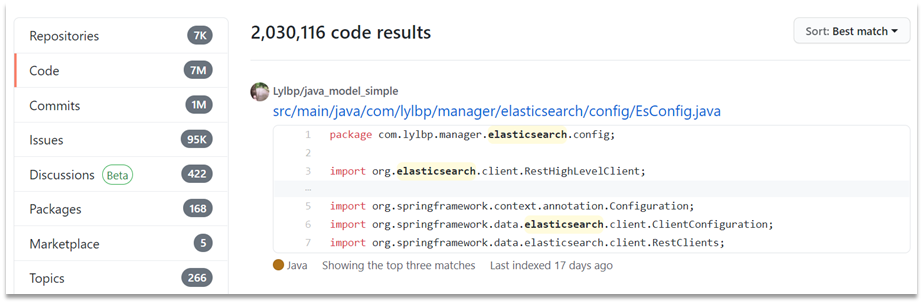

- 在电商网站搜索商品

  

- 在百度搜索答案

  

### 1.1.2.ELK技术栈

elasticsearch结合kibana、Logstash、Beats，也就是elastic stack（ELK）。被广泛应用在日志数据分析、实时监控等领域：

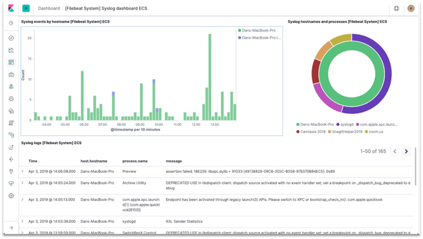

而elasticsearch是elastic stack的核心，负责存储、搜索、分析数据。

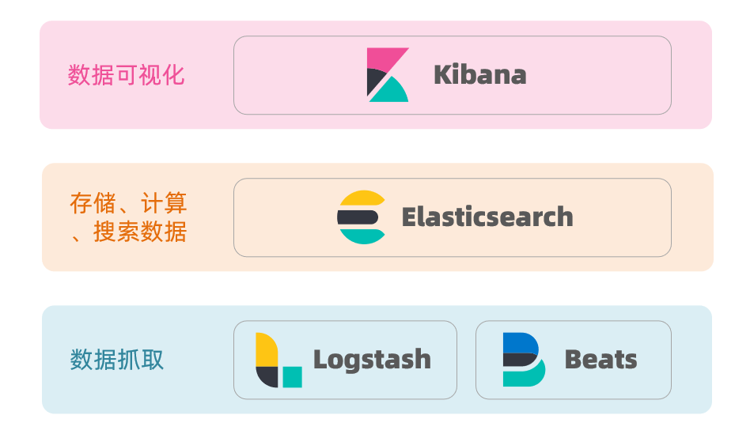

### 1.1.3.elasticsearch和lucene

elasticsearch底层是基于**lucene**来实现的。

**Lucene**是一个Java语言的搜索引擎类库，是Apache公司的顶级项目，由DougCutting于1999年研发。官网地址：https://lucene.apache.org/ 。


**elasticsearch**的发展历史：

- 2004年Shay Banon基于Lucene开发了Compass
- 2010年Shay Banon 重写了Compass，取名为Elasticsearch。


### 1.1.4.为什么不是其他搜索技术？

目前比较知名的搜索引擎技术排名：

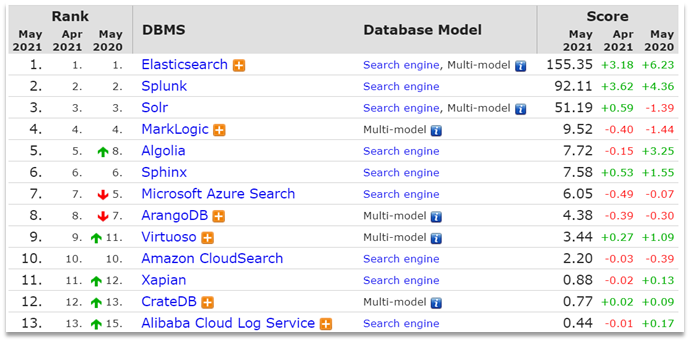

虽然在早期，Apache Solr是最主要的搜索引擎技术，但随着发展elasticsearch已经渐渐超越了Solr，独占鳌头：

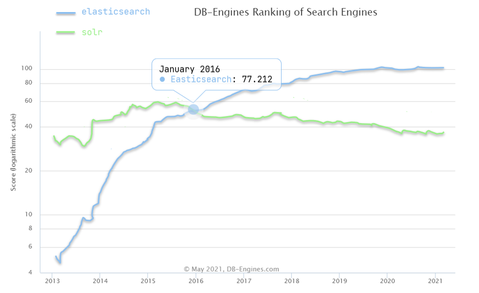

### 1.1.5.总结

什么是elasticsearch？

- 一个开源的分布式搜索引擎，可以用来实现搜索、日志统计、分析、系统监控等功能

什么是elastic stack（ELK）？

- 是以elasticsearch为核心的技术栈，包括beats、Logstash、kibana、elasticsearch

什么是Lucene？

- 是Apache的开源搜索引擎类库，提供了搜索引擎的核心API


## 1.2.倒排索引

倒排索引的概念是基于MySQL这样的正向索引而言的。

### 1.2.1.正向索引

那么什么是正向索引呢？例如给下表（tb_goods）中的id创建索引：


如果是根据id查询，那么直接走索引，查询速度非常快。

但如果是基于title做模糊查询，只能是逐行扫描数据，流程如下：

1）用户搜索数据，条件是title符合`"%手机%"`

2）逐行获取数据，比如id为1的数据

3）判断数据中的title是否符合用户搜索条件

4）如果符合则放入结果集，不符合则丢弃。回到步骤1

逐行扫描，也就是全表扫描，随着数据量增加，其查询效率也会越来越低。当数据量达到数百万时，就是一场灾难。

### 1.2.2.倒排索引

倒排索引中有两个非常重要的概念：

- 文档（`Document`）：用来搜索的数据，其中的每一条数据就是一个文档。例如一个网页、一个商品信息
- 词条（`Term`）：对文档数据或用户搜索数据，利用某种算法分词，得到的具备含义的词语就是词条。例如：我是中国人，就可以分为：我、是、中国人、中国、国人这样的几个词条


**创建倒排索引**是对正向索引的一种特殊处理，流程如下：

- 将每一个文档的数据利用算法分词，得到一个个词条
- 创建表，每行数据包括词条、词条所在文档id、位置等信息
- 因为词条唯一性，可以给词条创建索引，例如**hash表结构索引**

如图：

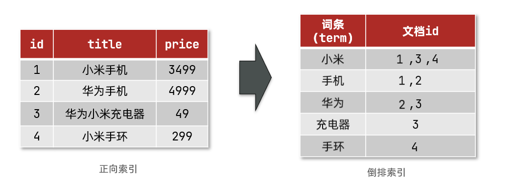


倒排索引的**搜索流程**如下（以搜索"华为手机"为例）：

1）用户输入条件`"华为手机"`进行搜索。

2）对用户输入内容**分词**，得到词条：`华为`、`手机`。

3）拿着词条在倒排索引中查找，可以得到包含词条的文档id：1、2、3。

4）拿着文档id到正向索引中查找具体文档。

如图：

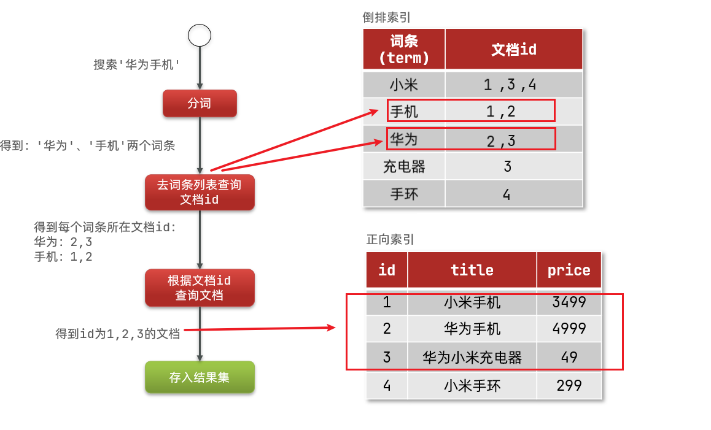

虽然要先查询倒排索引，再查询正向索引，但是无论是词条、还是文档id都建立了索引，查询速度非常快！无需全表扫描。

### 1.2.3.正向和倒排

那么为什么一个叫做正向索引，一个叫做倒排索引呢？

- **正向索引**是最传统的，根据id索引的方式。但根据词条查询时，必须先逐条获取每个文档，然后判断文档中是否包含所需要的词条，是**根据文档找词条的过程**。

- 而**倒排索引**则相反，是先找到用户要搜索的词条，根据词条得到保护词条的文档的id，然后根据id获取文档。是**根据词条找文档的过程**。

是不是恰好反过来了？

那么两者方式的优缺点是什么呢？

**正向索引**：

- 优点：
  - 可以给多个字段创建索引
  - 根据索引字段搜索、排序速度非常快
- 缺点：
  - 根据非索引字段，或者索引字段中的部分词条查找时，只能全表扫描。

**倒排索引**：

- 优点：
  - 根据词条搜索、模糊搜索时，速度非常快
- 缺点：
  - 只能给词条创建索引，而不是字段
  - 无法根据字段做排序

## 1.3.es的一些概念

elasticsearch中有很多独有的概念，与mysql中略有差别，但也有相似之处。

### 1.3.1.文档和字段

elasticsearch是面向**文档（Document）**存储的，可以是数据库中的一条商品数据，一个订单信息。文档数据会被序列化为json格式后存储在elasticsearch中：


而Json文档中往往包含很多的**字段（Field）**，类似于数据库中的列。

### 1.3.2.索引和映射

**索引（Index）**，就是相同类型的文档的集合。

例如：

- 所有用户文档，就可以组织在一起，称为用户的索引；
- 所有商品的文档，可以组织在一起，称为商品的索引；
- 所有订单的文档，可以组织在一起，称为订单的索引；

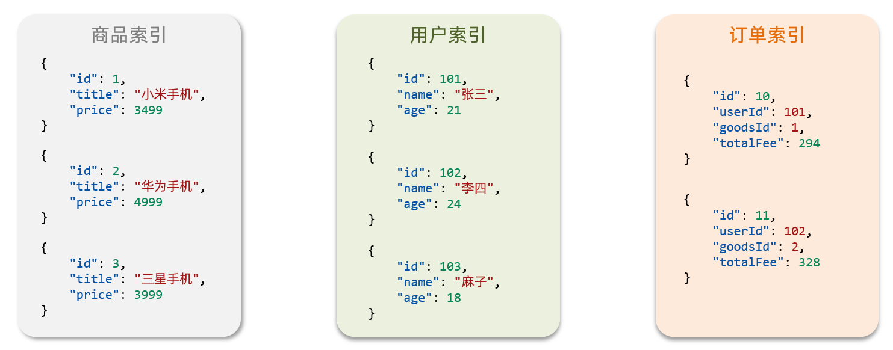


因此，我们可以把索引当做是数据库中的表。

数据库的表会有约束信息，用来定义表的结构、字段的名称、类型等信息。因此，索引库中就有**映射（mapping）**，是索引中文档的字段约束信息，类似表的结构约束。


### 1.3.3.mysql与elasticsearch

我们统一的把mysql与elasticsearch的概念做一下对比：

| **MySQL** | **Elasticsearch** | **说明**                                                     |
| --------- | ----------------- | ------------------------------------------------------------ |
| Table     | Index             | 索引(index)，就是文档的集合，类似数据库的表(table)           |
| Row       | Document          | 文档（Document），就是一条条的数据，类似数据库中的行（Row），文档都是JSON格式 |
| Column    | Field             | 字段（Field），就是JSON文档中的字段，类似数据库中的列（Column） |
| Schema    | Mapping           | Mapping（映射）是索引中文档的约束，例如字段类型约束。类似数据库的表结构（Schema） |
| SQL       | DSL               | DSL是elasticsearch提供的JSON风格的请求语句，用来操作elasticsearch，实现CRUD |

是不是说，我们学习了elasticsearch就不再需要mysql了呢？

并不是如此，两者各自有自己的擅长支出：
- Mysql：擅长事务类型操作，可以确保数据的安全和一致性
- Elasticsearch：擅长海量数据的搜索、分析、计算

因此在企业中，往往是两者结合使用：

- 对安全性要求较高的写操作，使用mysql实现
- 对查询性能要求较高的搜索需求，使用elasticsearch实现
- 两者再基于某种方式，实现数据的同步，保证一致性

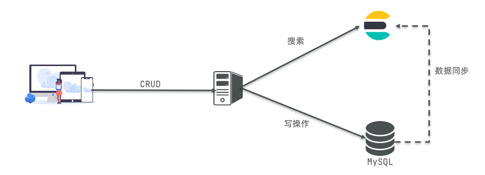

## 1.4.安装es、kibana

### 1.4.1.安装
[安装elasticsearch](../archive/old-distributed-coord-notes/安装elasticsearch.md)

### 1.4.2.分词器
[安装elasticsearch](../archive/old-distributed-coord-notes/安装elasticsearch.md) 

### 1.4.3.总结
分词器的作用是什么？

- 创建倒排索引时对文档分词
- 用户搜索时，对输入的内容分词

IK分词器有几种模式？

- ik_smart：智能切分，粗粒度
- ik_max_word：最细切分，细粒度

IK分词器如何拓展词条？如何停用词条？

- 利用config目录的IkAnalyzer.cfg.xml文件添加拓展词典和停用词典
- 在词典中添加拓展词条或者停用词条


# 2.索引库操作

索引库就类似数据库表，mapping映射就类似表的结构。

我们要向es中存储数据，必须先创建“库”和“表”。


## 2.1.mapping映射属性

mapping是对索引库中文档的约束，常见的mapping属性包括：

- type：字段数据类型，常见的简单类型有：
  - 字符串：text（可分词的文本）、keyword（精确值，例如：品牌、国家、ip地址）
  - 数值：long、integer、short、byte、double、float、
  - 布尔：boolean
  - 日期：date
  - 对象：object
- index：是否创建索引，默认为true
- analyzer：使用哪种分词器
- properties：该字段的子字段

例如下面的json文档：

```json
{
    "age": 21,
    "weight": 52.1,
    "isMarried": false,
    "info": "黑马程序员Java讲师",
    "email": "zy@itcast.cn",
    "score": [99.1, 99.5, 98.9],
    "name": {
        "firstName": "云",
        "lastName": "赵"
    }
}
```

对应的每个字段映射（mapping）：

- age：类型为 integer；参与搜索，因此需要index为true；无需分词器
- weight：类型为float；参与搜索，因此需要index为true；无需分词器
- isMarried：类型为boolean；参与搜索，因此需要index为true；无需分词器
- info：类型为字符串，需要分词，因此是text；参与搜索，因此需要index为true；分词器可以用ik_smart
- email：类型为字符串，但是不需要分词，因此是keyword；不参与搜索，因此需要index为false；无需分词器
- score：虽然是数组，但是我们只看元素的类型，类型为float；参与搜索，因此需要index为true；无需分词器
- name：类型为object，需要定义多个子属性
  - name.firstName；类型为字符串，但是不需要分词，因此是keyword；参与搜索，因此需要index为true；无需分词器
  - name.lastName；类型为字符串，但是不需要分词，因此是keyword；参与搜索，因此需要index为true；无需分词器


## 2.2.索引库的CRUD

这里我们统一使用Kibana编写DSL的方式来演示。

### 2.2.1.创建索引库和映射

#### 基本语法：

- 请求方式：PUT
- 请求路径：/索引库名，可以自定义
- 请求参数：mapping映射

格式：

```json
PUT /索引库名称
{
  "mappings": {
    "properties": {
      "字段名":{
        "type": "text",
        "analyzer": "ik_smart"
      },
      "字段名2":{
        "type": "keyword",
        "index": "false"
      },
      "字段名3":{
        "properties": {
          "子字段": {
            "type": "keyword"
          }
        }
      },
      // ...略
    }
  }
}
```


#### 示例：

```sh
PUT /heima
{
  "mappings": {
    "properties": {
      "info":{
        "type": "text",
        "analyzer": "ik_smart"
      },
      "email":{
        "type": "keyword",
        "index": "falsae"
      },
      "name":{
        "properties": {
          "firstName": {
            "type": "keyword"
          }
        }
      },
      // ... 略
    }
  }
}
```

### 2.2.2.查询索引库

**基本语法**：

- 请求方式：GET

- 请求路径：/索引库名

- 请求参数：无

**格式**：

```
GET /索引库名
```


### 2.2.3.修改索引库

倒排索引结构虽然不复杂，但是一旦数据结构改变（比如改变了分词器），就需要重新创建倒排索引，这简直是灾难。因此索引库**一旦创建，无法修改mapping**。

虽然无法修改mapping中已有的字段，但是却允许添加新的字段到mapping中，因为不会对倒排索引产生影响。

**语法说明**：

```json
PUT /索引库名/_mapping
{
  "properties": {
    "新字段名":{
      "type": "integer"
    }
  }
}
```


### 2.2.4.删除索引库

**语法：**

- 请求方式：DELETE

- 请求路径：/索引库名

- 请求参数：无

**格式：**

```
DELETE /索引库名
```

### 2.2.5.总结

索引库操作有哪些？

- 创建索引库：PUT /索引库名
- 查询索引库：GET /索引库名
- 删除索引库：DELETE /索引库名
- 添加字段：PUT /索引库名/_mapping

# 3.文档操作

## 3.1.新增文档

**语法：**

```json
POST /索引库名/_doc/文档id
{
    "字段1": "值1",
    "字段2": "值2",
    "字段3": {
        "子属性1": "值3",
        "子属性2": "值4"
    },
    // ...
}
```

**示例：**

```json
POST /wychmod/_doc/1
{
    "info": "大王",
    "email": "zy@itcast.cn",
    "name": {
        "firstName": "云",
        "lastName": "赵"
    }
}
```

## 3.2.查询文档

根据rest风格，新增是post，查询应该是get，不过查询一般都需要条件，这里我们把文档id带上。

**语法：**

```json
GET /{索引库名称}/_doc/{id}
```

**通过kibana查看数据：**

```js
GET /wychmod/_doc/1
```


## 3.3.删除文档

删除使用DELETE请求，同样，需要根据id进行删除：

**语法：**

```js
DELETE /{索引库名}/_doc/id值
```

**示例：**

```json
# 根据id删除数据
DELETE /wychmod/_doc/1
```

## 3.4.修改文档

修改有两种方式：

- 全量修改：直接覆盖原来的文档
- 增量修改：修改文档中的部分字段

### 3.4.1.全量修改

全量修改是覆盖原来的文档，其本质是：

- 根据指定的id删除文档
- 新增一个相同id的文档

**注意**：如果根据id删除时，id不存在，第二步的新增也会执行，也就从修改变成了新增操作了。

**语法：**

```json
PUT /{索引库名}/_doc/文档id
{
    "字段1": "值1",
    "字段2": "值2",
    // ... 略
}

```

**示例：**

```json
PUT /wychmod/_doc/1
{
    "info": "黑马程序员高级Java讲师",
    "email": "zy@itcast.cn",
    "name": {
        "firstName": "云",
        "lastName": "赵"
    }
}
```

### 3.4.2.增量修改

增量修改是只修改指定id匹配的文档中的部分字段。

**语法：**

```json
POST /{索引库名}/_update/文档id
{
    "doc": {
         "字段名": "新的值",
    }
}
```

**示例：**

```json
POST /wychmod/_update/1
{
  "doc": {
    "email": "ZhaoYun@itcast.cn"
  }
}
```

## 3.5.总结

文档操作有哪些？

- 创建文档：POST /{索引库名}/_doc/文档id   { json文档 }
- 查询文档：GET /{索引库名}/_doc/文档id
- 删除文档：DELETE /{索引库名}/_doc/文档id
- 修改文档：
  - 全量修改：PUT /{索引库名}/_doc/文档id { json文档 }
  - 增量修改：POST /{索引库名}/_update/文档id { "doc": {字段}}

# 4.RestAPI

ES官方提供了各种不同语言的客户端，用来操作ES。这些客户端的本质就是组装DSL语句，通过http请求发送给ES。官方文档地址：https://www.elastic.co/guide/en/elasticsearch/client/index.html

其中的Java Rest Client又包括两种：

- Java Low Level Rest Client
- Java High Level Rest Client

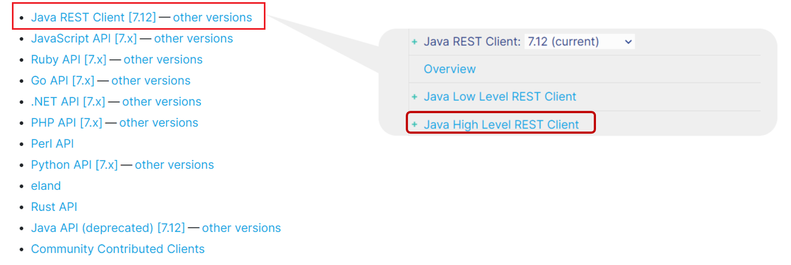

我们学习的是Java HighLevel Rest Client客户端API


## 4.0.导入Demo工程

### 4.0.1.导入数据

数据结构如下：

```sql
CREATE TABLE `tb_hotel` (
  `id` bigint(20) NOT NULL COMMENT '酒店id',
  `name` varchar(255) NOT NULL COMMENT '酒店名称；例：7天酒店',
  `address` varchar(255) NOT NULL COMMENT '酒店地址；例：航头路',
  `price` int(10) NOT NULL COMMENT '酒店价格；例：329',
  `score` int(2) NOT NULL COMMENT '酒店评分；例：45，就是4.5分',
  `brand` varchar(32) NOT NULL COMMENT '酒店品牌；例：如家',
  `city` varchar(32) NOT NULL COMMENT '所在城市；例：上海',
  `star_name` varchar(16) DEFAULT NULL COMMENT '酒店星级，从低到高分别是：1星到5星，1钻到5钻',
  `business` varchar(255) DEFAULT NULL COMMENT '商圈；例：虹桥',
  `latitude` varchar(32) NOT NULL COMMENT '纬度；例：31.2497',
  `longitude` varchar(32) NOT NULL COMMENT '经度；例：120.3925',
  `pic` varchar(255) DEFAULT NULL COMMENT '酒店图片；例:/img/1.jpg',
  PRIMARY KEY (`id`)
) ENGINE=InnoDB DEFAULT CHARSET=utf8mb4;
```

### 4.0.2.导入项目

项目结构如图：

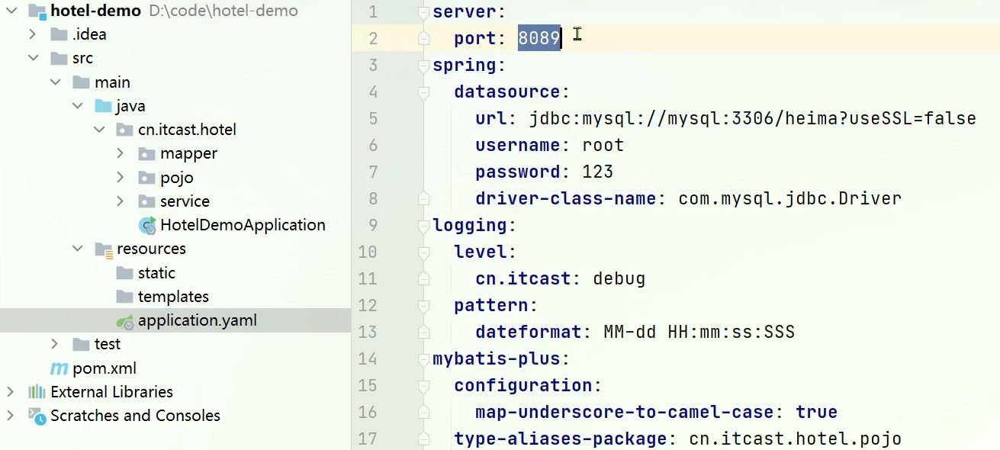

### 4.0.3.mapping映射分析

创建索引库，最关键的是mapping映射，而mapping映射要考虑的信息包括：

- 字段名
- 字段数据类型
- 是否参与搜索
- 是否需要分词
- 如果分词，分词器是什么？

其中：

- 字段名、字段数据类型，可以参考数据表结构的名称和类型
- 是否参与搜索要分析业务来判断，例如图片地址，就无需参与搜索
- 是否分词呢要看内容，内容如果是一个整体就无需分词，反之则要分词
- 分词器，我们可以统一使用ik_max_word

来看下酒店数据的索引库结构:

```json
PUT /hotel
{
  "mappings": {
    "properties": {
      "id": {
        "type": "keyword"
      },
      "name":{
        "type": "text",
        "analyzer": "ik_max_word",
        "copy_to": "all"
      },
      "address":{
        "type": "keyword",
        "index": false
      },
      "price":{
        "type": "integer"
      },
      "score":{
        "type": "integer"
      },
      "brand":{
        "type": "keyword",
        "copy_to": "all"
      },
      "city":{
        "type": "keyword",
        "copy_to": "all"
      },
      "starName":{
        "type": "keyword"
      },
      "business":{
        "type": "keyword"
      },
      "location":{
        "type": "geo_point"
      },
      "pic":{
        "type": "keyword",
        "index": false
      },
      "all":{
        "type": "text",
        "analyzer": "ik_max_word"
      }
    }
  }
}
```


几个特殊字段说明：

- location：地理坐标，里面包含精度、纬度
- all：一个组合字段，其目的是将多字段的值 利用copy_to合并，提供给用户搜索

地理坐标说明：

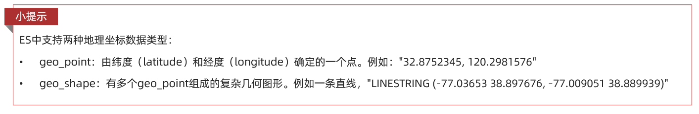

copy_to说明：

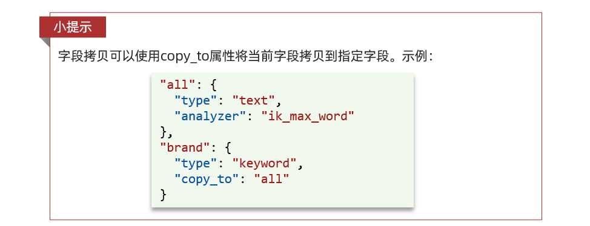

### 4.0.4.初始化RestClient

在elasticsearch提供的API中，与elasticsearch一切交互都封装在一个名为RestHighLevelClient的类中，必须先完成这个对象的初始化，建立与elasticsearch的连接。

分为三步：

1）引入es的RestHighLevelClient依赖：

```xml
<dependency>
    <groupId>org.elasticsearch.client</groupId>
    <artifactId>elasticsearch-rest-high-level-client</artifactId>
</dependency>
```

2）因为SpringBoot默认的ES版本是7.6.2，所以我们需要覆盖默认的ES版本：

```xml
<properties>
    <java.version>1.8</java.version>
    <elasticsearch.version>7.12.1</elasticsearch.version>
</properties>
```

3）初始化RestHighLevelClient：

初始化的代码如下：

```java
RestHighLevelClient client = new RestHighLevelClient(RestClient.builder(
        HttpHost.create("http://192.168.150.101:9200")
));
```

这里为了单元测试方便，我们创建一个测试类HotelIndexTest，然后将初始化的代码编写在@BeforeEach方法中：

```java
package cn.itcast.hotel;

import org.apache.http.HttpHost;
import org.elasticsearch.client.RestHighLevelClient;
import org.junit.jupiter.api.AfterEach;
import org.junit.jupiter.api.BeforeEach;
import org.junit.jupiter.api.Test;

import java.io.IOException;

public class HotelIndexTest {
    private RestHighLevelClient client;

    @BeforeEach
    void setUp() {
        this.client = new RestHighLevelClient(RestClient.builder(
                HttpHost.create("http://192.168.150.101:9200")
        ));
    }

    @AfterEach
    void tearDown() throws IOException {
        this.client.close();
    }
}
```

## 4.1.创建索引库

### 4.1.1.代码解读

创建索引库的API如下：

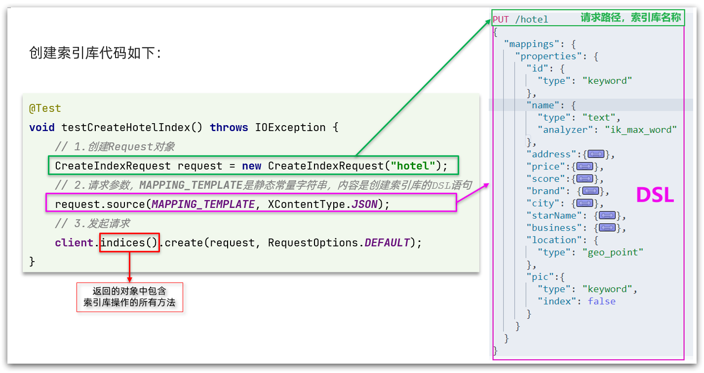

代码分为三步：

- 1）创建Request对象。因为是创建索引库的操作，因此Request是CreateIndexRequest。
- 2）添加请求参数，其实就是DSL的JSON参数部分。因为json字符串很长，这里是定义了静态字符串常量MAPPING_TEMPLATE，让代码看起来更加优雅。
- 3）发送请求，client.indices()方法的返回值是IndicesClient类型，封装了所有与索引库操作有关的方法。

### 4.1.2.完整示例

在hotel-demo的cn.itcast.hotel.constants包下，创建一个类，定义mapping映射的JSON字符串常量：

```java
package cn.itcast.hotel.constants;

public class HotelConstants {
    public static final String MAPPING_TEMPLATE = "{\n" +
            "  \"mappings\": {\n" +
            "    \"properties\": {\n" +
            "      \"id\": {\n" +
            "        \"type\": \"keyword\"\n" +
            "      },\n" +
            "      \"name\":{\n" +
            "        \"type\": \"text\",\n" +
            "        \"analyzer\": \"ik_max_word\",\n" +
            "        \"copy_to\": \"all\"\n" +
            "      },\n" +
            "      \"address\":{\n" +
            "        \"type\": \"keyword\",\n" +
            "        \"index\": false\n" +
            "      },\n" +
            "      \"price\":{\n" +
            "        \"type\": \"integer\"\n" +
            "      },\n" +
            "      \"score\":{\n" +
            "        \"type\": \"integer\"\n" +
            "      },\n" +
            "      \"brand\":{\n" +
            "        \"type\": \"keyword\",\n" +
            "        \"copy_to\": \"all\"\n" +
            "      },\n" +
            "      \"city\":{\n" +
            "        \"type\": \"keyword\",\n" +
            "        \"copy_to\": \"all\"\n" +
            "      },\n" +
            "      \"starName\":{\n" +
            "        \"type\": \"keyword\"\n" +
            "      },\n" +
            "      \"business\":{\n" +
            "        \"type\": \"keyword\"\n" +
            "      },\n" +
            "      \"location\":{\n" +
            "        \"type\": \"geo_point\"\n" +
            "      },\n" +
            "      \"pic\":{\n" +
            "        \"type\": \"keyword\",\n" +
            "        \"index\": false\n" +
            "      },\n" +
            "      \"all\":{\n" +
            "        \"type\": \"text\",\n" +
            "        \"analyzer\": \"ik_max_word\"\n" +
            "      }\n" +
            "    }\n" +
            "  }\n" +
            "}";
}
```

在hotel-demo中的HotelIndexTest测试类中，编写单元测试，实现创建索引：

```java
@Test
void createHotelIndex() throws IOException {
    // 1.创建Request对象
    CreateIndexRequest request = new CreateIndexRequest("hotel");
    // 2.准备请求的参数：DSL语句
    request.source(MAPPING_TEMPLATE, XContentType.JSON);
    // 3.发送请求
    client.indices().create(request, RequestOptions.DEFAULT);
}
```


## 4.2.删除索引库

删除索引库的DSL语句非常简单：

```json
DELETE /hotel
```

与创建索引库相比：

- 请求方式从PUT变为DELTE
- 请求路径不变
- 无请求参数

所以代码的差异，注意体现在Request对象上。依然是三步走：

- 1）创建Request对象。这次是DeleteIndexRequest对象
- 2）准备参数。这里是无参
- 3）发送请求。改用delete方法

在hotel-demo中的HotelIndexTest测试类中，编写单元测试，实现删除索引：

```java
@Test
void testDeleteHotelIndex() throws IOException {
    // 1.创建Request对象
    DeleteIndexRequest request = new DeleteIndexRequest("hotel");
    // 2.发送请求
    client.indices().delete(request, RequestOptions.DEFAULT);
}
```


## 4.3.判断索引库是否存在

判断索引库是否存在，本质就是查询，对应的DSL是：

```json
GET /hotel
```

因此与删除的Java代码流程是类似的。依然是三步走：

- 1）创建Request对象。这次是GetIndexRequest对象
- 2）准备参数。这里是无参
- 3）发送请求。改用exists方法

```java
@Test
void testExistsHotelIndex() throws IOException {
    // 1.创建Request对象
    GetIndexRequest request = new GetIndexRequest("hotel");
    // 2.发送请求
    boolean exists = client.indices().exists(request, RequestOptions.DEFAULT);
    // 3.输出
    System.err.println(exists ? "索引库已经存在！" : "索引库不存在！");
}
```

## 4.4.总结

JavaRestClient操作elasticsearch的流程基本类似。核心是client.indices()方法来获取索引库的操作对象。

索引库操作的基本步骤：

- 初始化RestHighLevelClient
- 创建XxxIndexRequest。XXX是Create、Get、Delete
- 准备DSL（ Create时需要，其它是无参）
- 发送请求。调用RestHighLevelClient#indices().xxx()方法，xxx是create、exists、delete


# 5.RestClient操作文档

为了与索引库操作分离，我们再次参加一个测试类，做两件事情：

- 初始化RestHighLevelClient
- 我们的酒店数据在数据库，需要利用IHotelService去查询，所以注入这个接口

```java
package cn.itcast.hotel;

import cn.itcast.hotel.pojo.Hotel;
import cn.itcast.hotel.service.IHotelService;
import org.junit.jupiter.api.AfterEach;
import org.junit.jupiter.api.BeforeEach;
import org.junit.jupiter.api.Test;
import org.springframework.beans.factory.annotation.Autowired;
import org.springframework.boot.test.context.SpringBootTest;

import java.io.IOException;
import java.util.List;

@SpringBootTest
public class HotelDocumentTest {
    @Autowired
    private IHotelService hotelService;

    private RestHighLevelClient client;

    @BeforeEach
    void setUp() {
        this.client = new RestHighLevelClient(RestClient.builder(
                HttpHost.create("http://192.168.150.101:9200")
        ));
    }

    @AfterEach
    void tearDown() throws IOException {
        this.client.close();
    }
}

```


## 5.1.新增文档

我们要将数据库的酒店数据查询出来，写入elasticsearch中。

### 5.1.1.索引库实体类

数据库查询后的结果是一个Hotel类型的对象。结构如下：

```java
@Data
@TableName("tb_hotel")
public class Hotel {
    @TableId(type = IdType.INPUT)
    private Long id;
    private String name;
    private String address;
    private Integer price;
    private Integer score;
    private String brand;
    private String city;
    private String starName;
    private String business;
    private String longitude;
    private String latitude;
    private String pic;
}
```

与我们的索引库结构存在差异：

- longitude和latitude需要合并为location

因此，我们需要定义一个新的类型，与索引库结构吻合：

```java
package cn.itcast.hotel.pojo;

import lombok.Data;
import lombok.NoArgsConstructor;

@Data
@NoArgsConstructor
public class HotelDoc {
    private Long id;
    private String name;
    private String address;
    private Integer price;
    private Integer score;
    private String brand;
    private String city;
    private String starName;
    private String business;
    private String location;
    private String pic;

    public HotelDoc(Hotel hotel) {
        this.id = hotel.getId();
        this.name = hotel.getName();
        this.address = hotel.getAddress();
        this.price = hotel.getPrice();
        this.score = hotel.getScore();
        this.brand = hotel.getBrand();
        this.city = hotel.getCity();
        this.starName = hotel.getStarName();
        this.business = hotel.getBusiness();
        this.location = hotel.getLatitude() + ", " + hotel.getLongitude();
        this.pic = hotel.getPic();
    }
}

```

### 5.1.2.语法说明

新增文档的DSL语句如下：

```json
POST /{索引库名}/_doc/1
{
    "name": "Jack",
    "age": 21
}
```

对应的java代码如图：

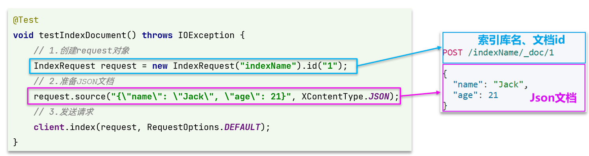

可以看到与创建索引库类似，同样是三步走：

- 1）创建Request对象
- 2）准备请求参数，也就是DSL中的JSON文档
- 3）发送请求

变化的地方在于，这里直接使用client.xxx()的API，不再需要client.indices()了。

### 5.1.3.完整代码

我们导入酒店数据，基本流程一致，但是需要考虑几点变化：

- 酒店数据来自于数据库，我们需要先查询出来，得到hotel对象
- hotel对象需要转为HotelDoc对象
- HotelDoc需要序列化为json格式

因此，代码整体步骤如下：

- 1）根据id查询酒店数据Hotel
- 2）将Hotel封装为HotelDoc
- 3）将HotelDoc序列化为JSON
- 4）创建IndexRequest，指定索引库名和id
- 5）准备请求参数，也就是JSON文档
- 6）发送请求

在hotel-demo的HotelDocumentTest测试类中，编写单元测试：

```java
@Test
void testAddDocument() throws IOException {
    // 1.根据id查询酒店数据
    Hotel hotel = hotelService.getById(61083L);
    // 2.转换为文档类型
    HotelDoc hotelDoc = new HotelDoc(hotel);
    // 3.将HotelDoc转json
    String json = JSON.toJSONString(hotelDoc);

    // 1.准备Request对象
    IndexRequest request = new IndexRequest("hotel").id(hotelDoc.getId().toString());
    // 2.准备Json文档
    request.source(json, XContentType.JSON);
    // 3.发送请求
    client.index(request, RequestOptions.DEFAULT);
}
```


## 5.2.查询文档

### 5.2.1.语法说明

查询的DSL语句如下：

```json
GET /hotel/_doc/{id}
```

非常简单，因此代码大概分两步：

- 准备Request对象
- 发送请求

不过查询的目的是得到结果，解析为HotelDoc，因此难点是结果的解析。完整代码如下：

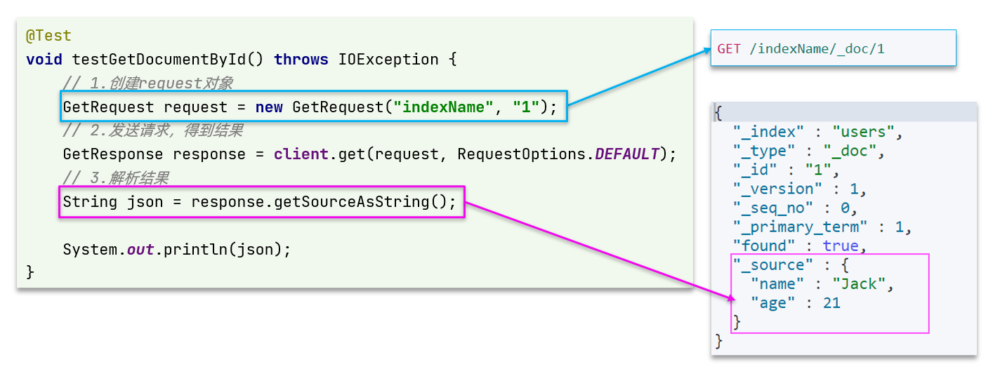

可以看到，结果是一个JSON，其中文档放在一个`_source`属性中，因此解析就是拿到`_source`，反序列化为Java对象即可。

与之前类似，也是三步走：

- 1）准备Request对象。这次是查询，所以是GetRequest
- 2）发送请求，得到结果。因为是查询，这里调用client.get()方法
- 3）解析结果，就是对JSON做反序列化

### 5.2.2.完整代码

在hotel-demo的HotelDocumentTest测试类中，编写单元测试：

```java
@Test
void testGetDocumentById() throws IOException {
    // 1.准备Request
    GetRequest request = new GetRequest("hotel", "61082");
    // 2.发送请求，得到响应
    GetResponse response = client.get(request, RequestOptions.DEFAULT);
    // 3.解析响应结果
    String json = response.getSourceAsString();

    HotelDoc hotelDoc = JSON.parseObject(json, HotelDoc.class);
    System.out.println(hotelDoc);
}
```

## 5.3.删除文档

删除的DSL为是这样的：

```json
DELETE /hotel/_doc/{id}
```

与查询相比，仅仅是请求方式从DELETE变成GET，可以想象Java代码应该依然是三步走：

- 1）准备Request对象，因为是删除，这次是DeleteRequest对象。要指定索引库名和id
- 2）准备参数，无参
- 3）发送请求。因为是删除，所以是client.delete()方法


在hotel-demo的HotelDocumentTest测试类中，编写单元测试：

```java
@Test
void testDeleteDocument() throws IOException {
    // 1.准备Request
    DeleteRequest request = new DeleteRequest("hotel", "61083");
    // 2.发送请求
    client.delete(request, RequestOptions.DEFAULT);
}
```


## 5.4.修改文档

### 5.4.1.语法说明

修改我们讲过两种方式：

- 全量修改：本质是先根据id删除，再新增
- 增量修改：修改文档中的指定字段值


在RestClient的API中，全量修改与新增的API完全一致，判断依据是ID：

- 如果新增时，ID已经存在，则修改
- 如果新增时，ID不存在，则新增

这里不再赘述，我们主要关注增量修改。

代码示例如图：

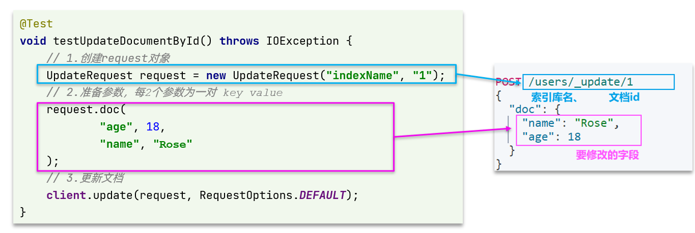

与之前类似，也是三步走：

- 1）准备Request对象。这次是修改，所以是UpdateRequest
- 2）准备参数。也就是JSON文档，里面包含要修改的字段
- 3）更新文档。这里调用client.update()方法

### 5.4.2.完整代码

在hotel-demo的HotelDocumentTest测试类中，编写单元测试：

```java
@Test
void testUpdateDocument() throws IOException {
    // 1.准备Request
    UpdateRequest request = new UpdateRequest("hotel", "61083");
    // 2.准备请求参数
    request.doc(
        "price", "952",
        "starName", "四钻"
    );
    // 3.发送请求
    client.update(request, RequestOptions.DEFAULT);
}
```


## 5.5.批量导入文档

案例需求：利用BulkRequest批量将数据库数据导入到索引库中。

步骤如下：

- 利用mybatis-plus查询酒店数据

- 将查询到的酒店数据（Hotel）转换为文档类型数据（HotelDoc）

- 利用JavaRestClient中的BulkRequest批处理，实现批量新增文档


### 5.5.1.语法说明

批量处理BulkRequest，其本质就是将多个普通的CRUD请求组合在一起发送。

其中提供了一个add方法，用来添加其他请求：

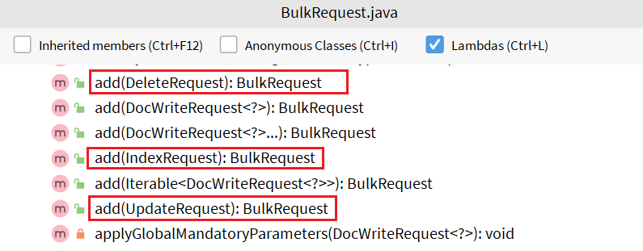

可以看到，能添加的请求包括：

- IndexRequest，也就是新增
- UpdateRequest，也就是修改
- DeleteRequest，也就是删除

因此Bulk中添加了多个IndexRequest，就是批量新增功能了。示例：

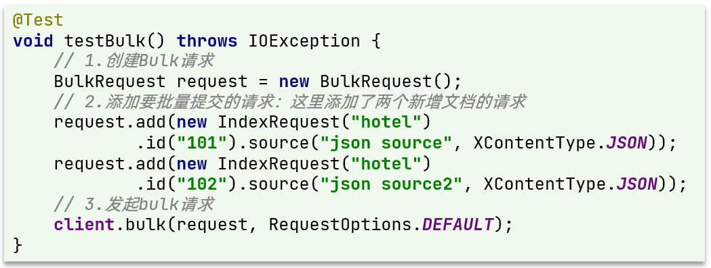


其实还是三步走：

- 1）创建Request对象。这里是BulkRequest
- 2）准备参数。批处理的参数，就是其它Request对象，这里就是多个IndexRequest
- 3）发起请求。这里是批处理，调用的方法为client.bulk()方法

我们在导入酒店数据时，将上述代码改造成for循环处理即可。

### 5.5.2.完整代码

在hotel-demo的HotelDocumentTest测试类中，编写单元测试：

```java
@Test
void testBulkRequest() throws IOException {
    // 批量查询酒店数据
    List<Hotel> hotels = hotelService.list();

    // 1.创建Request
    BulkRequest request = new BulkRequest();
    // 2.准备参数，添加多个新增的Request
    for (Hotel hotel : hotels) {
        // 2.1.转换为文档类型HotelDoc
        HotelDoc hotelDoc = new HotelDoc(hotel);
        // 2.2.创建新增文档的Request对象
        request.add(new IndexRequest("hotel")
                    .id(hotelDoc.getId().toString())
                    .source(JSON.toJSONString(hotelDoc), XContentType.JSON));
    }
    // 3.发送请求
    client.bulk(request, RequestOptions.DEFAULT);
}
```


## 5.6.小结

文档操作的基本步骤：

- 初始化RestHighLevelClient
- 创建XxxRequest。XXX是Index、Get、Update、Delete、Bulk
- 准备参数（Index、Update、Bulk时需要）
- 发送请求。调用RestHighLevelClient#.xxx()方法，xxx是index、get、update、delete、bulk
- 解析结果（Get时需要）

# 6.DSL查询文档

elasticsearch的查询依然是基于JSON风格的DSL来实现的。

## 6.1.DSL查询分类

Elasticsearch提供了基于JSON的DSL（[Domain Specific Language](https://www.elastic.co/guide/en/elasticsearch/reference/current/query-dsl.html)）来定义查询。常见的查询类型包括：

- **查询所有**：查询出所有数据，一般测试用。例如：match_all

- **全文检索（full text）查询**：利用分词器对用户输入内容分词，然后去倒排索引库中匹配。例如：
  - match_query
  - multi_match_query
- **精确查询**：根据精确词条值查找数据，一般是查找keyword、数值、日期、boolean等类型字段。例如：
  - ids
  - range
  - term
- **地理（geo）查询**：根据经纬度查询。例如：
  - geo_distance
  - geo_bounding_box
- **复合（compound）查询**：复合查询可以将上述各种查询条件组合起来，合并查询条件。例如：
  - bool
  - function_score


查询的语法基本一致：

```json
GET /indexName/_search
{
  "query": {
    "查询类型": {
      "查询条件": "条件值"
    }
  }
}
```

我们以查询所有为例，其中：

- 查询类型为match_all
- 没有查询条件

```json
// 查询所有
GET /indexName/_search
{
  "query": {
    "match_all": {
    }
  }
}
```

其它查询无非就是**查询类型**、**查询条件**的变化。

## 6.2.全文检索查询
### 6.2.1.使用场景

全文检索查询的基本流程如下：

- 对用户搜索的内容做分词，得到词条
- 根据词条去倒排索引库中匹配，得到文档id
- 根据文档id找到文档，返回给用户

比较常用的场景包括：

- 商城的输入框搜索
- 百度输入框搜索

例如京东：


因为是拿着词条去匹配，因此参与搜索的字段也必须是可分词的text类型的字段。

### 6.2.2.基本语法

常见的全文检索查询包括：

- match查询：单字段查询
- multi_match查询：多字段查询，任意一个字段符合条件就算符合查询条件

match查询语法如下：

```json
GET /indexName/_search
{
  "query": {
    "match": {
      "FIELD": "TEXT"
    }
  }
}
```

mulit_match语法如下：

```json
GET /indexName/_search
{
  "query": {
    "multi_match": {
      "query": "TEXT",
      "fields": ["FIELD1", " FIELD12"]
    }
  }
}
```

### 6.2.3.示例

match查询示例：

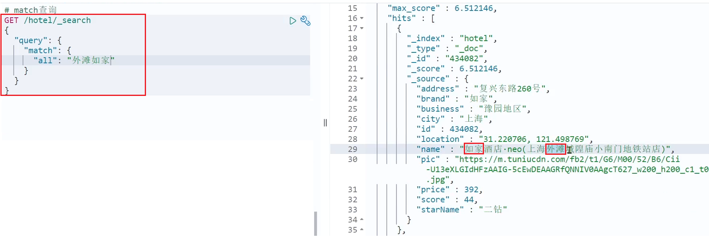

multi_match查询示例：

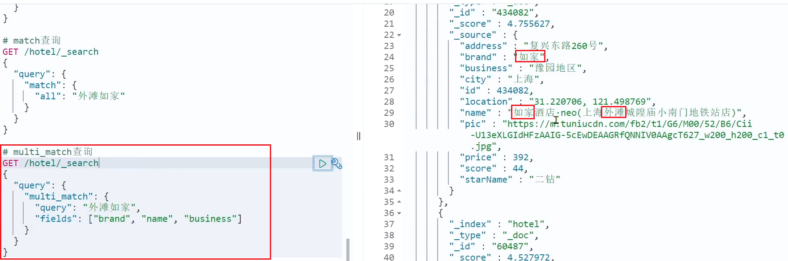

可以看到，两种查询结果是一样的，为什么？

因为我们将brand、name、business值都利用copy_to复制到了all字段中。因此你根据三个字段搜索，和根据all字段搜索效果当然一样了。

但是，搜索字段越多，对查询性能影响越大，因此建议采用copy_to，然后单字段查询的方式。

### 6.2.4.总结

match和multi_match的区别是什么？

- match：根据一个字段查询
- multi_match：根据多个字段查询，参与查询字段越多，查询性能越差

## 6.3.精准查询

精确查询一般是查找keyword、数值、日期、boolean等类型字段。所以**不会**对搜索条件分词。常见的有：

- term：根据词条精确值查询
- range：根据值的范围查询

### 6.3.1.term查询

因为精确查询的字段搜是不分词的字段，因此查询的条件也必须是**不分词**的词条。查询时，用户输入的内容跟自动值完全匹配时才认为符合条件。如果用户输入的内容过多，反而搜索不到数据。

语法说明：

```json
// term查询
GET /indexName/_search
{
  "query": {
    "term": {
      "FIELD": {
        "value": "VALUE"
      }
    }
  }
}
```

示例：

当我搜索的是精确词条时，能正确查询出结果：

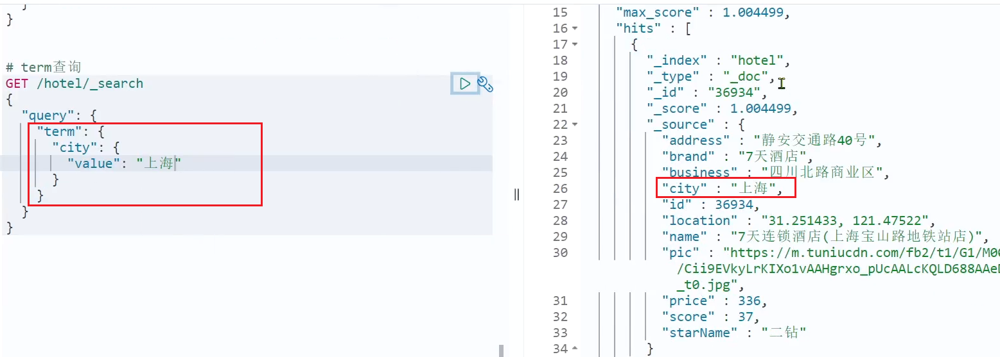

但是，当我搜索的内容不是词条，而是多个词语形成的短语时，反而搜索不到：

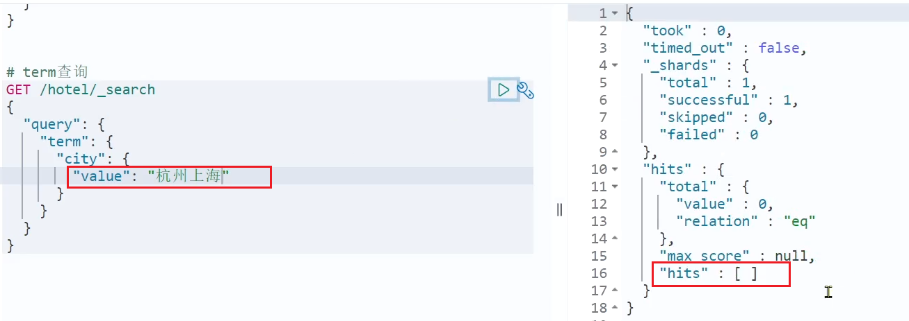


### 6.3.2.range查询

范围查询，一般应用在对数值类型做范围过滤的时候。比如做价格范围过滤。

基本语法：

```json
// range查询
GET /indexName/_search
{
  "query": {
    "range": {
      "FIELD": {
        "gte": 10, // 这里的gte代表大于等于，gt则代表大于
        "lte": 20 // lte代表小于等于，lt则代表小于
      }
    }
  }
}
```

示例：

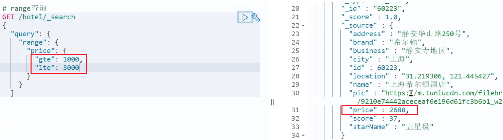

### 6.3.3.总结

精确查询常见的有哪些？

- term查询：根据词条精确匹配，一般搜索keyword类型、数值类型、布尔类型、日期类型字段
- range查询：根据数值范围查询，可以是数值、日期的范围

## 6.4.地理坐标查询

所谓的地理坐标查询，其实就是根据经纬度查询，官方文档：https://www.elastic.co/guide/en/elasticsearch/reference/current/geo-queries.html

常见的使用场景包括：

- 携程：搜索我附近的酒店
- 滴滴：搜索我附近的出租车
- 微信：搜索我附近的人

### 6.4.1.矩形范围查询

矩形范围查询，也就是geo_bounding_box查询，查询坐标落在某个矩形范围的所有文档：


查询时，需要指定矩形的**左上**、**右下**两个点的坐标，然后画出一个矩形，落在该矩形内的都是符合条件的点。

语法如下：

```json
// geo_bounding_box查询
GET /indexName/_search
{
  "query": {
    "geo_bounding_box": {
      "FIELD": {
        "top_left": { // 左上点
          "lat": 31.1,
          "lon": 121.5
        },
        "bottom_right": { // 右下点
          "lat": 30.9,
          "lon": 121.7
        }
      }
    }
  }
}
```

这种并不符合“附近的人”这样的需求，所以我们就不做了。

### 6.4.2.附近查询

附近查询，也叫做距离查询（geo_distance）：查询到指定中心点小于某个距离值的所有文档。

换句话来说，在地图上找一个点作为圆心，以指定距离为半径，画一个圆，落在圆内的坐标都算符合条件：


语法说明：

```json
// geo_distance 查询
GET /indexName/_search
{
  "query": {
    "geo_distance": {
      "distance": "15km", // 半径
      "FIELD": "31.21,121.5" // 圆心
    }
  }
}
```

示例：

我们先搜索陆家嘴附近15km的酒店：

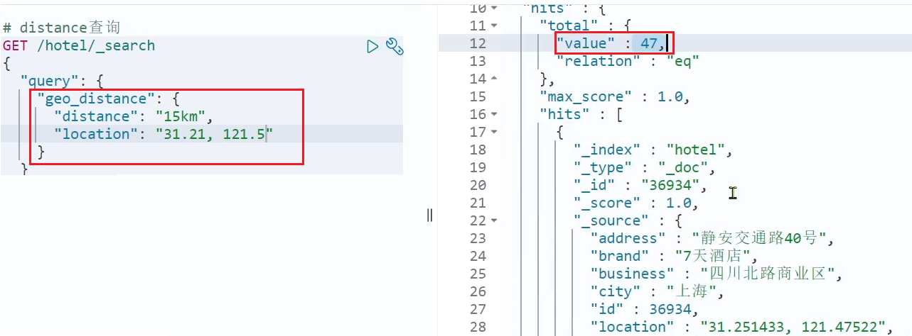

发现共有47家酒店。


然后把半径缩短到3公里：

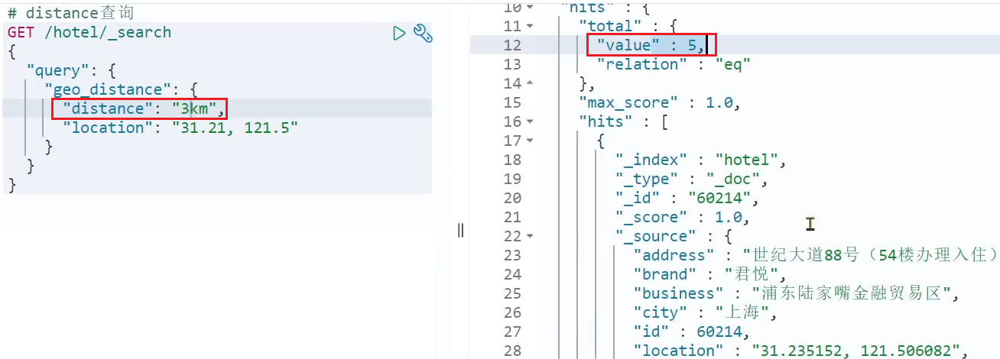

可以发现，搜索到的酒店数量减少到了5家。

## 6.5.复合查询

复合（compound）查询：复合查询可以将其它简单查询组合起来，实现更复杂的搜索逻辑。常见的有两种：

- fuction score：算分函数查询，可以控制文档相关性算分，控制文档排名
- bool query：布尔查询，利用逻辑关系组合多个其它的查询，实现复杂搜索

### 6.5.1.相关性算分

当我们利用match查询时，文档结果会根据与搜索词条的关联度打分（_score），返回结果时按照分值降序排列。

例如，我们搜索 "虹桥如家"，结果如下：

```json
[
  {
    "_score" : 17.850193,
    "_source" : {
      "name" : "虹桥如家酒店真不错",
    }
  },
  {
    "_score" : 12.259849,
    "_source" : {
      "name" : "外滩如家酒店真不错",
    }
  },
  {
    "_score" : 11.91091,
    "_source" : {
      "name" : "迪士尼如家酒店真不错",
    }
  }
]
```

在elasticsearch中，早期使用的打分算法是TF-IDF算法，公式如下：

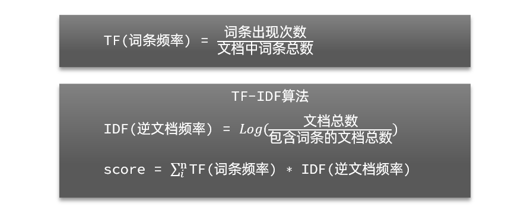

在后来的5.1版本升级中，elasticsearch将算法改进为BM25算法，公式如下：


TF-IDF算法有一各缺陷，就是词条频率越高，文档得分也会越高，单个词条对文档影响较大。而BM25则会让单个词条的算分有一个上限，曲线更加平滑：

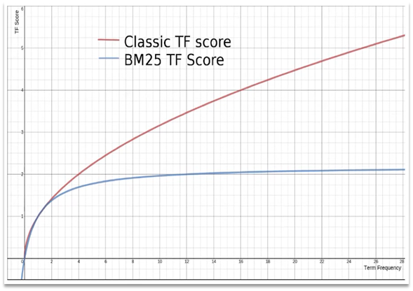

小结：elasticsearch会根据词条和文档的相关度做打分，算法由两种：

- TF-IDF算法
- BM25算法，elasticsearch5.1版本后采用的算法

### 6.5.2.算分函数查询

根据相关度打分是比较合理的需求，但**合理的不一定是产品经理需要**的。

以百度为例，你搜索的结果中，并不是相关度越高排名越靠前，而是谁掏的钱多排名就越靠前。如图：

要想认为控制相关性算分，就需要利用elasticsearch中的function score 查询了。

#### 1）语法说明

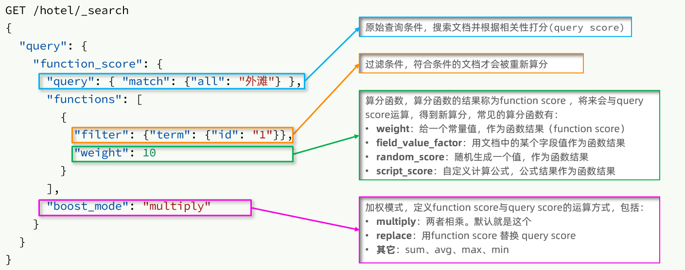

function score 查询中包含四部分内容：

- **原始查询**条件：query部分，基于这个条件搜索文档，并且基于BM25算法给文档打分，**原始算分**（query score)
- **过滤条件**：filter部分，符合该条件的文档才会重新算分
- **算分函数**：符合filter条件的文档要根据这个函数做运算，得到的**函数算分**（function score），有四种函数
  - weight：函数结果是常量
  - field_value_factor：以文档中的某个字段值作为函数结果
  - random_score：以随机数作为函数结果
  - script_score：自定义算分函数算法
- **运算模式**：算分函数的结果、原始查询的相关性算分，两者之间的运算方式，包括：
  - multiply：相乘
  - replace：用function score替换query score
  - 其它，例如：sum、avg、max、min

function score的运行流程如下：

- 1）根据**原始条件**查询搜索文档，并且计算相关性算分，称为**原始算分**（query score）
- 2）根据**过滤条件**，过滤文档
- 3）符合**过滤条件**的文档，基于**算分函数**运算，得到**函数算分**（function score）
- 4）将**原始算分**（query score）和**函数算分**（function score）基于**运算模式**做运算，得到最终结果，作为相关性算分。

因此，其中的关键点是：

- 过滤条件：决定哪些文档的算分被修改
- 算分函数：决定函数算分的算法
- 运算模式：决定最终算分结果

#### 2）示例

需求：给“如家”这个品牌的酒店排名靠前一些

翻译一下这个需求，转换为之前说的四个要点：

- 原始条件：不确定，可以任意变化
- 过滤条件：brand = "如家"
- 算分函数：可以简单粗暴，直接给固定的算分结果，weight
- 运算模式：比如求和

因此最终的DSL语句如下：

```json
GET /hotel/_search
{
  "query": {
    "function_score": {
      "query": {  .... }, // 原始查询，可以是任意条件
      "functions": [ // 算分函数
        {
          "filter": { // 满足的条件，品牌必须是如家
            "term": {
              "brand": "如家"
            }
          },
          "weight": 2 // 算分权重为2
        }
      ],
      "boost_mode": "sum" // 加权模式，求和
    }
  }
}
```


测试，在未添加算分函数时，如家得分如下：

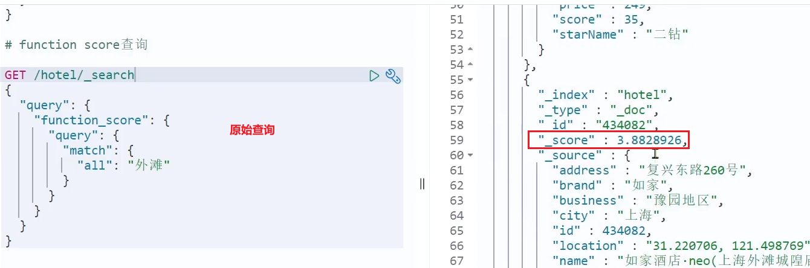

添加了算分函数后，如家得分就提升了：

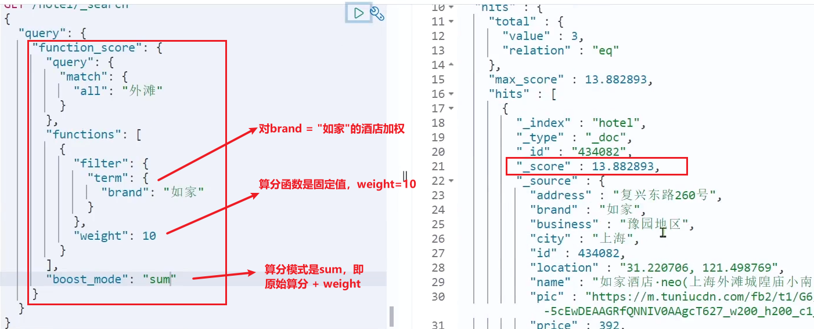

#### 3）小结

function score query定义的三要素是什么？

- 过滤条件：哪些文档要加分
- 算分函数：如何计算function score
- 加权方式：function score 与 query score如何运算


### 6.5.3.布尔查询

布尔查询是一个或多个查询子句的组合，每一个子句就是一个**子查询**。子查询的组合方式有：

- must：必须匹配每个子查询，类似“与”
- should：选择性匹配子查询，类似“或”
- must_not：必须不匹配，**不参与算分**，类似“非”
- filter：必须匹配，**不参与算分**


比如在搜索酒店时，除了关键字搜索外，我们还可能根据品牌、价格、城市等字段做过滤：


每一个不同的字段，其查询的条件、方式都不一样，必须是多个不同的查询，而要组合这些查询，就必须用bool查询了。


需要注意的是，搜索时，参与**打分的字段越多，查询的性能也越差**。因此这种多条件查询时，建议这样做：

- 搜索框的关键字搜索，是全文检索查询，使用must查询，参与算分
- 其它过滤条件，采用filter查询。不参与算分

#### 1）语法示例：

```json
GET /hotel/_search
{
  "query": {
    "bool": {
      "must": [
        {"term": {"city": "上海" }}
      ],
      "should": [
        {"term": {"brand": "皇冠假日" }},
        {"term": {"brand": "华美达" }}
      ],
      "must_not": [
        { "range": { "price": { "lte": 500 } }}
      ],
      "filter": [
        { "range": {"score": { "gte": 45 } }}
      ]
    }
  }
}
```

#### 2）示例

需求：搜索名字包含“如家”，价格不高于400，在坐标31.21,121.5周围10km范围内的酒店。

分析：

- 名称搜索，属于全文检索查询，应该参与算分。放到must中
- 价格不高于400，用range查询，属于过滤条件，不参与算分。放到must_not中
- 周围10km范围内，用geo_distance查询，属于过滤条件，不参与算分。放到filter中

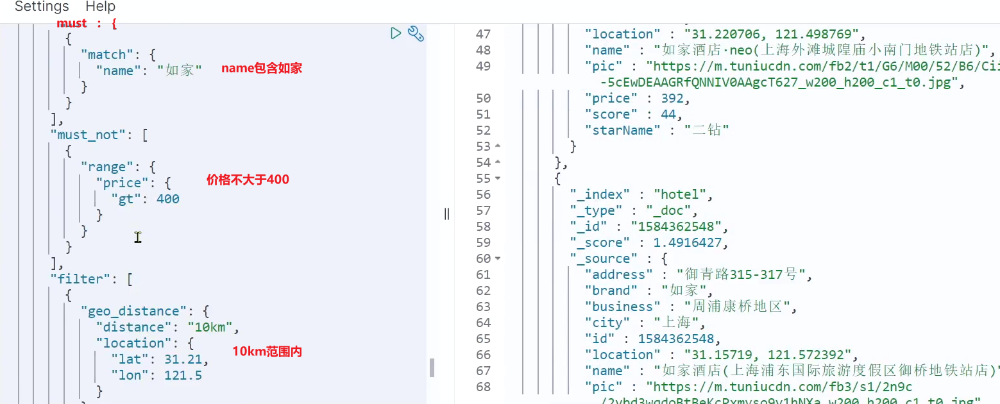

#### 3）小结

bool查询有几种逻辑关系？

- must：必须匹配的条件，可以理解为“与”
- should：选择性匹配的条件，可以理解为“或”
- must_not：必须不匹配的条件，不参与打分
- filter：必须匹配的条件，不参与打分

# 7.搜索结果处理

搜索的结果可以按照用户指定的方式去处理或展示。

## 7.1.排序

elasticsearch默认是根据相关度算分（_score）来排序，但是也支持自定义方式对搜索[结果排序](https://www.elastic.co/guide/en/elasticsearch/reference/current/sort-search-results.html)。可以排序字段类型有：keyword类型、数值类型、地理坐标类型、日期类型等。

### 7.1.1.普通字段排序

keyword、数值、日期类型排序的语法基本一致。

**语法**：

```json
GET /indexName/_search
{
  "query": {
    "match_all": {}
  },
  "sort": [
    {
      "FIELD": "desc"  // 排序字段、排序方式ASC、DESC
    }
  ]
}
```

排序条件是一个数组，也就是可以写多个排序条件。按照声明的顺序，当第一个条件相等时，再按照第二个条件排序，以此类推


**示例**：

需求描述：酒店数据按照用户评价（score)降序排序，评价相同的按照价格(price)升序排序

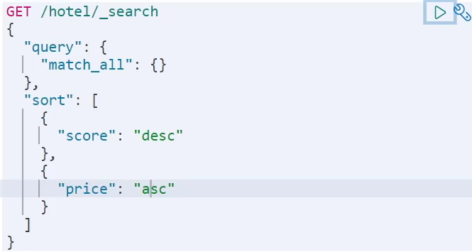


### 7.1.2.地理坐标排序

地理坐标排序略有不同。

**语法说明**：

```json
GET /indexName/_search
{
  "query": {
    "match_all": {}
  },
  "sort": [
    {
      "_geo_distance" : {
          "FIELD" : "纬度，经度", // 文档中geo_point类型的字段名、目标坐标点
          "order" : "asc", // 排序方式
          "unit" : "km" // 排序的距离单位
      }
    }
  ]
}
```

这个查询的含义是：

- 指定一个坐标，作为目标点
- 计算每一个文档中，指定字段（必须是geo_point类型）的坐标 到目标点的距离是多少
- 根据距离排序

**示例：**

需求描述：实现对酒店数据按照到你的位置坐标的距离升序排序

提示：获取你的位置的经纬度的方式：https://lbs.amap.com/demo/jsapi-v2/example/map/click-to-get-lnglat/


假设我的位置是：31.034661，121.612282，寻找我周围距离最近的酒店。

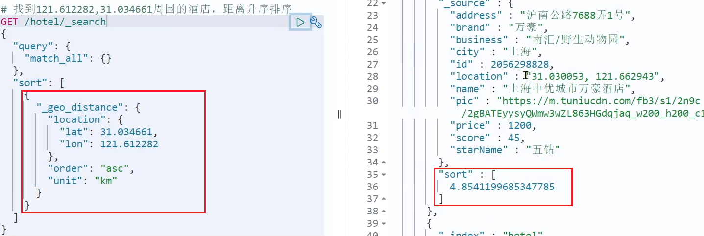

## 7.2.分页

elasticsearch 默认情况下只返回top10的数据。而如果要查询更多数据就需要修改分页参数了。elasticsearch中通过修改from、size参数来控制要返回的分页结果：

- from：从第几个文档开始
- size：总共查询几个文档

类似于mysql中的`limit ?, ?`

### 7.2.1.基本的分页

分页的基本语法如下：

```json
GET /hotel/_search
{
  "query": {
    "match_all": {}
  },
  "from": 0, // 分页开始的位置，默认为0
  "size": 10, // 期望获取的文档总数
  "sort": [
    {"price": "asc"}
  ]
}
```

### 7.2.2.深度分页问题

现在，我要查询990~1000的数据，查询逻辑要这么写：

```json
GET /hotel/_search
{
  "query": {
    "match_all": {}
  },
  "from": 990, // 分页开始的位置，默认为0
  "size": 10, // 期望获取的文档总数
  "sort": [
    {"price": "asc"}
  ]
}
```

这里是查询990开始的数据，也就是 第990~第1000条 数据。

不过，elasticsearch内部分页时，必须先查询 0~1000条，然后截取其中的990 ~ 1000的这10条：


查询TOP1000，如果es是单点模式，这并无太大影响。

但是elasticsearch将来一定是集群，例如我集群有5个节点，我要查询TOP1000的数据，并不是每个节点查询200条就可以了。

因为节点A的TOP200，在另一个节点可能排到10000名以外了。

因此要想获取整个集群的TOP1000，必须先查询出每个节点的TOP1000，汇总结果后，重新排名，重新截取TOP1000。


那如果我要查询9900~10000的数据呢？是不是要先查询TOP10000呢？那每个节点都要查询10000条？汇总到内存中？

当查询分页深度较大时，汇总数据过多，对内存和CPU会产生非常大的压力，因此elasticsearch会禁止from+ size 超过10000的请求。

针对深度分页，ES提供了两种解决方案，[官方文档](https://www.elastic.co/guide/en/elasticsearch/reference/current/paginate-search-results.html)：

- search after：分页时需要排序，原理是从上一次的排序值开始，查询下一页数据。官方推荐使用的方式。
- scroll：原理将排序后的文档id形成快照，保存在内存。官方已经不推荐使用。

### 7.2.3.小结

分页查询的常见实现方案以及优缺点：

- `from + size`：
  - 优点：支持随机翻页
  - 缺点：深度分页问题，默认查询上限（from + size）是10000
  - 场景：百度、京东、谷歌、淘宝这样的随机翻页搜索
- `after search`：
  - 优点：没有查询上限（单次查询的size不超过10000）
  - 缺点：只能向后逐页查询，不支持随机翻页
  - 场景：没有随机翻页需求的搜索，例如手机向下滚动翻页

- `scroll`：
  - 优点：没有查询上限（单次查询的size不超过10000）
  - 缺点：会有额外内存消耗，并且搜索结果是非实时的
  - 场景：海量数据的获取和迁移。从ES7.1开始不推荐，建议用 after search方案。


## 7.3.高亮

### 7.3.1.高亮原理

什么是高亮显示呢？

我们在百度，京东搜索时，关键字会变成红色，比较醒目，这叫高亮显示：

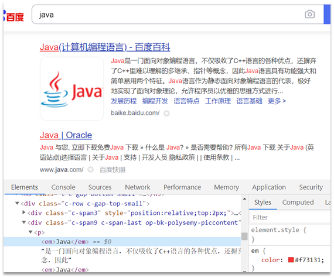

高亮显示的实现分为两步：

- 1）给文档中的所有关键字都添加一个标签，例如`<em>`标签
- 2）页面给`<em>`标签编写CSS样式


### 7.3.2.实现高亮

**高亮的语法**：

```json
GET /hotel/_search
{
  "query": {
    "match": {
      "FIELD": "TEXT" // 查询条件，高亮一定要使用全文检索查询
    }
  },
  "highlight": {
    "fields": { // 指定要高亮的字段
      "FIELD": {
        "pre_tags": "<em>",  // 用来标记高亮字段的前置标签
        "post_tags": "</em>" // 用来标记高亮字段的后置标签
      }
    }
  }
}
```


**注意：**

- 高亮是对关键字高亮，因此**搜索条件必须带有关键字**，而不能是范围这样的查询。
- 默认情况下，**高亮的字段，必须与搜索指定的字段一致**，否则无法高亮
- 如果要对非搜索字段高亮，则需要添加一个属性：required_field_match=false


**示例**：

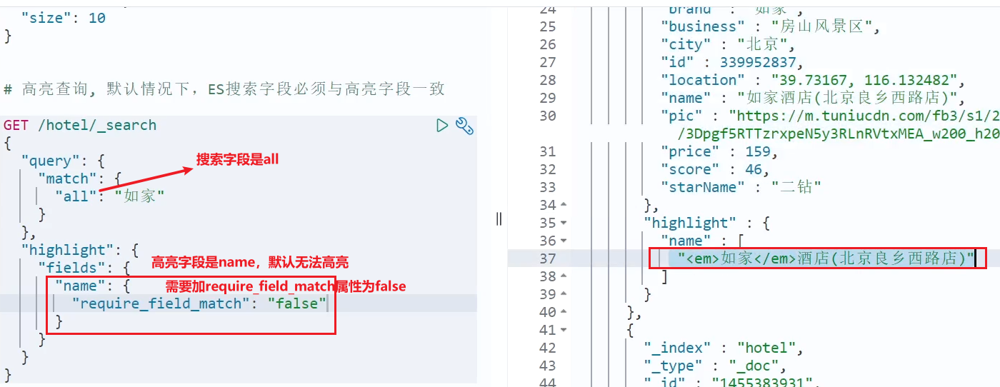


## 7.4.总结

查询的DSL是一个大的JSON对象，包含下列属性：

- query：查询条件
- from和size：分页条件
- sort：排序条件
- highlight：高亮条件

示例：

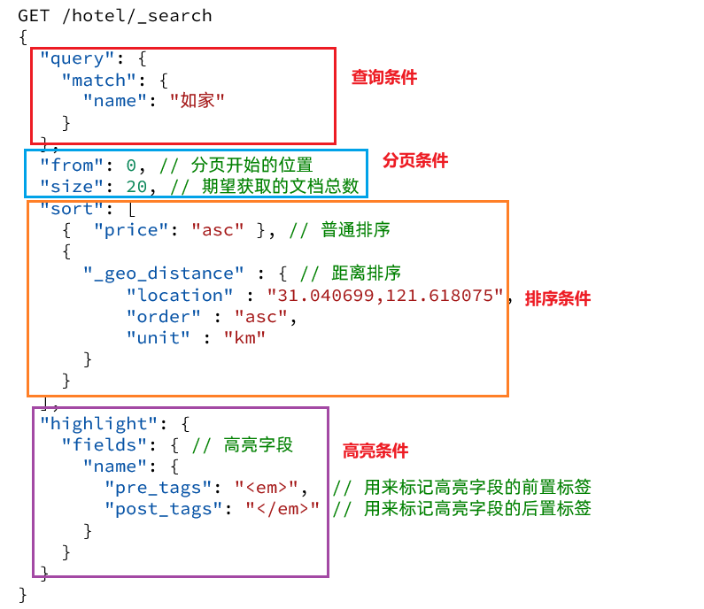

# 8.RestClient查询文档

文档的查询同样适用昨天学习的 RestHighLevelClient对象，基本步骤包括：

- 1）准备Request对象
- 2）准备请求参数
- 3）发起请求
- 4）解析响应


## 8.1.快速入门

我们以match_all查询为例

### 8.1.1.发起查询请求

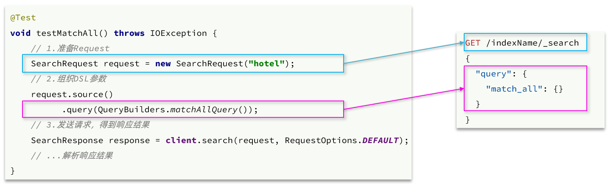

代码解读：

- 第一步，创建`SearchRequest`对象，指定索引库名

- 第二步，利用`request.source()`构建DSL，DSL中可以包含查询、分页、排序、高亮等
  - `query()`：代表查询条件，利用`QueryBuilders.matchAllQuery()`构建一个match_all查询的DSL
- 第三步，利用client.search()发送请求，得到响应


这里关键的API有两个，一个是`request.source()`，其中包含了查询、排序、分页、高亮等所有功能：

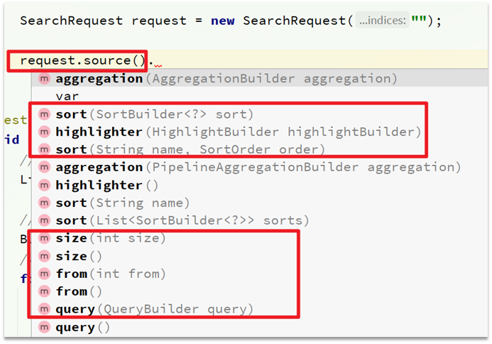

另一个是`QueryBuilders`，其中包含match、term、function_score、bool等各种查询：

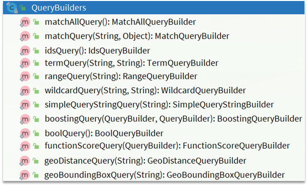


### 8.1.2.解析响应

响应结果的解析：

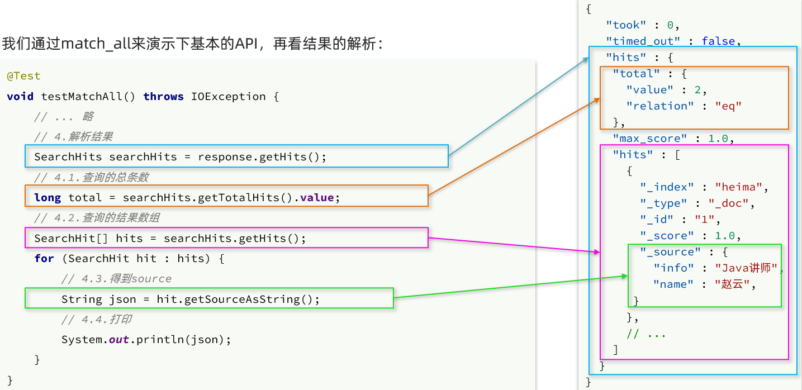


elasticsearch返回的结果是一个JSON字符串，结构包含：

- `hits`：命中的结果
  - `total`：总条数，其中的value是具体的总条数值
  - `max_score`：所有结果中得分最高的文档的相关性算分
  - `hits`：搜索结果的文档数组，其中的每个文档都是一个json对象
    - `_source`：文档中的原始数据，也是json对象

因此，我们解析响应结果，就是逐层解析JSON字符串，流程如下：

- `SearchHits`：通过response.getHits()获取，就是JSON中的最外层的hits，代表命中的结果
  - `SearchHits#getTotalHits().value`：获取总条数信息
  - `SearchHits#getHits()`：获取SearchHit数组，也就是文档数组
    - `SearchHit#getSourceAsString()`：获取文档结果中的_source，也就是原始的json文档数据


### 8.1.3.完整代码

完整代码如下：

```java
@Test
void testMatchAll() throws IOException {
    // 1.准备Request
    SearchRequest request = new SearchRequest("hotel");
    // 2.准备DSL
    request.source()
        .query(QueryBuilders.matchAllQuery());
    // 3.发送请求
    SearchResponse response = client.search(request, RequestOptions.DEFAULT);

    // 4.解析响应
    handleResponse(response);
}

private void handleResponse(SearchResponse response) {
    // 4.解析响应
    SearchHits searchHits = response.getHits();
    // 4.1.获取总条数
    long total = searchHits.getTotalHits().value;
    System.out.println("共搜索到" + total + "条数据");
    // 4.2.文档数组
    SearchHit[] hits = searchHits.getHits();
    // 4.3.遍历
    for (SearchHit hit : hits) {
        // 获取文档source
        String json = hit.getSourceAsString();
        // 反序列化
        HotelDoc hotelDoc = JSON.parseObject(json, HotelDoc.class);
        System.out.println("hotelDoc = " + hotelDoc);
    }
}
```

### 8.1.4.小结

查询的基本步骤是：

1. 创建SearchRequest对象

2. 准备Request.source()，也就是DSL。

   ① QueryBuilders来构建查询条件

   ② 传入Request.source() 的 query() 方法

3. 发送请求，得到结果

4. 解析结果（参考JSON结果，从外到内，逐层解析）


## 8.2.match查询

全文检索的match和multi_match查询与match_all的API基本一致。差别是查询条件，也就是query的部分。

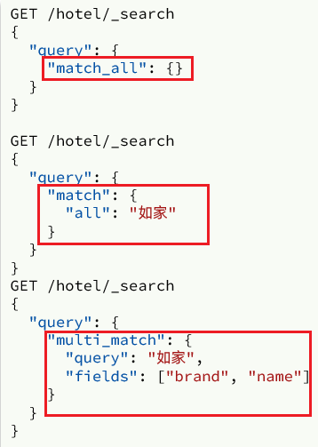 


因此，Java代码上的差异主要是request.source().query()中的参数了。同样是利用QueryBuilders提供的方法：

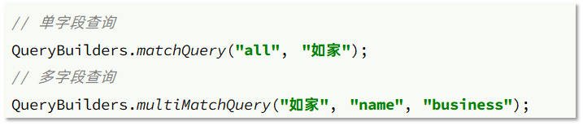 

而结果解析代码则完全一致，可以抽取并共享。

完整代码如下：

```java
@Test
void testMatch() throws IOException {
    // 1.准备Request
    SearchRequest request = new SearchRequest("hotel");
    // 2.准备DSL
    request.source()
        .query(QueryBuilders.matchQuery("all", "如家"));
    // 3.发送请求
    SearchResponse response = client.search(request, RequestOptions.DEFAULT);
    // 4.解析响应
    handleResponse(response);

}
```


## 8.3.精确查询

精确查询主要是两者：

- term：词条精确匹配
- range：范围查询

与之前的查询相比，差异同样在查询条件，其它都一样。

查询条件构造的API如下：

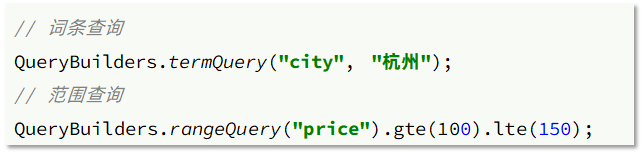 


## 8.4.布尔查询

布尔查询是用must、must_not、filter等方式组合其它查询，代码示例如下：

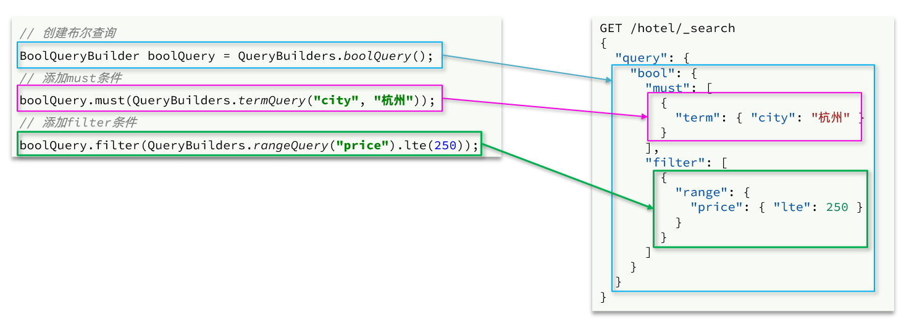

可以看到，API与其它查询的差别同样是在查询条件的构建，QueryBuilders，结果解析等其他代码完全不变。

完整代码如下：

```java
@Test
void testBool() throws IOException {
    // 1.准备Request
    SearchRequest request = new SearchRequest("hotel");
    // 2.准备DSL
    // 2.1.准备BooleanQuery
    BoolQueryBuilder boolQuery = QueryBuilders.boolQuery();
    // 2.2.添加term
    boolQuery.must(QueryBuilders.termQuery("city", "杭州"));
    // 2.3.添加range
    boolQuery.filter(QueryBuilders.rangeQuery("price").lte(250));

    request.source().query(boolQuery);
    // 3.发送请求
    SearchResponse response = client.search(request, RequestOptions.DEFAULT);
    // 4.解析响应
    handleResponse(response);

}
```


## 8.5.排序、分页

搜索结果的排序和分页是与query同级的参数，因此同样是使用request.source()来设置。

对应的API如下：

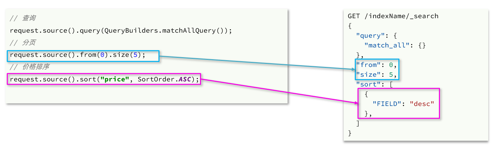


完整代码示例：

```java
@Test
void testPageAndSort() throws IOException {
    // 页码，每页大小
    int page = 1, size = 5;

    // 1.准备Request
    SearchRequest request = new SearchRequest("hotel");
    // 2.准备DSL
    // 2.1.query
    request.source().query(QueryBuilders.matchAllQuery());
    // 2.2.排序 sort
    request.source().sort("price", SortOrder.ASC);
    // 2.3.分页 from、size
    request.source().from((page - 1) * size).size(5);
    // 3.发送请求
    SearchResponse response = client.search(request, RequestOptions.DEFAULT);
    // 4.解析响应
    handleResponse(response);

}
```

## 8.6.高亮

高亮的代码与之前代码差异较大，有两点：

- 查询的DSL：其中除了查询条件，还需要添加高亮条件，同样是与query同级。
- 结果解析：结果除了要解析_source文档数据，还要解析高亮结果

### 8.6.1.高亮请求构建

高亮请求的构建API如下：

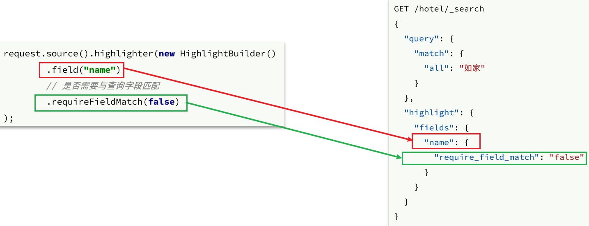

上述代码省略了查询条件部分，但是大家不要忘了：高亮查询必须使用全文检索查询，并且要有搜索关键字，将来才可以对关键字高亮。

完整代码如下：

```java
@Test
void testHighlight() throws IOException {
    // 1.准备Request
    SearchRequest request = new SearchRequest("hotel");
    // 2.准备DSL
    // 2.1.query
    request.source().query(QueryBuilders.matchQuery("all", "如家"));
    // 2.2.高亮
    request.source().highlighter(new HighlightBuilder().field("name").requireFieldMatch(false));
    // 3.发送请求
    SearchResponse response = client.search(request, RequestOptions.DEFAULT);
    // 4.解析响应
    handleResponse(response);

}
```


### 8.6.2.高亮结果解析

高亮的结果与查询的文档结果默认是分离的，并不在一起。

因此解析高亮的代码需要额外处理：

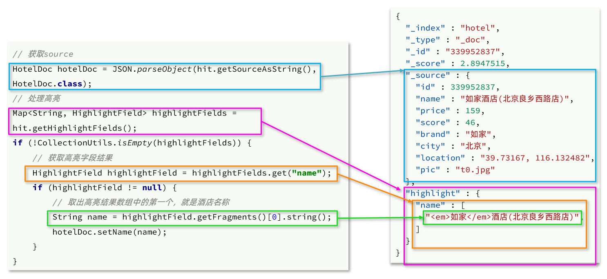

代码解读：

- 第一步：从结果中获取source。hit.getSourceAsString()，这部分是非高亮结果，json字符串。还需要反序列为HotelDoc对象
- 第二步：获取高亮结果。hit.getHighlightFields()，返回值是一个Map，key是高亮字段名称，值是HighlightField对象，代表高亮值
- 第三步：从map中根据高亮字段名称，获取高亮字段值对象HighlightField
- 第四步：从HighlightField中获取Fragments，并且转为字符串。这部分就是真正的高亮字符串了
- 第五步：用高亮的结果替换HotelDoc中的非高亮结果


完整代码如下：

```java
private void handleResponse(SearchResponse response) {
    // 4.解析响应
    SearchHits searchHits = response.getHits();
    // 4.1.获取总条数
    long total = searchHits.getTotalHits().value;
    System.out.println("共搜索到" + total + "条数据");
    // 4.2.文档数组
    SearchHit[] hits = searchHits.getHits();
    // 4.3.遍历
    for (SearchHit hit : hits) {
        // 获取文档source
        String json = hit.getSourceAsString();
        // 反序列化
        HotelDoc hotelDoc = JSON.parseObject(json, HotelDoc.class);
        // 获取高亮结果
        Map<String, HighlightField> highlightFields = hit.getHighlightFields();
        if (!CollectionUtils.isEmpty(highlightFields)) {
            // 根据字段名获取高亮结果
            HighlightField highlightField = highlightFields.get("name");
            if (highlightField != null) {
                // 获取高亮值
                String name = highlightField.getFragments()[0].string();
                // 覆盖非高亮结果
                hotelDoc.setName(name);
            }
        }
        System.out.println("hotelDoc = " + hotelDoc);
    }
}
```

# 9.黑马旅游案例

下面，我们通过黑马旅游的案例来实战演练下之前学习的知识。

我们实现四部分功能：

- 酒店搜索和分页
- 酒店结果过滤
- 我周边的酒店
- 酒店竞价排名


## 9.1.酒店搜索和分页


### 9.1.2.定义实体类


2）返回值

分页查询，需要返回分页结果PageResult，包含两个属性：

- `total`：总条数
- `List<HotelDoc>`：当前页的数据

因此，我们在`cn.itcast.hotel.pojo`中定义返回结果：

```java
package cn.itcast.hotel.pojo;

import lombok.Data;

import java.util.List;

@Data
public class PageResult {
    private Long total;
    private List<HotelDoc> hotels;

    public PageResult() {
    }

    public PageResult(Long total, List<HotelDoc> hotels) {
        this.total = total;
        this.hotels = hotels;
    }
}
```


### 9.1.3.定义controller

定义一个HotelController，声明查询接口，满足下列要求：

- 请求方式：Post
- 请求路径：/hotel/list
- 请求参数：对象，类型为RequestParam
- 返回值：PageResult，包含两个属性
  - `Long total`：总条数
  - `List<HotelDoc> hotels`：酒店数据


因此，我们在`cn.itcast.hotel.web`中定义HotelController：

```java
@RestController
@RequestMapping("/hotel")
public class HotelController {

    @Autowired
    private IHotelService hotelService;
	// 搜索酒店数据
    @PostMapping("/list")
    public PageResult search(@RequestBody RequestParams params){
        return hotelService.search(params);
    }
}
```


### 9.1.4.实现搜索业务

我们在controller调用了IHotelService，并没有实现该方法，因此下面我们就在IHotelService中定义方法，并且去实现业务逻辑。

1）在`cn.itcast.hotel.service`中的`IHotelService`接口中定义一个方法：

```java
/**
 * 根据关键字搜索酒店信息
 * @param params 请求参数对象，包含用户输入的关键字 
 * @return 酒店文档列表
 */
PageResult search(RequestParams params);
```


2）实现搜索业务，肯定离不开RestHighLevelClient，我们需要把它注册到Spring中作为一个Bean。在`cn.itcast.hotel`中的`HotelDemoApplication`中声明这个Bean：

```java
@Bean
public RestHighLevelClient client(){
    return  new RestHighLevelClient(RestClient.builder(
        HttpHost.create("http://192.168.150.101:9200")
    ));
}
```


3）在`cn.itcast.hotel.service.impl`中的`HotelService`中实现search方法：

```java
@Override
public PageResult search(RequestParams params) {
    try {
        // 1.准备Request
        SearchRequest request = new SearchRequest("hotel");
        // 2.准备DSL
        // 2.1.query
        String key = params.getKey();
        if (key == null || "".equals(key)) {
            request.source().query(QueryBuilders.matchAllQuery());
        } else {
            request.source().query(QueryBuilders.matchQuery("all", key));
        }

        // 2.2.分页
        int page = params.getPage();
        int size = params.getSize();
        request.source().from((page - 1) * size).size(size);

        // 3.发送请求
        SearchResponse response = client.search(request, RequestOptions.DEFAULT);
        // 4.解析响应
        return handleResponse(response);
    } catch (IOException e) {
        throw new RuntimeException(e);
    }
}

// 结果解析
private PageResult handleResponse(SearchResponse response) {
    // 4.解析响应
    SearchHits searchHits = response.getHits();
    // 4.1.获取总条数
    long total = searchHits.getTotalHits().value;
    // 4.2.文档数组
    SearchHit[] hits = searchHits.getHits();
    // 4.3.遍历
    List<HotelDoc> hotels = new ArrayList<>();
    for (SearchHit hit : hits) {
        // 获取文档source
        String json = hit.getSourceAsString();
        // 反序列化
        HotelDoc hotelDoc = JSON.parseObject(json, HotelDoc.class);
		// 放入集合
        hotels.add(hotelDoc);
    }
    // 4.4.封装返回
    return new PageResult(total, hotels);
}
```


## 9.2.酒店结果过滤

需求：添加品牌、城市、星级、价格等过滤功能

### 9.2.1.需求分析

在页面搜索框下面，会有一些过滤项：

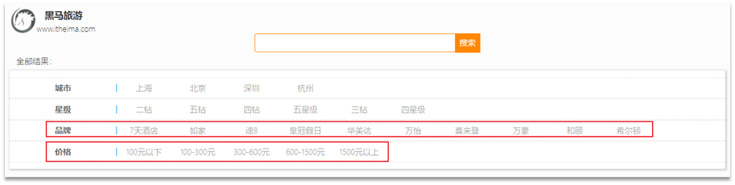

传递的参数如图：

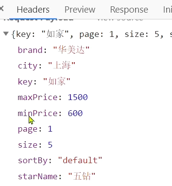 

包含的过滤条件有：

- brand：品牌值
- city：城市
- minPrice~maxPrice：价格范围
- starName：星级

我们需要做两件事情：

- 修改请求参数的对象RequestParams，接收上述参数
- 修改业务逻辑，在搜索条件之外，添加一些过滤条件


### 9.2.3.修改搜索业务

在HotelService的search方法中，只有一个地方需要修改：requet.source().query( ... )其中的查询条件。

在之前的业务中，只有match查询，根据关键字搜索，现在要添加条件过滤，包括：

- 品牌过滤：是keyword类型，用term查询
- 星级过滤：是keyword类型，用term查询
- 价格过滤：是数值类型，用range查询
- 城市过滤：是keyword类型，用term查询

多个查询条件组合，肯定是boolean查询来组合：

- 关键字搜索放到must中，参与算分
- 其它过滤条件放到filter中，不参与算分


因为条件构建的逻辑比较复杂，这里先封装为一个函数：

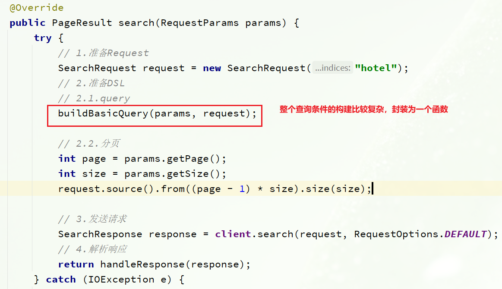


buildBasicQuery的代码如下：

```java
private void buildBasicQuery(RequestParams params, SearchRequest request) {
    // 1.构建BooleanQuery
    BoolQueryBuilder boolQuery = QueryBuilders.boolQuery();
    // 2.关键字搜索
    String key = params.getKey();
    if (key == null || "".equals(key)) {
        boolQuery.must(QueryBuilders.matchAllQuery());
    } else {
        boolQuery.must(QueryBuilders.matchQuery("all", key));
    }
    // 3.城市条件
    if (params.getCity() != null && !params.getCity().equals("")) {
        boolQuery.filter(QueryBuilders.termQuery("city", params.getCity()));
    }
    // 4.品牌条件
    if (params.getBrand() != null && !params.getBrand().equals("")) {
        boolQuery.filter(QueryBuilders.termQuery("brand", params.getBrand()));
    }
    // 5.星级条件
    if (params.getStarName() != null && !params.getStarName().equals("")) {
        boolQuery.filter(QueryBuilders.termQuery("starName", params.getStarName()));
    }
	// 6.价格
    if (params.getMinPrice() != null && params.getMaxPrice() != null) {
        boolQuery.filter(QueryBuilders
                         .rangeQuery("price")
                         .gte(params.getMinPrice())
                         .lte(params.getMaxPrice())
                        );
    }
	// 7.放入source
    request.source().query(boolQuery);
}
```


## 9.3.我周边的酒店

需求：我附近的酒店

### 9.3.1.需求分析

在酒店列表页的右侧，有一个小地图，点击地图的定位按钮，地图会找到你所在的位置：

 

并且，在前端会发起查询请求，将你的坐标发送到服务端：

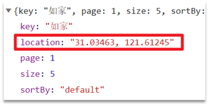 


我们要做的事情就是基于这个location坐标，然后按照距离对周围酒店排序。实现思路如下：

- 修改RequestParams参数，接收location字段
- 修改search方法业务逻辑，如果location有值，添加根据geo_distance排序的功能

### 9.3.3.距离排序API

我们以前学习过排序功能，包括两种：

- 普通字段排序
- 地理坐标排序

我们只讲了普通字段排序对应的java写法。地理坐标排序只学过DSL语法，如下：

```json
GET /indexName/_search
{
  "query": {
    "match_all": {}
  },
  "sort": [
    {
      "price": "asc"  
    },
    {
      "_geo_distance" : {
          "FIELD" : "纬度，经度",
          "order" : "asc",
          "unit" : "km"
      }
    }
  ]
}
```

对应的java代码示例：

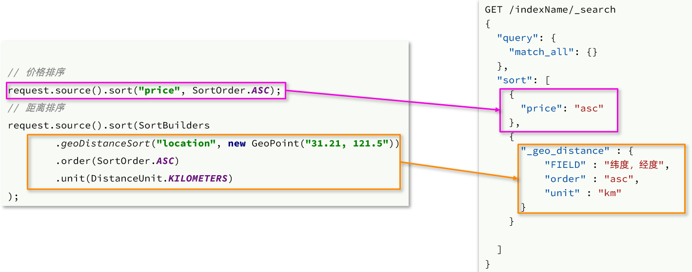


### 9.3.4.添加距离排序

在`cn.itcast.hotel.service.impl`的`HotelService`的`search`方法中，添加一个排序功能：

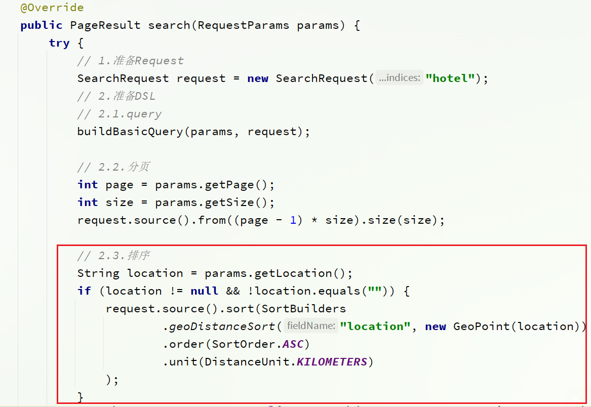


完整代码：

```java
@Override
public PageResult search(RequestParams params) {
    try {
        // 1.准备Request
        SearchRequest request = new SearchRequest("hotel");
        // 2.准备DSL
        // 2.1.query
        buildBasicQuery(params, request);

        // 2.2.分页
        int page = params.getPage();
        int size = params.getSize();
        request.source().from((page - 1) * size).size(size);

        // 2.3.排序
        String location = params.getLocation();
        if (location != null && !location.equals("")) {
            request.source().sort(SortBuilders
                                  .geoDistanceSort("location", new GeoPoint(location))
                                  .order(SortOrder.ASC)
                                  .unit(DistanceUnit.KILOMETERS)
                                 );
        }

        // 3.发送请求
        SearchResponse response = client.search(request, RequestOptions.DEFAULT);
        // 4.解析响应
        return handleResponse(response);
    } catch (IOException e) {
        throw new RuntimeException(e);
    }
}
```


### 9.3.5.排序距离显示

重启服务后，测试我的酒店功能：


发现确实可以实现对我附近酒店的排序，不过并没有看到酒店到底距离我多远，这该怎么办？


排序完成后，页面还要获取我附近每个酒店的具体**距离**值，这个值在响应结果中是独立的：

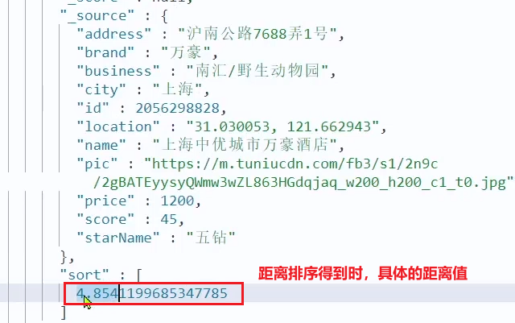

因此，我们在结果解析阶段，除了解析source部分以外，还要得到sort部分，也就是排序的距离，然后放到响应结果中。

我们要做两件事：

- 修改HotelDoc，添加排序距离字段，用于页面显示
- 修改HotelService类中的handleResponse方法，添加对sort值的获取


1）修改HotelDoc类，添加距离字段

```java
package cn.itcast.hotel.pojo;

import lombok.Data;
import lombok.NoArgsConstructor;


@Data
@NoArgsConstructor
public class HotelDoc {
    private Long id;
    private String name;
    private String address;
    private Integer price;
    private Integer score;
    private String brand;
    private String city;
    private String starName;
    private String business;
    private String location;
    private String pic;
    // 排序时的 距离值
    private Object distance;

    public HotelDoc(Hotel hotel) {
        this.id = hotel.getId();
        this.name = hotel.getName();
        this.address = hotel.getAddress();
        this.price = hotel.getPrice();
        this.score = hotel.getScore();
        this.brand = hotel.getBrand();
        this.city = hotel.getCity();
        this.starName = hotel.getStarName();
        this.business = hotel.getBusiness();
        this.location = hotel.getLatitude() + ", " + hotel.getLongitude();
        this.pic = hotel.getPic();
    }
}

```


2）修改HotelService中的handleResponse方法

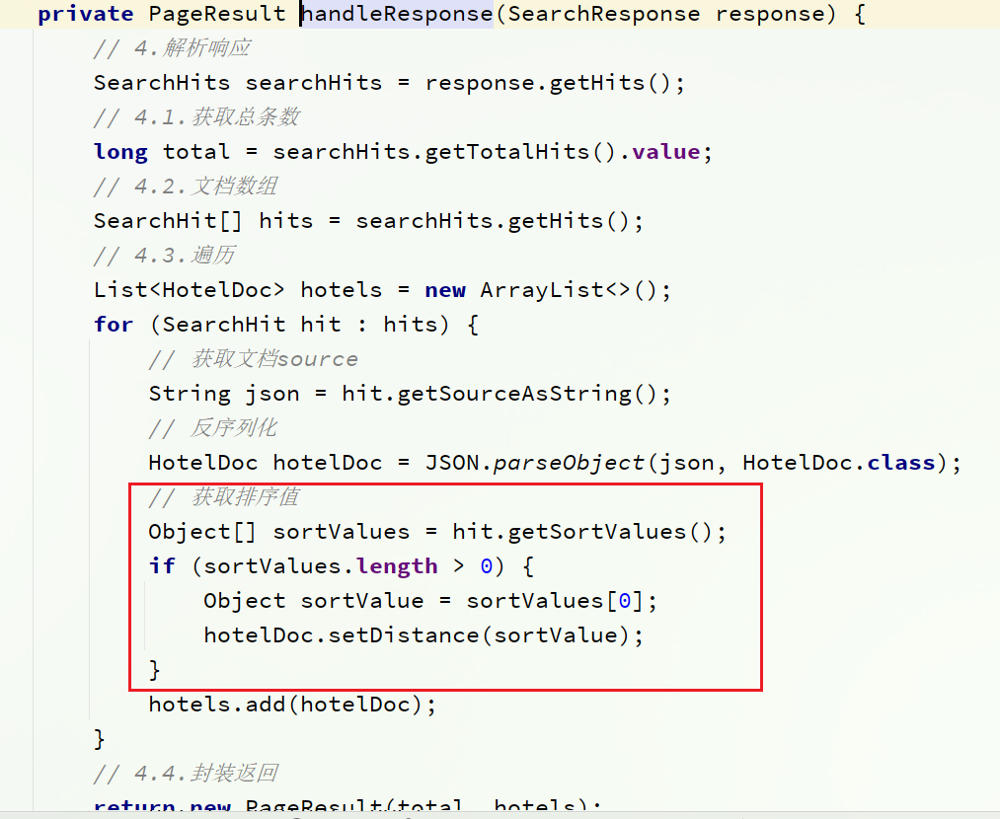


重启后测试，发现页面能成功显示距离了：


## 9.4.酒店竞价排名

需求：让指定的酒店在搜索结果中排名置顶

### 9.4.1.需求分析

要让指定酒店在搜索结果中排名置顶，效果如图：


页面会给指定的酒店添加**广告**标记。


那怎样才能让指定的酒店排名置顶呢？


我们之前学习过的function_score查询可以影响算分，算分高了，自然排名也就高了。而function_score包含3个要素：

- 过滤条件：哪些文档要加分
- 算分函数：如何计算function score
- 加权方式：function score 与 query score如何运算


这里的需求是：让**指定酒店**排名靠前。因此我们需要给这些酒店添加一个标记，这样在过滤条件中就可以**根据这个标记来判断，是否要提高算分**。

比如，我们给酒店添加一个字段：isAD，Boolean类型：

- true：是广告
- false：不是广告

这样function_score包含3个要素就很好确定了：

- 过滤条件：判断isAD 是否为true
- 算分函数：我们可以用最简单暴力的weight，固定加权值
- 加权方式：可以用默认的相乘，大大提高算分


因此，业务的实现步骤包括：

1. 给HotelDoc类添加isAD字段，Boolean类型

2. 挑选几个你喜欢的酒店，给它的文档数据添加isAD字段，值为true

3. 修改search方法，添加function score功能，给isAD值为true的酒店增加权重


### 9.4.2.修改HotelDoc实体

给`cn.itcast.hotel.pojo`包下的HotelDoc类添加isAD字段：

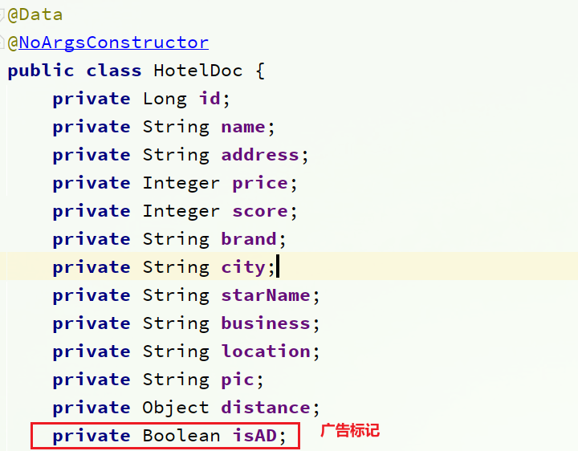


### 9.4.3.添加广告标记

接下来，我们挑几个酒店，添加isAD字段，设置为true：

```json
POST /hotel/_update/1902197537
{
    "doc": {
        "isAD": true
    }
}
POST /hotel/_update/2056126831
{
    "doc": {
        "isAD": true
    }
}
POST /hotel/_update/1989806195
{
    "doc": {
        "isAD": true
    }
}
POST /hotel/_update/2056105938
{
    "doc": {
        "isAD": true
    }
}
```

### 9.4.4.添加算分函数查询

接下来我们就要修改查询条件了。之前是用的boolean 查询，现在要改成function_socre查询。


function_score查询结构如下：


对应的JavaAPI如下：

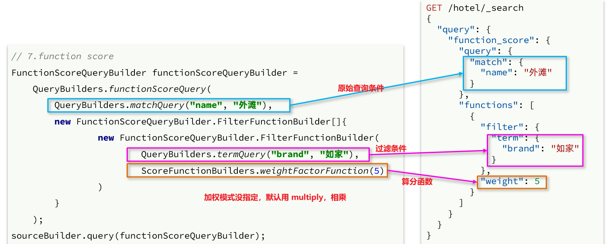


我们可以将之前写的boolean查询作为**原始查询**条件放到query中，接下来就是添加**过滤条件**、**算分函数**、**加权模式**了。所以原来的代码依然可以沿用。


修改`cn.itcast.hotel.service.impl`包下的`HotelService`类中的`buildBasicQuery`方法，添加算分函数查询：

```java
private void buildBasicQuery(RequestParams params, SearchRequest request) {
    // 1.构建BooleanQuery
    BoolQueryBuilder boolQuery = QueryBuilders.boolQuery();
    // 关键字搜索
    String key = params.getKey();
    if (key == null || "".equals(key)) {
        boolQuery.must(QueryBuilders.matchAllQuery());
    } else {
        boolQuery.must(QueryBuilders.matchQuery("all", key));
    }
    // 城市条件
    if (params.getCity() != null && !params.getCity().equals("")) {
        boolQuery.filter(QueryBuilders.termQuery("city", params.getCity()));
    }
    // 品牌条件
    if (params.getBrand() != null && !params.getBrand().equals("")) {
        boolQuery.filter(QueryBuilders.termQuery("brand", params.getBrand()));
    }
    // 星级条件
    if (params.getStarName() != null && !params.getStarName().equals("")) {
        boolQuery.filter(QueryBuilders.termQuery("starName", params.getStarName()));
    }
    // 价格
    if (params.getMinPrice() != null && params.getMaxPrice() != null) {
        boolQuery.filter(QueryBuilders
                         .rangeQuery("price")
                         .gte(params.getMinPrice())
                         .lte(params.getMaxPrice())
                        );
    }

    // 2.算分控制
    FunctionScoreQueryBuilder functionScoreQuery =
        QueryBuilders.functionScoreQuery(
        // 原始查询，相关性算分的查询
        boolQuery,
        // function score的数组
        new FunctionScoreQueryBuilder.FilterFunctionBuilder[]{
            // 其中的一个function score 元素
            new FunctionScoreQueryBuilder.FilterFunctionBuilder(
                // 过滤条件
                QueryBuilders.termQuery("isAD", true),
                // 算分函数
                ScoreFunctionBuilders.weightFactorFunction(10)
            )
        });
    request.source().query(functionScoreQuery);
}
```

# 10.数据聚合

**[聚合（](https://www.elastic.co/guide/en/elasticsearch/reference/current/search-aggregations.html)[aggregations](https://www.elastic.co/guide/en/elasticsearch/reference/current/search-aggregations.html)[）](https://www.elastic.co/guide/en/elasticsearch/reference/current/search-aggregations.html)**可以让我们极其方便的实现对数据的统计、分析、运算。例如：

- 什么品牌的手机最受欢迎？
- 这些手机的平均价格、最高价格、最低价格？
- 这些手机每月的销售情况如何？

实现这些统计功能的比数据库的sql要方便的多，而且查询速度非常快，可以实现近实时搜索效果。

## 10.1.聚合的种类

聚合常见的有三类：

- **桶（Bucket）**聚合：用来对文档做分组
  - TermAggregation：按照文档字段值分组，例如按照品牌值分组、按照国家分组
  - Date Histogram：按照日期阶梯分组，例如一周为一组，或者一月为一组

- **度量（Metric）**聚合：用以计算一些值，比如：最大值、最小值、平均值等
  - Avg：求平均值
  - Max：求最大值
  - Min：求最小值
  - Stats：同时求max、min、avg、sum等
- **管道（pipeline）**聚合：其它聚合的结果为基础做聚合

> **注意：**参加聚合的字段必须是keyword、日期、数值、布尔类型

## 10.2.DSL实现聚合

现在，我们要统计所有数据中的酒店品牌有几种，其实就是按照品牌对数据分组。此时可以根据酒店品牌的名称做聚合，也就是Bucket聚合。

### 10.2.1.Bucket聚合语法

语法如下：

```json
GET /hotel/_search
{
  "size": 0,  // 设置size为0，结果中不包含文档，只包含聚合结果
  "aggs": { // 定义聚合
    "brandAgg": { //给聚合起个名字
      "terms": { // 聚合的类型，按照品牌值聚合，所以选择term
        "field": "brand", // 参与聚合的字段
        "size": 20 // 希望获取的聚合结果数量
      }
    }
  }
}
```

结果如图：

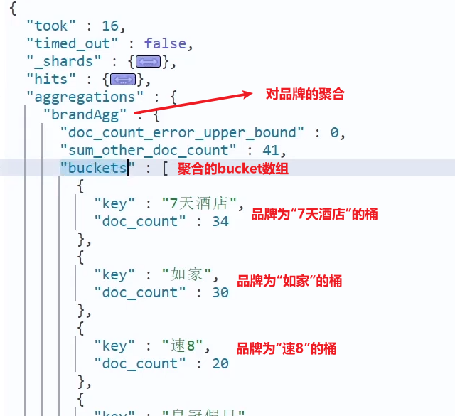


### 10.2.2.聚合结果排序

默认情况下，Bucket聚合会统计Bucket内的文档数量，记为_count，并且按照_count降序排序。

我们可以指定order属性，自定义聚合的排序方式：

```json
GET /hotel/_search
{
  "size": 0, 
  "aggs": {
    "brandAgg": {
      "terms": {
        "field": "brand",
        "order": {
          "_count": "asc" // 按照_count升序排列
        },
        "size": 20
      }
    }
  }
}
```

### 10.2.3.限定聚合范围

默认情况下，Bucket聚合是对索引库的所有文档做聚合，但真实场景下，用户会输入搜索条件，因此聚合必须是对搜索结果聚合。那么聚合必须添加限定条件。

我们可以限定要聚合的文档范围，只要添加query条件即可：

```json
GET /hotel/_search
{
  "query": {
    "range": {
      "price": {
        "lte": 200 // 只对200元以下的文档聚合
      }
    }
  }, 
  "size": 0, 
  "aggs": {
    "brandAgg": {
      "terms": {
        "field": "brand",
        "size": 20
      }
    }
  }
}
```

这次，聚合得到的品牌明显变少了：

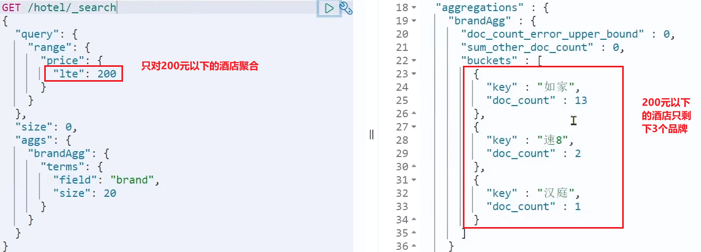

### 10.2.4.Metric聚合语法

我们对酒店按照品牌分组，形成了一个个桶。现在我们需要对桶内的酒店做运算，获取每个品牌的用户评分的min、max、avg等值。

这就要用到Metric聚合了，例如stat聚合：就可以获取min、max、avg等结果。

语法如下：

```json
GET /hotel/_search
{
  "size": 0, 
  "aggs": {
    "brandAgg": { 
      "terms": { 
        "field": "brand", 
        "size": 20
      },
      "aggs": { // 是brands聚合的子聚合，也就是分组后对每组分别计算
        "score_stats": { // 聚合名称
          "stats": { // 聚合类型，这里stats可以计算min、max、avg等
            "field": "score" // 聚合字段，这里是score
          }
        }
      }
    }
  }
}
```


这次的score_stats聚合是在brandAgg的聚合内部嵌套的子聚合。因为我们需要在每个桶分别计算。


另外，我们还可以给聚合结果做个排序，例如按照每个桶的酒店平均分做排序：

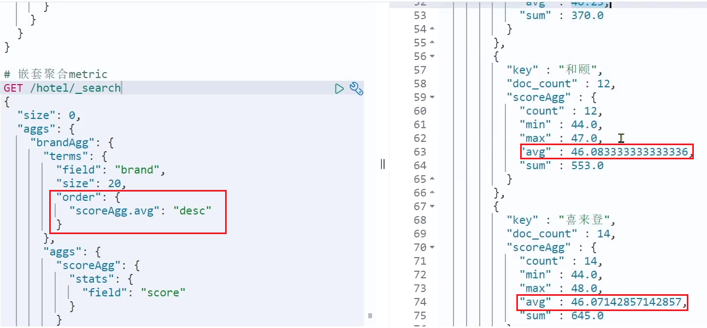

### 10.2.5.小结

aggs代表聚合，与query同级，此时query的作用是？

- 限定聚合的的文档范围

聚合必须的三要素：

- 聚合名称
- 聚合类型
- 聚合字段

聚合可配置属性有：

- size：指定聚合结果数量
- order：指定聚合结果排序方式
- field：指定聚合字段

## 10.3.RestAPI实现聚合

### 10.3.1.API语法

聚合条件与query条件同级别，因此需要使用request.source()来指定聚合条件。

聚合条件的语法：

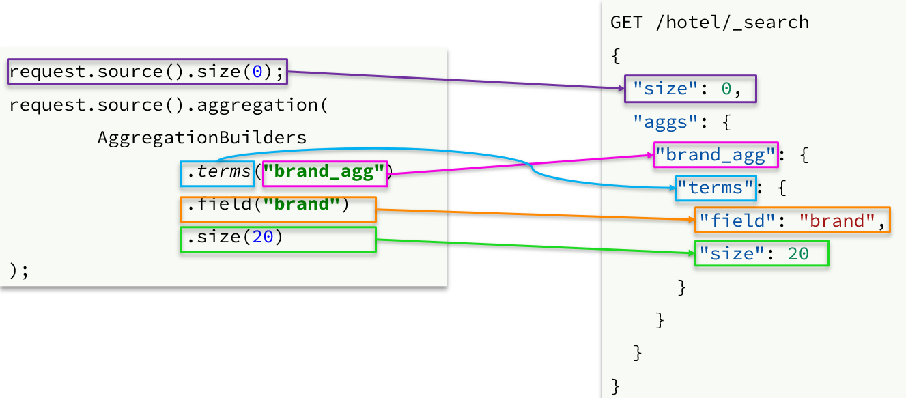


聚合的结果也与查询结果不同，API也比较特殊。不过同样是JSON逐层解析：

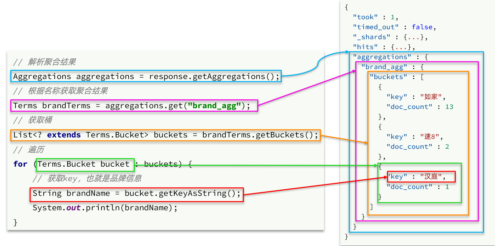

### 10.3.2.业务需求

需求：搜索页面的品牌、城市等信息不应该是在页面写死，而是通过聚合索引库中的酒店数据得来的：


分析：

目前，页面的城市列表、星级列表、品牌列表都是写死的，并不会随着搜索结果的变化而变化。但是用户搜索条件改变时，搜索结果会跟着变化。

例如：用户搜索“东方明珠”，那搜索的酒店肯定是在上海东方明珠附近，因此，城市只能是上海，此时城市列表中就不应该显示北京、深圳、杭州这些信息了。

也就是说，搜索结果中包含哪些城市，页面就应该列出哪些城市；搜索结果中包含哪些品牌，页面就应该列出哪些品牌。

如何得知搜索结果中包含哪些品牌？如何得知搜索结果中包含哪些城市？

使用聚合功能，利用Bucket聚合，对搜索结果中的文档基于品牌分组、基于城市分组，就能得知包含哪些品牌、哪些城市了。

因为是对搜索结果聚合，因此聚合是**限定范围的聚合**，也就是说聚合的限定条件跟搜索文档的条件一致。

查看浏览器可以发现，前端其实已经发出了这样的一个请求：

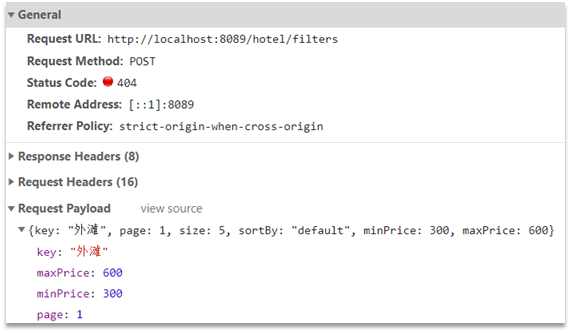

请求**参数与搜索文档的参数完全一致**。

返回值类型就是页面要展示的最终结果：

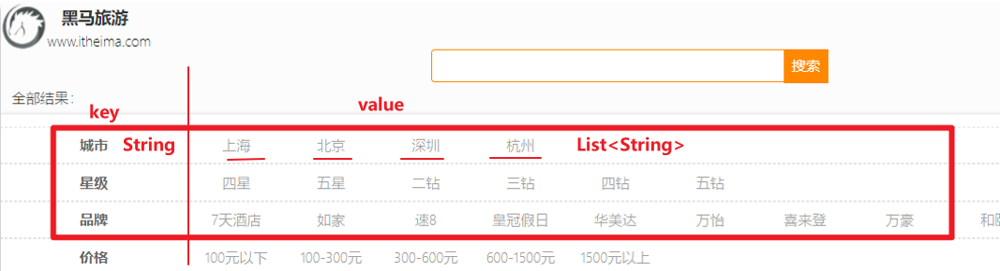

结果是一个Map结构：

- key是字符串，城市、星级、品牌、价格
- value是集合，例如多个城市的名称


### 10.3.3.业务实现

在`cn.itcast.hotel.web`包的`HotelController`中添加一个方法，遵循下面的要求：

- 请求方式：`POST`
- 请求路径：`/hotel/filters`
- 请求参数：`RequestParams`，与搜索文档的参数一致
- 返回值类型：`Map<String, List<String>>`

代码：

```java
    @PostMapping("filters")
    public Map<String, List<String>> getFilters(@RequestBody RequestParams params){
        return hotelService.getFilters(params);
    }
```


这里调用了IHotelService中的getFilters方法，尚未实现。

在`cn.itcast.hotel.service.IHotelService`中定义新方法：

```java
Map<String, List<String>> filters(RequestParams params);
```


在`cn.itcast.hotel.service.impl.HotelService`中实现该方法：

```java
@Override
public Map<String, List<String>> filters(RequestParams params) {
    try {
        // 1.准备Request
        SearchRequest request = new SearchRequest("hotel");
        // 2.准备DSL
        // 2.1.query
        buildBasicQuery(params, request);
        // 2.2.设置size
        request.source().size(0);
        // 2.3.聚合
        buildAggregation(request);
        // 3.发出请求
        SearchResponse response = client.search(request, RequestOptions.DEFAULT);
        // 4.解析结果
        Map<String, List<String>> result = new HashMap<>();
        Aggregations aggregations = response.getAggregations();
        // 4.1.根据品牌名称，获取品牌结果
        List<String> brandList = getAggByName(aggregations, "brandAgg");
        result.put("品牌", brandList);
        // 4.2.根据品牌名称，获取品牌结果
        List<String> cityList = getAggByName(aggregations, "cityAgg");
        result.put("城市", cityList);
        // 4.3.根据品牌名称，获取品牌结果
        List<String> starList = getAggByName(aggregations, "starAgg");
        result.put("星级", starList);

        return result;
    } catch (IOException e) {
        throw new RuntimeException(e);
    }
}

private void buildAggregation(SearchRequest request) {
    request.source().aggregation(AggregationBuilders
                                 .terms("brandAgg")
                                 .field("brand")
                                 .size(100)
                                );
    request.source().aggregation(AggregationBuilders
                                 .terms("cityAgg")
                                 .field("city")
                                 .size(100)
                                );
    request.source().aggregation(AggregationBuilders
                                 .terms("starAgg")
                                 .field("starName")
                                 .size(100)
                                );
}

private List<String> getAggByName(Aggregations aggregations, String aggName) {
    // 4.1.根据聚合名称获取聚合结果
    Terms brandTerms = aggregations.get(aggName);
    // 4.2.获取buckets
    List<? extends Terms.Bucket> buckets = brandTerms.getBuckets();
    // 4.3.遍历
    List<String> brandList = new ArrayList<>();
    for (Terms.Bucket bucket : buckets) {
        // 4.4.获取key
        String key = bucket.getKeyAsString();
        brandList.add(key);
    }
    return brandList;
}
```

# 12.自动补全

当用户在搜索框输入字符时，我们应该提示出与该字符有关的搜索项，如图：


这种根据用户输入的字母，提示完整词条的功能，就是自动补全了。

因为需要根据拼音字母来推断，因此要用到拼音分词功能。


## 12.1.拼音分词器

要实现根据字母做补全，就必须对文档按照拼音分词。在GitHub上恰好有elasticsearch的拼音分词插件。地址：https://github.com/medcl/elasticsearch-analysis-pinyin

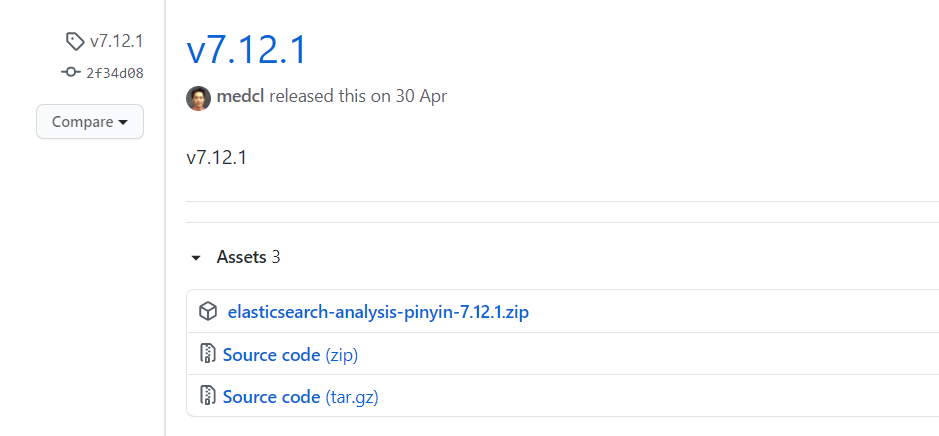


安装方式与IK分词器一样，分三步：

​	①解压

​	②上传到虚拟机中，elasticsearch的plugin目录

​	③重启elasticsearch

​	④测试


详细安装步骤可以参考IK分词器的安装过程。

测试用法如下：

```json
POST /_analyze
{
  "text": "如家酒店还不错",
  "analyzer": "pinyin"
}
```

结果：

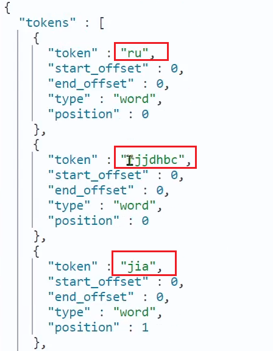 

## 12.2.自定义分词器

默认的拼音分词器会将每个汉字单独分为拼音，而我们希望的是每个词条形成一组拼音，需要对拼音分词器做个性化定制，形成自定义分词器。

elasticsearch中分词器（analyzer）的组成包含三部分：

- character filters：在tokenizer之前对文本进行处理。例如删除字符、替换字符
- tokenizer：将文本按照一定的规则切割成词条（term）。例如keyword，就是不分词；还有ik_smart
- tokenizer filter：将tokenizer输出的词条做进一步处理。例如大小写转换、同义词处理、拼音处理等

文档分词时会依次由这三部分来处理文档：

   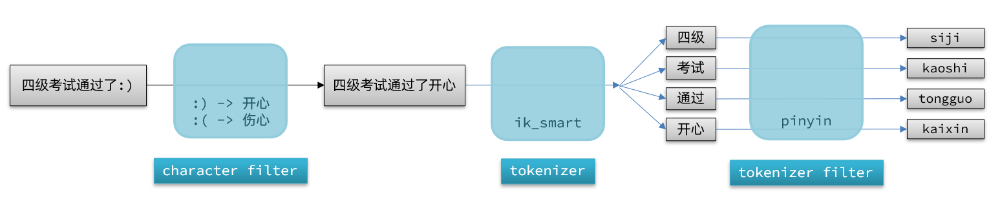

声明自定义分词器的语法如下：

```json
PUT /test
{
  "settings": {
    "analysis": {
      "analyzer": { // 自定义分词器
        "my_analyzer": {  // 分词器名称
          "tokenizer": "ik_max_word",
          "filter": "py"
        }
      },
      "filter": { // 自定义tokenizer filter
        "py": { // 过滤器名称
          "type": "pinyin", // 过滤器类型，这里是pinyin
		  "keep_full_pinyin": false,
          "keep_joined_full_pinyin": true,
          "keep_original": true,
          "limit_first_letter_length": 16,
          "remove_duplicated_term": true,
          "none_chinese_pinyin_tokenize": false
        }
      }
    }
  },
  "mappings": {
    "properties": {
      "name": {
        "type": "text",
        "analyzer": "my_analyzer",
        "search_analyzer": "ik_smart"
      }
    }
  }
}
```

测试：

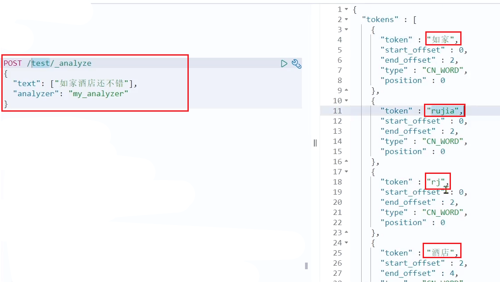

总结：

如何使用拼音分词器？

- ①下载pinyin分词器

- ②解压并放到elasticsearch的plugin目录

- ③重启即可

如何自定义分词器？

- ①创建索引库时，在settings中配置，可以包含三部分

- ②character filter

- ③tokenizer

- ④filter

拼音分词器注意事项？

- 为了避免搜索到同音字，搜索时不要使用拼音分词器


## 12.3.自动补全查询

elasticsearch提供了[Completion Suggester](https://www.elastic.co/guide/en/elasticsearch/reference/7.6/search-suggesters.html)查询来实现自动补全功能。这个查询会匹配以用户输入内容开头的词条并返回。为了提高补全查询的效率，对于文档中字段的类型有一些约束：

- 参与补全查询的字段必须是completion类型。

- 字段的内容一般是用来补全的多个词条形成的数组。

比如，一个这样的索引库：

```json
// 创建索引库
PUT test
{
  "mappings": {
    "properties": {
      "title":{
        "type": "completion"
      }
    }
  }
}
```

然后插入下面的数据：

```json
// 示例数据
POST test/_doc
{
  "title": ["Sony", "WH-1000XM3"]
}
POST test/_doc
{
  "title": ["SK-II", "PITERA"]
}
POST test/_doc
{
  "title": ["Nintendo", "switch"]
}
```

查询的DSL语句如下：

```json
// 自动补全查询
GET /test/_search
{
  "suggest": {
    "title_suggest": {
      "text": "s", // 关键字
      "completion": {
        "field": "title", // 补全查询的字段
        "skip_duplicates": true, // 跳过重复的
        "size": 10 // 获取前10条结果
      }
    }
  }
}
```

## 12.4.实现酒店搜索框自动补全

现在，我们的hotel索引库还没有设置拼音分词器，需要修改索引库中的配置。但是我们知道索引库是无法修改的，只能删除然后重新创建。

另外，我们需要添加一个字段，用来做自动补全，将brand、suggestion、city等都放进去，作为自动补全的提示。

因此，总结一下，我们需要做的事情包括：

1. 修改hotel索引库结构，设置自定义拼音分词器

2. 修改索引库的name、all字段，使用自定义分词器

3. 索引库添加一个新字段suggestion，类型为completion类型，使用自定义的分词器

4. 给HotelDoc类添加suggestion字段，内容包含brand、business

5. 重新导入数据到hotel库


### 2.4.1.修改酒店映射结构

代码如下：

```json
// 酒店数据索引库
PUT /hotel
{
  "settings": {
    "analysis": {
      "analyzer": {
        "text_anlyzer": {
          "tokenizer": "ik_max_word",
          "filter": "py"
        },
        "completion_analyzer": {
          "tokenizer": "keyword",
          "filter": "py"
        }
      },
      "filter": {
        "py": {
          "type": "pinyin",
          "keep_full_pinyin": false,
          "keep_joined_full_pinyin": true,
          "keep_original": true,
          "limit_first_letter_length": 16,
          "remove_duplicated_term": true,
          "none_chinese_pinyin_tokenize": false
        }
      }
    }
  },
  "mappings": {
    "properties": {
      "id":{
        "type": "keyword"
      },
      "name":{
        "type": "text",
        "analyzer": "text_anlyzer",
        "search_analyzer": "ik_smart",
        "copy_to": "all"
      },
      "address":{
        "type": "keyword",
        "index": false
      },
      "price":{
        "type": "integer"
      },
      "score":{
        "type": "integer"
      },
      "brand":{
        "type": "keyword",
        "copy_to": "all"
      },
      "city":{
        "type": "keyword"
      },
      "starName":{
        "type": "keyword"
      },
      "business":{
        "type": "keyword",
        "copy_to": "all"
      },
      "location":{
        "type": "geo_point"
      },
      "pic":{
        "type": "keyword",
        "index": false
      },
      "all":{
        "type": "text",
        "analyzer": "text_anlyzer",
        "search_analyzer": "ik_smart"
      },
      "suggestion":{
          "type": "completion",
          "analyzer": "completion_analyzer"
      }
    }
  }
}
```


### 12.4.2.修改HotelDoc实体

HotelDoc中要添加一个字段，用来做自动补全，内容可以是酒店品牌、城市、商圈等信息。按照自动补全字段的要求，最好是这些字段的数组。

因此我们在HotelDoc中添加一个suggestion字段，类型为`List<String>`，然后将brand、city、business等信息放到里面。

代码如下：

```java
package cn.itcast.hotel.pojo;

import lombok.Data;
import lombok.NoArgsConstructor;

import java.util.ArrayList;
import java.util.Arrays;
import java.util.Collections;
import java.util.List;

@Data
@NoArgsConstructor
public class HotelDoc {
    private Long id;
    private String name;
    private String address;
    private Integer price;
    private Integer score;
    private String brand;
    private String city;
    private String starName;
    private String business;
    private String location;
    private String pic;
    private Object distance;
    private Boolean isAD;
    private List<String> suggestion;

    public HotelDoc(Hotel hotel) {
        this.id = hotel.getId();
        this.name = hotel.getName();
        this.address = hotel.getAddress();
        this.price = hotel.getPrice();
        this.score = hotel.getScore();
        this.brand = hotel.getBrand();
        this.city = hotel.getCity();
        this.starName = hotel.getStarName();
        this.business = hotel.getBusiness();
        this.location = hotel.getLatitude() + ", " + hotel.getLongitude();
        this.pic = hotel.getPic();
        // 组装suggestion
        if(this.business.contains("/")){
            // business有多个值，需要切割
            String[] arr = this.business.split("/");
            // 添加元素
            this.suggestion = new ArrayList<>();
            this.suggestion.add(this.brand);
            Collections.addAll(this.suggestion, arr);
        }else {
            this.suggestion = Arrays.asList(this.brand, this.business);
        }
    }
}
```

### 12.4.3.重新导入

重新执行之前编写的导入数据功能，可以看到新的酒店数据中包含了suggestion：

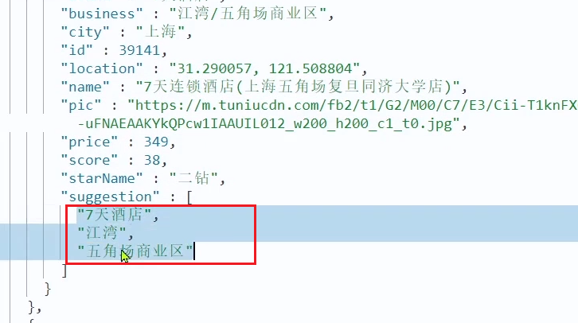


### 12.4.4.自动补全查询的JavaAPI

之前我们学习了自动补全查询的DSL，而没有学习对应的JavaAPI，这里给出一个示例：

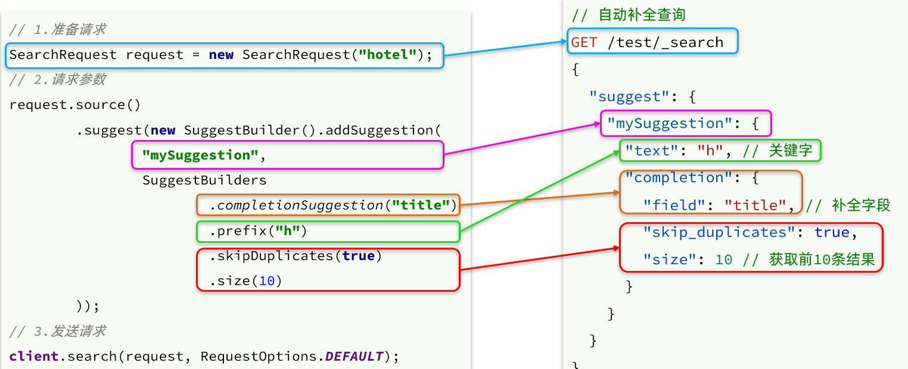

而自动补全的结果也比较特殊，解析的代码如下：

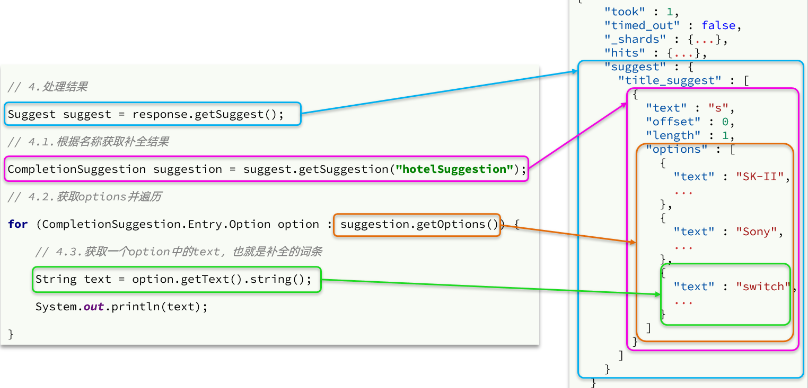

### 12.4.5.实现搜索框自动补全

查看前端页面，可以发现当我们在输入框键入时，前端会发起ajax请求：

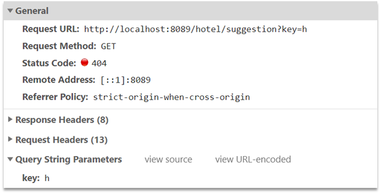

返回值是补全词条的集合，类型为`List<String>`

1）在`cn.itcast.hotel.web`包下的`HotelController`中添加新接口，接收新的请求：

```java
@GetMapping("suggestion")
public List<String> getSuggestions(@RequestParam("key") String prefix) {
    return hotelService.getSuggestions(prefix);
}
```

2）在`cn.itcast.hotel.service`包下的`IhotelService`中添加方法：

```java
List<String> getSuggestions(String prefix);
```


3）在`cn.itcast.hotel.service.impl.HotelService`中实现该方法：

```java
@Override
public List<String> getSuggestions(String prefix) {
    try {
        // 1.准备Request
        SearchRequest request = new SearchRequest("hotel");
        // 2.准备DSL
        request.source().suggest(new SuggestBuilder().addSuggestion(
            "suggestions",
            SuggestBuilders.completionSuggestion("suggestion")
            .prefix(prefix)
            .skipDuplicates(true)
            .size(10)
        ));
        // 3.发起请求
        SearchResponse response = client.search(request, RequestOptions.DEFAULT);
        // 4.解析结果
        Suggest suggest = response.getSuggest();
        // 4.1.根据补全查询名称，获取补全结果
        CompletionSuggestion suggestions = suggest.getSuggestion("suggestions");
        // 4.2.获取options
        List<CompletionSuggestion.Entry.Option> options = suggestions.getOptions();
        // 4.3.遍历
        List<String> list = new ArrayList<>(options.size());
        for (CompletionSuggestion.Entry.Option option : options) {
            String text = option.getText().toString();
            list.add(text);
        }
        return list;
    } catch (IOException e) {
        throw new RuntimeException(e);
    }
}
```


# 13.数据同步

elasticsearch中的酒店数据来自于mysql数据库，因此mysql数据发生改变时，elasticsearch也必须跟着改变，这个就是elasticsearch与mysql之间的**数据同步**。


## 13.1.思路分析

常见的数据同步方案有三种：

- 同步调用
- 异步通知
- 监听binlog

### 13.1.1.同步调用

方案一：同步调用


基本步骤如下：

- hotel-demo对外提供接口，用来修改elasticsearch中的数据
- 酒店管理服务在完成数据库操作后，直接调用hotel-demo提供的接口，

### 13.1.2.异步通知

方案二：异步通知

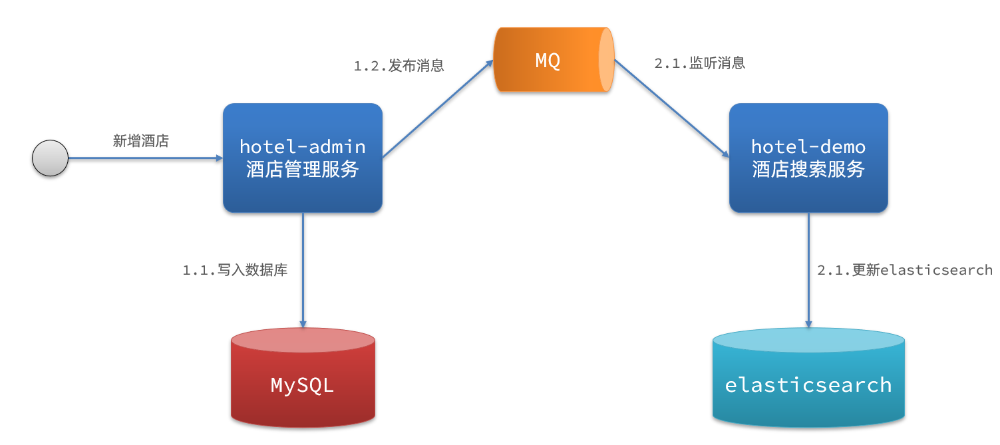

流程如下：

- hotel-admin对mysql数据库数据完成增、删、改后，发送MQ消息
- hotel-demo监听MQ，接收到消息后完成elasticsearch数据修改


### 13.1.3.监听binlog

方案三：监听binlog

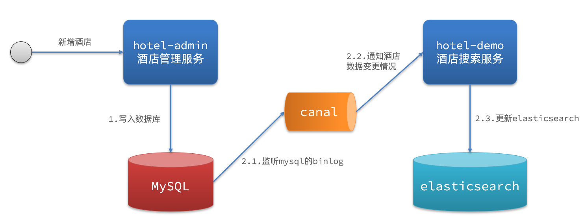

流程如下：

- 给mysql开启binlog功能
- mysql完成增、删、改操作都会记录在binlog中
- hotel-demo基于canal监听binlog变化，实时更新elasticsearch中的内容

### 13.1.4.选择

方式一：同步调用

- 优点：实现简单，粗暴
- 缺点：业务耦合度高

方式二：异步通知

- 优点：低耦合，实现难度一般
- 缺点：依赖mq的可靠性

方式三：监听binlog

- 优点：完全解除服务间耦合
- 缺点：开启binlog增加数据库负担、实现复杂度高


# 14.集群

单机的elasticsearch做数据存储，必然面临两个问题：海量数据存储问题、单点故障问题。

- 海量数据存储问题：将索引库从逻辑上拆分为N个分片（shard），存储到多个节点
- 单点故障问题：将分片数据在不同节点备份（replica ）

**ES集群相关概念**:

* 集群（cluster）：一组拥有共同的 cluster name 的 节点。

* <font color="red">节点（node)</font>   ：集群中的一个 Elasticearch 实例

* <font color="red">分片（shard）</font>：索引可以被拆分为不同的部分进行存储，称为分片。在集群环境下，一个索引的不同分片可以拆分到不同的节点中

  解决问题：数据量太大，单点存储量有限的问题。

  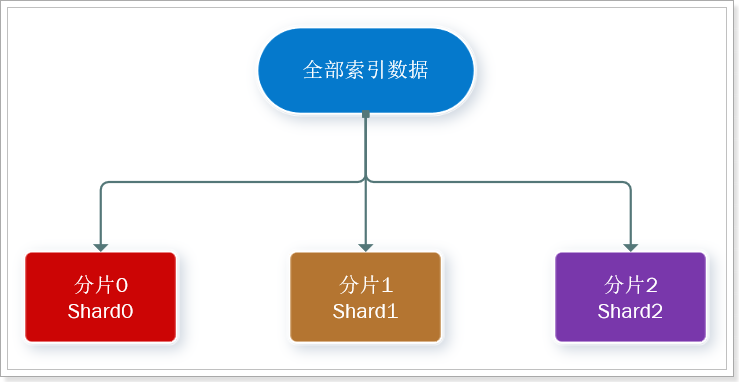

  > 此处，我们把数据分成3片：shard0、shard1、shard2

* 主分片（Primary shard）：相对于副本分片的定义。

* 副本分片（Replica shard）每个主分片可以有一个或者多个副本，数据和主分片一样。

数据备份可以保证高可用，但是每个分片备份一份，所需要的节点数量就会翻一倍，成本实在是太高了！

为了在高可用和成本间寻求平衡，我们可以这样做：

- 首先对数据分片，存储到不同节点
- 然后对每个分片进行备份，放到对方节点，完成互相备份

这样可以大大减少所需要的服务节点数量，如图，我们以3分片，每个分片备份一份为例：

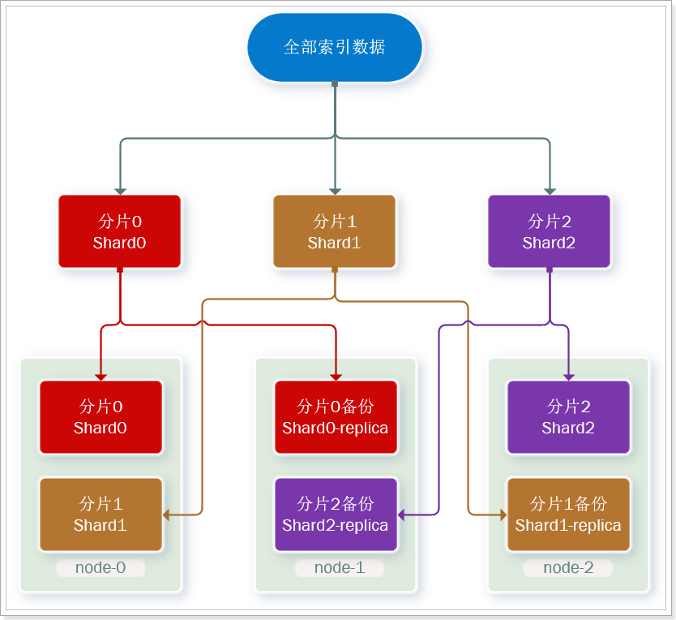

现在，每个分片都有1个备份，存储在3个节点：

- node0：保存了分片0和1
- node1：保存了分片0和2
- node2：保存了分片1和2


## 14.1.搭建ES集群

参考安装文档

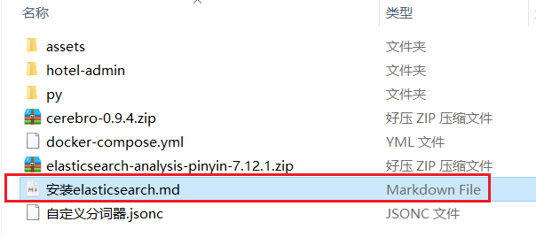 

其中的第四章节：

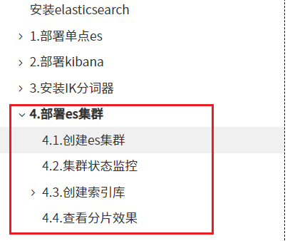 


## 14.2.集群脑裂问题

### 14.2.1.集群职责划分

elasticsearch中集群节点有不同的职责划分：

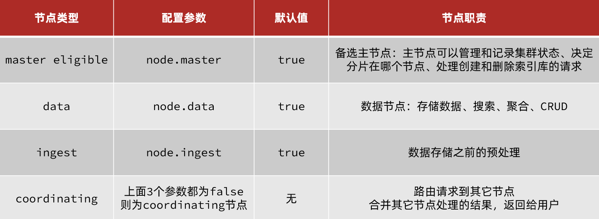

默认情况下，集群中的任何一个节点都同时具备上述四种角色。

但是真实的集群一定要将集群职责分离：

- master节点：对CPU要求高，但是内存要求第
- data节点：对CPU和内存要求都高
- coordinating节点：对网络带宽、CPU要求高

职责分离可以让我们根据不同节点的需求分配不同的硬件去部署。而且避免业务之间的互相干扰。

一个典型的es集群职责划分如图：

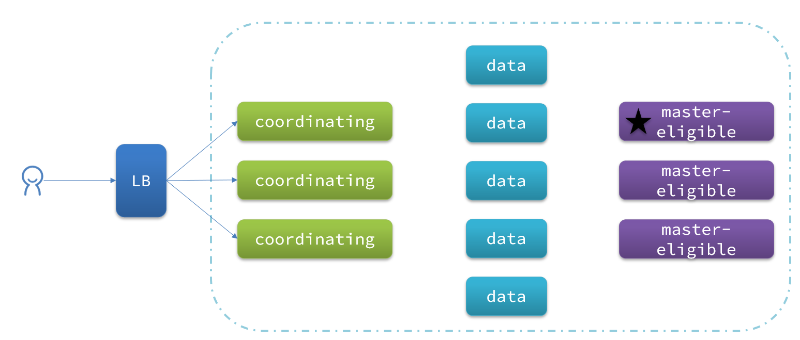


### 14.2.2.脑裂问题

脑裂是因为集群中的节点失联导致的。

例如一个集群中，主节点与其它节点失联：

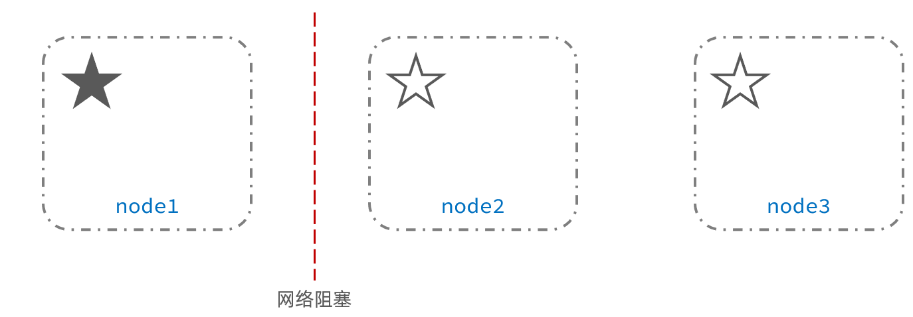

此时，node2和node3认为node1宕机，就会重新选主：

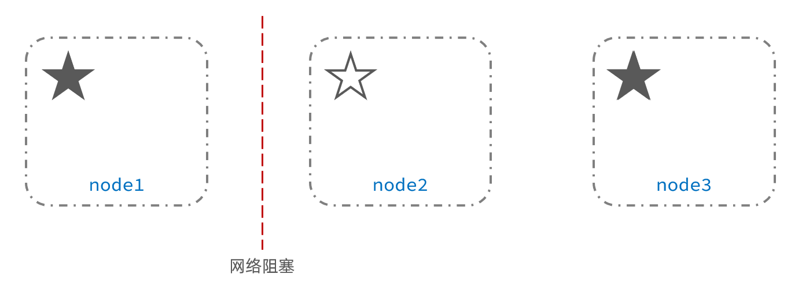

当node3当选后，集群继续对外提供服务，node2和node3自成集群，node1自成集群，两个集群数据不同步，出现数据差异。

当网络恢复后，因为集群中有两个master节点，集群状态的不一致，出现脑裂的情况：

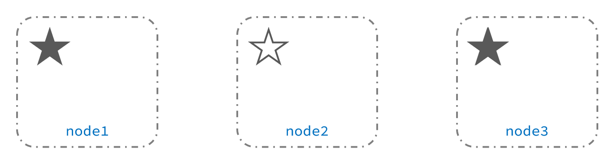

解决脑裂的方案是，要求选票超过 ( eligible节点数量 + 1 ）/ 2 才能当选为主，因此eligible节点数量最好是奇数。对应配置项是discovery.zen.minimum_master_nodes，在es7.0以后，已经成为默认配置，因此一般不会发生脑裂问题


例如：3个节点形成的集群，选票必须超过 （3 + 1） / 2 ，也就是2票。node3得到node2和node3的选票，当选为主。node1只有自己1票，没有当选。集群中依然只有1个主节点，没有出现脑裂。


### 14.2.3.小结

master eligible节点的作用是什么？

- 参与集群选主
- 主节点可以管理集群状态、管理分片信息、处理创建和删除索引库的请求

data节点的作用是什么？

- 数据的CRUD

coordinator节点的作用是什么？

- 路由请求到其它节点

- 合并查询到的结果，返回给用户


## 14.3.集群分布式存储

当新增文档时，应该保存到不同分片，保证数据均衡，那么coordinating node如何确定数据该存储到哪个分片呢？


### 14.3.1.分片存储测试

插入三条数据：

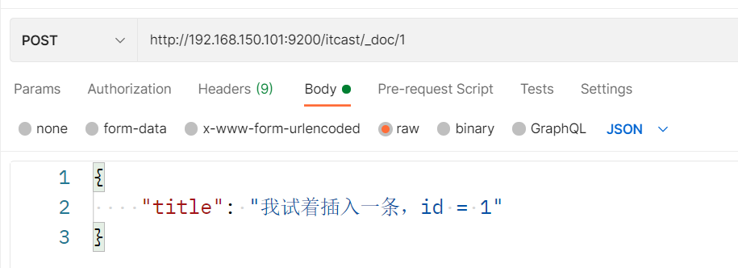


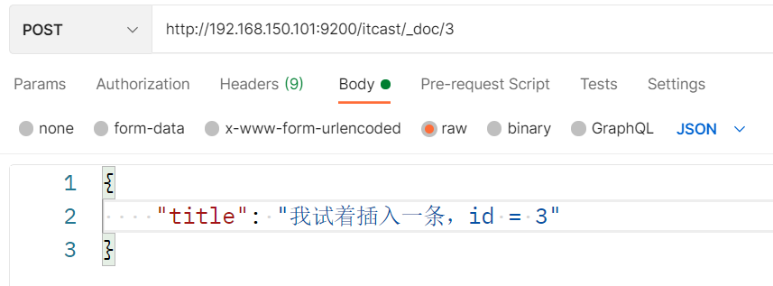

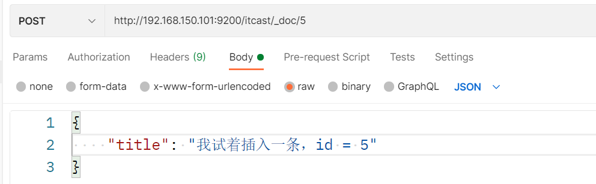


测试可以看到，三条数据分别在不同分片：

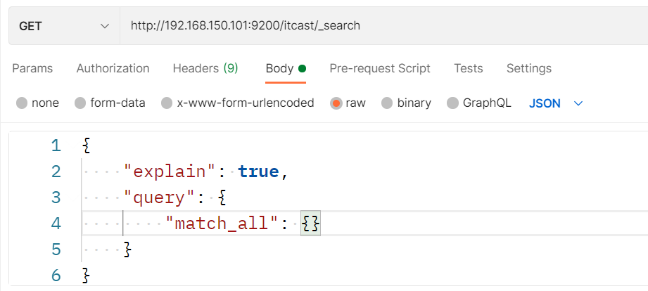

结果：

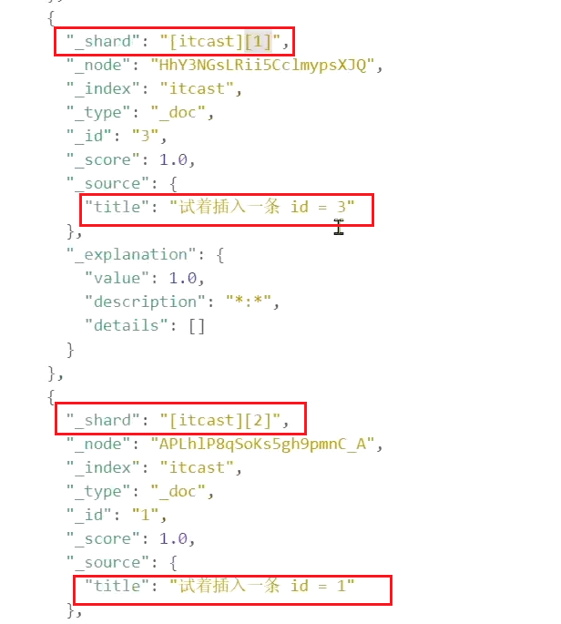


### 14.3.2.分片存储原理

elasticsearch会通过hash算法来计算文档应该存储到哪个分片：


说明：

- _routing默认是文档的id
- 算法与分片数量有关，因此索引库一旦创建，分片数量不能修改！


新增文档的流程如下：

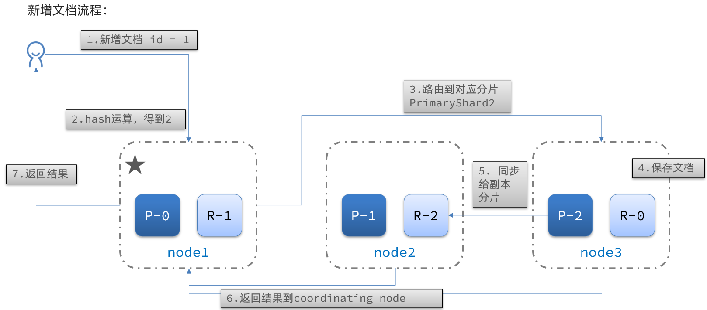

解读：

- 1）新增一个id=1的文档
- 2）对id做hash运算，假如得到的是2，则应该存储到shard-2
- 3）shard-2的主分片在node3节点，将数据路由到node3
- 4）保存文档
- 5）同步给shard-2的副本replica-2，在node2节点
- 6）返回结果给coordinating-node节点


## 14.4.集群分布式查询

elasticsearch的查询分成两个阶段：

- scatter phase：分散阶段，coordinating node会把请求分发到每一个分片

- gather phase：聚集阶段，coordinating node汇总data node的搜索结果，并处理为最终结果集返回给用户

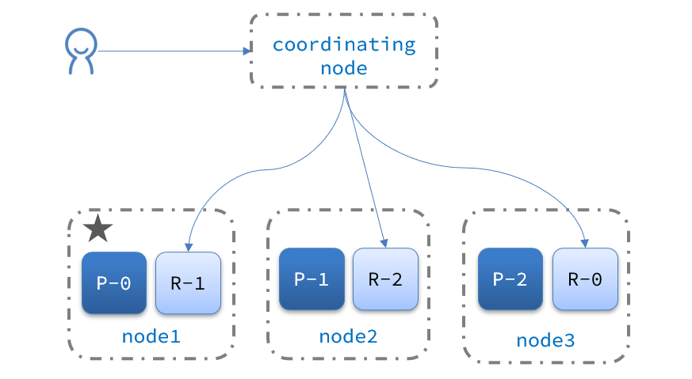


## 14.5.集群故障转移

集群的master节点会监控集群中的节点状态，如果发现有节点宕机，会立即将宕机节点的分片数据迁移到其它节点，确保数据安全，这个叫做故障转移。


1）例如一个集群结构如图：

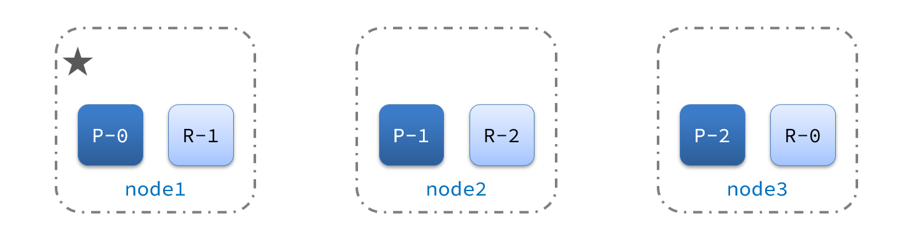

现在，node1是主节点，其它两个节点是从节点。


2）突然，node1发生了故障：

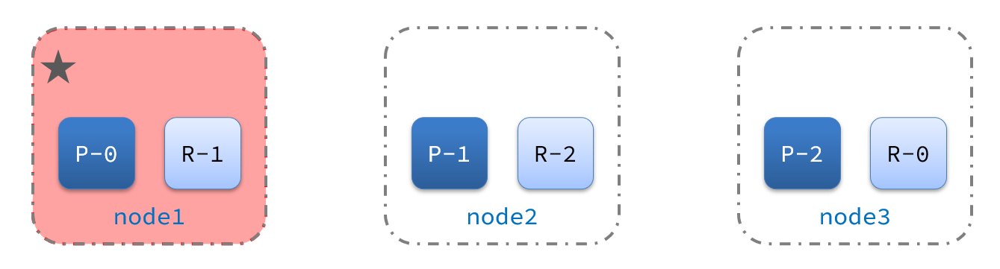


宕机后的第一件事，需要重新选主，例如选中了node2：

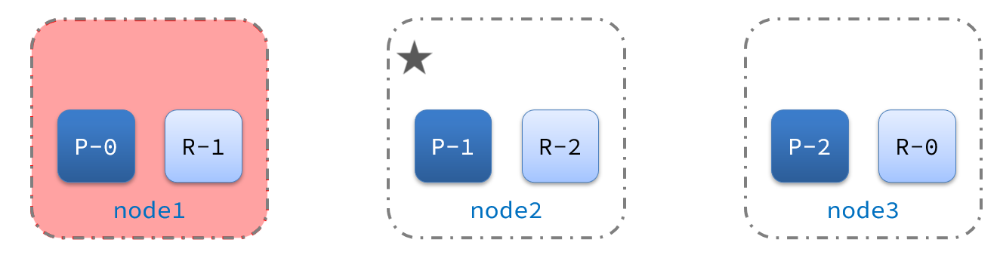


node2成为主节点后，会检测集群监控状态，发现：shard-1、shard-0没有副本节点。因此需要将node1上的数据迁移到node2、node3：

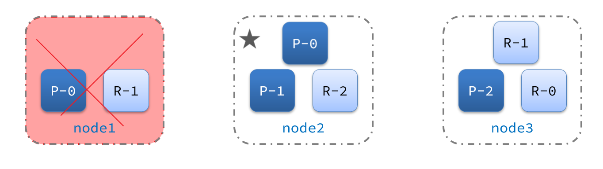


## 安装elasticsearch.md
# 安装elasticsearch

# 1.部署单点es

## 1.1.创建网络

因为我们还需要部署kibana容器，因此需要让es和kibana容器互联。这里先创建一个网络：

```sh
docker network create es-net
```

## 1.2.加载镜像


```sh
# 拉取镜像
docker pull elasticsearch

```

同理还有`kibana`的tar包也需要这样做。


## 1.3.运行

运行docker命令，部署单点es：

```sh
docker run -d \
	--name es \
    -e "ES_JAVA_OPTS=-Xms512m -Xmx512m" \
    -e "discovery.type=single-node" \
    -v es-data:/usr/share/elasticsearch/data \
    -v es-plugins:/usr/share/elasticsearch/plugins \
    --privileged \
    --network es-net \
    -p 9200:9200 \
    -p 9300:9300 \
elasticsearch:7.12.1
```

命令解释：

- `-e "cluster.name=es-docker-cluster"`：设置集群名称
- `-e "http.host=0.0.0.0"`：监听的地址，可以外网访问
- `-e "ES_JAVA_OPTS=-Xms512m -Xmx512m"`：内存大小
- `-e "discovery.type=single-node"`：非集群模式
- `-v es-data:/usr/share/elasticsearch/data`：挂载逻辑卷，绑定es的数据目录
- `-v es-logs:/usr/share/elasticsearch/logs`：挂载逻辑卷，绑定es的日志目录
- `-v es-plugins:/usr/share/elasticsearch/plugins`：挂载逻辑卷，绑定es的插件目录
- `--privileged`：授予逻辑卷访问权
- `--network es-net` ：加入一个名为es-net的网络中
- `-p 9200:9200`：端口映射配置


在浏览器中输入：http://:9200 即可看到elasticsearch的响应结果：

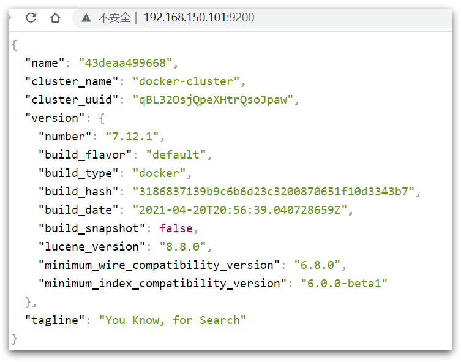


# 2.部署kibana

kibana可以给我们提供一个elasticsearch的可视化界面，便于我们学习。

## 2.1.部署

运行docker命令，部署kibana

```sh
docker run -d \
--name kibana \
-e ELASTICSEARCH_HOSTS=http://es:9200 \
--network=es-net \
-p 5601:5601  \
kibana:7.12.1
```

- `--network es-net` ：加入一个名为es-net的网络中，与elasticsearch在同一个网络中
- `-e ELASTICSEARCH_HOSTS=http://es:9200"`：设置elasticsearch的地址，因为kibana已经与elasticsearch在一个网络，因此可以用容器名直接访问elasticsearch
- `-p 5601:5601`：端口映射配置

kibana启动一般比较慢，需要多等待一会，可以通过命令：

```sh
docker logs -f kibana
```

查看运行日志，当查看到下面的日志，说明成功：

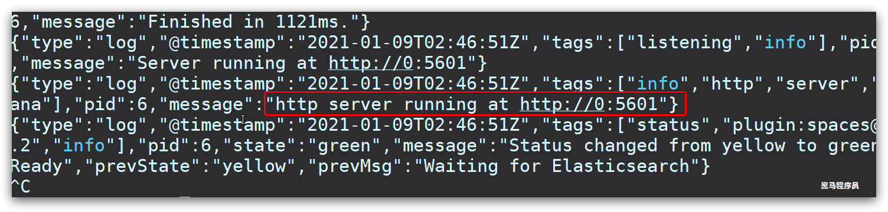

此时，在浏览器输入地址访问：http://192.168.150.101:5601，即可看到结果

## 2.2.DevTools

kibana中提供了一个DevTools界面：


这个界面中可以编写DSL来操作elasticsearch。并且对DSL语句有自动补全功能。

# 3.安装IK分词器

## 3.1.在线安装ik插件（较慢）

```shell
# 进入容器内部
docker exec -it elasticsearch /bin/bash

# 在线下载并安装
./bin/elasticsearch-plugin  install https://github.com/medcl/elasticsearch-analysis-ik/releases/download/v7.12.1/elasticsearch-analysis-ik-7.12.1.zip

#退出
exit
#重启容器
docker restart elasticsearch
```

## 3.2.离线安装ik插件（推荐）

### 1）查看数据卷目录

安装插件需要知道elasticsearch的plugins目录位置，而我们用了数据卷挂载，因此需要查看elasticsearch的数据卷目录，通过下面命令查看:

```sh
docker volume inspect es-plugins
```

显示结果：

```json
[
    {
        "CreatedAt": "2022-05-06T10:06:34+08:00",
        "Driver": "local",
        "Labels": null,
        "Mountpoint": "/var/lib/docker/volumes/es-plugins/_data",
        "Name": "es-plugins",
        "Options": null,
        "Scope": "local"
    }
]
```

说明plugins目录被挂载到了：`/var/lib/docker/volumes/es-plugins/_data `这个目录中。

### 2）解压缩分词器安装包

下面我们需要把ik分词器解压缩，重命名为ik

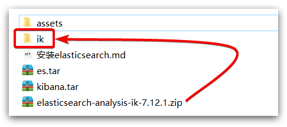

### 3）上传到es容器的插件数据卷中

也就是`/var/lib/docker/volumes/es-plugins/_data `：

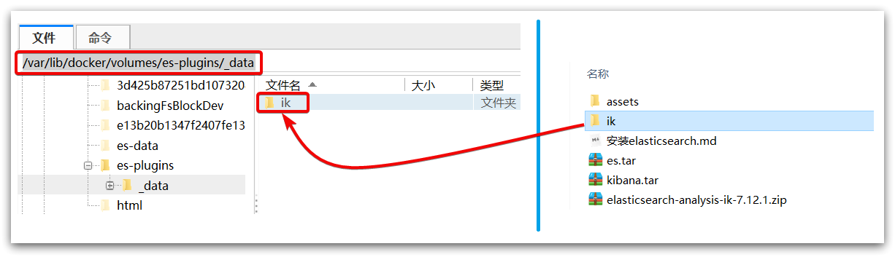


###  4）重启容器

```shell
# 4、重启容器
docker restart es
```

```sh
# 查看es日志
docker logs -f es
```

### 5）测试：

IK分词器包含两种模式：

* `ik_smart`：最少切分

* `ik_max_word`：最细切分


```json
GET /_analyze
{
  "analyzer": "ik_max_word",
  "text": "黑马程序员学习java太棒了"
}
```

结果：

```json
{
  "tokens" : [
    {
      "token" : "黑马",
      "start_offset" : 0,
      "end_offset" : 2,
      "type" : "CN_WORD",
      "position" : 0
    },
    {
      "token" : "程序员",
      "start_offset" : 2,
      "end_offset" : 5,
      "type" : "CN_WORD",
      "position" : 1
    },
    {
      "token" : "程序",
      "start_offset" : 2,
      "end_offset" : 4,
      "type" : "CN_WORD",
      "position" : 2
    },
    {
      "token" : "员",
      "start_offset" : 4,
      "end_offset" : 5,
      "type" : "CN_CHAR",
      "position" : 3
    },
    {
      "token" : "学习",
      "start_offset" : 5,
      "end_offset" : 7,
      "type" : "CN_WORD",
      "position" : 4
    },
    {
      "token" : "java",
      "start_offset" : 7,
      "end_offset" : 11,
      "type" : "ENGLISH",
      "position" : 5
    },
    {
      "token" : "太棒了",
      "start_offset" : 11,
      "end_offset" : 14,
      "type" : "CN_WORD",
      "position" : 6
    },
    {
      "token" : "太棒",
      "start_offset" : 11,
      "end_offset" : 13,
      "type" : "CN_WORD",
      "position" : 7
    },
    {
      "token" : "了",
      "start_offset" : 13,
      "end_offset" : 14,
      "type" : "CN_CHAR",
      "position" : 8
    }
  ]
}
```


## 3.3 扩展词词典

随着互联网的发展，“造词运动”也越发的频繁。出现了很多新的词语，在原有的词汇列表中并不存在。比如：“奥力给” 等。

所以我们的词汇也需要不断的更新，IK分词器提供了扩展词汇的功能。

1）打开IK分词器config目录：

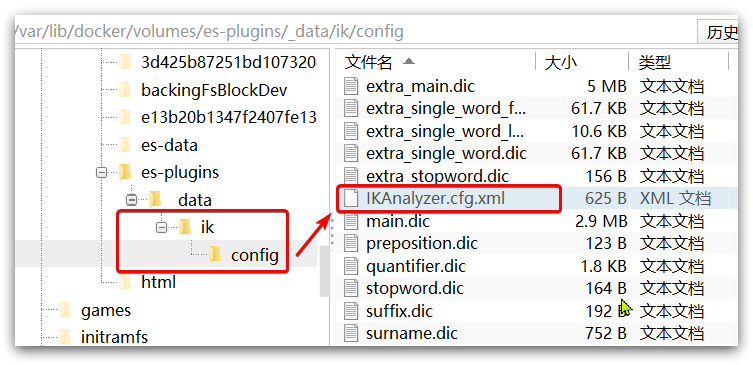

2）在IKAnalyzer.cfg.xml配置文件内容添加：

```xml
<?xml version="1.0" encoding="UTF-8"?>
<!DOCTYPE properties SYSTEM "http://java.sun.com/dtd/properties.dtd">
<properties>
        <comment>IK Analyzer 扩展配置</comment>
        <!--用户可以在这里配置自己的扩展字典 *** 添加扩展词典-->
        <entry key="ext_dict">ext.dic</entry>
</properties>
```

3）新建一个 ext.dic，可以参考config目录下复制一个配置文件进行修改

```properties
传智播客
奥力给
```

4）重启elasticsearch 

```sh
docker restart es

# 查看 日志
docker logs -f elasticsearch
```

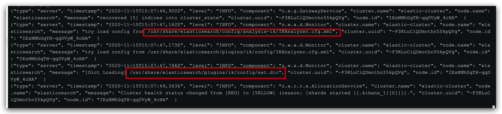

日志中已经成功加载ext.dic配置文件

5）测试效果：

```json
GET /_analyze
{
  "analyzer": "ik_max_word",
  "text": "传智播客Java就业超过90%,奥力给！"
}
```

> 注意当前文件的编码必须是 UTF-8 格式，严禁使用Windows记事本编辑

## 3.4 停用词词典

在互联网项目中，在网络间传输的速度很快，所以很多语言是不允许在网络上传递的，如：关于宗教、政治等敏感词语，那么我们在搜索时也应该忽略当前词汇。

IK分词器也提供了强大的停用词功能，让我们在索引时就直接忽略当前的停用词汇表中的内容。

1）IKAnalyzer.cfg.xml配置文件内容添加：

```xml
<?xml version="1.0" encoding="UTF-8"?>
<!DOCTYPE properties SYSTEM "http://java.sun.com/dtd/properties.dtd">
<properties>
        <comment>IK Analyzer 扩展配置</comment>
        <!--用户可以在这里配置自己的扩展字典-->
        <entry key="ext_dict">ext.dic</entry>
         <!--用户可以在这里配置自己的扩展停止词字典  *** 添加停用词词典-->
        <entry key="ext_stopwords">stopword.dic</entry>
</properties>
```

3）在 stopword.dic 添加停用词

```properties
习大大
```

4）重启elasticsearch 

```sh
# 重启服务
docker restart elasticsearch
docker restart kibana

# 查看 日志
docker logs -f elasticsearch
```

日志中已经成功加载stopword.dic配置文件

5）测试效果：

```json
GET /_analyze
{
  "analyzer": "ik_max_word",
  "text": "传智播客Java就业率超过95%,习大大都点赞,奥力给！"
}
```

> 注意当前文件的编码必须是 UTF-8 格式，严禁使用Windows记事本编辑


# 4.部署es集群

部署es集群可以直接使用docker-compose来完成，不过要求你的Linux虚拟机至少有**4G**的内存空间


首先编写一个docker-compose文件，内容如下：

```sh
version: '2.2'
services:
  es01:
    image: docker.elastic.co/elasticsearch/elasticsearch:7.12.1
    container_name: es01
    environment:
      - node.name=es01
      - cluster.name=es-docker-cluster
      - discovery.seed_hosts=es02,es03
      - cluster.initial_master_nodes=es01,es02,es03
      - bootstrap.memory_lock=true
      - "ES_JAVA_OPTS=-Xms512m -Xmx512m"
    ulimits:
      memlock:
        soft: -1
        hard: -1
    volumes:
      - data01:/usr/share/elasticsearch/data
    ports:
      - 9200:9200
    networks:
      - elastic
  es02:
    image: docker.elastic.co/elasticsearch/elasticsearch:7.12.1
    container_name: es02
    environment:
      - node.name=es02
      - cluster.name=es-docker-cluster
      - discovery.seed_hosts=es01,es03
      - cluster.initial_master_nodes=es01,es02,es03
      - bootstrap.memory_lock=true
      - "ES_JAVA_OPTS=-Xms512m -Xmx512m"
    ulimits:
      memlock:
        soft: -1
        hard: -1
    volumes:
      - data02:/usr/share/elasticsearch/data
    networks:
      - elastic
  es03:
    image: docker.elastic.co/elasticsearch/elasticsearch:7.12.1
    container_name: es03
    environment:
      - node.name=es03
      - cluster.name=es-docker-cluster
      - discovery.seed_hosts=es01,es02
      - cluster.initial_master_nodes=es01,es02,es03
      - bootstrap.memory_lock=true
      - "ES_JAVA_OPTS=-Xms512m -Xmx512m"
    ulimits:
      memlock:
        soft: -1
        hard: -1
    volumes:
      - data03:/usr/share/elasticsearch/data
    networks:
      - elastic

volumes:
  data01:
    driver: local
  data02:
    driver: local
  data03:
    driver: local

networks:
  elastic:
    driver: bridge
```


Run `docker-compose` to bring up the cluster:

```sh
docker-compose up
```


## mac 安装redis和MongoDB和.md
# mac 安装redis

## 使用Homebrew安装Redis/MongoDB/activemq/elasticsearch
```
brew install redis
brew install mongodb-community@5.0
brew services start elastic/tap/elasticsearch-full

brew install activemq
```
## 出现安装不成功的包时需要先安装依赖包
```
brew install xx@xx
```

## 启动redis/MongoDB
```
brew services start redis
brew services start mongodb-community@5.0

brew services stop mongodb-community@5.0

brew services start elastic/tap/elasticsearch-full

elasticsearch
redis-server

# 作为后端运行
mongod --config /usr/local/etc/mongod.conf --fork

mongod --config /opt/homebrew/etc/mongod.conf --fork

activemq start
http://localhost:8161/
用户名：admin 密码admin
```

## config文件位置
```
/opt/homebrew/etc/redis.conf
```
## 使用redis/MongoDB
```
redis-cli


mongosh 
或者
mongo

```
