# Docker 容器化

> **原文归档**：[archive/old-docker-notes/](../archive/old-docker-notes/)
> 包含：2 个文件（Docker 入门 + CentOS7 安装 Docker）

## 一、核心主题概述

Docker 是一种基于 Linux 容器技术（cgroup / namespace / UnionFS）的应用打包与运行引擎。它把应用代码、运行时、系统函数库、依赖和配置打包成一个**只读镜像（Image）**，镜像启动后形成相互隔离的**容器（Container）**进程。核心收益是：

- **一次构建，到处运行**：镜像携带完整运行环境，只需宿主机内核兼容即可启动。
- **环境一致性**：开发、测试、生产使用同一镜像，避免“在我机器上能跑”。
- **轻量隔离**：容器共享宿主机内核，没有虚拟机的硬件模拟开销，启动秒级、镜像 MB 级。
- **快速扩缩容**：镜像可版本化、可分发，配合编排系统可实现自动化部署。

本文档归档了 2 份原始笔记：

- `docker.md`：Docker 入门、镜像与容器操作、数据卷、Dockerfile 自定义镜像、Docker Compose 部署微服务集群、私有镜像仓库。
- `Centos7安装Docker.md`：CentOS 7 安装 Docker CE、Docker Compose 安装、Docker Registry 私有仓库搭建。

---

## 二、Docker 基础概念

### 2.1 镜像与容器

| 概念 | 说明 |
| --- | --- |
| **镜像（Image）** | 只读模板，包含应用 + 运行时 + 系统函数库 + 依赖 + 配置 |
| **容器（Container）** | 镜像的运行实例，是操作系统中受隔离的进程 |
| **仓库（Registry）** | 镜像托管服务，如 Docker Hub、阿里云 ACR、自建 Harbor |
| **数据卷（Volume）** | 宿主机目录到容器目录的映射，实现数据持久化与解耦 |
| **网络（Network）** | 容器间通信机制，默认 bridge，也可使用 host / overlay |

镜像命名格式为 `[repository]:[tag]`，未指定 tag 时默认 `latest`：

```bash
nginx        # 等价于 nginx:latest
mysql:8.0    # 指定版本
```

### 2.2 Docker 与虚拟机的区别

| 维度 | Docker 容器 | 虚拟机 |
| --- | --- | --- |
| 启动速度 | 秒级 | 分钟级 |
| 资源占用 | 共享宿主机内核，轻量 | 模拟硬件，资源占用大 |
| 性能 | 接近原生 | 有虚拟化损耗 |
| 隔离级别 | 进程级隔离 | 操作系统级隔离 |

### 2.3 Docker 架构

Docker 采用 C/S 架构：

- **Docker Daemon**：服务端守护进程，负责管理镜像、容器、网络、存储卷。
- **Docker Client**：通过 CLI 或 REST API 向 Daemon 发送指令，可本地也可远程。
- **Docker Registry**：镜像仓库，用于拉取和推送镜像。

```bash
# 查看 Docker 版本与信息
docker --version
docker info
```

---

## 三、镜像与容器

### 3.1 镜像常用命令

```bash
# 从仓库拉取镜像
docker pull nginx:latest

# 查看本地镜像
docker images

# 给镜像打标签
docker tag nginx:latest myregistry.com/nginx:v1

# 保存镜像为 tar 文件
docker save -o nginx.tar nginx:latest

# 从 tar 文件导入镜像
docker load -i nginx.tar

# 删除镜像
docker rmi nginx:latest

# 推送镜像到私有仓库
docker push myregistry.com/nginx:v1
```

### 3.2 容器生命周期

```bash
# 创建并运行容器（后台、端口映射、命名）
docker run --name web -p 80:80 -d nginx

# 查看运行中容器
docker ps

# 查看所有容器（含已停止）
docker ps -a

# 停止 / 启动 / 重启容器
docker stop web
docker start web
docker restart web

# 查看日志（-f 持续输出）
docker logs -f web

# 进入容器交互式终端
docker exec -it web bash

# 删除已停止容器
docker rm web

# 强制删除运行中容器
docker rm -f web
```

`docker run` 关键参数：

- `-d`：后台运行（detach）。
- `-p 宿主机端口:容器端口`：端口映射。
- `-v 宿主机路径:容器路径` 或 `-v 卷名:容器路径`：挂载。
- `-e KEY=VALUE`：设置环境变量。
- `--name`：指定容器名。
- `--restart=always`：随 Docker Daemon 自动重启。

### 3.3 数据卷与持久化

容器是临时的，写入容器文件系统的数据会随容器删除而丢失。推荐用 **Volume** 或 **Bind Mount** 持久化：

```bash
# 创建命名卷
docker volume create html

# 查看卷信息（含宿主机实际路径）
docker volume inspect html

# 使用命名卷启动 nginx
docker run --name mn \
  -v html:/usr/share/nginx/html \
  -p 80:80 -d nginx

# 直接挂载宿主机目录（Bind Mount）
docker run --name mysql \
  -e MYSQL_ROOT_PASSWORD=123 \
  -p 3306:3306 \
  -v /tmp/mysql/data:/var/lib/mysql \
  -v /tmp/mysql/conf/hmy.cnf:/etc/mysql/conf.d/hmy.cnf \
  -d mysql:8.0
```

| 方式 | 优点 | 缺点 |
| --- | --- | --- |
| 命名卷（Volume） | Docker 管理，适合多容器共享 | 路径较深，不直观 |
| 绑定挂载（Bind Mount） | 路径自定义，方便开发调试 | 与宿主机强耦合，权限易出错 |

> 💡 补充：生产环境优先使用命名卷或外部存储，开发调试可用 Bind Mount 实时同步代码。

---

## 四、Dockerfile 与 Compose

### 4.1 Dockerfile 核心指令

```dockerfile
# 指定基础镜像
FROM node:22-alpine

# 设置工作目录
WORKDIR /app

# 先复制依赖清单，利用缓存层
COPY package*.json ./
RUN npm ci --only=production

# 再复制业务代码
COPY . .

# 暴露容器端口（仅声明，不实际映射）
EXPOSE 3000

# 容器启动命令
CMD ["node", "server.js"]
```

常用指令速查：

| 指令 | 作用 |
| --- | --- |
| `FROM` | 指定基础镜像，必须为首条指令 |
| `RUN` | 执行命令并创建新镜像层 |
| `COPY` | 从构建上下文复制文件到镜像 |
| `ADD` | 类似 COPY，支持自动解压远程 URL |
| `WORKDIR` | 设置后续命令的工作目录 |
| `ENV` | 设置环境变量 |
| `EXPOSE` | 声明暴露端口 |
| `CMD` / `ENTRYPOINT` | 容器启动时执行的默认命令 |
| `USER` | 指定运行用户，提升安全性 |
| `HEALTHCHECK` | 定义健康检查 |

### 4.2 多阶段构建（减小镜像体积）

```dockerfile
# 阶段 1：编译
FROM golang:1.24-alpine AS builder
WORKDIR /app
COPY . .
RUN go build -o server .

# 阶段 2：运行（仅保留产物）
FROM alpine:latest
WORKDIR /app
COPY --from=builder /app/server .
EXPOSE 8080
CMD ["./server"]
```

### 4.3 Docker Compose

Compose 通过声明式 YAML 文件管理多容器应用，适合本地开发、CI、单机部署。

```yaml
# docker-compose.yml
services:
  web:
    build: .
    ports:
      - "3000:3000"
    environment:
      - NODE_ENV=production
    depends_on:
      - redis

  redis:
    image: redis:7-alpine
    volumes:
      - redis-data:/data

volumes:
  redis-data:
```

```bash
# 启动所有服务（后台）
docker compose up -d

# 停止并移除容器、网络
docker compose down

# 查看实时日志
docker compose logs -f

# 构建或重建镜像
docker compose build

# 缩放服务实例数
docker compose up -d --scale web=3
```

> 💡 补充：Docker Compose V2 将命令统一为 `docker compose`（空格），V1 的 `docker-compose` 脚本已逐步停止维护，新项目建议直接使用 `docker compose`。

---

## 五、2026 年容器生态

Docker 已从单一容器引擎演变为云原生基础设施的关键一环。当前主流生态包括：

- **容器运行时**：Docker 底层默认使用 `containerd` + `runc`，符合 OCI（Open Container Initiative）标准；此外还有 CRI-O、Kata Containers 等选择。
- **镜像构建**：BuildKit 成为默认构建器，支持并行构建、缓存导出、多平台镜像（`--platform`）、秘密挂载（`--secret`）。
- **编排调度**：Kubernetes 已成为事实标准；Docker Swarm 仍在维护但新增功能有限；轻量场景可用 Nomad、K3s。
- **包管理**：Helm 管理 K8s 应用包，CNAB / Porter 管理跨环境部署包。
- **CI/CD 与 GitOps**：ArgoCD、Flux、Tekton、GitHub Actions / GitLab CI 均原生支持容器镜像。
- **安全与供应链**：
  - Distroless、Chainguard Images、Alpine 等精简基础镜像降低攻击面。
  - SBOM（软件物料清单）与镜像签名（Cosign / Notary v2）成为合规要求。
  - Rootless Docker、非 root 用户运行容器、只读根文件系统 (`read_only`) 逐渐普及。
- **开发体验**：Dev Containers、Docker Desktop、GitHub Codespaces 让“容器即开发环境”成为常态。
- **AI / ML 推理**：大模型推理服务（vLLM、Triton、Ollama）普遍以容器方式交付，配合 GPU Operator 实现显存调度。

> 💡 补充：2026 年新建项目建议优先使用官方维护的精简镜像（如 `-alpine`、`-slim`、distroless），避免在镜像中安装无用工具；同时为镜像固定版本号，杜绝 `latest` 带来的不可复现构建。

---

## 六、常见坑与补充

### 6.1 权限与安全

> 💡 补充：容器默认以 root 运行，一旦逃逸风险极高。Dockerfile 中应使用 `USER` 切换到非 root 用户，或运行容器时指定 `--user 1000:1000`。

```dockerfile
RUN addgroup -S appgroup && adduser -S appuser -G appgroup
USER appuser
```

### 6.2 镜像体积

> 💡 补充：镜像越大，拉取越慢、攻击面越广。常用优化手段：多阶段构建、合并 RUN 命令、使用 `.dockerignore`、选择精简基础镜像。

```text
# .dockerignore
node_modules
.git
*.md
.env
```

### 6.3 时区与日志

> 💡 补充：容器默认使用 UTC，生产环境建议挂载宿主机时区文件或设置 `TZ` 环境变量；日志应输出到 stdout/stderr，由 Docker 日志驱动收集，避免写入容器内文件导致磁盘占满。

```bash
docker run -e TZ=Asia/Shanghai -v /etc/localtime:/etc/localtime:ro myapp
```

### 6.4 健康检查

```dockerfile
HEALTHCHECK --interval=30s --timeout=3s --start-period=5s --retries=3 \
  CMD curl -fs http://localhost:8080/health || exit 1
```

### 6.5 PID 1 与信号处理

> 💡 补充：`docker stop` 默认发送 SIGTERM。若容器内 PID 1 进程无法正确转发信号，会导致停止超时后被 SIGKILL 强制终止。使用 `tini` 或确保启动程序能处理信号。

```dockerfile
RUN apk add --no-cache tini
ENTRYPOINT ["/sbin/tini", "--"]
CMD ["node", "server.js"]
```

### 6.6 数据卷权限

> 💡 补充：Bind Mount 时，容器内进程 UID/GID 与宿主机目录所有者不一致会导致读写失败。可在 Dockerfile 中创建与宿主机一致的 UID，或使用命名卷由 Docker 自动管理。

### 6.7 避免 latest

> 💡 补充：`latest` 标签会随上游更新而漂移，导致不同环境运行不同版本。CI/CD 与生产部署务必使用 `image:tag` 精确版本，并通过镜像摘要（digest）实现最强可复现性。

```bash
# 查看镜像 digest
docker images --digests nginx:1.27
```

---

# 以下为原内容存档

> 以下内容为原始归档文件的完整保留，仅修正图片相对路径，文字原貌不变。

## docker.md

# 1.初识Docker

## 1.1.什么是Docker

微服务虽然具备各种各样的优势，但服务的拆分通用给部署带来了很大的麻烦。

- 分布式系统中，依赖的组件非常多，不同组件之间部署时往往会产生一些冲突。
- 在数百上千台服务中重复部署，环境不一定一致，会遇到各种问题

### 1.1.1.应用部署的环境问题

大型项目组件较多，运行环境也较为复杂，部署时会碰到一些问题：

- 依赖关系复杂，容易出现兼容性问题

- 开发、测试、生产环境有差异

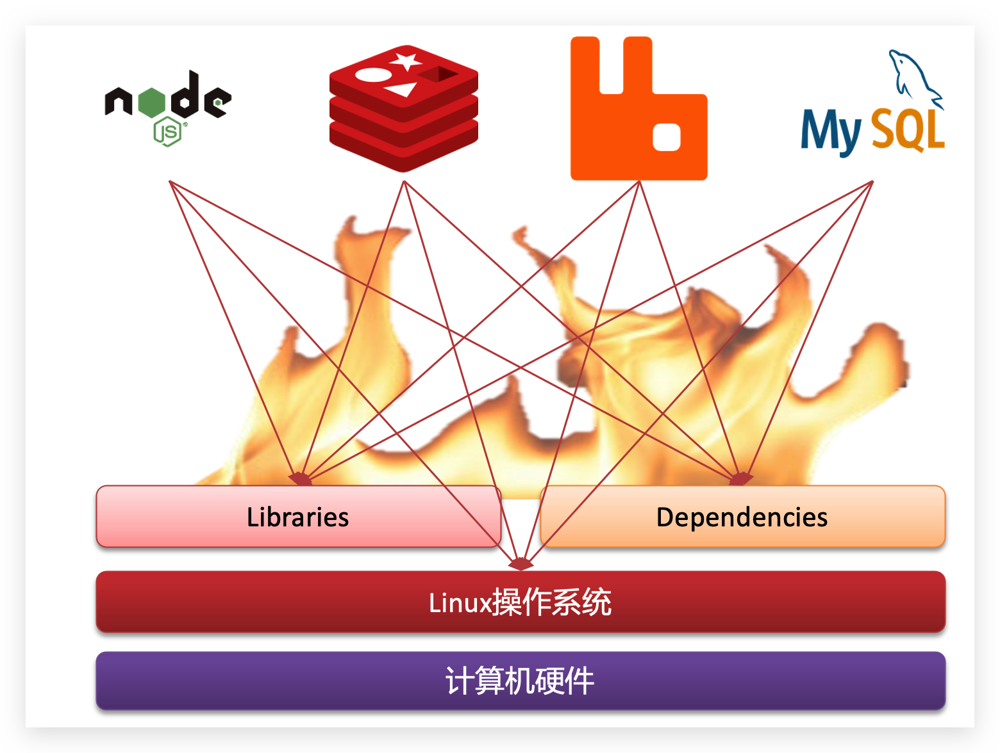

例如一个项目中，部署时需要依赖于node.js、Redis、RabbitMQ、MySQL等，这些服务部署时所需要的函数库、依赖项各不相同，甚至会有冲突。给部署带来了极大的困难。

### 1.1.2.Docker解决依赖兼容问题

而Docker确巧妙的解决了这些问题，Docker是如何实现的呢？

Docker为了解决依赖的兼容问题的，采用了两个手段：

- 将应用的Libs（函数库）、Deps（依赖）、配置与应用一起打包

- 将每个应用放到一个隔离**容器**去运行，避免互相干扰

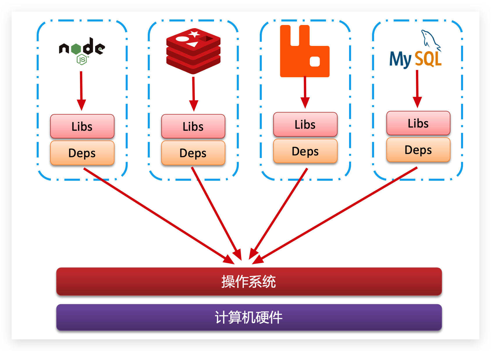

这样打包好的应用包中，既包含应用本身，也保护应用所需要的Libs、Deps，无需再操作系统上安装这些，自然就不存在不同应用之间的兼容问题了。

虽然解决了不同应用的兼容问题，但是开发、测试等环境会存在差异，操作系统版本也会有差异，怎么解决这些问题呢？

### 1.1.3.Docker解决操作系统环境差异

要解决不同操作系统环境差异问题，必须先了解操作系统结构。以一个Ubuntu操作系统为例，结构如下：


结构包括：

- 计算机硬件：例如CPU、内存、磁盘等
- 系统内核：所有Linux发行版的内核都是Linux，例如CentOS、Ubuntu、Fedora等。内核可以与计算机硬件交互，对外提供**内核指令**，用于操作计算机硬件。
- 系统应用：操作系统本身提供的应用、函数库。这些函数库是对内核指令的封装，使用更加方便。

应用于计算机交互的流程如下：

1）应用调用操作系统应用（函数库），实现各种功能

2）系统函数库是对内核指令集的封装，会调用内核指令

3）内核指令操作计算机硬件

Ubuntu和CentOS都是基于Linux内核，无非是系统应用不同，提供的函数库有差异：


此时，如果将一个Ubuntu版本的MySQL应用安装到CentOS系统，MySQL在调用Ubuntu函数库时，会发现找不到或者不匹配，就会报错了：


Docker如何解决不同系统环境的问题？

- Docker将用户程序与所需要调用的系统(比如Ubuntu)函数库一起打包
- Docker运行到不同操作系统时，直接基于打包的函数库，借助于操作系统的Linux内核来运行

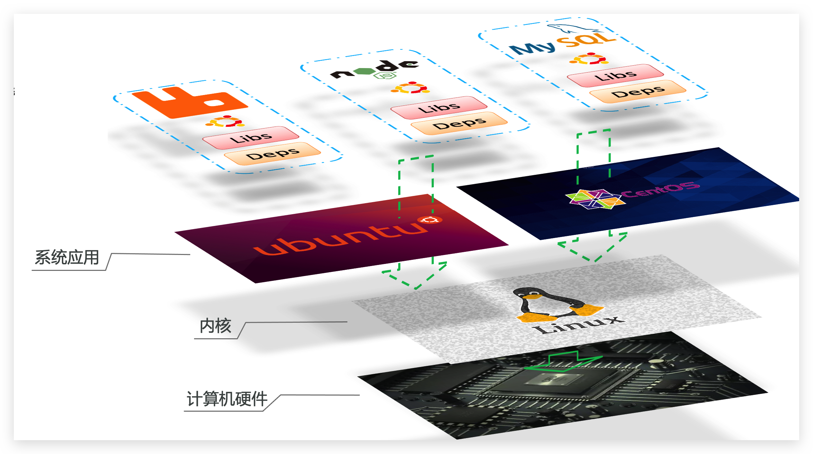

### 1.1.4.小结

Docker如何解决大型项目依赖关系复杂，不同组件依赖的兼容性问题？

- Docker允许开发中将应用、依赖、函数库、配置一起**打包**，形成可移植镜像
- Docker应用运行在容器中，使用沙箱机制，相互**隔离**

Docker如何解决开发、测试、生产环境有差异的问题？

- Docker镜像中包含完整运行环境，包括系统函数库，仅依赖系统的Linux内核，因此可以在任意Linux操作系统上运行

Docker是一个快速交付应用、运行应用的技术，具备下列优势：

- 可以将程序及其依赖、运行环境一起打包为一个镜像，可以迁移到任意Linux操作系统
- 运行时利用沙箱机制形成隔离容器，各个应用互不干扰
- 启动、移除都可以通过一行命令完成，方便快捷

## 1.2.Docker和虚拟机的区别

Docker可以让一个应用在任何操作系统中非常方便的运行。而以前我们接触的虚拟机，也能在一个操作系统中，运行另外一个操作系统，保护系统中的任何应用。

**虚拟机**（virtual machine）是在操作系统中**模拟**硬件设备，然后运行另一个操作系统，比如在 Windows 系统里面运行 Ubuntu 系统，这样就可以运行任意的Ubuntu应用了。

**Docker**仅仅是封装函数库，并没有模拟完整的操作系统，如图：

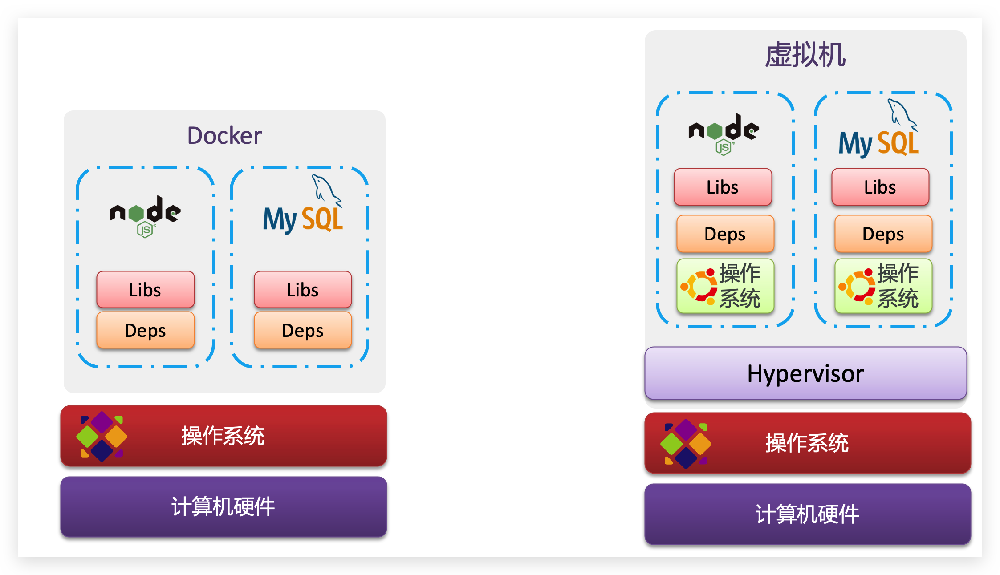

对比来看：

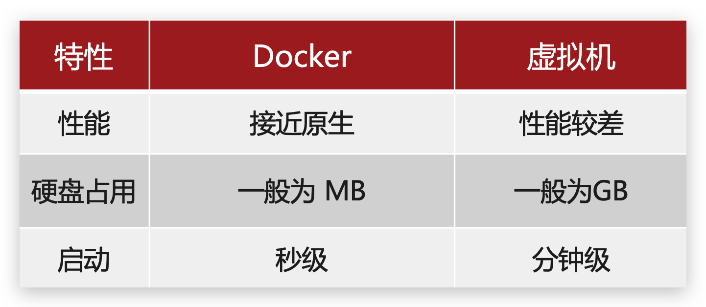

- docker是一个系统进程；虚拟机是在操作系统中的操作系统

- docker体积小、启动速度快、性能好；虚拟机体积大、启动速度慢、性能一般

## 1.3.Docker架构
### 1.3.1.镜像和容器

Docker中有几个重要的概念：

**镜像（Image）**：Docker将应用程序及其所需的依赖、函数库、环境、配置等文件打包在一起，称为镜像。

**容器（Container）**：镜像中的应用程序运行后形成的进程就是**容器**，只是Docker会给容器进程做隔离，对外不可见。

一切应用最终都是代码组成，都是硬盘中的一个个的字节形成的**文件**。只有运行时，才会加载到内存，形成进程。

而**镜像**，就是把一个应用在硬盘上的文件、及其运行环境、部分系统函数库文件一起打包形成的文件包。这个文件包是只读的。

**容器**呢，就是将这些文件中编写的程序、函数加载到内存中允许，形成进程，只不过要隔离起来。因此一个镜像可以启动多次，形成多个容器进程。

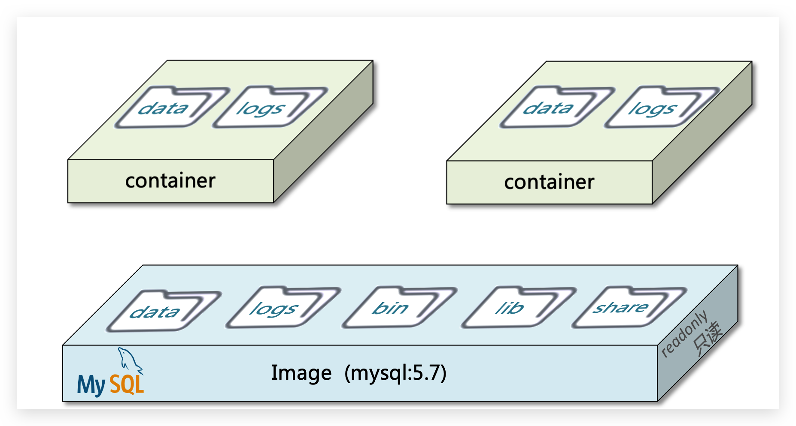

例如你下载了一个QQ，如果我们将QQ在磁盘上的运行**文件**及其运行的操作系统依赖打包，形成QQ镜像。然后你可以启动多次，双开、甚至三开QQ，跟多个妹子聊天。

### 1.3.2.DockerHub

开源应用程序非常多，打包这些应用往往是重复的劳动。为了避免这些重复劳动，人们就会将自己打包的应用镜像，例如Redis、MySQL镜像放到网络上，共享使用，就像GitHub的代码共享一样。

- DockerHub：DockerHub是一个官方的Docker镜像的托管平台。这样的平台称为Docker Registry。

- 国内也有类似于DockerHub 的公开服务，比如 [网易云镜像服务](https://c.163yun.com/hub)、[阿里云镜像库](https://cr.console.aliyun.com/)等。

我们一方面可以将自己的镜像共享到DockerHub，另一方面也可以从DockerHub拉取镜像：

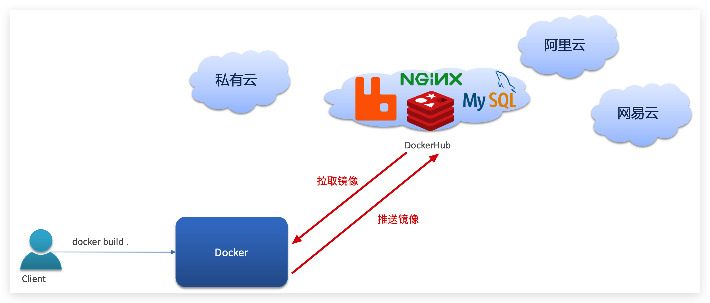

### 1.3.3.Docker架构

我们要使用Docker来操作镜像、容器，就必须要安装Docker。

Docker是一个CS架构的程序，由两部分组成：

- 服务端(server)：Docker守护进程，负责处理Docker指令，管理镜像、容器等

- 客户端(client)：通过命令或RestAPI向Docker服务端发送指令。可以在本地或远程向服务端发送指令。

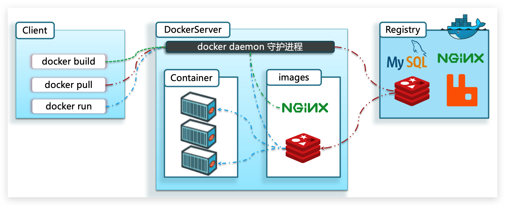

### 1.3.4.小结

Docker结构：

- 服务端：接收命令或远程请求，操作镜像或容器

- 客户端：发送命令或者请求到Docker服务端

DockerHub：

- 一个镜像托管的服务器，类似的还有阿里云镜像服务，统称为DockerRegistry

## 1.4.安装Docker

[Centos7安装Docker.md](../archive/old-docker-notes/Centos7安装Docker.md)

# 2.Docker的基本操作

## 2.1.镜像操作

### 2.1.1.镜像名称

首先来看下镜像的名称组成：

- 镜名称一般分两部分组成：[repository]:[tag]。
- 在没有指定tag时，默认是latest，代表最新版本的镜像

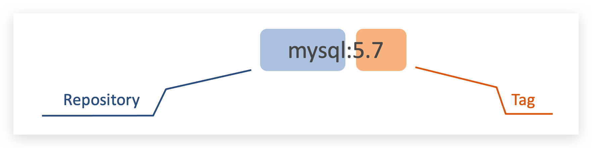

这里的mysql就是repository，5.7就是tag，合一起就是镜像名称，代表5.7版本的MySQL镜像。

### 2.1.2.镜像命令

常见的镜像操作命令如图：

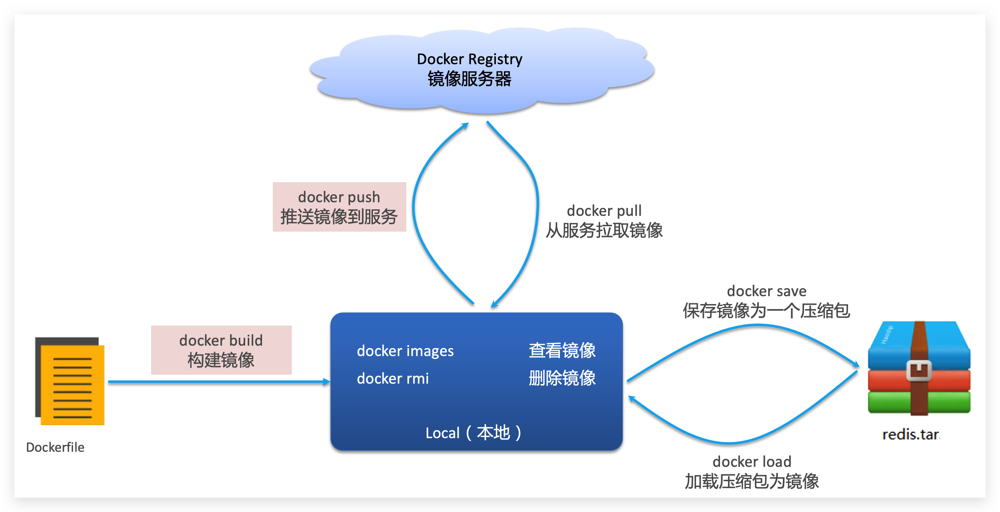

### 2.1.3.案例1-拉取、查看镜像

需求：从DockerHub中拉取一个nginx镜像并查看

1）首先去镜像仓库搜索nginx镜像，比如[DockerHub](https://hub.docker.com/):

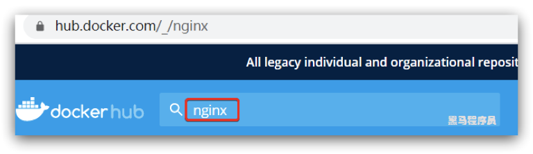

2）根据查看到的镜像名称，拉取自己需要的镜像，通过命令：docker pull nginx

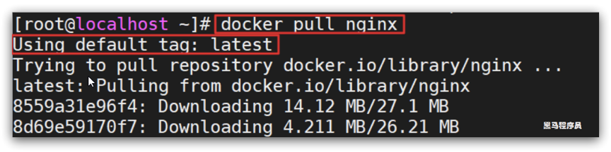

3）通过命令：docker images 查看拉取到的镜像

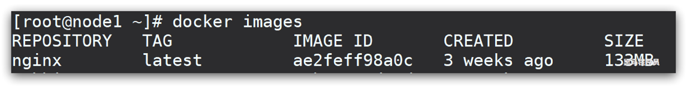

### 2.1.4.案例2-保存、导入镜像

需求：利用docker save将nginx镜像导出磁盘，然后再通过load加载回来

1）利用docker xx --help命令查看docker save和docker load的语法

例如，查看save命令用法，可以输入命令：

```sh
docker save --help
```

结果：

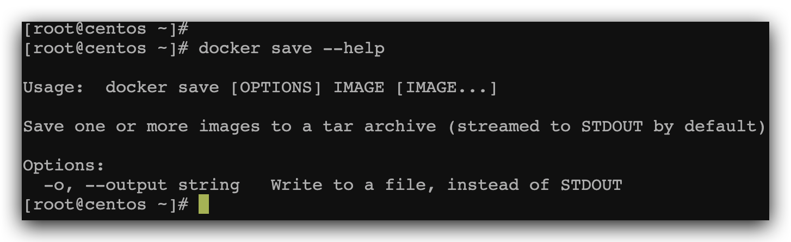

命令格式：

```shell
docker save -o [保存的目标文件名称] [镜像名称]
```


2）使用docker save导出镜像到磁盘 

运行命令：

```sh
docker save -o nginx.tar nginx:latest
```

结果如图：

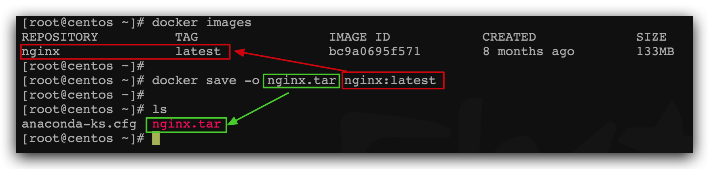

3）使用docker load加载镜像

先删除本地的nginx镜像：

```sh
docker rmi nginx:latest
```

然后运行命令，加载本地文件：

```sh
docker load -i nginx.tar
```

结果：

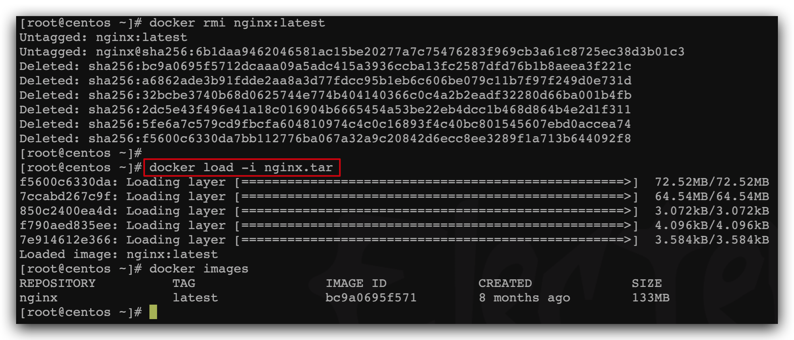


## 2.2.容器操作

### 2.2.1.容器相关命令

容器操作的命令如图：

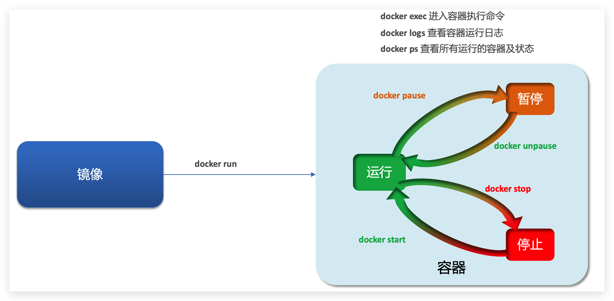

容器保护三个状态：

- 运行：进程正常运行
- 暂停：进程暂停，CPU不再运行，并不释放内存
- 停止：进程终止，回收进程占用的内存、CPU等资源


其中：

- docker run：创建并运行一个容器，处于运行状态
- docker pause：让一个运行的容器暂停
- docker unpause：让一个容器从暂停状态恢复运行
- docker stop：停止一个运行的容器
- docker start：让一个停止的容器再次运行

- docker rm：删除一个容器

### 2.2.2.案例-创建并运行一个容器

创建并运行nginx容器的命令：

```sh
docker run --name containerName -p 80:80 -d nginx
```

命令解读：

- docker run ：创建并运行一个容器
- --name : 给容器起一个名字，比如叫做mn
- -p ：将宿主机端口与容器端口映射，冒号左侧是宿主机端口，右侧是容器端口
- -d：后台运行容器
- nginx：镜像名称，例如nginx

这里的`-p`参数，是将容器端口映射到宿主机端口。

默认情况下，容器是隔离环境，我们直接访问宿主机的80端口，肯定访问不到容器中的nginx。

现在，将容器的80与宿主机的80关联起来，当我们访问宿主机的80端口时，就会被映射到容器的80，这样就能访问到nginx了：

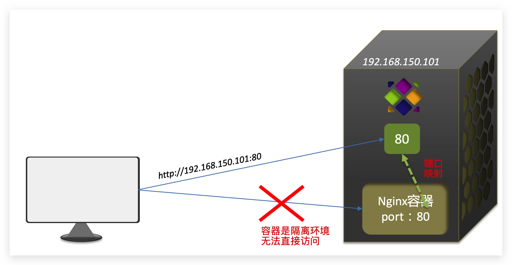

### 2.2.3.案例-进入容器，修改文件

**需求**：进入Nginx容器，修改HTML文件内容，添加“wychmod欢迎您”

**提示**：进入容器要用到docker exec命令。

**步骤**：

1）进入容器。进入我们刚刚创建的nginx容器的命令为：

```sh
docker exec -it mn bash
```

命令解读：

- docker exec ：进入容器内部，执行一个命令

- -it : 给当前进入的容器创建一个标准输入、输出终端，允许我们与容器交互

- mn ：要进入的容器的名称

- bash：进入容器后执行的命令，bash是一个linux终端交互命令


2）进入nginx的HTML所在目录 /usr/share/nginx/html

容器内部会模拟一个独立的Linux文件系统，看起来如同一个linux服务器一样：

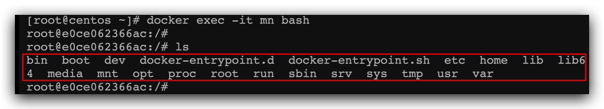

nginx的环境、配置、运行文件全部都在这个文件系统中，包括我们要修改的html文件。

查看DockerHub网站中的nginx页面，可以知道nginx的html目录位置在`/usr/share/nginx/html`

我们执行命令，进入该目录：

```sh
cd /usr/share/nginx/html
```

 查看目录下文件：

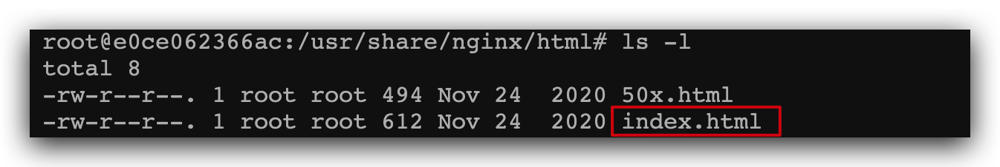

3）修改index.html的内容

容器内没有vi命令，无法直接修改，我们用下面的命令来修改：

```sh
sed -i -e 's#Welcome to nginx#wychmod 欢迎您#g' -e 's#<head>#<head><meta charset="utf-8">#g' index.html
```

在浏览器访问自己的虚拟机地址，例如我的是：http://192.168.150.101，即可看到结果：


### 2.2.4.小结

docker run命令的常见参数有哪些？

- --name：指定容器名称
- -p：指定端口映射
- -d：让容器后台运行

查看容器日志的命令：

- docker logs
- 添加 -f 参数可以持续查看日志

查看容器状态：

- docker ps
- docker ps -a 查看所有容器，包括已经停止的

退出容器命令：
- exit

删除容器：
- docker rm

## 2.3.数据卷（容器数据管理）

在之前的nginx案例中，修改nginx的html页面时，需要进入nginx内部。并且因为没有编辑器，修改文件也很麻烦。

这就是因为容器与数据（容器内文件）耦合带来的后果。

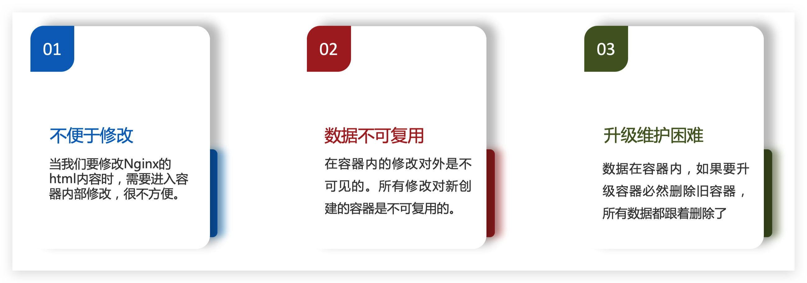

要解决这个问题，必须将数据与容器解耦，这就要用到数据卷了。

### 2.3.1.什么是数据卷

**数据卷（volume) **是一个虚拟目录，指向宿主机文件系统中的某个目录。

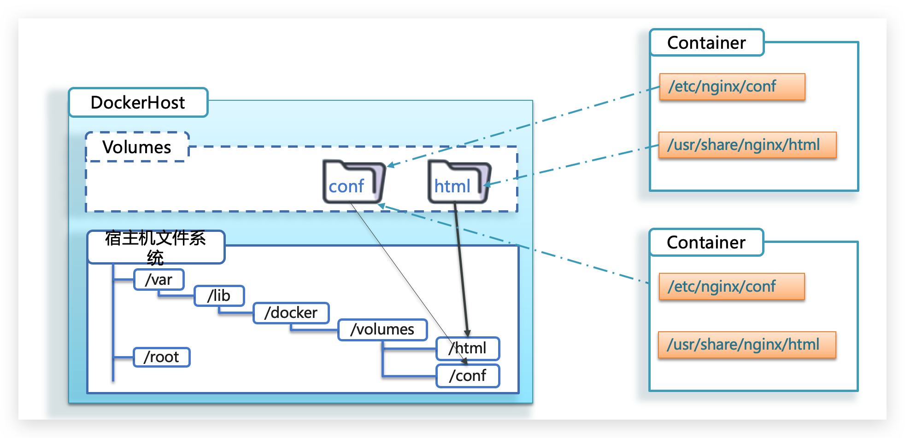

一旦完成数据卷挂载，对容器的一切操作都会作用在数据卷对应的宿主机目录了。

这样，我们操作宿主机的/var/lib/docker/volumes/html目录，就等于操作容器内的/usr/share/nginx/html目录了

### 2.3.2.数据集操作命令

数据卷操作的基本语法如下：

```sh
docker volume [COMMAND]
```

docker volume命令是数据卷操作，根据命令后跟随的command来确定下一步的操作：

- create 创建一个volume
- inspect 显示一个或多个volume的信息
- ls 列出所有的volume
- prune 删除未使用的volume
- rm 删除一个或多个指定的volume


### 2.3.3.创建和查看数据卷

**需求**：创建一个数据卷，并查看数据卷在宿主机的目录位置

① 创建数据卷

```sh
docker volume create html
```


② 查看所有数据

```sh
docker volume ls
```

结果：

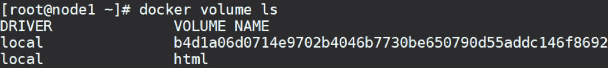

③ 查看数据卷详细信息卷

```sh
docker volume inspect html
```

结果：

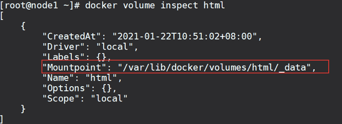

可以看到，我们创建的html这个数据卷关联的宿主机目录为`/var/lib/docker/volumes/html/_data`目录。


**小结**：

数据卷的作用：

- 将容器与数据分离，解耦合，方便操作容器内数据，保证数据安全

数据卷操作：

- docker volume create：创建数据卷
- docker volume ls：查看所有数据卷
- docker volume inspect：查看数据卷详细信息，包括关联的宿主机目录位置
- docker volume rm：删除指定数据卷
- docker volume prune：删除所有未使用的数据卷


### 2.3.4.挂载数据卷

我们在创建容器时，可以通过 -v 参数来挂载一个数据卷到某个容器内目录，命令格式如下：

```sh
docker run \
  --name mn \
  -v html:/root/html \
  -p 8080:80
  nginx \
```

这里的-v就是挂载数据卷的命令：

- `-v html:/root/htm` ：把html数据卷挂载到容器内的/root/html这个目录中

### 2.3.5.案例-给nginx挂载数据卷

**需求**：创建一个nginx容器，修改容器内的html目录内的index.html内容


**分析**：上个案例中，我们进入nginx容器内部，已经知道nginx的html目录所在位置/usr/share/nginx/html ，我们需要把这个目录挂载到html这个数据卷上，方便操作其中的内容。

**提示**：运行容器时使用 -v 参数挂载数据卷

步骤：

① 创建容器并挂载数据卷到容器内的HTML目录

```sh
docker run --name mn -v html:/usr/share/nginx/html -p 80:80 -d nginx
```

② 进入html数据卷所在位置，并修改HTML内容

```sh
# 查看html数据卷的位置
docker volume inspect html
# 进入该目录
cd /var/lib/docker/volumes/html/_data
# 修改文件
vi index.html
```

### 2.3.6.案例-给MySQL挂载本地目录

容器不仅仅可以挂载数据卷，也可以直接挂载到宿主机目录上。关联关系如下：

- 带数据卷模式：宿主机目录 --> 数据卷 ---> 容器内目录
- 直接挂载模式：宿主机目录 ---> 容器内目录

如图：

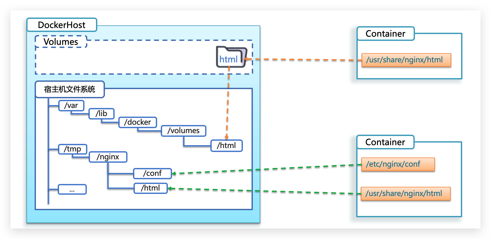

**语法**：

目录挂载与数据卷挂载的语法是类似的：

- -v [宿主机目录]:[容器内目录]
- -v [宿主机文件]:[容器内文件]

**需求**：创建并运行一个MySQL容器，将宿主机目录直接挂载到容器

实现思路如下：

1）在将课前资料中的mysql.tar文件上传到虚拟机，通过load命令加载为镜像

2）创建目录/tmp/mysql/data

3）创建目录/tmp/mysql/conf，将课前资料提供的hmy.cnf文件上传到/tmp/mysql/conf

4）去DockerHub查阅资料，创建并运行MySQL容器，要求：

① 挂载/tmp/mysql/data到mysql容器内数据存储目录

② 挂载/tmp/mysql/conf/hmy.cnf到mysql容器的配置文件

③ 设置MySQL密码

```
docker run \
--name mysql \
-e MYSQL_ROOT_PASSWORD=123 \
-p 3306:3306 \
-v /tmp/mysql/data:/var/lib/mysql \
-v /tmp/mysql/conf/hmy.cnf:/etc/mysql/conf.d/hmy.cnf \
-d \
mysql:5.7.25
```

### 2.3.7.小结

docker run的命令中通过 -v 参数挂载文件或目录到容器中：

- -v volume名称:容器内目录
- -v 宿主机文件:容器内文
- -v 宿主机目录:容器内目录

数据卷挂载与目录直接挂载的区别

- 数据卷挂载耦合度低，由docker来管理目录，但是目录较深，不好找
- 目录挂载耦合度高，需要我们自己管理目录，不过目录容易寻找查看


# 3.Dockerfile自定义镜像

常见的镜像在DockerHub就能找到，但是我们自己写的项目就必须自己构建镜像了。

而要自定义镜像，就必须先了解镜像的结构才行。

## 3.1.镜像结构

镜像是将应用程序及其需要的系统函数库、环境、配置、依赖打包而成。

我们以MySQL为例，来看看镜像的组成结构：

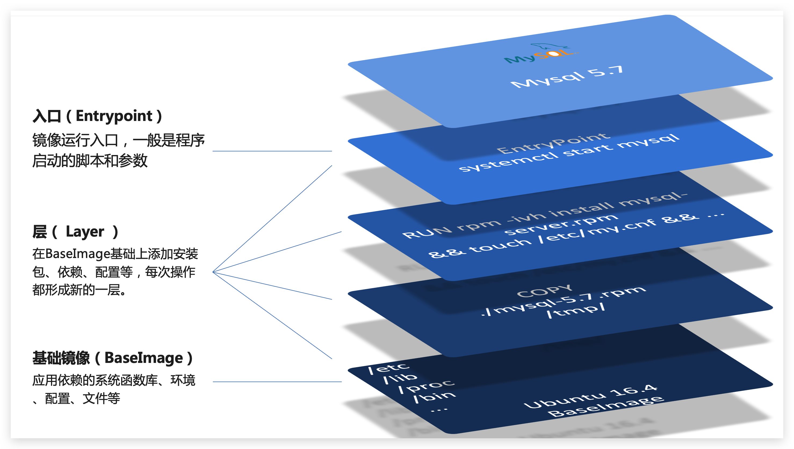


简单来说，镜像就是在系统函数库、运行环境基础上，添加应用程序文件、配置文件、依赖文件等组合，然后编写好启动脚本打包在一起形成的文件。

我们要构建镜像，其实就是实现上述打包的过程。

## 3.2.Dockerfile语法

构建自定义的镜像时，并不需要一个个文件去拷贝，打包。

我们只需要告诉Docker，我们的镜像的组成，需要哪些BaseImage、需要拷贝什么文件、需要安装什么依赖、启动脚本是什么，将来Docker会帮助我们构建镜像。

而描述上述信息的文件就是Dockerfile文件。

**Dockerfile**就是一个文本文件，其中包含一个个的**指令(Instruction)**，用指令来说明要执行什么操作来构建镜像。每一个指令都会形成一层Layer。

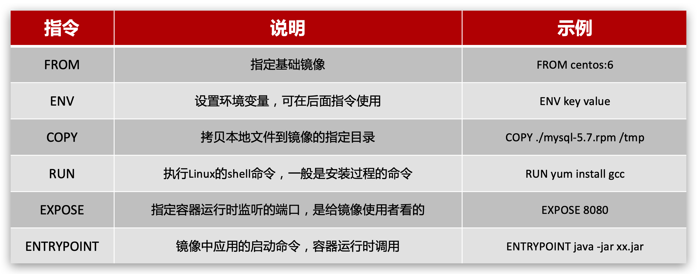


更新详细语法说明，请参考官网文档： https://docs.docker.com/engine/reference/builder

## 3.3.构建Java项目

### 3.3.1.基于Ubuntu构建Java项目

需求：基于Ubuntu镜像构建一个新镜像，运行一个java项目

- 步骤1：新建一个空文件夹docker-demo

  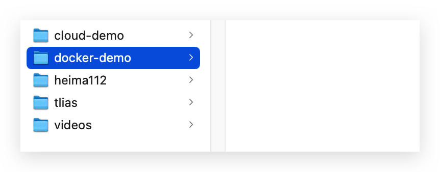

- 步骤2：拷贝课前资料中的docker-demo.jar文件到docker-demo这个目录

  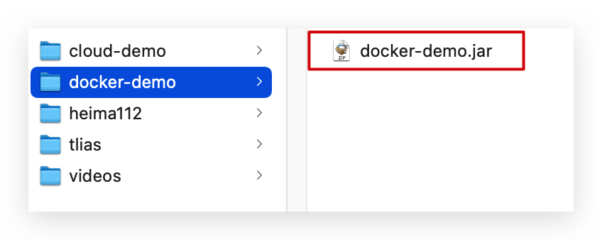

- 步骤3：拷贝课前资料中的jdk8.tar.gz文件到docker-demo这个目录

  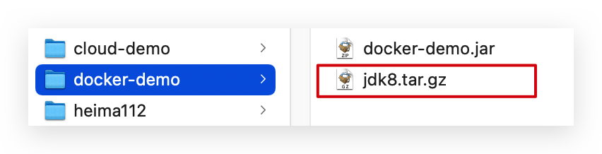

- 步骤4：拷贝课前资料提供的Dockerfile到docker-demo这个目录

  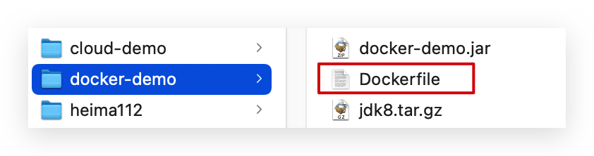

  其中的内容如下：

  ```dockerfile
  # 指定基础镜像
  FROM ubuntu:16.04
  # 配置环境变量，JDK的安装目录
  ENV JAVA_DIR=/usr/local
  
  # 拷贝jdk和java项目的包
  COPY ./jdk8.tar.gz $JAVA_DIR/
  COPY ./docker-demo.jar /tmp/app.jar
  
  # 安装JDK
  RUN cd $JAVA_DIR \
   && tar -xf ./jdk8.tar.gz \
   && mv ./jdk1.8.0_144 ./java8
  
  # 配置环境变量
  ENV JAVA_HOME=$JAVA_DIR/java8
  ENV PATH=$PATH:$JAVA_HOME/bin
  
  # 暴露端口
  EXPOSE 8090
  # 入口，java项目的启动命令
  ENTRYPOINT java -jar /tmp/app.jar
  ```


- 步骤5：进入docker-demo

  将准备好的docker-demo上传到虚拟机任意目录，然后进入docker-demo目录下

- 步骤6：运行命令：

  ```sh
  docker build -t javaweb:1.0 .

  docker run --name web -p 1129:8090 -d javaweb:1.0
  ```
  

最后访问 http://192.168.150.101:1129/hello/count，其中的ip改成你的虚拟机ip


### 3.3.2.基于java8构建Java项目

虽然我们可以基于Ubuntu基础镜像，添加任意自己需要的安装包，构建镜像，但是却比较麻烦。所以大多数情况下，我们都可以在一些安装了部分软件的基础镜像上做改造。

例如，构建java项目的镜像，可以在已经准备了JDK的基础镜像基础上构建。

需求：基于java:8-alpine镜像，将一个Java项目构建为镜像

实现思路如下：

- ① 新建一个空的目录，然后在目录中新建一个文件，命名为Dockerfile

- ② 拷贝课前资料提供的docker-demo.jar到这个目录中

- ③ 编写Dockerfile文件：

  - a ）基于java:8-alpine作为基础镜像

  - b ）将app.jar拷贝到镜像中

  - c ）暴露端口

  - d ）编写入口ENTRYPOINT

    内容如下：

    ```dockerfile
    FROM java:8-alpine
    COPY ./docker-demo.jar /tmp/app.jar
    EXPOSE 1129
    ENTRYPOINT java -jar /tmp/app.jar
    ```

- ④ 使用docker build命令构建镜像

- ⑤ 使用docker run创建容器并运行

## 3.4.小结

小结：

1. Dockerfile的本质是一个文件，通过指令描述镜像的构建过程

2. Dockerfile的第一行必须是FROM，从一个基础镜像来构建

3. 基础镜像可以是基本操作系统，如Ubuntu。也可以是其他人制作好的镜像，例如：java:8-alpine


# 4.Docker-Compose

Docker Compose可以基于Compose文件帮我们快速的部署分布式应用，而无需手动一个个创建和运行容器！


## 4.1.初识DockerCompose

Compose文件是一个文本文件，通过指令定义集群中的每个容器如何运行。格式如下：

```json
version: "3.8"
 services:
  mysql:
    image: mysql:5.7.25
    environment:
     MYSQL_ROOT_PASSWORD: 123 
    volumes:
     - "/tmp/mysql/data:/var/lib/mysql"
     - "/tmp/mysql/conf/hmy.cnf:/etc/mysql/conf.d/hmy.cnf"
  web:
    build: .
    ports:
     - "8090:8090"

```

上面的Compose文件就描述一个项目，其中包含两个容器：

- mysql：一个基于`mysql:5.7.25`镜像构建的容器，并且挂载了两个目录
- web：一个基于`docker build`临时构建的镜像容器，映射端口时8090

DockerCompose的详细语法参考官网：https://docs.docker.com/compose/compose-file/

其实DockerCompose文件可以看做是将多个docker run命令写到一个文件，只是语法稍有差异。


## 4.2.安装DockerCompose

[Centos7安装Docker](../archive/old-docker-notes/Centos7安装Docker.md)


## 4.3.部署微服务集群

**需求**：将之前学习的cloud-demo微服务集群利用DockerCompose部署


**实现思路**：

① 查看课前资料提供的cloud-demo文件夹，里面已经编写好了docker-compose文件

② 修改自己的cloud-demo项目，将数据库、nacos地址都命名为docker-compose中的服务名

③ 使用maven打包工具，将项目中的每个微服务都打包为app.jar

④ 将打包好的app.jar拷贝到cloud-demo中的每一个对应的子目录中

⑤ 将cloud-demo上传至虚拟机，利用 docker-compose up -d 来部署


### 4.3.1.compose文件

查看课前资料提供的cloud-demo文件夹，里面已经编写好了docker-compose文件，而且每个微服务都准备了一个独立的目录：

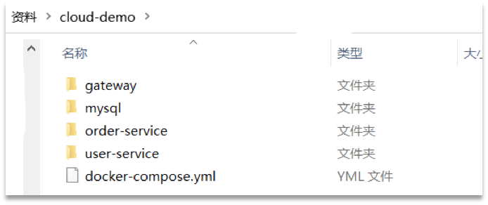

内容如下：

```yaml
version: "3.2"

services:
  nacos:
    image: nacos/nacos-server
    environment:
      MODE: standalone
    ports:
      - "8848:8848"
  mysql:
    image: mysql:5.7.25
    environment:
      MYSQL_ROOT_PASSWORD: 123
    volumes:
      - "$PWD/mysql/data:/var/lib/mysql"
      - "$PWD/mysql/conf:/etc/mysql/conf.d/"
  userservice:
    build: ./user-service
  orderservice:
    build: ./order-service
  gateway:
    build: ./gateway
    ports:
      - "10010:10010"
```

可以看到，其中包含5个service服务：

- `nacos`：作为注册中心和配置中心
  - `image: nacos/nacos-server`： 基于nacos/nacos-server镜像构建
  - `environment`：环境变量
    - `MODE: standalone`：单点模式启动
  - `ports`：端口映射，这里暴露了8848端口
- `mysql`：数据库
  - `image: mysql:5.7.25`：镜像版本是mysql:5.7.25
  - `environment`：环境变量
    - `MYSQL_ROOT_PASSWORD: 123`：设置数据库root账户的密码为123
  - `volumes`：数据卷挂载，这里挂载了mysql的data、conf目录，其中有我提前准备好的数据
- `userservice`、`orderservice`、`gateway`：都是基于Dockerfile临时构建的


查看mysql目录，可以看到其中已经准备好了cloud_order、cloud_user表：

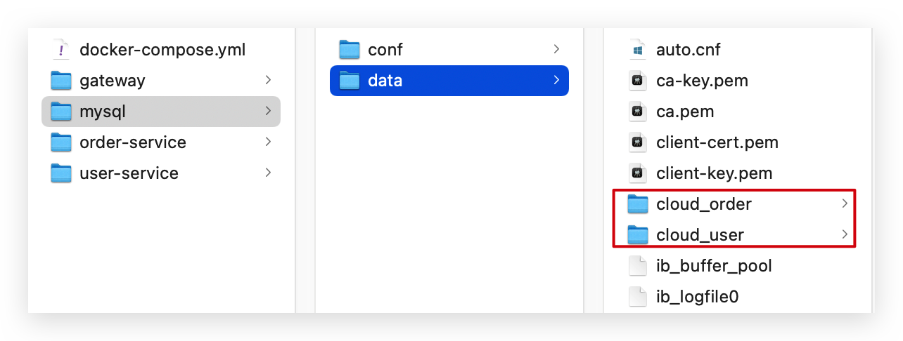

查看微服务目录，可以看到都包含Dockerfile文件：

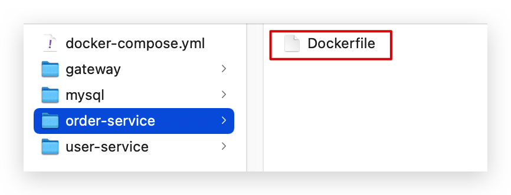

内容如下：

```dockerfile
FROM java:8-alpine
COPY ./app.jar /tmp/app.jar
ENTRYPOINT java -jar /tmp/app.jar
```


### 4.3.2.修改微服务配置

因为微服务将来要部署为docker容器，而容器之间互联不是通过IP地址，而是通过容器名。这里我们将order-service、user-service、gateway服务的mysql、nacos地址都修改为基于容器名的访问。

如下所示：

```yaml
spring:
  datasource:
    url: jdbc:mysql://mysql:3306/cloud_order?useSSL=false
    username: root
    password: 123
    driver-class-name: com.mysql.jdbc.Driver
  application:
    name: orderservice
  cloud:
    nacos:
      server-addr: nacos:8848 # nacos服务地址
```


### 4.3.3.打包

接下来需要将我们的每个微服务都打包。因为之前查看到Dockerfile中的jar包名称都是app.jar，因此我们的每个微服务都需要用这个名称。

可以通过修改pom.xml中的打包名称来实现，每个微服务都需要修改：

```xml
<build>
  <!-- 服务打包的最终名称 -->
  <finalName>app</finalName>
  <plugins>
    <plugin>
      <groupId>org.springframework.boot</groupId>
      <artifactId>spring-boot-maven-plugin</artifactId>
    </plugin>
  </plugins>
</build>
```

打包后：

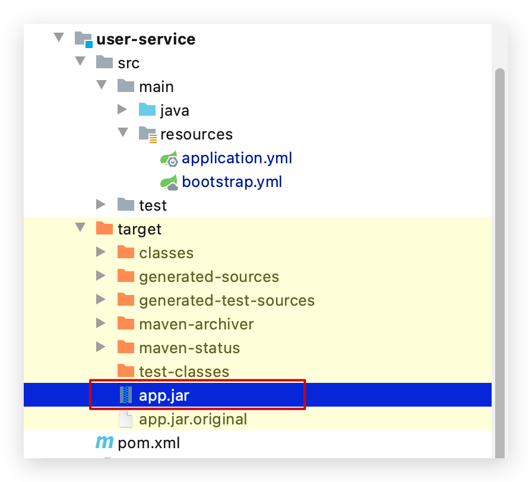

### 4.3.4.拷贝jar包到部署目录

编译打包好的app.jar文件，需要放到Dockerfile的同级目录中。注意：每个微服务的app.jar放到与服务名称对应的目录，别搞错了。

user-service：

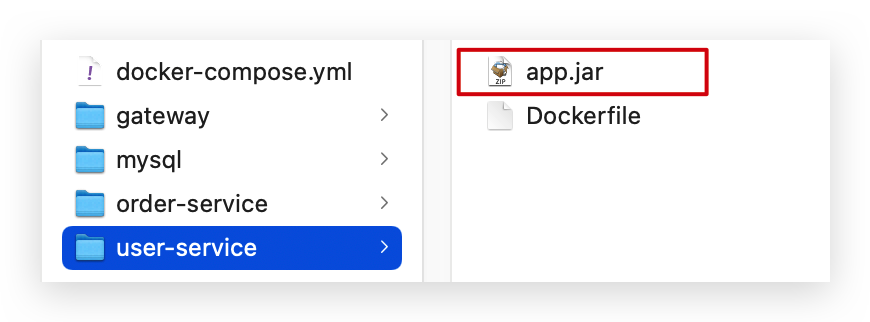

order-service：

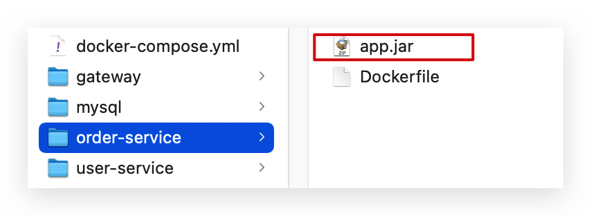

gateway：

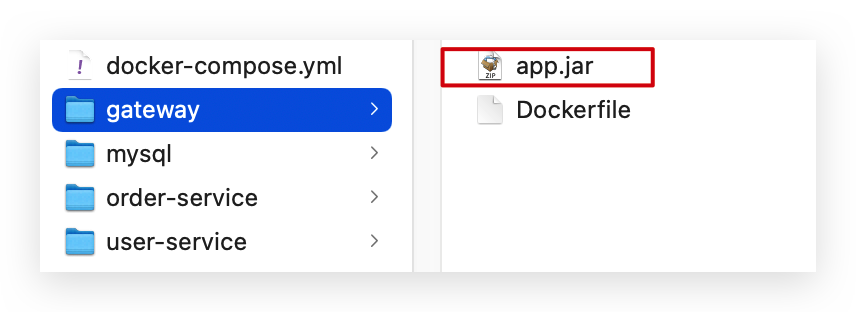

### 4.3.5.部署

最后，我们需要将文件整个cloud-demo文件夹上传到虚拟机中，理由DockerCompose部署。

上传到任意目录：

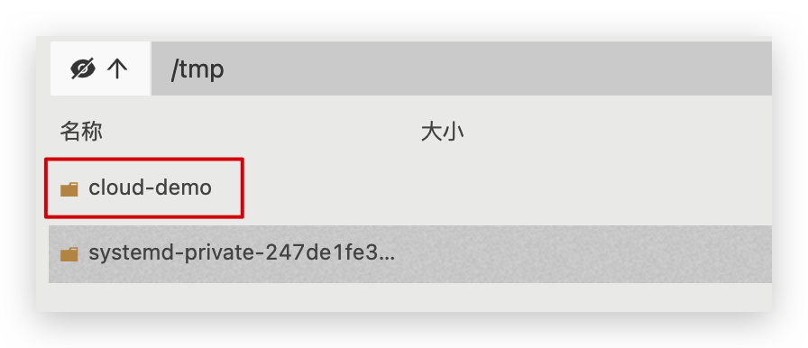

部署：

进入cloud-demo目录，然后运行下面的命令：

```sh
docker-compose up -d

docker-compose logs -f

docker-compose restart gateway userservice orderservice 
```


# 5.Docker镜像仓库 

## 5.1.搭建私有镜像仓库

[Centos7安装Docker](../archive/old-docker-notes/Centos7安装Docker.md)


## 5.2.推送、拉取镜像

推送镜像到私有镜像服务必须先tag，步骤如下：

① 重新tag本地镜像，名称前缀为私有仓库的地址：192.168.150.101:8080/

 ```sh
docker tag nginx:latest 192.168.150.101:8080/nginx:1.0 
 ```


② 推送镜像

```sh
docker push 192.168.150.101:8080/nginx:1.0 
```


③ 拉取镜像

```sh
docker pull 192.168.150.101:8080/nginx:1.0 
```

## Centos7安装Docker.md

# 0.安装Docker

Docker 分为 CE 和 EE 两大版本。CE 即社区版（免费，支持周期 7 个月），EE 即企业版，强调安全，付费使用，支持周期 24 个月。

Docker CE 分为 `stable` `test` 和 `nightly` 三个更新频道。

官方网站上有各种环境下的 [安装指南](https://docs.docker.com/install/)，这里主要介绍 Docker CE 在 CentOS上的安装。

# 1.CentOS安装Docker

Docker CE 支持 64 位版本 CentOS 7，并且要求内核版本不低于 3.10， CentOS 7 满足最低内核的要求，所以我们在CentOS 7安装Docker。

## 1.1.卸载（可选）

如果之前安装过旧版本的Docker，可以使用下面命令卸载：

```
yum remove docker \
                  docker-client \
                  docker-client-latest \
                  docker-common \
                  docker-latest \
                  docker-latest-logrotate \
                  docker-logrotate \
                  docker-selinux \
                  docker-engine-selinux \
                  docker-engine \
                  docker-ce
```

## 1.2.安装docker

首先需要大家虚拟机联网，安装yum工具

```sh
yum install -y yum-utils \
           device-mapper-persistent-data \
           lvm2 --skip-broken
```

然后更新本地镜像源：

```shell
# 设置docker镜像源
yum-config-manager \
    --add-repo \
    https://mirrors.aliyun.com/docker-ce/linux/centos/docker-ce.repo
    
sed -i 's/download.docker.com/mirrors.aliyun.com\/docker-ce/g' /etc/yum.repos.d/docker-ce.repo

yum makecache fast
```

然后输入命令：

```shell
yum install -y docker-ce
```

docker-ce为社区免费版本。稍等片刻，docker即可安装成功。

## 1.3.启动docker

Docker应用需要用到各种端口，逐一去修改防火墙设置。非常麻烦，因此建议大家直接关闭防火墙！

启动docker前，一定要关闭防火墙后！！

启动docker前，一定要关闭防火墙后！！

启动docker前，一定要关闭防火墙后！！


```sh
# 关闭
systemctl stop firewalld
# 禁止开机启动防火墙
systemctl disable firewalld
```

通过命令启动docker：

```sh
systemctl start docker  # 启动docker服务

systemctl stop docker  # 停止docker服务

systemctl restart docker  # 重启docker服务
```

然后输入命令，可以查看docker版本：

```
docker -v
```

如图：

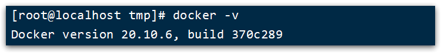 


## 1.4.配置镜像加速

docker官方镜像仓库网速较差，我们需要设置国内镜像服务：

参考阿里云的镜像加速文档：https://cr.console.aliyun.com/cn-hangzhou/instances/mirrors

# 2.CentOS7安装DockerCompose

## 2.1.下载

Linux下需要通过命令下载：

```sh
# 安装
curl -L https://github.com/docker/compose/releases/download/1.23.1/docker-compose-`uname -s`-`uname -m` > /usr/local/bin/docker-compose
```

如果下载速度较慢，或者下载失败，可以使用课前资料提供的docker-compose文件：

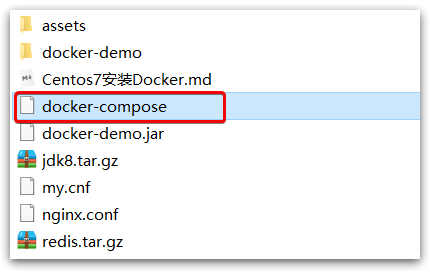

上传到`/usr/local/bin/`目录也可以。

## 2.2.修改文件权限

修改文件权限：

```sh
# 修改权限
chmod +x /usr/local/bin/docker-compose
```

## 2.3.Base自动补全命令：

```sh
# 补全命令
curl -L https://raw.githubusercontent.com/docker/compose/1.29.1/contrib/completion/bash/docker-compose > /etc/bash_completion.d/docker-compose
```

如果这里出现错误，需要修改自己的hosts文件：

```sh
echo "199.232.68.133 raw.githubusercontent.com" >> /etc/hosts
```


# 3.Docker镜像仓库

搭建镜像仓库可以基于Docker官方提供的DockerRegistry来实现。

官网地址：https://hub.docker.com/_/registry


## 3.1.简化版镜像仓库

Docker官方的Docker Registry是一个基础版本的Docker镜像仓库，具备仓库管理的完整功能，但是没有图形化界面。

搭建方式比较简单，命令如下：

```sh
docker run -d \
    --restart=always \
    --name registry	\
    -p 5000:5000 \
    -v registry-data:/var/lib/registry \
    registry
```


命令中挂载了一个数据卷registry-data到容器内的/var/lib/registry 目录，这是私有镜像库存放数据的目录。

访问http://YourIp:5000/v2/_catalog 可以查看当前私有镜像服务中包含的镜像


## 3.2.带有图形化界面版本

使用DockerCompose部署带有图象界面的DockerRegistry，命令如下：

```yaml
version: '3.0'
services:
  registry:
    image: registry
    volumes:
      - ./registry-data:/var/lib/registry
  ui:
    image: joxit/docker-registry-ui:static
    ports:
      - 8080:80
    environment:
      - REGISTRY_TITLE=tots-and私有仓库
      - REGISTRY_URL=http://registry:5000
    depends_on:
      - registry
```


## 3.3.配置Docker信任地址

我们的私服采用的是http协议，默认不被Docker信任，所以需要做一个配置：

```sh
# 打开要修改的文件
vi /etc/docker/daemon.json
# 添加内容：
"insecure-registries": ["http://120.48.73.227:8080"]
# 重加载
systemctl daemon-reload
# 重启docker
systemctl restart docker
```

---

## 修改记录

| 日期 | 类型 | 说明 |
|---|---|---|
| 2026-07-22 | 订正 | 示例镜像版本更新：mysql:5.7.25→8.0（5.7 已 EOL）、node:20→22、golang:1.22→1.24 |
| 2026-07-22 | 审查 | 全面审查，核心内容完备，BuildKit/Compose V2/容器生态描述符合 2026 现状 |
