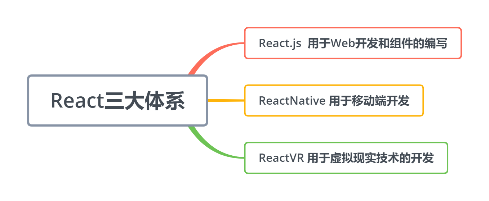
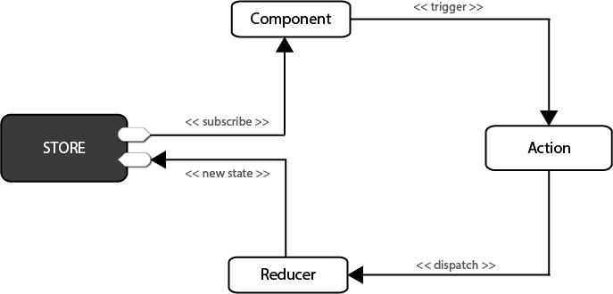
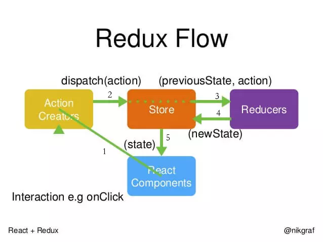
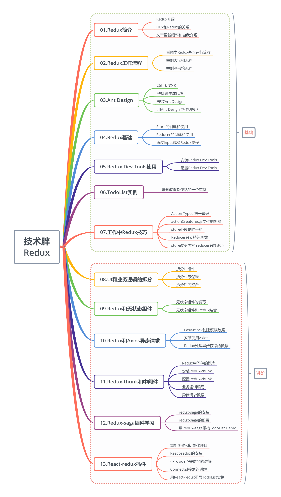

# React 基础与状态管理

> **原文归档**：[archive/old-react-notes/](../archive/old-react-notes/)
> 包含：React16 基础 / Redux 入门与进阶 / Hooks / Router / Next.js + js 函数式工具

## 一、核心主题概述

React 是由 Facebook 开源的、用于构建用户界面的 JavaScript 库。其核心理念是**声明式 UI + 组件化 + 单向数据流**：开发者只需描述“界面在不同状态下应该长什么样”，React 负责高效地将状态变化映射到 DOM。

本文件覆盖以下主线：

1. **React 基础**：JSX、组件、props/state、事件处理、列表渲染。
2. **组件与生命周期**：Class 组件生命周期、函数组件、现代写法对比。
3. **Hooks**：useState、useEffect、useContext、useReducer、useMemo、useCallback、useRef、自定义 Hook，以及 React 19 的 `use`。
4. **Redux 状态管理**：Store / Action / Reducer、react-redux、中间件（redux-thunk / redux-saga）。
5. **React Router**：声明式路由、v5 → v6 变化、常用 Hooks。
6. **Next.js 与服务端渲染**：SSR / SSG / CSR、App Router、Server Components、Server Actions。
7. **函数式工具**：防抖、节流、柯里化、reduce。
8. **2026 年 React 生态**：React 19、React Compiler、Server Components、Next.js 16 等。
9. **常见坑与补充**：key、className、受控组件、闭包过期等。

> 💡 补充：本文上半部分为面向 2026 年的结构化知识总结，下半部分完整保留原归档 Markdown 原文；3 个 PDF 通过链接引用，方便回顾技术胖视频课程的完整案例。

---

## 二、React 基础

### 2.1 JSX 与虚拟 DOM

JSX 是 JavaScript 的语法扩展，允许在 JS 中直接写类似 HTML 的结构。编译阶段，JSX 会被转换为 `React.createElement` 调用，最终生成**虚拟 DOM（Virtual DOM）**。React 通过 Diff 算法比较前后两次虚拟 DOM 的差异，最小化真实 DOM 操作。

```jsx
// JSX 写法
const element = <h1 className="title">Hello React</h1>;

// 编译后等价于
const element = React.createElement('h1', { className: 'title' }, 'Hello React');
```

> 💡 补充：在 JSX 中，HTML 属性有一些特殊命名，例如 `class` 要写成 `className`，`for` 要写成 `htmlFor`，`onclick` 要写成 `onClick` 驼峰形式。

### 2.2 组件：Class 组件与函数组件

React 组件是 UI 的最小独立单元。现代 React 推荐以**函数组件 + Hooks**为主，Class 组件多见于老项目。

```jsx
// Class 组件（老项目常见）
import React, { Component } from 'react';

class Welcome extends Component {
  render() {
    return <h1>Hello, {this.props.name}</h1>;
  }
}

// 函数组件（现代推荐）
function Welcome({ name }) {
  return <h1>Hello, {name}</h1>;
}
```

### 2.3 Props：只读的数据传递

props 用于父组件向子组件传递数据，子组件**不应直接修改 props**。

```jsx
function UserCard({ name, age, onClick }) {
  return (
    <div className="card" onClick={onClick}>
      <h3>{name}</h3>
      <p>{age} 岁</p>
    </div>
  );
}

// 使用
<UserCard name="Alice" age={24} onClick={() => console.log('clicked')} />
```

### 2.4 State 与受控组件

state 是组件内部可变的数据。函数组件使用 `useState`，Class 组件使用 `this.state` / `this.setState`。

```jsx
import { useState } from 'react';

function InputDemo() {
  const [value, setValue] = useState('');

  return (
    <input
      value={value}
      onChange={(e) => setValue(e.target.value)}
      placeholder="请输入"
    />
  );
}
```

> 💡 补充：`setState` 可能是异步批量的，不要依赖旧的 state 计算新 state。需要基于前一个状态时，应传函数：`setCount(prev => prev + 1)`。

### 2.5 列表渲染与 key

使用 `map` 渲染列表时，必须为每一项提供稳定的 `key`，帮助 React 识别元素身份。

```jsx
function TodoList({ items }) {
  return (
    <ul>
      {items.map((item) => (
        <li key={item.id}>{item.text}</li>
      ))}
    </ul>
  );
}
```

> 💡 补充：避免使用数组索引 `index` 作为 key，尤其是在列表会增删重排时，否则可能导致状态错位或性能问题。

### 2.6 条件渲染

```jsx
function Greeting({ isLogin, user }) {
  return (
    <div>
      {isLogin ? <h1>欢迎, {user.name}</h1> : <h1>请先登录</h1>}
      {isLogin && <button>退出</button>}
    </div>
  );
}
```

### 2.7 事件处理

React 事件是合成事件（SyntheticEvent），使用驼峰命名，需传入函数引用而非调用。

```jsx
function Counter() {
  const [count, setCount] = useState(0);

  return <button onClick={() => setCount(count + 1)}>Count: {count}</button>;
}
```

---

## 三、组件与生命周期

### 3.1 Class 组件生命周期

React 16 生命周期可分为四个阶段：

| 阶段 | 生命周期函数 | 说明 |
|------|-------------|------|
| 初始化 | `constructor(props)` | 初始化 state 和绑定事件（严格说不算生命周期函数） |
| 挂载 | `componentWillMount` → `render` → `componentDidMount` | `componentDidMount` 常用于发起异步请求 |
| 更新 | `shouldComponentUpdate` → `componentWillUpdate` → `render` → `componentDidUpdate` | `shouldComponentUpdate` 返回 false 可阻止更新 |
| 卸载 | `componentWillUnmount` | 清理定时器、订阅、连接等 |

```jsx
class Clock extends React.Component {
  constructor(props) {
    super(props);
    this.state = { date: new Date() };
  }

  componentDidMount() {
    this.timerID = setInterval(() => this.tick(), 1000);
  }

  componentWillUnmount() {
    clearInterval(this.timerID);
  }

  tick() {
    this.setState({ date: new Date() });
  }

  render() {
    return <h2>It is {this.state.date.toLocaleTimeString()}.</h2>;
  }
}
```

> 💡 补充：`componentWillMount`、`componentWillUpdate`、`componentWillReceiveProps` 在 React 16.3+ 中已被标记为不安全（UNSAFE_），新项目应避免使用。

### 3.2 函数组件的“生命周期”用 Hooks 表达

| Class 生命周期 | Hooks 等价写法 | 说明 |
|---------------|----------------|------|
| `componentDidMount` | `useEffect(() => {...}, [])` | 仅在挂载时执行 |
| `componentDidUpdate` | `useEffect(() => {...}, [deps])` | 依赖变化时执行 |
| `componentWillUnmount` | `useEffect(() => { return () => {...} }, [])` | 返回清理函数 |
| `shouldComponentUpdate` | `React.memo` / `useMemo` | 控制重渲染 |

---

## 四、Hooks 详解

Hooks 让函数组件拥有状态和副作用能力，是 React 16.8 引入的革命性特性。

### 4.1 useState

```jsx
import { useState } from 'react';

function Counter() {
  const [count, setCount] = useState(0);
  return <button onClick={() => setCount((c) => c + 1)}>{count}</button>;
}
```

### 4.2 useEffect

处理副作用：订阅、请求、DOM 操作等。

```jsx
import { useState, useEffect } from 'react';

function ChatRoom({ roomId }) {
  const [serverUrl, setServerUrl] = useState('https://localhost:1234');

  useEffect(() => {
    const connection = createConnection(serverUrl, roomId);
    connection.connect();

    return () => {
      connection.disconnect(); // 清理函数
    };
  }, [roomId, serverUrl]);

  return (
    <>
      <input value={serverUrl} onChange={(e) => setServerUrl(e.target.value)} />
      <h1>Welcome to {roomId}</h1>
    </>
  );
}
```

### 4.3 useContext

跨层级传递数据，避免层层 props 透传。

```jsx
import { createContext, useContext } from 'react';

const ThemeContext = createContext('light');

function ThemedButton() {
  const theme = useContext(ThemeContext);
  return <button className={theme}>I am {theme}</button>;
}

function App() {
  return (
    <ThemeContext.Provider value="dark">
      <ThemedButton />
    </ThemeContext.Provider>
  );
}
```

### 4.4 useReducer

适合状态逻辑复杂或多个子状态相互依赖的场景。

```jsx
import { useReducer } from 'react';

function reducer(state, action) {
  switch (action.type) {
    case 'increment':
      return { count: state.count + 1 };
    case 'decrement':
      return { count: state.count - 1 };
    default:
      throw new Error();
  }
}

function Counter() {
  const [state, dispatch] = useReducer(reducer, { count: 0 });
  return (
    <>
      Count: {state.count}
      <button onClick={() => dispatch({ type: 'increment' })}>+</button>
      <button onClick={() => dispatch({ type: 'decrement' })}>-</button>
    </>
  );
}
```

### 4.5 useMemo 与 useCallback

用于缓存计算结果和函数引用，减少不必要的重渲染。

```jsx
import { useMemo, useCallback } from 'react';

function ProductPage({ productId, referrer }) {
  const product = useData('/product/' + productId);

  const requirements = useMemo(() => computeRequirements(product), [product]);

  const handleSubmit = useCallback(
    (orderDetails) => {
      post('/product/' + productId + '/buy', { referrer, orderDetails });
    },
    [productId, referrer]
  );

  return <ShippingForm requirements={requirements} onSubmit={handleSubmit} />;
}
```

> 💡 补充：`useMemo` / `useCallback` 不是性能优化的银弹，只有在子组件因引用变化导致不必要重渲染时才建议使用。滥用反而会增加内存和比较开销。

### 4.6 useRef

用于获取 DOM 引用或保存不触发渲染的可变值。

```jsx
import { useRef, useEffect } from 'react';

function TextInputWithFocusButton() {
  const inputEl = useRef(null);

  const onButtonClick = () => {
    inputEl.current.focus();
  };

  return (
    <>
      <input ref={inputEl} type="text" />
      <button onClick={onButtonClick}>Focus the input</button>
    </>
  );
}
```

### 4.7 自定义 Hook

将组件逻辑抽取为可复用的函数，函数名必须以 `use` 开头。

```jsx
import { useState, useEffect } from 'react';

function useWindowWidth() {
  const [width, setWidth] = useState(window.innerWidth);

  useEffect(() => {
    const handleResize = () => setWidth(window.innerWidth);
    window.addEventListener('resize', handleResize);
    return () => window.removeEventListener('resize', handleResize);
  }, []);

  return width;
}
```

### 4.8 React 19 的 `use` Hook

React 19 引入了 `use`，可在渲染过程中读取 Promise 或 Context，常与 Suspense 配合。

```jsx
import { use, Suspense } from 'react';
import { fetchData } from './data';

function SearchResults({ query }) {
  if (query === '') return null;
  const albums = use(fetchData(`/search?q=${query}`));

  return (
    <ul>
      {albumbums.map((album) => (
        <li key={album.id}>{album.title}</li>
      ))}
    </ul>
  );
}

function App() {
  return (
    <Suspense fallback={<p>Loading...</p>}>
      <SearchResults query="react" />
    </Suspense>
  );
}
```

---

## 五、状态管理：Redux

### 5.1 核心概念

Redux 是 JavaScript 应用的可预测状态容器，核心概念如下：

| 概念 | 说明 |
|------|------|
| **Store** | 整个应用唯一的 state 容器 |
| **State** | 应用状态，只读 |
| **Action** | 描述“发生了什么”的纯对象，必须包含 `type` |
| **Reducer** | 纯函数，接收旧 state 和 action，返回新 state |
| **Dispatch** | 触发 action 的唯一方法 |

数据流：

```
View → dispatch(action) → Reducer → new State → View
```

### 5.2 创建 Store 与 Reducer

```js
// store/index.js
import { createStore } from 'redux';
import reducer from './reducer';

const store = createStore(reducer);
export default store;

// store/reducer.js
const defaultState = {
  inputValue: 'Write Something',
  list: ['早上4点起床，锻炼身体', '中午下班游泳一小时'],
};

export default (state = defaultState, action) => {
  if (action.type === 'changeInput') {
    const newState = JSON.parse(JSON.stringify(state));
    newState.inputValue = action.value;
    return newState;
  }
  return state;
};
```

### 5.3 三大原则

1. **单一数据源**：整个应用只有一个 store。
2. **State 只读**：唯一改变 state 的方式是 dispatch action。
3. **Reducer 是纯函数**：相同的 state 和 action 必须返回相同的结果，不能产生副作用。

### 5.4 React-Redux

`react-redux` 提供 `Provider` 和 `connect`（或 Hooks 版本），将 Redux 状态注入 React 组件。

```jsx
// index.js
import { Provider } from 'react-redux';
import store from './store';

ReactDOM.render(
  <Provider store={store}>
    <App />
  </Provider>,
  document.getElementById('root')
);

// 现代写法：使用 Hooks
import { useSelector, useDispatch } from 'react-redux';

function TodoList() {
  const list = useSelector((state) => state.list);
  const dispatch = useDispatch();

  return (
    <ul>
      {list.map((item, index) => (
        <li key={index}>{item}</li>
      ))}
    </ul>
  );
}
```

### 5.5 中间件：redux-thunk 与 redux-saga

中间件用于增强 dispatch，常用于异步请求、日志、路由等。

```js
// redux-thunk：action 可以是函数
export const getTodoList = () => {
  return (dispatch) => {
    axios.get('/api/list').then((res) => {
      dispatch({ type: 'GET_LIST', data: res.data });
    });
  };
};

// redux-saga：使用 generator 管理副作用
import { takeEvery, put, call } from 'redux-saga/effects';

function* mySaga() {
  yield takeEvery('GET_MY_LIST', getList);
}

function* getList() {
  const res = yield call(axios.get, '/api/list');
  yield put({ type: 'GET_LIST', data: res.data });
}
```

> 💡 补充：2026 年的新项目如果状态管理较简单，优先考虑 `useState` / `useReducer` / `Context`；中大型项目可评估 Redux Toolkit（RTK）、Zustand、Jotai、Recoil 等更现代的方案。

---

## 六、路由：React Router

### 6.1 v5 写法（归档资料对应版本）

```jsx
import { BrowserRouter, Route, Switch, Link } from 'react-router-dom';

function App() {
  return (
    <BrowserRouter>
      <Link to="/">Home</Link>
      <Link to="/about">About</Link>
      <Switch>
        <Route exact path="/" component={Home} />
        <Route path="/about" component={About} />
      </Switch>
    </BrowserRouter>
  );
}
```

### 6.2 v6 写法（现代推荐）

React Router v6 使用 `Routes` 替代 `Switch`，`element` 替代 `component`，并提供了更强大的 Hooks。

```jsx
import { BrowserRouter, Routes, Route, Link, useParams } from 'react-router-dom';

function User() {
  const { id } = useParams();
  return <h1>User ID: {id}</h1>;
}

function App() {
  return (
    <BrowserRouter>
      <nav>
        <Link to="/">Home</Link>
        <Link to="/user/123">User</Link>
      </nav>
      <Routes>
        <Route path="/" element={<Home />} />
        <Route path="/user/:id" element={<User />} />
      </Routes>
    </BrowserRouter>
  );
}
```

### 6.3 常用路由 Hooks

```jsx
import { useNavigate, useLocation, useParams } from 'react-router-dom';

function LoginButton() {
  const navigate = useNavigate();
  return <button onClick={() => navigate('/dashboard')}>登录</button>;
}
```

---

## 七、Next.js 与服务端渲染

### 7.1 渲染模式对比

| 模式 | 说明 | 适用场景 |
|------|------|----------|
| **CSR**（客户端渲染） | 浏览器下载 JS 后渲染 | 重交互的后台系统 |
| **SSR**（服务端渲染） | 每次请求服务端生成 HTML | 需要实时数据、SEO |
| **SSG**（静态生成） | 构建时生成 HTML | 内容型页面、博客 |
| **ISR**（增量静态再生） | 构建后按需重新生成 | 大型内容站点 |

### 7.2 App Router 与 Server Components

Next.js 13+ 引入 App Router，页面默认是 React Server Components（RSC），仅在服务端运行，不打包到客户端，可大幅减少 JS 体积。

```tsx
// app/page.tsx（Server Component）
import LikeButton from '@/app/ui/like-button';
import { getPost } from '@/lib/data';

export default async function Page({ params }: { params: { id: string } }) {
  const post = await getPost(params.id);

  return (
    <main>
      <h1>{post.title}</h1>
      <LikeButton likes={post.likes} />
    </main>
  );
}
```

> 💡 补充：Server Component 中不能直接使用 `useState`、`useEffect` 等客户端 API；需要交互时，应拆分为 Client Component，并在文件顶部添加 `'use client'`。

### 7.3 Server Actions

Next.js 14+ 支持 Server Actions，允许在服务端直接处理表单提交或按钮点击，无需手写 API 路由。

```tsx
// app/page.tsx
export default function Page() {
  async function createInvoice(formData: FormData) {
    'use server';
    const rawFormData = {
      customerId: formData.get('customerId'),
      amount: formData.get('amount'),
    };
    // 直接操作数据库或调用外部 API
  }

  return <form action={createInvoice}>{/* ... */}</form>;
}
```

### 7.4 数据获取

```tsx
async function getData() {
  const res = await fetch('https://api.example.com/posts', {
    next: { revalidate: 60 }, // ISR：每 60 秒重新验证
  });
  if (!res.ok) throw new Error('Failed to fetch');
  return res.json();
}

export default async function Page() {
  const data = await getData();
  return (
    <ul>
      {data.map((post) => (
        <li key={post.id}>{post.title}</li>
      ))}
    </ul>
  );
}
```

---

## 八、函数式工具（防抖 / 节流 / 柯里化 / reduce）

### 8.1 防抖（debounce）

高频事件触发后，只执行最后一次。

```js
function debounce(fn, delay) {
  let timer = null;
  return function (...args) {
    if (timer) clearTimeout(timer);
    timer = setTimeout(() => fn.apply(this, args), delay);
  };
}

window.onscroll = debounce(() => {
  console.log('scroll position:', window.scrollY);
}, 300);
```

### 8.2 节流（throttle）

高频事件按固定频率执行。

```js
function throttle(fn, delay) {
  let valid = true;
  return function (...args) {
    if (!valid) return;
    valid = false;
    setTimeout(() => {
      fn.apply(this, args);
      valid = true;
    }, delay);
  };
}

window.onscroll = throttle(() => {
  console.log('scroll position:', window.scrollY);
}, 1000);
```

### 8.3 函数柯里化（Currying）

将多参数函数转换为单参数链式调用，便于参数复用。

```js
function add(x, y) {
  return x + y;
}

function curryingAdd(x) {
  return function (y) {
    return x + y;
  };
}

add(1, 2); // 3
curryingAdd(1)(2); // 3

// 参数复用示例
function curryingCheck(reg) {
  return function (txt) {
    return reg.test(txt);
  };
}

const hasNumber = curryingCheck(/\d+/g);
hasNumber('test1'); // true
```

### 8.4 reduce 进阶用法

```js
// 数组求和
[0, 1, 2, 3].reduce((acc, cur) => acc + cur, 0); // 6

// 二维数组转一维
[[1, 2], [3, 4]].reduce((acc, cur) => acc.concat(cur), []); // [1, 2, 3, 4]

// 对象分组
const people = [
  { name: 'Alice', age: 21 },
  { name: 'Bob', age: 25 },
  { name: 'Carol', age: 21 },
];
people.reduce((acc, cur) => {
  acc[cur.age] = acc[cur.age] || [];
  acc[cur.age].push(cur);
  return acc;
}, {});
```

---

## 九、2026 年 React 生态

截至 2026 年，React 已从“UI 库”进化为一个包含服务端渲染、编译优化、类型生态的完整前端体系。

### 9.1 React 19 与 React Compiler

- **React 19**：带来更稳定的 Server Components、`use` Hook、改进的 Suspense、自动记忆化支持。
- **React Compiler（原 React Forget）**：通过编译期自动添加记忆化，减少手写 `useMemo` / `useCallback` 的需求。

### 9.2 Server Components 成为默认

Next.js App Router 已将 Server Components 设为默认模式：

- 服务端直接获取数据，减少客户端 JS。
- 敏感逻辑（如数据库查询、API Key）可保留在服务端。
- 需要交互的部分通过 `'use client'` 拆分为 Client Component。

### 9.3 Next.js 16

Next.js 16 继续深化全栈能力：

- 异步路由参数（`params` 为 Promise，需要 `await`）。
- 更简化的 Server Actions 与表单处理。
- Turbopack 持续替代 Webpack，构建速度进一步提升。

### 9.4 状态管理方案演变

| 方案 | 特点 | 适用场景 |
|------|------|----------|
| useState / useReducer / Context | 内置于 React，零依赖 | 局部或轻量共享状态 |
| Redux Toolkit | 官方推荐，规范化、可预测 | 大型团队、复杂状态机 |
| Zustand | 轻量、基于 Hooks | 中小型项目 |
| Jotai / Recoil | 原子化状态管理 | 细粒度、派生状态多 |
| TanStack Query | 服务端状态管理 | 异步数据缓存、同步 |

### 9.5 现代项目启动方式

虽然归档资料使用 `create-react-app`，但 2026 年更推荐使用：

- **Vite**：极速冷启动，现代构建工具。
- **Next.js**：全栈 React 框架，内置路由、SSR、SSG。
- **Astro**：内容型站点， islands 架构减少客户端 JS。

> 💡 补充：`create-react-app` 已进入维护模式，新项目不建议继续使用；迁移时可参考官方从 CRA 到 Vite/Next.js 的迁移指南。

---

## 十、常见坑与补充

1. **key 不要使用 index**：列表增删时会导致状态错位。
2. **setState 是异步/批量的**：不要立即读取 state 判断最新值。
3. **受控组件需要 onChange + value**：否则输入框无法编辑。
4. **不要在 render 中执行副作用**：副作用应放在 `useEffect` 或事件处理中。
5. **闭包过期问题**：`useEffect` 依赖数组必须写全依赖，否则读到旧值。
6. **Server Component 不能用客户端 Hook**：需要交互时用 `'use client'` 分包。
7. **dangerouslySetInnerHTML 慎用**：有 XSS 风险，必须确保内容已净化。

> 💡 补充：调试 React 时，React DevTools 是必不可少的浏览器扩展，可以直观地查看组件树、props、state 和 Hooks。

---

# 以下为原内容存档

> 以下内容为原始归档 Markdown 文件的完整保留；3 个 PDF 通过链接引用。

## React16基础.md

# React入门

> ## React简介
首先不能否认React.js是全球最火的前端框架(Facebook推出的前端框架)，国内的一二线互联网公司大部分都在使用React进行开发，比如阿里、美团、百度、去哪儿、网易 、知乎这样的一线互联网公司都把React作为前端主要技术栈。

React的社区也是非常强大的,随着React的普及也衍生出了更多有用的框架，比如==ReactNative==和==React VR==。React从13年开始推广，现在已经推出16RC（React Fiber）这个版本，性能和易用度上，都有很大的提升。

A JavaScript library for building user interfaces (用于构建用户界面的JavaScript库)。

> ## React优点总结
- **生态强大**：现在没有哪个框架比React的生态体系好的，几乎所有开发需求都有成熟的解决方案。
- **上手简单**: 你甚至可以在几个小时内就可以上手React技术，但是他的知识很广，你可能需要更多的时间来完全驾驭它。
- **社区强大**：你可以很容易的找到志同道合的人一起学习，因为使用它的人真的是太多了。

> ## React三大体系


> ## React开发环境搭建
- **安装Node.js**

安装Node只需要进入Node网站，进行响应版本的下载，然后进行双击安装就可以了。

Node中文网址：http://nodejs.cn/ (建议你在这里下载，速度会快很多)

需要你注意的是，一定要正确下载对应版本，版本下载错误，可是没有办法使用的哦。
Node.js 安装好以后，如果是Windows系统，可以使用Win+R打开运行，然后输入cmd，打开终端（或者叫命令行工具）。

**输入代码:**
```
node -v
```

**然后再输入代码:**
```
npm -v
```
如果都正确显示版本号，则说明 ==Node.js== 安装完成

- **脚手架的安装**

Node安装好之后，你就可以使用npm命令来安装脚手架工具了，方法很简单，只要打开终端，然后输入下面的命令就可以了。
```
npm install -g create-react-app
```
> ==create-react-app== 是React官方出的脚手架工具

> ## 创建第一个React项目
**在终端输入**
```
D:  //进入D盘
mkdir ReactDemo  //创建ReactDemo文件夹
create-react-app demo01   //用脚手架创建React项目
cd demo01   //等创建完成后，进入项目目录
npm start   //预览项目，如果能正常打开，说明项目创建成功
```
等到浏览器可以打开React网页，并正常显示图标后，说明我们的环境已经全部搭建完成了。

> ## 项目根目录中的文件

- **README.md** :这个文件主要作用就是对项目的说明，已经默认写好了一些东西，你可以简单看看。如果是工作中，你可以把文件中的内容删除，自己来写这个文件，编写这个文件可以使用 ==Markdown== 的语法来编写。
- **package.json** :这个文件是 ==webpack== 配置和项目包管理文件，项目中依赖的第三方包（包的版本）和一些常用命令配置都在这个里边进行配置，当然脚手架已经为我们配置了一些了，目前位置，我们不需要改动。如果你对webpack了解，对这个一定也很熟悉。
- **package-lock.json**：这个文件用一句话来解释，就是锁定安装时的版本号，并且需要上传到git，以保证其他人再npm install 时大家的依赖能保证一致。
- **gitignore** : 这个是git的选择性上传的配置文件，比如一会要介绍的 ==node_modules== 文件夹，就需要配置不上传。
- **node_modules** :这个文件夹就是我们项目的依赖包，到目前位置，脚手架已经都给我们下载好了，你不需要单独安装什么。
- **public** ：公共文件，里边有公用模板和图标等一些东西。
- **src** ： 主要代码编写文件，这个文件夹里的文件对我们来说最重要，都需要我们掌握。

> ## public文件夹介绍
这个文件都是一些项目使用的公共文件
- **favicon.ico** : 这个是网站或者说项目的图标，一般在浏览器标签页的左上角显示。
- **index.html** : 首页的模板文件，我们可以试着改动一下，就能看到结果。
- **mainifest.json**：移动端配置文件，这个会在以后的课程中详细讲解。

> ## src文件夹介绍
这个目录里边放的是我们开放的源代码，平时操作最多的目录。
- **index.js** : 这个就是项目的入口文件。
- **index.css** ：这个是index.js里的CSS文件。
- **app.js** : 这个文件相当于一个方法模块，也是一个简单的模块化编程。
- **serviceWorker.js**: 这个是用于写移动端开发的，PWA必须用到这个文件，有了这个文件，就相当于有了离线浏览的功能。

> ## HelloWorld小实例
1. **入口文件的编写**

   写一个项目的时候一般要从入口文件进行编写的，在src目录下，新建一个文件 ==index.js== (一般要把原先的删除)，然后打开这个文件。
   前四行代码：
   ```
    import React from 'react'
    import ReactDOM from 'react-dom'
    import App from './App'
    ReactDOM.render(<App />,document.getElementById('root'))
   ```
    我们先引入了React两个必要的文件，然后引入了一个APP组件，目前这个组件还是没有的，需要一会建立。然后用React的语法把APP模块渲染到了==root== ID上面.这个rootID是在 ==public\index.html== 文件中的。

2. **app组件的编写**

    现在写一下App组件，这里我们采用最简单的写法，就输出一个 ==Hello 
    wychmod== 。
    ```
    import React, {Component} from 'react'

    class App extends Component{
        render(){
            return (
                <div>
                    Hello wychmod
                </div>
            )
        }
    }
    export default App;
    ```
    这其实是ES6的语法-解构赋值，你可以把上面一行代码写成下面两行.
    ```
    import React, {Component} from 'react'
    
    import React from 'react'
    const Component = React.Component
    ```
    **总结**：React的主要优势之一就是组件化编写，这也是现代前端开发的一种基本形式。
    
> ## React中JSX语法简介
JSX就是Javascript和XML结合的一种格式。React发明了JSX，可以方便的利用HTML语法来创建虚拟DOM，当遇到<，JSX就当作HTML解析，遇到{就当JavaScript解析.
比如这样一段JSX语法：
```html
<ul className="my-list">
    <li>wychmod.com</li>
    <li>I love React</li>
</ul>
```
比如这样一段js代码：
```jsx
var child1 = React.createElement('li', null, 'wychmod.com');
var child2 = React.createElement('li', null, 'I love React');
var root = React.createElement('ul', { className: 'my-list' }, child1, child2);
```
从代码量上就可以看出JSX语法大量简化了我们的工作。
> **组件和普通jsx语法区别**：自定义的组件必须首写字母要进行大写，而JSX是小写字母开头的。

> ## JSX中使用三元运算符
在JSX中也是可以使用js语法的，这节课我们先简单讲解一个三元元算符的方法，见到了解一下。
```js
import React from 'react'
const Component = React.Component


class App extends Component{
    render(){
        return (
            <ul className="my-list">
                <li>{false?'JSPang.com':'技术胖'}</li>
                <li>I love React</li>
            </ul>
        )
    }
}

export default App;
```

> ## 组件外层包裹原则
这是一个很重要的原则，比如上面的代码，我们去掉最外层的div，就回报错，因为React要求必须在一个组件的最外层进行包裹。

> ## Fragment标签讲解
加上最外层的DIV，组件就是完全正常的，但是你的布局就偏不需要这个最外层的标签怎么办?比如我们在作Flex布局的时候,外层还真的不能有包裹元素。这种矛盾其实React16已经有所考虑了，为我们准备了<Fragment>标签。

**然后把最外层的\<div>标签，换成<Fragment>标签，代码如下。**
```
import React,{Component,Fragment } from 'react'

class Xiaojiejie extends Component{
    render(){
        return  (
            <Fragment>
               <div><input /> <button> 增加服务 </button></div>
               <ul>
                   <li>头部按摩</li>
                   <li>精油推背</li>
               </ul> 
            </Fragment>
        )
    }
}
export default Xiaojiejie 
```
**这时候你再去浏览器的Elements中查看，就回发现已经没有外层的包裹了。**

> ## 响应式设计和数据的绑定
==React== 不建议你直接操作 ==DOM== 元素,而是要通过数据进行驱动，改变界面中的效果。React会根据数据的变化，自动的帮助你完成界面的改变。所以在写React代码时，你无需关注DOM相关的操作，只需要关注数据的操作就可以了（这也是React如此受欢迎的主要原因，大大加快了我们的开发速度）。
数据定义在组件中的构造函数里==constructor==。
```
//js的构造函数，由于其他任何函数执行
constructor(props){
    super(props) //调用父类的构造函数，固定写法
    this.state={
        inputValue:'' , // input中的值
        list:[]    //服务列表
    }
}
```
在 ==React== 中的数据绑定和 ==Vue== 中几乎一样，也是采用字面量(我自己起的名字)的形式，就是使用=={}==来 标注，其实这也算是js代码的一种声明。比如现在我们要把 ==inputValue== 值绑定到 ==input== 框中，只要写入下面的代码就可以了。其实说白了就是在JSX中使用js代码。

> ## 绑定事件
这时候你到界面的文本框中去输入值，是没有任何变化的，这是因为我们强制绑定了 ==inputValue== 的值。如果要想改变，需要绑定响应事件，改变 ==inputValue== 的值。比如绑定一个改变事件，这个事件执行 ==inputChange()== 方法。
```html
 <input value={this.state.inputValue} onChange={this.inputChange.bind(this)} />
```
在render里的方法：
```
inputChange(e){
    // console.log(e.target.value);
    // this.state.inputValue=e.target.value;
    this.setState({
        inputValue:e.target.value
    })
}
```

> ## 列表数据化
现在的列表还是写死的两个 ==\<li>== 标签，那要变成动态显示的，就需要把这个列表先进行数据化，然后再用 ==javascript== 代码，循环在页面上。
```
constructor(props){
    super(props) //调用父类的构造函数，固定写法
    this.state={
        inputValue:'jspang' , // input中的值
        //----------主要 代码--------start
        list:['基础按摩','精油推背']   
        //----------主要 代码--------end
    }
}
```
有了数据后，JSX部分进行循环输出，代码如下：
```html
render(){
    return  (
        <Fragment>
            <div>
                <input value={this.state.inputValue} onChange={this.inputChange.bind(this)} />
                <button> 增加服务 </button>
            </div>
            <ul>
                {
                    this.state.list.map((item,index)=>{
                        return <li>{item}</li>
                    })
                }
            </ul>  
        </Fragment>
    )
}
```

> ## 增加列表数据（讲解...)
这里需要说的市 ==...== 这个是ES6的新语法，叫做扩展运算符。意思就是把list数组进行了分解，形成了新的数组，然后再进行组合。这种写法更简单和直观，所以推荐这种写法。
```js
addList(){
    this.setState({
        list:[...this.state.list,this.state.inputValue]
    })
}
```

> ## 解决key值错误
打开浏览器的控制台F12,可以清楚的看到报错了。这个错误的大概意思就是缺少key值。就是在用map循环时，需要设置一个不同的值，这个时React的要求。我们可以暂时用index+item的形式来实现。
```html
<ul>
    {
        this.state.list.map((item,index)=>{
            return <li key={index+item}>{item}</li>
        })
    }
</ul>  
```

> ## 数组下标的传递同时删除数据
如果要删除一个东西，就要得到数组里的一个编号，这里指下标。传递下标就要有事件产生，先来绑定一个双击事件.代码如下:
```html
<ul>
    {
        this.state.list.map((item,index)=>{
            return (
                <li 
                    key={index+item}
                    onClick={this.deleteItem.bind(this,index)}
                >
                    {item}
                </li>
            )
        })
    }
</ul>  
```
绑定做好了,现在需要把deleteItem,在代码的最下方,加入下面的代码.方法接受一个参数index.
```
//删除单项数据
deleteItem(index){
    let list = this.state.list
    list.splice(index,1)
    this.setState({
        list:list
    })
}
```
> 记住React是禁止直接操作state的,在后期的性能优化上会有很多麻烦。

# React进阶
> ## JSX代码注释
在jsx中写javascript代码。所以外出我们套入了{}，然后里边就是一个多行的javascript注释。如果你要使用单行祝注释//，你需要把代码写成下面这样。
```html
<Fragment>
    // 这个是错误的注释
    
    {/* 正确注释的写法 */}
    
    {
        //正确注释的写法 
    }
    <div>
        <input value={this.state.inputValue} onChange={this.inputChange.bind(this)} />
        <button onClick={this.addList.bind(this)}> 增加服务 </button>
    </div>
```

> ## JSX中的class陷阱
1. 先写一个CSS样式文件，在 ==src== 目录下，新建一个 ==style.css== 的样式文件。
```css
.input {border:3px solid #ae7000}
```

2. 先用import进行引入,能用 ==import== 引入，都是webpack的功劳。
```html
import './style.css'

<input className="input" value={this.state.inputValue} onChange={this.inputChange.bind(this)} />
```
*要把 ==class== 换成 ==className== ，它是防止和js中的class类名 冲突，所以要求换掉。*

> ## JSX中的 ==html== 解析问题
如果想在文本框里输入一个\<h1>标签，并进行渲染。默认是不会生效的，只会把\<h1>标签打印到页面上，这并不是我想要的。如果工作中有这种需求，可以使用dangerouslySetInnerHTML属性解决。具体代码如下：
```html
<ul>
    {
        this.state.list.map((item,index)=>{
            return (
                <li 
                    key={index+item}
                    onClick={this.deleteItem.bind(this,index)}
                    dangerouslySetInnerHTML={{__html:item}}
                >
                </li>
            )
        })
    }
</ul> 
```

> ## JSX中 ==<label>== 标签的坑
JSX中 ==<label>== 的坑，也算是比较大的一个坑，label是 ==html== 中的一个辅助标签，也是非常有用的一个标签。
```html
<div>
    <label>加入服务：</label>
    <input className="input" value={this.state.inputValue} onChange={this.inputChange.bind(this)} />
    <button onClick={this.addList.bind(this)}> 增加服务 </button>
</div>
```
这时候想点击“加入服务”直接可以激活文本框，方便输入。按照html的原思想，是直接加ID就可以了。代码如下：
```html
<div>
    <label for="jspang">加入服务：</label>
    <input id="jspang" className="input" value={this.state.inputValue} onChange={this.inputChange.bind(this)} />
    <button onClick={this.addList.bind(this)}> 增加服务 </button>
</div>
```
这时候你浏览效果虽然可以正常，但 ==console== 里还是有红色警告提示的。大概意思是不能使用 ==for== .它容易和 ==javascript== 里的for循环混淆，会提示你使用 ==htmlfor== 。
```html
<div>
    <label htmlFor="jspang">加入服务：</label>
    <input id="jspang" className="input" value={this.state.inputValue} onChange={this.inputChange.bind(this)} />
    <button onClick={this.addList.bind(this)}> 增加服务 </button>
</div>
```

  
vscode/IDEA中的Simple React Snippets插件可以快速生成代码模板。

**安装 ==Simple React Snippets==**

    打开VSCode/IDEA的插件查单，然后在输入框中输入Simple React Snippets,然后点击进行安装就可以了。
    
- **快速进行引入==import==**

    直接在==vscode==中输入==imrc==，就会快速生成最常用的import代码。
    ```
    import React, { Component } from 'react';
    ```
    
- **快速生成class**

    在作组件的时候，都需要写一个固定的基本格式，这时候你就可以使用快捷键==cc==.插件就会快速帮我们生成如下代码：
    ```
    class  extends Component {
        state = {  }
        render() { 
            return (  );
        }
    }
    
    export default ;
    ```
    
> ## 函数式编程
**函数式编程的好处是什么？**
1. 函数式编程让我们的代码更清晰，每个功能都是一个函数。
2. 函数式编程为我们的代码测试代理了极大的方便，更容易实现前端自动化测试。

**React框架也是函数式编程，所以说优势在大型多人开发的项目中会更加明显，让配合和交流都得心应手。**

> ## 调试工具的安装及使用
- **下载React developer tools**

    这个需要在 ==chrome== 浏览器里进行，并且需要科学上网。
- **React developer tools的三种状态**
    
    ==React developer tools== 有三种颜色，三种颜色代表三种状态：
    1. 灰色： 这种就是不可以使用，说明页面不是又React编写的。
    2. 黑色: 说明页面是用React编写的，并且处于生成环境当中。
    3. 红色： 说明页面是用React编写的，并且处于调试环境当中。

- **React developer tools的使用**
    
    打开浏览器，然后按 ==F12==,打开开发者工具，然后在面板的最后一个，你会返现一个 ==React== ,这个就是安装的插件了。

    在这里你可以清晰的看到React的结构，让自己写的代码更加清晰，你还可以看到组间距的数据传递，再也不用写 ==console.log== 来测试程序了。
    
# React高级
> ## ProTypes的简单应用
在使用需要先引入 ==PropTypes== 。
- **类型限制**

    ```js
    import PropTypes from 'prop-types'
    
    XiaojiejieItem.propTypes={
        content:PropTypes.string,
        deleteItem:PropTypes.func,
        index:PropTypes.number
    }
    ```
    
- **必传值的校验**
    
    需要使用isRequired关键字了,它表示必须进行传递，如果不传递就报错。
    ```js
    avname:PropTypes.string.isRequired
    ```
    
- **使用默认值defaultProps**
    
    defalutProps就可以实现默认值的功能。
    ```js
    XiaojiejieItem.defaultProps = {
        avname:'松岛枫'
    }
    ```
    
> ## ref的使用方法
**代替原来的e.target.value**
使用了e.target，这并不直观，也不好看。这种情况我们可以使用ref来进行解决。
```
inputChange(e){
    this.setState({
        inputValue:e.target.value
    })
}
```
如果要使用ref来进行，需要现在JSX中进行绑定， 绑定时最好使用ES6语法中的箭头函数，这样可以简洁明了的绑定DOM元素。
```
<input 
    id="jspang" 
    className="input" 
    value={this.state.inputValue} 
    onChange={this.inputChange.bind(this)}
    //关键代码——----------start
    ref={(input)=>{this.input=input}}
    //关键代码------------end
    />
```
绑定后可以把上边的类改写成如下代码:
```
inputChange(){
    this.setState({
        inputValue:this.input.value
    })
}
```
**不建议用ref这样操作的，因为React的是数据驱动的，所以用ref会出现各种问题。**

> ## React生命周期
**React声明周期的四个大阶段：**
1. ==**Initialization**==:初始化阶段。
2. ==**Mounting**==: 挂在阶段。
3. ==**Updation**==: 更新阶段。
4. ==**Unmounting**==: 销毁阶段。

生命周期函数指在某一个时刻组件会自动调用执行的函数。
里边的render()函数，就是一个生命周期函数，它在state发生改变时自动执行。这就是一个标准的自动执行函数。

**constructor不算生命周期函数。**

constructor我们叫构造函数，它是ES6的基本语法。虽然它和生命周期函数的性质一样，但不能认为是生命周期函数。

但是你要心里把它当成一个生命周期函数，我个人把它看成React的Initialization阶段，定义属性（props）和状态(state)。

- **Mounting阶段**

    Mounting阶段叫挂载阶段，伴随着整个虚拟DOM的生成，它里边有三个小的生命周期函数，分别是：
    1. **componentWillMount** : 在组件即将被挂载到页面的时刻执行。
    2. **render** : 页面state或props发生变化时执行。
    3. **componentDidMount** : 组件挂载完成时被执行。
    
    > **componentWillMount**和**componentDidMount**这两个生命周期函数，只在页面刷新时执行一次，而render函数是只要有state和props变化就会执行，这个初学者一定要注意。
    
- **Update阶段**

    Updation阶段,也就是组件发生改变的更新阶段，这是React生命周期中比较复杂的一部分，它有两个基本部分组成，一个是==props==属性改变，一个是==state==状态改变。
    
    1. **shouldComponentUpdate**：函数会在组件更新之前，自动被执行。它要求返回一个布尔类型的结果，必须有返回值，这里就直接返回一个true了（真实开发中，这个是有大作用的）如果你返回了false，这组件就不会进行更新了。 
    2. **componentWillUpdate**：在组件更新之前，但==shouldComponenUpdate==之后被执行。但是如果==shouldComponentUpdate==返回false，这个函数就不会被执行了。
    3. **componentDidUpdate**： 在组件更新之后执行，它是组件更新的最后一个环节。
    4. **componentWillReceiveProps**：子组件接收到父组件传递过来的参数，父组件render函数重新被执行，这个生命周期就会被执行。
    
    ```
    1-shouldComponentUpdate---组件发生改变前执行
    2-componentWillUpdate---组件更新前，shouldComponentUpdate函数之后执行
    3-render----开始挂载渲染
    4-componentDidUpdate----组件更新之后执行
    ```
    
- **Unmounting阶段**
    
    - **componentWillUnmount**: 当组件从页面中删除的时候执行。
    
> ## axios数据请求

ajax可以远程请求，但是这写起来太麻烦了，我们用程序的ajax请求框架Axios来实现。
- **安装Axios**
```
npm install -save axios
```
- **npm install -save 和 -save-dev区分**
    - **npm install xxx**: 安装项目到项目目录下，不会将模块依赖写入devDependencies或dependencies。

    - **npm install -g xxx**: -g的意思是将模块安装到全局，具体安装到磁盘哪个位置，要看 npm cinfig prefix的位置
    
    - **npm install -save xxx**：-save的意思是将模块安装到项目目录下，并在package文件的dependencies节点写入依赖。
    
    - **npm install -save-dev xxx**：-save-dev的意思是将模块安装到项目目录下，并在package文件的devDependencies节点写入依赖。
    
- **axios请求数据**

    安装好==axiso==之后，需要在使用ajax的地方先引入。
    ```
    import axios from 'axios'
    ```
    引入后，可以在componentDidMount生命周期函数里请求ajax，我也建议在componentDidMount函数里执行，因为在render里执行，会出现很多问题，比如一直循环渲染；在componentWillMount里执行，在使用RN时，又会有冲突。所以强烈建议在componentDidMount函数里作ajax请求。
    ```
    componentDidMount(){
        axios.post('https://web-api.juejin.im/v3/web/wbbr/bgeda')
            .then((res)=>{console.log('axios 获取数据成功:'+JSON.stringify(res))  })
            .catch((error)=>{console.log('axios 获取数据失败'+error)})
    }
    ```

## Redux入门.md

# Redux教程

> ## Redux简介
==Redux== 是目前React生态中，最好的数据层框架，所以单独拿出一个文章来系统的讲解Redux。

Redux是一个用来管理管理数据状态和UI状态的JavaScript应用工具。随着JavaScript单页应用（SPA）开发日趋复杂，JavaScript需要管理比任何时候都要多的state（状态），Redux就是降低管理难度的。（Redux支持React，Angular、jQuery甚至纯JavaScript）



Redux中，可以把数据先放在数据仓库（store-公用状态存储空间）中，这里可以统一管理状态，然后哪个组件用到了，就去stroe中查找状态。如果途中的紫色组件想改变状态时，只需要改变==store==中的状态，然后其他组件就会跟着中的自动进行改变。

> ## Redux创建仓库store和reducer
Redux工作流程中有四个部分，最重要的就是store这个部分，因为它把所有的数据都放到了store中进行管理。在编写代码的时候，因为重要，所以要优先编写store。



在使用==Redux==之前，需要先用==npm install==来进行安装,打开终端，并进入到项目目录，然后输入。
```
npm install --save redux
```
安装好==redux==之后，在src目录下创建一个==store==文件夹,然后在文件夹下创建一个==index.js==文件。

index.js就是整个项目的store文件，打开文件，编写下面的代码。
```js
import { createStore } from 'redux'  // 引入createStore方法
const store = createStore()          // 创建数据存储仓库
export default store                 //暴露出去
```
这样虽然已经建立好了仓库，但是这个仓库很混乱，这时候就需要一个有管理能力的模块出现，这就是==Reducers==。这两个一定要一起创建出来，这样仓库才不会出现互怼现象。在==store==文件夹下，新建一个文件==reducer.js==,然后写入下面的代码。
```
const defaultState = {}  //默认数据
export default (state = defaultState,action)=>{  //就是一个方法函数
    return state
}
```
- state: 是整个项目中需要管理的数据信息,这里我们没有什么数据，所以用空对象来表示。
- 
这样reducer就建立好了，把reducer引入到store中,再创建store时，以参数的形式传递给store。
```
import { createStore } from 'redux'  //  引入createStore方法
import reducer from './reducer'    
const store = createStore(reducer) // 创建数据存储仓库
export default store   //暴露出去
```

> ## 在store中为todoList初始化数据
仓库==store==和==reducer==都创建好了，可以初始化一下==todoList==中的数据了，在==reducer.js==文件的==defaultState==对象中，加入两个属性:==inputValue==和==list==。代码如下
```jsx
const defaultState = {
    inputValue : 'Write Something',
    list:[
        '早上4点起床，锻炼身体',
        '中午下班游泳一小时'
    ]
}
export default (state = defaultState,action)=>{
    return state
}
```
这就相当于你给Store里增加了两个新的数据。

> ## 组件获得store中的数据
有了store仓库，也有了数据，那如何获得stroe中的数据那？你可以在要使用的组件中，先引入store。 我们todoList组件要使用store，就在src/TodoList.js文件夹中，进行引入。这时候可以删除以前写的data数据了。
```
import store from './store/index'
```
当然你也可以简写成这样:
```
import store from './store'
```
引入store后可以试着在构造方法里打印到控制台一下，看看是否真正获得了数据，如果一切正常，是完全可以获取数据的。
```
constructor(props){
    super(props)
    console.log(store.getState())
}
```
这时候数据还不能在UI层让组件直接使用，我们可以直接复制给组件的state，代码如下(我这里为了方便学习，给出全部代码了).
```
import React, { Component } from 'react';
import 'antd/dist/antd.css'
import { Input , Button , List } from 'antd'
import store from './store'


class TodoList extends Component {
constructor(props){
    super(props)
    //关键代码-----------start
    this.state=store.getState();
    //关键代码-----------end
    console.log(this.state)
}
    render() { 
        return ( 
            <div style={{margin:'10px'}}>
                <div>

                    <Input placeholder={this.state.inputValue} style={{ width:'250px', marginRight:'10px'}}/>
                    <Button type="primary">增加</Button>
                </div>
                <div style={{margin:'10px',width:'300px'}}>
                    <List
                        bordered
                        //关键代码-----------start
                        dataSource={this.state.list}
                        //关键代码-----------end
                        renderItem={item=>(<List.Item>{item}</List.Item>)}
                    />    
                </div>
            </div>
         );
    }
}
export default TodoList;
```

> ## 创建action
想改变==Redux==里边==State==的值就要创建==Action==了。Action就是一个对象，这个对象一般有两个属性，第一个是对==Action==的描述，第二个是要改变的值。
```
changeInputValue(e){
    const action ={
        type:'change_input_value',
        value:e.target.value
    }
}
```
action就创建好了，但是要通过dispatch()方法传递给store。我们在action下面再加入一句代码。
```
changeInputValue(e){
    const action ={
        type:'changeInput',
        value:e.target.value
    }
    store.dispatch(action)
}
```
这是Action就已经完全创建完成了，也和store有了联系。

> ## store的自动推送策略
前面的课程，我已经说了store只是一个仓库，它并没有管理能力，它会把接收到的action自动转发给Reducer。我们现在先直接在Reducer中打印出结果看一下。打开store文件夹下面的reducer.js文件，修改代码。
```js
export default (state = defaultState,action)=>{
    console.log(state,action)
    return state
}
```
讲到这里，就可以解释一下两个参数了：

- **state**: 指的是原始仓库里的状态。
- **action**: 指的是action新传递的状态。

通过打印你可以知道，==Reducer==已经拿到了原来的数据和新传递过来的数据，现在要作的就是改变store里的值。我们先判断==type==是不是正确的，如果正确，我们需要从新声明一个变量==newState==。（**记住：Reducer里只能接收state，不能改变state。**）,所以我们声明了一个新变量，然后再次用==return==返回回去。
```js
export default (state = defaultState,action)=>{
    if(action.type === 'changeInput'){
        let newState = JSON.parse(JSON.stringify(state)) //深度拷贝state
        newState.inputValue = action.value
        return newState
    }
    return state
}
```

> ## 激活组件更新
现在store里的数据已经更新了，但是组件还没有进行更新，我们需要打开组件文件==TodoList.js==，在==constructor==，写入下面的代码。
```
constructor(props){
    super(props)
    this.state=store.getState();
    this.changeInputValue= this.changeInputValue.bind(this)
    //----------关键代码-----------start
    this.storeChange = this.storeChange.bind(this)  //转变this指向
    store.subscribe(this.storeChange) //订阅Redux的状态
    //----------关键代码-----------end
}
```
当然我们现在还没有这个==storeChange==方法，只要写一下这个方法，并且重新==setState==一次就可以实现组件也是变化的。在代码的最下方，编写==storeChange==方法。
```js
 storeChange(){
     this.setState(store.getState())
 }
 ```
 
 > ## 把Action Types 单度写入一个文件
写Redux Action的时候，我们写了很多Action的派发，产生了很多Action Types，如果需要Action的地方我们就自己命名一个Type,会出现两个基本问题：

- 这些Types如果不统一管理，不利于大型项目的服用，设置会长生冗余代码。
- 因为Action里的Type，一定要和Reducer里的type一一对应在，所以这部分代码或字母写错后，浏览器里并没有明确的报错，这给调试带来了极大的困难。

把Action Type单独拆分出一个文件。在src/store文件夹下面，新建立一个actionTypes.js文件，然后把Type集中放到文件中进行管理。
```
export const  CHANGE_INPUT = 'changeInput'
export const  ADD_ITEM = 'addItem'
export const  DELETE_ITEM = 'deleteItem'
```

 > ## 引入Action中并使用
写好了ationType.js文件，可以引入到TodoList.js组件当中，引入代码如下：
```
import { CHANGE_INPUT , ADD_ITEM , DELETE_ITEM } from './store/actionTypes'
```
引入后可以在下面的代码中进行使用这些常量代替原来的Type值了。
```
changeInputValue(e){
    const action ={
        type:CHANGE_INPUT,
        value:e.target.value
    }
    store.dispatch(action)
}
clickBtn(){
    const action = { type:ADD_ITEM }
    store.dispatch(action)
}
deleteItem(index){
    const action = {  type:DELETE_ITEM, index}
    store.dispatch(action)
}
```
> ## 引入Reducer并进行更改
先引入actionType.js文件，然后把对应的字符串换成常量，整个代码如下：
```
import {CHANGE_INPUT,ADD_ITEM,DELETE_ITEM} from './actionTypes'

const defaultState = {
    inputValue : 'Write Something',
    list:[
        '早上4点起床，锻炼身体',
        '中午下班游泳一小时'
    ]
}
export default (state = defaultState,action)=>{
    if(action.type === CHANGE_INPUT){
        let newState = JSON.parse(JSON.stringify(state)) //深度拷贝state
        newState.inputValue = action.value
        return newState
    }
    //state值只能传递，不能使用
    if(action.type === ADD_ITEM ){ //根据type值，编写业务逻辑
        let newState = JSON.parse(JSON.stringify(state)) 
        newState.list.push(newState.inputValue)  //push新的内容到列表中去
        newState.inputValue = ''
        return newState
    }
    if(action.type === DELETE_ITEM ){ //根据type值，编写业务逻辑
        let newState = JSON.parse(JSON.stringify(state)) 
        newState.list.splice(action.index,1)  //push新的内容到列表中去
        return newState
    }
    return state
}
```

## Redux2.md

这里先给出这个课程的基本大纲，也是你可以学会的知识。



P01:基础-认识Redux和文章介绍

其实能搜到这篇文章，证明对Redux也算有一个基本认识，这篇文章适合初级前端开发者阅读，会详细讲解Redux的基础知识，在了解基础知识后，会逐步增加Redux高级内容。

课程内容参照了《深入浅出React和Redux》但是都是从新编排和加入了自己的理解，作者如有异议或要求删除，可以联系博主。

(1.5倍新世界)

自我介绍

有很多老朋友，也有一些新朋友。所以先作一下自我介绍，我网名“技术胖”,作程序有11年多了，没有做出什么改变世界的产品，也不是什么领域专家。最近2年一直保持写博客的习惯，目标就是出1000集免费视频，来帮助刚步入前端程序的新人。目前还是一个每天搬砖的程序员，我热爱我目前的工作，也梦想成为一个全职讲师，并且一直为着梦想不断努力着。

我每周都会出3集左右的前端免费视频教程，所以你可以一直跟着我一起学习。

如果你愿意和技术胖一起学习React的相关知识，可以进入QQ群：159579268

Redux介绍

Redux是一个用来管理管理数据状态和UI状态的JavaScript应用工具。随着JavaScript单页应用（SPA）开发日趋复杂，JavaScript需要管理比任何时候都要多的state（状态），Redux就是降低管理难度的。（Redux支持React，Angular、jQuery甚至纯JavaScript）

可以通过一张图，看出Redux如何简化状态管理的（图片来自“前端记录”网站，如有侵权请联系删除）

从图中可以看出，如果不用Redux，我们要传递state是非常麻烦的。Redux中，可以把数据先放在数据仓库（store-公用状态存储空间）中，这里可以统一管理状态，然后哪个组件用到了，就去stroe中查找状态。如果途中的紫色组件想改变状态时，只需要改变store中的状态，然后其他组件就会跟着中的自动进行改变。

Flux和Redux的关系

有很多小伙伴都会问我讲不讲Flux？这里我可以明确的回答你，不讲。

因为在我看来Redux就是Flux的升级版本，早期使用React都要配合Flux进行状态管理，但是在使用中，Flux显露了很多弊端，比如多状态管理的复杂和易错。所以Redux就诞生了，现在已经完全取代了Flux，过时的东西就不再讲解了。

如果你说公司还在用Flux，你可以试着学会Redux后，进行升级，抛弃Flux，其实前端的知识就是更新淘汰的这么迅速，要时刻保持学习的习惯。

这就好比，我跟女神出去已经用液体避孕喷液了，你还用胶皮套套，那我们爽的程度能一样吗？一起使用Redux，让我们嗨起来。

更新频率

我也是一个程序员，每天都要上班，也会有通宵加班，所以每周视频更新三集左右。加入QQ群可以第一时间得到更新信息。让我们一起学习吧。

P02:基础-Redux工作流程

这节课要学习的知识非常重要，你只有学会了Redux工作流程，你才能对Redux有个通透的了解。如果你只官方的图或者自己看文档，还是有一点难度的。但是如果你红尘接触的多或者跟胖哥一样，是一个喜欢小姐姐的人，那这个流程就很简单了。（看视频）

(1.5倍新世界)

redux官方图片

先来看一下官方给的图片，我也试着解说一下，不好勿怪。因为这东西本来就不太好了解，官方有很抽象。

这个的解读看视频吧，写起来还是挺麻烦的。其实我觉的这个图完全是个已经回Redux的人看的，至少是一个入门Redux的人看的，完全不符合一个初学者的视角。

我画的理解图

我就以多年老司机的身份给你们讲解一下这个图，这个图你完全可以理解为一次大宝剑的过程，如果你经验不多，或者你是女孩子，我可以理解为借书的过程。当然我还是拿宝剑为例(图是我自己画的，很丑无怪).

React Components就相当于大官人，然后我们去作“大宝剑”，我们先见到的是Action Creators“妈妈桑”,我们说我要找小红，我是熟客了。"妈妈桑"就回到了Store，然后让Reducer看看"小红“忙不忙（现在的状态），如果不忙就让她过来配大官人。

我还为女孩子和处世未深的小朋友准备了图书管理员版本。

这个版本我就在视频中进行讲解了，文字上不作过多介绍。

总结：Redux的实现过程虽然简单，但是如果你看官方的图不容易理解，你可以把它和周围身边的事情联系起来，就简单很多。需要特别声明的是，你一定要弄明白这个工作流程，这对于你这个Redux的学习非常重要。

P03: 基础-Ant Design介绍和环境初始化

Ant Design是一套面向企业级开发的UI框架，视觉和动效作的很好。阿里开源的一套UI框架，它不只支持React，还有ng和Vue的版本，我认为不论你的前端框架用什么，Ant Design都是一个不错的选择。习惯性把AntDesign简称为antd。 目前有将近5万Star，算是React UI框架中的老大了。

官网为:https://ant.design/index-cn

初始化项目

这里我默认你已经看过我的“React16免费视频教程”了，所以我认为你这个过程已经了解了知识点，我只是带着你作一遍。

1. 如果你没有安装脚手架工具，你需要安装一下：

npm install -g create-react-app

1. 直接用脚手架工具创建项目

 D:  //进入D盘 mkdir ReduxDemo   //创建ReduxDemo文件夹 cd ReduxDemo      //进入文件夹 create-react-appdemo01  //用脚手架创建React项目 cd demo01   //等项目创建完成后，进入项目目录 npm start  //预览项目

这样项目就制作好了，我们删除一下没用的文件，让代码结构保持最小化。删除SRC里边的所有文件，只留一个index.js,并且index.js文件里也都清空。

快速生成基本代码结构

编写index.js文件,这个文件就是一个基础文件，基本代码也都是一样的。

import React from'react';import ReactDOM from'react-dom'import TodoList from'./TodoList'ReactDOM.render(<TodoList/>,document.getElementById('root'))

编写TodoList.js文件,这个文件可以用Simple React Snippets快速生成。先输入imrc,再输入ccc

代码如下：

importReact, { Component } from 'react';classTodoListextendsComponent{    render() {         return (             

HelloWorld

         );    }}export defaultTodoList;

做完这个，算是项目基本构建完成，可以打开浏览器看一下效果。接下来就可以安装Ant DesignUI框架了。

安装AntDesign

这里使用npm来进行安装，当然你有也可以用yarn的方式进行安装.

npm install antd --save

yarn的安装方式是:

yarn add antd

如果你的网络情况不好，最好使用cnpm来进行安装。等待程序安装完以后，就可以进行使用了。这个我家里的网络安装起来非常耗时，所以就等待安装完成后，再下节课学习一下如何使用吧。

P04:基础-用Ant Design制作UI界面

已经完成了基本开发环境和AntDesign的安装。这节课用Ant Design制作一下TodoList的界面。本文不会对Ant Design深入讲解，只是为了让课程的界面好看一点，如果你对它有强烈的学习需要或愿望，可以看一下Ant Design官方文档,文档都是中文，没有什么难度。图片就是这节课最后要做出的样式。

引入CSS样式

在使用Ant Design时，第一件事就是先引入CSS样式，有了样式才可以让UI组件显示正常。可以直接在/src/TodoList.js文件中直接用import引入。

import'antd/dist/antd.css'

编写Input框

引入CSS样式之后，可以快乐的使用antd里的框了，在使用的时候，你需要先引入Input组件。全部代码如下:

importReact, { Component } from 'react';import'antd/dist/antd.css'import { Input } from 'antd'classTodoListextendsComponent{    render() {         return (             

                

                    <Input placeholder='jspang' style={{ width:'250px'}}/>                

            

         );    }}export defaultTodoList;

在Input组件里，我们设置了style，注意设置这个时不带单引号或者双引号的。

写完后就可以简单的看一下效果了。

编写Button按钮

Ant Design也提供了丰富好看的按钮组件，直接使用最简单的Primary按钮。使用按钮组件前也需要先引入,为了让组件更好看，还加入了一些Margin样式，代码如下:

importReact, { Component } from 'react';import'antd/dist/antd.css'import { Input , Button } from 'antd'classTodoListextendsComponent{    render() {         return (             

'10px'}}>                

                    <Input placeholder='Write something' style={{ width:'250px', marginRight:'10px'}}/>                    <Buttontype="primary">增加Button>                

            

         );    }}export defaultTodoList;

List组件制作列表

同样用Ant Desgin制作todoList的列表，在制作前，我们先在class外部声明一个data数组，数组内容可以随便写。

constdata=[    '早8点开晨会，分配今天的开发工作',    '早9点和项目经理作开发需求讨论会',    '晚5:30对今日代码进行review']

然后引入List组件，代码如下:

import { Input , Button , List } from'antd'

最后就是使用这个List组件了。

<divstyle={{margin:'10px',width:'300px'}}><ListbordereddataSource={data}renderItem={item=>(<List.Item>{item}List.Item>)}    />    div>

为了方便学习，我给出了全部代码，如果你作起来有难度，可以直接复制下面的代码。

importReact, { Component } from 'react';import'antd/dist/antd.css'import { Input , Button , List } from 'antd'const data=[    '早8点开晨会，分配今天的开发工作',    '早9点和项目经理作开发需求讨论会',    '晚5:30对今日代码进行review']classTodoListextendsComponent{    render() {         return (             

'10px'}}>                

                    <Input placeholder='write someting' style={{ width:'250px', marginRight:'10px'}}/>                    <Buttontype="primary">增加Button>                

                

'10px',width:'300px'}}>                    <List                        bordered                        dataSource={data}                        renderItem={item=>(<List.Item>{item}List.Item>)}                    />                    

            

         );    }}export defaultTodoList;

总结:这节课主要用Ant Design制作了todoList的界面，使用了，

'10px',width:'300px'}}> this.state.list} renderItem={(item,index)=>(this.deleteItem.bind(this,index)}>{item})} />

); } storeChange(){ console.log('store changed') this.setState(store.getState()) } //--------关键代码------start changeInputValue(e){ const action = changeInputAction(e.target.value) store.dispatch(action) } clickBtn(){ const action = addItemAction() store.dispatch(action) } deleteItem(index){ const action = deleteItemAction(index) store.dispatch(action) } //--------关键代码------end}export default TodoList;

都写完了，我们就可以到浏览器中进行查看了，功能也是完全可以的。这节课我们实现Redux Action和业务逻辑的分离，我觉的这一步在你的实际工作中是完全由必要作的。这样可打打提供程序的可维护性。

P12:加餐-Redux填三个小坑

到这里Redux基础部分也就快结束了，但是我有必要再拿出一节课，把平时你容易犯的错误总结一下。这节课的知识点你可能都已经知道，也可以省略不看。我总结了三个React新手最容易范的错误。

- store必须是唯一的，多个store是坚决不允许，只能有一个store空间

- 只有store能改变自己的内容，Reducer不能改变

- Reducer必须是纯函数

Store必须是唯一的

现在看TodoList.js的代码，就可以看到，这里有一个/store/index.js文件，只在这个文件中用createStore()方法，声明了一个store，之后整个应用都在使用这个store。下面我给出了index.js内容，可以帮助你更好的回顾。

import { createStore } from'redux'//  引入createStore方法import reducer from'./reducer'const store = createStore(    reducer,    window.__REDUX_DEVTOOLS_EXTENSION__ && window.__REDUX_DEVTOOLS_EXTENSION__()) // 创建数据存储仓库exportdefault store   //暴露出去

只有store能改变自己的内容，Reducer不能改变

很多新手小伙伴会认为把业务逻辑写在了Reducer中，那改变state值的一定是Reducer，其实不然，在Reducer中我们只是作了一个返回，返回到了store中，并没有作任何改变。我这个在上边的课程中也着重进行了说明。我们再来复习一下Reducer的代码，来加深印象。

Reudcer只是返回了更改的数据，但是并没有更改store中的数据，store拿到了Reducer的数据，自己对自己进行了更新。

import {CHANGE_INPUT,ADD_ITEM,DELETE_ITEM} from './actionTypes'const defaultState = {    inputValue : 'Write Something',    list:[        '早上4点起床，锻炼身体',        '中午下班游泳一小时'    ]}export default (state = defaultState,action)=>{    if(action.type === CHANGE_INPUT){        let newState = JSON.parse(JSON.stringify(state)) //深度拷贝state        newState.inputValue = action.value        return newState    }    //state值只能传递，不能使用    if(action.type === ADD_ITEM ){ //根据type值，编写业务逻辑        let newState = JSON.parse(JSON.stringify(state))         newState.list.push(newState.inputValue)  //push新的内容到列表中去        newState.inputValue = ''        return newState    }    if(action.type === DELETE_ITEM ){ //根据type值，编写业务逻辑let newState = JSON.parse(JSON.stringify(state))         newState.list.splice(action.index,1)  //push新的内容到列表中去        return newState    }    return state}

Reducer必须是纯函数

先来看什么是纯函数，纯函数定义：

如果函数的调用参数相同，则永远返回相同的结果。它不依赖于程序执行期间函数外部任何状态或数据的变化，必须只依赖于其输入参数。

这个应该是大学内容，你可能已经忘记了，其实你可以简单的理解为返回的结果是由传入的值决定的，而不是其它的东西决定的。比如下面这段Reducer代码。

export default (state = defaultState,action)=>{    if(action.type === CHANGE_INPUT){        let newState = JSON.parse(JSON.stringify(state)) //深度拷贝state        newState.inputValue = action.value        return newState    }    //state值只能传递，不能使用    if(action.type === ADD_ITEM ){ //根据type值，编写业务逻辑        let newState = JSON.parse(JSON.stringify(state))         newState.list.push(newState.inputValue)  //push新的内容到列表中去        newState.inputValue = ''        return newState    }    if(action.type === DELETE_ITEM ){ //根据type值，编写业务逻辑        let newState = JSON.parse(JSON.stringify(state))         newState.list.splice(action.index,1)  //push新的内容到列表中去        return newState    }    return state}

它的返回结果，是完全由传入的参数state和action决定的，这就是一个纯函数。这个在实际工作中是如何犯错的？比如在Reducer里增加一个异步ajax函数，获取一些后端接口数据，然后再返回，这就是不允许的（包括你使用日期函数也是不允许的），因为违反了调用参数相同，返回相同的纯函数规则。

接下来我还会给大家继续讲解Redux的进阶部分，让大家对Redux的使用更加精通和深入，我是技术胖，一个作免费前端视频的博主，我们一起加油。

P13:进阶-组件UI和业务逻辑的拆分方法

Redux的基础知识都学完了，但是你离高手还差一点东西，就是如何拆分UI部分和业务逻辑，让项目更容易维护。你可能会问了除了更容易维护，还有没有其它好处，肯定是有的。能拆分了，就代表能更多人协作，实现超大型项目的开发和快速上线。比如两个人同时写一个模块，一个写UI部分，一个写业务逻辑部分，之后两个人在一起整合。也许小公司你觉的这样的优势不明显，因为公司的财力或者开发人员不足，使得这种开发方法大大受到了限制。但是大公司，不缺钱，不缺人，抢的就是时间，这时候这种开发模式就可以解决问题。这也是我为什么强烈推荐你去大公司的原因，虽然技术都一样，但是大公司和小公司开发的模式是完全不一样的。有点跑题了，言归正传，看看到底如何把一个组件的UI和业务逻辑拆分出来。

拆分UI组件

可以看到TodoList.js组件是UI和业务逻辑完全耦合在一起的，这时候在src目录下新建一个文件叫TodoListUI.js,快速生成页面的基本结构.

importReact, { Component } from 'react';classTodoListUiextendsComponent{    render() {         return ( 

123

 );    }}export defaultTodoListUi;

然后去TodoList.js里把JSX的部分拷贝过来， 现在的代码如下(当然现在是不可以使用的，好多东西我们还没有引入，所以会报错):

importReact, { Component } from 'react';classTodoListUiextendsComponent{    render() {         return (             

'10px'}}>                

                    <Input                         placeholder={this.state.inputValue}                         style={{ width:'250px', marginRight:'10px'}}                        onChange={this.changeInputValue}                        value={this.state.inputValue}                    />                    <Buttontype="primary"                        onClick={this.clickBtn}                    >增加Button>                

                

'10px',width:'300px'}}>                    <List                        bordered                        dataSource={this.state.list}                        renderItem={(item,index)=>(<List.Item onClick={this.deleteItem.bind(this,index)}>{item}List.Item>)}                    />                    

            

         );    }}export defaultTodoListUi;

要想可用，第一步是需要引入antd的相关类库，这时候你可以拷贝TodoList.js的相关代码，把antd的CSS和用到的组件都拷贝过来，进行引入。

import'antd/dist/antd.css'import { Input , Button , List } from'antd'

但是这并没有TodoListUI.js组件所需要的state(状态信息)，接下来需要改造父组件进行传递值。

TodoList.js文件的修改

TodoList.js里就不需要这么多JSX代码了，只要引入TodoListUI.js。

import TodoListUI from'./TodoListUI'

引入之后render函数就可以写成下面这个样子。

render() {     return (             );}

这样就算做完UI和业务分离的第一步了，剩下的就是改变TodoListUI.js里边的属性了，也就是两个组件的整合。

UI组件和业务逻辑组件的整合

其实整合就是通过属性传值的形式，把需要的值传递给子组件，子组件接收这些值，进行相应的绑定就可以了。这个步骤比较多，还是看视频学习吧。

TodoList.js的render部分

render() {     return (         this.state.inputValue}            list={this.state.list}            changeInputValue={this.changeInputValue}            clickBtn={this.clickBtn}            deleteItem={this.deleteItem}        />    );}

你还需要在constructor(构造函数里)对deleteItem方法进行重新绑定this，代码如下。

this.deleteItem = this.deleteItem.bind(this)

修改完TodoList.js文件，还要对UI组件进行对应的属性替换，所有代码如下。

importReact, { Component } from 'react';import'antd/dist/antd.css'import { Input , Button , List } from 'antd'classTodoListUiextendsComponent{    render() {         return (             

'10px'}}>                

                    <Input                          style={{ width:'250px', marginRight:'10px'}}                        onChange={this.props.changeInputValue}                        value={this.props.inputValue}                    />                    <Buttontype="primary"                        onClick={this.props.clickBtn}                    >增加Button>                

                

'10px',width:'300px'}}>                    <List                        bordered                        dataSource={this.props.list}                        renderItem={(item,index)=>(<List.Item onClick={(index)=>{this.props.deleteItem(index)}}>{item}List.Item>)}                    />                    

            

         );    }}export defaultTodoListUi;

需要注意的是在List组件的删除功能,需要用箭头函数的形式，代替以前方法，并在箭头函数里使用属性的方法，调用出啊你过来的方法。

<List    bordered    dataSource={this.props.list}    renderItem={(item,index)=>(<List.Item onClick={(index)=>{this.props.deleteItem(index)}}>{item}List.Item>)}/>    

这些都做完了，你就已经把组件进行了拆分，其实这节课学习的目的不是拆分的步骤，而是拆分的思想，你可以反复几次来加深对UI和业务逻辑拆分的理解。前端免费课程就找技术胖，下节课再见。

P14:进阶-填坑和Redux中的无状态组件

上节课程序写完，有一个小错误，当时我并没注意到，还是VIP群里的小伙伴告诉我的，无意中给大家留了一个坑，跟大家说对不起了。这节课我们先解决这个遗留问题，再讲一下无状态组件。无状态组件其实就是一个函数，它不用再继承任何的类（class），当然如名字所一样，也不存在state（状态）。因为无状态组件其实就是一个函数（方法）,所以它的性能也比普通的React组件要好。

胖哥翻车填坑

上节课写完UI和业务分离后，在删除TodoList的项目时，是有一个错误的，这个错误属于业务逻辑错误，并不是语法错误。就是在删除item时，正序删除是没有问题的，但是倒叙删除是有问题的。主要是我们的index出现了重新声明的问题。

原来的错误代码是这样的：

<List    bordered    dataSource={this.props.list}    renderItem={(item,index)=>(<List.Item onClick={(index)=>{this.props.deleteItem(index)}}>{item}List.Item>)}/>   

只要改成下面这样就正确了。

 <List    bordered    dataSource={this.props.list}    renderItem={        (item,index)=>(            <List.Item onClick={()=>{this.props.deleteItem(index)}}>                {item}            List.Item>        )    }/>    

无状态组件的改写

把UI组件改成无状态组件可以提高程序性能，具体来看一下如何编写。

1. 首先我们不在需要引入React中的{ Component }，删除就好。

1. 然后些一个TodoListUI函数,里边只返回JSX的部分就好，这步可以复制。

1. 函数传递一个props参数，之后修改里边的所有props，去掉this。

这里给出最后修改好以后的无状态组件代码，这样的效率要高于以前写的普通react组件。

import React from 'react';import'antd/dist/antd.css'import { Input , Button , List } from 'antd'const TodoListUi = (props)=>{    return(        

'10px'}}>            

                '250px', marginRight:'10px'}}                    onChange={props.changeInputValue}                    value={props.inputValue}                />                            
            

'10px',width:'300px'}}>                <List                    bordered                    dataSource={props.list}                    renderItem={                        (item,index)=>(                            <List.Item onClick={()=>{props.deleteItem(index)}}>                                {item}                            List.Item>                        )                    }                />                
        

    )}exportdefault TodoListUi;

总结:这节课主要学习了React中的无状态组件，如果是以前没有Redux的时候，实现分离是比较困难的，但是现在我们作项目，一定想着找个组件是否可以作成无状态组件。如果能做成无状态组件就尽量作成无状态组件，毕竟性能要高很多。

P15:进阶-Axios异步获取数据并和Redux结合

这节课是最近几天小伙伴问我比较多的问题，就是从后端接口获取了数据，如何可以放到Redux的store中，很多小伙伴被这个困难卡住了。这节课就来学习一下如何从后台取得数据，并和Redux结合，实现想要的业务逻辑。比如以前我们的列表数据是在Reducer里写死的，这节课使用Axios从后台获取数据。

利用easy-mock创建模拟数据

这个在基础课程中已经讲过了，我就不作过多的介绍了，如果你还不会，就直接看基础课程吧，反复讲也没什么意思。如果你说我也懒得新建一个，你也可以使用我的模拟数据，我在这里给出地址。

地址：https://www.easy-mock.com/mock/5cfcce489dc7c36bd6da2c99/xiaojiejie/getList

JSON的基本格式，如果上面的接口不管用了，你可以用Easy mock自己作一个这样的接口:

{  "data": {    "list": [      '早上4点起床，锻炼身体',      '中午下班游泳一小时',      '晚上8点到10点，学习两个小时'    ]  }}

安装并使用Axios

因为在Redux的学习中，我们使用了新的项目和目录，所以要重新安装Axios插件（以前安装的不能再使用了）。直接使用npm进行安装。

npm install--save axios

安装完成后，就可以在TodoList.js中，引入并进行使用了。

import axios from'axios'

引入后，在组件的声明周期函数里componentDidMount获取远程接口数据。

componentDidMount(){    axios.get('https://www.easy-mock.com/mock/5cfcce489dc7c36bd6da2c99/xiaojiejie/getList').then((res)=>{        console.log(res)    })}

做完这一步骤后，可以在浏览器中打开，预览下是否控制台(console)获取数据，如果可以获取，说明完全正常。

获取数据后跟Redux相结合（重点）

接下来就可以把得到的数据放到Redux的store中了，这部分和以前的知识都一样，我就尽量给出代码，少讲理论了。先创建一个函数，打开以前写的store/actionCreatores.js函数，然后写一个新的函数，代码如下：

exportconst getListAction  = (data)=>({    type:GET_LIST,    data})

这时候保存会显示找不到GET_LIST,我们再到actionTypes.js文件中加入一个常量，然后引入到actionCreatores.js中

exportconst  GET_LIST = 'getList'

引入到actionCreatores.js中

import {CHANGE_INPUT , ADD_ITEM , DELETE_ITEM , GET_LIST}  from'./actionTypes'

这步完成后，回到TodoList.js文件，继续编写axios中的回调内容，在写之前，记得先把getListAction进行引入。

import {changeInputAction , addItemAction ,deleteItemAction,getListAction} from'./store/actionCreatores'

componentDidMount(){    axios.get('https://www.easy-mock.com/mock/5cfcce489dc7c36bd6da2c99/xiaojiejie/getList').then((res)=>{            constdata = res.dataconst action = getListAction(data)        store.dispatch(action)    })}

现在数据已经通过dispatch传递给store了，接下来就需要reducer处理业务逻辑了。打开reducer.js代码如下(详细步骤在代码中作了注释)：

//----关键代码--------start --------引入GET_LISTimport {CHANGE_INPUT,ADD_ITEM,DELETE_ITEM,GET_LIST} from './actionTypes'//----关键代码--------end const defaultState = {    inputValue : 'Write Something',    //----关键代码--------start --------删除原来的初始化代码，减少冗余list:[]}export default (state = defaultState,action)=>{    if(action.type === CHANGE_INPUT){        let newState = JSON.parse(JSON.stringify(state)) //深度拷贝state        newState.inputValue = action.value        return newState    }    if(action.type === ADD_ITEM ){         let newState = JSON.parse(JSON.stringify(state))         newState.list.push(newState.inputValue)  //push新的内容到列表中去        newState.inputValue = ''        return newState    }    if(action.type === DELETE_ITEM ){ //根据type值，编写业务逻辑let newState = JSON.parse(JSON.stringify(state))         newState.list.splice(action.index,1)  //push新的内容到列表中去        return newState    }    //----关键代码--------start --------if(action.type === GET_LIST ){ //根据type值，编写业务逻辑let newState = JSON.parse(JSON.stringify(state))         newState.list = action.data.data.list//复制性的List数组进去        return newState    }    //----关键代码--------en'd --------    return state}

这样就完成了一次从后台请求数据，然后和Redux结合的过程。希望小伙伴都能练习一下，我们的程序员越来越像真实的开发了，小伙伴也要在练习中不断熟悉这种开发模式。

P16:进阶-Redux-thunk中间件的安装和配置

通过学习，你已经对Redux的基本流程有了全面的了解，也许你已经在项目中开始使用。其实咱们一起学完了大部分的Redux知识，但是我还是决定继续讲解一下Redux-thunk这个Redux最常用的插件。什么时候会用到这个插件那？比如在Dispatch一个Action之后，到达reducer之前，进行一些额外的操作，就需要用到middleware（中间件）。在实际工作中你可以使用中间件来进行日志记录、创建崩溃报告，调用异步接口或者路由。 这个中间件可以使用是Redux-thunk来进行增强(当然你也可以使用其它的)，它就是对Redux中dispatch的加强，这节课我们先来学习一下安装和配置（特别是配置的使用很多小伙伴都配置不成功）。


安装Redux-thunk组件

Redux-thunk并不在Redux基础组件中，也就是说需要进行新安装。安装使用npm就可以了。

npm install--save redux-thunk

在终端命令行输入上面的命令，就可以进行安装了，根据网络不同安装的时间也会有些不同，我办公室的网是秒按，家里的宽带需要10分钟左右。

配置Redux-thunk组件

安装作起来很容易，但是配置就要稍微注意一下了，这里边还是有几个小坑的，如果你完全按照官方文档是配置不成功的。需要在创建store的地方引入redux-thunk，对于我们的目录来说，就是/store/index.js文件。

1.引入applyMiddleware,如果你要使用中间件，就必须在redux中引入applyMiddleware.

import { createStore , applyMiddleware } from'redux'

2.引入redux-thunk库

import thunk from'redux-thunk'

如果你按照官方文档来写，你直接把thunk放到createStore里的第二个参数就可以了，但以前我们配置了Redux Dev Tools，已经占用了第二个参数。

官方文档给的方法:

const store = createStore(    reducer,    applyMiddleware(thunk)) // 创建数据存储仓库

这样写是完全没有问题的，但是我们的Redux Dev Tools插件就不能使用了，如果想两个同时使用，需要使用增强函数。使用增加函数前需要先引入compose。

import { createStore , applyMiddleware ,compose } from'redux'

然后利用compose创造一个增强函数，就相当于建立了一个链式函数，代码如下:

const composeEnhancers =   window.__REDUX_DEVTOOLS_EXTENSION_COMPOSE__ ?    window.__REDUX_DEVTOOLS_EXTENSION_COMPOSE__({}):compose

有了增强函数后，就可以把thunk加入进来了，这样两个函数就都会执行了。

const enhancer = composeEnhancers(applyMiddleware(thunk))

这时候直接在createStore函数中的第二个参数，使用这个enhancer变量就可以了，相当于两个函数都执行了。

const store = createStore( reducer, enhancer)// 创建数据存储仓库

也许你对增加函数还不能完全理解，其实你完全把这个想成固定代码，直接使用就好，我在这里给出全部代码，方便你以后学习使用。

import { createStore , applyMiddleware ,compose } from'redux'//  引入createStore方法import reducer from'./reducer'import thunk from'redux-thunk'const composeEnhancers =   window.__REDUX_DEVTOOLS_EXTENSION_COMPOSE__ ?    window.__REDUX_DEVTOOLS_EXTENSION_COMPOSE__({}):composeconst enhancer = composeEnhancers(applyMiddleware(thunk))const store = createStore( reducer, enhancer) // 创建数据存储仓库exportdefault store   //暴露出去

这样就算把Redux的中间件配置好了，可以运行项目，到浏览器看一下结果和看一下Redux Dev Tools插件了。

P17:进阶-Redux-thunk的使用方法

这节课我们把向后台请求数据的程序放到中间件中，这样就形成了一套完整的Redux流程，所有逻辑都是在Redux的内部完成的，这样看起来更完美，而且这样作自动化测试也会变动简单很多，所以工作中你还是要尽量按照这种写法来写。现在就开始学习吧。

在actionCreators.js里编写业务逻辑

以前actionCreators.js都是定义好的action，根本没办法写业务逻辑，有了Redux-thunk之后，可以把TodoList.js中的componentDidMount业务逻辑放到这里来编写。也就是把向后台请求数据的代码放到actionCreators.js文件里。那我们需要引入axios,并写一个新的函数方法。（以前的action是对象，现在的action可以是函数了，这就是redux-thunk带来的好处）

import axios from'axios'...something...exportconst getTodoList = () =>{    return()=>{        axios.get('https://www.easy-mock.com/mock/5cfcce489dc7c36bd6da2c99/xiaojiejie/getList').then((res)=>{            const data = res.data            console.log(data)        })    }}

现在我们需要执行这个方法，并在控制台查看结果，这时候可以修改TodoList.js文件中的componentDidMount代码。

//先引入getTodoListimport {getTodoList , changeInputAction , addItemAction ,deleteItemAction,getListAction} from'./store/actionCreatores'---something---componentDidMount(){    const action = getTodoList()    store.dispatch(action)}

然后我们到浏览器的控制台中查看一下，看看是不是已经得到了后端传给我们的数据，如果一切正常，应该是可以得到。得到之后，我们继续走以前的Redux流程就可以了。

exportconst getTodoList = () =>{    return(dispatch)=>{        axios.get('https://www.easy-mock.com/mock/5cfcce489dc7c36bd6da2c99/xiaojiejie/getList').then((res)=>{            const data = res.data            const action = getListAction(data)            dispatch(action)        })    }}

这个函数可以直接传递dispatch进去，这是自动的，然后我们直接用dispatch(action)传递就好了。现在我们就可以打开浏览器进行测试了。

这时候还会有一些警告，主要是我们引入了并没有使用，我们按照警告的提示，删除没用的引入就可以了。

也许你会觉的这么写程序很绕，其实我刚开始写Redux的时候也会这么想，但是随着项目的越来越大，你会发现把共享state的业务逻辑放到你Redux提示当中是非常正确的，它会使你的程序更加有条理。而在自动化测试的时候，可以直接对一个方法进行测试，而对生命周期测试是困难的。我目前接触的大公司都是要求这样写的，如果现在还不能理解里边的好处，也不用纠结，先按照这种形式进行编写。等你写过2至3个项目后，你就能理解这种写法的好处了。

P18:进阶-Redux-saga的安装和配置

先来说明一点，我们这里讲的中间件不是React的中间件，而是Redux的中间件，这一点你要明白，否则工作中会出大问题的，你的React知识架构也会出现偏差。其实Redux的中间件不仅仅只有Redux-thunk，还有一个比较出名的是Redux-saga.当然这个中间件我们公司并没有使用，只是自己研究，所以可能讲解有不足的地方。目前国内的IT企业一般都在使用这两个中间件，使用其它的很少，这个就像可口可乐和百事可乐，所以很有必要学习一下。

redux-saga的安装

你可以直接使用npm来进行安装，当然用yarn也是没有问题的，根据自己的喜好吧。我这里使用了npm来进行安装。

npm install--save redux-saga

这里给出github地址，方便你更好的学习。

https://github.com/redux-saga/redux-saga

引入并创建Redux-saga

安装好后，就可以使用了，直接在/src/store/index.js里引入redux-saga,并创建一个sagaMiddleware，代码如下:

import createSagaMiddleware from'redux-saga'//引入sagaconst sagaMiddleware = createSagaMiddleware();   //创建saga中间件

创建好后，还是用Redux的增强函数进行传递。也就是把原来的Redux-thunk替换成saga中间件（注意去掉原来不用的redux-thunk引入）。

import { createStore , applyMiddleware ,compose } from'redux'//  引入createStore方法import reducer from'./reducer'//------关键代码----start----------- import createSagaMiddleware from'redux-saga'const sagaMiddleware = createSagaMiddleware();//------关键代码----end-----------const composeEnhancers =   window.__REDUX_DEVTOOLS_EXTENSION_COMPOSE__ ?    window.__REDUX_DEVTOOLS_EXTENSION_COMPOSE__({}):compose//------关键代码----start-----------const enhancer = composeEnhancers(applyMiddleware(sagaMiddleware))//------关键代码----end-----------const store = createStore( reducer, enhancer) // 创建数据存储仓库exportdefault store   //暴露出去

这步完成后，就把原来的redux-thunk替换成redux-saga了，当然，现在我们还不能使用，我们还需要继续配置sagas.js文件。

创建sagas.js文件并引入

redux-saga希望你把业务逻辑单独写一个文件，这里我们在/src/store/文件夹下建立一个sagas.js文件。

function* mySaga() {} export default mySaga;

创建好以后直接引入到index.js里。

import mySagas from'./sagas'

然后执行run方法，让saga运行起来。

sagaMiddleware.run(mySagas)

为了方便你学习，这里给出/src/store/index.js的全部内容。

import { createStore , applyMiddleware ,compose } from'redux'//  引入createStore方法import reducer from'./reducer'import createSagaMiddleware from'redux-saga'import mySagas from'./sagas'const sagaMiddleware = createSagaMiddleware();const composeEnhancers =   window.__REDUX_DEVTOOLS_EXTENSION_COMPOSE__ ?    window.__REDUX_DEVTOOLS_EXTENSION_COMPOSE__({}):composeconst enhancer = composeEnhancers(applyMiddleware(sagaMiddleware))const store = createStore( reducer, enhancer) sagaMiddleware.run(mySagas)exportdefault store  

现在已经完全替换成redux-saga了，所以以前在TodoList.js中的代码需要删除，不删除就会报错。主要删除componentDidMount声明周期函数里的代码。这样redux-saga的安装和配置就算完成了，之后我们就可以编写中间件了。其实这个配置一般在项目中也只需要作一次，你完全可以收藏网页，然后需要时回来看一下就可以了。

P19:进阶-用Redux-saga获取TodoList列表

上节课已经完成了redux-saga的安装和基本配置，这篇文章就用Redux-saga来完成TodoList的列表获取。其实redxu-saga是比redux-thunk要复杂的，它多出了很多API需要学习，至少是学习成本增加了。但是有的人说saga更适合于大型项目，本人不予表态，也不想引战，如果你的公司用了saga，这两篇文章足可以让你入门了。话不多说，我们继续学习。

编写TodoList.js文件

我们先来改造TodoList.js文件，现在componentDidMount里边是空的，所以我们要进行redux的基本操作，这个流程我不再多作介绍了，已经练习了10几遍了。

当然可以先引入一个action，当然这个action还没有，我们一会再进行编写，给它起名叫做getMyListAction(你可以起任何名字，记住就好，因为下面我们要不断使用)

import {getMyListAction, changeInputAction , addItemAction ,deleteItemAction} from'./store/actionCreatores'

然后顺势在actionCreators.js文件里把这个action创建出来。

exportconst getMyListAction = ()=>({    type:GET_MY_LIST})

写完你会发现GET_MY_LIST也没有，需要先引入，再到actionTypes.js里进行定义

import {GET_MY_LIST,CHANGE_INPUT , ADD_ITEM,DELETE_ITEM,GET_LIST}  from'./actionTypes'

actionTypes.js文件定义GET_MY_LIST

exportconst  GET_MY_LIST = 'getMyList'

之后就可以回到TodoList.js文件，编写componentDidMount里的内容了。

componentDidMount(){    constaction =getMyListAction()store.dispatch(action)console.log(action)}

测试完成，可以删除console.log(),保持代码的简洁和没有冗余代码。

编写sagas.js文件(也是业务逻辑)

用saga的中间件业务逻辑，就都写在这个sagas.js文件里，文件里我们用mySaga来作为入口函数。在入口函数中捕获传递过来的action类型，根据类型不同调用不同的方法。

import { takeEvery } from'redux-saga/effects'import {GET_MY_LIST} from'./actionTypes'//generator函数function* mySaga() {    //等待捕获actionyield takeEvery(GET_MY_LIST, getList)}function* getList(){    console.log('jspang')}exportdefault mySaga;

写完上面的代码，我们看一下是否可以正确在浏览器的控制台打印出结果，如果可以顺利的打印出来，说明到目前为止制作正确。然后接下来我们就要用axios来请求结果了。

这里给出sagas.js的所有内容，然后详细的意思在视频中进行讲解。

import { takeEvery ,put } from'redux-saga/effects'import {GET_MY_LIST} from'./actionTypes'import {getListAction} from'./actionCreatores'import axios from'axios'//generator函数function* mySaga() {    //等待捕获actionyield takeEvery(GET_MY_LIST, getList)}function* getList(){    //这段代码我就不删除了。// axios.get('https://www.easy-mock.com/mock/5cfcce489dc7c36bd6da2c99/xiaojiejie/getList').then((res)=>{//     const data = res.data//     const action = getListAction(data)//     put(action)// })const res = yield axios.get('https://www.easy-mock.com/mock/5cfcce489dc7c36bd6da2c99/xiaojiejie/getList')    const action = getListAction(res.data)    yield put(action)}exportdefault mySaga;

总结：这就是Redux-saga的基本使用方法，其实saga还有其它一些API，但是我工作中用的也不是很多，所以这里也只能保证你达到入门的水平，至于深入，你可以自己探索。至于redux-thunk和redux-saga哪个好的问题，这里不作争论，用网上流行的话说，小孩子才做选择题，技术老鸟全都学。

P20:进阶-React-Redux介绍和安装

React-Redux这是一个React生态中常用组件，它可以简化Redux流程，这节课我们就重新建立一个项目Demo02，然后会利用几节课的时间用React-redux把之前的TodoList案例重新实现一遍。如果你公司不用这个插件，其实没必要耗费时间学。但是作为一篇文章，必须保证知识尽可能完整。（需要注意的是概念：React、Redux、React-redux是三个不同的东西）

React项目初始化

因为以前已经安装了脚手架工具creat-react-app，所以现在直接在项目的终端中输入下面的命令。

create-react-appdemo02cd demo02npm start

经过上面的三个命令，应该可以在浏览器中出现下面的界面（出现画面说明我们项目初始化完成）。


安装完成后，删除一些没有必要的样式和代码，在/src目录下，只留一个index.js文件，其余的全部删除，这时候项目已经不能启动起来了，这很正常。

import React from'react';import ReactDOM from'react-dom';ReactDOM.render(, document.getElementById('root'));

安装react-redux

项目初始化好后，直接使用npm在命令行安装React-redux，这个网络的不同安装时间也有所不同。

npm install--save react-redux

视频录制视时安装的版本是7.1.0版本，你学习的时候可能跟我有所不同，如有不同，可以到Github上查询最新API文档。

修改代码，让他跑起来

目前项目还是没办法跑起来的，需要建立一个TodoList.js的组件。项目代码如下:

importReact, { Component } from 'react';classTodoListextendsComponent{    render() {         return ( 

JSPang

 );    }}export defaultTodoList;

有了TodoList.js后，我们引入到index.js文件下，然后修改代码如下:

import React from'react';import ReactDOM from'react-dom';import TodoList from'./TodoList'ReactDOM.render(, document.getElementById('root'));

这时候再在浏览器中预览，就会只输出一个JSPang的字样。虽然很丑，但是项目已经跑起来了。接下来我们编写一下render函数中的JSX页面（为了节省大家的时间，就不再使用antd了）。

render() {     return (        <div><div><input /><button>提交button>div><ul><li>JSPangli>ul>div>        );}

这时候界面应该发生了一点变化,这样基本的项目我们就算初始化完成了，接下来我们按原来的Redux方式作一个store出来。

Redux的安装和使用（复习）

先在终端中安装Redux包，因为是一个新项目，所以需要重新安装。

npm install--save redux

首先创建一个store文件夹，在/store下创建一个index.js文件,并写入下面代码：

import {createStore} from'redux'import reducer from'./reducer'const store = createStore(reducer)export default store

目前我们还没有reducer，所以我们要创建reducer.js文件，代码如下:

const defalutState = {    inputValue : 'jspang',    list :[]}export default (state = defalutState,action) =>{    return state}

然后再TodoList.js中的构造函数constructor中使用。

import React, { Component } from 'react';//-----关键代码--------startimport store from'./store'//-----关键代码--------endclassTodoListextendsComponent{    //-----关键代码--------startconstructor(props){        super(props)        this.state = store.getState()    }    //-----关键代码--------end    render() {         return (            <div><div>                    //-----关键代码--------start                    <inputvalue={this.state.inputValue} />                    //-----关键代码--------end                    <button>提交button>div><ul><li>JSPangli>ul>div>            );    }}export default TodoList;

写完这段，到浏览器中保存看一下，应该就得到store中的值了，到目前为止，我们只是安装了React-Redux,但是还并没有进行使用，这节课只要是把基本的环境搭建好和复习一下以前的知识。下节课我们再逐步学习React-Redux的知识，小伙伴们先不要着急，先把开发环境搭建好吧。

P21:进阶-React-redux中的Provider和connect

上节课已经完成了React-redux开发TodoList组件的基本环境。现在就可以开心的学习React-redux了，这节课主要学习一下Provider和connect这两个知识点。

提供器讲解

是一个提供器，只要使用了这个组件，组件里边的其它所有组件都可以使用store了，这也是React-redux的核心组件了。有了就可以把/src/index.js改写成下面的代码样式，具体解释在视频中介绍了。

import React from'react';import ReactDOM from'react-dom';import TodoList from'./TodoList'//---------关键代码--------startimport { Provider } from 'react-redux'import store from'./store'//声明一个App组件，然后这个组件用Provider进行包裹。const App = (    <Providerstore={store}><TodoList />Provider>)//---------关键代码--------endReactDOM.render(App, document.getElementById('root'));

写完这个，我们再去浏览器中进行查看，发现代码也是可以完美运行的。需要注意的是，现在还是用传统方法获取的store中的数据。有了Provider再获取数据就没有那么麻烦了。

connect连接器的使用

现在如何简单的获取store中数据那？先打开TodoList.js文件，引入connect，它是一个连接器（其实它就是一个方法），有了这个连接器就可以很容易的获得数据了。

import {connect} from 'react-redux'//引入连接器

这时候暴露出去的就变成了connect了，代码如下。

export default connect(xxx,null)(TodoList);

这里的xxx代表一个映射关系，目前还没有制作这个映射关系。

映射关系的制作

映射关系就是把原来的state映射成组件中的props属性，比如我们想映射inputValue就可以写成如下代码。

const stateToProps = (state)=>{    return {        inputValue : state.inputValue    }}

这时候再把xxx改为stateToProps

export default connect(stateToProps,null)(TodoList)

然后把里的state标签，改为props,代码如下:

<inputvalue={this.props.inputValue} />

为了方便你学习，我这里给出所有的TodoList.js的所有代码。

import React, { Component } from 'react';import store from './store'import {connect} from 'react-redux'class TodoList extends Component {    constructor(props){        super(props)        this.state = store.getState()    }    render() {         return (            

                                

JSPang                                        );    }}const stateToProps = (state)=>{    return {        inputValue : state.inputValue    }}export default connect(stateToProps,null)(TodoList);

写完之后再到浏览器中查看一下，发现我们映射的关系也是可以用的。这节课就是React-Redux插件的使用重点，你需要多写几遍，把这个流程记在心里。先到这里，下节课我们继续实现TodoList组件。

P22:进阶-React-redux的数据修改

上节课已经可以用React-redux顺利的拿到Store中数据了。这节课学习如何改变Store中的数据。也就是当我们修改中的值时，去改变store数据，UI界面也随之进行改变。

编写onChange响应事件

打开TodoList.js文件，然后在

JSPang ); }}const stateToProps = (state)=>{ return { inputValue : state.inputValue }}const dispatchToProps = (dispatch) =>{ return { inputChange(e){ console.log(e.target.value) } }}export default connect(stateToProps,dispatchToProps)(TodoList);

派发action到store中

映射关系已经做好了，接下来只要进行action的派发和reducer对业务逻辑的编写就可以了。派发action和以前的流程一样，我就直接给出代码了。

const dispatchToProps = (dispatch) =>{    return {        inputChange(e){            let action = {                type:'change_input',                value:e.target.value            }            dispatch(action)        }    }}

派发后就需求在reducer里边，编写对应的业务逻辑了。

const defalutState = {    inputValue : 'jspang',    list :[]}export default (state = defalutState,action) =>{    if(action.type === 'change_input'){        let newState = JSON.parse(JSON.stringify(state))        newState.inputValue = action.value        return newState    }    return state}

这样就算整个修改过程完成了，到浏览器中查看一下，应该就实现了改变input框的效果。这个流程你刚开始学会觉的很绕，但是你作的多了，你就会发现它很简单，就是一个模式，而且会降低程序出错的机率。建议这个流程你至少要写5遍以上，据我所知，几乎所有公司用react都会用到react-redux，所以这个流程重要性不次于Redux的流程，一定要熟练掌握。

P23:进阶-React-redux增加List数据

这节课主要学习一下如何用React-Redux增加列表数据，如果你上节课的流程练习熟练了，这节课就不是很难了。这节课要实现的效果，就是点击提交按钮时，可以在列表中进行增加。

给

直接在/src/TodoList.js里的Button增加一个onClick事件，代码如下:

<buttononClick={this.props.clickButton}>提交button>

注意这里依然使用的props，也就是说还需要把方法写在dispatchToProps里。我们这里先写一个测试，看看是否绑定上了。

const dispatchToProps = (dispatch) =>{    return {        inputChange(e){            let action = {                type:'change_input',                value:e.target.value            }            dispatch(action)        },        clickButton(){            console.log('111111111')        }    }}

写完clickButton方法后，在浏览器中预览，打开浏览器的控制台看一下结果，应该在点击时，可以看到显示111111111。这步完成，就是用dispatch派发action了。

clickButton(){    letaction = { type:'add_item' }    dispatch(action)}

编写Reducer的业务逻辑

派发完成后,到Reducer编写业务逻辑，这一步和一起的操作基本一样。

const defalutState = {    inputValue : 'jspang',    list :[]}export default (state = defalutState,action) =>{    if(action.type === 'change_input'){        let newState = JSON.parse(JSON.stringify(state))        newState.inputValue = action.value        return newState    }    //----关键代码------start---------    if(action.type === 'add_item'){        let newState = JSON.parse(JSON.stringify(state))        newState.list.push(newState.inputValue)        newState.inputValue = ''        return newState    }    //----关键代码------end---------    return state}

页面UI部分的制作

这步完成后，我们到TodoList.js中进行JSX部分的编写，编写前需要先把stateToProps的映射关系做好。

const stateToProps = (state)=>{    return {        inputValue : state.inputValue,        list:state.list    }}

有了映射关系，就可以再界面中用属性的方式，进行显示，代码如下：

    {        this.props.list.map((item,index)=>{            return (<likey={index}>{item}li>)        })    }</ul>

这样就实现了增加TodoList的列表项，这里给出TodoList.js的代码，方便学习使用.

import React, { Component } from 'react';import store from './store'import {connect} from 'react-redux'class TodoList extends Component {    constructor(props){        super(props)        this.state = store.getState()    }    render() {         return (            

                                                    {                        this.props.list.map((item,index)=>{                            return (

{item})                        })                    }                                    );    }}const stateToProps = (state)=>{    return {        inputValue : state.inputValue,        list:state.list    }}const dispatchToProps = (dispatch) =>{    return {        inputChange(e){            let action = {                type:'change_input',                value:e.target.value            }            dispatch(action)        },        clickButton(){            let action = {                type:'add_item'            }            dispatch(action)        }    }}export default connect(stateToProps,dispatchToProps)(TodoList);

还有一个删除功能我就不浪费大家时间继续制作了，如果你自己有兴趣可以试着作一下。下节课我们主要讲一下目前代码的优化，这样让你在工作中看起来更专业些。

P24:加餐-React-redux程序优化(完结)

这节课把现在写的代码优化一下，作程序的都应该有一些代码洁癖，才能写出让人称赞的程序。写完业务逻辑后作代码优化，也是程序员的本质工作之一。

用结构复制精简代码

现在代码中有好几处this.props都是重复的，这时候就可以用javascript的解构赋值方法，来精简代码。修改TodoList.js中的Render函数，把原来带代码修改为下面的代码:

    render() {         let {inputValue ,inputChange,clickButton,list} = this.props;        return (            <div><div><inputvalue={inputValue}onChange={inputChange} /><buttononClick={clickButton}>提交button>div><ul>                    {                        list.map((item,index)=>{                            return (<likey={index}>{item}li>)                        })                    }                ul>div>        );    }

把TodoList改为UI组件-提高性能

可以看到，现在的TodoList组件里没有任何的业务逻辑，只有一个Render方法，这时候就可以把它改为UI组件(无状态组件)，UI组件就是一个方法，减少很多冗余操作，从而提高程序运行性能。这时候重新声明一个TodoList的变量，然后把render函数里的东西复制过来，只要稍加修改，就可以得到下面的代码：

const TodoList =(props)=>{    let {inputValue ,inputChange,clickButton,list} = props; // 粘贴过来后，此处要进行修改return (        <div><div><inputvalue={inputValue}onChange={inputChange} /><buttononClick={clickButton}>提交button>div><ul>                {                    list.map((item,index)=>{                        return (<likey={index}>{item}li>)                    })                }            ul>div>    );}

代码写完后，我们删除一些不用的引入，然后就可以到浏览器中进行预览了。

import React from'react';import {connect} from 'react-redux'

为了更好的学习，我在这里给出目前TodoList.js的所有代码。

import React from 'react';import {connect} from 'react-redux'const TodoList =(props)=>{    let {inputValue ,inputChange,clickButton,list} = props; // 粘贴过来后，此处要进行修改    return (        

                                        {                    list.map((item,index)=>{                        return (

{item})                    })                }                        );}const stateToProps = (state)=>{    return {        inputValue : state.inputValue,        list:state.list    }}const dispatchToProps = (dispatch) =>{    return {        inputChange(e){            let action = {                type:'change_input',                value:e.target.value            }            dispatch(action)        },        clickButton(){            let action = {                type:'add_item'            }            dispatch(action)        }    }}export default connect(stateToProps,dispatchToProps)(TodoList);

那我们反过来，再来理解一下最后一句话代码的意思。

export default connect(stateToProps,dispatchToProps)(TodoList);

connect的作用是把UI组件（无状态组件）和业务逻辑代码的分开，然后通过connect再链接到一起，让代码更加清晰和易于维护。这也是React-Redux最大的有点。

Redux的教程和视频到这里就结束了，下套课程我会讲解React-router，请小伙伴们持续关注博客，获得的最新的学习视频。

## js防抖、节流和柯里化和reduce.md

# js防抖和节流

## 例子
滚动条监听
```
function showTop  () {
    var scrollTop = document.body.scrollTop || document.documentElement.scrollTop;
　　console.log('滚动条位置：' + scrollTop);
}
window.onscroll  = showTop
```
**这个频率出现的太高了**。
## 防抖(debounce)
基于上述场景，首先提出第一种思路：**在第一次触发事件时，不立即执行函数，而是给出一个期限值比如200ms**，然后：
- 如果在200ms内没有再次触发滚动事件，那么就执行函数
- 如果在200ms内再次触发滚动事件，那么当前的计时取消，重新开始计时

**效果**：如果短时间内大量触发同一事件，只会执行一次函数。

**实现**：既然前面都提到了计时，那实现的关键就在于setTimeout这个函数，由于还需要一个变量来保存计时，考虑维护全局纯净，可以借助闭包来实现：
```
/*
* fn [function] 需要防抖的函数
* delay [number] 毫秒，防抖期限值
*/
function debounce(fn,delay){
    let timer = null //借助闭包
    return function() {
        if(timer){
            clearTimeout(timer) 
        }
        timer = setTimeout(fn,delay) // 简化写法
    }
}
// 然后是旧代码
function showTop  () {
    var scrollTop = document.body.scrollTop || document.documentElement.scrollTop;
　　console.log('滚动条位置：' + scrollTop);
}
window.onscroll = debounce(showTop,1000) // 为了方便观察效果我们取个大点的间断值，实际使用根据需要来配置
```
此时会发现，必须在停止滚动1秒以后，才会打印出滚动条位置。

到这里，已经把**防抖**实现了，现在给出定义：

- 对于**短时间内连续触发**的事件（上面的滚动事件），**防抖的含义就是让某个时间期限（如上面的1000毫秒）内，事件处理函数只执行一次。**

## 节流(throttle)
继续思考，使用上面的防抖方案来处理问题的结果是：

- 如果在限定时间段内，不断触发滚动事件（比如某个用户闲着无聊，按住滚动不断的拖来拖去），只要不停止触发，理论上就永远不会输出当前距离顶部的距离。

**效果**：如果短时间内大量触发同一事件，那么**在函数执行一次之后，该函数在指定的时间期限内不再工作**，直至过了这段时间才重新生效。

**实现**: 这里借助setTimeout来做一个简单的实现，加上一个状态位valid来表示当前函数是否处于工作状态：
```
function throttle(fn,delay){
    let valid = true
    return function() {
       if(!valid){
           //休息时间 暂不接客
           return false 
       }
       // 工作时间，执行函数并且在间隔期内把状态位设为无效
        valid = false
        setTimeout(() => {
            fn()
            valid = true;
        }, delay)
    }
}
/* 请注意，节流函数并不止上面这种实现方案,
   例如可以完全不借助setTimeout，可以把状态位换成时间戳，然后利用时间戳差值是否大于指定间隔时间来做判定。
   也可以直接将setTimeout的返回的标记当做判断条件-判断当前定时器是否存在，如果存在表示还在冷却，并且在执行fn之后消除定时器表示激活，原理都一样
    */

// 以下照旧
function showTop  () {
    var scrollTop = document.body.scrollTop || document.documentElement.scrollTop;
　　console.log('滚动条位置：' + scrollTop);
}
window.onscroll = throttle(showTop,1000) 
```

## JS函数柯里化
> 维基百科上说道：柯里化，英语：Currying(果然是满满的英译中的既视感)，是把接受多个参数的函数变换成接受一个单一参数（最初函数的第一个参数）的函数，并且返回接受余下的参数而且返回结果的新函数的技术。
```
// 普通的add函数
function add(x, y) {
    return x + y
}

// Currying后
function curryingAdd(x) {
    return function (y) {
        return x + y
    }
}

add(1, 2)           // 3
curryingAdd(1)(2)   // 3
```
### 1. 参数复用
```
// 正常正则验证字符串 reg.test(txt)

// 函数封装后
function check(reg, txt) {
    return reg.test(txt)
}

check(/\d+/g, 'test')       //false
check(/[a-z]+/g, 'test')    //true

// Currying后
function curryingCheck(reg) {
    return function(txt) {
        return reg.test(txt)
    }
}

var hasNumber = curryingCheck(/\d+/g)
var hasLetter = curryingCheck(/[a-z]+/g)

hasNumber('test1')      // true
hasNumber('testtest')   // false
hasLetter('21212')      // false
```
上面的示例是一个正则的校验，正常来说直接调用check函数就可以了，但是如果我有很多地方都要校验是否有数字，其实就是需要将第一个参数reg进行复用，这样别的地方就能够直接调用hasNumber，hasLetter等函数，让参数能够复用，调用起来也更方便。
https://www.jianshu.com/p/2975c25e4d71

## reduce
reduce() 方法接收一个函数作为累加器，数组中的每个值（从左到右）开始缩减，最终计算为一个值。reduce() 方法接受四个参数：初始值（或者上一次回调函数的返回值），当前元素值，当前索引，调用 reduce() 的数组。

reduce() 的几个强大用法：

**数组求和**
```
var total = [ 0, 1, 2, 3 ].reduce(( acc, cur ) => {
    return acc + cur
}, 0);
console.log(total)   // 6
```

**二维数组转为一维数组**
```
var array = [[1, 2], [3, 4], [5, 6]].reduce(( acc, cur ) => {
    return acc.concat(cur)
}, []);

console.log(array)  // [ 0, 1, 3, 4, 5, 6 ]
```

## 📚 PDF 资料

- [React Hooks.pdf](../archive/old-react-notes/React基础（技术胖）/React%20Hooks.pdf)
- [React Router.pdf](../archive/old-react-notes/React基础（技术胖）/React%20Router.pdf)
- [Next.js.pdf](../archive/old-react-notes/React基础（技术胖）/React服务端渲染框架Next.js入门%28共12集%29.pdf)
