# Vue 与小程序

> **原文归档**：[archive/old-vue-miniapp-notes/](../archive/old-vue-miniapp-notes/)
> 包含：2 个文件（Vue3+Vue-CLI项目搭建 / 微信小程序开发（七月））

## 一、核心主题概述

本文档汇总了两份早期学习笔记：一份围绕 **Vue 3 + Vue CLI** 的工程化搭建（组件、路由、HTTP、多环境），另一份围绕 **微信小程序原生开发**（Lin UI、Promise 化、分页、组件传参、SKU 思路）。两者都是国内前端常见的技术栈：Vue 3 用于 Web 单页应用，微信小程序用于微信生态内的轻应用。2026 年的前端生态已经发生巨大变化，但底层思想——组件化、响应式、生命周期、网络请求封装、状态管理——依然通用。

## 二、Vue3 + Vue-CLI 项目搭建

### 2.1 环境准备与创建项目

Vue CLI 是 Vue 2 / 早期 Vue 3 的官方脚手架，提供项目初始化、开发服务器、构建、插件等完整能力。

```bash
# 全局安装脚手架
npm install -g @vue/cli
# OR
yarn global add @vue/cli

# 查看版本
vue --version

# 创建项目（交互式选择 Vue 3、Babel、Router、Vuex、CSS Pre-processors）
vue create my-project

# 进入并启动
cd my-project
npm run serve
```

创建过程中可选择 Vue 3 + TypeScript + Vue Router（history mode）+ Vuex，得到如下结构：

```
my-project/
├── public/                 # 静态入口、不经过 webpack 处理的资源
├── src/
│   ├── assets/             # 图片、样式、字体
│   ├── components/         # 可复用组件
│   ├── views/              # 页面级组件
│   ├── router/             # Vue Router 配置
│   ├── store/              # Vuex 状态管理
│   ├── App.vue
│   └── main.ts
├── .env.development        # 开发环境变量
├── .env.production         # 生产环境变量
├── vue.config.js           # CLI 配置覆盖
└── package.json
```

> 💡 补充：2024 年起 Vue 官方更推荐 **Vite** 作为新项目首选构建工具，`create-vue` 已取代 `vue create`。Vue CLI 进入维护模式，但存量项目仍大量存在。

### 2.2 集成 Ant Design Vue

```bash
npm install ant-design-vue@next --save
```

```ts
// main.ts
import { createApp } from 'vue';
import Antd from 'ant-design-vue';
import App from './App.vue';
import 'ant-design-vue/dist/antd.css';

createApp(App).use(Antd).mount('#app');
```

### 2.3 路由开发

Vue Router 4 配合 Vue 3 使用 `createRouter` 与 `createWebHistory`。

```vue
<!-- App.vue -->
<template>
  <div id="nav">
    <router-link to="/">Home</router-link> |
    <router-link to="/about">About</router-link>
  </div>
  <router-view />
</template>
```

```ts
// src/router/index.ts
import { createRouter, createWebHistory, RouteRecordRaw } from 'vue-router';
import Home from '@/views/Home.vue';

const routes: Array<RouteRecordRaw> = [
  { path: '/', name: 'Home', component: Home },
  {
    path: '/about',
    name: 'About',
    // 路由级代码分割，按需加载
    component: () => import(/* webpackChunkName: "about" */ '@/views/About.vue')
  }
];

const router = createRouter({
  history: createWebHistory(process.env.BASE_URL),
  routes
});

export default router;
```

> 💡 补充：`createWebHistory` 启用 HTML5 history 模式，URL 更美观；若服务器未配置 fallback，刷新 404 需配合 nginx/服务端重写规则。`hash` 模式（`createWebHashHistory`）兼容性更好，但地址带 `#`。

### 2.4 自定义组件

```vue
<!-- App.vue -->
<script lang="ts">
import { defineComponent } from 'vue';
import TheHeader from '@/components/the-header.vue';
import TheFooter from '@/components/the-footer.vue';

export default defineComponent({
  name: 'app',
  components: {
    TheHeader,
    TheFooter
  }
});
</script>
```

```vue
<!-- the-header.vue -->
<script lang="ts">
import { defineComponent } from 'vue';

export default defineComponent({
  name: 'the-header'
});
</script>
```

### 2.5 集成 axios 与拦截器

```bash
npm install axios --save
```

```ts
// main.ts
import axios from 'axios';

axios.defaults.baseURL = process.env.VUE_APP_SERVER;

axios.interceptors.request.use(
  (config) => {
    console.log('请求参数：', config);
    const token = store.state.user.token;
    if (token) {
      config.headers.token = token;
    }
    return config;
  },
  (error) => Promise.reject(error)
);

axios.interceptors.response.use(
  (response) => {
    console.log('返回结果：', response);
    return response;
  },
  (error) => {
    console.log('返回错误：', error);
    const status = error.response?.status;
    if (status === 401) {
      store.commit('setUser', {});
      message.error('未登录或登录超时');
      router.push('/');
    }
    return Promise.reject(error);
  }
);
```

### 2.6 scoped 样式

```vue
<style scoped>
.ant-avatar {
  width: 50px;
  height: 50px;
  line-height: 50px;
  border-radius: 8%;
  margin: 5px 0;
}
</style>
```

> 💡 补充：`scoped` 会为组件标签添加唯一属性选择器，使样式仅作用于当前组件。需要穿透子组件样式时，可使用 `:deep(.child-class)`（Vue 3）或 `/deep/`（旧写法）。

### 2.7 多环境配置

```bash
# .env.development
NODE_ENV=development
VUE_APP_SERVER=http://127.0.0.1:8880
VUE_APP_WS_SERVER=ws://127.0.0.1:8880
```

```json
// package.json
{
  "scripts": {
    "serve-dev": "vue-cli-service serve --mode dev --port 8080",
    "serve-prod": "vue-cli-service serve --mode prod",
    "build-dev": "vue-cli-service build --mode dev",
    "build-prod": "vue-cli-service build --mode prod"
  }
}
```

```ts
// main.ts
console.log('环境：', process.env.NODE_ENV);
console.log('服务端：', process.env.VUE_APP_SERVER);
```

> 💡 补充：只有以 `VUE_APP_` 开头的变量才会被 webpack 注入到 `process.env` 中，供浏览器端代码读取。

## 三、Vue3 与 Vue2 关键差异

| 维度 | Vue 2 | Vue 3 |
|---|---|---|
| 根实例/应用 | `new Vue({ render: h => h(App) }).$mount('#app')` | `createApp(App).mount('#app')` |
| 响应式原理 | `Object.defineProperty` | `Proxy` |
| 组件选项组织 | Options API（`data`、`methods`、`computed`） | 仍支持 Options API，推荐 Composition API（`setup` / `<script setup>`） |
| 生命周期 | `beforeCreate`、`created`、`beforeMount`、`mounted` 等 | 同名但加 `on` 前缀，如 `onMounted`、`onUpdated`；`beforeCreate`/`created` 被 `setup` 替代 |
| 多根节点 | 不支持（模板必须单一根元素） | 支持 Fragment，多根节点无需包裹 |
| TypeScript | 支持较弱，需额外装饰器 | 原生 TS 支持更好，`defineComponent` 提供类型推导 |
| 全局 API | `Vue.use`、`Vue.component` | `app.use`、`app.component` |
| 事件声明 | 无显式 `emits` 选项 | 推荐 `emits` 选项，避免与原生事件冲突 |
| Tree-shaking | 整体打包 | 按函数导入，更易 Tree-shaking |

### Composition API 示例

```vue
<script setup lang="ts">
import { ref, reactive, onMounted, computed } from 'vue';

const count = ref(0);
const user = reactive({ name: 'Tom', age: 18 });
const double = computed(() => count.value * 2);

function increment() {
  count.value++;
}

onMounted(() => {
  console.log('mounted');
});
</script>

<template>
  <div>
    <p>{{ user.name }}: {{ count }} / double: {{ double }}</p>
    <button @click="increment">+1</button>
  </div>
</template>
```

> 💡 补充：`<script setup>` 是 Vue 3.2+ 推荐的语法糖，自动暴露顶层变量到模板，无需 `return` 和 `defineComponent`。

## 四、微信小程序开发

### 4.1 文件结构与生命周期

```
project/
├── app.js                  # 小程序入口逻辑
├── app.json                # 全局配置（页面列表、tabBar、窗口表现）
├── app.wxss                # 全局样式
├── pages/
│   └── index/
│       ├── index.js        # 页面逻辑
│       ├── index.json      # 页面配置
│       ├── index.wxml      # 页面结构（类似 HTML）
│       └── index.wxss      # 页面样式（类似 CSS）
├── components/             # 自定义组件
└── utils/                  # 工具函数
```

| 阶段 | 页面回调 | 说明 |
|---|---|---|
| 加载 | `onLoad(options)` | 页面创建时触发，可接收跳转参数 |
| 显示 | `onShow()` | 页面显示/从后台切回前台 |
| 初次渲染完成 | `onReady()` | 可安全操作 DOM/节点 |
| 隐藏 | `onHide()` | 页面隐藏/切后台 |
| 卸载 | `onUnload()` | 页面关闭 |
| 下拉刷新 | `onPullDownRefresh()` | 需在 `json` 中开启 `enablePullDownRefresh` |
| 触底加载 | `onReachBottom()` | 常用于分页 |
| 转发 | `onShareAppMessage()` | 自定义分享卡片 |

### 4.2 数据绑定与模板

```js
// pages/index/index.js
Page({
  data: {
    message: 'Hello 小程序',
    list: [1, 2, 3]
  },
  onLoad() {
    this.setData({ message: 'Updated' });
  }
});
```

```xml
<!-- pages/index/index.wxml -->
<view>{{message}}</view>
<view wx:for="{{list}}" wx:key="*this">{{item}}</view>
<view wx:if="{{message === 'Updated'}}">已更新</view>
```

> 💡 补充：小程序数据变更必须通过 `this.setData({...})`，直接修改 `this.data` 不会触发视图更新。`setData` 有单次数据量与频率限制，大数据列表建议分页或虚拟滚动。

### 4.3 Promise 化与 async/await

微信小程序内置 API 多为回调风格，可通过包装函数转为 Promise：

```js
// utils/promisic.js
const promisic = function (func) {
  return function (params = {}) {
    return new Promise((resolve, reject) => {
      const args = Object.assign(params, {
        success: (res) => resolve(res),
        fail: (error) => reject(error)
      });
      func(args);
    });
  };
};

export { promisic };
```

```js
// utils/http.js
import { promisic } from './promisic';
import { config } from '../config/config';

class Http {
  static async request({ url, data, method = 'GET' }) {
    const res = await promisic(wx.request)({
      url: `${config.apiBaseUrl}${url}`,
      data,
      method
    });
    return res.data;
  }
}

export { Http };
```

```js
// models/theme.js
import { Http } from '../utils/http';

export class Theme {
  static async getHomeLocationA() {
    return await Http.request({
      url: 'themes',
      data: { name: 't-1' }
    });
  }
}
```

```js
// pages/home/home.js
import { Theme } from '../../models/theme';

Page({
  data: { topTheme: null },
  onLoad: async function () {
    const data = await Theme.getHomeLocationA();
    this.setData({ topTheme: data[0] });
  }
});
```

> 💡 补充：原生小程序使用 `async/await` 需在开发者工具中开启「增强编译」。现代项目通常配合 TypeScript 与框架（如 uni-app、Taro）提升开发体验。

### 4.4 轮播图实现

```xml
<swiper class="swiper"
        indicator-dots
        indicator-active-color="#157658"
        autoplay
        circular>
  <block wx:for="{{bannerB.items}}" wx:key="id">
    <swiper-item>
      <image class="swiper" src="{{item.img}}" mode="aspectFill" />
    </swiper-item>
  </block>
</swiper>
```

### 4.5 组件引用与传参

```json
// pages/home/home.json
{
  "usingComponents": {
    "s-category-grid": "/components/category-grid/index"
  }
}
```

```xml
<!-- pages/home/home.wxml -->
<s-category-grid grid="{{grid}}"></s-category-grid>
```

```js
// components/category-grid/index.js
Component({
  properties: {
    grid: Array
  }
});
```

### 4.6 外部样式类

```xml
<!-- components/my-component/index.wxml -->
<view class="container l-class">
  <!-- 内容 -->
</view>
```

```js
// components/my-component/index.js
Component({
  externalClasses: ['l-class'],
  properties: {
    theme: Object,
    spuList: Array
  }
});
```

### 4.7 observers 监听器

```js
// components/banner/index.js
Component({
  properties: {
    banner: Object
  },
  observers: {
    'banner': function (banner) {
      if (!banner || banner.items.length === 0) return;
      const left = banner.items.find(i => i.name === 'left');
      const rightTop = banner.items.find(i => i.name === 'right-top');
      const rightBottom = banner.items.find(i => i.name === 'right-bottom');
      this.setData({ left, rightTop, rightBottom });
    }
  }
});
```

### 4.8 分页封装

```js
// utils/paging.js
import { Http } from './http';

class Paging {
  start = 0;
  count = 10;
  req;
  locker = false;
  url;
  moreData = true;
  accumulator = [];

  constructor(req, count = 10, start = 0) {
    this.start = start;
    this.count = count;
    this.req = req;
    this.url = req.url;
  }

  async getMoreData() {
    if (!this.moreData) return;
    if (!this._getLocker()) return;
    const data = await this._actualGetData();
    this._releaseLocker();
    return data;
  }

  async _actualGetData() {
    const req = this._getCurrentReq();
    const paging = await Http.request(req);
    if (!paging || paging.total === 0) {
      return { empty: true, items: [], moreData: false, accumulator: [] };
    }
    this.moreData = Paging._moreData(paging.total_page, paging.page);
    if (this.moreData) {
      this.start += this.count;
    }
    this._accumulate(paging.items);
    return {
      empty: false,
      items: paging.items,
      moreData: this.moreData,
      accumulator: this.accumulator
    };
  }

  _accumulate(items) {
    this.accumulator = this.accumulator.concat(items);
  }

  static _moreData(totalPage, pageNum) {
    return pageNum < totalPage - 1;
  }

  _getCurrentReq() {
    let url = this.url;
    const params = `start=${this.start}&count=${this.count}`;
    url += url.includes('?') ? '&' + params : '?' + params;
    this.req.url = url;
    return this.req;
  }

  _getLocker() {
    if (this.locker) return false;
    this.locker = true;
    return true;
  }

  _releaseLocker() {
    this.locker = false;
  }
}

export { Paging };
```

> 💡 补充：分页类中的 `locker` 是典型防抖手段，防止用户快速滑动触发多次请求。现代列表组件通常在上层统一控制 loading 状态。

### 4.9 图片自适应与跳转

```xml
<!-- 等比缩放 -->
<image bind:load="onImgLoad"
       style="width:{{w}}rpx;height:{{h}}rpx;"
       src="{{data.img}}" />
```

```js
onImgLoad(event) {
  const { width, height } = event.detail;
  this.setData({
    w: 340,
    h: 340 * height / width
  });
}
```

```xml
<!-- 带参数跳转 -->
<view data-pid="{{data.id}}" bind:tap="onItemTap" class="container">
  <!-- 内容 -->
</view>
```

```js
onItemTap(event) {
  const pid = event.currentTarget.dataset.pid;
  wx.navigateTo({
    url: `/pages/detail/detail?pid=${pid}`
  });
}
```

### 4.10 SKU 思路简述

规格值与规格名对应，每次用户选择后重新计算各规格项的「可选/不可选」状态，常用 **HashMap** 记录所有有效规格组合，实现快速查找与状态更新。

### 4.11 WXS

WXS（WeiXin Script）是小程序视图层的脚本语言，可配合 WXML 做简单数据过滤与格式化。

> 💡 补充：WXS 只支持 ES5 语法（无 `const`/`let`、箭头函数等），且仅提供 `console`、`Math`、`JSON`、`Number`、`Date` 等基础类库。复杂逻辑应放在 JS 逻辑层处理。

## 五、Vue 与小程序对比

| 维度 | Vue（Web） | 微信小程序 |
|---|---|---|
| 运行环境 | 浏览器 / WebView | 微信 App 内置 JSCore + WebView 双线程 |
| 文件组织 | 单文件 `.vue`（template/script/style） | 四文件 `js/json/wxml/wxss` |
| 响应式 | 自动追踪依赖，直接赋值即可更新 | 需手动 `this.setData` |
| 模板语法 | `{{}}`、`v-if`、`v-for` | `{{}}`、`wx:if`、`wx:for` |
| 组件通信 | props / emits / provide / inject / Pinia | properties / triggerEvent / 全局状态 |
| 路由 | Vue Router 管理 | 页面栈由小程序框架管理，`wx.navigateTo` 等 |
| 网络请求 | axios / fetch | `wx.request`，需自行 Promise 化 |
| 样式单位 | px / rem / vw / vh | rpx（ responsive px，屏幕宽 750rpx） |
| 生态 | 丰富，跨端方案多 | 限于微信生态，可通过 uni-app/Taro 跨端输出 |

> 💡 补充：Vue 和小程序的学习曲线都相对平缓，但 Vue 更自由、生态更广；小程序受限于平台规范，性能与发布流程由微信控制。国内大量项目使用 **uni-app** 或 **Taro** 以 Vue/React 语法统一开发 Web、小程序、App。

## 六、2026 年前端现状

到 2026 年，前端工程化与跨端方案已进一步成熟，原笔记中的部分技术栈已进入维护或淘汰期：

1. **Vue CLI → Vite / Nuxt**
   - Vue 官方已全面转向 Vite。新项目默认使用 `npm create vue@latest` 或 Nuxt 3。
   - Vue CLI 仅用于维护老项目。

2. **Vuex → Pinia**
   - Pinia 是 Vue 官方推荐的状态管理库，API 更简洁、TypeScript 支持更好。
   - Vuex 进入维护模式。

3. **Options API → Composition API / `<script setup>`**
   - 现代 Vue 项目普遍使用 Composition API，逻辑复用更直观。

4. **微信小程序原生 → 跨端框架**
   - 大型项目多使用 uni-app（Vue）、Taro（React/Vue）或原生 + 组件库。
   - 微信官方推出「鸿蒙化」与更多性能优化，开发者需关注新版基础库。

5. **TypeScript 成为标配**
   - 中大型项目几乎全面 TS 化，配合 ESLint、Prettier、husky 构成标准工具链。

6. **AI 辅助开发普及**
   - 代码补全、单元测试生成、组件可视化、AI Review 已成为日常开发辅助。

> 💡 补充：学习旧笔记时，重点理解其背后的「组件化、状态管理、生命周期、网络封装、多环境」等思想，工具会迭代，思想相对稳定。

## 七、常见坑与补充

> 💡 补充：Vue CLI 全局安装可能因权限或 Node 版本失败，建议使用 `npx @vue/cli create my-project` 或切换到 Vite。

> 💡 补充：Vue Router 的 `history` 模式需要服务端配合，Nginx 示例：`try_files $uri $uri/ /index.html;`。

> 💡 补充：微信小程序 `wx.request` 有并发数限制（通常 10 个），大量请求需排队或合并。

> 💡 补充：小程序 `setData` 频繁调用或数据过大（建议单次不超过 256KB）会导致卡顿，列表应分页、图片懒加载。

> 💡 补充：小程序自定义组件的 `properties` 接收外部数据，`data` 存放内部状态，避免混淆。

> 💡 补充：WXS 不支持 ES6，写习惯 Vue/React 的开发者容易在这里踩坑，复杂逻辑下放 JS 层。

> 💡 补充：异步操作在小程序中需开启「增强编译」才能使用 `async/await`，旧基础库不支持。

> 💡 补充：Vue 3 的 `ref` 在模板中自动解包，但在 JS 中访问需 `.value`，容易遗漏。

> 💡 补充：跨端开发时，尽量避免直接使用 DOM/BOM 和平台特有 API，优先使用框架提供的统一 API，以降低多端适配成本。

---

# 以下为原内容存档

> 以下内容为原始归档文件的完整保留，仅修正图片相对路径，文字原貌不变。

## Vue3+Vue-CLI项目搭建.md

# Vue3 + Vue CLI项目搭建

## 介绍Vue和VueCLI简介
Vue CLI 是一个基于 Vue.js 进行快速开发的完整系统。
## 创建VueCLI项目
```
npm install -g @vue/cli
# OR
yarn global add @vue/cli

vue --version

vue create xxx
```

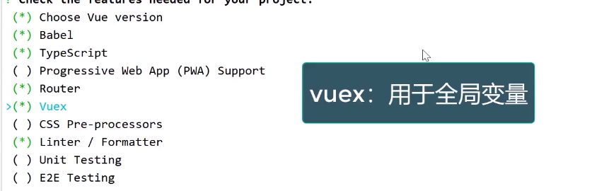
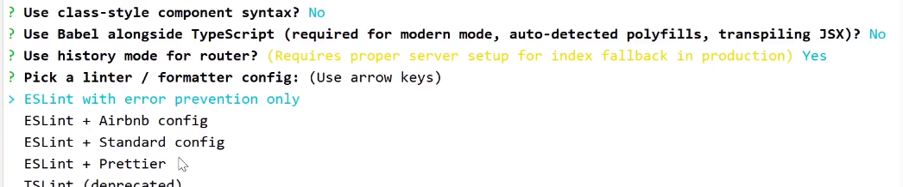
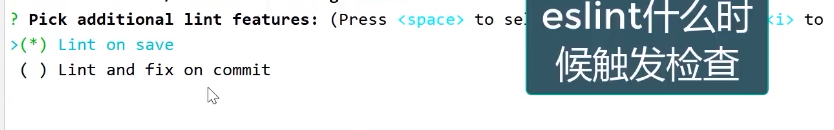
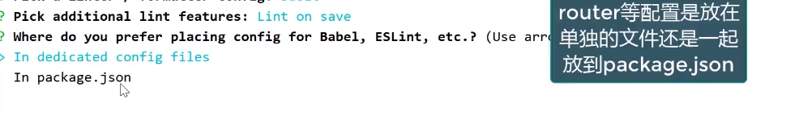
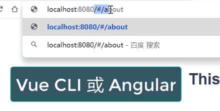
**不使用历史模式会在地址里带#号**
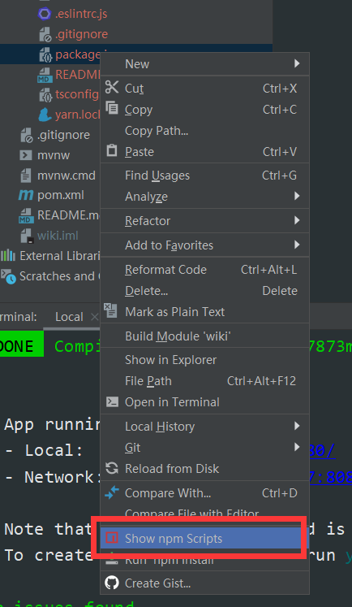
**快速启动npm**
## 讲解VueCLI项目结构
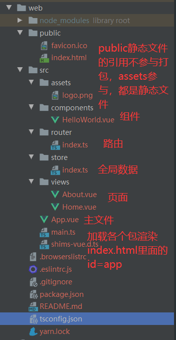
## 集成 Ant Design Vue 
```
npm install ant-design-vue@next --save

# 完整引入
import { createApp } from 'vue';
import Antd from 'ant-design-vue';
import App from './App';
import 'ant-design-vue/dist/antd.css';

const app = createApp();
app.config.productionTip = false;

app.use(Antd);
```

## 路由开发
**点击路由router-view会转变内容**
```
<div id="nav">
    <router-link to="/">Home</router-link> |
    <router-link to="/about">About</router-link>
</div>
<router-view/>


import { createRouter, createWebHistory, RouteRecordRaw } from 'vue-router'
import Home from '../views/Home.vue'

const routes: Array<RouteRecordRaw> = [
  {
    path: '/',
    name: 'Home',
    component: Home
  },
  {
    path: '/about',
    name: 'About',
    // route level code-splitting
    // this generates a separate chunk (about.[hash].js) for this route
    // which is lazy-loaded when the route is visited.
    component: () => import(/* webpackChunkName: "about" */ '../views/About.vue')
  }
]

const router = createRouter({
  history: createWebHistory(process.env.BASE_URL),
  routes
})

export default router

```
## 制作Vue自定义组件
**引入自定义组件**
```
<script lang="ts">
  import { defineComponent } from 'vue';
  import TheHeader from '@/components/the-header.vue';
  import TheFooter from '@/components/the-footer.vue';

  export default defineComponent({
    name: 'app',
    components: {
      TheHeader,
      TheFooter,
    },
  });
</script>
```
**到处组件**
```
<script lang="ts">
import { defineComponent } from 'vue';

export default defineComponent({
  name: 'the-header',
});
</script>
```
## 集成HTTP库axios
```
npm install axios --save
```
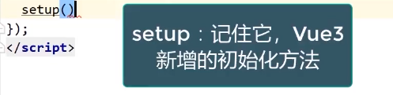
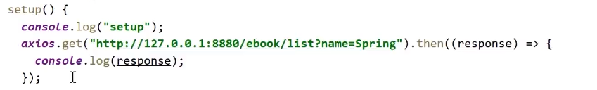
### 在main.ts对axios进行全局配置
```
import axios from 'axios';

axios.defaults.baseURL = process.env.VUE_APP_SERVER;
```
### 使用axios拦截器打印前端日志
```
import axios from 'axios';

axios.defaults.baseURL = process.env.VUE_APP_SERVER;

/**
 * axios拦截器
 */
axios.interceptors.request.use(function (config) {
  console.log('请求参数：', config);
  const token = store.state.user.token;
  if (Tool.isNotEmpty(token)) {
    config.headers.token = token;
    console.log("请求headers增加token:", token);
  }
  return config;
}, error => {
  return Promise.reject(error);
});
axios.interceptors.response.use(function (response) {
  console.log('返回结果：', response);
  return response;
}, error => {
  console.log('返回错误：', error);
  const response = error.response;
  const status = response.status;
  if (status === 401) {
    // 判断状态码是401 跳转到首页或登录页
    console.log("未登录，跳到首页");
    store.commit("setUser", {});
    message.error("未登录或登录超时");
    router.push('/');
  }
  return Promise.reject(error);
});
```

## Vue3数据绑定
### Vue2数据绑定的方式
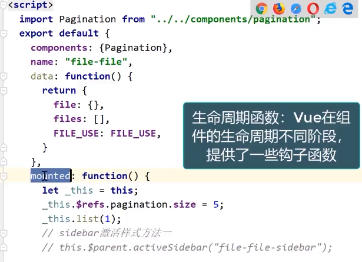
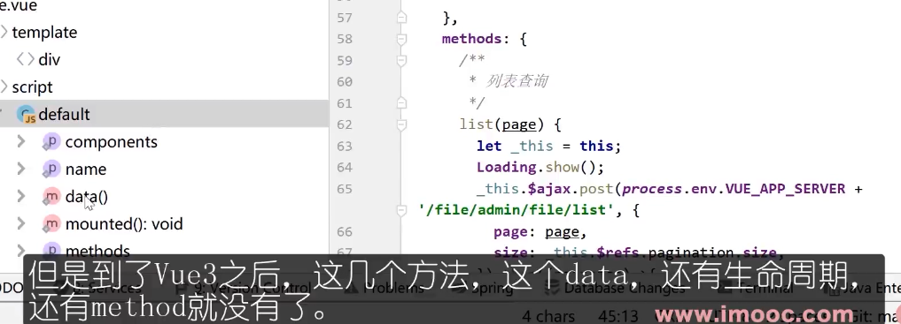

### setup方法替代了data(),mounted(),methods方法
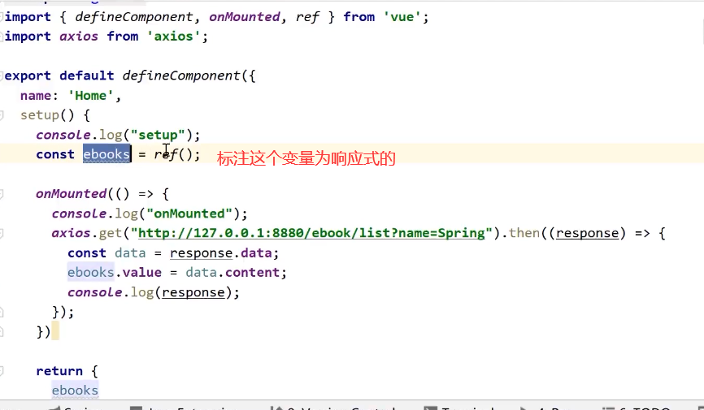
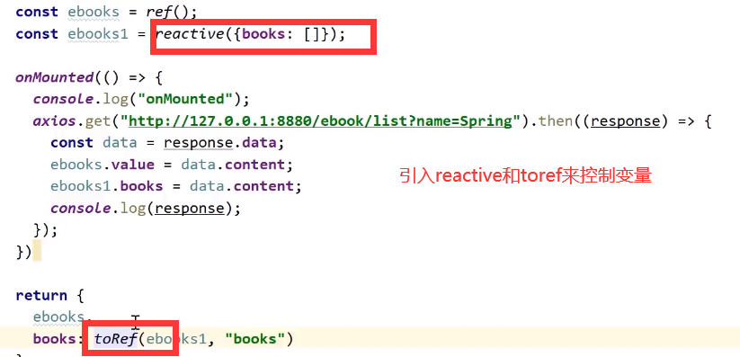

## scoped样式只在当前页面生效
```
<style scoped>
  .ant-avatar {
    width: 50px;
    height: 50px;
    line-height: 50px;
    border-radius: 8%;
    margin: 5px 0;
  }
</style>
```

## Vue CLI多环境配置
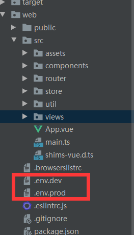
```
NODE_ENV=development
VUE_APP_SERVER=http://127.0.0.1:8880
VUE_APP_WS_SERVER=ws://127.0.0.1:8880

package.json
"serve-dev": "vue-cli-service serve --mode dev --port 8080",
"serve-prod": "vue-cli-service serve --mode prod",
"build-dev": "vue-cli-service build --mode dev",
"build-prod": "vue-cli-service build --mode prod",

main.ts
console.log('环境：', process.env.NODE_ENV);
console.log('服务端：', process.env.VUE_APP_SERVER);
```

## 微信小程序开发（七月）.md

# 微信小程序开发

## Lin UI
++Lin UI 是基于 微信小程序原生语法实现的组件库。遵循简洁，易用的设计规范。++
---

[Lin UI文档](https://doc.mini.talelin.com/start/)

## Promise
1. 对象的状态不受外界影响。Promise 对象代表一个异步操作，有三种状态：
-  pending: 初始状态，不是成功或失败状态。
-  fulfilled: 意味着操作成功完成。
-  rejected: 意味着操作失败。
2. ==一旦状态改变，就不会再变，任何时候都可以得到这个结果==。Promise 对象的状态改变，只有两种可能：从 Pending 变为 Resolved 和从 Pending 变为 Rejected。只要这两种情况发生，状态就凝固了，不会再变了，会一直保持这个结果。就算改变已经发生了，你再对 Promise 对象添加回调函数，也会立即得到这个结果。==这与事件（Event）完全不同，事件的特点是，如果你错过了它，再去监听，是得不到结果的==。

## 页面是否合并HTTP请求
1. HTTP请求数量
2. **HTTP多少次数据库查询 join**
3. 接口的灵活性，接口的可维护性，粒度

## 函数式编程
**js里有find filter reduce map不要总是写for循环**

## WXS
> WXS（WeiXin Script）是小程序的一套脚本语言，结合 WXML，可以构建出页面的结构。
### WXS与JS的区别
WXS 只提供给开发者5个基础类库，分别是 console，Math，JSON，Number，Date，以及一些常用的全局变量和全局函数，可以通过文档进行查阅：https://developers.weixin.qq.com/miniprogram/dev/framework/view/wxs/07basiclibrary.html
这些 API 虽然数量不多，但已经能满足基本的数据操作要求，而对于复杂的数据操作，比如类定义和继承等，还是需要依靠逻辑层的 JS 脚本完成。

> 只支持es5的语法，es6的像const都不支持

## async&await
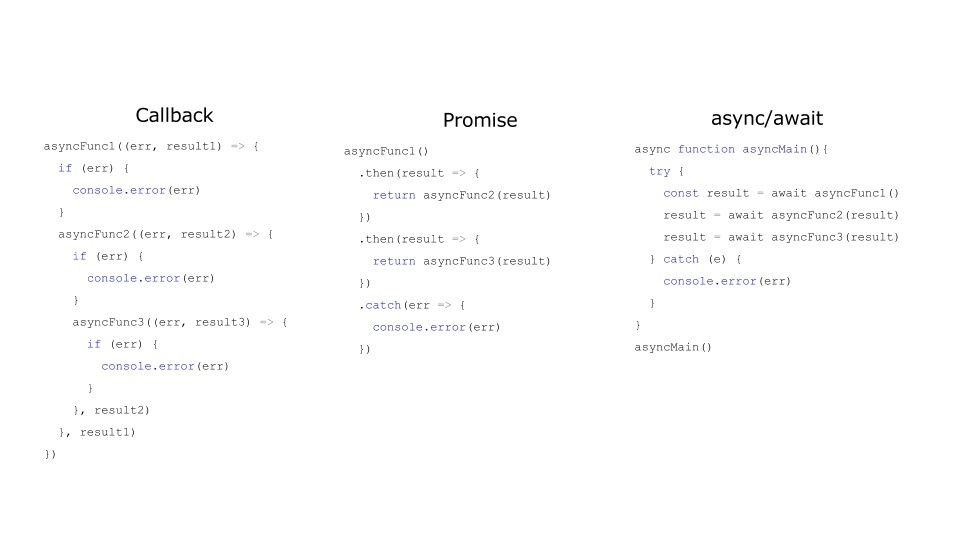
> 简单的一张图可以直观的表现出 callback、promise 和 async/await 在使用时的主要区别。

> 可以很明显的看到，callback 来控制异步的方式虽然非常简单，但也过于原始。在实际的使用中代码的逻辑顺序和业务的顺序是不相同的，错误控制基本靠手动检查err参数。

> 而到了 Promise 中这种情况好了很多，通过链式调用，Promise 可以直接在 then 中返回一个新的 Promise 来将异步操作串联起来，也有了统一的 catch 来做错误处理。美中不足的是，你仍然需要传递一个回调函数给 then，通过 then 来串联虽然保证了至少代码顺序上和真正的逻辑顺序一致，但和同步代码的差别仍然很大。

> async/await 则直接将其变成了同步的写法，心智负担大大降低。

> 而 async/await 和 Promise 的关系，用一句话总结，就是async function 就是返回 Promise 的 function。

**async 表示函数里有异步操作，**
**await 表示紧跟在后面的表达式需要等待结果。**

### 微信小程序原生promise的实现
- **将小程序内置非promise API转换为promise**
```
//动态类型非常常见，python
// java c# 委托 不常见
const promisic = function (func) {
  return function (params = {}) {
    return new Promise((resolve, reject) => {
      const args = Object.assign(params, {
        success: (res) => {
          resolve(res);
        },
        fail: (error) => {
          reject(error);
        }
      });
      func(args);
    });
  };
};

    static async request({url, data, callback, method='GET'}) {
        await promisic(wx.request)({
            url: `${config.apiBaseUrl}${url}`,
            data,
            method,
        })
    }
```
> 小程序使用async、await需开启==增强编译==。
## 基本配置
### 创建页面
1. 在微信开发者页面右键新建目录新建page
2. 在app.json中配置首页
3. setting里inspection关闭css的检测
4. setting里file watchers
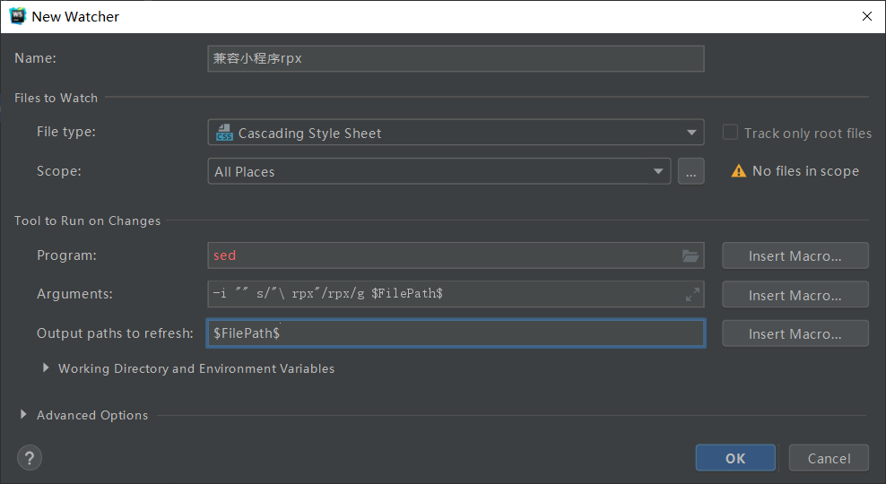
5. setting里File Types中html配置识别wxml，css中识别wxss
6. 将其中的[wecharCode.jar](https://github.com/miaozhang9/wecharCodejar)下载下来，然后在webStorm 的 File -> import settings 中导入即可
> rpx = 2*px ctrl+alt+L 格式化代码
Ctrl+F 查找文本 ctrl+shift+o 删除无效引用 sed在Windows下要下载https://github.com/mbuilov/sed-windows 

### 本地json模拟数据
```
安装json-server

npm i json-server -g 

在WXSHOP目录下运行命令行  

json-server --watch --port 53000 all.json  

浏览器:http://localhost:53000/themes      

PS:  themes指的的是all.json里面的key

详细用法：

https://www.cnblogs.com/fly_dragon/p/9186722.html
```

### config.js和原生调用api
```
wx.request({
  url:'http://localhost:53000/themes',
  method:'GET',
  data: {
    name:'t-1'
  }
})

const config = {
    appkey:'',
    apiBaseUrl:'http://localhost:53000/'
};

export {
    config
}
```

## 功能实现
### 接口调用
```
\\home.js 在哪里使用调用接口的函数
onLoad: async function (options) {
    const data = await Theme.getHomeLocationA();
    this.setData({
      topTheme: data[0]
    })
  },
  
\\theme.js 调用接口的函数
export class Theme {
    static async getHomeLocationA() {
        return await Http.request({
            url: `themes`,
            data: {
                name: 't-1'
            }
        });
    }
}
  
\\http.js 调用接口的工具类，采用promis封装
class Http {
    static async request({url, data, method='GET'}) {
        const res = await promisic(wx.request)({
            url: `${config.apiBaseUrl}${url}`,
            data,
            method,
        });
        return res.data
    }
}

```

### 轮播图实现
```
//原生实现方式
<swiper class="swiper"
            indicator-dots
            indicator-active-color="#157658"
            autoplay
            circular>
        <block wx:for="{{bannerB.items}}">
            <swiper-item>
                <image class="swiper" src="{{item.img}}"></image>
            </swiper-item>
        </block>
    </swiper>
```

### 组件引用和传参
```
# home.json
{
  "usingComponents": {
    "s-category-grid": "/components/category-grid/index"
  }
}

<s-category-grid grid="{{grid}}"></s-category-grid>

# index.js

/**
   * 组件的属性列表
   */
  properties: {
    grid: Array
  },
```

### 给组件设置外部样式类
```
# index.wxml
<view class="container l-class">

# index.js
externalClasses:['l-class'],
  properties: {
    theme:Object,
    spuList:Array
  },
```

### observers监听器
```
# 组件的index.js

properties: {
    banner:Object
  },

  observers:{
    'banner':function (banner) {
      if(!banner){
        return
      }
      if(banner.items.length === 0){
        return
      }
      const left = banner.items.find(i=>i.name==='left')
      const rightTop = banner.items.find(i=>i.name==='right-top')
      const rightBottom = banner.items.find(i=>i.name==='right-bottom')
      this.setData({
        left,
        rightTop,
        rightBottom
      })
    }
  } ,
```

### 分页
```
import {Http} from "./http";

class Paging {

    start
    count
    req
    locker = false
    url
    moreData = true
    accumulator = []  //总数据


    constructor(req, count = 10, start = 0) {
        this.start = start
        this.count = count
        this.req = req
        this.url = req.url
    }

    async getMoreData() {
        if(!this.moreData){
            return
        }
        if(!this._getLocker()){
            return
        }
        const data =await this._actualGetData()
        this._releaseLocker()
        return data
    }


    async _actualGetData() {
        const req = this._getCurrentReq()
        let paging = await Http.request(req)
        if(!paging){
            return null
        }
        if(paging.total === 0){
            return {
                empty:true,
                items:[],
                moreData:false,
                accumulator:[]
            }
        }

        this.moreData = Paging._moreData(paging.total_page, paging.page)
        if(this.moreData){
            this.start += this.count
        }
        this._accumulate(paging.items)
        return {
            empty:false,
            items: paging.items,
            moreData:this.moreData,
            accumulator:this.accumulator
        }
    }

    _accumulate(items){
        this.accumulator = this.accumulator.concat(items)
    }

    static _moreData(totalPage, pageNum) {
        return pageNum < totalPage-1
    }

    _getCurrentReq() {
        let url = this.url
        const params = `start=${this.start}&count=${this.count}`
        if(url.includes('?')){
            url += '&' + params
            // contains
        }
        else{
            url += '?' + params
        }
        this.req.url  = url
        return this.req
    }

    //锁，防抖，防止多次访问
    _getLocker() {
        if (this.locker) {
            return false
        }
        this.locker = true
        return true
    }

    _releaseLocker() {
        this.locker = false
    }

}

export {
    Paging
}
```

### 图片比例
```
index.wxml
<image bind:load="onImgLoad" style="width:{{w}}rpx;height:{{h}}rpx;" src="{{data.img}}"></image>

index.js
onImgLoad(event) {
            const {width, height} = event.detail
            this.setData({
                w:340,
                h:340*height/width
            })
        },
```
> 或者imag的内部方法可以参考微信文档

### 跳转
```
<view data-pid="{{data.id}}"  bind:tap="onItemTap" class="container">

onItemTap(event){
            const pid = event.currentTarget.dataset.pid
            wx.navigateTo({
                url:`/pages/detail/detail?pid=${pid}`
            })
        }
```

### sku的思路
**规格值与规格名对应**，
每次选择重新计算状态，用hashmap实现。

---

## 修改记录

| 日期 | 类型 | 说明 |
|---|---|---|
| 2026-07-22 | 审查 | 全面审查，核心内容完备（Vue3 + Composition API/`<script setup>`、Vue CLI→Vite、Vuex→Pinia、TypeScript 标配等时效性良好，无需订正） |
