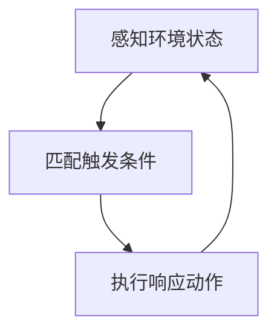
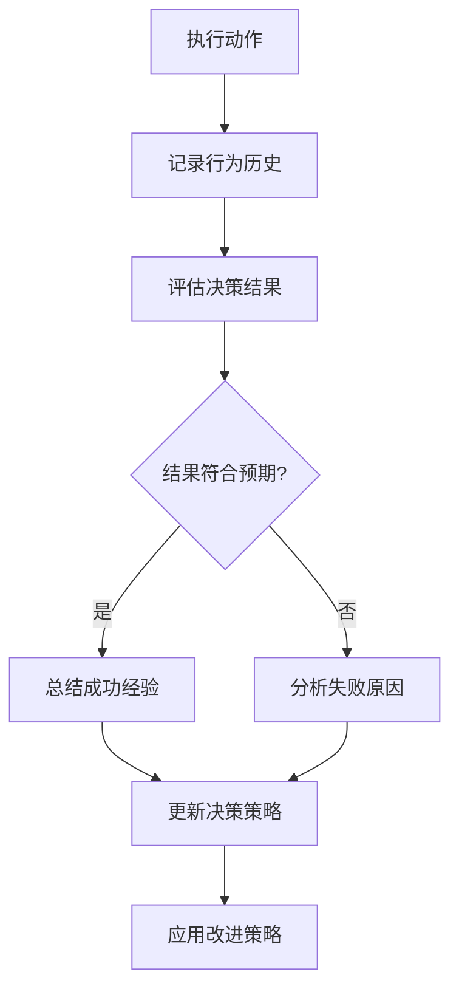
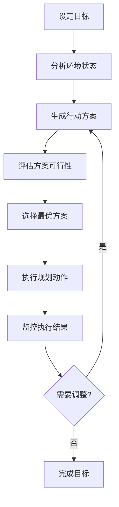
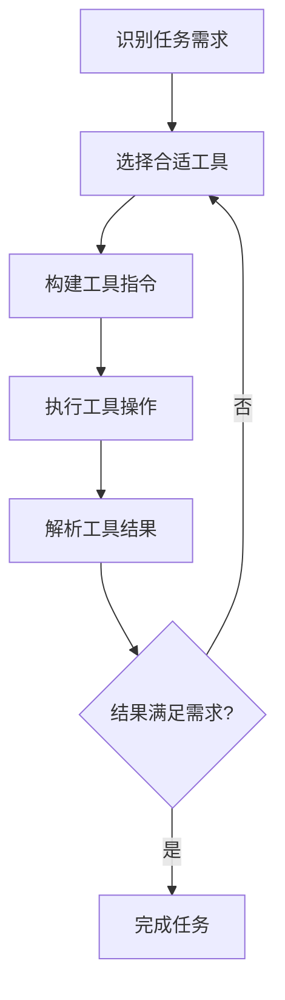
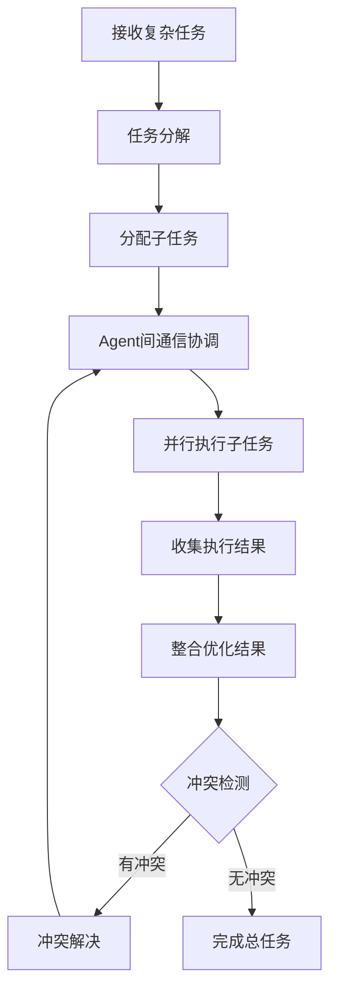
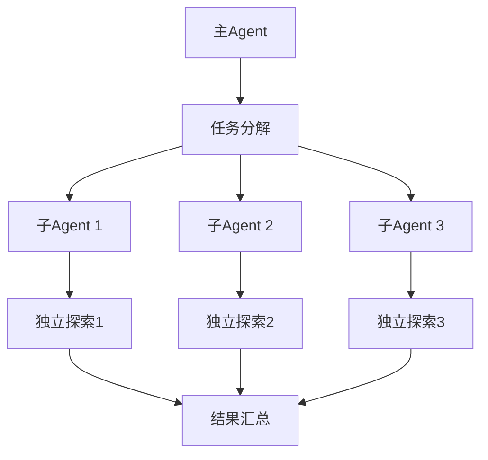
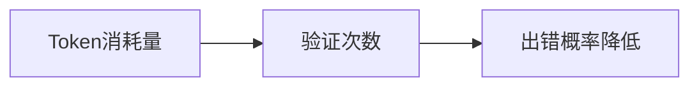
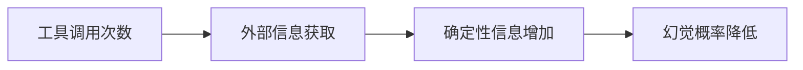
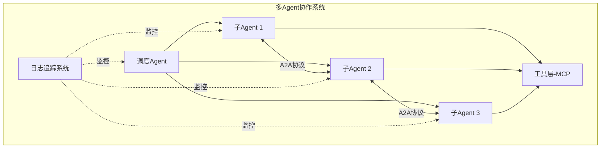

# Agent 设计模式与多 Agent 协作

> 预计阅读：约 27 分钟（正文约 8497 字）
> 阅读建议：建议先扫目录和二级标题，优先看概念、表格和代码示例，原文归档留到最后。

## 一、核心主题概述

Agent 设计模式解决的是同一个问题：**怎么把大模型的“说话能力”变成可靠、可扩展、能完成复杂任务的“行动能力”**。

归档原文从两个角度展开：

1. **单 Agent 的工作方式**：从最简单的“刺激-反应”到“反思、规划、工具使用、多 Agent 协作”五种模式。
2. **多 Agent 协作的落地权衡**：适合什么任务、有哪些优势、 token 与延迟代价、性能决定因素、工程挑战与最佳实践。

> 💡 补充：归档原文把“反应模式（React）”列为第一种基础模式。本文保留它作为最底层的基础层小节（2.1），重点展开四种更高级的**单 Agent / 多 Agent 设计模式**，并补充 2026 年常用的 **Evaluator-Optimizer** 模式。

---

## 二、五种 Agent 设计模式

### 2.1 反应模式（Reaction）

反应模式是 Agent 最基础的工作模式：**直接根据当前感知到的环境信息做出快速反应，没有复杂的思考过程**。

**工作闭环**

```text
实时感知环境状态 -> 匹配预定义触发条件 -> 执行响应动作 -> 循环感知-反应
```

- **适合**：实时监控系统（如火灾报警）、简单的机器人避障、自动化客服的基础回复。
- **优势**：响应速度快、实时性强、资源消耗低。
- **劣势**：缺乏长期规划、无法处理复杂问题、适应性有限。

> 💡 补充：归档原文写作“反应(React)”，这里的 React 指 Reactive（刺激-反应），与 2026 年常说的 ReAct（Reason + Act）不是一回事，详见「五、常见坑与补充」。

---

### 2.2 反思模式（Reflection）

反思模式让 Agent 不只是“执行”，而是**回头看自己的输出、决策过程和结果**，找出偏差并更新策略。

**工作闭环**

```text
执行动作 → 记录历史 → 评估结果 → 分析成败原因 → 更新策略 → 再次应用
```

- **适合**：输出质量需要持续提升、环境会变化的场景，如自主学习系统、推荐系统优化、代码自我审查。
- **优势**：能自我改进、适应变化、长期决策质量更高。
- **劣势**：增加计算和存储开销，反思本身可能耗时，甚至陷入“过度反思”。

> 💡 补充：2026 年最常见的实现是 **LLM-as-Judge** —— 用一个独立的评估提示或模型给主 Agent 的输出打分并给出修改建议。

---

### 2.3 工具使用模式（Tool Use）

工具使用模式让 Agent **主动调用外部能力**来弥补自身知识的边界，例如搜索、计算、数据库查询、API 调用、代码执行等。

**工作闭环**

```text
识别需求 → 选择工具 → 构造调用 → 执行工具 → 解析结果 → 不满意则重试
```

- **适合**：需要实时数据、精确计算或与外部系统交互的任务。
- **优势**：显著扩展能力边界，减少幻觉，提高效率。
- **劣势**：需要稳定的工具接口，增加系统复杂度，存在工具误用或失败的风险。

> 💡 补充：2026 年工具层已经协议化，**MCP（Model Context Protocol）** 正在成为事实标准，Function Calling 则是模型侧的基础能力。

---

### 2.4 规划模式（Planning）

规划模式让 Agent **为长期目标制定行动方案**，并在执行中根据反馈不断调整。

**工作闭环**

```text
设定目标 → 分析环境 → 生成候选方案 → 评估可行性 → 选择最优 → 执行 → 监控 → 必要时重规划
```

- **适合**：多步骤、目标明确但路径复杂的任务，如机器人路径规划、项目管理、物流调度。
- **优势**：目标导向强，能处理复杂长流程任务。
- **劣势**：计算成本高、规划时间长，环境剧烈变化时容易失效。

> 💡 补充：2026 年的主流做法不是让模型一次性生成完整计划，而是 **ReAct 风格的小步规划**：先想一步、执行一步、观察结果、再决定下一步。

---

### 2.5 多 Agent 协作模式（Multi-Agent）

多 Agent 协作模式把复杂任务**拆给多个子 Agent**，让它们并行探索、相互协调、汇总结果。

**工作闭环**

```text
接收复杂任务 → 任务分解 → 分配子任务 → Agent 间通信协调 → 并行执行 → 结果整合 → 冲突检测与解决
```

- **适合**：开放性问题、需要多角度探索的研究类任务、高价值的长流程任务。
- **优势**：分布式处理、并行效率高、系统更鲁棒、能完成单 Agent 无法胜任的复杂目标。
- **劣势**：协调成本高、通信开销大、冲突解决复杂。

> 💡 补充：2026 年多 Agent 通信已出现标准化尝试，**Google A2A** 用于 Agent 之间通信，**Anthropic MCP** 用于 Agent 与工具之间通信。

---

### 2.6 评估器-优化器模式（Evaluator-Optimizer）

评估器-优化器模式通过**“生成 → 评估 → 优化”的循环**来提升最终输出质量。一个 Agent 负责生成答案，另一个独立 Agent 负责评估并给出改进意见，直到满足要求。

- **适合**：对质量要求极高、需要显式质量门控的任务，如代码审查、报告生成、安全审核、法律文书校对。
- **优势**：输出质量有明确把关，能显著降低幻觉和低级错误。
- **劣势**：至少使 token 消耗翻倍，评估器本身可能带偏见，循环终止条件需要仔细设计。

> 💡 补充：该模式**未在归档原文中展开**，但已成为 2026 年单/多 Agent 系统里最常用的“质量兜底”模式，常与 Reflection、Multi-Agent 组合使用。

---

### 2.7 六种模式对比

| 模式 | 核心思想 | 主要优势 | 主要劣势 | 典型场景 | 2026 常用实现 |
|---|---|---|---|---|---|
| **反应模式** | 刺激-反应、无思考 | 响应快、资源消耗低 | 无长期规划、适应性有限 | 实时监控、简单避障 | 规则引擎 / 监控告警联动 |
| **反思模式** | 自我评估、持续改进 | 能适应变化、越用越好 | 增加延迟和存储 | 自主学习、推荐优化 | LLM-as-Judge 反馈循环 |
| **工具使用模式** | 调用外部能力 | 扩展边界、减少幻觉 | 接口依赖、系统复杂 | 搜索、API、数据分析 | MCP / Function Calling |
| **规划模式** | 目标分解与重规划 | 处理长流程复杂任务 | 计算成本高、动态环境易失效 | 机器人路径、项目管理 | ReAct + 外部 Planner |
| **多 Agent 协作模式** | 分布式并行探索 | 高效率、鲁棒、可处理复杂目标 | 协调和通信开销大 | 深度研究、多机器人协作 | A2A / CrewAI / AutoGen |
| **评估器-优化器模式** | 生成-评估-优化循环 | 质量可控、降低错误 | token 翻倍、评估器偏见 | 代码审查、报告生成 | Pairwise LLM Judge |

> 💡 补充：实际系统几乎都是**组合使用**，例如“规划 Agent 拆任务 → 多个子 Agent 并行 → 每个子 Agent 使用工具 → 评估器统一质检 → 整体反思复盘”。

---

## 三、多 Agent 协作

### 3.1 真正适合多 Agent 的场景

多 Agent 协作最适合**研究类、复杂长流程、开放性问题**：

- 没有固定答案，需要探索和发现；
- 需要多步深入分析，过程中会根据线索调整方向；
- 可以被拆成多个独立方向并行探索；
- 任务价值高，能承受较高的 token 成本。

**不适合**：流程固定、步骤明确、并行度低、预算有限的任务（例如大多数简单编码工作）。

---

### 3.2 核心优势：广度优先探索

多 Agent 的本质是**把一次“深度搜索”变成多次“独立广度搜索”**。

| 优势 | 说明 |
|---|---|
| **并行处理** | 主 Agent 分配任务，多个子 Agent 同时探索不同方向 |
| **独立上下文** | 每个子 Agent 拥有独立的上下文窗口，避免互相污染 |
| **减少路径依赖** | 不同 Agent 使用不同工具、提示和探索轨迹，降低局部最优风险 |
| **深度研究** | 适合彻底、独立的研究和探索 |

---

### 3.3 核心劣势：成本爆炸

| 类型 | Token 消耗倍数（相对普通 Chat） |
|---|---|
| 普通 Chat | 1 倍（基准） |
| 单 Agent | 约 4 倍 |
| 多 Agent 协作 | 约 15 倍 |

这意味着多 Agent 不是“免费加速器”，而是**用成本换探索深度和成功率**。

---

### 3.4 性能三大决定因素

1. **Token 消耗量**：更多验证通常意味着更低出错概率（非绝对）。
2. **工具调用次数**：工具提供确定性信息，调用越多，幻觉概率越低。
3. **基座模型能力**：参数量、多模态能力、上下文长度、知识时效决定系统上限。

---

### 3.5 工程落地的四大挑战

| 挑战 | 问题描述 | 解决方案 |
|---|---|---|
| **通信：巴别塔困境** | Agent 各说各话，容易误解 | 使用 MCP（工具通信）和 A2A（Agent 间通信） |
| **协同：指挥官的难题** | 任务分给谁、资源冲突、失败如何继续 | 引入调度/规划 Agent 负责任务分解、分配、监控和异常处理 |
| **观测：幽灵的踪迹** | 多 Agent 调试困难，决策链路黑盒 | 唯一 Trace ID、思考链和对话历史可视化 |
| **成本：智能的代价** | 每次思考都是 LLM API 调用 | 模型分层、Prompt 缓存、减少无效交互 |

---

### 3.6 多 Agent 协作 vs 单 Agent / 工作流

| 维度 | 固定工作流 | 单 Agent | 多 Agent 协作 |
|---|---|---|---|
| **任务类型** | 流程确定、可枚举 | 中等复杂度、工具辅助 | 开放研究、长流程、高并行 |
| **可控性** | 最高 | 中 | 较低 |
| **token 成本** | 最低 | 约 4 倍 | 约 15 倍 |
| **延迟** | 最低 | 中 | 高 |
| **容错性** | 依赖人工兜底 | 中 | 较高（子 Agent 可替换） |
| **调试难度** | 低 | 中 | 高 |

---

## 四、2026 年选型建议

### 4.1 按任务特征选择模式

| 任务特征 | 推荐模式/架构 | 理由 |
|---|---|---|
| 步骤固定、低变异 | **工作流 / 提示链** | 成本最低、最可控 |
| 需要外部事实或执行动作 | **Tool Use + RAG** | 减少幻觉，获取实时信息 |
| 输出质量需要持续提升 | **Reflection** | 自我改进，适合允许迭代的场景 |
| 多步骤目标、需要重规划 | **Planning（轻量 ReAct）** | 兼顾灵活性和可控性 |
| 高价值研究、可并行探索 | **Multi-Agent** | 用成本换深度和成功率 |
| 质量门控、安全敏感 | **Evaluator-Optimizer** | 显式评估，降低错误率 |

### 4.2 多 Agent 的决策 checklist

在决定是否上多 Agent 之前，先确认：

- [ ] 任务是否**无法被固定流程覆盖**？
- [ ] 是否能拆成多个**相对独立、可并行**的子任务？
- [ ] 任务价值是否足以覆盖 **15 倍 token 成本**？
- [ ] 是否有足够的**观测和追踪**能力来调试黑盒？
- [ ] 是否有明确的**终止条件和冲突解决机制**？

如果以上任一答案为“否”，优先考虑单 Agent + Tool Use + Reflection。

### 4.3 成本与性能优化建议

1. **模型分层**：规划、评估、反思用强模型；工具格式化、简单执行用轻模型。
2. **Prompt 缓存**：对长系统提示和重复上下文做缓存，降低重复调用成本。
3. **限制循环次数**：Reflection 和 Evaluator-Optimizer 必须设置最大迭代次数，防止无限优化。
4. **优先协议化工具**：使用 MCP 而不是每个工具各自封装，减少集成成本。
5. **全链路追踪**：从第一次用户请求到最后输出，每个 Agent 步骤都要有 Trace ID 和日志。

---

## 五、常见坑与补充

> 💡 补充：**不要把 ReAct 理解为“反应模式”**。归档原文里的“反应模式”更接近简单的刺激-反应；而 2026 年常说的 ReAct 是 **Reason + Act**（推理+行动），本质上结合了 Planning 和 Tool Use。

> 💡 补充：**多 Agent 不是万能药**。很多“多 Agent 系统”其实只是用多个 Agent 做固定流程，这种情况下不如直接写工作流，成本更低、调试更容易。

> 💡 补充：**评估器比生成器更重要**。Evaluator-Optimizer 的效果往往取决于评估提示和评分标准是否清晰，而不是生成模型有多强。

> 💡 补充：**2026 年的趋势是“协议化 + 可观测”**。MCP 统一工具接口、A2A 探索 Agent 间通信、OpenTelemetry 风格追踪正在成为工程落地的基础设施。

---

# 以下为原内容存档

> 以下内容为原始归档文件的完整保留，文字原貌不变。

## agent五种设计模式.md

# Agent五种设计模式

Agent（智能体）是指能够自主感知环境、做出决策并执行动作的实体。在人工智能领域，Agent设计模式决定了智能体如何处理信息和做出决策。本文将介绍五种常见的Agent设计模式：反应(React)、反思(Reflection)、规划(Planning)、工具使用(Tool Use)和多智能体协作(Multi-Agent Collaboration)。

## 1. 反应模式 (React Mode)

反应模式是Agent最基础的工作模式，它直接根据当前感知到的环境信息做出快速反应，没有复杂的思考过程。

### 工作原理
- 实时感知环境状态
- 匹配预定义的触发条件
- 执行对应的响应动作
- 循环感知-反应过程

### 流程图


### 特点
- 优点：响应速度快、实时性强、资源消耗低
- 缺点：缺乏长期规划、无法处理复杂问题、适应性有限

### 应用场景
- 实时监控系统（如火灾报警）
- 简单的机器人避障
- 自动化客服的基础回复

## 2. 反思模式 (Reflection Mode)

反思模式使Agent能够对自身的行为、决策过程和结果进行评估和思考，从而改进未来的表现。

### 工作原理
- 记录自身的行为历史和决策过程
- 评估决策结果与预期目标的差距
- 分析成功或失败的原因
- 更新决策策略和知识体系

### 流程图


### 特点
- 优点：能够自我改进、适应变化、提高决策质量
- 缺点：增加计算复杂度、需要额外的存储资源、反思过程可能耗时

### 应用场景
- 自主学习系统
- 自适应控制系统
- 智能推荐系统的优化

## 3. 规划模式 (Planning Mode)

规划模式使Agent能够为实现长期目标制定详细的行动计划，并根据环境变化调整策略。

### 工作原理
- 明确目标和约束条件
- 分析当前环境状态
- 生成多种可能的行动方案
- 评估方案的可行性和效果
- 选择最优方案并执行
- 根据执行结果调整规划

### 流程图


### 特点
- 优点：目标明确、策略性强、能够处理复杂任务
- 缺点：计算成本高、规划时间长、对环境变化的适应性有限

### 应用场景
- 机器人路径规划
- 项目管理系统
- 物流调度系统

## 4. 工具使用模式 (Tool Use Mode)

工具使用模式使Agent能够利用外部工具扩展自身能力，完成仅凭自身无法完成的任务。

### 工作原理
- 识别任务需求
- 选择合适的工具
- 构建工具使用指令
- 执行工具操作
- 解析工具返回结果
- 利用结果继续任务

### 流程图


### 特点
- 优点：扩展能力边界、提高效率、解决复杂问题
- 缺点：需要工具接口、增加系统复杂度、工具使用风险

### 应用场景
- 搜索引擎集成
- API调用系统
- 数据分析工具的使用

## 5. 多智能体协作模式 (Multi-Agent Collaboration Mode)

多智能体协作模式使多个Agent能够相互协作，共同完成复杂任务，发挥群体智慧。

### 工作原理
- 任务分解与分配
- Agent间通信与协调
- 并行执行子任务
- 结果整合与优化
- 冲突检测与解决

### 流程图


### 特点
- 优点：分布式处理、提高效率、增强鲁棒性、实现复杂目标
- 缺点：协调成本高、通信开销大、冲突解决复杂

### 应用场景
- 分布式计算系统
- 多机器人协作
- 团队协作软件

## 总结

| 设计模式 | 核心特点 | 适用场景 |
|---------|---------|---------|
| 反应模式 | 实时响应、快速决策 | 实时监控、简单避障 |
| 反思模式 | 自我评估、持续改进 | 自主学习、系统优化 |
| 规划模式 | 目标导向、策略制定 | 路径规划、项目管理 |
| 工具使用模式 | 能力扩展、资源利用 | 搜索引擎、API调用 |
| 多智能体协作模式 | 分布式处理、群体智慧 | 分布式系统、多机器人协作 |

在实际应用中，Agent通常会结合多种设计模式工作。例如，一个智能助手可能先通过反应模式快速响应用户请求，然后通过规划模式制定解决方案，必要时使用工具获取信息，最后通过反思模式改进自身表现。选择合适的设计模式组合取决于具体的任务需求和环境条件。

## 多Agent协作系统优劣势与性能.md

# 多Agent协作系统的优劣势与性能

## 1. 适用场景

### 1.1 什么工作适合多Agent协作系统？

多Agent协作系统主要适用于**研究类和复杂长流程任务**，具体特点包括：

- **开放性问题**：没有固定答案，需要探索和发现
- **多步解析**：需要分步骤深入分析
- **动态调整**：根据过程中发现的线索持续更新研究方法
- **自主运行**：能够根据中间结果自主决定后续方向

> 单Agent无法处理的复杂任务需要多Agent协同工作，其不确定性正好匹配多Agent的自主决策特性。

## 2. 优势

### 2.1 核心优势

多Agent协作系统最擅长**广度优先查询**，涉及多个独立方向的并行探索：



### 2.2 优势特点

| 特点 | 说明 |
|------|------|
| **并行处理** | 主Agent分配任务，子Agent同时探索不同方向 |
| **独立上下文** | 每个子Agent拥有独立的上下文窗口 |
| **减少路径依赖** | 不同Agent有不同的工具、提示和探索轨迹 |
| **深度研究** | 支持彻底、独立的研究和探索 |

## 3. 劣势

### 3.1 成本问题

多Agent协作系统最大的缺点是**Token消耗大**：

| 类型 | Token消耗倍数 |
|------|---------------|
| 普通Chat | 1倍（基准） |
| 单Agent | 4倍 |
| 多Agent协作 | 15倍 |

### 3.2 不适用场景

**不适合固定流程编排的任务**：
- 任务流程固定、步骤明确
- 并行任务较少（如大部分编码工作）
- 成本敏感的低价值任务

## 4. 性能决定因素

多Agent协作系统的性能主要取决于**三大要素**：

### 4.1 Token消耗量



- 消耗Token越多，表示有更多LLM对问题进行验证
- 验证次数越多，出错概率越低
- 注意：并非绝对关系，存在例外情况

### 4.2 工具调用次数



- 工具是确定性的，提供真实信息
- 调用次数越多，获取外部环境信息越多
- 真实信息越多，幻觉概率越低

### 4.3 基座模型能力

基座大模型性能决定系统上限，包括：

- **模型参数量**：参数越大，理解能力越强
- **多模态能力**：支持文本、图像、音频等多种输入
- **上下文长度**：支持更长的对话历史和文档
- **知识更新**：预训练知识的时效性

## 5. 开发挑战

构建落地的多Agent协作系统需要解决**四大核心技术挑战**：

### 5.1 通信挑战：巴别塔困境

**问题**：不同Agent按自己的方式通信，导致误解和混乱

**解决方案**：
- 使用 **MCP协议**（Anthropic发布）完成外部工具通信
- 使用 **A2A协议**（Google发布）完成Agent间通信
- 确保Agent间对话像API调用一样精准

### 5.2 协同挑战：指挥官的难题

**问题**：
- 任务应该分配给谁？
- 多个Agent抢占同一资源怎么办？
- Agent失败后流程如何继续？

**解决方案**：
- 构建**任务调度与规划Agent**
- 负责任务分解、分配、状态监控和异常处理
- 充当整个系统的"大脑中枢"

### 5.3 观测挑战：幽灵的踪迹

**问题**：
- 调试一个Agent已经很难
- 调试多个相互对话的Agent更加困难
- 决策追踪困难，不知道是哪个Agent在哪个环节做出的

**解决方案**：
- 构建**日志和追踪系统**
- 为每次Agent交互生成唯一的Trace ID
- 将"思考链"和"对话历史"可视化
- 让整个"黑盒"组织变得透明

### 5.4 成本挑战：智能的代价

**问题**：
- 每次"思考"都是昂贵的LLM API调用
- Agent越多，交互越频繁，成本和延迟越高

**解决方案**：

| 策略 | 说明 |
|------|------|
| **模型分层** | 思考者用强模型，执行者用轻模型 |
| **Prompt缓存** | 缓存常用提示，减少重复调用 |
| **交互优化** | 优化Agent间交互链条，减少不必要沟通 |

## 6. 系统架构总览



## 7. 最佳实践建议

### 7.1 使用多Agent的场景

✅ **适合使用**：
- 高价值的研究任务
- 需要并行探索的开放性问题
- 需要深度、独立研究的复杂任务
- 有充足预算的项目

❌ **不适合使用**：
- 流程固定的任务
- 低价值、简单任务
- 预算有限的项目
- 并行度低的编码工作

### 7.2 性能优化策略

1. **合理规划Token预算**：根据任务价值分配Token额度
2. **优化工具调用**：选择高质量、确定性的工具
3. **选择合适的基座模型**：平衡性能与成本
4. **建立完善的监控**：及时发现并解决问题

## 8. 总结

多Agent协作系统是处理复杂、开放性问题的强大工具，但需要：

- **明确适用场景**：研究类、长流程、高价值任务
- **理解成本代价**：Token消耗是普通Chat的15倍
- **掌握关键技术**：通信、协同、观测、成本优化
- **合理应用**：根据任务特点选择合适的架构

通过合理的架构设计和优化策略，多Agent协作系统能够在复杂任务中发挥巨大价值。

---


## 📚 完整资料

> **原文归档**：[archive/old-agent-notes/agent系统知识/](https://github.com/wychmod/wychmod.github.io/tree/main/docs/md/archive/old-agent-notes/agent%E7%B3%BB%E7%BB%9F%E7%9F%A5%E8%AF%86)
> 包含：2 个文件（agent五种设计模式 / 多Agent协作系统优劣势与性能）

- [archive/old-agent-notes/agent系统知识/](https://github.com/wychmod/wychmod.github.io/tree/main/docs/md/archive/old-agent-notes/agent%E7%B3%BB%E7%BB%9F%E7%9F%A5%E8%AF%86)

---

## 最新修改记录

| 日期 | 类型 | 说明 |
|---|---|---|
| 2026-08-26 | 重构 | 统一前置阅读时间/建议，原文归档移至文末 |

> 📚 完整历史修改记录见 [修改记录归档](/_meta/CHANGELOG_HISTORY.md)。
