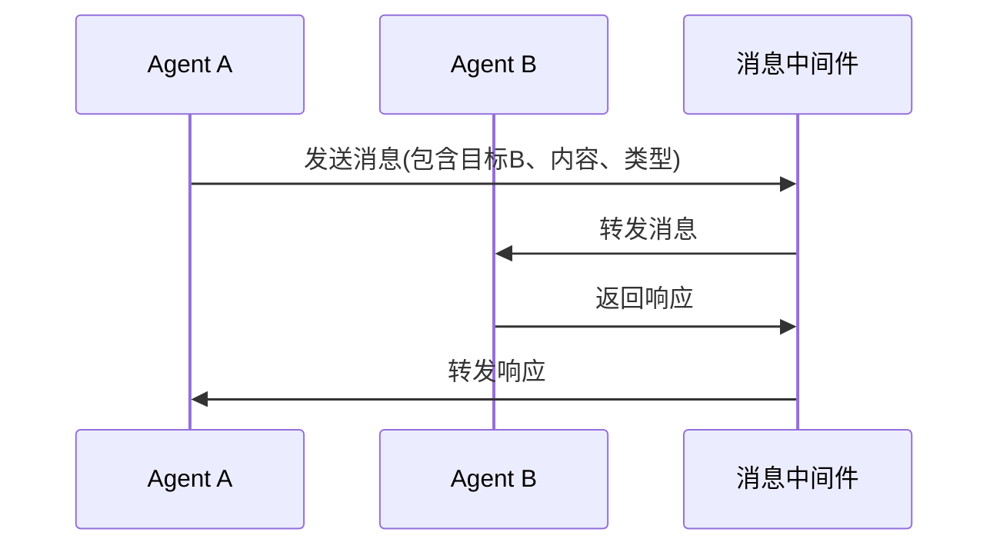
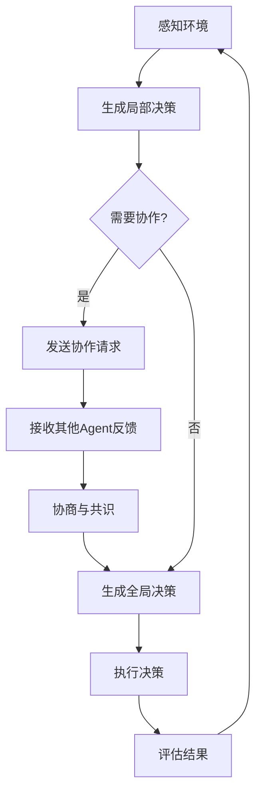
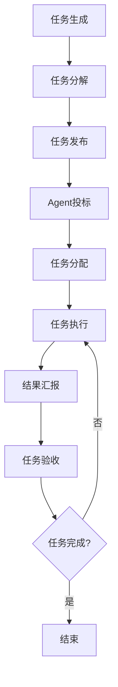
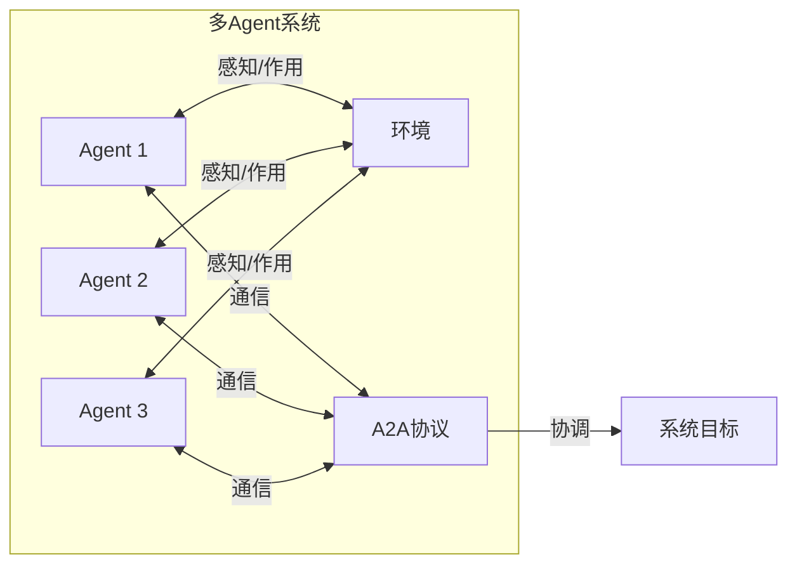

# A2A 协议

> **原文归档**：[archive/old-agent-notes/agent系统知识/A2A协议技术学习笔记.md](../../archive/old-agent-notes/agent系统知识/A2A协议技术学习笔记.md)

## 一、核心主题概述

A2A（Agent-to-Agent）协议定义了**多 Agent 系统（Multi-Agent System, MAS）**中不同 Agent 之间交换信息、协调任务、共享资源的规则与标准。它规范了通信的语法、语义和语用，使异构 Agent 能够理解彼此意图并协同完成复杂目标。

从学术视角看，A2A 协议研究历史悠久，代表标准包括 **FIPA ACL、KQML、JADE、OMG MASIF** 等；从工程视角看，2025 年 Google 推出同名 **A2A（Agent2Agent）开放协议**，目标是让不同厂商、不同框架构建的 AI Agent 能够跨平台互操作。

> 💡 补充：本文归档笔记更偏向学术/传统 MAS 中的 A2A 概念，但当前业界讨论 A2A 时通常指 Google 主导的 Agent 互操作协议，阅读时需注意语境差异。

## 二、A2A 要解决什么问题

在分布式智能系统中，单个 Agent 的能力往往有限，需要多个 Agent 协作。A2A 协议主要解决以下问题：

| 问题 | 说明 |
|------|------|
| **异构互操作** | 不同平台、语言、框架实现的 Agent 无法直接通信 |
| **通信模式多样** | 需要支持同步/异步、点对点、广播、发布-订阅等多种模式 |
| **协作机制缺失** | 任务分解、投标、协商、共识等缺少统一规则 |
| **可靠性不足** | 需要消息确认、重试、去重、顺序保障等机制 |
| **安全与权限** | 需要身份认证、授权、加密等安全能力 |

## 三、A2A 核心概念

### 3.1 核心特点

| 特点 | 描述 |
|------|------|
| **标准化** | 统一通信格式与接口，实现跨平台互操作 |
| **灵活性** | 支持同步/异步、点对点/广播/发布-订阅等模式 |
| **可靠性** | 提供错误处理、消息确认、重试与去重机制 |
| **安全性** | 支持身份认证、授权与加密 |
| **可扩展性** | 支持动态加入新 Agent 和协议扩展 |
| **语义化** | 不仅传输数据，还携带含义与上下文，支持推理决策 |

### 3.2 典型应用场景

- 智能交通：车辆 Agent 协同优化流量、避免碰撞
- 智能制造：工业机器人 Agent 协作完成复杂产线任务
- 智能电网：电力设备 Agent 协调供需
- 分布式计算：计算节点 Agent 分配任务、共享资源
- 电子商务：买卖双方 Agent 自动议价与交易
- 智慧城市：城市设施 Agent 智能调度资源

### 3.3 多 Agent 系统的组成要素与工作原理

多 Agent 系统是由多个相互作用、相互协作的 Agent 组成的分布式系统，这些 Agent 具有自主性、社会性、反应性和主动性，能在动态环境中协同完成复杂任务。A2A 协议与 MAS 相互依存：A2A 为多 Agent 系统提供通信与交互的基础，多 Agent 系统则为 A2A 协议提供应用场景。

一个完整的多 Agent 系统通常包含六个组成要素：

| 要素 | 说明 |
|------|------|
| **Agent** | 具有自主性、社会性、反应性和主动性的实体 |
| **环境** | Agent 所处的物理或虚拟空间，提供感知和作用的场所 |
| **通信设施** | 支持 Agent 之间信息交换的基础设施 |
| **交互协议** | 定义 Agent 之间交互规则的协议（如 A2A 协议） |
| **任务** | 系统需要完成的目标或工作 |
| **资源** | 完成任务所需的各种资源，如计算资源、数据资源 |

其工作原理可概括为五步循环：**感知环境 -> 自主决策 -> 通信协作（经由 A2A 协议）-> 执行动作 -> 适应调整**，Agent 依据环境反馈持续调整自身行为与策略。

### 3.4 多 Agent 系统典型架构

| 架构 | 特点 | 优劣 |
|------|------|------|
| **集中式** | 存在中心 Agent 统一协调 | 简单易管，但存在单点故障和性能瓶颈 |
| **分布式** | Agent 平等，点对点直接通信 | 去中心化、容错好，但协调与一致性困难 |
| **分层式** | 按功能或权限分层管理 | 结构清晰、模块化高，但层间通信开销大 |
| **联邦式** | 多个独立 Agent 集群通过联邦协议协作 | 灵活可扩展，但联邦间协调复杂 |

### 3.5 通信模型

1. **请求-响应模型**：一个 Agent 发送请求，另一个 Agent 返回响应
2. **发布-订阅模型**：一个 Agent 发布消息，多个订阅者接收感兴趣的消息
3. **广播模型**：一个 Agent 向所有其他 Agent 发送消息

### 3.6 消息格式要素

一条典型的 A2A 消息通常包含：

- **发送方 / 接收方**：Agent ID
- **消息类型**：请求、响应、通知等
- **消息内容**：实际业务数据
- **时间戳**：消息发送时间
- **序列号**：唯一标识，用于顺序保障与去重
- **优先级**：消息处理优先级

### 3.7 协议栈分层

| 层级 | 职责 |
|------|------|
| **物理层** | 消息的物理传输 |
| **传输层** | 消息的可靠传输 |
| **会话层** | 建立和维护 Agent 间会话 |
| **应用层** | 处理具体应用逻辑与消息内容 |

### 3.8 典型标准

| 标准 | 简介 |
|------|------|
| **FIPA ACL** | FIPA 组织定义的 Agent 通信语言 |
| **JADE** | 基于 Java 的 FIPA 标准实现框架 |
| **KQML** | 用于 Agent 间知识交换的语言 |
| **OMG MASIF** | OMG 移动 Agent 系统互操作标准 |

其中 FIPA 标准族最为完整：除通信语言 FIPA ACL 外，还定义了请求-响应、合同网（Contract Net）、拍卖等**交互协议**，以及提供 Agent 能力注册与发现的目录服务 **FIPA DF**（Directory Facilitator）。

### 3.9 发展趋势

归档笔记总结的 A2A 协议六个演进方向：

| 趋势 | 说明 |
|------|------|
| **语义化** | 支持更丰富的语义表达和理解，实现更智能的 Agent 交互 |
| **标准化** | 制定更统一、更完善的协议标准，提高 Agent 之间的互操作性 |
| **安全性** | 加强安全机制，保护通信的机密性、完整性和可用性 |
| **可扩展性** | 支持大规模 Agent 系统的通信和交互 |
| **自适应** | 根据环境变化和系统需求自动调整通信策略 |
| **跨平台** | 支持不同平台、不同语言实现的 Agent 之间的交互 |

## 四、A2A 与 MCP 的区别

MCP（Model Context Protocol）与 A2A 解决的是不同层面的互操作问题，二者互补而非替代。

| 维度 | **A2A（Agent-to-Agent）** | **MCP（Model Context Protocol）** |
|------|---------------------------|----------------------------------|
| **互操作范围** | Agent 与 Agent 之间 | 模型/应用与外部工具、数据源之间 |
| **核心问题** | 不同 Agent 如何发现、协商、协作完成任务 | 模型如何统一调用工具、读取资源、获取上下文 |
| **通信主体** | Agent ↔ Agent | Host / Client ↔ MCP Server |
| **能力发现** | Agent Card（能力卡片） | `tools/list`、`resources/list`、`prompts/list` |
| **典型动作** | 任务委托、投标、协商、状态同步、结果回传 | 工具调用、资源读取、提示词模板获取 |
| **协议层级** | 应用层/业务协作层 | 模型上下文接入层 |
| **关系比喻** | 像"不同部门/同事之间的协作流程" | 像"电脑 USB-C 接口，统一外设接入" |

> 💡 补充：可以把 MCP 理解为"模型拥有什么能力、能调用什么工具"，把 A2A 理解为"多个模型/Agent 如何组队把一件事做完"。实际系统中通常两者叠加使用：每个 Agent 内部通过 MCP 接入工具，Agent 之间通过 A2A 协作。

## 五、2026 年现状

截至 2026 年，A2A 协议处于"标准初步成型、生态正在扩展"的阶段：

1. **Google A2A 已发布多版草案**：基于 JSON-RPC over HTTP(S)，强调 Agent 能力发现（Agent Card）、任务生命周期管理、安全认证（OpenID Connect / OAuth 2.0）和推送/轮询状态更新。

2. **MCP 更成熟、生态更广**：Anthropic 主导的 MCP 在模型工具集成侧已经获得大量 IDE、框架和 SaaS 支持，社区 Server 数量远超 A2A。

3. **两者互补成为共识**：主流 Agent 框架（如 LangGraph、AutoGen、CrewAI 等）通常同时关注 MCP 工具接入与 A2A 跨 Agent 协作，但 A2A 的具体落地案例和工具链仍少于 MCP。

4. **安全与治理仍是难点**：跨组织、跨厂商 Agent 互操作涉及身份信任、权限边界、审计合规等问题，标准仍在演进。

5. **国内市场跟进中**：国内云厂商和大模型公司多处于评估或实验接入阶段，公开生产级案例有限。

> 💡 补充：2026 年若要选择接入协议，建议优先评估 MCP 解决"工具/数据接入"问题；若系统内存在多个独立 Agent 需要跨边界协作，再引入 A2A 作为补充。

## 六、常见坑与补充

- **混淆 A2A 的两种含义**：学术文献中的 A2A 多指 MAS 通信协议，而工程社区讨论的 A2A 通常指 Google Agent2Agent，二者概念范围不同。

- **不要期望 A2A 替代 MCP**：A2A 不负责统一工具描述或资源访问，它解决的是 Agent 间协作问题。

- **消息可靠性与顺序**：分布式环境下，异步消息容易出现乱序、丢失、重复，需要显式设计序列号、确认和幂等机制。

- **架构选型影响通信复杂度**：集中式架构简单但易单点故障；分布式/联邦式灵活但协商和一致性成本高。

- **安全不能事后补**：跨 Agent 通信应尽早考虑身份认证、最小权限、消息加密和审计日志。

> 💡 补充：原归档笔记中的流程图（通信流程、协作决策、任务分配，见下方「以下为原内容存档」）仍可用于理解 MAS 运行逻辑，但 Google A2A 的具体交互细节建议直接参考官方最新协议文档，因为草案更新较快。

---

# 以下为原内容存档

> 以下内容为原始归档文件的完整保留，文字原貌不变。

## A2A协议技术学习笔记.md

# A2A（Agent-to-Agent）协议技术学习笔记

## 1. 概述

A2A（Agent-to-Agent）协议是多Agent系统（Multi-Agent System, MAS）中Agent之间进行通信、协作和交互的规范和标准。随着分布式人工智能的发展，A2A协议在构建复杂、智能的分布式系统中发挥着越来越重要的作用。

## 2. A2A协议的基本概念与核心特点

### 2.1 基本概念

A2A协议是指在多Agent系统中，定义Agent之间如何进行信息交换、任务协调和资源共享的一套规则、约定和标准。它规定了通信的语法、语义和语用，确保不同Agent之间能够有效地理解和响应彼此的请求。

### 2.2 核心特点

| 特点 | 描述 |
|------|------|
| **标准化** | 提供统一的通信格式和接口，确保不同平台、不同实现的Agent之间能够互操作 |
| **灵活性** | 支持多种通信模式，如同步/异步、点对点/广播、请求-响应等 |
| **可靠性** | 提供错误处理、消息确认、重试机制等，确保通信的可靠性 |
| **安全性** | 支持身份认证、授权、加密等安全机制，保护通信内容的机密性和完整性 |
| **可扩展性** | 支持动态添加新的Agent、服务和协议扩展，适应系统的增长和变化 |
| **语义化** | 不仅传递数据，还传递数据的含义和上下文，支持智能推理和决策 |

### 2.3 应用场景

A2A协议在各个领域都有广泛的应用，主要包括：

1. **智能交通系统**：车辆Agent之间通过A2A协议进行通信，实现交通流量优化、碰撞避免等功能
2. **智能制造**：工业机器人Agent之间通过A2A协议协作完成复杂的生产任务
3. **智能电网**：电力设备Agent之间通过A2A协议协调电力供应和需求
4. **分布式计算**：计算节点Agent之间通过A2A协议分配计算任务和共享资源
5. **电子商务**：买卖双方Agent之间通过A2A协议进行自动议价和交易
6. **智慧城市**：各类城市设施Agent之间通过A2A协议实现城市资源的智能管理和调度

## 3. 多Agent系统（Multi-Agent System, MAS）

### 3.1 定义

多Agent系统（MAS）是由多个相互作用、相互协作的Agent组成的分布式系统。这些Agent具有一定的自主性、社会性、反应性和主动性，能够在动态环境中协同完成复杂任务。

### 3.2 组成要素

一个完整的多Agent系统通常包含以下组成要素：

1. **Agent**：具有自主性、社会性、反应性和主动性的实体
2. **环境**：Agent所处的物理或虚拟空间，提供Agent感知和作用的场所
3. **通信设施**：支持Agent之间信息交换的基础设施
4. **交互协议**：定义Agent之间交互规则的协议（如A2A协议）
5. **任务**：系统需要完成的目标或工作
6. **资源**：完成任务所需的各种资源，如计算资源、数据资源等

### 3.3 工作原理

多Agent系统的工作原理可以概括为以下几个步骤：

1. **感知环境**：Agent通过传感器感知环境状态
2. **自主决策**：Agent根据自身知识和目标做出决策
3. **通信协作**：Agent之间通过A2A协议进行通信和协作
4. **执行动作**：Agent执行决策后的动作，影响环境
5. **适应调整**：Agent根据环境反馈调整自身行为和策略

### 3.4 典型架构

多Agent系统有多种典型架构，主要包括：

#### 3.4.1 集中式架构

在集中式架构中，存在一个中心Agent负责协调和管理所有其他Agent的活动。

```
┌─────────────┐
│ 中心Agent   │
└─────────────┘
       ↓
┌─────┴─────┐
│           │
▼           ▼
┌─────┐  ┌─────┐
│Agent│  │Agent│
└─────┘  └─────┘
    ↑        ↑
    └────────┘
```

**特点**：结构简单，易于管理，但中心Agent可能成为性能瓶颈和单点故障。

#### 3.4.2 分布式架构

在分布式架构中，所有Agent都是平等的，没有中心控制，Agent之间通过直接通信进行协作。

```
┌─────┐  ┌─────┐
│Agent│◄─►│Agent│
└─────┘  └─────┘
    ▲        ▲
    │        │
    └────┬───┘
         │
┌────────▼────────┐
│                 │
▼                 ▼
┌─────┐        ┌─────┐
│Agent│        │Agent│
└─────┘        └─────┘
```

**特点**：去中心化，容错性好，但协调和一致性维护困难。

#### 3.4.3 分层架构

在分层架构中，Agent按照功能或权限划分为不同的层次，上层Agent指导和协调下层Agent的活动。

```
┌─────────────┐
│ 高层Agent   │
└─────────────┘
       ↓
┌─────┴─────┐
│中层Agent 1│
└───────────┘
       ↓
┌─────┴─────┐
│下层Agent 1│  ┌───────────┐
└───────────┘  │下层Agent 2│
               └───────────┘
```

**特点**：结构清晰，模块化程度高，但层次间通信开销大。

#### 3.4.4 联邦式架构

在联邦式架构中，多个相对独立的Agent集群（联邦）通过联邦协议进行协作。

```
┌─────────────────┐  ┌─────────────────┐
│   联邦A         │  │   联邦B         │
│ ┌─────┐ ┌─────┐ │  │ ┌─────┐ ┌─────┐ │
│ │Agent│ │Agent│ │  │ │Agent│ │Agent│ │
│ └─────┘ └─────┘ │  │ └─────┘ └─────┘ │
└─────────────────┘  └─────────────────┘
         ↑                  ↑
         └──────────────────┘
              联邦协议
```

**特点**：灵活性高，可扩展性强，但联邦间协调复杂。

## 4. A2A协议与多Agent系统的关系

### 4.1 关系概述

A2A协议是多Agent系统的核心组成部分，它为Agent之间的通信和交互提供了标准化的机制。没有A2A协议，多Agent系统中的Agent将无法有效地理解和响应彼此的请求，也就无法实现真正的协作。

### 4.2 交互机制

A2A协议定义了多Agent系统中Agent之间的交互机制，主要包括：

#### 4.2.1 通信模型

A2A协议支持多种通信模型，主要包括：

1. **请求-响应模型**：一个Agent发送请求，另一个Agent返回响应
   ```
   Agent A → 请求 → Agent B
   Agent A ← 响应 ← Agent B
   ```

2. **发布-订阅模型**：一个Agent发布消息，多个Agent订阅感兴趣的消息
   ```
               ┌─────────┐
           ┌──►│Agent B  │
   ┌─────┐ │   └─────────┘
   │Agent│─┤   ┌─────────┐
   │  A  │ └──►│Agent C  │
   └─────┘     └─────────┘
   ```

3. **广播模型**：一个Agent向所有其他Agent发送消息
   ```
               ┌─────────┐
           ┌──►│Agent B  │
   ┌─────┐ │   └─────────┘
   │Agent│─┤   ┌─────────┐
   │  A  │ └──►│Agent C  │
   └─────┘     └─────────┘
   ```

#### 4.2.2 消息格式

A2A协议定义了标准化的消息格式，通常包括以下部分：

- **发送方**：消息的发送者ID
- **接收方**：消息的接收者ID
- **消息类型**：请求、响应、通知等
- **消息内容**：实际的消息数据
- **时间戳**：消息发送的时间
- **序列号**：消息的唯一标识，用于确保消息的顺序和去重
- **优先级**：消息的优先级

#### 4.2.3 交互协议栈

A2A协议通常采用分层的协议栈结构，主要包括：

1. **物理层**：负责消息的物理传输
2. **传输层**：负责消息的可靠传输
3. **会话层**：负责建立和维护Agent之间的会话
4. **应用层**：负责处理具体的应用逻辑和消息内容

## 5. 多Agent系统运行机制流程图

### 5.1 多Agent通信流程



### 5.2 多Agent协作决策流程



### 5.3 多Agent任务分配流程



### 5.4 A2A协议在多Agent系统中的作用



## 6. 典型A2A协议标准

目前，有多种A2A协议标准被广泛应用于多Agent系统中，主要包括：

### 6.1 FIPA协议

FIPA（Foundation for Intelligent Physical Agents）是一个致力于制定Agent技术标准的组织，它定义了一系列A2A协议标准，包括：

- **通信语言**：FIPA ACL（Agent Communication Language）
- **交互协议**：如请求-响应、合同网、拍卖等
- **目录服务**：FIPA DF（Directory Facilitator）

### 6.2 JADE

JADE（Java Agent DEvelopment Framework）是一个基于Java的Agent开发框架，它实现了FIPA标准，并提供了一套完整的A2A通信机制。

### 6.3 KQML

KQML（Knowledge Query and Manipulation Language）是一种用于Agent之间知识交换的语言，它定义了一套标准的消息格式和交互协议。

### 6.4 OMG MASIF

OMG MASIF（Mobile Agent System Interoperability Facility）是OMG组织制定的移动Agent互操作标准，它定义了移动Agent之间的通信和交互机制。

## 7. A2A协议的发展趋势

随着人工智能和分布式系统技术的发展，A2A协议也在不断演进，主要发展趋势包括：

1. **语义化**：支持更丰富的语义表达和理解，实现更智能的Agent交互
2. **标准化**：制定更统一、更完善的协议标准，提高Agent之间的互操作性
3. **安全性**：加强安全机制，保护Agent之间通信的机密性、完整性和可用性
4. **可扩展性**：支持大规模Agent系统的通信和交互
5. **自适应**：能够根据环境变化和系统需求自动调整通信策略
6. **跨平台**：支持不同平台、不同语言实现的Agent之间的交互

## 8. 总结

A2A协议是多Agent系统的核心组成部分，它为Agent之间的通信和交互提供了标准化的机制。多Agent系统是由多个相互作用、相互协作的Agent组成的分布式系统，能够在动态环境中协同完成复杂任务。

A2A协议与多Agent系统之间存在密切的关系：A2A协议为多Agent系统提供了通信和交互的基础，而多Agent系统则为A2A协议提供了应用场景。通过流程图，我们可以直观地理解多Agent系统的运行机制，包括通信流程、协作决策流程和任务分配流程。

随着人工智能和分布式系统技术的发展，A2A协议和多Agent系统将在各个领域得到更广泛的应用，为构建智能、高效、可靠的分布式系统提供强大的支持。

---

## 📚 完整资料
- [A2A协议技术学习笔记.md](../../archive/old-agent-notes/agent系统知识/A2A协议技术学习笔记.md)

---

## 修改记录

| 日期 | 类型 | 说明 |
|---|---|---|
| 2026-07-22 | 审查 | 全面审查，核心内容完备（区分学术 MAS 与 Google Agent2Agent 协议，2026 现状表述准确，无需订正） |
| 2026-08-23 | 新增 | 按规范补齐「以下为原内容存档」：完整内联 A2A协议技术学习笔记.md 原文（含架构 ASCII 图与四张 mermaid 流程图）；正文新增 3.3 多 Agent 系统组成要素与工作原理、3.9 发展趋势小节并重排编号，补 FIPA 交互协议（合同网/拍卖）与 FIPA DF 目录服务；顺订正 MCP 对比表「能力发现」一行为 Agent Card |
