# ML 与 DL 基础

> **原文归档**：[archive/old-ml-dl-notes/](../archive/old-ml-dl-notes/)
> 包含：6 个文件（目标检测 / YOLOv5 / CNN / 批标准化 / 论文笔记 / 深度学习报错）

## 一、核心主题概述

本页对归档的 6 篇 ML/DL 笔记做系统梳理，覆盖从传统目标检测到深度学习工程实践的完整链路：

1. **目标检测模型演进**：R-CNN → Fast R-CNN → Faster R-CNN → Mask R-CNN，理解两阶段检测的核心思想。
2. **YOLOv5 工程实践**：单阶段检测器的网络结构、训练配置与部署流程。
3. **卷积神经网络**：Conv1D 在时序/信号数据上的应用。
4. **训练技巧**：Batch Normalization 的原理与使用。
5. **论文阅读**：吴恩达团队基于 ECG 的心律分类深度学习模型。
6. **工程排错**：CUDA 显存、TF 版本、动态库缺失等常见问题。

> 💡 补充：这些笔记写于 2018–2022 年，以 TensorFlow/Keras + 传统 CV 为主；当前（2026 年）工程实践已全面转向 PyTorch + 预训练模型 + LLM/Agent，学习路径需做相应调整。

## 二、机器学习基础

### 2.1 监督学习核心流程

机器学习的基本范式：

```text
原始数据 → 特征工程 → 模型训练 → 评估验证 → 部署推理
```

常用任务类型：

| 任务类型 | 典型算法 | 输出 |
|---|---|---|
| 分类 | 逻辑回归、SVM、随机森林、XGBoost | 离散类别 |
| 回归 | 线性回归、Ridge、Lasso、GBDT | 连续数值 |
| 聚类 | K-Means、DBSCAN | 无标签分组 |
| 降维 | PCA、t-SNE | 低维表示 |

### 2.2 模型评估指标

```python
from sklearn.metrics import accuracy_score, f1_score, confusion_matrix

# 分类
acc = accuracy_score(y_true, y_pred)
f1 = f1_score(y_true, y_pred, average='weighted')
cm = confusion_matrix(y_true, y_pred)
```

> 💡 补充：在目标检测任务中，更关注 mAP（mean Average Precision）、IoU（Intersection over Union）而非简单准确率。

## 三、深度学习核心

### 3.1 神经网络基础组件

```python
import torch.nn as nn

class MLP(nn.Module):
    def __init__(self, in_dim, hidden_dim, num_classes):
        super().__init__()
        self.fc1 = nn.Linear(in_dim, hidden_dim)
        self.bn = nn.BatchNorm1d(hidden_dim)
        self.relu = nn.ReLU()
        self.dropout = nn.Dropout(0.5)
        self.fc2 = nn.Linear(hidden_dim, num_classes)

    def forward(self, x):
        x = self.fc1(x)
        x = self.bn(x)
        x = self.relu(x)
        x = self.dropout(x)
        return self.fc2(x)
```

### 3.2 优化器与学习率调度

```python
import torch.optim as optim
from torch.optim.lr_scheduler import ReduceLROnPlateau

optimizer = optim.Adam(model.parameters(), lr=1e-3, betas=(0.9, 0.999))
scheduler = ReduceLROnPlateau(optimizer, mode='min', patience=2, factor=0.1)
```

> 💡 补充：吴恩达 ECG 论文中使用 Adam（β1=0.9, β2=0.999），学习率初始 1e-3，连续两个 epoch 损失不下降则降低 10 倍——这是 2026 年仍非常实用的学习率策略。

## 四、卷积神经网络

### 4.1 Conv1D：时序与信号数据

Conv1D 与 Conv2D 的核心区别：卷积核只在**一个维度**上滑动，适合处理序列、语音、传感器信号、ECG 等数据。

```python
import torch.nn as nn

# 输入: (batch, channels, steps)
conv1d = nn.Conv1d(
    in_channels=1,      # 单导联 ECG
    out_channels=32,    # 滤波器数量
    kernel_size=16,     # 感受野
    stride=1,
    padding='same'
)
```

输出长度计算（无 padding）：

```text
output_len = input_len - kernel_size + 1
```

等宽卷积（same padding）：

```text
padding = (kernel_size - 1) // 2
output_len = input_len
```

### 4.2 典型 CNN 架构模式

```text
输入 → Conv → BN → ReLU → Pooling → [重复] → Flatten → FC → Softmax
```

> 💡 补充：在 ECG 分类论文中，作者使用 34 层残差网络，每 256 个样本输出一个预测，共 16 个残差块，卷积核大小为 16，filter 数量按 32·2^k 递增，并采用预激活（Pre-activation）残差块。

### 4.3 Batch Normalization 原理

BN 解决训练过程中隐藏层输入分布不断变化的问题（Internal Covariate Shift），使得网络可以使用更大的学习率并加速收敛。

公式：

```text
x̂ = (x - μ_batch) / √(σ²_batch + ε)
y = γ * x̂ + β
```

PyTorch 使用：

```python
nn.BatchNorm1d(num_features)   # 全连接 / Conv1D
nn.BatchNorm2d(num_features)   # Conv2D 图像
```

> 💡 补充：BN 通常放在线性层/卷积层之后、激活函数之前；在 ResNet 预激活变体中，BN 放在卷积之前。

## 五、目标检测与 YOLOv5

### 5.1 目标检测任务定义

目标检测 = **分类**（是什么）+ **定位**（在哪里）。

早期方法采用“套框”思路：在图像不同位置、不同尺度生成大量候选框，分别输入 CNN 计算得分，选择得分最高的框。

```text
问题：计算量巨大，效率低。
改进方向：R-CNN 系列（两阶段） vs. YOLO 系列（单阶段）。
```

### 5.2 R-CNN 系列演进

| 模型 | 年份 | 核心改进 |
|---|---|---|
| R-CNN | 2014 | Selective Search 生成候选框 + CNN 特征 + SVM 分类 + 回归精修 |
| Fast R-CNN | 2015 | 整图卷积共享特征 + RoI Pooling + 多任务联合训练 |
| Faster R-CNN | 2015 | RPN（区域生成网络）替代 Selective Search，端到端训练 |
| Mask R-CNN | 2017 | 增加 mask 分支做实例分割，RoIAlign 替代 RoIPooling |

### 5.3 YOLOv5 工程实践

YOLOv5 是单阶段目标检测器，包含 4 个版本：

```text
YOLOv5s（最小/最快） < YOLOv5m < YOLOv5l < YOLOv5x（最大/最准）
```

网络结构：

```text
输入图像
  ↓
Backbone（CSPDarknet 提取特征）
  ↓
Neck（FPN + PAN 特征融合）
  ↓
Head（三个尺度输出预测：80×80, 40×40, 20×20）
```

#### 数据集格式（YOLO txt）

```text
class_id  x_center  y_center  width  height
```

所有值均为相对于图像宽高的 0–1 归一化值。

```text
0 0.5 0.5 0.3 0.4
```

#### 目录结构

```text
dataset/
├── images/
│   ├── train/
│   └── val/
└── labels/
    ├── train/
    └── val/
```

#### data.yaml 配置示例

```yaml
path: ../dataset
train: images/train
val: images/val
nc: 3
names: ['person', 'car', 'dog']
```

#### 训练命令

```bash
# 使用 YOLOv5s 训练 100 epoch
python train.py \
  --img 640 \
  --batch 16 \
  --epochs 100 \
  --data data.yaml \
  --weights yolov5s.pt \
  --device 0
```

#### 推理与导出

```bash
# 推理
python detect.py --source image.jpg --weights runs/train/exp/weights/best.pt --conf 0.25

# 导出 ONNX
python export.py --weights best.pt --include onnx

# 导出 TensorRT / OpenVINO
python export.py --weights best.pt --include engine openvino
```

#### 模型可视化

```text
工具：Netron（https://netron.app）
步骤：pt → onnx → Netron
```

> 💡 补充：2026 年实际项目中，Ultralytics 的 YOLOv8/YOLOv11 已更为常见，API 风格一致，建议用 `ultralytics` Python 包：`yolo detect train data=data.yaml model=yolov8n.pt epochs=100 imgsz=640`。

## 六、训练技巧与调优

### 6.1 常见训练问题与对策

| 现象 | 原因 | 解决方案 |
|---|---|---|
| CUDA out of memory | batch size 过大 / 显存泄漏 | 减小 batch size、使用混合精度、清空缓存 |
| NaN loss | 学习率过大 / 梯度爆炸 | 降低学习率、梯度裁剪、检查输入归一化 |
| shape mismatch | 输入维度与模型不匹配 | 打印 tensor shape、检查 data loader |
| 过拟合 | 模型容量过大 / 数据不足 | Dropout、数据增强、正则化、早停 |
| 欠拟合 | 模型太简单 / 训练不足 | 增加层数/通道数、延长训练、增大学习率 |

### 6.2 显存管理示例

```bash
# 查看 GPU 使用情况
nvidia-smi
```

```python
import os
import torch

# 指定 GPU
os.environ["CUDA_VISIBLE_DEVICES"] = "3"

# 清空缓存
torch.cuda.empty_cache()

# 使用混合精度训练
from torch.cuda.amp import autocast, GradScaler
scaler = GradScaler()

for x, y in dataloader:
    x, y = x.cuda(), y.cuda()
    optimizer.zero_grad()
    with autocast():
        loss = model(x, y)
    scaler.scale(loss).backward()
    scaler.step(optimizer)
    scaler.update()
```

### 6.3 TensorFlow 环境排查

```python
from tensorflow.python.client import device_lib
print(device_lib.list_local_devices())
```

> 💡 补充：当前新工程建议直接使用 PyTorch；若必须维护 TensorFlow，请参考官方版本对照表，确保 Python、CUDA、cudnn 版本匹配。

## 七、2026 年 ML/DL 学习路径

结合原笔记内容与当前技术栈，建议按以下路径学习：

```text
1. Python + NumPy + Pandas（1 周）
   ↓
2. 机器学习基础（sklearn）（1–2 周）
   - 监督/无监督/强化
   - 线性模型、树模型、SVM、集成学习
   ↓
3. 深度学习基础（2–3 周）
   - MLP / CNN / RNN
   - PyTorch（优先）
   ↓
4. Transformer + LLM（2–3 周）
   - Self-Attention、预训练、微调（LoRA/QLoRA）
   ↓
5. 实战方向（持续）
   - 视觉：YOLOv8/v11、SAM、多模态
   - NLP：RAG、Agent、工具调用
   - 时序：基于 Transformer / Mamba 的预测
```

工具选型对照：

| 旧工具/方法 | 2026 推荐 |
|---|---|
| TensorFlow 1.x | PyTorch |
| Keras | PyTorch Lightning / Hugging Face Transformers |
| 自训 BERT | 调用 LLM API + 微调开源模型 |
| word2vec | 预训练 Embedding / 大模型 Embedding API |
| OpenCV 传统 CV | YOLOv8 / 视觉大模型 |
| 手工特征工程 | AutoML / 端到端深度学习 |

> 💡 补充：如果目标是就业或快速落地项目，建议从“会调 LLM API + 会微调视觉模型”入手，比从头推导所有公式更高效。

## 八、常见坑与补充

- **框的尺寸选择**：目标检测中候选框太小会漏检，太大会引入背景噪声，多尺度特征融合（FPN/PAN）是核心解决方案。
- **RoIPooling vs RoIAlign**：RoIPooling 存在量化误差，RoIAlign 使用双线性插值，定位更精确，Mask R-CNN 因此能做实例分割。
- **预激活残差块**：BN → ReLU → Conv 的顺序，能让深层网络训练更稳定。
- **ECG 论文经验**：原始信号直接输入 CNN，无需手工特征；当网络深度超过 8 层时残差连接变得重要；LSTM/BiRNN 在该任务上未带来提升但大幅增加耗时。
- **pip 源配置**：国内环境可使用清华/阿里/豆瓣镜像加速依赖安装。

> 💡 补充：原文中的深度学习报错解决方案主要围绕 TensorFlow/CUDA 环境，2026 年若使用 PyTorch + conda，大多数环境冲突可通过 `conda install pytorch torchvision torchaudio pytorch-cuda=12.1 -c pytorch -c nvidia` 一次性解决。

---

# 以下为原内容存档
> 以下内容为原始归档 Markdown 文件的完整保留；PDF 通过链接引用。

## AI人工智能-目标检测模型一览.md

目标检测是人工智能的一个重要应用，就是在图片中要将里面的物体识别出来，并标出物体的位置，一般需要经过两个步骤：


1、分类，识别物体是什么


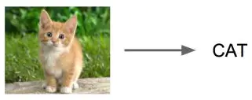

image


2、定位，找出物体在哪里


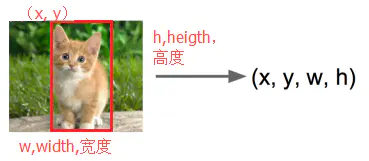

image


除了对单个物体进行检测，还要能支持对多个物体进行检测，如下图所示：


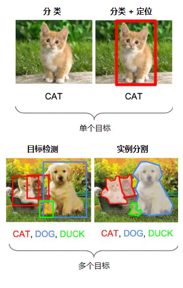

image


这个问题并不是那么容易解决，由于物体的尺寸变化范围很大、摆放角度多变、姿态不定，而且物体有很多种类别，可以在图片中出现多种物体、出现在任意位置。因此，目标检测是一个比较复杂的问题。


最直接的方法便是构建一个深度神经网络，将图像和标注位置作为样本输入，然后经过CNN网络，再通过一个分类头（Classification head）的全连接层识别是什么物体，通过一个回归头（Regression head）的全连接层回归计算位置，如下图所示：


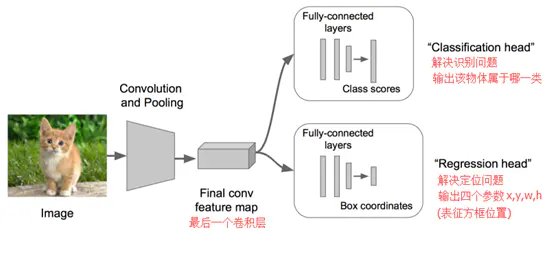

image


但“回归”不好做，计算量太大、收敛时间太长，应该想办法转为“分类”，这时容易想到套框的思路，即取不同大小的“框”，让框出现在不同的位置，计算出这个框的得分，然后取得分最高的那个框作为预测结果，如下图所示：


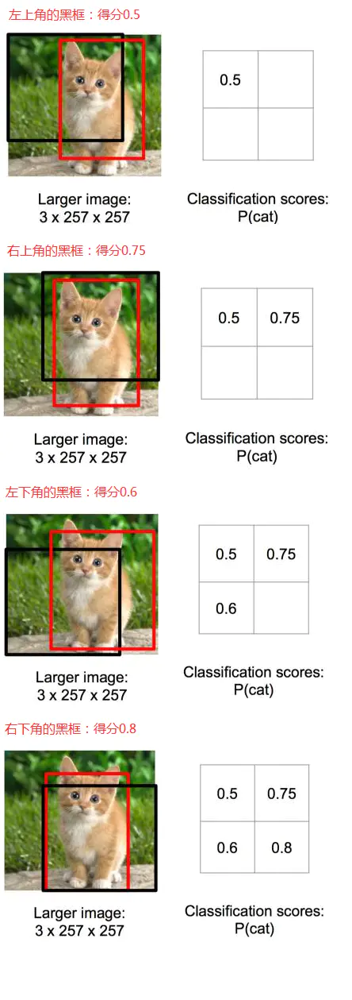

image


根据上面比较出来的得分高低，选择了右下角的黑框作为目标位置的预测。


但问题是：框要取多大才合适？太小，物体识别不完整；太大，识别结果多了很多其它信息。那怎么办？那就各种大小的框都取来计算吧。


如下图所示（要识别一只熊），用各种大小的框在图片中进行反复截取，输入到CNN中识别计算得分，最终确定出目标类别和位置。


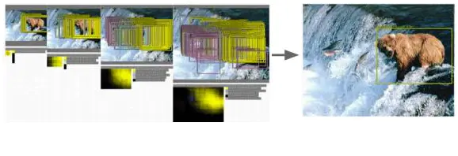

image


这种方法效率很低，实在太耗时了。那有没有高效的目标检测方法呢？


一、R-CNN 横空出世


R-CNN（Region CNN，区域卷积神经网络）可以说是利用深度学习进行目标检测的开山之作，作者Ross Girshick多次在PASCAL VOC的目标检测竞赛中折桂，2010年更是带领团队获得了终身成就奖，如今就职于Facebook的人工智能实验室（FAIR）。


R-CNN算法的流程如下


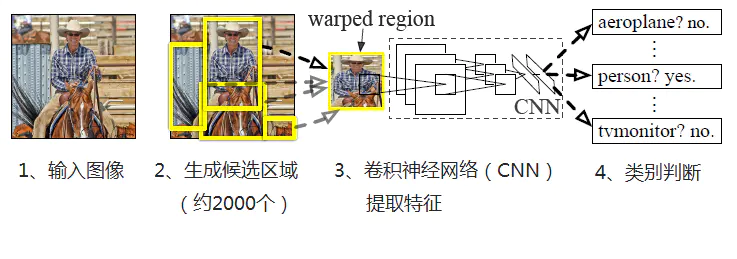

image


1、输入图像


2、每张图像生成1K~2K个候选区域


3、对每个候选区域，使用深度网络提取特征（AlextNet、VGG等CNN都可以）


4、将特征送入每一类的SVM 分类器，判别是否属于该类


5、使用回归器精细修正候选框位置


下面展开进行介绍


1、生成候选区域


使用Selective Search（选择性搜索）方法对一张图像生成约2000-3000个候选区域，基本思路如下：


（1）使用一种过分割手段，将图像分割成小区域


（2）查看现有小区域，合并可能性最高的两个区域，重复直到整张图像合并成一个区域位置。优先合并以下区域：

- 颜色（颜色直方图）相近的

- 纹理（梯度直方图）相近的

- 合并后总面积小的

- 合并后，总面积在其BBOX中所占比例大的

在合并时须保证合并操作的尺度较为均匀，避免一个大区域陆续“吃掉”其它小区域，保证合并后形状规则。

（3）输出所有曾经存在过的区域，即所谓候选区域

2、特征提取

使用深度网络提取特征之前，首先把候选区域归一化成同一尺寸227×227。

使用CNN模型进行训练，例如AlexNet，一般会略作简化，如下图：

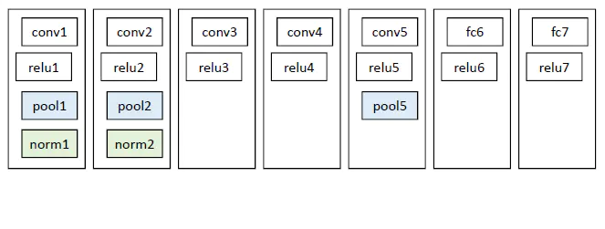

image

3、类别判断


对每一类目标，使用一个线性SVM二类分类器进行判别。输入为深度网络（如上图的AlexNet）输出的4096维特征，输出是否属于此类。


4、位置精修


目标检测的衡量标准是重叠面积：许多看似准确的检测结果，往往因为候选框不够准确，重叠面积很小，故需要一个位置精修步骤，对于每一个类，训练一个线性回归模型去判定这个框是否框得完美，如下图：

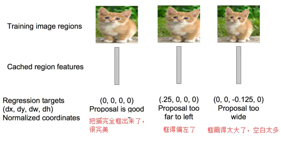

image


R-CNN将深度学习引入检测领域后，一举将PASCAL VOC上的检测率从35.1%提升到53.7%。


二、Fast R-CNN大幅提速


继2014年的R-CNN推出之后，Ross Girshick在2015年推出Fast R-CNN，构思精巧，流程更为紧凑，大幅提升了目标检测的速度。


Fast R-CNN和R-CNN相比，训练时间从84小时减少到9.5小时，测试时间从47秒减少到0.32秒，并且在PASCAL VOC 2007上测试的准确率相差无几，约在66%-67%之间。

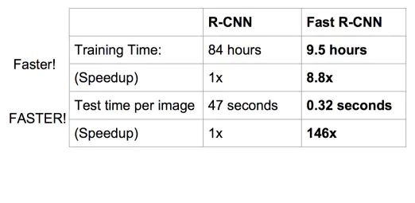

image


Fast R-CNN主要解决R-CNN的以下问题：


1、训练、测试时速度慢


R-CNN的一张图像内候选框之间存在大量重叠，提取特征操作冗余。而Fast R-CNN将整张图像归一化后直接送入深度网络，紧接着送入从这幅图像上提取出的候选区域。这些候选区域的前几层特征不需要再重复计算。


2、训练所需空间大


R-CNN中独立的分类器和回归器需要大量特征作为训练样本。Fast R-CNN把类别判断和位置精调统一用深度网络实现，不再需要额外存储。


下面进行详细介绍


1、在特征提取阶段，通过CNN（如AlexNet）中的conv、pooling、relu等操作都不需要固定大小尺寸的输入，因此，在原始图片上执行这些操作后，输入图片尺寸不同将会导致得到的feature map（特征图）尺寸也不同，这样就不能直接接到一个全连接层进行分类。


在Fast R-CNN中，作者提出了一个叫做ROI Pooling的网络层，这个网络层可以把不同大小的输入映射到一个固定尺度的特征向量。ROI Pooling层将每个候选区域均匀分成M×N块，对每块进行max pooling。将特征图上大小不一的候选区域转变为大小统一的数据，送入下一层。这样虽然输入的图片尺寸不同，得到的feature map（特征图）尺寸也不同，但是可以加入这个神奇的ROI Pooling层，对每个region都提取一个固定维度的特征表示，就可再通过正常的softmax进行类型识别。

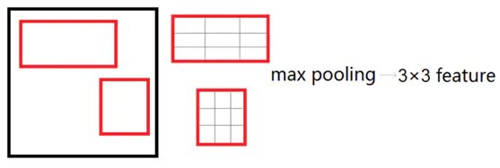

image


2、在分类回归阶段，在R-CNN中，先生成候选框，然后再通过CNN提取特征，之后再用SVM分类，最后再做回归得到具体位置（bbox regression）。而在Fast R-CNN中，作者巧妙的把最后的bbox regression也放进了神经网络内部，与区域分类合并成为了一个multi-task模型，如下图所示：

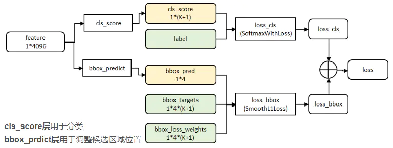

image


实验表明，这两个任务能够共享卷积特征，并且相互促进。


Fast R-CNN很重要的一个贡献是成功地让人们看到了Region Proposal+CNN（候选区域+卷积神经网络）这一框架实时检测的希望，原来多类检测真的可以在保证准确率的同时提升处理速度。


三、Faster R-CNN更快更强


继2014年推出R-CNN，2015年推出Fast R-CNN之后，目标检测界的领军人物Ross Girshick团队在2015年又推出一力作：Faster R-CNN，使简单网络目标检测速度达到17fps，在PASCAL VOC上准确率为59.9%，复杂网络达到5fps，准确率78.8%。


在Fast R-CNN还存在着瓶颈问题：Selective Search（选择性搜索）。要找出所有的候选框，这个也非常耗时。那我们有没有一个更加高效的方法来求出这些候选框呢？


在Faster R-CNN中加入一个提取边缘的神经网络，也就说找候选框的工作也交给神经网络来做了。这样，目标检测的四个基本步骤（候选区域生成，特征提取，分类，位置精修）终于被统一到一个深度网络框架之内。如下图所示：

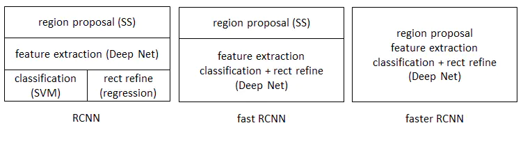

image


Faster R-CNN可以简单地看成是“区域生成网络+Fast R-CNN”的模型，用区域生成网络（Region Proposal Network，简称RPN）来代替Fast R-CNN中的Selective Search（选择性搜索）方法。


如下图


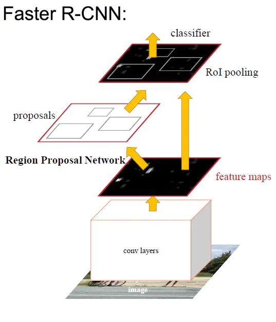

image


RPN如下图：


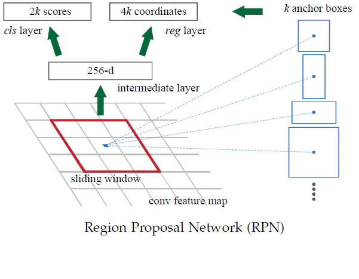

image


RPN的工作步骤如下：

- 在feature map（特征图）上滑动窗口

- 建一个神经网络用于物体分类+框位置的回归

- 滑动窗口的位置提供了物体的大体位置信息

- 框的回归提供了框更精确的位置

Faster R-CNN设计了提取候选区域的网络RPN，代替了费时的Selective Search（选择性搜索），使得检测速度大幅提升，下表对比了R-CNN、Fast R-CNN、Faster R-CNN的检测速度：


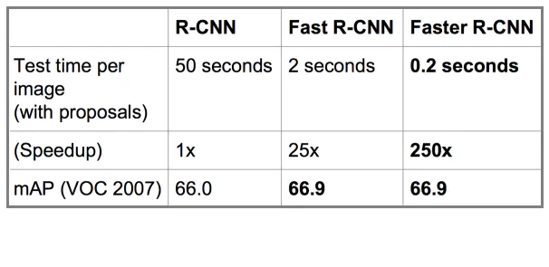

image


总结


R-CNN、Fast R-CNN、Faster R-CNN一路走来，基于深度学习目标检测的流程变得越来越精简、精度越来越高、速度也越来越快。基于region proposal（候选区域）的R-CNN系列目标检测方法是目标检测技术领域中的最主要分支之一。


为了更加精确地识别目标，实现在像素级场景中识别不同目标，利用“图像分割”技术定位每个目标的精确像素，如下图所示（精确分割出人、汽车、红绿灯等）：


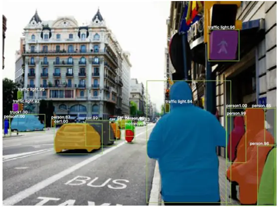

image


Mask R-CNN便是这种“图像分割”的重要模型。


Mask R-CNN的思路很简洁，既然Faster R-CNN目标检测的效果非常好，每个候选区域能输出种类标签和定位信息，那么就在Faster R-CNN的基础上再添加一个分支从而增加一个输出，即物体掩膜（object mask），也即由原来的两个任务（分类+回归）变为了三个任务（分类+回归+分割）。如下图所示，Mask R-CNN由两条分支组成：


image


Mask R-CNN的这两个分支是并行的，因此训练简单，仅比Faster R-CNN多了一点计算开销。


如下图所示，Mask R-CNN在Faster R-CNN中添加了一个全卷积网络的分支（图中白色部分），用于输出二进制mask，以说明给定像素是否是目标的一部分。所谓二进制mask，就是当像素属于目标的所有位置上时标识为1，其它位置标识为 0


image


从上图可以看出，二进制mask是基于特征图输出的，而原始图像经过一系列的卷积、池化之后，尺寸大小已发生了多次变化，如果直接使用特征图输出的二进制mask来分割图像，那肯定是不准的。这时就需要进行了修正，也即使用RoIAlign替换RoIPooling


image


如上图所示，原始图像尺寸大小是128x128，经过卷积网络之后的特征图变为尺寸大小变为 25x25。这时，如果想要圈出与原始图像中左上方15x15像素对应的区域，那么如何在特征图中选择相对应的像素呢？


从上面两张图可以看出，原始图像中的每个像素对应于特征图的25/128像素，因此，要从原始图像中选择15x15像素，则只需在特征图中选择2.93x2.93像素（15x25/128=2.93），在RoIAlign中会使用双线性插值法准确得到2.93像素的内容，这样就能很大程度上，避免了错位问题。


修改后的网络结构如下图所示（黑色部分为原来的Faster R-CNN，红色部分为Mask R-CNN修改的部分）


image


从上图可以看出损失函数变为


image


损失函数为分类误差+检测误差+分割误差，分类误差和检测（回归）误差是Faster R-CNN中的，分割误差为Mask R-CNN中新加的。


对于每个MxM大小的ROI区域，mask分支有KxMxM维的输出（K是指类别数量）。对于每一个像素，都是用sigmod函数求二值交叉熵，也即对每个像素都进行逻辑回归，得到平均的二值交叉熵误差Lmask。通过引入预测K个输出的机制，允许每个类都生成独立的mask，以避免类间竞争，这样就能解耦mask和种类预测。


对于每一个ROI区域，如果检测得到属于哪一个分类，就只使用该类的交叉熵误差进行计算，也即对于一个ROI区域中KxMxM的输出，真正有用的只是某个类别的MxM的输出。如下图所示：


image


例如目前有3个分类：猫、狗、人，检测得到当前ROI属于“人”这一类，那么所使用的Lmask为“人”这一分支的mask。


Mask R-CNN将这些二进制mask与来自Faster R-CNN的分类和边界框组合，便产生了惊人的图像精确分割，如下图所示：


image


Mask R-CNN是一个小巧、灵活的通用对象实例分割框架，它不仅可以对图像中的目标进行检测，还可以对每一个目标输出一个高质量的分割结果。另外，Mask R-CNN还易于泛化到其他任务，比如人物关键点检测，如下图所示：


image


从R-CNN、Fast R-CNN、Faster R-CNN到Mask R-CNN，每次进步不一定是跨越式的发展，这些进步实际上是直观的且渐进的改进之路，但是它们的总和却带来了非常显著的效果。


最后，总结一下目标检测算法模型的发展历程，如下图所示：


image


## Yolov5核心基础知识.md

# 在线网络可视化工具 Netron

**可以清晰的看到每一层的输入输出，网络总体的架构，而且支持各种不同网络框架。**

**（1）支持的框架及对应的文件**


**（2）实验式支持，可能不太稳定**


# 1 Yolov5 四种网络模型

Yolov5官方代码中，给出的目标检测网络中一共有4个版本，分别是**Yolov5s、Yolov5m、Yolov5l、Yolov5x**四个模型。  

学习一个新的算法，最好在脑海中对**算法网络的整体架构**有一个清晰的理解。

先使用Yolov5代码中**models/export.py**脚本将**pt文件**转换为**onnx格式**，再用**netron工具**打开，这样就可以看全网络的整体架构了。

## 1.1 Yolov5网络结构图


## 一维卷积神经网络Conv1D.md

# 一维卷积神经网络Conv1D

## 一维卷积的定义
一维卷积的输入是一个向量和一个**卷积核**，输出也是一个向量。

注意相乘的顺序是**相反**的，这是卷积的定义决定的。

输出长度是7，卷积核长度是3，输出的长度是7-3+1 = 5。

也就是说这里的卷积操作若输入长度是m，卷积核长度是n，则输出长度是m-n+1。

这样的卷积就叫窄卷积。

等宽卷积就是在输入两边各填充(n-1)/2，最终输出长度是m+(n-1)/2*2-n+1 = m。

填充元素可以是0，也可以和边缘一样，也可以是镜像。


## Keras中的Conv1D
```Python
keras.layers.Conv1D(filters, kernel_size, strides=1, padding='valid', data_format='channels_last', dilation_rate=1, activation=None, use_bias=True, kernel_initializer='glorot_uniform', bias_initializer='zeros', kernel_regularizer=None, bias_regularizer=None, activity_regularizer=None, kernel_constraint=None, bias_constraint=None)

```
**1D 卷积层** (例如时序卷积)。
该层创建了一个卷积核，该卷积核以 单个空间（或时间）维上的层输入进行卷积， 以生成输出张量。 如果 use_bias 为 True， 则会创建一个偏置向量并将其添加到输出中。 最后，如果 activation 不是 None，它也会应用于输出。

当使用该层作为模型第一层时，需要提供 input_shape 参数（整数元组或 None），例如， (10, 128) 表示 10 个 128 维的向量组成的向量序列， (None, 128) 表示 128 维的向量组成的变长序列。

### 参数
- filters: 整数，输出空间的维度 （即卷积中滤波器的输出数量）。
- kernel_size: 一个整数，或者单个整数表示的元组或列表， 指明 1D 卷积窗口的长度。
- strides: 一个整数，或者单个整数表示的元组或列表， 指明卷积的步长。 指定任何 stride 值 != 1 与指定 dilation_rate 值 != 1 两者不兼容。
- padding: “valid”, “causal” 或 “same” 之一 (大小写敏感) “valid” 表示「不填充」。 “same” 表示填充输入以使输出具有与原始输入相同的长度。 “causal” 表示因果（膨胀）卷积， 例如，output[t] 不依赖于 input[t+1:]， 在模型不应违反时间顺序的时间数据建模时非常有用。
- data_format: 字符串, “channels_last” (默认) 或 “channels_first” 之一。输入的各个维度顺序。 “channels_last” 对应输入尺寸为 (batch, steps, channels) (Keras 中时序数据的默认格式) 而 “channels_first” 对应输入尺寸为 (batch, channels, steps)。
dilation_rate: 一个整数，或者单个整数表示的元组或列表，指定用于膨胀卷积的膨胀率。 当前，指定任何 dilation_rate 值 != 1 与指定 stride 值 != 1 两者不兼容。
- activation: 要使用的激活函数。 如未指定，则不使用激活函数 (即线性激活： a(x) = x)。
- use_bias: 布尔值，该层是否使用偏置向量。
- kernel_initializer: kernel 权值矩阵的初始化器 。
- bias_initializer: 偏置向量的初始化器 。
- kernel_regularizer: 运用到 kernel 权值矩阵的正则化函数。
- bias_regularizer: 运用到偏置向量的正则化函数。
- activity_regularizer: 运用到层输出（它的激活值）的正则化函数 。
- kernel_constraint: 运用到 kernel 权值矩阵的约束函数。
- bias_constraint: 运用到偏置向量的约束函数。

### 输入尺寸
3D 张量 ，尺寸为 (batch_size, steps, input_dim)

### 输出尺寸
3D 张量，尺寸为 (batch_size, new_steps, filters)。 由于填充或窗口按步长滑动，steps 值可能已更改

### 输入输出尺寸的理解
一般在2D卷积中，输入尺寸很直观，为 (samples, rows, cols, channels)，即为样本数，行数、列数和通道数四维信息，但是若以此推断，在Conv1D总两维信息就足够，中间却夹杂了一个steps,那这个steps如何去理解呢？
理解steps参数，我们应该跳出图像的思维，1D卷积通常施用在时序数据中，在时序数据的输入中:
- batch_size: 输入的样本数
- steps: 时间维度，个人认为可以理解成量化后的时间长度，也就是多少个时刻
- input_dim: 每个时刻的特征数量


## 批标准化 (Batch Normalization).md

# 批标准化 (Batch Normalization)

## 为什么要批标准化
**Batch Normalization, 批标准化**, 和普通的数据标准化类似, 是将分散的数据统一的一种做法, 也是优化神经网络的一种方法. 在之前 Normalization 的简介视频中我们一提到, 具有统一规格的数据, 能让机器学习更容易学习到数据之中的规律.


如图假设wx1是0.1 wx2是2，如果在tanh激活函数下wx2直接就是接近1的状态了，激活函数已经处在了饱和状态，也就是说x无论在怎么扩大，tanh的输出值也都是1，神经网络在初始阶段就已经对比较大的x不敏感了。在输入层发生这样的情况时，我们可以对之前的数据做**normalization 预处理**，而在隐藏层也会发生这样的事情，在隐藏层就需要**batch normalization**来处理了。

Batch normalization 的 batch 是批数据, 把数据分成小批小批进行 随机梯度下降. 而且在每批数据进行前向传递的时候, 对每一层都进行 normalization 的处理。

Batch normalization 也可以被看做一个层面. 在一层层的添加神经网络的时候, 我们先有数据 X, 再添加全连接层, 全连接层的计算结果会经过 激励函数 成为下一层的输入, 接着重复之前的操作. **Batch Normalization (BN) 就被添加在每一个全连接和激励函数之间**.


之前说过, 计算结果在进入激励函数前的值很重要, 如果我们不单单看一个值, 我们可以说, 计算结果值的分布对于激励函数很重要. 对于数据值大多分布在这个区间的数据, 才能进行更有效的传递. 对比这两个在激活之前的值的分布. 上者没有进行 normalization, 下者进行了 normalization, 这样当然是下者能够更有效地利用 tanh 进行非线性化的过程.

没有 normalize 的数据 使用 tanh 激活以后, 激活值大部分都分布到了饱和阶段, 也就是大部分的激活值不是-1, 就是1, 而 normalize 以后, 大部分的激活值在每个分布区间都还有存在. 再将这个激活后的分布传递到下一层神经网络进行后续计算, 每个区间都有分布的这一种对于神经网络就会更加有价值.


Batch normalization 不仅仅 normalize 了一下数据, 他还进行了反 normalize 的手续。这三步就是我们在刚刚一直说的 normalization 工序, 但是公式的后面还有一个反向操作, 将 normalize 后的数据再扩展和平移. 原来这是为了让神经网络自己去学着使用和修改这个扩展参数 gamma, 和 平移参数 β, 这样神经网络就能自己慢慢琢磨出前面的 normalization 操作到底有没有起到优化的作用, 如果没有起到作用, 我就使用 gamma 和 belt 来抵消一些 normalization 的操作.


## keras里的batch_normalization


## 深度学习报错解决方案.md

# 深度学习报错解决方案

## 当前显卡显存不足

查到哪一张显卡没有被使用，然后在代码中进行选择

```
nvidia-smi

os.environ["CUDA_VISIBLE_DEVICES"] = "3"

+-----------------------------------------------------------------------------+
| NVIDIA-SMI 460.80       Driver Version: 460.80       CUDA Version: 11.2     |
|-------------------------------+----------------------+----------------------+
| GPU  Name        Persistence-M| Bus-Id        Disp.A | Volatile Uncorr. ECC |
| Fan  Temp  Perf  Pwr:Usage/Cap|         Memory-Usage | GPU-Util  Compute M. |
|                               |                      |               MIG M. |
|===============================+======================+======================|
|   0  GeForce RTX 208...  Off  | 00000000:05:00.0 Off |                  N/A |
| 30%   22C    P8    20W / 250W |  10780MiB / 11019MiB |      0%      Default |
|                               |                      |                  N/A |
+-------------------------------+----------------------+----------------------+
|   1  GeForce RTX 208...  Off  | 00000000:08:00.0 Off |                  N/A |
| 30%   24C    P8    11W / 250W |    304MiB / 11019MiB |      0%      Default |
|                               |                      |                  N/A |
+-------------------------------+----------------------+----------------------+
|   2  GeForce RTX 208...  Off  | 00000000:09:00.0 Off |                  N/A |
| 30%   24C    P8    12W / 250W |    304MiB / 11019MiB |      0%      Default |
|                               |                      |                  N/A |
+-------------------------------+----------------------+----------------------+
|   3  GeForce RTX 208...  Off  | 00000000:84:00.0 Off |                  N/A |
| 30%   24C    P8     7W / 250W |    304MiB / 11019MiB |      0%      Default |
|                               |                      |                  N/A |
+-------------------------------+----------------------+----------------------+
|   4  GeForce RTX 208...  Off  | 00000000:88:00.0 Off |                  N/A |
| 30%   23C    P8    17W / 250W |    304MiB / 11019MiB |      0%      Default |
|                               |                      |                  N/A |
+-------------------------------+----------------------+----------------------+
|   5  GeForce RTX 208...  Off  | 00000000:89:00.0 Off |                  N/A |
| 30%   25C    P8    12W / 250W |    304MiB / 11019MiB |      0%      Default |
|                               |                      |                  N/A |
+-------------------------------+----------------------+----------------------+

+-----------------------------------------------------------------------------+
| Processes:                                                                  |
|  GPU   GI   CI        PID   Type   Process name                  GPU Memory |
|        ID   ID                                                   Usage      |
|=============================================================================|
+-----------------------------------------------------------------------------+

```

## 查看当前tensorflow是cpu还是gpu

```
from tensorflow.python.client import device_lib
print(device_lib.list_local_devices())
```

## tensorflow和Python对应版本

https://www.tensorflow.org/install/source#common_installation_problems
https://www.tensorflow.org/install/source_windows

## 豆瓣源

- 配置文件

编辑配置文件 ~/.pip/pip.conf，添加内容如下：

```
[global]
index-url = https://pypi.doubanio.com/simple
trusted-host = pypi.doubanio.com
```

- 命令行选项

使用 pip 命令安装扩展包时指定源：

```
$ pip install SQLAlchemy -i https://pypi.doubanio.com/simple
```

## Could not load dynamic library 'libcusolver.so.11'; dlerror: libcusolver.so.11: cannot open shared object file: No such file or directory


## 论文阅读笔记-吴恩达ecg论文.md

# 论文阅读笔记-吴恩达ecg论文

## 文章简介

本文开发了一个深度神经网络（DNN），使用来自使用单导联动态心电监护设备的53,549名患者的91,232个单导联心电图对12个节律类别进行分类。DNN在（ROC）下达到0.97的平均面积。 DNN的平均F1评分为0.837，超过了普通心脏病学家（0.780）。DNN的敏感性超过了心脏病学家对所有节律类别的敏感度。

30s记录，以原始心电图数据(采样频率为200hz，或每秒200个样本)作为输入，每256个样本(或每1.28 s)输出一个预测

由于DNN在每个输出区间输出一个类预测，因此它对每30秒记录进行一系列23个节奏预测。心脏病学家在记录中标注了每个节律类的开始和结束点。通过舍入注释到最近的区间边界，我们使用这个方法在每个输出区间构建一个心脏病专家标签。因此，可以在每个输出区间的水平上评估模型的准确性，我们称之为“序列水平”，或者在记录水平上评估模型的准确性，我们称之为“集水平”。为了在序列水平上比较模型预测，将每个输出区间的模型预测与同一输出区间的相应委员会共识标签进行比较。在设定的水平上，将DNN预测的给定心电记录上的一组独特的节律类与委员会共识注释的记录上的一组独特的节律类进行比较。与序列级别不同的是，设定级别的评估不会因记录内的节奏分类的时间偏差而受到惩罚。


为了在Physionet Challenge数据(包含可变长度记录)上训练和评估我们的模型，我们对DNN做了微小的修改。在不做任何修改的情况下，DNN可以接受长度为256个样本倍数的任何记录作为输入。为了处理不是256的倍数的例子，记录被截断为最近的倍数。我们使用给定的记录标签作为大约每1.3 s输出预测的标签。为了产生可变长度记录的单一预测，我们使用了序列级预测的多数投票。

该架构将原始ECG数据（以200 Hz采样，或每秒200个样本）作为输入，并且每256个样本（或每1.28 s）输出一个预测值，称之为输出间隔。该网络仅将原始ECG样本作为输入，而不考虑其他与患者或ECG相关的特征。网络架构有34层，为了使网络的优化易于处理，使用了类似残差网络架构的方式，该网络由16个残差块组成，每个残差块跨越两个卷积层。卷积层具有16的fileter size和32 * 2k个滤波器，其中k是超参数，其从0开始并且每四个残差块递增1。每个备用残差块对其输入进行子采样2次。在每个卷积层之前，应用批量归一化和Relui激活，采用预激活块设计。由于这种预激活块结构，网络的第一层和最后一层是特殊的。另外还在卷积层之间和非线性之后应用Dropout，概率为0.2。最终完全连接的softmax层输出12类心率时长的概率。网络是从头训练的，随机初始化权重。使用Adam optimizer，默认参数为β1= 0.9，β2= 0.999，minibatch大小为128。学习率初始化为1×10-3，并且当连续两个epoch的训练损失没有改观时其降低10倍。通过grid search和手动调整的组合来选择网络架构和优化算法的超参数。对于该体系结构，主要搜索的超参数与为卷积层的数量，卷积滤波器的大小和数量，以及残差连接的使用。实验中发现，一旦模型的深度超过八层，残差连接就很有用。论文还尝试了RNN，包括LSTM和BiRNN，但发现准确性没有提高，运行时间却大幅增加;因此，因此文章抛弃了这类模型。

## 测试数据集

**用53549例患者的91232单导联心电图**
Cardiologist-labeled test dataset
This dataset contains 328, 30sec strips of ECG captured at 200 Hz. Each ECG file is saved in int16 binary format. Filenames ending in _grp[0-2] are reference labels, which are annotated by a group of cardiologists. In addition to reference files, each ECG strip also has 6 additional labels, with filenames ending in _rev[0-5] that correspond to 6 individual cardiologists annotating the data separately. Annotation files are saved in json format, with the list of rhythms saved under an "episodes" key.


## DNN结构

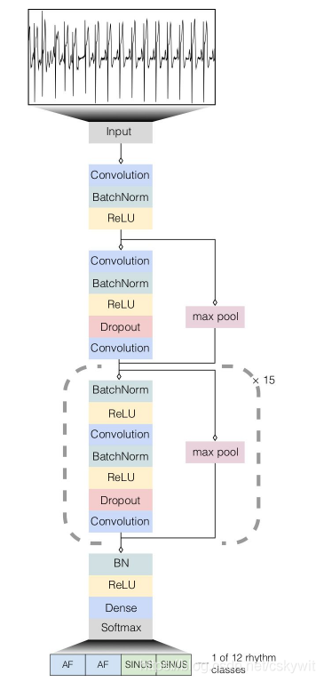

## PhysioNet Challenge数据

平均成绩为F1 0.83

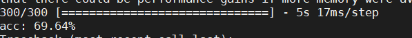

## 修改mitdb的数据

首先该数据集是双导联的数据，需要转化为单导联，其次是360个为1秒

## f1为0.77在300个数据集上


## LBP特征及其变体和python实现.pdf

PDF 文件仅通过链接引用：[LBP特征及其变体和python实现.pdf](../archive/old-ml-dl-notes/LBP特征及其变体和python实现.pdf)
