# 爬虫技术（⚠️ 已过时，仅作存档）

> ## ⛔ 重要提示：本技术应用场景已大幅收窄
>
> **最后更新于**：2026-07
> **原因**：
> - 通用爬虫（新闻/电商/比价/舆情）已被官方 API + 开放数据集 + 数据采购大规模替代
> - 《数据安全法》《个人信息保护法》实施后，反爬对抗的合规风险急剧上升
> - 主流搜索引擎/平台已与内容方达成合作，独立爬虫的"价值/风险"比越来越低
> - **但**：特定场景仍在用 — 登录态内部数据采集、学术研究、合规允许的浏览器自动化
>
> ## 🔄 推荐替代技术
>
> | 旧场景 | 推荐替代 | 迁移要点 |
> |---|---|---|
> | 新闻/资讯聚合 | 官方 API / RSS / 开放平台 | 知乎、CSDN、微博、微信公众号都有开放接口 |
> | 电商比价 | 联盟 API / 第三方数据 | 京东、淘宝、拼多多都有联盟开放接口 |
> | 舆情监控 | 商业数据服务 | 百度舆情、清博、新浪舆情通 |
> | 学术数据集 | 公开数据集 | Kaggle、天池、和鲸、paperswithcode |
> | 简单数据抓取 | Playwright + 公开页面 | 限速 + 遵守 robots.txt |
> | 登录态数据 | OAuth 2.0 / 开放平台 | 走官方授权 |
> | 反爬对抗 | **不建议** | 法律风险大 |
>
> ## 📖 最新技术速览（2026 版）
>
> 2026 年，"爬虫"已从"通用技能"变成"特定场景技能"：
>
> **主流方案优先级**：
> 1. **官方 API**（90% 场景有）→ 最稳
> 2. **开放数据集**（学术/研究）→ 最便宜
> 3. **Playwright 浏览器自动化**（反爬不严的页面）→ 慢但能用
> 4. **数据采购**（商业场景）→ 成本换合规
> 5. **Scrapy 通用爬虫** → 谨慎使用
>
> **如果一定要用爬虫**：
> - 用 Playwright 替代 requests/selenium（更快、更稳）
> - 用 Asyncio + 异步 HTTP 客户端（httpx、aiohttp）
> - 用代理池 + 限速，避免被封
> - 必须遵守 robots.txt
> - 不要爬个人隐私数据（《个保法》高压线）

---

# 以下为原内容存档

> 原文为 2026 年前的学习速记，文字少、图片多（来自有道云笔记）。保留图片便于回查。

## 一、爬虫能做什么

> 📷 原文配图（爬虫能做什么）：
> 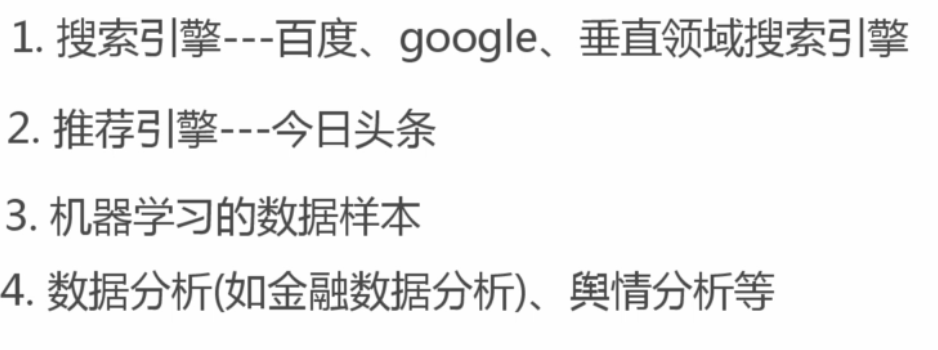

## 二、正则表达式速查

> 💡 补充：原文是速记列表，下面整理成可读表格。

| 符号 | 含义 | 示例 |
|---|---|---|
| `^` | 行开头 | `^abc` 匹配以 abc 开头 |
| `$` | 行结尾 | `xyz$` 匹配以 xyz 结尾 |
| `.` | 任意单字符（除换行） | `a.c` 匹配 abc、a1c |
| `*` | 前一项 0 个或多个 | `ab*` 匹配 a、ab、abb |
| `+` | 前一项 1 个或多个 | `ab+` 匹配 ab、abb |
| `?` | 前一项 0 个或 1 个 | `ab?` 匹配 a、ab |
| `?` | 非贪婪（修饰 `*` `+`） | `a.*?b` 最短匹配 |
| `{2}` | 恰好 2 次 | `\d{2}` 匹配两位数字 |
| `{2,5}` | 2-5 次 | `\d{2,5}` 匹配 2-5 位数字 |
| `\|` | 或 | `a\|b` 匹配 a 或 b |
| `()` | 捕获组 | `(ab)+` 匹配 ab、abab |
| `[]` | 字符类 | `[0-9]` 匹配任意数字 |
| `[^1]` | 否定字符类 | 匹配除 1 之外的任意字符 |
| `\s` / `\S` | 空白 / 非空白 | 空格、tab、换行 |
| `\w` / `\W` | 单词字符 / 非单词字符 | a-z A-Z 0-9 _ |
| `\d` | 数字 | 等价 `[0-9]` |
| `[\u4E00-\u9FA5]` | 汉字 | 匹配中文字符 |

> 📷 原文配图（爬取策略、去重、字符串编码）：
> 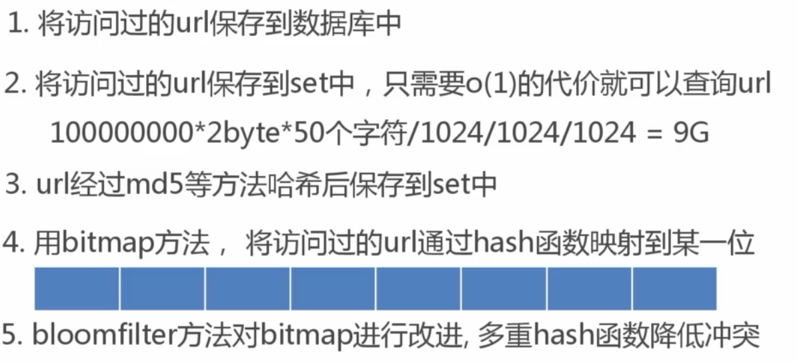
> 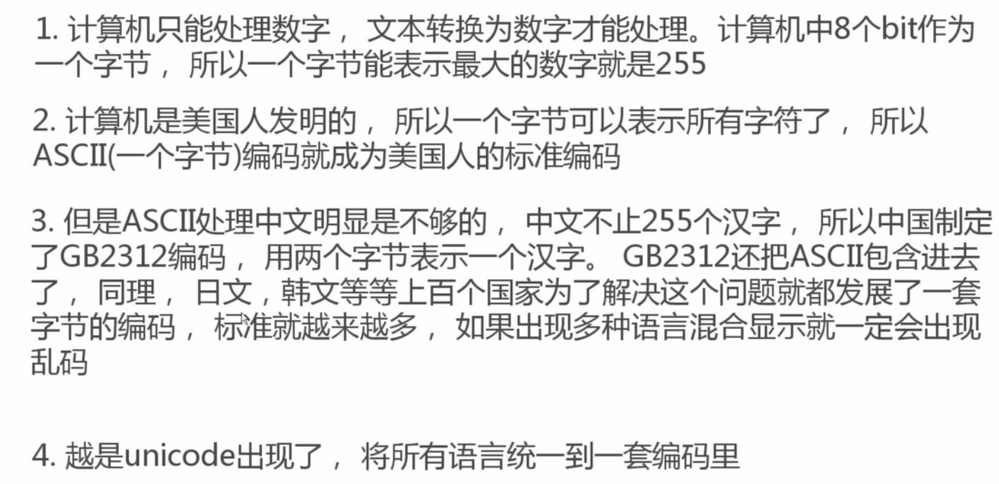
> 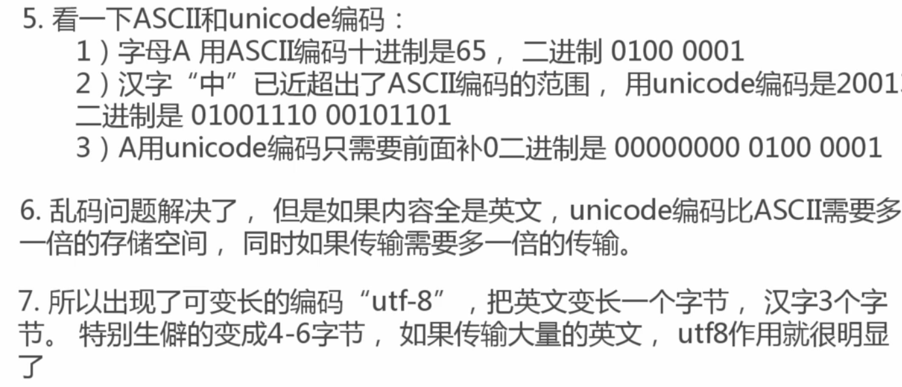
> 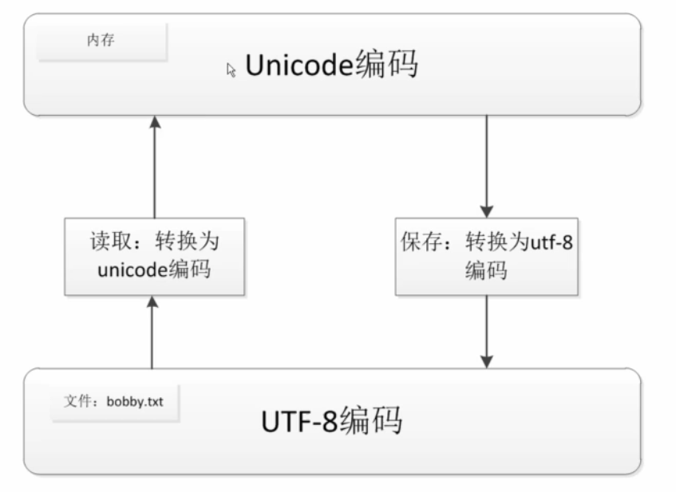

> 💡 补充：爬取策略常用的两种：
> - **深度优先（DFS）**：先抓一个链接到底，再回溯。适合层级深的站点。
> - **广度优先（BFS）**：先抓完首页所有链接，再下一层。适合覆盖面广的场景。
>
> 去重策略常用方法：URL 哈希、Redis set、布隆过滤器（数据量大时）。

## 三、Scrapy 框架入门

### 3.1 创建项目

```bash
# 创建抓取项目
scrapy startproject tutorial

# 创建抓取网站模板
scrapy genspider jobbole news.cnblogs.com
```

### 3.2 目录结构

```
tutorial/
├── scrapy.cfg            # 部署配置文件
└── tutorial/             # 项目 Python 模块
    ├── __init__.py
    ├── items.py          # 数据结构定义
    ├── middlewares.py    # 中间件
    ├── pipelines.py      # 数据处理管道
    ├── settings.py       # 项目配置
    └── spiders/          # 爬虫脚本目录
        └── __init__.py
```

### 3.3 基础模板

```python
import scrapy

class JobboleSpider(scrapy.Spider):
    name = 'jobbole'
    allowed_domains = ['news.cnblogs.com']
    start_urls = ['http://news.cnblogs.com/']

    def parse(self, response):
        pass
```

### 3.4 调试方法

在根目录创建 `main.py`：

```python
from scrapy.cmdline import execute
import sys, os

# 把当前目录加入模块搜索路径
sys.path.append(os.path.dirname(os.path.abspath(__file__)))
execute(["scrapy", "crawl", "jobbole"])
```

> 💡 补充：`sys.path.append` 是把当前目录加到 Python 模块搜索路径，这样 `tutorial/` 目录才能被 import 到。

## 四、XPath 与 CSS 选择器

> 📷 原文配图（xpath 简介、表达式、语法）：
> 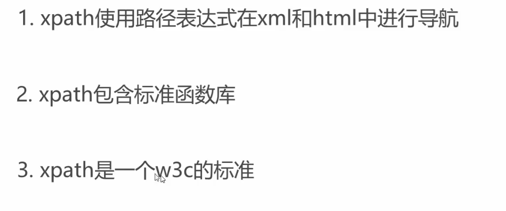
> 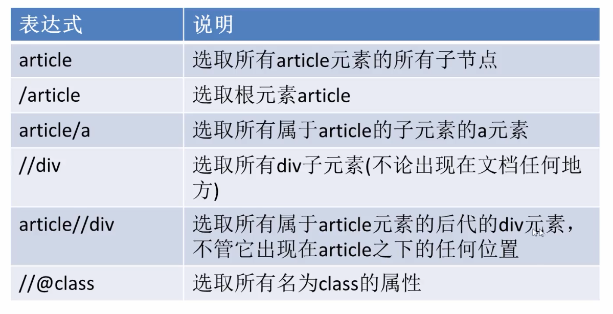
> 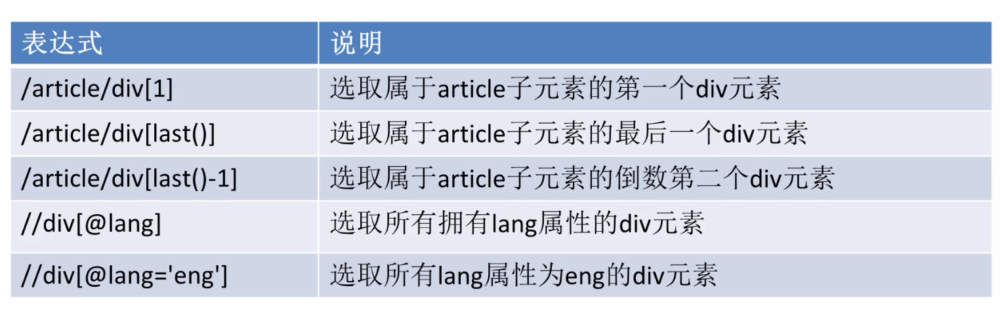
> 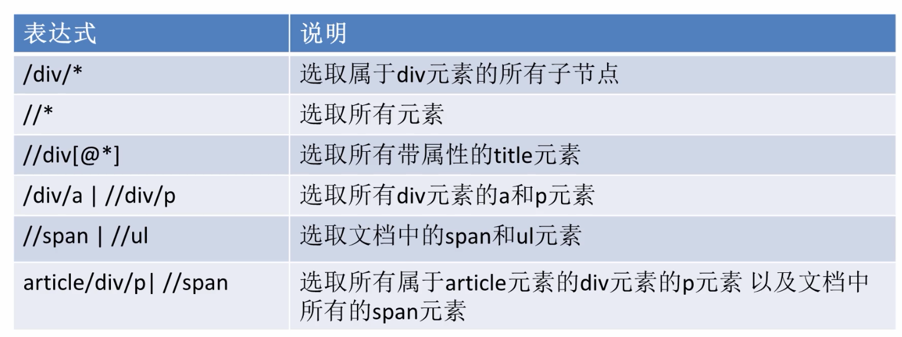

### 4.1 常用 XPath 语法

```python
# 返回 SelectorList（未提取）
url = response.xpath('//*[@id="entry_691776"]/div[2]/h2/a/@href')

# 返回字符串列表（已 extract）
url = response.xpath('//*[@id="entry_691776"]/div[2]/h2/a/@href').extract()

# 第一个元素，没有就返回 ""
url = response.xpath('//*[@id="entry_691776"]/div[2]/h2/a/@href').extract_first("")
```

> ⚠️ 改正：原文 `selectlist` 拼写错误，应为 `SelectorList`（Scrapy 的合法类名）。

### 4.2 CSS 选择器

> 📷 原文配图（css 表达式）：
> 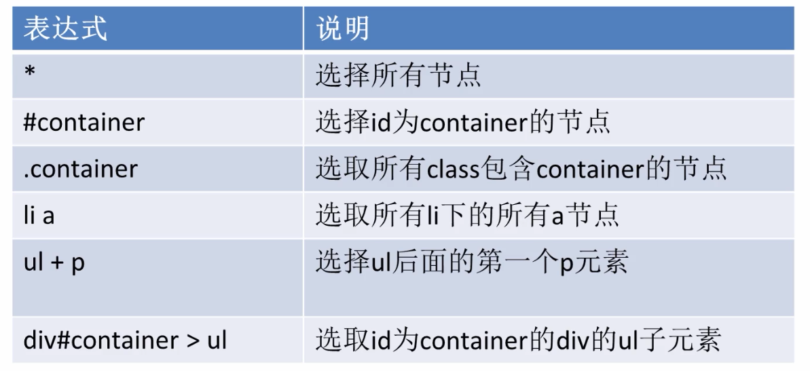
> 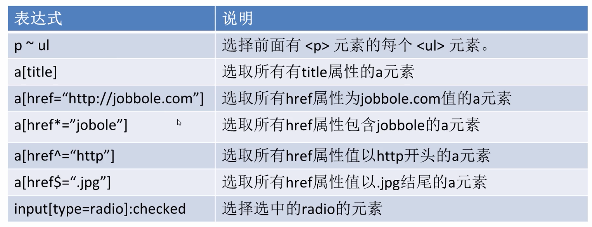
> 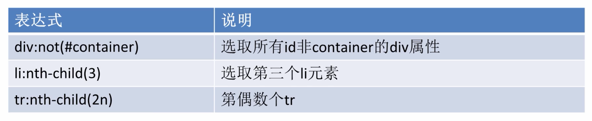

```python
# 直接用 response 的 css 方法
url = response.css('#news_list h2 a::attr(href)').extract_first("")

# 通过 Selector 解析纯文本（requests 配合时用）
from scrapy import Selector
sel = Selector(text=response.text)
url = sel.css('#news_list h2 a::attr(href)').extract_first('')
```

## 五、Requests 辅助提取

直接对 JSON 接口发请求，跳过 HTML 解析：

```python
import requests, json

response = requests.get(
    "https://news.cnblogs.com/NewsAjax/GetAjaxNewsInfo?contentId=693026"
)
data = json.loads(response.text)
total_view = data["TotalView"]
```

> ⚠️ 改正：原文变量名 `reponse` 拼写错误（出现 3 次），新文档统一改为 `response`。

## 六、Scrapy Shell 调试

不需要写完整爬虫，直接在 shell 里试选择器：

```bash
$ scrapy shell https://news.cnblogs.com/n/693026/

[s] Available Scrapy objects
[s]   scrapy     scrapy module
[s]   crawler    <scrapy.crawler.Crawler object>
[s]   item       {}
[s]   request    <GET https://news.cnblogs.com/n/693026/>
[s]   response   <200 https://news.cnblogs.com/n/693026/>
[s]   settings   <scrapy.settings.Settings object>
[s]   spider     <DefaultSpider 'default'>

>>> response.css("#news_title a::text").extract_first()
'正在通往发射台：NASA Atemis I月球火箭离目标又近了一步'
```

> 📝 存档说明：原文输出中 "Atemis" 实际是 "Artemis"（NASA 阿尔忒弥斯登月计划），属英文拼写错误。本节为原内容存档，保留原文不作修改。

## 七、合法合规（补充）

> 💡 补充：原文未提，最关键的一条提醒。

爬虫项目最容易翻车的不是技术，是合规：

- **遵守 `robots.txt`**：网站明确禁止的目录不要碰
- **不要爬个人隐私**：用户信息、聊天记录、地理位置等（《个人信息保护法》高压线）
- **不要爬受版权保护内容**：原创文章、视频、付费内容
- **限速**：单 IP QPS 不要超过 10，被封不是最坏结果，被起诉才是
- **能买就买**：商业数据多花点钱比打官司便宜

> 💡 技术坑（反爬、登录态、编码等）参考 [Playwright 官方文档](https://playwright.dev/python/)——比 Scrapy 更适合 2026 年的浏览器场景。


