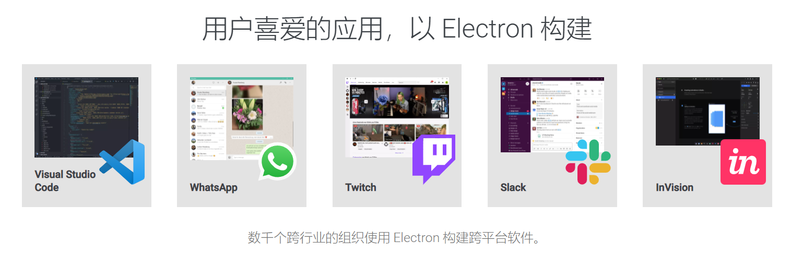
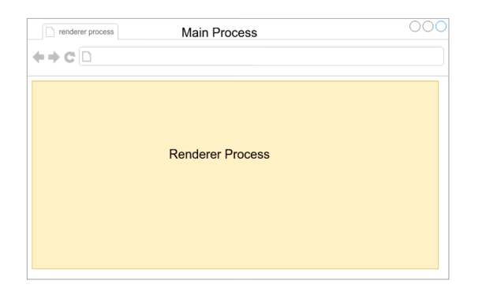
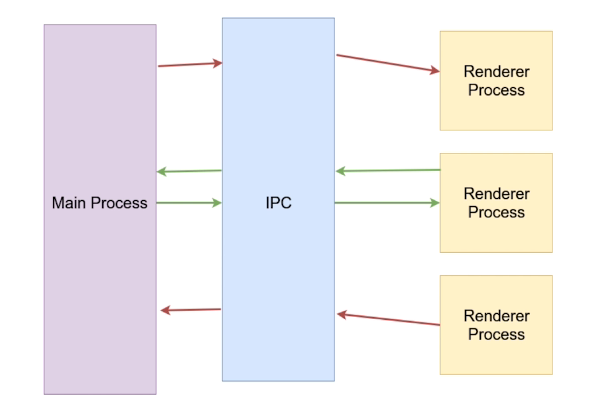
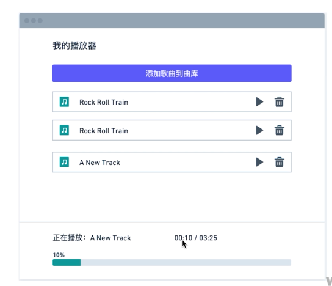
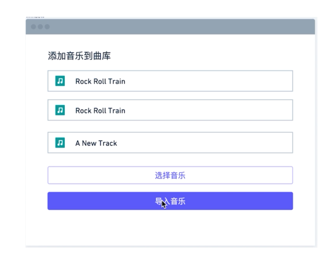
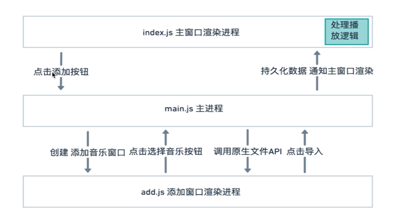
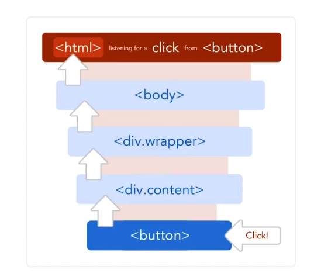

# Electron 桌面开发（⚠️ 已过时，仅作存档）

> ## ⛔ 重要提示：本技术应用场景已大幅收窄
>
> **最后更新于**：2026-07
> **原因**：
> - 2022 年起 Rust 写的 Tauri 崛起，**包体积 10MB vs Electron 100MB+**，内存占用低一个数量级
> - 多数"伪桌面需求"（设置面板、简单工具）直接 **PWA / Web 应用** 即可
> - 2026 年原生桌面跨平台主流是 **Flutter Desktop** 和 **Tauri**
> - 但 **Electron 仍没死**：VSCode、Slack、Discord、Notion、Obsidian 等大量应用仍基于 Electron
>
> ## 🔄 推荐替代技术
>
> | 旧场景 | 推荐替代 | 迁移要点 |
> |---|---|---|
> | 桌面小工具 | PWA / Tauri | 体积小、易分发 |
> | 跨平台 + 性能敏感 | Tauri (Rust + WebView) | 学习曲线略陡，但效果好 |
> | 跨平台 + 移动 | Flutter Desktop | 一套代码覆盖 Win/Mac/Linux/Android/iOS |
> | 复杂业务应用 | Electron 继续用 | 生态成熟，问题都有解 |
>
> ## 📖 最新技术速览（2026 版）
>
> 2026 年，桌面应用的技术选型已经清晰：
>
> | 场景 | 首选 | 理由 |
> |---|---|---|
> | 内部工具 | PWA | 零安装、自动更新、跨平台 |
> | 轻量桌面（< 50MB） | Tauri | Rust 性能、包小 |
> | 跨桌面 + 移动 | Flutter Desktop | 单一代码库 |
> | 大型复杂应用 | Electron | 生态成熟、人才多 |
>
> **如果继续用 Electron**：
> - **必须关 `nodeIntegration`**（默认 false），改用 `preload.js` + `contextBridge` 暴露受控 API
> - 启用 `contextIsolation: true`（默认已 true）
> - 用 `sandbox: true`（Electron 20+ 默认）
> - 打包用 `electron-builder`（首选）或 `electron-forge`

---

# 以下为原内容存档

> 原文为学习 Electron 时的实操笔记，包含完整代码示例。保留供回查。

## 一、Electron 是什么

- 用 **JavaScript + HTML + CSS** 构建跨平台桌面应用
- 基于 **Chromium + Node.js**
- 开源、活跃社区
- 兼容 **Mac / Windows / Linux**

> 📷 谁在使用 Electron：
> 

## 二、主进程 vs 渲染进程

> 💡 Electron 的核心概念：**多进程模型**。

| 维度 | 主进程（Main） | 渲染进程（Renderer） |
|---|---|---|
| 数量 | 只有一个 | 可以有多个（每个窗口一个） |
| 能力 | 系统 API（菜单、文件、托盘） | DOM + 部分 Node API |
| Node.js | 全面支持 | 旧版默认集成，新版需配置 |

> 📷 进程关系图：
> 

> 💡 补充：原文中 `nodeIntegration: true` 是 Electron 12 之前的写法。**新版本必须关**（默认 false），改用 `preload.js` + `contextBridge` 暴露受控 API，避免远程代码执行风险。

## 三、创建 BrowserWindow

### 3.1 安装热启动

```bash
npm install nodemon --save-dev
```

修改 `package.json`：

```json
{
  "scripts": {
    "start": "nodemon --watch main.js --exec 'electron .'"
  }
}
```

### 3.2 基础窗口

```javascript
// main.js
const { app, BrowserWindow } = require('electron');

app.on('ready', () => {
  const mainWindow = new BrowserWindow({
    width: 800,
    height: 600,
    webPreferences: {
      // ⚠️ 新版本必须改为 false，通过 preload + contextBridge 暴露 API
      nodeIntegration: true
    }
  });
  mainWindow.loadFile('index.html');
});
```

## 四、进程间通信（IPC）

> 📷 通信模型图：
> 

### 渲染进程 → 主进程

```javascript
// renderer.js
const { ipcRenderer } = require('electron');

window.addEventListener('DOMContentLoaded', () => {
  // 发送消息
  ipcRenderer.send('message', 'hello from renderer');

  // 接收主进程回复
  ipcRenderer.on('reply', (event, arg) => {
    document.getElementById('message').innerHTML = arg;
  });
});
```

```javascript
// main.js
const { app, BrowserWindow, ipcMain } = require('electron');

app.on('ready', () => {
  const mainWindow = new BrowserWindow({
    width: 800,
    height: 600,
    webPreferences: { nodeIntegration: true }
  });
  mainWindow.loadFile('index.html');

  // 接收渲染进程消息
  ipcMain.on('message', (event, arg) => {
    console.log(arg);
    event.sender.send('reply', 'hello from main');
  });
});
```

```html
<!-- index.html -->
<!DOCTYPE html>
<html>
  <head>
    <meta charset="UTF-8">
    <meta http-equiv="Content-Security-Policy"
          content="default-src 'self'; script-src 'self'">
    <title>Hello World!</title>
  </head>
  <body>
    <h1>Hello World!</h1>
    <p id="message"></p>
    <script src="./renderer.js"></script>
  </body>
</html>
```

## 五、实战：音乐播放器

> 📷 播放器原型：
> 
> 
> 

### 5.1 重构窗口创建

```javascript
// main.js
const { app, BrowserWindow, ipcMain } = require('electron');

class AppWindow extends BrowserWindow {
  constructor(config, fileLocation) {
    const basicConfig = {
      width: 800,
      height: 600,
      webPreferences: { nodeIntegration: true }
    };
    const finalConfig = { ...basicConfig, ...config };
    super(finalConfig);
    this.loadFile(fileLocation);
    this.once('ready-to-show', () => this.show());  // 预加载，避免白屏
  }
}

app.on('ready', () => {
  const mainWindow = new AppWindow({}, './renderer/index.html');

  ipcMain.on('add-music-window', () => {
    const addWindow = new AppWindow(
      { width: 500, height: 400, parent: mainWindow },
      './renderer/add.html'
    );
  });
});
```

### 5.2 数据持久化（electron-store）

> 💡 补充：原笔记有 3 种数据持久化方案：
> 1. 数据库（SQLite 等）— 适合结构化数据
> 2. HTML5 本地存储（localStorage）— 简单 KV
> 3. 本地文件（JSON/TXT）— 配置文件
>
> **electron-store** 是社区封装的 KV 方案，比 localStorage 更强大。

```bash
npm install electron-store
```

```javascript
const Store = require('electron-store');
const store = new Store();

store.set('unicorn', '🦄');
console.log(store.get('unicorn'));  // 🦄

// 支持嵌套（点号语法）
store.set('foo.bar', true);
console.log(store.get('foo'));  // {bar: true}

store.delete('unicorn');
```

### 5.3 事件代理（事件冒泡）

> 📷 事件冒泡示意图：
> 

**做法**：在最外层只绑定一次 click，内部子元素靠冒泡触发：

```html
<div class="col-2">
  <i class="fas fa-play mr-3" data-id="${track.id}"></i>
  <i class="fas fa-trash-alt" data-id="${track.id}"></i>
</div>
```

```javascript
$('tracksList').addEventListener('click', (event) => {
  event.preventDefault();
  const { dataset, classList } = event.target;
  const id = dataset && dataset.id;

  if (id && classList.contains('fa-play')) {
    const currentTrack = allTracks.find(t => t.id === id);
    musicAudio.src = currentTrack.path;
    musicAudio.play();
    classList.replace('fa-play', 'fa-pause');
  }
});
```

> 💡 避免给每个播放/暂停按钮单独绑定 click（DOM 多时性能差、内存浪费）。

## 六、打包与分发

### 6.1 打包方式

| 方式 | 特点 |
|---|---|
| 手动打包 | 麻烦，不推荐 |
| electron-packager | 简单、纯命令行 |
| **electron-builder**（推荐） | 配置丰富，支持自动更新 |

### 6.2 electron-builder 配置示例

```json
{
  "build": {
    "appId": "simpleMusicPlayer",
    "mac": {
      "category": "public.app-category.productivity"
    },
    "linux": { "target": ["AppImage", "deb"] },
    "win": {
      "target": "squirrel",
      "icon": "build/icon.ico"
    }
  }
}
```

### 6.3 进阶：DMG 打包（Mac）

```json
{
  "dmg": {
    "background": "build/appdmg.png",
    "icon": "build/icon.icns",
    "iconSize": 100,
    "contents": [
      { "x": 380, "y": 280, "type": "link", "path": "/Applications" },
      { "x": 110, "y": 280, "type": "file" }
    ]
  }
}
```

---

## 📚 关键 takeaway

- **多进程模型**是 Electron 核心（主进程 + 多个渲染进程）
- **IPC** 是进程间通信的唯一方式
- **安全默认值**：新版必须关 `nodeIntegration`，用 `preload` + `contextBridge`
- **打包首选**：`electron-builder`
- **替代方案**：Tauri（轻量）、PWA（多数场景够用）、Flutter Desktop（跨桌面+移动）
