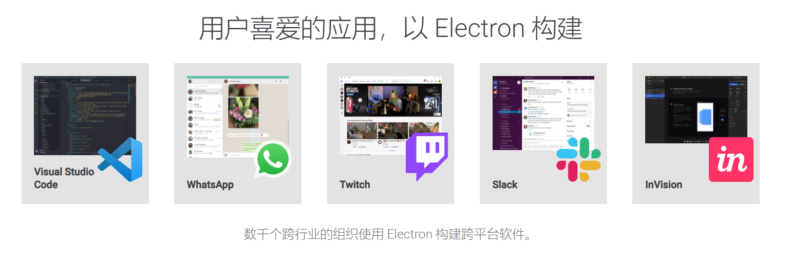
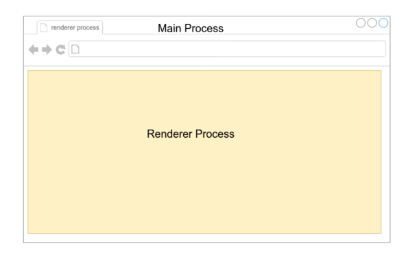
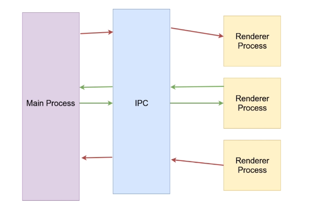
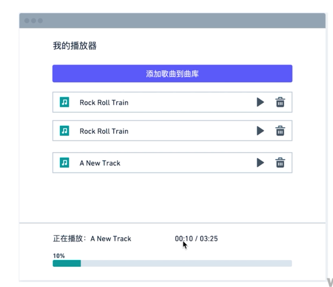
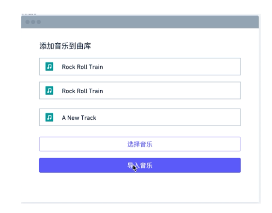
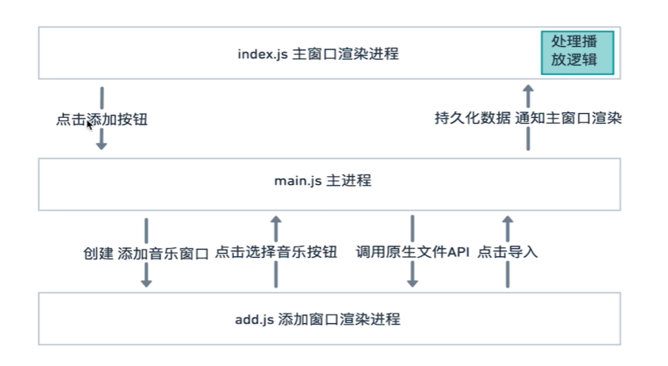
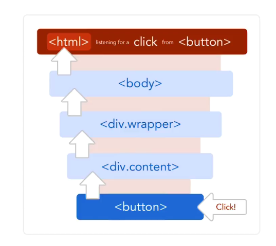
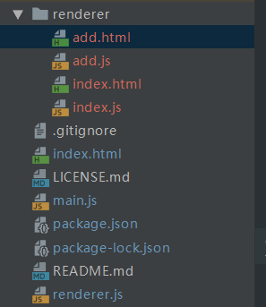

# Electron 桌面开发（⚠️ 已过时，仅作存档）

> 预计阅读：约 31 分钟（正文约 9789 字）
> 阅读建议：建议先扫目录和二级标题，优先看概念、表格和代码示例，原文归档留到最后。

> ## ⛔ 重要提示：本技术应用场景已大幅收窄
>
> **最后更新于**：2026-07
> **原因**：
> - 2022 年起 Rust 写的 Tauri 崛起，**包体积 10MB vs Electron 100MB+**，内存占用低一个数量级
> - 多数"伪桌面需求"（设置面板、简单工具）直接 **PWA / Web 应用** 即可
> - 2026 年原生桌面跨平台主流是 **Flutter Desktop** 和 **Tauri**
> - 但 **Electron 仍没死**：VSCode、Slack、Discord、Notion、Obsidian 等大量应用仍基于 Electron
>
> ## 🔄 推荐替代技术
>
> | 旧场景 | 推荐替代 | 迁移要点 |
> |---|---|---|
> | 桌面小工具 | PWA / Tauri | 体积小、易分发 |
> | 跨平台 + 性能敏感 | Tauri (Rust + WebView) | 学习曲线略陡，但效果好 |
> | 跨平台 + 移动 | Flutter Desktop | 一套代码覆盖 Win/Mac/Linux/Android/iOS |
> | 复杂业务应用 | Electron 继续用 | 生态成熟，问题都有解 |
>
> ## 📖 最新技术速览（2026 版）
>
> 2026 年，桌面应用的技术选型已经清晰：
>
> | 场景 | 首选 | 理由 |
> |---|---|---|
> | 内部工具 | PWA | 零安装、自动更新、跨平台 |
> | 轻量桌面（< 50MB） | Tauri | Rust 性能、包小 |
> | 跨桌面 + 移动 | Flutter Desktop | 单一代码库 |
> | 大型复杂应用 | Electron | 生态成熟、人才多 |
>
> **如果继续用 Electron**：
> - **必须关 `nodeIntegration`**（默认 false），改用 `preload.js` + `contextBridge` 暴露受控 API
> - 启用 `contextIsolation: true`（默认已 true）
> - 用 `sandbox: true`（Electron 20+ 默认）
> - 打包用 `electron-builder`（首选）或 `electron-forge`

---

> 原文为学习 Electron 时的实操笔记，包含完整代码示例。以下为整理后的知识点摘要（旧 API 已加 ⚠️ 过时标注），完整原文见文末「原内容存档」。

## 一、Electron 是什么

- 用 **JavaScript + HTML + CSS** 构建跨平台桌面应用
- 基于 **Chromium + Node.js**
- 开源、活跃社区
- 兼容 **Mac / Windows / Linux**

> 📷 谁在使用 Electron：
> 

## 二、主进程 vs 渲染进程

> 💡 Electron 的核心概念：**多进程模型**。

| 维度 | 主进程（Main） | 渲染进程（Renderer） |
|---|---|---|
| 数量 | 只有一个 | 可以有多个（每个窗口一个） |
| 能力 | 系统 API（菜单、文件、托盘） | DOM + 部分 Node API |
| Node.js | 全面支持 | 旧版默认集成，新版需配置 |

> 📷 进程关系图：
> 

> 💡 补充：原文中 `nodeIntegration: true` 是 Electron 12 之前的写法。**新版本必须关**（默认 false），改用 `preload.js` + `contextBridge` 暴露受控 API，避免远程代码执行风险。

## 三、创建 BrowserWindow

### 3.1 安装热启动

```bash
npm install nodemon --save-dev
```

修改 `package.json`：

```json
{
  "scripts": {
    "start": "nodemon --watch main.js --exec 'electron .'"
  }
}
```

### 3.2 基础窗口

```javascript
// main.js
const { app, BrowserWindow } = require('electron');

app.on('ready', () => {
  const mainWindow = new BrowserWindow({
    width: 800,
    height: 600,
    webPreferences: {
      // ⚠️ 新版本必须改为 false，通过 preload + contextBridge 暴露 API
      nodeIntegration: true
    }
  });
  mainWindow.loadFile('index.html');
});
```

## 四、进程间通信（IPC）

> 📷 通信模型图：
> 

### 渲染进程 → 主进程

```javascript
// renderer.js
const { ipcRenderer } = require('electron');

window.addEventListener('DOMContentLoaded', () => {
  // 发送消息
  ipcRenderer.send('message', 'hello from renderer');

  // 接收主进程回复
  ipcRenderer.on('reply', (event, arg) => {
    document.getElementById('message').innerHTML = arg;
  });
});
```

```javascript
// main.js
const { app, BrowserWindow, ipcMain } = require('electron');

app.on('ready', () => {
  const mainWindow = new BrowserWindow({
    width: 800,
    height: 600,
    webPreferences: { nodeIntegration: true }
  });
  mainWindow.loadFile('index.html');

  // 接收渲染进程消息
  ipcMain.on('message', (event, arg) => {
    console.log(arg);
    event.sender.send('reply', 'hello from main');
  });
});
```

```html
<!-- index.html -->
<!DOCTYPE html>
<html>
  <head>
    <meta charset="UTF-8">
    <meta http-equiv="Content-Security-Policy"
          content="default-src 'self'; script-src 'self'">
    <title>Hello World!</title>
  </head>
  <body>
    <h1>Hello World!</h1>
    <p id="message"></p>
    <script src="./renderer.js"></script>
  </body>
</html>
```

## 五、实战：音乐播放器

> 📷 播放器原型：
> 
> 
> 

### 5.1 重构窗口创建

```javascript
// main.js
const { app, BrowserWindow, ipcMain } = require('electron');

class AppWindow extends BrowserWindow {
  constructor(config, fileLocation) {
    const basicConfig = {
      width: 800,
      height: 600,
      webPreferences: { nodeIntegration: true }
    };
    const finalConfig = { ...basicConfig, ...config };
    super(finalConfig);
    this.loadFile(fileLocation);
    this.once('ready-to-show', () => this.show());  // 预加载，避免白屏
  }
}

app.on('ready', () => {
  const mainWindow = new AppWindow({}, './renderer/index.html');

  ipcMain.on('add-music-window', () => {
    const addWindow = new AppWindow(
      { width: 500, height: 400, parent: mainWindow },
      './renderer/add.html'
    );
  });
});
```

渲染进程侧（`renderer/index.html` + `renderer/index.js`）通过 IPC 触发新窗口，界面样式用 Bootstrap（`cnpm install bootstrap`）：

```html
<!-- renderer/index.html -->
<!DOCTYPE html>
<html>
<head>
    <meta charset="UTF-8">
    <meta http-equiv="Content-Security-Policy" content="default-src 'self'; script-src 'self'">
    <title>本地播放器</title>
    <link rel="stylesheet" href="../node_modules/bootstrap/dist/css/bootstrap.min.css">
</head>
<body>
    <div class="container mt-4">
        <h1>我的播放器</h1>
        <button type="button" id="add-music-button" class="btn btn-primary btn-lg btn-block mt-4">
            添加歌曲到曲库
        </button>
    </div>
    <script src="./index.js"></script>
</body>
</html>
```

```javascript
// renderer/index.js
const { ipcRenderer } = require('electron')

document.getElementById('add-music-button').addEventListener('click', ()=>{
    ipcRenderer.send('add-music-window')
})
```

> ⚠️ 已过时：渲染进程直接 `require('electron')` 依赖 `nodeIntegration: true`；新版应把 IPC 调用移入 `preload.js`，用 `contextBridge` 暴露受控方法。

### 5.2 数据持久化（electron-store）

> 💡 补充：原笔记有 3 种数据持久化方案：
> 1. 数据库（SQLite 等）— 适合结构化数据
> 2. HTML5 本地存储（localStorage）— 简单 KV
> 3. 本地文件（JSON/TXT）— 配置文件
>
> **electron-store** 是社区封装的 KV 方案，比 localStorage 更强大。

```bash
npm install electron-store
```

```javascript
const Store = require('electron-store');
const store = new Store();

store.set('unicorn', '🦄');
console.log(store.get('unicorn'));  // 🦄

// 支持嵌套（点号语法）
store.set('foo.bar', true);
console.log(store.get('foo'));  // {bar: true}

store.delete('unicorn');
```

### 5.3 事件代理（事件冒泡）

> 📷 事件冒泡示意图：
> 

**做法**：在最外层只绑定一次 click，内部子元素靠冒泡触发：

```html
<div class="col-2">
  <i class="fas fa-play mr-3" data-id="${track.id}"></i>
  <i class="fas fa-trash-alt" data-id="${track.id}"></i>
</div>
```

```javascript
$('tracksList').addEventListener('click', (event) => {
  event.preventDefault();
  const { dataset, classList } = event.target;
  const id = dataset && dataset.id;

  if (id && classList.contains('fa-play')) {
    const currentTrack = allTracks.find(t => t.id === id);
    musicAudio.src = currentTrack.path;
    musicAudio.play();
    classList.replace('fa-play', 'fa-pause');
  }
});
```

> 💡 避免给每个播放/暂停按钮单独绑定 click（DOM 多时性能差、内存浪费）。

## 六、打包与分发

### 6.1 打包方式

| 方式 | 特点 |
|---|---|
| 手动打包 | 麻烦，不推荐 |
| electron-packager | 简单、纯命令行 |
| **electron-builder**（推荐） | 配置丰富，支持自动更新 |

### 6.2 electron-builder 配置示例

```json
{
  "build": {
    "appId": "simpleMusicPlayer",
    "mac": {
      "category": "public.app-category.productivity"
    },
    "linux": { "target": ["AppImage", "deb"] },
    "win": {
      "target": "squirrel",
      "icon": "build/icon.ico"
    }
  }
}
```

### 6.3 进阶：DMG 打包（Mac）

```json
{
  "dmg": {
    "background": "build/appdmg.png",
    "icon": "build/icon.icns",
    "iconSize": 100,
    "contents": [
      { "x": 380, "y": 280, "type": "link", "path": "/Applications" },
      { "x": 110, "y": 280, "type": "file" }
    ]
  }
}
```

---

## 📚 关键 takeaway

- **多进程模型**是 Electron 核心（主进程 + 多个渲染进程）
- **IPC** 是进程间通信的唯一方式
- **安全默认值**：新版必须关 `nodeIntegration`，用 `preload` + `contextBridge`
- **打包首选**：`electron-builder`
- **替代方案**：Tauri（轻量）、PWA（多数场景够用）、Flutter Desktop（跨桌面+移动）


---

# 以下为原内容存档

> 以下内容为原始归档文件 `electron开发初步——开发一个音乐播放软件.md` 的完整保留，文字原貌不变（含原文笔误）。
>
> 📷 图片说明：原文 8 张图片实际存放于共享图片目录 `../youdaonote-images/`（`old-electron-notes/` 归档目录内并无图片副本），相对路径经逐一核对均存在、可正常显示。

## electron开发初步——开发一个音乐播放软件.md

# 进入Electron的世界

## 进入Electron的世界
- 使用 JavaScript，HTML 和 CSS 构建跨平台的桌面应用程序
- Web技术- Electron基于 Chromium和 Node 
- 开源-众多贡献者组成的活跃社区共同维护的开源项目。
- 跨平台·兼容Mac, Windows和 Linux
## 谁在使用Electron


## 第一个Electron应用
### 主进程和渲染进程
#### 什么Proces-进程
- 用Chromium来举例
    - 整个浏览器是主Main Process
    - 每一个type是 render Process


#### 主进程-Main Process
- 可以使用和系统对接的 Electron api-创建菜单,上传文件等等
- 创建渲染进程- Renderer Process
- 全面支持 Node js
- 只有一个,作为整个程序的入口点

#### 渲染进程-Render Process
- 可以有多个，每个对应一个窗口
- 每个都是一个单独的进程
- 全面支持Node.js 和 DOM API
- 可以使用一部分 Electron提供的AP

### 创建BrowserWindow
#### 安装热启动npm包
```
npm install nodemon --save-dev
```
**在package.json中修改**
```
  "scripts": {
    "start": "nodemon --watch main.js --exec 'electron .'"
  },
```
#### 创建一个简单的browserWindow
**在main.js中**
```
const { app, BrowserWindow } = require('electron');

app.on('ready', ()=> {
  const mainWindow = new BrowserWindow({
    width: 800,
    height: 600,
    webPreferences: {
      nodeIntegration: true //代表可以使用node.js的api
    },
    parent: mainWindow //一般用在第二窗口，父窗口是第一窗口
  })
})
```

### 进程间通信
#### 进程之问的通讯方式
- Electron使用IPC( (interprocess communication)在进程之间进行通讯和 Chromium完全一致

#### 进程之间的通讯代码
**render.js**
```
const { ipcRenderer } = require('electron');

window.addEventListener('DOMContentLoaded',()=>{
    ipcRenderer.send('message', 'hello from renderer')
    ipcRenderer.on('reply',(event, arg)=>{
        document.getElementById('message').innerHTML = arg;
    })
})
```
**main.js**
```
const { app, BrowserWindow, ipcMain } = require('electron');

app.on('ready', ()=> {
  const mainWindow = new BrowserWindow({
    width: 800,
    height: 600,
    webPreferences: {
      nodeIntegration: true
    }
  })
  mainWindow.loadFile('index.html')
  ipcMain.on('message', (event, arg)=>{
    console.log(arg)
    event.sender.send('reply', 'hello from main')
  })
})
```
**index.html**
```
<!DOCTYPE html>
<html>
  <head>
    <meta charset="UTF-8">
    <!-- https://developer.mozilla.org/en-US/docs/Web/HTTP/CSP -->
    <meta http-equiv="Content-Security-Policy" content="default-src 'self'; script-src 'self'">
    <title>Hello World!</title>
  </head>
  <body>
    <h1>Hello World!</h1>
    <p id="message"></p>
    <script src="./renderer.js"></script>
  </body>
</html>

```

## 播放器的应用与演示
### 从原型图出发


### 功能流程和文件结构

**安装bootstrap**
```
cnpm install bootstrap
```


### 重构创建新窗口代码
**main.js**
```
const { app, BrowserWindow, ipcMain } = require('electron');

class AppWindow extends BrowserWindow {
  constructor(config, fileLocation) {
    const basicConfig = {
      width: 800,
      height: 600,
      webPreferences: {
        nodeIntegration: true
      }
    }
    const finalConfig = { ...basicConfig, ...config }
    super(finalConfig)
    this.loadFile(fileLocation)
    this.once('ready-to-show', () => {
      this.show()
    }) //预加载
  }
}

app.on('ready', () => {
  const mainWindow = new AppWindow({}, './renderer/index.html')
  ipcMain.on('add-music-window', () => {
    const addWindow = new AppWindow({
      width: 500,
      height: 400,
      parent: mainWindow
    }, './renderer/add.html')
  })
})
```
**index.js**
```
<!DOCTYPE html>
<html>
<head>
    <meta charset="UTF-8">
    <!-- https://developer.mozilla.org/en-US/docs/Web/HTTP/CSP -->
    <meta http-equiv="Content-Security-Policy" content="default-src 'self'; script-src 'self'">
    <title>本地播放器</title>
    <link rel="stylesheet" href="../node_modules/bootstrap/dist/css/bootstrap.min.css">
</head>
<body>
    <div class="container mt-4">
        <h1>我的播放器</h1>
        <button type="button" id="add-music-button" class="btn btn-primary btn-lg btn-block mt-4">
            添加歌曲到曲库
        </button>
    </div>
    <script src="./index.js"></script>
</body>
</html>

```
**index.js**
```
const { ipcRenderer } = require('electron')

document.getElementById('add-music-button').addEventListener('click', ()=>{
    ipcRenderer.send('add-music-window')
})
```

### 使用Electron Store持久化数据
#### **数据持久化的方式**
- 使用数据库软件
- 使用HTML5提供的浏览器对象
- 使用本地文件

#### 社区项目electron-store
https://github.com/sindresorhus/electron-store
```
$ npm install electron-store


const Store = require('electron-store');

const store = new Store();

store.set('unicorn', '🦄');
console.log(store.get('unicorn'));
//=> '🦄'

// Use dot-notation to access nested properties
store.set('foo.bar', true);
console.log(store.get('foo'));
//=> {bar: true}

store.delete('unicorn');
console.log(store.get('unicorn'));
//=> undefined
```

### 播放器窗口
#### DOM存储自定义数据
- HTML中使用自定义data属性:data-*来存储
- JS中使用 Htmlelement的 dataset属性来读取
```
index.html
<div class="col-2">
        <i class="fas fa-play mr-3" data-id="${track.id}"></i>
        <i class="fas fa-trash-alt" data-id="${track.id}"></i>
</div>

index.js
$('tracksList').addEventListener('click', (event) =>{
    event.preventDefault()//禁止默认操作
    const { dataset, classList } = event.target
    const id = dataset && dataset.id
    if (id && classList.contains('fa-play')) {
        //这里播放音乐
        currentTrack = allTracks.find(track => track.id === id)
        musicAudio.src = currentTrack.path
        musicAudio.play()
        classList.replace('fa-play', 'fa-pause')
    }
})
```

#### 是否给播放器每个播放暂停都绑定click
#### 事件冒泡与代理

在最外层html绑定一次点击，这样在里面点击元素，让元素冒泡出来然后响应click事件

**使用classList html5的方法**
```
index.js
$('tracksList').addEventListener('click', (event) =>{
    event.preventDefault()//禁止默认操作
    const { dataset, classList } = event.target
    const id = dataset && dataset.id
    if (id && classList.contains('fa-play')) {
        //这里播放音乐
        currentTrack = allTracks.find(track => track.id === id)
        musicAudio.src = currentTrack.path
        musicAudio.play()
        classList.replace('fa-play', 'fa-pause')
    }
})
```


## 应用打包与分发
### Electron打包方式
- 手动打包
- Electron packager
- Electron builder

```
直接npm
```
### 看官方文档学怎么配置
```
"build": {
    "appId": "simpleMusicPlayer",
    "mac": {
      "category": "public.app-category.productivity"
    },
    "dmg": {
      "background": "build/appdmg.png",
      "icon": "build/icon.icns",
      "iconSize": 100,
      "contents": [
        {
          "x": 380,
          "y": 280,
          "type": "link",
          "path": "/Applications"
        },
        {
          "x": 110,
          "y": 280,
          "type": "file"
        }
      ],
      "window": {
        "width": 500,
        "height": 500
      }
    },
    "linux": {
      "target": [
        "AppImage",
        "deb"
      ]
    },
    "win": {
      "target": "squirrel",
      "icon": "build/icon.ico"
    }
  },
```

---


## 📚 完整资料

> **原文归档**：[old-electron-notes/](../archive/old-electron-notes/) - 完整原文已内联至文末「原内容存档」

## 最新修改记录

| 日期 | 类型 | 说明 |
|---|---|---|
| 2026-08-26 | 重构 | 统一前置阅读时间/建议，原文归档移至文末 |

> 📚 完整历史修改记录见 [修改记录归档](/_meta/CHANGELOG_HISTORY.md)。
