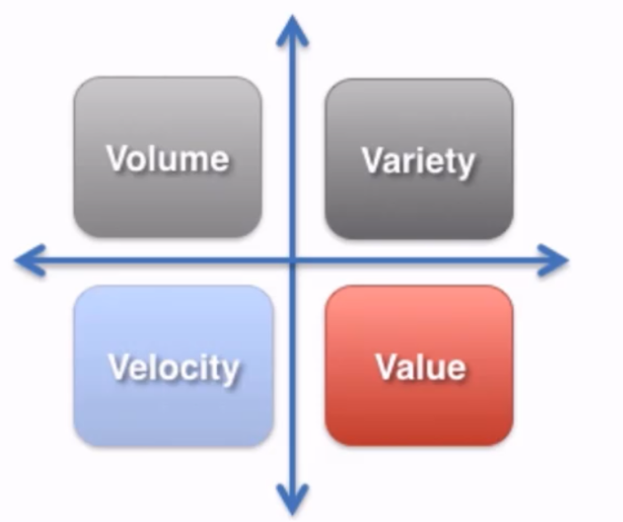
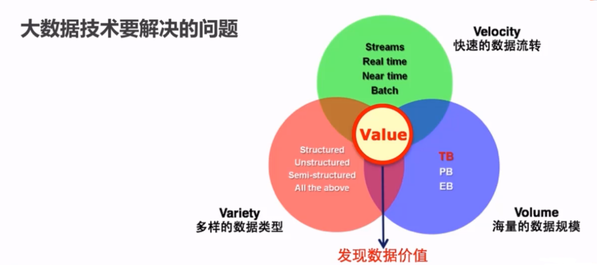
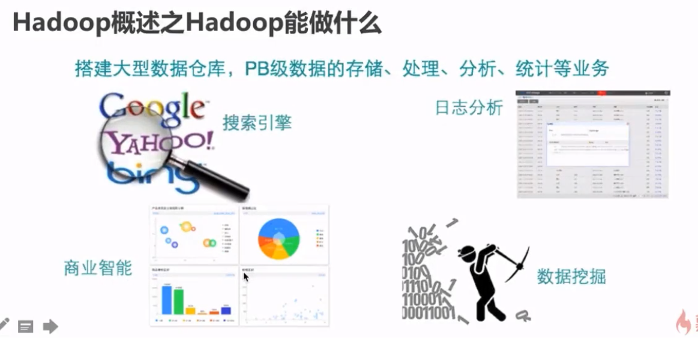
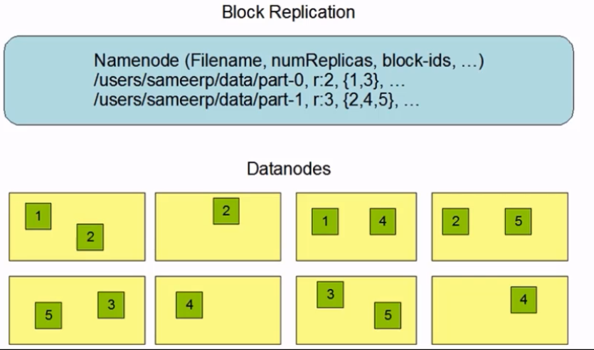
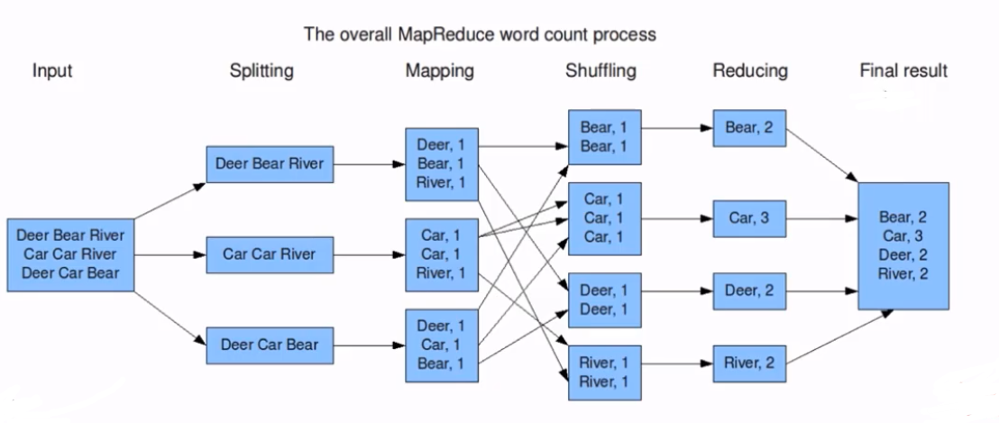

# Hadoop / Spark 大数据（⚠️ 已过时，仅作存档）

> ## ⛔ 重要提示：本技术应用场景已大幅收窄
>
> **最后更新于**：2026-07
> **原因**：
> - **Hadoop 离线数仓被云数仓替代**：MaxCompute / Snowflake / BigQuery / Databricks SQL 等托管服务，无需自建集群
> - **Flink 已成为实时计算主流**，MapReduce 已不是入门选项
> - **YARN 调度被 Kubernetes 替代**：YARN-on-K8s 或纯 K8s 是新部署范式
> - **Spark 仍在用**（尤其 Spark SQL / Structured Streaming），但部署形态已从"自建 Hadoop 集群"变成"Databricks / EMR / K8s 上跑 Spark"
> - 自 2018 年后，自建 Hadoop 集群的中小公司基本消失
>
> ## 🔄 推荐替代技术
>
> | 旧场景 | 推荐替代 | 迁移要点 |
> |---|---|---|
> | 离线数仓 | MaxCompute / Snowflake / BigQuery | 托管、弹性、按量付费 |
> | 实时计算 | Flink on K8s / Kafka Streams | Flink 是事实标准 |
> | 大规模批处理 | Spark on Databricks / EMR / K8s | 不再自建 Hadoop |
> | 自建集群 | K8s + 对象存储（S3/OSS） | YARN → K8s 调度 |
> | 学习入门 | 公有云免费层 | MaxCompute 有学生计划 |
>
> ## 📖 最新技术速览（2026 版）
>
> 2026 年，大数据技术栈的格局已经清晰：
>
> | 场景 | 主流方案 |
> |---|---|
> | 离线数仓 | MaxCompute / Snowflake / Databricks SQL |
> | 实时计算 | Flink（事实标准）+ Kafka + Iceberg/Hudi/Paimon |
> | 数据湖 | Iceberg / Hudi / Delta Lake |
> | 批流一体 | Spark Structured Streaming + Delta Lake |
> | 资源调度 | K8s（YARN 几乎被替代） |
>
> **Hadoop 在 2026 年的角色**：
> - **存储层**：HDFS 协议仍常见（但底层用 S3/OSS 兼容）
> - **计算层**：MapReduce 几乎死透，Spark 仍在用
> - **生态**：Hive 还在用 SQL 接口，Presto/Trino 是新 SQL 引擎

---

# 以下为原内容存档

> 原文为 2018 年前后的 Hadoop/Spark 学习笔记（CDH 5.7 版本），含 1 篇总览 + 1 篇 HDFS 详解 + 1 篇漫画版 HDFS + 11 个 note 章节 + 1 个 docx（不可读已归档）+ 5 张本地图。
>
> ⚠️ **死链修正**：原文 5 张本地图使用绝对路径 `C:\Users\wyx\Desktop\新建文件夹\xxx.png`，已改正为相对路径 `./xxx.png`，图片仍可正常显示。
> ⚠️ **外链失效**：原文 HDFS 漫画版的图片来自 jianshu.com，可能因防盗链失效（保留作为参考）。

## 一、大数据生态总览

### 1.1 大数据 4V 特征

- **Volume**（大量）
- **Velocity**（高速）
- **Variety**（多样）
- **Value**（价值密度低）

> 📷 4V 特征示意图：
> 
> 

### 1.2 6 大挑战

1. 对现有数据库管理技术的挑战
2. 经典数据库没考虑数据多类别
3. **实时性**技术挑战
4. 网络架构、数据运维的挑战
5. 数据隐私
6. 数据源的复杂多样

### 1.3 Hadoop vs Spark 生态

> 💡 一句话：**Hadoop = 引擎（存储+调度），Spark = 燃油（计算）**。

| 组件 | 角色 | 替代 |
|---|---|---|
| HDFS | 分布式文件系统 | S3 / OSS / MinIO |
| YARN | 资源调度 | K8s |
| MapReduce | 离线计算框架 | Spark / Flink |
| Hive | SQL-on-Hadoop | Trino / Presto / Spark SQL |
| HBase | NoSQL 列存 | Cassandra / TiDB |

## 二、HDFS 分布式文件系统

> 📷 HDFS 核心组件图：
> 

### 2.1 架构：1 NameNode + N DataNode

| 角色 | 职责 |
|---|---|
| **NameNode (NN)** | 响应客户端请求 / 管理元数据（文件名、副本系数、Block 位置） |
| **DataNode (DN)** | 存储 Block / 定期向 NN 发送心跳 |

**副本机制**：
- 默认副本系数 = 3
- 1 个文件切分成多个 Block（默认 128M）
- 所有 Block 除了最后一个，大小相同
- 副本按距离远近排序写入

### 2.2 HDFS 优缺点

**优点**：
- 数据冗余、硬件容错
- 适合存储**大文件**
- 处理**流式**数据访问
- 构建在廉价机器上

**缺点**：
- **低延迟**数据访问（难做到秒级）
- **小文件**存储（元数据压力）

### 2.3 写数据流程（14 步）

> 📷 写数据流程图：
> 

```
1. 客户端：我要写 200M 文件 → 问 Namenode
2. Namenode 确认：块大小 128M，副本数 3
3. 客户端把 200M 切成 128M + 72M
4. 请求 Namenode 写第一个 128M 块
5. Namenode 找 3 个 DataNode，按距离排序返回
6. 客户端把数据发给最近的 DataNode1
7. DataNode1 接收时立刻转发给 DataNode2，DataNode2 再转发给 DataNode3
8. 全部存完后，3 个 DN 向 NN 汇报完成
9. 对第二个块重复 4-8
10. 客户端关闭连接
```

> 💡 流水线传输 + 副本机制，跟计算机网络的"令牌环"思想类似。

### 2.4 读数据流程

```
1. 客户端：我要读文件
2. 找 Namenode 拿元数据（文件分几块、每块在哪些 DN）
3. Namenode 按距离排序返回 DN 列表
4. 客户端依次去 DN 读
5. 拼成完整文件
```

### 2.5 错误处理

HDFS 处理 DataNode 宕机和网络错误的方式：
- **校验和**：传数据时附带校验结果
- **ACK 机制**：接收方收到后发 ACK
- **副本重传**：失败时从其他副本读

## 三、YARN 资源调度

### 3.1 架构：1 RM + N NM

> 📷 YARN 组件图（与 HDFS 类似）：
> 

| 角色 | 职责 |
|---|---|
| **ResourceManager (RM)** | 整个集群资源管理 + 调度（每个集群只有 1 个 active） |
| **NodeManager (NM)** | 单节点资源管理 + task 运行（集群有 N 个） |
| **ApplicationMaster (AM)** | 每个应用/作业 1 个，负责数据切分 + 申请资源 + 监控 task |
| **Container** | 任务运行的资源描述（CPU、内存、环境变量） |

### 3.2 执行流程

```
1. 用户向 YARN 提交作业
2. RM 分配第一个 container 启动 AM
3. RM 与对应 NM 通信启动 AM
4. AM 向 RM 注册
5. AM 轮询向 RM 申请资源
6. AM 申请到资源后与 NM 通信启动 task
7. NM 启动 task
```

### 3.3 XXX on YARN

Spark / MapReduce / Storm / Flink 都可以跑在 YARN 上，**共享集群资源**。

> 💡 2026 年观点：YARN 已经被 K8s 替代。新部署都用 K8s。

## 四、MapReduce 基础

### 4.1 局限性

1. 代码繁琐
2. 只支持 map 和 reduce
3. 执行效率低
4. 不适合**迭代**、**交互式**、**流式**处理

→ 这些局限直接催生了 Spark。

### 4.2 例子：WordCount

```bash
hadoop jar hadoop-mapreduce-examples-2.6.0-cdh5.7.0.jar \
    wordcount /input/wc/hello.txt /output/wc/
```

> ⚠️ 同一输出目录会报 `FileAlreadyExistsException`，每次都要换目录或先删。

## 五、Spark 生态

### 5.1 BDAS：Berkeley Data Analytics Stack

```
Spark Core
   ├── Spark SQL
   ├── Spark Streaming
   ├── Spark MLlib
   └── Spark GraphX
```

### 5.2 Spark 相对 MapReduce 的优势

| 维度 | MapReduce | Spark |
|---|---|---|
| 计算模型 | 仅 map/reduce | 算子丰富（RDD） |
| 中间结果 | 落盘 | 内存 |
| 迭代计算 | 慢 | 快 100x |
| 实时/流式 | 不支持 | Structured Streaming |
| 交互式 | 不支持 | spark-shell / Zeppelin |

## 六、Spark SQL

### 6.1 DataFrame / Dataset

- **DataFrame**：分布式数据集合，按列组织（类似 R/Pandas）
- **Dataset**：强类型的 DataFrame

### 6.2 外部数据源

Spark SQL 1.2+ 支持 JSON / Parquet / RDBMS 等。

```python
# 从各种数据源加载
df = spark.read.json("hdfs:///path/to/data.json")
df = spark.read.parquet("hdfs:///path/to/data.parquet")
df = spark.read.jdbc(url, table, properties)
```

### 6.3 提交命令

```bash
./bin/spark-submit \
  --class com.imooc.spark.SQLContextApp \
  --master yarn \
  --executor-memory 1G \
  --num-executors 1 \
  /home/hadoop/lib/sql-1.0.jar
```

> ⚠️ YARN 模式需要设置 `HADOOP_CONF_DIR` 或 `YARN_CONF_DIR`，否则会报：
> `Exception in thread "main" java.lang.Exception: When running with master 'yarn' either HADOOP_CONF_DIR or YARN_CONF_DIR must be set`

## 七、Spark 运行模式

| 模式 | 用途 | Driver 位置 |
|---|---|---|
| **Local** | 开发测试 | 本地 |
| **Standalone** | Spark 自带集群 | 任意 |
| **YARN**（生产） | 与 Hadoop 共享资源 | Client 或 AM |
| **Mesos** | 较少用 | 任意 |

**YARN Client vs YARN Cluster**：

| 维度 | YARN Client | YARN Cluster |
|---|---|---|
| Driver 位置 | 提交作业的机器 | ApplicationMaster |
| 客户端能否关闭 | ❌ 不能 | ✅ 可以 |
| 日志 | 控制台可见 | 只能 `yarn logs -applicationId` |

## 八、实战：用户行为日志分析

### 8.1 日志数据格式

```
2013-05-19 13:00:00  http://www.taobao.com/17/?tracker_u=1624169&type=1  B58W48U4...  http://hao.360.cn/  1.196.34.243
```

包含：访问时间、URL、referer、session_id、IP 等。

### 8.2 数据处理流程

```
数据采集（Flume → HDFS）
   ↓
数据清洗（Spark / Hive / MR）
   ↓
数据处理（按业务统计）
   ↓
结果入库（RDBMS / NoSQL）
   ↓
可视化（ECharts / HUE / Zeppelin）
```

### 8.3 典型表结构（TopN 统计）

```sql
-- 视频 TopN
create table day_video_access_topn_stat (
    day varchar(8) not null,
    cms_id bigint(10) not null,
    times bigint(10) not null,
    primary key (day, cms_id)
);

-- 城市访问 TopN
create table day_video_city_access_topn_stat (
    day varchar(8) not null,
    cms_id bigint(10) not null,
    city varchar(20) not null,
    times bigint(10) not null,
    times_rank int not null,
    primary key (day, cms_id, city)
);
```

### 8.4 调优要点

1. **控制文件输出大小**：`coalesce(N)` 减少小文件
2. **分区字段类型**：`spark.sql.sources.partitionColumnTypeInference.enabled`
3. **批量插入**：用 batch 而非逐条
4. **shuffle 分区数**：`--conf spark.sql.shuffle.partitions=500`

## 九、CDH 5.7 环境搭建（速记）

> ⚠️ **强烈不建议新项目用 CDH**，2019 年 Cloudera 收紧了开源协议。**2026 年入门用云服务**（MaxCompute / EMR / Databricks 免费层）。

伪分布式步骤（仅供历史参考）：

```bash
# 1. 下载
wget http://archive.cloudera.com/cdh5/cdh/5/hadoop-2.6.0-cdh5.7.0.tar.gz

# 2. 安装 JDK
tar -zxvf jdk-7u51-linux-x64.tar.gz -C ~/app/
export JAVA_HOME=/home/hadoop/app/jdk1.7.0_51
export PATH=$JAVA_HOME/bin:$PATH

# 3. 配置 hadoop-env.sh
export JAVA_HOME=/home/hadoop/app/jdk1.7.0_51

# 4. core-site.xml + hdfs-site.xml
# 5. 格式化 HDFS
bin/hdfs namenode -format

# 6. 启动
sbin/start-dfs.sh
sbin/start-yarn.sh
```

---

## 📚 关键 takeaway

- **Hadoop 生态**（HDFS + YARN + MapReduce + Hive + HBase）已基本被云数仓 + K8s 替代
- **Spark 仍在用**，但部署形态变化大（云上跑 Spark 是主流）
- **2026 入门推荐**：从云数仓（MaxCompute / Snowflake）和 Flink 开始，不要从 Hadoop 集群搭起
- **HDFS 的设计思想**（分块、副本、心跳）影响深远，现在的对象存储（S3/OSS）继承了很多

---

## 修改记录

| 日期 | 类型 | 说明 |
|---|---|---|
| 2026-07-22 | 审查 | 全面审查，替代方案（云数仓/Flink/K8s/Iceberg）均为 2026 年最新主流；存档区保留原貌 |
