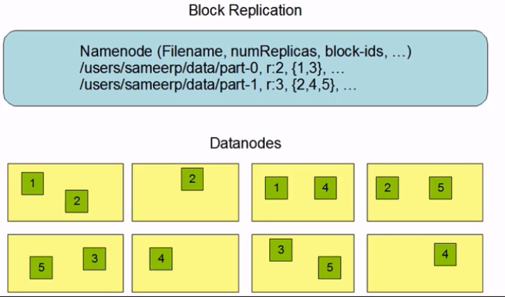
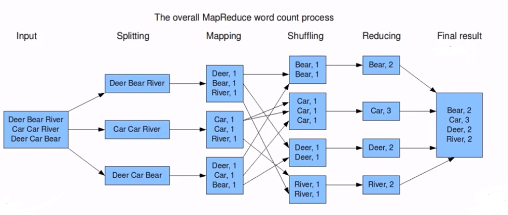

# Hadoop / Spark 大数据（⚠️ 已过时，仅作存档）

> 预计阅读：约 136 分钟（正文约 43513 字）
> 阅读建议：建议分两次阅读：先看概览、结论和关键表格，再按需翻文末原文归档。

> ## ⛔ 重要提示：本技术应用场景已大幅收窄
>
> **最后更新于**：2026-07
> **原因**：
> - **Hadoop 离线数仓被云数仓替代**：MaxCompute / Snowflake / BigQuery / Databricks SQL 等托管服务，无需自建集群
> - **Flink 已成为实时计算主流**，MapReduce 已不是入门选项
> - **YARN 调度被 Kubernetes 替代**：YARN-on-K8s 或纯 K8s 是新部署范式
> - **Spark 仍在用**（尤其 Spark SQL / Structured Streaming），但部署形态已从"自建 Hadoop 集群"变成"Databricks / EMR / K8s 上跑 Spark"
> - 自 2018 年后，自建 Hadoop 集群的中小公司基本消失
>
> ## 🔄 推荐替代技术
>
> | 旧场景 | 推荐替代 | 迁移要点 |
> |---|---|---|
> | 离线数仓 | MaxCompute / Snowflake / BigQuery | 托管、弹性、按量付费 |
> | 实时计算 | Flink on K8s / Kafka Streams | Flink 是事实标准 |
> | 大规模批处理 | Spark on Databricks / EMR / K8s | 不再自建 Hadoop |
> | 自建集群 | K8s + 对象存储（S3/OSS） | YARN → K8s 调度 |
> | 学习入门 | 公有云免费层 | MaxCompute 有学生计划 |
>
> ## 📖 最新技术速览（2026 版）
>
> 2026 年，大数据技术栈的格局已经清晰：
>
> | 场景 | 主流方案 |
> |---|---|
> | 离线数仓 | MaxCompute / Snowflake / Databricks SQL |
> | 实时计算 | Flink（事实标准）+ Kafka + Iceberg/Hudi/Paimon |
> | 数据湖 | Iceberg / Hudi / Delta Lake |
> | 批流一体 | Spark Structured Streaming + Delta Lake |
> | 资源调度 | K8s（YARN 几乎被替代） |
>
> **Hadoop 在 2026 年的角色**：
> - **存储层**：HDFS 协议仍常见（但底层用 S3/OSS 兼容）
> - **计算层**：MapReduce 几乎死透，Spark 仍在用
> - **生态**：Hive 还在用 SQL 接口，Presto/Trino 是新 SQL 引擎

---

> 原文为 2018 年前后的 Hadoop/Spark 学习笔记（CDH 5.7 版本）：2 个 md + 3 个无扩展名/txt + 10 个 note 章节共 15 个文本文件，另有 1 个 docx（不可读已归档）与 5 张本地图。以下为整理后的知识总结，15 个归档文本文件已在本页末尾「原内容存档」完整内联。
>
> ⚠️ **图片路径修正**：原文 5 张本地图使用绝对路径 `C:\Users\wyx\Desktop\新建文件夹\xxx.png`，已统一改为相对路径 `../archive/old-hadoop-spark-notes/xxx.png`（图片保存在归档目录）。
> ⚠️ **外链失效**：原文 HDFS 漫画版的图片来自 jianshu.com，可能因防盗链失效（保留作为参考）。

## 一、大数据生态总览

### 1.1 大数据 4V 特征

- **Volume**（大量）
- **Velocity**（高速）
- **Variety**（多样）
- **Value**（价值密度低）

> 📷 4V 特征示意图：
> 
> 

### 1.2 6 大挑战

1. 对现有数据库管理技术的挑战
2. 经典数据库没考虑数据多类别
3. **实时性**技术挑战
4. 网络架构、数据运维的挑战
5. 数据隐私
6. 数据源的复杂多样

### 1.3 Hadoop vs Spark 生态

> 💡 一句话：**Hadoop = 引擎（存储+调度），Spark = 燃油（计算）**。

| 组件 | 角色 | 替代 |
|---|---|---|
| HDFS | 分布式文件系统 | S3 / OSS / MinIO |
| YARN | 资源调度 | K8s |
| MapReduce | 离线计算框架 | Spark / Flink |
| Hive | SQL-on-Hadoop | Trino / Presto / Spark SQL |
| HBase | NoSQL 列存 | Cassandra / TiDB |

## 二、HDFS 分布式文件系统

> 📷 HDFS 核心组件图：
> 

### 2.1 架构：1 NameNode + N DataNode

| 角色 | 职责 |
|---|---|
| **NameNode (NN)** | 响应客户端请求 / 管理元数据（文件名、副本系数、Block 位置） |
| **DataNode (DN)** | 存储 Block / 定期向 NN 发送心跳 |

**副本机制**：
- 默认副本系数 = 3
- 1 个文件切分成多个 Block（默认 128M）
- 所有 Block 除了最后一个，大小相同
- 副本按距离远近排序写入

### 2.2 HDFS 优缺点

**优点**：
- 数据冗余、硬件容错
- 适合存储**大文件**
- 处理**流式**数据访问
- 构建在廉价机器上

**缺点**：
- **低延迟**数据访问（难做到秒级）
- **小文件**存储（元数据压力）

### 2.3 写数据流程（14 步）

> 📷 写数据流程图：
> 

```
1. 客户端：我要写 200M 文件 → 问 Namenode
2. Namenode 确认：块大小 128M，副本数 3
3. 客户端把 200M 切成 128M + 72M
4. 请求 Namenode 写第一个 128M 块
5. Namenode 找 3 个 DataNode，按距离排序返回
6. 客户端把数据发给最近的 DataNode1
7. DataNode1 接收时立刻转发给 DataNode2，DataNode2 再转发给 DataNode3
8. 全部存完后，3 个 DN 向 NN 汇报完成
9. 对第二个块重复 4-8
10. 客户端关闭连接
```

> 💡 流水线传输 + 副本机制，跟计算机网络的"令牌环"思想类似。

### 2.4 读数据流程

```
1. 客户端：我要读文件
2. 找 Namenode 拿元数据（文件分几块、每块在哪些 DN）
3. Namenode 按距离排序返回 DN 列表
4. 客户端依次去 DN 读
5. 拼成完整文件
```

### 2.5 错误处理

HDFS 处理 DataNode 宕机和网络错误的方式：
- **校验和**：传数据时附带校验结果
- **ACK 机制**：接收方收到后发 ACK
- **副本重传**：失败时从其他副本读

## 三、YARN 资源调度

### 3.1 架构：1 RM + N NM

> 📷 YARN 组件图（与 HDFS 类似）：
> 

| 角色 | 职责 |
|---|---|
| **ResourceManager (RM)** | 整个集群资源管理 + 调度（每个集群只有 1 个 active） |
| **NodeManager (NM)** | 单节点资源管理 + task 运行（集群有 N 个） |
| **ApplicationMaster (AM)** | 每个应用/作业 1 个，负责数据切分 + 申请资源 + 监控 task |
| **Container** | 任务运行的资源描述（CPU、内存、环境变量） |

### 3.2 执行流程

```
1. 用户向 YARN 提交作业
2. RM 分配第一个 container 启动 AM
3. RM 与对应 NM 通信启动 AM
4. AM 向 RM 注册
5. AM 轮询向 RM 申请资源
6. AM 申请到资源后与 NM 通信启动 task
7. NM 启动 task
```

### 3.3 XXX on YARN

Spark / MapReduce / Storm / Flink 都可以跑在 YARN 上，**共享集群资源**。

> 💡 2026 年观点：YARN 已经被 K8s 替代。新部署都用 K8s。

## 四、MapReduce 基础

### 4.1 局限性

1. 代码繁琐
2. 只支持 map 和 reduce
3. 执行效率低
4. 不适合**迭代**、**交互式**、**流式**处理

→ 这些局限直接催生了 Spark。

### 4.2 例子：WordCount

```bash
hadoop jar hadoop-mapreduce-examples-2.6.0-cdh5.7.0.jar \
    wordcount /input/wc/hello.txt /output/wc/
```

> ⚠️ 同一输出目录会报 `FileAlreadyExistsException`，每次都要换目录或先删。

## 五、Spark 生态

### 5.1 BDAS：Berkeley Data Analytics Stack

```
Spark Core
   ├── Spark SQL
   ├── Spark Streaming
   ├── Spark MLlib
   └── Spark GraphX
```

### 5.2 Spark 相对 MapReduce 的优势

| 维度 | MapReduce | Spark |
|---|---|---|
| 计算模型 | 仅 map/reduce | 算子丰富（RDD） |
| 中间结果 | 落盘 | 内存 |
| 迭代计算 | 慢 | 快 100x |
| 实时/流式 | 不支持 | Structured Streaming |
| 交互式 | 不支持 | spark-shell / Zeppelin |

## 六、Spark SQL

### 6.1 DataFrame / Dataset

- **DataFrame**：分布式数据集合，按列组织（类似 R/Pandas）
- **Dataset**：强类型的 DataFrame

### 6.2 外部数据源

Spark SQL 1.2+ 支持 JSON / Parquet / RDBMS 等。

```python
# 从各种数据源加载
df = spark.read.json("hdfs:///path/to/data.json")
df = spark.read.parquet("hdfs:///path/to/data.parquet")
df = spark.read.jdbc(url, table, properties)
```

### 6.3 提交命令

```bash
./bin/spark-submit \
  --class com.imooc.spark.SQLContextApp \
  --master yarn \
  --executor-memory 1G \
  --num-executors 1 \
  /home/hadoop/lib/sql-1.0.jar
```

> ⚠️ YARN 模式需要设置 `HADOOP_CONF_DIR` 或 `YARN_CONF_DIR`，否则会报：
> `Exception in thread "main" java.lang.Exception: When running with master 'yarn' either HADOOP_CONF_DIR or YARN_CONF_DIR must be set`

## 七、Spark 运行模式

| 模式 | 用途 | Driver 位置 |
|---|---|---|
| **Local** | 开发测试 | 本地 |
| **Standalone** | Spark 自带集群 | 任意 |
| **YARN**（生产） | 与 Hadoop 共享资源 | Client 或 AM |
| **Mesos** | 较少用 | 任意 |

**YARN Client vs YARN Cluster**：

| 维度 | YARN Client | YARN Cluster |
|---|---|---|
| Driver 位置 | 提交作业的机器 | ApplicationMaster |
| 客户端能否关闭 | ❌ 不能 | ✅ 可以 |
| 日志 | 控制台可见 | 只能 `yarn logs -applicationId` |

## 八、实战：用户行为日志分析

### 8.1 日志数据格式

```
2013-05-19 13:00:00  http://www.taobao.com/17/?tracker_u=1624169&type=1  B58W48U4...  http://hao.360.cn/  1.196.34.243
```

包含：访问时间、URL、referer、session_id、IP 等。

### 8.2 数据处理流程

```
数据采集（Flume → HDFS）
   ↓
数据清洗（Spark / Hive / MR）
   ↓
数据处理（按业务统计）
   ↓
结果入库（RDBMS / NoSQL）
   ↓
可视化（ECharts / HUE / Zeppelin）
```

### 8.3 典型表结构（TopN 统计）

```sql
-- 视频 TopN
create table day_video_access_topn_stat (
    day varchar(8) not null,
    cms_id bigint(10) not null,
    times bigint(10) not null,
    primary key (day, cms_id)
);

-- 城市访问 TopN
create table day_video_city_access_topn_stat (
    day varchar(8) not null,
    cms_id bigint(10) not null,
    city varchar(20) not null,
    times bigint(10) not null,
    times_rank int not null,
    primary key (day, cms_id, city)
);
```

### 8.4 调优要点

1. **控制文件输出大小**：`coalesce(N)` 减少小文件
2. **分区字段类型**：`spark.sql.sources.partitionColumnTypeInference.enabled`
3. **批量插入**：用 batch 而非逐条
4. **shuffle 分区数**：`--conf spark.sql.shuffle.partitions=500`

## 九、CDH 5.7 环境搭建（速记）

> ⚠️ **强烈不建议新项目用 CDH**，2019 年 Cloudera 收紧了开源协议。**2026 年入门用云服务**（MaxCompute / EMR / Databricks 免费层）。

伪分布式步骤（仅供历史参考）：

```bash
# 1. 下载
wget http://archive.cloudera.com/cdh5/cdh/5/hadoop-2.6.0-cdh5.7.0.tar.gz

# 2. 安装 JDK
tar -zxvf jdk-7u51-linux-x64.tar.gz -C ~/app/
export JAVA_HOME=/home/hadoop/app/jdk1.7.0_51
export PATH=$JAVA_HOME/bin:$PATH

# 3. 配置 hadoop-env.sh
export JAVA_HOME=/home/hadoop/app/jdk1.7.0_51

# 4. core-site.xml + hdfs-site.xml
# 5. 格式化 HDFS
bin/hdfs namenode -format

# 6. 启动
sbin/start-dfs.sh
sbin/start-yarn.sh
```

---

## 📚 关键 takeaway

- **Hadoop 生态**（HDFS + YARN + MapReduce + Hive + HBase）已基本被云数仓 + K8s 替代
- **Spark 仍在用**，但部署形态变化大（云上跑 Spark 是主流）
- **2026 入门推荐**：从云数仓（MaxCompute / Snowflake）和 Flink 开始，不要从 Hadoop 集群搭起
- **HDFS 的设计思想**（分块、副本、心跳）影响深远，现在的对象存储（S3/OSS）继承了很多

---

# 以下为原内容存档

> 以下内容为原始归档文件的完整保留，文字原貌不变。
>
> 归档目录：[archive/old-hadoop-spark-notes/](../archive/old-hadoop-spark-notes/)。共内联 15 个文本文件：`Hadoop_spark学习.md`、`漫画解释hdfs文件读取.md`、`hdfs框架解释`、`flink_bean运行`、`伪分布式框架搭建.txt`，以及 `note/` 下 10 个章节（归档原编号即缺 8）。`spark sql全笔记.docx` 二进制不可读，未内联，与 5 张 png 本地图一并保留在归档目录。原文本地图的绝对路径 `C:\Users\wyx\Desktop\新建文件夹\xxx.png` 已修正为 `../archive/old-hadoop-spark-notes/xxx.png`；jianshu.com 外链图片保留原样。

## Hadoop_spark学习.md

引擎（神经网络）

燃料（大数据）
Hadoop生态圈
Spark生态圈

### 1.主要功能

	分布式文件系统HDFS
	分布式资源调度YARN
	分布式计算框架MapReduce
	Hadoop分布式集群搭建
### 2.涉及的技术

	前沿技术 spark flink beam
	1.数据采集
	2.数据存储
	3.数据处理/分析/挖掘
	4.可视化
## 3.大数据概述

	大数据定义
		大数据4v特征


### 4.大数据背景

```
大数据在技术架构上带来的挑战
	1.对现有数据库管理技术的挑战
	2.经典数据库技术并没有考虑数据的多类别
	3.实时性的技术挑战
	4.网络架构、数据运维的挑战
	5.数据隐私
	6.数据源的复杂多样
```

### 5.如何对大数据进行存储和分析？

```
系统瓶颈
	存储容量
	读写速度
	计算效率
Google 大数据技术（没有开源）
	MapReduce
	BigTable
	GFS
```

#### 6.Hadoop概述

```
可靠，可扩展，分布式的
HDFS数据存储
yarn作业调度，资源管理
MapReduce基于yarn的并行处理框架

开源的，分布式存储+分布式计算平台

优势：
	可靠性：
          数据存储：数据块多副本
          数据计算：重新调度作业计算
     高扩展性：
     	存储/计算资源不够时，可以横向的线性扩展机器
     	一个进群中可以包含数以千计的节点
     其他：
     	存储在廉价机器上，降低成本
     	成熟的生态圈
	
```


#### Hadoop核心组件之分布式文件系统HDFS

```源自Google的GFS论文，论文发表于2003年10月。
HDFS是GFS的克隆版
HDFS特点：扩展性&容错性&海量数量存储
将文件切分成制定大小的数据块并以多副本的存储在多个机器上
数据切分、多副本、容错等操作对用户是透明的

```

下图中，part-0 副本数2 block1，3，block编号是为了按顺序组成文件，每个block存在多个副本。数据切分，多副本，容错率高。


#### Hadoop核心组件之资源调度系统YARN

```
YARN:Yet Another Resource Negotiator
负责整个集群资源的管理和调度
特点：扩展性&容错性&多框架资源统一调度 （提高计算能力/可以重新启动错误程序/可以跑多种不同框架的）
```

#### Hadoop核心组件之分布式计算框架MapReduce

```
源自于Google的MapReduce论文，论文发表于2004年12月
MapReduce是Google MapReduce的克隆版
特点：扩展性&容错性&海量数据处理啊
```

例子word cont 给你一篇文章统计数字


#### Hadoop版本用cdh版本。

# HDFS的设计目标

1. 非常巨大的分布式文件系统
2. 运行在普通廉价的硬件上
3. 易扩展、为用户提供性能不错的文件储存服务

 

### HDFS优点

1.数据冗余、硬件容错

2.适合存储大文件

3.处理流式的数据访问

4.可构建在廉价的机器上

### HDFS缺点

1.低延迟的数据访问（大文件很难做到秒级别的读取）

2.小文件的存储（对应的元数据存储在上面对namenode压力大）

## YARN执行流程


## 漫画解释hdfs文件读取.md


首先看看出场的角色，第一个是client客户端，用来发起读写请求，读取HDFS上的文件或往HDFS中写文件；第二个是Namenode，唯一的一个，会协调所有客户端发起的请求；第三个是DataNode，负责数据存储，跟Namenode不一样，DataNode有很多个，有时候能达到数以千计。

### 写数据流程


往HDFS中写数据的流程如下：

第1幅图：我们跟客户端说，你帮我写一个200M的数据吧，客户端说没问题啊，但是...

第2幅图：客户端不知道我们对数据有没有其他的要求啊，问我们是不是忘了什么东西呢？我们想起来我们还是有要求的，第一我们要把数据分成若干块，并且每块的大小是128M，第二，每个数据块应该复制3份。其实这就是我们说的HDFS的文件分块和多副本，如果你不说的话客户端怎么知道到底怎么分，复制多少份呢？

第3幅图：由上面的对话我们发现，如果对于每个文件客户端都要这么问一下，是不是太麻烦了？所以说一个好的客户端应该是，用户就算不说你也要知道有这两个属性：**块的大小**，一个文件应该按照怎样的大小切分（通常是64M或128M）；**复制因子**，每个块应该复制多少份（通常是3份），也就是说如果用户不主动提供这些属性，那么就按照默认的来。

第4幅图：现在客户端已经知道了每个块的大小了，那么把200M的文件分成128M和72M两个块，一个长一个短。

第5幅图：切分后客户端就开始工作了，既然有两个块，那先上传第一个块，于是客户端请求Namenode帮它写一个128M的块，并且要复制3份。

第6幅图：Namenode接受到客户端的请求后，既然需要3个副本，那么就需要找到3个DataNode，Namenode就会想怎么去找到这3个DataNode呢？我该告诉客户端哪些信息呢？于是它就去它管理的DataNode中找一些满足要求的空闲节点。

第7幅图：Namenode找到了3个节点，现在把找到的节点发给客户端，表示：兄弟，你不是要我帮你写数据嘛，我给你找到了这3个合适的DataNode，并且已经按距离远近给你排过序了，第一个是最近的，你把数据给他们让他们帮你写吧。

第8幅图：客户端收到3个DataNode地址后，直接把数据发送到第一个节点(DataNode1)上，然后DataNode1开始把数据写到他的硬盘中。

第9、10、11幅图：DataNode1在接受数据的同时，会把刚刚收到的数据发送到第二个DataNode2上，同理DataNode2也是，接收的同时把数据立马发给DataNode3，到了DataNode3已经是最后一个DataNode了。整个过程跟流水线一样，接收一点就发一点。（个人感觉跟计算机网络中令牌环网的工作原理有些类似）


第12幅图：Namenode是所有DataNode的老大，所以DataNode在存完数据后要跟老大汇报，告诉他说，我第一个块的数据已经写完了。

第13幅图：3个DataNode都报告完成后，好，这样第一个数据块就写完了，下面对第二个块重复这个步骤。

第14幅图：所有的块都写完了之后，客户端关闭跟Namenode的连接。这时Namenode已经存储了文件的元数据，也就是文件被拆成了几块，复制了几份，每块分别存储在哪个DataNode上。

最后一幅图说明了每个角色在写数据过程中的作用:

- Client：切分文件成数据块。
- Namenode：对于每个数据块，找到存储的DataNode地址。
- DataNode：多副本方式存储数据。

### 读数据流程


下面看看读文件的流程，同样还是这些角色。

第1幅图：写文件已经搞定了，那么怎么读文件呢？我们先跟客户端说，嘿兄弟！帮我读个文件呗！

第2幅图：客户端跟Namenode发了个请求，把文件名发送给Namenode，表示我想要这个这个文件的信息。

第3幅图：Namenode找了找，然后找到了一个结果，结果包含这个文件被拆成了多少块，每个块存储在哪些DataNode上的信息，并且DataNode同样是按照距离排序的。然后把这个结果发送给客户端，说，嘿兄弟！你要的文件在这些DataNode上，你去找吧。

第4幅图：现在客户端知道了文件的存储情况，所以就一个个去DataNode上访问就好了。

最后提出了一个问题：如果这个过程中DataNode挂了，或者数据在传输中出了问题怎么办？事实上

HDFS对于这些问题都是能够完美解决的。

### 错误处理

下面是出错处理的一些漫画，有不少是计算机网络的思想，英文也不是很难，就不一一详细解释了，这里只列出来。


其实很多思想跟计算机网络中信息传递的原理很类似，比如，在传送数据的时候怎么保证正确性？引入校验的概念，传数据的同时把校验的结果也一并发过去，接收方接收数据校验后与接收到的校验结果对比就可以确保发送的是正确的数据；至于怎样确认对方收到数据，使用的是ack应答机制，接收方接受到一个数据就发一个ack表示我已经收到了数据了。

## hdfs框架解释

HDFS架构

1 Master(NameNode/NN)  带 N个Slaves(DataNode/DN)
HDFS/YARN/HBase

1个文件会被拆分成多个Block
blocksize：128M （为了负载均衡，要是储存太大会受网络的限制
130M ==> 2个Block： 128M 和 2M

NN：
1）负责客户端请求的响应
2）负责元数据（文件的名称、副本系数、Block存放的DN）的管理

DN：
1）存储用户的文件对应的数据块(Block)
2）要定期向NN发送心跳信息，汇报本身及其所有的block信息，健康状况

A typical deployment has a dedicated machine that runs only the NameNode software. 
Each of the other machines in the cluster runs one instance of the DataNode software.
The architecture does not preclude running multiple DataNodes on the same machine 
but in a real deployment that is rarely the case.

NameNode + N个DataNode
建议：NN和DN是部署在不同的节点上


replication factor：副本系数、副本因子

All blocks in a file except the last block are the same size


Hadoop1.x时：
MapReduce：Master/Slave架构，1个JobTracker带多个TaskTracker

JobTracker： 负责资源管理和作业调度
TaskTracker：
	定期向JT汇报本节点的健康状况、资源使用情况、作业执行情况；
	接收来自JT的命令：启动任务/杀死任务

YARN：不同计算框架可以共享同一个HDFS集群上的数据，享受整体的资源调度

XXX on YARN的好处：
	与其他计算框架共享集群资源，按资源需要分配，进而提高集群资源的利用率
XXX: Spark/MapReduce/Storm/Flink


YARN架构：
1）ResourceManager: RM
	整个集群同一时间提供服务的RM只有一个，负责集群资源的统一管理和调度
	处理客户端的请求： 提交一个作业、杀死一个作业
	监控我们的NM，一旦某个NM挂了，那么该NM上运行的任务需要告诉我们的AM来如何进行处理

2) NodeManager: NM
	整个集群中有多个，负责自己本身节点资源管理和使用
	定时向RM汇报本节点的资源使用情况
	接收并处理来自RM的各种命令：启动Container
	处理来自AM的命令
	单个节点的资源管理

3) ApplicationMaster: AM
	每个应用程序对应一个：MR、Spark，负责应用程序的管理
	为应用程序向RM申请资源（core、memory），分配给内部task
	需要与NM通信：启动/停止task，task是运行在container里面，AM也是运行在container里面

4) Container
	封装了CPU、Memory等资源的一个容器
	是一个任务运行环境的抽象

5) Client
	提交作业
	查询作业的运行进度
	杀死作业


Hadoop伪分布式安装步骤
1）jdk安装
	解压：tar -zxvf jdk-7u79-linux-x64.tar.gz -C ~/app
	添加到系统环境变量： ~/.bash_profile
		export JAVA_HOME=/home/hadoop/app/jdk1.7.0_79
		export PATH=$JAVA_HOME/bin:$PATH
	使得环境变量生效： source ~/.bash_profile
	验证java是否配置成功： java -v

2）安装ssh
	sudo yum install ssh
	ssh-keygen -t rsa
	cp ~/.ssh/id_rsa.pub ~/.ssh/authorized_keys	

3）下载并解压hadoop
	下载：直接去cdh网站下载
	解压：tar -zxvf hadoop-2.6.0-cdh5.7.0.tar.gz -C ~/app

4）hadoop配置文件的修改(hadoop_home/etc/hadoop)
	hadoop-env.sh
		export JAVA_HOME=/home/hadoop/app/jdk1.7.0_79

	core-site.xml
		<property>
	        <name>fs.defaultFS</name>
	        <value>hdfs://hadoop000:8020</value>
	    </property>

	    <property>
	        <name>hadoop.tmp.dir</name>
	        <value>/home/hadoop/app/tmp</value>
	    </property>

	hdfs-site.xml
		<property>
	        <name>dfs.replication</name>
	        <value>1</value>
	    </property>

	slaves    

5）启动hdfs
	格式化文件系统（仅第一次执行即可，不要重复执行）：hdfs/hadoop namenode -format
	启动hdfs: sbin/start-dfs.sh
	验证是否启动成功：
		jps
			DataNode
			SecondaryNameNode
			NameNode

		浏览器访问方式： http://hadoop000:50070

6）停止hdfs
	sbin/stop-dfs.sh 


Hadoop shell的基本使用
hdfs dfs
hadoop fs


Java API操作HDFS文件
文件	1	311585484	hdfs://hadoop000:8020/hadoop-2.6.0-cdh5.7.0.tar.gz
文件夹	0	0	hdfs://hadoop000:8020/hdfsapi
文件	1	49	hdfs://hadoop000:8020/hello.txt
文件	1	40762	hdfs://hadoop000:8020/install.log

问题：我们已经在hdfs-site.xml中设置了副本系数为1，为什么此时查询文件看到的3呢？
 如果你是通过hdfs shell的方式put的上去的那么，才采用默认的副本系数1
 如果我们是java api上传上去的，在本地我们并没有手工设置副本系数，所以否则采用的是hadoop自己的副本系数

## flink_bean运行

spark启动：spark-shell --master local[2]

spark实现wc：
val file = sc.textFile("file:///home/hadoop/data/hello.txt")
val a = file.flatMap(line => line.split(" "))
val b = a.map(word => (word,1))
Array((hadoop,1), (welcome,1), (hadoop,1), (hdfs,1), (mapreduce,1), (hadoop,1), (hdfs,1))

val c = b.reduceByKey(_ + _)
	Array((mapreduce,1), (welcome,1), (hadoop,3), (hdfs,2))


sc.textFile("file:///home/hadoop/data/hello.txt").flatMap(line => line.split(" ")).map(word => (word,1)).reduceByKey(_ + _).collect


Flink运行
./bin/flink run ./examples/batch/WordCount.jar \
--input file:///home/hadoop/data/hello.txt --output file:///home/hadoop/tmp/flink_wc_output


Beam运行：
#direct方式运行
mvn compile exec:java -Dexec.mainClass=org.apache.beam.examples.WordCount \
-Dexec.args="--inputFile=/home/hadoop/data/hello.txt --output=counts" \
-Pdirect-runner

#spark方式运行
mvn compile exec:java -Dexec.mainClass=org.apache.beam.examples.WordCount \
-Dexec.args="--runner=SparkRunner --inputFile=/home/hadoop/data/hello.txt --output=counts" -Pspark-runner


#flink方式运行

## 伪分布式框架搭建.txt

Hadoop 伪分布式安装步骤
1）jdk安装
	解压：tar -zxvf jdk-xxxxx-xxx -C ~/app
	添加到系统环境变量：~/.bash_profile
		export JAVA_HOME=/home/hadoop/app/jdk.xxxx(这里的路径是你用pwd查出来的安装路径)
		export PATH=$JAVA_HOME/bin:$PATH
	使得环境变量生效： 	source ~/.bash_profile
	验证java是否配置成功： java -v

2) 安装ssh
	sudo yum install ssh
	ssh-keygen -t rsa
	cp ~/.ssh/id_rsa.pub ~/.ssh/authorized_keys

3)下载并解压hadoop
	下载：官网下载
	解压：tar -zxvf hadoop-2.6.0-cdh5.7.0.tar.gz -C ~/app

4)hadoop配置文件的修改（hadoop_home/etc/hadoop）
	hadoop-env.sh
		export JAVA_HOME=/home/hadoop/app/jdk1.7.0_79(这里的路径是你echo $JAVA_HOME出来的)

	core-site.xml
		<property>
			<name>fs.defaultFS</name>
			<value>hdfs://MiWiFi-R3L-srv:8020</value>
		</property>
或
		<property>
			<name>fs.defaultFS</name>
			<value>hdfs://hadoop000:8020</value>
		</property>

		<property>
			<name>hadoop.tmp.dir</name>
			<value>/root/app/tmp</value>（这里的路径也是你自己的路径，用pwd查一下）
		</property>

	hdfs-site.xml
		<property>
			<name>dfs.replication</name>
			<value>1</value>
		</property>

	slaves	
5）启动hdfs
	格式化文件系统（仅第一次执行即可，不要重复执行）：hdfs namenode -format
	启动hdfs：sbin/start-dfs.sh
	验证是否启动成功：
		jps
			DataNode
			SecondaryNameNode
			namenode

			浏览器访问：http://hadoop0001:50070
6）停止hdfs
	sbin/stop-dfs.sh

7)配置hdfs
	vi ~/.bash_profile
	export HADOOP_HOME = /root/app/hadoop-2.6.0-cdh5.7.0
	export PATH=$HADOOP_HOME/bin:$PATH

	hdfs shell
	hadoop fs + 日常Linux指令，前面要加-
	ps： hadoop fs -ls /

	HDFS shell 常用命令的使用
	ls get mkdir rm put

	1）hadoop fs -ls / 查看根目录下的文件
	2）hadoop fs -put xxx / 将xxx文件传递到跟目录下
	3）hadoop fs -text /hello.txt 查看根目录下的文件
	4）hadoop fs -mkdir /test 创建文件夹（默认不能指定递归文件夹，或者加-p）
	5) hadoop fs -ls -R / 递归展示根目录
	6）hadoop fs -get /h.txt 拿到本地
	7）hadoop fs -rm /h.txt 删除

	在hdfs-site.xml 中设置了副本系数为1，通过hdfs shell的方式put上去的副本系数为1，如果是java api上传上去，没有手工设置副本系数，所以否则采用hadoop默认的3


	Hadoop 分布式环境搭建

	hostname设置： sudo vi /etc/sysconfig/network
	NETWORKING=yes
	HOSTNAME=hadoop001

	hostname和ip地址的设置： sudo vi /etc/hosts
	192.168.199.102 hadoop000
	192.168.199.247 hadoop001
	192.168.199.138 hadoop002

	hadoop000: NameNode/DataNode ResourceManager/NodeManager
	hadoop001: DataNode NodeManager
	hadoop002: DataNode NodeManager

	前置安装：
	1.ssh免密码登录 
	ssh-keygen -t rsa
	以hadoop000机器为主，在hadoop000上运行：
	ssh-copy-id -i ~/.ssh/id_rsa.pub hadoop000
	ssh-copy-id -i ~/.ssh/id_rsa.pub hadoop001
	ssh-copy-id -i ~/.ssh/id_rsa.pub hadoop002 

	2.jdk安装
	同上

	集群安装
	1）hadoop安装
	同上

	core-site.xml
	<property>
			<name>fs.defaultFS</name>
			<value>hdfs://hadoop000:8020</value>
		</property>

	hdfs-site.xml
	<property>
		<name>dfs.namenode.name.dir</name>
		<value>/home/hadoop/app/tmp/dfs/name</value>(这里的地址要自己创建，tmp要自己创建)
	</property>

	<property>
		<name>dfs.datanode.data.dir</name>
		<value>/home/hadoop/app/tmp/dfs/data</value>(这里的地址要自己创建，tmp要自己创建)
	</property>

	yarn-site.xml
	<property>
	    <name>yarn.nodemanager.aux-services</name>
	    <value>mapreduce_shuffle</value>
	</property>

	<property>
	    <name>yarn.resourcemanager.hostname</name>
	    <value>hadoop000</value>
	</property>

	mapred-site.xml
	<property>
	    <name>mapreduce.framework.name</name>
	    <value>yarn</value>
	</property>

	slaves
		hadoop000
		hadoop001
		hadoop002

	2）分发安装包到hadoop001和hadoop002节点
	scp -r ~/app hadoop@hadoop001:~/
	scp -r ~/app hadoop@hadoop002:~/

	scp ~/.bash_profile hadoop@hadoop001:~/
	scp ~/.bash_profile hadoop@hadoop002:~/
	让.bash_profile生效一下

	 3）对NN做格式化：只要在hadoop000上执行即可
	 	bin/hdfs namenode -format


	 4) 启动集群：只要在hadoop000上执行即可
	 	sbin/start-all.sh

	 5)验证
	 	jps
	 	hadoop000：5个
	 	001/002:2个

	 	hadoop000:50070
	 	hadoop000:8088

	 6）停止集群： stop-all.sh

## note/1

课程整套CDH相关的软件下载地址：http://archive.cloudera.com/cdh5/cdh/5/
cdh-5.7.0
生产或者测试环境选择对应CDH版本时，一定要采用尾号是一样的版本


http://hadoop.apache.org/
对于Apache的顶级项目来说，projectname.apache.org
Hadoop: hadoop.apache.org
Hive: hive.apache.org
Spark: spark.apache.org
HBase: hbase.apache.org


为什么很多公司选择Hadoop作为大数据平台的解决方案？
1）源码开源
2）社区活跃、参与者很多  Spark
3）涉及到分布式存储和计算的方方面面： 
	Flume进行数据采集
	Spark/MR/Hive等进行数据处理
	HDFS/HBase进行数据存储
4) 已得到企业界的验证


HDFS架构

1 Master(NameNode/NN)  带 N个Slaves(DataNode/DN)
HDFS/YARN/HBase

1个文件会被拆分成多个Block
blocksize：128M
130M ==> 2个Block： 128M 和 2M

NN：
1）负责客户端请求的响应
2）负责元数据（文件的名称、副本系数、Block存放的DN）的管理

DN：
1）存储用户的文件对应的数据块(Block)
2）要定期向NN发送心跳信息，汇报本身及其所有的block信息，健康状况

A typical deployment has a dedicated machine that runs only the NameNode software. 
Each of the other machines in the cluster runs one instance of the DataNode software.
The architecture does not preclude running multiple DataNodes on the same machine 
but in a real deployment that is rarely the case.

NameNode + N个DataNode
建议：NN和DN是部署在不同的节点上


replication factor：副本系数、副本因子

All blocks in a file except the last block are the same size


本课程软件存放目录
hadoop/hadoop
/home/hadoop
	software: 存放的是安装的软件包
	app : 存放的是所有软件的安装目录
	data: 存放的是课程中所有使用的测试数据目录
	source: 存放的是软件源码目录，spark


Hadoop环境搭建
1) 下载Hadoop
	http://archive.cloudera.com/cdh5/cdh/5/
	2.6.0-cdh5.7.0

	wget http://archive.cloudera.com/cdh5/cdh/5/hadoop-2.6.0-cdh5.7.0.tar.gz

2）安装jdk
	下载
	解压到app目录：tar -zxvf jdk-7u51-linux-x64.tar.gz -C ~/app/
	验证安装是否成功：~/app/jdk1.7.0_51/bin      ./java -version
	建议把bin目录配置到系统环境变量(~/.bash_profile)中
		export JAVA_HOME=/home/hadoop/app/jdk1.7.0_51
		export PATH=$JAVA_HOME/bin:$PATH


3）机器参数设置
	hostname: hadoop001
	
	修改机器名: /etc/sysconfig/network
		NETWORKING=yes
		HOSTNAME=hadoop001

	设置ip和hostname的映射关系: /etc/hosts
		192.168.199.200 hadoop001
		127.0.0.1 localhost

	ssh免密码登陆(本步骤可以省略，但是后面你重启hadoop进程时是需要手工输入密码才行)
		ssh-keygen -t rsa
		cp ~/.ssh/id_rsa.pub ~/.ssh/authorized_keys

4）Hadoop配置文件修改: ~/app/hadoop-2.6.0-cdh5.7.0/etc/hadoop
	hadoop-env.sh
		export JAVA_HOME=/home/hadoop/app/jdk1.7.0_51

	core-site.xml
		<property>
        	<name>fs.defaultFS</name>
        	<value>hdfs://hadoop001:8020</value>
    	</property>	

    	<property>
        	<name>hadoop.tmp.dir</name>
        	<value>/home/hadoop/app/tmp</value>
    	</property>	

    hdfs-site.xml
    	<property>
	        <name>dfs.replication</name>
	        <value>1</value>
	    </property>

5）格式化HDFS
	注意：这一步操作，只是在第一次时执行，每次如果都格式化的话，那么HDFS上的数据就会被清空
	bin/hdfs namenode -format

6）启动HDFS
	sbin/start-dfs.sh

	验证是否启动成功:
		jps
			DataNode
			SecondaryNameNode
			NameNode

		浏览器
			http://hadoop001:50070/


7）停止HDFS
	sbin/stop-dfs.sh


YARN架构
1 RM(ResourceManager) + N NM(NodeManager)

ResourceManager的职责： 一个集群active状态的RM只有一个，负责整个集群的资源管理和调度
1）处理客户端的请求(启动/杀死)
2）启动/监控ApplicationMaster(一个作业对应一个AM)
3）监控NM
4）系统的资源分配和调度


NodeManager：整个集群中有N个，负责单个节点的资源管理和使用以及task的运行情况
1）定期向RM汇报本节点的资源使用请求和各个Container的运行状态
2）接收并处理RM的container启停的各种命令
3）单个节点的资源管理和任务管理

ApplicationMaster：每个应用/作业对应一个，负责应用程序的管理
1）数据切分
2）为应用程序向RM申请资源(container)，并分配给内部任务
3）与NM通信以启停task， task是运行在container中的
4）task的监控和容错

Container：
对任务运行情况的描述：cpu、memory、环境变量

YARN执行流程
1）用户向YARN提交作业
2）RM为该作业分配第一个container(AM)
3）RM会与对应的NM通信，要求NM在这个container上启动应用程序的AM
4) AM首先向RM注册，然后AM将为各个任务申请资源，并监控运行情况
5）AM采用轮训的方式通过RPC协议向RM申请和领取资源
6）AM申请到资源以后，便和相应的NM通信，要求NM启动任务
7）NM启动我们作业对应的task


YARN环境搭建
mapred-site.xml
	<property>
        <name>mapreduce.framework.name</name>
        <value>yarn</value>
    </property>

yarn-site.xml
	<property>
        <name>yarn.nodemanager.aux-services</name>
        <value>mapreduce_shuffle</value>
    </property>

启动yarn：sbin/start-yarn.sh

验证是否启动成功
	jps
		ResourceManager
		NodeManager

	web: http://hadoop001:8088

停止yarn： sbin/stop-yarn.sh

提交mr作业到yarn上运行： wc

/home/hadoop/app/hadoop-2.6.0-cdh5.7.0/share/hadoop/mapreduce/hadoop-mapreduce-examples-2.6.0-cdh5.7.0.jar

hadoop jar /home/hadoop/app/hadoop-2.6.0-cdh5.7.0/share/hadoop/mapreduce/hadoop-mapreduce-examples-2.6.0-cdh5.7.0.jar wordcount /input/wc/hello.txt /output/wc/

当我们再次执行该作业时，会报错：
FileAlreadyExistsException: 
Output directory hdfs://hadoop001:8020/output/wc already exists


Hive底层的执行引擎有：MapReduce、Tez、Spark
	Hive on MapReduce
	Hive on Tez
	Hive on Spark

压缩：GZIP、LZO、Snappy、BZIP2..
存储：TextFile、SequenceFile、RCFile、ORC、Parquet
UDF：自定义函数


Hive环境搭建
1）Hive下载：http://archive.cloudera.com/cdh5/cdh/5/
	wget http://archive.cloudera.com/cdh5/cdh/5/hive-1.1.0-cdh5.7.0.tar.gz

2）解压
	tar -zxvf hive-1.1.0-cdh5.7.0.tar.gz -C ~/app/

3）配置
	系统环境变量(~/.bahs_profile)
		export HIVE_HOME=/home/hadoop/app/hive-1.1.0-cdh5.7.0
		export PATH=$HIVE_HOME/bin:$PATH

		/root/app/hive-1.1.0-cdh5.7.0

		export HIVE_HOME=/root/app/hive-1.1.0-cdh5.7.0
		export PATH=$HIVE_HOME/bin:$PATH

		cp hive-env.sh.template hive-env.sh
		/root/app/hadoop-2.6.0-cdh5.7.0
		HADOOP_HOME=/root/app/hadoop-2.6.0-cdh5.7.0

	实现安装一个mysql， yum install xxx

	hive-site.xml
	<property>
  		<name>javax.jdo.option.ConnectionURL</name>
    	<value>jdbc:mysql://localhost:3306/sparksql?createDatabaseIfNotExist=true</value>
    </property>
    
	<property>
    	<name>javax.jdo.option.ConnectionDriverName</name>
        <value>com.mysql.jdbc.Driver</value>
   	</property>

	<property>
  		<name>javax.jdo.option.ConnectionUserName</name>
    	<value>root</value>
    </property>

	<property>
  		<name>javax.jdo.option.ConnectionPassword</name>
    	<value>123456</value>
    </property>

4）拷贝mysql驱动到$HIVE_HOME/lib/

5）启动hive: $HIVE_HOME/bin/hive


创建表
CREATE  TABLE table_name 
  [(col_name data_type [COMMENT col_comment])]
  

create table hive_wordcount(context string);

加载数据到hive表
LOAD DATA LOCAL INPATH 'filepath' INTO TABLE tablename 

load data local inpath '/home/hadoop/data/hello.txt' into table hive_wordcount;
load data local inpath '/root/data/hello.txt' into table hive_wordcount;


select word, count(1) from hive_wordcount lateral view explode(split(context,'\t')) wc as word group by word;

lateral view explode(): 是把每行记录按照指定分隔符进行拆解

hive ql提交执行以后会生成mr作业，并在yarn上运行


create table emp(
empno int,
ename string,
job string,
mgr int,
hiredate string,
sal double,
comm double,
deptno int
) ROW FORMAT DELIMITED FIELDS TERMINATED BY '\t';

create table dept(
deptno int,
dname string,
location string
) ROW FORMAT DELIMITED FIELDS TERMINATED BY '\t';

load data local inpath '/root/data/emp.txt' into table emp;
load data local inpath '/root/data/dept.txt' into table dept;

求每个部门的人数
select deptno, count(1) from emp group by deptno;

## note/2

MapReduce的局限性：
1）代码繁琐；
2）只能够支持map和reduce方法；
3）执行效率低下；
4）不适合迭代多次、交互式、流式的处理；

框架多样化：
1）批处理（离线）：MapReduce、Hive、Pig
2）流式处理（实时）： Storm、JStorm
3）交互式计算：Impala

学习、运维成本无形中都提高了很多

===> Spark 

~~~~~~~~~~~~~~~~~~~~~~~~~~~~~~~~~~~~~~~~~~~~~~

BDAS:Berkeley Data Analytics Stack

## note/3

https://archive.apache.org/dist/spark/spark-2.4.0/spark-2.4.0-bin-sources.tgz

前置要求：
1）Building Spark using Maven requires Maven 3.3.9 or newer and Java 7+
2）export MAVEN_OPTS="-Xmx2g -XX:ReservedCodeCacheSize=512m"

mvn编译命令：
./build/mvn -Pyarn -Phadoop-2.4 -Dhadoop.version=2.4.0 -DskipTests clean package
	前提：需要对maven有一定的了解(pom.xml)

<properties>
    <hadoop.version>2.2.0</hadoop.version>
    <protobuf.version>2.5.0</protobuf.version>
    <yarn.version>${hadoop.version}</yarn.version>
</properties>

<profile>
  <id>hadoop-2.6</id>
  <properties>
    <hadoop.version>2.6.4</hadoop.version>
    <jets3t.version>0.9.3</jets3t.version>
    <zookeeper.version>3.4.6</zookeeper.version>
    <curator.version>2.6.0</curator.version>
  </properties>
</profile>

./build/mvn -Pyarn -Phadoop-2.6 -Phive -Phive-thriftserver -Dhadoop.version=2.6.0-cdh5.7.0 -DskipTests clean package

#推荐使用
./dev/make-distribution.sh --name 2.6.0-cdh5.7.0 --tgz  -Pyarn -Phadoop-2.6 -Phive -Phive-thriftserver -Dhadoop.version=2.6.0-cdh5.7.0


编译完成后：
spark-$VERSION-bin-$NAME.tgz

spark-2.1.0-bin-2.6.0-cdh5.7.0.tgz


Spark Standalone模式的架构和Hadoop HDFS/YARN很类似的
1 master + n worker


spark-env.sh
SPARK_MASTER_HOST=hadoop001
SPARK_WORKER_CORES=2
SPARK_WORKER_MEMORY=2g
SPARK_WORKER_INSTANCES=1 


hadoop1 : master
hadoop2 : worker
hadoop3 : worker
hadoop4 : worker
...
hadoop10 : worker

slaves:
hadoop2
hadoop3
hadoop4
....
hadoop10

==> start-all.sh   会在 hadoop1机器上启动master进程，在slaves文件配置的所有hostname的机器上启动worker进程


Spark WordCount统计
val file = spark.sparkContext.textFile("file:///home/hadoop/data/wc.txt")
val wordCounts = file.flatMap(line => line.split(",")).map((word => (word, 1))).reduceByKey(_ + _)
wordCounts.collect


val file = spark.sparkContext.textFile("file:////root/data/hello.txt")
val wordCounts = file.flatMap(line => line.split(" ")).map((word => (word, 1))).reduceByKey(_ + _)
wordCounts.collect

## note/4

文本文件进行统计分析：
id, name, age, city
1001,zhangsan,45,beijing
1002,lisi,35,shanghai
1003,wangwu,29,tianjin
.......

table定义：person
column定义：
	id：int
	name：string
	age： int
	city：string
hive：load data


sql: query....


Hive: 类似于sql的Hive QL语言， sql==>mapreduce
	特点：mapreduce
	改进：hive on tez、hive on spark、hive on mapreduce

Spark: hive on spark ==> shark(hive on spark)
	shark推出：欢迎， 基于spark、基于内存的列式存储、与hive能够兼容
	缺点：hive ql的解析、逻辑执行计划生成、执行计划的优化是依赖于hive的
		仅仅只是把物理执行计划从mr作业替换成spark作业


Shark终止以后，产生了2个分支：
1）hive on spark
	Hive社区，源码是在Hive中
2）Spark SQL
	Spark社区，源码是在Spark中
	支持多种数据源，多种优化技术，扩展性好很多


SQL on Hadoop
1）Hive 
	sql ==> mapreduce
	metastore ： 元数据 
	sql：database、table、view
	facebook

2）impala
	cloudera ： cdh（建议大家在生产上使用的hadoop系列版本）、cm
	sql：自己的守护进程执行的，非mr
	metastore

3）presto
	facebook
	京东
	sql

4）drill
	sql
	访问：hdfs、rdbms、json、hbase、mongodb、s3、hive

5）Spark SQL
	sql
	dataframe/dataset api
	metastore
	访问：hdfs、rdbms、json、hbase、mongodb、s3、hive  ==> 外部数据源


Spark SQL is Apache Spark's module for working with structured data. 

有见到SQL字样吗？
Spark SQL它不仅仅有访问或者操作SQL的功能，还提供了其他的非常丰富的操作：外部数据源、优化

Spark SQL概述小结：
1）Spark SQL的应用并不局限于SQL；
2）访问hive、json、parquet等文件的数据；
3）SQL只是Spark SQL的一个功能而已；
===> Spark SQL这个名字起的并不恰当
4）Spark SQL提供了SQL的api、DataFrame和Dataset的API；

## note/5

提交Spark Application到环境中运行
spark-submit \
--name SQLContextApp \
--class com.imooc.spark.SQLContextApp \
--master local[2] \
/home/hadoop/lib/sql-1.0.jar \
/home/hadoop/app/spark-2.1.0-bin-2.6.0-cdh5.7.0/examples/src/main/resources/people.json

./spark-submit \
--name SQLContextApp \
--class com.imooc.spark.SQLContextApp \
--master local[2] \
/root/lib/sql-1.0.jar \
file:///root/app/spark-2.1.0-bin-2.6.0-cdh5.7.0/examples/src/main/resources/people.json


./spark-submit \
--name SQLContextApp \
--class com.imooc.spark.HiveContextApp \
--master local[2] \
--jars /root/software/mysql-connector-java-5.1.27-bin.jar \
/root/lib/sql-1.0.jar 


注意：
1）To use a HiveContext, you do not need to have an existing Hive setup
2）hive-site.xml


create table t(key string, value string);
explain extended select a.key*(2+3), b.value from  t a join t b on a.key = b.key and a.key > 3;


spark-shell/spark-sql的使用：

先将hive-site.xml，拷贝到spark下的conf下
再用--jars传递mysql驱动包

./spark-shell --master local[2] --jars ~/software/mysql-connector-java-5.1.27-bin.jar 
./spark-sql --master local[2] --jars ~/software/mysql-connector-java-5.1.27-bin.jar 

逻辑执行计划 - 分析逻辑执行计划 - 优化逻辑执行计划 - 物理执行计划

== Parsed Logical Plan ==
'Project [unresolvedalias(('a.key * (2 + 3)), None), 'b.value]
+- 'Join Inner, (('a.key = 'b.key) && ('a.key > 3))
   :- 'UnresolvedRelation `t`, a
   +- 'UnresolvedRelation `t`, b

== Analyzed Logical Plan ==
(CAST(key AS DOUBLE) * CAST((2 + 3) AS DOUBLE)): double, value: string
Project [(cast(key#321 as double) * cast((2 + 3) as double)) AS (CAST(key AS DOUBLE) * CAST((2 + 3) AS DOUBLE))#325, value#324]
+- Join Inner, ((key#321 = key#323) && (cast(key#321 as double) > cast(3 as double)))
   :- SubqueryAlias a
   :  +- MetastoreRelation default, t
   +- SubqueryAlias b
      +- MetastoreRelation default, t

== Optimized Logical Plan ==
Project [(cast(key#321 as double) * 5.0) AS (CAST(key AS DOUBLE) * CAST((2 + 3) AS DOUBLE))#325, value#324]
+- Join Inner, (key#321 = key#323)
   :- Project [key#321]
   :  +- Filter (isnotnull(key#321) && (cast(key#321 as double) > 3.0))
   :     +- MetastoreRelation default, t
   +- Filter (isnotnull(key#323) && (cast(key#323 as double) > 3.0))
      +- MetastoreRelation default, t

== Physical Plan ==
*Project [(cast(key#321 as double) * 5.0) AS (CAST(key AS DOUBLE) * CAST((2 + 3) AS DOUBLE))#325, value#324]
+- *SortMergeJoin [key#321], [key#323], Inner
   :- *Sort [key#321 ASC NULLS FIRST], false, 0
   :  +- Exchange hashpartitioning(key#321, 200)
   :     +- *Filter (isnotnull(key#321) && (cast(key#321 as double) > 3.0))
   :        +- HiveTableScan [key#321], MetastoreRelation default, t
   +- *Sort [key#323 ASC NULLS FIRST], false, 0
      +- Exchange hashpartitioning(key#323, 200)
         +- *Filter (isnotnull(key#323) && (cast(key#323 as double) > 3.0))
            +- HiveTableScan [key#323, value#324], MetastoreRelation default, t


thriftserver/beeline的使用
1) 启动thriftserver: 默认端口是10000 ，可以修改
./start-thriftserver.sh  \
--master local[2] \
--jars ~/software/mysql-connector-java-5.1.27-bin.jar  \
2）启动beeline
beeline -u jdbc:hive2://localhost:10000 -n hadoop


修改thriftserver启动占用的默认端口号：
./start-thriftserver.sh  \
--master local[2] \
--jars ~/software/mysql-connector-java-5.1.27-bin.jar  \
--hiveconf hive.server2.thrift.port=14000     
(修改端口)


beeline -u jdbc:hive2://localhost:14000 -n hadoop


thriftserver和普通的spark-shell/spark-sql有什么区别？
1）spark-shell、spark-sql都是一个spark  application；
2）thriftserver， 不管你启动多少个客户端(beeline/code)，永远都是一个spark application
	解决了一个数据共享的问题，多个客户端可以共享数据；


注意事项：在使用jdbc开发时，一定要先启动thriftserver
Exception in thread "main" java.sql.SQLException: 
Could not open client transport with JDBC Uri: jdbc:hive2://hadoop001:14000: 
java.net.ConnectException: Connection refused

## note/6

DataFrame它不是Spark SQL提出的，而是早起在R、Pandas语言就已经有了的。


A Dataset is a distributed collection of data：分布式的数据集

A DataFrame is a Dataset organized into named columns. 
以列（列名、列的类型、列值）的形式构成的分布式数据集，按照列赋予不同的名称

student
id:int
name:string
city:string


It is conceptually equivalent to a table in a relational database 
or a data frame in R/Python


RDD： 
	java/scala  ==> jvm
	python ==> python runtime


DataFrame:
	java/scala/python ==> Logic Plan


DataFrame和RDD互操作的两种方式：
1）反射：case class   前提：事先需要知道你的字段、字段类型    
2）编程：Row          如果第一种情况不能满足你的要求（事先不知道列）
3) 选型：优先考虑第一种


val rdd = spark.sparkContext.textFile("file:///home/hadoop/data/student.data")


DataFrame = Dataset[Row]
Dataset：强类型  typed  case class
DataFrame：弱类型   Row


SQL: 
	seletc name from person;  compile  ok, result no

DF:
	df.select("name")  compile no
	df.select("nname")  compile ok  

DS:
	ds.map(line => line.itemid)  compile no

## note/7

用户：
	方便快速从不同的数据源（json、parquet、rdbms），经过混合处理（json join parquet），
	再将处理结果以特定的格式（json、parquet）写回到指定的系统（HDFS、S3）上去


Spark SQL 1.2 ==> 外部数据源API


外部数据源的目的
1）开发人员：是否需要把代码合并到spark中？？？？
	weibo
	--jars 

2）用户
	读：spark.read.format(format)  
		format
			build-in: json parquet jdbc  csv(2+)
			packages: 外部的 并不是spark内置   https://spark-packages.org/
	写：people.write.format("parquet").save("path")		


处理parquet数据


RuntimeException: file:/home/hadoop/app/spark-2.1.0-bin-2.6.0-cdh5.7.0/examples/src/main/resources/people.json is not a Parquet file

  val DEFAULT_DATA_SOURCE_NAME = SQLConfigBuilder("spark.sql.sources.default")
    .doc("The default data source to use in input/output.")
    .stringConf
    .createWithDefault("parquet")

#注意USING的用法
CREATE TEMPORARY VIEW parquetTable
USING org.apache.spark.sql.parquet
OPTIONS (
  path "/home/hadoop/app/spark-2.1.0-bin-2.6.0-cdh5.7.0/examples/src/main/resources/users.parquet"
)

SELECT * FROM parquetTable


spark.sql("select deptno, count(1) as mount from emp where group by deptno").filter("deptno is not null").write.saveAsTable("hive_table_1")

org.apache.spark.sql.AnalysisException: Attribute name "count(1)" contains invalid character(s) among " ,;{}()\n\t=". Please use alias to rename it.;

spark.sqlContext.setConf("spark.sql.shuffle.partitions","10")

在生产环境中一定要注意设置spark.sql.shuffle.partitions，默认是200


操作MySQL的数据:
spark.read.format("jdbc").option("url", "jdbc:mysql://localhost:3306/hive").option("dbtable", "hive.TBLS").option("user", "root").option("password", "root").option("driver", "com.mysql.jdbc.Driver").load()

java.sql.SQLException: No suitable driver


import java.util.Properties
val connectionProperties = new Properties()
connectionProperties.put("user", "root")
connectionProperties.put("password", "root")
connectionProperties.put("driver", "com.mysql.jdbc.Driver")

val jdbcDF2 = spark.read.jdbc("jdbc:mysql://localhost:3306", "hive.TBLS", connectionProperties)


CREATE TEMPORARY VIEW jdbcTable
USING org.apache.spark.sql.jdbc
OPTIONS (
  url "jdbc:mysql://localhost:3306",
  dbtable "hive.TBLS",
  user 'root',
  password 'root',
  driver 'com.mysql.jdbc.Driver'
)


外部数据源综合案例
create database spark;
use spark;

CREATE TABLE DEPT(
DEPTNO int(2) PRIMARY KEY,
DNAME VARCHAR(14) ,
LOC VARCHAR(13) ) ;

INSERT INTO DEPT VALUES(10,'ACCOUNTING','NEW YORK');
INSERT INTO DEPT VALUES(20,'RESEARCH','DALLAS');
INSERT INTO DEPT VALUES(30,'SALES','CHICAGO');
INSERT INTO DEPT VALUES(40,'OPERATIONS','BOSTON');

## note/9

用户行为日志：用户每次访问网站时所有的行为数据（访问、浏览、搜索、点击...）
	用户行为轨迹、流量日志


日志数据内容：
1）访问的系统属性： 操作系统、浏览器等等
2）访问特征：点击的url、从哪个url跳转过来的(referer)、页面上的停留时间等
3）访问信息：session_id、访问ip(访问城市)等

2013-05-19 13:00:00     http://www.taobao.com/17/?tracker_u=1624169&type=1      B58W48U4WKZCJ5D1T3Z9ZY88RU7QA7B1        http://hao.360.cn/      1.196.34.243   


数据处理流程
1）数据采集
	Flume： web日志写入到HDFS

2）数据清洗
	脏数据
	Spark、Hive、MapReduce 或者是其他的一些分布式计算框架  
	清洗完之后的数据可以存放在HDFS(Hive/Spark SQL)

3）数据处理
	按照我们的需要进行相应业务的统计和分析
	Spark、Hive、MapReduce 或者是其他的一些分布式计算框架

4）处理结果入库
	结果可以存放到RDBMS、NoSQL

5）数据的可视化
	通过图形化展示的方式展现出来：饼图、柱状图、地图、折线图
	ECharts、HUE、Zeppelin


一般的日志处理方式，我们是需要进行分区的，
按照日志中的访问时间进行相应的分区，比如：d,h,m5(每5分钟一个分区)


输入：访问时间、访问URL、耗费的流量、访问IP地址信息
输出：URL、cmsType(video/article)、cmsId(编号)、流量、ip、城市信息、访问时间、天


(要在windos上配置hdfs环境)  System.setProperty("hadoop.home.dir", "D:\\app\\hadoop-2.6.0")


使用github上已有的开源项目
1）git clone https://github.com/wzhe06/ipdatabase.git
2）编译下载的项目：mvn clean package -DskipTests
3）安装jar包到自己的maven仓库
mvn install:install-file -Dfile=/Users/rocky/source/ipdatabase/target/ipdatabase-1.0-SNAPSHOT.jar -DgroupId=com.ggstar -DartifactId=ipdatabase -Dversion=1.0 -Dpackaging=jar

mvn install:install-file -Dfile=D:\project\IdeaProjects\ipdatabase-master\target\ipdatabase-1.0-SNAPSHOT.jar -DgroupId=com.ggstar -DartifactId=ipdatabase -Dversion=1.0 -Dpackaging=jar


java.io.FileNotFoundException: 
file:/Users/rocky/maven_repos/com/ggstar/ipdatabase/1.0/ipdatabase-1.0.jar!/ipRegion.xlsx (No such file or directory)


调优点：
1) 控制文件输出的大小： coalesce
2) 分区字段的数据类型调整：spark.sql.sources.partitionColumnTypeInference.enabled
3) 批量插入数据库数据，提交使用batch操作

create table day_video_access_topn_stat (
day varchar(8) not null,
cms_id bigint(10) not null,
times bigint(10) not null,
primary key (day, cms_id)
);

create table day_article_access_topn_stat (
day varchar(8) not null,
cms_id bigint(10) not null,
times bigint(10) not null,
primary key (day, cms_id)
);


create table day_video_city_access_topn_stat (
day varchar(8) not null,
cms_id bigint(10) not null,
city varchar(20) not null,
times bigint(10) not null,
times_rank int not null,
primary key (day, cms_id, city)
);

create table day_video_traffics_topn_stat (
day varchar(8) not null,
cms_id bigint(10) not null,
traffics bigint(20) not null,
primary key (day, cms_id)
);


数据可视化：一副图片最伟大的价值莫过于它能够使得我们实际看到的比我们期望看到的内容更加丰富

常见的可视化框架
1）echarts
2）highcharts
3）D3.js
4）HUE 
5）Zeppelin

在Spark中，支持4种运行模式：
1）Local：开发时使用
2）Standalone： 是Spark自带的，如果一个集群是Standalone的话，那么就需要在多台机器上同时部署Spark环境
3）YARN：建议大家在生产上使用该模式，统一使用YARN进行整个集群作业(MR、Spark)的资源调度
4）Mesos

不管使用什么模式，Spark应用程序的代码是一模一样的，只需要在提交的时候通过--master参数来指定我们的运行模式即可

Client
	Driver运行在Client端(提交Spark作业的机器)
	Client会和请求到的Container进行通信来完成作业的调度和执行，Client是不能退出的
	日志信息会在控制台输出：便于我们测试

Cluster
	Driver运行在ApplicationMaster中
	Client只要提交完作业之后就可以关掉，因为作业已经在YARN上运行了
	日志是在终端看不到的，因为日志是在Driver上，只能通过yarn logs -applicationIdapplication_id


./bin/spark-submit \
--class org.apache.spark.examples.SparkPi \
--master yarn \
--executor-memory 1G \
--num-executors 1 \
/root/app/spark-2.1.0-bin-2.6.0-cdh5.7.0/examples/jars/spark-examples_2.11-2.1.0.jar \
4


此处的yarn就是我们的yarn client模式
如果是yarn cluster模式的话，yarn-cluster


Exception in thread "main" java.lang.Exception: When running with master 'yarn' either HADOOP_CONF_DIR or YARN_CONF_DIR must be set in the environment.

如果想运行在YARN之上，那么就必须要设置HADOOP_CONF_DIR或者是YARN_CONF_DIR

1） export HADOOP_CONF_DIR=/home/hadoop/app/hadoop-2.6.0-cdh5.7.0/etc/hadoop
2) $SPARK_HOME/conf/spark-env.sh
export HADOOP_CONF_DIR=/root/app/hadoop-2.6.0-cdh5.7.0/etc/hadoop

./bin/spark-submit \
--class org.apache.spark.examples.SparkPi \
--master yarn-cluster \
--executor-memory 1G \
--num-executors 1 \
/home/hadoop/app/spark-2.1.0-bin-2.6.0-cdh5.7.0/examples/jars/spark-examples_2.11-2.1.0.jar \
4


yarn logs -applicationId application_1495632775836_0002


打包时要注意，pom.xml中需要添加如下plugin
<plugin>
    <artifactId>maven-assembly-plugin</artifactId>
    <configuration>
        <archive>
            <manifest>
                <mainClass></mainClass>
            </manifest>
        </archive>
        <descriptorRefs>
            <descriptorRef>jar-with-dependencies</descriptorRef>
        </descriptorRefs>
    </configuration>
</plugin>

mvn assembly:assembly


./bin/spark-submit \
--class com.zjicm.avr.analysis.yarn.sxw.StatLive \
--master yarn-cluster \
--executor-memory 1G \
--num-executors 12 \
--conf spark.sql.shuffle.partitions=500 \
/root/lib/AVR_Analysis-1.0-jar-with-dependencies.jar \
hdfs://hadoop001:8020/live_*/ hdfs://hadoop001:8020/tv_list/20180601-0708.csv hdfs://hadoop001:8020/output 

./bin/spark-submit \
--class com.zjicm.avr.analysis.yarn.sxw.StatLive \
--master yarn-cluster \
--executor-memory 1G \
--num-executors 2 \
/root/lib/AVR_Analysis-1.0-jar-with-dependencies.jar \
hdfs://hadoop003:8020/data/ hdfs://hadoop003:8020/tv_list/20180601-0708.csv hdfs://hadoop003:8020/output 

yarn application -kill appid

com.zjicm.avr.analysis.yarn.sxw.StatLive

--conf spark.sql.shuffle.partitions=400 \

./bin/spark-submit \
--class com.zjicm.avr.analysis.yarn.sxw.StatLive \
--master yarn-cluster \
--executor-memory 1G \
--num-executors 8 \
/root/lib/AVR_Analysis-1.0-jar-with-dependencies.jar \
file:///root/data/live_1/ file:///root/data/tv_list/20180601-0708.csv file:///root/data/output 


./bin/spark-submit \
--class com.zjicm.avr.analysis.yarn.sxw.StatLive \
--master yarn-cluster \
--executor-memory 1G \
--num-executors 6 \
/root/lib/AVR_Analysis-1.0-jar-with-dependencies.jar \
file:///root/data/live/ file:///root/data/tv_list/20180601-0708.csv file:///root/data/output 


./bin/spark-submit \
--class com.imooc.log.SparkStatCleanJobYARN \
--name SparkStatCleanJobYARN \
--master yarn \
--executor-memory 1G \
--num-executors 1 \
/root/lib/sql-1.0-jar-with-dependencies.jar \
hdfs://hadoop000:8020/imooc/input/access.log hdfs://hadoop000:8020/imooc/clean

./bin/spark-submit \
--class com.imooc.log.SparkStatCleanJobYARN \
--name SparkStatCleanJobYARN \
--master yarn \
--executor-memory 1G \
--num-executors 1 \
--files /home/hadoop/lib/ipDatabase.csv,/home/hadoop/lib/ipRegion.xlsx \
/home/hadoop/lib/sql-1.0-jar-with-dependencies.jar \
hdfs://hadoop001:8020/imooc/input/* hdfs://hadoop001:8020/imooc/clean

注意：--files在spark中的使用

spark.read.format("parquet").load("/imooc/clean/day=20170511/part-00000-71d465d1-7338-4016-8d1a-729504a9f95e.snappy.parquet").show(false)


./bin/spark-submit \
--class com.imooc.log.TopNStatJobYARN \
--name TopNStatJobYARN \
--master yarn \
--executor-memory 1G \
--num-executors 1 \
/home/hadoop/lib/sql-1.0-jar-with-dependencies.jar \
hdfs://hadoop001:8020/imooc/clean 20170511 

存储格式的选择：http://www.infoq.com/cn/articles/bigdata-store-choose/
压缩格式的选择：https://www.ibm.com/developerworks/cn/opensource/os-cn-hadoop-compression-analysis/

调整并行度
./bin/spark-submit \
--class com.imooc.log.TopNStatJobYARN \
--name TopNStatJobYARN \
--master yarn \
--executor-memory 1G \
--num-executors 1 \
--conf spark.sql.shuffle.partitions=100 \
/home/hadoop/lib/sql-1.0-jar-with-dependencies.jar \
hdfs://hadoop001:8020/imooc/clean 20170511 


hadoop fs -du /|awk '{
> print $1/1000000;
> }'

## note/9.主要的运行代码和调优方法

用户行为日志：用户每次访问网站时所有的行为数据（访问、浏览、搜索、点击...）
	用户行为轨迹、流量日志


日志数据内容：
1）访问的系统属性： 操作系统、浏览器等等
2）访问特征：点击的url、从哪个url跳转过来的(referer)、页面上的停留时间等
3）访问信息：session_id、访问ip(访问城市)等

2013-05-19 13:00:00     http://www.taobao.com/17/?tracker_u=1624169&type=1      B58W48U4WKZCJ5D1T3Z9ZY88RU7QA7B1        http://hao.360.cn/      1.196.34.243   


数据处理流程
1）数据采集
	Flume： web日志写入到HDFS

2）数据清洗
	脏数据
	Spark、Hive、MapReduce 或者是其他的一些分布式计算框架  
	清洗完之后的数据可以存放在HDFS(Hive/Spark SQL)

3）数据处理
	按照我们的需要进行相应业务的统计和分析
	Spark、Hive、MapReduce 或者是其他的一些分布式计算框架

4）处理结果入库
	结果可以存放到RDBMS、NoSQL

5）数据的可视化
	通过图形化展示的方式展现出来：饼图、柱状图、地图、折线图
	ECharts、HUE、Zeppelin


一般的日志处理方式，我们是需要进行分区的，
按照日志中的访问时间进行相应的分区，比如：d,h,m5(每5分钟一个分区)


输入：访问时间、访问URL、耗费的流量、访问IP地址信息
输出：URL、cmsType(video/article)、cmsId(编号)、流量、ip、城市信息、访问时间、天


(要在windos上配置hdfs环境)  System.setProperty("hadoop.home.dir", "D:\\app\\hadoop-2.6.0")


使用github上已有的开源项目
1）git clone https://github.com/wzhe06/ipdatabase.git
2）编译下载的项目：mvn clean package -DskipTests
3）安装jar包到自己的maven仓库
mvn install:install-file -Dfile=/Users/rocky/source/ipdatabase/target/ipdatabase-1.0-SNAPSHOT.jar -DgroupId=com.ggstar -DartifactId=ipdatabase -Dversion=1.0 -Dpackaging=jar

mvn install:install-file -Dfile=D:\project\IdeaProjects\ipdatabase-master\target\ipdatabase-1.0-SNAPSHOT.jar -DgroupId=com.ggstar -DartifactId=ipdatabase -Dversion=1.0 -Dpackaging=jar


java.io.FileNotFoundException: 
file:/Users/rocky/maven_repos/com/ggstar/ipdatabase/1.0/ipdatabase-1.0.jar!/ipRegion.xlsx (No such file or directory)


调优点：
1) 控制文件输出的大小： coalesce
2) 分区字段的数据类型调整：spark.sql.sources.partitionColumnTypeInference.enabled
3) 批量插入数据库数据，提交使用batch操作

create table day_video_access_topn_stat (
day varchar(8) not null,
cms_id bigint(10) not null,
times bigint(10) not null,
primary key (day, cms_id)
);


create table channel_traffics_topn_Stat(
channelId bigint(5) not null,
channelName varchar(20) not null,
times bigint(10) not null,
primary key (channelId,channelName)
);


create table program_name_traffics_topn_Stat(
channelId bigint(5) not null,
channelName varchar(20) not null,
programId bigint(8) not null,
programName varchar(30) not null,
times bigint(10) not null,
primary key (channelId,channelName,programId,programName)
);


create table day_article_access_topn_stat (
day varchar(8) not null,
cms_id bigint(10) not null,
times bigint(10) not null,
primary key (day, cms_id)
);


create table day_video_city_access_topn_stat (
day varchar(8) not null,
cms_id bigint(10) not null,
city varchar(20) not null,
times bigint(10) not null,
times_rank int not null,
primary key (day, cms_id, city)
);

create table day_video_traffics_topn_stat (
day varchar(8) not null,
cms_id bigint(10) not null,
traffics bigint(20) not null,
primary key (day, cms_id)
);


数据可视化：一副图片最伟大的价值莫过于它能够使得我们实际看到的比我们期望看到的内容更加丰富

常见的可视化框架
1）echarts
2）highcharts
3）D3.js
4）HUE 
5）Zeppelin

在Spark中，支持4种运行模式：
1）Local：开发时使用
2）Standalone： 是Spark自带的，如果一个集群是Standalone的话，那么就需要在多台机器上同时部署Spark环境
3）YARN：建议大家在生产上使用该模式，统一使用YARN进行整个集群作业(MR、Spark)的资源调度
4）Mesos

不管使用什么模式，Spark应用程序的代码是一模一样的，只需要在提交的时候通过--master参数来指定我们的运行模式即可

Client
	Driver运行在Client端(提交Spark作业的机器)
	Client会和请求到的Container进行通信来完成作业的调度和执行，Client是不能退出的
	日志信息会在控制台输出：便于我们测试

Cluster
	Driver运行在ApplicationMaster中
	Client只要提交完作业之后就可以关掉，因为作业已经在YARN上运行了
	日志是在终端看不到的，因为日志是在Driver上，只能通过yarn logs -applicationIdapplication_id


./bin/spark-submit \
--class org.apache.spark.examples.SparkPi \
--master yarn \
--executor-memory 1G \
--num-executors 1 \
/root/app/spark-2.1.0-bin-2.6.0-cdh5.7.0/examples/jars/spark-examples_2.11-2.1.0.jar \
4


此处的yarn就是我们的yarn client模式
如果是yarn cluster模式的话，yarn-cluster


Exception in thread "main" java.lang.Exception: When running with master 'yarn' either HADOOP_CONF_DIR or YARN_CONF_DIR must be set in the environment.

如果想运行在YARN之上，那么就必须要设置HADOOP_CONF_DIR或者是YARN_CONF_DIR

1） export HADOOP_CONF_DIR=/home/hadoop/app/hadoop-2.6.0-cdh5.7.0/etc/hadoop
2) $SPARK_HOME/conf/spark-env.sh
export HADOOP_CONF_DIR=/root/app/hadoop-2.6.0-cdh5.7.0/etc/hadoop

./bin/spark-submit \
--class org.apache.spark.examples.SparkPi \
--master yarn-cluster \
--executor-memory 1G \
--num-executors 1 \
/home/hadoop/app/spark-2.1.0-bin-2.6.0-cdh5.7.0/examples/jars/spark-examples_2.11-2.1.0.jar \
4


yarn logs -applicationId application_1495632775836_0002


打包时要注意，pom.xml中需要添加如下plugin
<plugin>
    <artifactId>maven-assembly-plugin</artifactId>
    <configuration>
        <archive>
            <manifest>
                <mainClass></mainClass>
            </manifest>
        </archive>
        <descriptorRefs>
            <descriptorRef>jar-with-dependencies</descriptorRef>
        </descriptorRefs>
    </configuration>
</plugin>

mvn assembly:assembly


./bin/spark-submit \
--class com.zjicm.avr.analysis.yarn.sxw.StatLive \
--master yarn-cluster \
--executor-memory 1G \
--num-executors 8 \
/root/lib/AVR_Analysis-1.0-jar-with-dependencies.jar \
hdfs://hadoop001:8020/data/ hdfs://hadoop001:8020/tv_list/20180601-0708.csv hdfs://hadoop001:8020/output 

./bin/spark-submit \
--class com.zjicm.avr.analysis.yarn.sxw.StatLive \
--master yarn-cluster \
--executor-memory 1G \
--num-executors 2 \
/root/lib/AVR_Analysis-1.0-jar-with-dependencies.jar \
hdfs://hadoop003:8020/data/ hdfs://hadoop003:8020/tv_list/20180601-0708.csv hdfs://hadoop003:8020/output 

yarn application -kill appid

com.zjicm.avr.analysis.yarn.sxw.StatLive

--conf spark.sql.shuffle.partitions=400 \

./bin/spark-submit \
--class com.zjicm.avr.analysis.yarn.sxw.StatLive \
--master yarn-cluster \
--executor-memory 1G \
--num-executors 8 \
/root/lib/AVR_Analysis-1.0-jar-with-dependencies.jar \
file:///root/data/live_1/ file:///root/data/tv_list/20180601-0708.csv file:///root/data/output 


./bin/spark-submit \
--class com.zjicm.avr.analysis.yarn.sxw.StatLive \
--master yarn-cluster \
--executor-memory 1G \
--num-executors 6 \
/root/lib/AVR_Analysis-1.0-jar-with-dependencies.jar \
file:///root/data/live/ file:///root/data/tv_list/20180601-0708.csv file:///root/data/output 


./bin/spark-submit \
--class com.imooc.log.SparkStatCleanJobYARN \
--name SparkStatCleanJobYARN \
--master yarn \
--executor-memory 1G \
--num-executors 1 \
/root/lib/sql-1.0-jar-with-dependencies.jar \
hdfs://hadoop000:8020/imooc/input/access.log hdfs://hadoop000:8020/imooc/clean

./bin/spark-submit \
--class com.imooc.log.SparkStatCleanJobYARN \
--name SparkStatCleanJobYARN \
--master yarn \
--executor-memory 1G \
--num-executors 1 \
--files /home/hadoop/lib/ipDatabase.csv,/home/hadoop/lib/ipRegion.xlsx \
/home/hadoop/lib/sql-1.0-jar-with-dependencies.jar \
hdfs://hadoop001:8020/imooc/input/* hdfs://hadoop001:8020/imooc/clean

注意：--files在spark中的使用

spark.read.format("parquet").load("/imooc/clean/day=20170511/part-00000-71d465d1-7338-4016-8d1a-729504a9f95e.snappy.parquet").show(false)


./bin/spark-submit \
--class com.imooc.log.TopNStatJobYARN \
--name TopNStatJobYARN \
--master yarn \
--executor-memory 1G \
--num-executors 1 \
/home/hadoop/lib/sql-1.0-jar-with-dependencies.jar \
hdfs://hadoop001:8020/imooc/clean 20170511 

存储格式的选择：http://www.infoq.com/cn/articles/bigdata-store-choose/
压缩格式的选择：https://www.ibm.com/developerworks/cn/opensource/os-cn-hadoop-compression-analysis/

调整并行度
./bin/spark-submit \
--class com.imooc.log.TopNStatJobYARN \
--name TopNStatJobYARN \
--master yarn \
--executor-memory 1G \
--num-executors 1 \
--conf spark.sql.shuffle.partitions=100 \
/home/hadoop/lib/sql-1.0-jar-with-dependencies.jar \
hdfs://hadoop001:8020/imooc/clean 20170511

## note/10.外部数据源

即席查询
普通查询

Load Data
1) RDD    DataFrame/Dataset
2) Local   Cloud(HDFS/S3)


将数据加载成RDD
val masterLog = sc.textFile("file:///home/hadoop/app/spark-2.1.0-bin-2.6.0-cdh5.7.0/logs/spark-hadoop-org.apache.spark.deploy.master.Master-1-hadoop001.out")
val workerLog = sc.textFile("file:///home/hadoop/app/spark-2.1.0-bin-2.6.0-cdh5.7.0/logs/spark-hadoop-org.apache.spark.deploy.worker.Worker-1-hadoop001.out")
val allLog = sc.textFile("file:///home/hadoop/app/spark-2.1.0-bin-2.6.0-cdh5.7.0/logs/*out*")

masterLog.count
workerLog.count
allLog.count

存在的问题：使用使用SQL进行查询呢？

import org.apache.spark.sql.Row
val masterRDD = masterLog.map(x => Row(x))
import org.apache.spark.sql.types._
val schemaString = "line"

val fields = schemaString.split(" ").map(fieldName => StructField(fieldName, StringType, nullable = true))
val schema = StructType(fields)

val masterDF = spark.createDataFrame(masterRDD, schema)
masterDF.show


JSON/Parquet
val usersDF = spark.read.format("parquet").load("file:///home/hadoop/app/spark-2.1.0-bin-2.6.0-cdh5.7.0/examples/src/main/resources/users.parquet")
usersDF.show


spark.sql("select * from  parquet.`file:///home/hadoop/app/spark-2.1.0-bin-2.6.0-cdh5.7.0/examples/src/main/resources/users.parquet`").show

Drill 大数据处理框架


从Cloud读取数据: HDFS/S3
val hdfsRDD = sc.textFile("hdfs://path/file")
val s3RDD = sc.textFile("s3a://bucket/object")
	s3a/s3n

spark.read.format("text").load("hdfs://path/file")
spark.read.format("text").load("s3a://bucket/object")


val df=spark.read.format("json").load("file:///home/hadoop/app/spark-2.1.0-bin-2.6.0-cdh5.7.0/examples/src/main/resources/people.json")

df.show


TPC-DS


spark-packages.org

---


## 修改记录

| 日期 | 类型 | 说明 |
|---|---|---|
| 2026-07-22 | 审查 | 全面审查，替代方案（云数仓/Flink/K8s/Iceberg）均为 2026 年最新主流；存档区保留原貌 |
| 2026-08-23 | 新增 | 归档原文完整内联：`Hadoop_spark学习.md`、`漫画解释hdfs文件读取.md`、`hdfs框架解释`、`flink_bean运行`、`伪分布式框架搭建.txt` 及 `note/` 下 10 个章节共 15 个文本文件逐字照录；本地图引用统一修正为 `../archive/old-hadoop-spark-notes/xxx.png`；订正存档说明（note 章节数 11 -> 10，原 `./xxx.png` 相对路径实际不可显示） |
| 2026-08-26 | 重构 | 统一前置阅读时间/建议，原文归档移至文末 |
