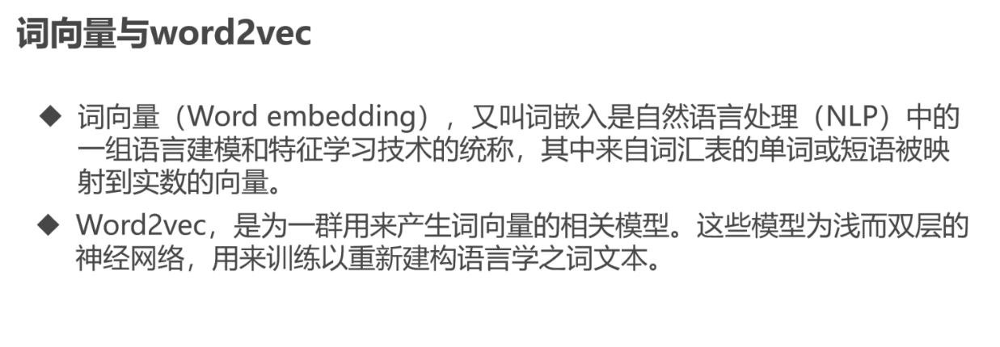

# NLP 与聊天机器人（⚠️ 已过时，仅作存档）

> ## ⛔ 重要提示：本技术应用场景已大幅收窄
>
> **最后更新于**：2026-07
> **原因**：
> - 传统 NLP（贝叶斯分类、HMM、CRF 分词、word2vec）已被 **LLM 全面替代**
> - 聊天机器人 = 现在直接调 GPT/Claude/Qwen API，自己搭是 2018 年的玩法
> - TensorFlow 1.x 已过时（TF 2.x + Keras 才是现在）
> - 但 **NLP 底层思想**（语言模型、词向量、序列建模）仍然重要，**作为知识值得存档**
>
> ## 🔄 推荐替代技术
>
> | 旧场景 | 推荐替代 | 迁移要点 |
> |---|---|---|
> | 中文分词（jieba） | LLM prompt | "请把这句话按词切分" |
> | 文本分类（贝叶斯） | Embedding + 零样本分类 | BGE / Qwen Embedding |
> | NER（命名实体识别） | LLM NER 抽取 | 1 个 prompt 解决 80% 场景 |
> | 词向量（word2vec） | BGE / M3E / Qwen Embedding | 上下文感知，效果更好 |
> | 聊天机器人 | GPT-4 / Claude / Qwen API | 不用自己训练 |
> | 传统 RNN/LSTM | Transformer / LLM | 序列建模主流已变 |
> | TensorFlow 1.x | PyTorch / TF 2.x + Keras | TF 1.x 静态图已淘汰 |
>
> ## 📖 最新技术速览（2026 版）
>
> 2026 年，NLP 主流是 **LLM + RAG + Agent** 路线：
>
> ```
> Embedding 模型（BGE / M3E / Qwen）
>   ↓
> 向量数据库（Milvus / Qdrant / pgvector）
>   ↓
> LLM（GPT-4 / Claude / Qwen / DeepSeek）
>   ↓
> Agent 编排（LangGraph / LangChain / 自建）
> ```
>
> **传统 NLP 已不是求职热点**，但作为知识基础仍值得学（因为 LLM 的很多思想来自这里）。

---

# 以下为原内容存档

> 原文来自 `docs/md/NLP/聊天机器人.docx`（11MB），用 pandoc 转 md 并提取 74 张图。
> 全部原文件 + 74 张图归档到 `md/archive/old-nlp-notes/`。
> 主线文档仅精选 6 张关键图。

## 一、TensorFlow 1.x 入门

> 📷 TF 计算图模型：
> 

### 1.1 三要素：张量、图、会话

```python
import tensorflow as tf

# 1. 定义张量（数据）
a = tf.constant(2)
b = tf.constant(3)

# 2. 定义图（计算关系）
c = a + b

# 3. 在会话中执行
with tf.Session() as sess:
    result = sess.run(c)
    print(result)  # 5
```

> ⚠️ **改正**：原文用 `tf.Session()` 是 TF 1.x 写法。**TF 2.x 默认 Eager Execution，不再需要 Session**：
> ```python
> # TF 2.x
> import tensorflow as tf
> a = tf.constant(2)
> b = tf.constant(3)
> print(a + b)  # tf.Tensor(5, shape=(), dtype=int32)
> ```

### 1.2 训练原理

> 📷 TF 训练流程：
> 

## 二、神经网络基础

### 2.1 三类网络对应场景

| 网络类型 | 适用 |
|---|---|
| **CNN**（卷积） | 图片处理 |
| **RNN**（循环） | 自然语言 / 序列数据 |
| **LSTM**（长短期记忆） | 时间跨度长的预测 |

### 2.2 梯度消失与爆炸

> 📷 梯度问题示意：
> 

**原因**：RNN 反向传播时梯度要经过很多步相乘，远距离梯度容易消失/爆炸。

**解决**：
- LSTM 的门控机制（输入门、遗忘门、输出门）
- GRU（简化版 LSTM）
- 残差连接
- 梯度裁剪

> 📷 LSTM 单元结构：
> 

## 三、NLP 基础概念

### 3.1 什么是 NLP

> 📷 NLP 任务全景：
> 

NLP 任务包括：分词、词性标注、命名实体识别、情感分析、文本分类、机器翻译、问答系统、聊天机器人等。

### 3.2 语料与处理

- **语料库**：结构化文本集合
- **语料获取**：公开数据集 / 爬虫 / 业务日志
- **语料处理**：分词、去停用词、标准化

```bash
# 原文 pip 安装命令
pip install -i https://pypi.doubanio.com/simple jieba
pip install -i https://pypi.doubanio.com/simple sklearn
pip install -i https://pypi.doubanio.com/simple scipy
```

> 💡 `doubanio.com` 镜像现在用 `pypi.doubanio.com` 或 `https://pypi.tuna.tsinghua.edu.cn/simple`（清华镜像）。

## 四、传统 NLP 算法（已过时）

### 4.1 贝叶斯分类

> 📷 贝叶斯网络示意：
> 

朴素贝叶斯：基于特征条件独立假设的分类器。简单但对文本分类有效。

### 4.2 马尔科夫模型（HMM）

> 📷 HMM 状态转移：
> 

HMM = 隐马尔科夫模型，用于序列标注（分词、词性标注、NER）。

> ⚠️ **全部过时**：贝叶斯 + HMM + CRF 这些传统算法已被 BERT / LLM 完全替代。除非做研究，**不建议新项目用**。

## 五、词向量与 word2vec

> 📷 CBOW 和 Skip-gram：
> 

### 5.1 word2vec 两种模型

| 模型 | 思路 | 适用 |
|---|---|---|
| **CBOW** | 用上下文预测中心词 | 小数据集 |
| **Skip-gram** | 用中心词预测上下文 | 大数据集，罕见词效果好 |

> ⚠️ **过时**：word2vec 是 2013 年的技术。现在用 **预训练 Embedding**（BGE / M3E / Qwen Embedding），直接调用 API，效果远超自己训练。

## 六、聊天机器人实战（原文）

> 📷 聊天机器人架构（原文截图）：
> 

### 6.1 原文实战方案（2018 风格）

```bash
# 安装依赖
pip install -i https://pypi.doubanio.com/simple tqdm
pip install jieba
pip install sklearn
pip install tensorflow==1.x  # 原文用 1.x
```

+ 自己训 word2vec
+ 自己写分类器
+ 自己搭对话管理

### 6.2 2026 年怎么搭聊天机器人

```python
# 直接调 LLM API
import openai

response = openai.chat.completions.create(
    model="gpt-4",
    messages=[
        {"role": "system", "content": "你是一个友好的助手"},
        {"role": "user", "content": "你好"}
    ]
)
print(response.choices[0].message.content)
```

**对比**：
| 维度 | 2018 风格 | 2026 风格 |
|---|---|---|
| 训练数据 | 自己准备 | LLM 预训练 |
| 训练成本 | GPU + 数天 | 0（调 API） |
| 效果 | 看场景 | 通用强 |
| 可控性 | 高 | 中（prompt 工程） |
| 维护 | 重 | 轻 |

---

## 📚 关键 takeaway

- **传统 NLP 整套思路**（分词→词向量→分类→对话）现在被 LLM 一行 API 替代
- **作为知识值得存档**：LSTM、word2vec、注意力机制的原理是 LLM 的基础
- **2026 学习建议**：
  - 想做应用 → 学 LLM API + RAG + Agent
  - 想搞研究 → 读 Transformer 论文 + 预训练原理
  - 不建议：从 word2vec / TF 1.x / 朴素贝叶斯开始
