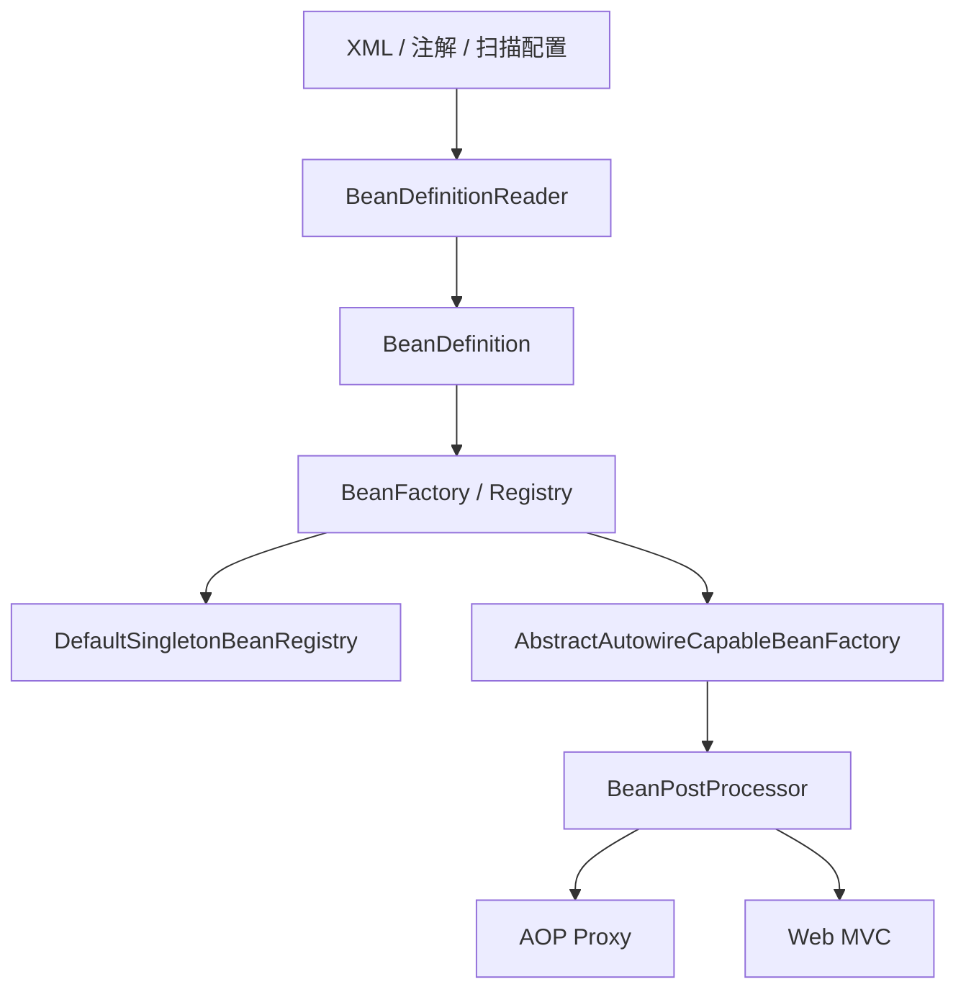
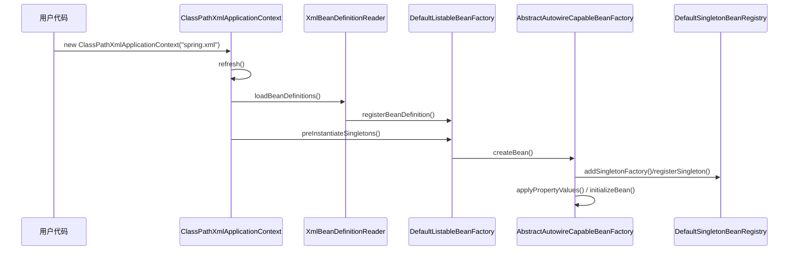

# 手写 Spring：架构总览

> **原文归档**：[old-spring-notes](/md/archive/README?id=old-spring-notes)
> **参考实现**：[wychmod/mini-spring](https://github.com/wychmod/mini-spring)
> **系列定位**：先把 Spring 的核心容器跑通，再逐步补 DI、生命周期、AOP、MVC。
> **阅读建议**：先看整体分层，再看启动链路，最后看后续章节顺序。

---

## 一、这套系列要做什么

这个系列不是照着 Spring 抄 API，而是先把 Spring 为什么能“装配对象”讲明白，再一步步把它做出来。

你最后要得到的是一套能跑的迷你 Spring：

- 能从 XML 读出 Bean 配置
- 能把 BeanDefinition 放进容器
- 能创建单例对象并处理依赖注入
- 能走完初始化、后置处理、销毁流程
- 能在后面继续接上 AOP 和 MVC

> 💡 补充：Spring 官方文档把 `BeanFactory`、`ApplicationContext`、`BeanDefinition` 放在核心容器里讲。我们复刻时也按这个边界拆，不先碰 Boot。

---

## 二、先看两条实现线

| 线 | 目标 | 适合做什么 |
|---|---|---|
| `mini-spring-original` | 300 行左右跑通最小闭环 | 先把 IoC / DI / MVC 的感觉跑出来 |
| `mini-spring-iteration` | 按 Spring 源码风格重做 | 作为本系列主线，方便理解真实 Spring 分层 |

本系列正文以 `iteration` 为主，`original` 只拿来对照“最小闭环”。

```text
mini-spring/
├── mini-spring-original/   # 先跑通
└── mini-spring-iteration/  # 按源码风格复刻
```

---

## 三、核心架构图



再看一次启动链路：



---

## 四、每一层分别干什么

| 层 | 职责 | 你的实现类 |
|---|---|---|
| 配置读取层 | 从 XML 或扫描结果里拿到 Bean 元数据 | `XmlBeanDefinitionReader`、`ClassPathBeanDefinitionScanner` |
| 容器注册层 | 存 `BeanDefinition`，管理单例缓存 | `DefaultListableBeanFactory`、`DefaultSingletonBeanRegistry` |
| 实例化层 | 创建对象、填充属性、执行初始化 | `AbstractAutowireCapableBeanFactory` |
| 上下文层 | 统一编排 refresh 流程 | `AbstractApplicationContext`、`ClassPathXmlApplicationContext` |
| 扩展层 | Aware、PostProcessor、ConversionService、事件 | `ApplicationContextAwareProcessor`、`AutowiredAnnotationBeanPostProcessor` |
| 增强层 | 代理和切面 | `ProxyFactory`、`JdkDynamicAopProxy`、`Cglib2AopProxy` |
| Web 层 | 请求分发和视图渲染 | `DispatchServlet`、`HandlerMapping`、`HandlerAdapter`、`ViewResolver` |

---

## 五、从 0 复刻时，先盯住这条主线

1. `ClassPathXmlApplicationContext` 接收配置入口。
2. `refresh()` 触发容器刷新。
3. `XmlBeanDefinitionReader` 读取 XML。
4. `DefaultListableBeanFactory` 注册 `BeanDefinition`。
5. `preInstantiateSingletons()` 预实例化单例。
6. `AbstractBeanFactory` 负责 `doGetBean()`。
7. `AbstractAutowireCapableBeanFactory` 负责真正创建对象。
8. `DefaultSingletonBeanRegistry` 负责单例池和早期引用。
9. `BeanPostProcessor` 负责初始化前后扩展。
10. `registerSingleton()` 完成最终落库。

> 💡 补充：循环依赖能不能救回来，关键看“对象半成品”何时提前暴露。你的实现里就在 `DefaultSingletonBeanRegistry` 里放了三级缓存，这个点后面单独讲。

> 实现注意：`mini-spring-iteration` 当前的 `preInstantiateSingletons()` 是直接遍历所有 `BeanDefinition` 调 `getBean()`。本文按 Spring 语义称为“预实例化单例”，你从 0 复刻时建议补上 `beanDefinition.isSingleton()` 判断，避免 prototype 在启动阶段被提前创建。

---

## 六、后面怎么排章节

| 章 | 主题 | 目标 |
|---|---|---|
| 00 | 架构总览 | 先认路 |
| 01 | BeanDefinition 与容器启动 | 把配置变成元数据 |
| 02 | 单例池与循环依赖 | 把对象真正造出来 |
| 03 | 依赖注入与类型转换 | 把字段引用和基础值填进去 |
| 04 | 注解扫描与自动装配 | 把注解变成容器规则 |
| 05 | 生命周期与扩展点 | 让对象能初始化、能销毁 |
| 06 | 后置处理器与 FactoryBean | 把扩展口子接进容器 |
| 07 | AOP | 让方法增强可插拔 |
| 08 | MVC | 让 HTTP 请求进入容器 |
| 09 | 从 0 复刻清单 | 按包结构和验收点落地 |

你可以把它理解成一句话：

> 先把“容器怎么知道有哪些 bean”讲清楚，再讲“容器怎么把 bean 做出来”，最后才是“怎么增强 bean、怎么接 HTTP”。

---

## 七、归档资料怎么读

- [1-300行手写简易Spring.md](/md/archive/old-spring-notes/1-300行手写简易Spring.md) - 最小闭环
- [2-手写完整功能Spring.md](/md/archive/old-spring-notes/2-手写完整功能Spring.md) - 完整功能版
- [3-Spring源码解析.md](/md/archive/old-spring-notes/3-Spring源码解析.md) - 类图和流程
- [4-Spring事务传播原理及数据库事务操作原理.md](/md/archive/old-spring-notes/4-Spring事务传播原理及数据库事务操作原理.md) - 后续事务扩展

---

## 📚 完整资料

- [归档来源地图](/md/archive/README?id=old-spring-notes)
- [mini-spring 参考实现](https://github.com/wychmod/mini-spring)
- [Spring Framework 官方文档](https://docs.spring.io/spring-framework/reference/core/beans.html)

---

## 最新修改记录

| 日期 | 类型 | 说明 |
|---|---|---|
| 2026-08-27 | 新增 | 新建“项目实战 / 手写 Spring”系列入口，首篇先给出容器、BeanDefinition、单例池、生命周期、AOP、MVC 的全局架构与复刻路线 |
| 2026-08-27 | 订正 | 将依赖注入章节目标收敛为字段引用和基础值，避免暗示当前实现已完整覆盖 setter 注入 |
| 2026-08-27 | 订正 | 补充预实例化阶段的 scope 边界，说明当前 iteration 实现会遍历所有 BeanDefinition |

> 📚 完整历史修改记录见 [修改记录归档](/_meta/CHANGELOG_HISTORY.md)。
