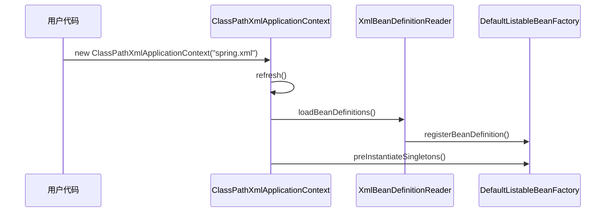

# 手写 Spring：BeanDefinition 与容器启动

> **原文归档**：[old-spring-notes](/md/archive/README?id=old-spring-notes)
> **参考实现**：[wychmod/mini-spring](https://github.com/wychmod/mini-spring)
> **本章目标**：把“配置文件 -> BeanDefinition -> 注册到容器 -> 预实例化单例”这条最小链路跑通。

---

## 一、先认清 BeanDefinition

BeanDefinition 是 bean 的说明书，不是 bean 本体。
它告诉容器：这个对象是谁、用什么类创建、是不是单例、初始化和销毁时要做什么、还有哪些属性需要补。

| 角色 | 保存什么 | 是否是真正对象 |
|---|---|---|
| BeanDefinition | 类名、作用域、属性、init/destroy 方法 | 否 |
| Bean | 运行时实例 | 是 |

在你的 `mini-spring` 里，`BeanDefinition` 至少保存 `beanClass`、`propertyValues`、`initMethodName`、`destroyMethodName` 和 `scope`。默认作用域是 `singleton`。

> 💡 补充：这一层的价值在于先保存“说明书”，再决定什么时候创建对象、怎么初始化对象。Spring 的扩展能力，第一步就来自这里。

## 二、容器启动到底做了什么

你可以把启动入口记成一条直线：

```text
new ClassPathXmlApplicationContext(...)
-> refresh()
-> refreshBeanFactory()
-> loadBeanDefinitions()
-> registerBeanDefinition()
-> preInstantiateSingletons()
```

对应到你的实现里：

| 组件 | 作用 |
|---|---|
| `ClassPathXmlApplicationContext` | 启动入口，构造时直接 `refresh()` |
| `AbstractApplicationContext` | 统一执行刷新流程 |
| `XmlBeanDefinitionReader` | 读取 XML，解析出 BeanDefinition |
| `DefaultListableBeanFactory` | 保存和管理 BeanDefinition |
| `preInstantiateSingletons()` | 启动末尾触发预创建，语义上应只针对单例 bean |



## 三、XML 读取器负责两件事

`XmlBeanDefinitionReader` 的工作很朴素：

1. 解析 `<bean>`，把标签内容转成 BeanDefinition。
2. 解析 `<component-scan>`，把扫描到的类也注册进容器。

| 输入 | 输出 |
|---|---|
| `<bean id="xxx" class="...">` | 一个 BeanDefinition |
| `<component-scan base-package="...">` | 一批 BeanDefinition |

你的实现里，解析完后会调用 `getRegistry().registerBeanDefinition(beanName, beanDefinition)`。
这一步很关键，因为容器真正“记住”一个 bean，不是靠 new，而是靠注册描述信息。

> 💡 补充：最小版本可以先只支持 `<bean>`。等你把主链路跑通，再加 `component-scan`，理解会更稳。

## 四、容器为什么要有注册表

`DefaultListableBeanFactory` 同时承担两件事：

1. 保存 BeanDefinition。
2. 提供按名称、按类型查找 bean 的能力。

```java
private Map<String, BeanDefinition> beanDefinitionMap = new ConcurrentHashMap<>();

public void registerBeanDefinition(String beanName, BeanDefinition beanDefinition) {
    beanDefinitionMap.put(beanName, beanDefinition);
}

public void preInstantiateSingletons() {
    beanDefinitionMap.keySet().forEach(this::getBean);
}
```

这段逻辑的意思很简单：
先把说明书都放进来，再在启动时把需要提前创建的对象造出来。

> 实现注意：你当前的 iteration 版这里是 `beanDefinitionMap.keySet().forEach(this::getBean)`，会把所有定义都触发一遍。真实语义上 `preInstantiateSingletons()` 应该只预创建非懒加载单例；从 0 复刻时建议加 `beanDefinition.isSingleton()` 判断，避免 prototype 在启动时被提前创建。

| 方法 | 作用 |
|---|---|
| `registerBeanDefinition` | 注册 bean 描述 |
| `containsBeanDefinition` | 判断容器里有没有这个定义 |
| `getBeanDefinitionNames` | 返回所有 bean 名称 |
| `preInstantiateSingletons` | 预创建所有单例 bean；当前实现还需要补 scope 过滤 |

## 五、从 0 复刻时的最小实现

如果你要自己从零写一版，顺序可以很简单：

1. 先写 `BeanDefinition`，只保留类名和属性。
2. 再写 `BeanDefinitionRegistry`，定义注册和查询接口。
3. 再写 `DefaultListableBeanFactory`，用 `Map` 存定义。
4. 再写 `XmlBeanDefinitionReader`，把 XML 变成定义。
5. 最后写 `ClassPathXmlApplicationContext`，让它在构造时触发 `refresh()`。

一个足够小的骨架长这样：

```java
public class ClassPathXmlApplicationContext {
    public ClassPathXmlApplicationContext(String configLocation) {
        refresh(configLocation);
    }
}
```

```java
public class DefaultListableBeanFactory {
    private final Map<String, BeanDefinition> beanDefinitionMap = new ConcurrentHashMap<>();
}
```

这一步做完，你的容器已经能完成两件事：

- 读取配置。
- 记住有哪些 bean。

真正的对象创建和依赖注入，还在下一章。

## 六、这一章写完后，你已经拥有了什么

你已经有了一个最小可用的容器启动链路：

- 能从 XML 读到 bean 配置。
- 能把配置变成 BeanDefinition。
- 能把 BeanDefinition 放进工厂。
- 能理解启动时预创建单例对象的入口，复刻时要注意 scope 过滤。

这就是手写 Spring 的第一块地基。
没有这块地基，后面的单例池、依赖注入、生命周期、AOP 都接不住。

## 七、下一章预告

下一章开始写最关键的部分：**单例池与循环依赖**。
你会看到 Spring 为什么不只是 `new` 一下对象，而是要先放缓存、再暴露半成品、最后补完整。

---

## 📚 完整资料

- [归档来源地图](/md/archive/README?id=old-spring-notes)
- [mini-spring 参考实现](https://github.com/wychmod/mini-spring)
- [Spring Framework 官方文档](https://docs.spring.io/spring-framework/reference/core/beans.html)

---

## 修改记录

| 日期 | 类型 | 说明 |
|---|---|---|
| 2026-08-27 | 新增 | 补写“BeanDefinition 与容器启动”，把配置读取、定义注册、预实例化单例这条最小链路讲清楚 |
| 2026-08-27 | 订正 | 补充 `preInstantiateSingletons()` 当前遍历全部定义的实现边界，并建议复刻时按 singleton 过滤 |
