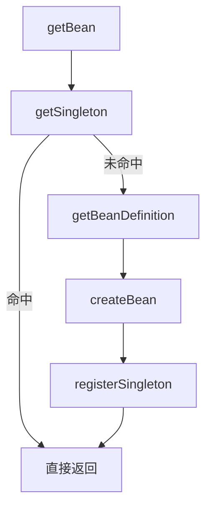

# 手写 Spring：单例池与循环依赖

> **原文归档**：[old-spring-notes](/md/archive/README?id=old-spring-notes)
> **参考实现**：[wychmod/mini-spring](https://github.com/wychmod/mini-spring)
> **本章目标**：讲清 `getBean` 为什么不只是 `new`，以及三级缓存怎样把循环依赖救回来。

---

## 一、为什么还要单例池

如果容器里同一个 bean 每次 `getBean()` 都重新创建，那它就不是 Spring 的单例语义了。
所以容器需要一个地方，把已经创建过的对象先存起来，下次直接拿。

| 目标 | 做法 |
|---|---|
| 同一个 bean 只创建一次 | 放进单例池 |
| 先拿缓存，再决定要不要创建 | `getSingleton()` 先查缓存 |
| 创建完成后统一登记 | `registerSingleton()` |

在你的实现里，单例池不是一个 map 而已，而是三层缓存。

> 💡 补充：单例池不只是“省一次 new”。它还承担了早期暴露对象的职责，这才是解决循环依赖的关键。

## 二、先看 getBean 的主链路

`AbstractBeanFactory.doGetBean()` 的思路很直接：

1. 先查单例缓存。
2. 缓存里没有，就去拿 BeanDefinition。
3. 根据定义创建 bean。
4. 返回最终对象。

| 方法 | 作用 |
|---|---|
| `doGetBean` | 统一入口 |
| `getSingleton` | 先查缓存 |
| `getBeanDefinition` | 找 bean 的说明书 |
| `createBean` | 真正创建对象 |



## 三、三层缓存分别管什么

你现在的 `DefaultSingletonBeanRegistry` 里有三张表：

```java
private Map<String, Object> singletonObjects = new HashMap<>();
protected final Map<String, Object> earlySingletonObjects = new HashMap<>();
private final Map<String, ObjectFactory<?>> singletonFactories = new HashMap<>();
```

| 缓存 | 放什么 | 什么时候用 |
|---|---|---|
| 一级缓存 `singletonObjects` | 成品对象 | bean 已经创建完成 |
| 二级缓存 `earlySingletonObjects` | 早期引用 | 对象已实例化，但还没完全初始化 |
| 三级缓存 `singletonFactories` | 对象工厂 | 需要提前暴露引用时 |

真正的取值顺序也是固定的：

1. 先找一级缓存。
2. 再找二级缓存。
3. 再找三级缓存里的工厂。

如果三级缓存命中，工厂会先生成一个早期引用，再把它放到二级缓存里。

> 💡 补充：早期引用不一定永远是代理对象。没有 AOP 时，它可能就是原对象；有 AOP 时，它可能是代理对象。

## 四、创建顺序不能乱

`AbstractAutowireCapableBeanFactory#doCreateBean()` 的顺序很重要：

1. 先实例化对象。
2. 立刻把“能返回早期引用的工厂”放进三级缓存。
3. 再填充属性。
4. 再执行初始化。
5. 最后注册成一级缓存里的成品对象。

```java
Object exposedObject = createBeanInstance(beanDefinition, beanName, args);

if (beanDefinition.isSingleton()) {
    addSingletonFactory(beanName, () -> getEarlyBeanReference(beanName, beanDefinition, exposedObject));
}

applyPropertyValues(beanName, exposedObject, beanDefinition);
exposedObject = initializeBean(beanName, exposedObject, beanDefinition);

if (beanDefinition.isSingleton()) {
    Object earlySingletonReference = getSingleton(beanName);
    if (earlySingletonReference != null) {
        exposedObject = earlySingletonReference;
    }
    registerSingleton(beanName, exposedObject);
}
```

这段顺序不能乱。
因为循环依赖要靠“对象先出来，再补属性”这件事来解。

这里还有一个容易漏的点：如果 AOP 在早期暴露阶段已经创建过代理，最终登记进一级缓存的应该是那个早期代理引用，而不是初始化后的原始对象。这样才能保证“别人注入到的对象”和“最后从容器拿到的对象”是同一个语义对象。

## 五、A 依赖 B，B 又依赖 A

假设有两个类：

- `A` 里有 `B b`
- `B` 里有 `A a`

流程是这样的：

1. 容器开始创建 `A`。
2. `A` 先被实例化，马上放出早期引用入口。
3. 容器给 `A` 填充属性，发现需要 `B`。
4. 容器开始创建 `B`。
5. `B` 先被实例化，马上放出早期引用入口。
6. 容器给 `B` 填充属性，发现需要 `A`。
7. 这时容器能从缓存里拿到 `A` 的早期引用，`B` 继续完成。
8. `B` 完成后回到 `A`，`A` 也继续完成。

| 情况 | 能否靠这套机制解决 |
|---|---|
| setter / field 注入导致的循环依赖 | 能 |
| 构造器互相依赖 | 通常不行 |
| prototype 相互依赖 | 不能像单例那样自动兜住 |

这也是为什么 Spring 讲循环依赖时，重点总是放在“早期暴露对象”上，而不是单纯的递归调用。

## 六、三级缓存为什么还要存在

很多人一开始会问：既然二级缓存已经能存早期对象，为什么还要三级缓存？

答案很简单：

1. 三级缓存存的是“生成早期引用的工厂”。
2. 只有真的有人来要早期对象时，才去生成。
3. 这一步给 AOP 留了口子。

也就是说，三级缓存不是多余的复制品，它是一个延迟生产点。
Spring 要的是“先把对象的入口留出来”，不是“提前把所有代理都造好”。

## 七、从 0 复刻时怎么写

如果你自己写一版，最少要有这三个东西：

1. `DefaultSingletonBeanRegistry`，负责三个缓存。
2. `AbstractBeanFactory#doGetBean()`，负责先查缓存再创建。
3. `AbstractAutowireCapableBeanFactory#doCreateBean()`，负责实例化、暴露、填充、初始化、登记。

一个最小版的缓存骨架就是这样：

```java
public class DefaultSingletonBeanRegistry {
    private final Map<String, Object> singletonObjects = new HashMap<>();
    private final Map<String, Object> earlySingletonObjects = new HashMap<>();
    private final Map<String, ObjectFactory<?>> singletonFactories = new HashMap<>();
}
```

一个最小版的创建顺序就是这样：

```java
Object bean = createBeanInstance(...);
addSingletonFactory(...);
applyPropertyValues(...);
initializeBean(...);
registerSingleton(...);
```

只要这条线跑顺了，后面的依赖注入和 AOP 都能继续往下接。

## 八、下一章预告

下一章开始写 **依赖注入与属性填充**。
到那时，你会真正看到 BeanDefinition 里的属性值，怎么一步步被写进对象里。

---

## 📚 完整资料

- [归档来源地图](/md/archive/README?id=old-spring-notes)
- [mini-spring 参考实现](https://github.com/wychmod/mini-spring)
- [Spring Framework 官方文档](https://docs.spring.io/spring-framework/reference/core/beans.html)

---

## 修改记录

| 日期 | 类型 | 说明 |
|---|---|---|
| 2026-08-27 | 新增 | 补写“单例池与循环依赖”，把三级缓存、早期暴露和创建顺序讲清楚 |
| 2026-08-27 | 订正 | 修正 `doCreateBean()` 示例，补上早期代理引用回填到一级缓存的关键步骤 |
