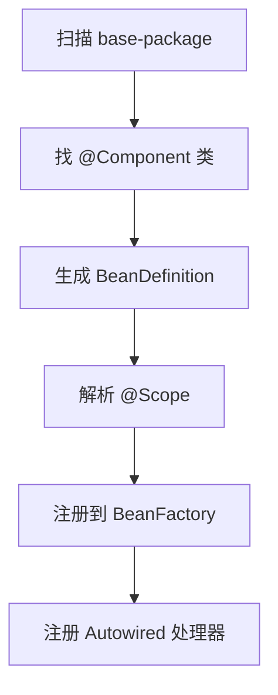

# 手写 Spring：注解扫描与自动装配

> **原文归档**：[old-spring-notes](/md/archive/README?id=old-spring-notes)
> **参考实现**：[wychmod/mini-spring](https://github.com/wychmod/mini-spring)
> **本章目标**：把 `@Component`、`@Autowired`、`@Value` 变成容器规则，而不是手写 XML。

---

## 一、为什么要有扫描

XML 能把 bean 写出来，但一多就很重。
扫描的价值，是让“哪些类要交给容器管理”这件事，直接写在类上。

| 方式 | 入口 | 适合场景 |
|---|---|---|
| XML 注册 | `<bean>` | 显式配置，结构清楚 |
| 注解扫描 | `@Component` | 代码驱动，少写配置 |

在你的实现里，`ClassPathBeanDefinitionScanner` 会扫描包下标了 `@Component` 的类，并把它们转成 `BeanDefinition` 注册进去。

## 二、扫描器怎么工作

扫描器分两层：

1. `ClassPathScanningCandidateComponentProvider` 负责找候选类。
2. `ClassPathBeanDefinitionScanner` 负责给候选类起名、设置作用域、注册到容器。

## 三、自动装配是怎么进来的

真正处理 `@Autowired` 和 `@Value` 的，是 `AutowiredAnnotationBeanPostProcessor`。
它实现了 `InstantiationAwareBeanPostProcessor`，所以能插到属性填充之前。

| 注解 | 作用 | 处理时机 |
|---|---|---|
| `@Autowired` | 注入 bean 引用 | 属性填充阶段 |
| `@Value` | 注入配置值 | 属性填充阶段 |
| `@Qualifier` | 指定具体 bean 名 | `@Autowired` 的补充信息 |

在 `postProcessPropertyValues()` 里，它会：

1. 先处理 `@Value`，从字符串占位符里拿真实值。
2. 再处理 `@Autowired`，默认按类型取 bean；有 `@Qualifier` 时按名字取 bean。
3. 最后把值写回字段。

当前 `@Value` 是解析后直接写字段，不像 XML `PropertyValues` 那样显式经过 `applyPropertyValues()` 的 `ConversionService` 分支。如果你要支持 `@Value` 注入 `int`、`long` 这类字段，建议在 `AutowiredAnnotationBeanPostProcessor` 里补目标字段类型转换。

## 四、占位符为什么要单独处理

`PropertyPlaceholderConfigurer` 负责把 `${...}` 这种字符串，替换成真正的属性值。
它做完两件事：

1. 扫描所有 `BeanDefinition` 的属性值，替换 XML 里的占位符。
2. 往工厂里塞一个字符串解析器，给 `@Value` 复用。

| 输入 | 输出 |
|---|---|
| `${db.username}` | 配置文件里的真实值 |
| `@Value("${server.port}")` | 注解字段值 |

这就让 XML 和注解至少共用同一个占位符解析入口。类型转换是否统一，还要看各自的注入路径有没有接上 `ConversionService`。

> 💡 补充：占位符处理最好放在 bean 实例化之前。否则字段和属性已经填完，再替换就晚了。

## 五、自动装配的实际顺序

你这版的顺序可以记成：

1. 扫描出候选类。
2. 注册 `BeanDefinition`。
3. 注册 `AutowiredAnnotationBeanPostProcessor`。
4. 进入 bean 创建流程。
5. 在属性填充前处理 `@Value` 和 `@Autowired`。

这意味着自动装配不是独立系统，它就是 bean 生命周期中的一个拦截点。

## 六、从 0 复刻时怎么写

最小实现可以这样拆：

1. 定义 `@Component`、`@Scope`、`@Autowired`、`@Value`、`@Qualifier`。
2. 写一个包扫描器。
3. 扫到类后转成 `BeanDefinition`。
4. 写一个 `BeanPostProcessor` 去处理字段注入。
5. 用占位符解析器补上配置读取。

这一步做完，你的容器就不只是“XML 容器”，而是开始像真正的 Spring 了。

## 七、下一章预告

下一章写 **生命周期、Aware、初始化和销毁**。
那时候你会看到 bean 不是“创建完就完了”，还要经历一整套回调。

---

## 📚 完整资料

- [归档来源地图](/md/archive/README?id=old-spring-notes)
- [mini-spring 参考实现](https://github.com/wychmod/mini-spring)
- [Spring Framework 官方文档](https://docs.spring.io/spring-framework/reference/core/beans/annotation-config.html)

---

## 修改记录

| 日期 | 类型 | 说明 |
|---|---|---|
| 2026-08-27 | 新增 | 补写“注解扫描与自动装配”，把扫描、`@Autowired`、`@Value` 和占位符统一起来 |
| 2026-08-27 | 订正 | 补充 `@Value` 与 XML 属性填充在类型转换路径上的差异，避免误读为完全同一路径 |
