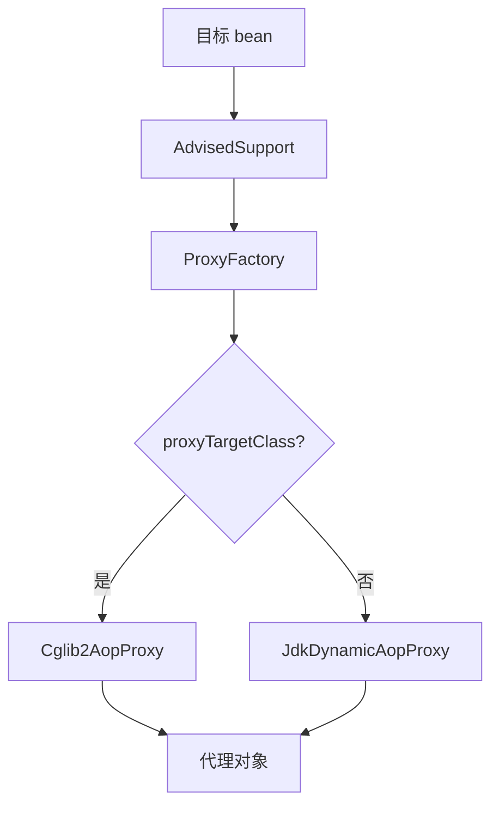

# 手写 Spring：AOP 与代理

> **原文归档**：[old-spring-notes](/md/archive/README?id=old-spring-notes)
> **参考实现**：[wychmod/mini-spring](https://github.com/wychmod/mini-spring)
> **本章目标**：把“方法增强为什么能插进去”讲明白。

---

## 一、AOP 解决什么问题

当很多类里都有相同的横切逻辑时，比如日志、事务、权限，就不该散着写。
AOP 的目标，就是把这些公共逻辑从业务代码里拆出去。

| 业务代码 | 横切逻辑 |
|---|---|
| `UserService` | 日志、事务 |
| `OrderService` | 日志、权限 |

## 二、代理是 AOP 的执行方式

在你的实现里，真正做增强的是代理对象，而不是目标对象本身。
创建代理的入口是 `ProxyFactory`，它根据配置选择：

| 方式 | 适用场景 |
|---|---|
| JDK 动态代理 | 目标类有接口 |
| CGLIB | 目标类没接口或想直接代理类 |

实现注意：手动使用 `ProxyFactory` 时，确实可以由 `proxyTargetClass` 决定走 JDK 还是 CGLIB。当前自动代理路径里的 `DefaultAdvisorAutoProxyCreator` 会直接 `setProxyTargetClass(true)`，所以自动 AOP 默认走 CGLIB。

## 三、JDK 动态代理怎么走

`JdkDynamicAopProxy` 实现了 `InvocationHandler`。
每次调用代理方法时，都会先判断这个方法是否匹配切点，再决定要不要织入通知。

| 步骤 | 说明 |
|---|---|
| 1 | 创建 `Proxy.newProxyInstance(...)` |
| 2 | 进入 `invoke()` |
| 3 | 匹配方法 |
| 4 | 有匹配就走 `MethodInterceptor` |
| 5 | 没匹配就直接调用目标方法 |

## 四、CGLIB 怎么走

`Cglib2AopProxy` 通过继承目标类生成子类代理。
它更适合类代理场景。

| 方式 | 核心点 |
|---|---|
| JDK | 基于接口 |
| CGLIB | 基于继承 |

你的代码里还会判断是不是已经是 CGLIB 代理类，避免重复包装。

## 五、自动代理创建器做了什么

`DefaultAdvisorAutoProxyCreator` 是把 AOP 真正接进容器的关键。
它会在 bean 初始化后决定要不要包装代理。

| 处理点 | 作用 |
|---|---|
| `postProcessAfterInitialization` | 判断是否需要代理 |
| `wrapIfNecessary` | 找到匹配的 advisor |
| `getEarlyBeanReference` | 提前暴露代理引用，配合循环依赖 |

这也是为什么 AOP 和三级缓存能发生关系。
提前暴露时如果需要代理，就能先把代理引用放出去。

> 💡 补充：AOP 真正难的点，不是“能不能代理”，而是“代理对象什么时候出现才不会破坏单例和循环依赖”。

## 六、从 0 复刻时怎么写

最小版可以拆成五步：

1. 定义切点、通知、目标源。
2. 写 `AdvisedSupport` 保存配置。
3. 写 `ProxyFactory`。
4. 写 JDK 和 CGLIB 两种代理实现。
5. 写自动代理创建器，接进 bean 生命周期。

这章写完，你就有了 Spring 最标志性的“方法增强能力”。

## 七、下一章预告

下一章写 **MVC 请求分发**。
那是容器外部世界进入 Spring 的最后一块拼图。

---

## 📚 完整资料

- [归档来源地图](/md/archive/README?id=old-spring-notes)
- [mini-spring 参考实现](https://github.com/wychmod/mini-spring)
- [Spring Framework 官方文档](https://docs.spring.io/spring-framework/reference/core/aop-api.html)

---

## 最新修改记录

| 日期 | 类型 | 说明 |
|---|---|---|
| 2026-08-27 | 新增 | 补写“AOP 与代理”，把 JDK / CGLIB 和自动代理创建串起来 |
| 2026-08-27 | 订正 | 补充自动代理创建器默认强制 CGLIB 的实现细节，避免把手动 ProxyFactory 策略误读成自动 AOP 策略 |

> 📚 完整历史修改记录见 [修改记录归档](/_meta/CHANGELOG_HISTORY.md)。
