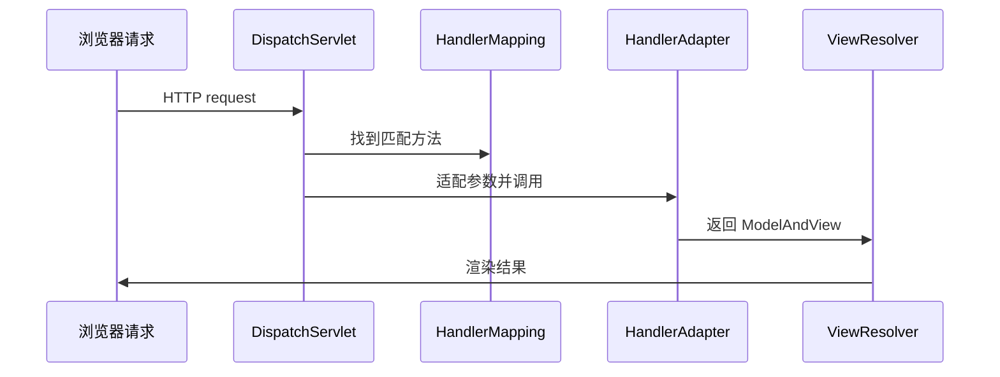

# 手写 Spring：MVC 请求分发

> **原文归档**：[old-spring-notes](/md/archive/README?id=old-spring-notes)
> **参考实现**：[wychmod/mini-spring](https://github.com/wychmod/mini-spring)
> **本章目标**：把 HTTP 请求怎么进容器、怎么找方法、怎么渲染结果讲清楚。

---

## 一、MVC 要解决什么

Web 层的任务很固定：

1. 把请求 URL 找到对应方法。
2. 把请求参数转换成方法参数。
3. 调用控制器方法。
4. 把返回结果渲染出去。

| 组件 | 作用 |
|---|---|
| `DispatchServlet` | 总入口 |
| `HandlerMapping` | URL 到方法的映射 |
| `HandlerAdapter` | 参数适配 |
| `ModelAndView` | 结果封装 |
| `ViewResolver` | 视图解析和渲染 |

## 二、请求进来后怎么走

你原始版 `DispatchServlet` 的主流程很清楚：

本章基于 `mini-spring-original` 的 MVC 最小闭环，不是 `mini-spring-iteration` 当前主线里已经完全合并好的模块。复刻时可以先把它作为独立 Web 层接到容器外侧，等 IoC 主线稳定后再考虑统一包结构。

1. `init()` 时创建 `ApplicationContext`。
2. 初始化九大组件。
3. `doDispatch()` 根据 URL 找 `HandlerMapping`。
4. 用 `HandlerAdapter` 适配参数并调用方法。
5. 用 `ViewResolver` 渲染 `ModelAndView`。



## 三、HandlerMapping 负责什么

`HandlerMapping` 就是 URL 和方法的关系对象。
它通常保存三样东西：

| 字段 | 作用 |
|---|---|
| `Pattern` | URL 匹配规则 |
| `Method` | 目标方法 |
| `controller` | 控制器实例 |

在你原始版实现里，类上 `@RequestMapping` 和方法上 `@RequestMapping` 会拼成最终路径。

## 四、HandlerAdapter 负责什么

`HandlerAdapter` 的任务，是把 HTTP 参数变成方法参数。
这一步看起来细碎，但它是 MVC 能用起来的关键。

它会处理：

1. `@RequestParam` 参数名映射。
2. `HttpServletRequest` 和 `HttpServletResponse` 注入。
3. 字符串到 `Integer`、`Double` 等类型的转换。

这就是为什么控制器方法能写得很自然：

```java
public ModelAndView query(@RequestParam("name") String name, HttpServletRequest req)
```

## 五、ModelAndView 和 ViewResolver

控制器方法返回的不只是字符串。
`ModelAndView` 把“视图名”和“模型数据”一起带回来。

| 对象 | 含义 |
|---|---|
| `ModelAndView` | 业务结果封装 |
| `ViewResolver` | 找到对应模板 |
| `View` | 最后执行渲染 |

`ViewResolver` 会把视图名拼成模板文件，再把 model 填进去。

## 六、从 0 复刻时怎么写

如果你自己写一版，顺序可以这样：

1. 先写 `HandlerMapping`。
2. 再写 `HandlerAdapter`。
3. 再写 `ModelAndView` 和 `ViewResolver`。
4. 最后写 `DispatchServlet` 做总调度。

这章完成后，从浏览器到容器的路径就通了。

---

## 📚 完整资料

- [归档来源地图](/md/archive/README?id=old-spring-notes)
- [mini-spring 参考实现](https://github.com/wychmod/mini-spring)
- [Spring Framework 官方文档](https://docs.spring.io/spring-framework/reference/web/webmvc.html)

---

## 最新修改记录

| 日期 | 类型 | 说明 |
|---|---|---|
| 2026-08-27 | 新增 | 补写“MVC 请求分发”，把 HandlerMapping、HandlerAdapter、ViewResolver 和 DispatchServlet 讲清楚 |
| 2026-08-27 | 订正 | 补充 MVC 章节基于 original 最小闭环，说明它暂未完全合并进 iteration 主线 |

> 📚 完整历史修改记录见 [修改记录归档](/_meta/CHANGELOG_HISTORY.md)。
