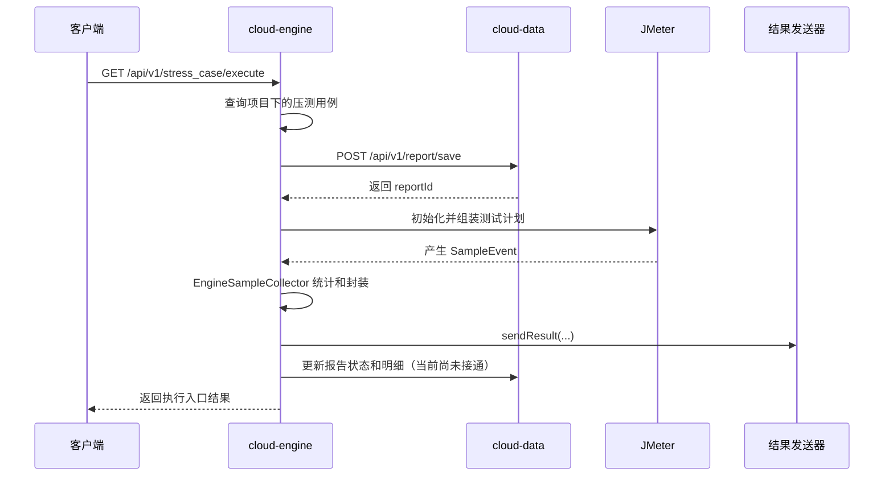

# 自动化测试平台：架构总览

> **原文归档**：[old-java-notes/自动化测试平台](/md/archive/README?id=old-java-notes)
> **当前代码库**：`D:\idea\cloud-meter`
> **本章目标**：先看清平台要解决什么问题、目前代码已经走到哪里，再开始逐个模块复刻。
> **教程边界**：本文按 2026-08-28 看到的代码书写，只把已经出现在 `cloud-meter` 中的内容当作当前实现；归档中的接口自动化、UI 自动化、监控大屏、告警和 DevOps 只作为后续方向。

---

## 一、我们要做的不是“再写一个 JMeter”

JMeter 已经能够执行压测。平台要解决的是 JMeter 单独使用时的工程问题：

- 测试数据散落在脚本和文件里，项目、环境、用例之间没有统一管理。
- 每次压测都要手动准备脚本、启动命令和结果目录。
- 结果只停留在 JMeter 文件或控制台，业务系统无法继续处理。
- 一旦接入多个项目，报告、用例和资源需要有稳定的归属关系。

因此，平台的核心思路是：

```text
项目 / 环境 / 压测模块 / 压测用例
                |
                v
       cloud-engine 负责编排与执行
                |
                +--> 内嵌 JMeter
                +--> 结果采集器
                +--> 结果发送接口
                |
                v
       cloud-data 负责报告数据持久化
```

平台先把“管理和编排”做成自己的能力，再把 JMeter 当作底层执行器。

> 💡 补充：这里把 `项目 / 环境 / 压测模块 / 压测用例 -> cloud-engine -> cloud-data` 画成一条主链，是为了让后续分篇有统一视角；实际代码里这些职责分散在 controller、service、mapper、collector 和消息发送接口中。

## 二、从归档目标收缩到当前代码

归档笔记最初设想的平台包含三类引擎：接口自动化、UI 自动化和压力测试，也包含账号、权限、监控、告警、报告分享等完整 SaaS 能力。

当前 `cloud-meter` 的代码实际落在压力测试这条主线上：

| 能力 | 当前状态 | 代码依据 |
|---|---|---|
| 项目管理 | 已有 CRUD | `cloud-engine/controller/common/ProjectController` |
| 环境管理 | 已有 CRUD | `cloud-engine/controller/common/EnvironmentController` |
| 压测模块 | 已有 CRUD，并可查询模块下用例 | `StressCaseModuleController`、`StressCaseModuleServiceImpl` |
| 压测用例 | 已有保存、更新、查询、删除、执行入口 | `StressCaseController`、`StressCaseServiceImpl` |
| 报告初始化 | `cloud-data` 已有保存报告接口 | `ReportController`、`ReportServiceImpl` |
| JMeter 依赖 | Maven 已引入 JMeter 5.5 相关模块 | 根 `pom.xml`、`cloud-engine/pom.xml` |
| JMeter 运行资源 | 已放入 `cloud-engine/src/main/resources/jmeter` | `StressTestUtil` |
| JMeter 引擎模板 | 已有抽象流程 | `BaseStressEngine` |
| 在线测试计划 | 子引擎类已建立，但组装方法为空 | `StressSimpleEngine` |
| JMX 文件执行 | 子引擎类已建立，但组装方法为空 | `StressJmxEngine` |
| 结果采集 | 已有 `EngineSampleCollector` | `cloud-engine/service/stress/core` |
| Kafka 发送 | 接口和实现类已建立，发送方法为空 | `ResultSenderService`、`KafkaSenderServiceImpl` |
| 报告收尾 | 方法已预留，当前为空 | `BaseStressEngine.updateReport/clearData` |
| 接口自动化 / UI 自动化 | 当前代码没有形成可用闭环 | 不能按已实现能力书写 |

后面的每一篇都遵守这个表：有代码就解释代码，没有代码就明确说“还没有实现”。

## 三、模块怎么分

### 1. `cloud-common`：共享契约

这个模块放跨服务都需要认识的内容：

- `dto`：报告、压测结果等跨模块传输对象。
- `req`：保存报告等请求对象。
- `enums`：测试类型、报告类型、报告状态、压测来源类型。
- `exception`：业务异常和异常处理入口。
- `util`：统一 JSON 返回、对象属性复制、文件工具等。

它不负责某个具体业务，也不应该直接承担项目查询或 JMeter 执行。

### 2. `cloud-engine`：压测业务和执行编排

这个模块运行在 `engine-service`，默认端口是 `8082`。当前职责包括：

- 提供项目、环境、压测模块和压测用例接口。
- 读取压测用例，创建一次报告，然后按 `SIMPLE` 或 `JMX` 选择执行策略。
- 初始化 JMeter，准备 `StandardJMeterEngine`。
- 监听 JMeter 的 `SampleEvent`，把结果封装为 `StressSampleResultDTO`。
- 处理 MinIO 文件上传和临时访问地址。

`cloud-engine` 是平台的业务中枢，但当前执行方法还没有完全接通。

### 3. `cloud-data`：报告数据服务

这个模块运行在 `data-service`，默认端口是 `8081`。当前已经有：

- `report` 表对应的 `ReportDO`。
- `report_detail_stress` 表对应的 `ReportDetailStressDO`。
- MyBatis-Plus Mapper。
- `POST /api/v1/report/save` 报告初始化接口。

目前它更像一个报告数据服务的起点，明细写入、报告查询和报告收尾还没有形成完整 API。

### 4. `cloud-gateway` 与 `cloud-account`

根 POM 已经声明这两个模块，但当前看到的代码主要是基础工程和 `Main` 启动类。归档中关于登录、权限和网关路由的设计，不能当作当前已完成能力。

## 四、一次压测的目标调用链

按照当前代码已经表达出来的意图，一次执行应该经过下面这些步骤：



当前真正已经实现到的是“创建报告前后的编排骨架”和“结果采集类的实现”；JMeter 测试计划组装、两个执行分支、结果发送和报告更新仍需继续完成。

## 五、从 0 的学习顺序

| 顺序 | 先理解什么 | 对应文章 |
|---|---|---|
| 1 | 服务边界和业务对象 | 本篇 |
| 2 | 表模型为什么这样拆 | [项目基础与数据模型](01-项目基础与数据模型.md) |
| 3 | 项目、环境、模块、用例如何落 CRUD | [项目与用例管理](02-项目与用例管理.md) |
| 4 | JMeter 的测试计划和嵌入式初始化 | [JMeter 与嵌入式引擎](03-JMeter与嵌入式引擎.md) |
| 5 | 模板方法、执行引擎和结果事件 | [压测引擎与结果采集](04-压测引擎与结果采集.md) |
| 6 | 复盘当前进度，确定下一步 | [当前进度与未完待续](05-当前进度与未完待续.md) |

## 六、本系列不做的假设

- 不假设 `cloud-account` 已完成登录和权限校验。
- 不假设 `cloud-gateway` 已完成路由和负载均衡。
- 不假设 Kafka、Redis、Nacos、MySQL、MinIO 在本地已经启动。
- 不假设压测执行接口现在可以完整跑出报告。
- 不把归档中的架构图、数据库 SQL 或设计目标当成当前代码事实。

---

## 📚 完整资料

- [自动化测试平台系列目录](_sidebar.md)
- [原始归档来源](/md/archive/README?id=old-java-notes)
- [Apache JMeter](https://jmeter.apache.org/)

## 最新修改记录

| 日期 | 类型 | 说明 |
|---|---|---|
| 2026-08-28 | 新增 | 基于 cloud-meter 当前代码和自动化测试平台归档，建立项目实战教程系列并明确实现边界 |

> 📚 完整历史修改记录见 [修改记录归档](/_meta/CHANGELOG_HISTORY.md)。
